# Contents

1.  [Preface](#preface) 9

> 1.  [前言](#preface) 9

2.  [Acronyms and Abbreviations](#acronyms-and-abbreviations) 10

> 2.  [首字母缩略词和缩写词](#acronyms-and-abbreviations) 10

3.  [Introduction](#introduction) 13

> 3.  [介绍](#introduction) 13

1.  [Approach](#approach) 13

> 1.  [方法](#approach) 13

2.  [API Design Visions and
    Guidelines](#api-design-visions-and-guidelines) 15

> 2.  [API 设计愿景和指南](#api-design-visions-and-guidelines) 15

4.  [Fundamentals](#fundamentals) 17

> 4.  [基础知识](#fundamentals) 17

1.  [Proxy/Skeleton Architecture](#proxyskeleton-architecture) 17

> 1.  [代理/骨架架构](#proxyskeleton-architecture) 17

2.  [Means of Communication](#means-of-communication) 18

> 2.  [通信方式](#means-of-communication) 18

3.  [ara::com Event and Trigger based
    communication](#aracom-event-and-trigger-based-communication) 18

> 3.  [ara::com
>     基于事件和触发的通信](#aracom-event-and-trigger-based-communication)
>     18

4.  [ara::com Method based
    communication](#aracom-method-based-communication) 19

> 4.  [ara::com基于方法的通信](#aracom-method-based-communication) 19

5.  [ara::com Field based
    communication](#aracom-field-based-communication) 20

> 5.  [ara::com基于字段的通信](#aracom-field-based-communication) 20

6.  [Data Type Abstractions](#data-type-abstractions) 21

> 6.  [数据类型抽象](#data-type-abstractions) 21

7.  [Error Handling](#error-handling) 22

> 7.  [错误处理](#error-handling) 22

8.  [Service Connection Approach](#service-connection-approach) 22

> 8.  [服务连接方法](#service-connection-approach) 22

      1. [Instance Identifiers and Instance Specifiers](#instance-identifiers-and-instance-specifiers) 22
      2. [When to use InstanceIdentifier versus InstanceSpecifier](#when-to-use-instanceidentifier-versus-instancespecifier) 25

         1. [Transfer of an InstanceIdentifier](#transfer-of-an-instanceidentifier) 26

5.  [Detailed API description](#detailed-api-description) 27

> 5.  [详细的API描述](#detailed-api-description) 27

1.  [High Level API Structure](#high-level-api-structure) 27

> [高级API结构](#high-level-api-structure) 27

2.  [API Elements](#api-elements) 27

> 2.  [API 元素](#api-elements) 27

3.  [Proxy Class](#proxy-class) 29

> 3.  [代理类](#proxy-class) 29

      1. [Proxy Class API's](#proxy-class-apis) 30
      2. [RadarService Proxy Class Example](#radarservice-proxy-class-example) 30
      3. [Constructor and Handle Concept](#constructor-and-handle-concept) 33
      4. [Finding Services](#finding-services) 34

         1. [Auto Update Proxy instance](#auto-update-proxy-instance) 35
      5. [Events](#events) 38

         1. [Event Subscription and Local Cache](#event-subscription-and-local-cache) 41
         2. [Monitoring Event Subscription](#monitoring-event-subscription) 42
         3. [Accessing Event Data --- aka Samples](#accessing-event-data-aka-samples) 45
         4. [Event Sample Management via SamplePtrs](#event-sample-management-via-sampleptrs) 46
         5. [Event-Driven vs Polling-Based access](#event-driven-vs-polling-based-access) 47
         6. [Buffering Strategies](#buffering-strategies) 49
      6. [Methods](#methods) 52

         1. [One-Way aka Fire-and-Forget Methods](#one-way-aka-fire-and-forget-methods) 54
         2. [Event-Driven vs Polling access to method results](#event-driven-vs-polling-access-to-method-results) 55
         3. [Canceling Method Result](#canceling-method-result) 59
      7. [Fields](#fields) 60
      8. [Triggers](#triggers) 63

4.  [Skeleton Class](#skeleton-class) 63

> 4.  [骨架类](#skeleton-class) 63

      1. [Skeleton Class API's](#skeleton-class-apis) 64
      2. [RadarService Skeleton Class Example](#radarservice-skeleton-class-example) 64
      3. [Instantiation (Constructors)](#instantiation-constructors) 67
      4. [Offering Service instance](#offering-service-instance) 68
      5. [Polling and event-driven processing modes](#polling-and-event-driven-processing-modes) 69

         1. [Polling Mode](#polling-mode) 70
         2. [Event-Driven Mode](#event-driven-mode) 71
      6. [Methods](#methods-1) 73

         1. [One-Way aka Fire-and-Forget Methods](#one-way-aka-fire-and-forget-methods-1) 76
         2. [Raising Application Errors](#raising-application-errors) 76
      7. [Events](#events-1) 78
      8. [Fields](#fields-1) 81

         1. [Registering Getters](#registering-getters) 82
         2. [Registering Setters](#registering-setters) 83
         3. [Ensuring existence of "SetHandler"](#ensuring-existence-of-sethandler) 84
         4. [Ensuring existence of valid Field values](#ensuring-existence-of-valid-field-values) 84
         5. [Access to current field value from Get/SetHandler](#access-to-current-field-value-from-getsethandler) 84
      9. [Triggers](#triggers-1) 84

5.  [Data Types on Service Interface
    level](#data-types-on-service-interface-level) 85

> 5.  [服务接口层的数据类型](#data-types-on-service-interface-level) 85

      1. [Optional data elements](#optional-data-elements) 85

6.  [Raw Data Streaming Interface](#raw-data-streaming-interface) 88

> 6.  [原始数据流接口](#raw-data-streaming-interface) 88

      1. [Introduction](#introduction-1) 88
      2. [Functional description](#functional-description) 89
      3. [Class and Model](#class-and-model) 89

         1. [Class and signatures](#class-and-signatures) 89
         2. [Destructor](#destructor) 90
         3. [Manifest Model](#manifest-model) 90
      4. [Methods of class RawDataStream](#methods-of-class-rawdatastream) 91

         1. [Timeout parameter](#timeout-parameter) 91
         2. [Methods](#methods-2) 91
      5. [Security](#security) 93
      6. [Safety](#safety) 93
      7. [Hints for implementers](#hints-for-implementers) 93

7.  [Communication Groups](#communication-groups) 94

> 7.  [通信群组](#通信群组) 94

      1. [Objective](#objective) 94
      2. [Realization](#realization) 94
      3. [Usage Scope](#usage-scope) 95
      4. [Special Topics](#special-topics) 96

         1. [Architecture](#5.7.4.1_Architecture) 96
         2. [Remote Connection](#remote-connection) 97
         3. [Service Versioning](#service-versioning) 97

6.  [Tutorials](#tutorials) 98

> 6.  [教程](#tutorials) 98

1.  [Usage of Service Interfaces](#usage-of-service-interfaces) 98

> 使用服务接口（#使用服务接口）98

      1. [Service Interface Deployment](#service-interface-deployment) 98
      2. [Service Instance Deployment](#service-instance-deployment) 99
      3. [Service Implementation](#service-implementation) 103

2.  [Usage of InstanceSpecifier](#usage-of-instancespecifier) 104

> 2.  [实例指定符的使用](#usage-of-instancespecifier) 104

      1. [Modeling and configuration/mapping over Manifest from user](#modeling-and-configurationmapping-over-manifest-from-user-perspective) [perspective](#modeling-and-configurationmapping-over-manifest-from-user-perspective) 106
      2. [Instance IDs only for provided Services](#instance-ids-only-for-provided-services) 109

3.  [Usage in context of
    MultiBinding](#usage-in-context-of-multibinding) 109

> 3.  [多绑定上下文中的使用](#usage-in-context-of-multibinding) 109

4.  [Usage of RawDataStreaming](#usage-of-rawdatastreaming) 114

> 4.[原始数据流的使用](#usage-of-rawdatastreaming) 114

      1. [Sequence diagrams](#sequence-diagrams) 114
      2. [Usage](#usage) 116

         1. [Example of usage as server](#example-of-usage-as-server) 116
         2. [Example of usage as client](#example-of-usage-as-client) 117

5.  [Usage of CommunicationGroups](#usage-of-communicationgroups) 118

> 5.  [使用 CommunicationGroups](#usage-of-communicationgroups) 118

      1. [Setup](#setup) 118

         1. [Service Interface Description Generation](#service-interface-description-generation) 118
         2. [Proxy and Skeleton Generation](#proxy-and-skeleton-generation) 120
      2. [Example](#example) 121

7.  [Appendix](#appendix) 125

> 附录（#附录）125

1.  [Serialization](#serialization) 125

> 1.  [序列化](#serialization) 125

      1. [Zero-Copy implications](#zero-copy-implications) 126

2.  [Service Discovery Implementation
    Strategies](#service-discovery-implementation-strategies) 126

> 2.  [服务发现实施策略](#service-discovery-implementation-strategies)
>     126

      1. [Central vs Distributed approach](#central-vs-distributed-approach) 127

3.  [Multi-Binding implications](#multi-binding-implications) 130

> 3.  [多重绑定的影响](#multi-binding-implications) 130

      1. [Simple Multi-Binding use case](#simple-multi-binding-use-case) 130
      2. [Local/Network Multi-Binding use case](#localnetwork-multi-binding-use-case) 133
      3. [Typical SOME/IP Multi-Binding use case](#typical-someip-multi-binding-use-case) 134

4.  [ara::com and AUTOSAR meta-model
    relationship](#aracom-and-autosar-meta-model-relationship) 136

> 4.[ara ::
> com和AUTOSAR元模型关系](#aracom-and-autosar-meta-model-relationship)
> 136

      1. [Connection to AUTOSAR_TR_AdaptiveMethodology](#connection-to-autosar_tr_adaptivemethodology) 137
      2. [Service Interface](#service-interface) 137
      3. [Software Component](#software-component) 138
      4. [Adaptive Application/Executables and Processes](#adaptive-applicationexecutables-and-processes) 140
      5. [Usage of meta-model identifiers within ara::com based appli-](#usage-of-meta-model-identifiers-within-aracom-based-application-code) [cation code](#usage-of-meta-model-identifiers-within-aracom-based-application-code) 141

5.  [Abstract Protocol Network Binding
    Examples](#abstract-protocol-network-binding-examples) 143

> 5.  [抽象协议网络绑定示例](#abstract-protocol-network-binding-examples)
>     143

**References**

1.  \[\]{#\_bookmark0 .anchor}Specification of Communication Management
    \[\]{#\_bookmark1 .anchor}AUTOSAR_SWS_CommunicationManagement

> 软件通信管理规范AUTOSAR_SWS_CommunicationManagement

2.  Specification of Manifest \[\]{#\_bookmark2
    .anchor}AUTOSAR_TPS_ManifestSpecification

> 2.  清单规范\[\]{#\_bookmark2
>     .anchor}AUTOSAR_TPS_ManifestSpecification

3.  Specification of Adaptive Platform Core \[\]{#\_bookmark3
    .anchor}AUTOSAR_SWS_AdaptivePlatformCore

> 3.  自适应平台核心规范\[\]{#\_bookmark3
>     .anchor}AUTOSAR_SWS_AdaptivePlatformCore

4.  Specification of State Management \[\]{#\_bookmark4
    .anchor}AUTOSAR_SWS_StateManagement

> 4.  AUTOSAR_SWS_状态管理的规范

5.  Software Component Template \[\]{#\_bookmark5
    .anchor}AUTOSAR_TPS_SoftwareComponentTemplate

> 5.软件组件模板\[\]（＃\_bookmark5
> .anchor）AUTOSAR_TPS_SoftwareComponentTemplate

6.  Specification of RTE Software \[\]{#\_bookmark6
    .anchor}AUTOSAR_SWS_RTE

> 6.  软件RTE规范\[\]{#\_bookmark6 .anchor}AUTOSAR_SWS_RTE

7.  Middleware for Real-time and Embedded Systems \[\]{#\_bookmark7
    .anchor}<http://doi.acm.org/10.1145/508448.508472>

> 中间件用于实时和嵌入式系统<http://doi.acm.org/10.1145/508448.508472>

8.  Patterns, Frameworks, and Middleware: Their Synergistic
    Relationships \[\]{#\_bookmark8
    .anchor}<http://dl.acm.org/citation.cfm?id=776816.776917>

> 模式、框架和中间件：它们的协同关系

9.  SOME/IP Protocol Specification \[\]{#\_bookmark9
    .anchor}AUTOSAR_PRS_SOMEIPProtocol

> 9.  AUTOSAR PRS SOME/IP 协议规范

10. E2E Protocol Specification \[\]{#\_bookmark10
    .anchor}AUTOSAR_PRS_E2EProtocol

> 10. AUTOSAR PRS E2E 协议规范

11. Serialization and Unserialization \[\]{#\_bookmark11
    .anchor}<https://isocpp.org/wiki/faq/serialization>

> 11. 序列化和反序列化 <https://isocpp.org/wiki/faq/serialization>

12. Copying and Comparing: Problems and Solutions \[\]{#\_bookmark12
    .anchor}<http://dx.doi.org/10.1007/3-540-45102-1_11>

> 复制和比较：问题与解决方案\[\]{#\_bookmark12
> .anchor}<http://dx.doi.org/10.1007/3-540-45102-1_11>

13. SOME/IP Service Discovery Protocol Specification
    AUTOSAR_PRS_SOMEIPServiceDiscoveryProtocol

> 13. AUTOSAR_PRS_SOMEIP服务发现协议规范

# Preface

Typically, reading formal specifications isn't the easiest way to learn
and understand a certain technology. This especially holds true for the
Communication Management API ([ara::com](#_bookmark15)) in the AUTOSAR
Adaptive Platform.

> 一般来说，阅读正式规范并不是学习和理解某项技术的最简单方式。这对于AUTOSAR
> Adaptive平台中的通信管理API([ara::com](#_bookmark15))尤其如此。

Therefore this document shall serve as an entry point not only for the
developer of software components for the Adaptive Platform, who will use
the [ara::com](#_bookmark15) API to interact with other application or
service components, but also for Adaptive Platform product vendors, who
are going to implement an optimized[IPC](#_bookmark70)binding for the
[ara::-](#_bookmark15) [com](#_bookmark15) API on their platform.

> 因此，本文档不仅将为软件组件开发者提供一个入口点，他们将使用[ara::com](#_bookmark15)
> API与其他应用程序或服务组件进行交互，而且还将为Adaptive
> Platform产品供应商提供一个入口点，他们将在其平台上实现[IPC](#_bookmark70)绑定的[ara::-](#_bookmark15)
> [com](#_bookmark15) API的优化实现。

We strongly encourage both groups of readers to read this document at
hand before going into the formal details of the related SWS.

> 我们强烈鼓励两组读者在进入相关SWS的正式细节之前，先阅读手头的文件。

# Acronyms and Abbreviations

The glossary below includes acronyms and abbreviations relevant to the
explanation of ara::com API.

> 以下词汇表包括与ara::com API解释相关的缩略词和缩写。

+---------------+----------------------------------------------+---+---+---+
| \[\]{         | **Description:**                             |   |   |   |
| #\_bookmark15 |                                              |   |   |   |
| .anchor}*     |                                              |   |   |   |
| *Abbreviation |                                              |   |   |   |
| / Acronym:**  |                                              |   |   |   |
+===============+==============================================+===+===+===+
| ara::com      | C++ namespace of functional cluster          |   |   |   |
|               | Communication Manage-                        |   |   |   |
|               |                                              |   |   |   |
|               | \[\]{#\_bookmark16 .anchor}ment              |   |   |   |
+---------------+----------------------------------------------+---+---+---+
| ara::com::raw | C++ namespace of Raw Data Stream API         |   |   |   |
|               | according to \[SWS\_-                        |   |   |   |
|               |                                              |   |   |   |
|               | \[\]{#\_bookmark17 .anchor}CM_10481\] of     |   |   |   |
|               | \[[1](#_bookmark0)\]                         |   |   |   |
+---------------+----------------------------------------------+---+---+---+
| ara::com      | RawDataStreamClient class according to       |   |   |   |
| ::raw::RawDat | \[SWS_CM_10481\] of                          |   |   |   |
| aStreamClient |                                              |   |   |   |
|               | \[\]{#\_bookmark18                           |   |   |   |
|               | .anchor}\[[1](#_bookmark0)\]                 |   |   |   |
+---------------+----------------------------------------------+---+---+---+
| ara::com      | RawDataStreamServer class according to       |   |   |   |
| ::raw::RawDat | \[SWS_CM_11311\] of                          |   |   |   |
| aStreamServer |                                              |   |   |   |
|               | \[\]{#\_bookmark19                           |   |   |   |
|               | .anchor}\[[1](#_bookmark0)\]                 |   |   |   |
+---------------+----------------------------------------------+---+---+---+
| \[\]{         | RawDataStreamMapping according to            |   |   |   |
| #\_bookmark20 | \[TPS_MANI_01287\] of \[[2](#_bookmark1)\]   |   |   |   |
| .a            |                                              |   |   |   |
| nchor}RawData |                                              |   |   |   |
| StreamMapping |                                              |   |   |   |
+---------------+----------------------------------------------+---+---+---+
| Et            | EthernetRawDataStreamMapping in accordance   |   |   |   |
| hernetRawData | to \[TPS\_-                                  |   |   |   |
| StreamMapping |                                              |   |   |   |
|               | \[\]{#\_bookmark21 .anchor}MANI_01355\] of   |   |   |   |
|               | \[[2](#_bookmark1)\]                         |   |   |   |
+---------------+----------------------------------------------+---+---+---+
| COMMUNICATION | COMMUNICATION_GROUP_SERVER                   | a | t | \ |
| _GROUP_SERVER |                                              | c | o | [ |
|               | \[\]{#\_bookmark22 .anchor}MANI_03628\] of   | c |   | T |
|               | \[[2](#_bookmark1)\]                         | o |   | P |
|               |                                              | r |   | S |
|               |                                              | d |   | \ |
|               |                                              | i |   | _ |
|               |                                              | n |   | - |
|               |                                              | g |   |   |
+---------------+----------------------------------------------+---+---+---+
| COMMUNICATION | COMMUNICATION_GROUP_CLIENT                   | a | t | \ |
| _GROUP_CLIENT |                                              | c | o | [ |
|               | \[\]{#\_bookmark23 .anchor}MANI_03628\] of   | c |   | T |
|               | \[[2](#_bookmark1)\]                         | o |   | P |
|               |                                              | r |   | S |
|               |                                              | d |   | \ |
|               |                                              | i |   | _ |
|               |                                              | n |   | - |
|               |                                              | g |   |   |
+---------------+----------------------------------------------+---+---+---+
| \[\]{         | C++ constructor                              |   |   |   |
| #\_bookmark24 |                                              |   |   |   |
| .anchor}ctor  |                                              |   |   |   |
+---------------+----------------------------------------------+---+---+---+
| \[\]{         | C++ destructor                               |   |   |   |
| #\_bookmark25 |                                              |   |   |   |
| .anchor}dtor  |                                              |   |   |   |
+---------------+----------------------------------------------+---+---+---+
| std::future   | C++ std::future provides a mechanism to      |   |   |   |
|               | access the result of                         |   |   |   |
|               |                                              |   |   |   |
|               | \[\]{#\_bookmark26 .anchor}asynchronous      |   |   |   |
|               | operations                                   |   |   |   |
+---------------+----------------------------------------------+---+---+---+
| std::promise  | C++ std::promise provides a facility to      |   |   |   |
|               | store a value or an excep-                   |   |   |   |
|               |                                              |   |   |   |
|               | tion that is later acquired asynchronously   |   |   |   |
|               | via a std::future object \[\]{#\_bookmark27  |   |   |   |
|               | .anchor}created by the std::promise object   |   |   |   |
+---------------+----------------------------------------------+---+---+---+
| Error         | Recoverable Errors according to              |   |   |   |
|               | \[SWS_CORE_00020\] of \[[3](#_bookmark2)\].  |   |   |   |
|               |                                              |   |   |   |
|               | Defined for [ara::com](#_bookmark15)         |   |   |   |
|               | functions using ara::Core::Error-            |   |   |   |
|               | \[\]{#\_bookmark28 .anchor}Codes,            |   |   |   |
|               | e.g. according to \[SWS_CM_10432\] of        |   |   |   |
|               | \[[1](#_bookmark0)\]                         |   |   |   |
+---------------+----------------------------------------------+---+---+---+
| \[\]{         | ara::core::ErrorCode according to            |   |   |   |
| #\_bookmark29 | \[SWS_CORE_00501\] of \[[3](#_bookmark2)\]   |   |   |   |
| .a            |                                              |   |   |   |
| nchor}ara::co |                                              |   |   |   |
| re::ErrorCode |                                              |   |   |   |
+---------------+----------------------------------------------+---+---+---+
| \[\]{         | Violation according to \[SWS_CORE_00021\] of |   |   |   |
| #\_bookmark30 | \[[3](#_bookmark2)\]                         |   |   |   |
| .anc          |                                              |   |   |   |
| hor}Violation |                                              |   |   |   |
+---------------+----------------------------------------------+---+---+---+
| \[\]{         | Corruption according to \[SWS_CORE_00022\]   |   |   |   |
| #\_bookmark31 | of \[[3](#_bookmark2)\]                      |   |   |   |
| .anch         |                                              |   |   |   |
| or}Corruption |                                              |   |   |   |
+---------------+----------------------------------------------+---+---+---+
| \[\]{         | ara::com Instance Identifier according to    |   |   |   |
| #\_bookmark32 | \[SWS_CM_00302\] of \[[1](#_bookmark0)\]     |   |   |   |
| .anchor}ar    |                                              |   |   |   |
| a::com::Insta |                                              |   |   |   |
| nceIdentifier |                                              |   |   |   |
+---------------+----------------------------------------------+---+---+---+
| ara::com::I   | ara::com Instance Identifier Container       |   |   |   |
| nstanceIdenti | according to \[SWS_CM\_-                     |   |   |   |
| fierContainer |                                              |   |   |   |
|               | \[\]{#\_bookmark33 .anchor}00319\] of        |   |   |   |
|               | \[[1](#_bookmark0)\]                         |   |   |   |
+---------------+----------------------------------------------+---+---+---+
| ara::com::C   | ara::com::ComErrorDomain according to        |   |   |   |
| omErrorDomain | \[SWS_CM_10432\] of                          |   |   |   |
|               |                                              |   |   |   |
|               | \[\]{#\_bookmark34                           |   |   |   |
|               | .anchor}\[[1](#_bookmark0)\]                 |   |   |   |
+---------------+----------------------------------------------+---+---+---+
| ara           | ara::com::e2e::E2EErrorDomain according to   |   |   |   |
| ::com::e2e::E | \[SWS_CM_10474\]                             |   |   |   |
| 2EErrorDomain |                                              |   |   |   |
|               | \[\]{#\_bookmark35 .anchor}of                |   |   |   |
|               | \[[1](#_bookmark0)\]                         |   |   |   |
+---------------+----------------------------------------------+---+---+---+
| \[\]{         | Returned result object according to          |   |   |   |
| #\_bookmark36 | \[SWS_CORE_00701\] of \[[3](#_bookmark2)\]   |   |   |   |
| .anchor}ara:  |                                              |   |   |   |
| :core::Result |                                              |   |   |   |
+---------------+----------------------------------------------+---+---+---+
| \[\]{         | Returned future object according to          |   |   |   |
| #\_bookmark37 | \[SWS_CORE_00322\] of \[[3](#_bookmark2)\]   |   |   |   |
| .anchor}ara:  |                                              |   |   |   |
| :core::Future |                                              |   |   |   |
+---------------+----------------------------------------------+---+---+---+
| ara::         | Returned promise object according to         |   |   |   |
| core::Promise | \[SWS_CORE_00341\] of                        |   |   |   |
|               |                                              |   |   |   |
|               | \[\]{#\_bookmark38                           |   |   |   |
|               | .anchor}\[[3](#_bookmark2)\]                 |   |   |   |
+---------------+----------------------------------------------+---+---+---+
| ara::c        | Provides access to optional record elements  |   |   |   |
| ore::Optional | according to                                 |   |   |   |
|               |                                              |   |   |   |
|               | \[\]{#\_bookmark39                           |   |   |   |
|               | .anchor}\[SWS_CORE_01033\] of                |   |   |   |
|               | \[[3](#_bookmark2)\]                         |   |   |   |
+---------------+----------------------------------------------+---+---+---+
| \[\]{         | GetResult according to \[SWS_CORE_00336\] of |   |   |   |
| #\_bookmark40 | \[[3](#_bookmark2)\]                         |   |   |   |
| .a            |                                              |   |   |   |
| nchor}ara::co |                                              |   |   |   |
| re::GetResult |                                              |   |   |   |
+---------------+----------------------------------------------+---+---+---+
| \[\]{         | SubscriptionState according to               |   |   |   |
| #\_bookmark41 | \[SWS_CM_00310\] of \[[1](#_bookmark0)\]     |   |   |   |
| .an           |                                              |   |   |   |
| chor}ara::com |                                              |   |   |   |
| Subs          |                                              |   |   |   |
| criptionState |                                              |   |   |   |
+---------------+----------------------------------------------+---+---+---+
| ara::com      | MethodCallProcessingMode according to        |   |   |   |
| MethodCallP   | \[SWS_CM_00301\] of                          |   |   |   |
| rocessingMode |                                              |   |   |   |
|               | \[\]{#\_bookmark42                           |   |   |   |
|               | .anchor}\[[1](#_bookmark0)\]                 |   |   |   |
+---------------+----------------------------------------------+---+---+---+
| ar            | ara::core Instance Specifier according to    |   |   |   |
| a::core::Inst | \[SWS_CORE_08001\]                           |   |   |   |
| anceSpecifier |                                              |   |   |   |
|               | and following of \[[3](#_bookmark2)\]        |   |   |   |
+---------------+----------------------------------------------+---+---+---+

+----------------------------+-----------------------------------------+
| \[\]{#\_bookmark43         | **Description:**                        |
| .anchor}**Abbreviation /   |                                         |
| Acronym:**                 |                                         |
+============================+=========================================+
| ara::com::HandleType       | ara::com HandleType according to        |
|                            | \[SWS_CM_00312\] and follow-            |
|                            |                                         |
|                            | \[\]{#\_bookmark44 .anchor}ing of       |
|                            | \[[1](#_bookmark0)\]                    |
+----------------------------+-----------------------------------------+
| a                          | ara::com FindServiceHandle according to |
| ra::com::FindServiceHandle | \[SWS_CM_00303\]                        |
|                            |                                         |
|                            | \[\]{#\_bookmark45 .anchor}and          |
|                            | following of \[[1](#_bookmark0)\]       |
+----------------------------+-----------------------------------------+
| ar                         | ara::com FindServiceHandler according   |
| a::com::FindServiceHandler | to \[SWS_CM_00383\]                     |
|                            |                                         |
|                            | and following of \[[1](#_bookmark0)\]   |
+----------------------------+-----------------------------------------+
| ara::com::SamplePtr        | ara::com::SamplePtr according to        |
|                            | \[SWS_CM_00702\] and follow-            |
|                            |                                         |
|                            | ing of \[[1](#_bookmark0)\]             |
+----------------------------+-----------------------------------------+
| ar                         | ara::com::SampleAllocateePtr according  |
| a::com::SampleAllocateePtr | to \[SWS_CM_00308\]                     |
|                            |                                         |
|                            | \[\]{#\_bookmark46 .anchor}and          |
|                            | \[SWS_CM_00306\] and following of       |
|                            | \[[1](#_bookmark0)\]                    |
+----------------------------+-----------------------------------------+
| Proxy::Event::Subscribe    | EventSubscribe according to             |
|                            | \[SWS_CM_00141\] of                     |
|                            | \[[1](#_bookmark0)\]                    |
+----------------------------+-----------------------------------------+
| \[\]{#\_bookmark47         | TriggerEventSubscribe according to      |
| .anchor                    | \[SWS_CM_00723\] of                     |
| }Proxy::Trigger::Subscribe | \[[1](#_bookmark0)\]                    |
+----------------------------+-----------------------------------------+
| Proxy::Event::Unsubscribe  | EventUnsubscribe according to           |
|                            | \[SWS_CM_00151\] of                     |
|                            | \[[1](#_bookmark0)\]                    |
+----------------------------+-----------------------------------------+
| \[\]{#\_bookmark48         | TriggerUnsubscribe according to         |
| .anchor}P                  | \[SWS_CM_00151\] of                     |
| roxy::Trigger::Unsubscribe | \[[1](#_bookmark0)\]                    |
+----------------------------+-----------------------------------------+
| \[\]{#\_bookmark49         | GetSubscriptionState according to       |
| .anchor}P                  | \[SWS_CM_00316\] of                     |
| roxy::GetSubscriptionState | \[[1](#_bookmark0)\]                    |
+----------------------------+-----------------------------------------+
| Proxy::S                   | GetSubscriptionState according to       |
| etSubscriptionStateHandler | \[SWS_CM_00333\] of                     |
|                            | \[[1](#_bookmark0)\]                    |
+----------------------------+-----------------------------------------+
| Proxy::S                   | SetSubscriptionState with ExecutorT     |
| etSubscriptionStateHandler | according to \[SWS_CM\_-                |
| with Ex-                   |                                         |
|                            | 11354\] of \[[1](#_bookmark0)\]         |
| \[\]{#\_bookmark50         |                                         |
| .anchor}ecutorT            |                                         |
+----------------------------+-----------------------------------------+
| Proxy::UnsetSubs           | UnsetSubscriptionStateChangeHandler     |
| criptionStateChangeHandler | according to \[SWS\_-                   |
|                            |                                         |
|                            | \[\]{#\_bookmark51 .anchor}CM_00334\]   |
|                            | of \[[1](#_bookmark0)\]                 |
+----------------------------+-----------------------------------------+
| Proxy::GetNewSamples       | GetNewSamples according to              |
|                            | \[SWS_CM_00701\] of                     |
|                            | \[[1](#_bookmark0)\]                    |
+----------------------------+-----------------------------------------+
| Proxy::GetNewSamples with  | GetNewSamples with ExecutorT according  |
| ExecutorT                  | to \[SWS_CM_11358\]                     |
|                            |                                         |
|                            | \[\]{#\_bookmark52 .anchor}of           |
|                            | \[[1](#_bookmark0)\]                    |
+----------------------------+-----------------------------------------+
| \[\]{#\_bookmark53         | GetFreeSampleCount according to         |
| .anchor                    | \[SWS_CM_00705\] of                     |
| }Proxy::GetFreeSampleCount | \[[1](#_bookmark0)\]                    |
+----------------------------+-----------------------------------------+
| Proxy::SetReceiveHandler   | SetReceiveHandler according to          |
|                            | \[SWS_CM_00181\] of                     |
|                            | \[[1](#_bookmark0)\]                    |
+----------------------------+-----------------------------------------+
| Proxy::SetReceiveHandler   | SetReceiveHandler with ExecutorT        |
| with ExecutorT             | according to \[SWS_CM\_-                |
|                            |                                         |
|                            | 11356\] of \[[1](#_bookmark0)\]         |
+----------------------------+-----------------------------------------+
| \[\]{#\_bookmark54         | TriggerSetReceiveHandler according to   |
| .anchor}Proxy::Trigger     | \[SWS_CM_00249\] of                     |
| SetReceiveHandler          | \[[1](#_bookmark0)\]                    |
+----------------------------+-----------------------------------------+
| \[\]{#\_bookmark55         | UnsetReceiveHandler according to        |
| .anchor}                   | \[SWS_CM_00183\] of                     |
| Proxy::UnsetReceiveHandler | \[[1](#_bookmark0)\]                    |
+----------------------------+-----------------------------------------+
| \[\]{#\_bookmark56         | ResolveInstanceIDs according to         |
| .anchor                    | \[SWS_CM_00118\] of                     |
| }Proxy::ResolveInstanceIDs | \[[1](#_bookmark0)\]                    |
+----------------------------+-----------------------------------------+
| \[\]{#\_bookmark57         | FieldGet according to \[SWS_CM_00112\]  |
| .anchor}Proxy::Field Get   | of \[[1](#_bookmark0)\]                 |
+----------------------------+-----------------------------------------+
| \[\]{#\_bookmark58         | FieldSet according to \[SWS_CM_00113\]  |
| .anchor}Proxy::Field Set   | of \[[1](#_bookmark0)\]                 |
+----------------------------+-----------------------------------------+
| Proxy::FindService         | FindService according to                |
|                            | \[SWS_CM_00622\] of                     |
|                            | \[[1](#_bookmark0)\]                    |
+----------------------------+-----------------------------------------+
| Proxy::FindService with    | FindService with Instance Specifier     |
| Instance Specifier         | according to \[SWS_CM\_-                |
|                            |                                         |
|                            | \[\]{#\_bookmark59 .anchor}00623\] of   |
|                            | \[[1](#_bookmark0)\]                    |
+----------------------------+-----------------------------------------+
| Proxy::StartFindService    | StartFindService according to           |
|                            | \[SWS_CM_00123\] of                     |
|                            | \[[1](#_bookmark0)\]                    |
+----------------------------+-----------------------------------------+
| Proxy::StartFindService    | StartFindService with ExecutorT         |
| with ExecutorT             | according to \[SWS_CM_11352\]           |
|                            |                                         |
|                            | \[\]{#\_bookmark60 .anchor}of           |
|                            | \[[1](#_bookmark0)\]                    |
+----------------------------+-----------------------------------------+
| \[\]{#\_bookmark61         | StopFindService according to            |
| .anc                       | \[SWS_CM_00125\] of                     |
| hor}Proxy::StopFindService | \[[1](#_bookmark0)\]                    |
+----------------------------+-----------------------------------------+
| \[\]{#\_bookmark62         | OfferService according to               |
| .anc                       | \[SWS_CM_00101\] of                     |
| hor}Skeleton::OfferService | \[[1](#_bookmark0)\]                    |
+----------------------------+-----------------------------------------+
| Skeleton::StopOfferService | StopOfferService according to           |
|                            | \[SWS_CM_00111\] of                     |
|                            | \[[1](#_bookmark0)\]                    |
+----------------------------+-----------------------------------------+
| \[\]{#\_bookmark63         | Trigger::Send according to              |
| .anchor}Skeleton::Trigger  | \[SWS_CM_00721\] of                     |
| Send                       | \[[1](#_bookmark0)\]                    |
+----------------------------+-----------------------------------------+
| \[\]{#\_bookmark64         | Event::Send according to                |
| .an                        | \[SWS_CM_00162\] of                     |
| chor}Skeleton::Event::Send | \[[1](#_bookmark0)\]                    |
+----------------------------+-----------------------------------------+
| \[\]{#\_bookmark65         | Allocate according to \[SWS_CM_90438\]  |
| .anchor}Skeleton::Allocate | of \[[1](#_bookmark0)\]                 |
+----------------------------+-----------------------------------------+
| Skeleton::Send with        | Send with SampleAllocateePtr according  |
| SampleAllocateePtr         | to \[SWS_CM_90437\]                     |
|                            |                                         |
|                            | \[\]{#\_bookmark66 .anchor}of           |
|                            | \[[1](#_bookmark0)\]                    |
+----------------------------+-----------------------------------------+
| Skele                      | ProcessNextMethodCall according to      |
| ton::ProcessNextMethodCall | \[SWS_CM_00199\] of                     |
|                            | \[[1](#_bookmark0)\]                    |
+----------------------------+-----------------------------------------+
| > Skele                    | ProcessNextMethodCall with ExecutorT    |
| ton::ProcessNextMethodCall | according to \[SWS\_-                   |
| > with Ex-                 |                                         |
|                            | CM_11350\] of \[[1](#_bookmark0)\]      |
| \[\]{#\_bookmark67         |                                         |
| .anchor}ecutorT            |                                         |
+----------------------------+-----------------------------------------+
| Sk                         | RegisterGetHandler according to         |
| eleton::RegisterGetHandler | \[SWS_CM_00114\] of                     |
|                            | \[[1](#_bookmark0)\]                    |
+----------------------------+-----------------------------------------+
| Sk                         | RegisterGetHandler with ExecutorT       |
| eleton::RegisterGetHandler | according to \[SWS_CM\_-                |
| with Execu-                |                                         |
|                            | 11360\] of \[[1](#_bookmark0)\]         |
| \[\]{#\_bookmark68         |                                         |
| .anchor}torT               |                                         |
+----------------------------+-----------------------------------------+
| Sk                         | RegisterSetHandler according to         |
| eleton::RegisterSetHandler | \[SWS_CM_00116\] of                     |
|                            | \[[1](#_bookmark0)\]                    |
+----------------------------+-----------------------------------------+

+---------------------------+-------------------------------------------+
| **Abbreviation /          | **Description:**                          |
| Acronym:**                |                                           |
+===========================+===========================================+
| Ske                       | RegisterSetHandler with Executor          |
| leton::RegisterSetHandler | according to \[SWS_CM\_-                  |
| with Executort            |                                           |
|                           | \[\]{#\_bookmark69 .anchor}11362\] of     |
|                           | \[[1](#_bookmark0)\]                      |
+---------------------------+-------------------------------------------+
| \[\]{#\_bookmark70        | Update according to \[SWS_CM_00119\] of   |
| .anchor}Skeleton::Field   | \[[1](#_bookmark0)\]                      |
| Update                    |                                           |
+---------------------------+-------------------------------------------+
| IPC                       | Inter Process Communication               |
+---------------------------+-------------------------------------------+
| \[\]{#\_bookmark71        | Realtime                                  |
| .anchor}RT                |                                           |
+---------------------------+-------------------------------------------+
| SI                        | Service Interface                         |
+---------------------------+-------------------------------------------+
| \[\]{#\_bookmark72        | Worst Case Execution Time                 |
| .anchor}WET               |                                           |
+---------------------------+-------------------------------------------+
| \[\]{#\_bookmark73        | PowerMode according to \[SWS_SM_91020\]   |
| .anchor}PowerMode         | of \[[4](#_bookmark3)\]                   |
+---------------------------+-------------------------------------------+
| \[\]{#\_bookmark74        | DiagnosticReset according to              |
| .anchor}DiagnosticReset   | \[SWS_SM_91015\] of \[[4](#_bookmark3)\]  |
+---------------------------+-------------------------------------------+
| \[\]{#\_bookmark75        | FieldSenderComSpec according to           |
| .                         | \[TPS_MANI_03211\] of                     |
| anchor}FieldSenderComSpec | \[[2](#_bookmark1)\]                      |
+---------------------------+-------------------------------------------+
| \[\]{#\_bookmark76        | PPortPrototype according to               |
| .anchor}PPortPrototype    | \[TPS_SWCT_01111\] of                     |
|                           | \[[5](#_bookmark4)\]                      |
+---------------------------+-------------------------------------------+
| CppImplementationDataType | CppImplementationDataType according to    |
|                           | \[TPS_MANI_01166\]                        |
|                           |                                           |
|                           | of \[[2](#_bookmark1)\]                   |
+---------------------------+-------------------------------------------+

+------+---------------------------------------------------------------+
| **   | **Description:**                                              |
| Term |                                                               |
| s:** |                                                               |
+======+===============================================================+
| Bin  | This typically describes the realization of some abstract     |
| ding | concept                                                       |
|      |                                                               |
|      | with a specific implementation or technology.                 |
|      |                                                               |
|      | In AUTOSAR, for instance, we have an abstract data type and   |
|      | interface model described in the methodology.                 |
|      |                                                               |
|      | Mapping it to a concrete programming language is called *lan- |
|      | guage binding*. In the AUTOSAR Adaptive Platform for instance |
|      | we do have a C++ language binding.                            |
|      |                                                               |
|      | In this explanatory document we typically use the tech term   |
|      | *bind- ing* to refer to the implementation of the abstract    |
|      | (technology in- dependent) ara::com API to a concrete         |
|      | communication transport                                       |
|      |                                                               |
|      | \[\]{#\_bookmark77 .anchor}technology like for instance       |
|      | sockets, pipes, shared memory, \...                           |
+------+---------------------------------------------------------------+
| Call | In the context of C++ a Callable is defined as: A Callable    |
| able | type is a                                                     |
|      |                                                               |
|      | type for which the INVOKE operation (used by, e.g.,           |
|      | std::function, std::bind, and std::thread::thread) is         |
|      | applicable. This operation may be performed explicitly using  |
|      | the library function std::invoke. (since C++17)               |
+------+---------------------------------------------------------------+

3.  # Introduction

    1.  ## Approach

Why did AUTOSAR invent yet another communication middleware
API/technology, while there are dozens on the market --- the more so as
one of the guidelines of Adap- tive Platform was to reuse existing and
field proven technology?

> 为什么AUTOSAR发明了另一种通信中间件API/技术，而市场上已经有几十种了，更何况Adaptive
> Platform的一个准则是重用现有和经过验证的技术呢？

Before coming up with a new middleware design, we did evaluate existing
technologies, which --- at first glance --- seemed to be valid
candidates. Among those were:

> 在设计新的中间件之前，我们确实评估了现有技术，乍一看似乎是合理的候选项。其中包括：

-   ROS API
-   DDS API
-   CommonAPI (GENIVI)
-   DADDY API (Bosch)

The final decision to come up with a new and AUTOSAR-specific
Communication Man- agement API was made due to the fact, that not all of
our key requirements were met by existing solutions:

> 最终决定推出新的和AUTOSAR专用的通信管理API是由于现有解决方案未能满足我们的所有关键要求：

-   We need a Communication Management, which is NOT bound to a concrete
    network communication protocol. It has to support the SOME/IP
    protocol but there has to be flexibility to exchange that.

> 我们需要一个不局限于具体网络通信协议的通信管理系统。它必须支持SOME/IP协议，但也必须有可替换的灵活性。

-   The AUTOSAR service model, which defines services as a collection of
    provided methods, events and fields shall be supported
    naturally/straight forward.

> AUTOSAR服务模型，它将服务定义为提供的方法、事件和字段的集合，应自然/直接支持。

-   The API shall support an event-driven and a polling model to get
    access to com- municated data equally well. The latter one is
    typically needed by real-time ap- plications to avoid unnecessary
    context switches, while the former one is much more convenient for
    applications without real-time requirements.

> API应该同样支持事件驱动和轮询模型来获取通信数据。后者通常被实时应用程序需要，以避免不必要的上下文切换，而前者则对于没有实时要求的应用程序来说更加方便。 -
> Possibility for seamless integration of end-to-end protection to
> fulfill ASIL require- ments.

-   Support for static (preconfigured) and dynamic (runtime) selection
    of service in- stances to communicate with.

> 支持静态（预先配置）和动态（运行时）选择要与之通信的服务实例。

So in the final [ara::com](#_bookmark15) API specification, the reader
will find concepts (which we will describe in-depth in the upcoming
chapters), which might be familiar for him from technologies, we have
evaluated or even from the existing Classic Platform:

> 在最终的[ara::com](#_bookmark15) API
> 规范中，读者将会发现一些概念（我们将在接下来的章节中详细描述），这些概念可能会让他们想起我们评估过的技术，甚至是现有的经典平台：

-   Proxy (or Stub)/Skeleton approach (CORBA, Ice, CommonAPI, Java RMI,
    \...)
-   Protocol independent API (CommonAPI, Java RMI)
-   Queued communication with configurable receiver-side caches (DDS,
    DADDY, Classic Platform)
-   Zero-copy capable API with possibility to shift memory management to
    the mid- dleware (DADDY)
-   Data reception filtering (DDS, DADDY)

Now that we have established the introduction of a new middleware API,
we go into the details of the API in the following chapters.

> 现在我们已经建立了新的中间件API的介绍，我们将在接下来的章节中详细介绍该API。

The following statement is the basis for basically all AUTOSAR AP
specifications, but should be explicitly pointed out here again:

> 以下声明是基本上所有AUTOSAR AP规范的基础，但应该在这里再次明确指出：

[ara::com](#_bookmark15) only defines the API signatures and its
behavior visible to the appli- cation developer. Providing an
implementation of those APIs and the underlying middleware transport
layer is the responsibility of the AUTOSAR AP vendor.

> [ara::com](#_bookmark15)仅定义了应用程序开发人员可见的API签名和其行为。提供这些API的实现以及底层中间件传输层的责任由AUTOSAR
> AP供应商承担。

For a rough parallel with the AUTOSAR Classic Platform,
[ara::com](#_bookmark15) can be seen as fulfilling functional
requirements in the Adaptive Platform similar to those covered in the
Classic Platform by the RTE APIs \[[6](#_bookmark5)\] such as Rte_Write,
Rte_Read, Rte_Send, Rte_Receive, Rte_Call, Rte_Result.

> 为了与AUTOSAR Classic Platform形成粗略的平行，[ara::com](#_bookmark15)
> 可以被视为在Adaptive Platform中满足类似于RTE API
> \[[6](#_bookmark5)\]中的Rte_Write，Rte_Read，Rte_Send，Rte_Receive，Rte_Call和Rte_Result在Classic
> Platform中涵盖的功能要求。

Overview of Modeling elements and how they are related to each other:
[SI](#_bookmark71), Deploy- ment, Actual generation dependant from
provided Deployment Information (E.g. also [SI](#_bookmark71) Elements
that will be generated later and connection to Service Instance
Manifest)

> 模型元素概述及其相互关系：\[SI\]（＃\_bookmark71），部署，实际生成取决于提供的部署信息（例如，也\[SI\]（＃\_bookmark71）元素，稍后将生成，与服务实例清单的连接）

AUTOSAR Adaptive Platform methodology explains the process aspects
necessary to build an Adaptive AUTOSAR system and how they relate to
each other \[TR_AMETH\_- 00100\]. It defines activities and work
products delivered or consumed \[TR_AMETH\_- 00102\] and the Roles
performed by OEMs and suppliers.

> AUTOSAR Adaptive Platform 方法论解释了构建一个Adaptive
> AUTOSAR系统所必需的过程方面，以及它们之间的关系\[TR_AMETH-00100\]。它定义了OEMs和供应商执行的活动和工作产品\[TR_AMETH-00102\]。

Major steps involved in the development of Adaptive Software are

> 主要参与自适应软件开发的步骤有：

-   Architecture and Design
-   Adaptive Software Development
-   Integration and Deployment

Adaptive applications run on top of ARA layer and exchanges the
information using [SI](#_bookmark71)s and Ports. Important contribution
for [ara::com](#_bookmark15) API work performed during the Inte- gration
and Deployment step of Adaptive Methodology. It supports the generation
of [SI](#_bookmark71) Description ARXML file, which aggregates the
[SI](#_bookmark71)s and ports. [SI](#_bookmark71)s for service-oriented
communication defined by Events, Methods and Fields \[
[5.1](#_bookmark100)\]. This is done independent of Software components
or Transport layer used for underlying communication.

> 应用程序可以在ARA层之上运行，并使用SI和端口来交换信息。在自适应方法论的集成和部署步骤中，为ara
> :: com
> API工作做出了重要贡献。它支持生成SI描述ARXML文件，该文件聚合了SI和端口。针对基于底层通信的服务导向通信定义的SI，其由事件、方法和字段组成\[5.1\]。这是独立于用于底层通信的软件组件或传输层完成的。

Adaptive Platform supports two types of ports namely Provided and
Required. [SI](#_bookmark71) along with Provided port details used for
the generation of the Service Skeleton class and Required port details
used for the generation of Proxy classes \[[Figure](#_bookmark117)
[5.2](#_bookmark117)\]. Proxy and Skeleton classes use
[ara::com](#_bookmark15) API to communicate with other Adaptive Platform
clusters and Adaptive Applications.

> 适应性平台支持两种端口，即提供的端口和需要的端口。\[SI\]（#\_bookmark71）除了提供的端口详细信息用于生成服务骨架类，所需的端口详细信息用于生成代理类\[[图](#_bookmark117)
> [5.2](#_bookmark117)\]。代理和骨架类使用\[ara ::
> com\]（#\_bookmark15）API与其他适应性平台集群和适应性应用程序进行通信。

Service instances are configured, notably the binding of the
[SI](#_bookmark71)s to a chosen transport layer, whether a specific
service instance is either Provided or Required and whether

> 服务实例已配置，特别是将\[SI\]（#\_bookmark71）绑定到所选择的传输层，无论特定服务实例是提供还是要求，以及是否

there is a mapping to a dedicated Machine. The configurations of the
service instance are manifested in the Service Instance Manifest.

> 有一个映射到专用机器。服务实例的配置体现在服务实例清单中。

Executable of an Adaptive Software are instantiated by means of the
Execution Man- ifest. Instantiation here means to bind the executables
to the context of specific pro- cesses of the operating system. Each
process may start with a different start-up con- figuration depending on
a machine mode. Further on, the Execution Manifest also defines Software
process dependencies.

> 可执行软件的实例化是通过执行清单实现的。在这里，实例化意味着将可执行文件绑定到操作系统的特定进程的上下文中。每个进程可以根据机器模式使用不同的启动配置。此外，执行清单还定义了软件进程的依赖关系。

## API Design Visions and Guidelines

One goal of the API design was to have it as lean as possible. Meaning,
that it should only provide the minimal set of functionality needed to
support the service based com- munication paradigm consisting of the
basic mechanisms: methods, events and fields.

> API设计的一个目标是尽可能精简。也就是说，它应该提供最少的功能，以支持基于服务的通信范式，包括基本机制：方法、事件和字段。

Our definition of the notion \"as lean as possible\" in this context
means: Essentially the API shall only deal with the functionality to
handle method, field and event communica- tion on service consumer and
service provider implementation side.

> 在此上下文中，我们对"尽可能精简"的概念的定义是：该API实际上只处理服务消费者和服务提供者实现端处理方法、字段和事件通信的功能。

If we decided to provide a bit more than just that, then the reason
generally was *\"If solving a certain communication-related problem
ABOVE our API could not be done efficiently, we provide the solution as
part of* [*ara::com*](#_bookmark15) *API layer.\"*

> 如果我们决定提供比此更多的服务，那么一般的原因是：如果不能有效地解决我们API以上的某个通信相关问题，我们就提供ara::com
> API层的解决方案。

Consequently, [ara::com](#_bookmark15) does not provide any kind of
component model or frame- work, which would take care of things like
component life cycle, management of pro- gram flow or simply setting up
[ara::com](#_bookmark15) API objects according to the formal compo- nent
description of the respective application.

> 因此，[ara::com](#_bookmark15)不提供任何类型的组件模型或框架，这些模型或框架可以处理组件生命周期、程序流管理或根据相应应用程序的正式组件描述设置[ara::com](#_bookmark15)API对象等事务。

All this could be easily built on top of the basic
[ara::com](#_bookmark15) API and needs not be standardized to support
typical collaboration models.

> 所有这些都可以很容易地建立在基础[ara::com](#_bookmark15)
> API之上，不需要标准化来支持典型的协作模型。

During the design phase of the API we constantly challenged each part of
our drafts, whether it would allow for efficient [IPC](#_bookmark70)
implementations from AP vendors, since we were aware, that you could
easily break it already on the API abstraction level, making it hard or
almost impossible to implement a well performing binding.

> 在API的设计阶段，我们不断挑战我们的草案的每一部分，是否可以允许AP供应商进行有效的[IPC](#_bookmark70)实现，因为我们意识到，你可以很容易地在API抽象层面上破坏它，使得实现一个性能良好的绑定变得困难甚至几乎不可能。

One of the central design points was --- as already stated in the
introduction --- to support polling and event-driven programming
paradigms equally well.

> 一个核心的设计点就是，如引言中所述，要同时支持轮询和事件驱动的编程范式。

So you will see in the later chapters, that the application developer,
when using [ara:-](#_bookmark15)

> 在后面的章节中你会看到，当使用[ara:-](#_bookmark15)时，应用程序开发者

[:com](#_bookmark15) is free to chose the approach, which fits best to
his application design, inde- pendent whether he implements the service
consumer or service provider side of a communication relation.

> \[:com\]（＃\_bookmark15）可以免费选择最适合其应用设计的方法，无论他实现的是通信关系的服务消费者还是服务提供者端。

This allows for support of strictly real-time scheduled applications,
where the appli- cation requires total control of what (amount) is done
when and where unnecessary context switches are most critical.

> 这允许严格实时调度应用程序的支持，其中应用程序需要完全控制何时何地做什么（数量），而不必要的上下文切换是最关键的。

On the other hand the more relaxed event based applications, which
simply want to get notified whenever the communication layer has data
available for them is also fully supported.

> 另一方面，也完全支持那些只希望在通信层有可用数据时得到通知的更加放松的基于事件的应用程序。

The decision within AUTOSAR to genuinely support C++11/C++14 for AP was
a very good fit for the [ara::com](#_bookmark15) API design.

> 决定在AUTOSAR中真正支持C++11/C++14的AP是ara::com
> API设计的非常好的选择。

For enhanced usability, comfort and a breeze of elegance
[ara::com](#_bookmark15) API exploits C++ features like smart pointers,
template functions and classes, proven concepts for asyn- chronous
operations and reasonable operator overloading.

> 为了提高可用性、舒适度和优雅的气息，[ara::com](#_bookmark15)
> API利用C++的特性，如智能指针、模板函数和类，已经证明的异步操作概念以及合理的运算符重载。

4.  # Fundamentals

    1.  ## Proxy/Skeleton Architecture

> ## 代理/骨架架构

If you've ever had contact with middleware technology from a
programmer's perspec- tive, then the approach of a Proxy/Skeleton
architecture might be well known to you.

> 如果你从程序员的角度接触过中间件技术，那么代理/骨架架构的方法可能对你来说很熟悉。

Looking at the number of middleware technologies using the
Proxy/Skeleton (some- times even called Stub/Skeleton) paradigm, it is
reasonable to call it the \"classic ap- proach\".

> 看到使用代理/骨架（有时甚至称为存根/骨架）范例的中间件技术的数量，有理由称之为"经典方法"。

So with [ara::com](#_bookmark15) we also decided to use this classical
Proxy/Skeleton architectural pattern and also name it accordingly.

> 因此，我们还决定采用这种经典的代理/骨架架构模式，并相应地将其命名为[ara::com](#_bookmark15)。

**Figure 4.1: Proxy Skeleton Pattern**

The basic idea of this pattern is, that from a formal service definition
two code artifacts are generated:

> 这种模式的基本思想是，从正式的服务定义中生成两个代码工件：

-   Service Proxy: This code is - from the perspective of the service
    consumer, which wants to use a possibly remote service - the facade
    that represents this service on code level.

> 服务代理：这段代码是从服务消费者的角度出发，该消费者希望使用可能是远程的服务，代码层面上代表这项服务的外观。

In an object-oriented language binding, this typically is an instance of
a generated class, which provides methods for all functionalities the
service provides. So the service consumer side application code
interacts with this local facade, which then knows how to propagate
these calls to the remote service implementation and back.

> 在面向对象语言绑定中，这通常是一个生成类的实例，它提供服务提供的所有功能的方法。因此，服务消费者端应用程序代码与此本地外观交互，然后知道如何将这些调用传播到远程服务实现并返回。

-   Service Skeleton: This code is - from the perspective of the service
    implementa- tion, which provides functionalities according to the
    service definition - the code, which allows to connect the service
    implementation to the Communication Man-

> -   服务骨架：这段代码是从服务实现的角度提供的，根据服务定义提供功能 -
>     这段代码允许将服务实现连接到通信管理。

agement transport layer, so that the service implementation can be
contacted by distributed service consumers.

> 管理传输层，以便分布式服务消费者可以联系服务实现。

In an object-oriented language binding, this typically is an instance of
a gener- ated class. Usually the service implementation from the
application developer is connected with this generated class via a
subclass relationship.

> 在面向对象的语言绑定中，这通常是一个生成类的实例。通常，应用程序开发人员的服务实现与此生成的类通过子类关系连接。

So the service side application code interacts with this middleware
adapter either by implementing abstract methods of the generated class
or by calling methods of that generated class.

> 所以服务端应用程序代码可以通过实现生成类的抽象方法或者调用该生成类的方法与中间件适配器交互。

Further details regarding the structure of [ara::com](#_bookmark15)
Proxies and Skeletons are shown in section [section](#proxy-class)
[5.3](#proxy-class) and [section](#skeleton-class)
[5.4](#skeleton-class). Regarding this design pattern in general and its
role in middleware implementations, see \[[7](#_bookmark6)\] and
\[[8](#_bookmark7)\].

> 关于[ara::com](#_bookmark15)代理和骨架的结构的更多细节在[第5.3节](#proxy-class)和[第5.4节](#skeleton-class)中有所展示。关于这种设计模式及其在中间件实现中的作用，请参见\[[7](#_bookmark6)\]和\[[8](#_bookmark7)\]。

## Means of Communication

Now, that we've talked about the Proxy/Skeleton Architecture, let us
continue to talk about how to communicate between proxies and skeletons.

> 现在，我们已经讨论了代理/骨架架构，让我们继续讨论如何在代理和骨架之间进行通信。

ara::com defines four different mechanisms to communicate between a
server and a client

> ara::com定义了四种不同的机制来在服务器和客户端之间进行通信。

-   Methods
-   Events
-   Fields
-   Triggers

Before any of these mechanisms can be used, a service must be
instantiated and the server must offer itself to the system
([OfferService()](#_bookmark61)). Then a client needs to find and
connect to the service instance using the Proxy
([FindService()](#_bookmark58) or [StartFindService()](#_bookmark59) ).

> 在使用任何这些机制之前，必须先实例化服务，并且服务器必须向系统提供自身（[OfferService()](#_bookmark61)）。然后，客户端需要使用代理（[FindService()](#_bookmark58)或[StartFindService()](#_bookmark59)）查找并连接到服务实例。

## ara::com Event and Trigger based communication

When a client application has connected to a server, it can subscribe
([Subscribe()](#_bookmark46)) to events in the service that is offered
by the server, as described in figure [Figure](#_bookmark85)
[4.2](#_bookmark85).

> 当客户端应用程序连接到服务器时，它可以订阅服务器提供的服务中的事件，如图4.2所示。

When data is available for an event, the server application sends the
event data to communication management middleware, that notifies all
subscribing client applica- tions. The subscribers can then fetch the
event samples, using [GetNewSamples()](#_bookmark51), either directly or
via a callback (defined by [SetReceiveHandler()](#_bookmark53)) that is
triggered by the notification.

> 当某个事件有可用的数据时，服务器应用程序将事件数据发送到通信管理中间件，以通知所有订阅的客户端应用程序。订阅者可以使用\[GetNewSamples（）\]（#\_bookmark51）直接或通过由\[SetReceiveHandler（）\]（#\_bookmark53）定义的回调触发的通知获取事件示例。

Triggers are used by the server to notify when a specific condition
occurs. It does not transfer any data. It uses the same subscription and
notification mechanisms as events.

> 触发器由服务器用于在特定条件发生时通知。它不传输任何数据。它使用与事件相同的订阅和通知机制。

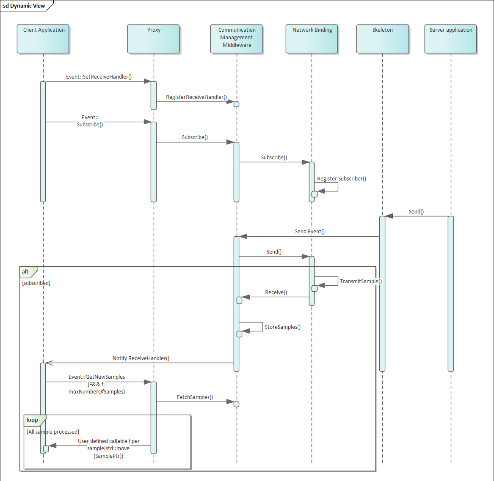{width="5.104912510936133in" height="4.97875in"}

**Figure 4.2:** \[\]{#\_bookmark85 .anchor}**ara::com event based
communication**

## ara::com Method based communication

With method based communication a client application calls a method that
is executed on the remote server. This is shown in figure
[Figure](#_bookmark87) [4.3](#_bookmark87). The method may, or may not
return a value to the client. If a return value is provided, the
[ara::core::Future](#_bookmark36) and [ara::core::Promise](#_bookmark37)
pattern is used to give a possibility of a non-blocking behavior for the
communication. See chapter [5.3.6](#methods) for details.

> 使用基于方法的通信，客户端应用程序调用远程服务器上执行的方法。这在图\[4.3\]中显示。该方法可以或可以不返回值给客户端。如果提供了返回值，则使用\[ara
> :: core :: Future\]和\[ara :: core ::
> Promise\]模式提供通信的非阻塞行为的可能性。有关详细信息，请参见\[5.3.6\]章节。

The server can be configured for different processing modes of method
invocations. The options are

> 服务器可以配置为不同的方法调用处理模式。选项有

-   **Event-driven, concurrent** (kEvent): Incoming service method calls
    are pro- cessed in an event based manner.

> 事件驱动，并发（kEvent）：来自服务方法调用以基于事件的方式处理。 -
> **Event-driven, sequential** (kEventSingleThread): Same as kEvent on
> sin- gle thread basis.

-   **Polling** (KPoll): Incoming service method calls need to be
    explicitly processed in polling manner by calling
    [ProcessNextMethodCall](#_bookmark66).

> \*\*投票（KPoll）：需要通过调用[ProcessNextMethodCall](#_bookmark66)显式地以轮询方式处理传入的服务方法调用。

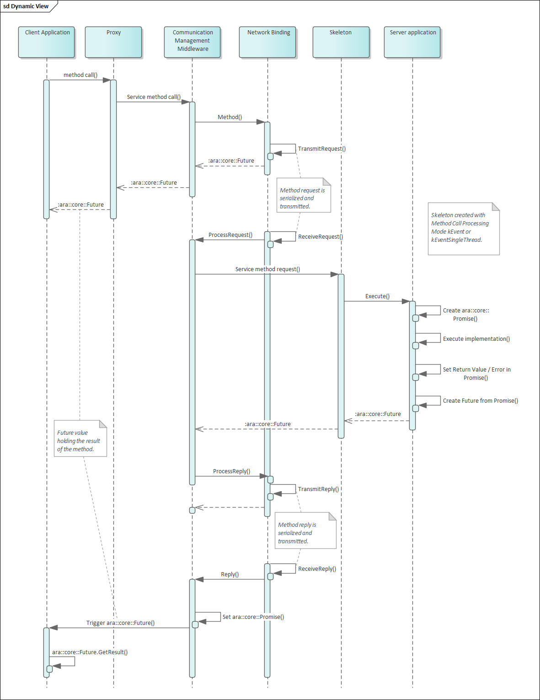{width="4.797502187226597in" height="6.2075in"}

**Figure 4.3:** \[\]{#\_bookmark87 .anchor}**ara::com method based
communication**

## ara::com Field based communication

With field based communication a server can provide a value for some
data that a client can access or update at any time. The functionality
of a field can be viewed as a combination of event and methods:

> 通过基于字段的通信，服务器可以为客户端随时访问或更新的数据提供一个值。字段的功能可以被看作是事件和方法的组合：

-   Like an event the client can subscribe to changes of the value. The
    client will be notified using the same notification mechanisms as
    for events (defined by [SetReceiveHandler()](#_bookmark53)).

> 客户可以像订阅事件一样订阅值的变化。客户将使用与事件相同的通知机制（由\[SetReceiveHandler（）\]（#\_bookmark53）定义）收到通知。

-   Using methods, the client can retrieve the value by calling a
    get-operation ([Get()](#_bookmark56)

> 使用方法，客户端可以通过调用get操作([Get()](#_bookmark56))来检索值。

), or update the value by calling a set-operation for the field in the
proxy ([Set()](#_bookmark57)).

> 請幫助我翻譯，或通過調用代理中的字段的set操作來更新值（\[Set()\]（＃\_bookmark57））。

On the server side, the field is handled in the skeleton implementation
by

> 在服务器端，该字段由骨架实现来处理。

-   Defining a callback that is called when the value is updated by a
    client (defined by [RegisterSetHandler()](#_bookmark68)).

> 定义一个回调，当客户端通过\[RegisterSetHandler()\]（#\_bookmark68）更新值时调用。

-   Calling an update-method when a new value shall be published to the
    clients ( [Update()](#_bookmark69)).

> 当新值要发布给客户端时，调用更新方法（[Update()](#_bookmark69)）。

1.  ## Data Type Abstractions

> ## 数据类型抽象

[ara::com](#_bookmark15) API introduces specific data types, which are
used throughout its various interfaces. They can roughly be divided into
the following classes:

> [ara::com](#_bookmark15)
> API引入了特定的数据类型，它们被用于其各种接口中。它们可以大致分为以下几类：

-   Pointer types: for pointers to data transmitted via middleware

-   Collection types: for collections of data transmitted via
    middleware.

-   Types for async operation result management:
    [ara::com](#_bookmark15) relies on AUTOSAR AP specific data types
    (see \[[3](#_bookmark2)\]), which are specific versions of C++
    [std::fu-](#_bookmark25)
    [ture](#_bookmark25)/[std::promise](#_bookmark26)

> -   用于异步操作结果管理的类型：[ara::com](#_bookmark15)依赖于AUTOSAR
>     AP特定的数据类型（参见\[[3](#_bookmark2)\]），它们是C++
>     [std::fu-](#_bookmark25)
>     [ture](#_bookmark25)/[std::promise](#_bookmark26)的特定版本。

-   Function wrappers: for various application side callback or handler
    functions to be called by the middleware

> 函数包装器：用于调用中间件的各种应用程序端回调或处理程序函数。

[ara::com](#_bookmark15) defines signature and expected behavior of
those types, but does not pro- vide an implementation. The idea of this
approach is, that platform vendors could easily come up with their own
optimized implementation of those types.

> [ara::com](#_bookmark15)
> 定义了这些类型的签名和预期行为，但不提供实现。这种方法的想法是，平台供应商可以轻松地提供自己的这些类型的优化实现。

This is obvious for collection and pointer types as one of the major
jobs of an [IPC](#_bookmark70) implementation has to deal with memory
allocation for the data which is exchanged between middleware users.

> 这对于集合和指针类型来说是显而易见的，因为IPC实现的主要工作之一就是为中间件用户之间交换的数据分配内存。

Being able to provide their own implementations allows to optimize for
their chosen memory model.

> 能夠提供自己的實現可以為他們選擇的記憶模型進行優化。

For most of the types [ara::com](#_bookmark15) provides a default
mapping to existing C++ types in ara/com/types.h. The default mapping of
the types provided by \[[3](#_bookmark2)\] can be found in,

> ara::com提供了一种默认映射到ara/com/types.h中现有C++类型的方式，可以在\[3\]中找到默认映射的类型。

e.g. ara/core/future.h or ara/core/promise.h. This default mapping
decision could be reused by an AP product vendor.

> 例如：ara/core/future.h 或
> ara/core/promise.h。此默认映射决定可由AP产品供应商重复使用。

The default mapping provided by [ara::com](#_bookmark15) even has a real
benefit for a product vendor, who wants to implement its own variant: He
can validate the functional behavior of his own implementation against
the implementation of the default mapping.

> 默认映射由[ara::com](#_bookmark15)提供，甚至对于希望实施自己变体的产品供应商有实际好处：他可以验证自己实施的功能行为与默认映射的实施是否一致。

## Error Handling

[ara::com](#_bookmark15) API follows the concepts of error handling
described in chapter \"Error han- dling\" in \[[3](#_bookmark2)\].
Recoverable [Error](#_bookmark27)s will be returned via an
ara::Core::ErrorCode embedded into a [ara::core::Result](#_bookmark35),
which either holds a valid return value or the ara::Core::ErrorCode.

> ara::com
> API遵循第3章中描述的错误处理概念。可恢复的错误将通过ara::Core::ErrorCode嵌入ara::core::Result中返回，该结果既可以包含有效的返回值，也可以包含ara::Core::ErrorCode。

For each function in the [ara::com](#_bookmark15) API a set of
predefined ara::Core::Error- Codes from the error domain
[ara::com::ComErrorDomain](#_bookmark33), (or from
[ara::com:-](#_bookmark34)

> 对于[ara::com](#_bookmark15)
> API中的每个函数，都有一组预定义的ara::Core::Error-Codes来自错误域[ara::com::ComErrorDomain](#_bookmark33)，或者来自[ara::com:](#_bookmark34)。

[:e2e::E2EErrorDomain](#_bookmark34) for E2E checks) are defined. These
errors should be han- dled by the application that is using the API.
Besides these a stack vendor may also define additional error codes,
that might need to be handles as well.

> [E2E错误域](#_bookmark34)用于E2E检查已经定义。这些错误应该由使用API的应用程序处理。除此之外，堆栈供应商也可能定义额外的错误代码，这些代码也可能需要处理。

Application Errors within [ara::com](#_bookmark15) API can only occur in
the context of a call of a [SI](#_bookmark71) method and is therefore
fully covered in subsection [subsection](#methods) [5.3.6](#methods) and
sub- section [subsection](#methods-1) [5.4.6](#methods-1).

> 在[ara::com](#_bookmark15)
> API中的应用程序错误只能在调用[SI](#_bookmark71)方法的上下文中发生，因此完全包含在[子节](#methods)
> [5.3.6](#methods)和[子节](#methods-1) [5.4.6](#methods-1)中。

Exceptions in the [ara::com](#_bookmark15) API are only used in case of
[Violation](#_bookmark29)s or [Corrup-](#_bookmark30)
[tion](#_bookmark30)s. These are non-recoverable and should normally not
be handled by the appli- cation developer.

> 在ara::com
> API中，只有在发生违规或腐败时才会使用异常。这些都是不可恢复的，通常不应由应用程序开发人员处理。

2.  ## Service Connection Approach

> 服务连接方法

1.  ### Instance Identifiers and Instance Specifiers

> ### 实例标识符和实例指定符

Instance identifiers, which get used at proxy and as well at skeleton
side, are such a central concept, that their explanation is drawn here
--- before the detailed description of [ara::com](#_bookmark15) proxies
and skeletons in upcoming chapters.

> 实例标识符在代理和骨架端都使用，是一个核心概念，在接下来的章节中详细描述[ara::com](#_bookmark15)代理和骨架之前，先对它们进行解释。

Instance identifiers are used within [ara::com](#_bookmark15), on
client/proxy side, when a specific instance of a service shall be
searched for or --- at the server/skeleton side --- when a specific
instance of a service is created.

> 实例标识符在[ara::com](#_bookmark15)中使用，在客户端/代理端时，当搜索特定服务实例时，或者在服务器/骨架端时，当创建特定服务实例时。

At [ara::com](#_bookmark15) API level the instance identifier is
generally a technical binding specific identifier.

> 在[ara::com](#_bookmark15)
> API级别上，实例标识符通常是特定绑定的技术标识符。

Therefore the concrete content/structure of which such an instance
identifier consists, is totally technology specific: So f.i. SOME/IP is
using 16 bit unsigned integer identifiers to distinguish different
instances of the same service type, while DDS (DDS-RPC) uses
*string\<256\>* as service_instance_name.

> 因此，这种实例标识符的具体内容/结构完全取决于技术：例如，SOME/IP 使用
> 16 位无符号整数标识符来区分同一服务类型的不同实例，而
> DDS（DDS-RPC）使用 *string\<256\>* 作为服务实例名称。

Independant of the binding technology the abstract facade of any
concrete instance identifier shall apply to this signature at
[ara::com](#_bookmark15) API level in namespace [ara::-](#_bookmark15)
[com](#_bookmark15):

> 不管绑定技术是什么，所有具体实例标识符的抽象外观都应应用于[ara::com](#_bookmark15)
> API层级的命名空间[ara::-](#_bookmark15)
> [com](#_bookmark15)中的此签名：

    class InstanceIdentifier {

    public:

    static ara::core::Result\<InstanceIdentifier\>

    Create(StringView serializedFormat) noexcept;

    explicit InstanceIdentifier

    (ara::core::StringView serializedFormat);

    ara::core::StringView ToString() const;

    bool operator==(const InstanceIdentifier& other) const;

    bool operator\<(const InstanceIdentifier& other) const;

    InstanceIdentifier& operator=(const InstanceIdentifier& other);

    };

**Listing 4.1: InstanceIdentifier class**

> 列表4.1：InstanceIdentifier类

As you can see the instance identifier interface
[ara::com::InstanceIdentifier](#_bookmark31) provides a
[ctor](#_bookmark23) taking a string, which means it can be constructed
from a string rep- resentation. It also provides a ToString() method,
which allows to get a stringified representation of the technology
specific [ara::com::InstanceIdentifier](#_bookmark31).

> 可以看到，实例标识符接口[ara::com::InstanceIdentifier](#_bookmark31)提供了一个接受字符串的[ctor](#_bookmark23)，这意味着它可以从字符串表示中构造出来。它还提供了一个ToString()方法，允许获取特定技术的[ara::com::InstanceIdentifier](#_bookmark31)的字符串表示。

This pair of [ctor](#_bookmark23) taking a string representation and the
possibility to write out the string representation makes the
[ara::com::InstanceIdentifier](#_bookmark31) \"serializable\". This
allows it to be transferred, persisted, later re-used, \... (more on
potential use cases later).

> 这对[ctor](#_bookmark23)拥有字符串表示形式以及可以将字符串表示写出的可能性，使得[ara::com::InstanceIdentifier](#_bookmark31)"可序列化"。这使得它可以被传输，持久化，稍后重新使用，\...（稍后更多关于潜在的用例）。

Introspection into this string (trying to interpret the content) makes
no sense for the user of [ara::com](#_bookmark15). As mentioned: The
content will be highly middleware product/binding specific!

> 对于[ara::com](#_bookmark15)的用户而言，对此字符串的内省（试图解释内容）毫无意义。正如所提及的：内容将高度依赖中间件产品/绑定特定！

Since it is a core feature, that the technical binding used by an
[ara::com](#_bookmark15) based appli- cation is defined/specified by the
integrator during deployment any expectations from an
[ara::com](#_bookmark15) software developer regarding its
content/structure are typically invalid. Logging it/tracing it out to a
log channel might be helpful for debug analysis however.

> 由于核心特性是由ara::com基础应用程序使用的技术绑定在部署期间由集成器定义/指定，因此ara::com软件开发人员对其内容/结构的期望通常是无效的。然而，将其记录/跟踪到日志通道可能有助于调试分析。

Then, where does the software-developer get such a highly binding
specific [ara::-](#_bookmark31) [com::InstanceIdentifier](#_bookmark31)
to be used in [ara::com](#_bookmark15) API calls?

> 那么软件开发者从哪里获取这样一个高度约束的特定[ara::-](#_bookmark31)
> [com::InstanceIdentifier](#_bookmark31) 来用于[ara::com](#_bookmark15)
> API调用？

The answer is: By an [ara::com](#_bookmark15) provided functionality,
which translates a logical local name used typically by the software
developer in his realm into the technology/bind- ing specific
[ara::com::InstanceIdentifier](#_bookmark31). This indirection masters
both chal- lenges:

> 答案是：通过ara ::
> com提供的功能，将软件开发人员在其领域中通常使用的逻辑本地名称转换为技术/绑定特定的ara
> :: com :: InstanceIdentifier。这种间接性掌握了两个挑战：

-   developer using [ara::com](#_bookmark15) does not need to know
    anything about bindings and their specifics

> 开发者使用[ara::com](#_bookmark15)无需了解任何有关绑定及其特性的信息。 -
> Integrators can adapt bindings in deployments

The local name from which the
[ara::com::InstanceIdentifier](#_bookmark31) is constructed comes
basically from the AUTOSAR meta-model, describing your software
component model.

> 本地名称，用于构造[ara::com::InstanceIdentifier](#_bookmark31)，基本上来自AUTOSAR元模型，用于描述您的软件组件模型。

The requirement for this local name --- we will call it \"instance
specifier\" from now on

> 这个本地名称的要求---我们现在称之为"实例指示符"。

--- is, that it is unambiguous within an executable. It has basically
the form:

\<context 0\>/\<context 1\>/\.../\<context N\>/\<port name\>

> \<上下文 0\>/\<上下文 1\>/\.../\<上下文 N\>/\<端口名称\>

The C++ representation of such an \"instance specifier\" is the class
[ara::core::In-](#_bookmark42) [stanceSpecifier](#_bookmark42).
Structurally it looks similar to the
[ara::com::InstanceIden-](#_bookmark31) [tifier](#_bookmark31):

> C++中表示这样的"实例指定符"的是类ara::core::InstanceSpecifier。结构上它看起来与ara::com::InstanceIdentifier类似。

    []{#_bookmark93 .anchor}class InstanceSpecifier final

    {

    public:

    // ctor to build specifier from AUTOSAR short name identifier

    // with '/' as separator between package names

    static Result\<InstanceSpecifier\> Create(StringView metaModelIdentifier);

    explicit InstanceSpecifier(StringView metaModelIdentifier);

    InstanceSpecifier(const InstanceSpecifier& other);

    InstanceSpecifier(InstanceSpecifier&& other) noexcept;

    InstanceSpecifier& operator=(const InstanceSpecifier& other);

    InstanceSpecifier& operator=(InstanceSpecifier&& other);

    \~InstanceSpecifier() noexcept;

    StringView ToString() const noexcept;

    bool operator==(const InstanceSpecifier& other) const noexcept;

    bool operator==(StringView other) const noexcept;

    bool operator!=(const InstanceSpecifier& other) const noexcept;

    bool operator!=(StringView other) const noexcept;

    bool operator\<(const InstanceSpecifier& other) const noexcept;

    };

**Listing 4.2: InstanceSpecifier class**

> **列表4.2：InstanceSpecifier类**

If the unambiguousness is ensured, the integrator/deployer can assign a
dedicated technical binding with its specific instance IDs to those
\"instance specifier\" via a \"man- ifest file\", which is specifically
used for a distinct instantiation/execution of the exe- cutable.

> 如果确保了清晰无歧义，集成器/部署器可以通过"清单文件"将具有特定实例ID的专用技术绑定分配给这些"实例指定符"，该文件专门用于可执行文件的独特实例化/执行。

This explicitly allows, to start the same executable N times, each time
with a different manifest, which maps the same
[ara::core::InstanceSpecifier](#_bookmark42) differently.

> 这明确允许，每次使用不同的清单启动相同的可执行文件N次，每次都使用相同的\[ara
> :: core :: InstanceSpecifier\]（#\_bookmark42）进行不同的映射。

Details about the [ara::com](#_bookmark15) relation to the meta-model
and the nature of nested con- texts can be read more detailed in
[section](#aracom-and-autosar-meta-model-relationship)
[7.4](#aracom-and-autosar-meta-model-relationship).

> 关于[ara::com](#_bookmark15)与元模型以及嵌套上下文的性质的更多细节可以在[第7.4节](#aracom-and-autosar-meta-model-relationship)中进一步阅读。

The API [ara::com](#_bookmark15) provides the following function, to do
the translation from the [ara::core::InstanceSpecifier](#_bookmark42)
(local name in the software developers realm) to the technical
[ara::com::InstanceIdentifier](#_bookmark31):

> API [ara::com](#_bookmark15)
> 提供以下功能，将软件开发人员领域中的[ara::core::InstanceSpecifier](#_bookmark42)（本地名称）转换为技术[ara::com::InstanceIdentifier](#_bookmark31)：

    []{#_bookmark94 .anchor}namespace ara {

    namespace com {

    namespace runtime {

    ara::core::Result\<ara::com::InstanceIdentifierContainer\> ResolveInstanceIDs (ara::core::InstanceSpecifier modelName);

    }

    }

    }

**Listing 4.3: InstanceSpecifier Resolution**

> 列表4.3：实例指定符解析

Why this API does return an
[ara::com::InstanceIdentifierContainer](#_bookmark32), which represents
a collection of [ara::com::InstanceIdentifier](#_bookmark31) is in need
of explana- tion: AUTOSAR supports, that the integrator may configure
multiple technical bindings behind one abstract identifier visible to
the software component developer.

> 为什么这个API返回一个[ara::com::InstanceIdentifierContainer](#_bookmark32)，它代表一组[ara::com::InstanceIdentifier](#_bookmark31)，需要解释：AUTOSAR支持让集成器可以在一个软件组件开发者可见的抽象标识符后面配置多个技术绑定。

This feature is called multi-binding and referred to at different parts
in this document (you find a more detailed explanation in
[section](#multi-binding-implications)
[7.3](#multi-binding-implications)).

> 这个功能叫做多重绑定，在本文档的不同部分都有提到（您可以在[7.3节](#multi-binding-implications)中找到更详细的解释）。

Using multi-binding on the skeleton/server side is a common use case,
since it simply allows different clients to use their preferred binding,
when contacting the server.

> 使用骨架/服务器端的多绑定是一种常见的用例，因为它只是允许不同的客户端使用自己喜欢的绑定，当联系服务器时。

Contrary using multi-binding on the proxy/client side is a rather exotic
one. E.g. it could be used to support some fail-over approaches (if
binding A does not work, fall back on binding B).

> 对于代理/客户端端来说，使用多绑定是一种比较特殊的方法。例如，它可以用来支持一些故障转移方法（如果绑定A不起作用，则转到绑定B）。

So the possible returns for a call of
[ResolveInstanceIDs()](#_bookmark55) are:

> 所以调用[ResolveInstanceIDs()](#_bookmark55)的可能返回值是：

-   empty list: The integrator failed to provide a mapping for the
    abstract identifier. This most likely is a configuration error.

> 空列表：集成器未能提供抽象标识符的映射。这很可能是配置错误。

-   list with one element: The common case. Mapping to one concrete
    instance id of one concrete technical binding.

> 一个元素的列表：常见情况。映射到一个具体实例ID的一个具体技术绑定。

-   list with more than one element: Mapping to multiple technical
    instances with possibly multiple technical bindings.

> 映射到可能有多个技术绑定的多个技术实例的列表。

Technically the middleware implementation of
[ResolveInstanceIDs()](#_bookmark55)does a lookup of the
[ara::core::InstanceSpecifier](#_bookmark42) from the service instance
manifest bundled within the process.

> 技术上，[ResolveInstanceIDs()](#_bookmark55)
> 中间件的实现从进程中打包的服务实例清单中查找[ara::core::InstanceSpecifier](#_bookmark42)。

Therefore the [ara::core::InstanceSpecifier](#_bookmark42) must be
unambiguous within the bundled service instance manifest.

> 因此，[ara::core::InstanceSpecifier](#_bookmark42)
> 必须在打包的服务实例清单中是明确无误的。

### When to use InstanceIdentifier versus InstanceSpecifier

According to the previous explanations, the impression may have arisen
that a soft- ware developer always has to resolve
[ara::core::InstanceSpecifier](#_bookmark42) to [ara:-](#_bookmark31)

> 根据之前的解释，可能产生的印象是软件开发人员总是必须将[ara::core::InstanceSpecifier](#_bookmark42)解析为[ara:-](#_bookmark31)。

[:com::InstanceIdentifier](#_bookmark31) manually (by a call to
[ResolveInstanceIDs()](#_bookmark55)) first, be-

> 首先，通过调用ResolveInstanceIDs（）手动\[:com::InstanceIdentifier\]（#\_bookmark31）。

fore using [ara::com](#_bookmark15) APIs, which need instance identifier
information.

> 在使用[ara::com](#_bookmark15)的API之前，需要实例标识符信息。

This would be indeed a bit awkward as we already mentioned, that the
\"typical\" ap- proach for a software developer, which implements an
Adaptive AUTOSAR SWC, is to use abstract \"instance specifiers\" from
the realm of the software component model.

> 这确实有点尴尬，正如我们已经提到的，软件开发人员实现自适应AUTOSAR
> SWC的"典型"方法是使用软件组件模型领域中的抽象"实例规范"。

As you will see in the upcoming chapters, which detail the APIs on the
proxy and skele- ton side, [ara::com](#_bookmark15) provides typically
function overloads, which either take [ara::-](#_bookmark31)
[com::InstanceIdentifier](#_bookmark31) OR
[ara::core::InstanceSpecifier](#_bookmark42), freeing the developer in
the most common use cases, where he simply uses
[ara::core::In-](#_bookmark42) [stanceSpecifier](#_bookmark42) from
explicitly calling [ResolveInstanceIDs()](#_bookmark55).

> 随着接下来的章节，详细介绍代理和骨架端的API，[ara::com](#_bookmark15)通常提供函数重载，可以接受[ara::-](#_bookmark31)[com::InstanceIdentifier](#_bookmark31)或[ara::core::InstanceSpecifier](#_bookmark42)，在最常见的情况下，可以让开发人员免于显式调用[ResolveInstanceIDs()](#_bookmark55)来使用[ara::core::In-](#_bookmark42)[stanceSpecifier](#_bookmark42)。

This means, that the direct use of
[ara::com::InstanceIdentifier](#_bookmark31) and manual resolution of
[ara::core::InstanceSpecifier](#_bookmark42) is intended more for power
users with rather specific/exotic use cases. Some examples will be given
in the chapters, where the corresponding [ara::com](#_bookmark15) API
overrides at proxy/skeleton side are dis- cussed.

> 这意味着，[ara :: com ::
> InstanceIdentifier](#_bookmark31)的直接使用和[ara :: core ::
> InstanceSpecifier](#_bookmark42)的手动解析更适合具有特定/异国情调的高级用户。在讨论相应[ara
> :: com](#_bookmark15)API覆盖代理/骨架端时，将给出一些示例。

The fundamental difference between the two variants is this: An
[ara::com::In-](#_bookmark31) [stanceIdentifier](#_bookmark31) can be
exchanged more easily between Adaptive Application- s/processes!

> 两种变体的基本区别在于：ara：com：In-实例标识符可以更容易地在自适应应用程序/进程之间交换！

As they already exactly contain all the technology specific information
and do not need any further resolution via content of a service instance
manifest such a se- rialized
[ara::com::InstanceIdentifier](#_bookmark31) can be reconstructed within
a different process and be used as long as his process has access to the
same binding technol- ogy the
[ara::com::InstanceIdentifier](#_bookmark31) is based upon.

> 他们已经包含了所有技术特定信息，不需要通过服务实例清单的内容进行进一步解析，因此可以在不同的进程中重建序列化的\[ara
> :: com ::
> InstanceIdentifier\]（#\_bookmark31），只要该进程具有访问\[ara :: com
> ::
> InstanceIdentifier\]（#\_bookmark31）所基于的相同绑定技术的权限即可使用。

### Transfer of an InstanceIdentifier

As discussed before the [ara::com::InstanceIdentifier](#_bookmark31)
should only be used for \"power users\" since its format is stack vendor
dependent and it contains technology binding information. The transfer
or the storage of an [ara::com::InstanceIden-](#_bookmark31)
[tifier](#_bookmark31) may be very risky, therefore. As the transfer
binding may not exist anymore after the transfer or re-storing or the
[ara::com::InstanceIdentifier](#_bookmark31) of stack vendor A may be
interpreted by an application using the stack of vendor B.

> 在之前的讨论中，[ara::com::InstanceIdentifier](#_bookmark31)只应该被"高级用户"使用，因为它的格式取决于堆栈供应商，并且包含技术绑定信息。因此，传输或存储[ara::com::InstanceIden-](#_bookmark31)
> [tifier](#_bookmark31)可能非常危险。因为传输绑定在传输或重新存储后可能不再存在，或者堆栈供应商A的[ara::com::InstanceIdentifier](#_bookmark31)可能被使用堆栈供应商B的应用程序解释。

5.  # Detailed API description

> # 详细的API描述

1.  ## High Level API Structure

> ## 高级API结构

[ara::com](#_bookmark15) provides an API that supports the AUTOSAR
service model. The services have methods, events, fields and triggers.

> [ara::com](#_bookmark15)提供一个支持AUTOSAR服务模型的API。服务具有方法、事件、字段和触发器。

-   **Methods**: Execute a function in the Service Application which can
    also return a value (e.g. Calibrate method).

> -   **方法**：在服务应用程序中执行一个函数，该函数也可以返回一个值（例如，校准方法）。

-   **Events**: The Service Application sends an event (may also include
    a value) when specific conditions occur (e.g. Brake event). A Client
    Application can subscribe to events.

> 服务应用程序在特定条件发生时（例如刹车事件）发送事件（可能还包括值）。客户端应用程序可以订阅事件。

-   **Fields**: Have a value at any time, like a status value. Can be
    read using Get or modified using Set (e.g. UpdateRate field). A
    Client Application can be notified when a Field value changes.

> -   **字段**：随时具有值，如状态值。可以使用Get读取或使用Set修改（例如UpdateRate字段）。当字段值更改时，客户端应用程序可以收到通知。

-   **Triggers**: The Service Application sends a trigger when specific
    conditions occur. A Client Application can subscribe to triggers.

> 服务应用程序在特定条件发生时发送触发器。客户端应用程序可以订阅触发器。

As described in [section](#proxyskeleton-architecture)
[4.1](#proxyskeleton-architecture), Client and Service Application
communicate with each other and therefore the API supports methods,
events and fields in both sides. This means that the API defines
interfaces for sending and receiving events, provides and calls service
methods, register handlers for field setters and getters amongst others.

> 根据[第4.1节](#proxyskeleton-architecture)中的描述，客户端和服务应用程序彼此通信，因此API支持双方的方法、事件和字段。这意味着API为发送和接收事件定义了接口，提供和调用服务方法，注册字段设置器和获取器的处理程序等。

The [ara::com](#_bookmark15) API also defines ctors/dtors to create and
destroy instances for Proxy and Skeleton classes.

> API [ara::com](#_bookmark15)
> 也定义了构造函数/析构函数，用于创建和销毁Proxy和Skeleton类的实例。

Finally, the [ara::com](#_bookmark15) API also provides methods to offer
/ find services and subscribe

> 最后，[ara::com](#_bookmark15) API还提供了提供/查找服务和订阅的方法。

/ unsubscribe to events.

> 取消订阅事件。

## API Elements

The following subchapters will guide through the different API elements,
which [ara::-](#_bookmark15) [com](#_bookmark15) defines. Since we will
give code examples for various artifacts and provide sample code how to
use those APIs from a developer perspective, it is a good idea to have
some uniformity in our examples.

> 以下的小节将指引您通过ara::-
> com定义的不同的API元素。由于我们将为各种工件提供代码示例，并提供如何从开发者的角度使用这些API的示例代码，因此有一个统一的示例是一个好主意。

So we will use a virtual service (interface) called \"RadarService\".
The following is a kind of a semi-formal description, which should give
you an impression of what this \"RadarService\" provides/does and might
be easier to read than a formal AUTOSAR ARXML service description:

> 我们将使用一个叫做"RadarService"的虚拟服务（接口）。以下是一种半正式描述，它应该让您对"RadarService"提供/做什么有一个印象，可能比正式的AUTOSAR
> ARXML服务描述更容易阅读：

    []{#_bookmark100 .anchor}RadarService {

    // types used within service

    type RadarObjects {

    active : bool

    objects : array {

    size: variable

    }

    }

    +---------+--------------------+--------------------------------------+
    | 10      |                    |                                      |
    +=========+====================+======================================+
    | 11      | type               | Position {                           |
    +---------+--------------------+--------------------------------------+
    | 12      | x:                 | uint32                               |
    +---------+--------------------+--------------------------------------+
    | 13      | y:                 | uint32                               |
    +---------+--------------------+--------------------------------------+
    | 14      | z:                 | uint32                               |
    +---------+--------------------+--------------------------------------+
    | 15      | > }                |                                      |
    +---------+--------------------+--------------------------------------+
    | 16      |                    |                                      |
    +---------+--------------------+--------------------------------------+

    // events provided by service

    event BrakeEvent {

    type:RadarObjects

    }

    // fields provided by service

    field UpdateRate {

    type:uint32

    get: true

    set: true

    }

    error CalibrationFailed {

    errorCode : 1

    errorContext {

    failureText : string

    }

    }

    error InvalidConfigString {

    errorCode : 2

    errorContext {

    invalidConfig : string

    currentValidConfig : string

    }

    }

    // methods provided by service

    method Calibrate {

    param configuration {

    type: string

    direction: in

    }

    param result {

    type: bool

    direction: out

    }

    raises {

    CalibrationFailed

    InvalidConfigString

    }

    }

    method Adjust {

    param target_position {

    +-----+-----+----------------------------------------------------------+
    | 63  |     | > direction: in                                          |
    +=====+=====+==========================================================+
    | 64  |     | }                                                        |
    +-----+-----+----------------------------------------------------------+
    | 65  |     | param success {                                          |
    +-----+-----+----------------------------------------------------------+
    | 66  |     | > type: bool                                             |
    +-----+-----+----------------------------------------------------------+
    | 67  |     | > direction: out                                         |
    +-----+-----+----------------------------------------------------------+
    | 68  |     | }                                                        |
    +-----+-----+----------------------------------------------------------+
    | 69  |     | param effective_position {                               |
    +-----+-----+----------------------------------------------------------+
    | 70  |     | > type: Position                                         |
    +-----+-----+----------------------------------------------------------+
    | 71  |     | > direction: out                                         |
    +-----+-----+----------------------------------------------------------+
    | 72  |     | }                                                        |
    +-----+-----+----------------------------------------------------------+
    | 73  | > } |                                                          |
    +-----+-----+----------------------------------------------------------+
    | 74  |     |                                                          |
    +-----+-----+----------------------------------------------------------+

    oneway method LogCurrentState {}

    }

**Listing 5.1: RadarService Definition**

> 列表5.1：雷达服务定义

So the example service RadarService provides an event "BrakeEvent",
which con- sists of a structure containing a flag and a variable length
array of uint8 (as extra pay- load).

> 所以，示例服务RadarService提供了一个"BrakeEvent"事件，其中包含一个标志和一个可变长度的uint8数组（作为额外的有效载荷）。

Then it provides a field "UpdateRate", which is of uint32 type and
supports get and set calls and finally it provides three methods.

> 然后它提供一个"UpdateRate"字段，它是一个uint32类型，支持get和set调用，最后它提供三种方法。

Method "Adjust", to position the radar, which contains a target position
as in-parameter and two out-parameters. One to signal the success of the
positioning and one to report the final (maybe deviating) effective
position.

> 方法"Adjust"，用于定位雷达，其中包含一个目标位置作为输入参数，以及两个输出参数。一个用于信号定位成功，另一个用于报告最终（可能偏离）有效位置。

The method "Calibrate" to calibrate the radar, getting an configuration
string as in- parameter and returning a success indicator as
out-parameter. This method may raise two different application errors,
in case the calibration failed: "CalibrationFailed" and
"InvalidConfigString".

> 方法"校准"用于校准雷达，以配置字符串作为输入参数，并返回一个成功指示器作为输出参数。如果校准失败，此方法可能会引发两种不同的应用程序错误："校准失败"和"无效配置字符串"。

The method "LogCurrentState" is a one way method, which means, that no
feedback is returned to the caller, if the method is executed at all and
with which outcome. It instructs the service RadarService to output its
current state into its local log files.

> 方法"LogCurrentState"是一种单向方法，这意味着，如果方法被执行并且产生了结果，则不会向调用者返回反馈。它指示RadarService服务将其当前状态输出到其本地日志文件中。

## Proxy Class

The Proxy class is generated from the [SI](#_bookmark71) description of
the AUTOSAR meta model.

> 类代理是根据AUTOSAR元模型的[SI](#_bookmark71)描述生成的。

[ara::com](#_bookmark15) does standardize the interface of the generated
Proxy class.The toolchain of an AP product vendor will generate a Proxy
implementation class exactly implement- ing this interface.

> [ara::com](#_bookmark15)标准化了生成的代理类的接口。AP产品供应商的工具链将生成一个完全实现此接口的代理实现类。

Note: Since the interfaces the Proxy class has to provide are defined by
[ara::com](#_bookmark15), a generic (product independent) generator
could generate an abstract class or a mock class against which the
application developer could implement his service consumer application.
This perfectly suits the platform vendor independent development of
Adap- tive AUTOSAR SWCs.

[ara::com](#_bookmark15) expects proxy related artifacts inside a
namespace \"proxy\". This name- space is typically included in a
namespace hierarchy deduced from the service defini- tion and its
context.

> [ara::com](#_bookmark15)预期代理相关的工件在一个名称空间"代理"中。这个名称空间通常包含在从服务定义及其上下文推断出的名称空间层次结构中。

### Proxy Class API's

-   [FindService()](#_bookmark58)

-   [StartFindService()](#_bookmark59)

-   [StopFindService()](#_bookmark60)

-   [Subscribe()](#_bookmark46)

-   [Unsubscribe()](#_bookmark47)

-   [GetSubscriptionState()](#_bookmark48)

-   [SetSubscriptionStateChangeHandler()](#_bookmark49)

-   [UnsetSubscriptionStateChangeHandler()](#_bookmark50)

-   [GetNewSamples()](#_bookmark51)

-   GetResult()

-   [GetFreeSampleCount()](#_bookmark52)

-   [SetReceiveHandler()](#_bookmark53)

-   [UnsetReceiveHandler()](#_bookmark54)

-   [ResolveInstanceIDs()](#_bookmark55)

-   [Field::Get()](#_bookmark56)

-   [Field::Set()](#_bookmark57)

    1.  ### RadarService Proxy Class Example

> ### 雷达服务代理类示例

    []{#_bookmark104 .anchor}class RadarServiceProxy {

    public:

    /\*\*

    \* \\brief Implementation is platform vendor specific

    \*

    \* A HandleType must contain the information that is needed to create

    \* a proxy.

    \*

    \* This information shall be hidden.

    \* Since the platform vendor is responsible for creation of handles, the

    \* ctor signature is not given as it is not of interest to the user.

    class HandleType {

    /\*\*

    \* \\brief Two ServiceHandles are considered equal if they represent

    \* the same service instance.

    \*

    \* \\param other

    \*

    \* \\return bool

    \*/

    inline bool operator==(const HandleType &other) const;

    const ara::com::InstanceIdentifier &GetInstanceId() const;

    };

    /\*\*

    \* StartFindService does not need an explicit version parameter as this

    \* is internally available in ProxyClass.

    \* That means only compatible services are returned.

    \*

    \* \\param handler this handler gets called any time the service

    \* availability of the services matching the given

    \* instance criteria changes. If you use this variant of

    \* FindService, the Communication Management has to

    \* continuously monitor the availability of the services

    \* and call the handler on any change.

    \*

    \* \\param instanceId which instance of the service type defined

    \* by T shall be searched/found.

    \*

    \* \\return a handle for this search/find request, which shall

    \* be used to stop the availability monitoring and related

    \* firing of the given handler. (\\see StopFindService())

    \*/

    static ara::core::Result\<ara::com::FindServiceHandle\> StartFindService(

    ara::com::FindServiceHandler\<RadarServiceProxy::HandleType\> handler,

    ara::com::InstanceIdentifier instanceId);

    /\*\*

    \* This is an overload of the StartFindService method using an

    \* instance specifier, which gets resolved via service instance

    \* manifest.

    \* \\param instanceSpec instance specifier

    \*/

    static ara::core::Result\<ara::com::FindServiceHandle\> StartFindService

     (

    ara::com::FindServiceHandler\<RadarServiceProxy::HandleType\> handler,

    ara::core::InstanceSpecifier instanceSpec);

    /\*\*

    \* Method to stop finding service request (see above)

    \*/

    static void StopFindService(ara::com::FindServiceHandle handle);

    /\*\*

    \* Opposed to StartFindService(handler, instance) this version

    \* is a \"one-shot\" find request, which is:

    \* and a result list of matching service instances is

    \* available. (list may be empty, if no matching service

    \* instances currently exist)

    \* - does reflect the availability at the time of the method

    \* call. No further (background) checks of availability are

    \* done.

    \*

    \* \\param instanceId which instance of the service type defined

    \* by T shall be searched/found.

    \*

    \*/

    static ara::core::Result\<ara::com::ServiceHandleContainer

    \<RadarServiceProxy::HandleType\>\>

    FindService(ara::com::InstanceIdentifier instanceId);

    /\*\*

    \* This is an overload of the FindService method using an

    \* instance specifier, which gets resolved via service instance

    \* manifest.

    \*/

    static ara::core::Result\<ara::com::ServiceHandleContainer

    \<RadarServiceProxy::HandleType\>\>

    FindService(ara::core::InstanceSpecifier instanceSpec);

    /\*\*

    \* \\brief The proxy can only be created using a specific

    \* handle which identifies a service.

    \*

    \* This handle can be a known value which is defined at

    \* deployment or it can be obtained using the

    \* ProxyClass::FindService method.

    \*

    \* \\param handle The identification of the service the

    \* proxy should represent.

    \*/

    explicit RadarServiceProxy(HandleType &handle);

    /\*\*

    \* proxy instances are not copy constructible.

    \*/

    RadarServiceProxy(RadarServiceProxy &other) = delete;

    /\*\*

    \* proxy instances are not copy assignable

    \*/

    RadarServiceProxy& operator=(const RadarServiceProxy &other) = delete;

    /\*\*

    \* \\brief Public member for the BrakeEvent

    \*/

    events::BrakeEvent BrakeEvent;

    /\*\*

    \* \\brief Public Field for UpdateRate

    \*/

    /\*\*

    \* \\brief Public member for the Calibrate method

    \*/

    methods::Calibrate Calibrate;

    /\*\*

    \* \\brief Public member for the Adjust method

    \*/

    methods::Adjust Adjust;

    /\*\*

    \* \\brief Public member for the LogCurrentState fire-and-forget method

    \*/

    methods::LogCurrentState LogCurrentState;

    };

**Listing 5.2: RadarService Proxy**

> 列表5.2：雷达服务代理

### Constructor and Handle Concept

As you can see in the Listing [5.2](#_bookmark104)
[ara::com](#_bookmark15) prescribes the Proxy class to provide a
constructor. This means, that the developer is responsible for creating
a proxy instance to communicate with a possibly remote service.

> 根据列表5.2，ara::com规定Proxy类提供一个构造函数，这意味着开发人员负责创建一个代理实例来与可能的远程服务进行通信。

The [ctor](#_bookmark23) takes a parameter of type
RadarServiceProxy::HandleType --- an inner class of the generated proxy
class. Probably the immediate question then is: *\"What is this handle
and how to create it/where to get it from?\"*

> 这个构造函数接受一个RadarServiceProxy::HandleType类型的参数---这是生成的代理类的一个内部类。那么接下来可能会问："这个句柄是什么？如何创建它/从哪里获取它？"

What it is, should be straightforward: After the call to the
[ctor](#_bookmark23) you have a proxy instance, which allows you to
communicate with the service, therefore the handle has to contain the
needed addressing information, so that the Communication Management
binding implementation is able to contact the service.

> 在调用[构造函数](#_bookmark23)之后，您将拥有一个代理实例，该实例允许您与服务进行通信，因此句柄必须包含所需的地址信息，以便通信管理绑定实现能够联系服务。

What exactly this address information contains is totally dependent on
the binding im- plementation/technical transport layer!

> 这个地址信息包含的确切内容完全取决于绑定实现/技术传输层！

That already partly answers the question *\"how to create/where to get
it\"*: Really creat- ing is not possible for an application developer as
he is --- according to AUTOSAR core concepts --- implementing his
application AP product and therefore Communication Management
independent.

> 这已经部分回答了"如何创建/如何获得它"的问题：根据AUTOSAR核心概念，应用程序开发人员实现其应用程序AP产品，因此不可能进行创建，而是独立于通信管理。

The solution is, that [ara::com](#_bookmark15) provides the application
developer with an API to find service instances, which returns such
handles.

> 解决方案是，ara::com提供了一个API，可以帮助应用程序开发者查找服务实例，返回这些句柄。

This part of the API is described in detail here:
[subsection](#finding-services) [5.3.4](#finding-services). The
co-benefit from this approach --- that proxy instances can only be
created from handles, which are the result of a \"FindService\" API ---
is, that you are only able to create proxies, which are really backed by
an existing service instance.

> 这部分API的详细描述可在这里找到：[子节](#finding-services)
> [5.3.4](#finding-services)。这种方法的共同好处是，只能从句柄创建代理实例，而句柄是"FindService"API的结果，这样只能创建真正由现有服务实例支持的代理。

So the question which probably might come up here: Why this indirection,
that an application developer first has to call some
[ara::com](#_bookmark15) provided functionality, to get a

> 那么可能会出现的问题是：为什么应用开发者首先必须调用ara ::
> com提供的功能才能获得？

handle, which I then have to use in a [ctor](#_bookmark23) call?
[ara::com](#_bookmark15) could have given back directly a proxy instance
instead of a handle from \"FindService\" functionality.

> 我必须在[ctor](#_bookmark23)调用中使用的handle？[ara::com](#_bookmark15)本可以直接从"FindService"功能中返回一个代理实例而不是一个handle。

The reason for that could be better understood, after reading how
[ara::com](#_bookmark15) handles the access to events
([subsection](#events) [5.3.5](#events)). But what is sufficient to say
at this point is, that a proxy instance contains certain state.

> 理解这个原因可以在阅读[ara::com](#_bookmark15)如何处理事件访问([子节](#events)
> [5.3.5](#events))后更容易。但是在此可以说的是，代理实例包含某些状态。

And because of this there are use cases, where the application developer
wants to use different instances of a proxy, all \"connected\" to the
same service instance.

> 因此，有使用案例，应用程序开发人员希望将不同的代理实例连接到同一个服务实例上。

So if you just accept, that there are such cases, the decision for this
indirection via han- dles becomes clear: [ara::com](#_bookmark15) cannot
know, whether an application developer wants always the same proxy
instance (explicitly sharing state) or always a new instance each time
he triggers some \"FindService\" functionality, which returns a proxy
for exactly the same service instance.

> 如果你只接受存在这种情况，通过句柄做间接的决定就变得清楚了：[ara::com](#_bookmark15)无法知道应用开发者是想要始终使用相同的代理实例（明确共享状态），还是每次触发某个"FindService"功能时都返回一个代理，以获取完全相同的服务实例。

So by providing this indirection/decoupling the decision is in the hands
of the [ara::-](#_bookmark15) [com](#_bookmark15) user.

> 所以通过提供这种间接/解耦，决策权掌握在ara::-com用户手中。

Instances of the Proxy class on the other hand are neither copy
constructible nor copy assignable! This is an explicit design decision,
which complements the idea of forcing the construction via
[HandleType](#_bookmark43).

> 实例类Proxy另一方面既不能复制构造也不能复制赋值！这是一个明确的设计决定，它补充了通过[HandleType](#_bookmark43)强制构造的想法。

The instances of a proxy class might be very resource intensive because
of owning event/field caches, registered handlers, complex state,\...
and so on. Thus, when al- lowing copy construction/copy assignment,
there is a risk that such copies are done unintended.

> 实例化代理类可能会非常消耗资源，因为它拥有事件/字段缓存、注册处理程序、复杂状态等等。因此，允许复制构造/复制赋值时，有可能会出现意外的复制操作。

So --- in a nutshell --- forcing the user to go the route via
[HandleType](#_bookmark43) for Proxy creation shall sensitize him, that
this decision shall be well thought out.

> 所以总之，强制用户通过[HandleType](#_bookmark43)创建代理，可以让他意识到这个决定应该是经过深思熟虑的。

### Finding Services

The Proxy class provides class (static) methods to find service
instances, which are compatible with the Proxy class.

> 代理类提供类（静态）方法来查找与Proxy类兼容的服务实例。

Since the availability of service instances is dynamic by nature, as
they have a life cycle, [ara::com](#_bookmark15) provides two different
ways to do a "FindService" for convenience in general:

> 由于服务实例的可用性具有动态性质，因为它们具有生命周期，[ara::com](#_bookmark15)提供了两种不同的方法来方便地进行"FindService"：

-   [StartFindService](#_bookmark59) is a class method, which starts a
    continuous "FindService" ac- tivity in the background, which
    notifies the caller via a given callback anytime the availability of
    instances of the service changes.
-   [FindService](#_bookmark58) is a one-off call, which returns
    available instances at the point in time of the call.

Both of those methods come in two different overrides, depending on the
instance identifier approach taken (see
[subsection](#instance-identifiers-and-instance-specifiers)
[4.8.1](#instance-identifiers-and-instance-specifiers)):

> 这两种方法按照采用的实例标识符方法有两种不同的覆盖（参见[子节](#instance-identifiers-and-instance-specifiers)
> [4.8.1](#instance-identifiers-and-instance-specifiers)）：

-   one taking an [ara::com::InstanceIdentifier](#_bookmark31)
-   one taking an [ara::core::InstanceSpecifier](#_bookmark42)

Note that only technical bindings will be used for finding/searching,
which are config- ured for the corresponding [SI](#_bookmark71) within
the service instance manifest in the form of a [SI](#_bookmark71)
deployment.

The synchronous one-off variant [FindService](#_bookmark58) returns a
container of handles (see [sub-](#constructor-and-handle-concept)
[section](#constructor-and-handle-concept)
[5.3.3](#constructor-and-handle-concept)) for the matching service
instances, which might also be empty, if no matching service instance is
currently available.

> 这种同步一次性变体[FindService](#_bookmark58)返回一个匹配服务实例的句柄容器（参见[子](#constructor-and-handle-concept)
> [部分](#constructor-and-handle-concept)
> [5.3.3](#constructor-and-handle-concept)），如果没有匹配的服务实例当前可用，容器也可能为空。

Opposed to that, the [StartFindService](#_bookmark59) returns a
[FindServiceHandle](#_bookmark44), which can be used to stop the ongoing
background activity of monitoring service instance availability via call
to [StopFindService](#_bookmark60).

> 反之，[StartFindService](#_bookmark59)返回一个[FindServiceHandle](#_bookmark44)，可以通过调用[StopFindService](#_bookmark60)来停止监视服务实例可用性的后台活动。

The first (and specific for this variant) parameter to
[StartFindService](#_bookmark59) is a user provided handler function
with the following signature:

> 第一个（并且专门为这个变体）参数[StartFindService](#_bookmark59)是一个用户提供的处理函数，其签名如下：

using FindServiceHandler = std::function\<void(ServiceHandleContainer\<T

> 使用FindServiceHandler =
> std::function\<void(ServiceHandleContainer`<T>`{=html}

\>, FindServiceHandle)\>;

> 查找服务句柄();

Any time the binding detects, that the availability of service instances
matching the given instance criteria in the call to
[StartFindService](#_bookmark59) has changed, it will call the user
provided handler with an updated list of handles of the now available
service instances.

> 当绑定检测到在调用 [StartFindService](#_bookmark59)
> 时匹配给定实例标准的服务实例的可用性发生变化时，它将使用更新的可用服务实例句柄列表调用用户提供的处理程序。

Right after being called, [StartFindService](#_bookmark59) behaves
similar to [FindService](#_bookmark58) in the sense, that it will fire
the user provided handler function with the currently available service
instances, which might be also an empty handle list.

> 立即调用[StartFindService](#_bookmark59)后，它的行为与[FindService](#_bookmark58)类似，即它会使用当前可用的服务实例调用用户提供的处理程序函数，这些服务实例也可能是一个空的句柄列表。

After that initial callback, it will call the provided handler again in
case of changes of this initial service availability.

> 在初始回调之后，如果此初始服务可用性发生变化，它将再次调用提供的处理程序。

*Note*, that it is explicitly allowed, that the [ara::com](#_bookmark15)
user/developer does call [StopFind-](#_bookmark60)
[Service](#_bookmark60) within the user provided handler.

> 注意，明确允许ara::com用户/开发人员在用户提供的处理程序中调用StopFind-Service。

For this purpose, the handler explicitly gets the
[FindServiceHandle](#_bookmark44) argument. The handler needs not to be
re-entrant. This means, that the binding implementer has to care for
serializing calls to the user provided handler function.

> 为此目的，处理程序明确获取\[FindServiceHandle\]（＃\_bookmark44）参数。处理程序无需重新进入。这意味着，绑定实现者必须负责对用户提供的处理程序函数进行序列化调用。

*Note*, that ServiceHandleContainer can be implemented as an allocating
or non- allocating container, when used either as a return value of
[FindService](#_bookmark58) or as a pa- rameter to
[FindServiceHandler](#_bookmark45), as long as it fulfils general and
sequence container requirements of the C++ programming language.

> 注意，只要满足C++编程语言的一般序列容器要求，当ServiceHandleContainer用作[FindService](#_bookmark58)的返回值或[FindServiceHandler](#_bookmark45)的参数时，可以实现为分配或非分配容器。

### Auto Update Proxy instance

Regardless whether you use the one-off [FindService](#_bookmark58) or
the [StartFindService](#_bookmark59) variant, in both cases you get a
handle identifying the --- possibly remote --- service instance, from
which you then create your proxy instance.

> 无论您使用一次性[FindService](#_bookmark58)还是[StartFindService](#_bookmark59)变体，在这两种情况下，您都会获得一个标识可能远程的服务实例的句柄，然后您可以创建自己的代理实例。

But what happens if the service instance goes down and later comes up
again e.g. due to some life cycle state changes? Can the existing proxy
instance at the service consumer side still be re-used later, when the
service instance gets available again?

> 如果服务实例停止，然后由于某些生命周期状态的改变而再次启动，会发生什么？服务消费者端的现有代理实例在服务实例重新可用时，是否仍可重新使用？

The good news is: The [ara::com](#_bookmark15) design team decided to
require this re-use possibil- ity from the binding implementation as it
eases the typical task of implementing service consumers.

> 好消息是：[ara::com](#_bookmark15)设计团队决定要求从绑定实现中获得这种重用可能性，因为它可以简化实现服务消费者的典型任务。

In the service based communication universe it is expected, that during
the life time of the entire system (e.g. vehicle) service provider and
consumer instances are starting up and going down again due to their own
life cycle concepts frequently.

> 在基于服务的通信宇宙中，预计整个系统（例如车辆）的生命周期内，服务提供者和消费者实例会根据自己的生命周期概念经常启动和关闭。

To deal with that, there is the service discovery infrastructure, where
the life cycle of service providers and consumers is monitored in terms
of service offerings and service (re)subscriptions!

> 为了解决这个问题，我们提供了服务发现基础架构，在这里可以监控服务提供者和消费者的生命周期，包括服务提供和服务（重新）订阅！

If a service consumer application has instantiated a service proxy
instance from a handle returned from some of the Find Service variants,
the sequence which might possibly occur is shown in the figure below.

> 如果服务消费者应用程序从某些Find
> Service变体返回的句柄实例化了服务代理实例，则可能发生的序列如下图所示。

T0

T1

T2

T3

**Figure 5.1:** \[\]{#\_bookmark108 .anchor}**Auto Updating of Proxy
Instance**

Explanation of figure [5.1](#_bookmark108):

> 图5.1的解释：

-   **T0**: The service consumer may successfully call a service method
    of that proxy (and [GetSubscriptionState()](#_bookmark48) on
    subscribed events will return kSubscribed ac- cording to
    [5.3.5.2](#monitoring-event-subscription)).

> 服务消费者可以成功调用该代理的服务方法（并且订阅事件上的[GetSubscriptionState()](#_bookmark48)将根据[5.3.5.2](#monitoring-event-subscription)返回kSubscribed）。 -
> **T1**: The service instance goes down, correctly notified via service
> discovery.

-   **T2**: A call of a service method on that proxy will lead to a
    kServiceNotAvail- able error, since the targeted service instance of
    the call does not exist any- more. Correspondingly
    [GetSubscriptionState()](#_bookmark48) on any subscribed event will
    re- turn kSubscriptionPending (see also
    [5.3.5.2](#monitoring-event-subscription)) at this point even if the
    event has been successfully subscribed (kSubscribed) before.

> 调用该代理上的服务方法将导致kServiceNotAvailable错误，因为调用的目标服务实例不再存在。相应地，在任何订阅事件上调用\[GetSubscriptionState（）\]（#\_bookmark48）将在此时返回kSubscriptionPending（另见\[5.3.5.2\]（#monitoring-event-subscription）），即使事件之前已成功订阅（kSubscribed）。

-   **T3**: The service instance comes up again, notified via service
    discovery infras- tructure. The Communication Management at the
    proxy side will be notified and will silently update the proxy
    object instance with a possibly changed transport layer addressing
    information. This is illustrated in the figure with transport layer
    part of the proxy, which changed the color from blue to rose.

> 服务实例重新启动，通过服务发现基础设施进行通知。代理端的通信管理将被通知并静默更新代理对象实例，可能会改变传输层地址信息。图中代理的传输层部分，颜色从蓝色变为玫瑰色，用以说明这一点。

-   **T4**: Consequently service method calls on that proxy instance
    will succeed again and [GetSubscriptionState()](#_bookmark48) on
    events which the service consumer had sub- scribed before, will
    return kSubscribed again.

> 因此，对该代理实例的服务方法调用将再次成功，而事件上消费者之前订阅的[GetSubscriptionState()](#_bookmark48)将再次返回kSubscribed。

This convenience behavior of a proxy instance saves the implementer of a
service consumer from either:

> 这种代理实例的便利行为可以让服务消费者的实施者免于：

-   polling via [GetSubscriptionState()](#_bookmark48) on events, which
    indicates that service in- stance has gone down

> 通过[GetSubscriptionState（）](#_bookmark48)对事件进行轮询，表明服务实例已经下线。 -
> re-triggering a one-off [FindService](#_bookmark58) to get a new
> handle.

or:

-   registering a [FindServiceHandler](#_bookmark45), which gets called
    in case service instance gets down or up with a new handle.

> 注册一个\[FindServiceHandler\]（#\_bookmark45），当服务实例下降或上升时会调用它，并带有一个新的句柄。

and then to recreate a proxy instance from the new handle (and redo
needed event subscribe calls).

> 然后从新句柄重新创建代理实例（并重新执行所需的事件订阅调用）。

*Note*, in case you have registered a
[FindServiceHandler](#_bookmark45), then the binding implemen- tation
must assure, that it does the "auto updating" of existing proxy
instances **before** it calls the registered
[FindServiceHandler](#_bookmark45)!

> *注意*：如果您已注册了\[FindServiceHandler\]（#
> \_bookmark45），那么绑定实现必须确保在调用注册的\[FindServiceHandler\]（#
> \_bookmark45）之前先执行"自动更新"现有代理实例！

The reason for this is: It shall be supported, that the application
developer can interact successfully with an existing proxy instance
within the [FindServiceHandler](#_bookmark45), when the handle of the
proxy instance is given in the call, signaling, that the service
instance is up again.

> 这是因为：应该支持应用开发人员在\[FindServiceHandler\]（#\_bookmark45）中成功与现有代理实例交互，当在调用中给出代理实例的句柄时，表明服务实例重新启动。

This expectation is shown in the following code snippet:

> 以下代码片段展示了这种期望：

    /\*\*

    \* Reference to radar instance, we work with,

    \* initialized during startup

    \*/

    RadarServiceProxy \*myRadarProxy;

    void radarServiceAvailabilityHandler(ServiceHandleContainer\< RadarServiceProxy::HandleType\> curHandles, FindServiceHandle handle) {

    for (RadarServiceProxy::HandleType handle : curHandles) {

    if (handle.GetInstanceId() == myRadarProxy-\>GetHandle(). GetInstanceId()) {

    /\*\*

    \* This call on the proxy instance shall NOT lead to an exception,

    \* regarding service instance not reachable, since proxy instance

    \* should be already auto updated at this point in time.

    \*/

    +------+---+-----+----------------------------------------------------------------------+
    | 15   |   |     | > ara::core::Future\<Calibrate::Output\> out =                       |
    +======+===+=====+======================================================================+
    | 16   |   |     | > myRadarProxy-\>Calibrate(\"test\");                                |
    +------+---+-----+----------------------------------------------------------------------+
    | 17   |   |     | > // \... do something with out.                                     |
    |      |   |     |                                                                      |
    | 18   |   |     |                                                                      |
    +------+---+-----+----------------------------------------------------------------------+
    | 19   |   | > } |                                                                      |
    +------+---+-----+----------------------------------------------------------------------+
    | 20   | } |     |                                                                      |
    |      |   |     |                                                                      |
    | 21 } |   |     |                                                                      |
    +------+---+-----+----------------------------------------------------------------------+
    |      |   |     | **Listing 5.3: Access to proxy instance within FindService handler** |
    +------+---+-----+----------------------------------------------------------------------+

### Events

For each event the remote service provides, the proxy class contains a
member of a event specific wrapper class. In our example the member has
the name BrakeEvent and is of type events::BrakeEvent.

> 对于远程服务提供的每个事件，代理类包含一个特定事件的包装类成员。在我们的示例中，成员名为BrakeEvent，类型为events::BrakeEvent。

As you see in [5.2](#_bookmark104) all the event classes needed for the
proxy class are generated inside a specific namespace events, which is
contained inside the proxy namespace.

> 如您在[5.2](#_bookmark104)中所见，所有用于代理类的事件类都生成在代理命名空间内的特定命名空间events中。

The member in the proxy is used to access events/event data, which are
sent by the service instance our proxy is connected to. Let's have a
look at the generated event class for our example:

> 代理中的成員用於存取我們連接的服務實例發送的事件/事件資料。讓我們看一下我們示例的生成事件類：

    /\*\*

    \* \\brief Shortcut for the events data type.

    \*/

    using SampleType = RadarObjects;

    /\*\*

    \* \\brief The application expects the CM to subscribe the event.

    \*

    \* The Communication Management shall try to subscribe and resubscribe

    \* until \\see Unsubscribe() is called explicitly.

    \* The error handling shall be kept within the Communication Management

     .

    \*

    \* The function returns immediately. If the user wants to get notified,

    \* when subscription has succeeded, he needs to register a handler

    \* via \\see SetSubscriptionStateChangeHandler(). This handler gets

    \* then called after subscription was successful.

    \*

    \* \\param maxSampleCount maximum number of samples, which can be held.

    \*/

    ara::core::Result\<void\> Subscribe(size_t maxSampleCount);

    /\*\*

    \* \\brief Query current subscription state.

    \*

    \* \\return Current state of the subscription.

    \*/

    ara::com::SubscriptionState GetSubscriptionState() const;

    /\*\*

    \* \\brief Unsubscribe from the service.

    \*/

    void Unsubscribe();

    /\*\*

    \* \\brief Get the number of currently free/available sample slots.

    \*

    \* \\return number from 0 - N (N = count given in call to Subscribe())

    \* or an ErrorCode in case of number of currently held samples

    \* already exceeds the max number given in Subscribe().

    \*/

    size_t GetFreeSampleCount() const noexcept;

    /\*\*

    \* Setting a receive handler signals the Communication Management

    \* implementation to use event style mode.

    \* I.e. the registered handler gets called asynchronously by the

    \* Communication Management as soon as new event data arrives for

    \* that event. If the user wants to have strict polling behavior,

    \* where no handler is called, NO handler should be registered.

    \*

    \* Handler may be overwritten anytime during runtime.

    \*

    \* Provided Handler needs not to be re-entrant since the

    \* Communication Management implementation has to serialize calls

    \* events arrived since the last call to GetNewSamples().

    \*

    \* When application calls GetNewSamples() again in the context of the

    \* receive handler, MW must - in case new events arrived in the

    \* meantime - defer next call to receive handler until after

    \* the previous call to receive handler has been completed.

    \*/

    ara::core::Result\<void\> SetReceiveHandler(ara::com::EventReceiveHandler

     handler);

    /\*\*

    \* Remove handler set by SetReceiveHandler()

    \*/

    ara::core::Result\<void\> UnsetReceiveHandler();

    /\*\*

    \* Setting a subscription state change handler, which shall get

    \* called by the Communication Management implementation as soon

    \* as the subscription state of this event has changed.

    \*

    \* Communication Management implementation will serialize calls

    \* to the registered handler. If multiple changes of the

    \* subscription state take place during the runtime of a

    \* previous call to a handler, the Communication Management

    \* aggregates all changes to one call with the last/effective

    \* state.

    \*

    \* Handler may be overwritten during runtime.

    \*/

    ara::core::Result\<void\> SetSubscriptionStateChangeHandler(

    ara::com::SubscriptionStateChangeHandler handler);

    /\*\*

    \* Remove handler set by SetSubscriptionStateChangeHandler()

    \*/

    void UnsetSubscriptionStateChangeHandler();

    /\*\*

    \* \\brief Get new data from the Communication Management

    \* buffers and provide it in callbacks to the given callable f.

    \*

    \* \\pre BrakeEvent::Subscribe has been called before

    \* (and not be withdrawn by BrakeEvent::Unsubscribe)

    \*

    \* \\param f

    \* \\parblock

    \* callback, which shall be called with new sample.

    \*

    \* This callable has to fulfill signature

    \* void(ara::com::SamplePtr\<SampleType const\>)

    \* \\parblockend

    \*

    \* \\param maxNumberOfSamples

    \* \\parblock

    \* upper bound of samples to be fetched from middleware buffers.

    +-----+-------------------------------------------------------------------------+
    | 112 | > \* are fetched as long as there are free sample slots.                |
    +=====+=========================================================================+
    | 113 | > \* \\parblockend                                                      |
    +-----+-------------------------------------------------------------------------+
    | 114 | > \*                                                                    |
    +-----+-------------------------------------------------------------------------+
    | 115 | > \* \\return Result, which contains the number of samples,             |
    +-----+-------------------------------------------------------------------------+
    | 116 | > \* which have been fetched and presented to user via calls to f or an |
    +-----+-------------------------------------------------------------------------+
    | 117 | > \* ErrorCode in case of error (e.g. precondition not fullfilled)      |
    +-----+-------------------------------------------------------------------------+
    | 118 | > \*/                                                                   |
    +-----+-------------------------------------------------------------------------+

    template \<typename F\>

    ara::core::Result\<size_t\> GetNewSamples(

    F&& f,

    size_t maxNumberOfSamples = std::numeric_limits\<size_t\>::max());

    };

**Listing 5.4: Proxy side BrakeEvent Class**

> 列表5.4：代理端BrakeEvent类

The data type of the event data in our example event is RadarObjects
(see [5.1](#_bookmark100)). The first you encounter is the
using-directive which assigns the generic name SampleType to the
concrete type, which is then used throughout the interface.

> 在我们的示例事件中，事件数据的数据类型是RadarObjects（参见\[5.1\]（#\_bookmark100））。您首先遇到的是using-directive，它将通用名称SampleType分配给具体类型，然后在整个接口中使用。

### Event Subscription and Local Cache

The mere fact, that there exists a member of the event wrapper class
inside the proxy instance does not mean, that the user gets instant
access to events raised/sent out by service instance.

> 事实上，在代理实例中存在事件包装类的成员并不意味着用户可以立即访问由服务实例引发/发出的事件。

First you have to "subscribe" for the event, in order to tell the
Communication Manage- ment, that you are now interested in receiving
events.

> 首先你必须"订阅"这个活动，以便告知通信管理，你现在有兴趣接收活动信息。

For that purpose the event wrapper class of [ara::com](#_bookmark15)
provides the method

> 为此，[ara::com](#_bookmark15)的事件包装类提供了方法

    /\*\*

    \* \\brief The application expects the CM to subscribe the event.

    \*

    \* \....

    \*

    \* \\param maxSampleCount maximum number of samples, which can be held.

    \*/

    ara::core::Result\<void\> Subscribe(size_t maxSampleCount);

This method expects a parameter maxSampleCount, which basically informs
Com- munication Management implementation, how many event samples the
application in- tends to hold at maximum. Therefore --- with calling
this method, you not only tell the Communication Management, that you
now are interested in receiving event updates, but you are at the same
time setting up a \"local cache\" for those events bound to the event
wrapper instance with the given maxSampleCount.

> 这种方法需要一个参数maxSampleCount，它主要告知通信管理实现，应用程序最多可以保留多少个事件样本。因此，通过调用此方法，您不仅告诉通信管理，您现在有兴趣接收事件更新，而且您同时还为具有给定maxSampleCount的事件包装实例设置了"本地缓存"。

This cache is allocated and filled by the Communication Management
implementation, which hands out smartpointers to the application for
accessing the event sample data. How that works in detail is described
in [subsubsection](#accessing-event-data-aka-samples)
[5.3.5.3](#accessing-event-data-aka-samples)).

> 这个缓存由通信管理实现分配和填充，它为应用程序提供智能指针来访问事件样本数据。具体的工作原理在[5.3.5.3](#accessing-event-data-aka-samples)小节中有详细描述。

### Monitoring Event Subscription

The call to the Subscribe() method is asynchronous by nature. This means
that at the point in time Subscribe() returns, it is just the
indication, that the Communication Management has accepted the order to
care for subscription.

> 调用Subscribe()方法本质上是异步的。这意味着在Subscribe()返回的时间点，只是表明通信管理已接受订阅的命令。

The subscription process itself may (most likely, but depends on the
underlying [IPC](#_bookmark70) implementation) involve the event
provider side. Contacting the possibly remote service for setting up the
subscription might take some time.

> 订阅过程本身可能（很可能，但取决于底层\[IPC\]（#\_bookmark70）实现）涉及事件提供方。与可能的远程服务进行订阅设置可能需要一些时间。

So the binding implementation of the subscribe is allowed to return
immediately after accepting the subscribe, even if for instance the
remote service instance has not yet acknowledged the subscription (in
case the underlying [IPC](#_bookmark70) would support mechanism like
acknowledgment at all). If the user --- after having called Subscribe()
--- wants to get feedback about the success of the subscription, he
might call:

> 所以，订阅的绑定实现在接受订阅后可以立即返回，即使例如远程服务实例尚未确认订阅（如果底层\[IPC\]（#\_bookmark70）支持确认机制）。如果用户在调用Subscribe（）之后想要获得有关订阅成功的反馈，他可以调用：

    /\*\*

    \* \\brief query current subscription state.

    \*

    \* \\return current state of the subscription.

    \*/

    ara::com::SubscriptionState GetSubscriptionState() const;

In the case the underlying [IPC](#_bookmark70) implementation uses some
mechanism like a subscrip- tion acknowledge from the service side, then
an immediate call to [GetSubscriptionState](#_bookmark48)
[()](#_bookmark48) after Subscribe() may return
[kSubscriptionPending](#_bookmark40), if the acknowledge has not yet
arrived.

> 在底层[IPC](#_bookmark70)实现使用某种机制（例如服务端的订阅确认）的情况下，调用Subscribe()后立即调用[GetSubscriptionState](#_bookmark48)
> [()](#_bookmark48)可能会返回[kSubscriptionPending](#_bookmark40)，如果确认尚未到达。

Otherwise --- in case the underlying [IPC](#_bookmark70) implementation
gets instant feedback, which is very likely for local communication ---
the call might also already return [kSubscribed](#_bookmark40).

> 除此之外 ---
> 如果底层的IPC实现能够立即得到反馈，这对于本地通信来说非常可能 ---
> 调用也可能会立即返回kSubscribed。

If the user needs to monitor the subscription state, he has two
possibilities:

> 如果用户需要监控订阅状态，他有两种可能：

-   Polling via [GetSubscriptionState()](#_bookmark48)
-   Registering a handler, which gets called, when the subscription
    state changes

The first possibility by using [GetSubscriptionState()](#_bookmark48) we
have already described above. The second possibility relies on using the
following method on the event wrapper in- stance:

> 第一种可能性使用[GetSubscriptionState()](#_bookmark48)已经在上面描述过了。第二种可能性依赖于在事件包装实例上使用以下方法：

    /\*\*

    \* Setting a subscription state change handler, which shall get called

    \* by the Communication Management implementation as soon as the

    \* subscription state of this event has changed.

    \*

    \* Handler may be overwritten during runtime.

    \*/

    ara::core::Result\<void\> SetSubscriptionStateChangeHandler

    (ara::com::SubscriptionStateChangeHandler handler);

Here the user may register a handler function, which has to fulfill the
following signa- ture:

> 在这里，用户可以注册一个处理函数，它必须满足以下签名：

    enum class SubscriptionState { kSubscribed, kNotSubscribed, kSubscriptionPending };

    using SubscriptionStateChangeHandler = std::function\<void( SubscriptionState)\>;

Anytime the subscription state changes, the Communication Management
implemen- tation calls the registered handler. A typical usage pattern
for an application developer, who wants to get notified about latest
subscription state, would be to register a handler **before** the first
call to Subscribe().

> 当订阅状态发生变化时，通信管理实现会调用注册的处理程序。对于希望获得最新订阅状态通知的应用程序开发人员，典型的用法模式是在首次调用Subscribe()之前注册一个处理程序。

After having accepted the "subscribe order" the Communication Management
imple- mentation will call the handler first with argument
[SubscriptionState.kSubscription-](#_bookmark40) [Pending](#_bookmark40)
and later --- as it gets acknowledgment from the service side --- it
will call the handler with argument
[SubscriptionState.kSubscribed](#_bookmark40).

> 接受"订阅订单"后，通信管理实施将首先使用参数\[SubscriptionState.kSubscription-\]
> \[Pending\]调用处理程序，随后，当它从服务端获得确认时，将使用参数\[SubscriptionState.kSubscribed\]调用处理程序。

Again the note: If the underlying implementation does not support a
subscribe ac- knowledgment from the service side, the implementation
could also skip the first call to the handler with argument
[SubscriptionState.kSubscriptionPending](#_bookmark40) and **directly**
call it with argument [SubscriptionState.kSubscribed](#_bookmark40).

> 再次注意：如果底层实现不支持服务端的订阅确认，实现可以跳过对处理程序的第一次调用，参数为\[SubscriptionState.kSubscriptionPending\]（#\_bookmark40），而是**直接**调用它，参数为\[SubscriptionState.kSubscribed\]（#\_bookmark40）。

Calls to the registered "subscription state change" handler are done
fully asyn- chronous. That means, they can even happen, while the call
to Subscribe() has not yet returned. The user has to be aware of this!

> 调用已注册的"订阅状态更改"处理程序是完全异步的。这意味着，它们甚至可能发生，而调用Subscribe（）尚未返回。用户必须意识到这一点！

Once the user has registered such a "subscription state change" handler
for a cer- tain event, he may receive multiple calls to this handler.
Not only initially, when the state changes from
[SubscriptionState.kNotSubscribed](#_bookmark40) to
[SubscriptionState.kSub-](#_bookmark40) [scribed](#_bookmark40)
(eventually via an intermediate step
[SubscriptionState.kSubscriptionPending](#_bookmark40)), but also
anytime later as the service providing this event may have a certain
life-cycle (maybe bound to certain vehicle modes).

> 一旦用户为某个特定事件注册了这样的"订阅状态更改"处理程序，他可能会收到多次调用此处理程序的请求。不仅是初始时，当状态从[SubscriptionState.kNotSubscribed](#_bookmark40)更改为[SubscriptionState.kSub-](#_bookmark40)
> [scribed](#_bookmark40)（最终可通过中间步骤[SubscriptionState.kSubscriptionPending](#_bookmark40)），而且随后提供此事件的服务可能具有某种生命周期（可能与某些车辆模式相关联）。

The service might therefore toggle between availability and
(temporarily) unavailability or it might even unexpectedly crash and
restart. Those changes of the availability of the service instance
providing the event may be visible to the proxy side Communication
Management implementation.

> 服务可能会在可用性和（暂时）不可用性之间切换，甚至可能意外崩溃并重新启动。提供事件的服务实例的可用性变化可能会对代理端通信管理实现可见。

The Communication Management therefore will fire the registered
"subscription state change" handler, whenever it detects such changes,
which have influence on the event subscription state.

> 因此，通信管理将在检测到对事件订阅状态有影响的这种变化时触发注册的"订阅状态更改"处理程序。

Additionally (and maybe even more important) --- the Communication
Management implementation takes care of renewing/updating event
subscriptions done by the user, whenever needed.

> 此外（甚至可能更重要）---通信管理实施可以确保用户在需要时重新/更新事件订阅。

This mechanism is closely coupled with the "Auto Update Proxy instance"
mechanism already described above
([5.3.4.1](#auto-update-proxy-instance)): Since the Communication
Management implemen- tation monitors the availability of the service
instances, the service proxies are con- nected to it automatically once
the service is available.

> 这种机制与上面描述的"自动更新代理实例"机制密切相关([5.3.4.1](#auto-update-proxy-instance))：由于通信管理实现监视服务实例的可用性，一旦服务可用，服务代理就会自动连接到它。

The mechanism does not only "auto-update" its proxies if needed, but
also "silently" re-subscribes any event subscription already done by the
user, after it has updated a proxy instance.

> 机制不仅可以根据需要自动更新其代理，还可以在更新代理实例后"静默"重新订阅用户已完成的任何事件订阅。

This can be roughly seen as a very useful comfort feature --- without
this "re-subscribe after update", the "auto-update" alone seemed to be a
halfhearted approach.

> 这可以大致被看作是一个非常有用的舒适功能---没有这个"更新后重新订阅"，"自动更新"似乎只是一种半心半意的方法。

With registration of a "subscription state change" handler, the user has
now another possibility to monitor the current availability of a
service! Beside the possibility to reg- ister a
[FindServiceHandler](#_bookmark45) as described in
[5.3.4](#finding-services), the user, who has registered a "sub-
scription state change" handler, can monitor the service availability
indirectly by calls to his handler.

> 通过注册"订阅状态更改"处理程序，用户现在又有了另一种监视服务当前可用性的可能性！除了按照[5.3.4](#finding-services)中描述的注册[FindServiceHandler](#_bookmark45)的可能性外，已经注册了"订阅状态更改"处理程序的用户可以通过调用他的处理程序间接监视服务可用性。

In case the service instance, the proxy is connected to, goes down, the
Communication Management calls the handler with argument
[SubscriptionState.kSubscriptionPending](#_bookmark40). As soon as the
"re-subscribe after update" was successful, the Communication Man-
agement calls the handler with argument
[SubscriptionState.kSubscribed](#_bookmark40).

> 在服务实例（代理连接的）停止时，通信管理将使用参数\[SubscriptionState.kSubscriptionPending\]（#\_bookmark40）调用处理程序。一旦"更新后重新订阅"成功，通信管理将使用参数\[SubscriptionState.kSubscribed\]（#\_bookmark40）调用处理程序。

An [ara::com](#_bookmark15) compliant Communication Management
implementation has to serialize calls to the user registered handler.
I.e.: If a new subscription state change happens, while the user
provided handler from a previous call of a state change is still
running, the Communication Management implementation has to postpone the
next call until the previous has returned.

> 一个符合[ara::com](#_bookmark15)的通信管理实施必须对用户注册的处理程序进行序列化调用。即：如果在前一次状态变更调用的用户提供的处理程序仍在运行时发生新的订阅状态变更，则通信管理实施必须推迟下一次调用，直到前一个返回为止。

Several subscription state changes, which happen during the runtime of a
user reg- istered state change handler, shall be aggregated to one call
to the user registered handler with the effective/last state.

> 在用户注册状态变更处理器的运行期间，发生的多次订阅状态变更将被聚合为一次对用户注册处理器的调用，并带有有效/最后的状态。

### Accessing Event Data --- aka Samples

So, after you successfully subscribed to an event according to the
previous chapters, how is the access to received event data samples
achieved? The event data, which is sent from the event emitter (service
provider) to subscribing proxy instances is --- in
typical[IPC](#_bookmark70) implementations --- accumulated/queued in
some buffers (e.g. kernel buffers,
special[IPC](#_bookmark70)implementation controlled shared memory
regions, \...). So there has to be taken an **explicit** action, to
get/fetch those event samples from those buffers, eventually deserialze
it and and then put them into the event wrapper class instance specific
cache in form of a correct SampleType. The API to trigger this action is
[GetNewSamples()](#_bookmark51).

> 在根据前几章节成功订阅事件之后，如何访问已接收的事件数据样本？从事件发射器（服务提供商）发送到订阅代理实例的事件数据---在典型的[IPC](#_bookmark70)实现中---会被累积/排队到一些缓冲区（例如内核缓冲区，特殊[IPC](#_bookmark70)实现控制的共享内存区，\...）中。因此，必须采取**显式**操作来从这些缓冲区中获取/获取这些事件样本，最终将其反序列化，然后将其以正确的SampleType的形式放入事件包装类实例特定的缓存中。触发此操作的API是[GetNewSamples()](#_bookmark51)。

    /\*\*

    \* \\brief Get new data from the Communication Management

    \* buffers and provide it in callbacks to the given callable f.

    \*

    \* \....

    \*/

    template \<typename F\>

    ara::core::Result\<size_t\> GetNewSamples(

    F&& f,

    size_t maxNumberOfSamples = std::numeric_limits\<size_t\>::max());

As you can see, the API is a function template, due to the fact, that
the first parameter f is a very flexible user provided
[Callable](#_bookmark77), which has to fulfill the following singnature
requirement: void(ara::com::SamplePtr\<SampleType const\>).

> 可以看到，API是一个函数模板，因为第一个参数f是一个非常灵活的用户提供的[可调用](#_bookmark77)，它必须满足以下签名要求：void(ara::com::SamplePtr\<SampleType
> const\>)。

The second argument of type size_t controls the maximum number of event
samples, that shall be fetched/deserialized from the middleware buffers
and then presented to the application in form of a call to f.

> 第二个类型为size_t的参数控制从中间件缓冲区获取/反序列化的最大事件样本数，然后以调用f的形式呈现给应用程序。

On a call to [GetNewSamples()](#_bookmark51), the
[ara::com](#_bookmark15) implementation checks first, whether the number
of event samples held by the application already exceeds the maximum
number, which it had committed in the previous call to Subscribe(). If
so, an ara::Core::ErrorCode is returned. Otherwise
[ara::com](#_bookmark15) implementation checks, whether underlying
buffers contain a new event sample and --- if it's the case --- deseri-
alizes it into a sample slot and then calls the application provided f
with a SamplePtr pointing to this new event sample. This processing
(checking for further samples in the buffer and calling back the
application provided callback f) is repeated until either:

> 在调用GetNewSamples（）时，ara ::
> com实现首先检查应用程序持有的事件样本数是否超过其在上一次调用Subscribe（）时承诺的最大数量。如果是这样，则返回ara
> :: Core :: ErrorCode。否则，ara ::
> com实现检查底层缓冲区是否包含新的事件样本，如果是这样，则将其反序列化为样本槽，然后调用应用程序提供的f，其指向此新事件样本的SamplePtr。重复此处理（检查缓冲区中是否有其他样本并调用应用程序提供的回调f），直到：

-   there aren't any new samples in the buffers

-   there are further samples in the buffers, but the application
    provided maxNum- berOfSamples argument in call to
    [GetNewSamples()](#_bookmark51) has been reached.

> 已达到在调用[GetNewSamples()](#_bookmark51)时提供的maxNumberOfSamples参数，因此缓冲区中没有更多的样本了。 -
> there are further samples in the buffers, but the application already
> exceeds its

maxSampleCount, which it had committed in Subscribe().

> 最大样本数，它已经在Subscribe()中承诺。

Within the implementation of callback f, which the application/user
provides, it can be decided, what to do with the passed SamplePtr
argument (i.e. by eventually doing a deep inspection of the event data):
Shall the new sample be \"thrown away\", because it

> 在回调f的实现中，应用程序/用户提供的参数可以决定如何处理传入的SamplePtr参数（即通过最终检查事件数据）：是否应该"丢弃"新样本，因为它

of event samples means, the semantics of the SamplePtr, which is the
access/entry point to the event sample data has to be fully understood.

> 事件样本意味着，SamplePtr作为访问/进入事件样本数据的入口点，必须完全理解其意义。

The following chapter shall clarify this.

> 以下章节将会澄清这一点。

The returned [ara::core::Result](#_bookmark35) contains either an
ErrorCode or --- in the suc- cess case --- the number of calls to f,
which have been done in the context of the
[GetNewSamples()](#_bookmark51) call.

> 返回的[ara::core::Result](#_bookmark35)包含错误码或者，在成功的情况下，[GetNewSamples()](#_bookmark51)调用中调用f的次数。

### Event Sample Management via SamplePtrs

A SamplePtr, which is handed over from the [ara::com](#_bookmark15)
implementation to applica- tion/user layer is --- from a semantical
perspective --- a unique-pointer (very similar to a std::unique_ptr):
When the [ara::com](#_bookmark15) implementation hands it over an own-
ership transfer takes place. From now on the application/user is
responsible for the lifetime management of the underlying sample. As
long as the user doesn't free the sample by destroying the SamplePtr or
by calling explicit assignment-ops/modifiers on the SamplePtr instance,
the [ara::com](#_bookmark15) implementation can not reclaim the mem- ory
slot occupied by this sample.

> 一个由ara::com实现交给应用/用户层的SamplePtr，从语义上来看是一个唯一指针（与std::unique_ptr非常相似）：当ara::com实现交出时，就发生了所有权转移。从此以后，应用/用户负责底层样本的生命周期管理。只要用户不通过销毁SamplePtr或调用SamplePtr实例上的显式赋值运算符/修改器来释放样本，ara::com实现就不能收回占用此样本的内存槽。

Those memory-slots, in which the event sample data reside, are allocated
by the [ara::com](#_bookmark15) implementation. This typically takes
place in the context of the call to Sub- scribe(), where the
user/application defines by parameter maxSampleCount, what maximum
number of event data samples it wants to have concurrently accessible.
Within later [GetNewSamples()](#_bookmark51) calls, the
[ara::com](#_bookmark15) implementation then populates/- fills such a
\"sample slot\" (if one is free) and passes a SamplePtr pointing to it
in the user/application callback f.

> 这些用于存储事件样本数据的存储槽是由ara::com实现分配的。这通常发生在调用Subscribe()时，用户/应用程序通过参数maxSampleCount定义其希望同时访问的最大事件数据样本数。在后续的GetNewSamples()调用中，ara::com实现会填充这样一个"样本槽"（如果有空闲的），并在用户/应用程序回调f中传递一个指向它的SamplePtr。

In the callback implementation the user/application decides then, what
to do with this passed in SamplePtr. If it wants to keep the sample for
later access (i.e. after the return of the callback, it will make a copy
at some outer scope location, where it fits in its software component
architecture. The decission, whether to copy it (i.e. keep it) might
simply depend on the properties/values of the event sample data. In this
case the callback implementation is basically applying a \"filter\" on
the received event samples. Since we stated, that the SamplePtr behaves
like a std::unique_ptr), the above statement has to be slightly
corrected: The implementation --- when deciding to keep that event
sample --- is obviously not copying that passed in SamplePtr, but moving
it to a outer scope location.

> 在回调实现中，用户/应用程序决定如何使用传入的SamplePtr。如果它想保留样本以供稍后访问（即在回调返回后），它将在一些外部范围位置复制它，以便符合其软件组件架构。决定是否复制（即保留）它可能只取决于事件样本数据的属性/值。在这种情况下，回调实现基本上是在接收到的事件样本上应用"过滤器"。由于我们指出SamplePtr的行为就像std
> ::
> unique_ptr，因此上述声明必须略作修正：当决定保留该事件样本时，实现显然不是复制传入的SamplePtr，而是将其移动到外部范围位置。

The small example in [5.5](#_bookmark115) shows --- beside other things
--- in method handleBra- keEventReception() how such a callback
implementation could realize simple fil- tering and moving of samples to
a global storage with a \"LastN\" semantic for later use/processing.

> 例如，[5.5](#_bookmark115)中的小例子展示了如何使用回调实现简单的过滤和将样本移动到具有"LastN"语义的全局存储，以供后续使用/处理。

### Event-Driven vs Polling-Based access

As already promised, we fully support event-driven and polling
approaches to access new data. For the polling approach no other APIs
are needed than those, which we have discussed up to this point. The
typical use case is, that you have an application, which is cyclically
triggered to do some processing and provide its output to certain
deadlines. This is the typical pattern of a regulator/control algorithm
--- the cyclic acti- vation might additionally be driven by a real-time
timer, which assures a minimal jitter.

> 已經承諾，我們完全支持基於事件驅動和輪詢的方法來訪問新數據。對於輪詢方法，除了我們至今討論的API之外，不需要其他的API。典型的用例是，您有一個應用程序，它被周期觸發以執行某些處理並按時間表提供其輸出。這是一個典型的監管/控制算法模式---循環激活可能還受到實時計時器的驅動，以確保最小的抖動。

In such a setup you call [GetNewSamples()](#_bookmark51) in each
activation cycle and then use those updated cache data as input for the
current processing iteration. Here it is fully suffi- cient to get the
latest data to process at the time the processing algorithm is
scheduled.

> 在这样的设置中，每次激活周期中调用[GetNewSamples()](#_bookmark51)，然后将更新的缓存数据用作当前处理迭代的输入。在调度处理算法的时候，只需要获取最新的数据来处理即可。

It would be counterproductive, if the Communication Management would
notify your application anytime new data is available: This would just
mean unnecessary context switches to your application process, since at
the time you get the notification you do not want to process that new
data as it is not time for it.

> 这样做会产生反效果：如果沟通管理部门在有新数据可用时通知你的应用程序，这将意味着对你的应用程序进程进行不必要的上下文切换，因为当你收到通知时，你不想处理新数据，因为现在不是处理它的时候。

However, there are other use cases as well. If your application does not
have such a cyclical, deadline driven approach, but shall simply react
in case certain events occur, then setting up cyclical alarms and poll
for new events via calls to [GetNewSamples()](#_bookmark51) is a bit off
and vastly inefficient.

> 然而，也有其他用例。如果您的应用程序没有这种循环，有期限驱动的方法，而只是在某些事件发生时做出反应，那么设置循环闹钟并通过调用[GetNewSamples()](#_bookmark51)来轮询新事件是不合适和效率极低的。

In this case you explicitly want the Communication Management to notify
your appli- cation thereby issuing asynchronous context switches to your
application process. We do support this flavor with the following API
mechanism:

> 在这种情况下，您明确希望通信管理通知您的应用程序，从而向您的应用程序进程发出异步上下文切换。我们支持使用以下API机制来实现此功能：

ara::core::Result\<void\>
SetReceiveHandler(ara::com::EventReceiveHandler handler);

> ara::core::Result`<void>`{=html}
> 设置接收处理程序(ara::com::EventReceiveHandler 处理程序);

This API allows you to register a user defined callback, which the
Communication Management has to call in case new event data is available
since the last call to [GetNewSamples()](#_bookmark51). The registered
function needs NOT to be re-entrant as the Com- munication Management
has to serialize calls to the registered callback.

> 这个API允许您注册一个用户定义的回调，当自上次调用[GetNewSamples()](#_bookmark51)以来有新的事件数据可用时，通信管理必须调用该回调。注册的函数不需要重入，因为通信管理必须对注册的回调进行串行调用。

It is explicitly allowed to call [GetNewSamples()](#_bookmark51) from
within the registered callback!

> 明确允许从注册回调中调用[GetNewSamples()](#_bookmark51)！

Note, that the user can alter the behavior between event-driven and
polling style any- time as he also has the possibility to withdraw the
user specific "receive handler" with the UnsetReceiveHandler() method
provided by the event wrapper.

The following short code snippet is a simple example of how to work with
events on proxy/client side. In this sample a proxy instance of type
RadarService is created within main and a reception handler is
registered, which gets called by the [ara::com](#_bookmark15)
implementation any time new BrakeEvent events get received. This means,
that in this example we are using the \"Event-Driven\" approach.

> 以下简短的代码片段是如何在代理/客户端上处理事件的简单示例。在本示例中，在主程序中创建了一个RadarService类型的代理实例，并注册了一个接收处理程序，每当收到新的BrakeEvent事件时，[ara::com](#_bookmark15)实现就会调用该处理程序。这意味着，在本示例中，我们使用"事件驱动"方法。

In our sample receive handler, we update our local cache with newly
received events, thereby filtering out all BrakeEvent events, which do
not fulfill a certain property. After- wards we call a processing
function, which processes the samples, we have decided

> 在我们的示例接收处理程序中，我们使用新接收到的事件更新本地缓存，从而过滤掉所有不符合某个特定属性的BrakeEvent事件。之后，我们调用处理函数来处理我们已经决定的样本。

    []{#_bookmark115 .anchor}#include \"RadarServiceProxy.hpp\"

    #include \<memory\>

    #include \<deque\>

    using namespace com::mycompany::division::radarservice;

    using namespace ara::com;

    /\*\*

    \* our radar proxy - initially the unique ptr is invalid.

    \*/

    std::unique_ptr\<proxy::RadarServiceProxy\> myRadarProxy;

    /\*\*

    \* a storage for BrakeEvent samples in fifo style

    \*/

    std::deque\<SamplePtr\<const proxy::events::BrakeEvent::SampleType\>\>

     lastNActiveSamples;

    /\*\*

    \* \\brief application function, which processes current set of BrakeEvent

    \* samples.

    \* \\param samples

    \*/

    void processLastBrakeEvents(

    std::deque\<SamplePtr\<const proxy::events::BrakeEvent::SampleType\>\>& samples) {

    // do whatever with those BrakeEvent samples \...

    }

    /\*\*

    \* \\brief event reception handler for BrakeEvent events, which we register to get informed about new events.

    \*/

    void handleBrakeEventReception() {

    /\*\*

    \* we get newly arrived BrakeEvent events into our process space.

    \* For each sample we get passed in, we check for a certain property

    \* \"active\" and if it fulfills the check, we move it into our Last10- storage.

    \* So this few lines basically implement filtering and a LastN policy.

    \*/

    myRadarProxy-\>BrakeEvent.GetNewSamples(

    \[\](SamplePtr\<proxy::events::BrakeEvent::SampleType\> samplePtr) {

    if(samplePtr-\>active) {

    lastNActiveSamples.push_back(std::move(samplePtr));

    if (lastNActiveSamples.size() \> 10)

    lastNActiveSamples.pop_front();

    }

    });

    // \... now process those samples \...

    processLastBrakeEvents(lastNActiveSamples);

    }

    int main(int argc, char\*\* argv) {

    /\* Instance Specifier from model \*/

    ara::core::InstanceSpecifier instspec {\...}

    auto handles = proxy::RadarServiceProxy::FindService(instspec);

    if (!handles.empty()) {

    /\* we have at least one valid handle - we are not very particular

    \* here and take the first one to create our proxy \*/

    myRadarProxy = std::make_unique\<proxy::RadarServiceProxy\>(handles

     \[0\]);

    /\* we are interested in receiving the event \"BrakeEvent\" - so we

    \* subscribe for it. We want to access up to 10 events, since our

    \* sample algo averages over at most 10.\*/

    myRadarProxy-\>BrakeEvent.Subscribe(10);

    /\* whenever new BrakeEvent events come in, we want be called, so we

    \* register a callback for it!

    \* Note: If the entity we would subscribe to, would be a field

    \* instead of an event, it would be crucial, to register our

    \* reception handler BEFORE subscribing, to avoid race conditions.

    \* After a field subscription, you would get instantly so called

    \* \"initial events\" and to be sure not to miss them, you should care

    \* for that your reception handler is registered before.\*/

    myRadarProxy-\>BrakeEvent.SetReceiveHandler(

     handleBrakeEventReception);

    }

    // \... wait for application shutdown trigger by application exec mgmt.

    }

**Listing 5.5: Sample Code how to access Events**

> 列表5.5：如何访问事件的示例代码

### Buffering Strategies

The following figure sketches a simple deployment, where we have a
service providing an event, for which two different local adaptive SWCs
have subscribed through their respective [ara::com](#_bookmark15)
proxies/event wrappers.

> 以下图示描绘了一个简单的部署，我们有一个服务提供事件，两个不同的本地自适应SWCs通过它们各自的ara
> :: com代理/事件包装器订阅了它。

As you can see in the picture both proxies have a local event cache.
This is the cache, which gets filled via
[GetNewSamples()](#_bookmark51). What this picture also depicts is, that
the ser- vice implementation sends its event data to a Communication
Management buffer, which is apparently outside the process space of the
service implementation --- the picture here assumes, that this buffer is
owned by kernel or it is realized as a shared memory between
communicating proxies and skeleton or owned by a separate binding
implementation specific "demon" process.

> 图中可以看到，两个代理都有一个本地事件缓存。这是一个通过[GetNewSamples()](#_bookmark51)填充的缓存。这张图片还描绘了一个事实，即服务实现将其事件数据发送到一个通信管理缓冲区，这个缓冲区显然不在服务实现的进程空间中---这里的图片假设这个缓冲区由内核拥有，或者它是由通信代理和骨架之间的共享内存实现的，或者由一个独立的绑定实现特定的"恶魔"进程拥有。

ECU with AP product

**Figure 5.2:** \[\]{#\_bookmark117 .anchor}**Event Buffering
Approaches**

The background of those assumptions made in the figure is the following:
Adap- tive applications are realized as processes with
separated/protected memory/address spaces.

> 这个图中假设的背景是：自适应应用程序被实现为具有分离/受保护的内存/地址空间的进程。

Event Data sent out by the service implementation (via the skeleton)
cannot be buffered inside the service/skeleton process private address
space: If that would be the case, event data access by the proxies would
typically lead to context switches to the service application process.

> 服务实现（通过骨架）发送的事件数据不能缓冲在服务/骨架进程的私有地址空间中：如果这样的话，代理访问事件数据通常会导致上下文切换到服务应用程序进程中。

Something, which we want to have total control over on service side via
the [Method-](#_bookmark41) [CallProcessingMode](#_bookmark41) (see
[subsection](#polling-and-event-driven-processing-modes)
[5.4.5](#polling-and-event-driven-processing-modes)) and should
therefore not be triggered by the communication behavior of arbitrary
service consumers. Now let's have a rough look at the three different
places, where the buffer, which is target for the "send event" might be
located:

> 我们希望通过[Method-](#_bookmark41)
> [CallProcessingMode](#_bookmark41)（参见[5.4.5节](#polling-and-event-driven-processing-modes)）在服务端完全控制的东西，因此不应该由任意服务消费者的通信行为触发。现在让我们粗略地看一下"发送事件"目标缓冲区可能位于的三个不同位置：

-   Kernel Space: Data is sent to a memory region not mapped directly to
    an ap- plication process. This is typically the case, when binding
    implementation uses [IPC](#_bookmark70)primitives like pipes or
    sockets, where data written to such a primitive ends up in kernel
    buffer space.

> 内核空间：数据被发送到一个不直接映射到应用程序进程的内存区域。当绑定实现使用管道或套接字等IPC原语时，这通常是情况，写入这种原语的数据最终会进入内核缓冲区空间。

-   Shared Memory: Data is sent to a memory region, which is also
    directly readable from receivers/proxies. Writing/reading between
    different parties is synchronized specifically (lightweight with mem
    barriers or with explicit mutexes).

> 共享内存：数据被发送到一个内存区域，接收者/代理也可以直接读取。不同方之间的写入/读取会特别同步（使用内存屏障或显式互斥锁）。

-   IPC-Daemon Space: Data is sent to an explicit non-application
    process, which acts as a kind of demon for the IPC/binding
    implementation. Note, that techni- cally this approach might be
    built on an[IPC](#_bookmark70)primitive like communication via
    kernel space or shared memory to get the data from service process
    to demon process.

> 数据被发送到一个明确的非应用程序进程，它充当IPC/绑定实现的某种恶魔。请注意，从技术上讲，这种方法可以基于IPC（#\_bookmark70）原语，如通过内核空间或共享内存从服务进程到恶魔进程传输数据。

Each of those approaches might have different pros and cons regarding
flexibility/size of buffer space, efficiency in terms of access
speed/overhead and protection against malicious access/writing of
buffers. Therefore consideration of different constraints in an AP
product and its use might lead to different solutions.

> 每种方法在缓冲区空间的灵活性/大小、访问速度/开销的效率以及防止恶意访问/写入缓冲区方面可能都有不同的利弊。因此，考虑AP产品及其使用的不同约束可能会导致不同的解决方案。

What shall be emphasized here in this example, is, that the AP product
vendor is explic- itly encouraged to use a reference based approach to
access event data: The [ara:-](#_bookmark15)

> 在这个例子中应该强调的是，AP产品供应商被明确鼓励使用基于参考的方法来访问事件数据：[ara:-](#_bookmark15)

[:com](#_bookmark15) API of event wrapper intentionally models the
access via SamplePtr, which are

> API 事件包装器有意识地模型通过SamplePtr的访问

passed to the callbacks and not the value!

> 传递给回调函数而不是值！

In those rather typical scenarios of 1:N event communication, this would
allow to have inside the "Local Event Cache" not the event data values
itself but pointers/references to the data contained in a central
Communication Management buffer. Updating the local cache via
[GetNewSamples()](#_bookmark51) could then be implemented not as a value
copy but as reference updates.

> 在这种1:N事件通信的典型场景中，这将允许在"本地事件缓存"中不是事件数据值本身，而是指向中央通信管理缓冲区中包含的数据的指针/引用。然后，通过[GetNewSamples()](#_bookmark51)更新本地缓存可以实现不是值拷贝，而是引用更新。

To be honest: This is obviously a coarse grained picture of optimization
possibilities regarding buffer usage! As hinted here
([section](#serialization) [7.1](#serialization)) data transferred to
application processes must typically be de-serialized latest before
first application access.

> 老实说：这显然是关于缓冲区使用优化可能性的粗略图片！正如在这里暗示的（[部分](#serialization)
> [7.1](#serialization)），传输到应用程序进程的数据通常必须在最后一次应用程序访问之前反序列化。

Since de-serialization has to be specific to the alignment of the
consuming application the central sharing of an already de-serialized
representation might be tricky. But at least you get the point, that the
API design for event data access on the proxy/service consumer side
gives room to apply event data sharing among consumers.

> 由于反序列化必须特定于消费应用程序的对齐，因此中央共享已经反序列化的表示可能有些棘手。但是至少您明白了，代理/服务消费者端的事件数据访问API设计为消费者之间提供了事件数据共享的空间。

### Methods

For each method the remote service provides, the proxy class contains a
member of a method specific wrapper class.

> 对于远程服务提供的每种方法，代理类都包含一个特定于方法的包装类的成员。

In our example, we have three methods and the corresponding members have
the name Calibrate (of type methods::Calibrate), Adjust (of type
methods::- Adjust) and LogCurrentState (of type
methods::LogCurrentState). Just like the event classes the needed method
classes of the proxy class are generated inside a specific namespace
methods, which is contained inside the proxy namespace.

> 在我们的例子中，我们有三种方法，相应的成员分别命名为Calibrate（类型为methods::Calibrate）、Adjust（类型为methods::Adjust）和LogCurrentState（类型为methods::LogCurrentState）。就像事件类一样，代理类所需的方法类也生成在一个特定的命名空间methods中，该命名空间包含在代理命名空间中。

The method member in the proxy is used to call a method provided by the
possibly remote service instance our proxy is connected to.

> 代理中的方法成员用于调用我们连接的可能远程服务实例提供的方法。

Let's have a look at the generated method class for our example --- we
pick out the

> 让我们看看我们示例生成的方法类---我们挑选出

Adjust method here:

    class Adjust {

    public:

    /\*\*

    \* For all output and non-void return parameters

    \* an enclosing struct is generated, which contains

    \* non-void return value and/or out parameters.

    \*/

    struct Output {

    bool success;

    Position effective_position;

    };

    /\*\*

    \* \\brief Operation will call the method.

    \*

    \* Using the operator the call will be made by the Communication

    \* Management and a future returned, which allows the caller to

    \* get access to the method result.

    \*

    \* \\param\[in\] target_position See service description.

    \*

    \* \\return A future containing Output struct

    \*/

    ara::core::Future\<Output\> operator()(const Position &target_position);

    };

**Listing 5.6: Proxy side Adjust Method Class**

> 列表5.6：代理端调整方法类

So the method wrapper class is not that complex. It just consists of two
parts: An inner structure definition, which aggregates all
OUT-/INOUT-parameters of the method, and a bracket operator, which is
used to call the service method.

> 所以，方法包装类并不复杂。它只包含两部分：一个内部结构定义，它聚合了所有的OUT-/INOUT-参数，以及一个括号运算符，用于调用服务方法。

The operator contains all of the service methods IN-/INOUT-parameters as
IN- parameters. That means INOUT-parameters in the abstract service
method description are split in a pair of IN and OUT parameters in the
[ara::com](#_bookmark15) API.

> 操作符包含所有的服务方法IN-/INOUT-参数作为IN-参数。这意味着抽象服务方法描述中的INOUT-参数在ara::com
> API中被分割成一对IN和OUT参数。

The return value of a call to a service method, which is **not** a
"one-way method" is an [ara::core::Future](#_bookmark36), where the
template parameter is of the type of the inner struct, which aggregates
all OUT-parameters of the method. More about this
[ara::core::Future](#_bookmark36) in the following subsection.

> 调用服务方法的返回值，如果不是"单向方法"，则是\[ara :: core ::
> Future\]（#\_bookmark36），其模板参数是该方法的所有OUT参数的内部结构的类型。关于此\[ara
> :: core :: Future\]（#\_bookmark36）的更多信息，请参阅下一节。

### One-Way aka Fire-and-Forget Methods

Before proceeding with the functionalities provided for "normal"
methods, we briefly introduce "one-way methods" here as we already
referred to this term in the previous section. [ara::com](#_bookmark15)
supports a special flavor of a method, which we call "one-way" or
"fire-and-forget". Technically this is a method with only IN-params ---
no OUT-params and no raising of errors allowed. There is also no
hand-shaking/synchronisation pos- sible with the server! The
client/caller therefore gets no feedback at all, whether the
server/callee has processed a "one-way" call or not.

> 在继续介绍"正常"方法提供的功能之前，我们在这里简要介绍一下"单向方法"，因为我们在前一节中已经提到了这个术语。\[ara::com\]（＃\_bookmark15）支持一种特殊的方法，我们称之为"单向"或"即时发送"。从技术上讲，这是一种只有IN参数的方法-不允许有OUT参数和引发错误。与服务器之间也不可能进行握手/同步！因此，客户端/调用者无法得到任何反馈，服务器/被调用者是否处理了"单向"调用。

There are communication patterns, where such a best-effort approach is
fully suffi- cient. In this case such a "one-way/fire-and-forget"
semantics is very light-weight from a resource perspective. If we look
at the signature of such a method, we see, that it is simpler, than that
from a regular method:

> 在这种情况下，"单向/发射即忘"语义从资源角度来看非常轻量级。如果我们看一下这种方法的签名，我们会发现它比常规方法更简单：

    class LogCurrentState {

    public:

    /\*\*

    \* \\brief Operation will call the method.

    \*

    \* Using the operator the call will be made by the Communication

    \* Management.

    \*

    \* It is a one-way method, so no feedback (return value/out-parameter)

    \* is given.

    \*/

    void operator()();

    };

**Listing 5.7: Proxy side LogCurrentState Method Class**

> 列表5.7：代理端LogCurrentState方法类

### Event-Driven vs Polling access to method results

Similar to the access to event data described in the previous section
([subsection](#events) [5.3.5](#events)), we provide API support for an
event-driven and polling-based approach also for ac- cessing the results
of a service method call.

> 类似于在前一节([小节](#events)
> [5.3.5](#events))描述的事件数据访问，我们也提供API支持，以基于事件驱动和轮询的方式访问服务方法调用的结果。

The magic of differentiation between both approaches lies in the
returned [ara::core::-](#_bookmark36) [Future](#_bookmark36):
[ara::core::Future](#_bookmark36) is basically an extended version of
the C++11/C++14 [std:-](#_bookmark25)

> 两种方法之间的魔力之处在于返回的ara::core::Future：ara::core::Future基本上是C++11/C++14
> std::Future的延伸版本。

[:future](#_bookmark25) class; see \[[3](#_bookmark2)\] for details.

> 请参阅\[3\]，了解有关未来类的详情。

Like in the event data access, event-driven here means, that the caller
of the method (the application with the proxy instance) gets notified by
the Communication Manage- ment implementation as soon as the method call
result has arrived.

> 就像事件数据访问一样，事件驱动这里的意思是，一旦方法调用结果到达，通信管理实现会通知调用方（具有代理实例的应用程序）。

For a Communication Management implementation of
[ara::com](#_bookmark15) this means, it has to setup some kind of
waiting mechanism (WaitEvent) behind the scene, which gets woken up as
soon as the method result becomes available, to notify the
[ara::com](#_bookmark15) user. So how do the different usage patterns of
the [ara::core::Future](#_bookmark36) work then?

> 对于[ara::com](#_bookmark15)的通信管理实施，这意味着它必须在背后设置某种等待机制（WaitEvent），一旦方法结果可用，就会唤醒[ara::com](#_bookmark15)用户。那么[ara::core::Future](#_bookmark36)的不同使用模式又是如何工作的？

Let's have a deeper look at our [ara::core::Future](#_bookmark36) and
the interfaces it provides:

> 让我们深入了解我们的[ara::core::Future](#_bookmark36)及其提供的接口：

    enum class future_status : uint8_t

    {

    ready, ///\< the shared state is ready

    timeout, ///\< the shared state did not become ready before the specified timeout has passed

    };

    template \<typename T, typename E = ErrorCode\>

    class Future {

    public:

    Future() noexcept = default;

    \~Future();

    Future(const Future&) = delete;

    Future& operator=(const Future&) = delete;

    Future(Future&& other) noexcept;

    Future& operator=(Future&& other) noexcept;

    /\*\*

    \* \@brief Get the value.

    \*

    \* This function shall behave the same as the corresponding std::future

    \* function.

    \*

    \* \@returns value of type T

    \* \@error Domain:error the error that has been put into the

    \* corresponding Promise via Promise::SetError

    \*

    \*/

    T get();

    \* \@brief Get the result.

    \*

    \* Similar to get(), this call blocks until the value or an error is

    \* available. However, this call will never throw an exception.

    \*

    \* \@returns a Result with either a value or an error

    \* \@error Domain:error the error that has been put into the

    \* corresponding Promise via Promise::SetError

    \*

    \*/

    Result\<T, E\> GetResult() noexcept;

    /\*\*

    \* \@brief Checks if the Future is valid, i.e. if it has a shared state.

    \*

    \* This function shall behave the same as the corresponding std::future

    \* function.

    \*

    \* \@returns true if the Future is usable, false otherwise

    \*/

    bool valid() const noexcept;

    /\*\*

    \* \@brief Wait for a value or an error to be available.

    \*

    \* This function shall behave the same as the corresponding std::future

    \* function.

    \*/

    void wait() const;

    /\*\*

    \* \@brief Wait for the given period, or until a value or an error is

    \* available.

    \*

    \* This function shall behave the same as the corresponding std::future

    \* function.

    \*

    \* \@param timeoutDuration maximal duration to wait for

    \* \@returns status that indicates whether the timeout hit or if a value

    \* is available

    \*/

    template \<typename Rep, typename Period\>

    future_status wait_for(std::chrono::duration\<Rep, Period\> const& timeoutDuration) const;

    /\*\*

    \* \@brief Wait until the given time, or until a value or an error is

    \* available.

    \*

    \* This function shall behave the same as the corresponding std::future

    \* function.

    \*

    \* \@param deadline latest point in time to wait

    \* \@returns status that indicates whether the time was reached or if a

    \* value is available

    template \<typename Clock, typename Duration\>

    future_status wait_until(const std::chrono::time_point\<Clock, Duration

     \>& deadline) const;

    /\*\*

    \* \@brief Register a callable that gets called when the Future becomes

    \* ready.

    \*

    \* When \@a func is called, it is guaranteed that get() and GetResult()

    \* will not block.

    \*

    \* \@a func may be called in the context of this call or in the context

    \* of Promise::set_value() or Promise::SetError() or somewhere else.

    \*

    \* The return type of \@a then depends on the return type of \@a func

    \* (aka continuation).

    \*

    \* Let U be the return type of the continuation (i.e. a type equivalent

    \* to std::result_of_t\<std::decay_t\<F\>(Future\<T,E\>)\>).

    \* - If U is Future\<T2,E2\> for some types T2, E2, then the return

    \* type of \@a then() is Future\<T2,E2\>. This is known as implicit

    \* Future unwrapping.

    \* - If U is Result\<T2,E2\> for some types T2, E2, then the return

    \* type of \@a then() is Future\<T2,E2\>. This is known as implicit

    \* Result unwrapping.

    \* - Otherwise it is Future\<U,E\>.

    \*

    \* \@param func a callable to register

    \* \@returns a new Future instance for the result of the continuation

    \*/

    template \<typename F\>

    auto then(F&& func) -\> Future\<SEE_COMMENT_ABOVE\>;

    /\*\*

    \* \@brief Return whether the asynchronous operation has finished.

    \*

    \* If this function returns true, get(), GetResult() and the wait calls

    \* are guaranteed not to block.

    \*

    \* The behavior of this function is undefined if valid() returns false.

    \*

    \* \@returns true if the Future contains a value or an error, false

    \* otherwise

    \*/

    bool is_ready() const;

    };

**Listing 5.8: ara::core::Future Class**

> 列表5.8：ara::core::未来类

[ara::core::GetResult()](#_bookmark39) returns Result or an Error inside
an [ara::core::Future](#_bookmark36) object and throws no exception.
get() returns the corresponding ara::core::Future and / or throws
exception.

> [ara::core::GetResult()](#_bookmark39)返回一个[ara::core::Future](#_bookmark36)对象中的Result或Error，不会抛出异常。get()返回相应的ara::core::Future，或抛出异常。

See \[[3](#_bookmark2)\] chapter \"Error handling\" for detailed
documentation of the error handling ap- proaches in the Addaptive
Platform.

> 请参阅\[[3](#_bookmark2)\]章节"错误处理"，了解Adaptive
> Platform中的错误处理方法的详细文档。

Below is the sample of using \"exception-based\" approach to
synchronously call a method:

> 以下是使用"基于异常"的方法同步调用一个方法的示例：

    using namespace ara::com;

    int main() {

    // some code to acquire a handle

    // \...

    RadarServiceProxy service(handle);

    Future\<Calibrate::Output\> callFuture = service.Calibrate( myConfigString);

    /\*\*

    \* Now we do a blocking get(), which will return in case the result

    \* (valid or exception) is received.

    \*

    \* If Calibrate could throw an exception and the service has set one,

    \* it would be thrown by get()

    \*/

    Calibrate::Output callOutput = callFuture.get();

    // process callOutput \...

    return 0;

    }

**Listing 5.9: Synchronous method call sample**

> 例5.9：同步方法调用示例

In a nutshell: A synchronous call (from the viewpoint of the application
developer) to a service method, simply consists of the ()-operator
call-syntax with a subsequent blocking get() call on the returned
future.

> 从应用程序开发者的角度来看，对服务方法的同步调用，只需要使用()操作符调用语法，然后对返回的Future进行阻塞式的get()调用。

There are other ways for the user to get a notification from the
Communication Man- agement implementation as soon as the method result
is available beside resuming execution from a blocking call to get():

> 用户可以通过其他方法从通信管理实现中获得一个通知，以便在方法结果可用时立即收到，而不是从阻塞调用get()中恢复执行。

-   The variants of "wait" , which the [ara::core::Future](#_bookmark36)
    has taken over from [std::fu-](#_bookmark25) [ture](#_bookmark25).
    They basically provide the functionality of a blocking wait for the
    fulfillment of the future.

> 等待的变体，[ara::core::Future](#_bookmark36)从[std::fu-](#_bookmark25)
> [ture](#_bookmark25)接管，它们基本上提供了阻塞等待未来实现的功能。 -
> Registering a callback method via then(). This is one of the
> extensions to the

[std::future](#_bookmark25); see \[[3](#_bookmark2)\] for details.

> [std::future](#_bookmark25); 详情见 \[[3](#_bookmark2)\]。

The plain parameterless wait() variant has the same blocking semantics
like get()

> 简单的无参数的wait()变体具有与get()相同的阻塞语义。

--- i.e. blocks till the future has a valid result (value or exception).

The variants of "wait", where you either give a duration (wait_for()) or
a target point in time (wait_until()) will return either if the future
has a valid result or in case the timeout/deadline restriction has been
met --- therefore they both return fu- ture_status to allow distinction
between those cases.

> 等待的变体，其中您可以指定持续时间（wait_for（））或目标时间点（wait_until（）），将根据未来是否有有效结果或超时/截止时间限制是否已满足而返回，因此它们都会返回future_status，以允许区分这些情况。

The last possibility to get notification of the result of the future
(valid or exception) is by registering a callback method via then().
This is one of the extensions to the [ara::core::Future](#_bookmark36)
over [std::future](#_bookmark25).

> 最后一种获取未来结果（有效或异常）通知的可能性是通过 then()
> 注册回调方法。这是对 [ara::core::Future](#_bookmark36) 和
> [std::future](#_bookmark25) 的扩展之一。

As you can see, all the possibilities to get access to the future's
method result we have discussed (and partly showed in examples) up to
now --- blocking "get", all "wait" variants and "then" --- are
**event-driven**. I.e. the event of the arrival of the method result (or
an error) leads to either resuming of a blocked user thread or call to a
user provided function!

> 看到这里，我们到目前为止讨论过的（并在例子中部分展示）获取方法结果的所有可能性------阻塞"get"，所有"wait"变体和"then"------都是**事件驱动**的。也就是说，方法结果（或错误）到达的事件会导致阻塞的用户线程恢复，或者调用用户提供的函数！

There are of course cases, where the [ara::com](#_bookmark15) users does
not want his applica- tion (process) getting activated by some
method-call return event at all! Think for a typical RT (real time)
application, which must be in total control of its execution. We
discussed this RT/polling use case already in the context of event data
access already ( [subsubsection](#accessing-event-data-aka-samples)
[5.3.5.3](#accessing-event-data-aka-samples)). For method calls the same
approach applies!

> 有时候，ara.com用户不希望他的应用程序（进程）被某种方法调用返回事件激活。想想一个典型的实时（real
> time）应用程序，它必须完全控制自己的执行。我们已经在事件数据访问的上下文中讨论了这种实时/轮询用例（\[5.3.5.3\]（#accessing-event-data-aka-samples））。对于方法调用，同样适用！

So we did foresee the following usage pattern with regards to
[ara::core::Future](#_bookmark36): After you have called the service
method via the ()-operator, you just use ara::core::- Future::is_ready()
to poll, whether the method call has been finished. This call is defined
to be **non-blocking**. Sure, it might involve some
syscall/context-switch (for instance to look into some kernel buffers),
which is not for free, but it does not block!

> 因此，我们预见到了关于[ara::core::Future](#_bookmark36)的以下使用模式：通过()运算符调用服务方法后，您只需使用ara::core::-
> Future::is_ready()来轮询方法调用是否已完成。此调用被定义为**非阻塞**。当然，它可能涉及一些syscall/context-switch（例如查看一些内核缓冲区），但它不会阻塞！

After ara::core::Future::is_ready() has returned true, it is guaranteed
that the next call to ara::core::Future::get() will NOT block, but
immediately return either the valid value or throw an exception in case
of error.

> 当ara::core::Future::is_ready()返回true时，下一次调用ara::core::Future::get()就不会阻塞，而是立即返回有效值或者在出现错误时抛出异常。

### Canceling Method Result

There may be cases, where you already have called a service method via
the ()- operator, which returned you an
[ara::core::Future](#_bookmark36), but you are not interested in the
result anymore.

> 可能有情况，你已经通过()-操作符调用了一个服务方法，它返回了一个[ara::core::Future](#_bookmark36)，但你不再对结果感兴趣。

It could even be the case, that you already have registered a callback
via ara::- core::Future::then() for it. Instead of just let things go
and "ignore" the callback, you should tell the Communication Management
explicitly.

> 可能甚至是这样的情况，你已经通过ara :: - core :: Future ::
> then（）注册了一个回调。不要让事情自行发展，而应该明确告知通信管理。

This might free resources and avoid unnecessary processing load on the
binding im- plementation level. Telling that you are not interested in
the method call result anymore is simply done by letting the
[ara::core::Future](#_bookmark36) go out of scope, so that its
destructor gets called.

> 这可能会节省资源，避免绑定实现层面上的不必要的处理负载。如果你不再对方法调用的结果感兴趣，只需要让[ara::core::Future](#_bookmark36)超出范围，这样它的析构函数就会被调用。

Call of the [dtor](#_bookmark24) of the
[ara::core::Future](#_bookmark36) is a signal to the binding
implementation, that any registered callback for this future shall not
be called anymore, reserved/allocated memory for the method call result
might be freed and event waiting mechanisms for the method result shall
be stopped.

> 呼叫ara::core::Future的dtor是向绑定实现发出的信号，表明任何为该Future注册的回调都不再被调用，为该方法调用结果保留的内存可以被释放，等待该方法结果的事件机制也可以停止。

To trigger the call to the [dtor](#_bookmark24) you could obviously let
the future go out of scope. De- pending on the application architecture
this might not be feasible, as you already might

> 要触发调用[dtor](#_bookmark24)，您可以显然让未来超出范围。根据应用程序架构，这可能不可行，因为您可能已经

To solve this, the [ara::core::Future](#_bookmark36) is
default-constructible. Therefore you simply over- write the returned
[ara::core::Future](#_bookmark36) in the variable with a default
constructed instance as is shown in the example below:

> 解决这个问题，[ara::core::Future](#_bookmark36)
> 可以默认构造。因此，您只需要用默认构造的实例覆盖变量中返回的[ara::core::Future](#_bookmark36)，如下例所示：

    using namespace ara::com;

    Future\<Calibrate::Output\> calibrateFuture;

    int main() {

    // some code to acquire handle

    // \...

    RadarServiceProxy service(handle);

    calibrateFuture = service.Calibrate(myConfigString);

    /\*\* \....

    \* Some state changes happened, which render the calibrate method

    \* result superfluous \...

    \*

    \* We force deletion by resetting our variable to a new default

    \* constructed Future.

    \*/

    calibrateFuture = Future\<Calibrate::Output\>();

    // go on doing something \...

    return 0;

    }

**Listing 5.10: Example of discarding a future**

> 例子5.10：放弃未来的示例

### Fields

Conceptually a field has --- unlike an event --- a certain value at any
time. That results in the following additions compared to an event:

> 概念上，一个字段与一个事件不同，在任何时候都有一定的值。这就导致了与事件相比出现了以下增加：

-   if a subscription to a field has been done, "immediately" current
    values are sent back to the subscriber in an event-like notification
    pattern.

> 如果对某个领域做了订阅，立即将当前值以事件通知模式发送回订阅者。

-   the current field value can be queried via a call to a
    [Get()](#_bookmark56) method or could be updated via a
    [Set()](#_bookmark57) method.

> 当前字段值可通过调用[Get()](#_bookmark56)方法查询，或者可以通过[Set()](#_bookmark57)方法更新。

Note, that all the features a field provides are optionally: In the
configuration (IDL) of your field, you decide, whether it has
"on-change-notification", [Get()](#_bookmark56) or
[Set()](#_bookmark57). In our example field (see below), we have all
three mechanisms configured.

For each field the remote service provides, the proxy class contains a
member of a field specific wrapper class. In our example the member has
the name UpdateRate (of type fields::UpdateRate).

> 对于远程服务提供的每个字段，代理类包含一个特定字段的包装类成员。在我们的示例中，成员的名称为UpdateRate（类型为fields::UpdateRate）。

Just like the event and method classes the needed field classes of the
proxy class are generated inside a specific namespace fields, which is
contained inside the proxy namespace.

> 就像事件和方法类一样，代理类所需的字段类也生成在特定的命名空间字段中，该命名空间字段位于代理命名空间中。

The explanation of fields has been intentionally put after the
explanation of events and methods, since the field concept is roughly an
aggregation of an event with correlated get()/set() methods. Therefore
technically we also implement the [ara::com](#_bookmark15) field rep-
resentation as a combination of [ara::com](#_bookmark15) event and
method.

> 解释字段被有意放在解释事件和方法之后，因为字段概念大致上是事件与相关的get()/set()方法的聚合。因此，从技术上讲，我们也将[ara::com](#_bookmark15)字段表示作为[ara::com](#_bookmark15)事件和方法的组合实现。

Consequently the field member in the proxy is used to

> 因此，代理中的字段成员被用于

-   call [Get()](#_bookmark56) or [Set()](#_bookmark57) methods of the
    field with exactly the same mechanism as reg- ular methods

> 调用字段的Get()或Set()方法，与调用普通方法的机制完全相同。

-   access field update notifications in the form of events/event data,
    which are sent by the service instance our proxy is connected to
    with exactly the same mecha- nism as regular events

> 访问以事件/事件数据形式发送的服务实例更新通知，我们的代理与常规事件使用相同的机制连接。

Let's have a look at the generated field class for our example
UpdateRate field here:

> 让我们来看看我们示例更新率字段生成的字段类：

    class UpdateRate {

    /\*\*

    \* \\brief Shortcut for the events data type.

    \*/

    using FieldType = uint32_t;

    /\*\*

    \* \\brief See Events for details, as a field contains the possibility

    \* for notifications the details of the interfaces described there.

    \*/

    ara::core::Result\<void\> Subscribe(size_t maxSampleCount);

    size_t GetFreeSampleCount() const noexcept;

    ara::com::SubscriptionState GetSubscriptionState() const;

    void Unsubscribe();

    ara::core::Result\<void\> SetReceiveHandler(ara::com::EventReceiveHandler handler);

    ara::core::Result\<void\> UnsetReceiveHandler();

    ara::core::Result\<void\> SetSubscriptionStateChangeHandler(ara::com:: SubscriptionStateChangeHandler handler);

    void UnsetSubscriptionStateChangeHandler();

    template \<typename F\>

    ara::core::Result\<size_t\> GetNewSamples(

    +-------+-----------------------------------------------------------------------+-----+
    | 21    | > F&& f,                                                              |     |
    +=======+=======================================================================+=====+
    | 22    | > size_t maxNumberOfSamples = std::numeric_limits\<size_t\>::max());  |     |
    +-------+-----------------------------------------------------------------------+-----+
    | 23    |                                                                       |     |
    +-------+-----------------------------------------------------------------------+-----+
    | 24    | /\*\*                                                                 |     |
    +-------+-----------------------------------------------------------------------+-----+
    | 25    | > \* The getter allows to request the actual value of the service     |     |
    +-------+-----------------------------------------------------------------------+-----+
    | 26    | > \* provider.                                                        |     |
    +-------+-----------------------------------------------------------------------+-----+
    | 27    | > \*                                                                  |     |
    +-------+-----------------------------------------------------------------------+-----+
    | 28    | > \* For a description of the future, see the method.                 |     |
    +-------+-----------------------------------------------------------------------+-----+
    | 29    | > \* It should behave like a Method.                                  |     |
    +-------+-----------------------------------------------------------------------+-----+
    | 30    | > \*/                                                                 |     |
    +-------+-----------------------------------------------------------------------+-----+
    | 31    | ara::core::Future\<FieldType\> Get();                                 |     |
    +-------+-----------------------------------------------------------------------+-----+
    | 32    |                                                                       |     |
    +-------+-----------------------------------------------------------------------+-----+
    | 33    | /\*\*                                                                 |     |
    +-------+-----------------------------------------------------------------------+-----+
    | 34    | > \* The setter allows to request the setting of a new value.         |     |
    +-------+-----------------------------------------------------------------------+-----+
    | 35    | > \* It is up to the Service Provider ro accept the request or modify | it. |
    +-------+-----------------------------------------------------------------------+-----+
    | 36    | > \* The new value shall be sent back to the requester as response.   |     |
    +-------+-----------------------------------------------------------------------+-----+
    | 37    | > \*                                                                  |     |
    +-------+-----------------------------------------------------------------------+-----+
    | 38    | > \* For a description of the future, see the method.                 |     |
    +-------+-----------------------------------------------------------------------+-----+
    | 39    | > \* It should behave like a Method.                                  |     |
    +-------+-----------------------------------------------------------------------+-----+
    | 40    | > \*/                                                                 |     |
    +-------+-----------------------------------------------------------------------+-----+
    | 41    | ara::core::Future\<FieldType\> Set(const FieldType& value);           |     |
    +-------+-----------------------------------------------------------------------+-----+
    | 42 }; |                                                                       |     |
    +-------+-----------------------------------------------------------------------+-----+
    |       | > **Listing 5.11: Proxy side UpdateRate Field Class**                 |     |
    +-------+-----------------------------------------------------------------------+-----+

There is nothing more to be described here. For documentation of the
mechanisms of event-like part of the field have a look at
[subsection](#events) [5.3.5](#events) and for documentation of the
method-like part of the field have a look at [subsection](#methods)
[5.3.6](#methods).

> 在这里没有更多可描述的内容了。要了解有关事件类型部分的文档，请参阅[5.3.5节](#events)；要了解有关方法类型部分的文档，请参阅[5.3.6节](#methods)。

### Triggers

Triggers are simply a class of dataless events. Which means that all the
documen- tation in [subsection](#events) [5.3.5](#events) is also
applicable for Triggers, except for the data related part, which is
described in this section.

> 触发器只是一类无数据事件。这意味着[子节](#events)
> [5.3.5](#events)中的所有文档也适用于触发器，除了在本节中描述的数据相关部分。

From Proxy point of view, subscribing to a Trigger is the same as
described in [subsubsection](#event-subscription-and-local-cache)
[5.3.5.1](#event-subscription-and-local-cache) without the local cache
part.

> 从代理的角度来看，订阅触发器与[5.3.5.1](#event-subscription-and-local-cache)中描述的内容相同，但没有本地缓存部分。

    /\*\*

    \* \\brief The application expects the CM to subscribe the event.

    \*/

    ara::core::Result\<void\> Subscribe();

A *Subscribe()* call will inform Communication Management for receiving
Trigger up- dates.

> 一个*订阅()*调用将通知通信管理接收触发更新。

The other subscription capabilities
(e.g. *SubscribeChangeSetSubscriptionHandler()*, *Unsubscribe()*) are
the same as for Events.

> 其他订阅功能（例如*SubscribeChangeSetSubscriptionHandler()*、*Unsubscribe()*）与事件相同。

A big difference from Events is receiving Trigger updates.

> 事件与之不同的是，可以接收触发更新。

In contrary to Events, where we were interested in the recieved data,
for Triggers we are only interested in the number of Triggers received
since last check. Therefore *GetNewTriggers()* is more simple than
*GetNewSamples()*:

> 相反，对于事件，我们对收到的数据感兴趣，而对于触发器，我们只对自上次检查以来收到的触发器数量感兴趣。因此，*GetNewTriggers（）*比*GetNewSamples（）*更简单。

    /\*\*

    \* \\brief Get number of triggeres if any recieved.

    \*

    \* \\return Result, which indicates the number of new triggers

    \* (zero means no new trigger has been recieved).

    \*/

    size_t GetNewTriggers();

Where the return value has the number of received Triggers that took
place since the last call to *GetNewTriggers()*.

> 在上次调用*GetNewTriggers()*之后发生的触发器的数量将作为返回值。

Polling-based and Event-driven access, as mentioned in
[subsubsection](#event-driven-vs-polling-based-access)
[5.3.5.5](#event-driven-vs-polling-based-access), is also supported for
Triggers

> 触发器还支持基于轮询和基于事件驱动的访问，如[5.3.5.5](#event-driven-vs-polling-based-access)中所述。

## Skeleton Class

The Skeleton class is generated from the [SI](#_bookmark71) description
of the AUTOSAR meta model. [ara::com](#_bookmark15) does standardize the
interface of the generated Skeleton class. The toolchain of an AP
product vendor will generate a Skeleton implementation class exactly
implementing this interface.

> 类骨架是从AUTOSAR元模型的[SI](#_bookmark71)描述生成的。[ara::com](#_bookmark15)标准化了生成的骨架类的接口。AP产品供应商的工具链将生成一个完全实现此接口的骨架实现类。

The generated Skeleton class is an abstract class. It cannot be
instantiated directly, because it does not contain implementations of
the service methods, which the service shall provide. Therefore the
service implementer has to subclass the skeleton and

> 生成的骨架类是一个抽象类，不能直接实例化，因为它不包含服务方法的实现，这些服务方法是服务提供者应提供的。因此，服务实现者必须对骨架进行子类化。

Note: Equal to the Proxy class the interfaces the Skeleton class has to
provide are defined by [ara::com](#_bookmark15), a generic (product
independent) generator could generate an abstract class or a mock class
against which the application developer could implement his service
provider application. This perfectly suits the platform vendor
independent development of Adaptive AUTOSAR SWCs.

[ara::com](#_bookmark15) expects skeleton related artifacts inside a
namespace \"skeleton\". This namespace is typically included in a
namespace hierarchy deduced from the service definition and its context.

> [ara::com](#_bookmark15)预期在"骨架"命名空间中包含骨架相关的工件。通常，该命名空间将从服务定义及其上下文中推导出的命名空间层次结构中包含。

### Skeleton Class API's

-   [OfferService()](#_bookmark61)

-   [StopOfferService()](#_bookmark62)

-   [Send()](#_bookmark63)

-   [Allocate()](#_bookmark64)

-   [ProcessNextMethodCall()](#_bookmark66)

-   [RegisterGetHandler()](#_bookmark67)

-   [RegisterSetHandler()](#_bookmark68)

-   [Field::Update()](#_bookmark69)

    1.  ### RadarService Skeleton Class Example

> ### 雷达服务骨架类示例

    []{#_bookmark127 .anchor}class RadarServiceSkeleton {

    public:

    /\*\*

    \* Ctor taking instance identifier as parameter and having default

    \* request processing mode kEvent.

    \*/

    RadarServiceSkeleton(ara::com::InstanceIdentifier instanceId,

    ara::com::MethodCallProcessingMode mode =

    ara::com::MethodCallProcessingMode::kEvent);

    /\*\*

    \* Exception-less ctor taking instance identifier as parameter

    \* and having default request processing mode kEvent.

    \*/

    static ara::core::Result\<RadarServiceSkeleton\> Create(

    const ara::core::InstanceIdentifier &instanceID,

    ara::com::MethodCallProcessingMode mode =

    ara::com::MethodCallProcessingMode::kEvent) noexcept;

    /\*\*

    \* Ctor taking instance identifier container as parameter and having

    \* default request processing mode kEvent.

    \* This specifically supports multi-binding.

    \*/

    RadarServiceSkeleton(ara::com::InstanceIdentifierContainer instanceIds,

    ara::com::MethodCallProcessingMode mode =

    ara::com::MethodCallProcessingMode::kEvent);

    /\*\*

    \* Exception-less ctor taking instance identifier container as parameter

    \* and having default request processing mode kEvent.

    \*/

    static ara::core::Result\<RadarServiceSkeleton\> Create(

    const ara::core::InstanceIdentifierContainer &instanceIDs,

    ara::com::MethodCallProcessingMode mode =

    ara::com::MethodCallProcessingMode::kEvent) noexcept;

    /\*\*

    \* Ctor taking instance specifier as parameter and having default

    \* request processing mode kEvent.

    \*/

    RadarServiceSkeleton(ara::core::InstanceSpecifier instanceSpec,

    ara::com::MethodCallProcessingMode mode =

    ara::com::MethodCallProcessingMode::kEvent);

    /\*\*

    \* Exception-less ctor taking instance specifier as parameter and having default

    \* request processing mode kEvent.

    \*/

    static ara::core::Result\<RadarServiceSkeleton\> Create(

    const ara::core::InstanceSpecifier &instanceSpec,

    ara::com::MethodCallProcessingMode mode =

    ara::com::MethodCallProcessingMode::kEvent) noexcept;

    /\*\*

    \* skeleton instances are nor copy constructible.

    \*/

    RadarServiceSkeleton(const RadarServiceSkeleton& other) = delete;

    /\*\*

    \* skeleton instances are nor copy assignable.

    \*/

    RadarServiceSkeleton& operator=(const RadarServiceSkeleton& other) =

     delete;

    /\*\*

    \* The Communication Management implementer should care in his dtor

    \* implementation, that the functionality of StopOfferService()

    \* is internally triggered in case this service instance has

    \* been offered before. This is a convenient cleanup functionality.

    \*/

    \~RadarServiceSkeleton();

    /\*\*

    \* method is idempotent - could be called repeatedly.

    \*/

    ara::core::Result\<void\> OfferService();

    /\*\*

    \* Stop Offering the service instance.

    \* method is idempotent - could be called repeatedly.

    \*

    \* If service instance gets destroyed - it is expected that the

    \* Communication Management implementation calls StopOfferService()

    \* internally.

    \*/

    void StopOfferService();

    /\*\*

    \* For all output and non-void return parameters

    \* an enclosing struct is generated, which contains

    \* non-void return value and/or out parameters.

    \*/

    struct CalibrateOutput {

    bool result;

    };

    /\*\*

    \* For all output and non-void return parameters

    \* an enclosing struct is generated, which contains

    \* non-void return value and/or out parameters.

    \*/

    struct AdjustOutput {

    bool success;

    Position effective_position;

    };

    /\*\*

    \* This fetches the next call from the Communication Management

    \* and executes it. The return value is a ara::core::Future.

    \* In case of an Application Error, an ara::core::ErrorCode is stored

    \* in the ara::core::Promise from which the ara::core::Future

    \* is returned to the caller.

    \* Only available in polling mode.

    \*/

    ara::core::Future\<bool\> ProcessNextMethodCall();

    /\*\*

    \* \\brief Public member for the BrakeEvent

    \*/

    events::BrakeEvent BrakeEvent;

    /\*\*

    \* \\brief Public member for the UpdateRate

    \*/

    fields::UpdateRate UpdateRate;

    /\*\*

    \* The following methods are pure virtual and have to be implemented

    virtual ara::core::Future\<CalibrateOutput\> Calibrate(

    std::string configuration) = 0;

    virtual ara::core::Future\<AdjustOutput\> Adjust(

    const Position& position) = 0;

    virtual void LogCurrentState() = 0;

    };

**Listing 5.12: RadarService Skeleton**

> 列表5.12：雷达服务骨架

### Instantiation (Constructors)

As you see in the example code of the RadarServiceSkeleton above, the
skeleton class, from which the service implementer has to subclass his
service implementa- tion, provides three different [ctor](#_bookmark23)
variants, which basically differ in the way, how the instance identifier
to be used is determined.

> 正如您在上面RadarServiceSkeleton的示例代码中所看到的，骨架类提供了三种不同的[ctor](#_bookmark23)变体，它们基本上是在确定要使用的实例标识符的方式上有所不同。

Since you could deploy many different instances of the same type (and
therefore same skeleton class) it is straightforward, that you have to
give an instance identifier upon creation. This identifier has to be
unique. In the exception-less creation of a service Skeleton using the
named constructor approach, a static member function, Create(), checks
if the provided identifier is not unique, or other errors. If an error
is discovered, an error code is set in the returned ara::core::Result.
Otherwise the created Skeleton instance is returned.

> 由于你可以部署多个相同类型的实例（因此是相同的骨架类），所以在创建时必须提供一个实例标识符。这个标识符必须是唯一的。使用命名构造函数无异常地创建服务骨架时，静态成员函数Create（）会检查提供的标识符是否不唯一或存在其他错误。如果发现错误，则会在返回的ara
> :: core :: Result中设置错误代码。否则，将返回已创建的Skeleton实例。

If a new instance shall be created with the same identifier, the
existing instance needs to be destroyed before.

> 如果需要使用相同的标识符创建一个新实例，则需要先销毁现有实例。

Exactly for this reason the skeleton class (just like the proxy class)
does neither support copy construction nor copy assignment! Otherwise
two \"identical\" instances would exist for some time with the same
instance identifier and routing of method calls would be
non-deterministic.

> 因此，骨架类（就像代理类一样）既不支持复制构造也不支持复制赋值！否则，具有相同实例标识符的"相同"实例将存在一段时间，并且方法调用的路由将不具有确定性。

The different variants of [ctor](#_bookmark23)s regarding instance
identifier definition reflect their dif- ferent natures, which are
described in [subsection](#instance-identifiers-and-instance-specifiers)
[4.8.1](#instance-identifiers-and-instance-specifiers).

> 不同种类的[ctor](#_bookmark23)在实例标识符定义方面的变体反映了它们不同的本质，这些本质在[子部分](#instance-identifiers-and-instance-specifiers)
> [4.8.1](#instance-identifiers-and-instance-specifiers)中有所描述。

-   variant with [ara::com::InstanceIdentifier](#_bookmark31): Service
    instance will be cre- ated with exactly one binding specific
    instance identifier.

> 服务实例将使用特定的实例标识符创建，每次只能创建一个绑定实例标识符。

-   variant with [ara::com::InstanceIdentifierContainer](#_bookmark32):
    Service instance will be created with bindings to multiple distinct
    instance identifiers. This is men- tioned as \"multi-binding\"
    throughout this document and also explained in more detail in
    [section](#multi-binding-implications)
    [7.3](#multi-binding-implications)

> 有[ara::com::InstanceIdentifierContainer](#_bookmark32)的变体：将会使用绑定到多个不同实例标识符来创建服务实例。这在本文中被称为"多绑定"，并在[第7.3节](#multi-binding-implications)中有更详细的解释。

-   variant with [ara::core::InstanceSpecifier](#_bookmark42): Service
    instance will be cre- ated with bindings to the instance
    identifier(s) found after \"service manifest\" lookup with the given
    [ara::core::InstanceSpecifier](#_bookmark42). Note, that this could
    also imply a \"multi-binding\" as the integrator could have mapped
    the given [ara:-](#_bookmark42)

> 服务实例将使用在给定[ara::core::InstanceSpecifier](#_bookmark42)的"服务清单"查找后找到的实例标识符创建绑定。注意，这也可能意味着"多重绑定"，因为集成器可能已经映射了给定的[ara:-](#_bookmark42)。

[:core::InstanceSpecifier](#_bookmark42) to multiple technical/binding
specific instance identifiers within the \"service manifest\".

> [:core::InstanceSpecifier](#_bookmark42)
> 在"服务清单"中被转换为多个技术/绑定特定的实例标识符。

The second parameter of the [ctor](#_bookmark23)s of type
ara::com::MethodCallProcessing-

> 类型ara::com::MethodCallProcessing的构造函数的第二个参数

Note: Directly after creation of an instance of the subclass
implementing the skeleton, this instance will not be visible to
potential consumers and therefore no method will be called on it. This
is only possible after the service instance has been made visible with
the OfferService API (see below).

### Offering Service instance

The skeleton provides the method [OfferService()](#_bookmark61). After
you --- as application developer for the service provider side --- have
instantiated your custom service implementation class and
initialized/set up your instance to a state, where it is now able to
serve re- quests (method calls) and provide events to subscribing
consumers, you will call this OfferService() method on your instance.

> 骨架提供方法\[OfferService（）\]（＃\_bookmark61）。在您作为服务提供方的应用程序开发人员实例化自定义服务实现类并将实例初始化/设置为现在可以提供请求（方法调用）和向订阅消费者提供事件的状态后，您将在实例上调用此OfferService（）方法。

From this point in time, where you call it, method calls might be
dispatched to your service instance --- even if the call to
[OfferService()](#_bookmark61) has not yet returned.

> 从现在开始，无论何时你调用它，方法调用可能会被调度到你的服务实例，即使对\[OfferService（）\]（#\_bookmark61）的调用尚未返回。

If you decide at a certain point (maybe due to some state changes), that
you do not want to provide the service anymore, you call
[StopOfferService()](#_bookmark62) on your instance. The contract here
is: After [StopOfferService()](#_bookmark62) has returned no further
method calls will be dispatched to your service instance.

> 如果您在某个时点（可能由于某些状态变化）决定不再提供服务，您可以在实例上调用[StopOfferService()](#_bookmark62)。这里的合同是：在[StopOfferService()](#_bookmark62)返回之后，不会再向您的服务实例分派任何其他方法调用。

For sanity reasons [ara::com](#_bookmark15) has the requirement for the
AP vendors implementation of the skeleton [dtor](#_bookmark24), that it
internally does a [StopOfferService()](#_bookmark62) too, if the
instance is currently offered.

> 为了保持理智，ara::com要求AP供应商在实现骨架dtor时，如果实例当前正在提供服务，也要内部执行StopOfferService()。

So --- "stop offer" needs only be called on an instance which lives on,
and during its lifetime it switches between states where it is visible
and provides its service, and states where it does not provide the
service.

> 所以"停止提供"只需要在一个活着的实例上调用，在其生命周期内，它会在可见并提供服务的状态和不提供服务的状态之间切换。

    using namespace ara::com;

    /\*\*

    \* Our implementation of the RadarService -

    \* subclass of RadarServiceSkeleton

    \*/

    class RadarServiceImpl;

    int main(int argc, char\*\* argv) {

    // read instanceId from commandline

    ara::core::string_view instanceIdStr(argv\[1\]);

    RadarServiceImpl myRadarService(InstanceIdentifier(instanceIdStr));

    // do some service specific initialization here \....

    myRadarService.init();

    // now service instance is ready -\> make it visible/available

    myRadarService.OfferService();

    // go into some wait state in main thread - waiting for AppExecMgr

    // signals or the like \....

    return 0;

    }

**Listing 5.13: Example of RadarService Init and Offer**

> 列表5.13：雷达服务初始化和提供的示例

### Polling and event-driven processing modes

Now let's come to the point, where we deliver on the promise to support
event-driven and polling behavior also on the service providing side.
From the viewpoint of the service providing instance --- here our
skeleton/skeleton subclass instance --- requests (service method or
field getter/setter calls) from service consumers may come in at
arbitrary points in time.

> 现在让我们来到重点，我们要做的是支持基于事件驱动和轮询行为的服务提供端。从服务提供实例的角度来看---这里我们的骨架/子类实例---来自服务消费者的请求（服务方法或字段设置/获取调用）可能会在任意时间点到达。

In a purely event-driven setup, this would mean, that the Communication
Management generates corresponding call events and transforms those
events to concrete method calls to the service methods provided by the
service implementation.

> 在纯粹的事件驱动设置中，这意味着通信管理生成相应的呼叫事件，并将这些事件转换为服务实现提供的具体方法调用。

The consequences of this setup are clear:

> 这种安排的后果是明显的：

-   general reaction to a service method call might be fast, since the
    latency is only restricted by general machine load and
    intrinsic[IPC](#_bookmark70)mechanism latency.

> 一般对服务方法调用的反应可能很快，因为延迟只受一般机器负载和内在的IPC机制延迟的限制。

-   rate of context switches to the OS process containing the service
    instance might be high and non-deterministic, decreasing overall
    throughput.

> 上下文切换率到包含服务实例的操作系统进程可能很高且不确定，从而降低整体吞吐量。

As you see --- there are pros and cons for an event-driven processing
mode at the service provider side. However, we do support such a
processing mode with [ara:-](#_bookmark15)

> 看到了吗---在服务提供者的一侧，事件驱动的处理模式有利有弊。然而，我们确实支持这种处理模式，使用[ara:-](#_bookmark15)

[:com](#_bookmark15). The other bookend we do support, is a pure polling
style approach. Here

> [:zh-Hans](#_bookmark15)。我们还支持另一种书架，那就是纯轮询式的方法。

the application developer on the service provider side explicitly calls
an [ara::com](#_bookmark15)

> 服务提供商方的应用程序开发者明确调用[ara::com](#_bookmark15)

provided API to process explicitly **one** call event.

> 提供API来明确处理**一个**呼叫事件。

With this approach we again support the typical RT-application
developer. His applica- tion gets typically activated due to a low
jitter cyclical alarm.

> 通过这种方式，我们再次支持典型的RT应用程序开发者。他的应用程序通常由低抖动周期警报激活。

When his application is active, it checks event queues in a non-blocking
manner and decides explicitly how many of those accumulated (since last
activation time) events it is willing to process. Again: Context
switches/activations of the application process are only accepted by
specific (RT) timers. Asynchronous communication events shall **not**
lead to an application process activation.

> 当他的应用程序处于活动状态时，它以非阻塞方式检查事件队列，并明确决定处理多少（自上次激活时起累积）事件。再次强调：只有特定（实时）定时器才接受应用程序进程的上下文切换/激活。异步通信事件不应导致应用程序进程的激活。

So how does [ara::com](#_bookmark15) allow the application developer to
differentiate between those processing modes? The behavior of a skeleton
instance is controlled by the second parameter of its
[ctor](#_bookmark23), which is of type
ara::com::MethodCallProcessingMode.

> 那么，ara::com如何允许应用程序开发人员区分这些处理模式？骨架实例的行为受其构造函数的第二个参数（类型为ara::com::MethodCallProcessingMode）的控制。

    /\*\*

    \* Request processing modes for the service implementation side

    \* (skeleton).

    \*

    \* \\note Should be provided by platform vendor exactly like this.

    \*/

That means the processing mode is set for the entire service instance
(i.e. all its provided methods are affected) and is fix for the whole
lifetime of the skeleton instance. The default value in the
[ctor](#_bookmark23) is set to kEvent, which is explained below.

> 这意味着处理模式已设置为整个服务实例（即，所有提供的方法均受影响），并且在骨架实例的整个生命周期内保持固定。[ctor](#_bookmark23)中的默认值设置为kEvent，其详细说明如下。

### Polling Mode

If you set it to kPoll, the Communication Management implementation will
not call any of the provided service methods asynchronously!

> 如果你将它设置为kPoll，通信管理实现将不会异步调用任何提供的服务方法！

If you want to process the next (assume that there is a queue behind the
scenes, where incoming service method calls are stored) pending
service-call, you have to call the following method on your service
instance:

> 如果你想处理（假设后台有一个队列，用于存储传入的服务方法调用）下一个待处理的服务调用，你必须在你的服务实例上调用以下方法：

    /\*\*

    \* This fetches the next call from the Communication Management

    \* and executes it.

    \* Only available in polling mode.

    \*/

    ara::core::Future\<bool\> ProcessNextMethodCall();

We are using the mechanism of [ara::core::Future](#_bookmark36) again to
return a result, which will be fulfilled in the future. What purpose
does this returned [ara::core::Future](#_bookmark36) serve? It allows
you to get notified, when the "next request" has been processed. That
might be helpful to chain service method calls one after the other. A
simple use case for a typical RT application could be:

> 我们再次使用[ara::core::Future](#_bookmark36)机制来返回一个将来会实现的结果。这个返回的[ara::core::Future](#_bookmark36)有什么用呢？它允许您在处理"下一个请求"时得到通知。这对于将服务方法调用连接起来可能会有所帮助。对于典型的RT应用程序，一个简单的用例可能是：

-   RT application gets scheduled.
-   it calls ProcessNextMethodCall and registers a callback with
    ara::core:-

:Future::then()

-   the callback is invoked after the service method called by the
    middleware corre- sponding to the outstanding request has finished.

> 回调在由中间件相应于未完成的请求调用的服务方法完成后被调用。

-   in the callback the RT application decides, if there is enough time
    left for serving a subsequent service method. If so, it calls
    another ProcessNextMethodCall.

> 在回调中，RT应用程序会决定是否还有足够的时间来提供后续的服务方法。如果是，它会调用另一个ProcessNextMethodCall。

Sure - this simple example assumes, that the RT application knows worst
case runtime of its service methods (and its overall time slice), but
this is not that unlikely!

> 当然 -
> 这个简单的例子假设RT应用程序知道其服务方法的最坏情况运行时间（以及它的总时间片），但这并不是不可能的！

The bool value of the returned [ara::core::Future](#_bookmark36) is set
to true by the Communication Management in case there really was an
outstanding request in the queue, which has been dispatched, otherwise
it is set to false.

> 返回的ara::core::Future的布尔值如果队列中确实有一个未处理的请求，并且已经被调度，则由通信管理设置为true，否则设置为false。

This is a somewhat comfortable indicator to the application developer,
not to call re- peatedly ProcessNextMethodCall although the request
queue is empty. So calling ProcessNextMethodCall directly after a
previous call returned an [ara::core::Future](#_bookmark36) with the
result set to false might most likely do nothing (except that
incidentally in this minimal time frame a new request came in).

> 这对于应用程序开发者来说是一个相对舒适的指标，不要在请求队列为空的情况下反复调用ProcessNextMethodCall。因此，在先前的调用返回\[ara
> :: core :: Future\]（#
> \_bookmark36）且结果设置为false之后，直接调用ProcessNextMethodCall很可能什么都不做（除非在此最小时间框架中偶然出现了新的请求）。

Please note polling mode has implications on AP products based on
typical operating systems. Ruling out context switches to a process
(containing a service implementa- tion) caused by Communication
Management events (incoming service method calls) means also: There are
constraints for the location of the queue, which has to collect the
service method call requests until they are consumed by the polling
service imple- mentation.

> 请注意，轮询模式对基于典型操作系统的AP产品有影响。排除由通信管理事件（传入的服务方法调用）导致的切换到包含服务实现的进程，这意味着也有收集服务方法调用请求直到它们被轮询服务实现消费的队列的位置的限制。

The queue must be realized either outside of the address space of the
service provider application or it must be located in a shared memory
like location, so that the sending part is able to write directly into
the queue. In comparison to a shared memory solution the access from the
polling service provider to below queue locations might come with higher
costs/latency. Typical solutions of placing the queue outside of the
service provider address space would be:

> 队列必须实现在服务提供程序应用程序的地址空间之外，或者必须位于共享内存类似的位置，以便发送部分能够直接写入队列。与共享内存解决方案相比，从轮询服务提供程序访问下面的队列位置可能会带来更高的成本/延迟。将队列放置在服务提供程序地址空间之外的典型解决方案是：

-   Kernel space: If the binding implementation would use socket or pipe
    mecha- nisms, the kernel buffers being the target of the write-call
    would resemble the queue. Adapting/configuring maximal sizes of
    those buffers might in typical OS mean recompiling the kernel.

> 内核空间：如果绑定实现使用套接字或管道机制，则内核缓冲区作为写调用的目标将类似于队列。在典型的操作系统中调整/配置这些缓冲区的最大大小可能意味着重新编译内核。

-   User address space of a different binding/Communication Management
    demon- application: Buffer space allocation for queues allocated
    within user space could typically be done more dynamic/flexible

> 用户地址空间的不同绑定/通信管理恶魔应用程序：用户空间内分配的队列的缓冲空间分配通常可以更加动态/灵活。

1.  ### Event-Driven Mode

> ### 事件驱动模式

If you set the processing mode to kEvent or kEventSingleThread, the
Communi- cation Management implementation will dispatch events
asynchronously to the service method implementations at the time the
service call from the service consumer comes in.

> 如果将处理模式设置为kEvent或kEventSingleThread，则通信管理实现将在服务消费者发出服务调用时异步将事件分派给服务方法实现。

Opposed to the kPoll mode, here the service consumer implicitly
controls/triggers service provider process activations with their method
calls!

> 反对kPoll模式，在这里服务消费者通过他们的方法调用隐式控制/触发服务提供者进程激活！

What is then the difference between kEvent and kEventSingleThread?
kEvent means, that the Communication Management implementation may call
the service method implementations concurrently.

> 那么kEvent和kEventSingleThread有什么不同？kEvent意味着，通信管理实现可以同时调用服务方法实现。

That means for our example: If --- at the same point in time --- one
call to method Cal- ibrate and two calls to method Adjust arrive from
different service consumers, the Communication Management implementation
is allowed to take three threads from its internal thread-pool and do
those three calls for the two service methods concurrently.

> 这就是对我们的例子的意思：如果在同一时间，来自不同服务消费者的一次调用Calibrate方法和两次调用Adjust方法，那么通信管理实现可以从其内部线程池中获取三个线程，同时对这两个服务方法进行三次调用。

On the contrary the mode kEventSingleThread assures, that on the service
in- stance only one service method at a time will be called by the
Communication Man- agement implementation.

> 反之，模式kEventSingleThread保证，在服务实例上，通信管理实现将一次只调用一个服务方法。

That means, Communication Management implementation has to queue
incoming ser- vice method call events for the same service instance and
dispatch them one after the

> 这意味着，通信管理实施必须对同一服务实例的传入服务方法调用事件进行排队，并依次调度它们。

Why did we provide those two variants? From a functional viewpoint only
kEvent would have been enough! A service implementation, where certain
service methods could not run concurrently, because of shared
data/consistency needs, could simply do its synchronization (e.g. via
std::mutex) on its own!

> 为什么我们提供这两种变体？从功能角度来看，只有kEvent就足够了！一个服务实现，由于共享数据/一致性需求，某些服务方法无法并发运行，可以自己完成同步（例如通过std
> :: mutex）！

The reason is "efficiency". If you have a service instance
implementation, which has extensive synchronization needs, i.e. would
synchronize almost all service method calls anyways, it would be a total
waste of resources, if the Communication Manage- ment would "spend" N
threads from its thread-pool resources, which directly after get a hard
sync, sending N-1 of it to sleep.

> 原因是"效率"。如果你有一个服务实例实现，需要大量的同步，也就是几乎所有的服务方法调用都需要同步，那么如果通信管理从它的线程池资源中"花费"N个线程，然后硬性同步，又把N-1个线程睡眠，将会是一种巨大的浪费资源。

For service implementations which lie in between --- i.e. some methods
can be called concurrently without any sync needs, some methods need at
least partially synchro- nization --- the service implementer has to
decide, whether he uses kEvent and does synchronization on top on his
own (possibly optimizing latency, responsiveness of his service
instance) or whether he uses kEventSingleThread, which frees him from
synchronizing on his own (possibly optimizing ECU overall throughput).

> 对于处于中间位置的服务实现---即一些方法可以在不需要同步的情况下并发调用，而一些方法至少需要部分同步---服务实现者必须决定是使用kEvent并在自己的上层进行同步（可能优化其服务实例的延迟和响应性），还是使用kEventSingleThread，它可以让他免于自己进行同步（可能优化ECU的整体吞吐量）。

### Methods

Service methods on the skeleton side are abstract methods, which have to
be overwrit- ten by the service implementation sub-classing the
skeleton. Let's have a look at the Adjust method of our service example:

> 在骨架端的服务方法是抽象方法，必须被继承自骨架的服务实现类覆写。让我们看一下我们服务示例的调整方法：

    /\*\*

    \* For all output and non-void return parameters

    \* an enclosing struct is generated, which contains

    \* non-void return value and/or out parameters.

    \*/

    struct AdjustOutput {

    bool success;

    Position effective_position;

    };

    virtual ara::core::Future\<AdjustOutput\> Adjust(

    const Position& position) = 0;

**Listing 5.14: Skeleton side Adjust method**

> 列表5.14：调整骨架侧

The IN-parameters from the abstract definition of the service method are
directly mapped to method parameters of the skeletons abstract method
signature.

> 抽象服务方法的输入参数直接映射到骨架的抽象方法签名的方法参数。

In this case it's the position argument from type Position, which is ---
as it is a non- primitive type --- modeled as a "const
ref"[1](#_bookmark134).

> 在这种情况下，它是Position类型的位置参数，因为它是一个非基本类型，所以被建模为"const
> ref"\[1\]（#\_bookmark134）。

The interesting part of the method signature is the return type. The
implementation of the service method has to return our extensively
discussed [ara::core::Future](#_bookmark36).

> 有趣的部分在于方法签名的返回类型。服务方法的实现必须返回我们讨论过的[ara::core::Future](#_bookmark36)。

The idea is simple: We do not want to force the service method
implementer to signal the finalization of the service method with the
simple return of this "entry point" method!

> 想法很简单：我们不希望强制服务方法实现者仅通过这个"入口点"方法的返回来信号服务方法的结束！

Maybe the service implementer decides to dispatch the real processing of
the service call to a central worker-thread pool! This would then be
really ugly, when the "entry point" methods return would signal the
completion of the service call to the Communi- cation Management.

> 也许服务实现者决定将服务调用的实际处理分派给一个中央工作线程池！这样，当"入口点"方法的返回将信号传递给通信管理，以表示服务调用完成时，就会变得非常丑陋。

Then --- in our worker thread pool scenario --- we would have to block
into some kind of wait point inside the service method and wait for some
notification from the worker thread, that he has finished and only then
we would return from the service method.

> 那么---在我们的工作线程池场景中---我们必须在服务方法内部阻塞到某个等待点，并等待工作线程的通知，他已经完成，然后我们才会从服务方法返回。

In this scenario we would have a blocked thread inside the
service-method! From the viewpoint of efficient usage of modern
multi-core CPUs this is not acceptable.

> 在这种情况下，我们的服务方法中会有一个阻塞的线程！从现代多核CPU有效使用的角度来看，这是不可接受的。

The returned [ara::core::Future](#_bookmark36) contains a structure as
template parameter, which ag- gregates all the OUT-parameters of the
service call.

> 返回的ara :: core :: Future（#
> \_bookmark36）包含一个作为模板参数的结构，它聚合了服务调用的所有OUT参数。

The following two code examples show two variants of an implementation
of Adjust. In the first variant the service method is directly processed
synchronously in the method

> 以下两个代码示例展示了Adjust的两种实现方式。在第一种方式中，服务方法直接在方法中同步处理。

1\[\]{#\_bookmark134 .anchor}The referenced object is provided by the
Communication Management implementation until the service method call
has set its promise (valid result or error). If the service implementer
needs the

> 提及的对象是由通信管理实现提供的，直到服务方法调用设置了它的承诺（有效结果或错误）。如果服务实现者需要它，

body, so that an [ara::core::Future](#_bookmark36) with an already set
result is returned, while in the sec- ond example, the work is
dispatched to an asynchronous worker, so that the returned
[ara::core::Future](#_bookmark36) may not have a set result at return.

> 在第一个示例中，一个已经设置好结果的ara :: core :: Future（#
> \_bookmark36）被返回，而在第二个示例中，工作被分派给异步工作者，因此返回的ara
> :: core :: Future（# \_bookmark36）可能在返回时没有设置结果。

    using namespace ara::com;

    /\*\*

    \* Our implementation of RadarService

    \*/

    class RadarServiceImpl : public RadarServiceSkeleton {

    public:

    Future\<AdjustOutput\> Adjust(const Position& position)

    {

    ara::core::Promise\<AdjustOutput\> promise;

    // calling synchronous internal adjust function, which delivers results

    struct AdjustOutput out = doAdjustInternal(

    position,

    &out.effective_position);

    promise.set_value(out);

    // we return a future from an already set promise\...

    return promise.get_future();

    }

    private:

    AdjustOutput doAdjustInternal(const Position& position) {

    // \... implementation

    }

    }

**Listing 5.15: Example of returning Future with already set result**

> 列表5.15：示例：返回已经设置结果的Future

As you see in the example above: Inside the body of the service method
an internal method is called, which does the work synchronously. I.e.
after the return of "doAd- justInternal" in out the attributes, which
resemble the service methods out-params are set. Then this out value is
set at the [ara::core::Promise](#_bookmark37) and then the
[Future](#_bookmark36) created from the [Promise](#_bookmark37) is
returned.

> 如上面的例子所示：在服务方法的体内调用一个内部方法，它以同步的方式执行工作。也就是说，在"doAdjustInternal"返回后，类似于服务方法的输出参数被设置。然后将这个输出值设置在\[ara
> :: core ::
> Promise\]（#\_bookmark37）上，然后从\[Future\]（#\_bookmark36）创建\[Promise\]（#\_bookmark37）并返回。

This has the effect that the caller, who gets this
[Future](#_bookmark36) as return, can immediately call

> 这样，调用者得到这个[Future](#_bookmark36)作为返回值时就可以立即调用它了。

Future::get(), which would not block, but immediately return the
AdjustOutput.

> Future::get()，不会阻塞，而是立即返回AdjustOutput。

Now let's have a look at the asynchronous worker thread variant:

> 现在让我们来看看异步工作线程变体：

    using namespace ara::com;

    /\*\*

    \* Our implementation of the RadarService

    \*/

    class RadarServiceImpl : public RadarServiceSkeleton {

    public:

    Future\<AdjustOutput\> Adjust(const Position& position)

    {

    ara::core::Promise\<AdjustOutput\> promise;

    auto future = promise.get_future();

    // asynchronous call to internal adjust function in a new Thread

    std::thread t(

    \[this\] (const Position& pos, ara::core::Promise prom) {

    prom.set_value(doAdjustInternal(pos));

    },

    std::cref(position), std::move(promise)).detach();

    // we return a future, which might be set or not at this point\...

    return future;

    }

    private:

    AdjustOutput doAdjustInternal(const Position& position) {

    // \... implementation

    }

    }

**Listing 5.16: Example of returning Future with possibly unset result**

> 例子5.16：可能未设置结果的返回Future示例

In this example, "doAdjustInternal" is called within a different
asynchronous thread. In this case we wrapped the call to
"doAdjustInternal" inside a small lambda, which does the job of setting
the value to the [Promise](#_bookmark37).

> 在这个例子中，"doAdjustInternal"被调用在一个不同的异步线程中。在这种情况下，我们将对"doAdjustInternal"的调用封装在一个小的lambda中，它负责将值设置为[Promise](#_bookmark37)。

### One-Way aka Fire-and-Forget Methods

"One-way/fire-and-forget" methods on the server/skeleton side do have
(like on the proxy side) a simpler signature compared to normal methods.
Since there is no feed- back possible/needed towards the caller it is a
simple void method:

> 服务器/骨架端的单向/单次发射类方法（就像代理端一样）的签名比普通方法要简单。由于不需要向调用者反馈，因此它是一个简单的void方法：

virtual void LogCurrentState() = 0;

> 虚拟 void LogCurrentState() = 0;

### Raising Application Errors

Whenever on the implementation side of a service method, an
ApplicationError

> 每当在服务方法的实施端发生应用程序错误时

--- according to the interface description --- is detected, the
[ErrorCode](#_bookmark28) representing

this ApplicationError simply has to be stored into the
[Promise](#_bookmark37), from which the [Future](#_bookmark36) is
returned to the caller:

> 这个ApplicationError必须存储在[Promise](#_bookmark37)中，从中返回[Future](#_bookmark36)给调用者：

    using namespace ara::com;

    using namespace com::mycompany::division::radarservice;

    /\*\*

    Our implementation of the RadarService

    \*/

    class RadarServiceImpl : public RadarServiceSkeleton {

    public:

    Future\<CalibrateOutput\> Calibrate(const std::string& configuration)

    {

    ara::core::Promise\<CalibrateOutput\> promise;

    auto future = promise.get_future();

    // we check the given configuration arg

    if (!checkConfigString(configuration))

    { // given arg is invalid:

    // assume that in ARXMLs we have ErrorDomain with name SpecificErrors

    // which contains InvalidConfigString error.

    // Note that numeric error code will be casted to ara::core::ErrorCode

    // implicitly.

    promise.SetError(SpecificErrorsErrc::InvalidConfigString);

    }

    else

    { \... }

    // we return a future with a potentially set exception

    return future;

    }

    private:

    bool checkConfigString(const std::string& config);

    std::string curValidConfig\_;

    }

**Listing 5.17: Returning Future with possibly set exception**

> 列表5.17：可能设置异常的返回未来

In this example, the implementation of "Calibrate" detects, that the
given configuration string argument is invalid and sets the
corresponding exception to the [Promise](#_bookmark37).

> 在这个例子中，"校准"的实现检测到给定的配置字符串参数无效，并将相应的异常设置到[Promise](#_bookmark37)中。

### Events

On the skeleton side the service implementation is in charge of
notifying about occur- rence of an event. As shown in
[5.12](#_bookmark127) the skeleton provides a member of an event wrapper
class per each provided event. The event wrapper class on the
skeleton/event provider side looks obviously different than on the
proxy/event consumer side.

> 在骨架端，服务实现负责通知事件发生。如\[5.12\]所示，骨架为每个提供的事件提供一个事件包装类成员。骨架/事件提供者端的事件包装类显然与代理/事件消费者端的不同。

On the service provider/skeleton side the service specific event wrapper
classes are defined within the namespace event directly beneath the
namespace skeleton. Let's have a deeper look at the event wrapper for
our example event BrakeEvent:

> 在服务提供者/骨架端，服务特定事件包装类定义在骨架命名空间下的事件命名空间中。让我们更深入地看一下我们示例事件BrakeEvent的事件包装：

    class BrakeEvent {

    public:

    /\*\*

    \* Shortcut for the events data type.

    \*/

    using SampleType = RadarObjects;

    ara::core::Result\<void\> Send(const SampleType &data);

    ara::core::Result\<ara::com::SampleAllocateePtr\<SampleType\>\> Allocate();

    /\*\*

    \* After sending data you loose ownership and can't access

    \* the data through the SampleAllocateePtr anymore.

    \* Implementation of SampleAllocateePtr will be with the

    \* semantics of std::unique_ptr (see types.h)

    \*/

    ara::core::Result\<void\> Send(ara::com::SampleAllocateePtr\<SampleType\>

     data);

    };

**Listing 5.18: Skeleton side of BrakeEvent class**

> 列表5.18：刹车事件类的骨架

The using directive --- analogue to the Proxy side --- just introduces
the common name SampleType for the concrete data type of the event. We
provide two different variants of a "Send" method, which is used to send
out new event data. The first one takes a reference to a SampleType.

> 使用指令---类似于代理端---只是为具体的事件数据类型引入了共同的名称SampleType。我们提供了两种不同的"Send"方法，用于发送新的事件数据。第一个采用对SampleType的引用。

This variant is straight forward: The event data has been allocated
somewhere by the service application developer and is given via
reference to the binding implementation of [Send()](#_bookmark63).

> 这种变体很直接：服务应用程序开发人员已经将事件数据分配到某个位置，并通过\[Send（）\]（#\_bookmark63）的绑定实现提供参考。

After the call to send returns, the data might be removed/altered on the
caller side. The binding implementation will make a copy in the call.

> 在调用发送后返回时，调用者的数据可能会被删除/改变。绑定实现将在调用中做出副本。

The second variant of 'Send' also has a parameter named "data", but this
is now of a different type
[ara::com::SampleAllocateePtr\<SampleType\>](#_bookmark65). According to
our general approach to only provide abstract interfaces and eventually
provide a proposed map- ping to existing C++ types (see
[section](#data-type-abstractions) [4.6](#data-type-abstractions)), this
pointer type that we introduce here, shall behave like a
std::unique_ptr\<T\>.

> 第二个'Send'变体也有一个名为"data"的参数，但现在是另一种类型[ara ::
> com :: SampleAllocateePtr
>  \<SampleType\>](#_bookmark65)。根据我们只提供抽象接口的一般方法，最终提供对现有C
> ++类型的建议映射（参见[第4.6节](#data-type-abstractions))，我们在这里引入的指针类型应该像std
> :: unique_ptr  \<T\>一样表现。

That roughly means: Only one party can hold the pointer - if the owner
wants to give it away, he has to explicitly do it via std::move. So what
does this mean here? Why do we want to have std::unique_ptr\<T\>
semantics here?

> 这大致意味着：只有一方可以持有指针------如果所有者想把它赠送出去，他必须通过std::move明确地这么做。那么这里是什么意思？为什么我们想要在这里拥有std::unique_ptr\<T\>的语义？

To understand the concept, we have to look at the third method within
the event wrapper class first:

> 要理解这个概念，我们首先要看一下事件包装类中的第三种方法：

    ara::com::SampleAllocateePtr\<SampleType\> Allocate();

The event wrapper class provides us here with a method to allocate
memory for one sample of event data. It returns a smart pointer
[ara::com::SampleAllocateePtr\<Sam-](#_bookmark65)
[pleType\>](#_bookmark65), which points to the allocated memory, where
we then can write an event data sample to. And this returned smart
pointer we can then give into an upcoming call to the second version of
"Send".

> 事件封装类为我们提供了一个方法来为一个事件数据样本分配内存。它返回一个指向已分配内存的智能指针[ara::com::SampleAllocateePtr\<SampleType\>](#_bookmark65)，我们可以在其中写入事件数据样本。然后，我们可以将返回的智能指针传递给即将到来的"Send"的第二个版本调用。

So --- the obvious question would be --- why should I let the binding
implementation do the memory allocation for event data, which I want to
notify/send to potential con- sumers? The answer simply is: Possibility
for optimization of data copies.

> 所以，显而易见的问题就是：为什么我要让绑定实现来为我想要通知/发送给潜在消费者的事件数据分配内存？答案很简单：为了数据复制的优化可能性。

The following "over-simplified" example makes things clearer: Let's say
the event, which we talk about here (of type RadarObjects), could be
quite big, i.e. it contains a vector, which can grow very large (say
hundreds of kilobytes). In the first variant of "Send", you would
allocate the memory for this event on your own on the heap of your own
application process.

> 以下"过度简化"的示例可以让事情变得更清楚：假设我们在这里讨论的事件（类型为RadarObjects）可能很大，即它包含一个可以变得非常大（比如数百K字节）的向量。在第一种"发送"的变体中，您将在自己的应用程序进程的堆上自行分配此事件的内存。

Then --- during the call to the first variant of "Send" --- the binding
implementation has to copy this event data from the (private) process
heap to a memory location, where it would be accessible for the
consumer. If the event data to copy is very large and the frequency of
such event occurrences is high, the sheer runtime of the data copying
might hurt.

> 然后，在调用第一个"发送"变体时，绑定实现必须将此事件数据从（私有）进程堆复制到可供消费者访问的内存位置。如果要复制的事件数据非常大，并且这种事件发生的频率很高，那么数据复制的运行时间可能会受到影响。

The idea of the combination of [Allocate()](#_bookmark64) and the second
variant to send event data (
[Send(SampleAllocateePtr\<SampleType\>)](#_bookmark65)) is to eventually
avoid this copy!

> 这种将Allocate()和第二种发送事件数据（Send(SampleAllocateePtr`<SampleType>`{=html}）的组合的想法最终是为了避免这种复制！

A smart binding implementation might implement the
[Allocate()](#_bookmark64) in a way, that it al- locates memory at a
location, where writer (service/event provider) and reader (ser-
vice/event consumer) can both directly access it! So an
[ara::com::SampleAllocateePtr](#_bookmark65)

> 一个聪明的绑定实现可以以一种方式实现Allocate（），它可以在写入者（服务/事件提供者）和读取者（服务/事件消费者）都可以直接访问的位置分配内存！因此，ara
> :: com :: SampleAllocateePtr（）

[\<SampleType\>](#_bookmark65) is a pointer, which points to memory
nearby the receiver.

> [`<SampleType>`{=html}](#_bookmark65)是一个指针，指向接收者附近的内存。

Such locations, where two parties can both have direct access to, are
typically called "shared memory". The access to such regions should ---
for the sake of data consis- tency --- be synchronized between readers
and writers.

> 这种双方都可以直接访问的位置通常称为"共享内存"。为了保持数据一致性，对这些区域的访问应该在读取者和写入者之间同步。

This is the reason, that the [Allocate()](#_bookmark64) method returns
such a smart pointer with the aspects of single/solely user of the data,
which it points to: After the potential writer (service/event provider
side) has called [Allocate()](#_bookmark64), he can access/write the
data pointed to as long as he hands it over to the second send variant,
where he explicitly gives away ownership!

> 这就是为什么[Allocate()](#_bookmark64)方法会返回一个智能指针，它只有一个数据使用者：当潜在的写者（服务/事件提供者）调用[Allocate()](#_bookmark64)后，可以访问/写入指向的数据，只要他将其交给第二个发送变体，明确放弃所有权！

This is needed, because after the call, the readers will access the data
and need a consistent view of it.

> 这是必需的，因为在调用之后，读者将访问数据并需要一致的视图。

    []{#_bookmark138 .anchor}using namespace ara::com;

    // our implementation of RadarService - subclass of RadarServiceSkeleton

    RadarServiceImpl myRadarService;

    /\*\*

    \* Handler called at occurrence of a BrakeEvent

    \*/

    void BrakeEventHandler() {

    // let the binding allocate memory for event data\...

    SampleAllocateePtr\<BrakeEvent::SampleType\> curSamplePtr =

    myRadarService.BrakeEvent.Allocate();

    // fill the event data \...

    curSamplePtr-\>active = true;

    fillVector(curSamplePtr-\>objects);

    // Now notify event to consumers \...

    myRadarService.BrakeEvent.Send(std::move(curSamplePtr));

    // Now any access to data via curSamplePtr would fail -

    // we've given up ownership!

    }

**Listing 5.19: Event Allocate/Send sample**

> 列表5.19：事件分配/发送示例

### Fields

On the skeleton side the service implementation is in charge of

> 在骨架端，服务实现负责责任。

-   updating and notifying about changes of the value of a field.
-   serving incoming [Get()](#_bookmark56) calls.
-   serving incoming [Set()](#_bookmark57) calls.

As shown in [5.12](#_bookmark127) the skeleton provides a member of a
field wrapper class per each provided field. The field wrapper class on
the skeleton/field provider side looks obvi- ously different than on the
proxy/field consumer side.

> 根据[5.12](#_bookmark127)所示，骨架提供每个提供字段的字段包装类的成员。骨架/字段提供者端的字段包装类显然与代理/字段消费者端不同。

On the service provider/skeleton side the service specific field wrapper
classes are de- fined within the namespace fields directly beneath the
namespace skeleton. Let's have a deeper look at the field wrapper in
case of our example event UpdateRate:

> 在服务提供者/骨架端，服务特定字段包装类定义在骨架命名空间下的字段命名空间中。让我们更深入地看一下我们示例事件更新率的字段包装类。

    class UpdateRate {

    public:

    using FieldType = uint32_t;

    /\*\*

    \* Update equals the send method of the event. This triggers the

    \* transmission of the notify (if configured) to

    \* the subscribed clients.

    \*

    \* In case of a configured Getter, this has to be called at least

    \* once to set the initial value.

    \*/

    ara::core::Result\<void\> Update(const FieldType& data);

    /\*\*

    \* Registering a GetHandler is optional. If registered the function

    \* is called whenever a get request is received.

    \*

    \* If no Getter is registered ara::com is responsible for responding

    \* to the request using the last value set by update.

    \*

    \* This implicitly requires at least one call to update after

    \* initialization of the Service, before the service

    \* is offered. This is up to the implementer of the service.

    \*

    \* The get handler shall return a future.

    \*/

    ara::core::Result\<void\> RegisterGetHandler(std::function\<ara::core::

     Future\<FieldType\>()\> getHandler);

    /\*\*

    \* Registering a SetHandler is mandatory, if the field supports it.

    \* The handler gets the data the sender requested to be set.

    \* It has to validate the settings and perform an update of its

    \* internal data. The new value of the field should than be set

    \* in the future.

    \* The returned value is sent to the requester and is sent via notification to all subscribed entities.

    \*/

    ara::core::Result\<void\> RegisterSetHandler(std::function\<ara::core::

     Future\<FieldType\>(const FieldType& data)\> setHandler);

    };

**Listing 5.20: Skeleton side UpdateRate Class**

> 列表5.20：骨架侧更新率类

The using directive --- again as in the Event Class and on the Proxy
side --- just intro- duces the common name FieldType for the concrete
data type of the field.

> 使用指令---再次如同在事件类和代理端一样---只是为字段的具体数据类型引入了共同的名称FieldType。

We provide an [Update](#_bookmark69) method by which the service
implementer can update the cur- rent value of the field.

> 我们提供一种[更新](#_bookmark69)方法，让服务实施者可以更新字段的当前值。

It is very similar to the simple/first variant of the
[Send](#_bookmark63) method of the event class: The field data has been
allocated somewhere by the service application developer and is given
via reference to the binding implementation of [Update](#_bookmark69).
After the call to [Update](#_bookmark69) returns, the data might be
removed/altered on the caller side.

> 它非常类似于事件类的[发送](#_bookmark63)方法的简单/第一个变体：服务应用程序开发人员已经分配了数据字段，并通过引用传递给[更新](#_bookmark69)的绑定实现。调用[更新](#_bookmark69)之后，数据可能会在调用者端被删除/改变。

The binding implementation will make a (typically serialized) copy in
the call.

> 实现绑定将在调用中做出（通常序列化）副本。

In case "on-change-notification" is configured for the field,
notifications to subscribers of this field will be triggered by the
binding implementation in the course of the [Update](#_bookmark69) call.

> 如果为字段配置了"变更通知"，则在[更新](#_bookmark69)调用过程中，绑定实现将触发给此字段的订阅者发出通知。

### Registering Getters

The [RegisterGetHandler](#_bookmark67) method provides the possibility
to register a method imple- mentation by the service implementer, which
gets then called by the binding imple- mentation on an incoming
[Get()](#_bookmark56) call from any proxy instance.

> 方法RegisterGetHandler提供了服务实现者注册一个方法实现的可能性，这个方法实现将会被绑定实现从任何代理实例调用Get()调用中调用。

The [RegisterGetHandler](#_bookmark67) method in the generated skeleton
does **only** exist in case availability of "field getter" has been
configured for the field in the IDL!

> 方法`RegisterGetHandler`在生成的骨架中只有在IDL中为字段配置了"字段获取器"时才存在！

Registration of such a "GetHandler" is fully optional! Typically there
is no need for a service implementer to provide such a handler. The
binding implementation always has access to the latest value, which has
been set via [Update](#_bookmark69). So any incoming
[Get()](#_bookmark56) call can be served by the Communication Management
implementation standalone.

> 注册这种"GetHandler"是完全可选的！通常不需要服务实现者提供这样的处理程序。绑定实现始终可以访问通过\[更新\]（＃\_bookmark69）设置的最新值。因此，任何传入的\[Get（）\]（＃\_bookmark56）调用都可以由通信管理实现独立完成。

A theoretical reason for a service implementer to still provide a
"GetHandler" could be: Calculating the new/current value of a field is
costly/time consuming. Therefore the service implementer/field provider
wants to defer this process until there is really need for that value
(indicated by a getter call). In this case he could calculate the new
field value within its "GetHandler" implementation and give it back via
the known [ara::com](#_bookmark15) promise/future pattern.

> 一个服务实现者仍提供"GetHandler"的理论原因可能是：计算字段的新/当前值是昂贵/耗时的。因此，服务实现者/字段提供者希望推迟此过程，直到真正需要该值（由getter调用指示）。在这种情况下，他可以在其"GetHandler"实现中计算新字段值，并通过已知的\[ara
> :: com\]（# \_bookmark15）承诺/未来模式返回它。

If you look at the bigger picture, then such a setup with the discussed
intention, where the service implementer provides and registers a
"GetHandler" will not really make sense, if the field is configured with
"on-change-notification", too.

> 如果你看看更大的图景，那么这样的设置，服务实现者提供并注册一个"GetHandler"，如果该字段配置为"变更通知"，则实际上没有意义。

In this case, new subscribers will get potentially outdated field values
on subscription, since updating of the field value is deferred to the
explicit call of a "GetHandler".

> 在这种情况下，新订阅者将获得可能已过时的字段值，因为字段值的更新被推迟到显式调用"GetHandler"。

You also have to keep in mind: In such a setup, with enabled
"on-change-notification" together with a registered "GetHandler" the
Communication Management implemen- tation will **not** automatically
care for, that the value the developer returns from the "GetHandler"
will be synchronized with value, which subscribers get via "on-change-
notification" event!

> 你也必须记住：在这样的设置中，开启"变更通知"，同时注册"GetHandler"，通信管理实现不会自动确保开发者从"GetHandler"返回的值与订阅者通过"变更通知"事件收到的值是同步的！

If the implementation of "GetHandler" does not internally call
[Update()](#_bookmark69) with the same value, which it will deliver back
via [ara::com](#_bookmark15) promise, then the field value delivered via
"on-change-notification" event will differ from the value returned to
the [Get()](#_bookmark56) call.

> 如果"GetHandler"的实现没有使用相同的值调用[Update()](#_bookmark69)，也就是说没有通过[ara::com](#_bookmark15)承诺传递回来，那么通过"on-change-notification"事件传递的字段值将与[Get()](#_bookmark56)调用返回的值不同。

I.e. the Communication Management implementation will not
automatically/internally call [Update()](#_bookmark69) with the value
the "GetHandler" returned.

> 即通信管理实施不会自动/内部调用\[Update（）\]（#\_bookmark69）以"GetHandler"返回的值。

Bottom line: Using [RegisterGetHandler](#_bookmark67) is rather an
exotic use case and developers should be aware of the intrinsic effect.

> 底线：使用[RegisterGetHandler](#_bookmark67)是一种比较特殊的用例，开发人员应该意识到其内在的影响。

Additionally a user provided "GetHandler", which only returns the
current value, which has already been updated by the service
implementation via [Update()](#_bookmark69), is typically very
inefficient! The Communication Management then has to call to user space
and to additionally apply field serialization of the returned value at
any incoming [Get()](#_bookmark56) call.

> 此外，用户提供的"GetHandler"仅返回服务实现通过\[Update（）\]（#\_bookmark69）已更新的当前值，通常效率很低！
> 通信管理必须调用用户空间，并在任何传入的\[Get（）\]（#\_bookmark56）调用上另外应用字段序列化返回的值。

Both things could be totally "optimized away" if the developer does not
register a "GetH- andler" and leaves the handling of
[Get()](#_bookmark56) calls entirely to the Communication Manage- ment
implementation.

> 两件事可以完全"优化掉"，如果开发人员不注册"GetH-处理器"，并完全将[Get()](#_bookmark56)调用的处理交给通信管理实现。

### Registering Setters

Opposed to the [RegisterGetHandler](#_bookmark67) the
[RegisterSetHandler](#_bookmark68) API has to be called by the service
implementer in case it exists (i.e. field has been configured with
setter support).

> 反对[RegisterGetHandler](#_bookmark67)，如果存在（即字段已配置了设置器支持），服务实现者必须调用[RegisterSetHandler](#_bookmark68)
> API。

The reason, that we decided to make the registration of a "SetHandler"
mandatory is simple: We expect, that the server implementation will
always need to check the validity of a new/updated field values set by
any anonymous client.

> 原因很簡單，我們決定對"SetHandler"的註冊變得強制性：我們預期服務器實現總是需要檢查任何匿名客戶設置的新/更新字段值的有效性。

A look at the signature of the "SetHandler"
std::function\<ara::core::Fu- ture\<FieldType\>(const FieldType& data)\>
reveals that the registered han- dler does get the new value as input
argument and is expected to return also a value. The semantic behind
this is: In case the "SetHandler" always has to return the effec- tive
(eventually replaced/corrected) value. This allows the service side
implementer to validate/overrule the new field value provided by a
client.

> 查看"SetHandler" std::function \<ara::core::Future \<FieldType\>(const
> FieldType& data)\>
> 的签名，可以发现注册的处理程序会接收新值作为输入参数，并且预期也会返回一个值。其背后的语义是：如果"SetHandler"总是需要返回有效的（最终被替换/校正）值，这就允许服务端实现者来验证/更正客户端提供的新字段值。

The effective field value returned by the "SetHandler" is implicitly
taken over by the Communication Management implementation as if the
service implementer had called [Update()](#_bookmark69) explicitly with
the effective value on its own. That means: An explicit
[Update()](#_bookmark69) call within the "SetHandler" is superfluous as
the Communication Management would

> 由"SetHandler"返回的有效字段值会被通信管理实现隐式地采纳，就好像服务实现者已经用其有效值显式调用[Update()](#_bookmark69)一样。这意味着：在"SetHandler"中的显式[Update()](#_bookmark69)调用是多余的，因为通信管理会自动处理。

### Ensuring existence of "SetHandler"

The existence of a registered "SetHandler" is ensured by an
[ara::com](#_bookmark15) compliant im- plementation by returning a
recoverable error: If a developer calls [OfferService()](#_bookmark61)
on a skeleton implementation and had not yet registered a "SetHandler"
for each of its fields, which has setter enabled, the Communication
Management implementation shall re- turn an [Error](#_bookmark27)
(ComErrc::kSetHandlerNotSet) indicating this error in the
[ara::-](#_bookmark35) [core::Result](#_bookmark35).

> 存在注册的"SetHandler"受ara ::
> com兼容实现的保证，通过返回可恢复的错误：如果开发人员在框架实现上调用OfferService（），并且尚未为其中具有setter功能的每个字段注册"SetHandler"，则通信管理实现应返回错误（ComErrc
> :: kSetHandlerNotSet），指示ara :: -中的core :: Result中的此错误。

### Ensuring existence of valid Field values

Since the most basic guarantee of a field is, that it has a valid value
at any time, [ara::com](#_bookmark15) has to somehow ensure, that a
service implementation providing a field has to provide a value
**before** the service (and therefore its field) becomes visible to
potential consumers, which --- after subscription to the field ---
expect to get initial value notification event (if field is configured
with notification) or a valid value on a Get call (if getter is enabled
for the field).

> 由于一个字段最基本的保证是它在任何时候都有有效的值，[ara::com](#_bookmark15)必须以某种方式确保提供字段的服务实现在服务（因此其字段）可见给潜在消费者之前，必须提供一个值，这些消费者在订阅该字段之后，期望收到初始值通知事件（如果字段配置了通知）或者在Get调用时获得有效值（如果Getter对该字段启用）。

An [ara::com](#_bookmark15) Communication Management implementation
needs therefore behave in the following way: If a developer calls
[OfferService()](#_bookmark61) on a skeleton implementation and had not
yet called [Update()](#_bookmark69) on any field, which

> 一个[ara::com](#_bookmark15)通信管理实现因此需要以下方式行事：如果开发人员在骨架实现上调用[OfferService()](#_bookmark61)，而尚未在任何字段上调用[Update()](#_bookmark69)，

-   has notification enabled
-   or has getter enabled but not yet a "GetHandler" registered

the Communication Management implementation shall return an
[Error](#_bookmark27) (ComErrc::- kFieldValueIsNotValid) indicating this
error in the [ara::core::Result](#_bookmark35).

> 实施通信管理应返回一个错误（ComErrc::-
> kFieldValueIsNotValid），以在ara :: core :: Result中指明此错误。

Note: The AUTOSAR meta-model supports the definition of such initial
values for a field in terms of a so called
[FieldSenderComSpec](#_bookmark74) of a [PPortPrototype](#_bookmark75).
So this model element should be considered by the application code
calling [Update()](#_bookmark69).

### Access to current field value from Get/SetHandler

Since the underlying field value is only known to the middleware, the
current field value is not accessible from the "Get/SetHandler"
implementation, which are on ap- plication level. If the
"Get/SetHandler" needs to read the current field value, the skeleton
implementation must provide a field value replica accessible from
applica- tion level.

> 由于底层字段值只有中间件才知道，因此当前字段值无法从"Get/SetHandler"实现中访问，它们位于应用程序级别。如果"Get/SetHandler"需要读取当前字段值，骨架实现必须提供从应用程序级别可访问的字段值副本。

### Triggers

As in [subsection](#triggers) [5.3.8](#triggers), Triggers are based on
Events, but without containing any data. Focusing on the difference from
Skeleton side, only [Send()](#_bookmark63) is different from

> 正如[子部分](#triggers)
> [5.3.8](#triggers)中所述，触发器基于事件，但不包含任何数据。从骨架的角度来看，只有[Send()](#_bookmark63)与之不同。

Events. Other Event APIs aren't necessary as they relate to data which
is not present for Triggers.

> 事件。由于触发器不涉及相关数据，因此不需要其他事件API。

    ara::core::Result\<void\> Send();

This will simply send out a Trigger.

> 这将只是发出一个触发信号。

No allocation is necessary due to the fact that Triggers have no data.

> 由于触发器没有数据，因此不需要分配。

## Data Types on Service Interface level

The following chapter describes the C++ language mapping in
[ara::com](#_bookmark15) of the [SI](#_bookmark71) specific (\"user
defined\") data types. \"user defined\" here means, that those data
types aren't defined/mandated by [ara::com](#_bookmark15) API itself
like e.g. [InstanceIdentifier](#_bookmark31), Find- ServiceHandle,
ServiceHandleContainer or any other data type defined by
[ara::com](#_bookmark15) in its own namespace, but are specifically
provided by the user defined [SI](#_bookmark71) description (IDL).

> 以下章节描述了[ara::com](#_bookmark15)中的C++语言映射，这些特定（"用户定义"）数据类型由[SI](#_bookmark71)提供。
> "用户定义"是指，这些数据类型不是由[ara::com](#_bookmark15)API本身定义/强制执行的，例如[InstanceIdentifier](#_bookmark31)，Find-ServiceHandle，ServiceHandleContainer或[ara::com](#_bookmark15)在其自己的命名空间中定义的任何其他数据类型，而是由用户定义的[SI](#_bookmark71)描述（IDL）提供的。

In the AUTOSAR Meta-Model (\[[2](#_bookmark1)\])
[CppImplementationDataType](#_bookmark76)s have been intro- duced to
support the specifics of the C++14 data type system appropriately.

> 在AUTOSAR元模型（\[\[2\]\]（＃\_bookmark1））中，引入了\[CppImplementationDataType\]（＃\_bookmark76）以适当地支持C++14数据类型系统的特性。

### Optional data elements

Record elements inside a StructureImplementationDataType can be defined
as optional inside the meta-model, see \[[2](#_bookmark1)\].

> 记录元素可以在元模型中定义为可选的，参见[\[2\]](#_bookmark1)。

This optionality is represented in the [ara::com](#_bookmark15) API by
the template class [ara::core::-](#_bookmark38)
[Optional](#_bookmark38). The serialization of such record elements is
based on the Tag-Length-Value principle whereas
StructureImplementationDataTypes without optional record elements do not
have to make use of tags.

> 这种可选性在[ara::com](#_bookmark15)
> API中由模板类[ara::core::-](#_bookmark38)
> [Optional](#_bookmark38)表示。这种记录元素的序列化基于标签长度值原则，而不包含可选记录元素的结构实现数据类型不必使用标签。

Details on how this serialization works is specified in
\[[9](#_bookmark8)\].

> 详细的序列化工作方式可参见\[[9](#_bookmark8)\]。

The [ara::core::Optional](#_bookmark38) template parameter has the
ImplementationDataType

> 模板参数[ara::core::Optional](#_bookmark38)具有实现数据类型。

(also ApplicationDataTypes are possible) of the record element
e.g. uint32.

> 例如，记录元素可能是uint32类型的应用数据类型。

Optional record elements can be used in structures for every
[SI](#_bookmark71) element (e.g. Fields, Events and Methods). This
optionality is defined on the [SI](#_bookmark71) level.

> 可选记录元素可用于每个[SI](#_bookmark71)元素（例如字段、事件和方法）的结构中。这种可选性是在[SI](#_bookmark71)级别定义的。

The structure in [5.21](#_bookmark148) has the optional declared
elements current and health. These elements are not mandatory present.

> 结构在\[5.21\]（＃\_bookmark148）中声明了可选元素current和health。这些元素不是必须存在的。

The consuming application has to check whether the optional elements
contain a value or not during runtime. If an optional element contains a
value or not depends on the providing application.

> 消费应用程序在运行时必须检查可选元素是否包含值。可选元素是否包含值取决于提供应用程序。

The providing application may set the value or not for this specific
instance. The feature of optional contained elements provides forward
and backward compatibility of the [SI](#_bookmark71)

> 此特定实例的值可由提供的应用程序设置，也可以不设置。可选元素的特性为[SI](#_bookmark71)提供了前向兼容性和后向兼容性。

    []{#_bookmark148 .anchor}/\*\*

    \* \\brief Data structure with optional contained values.

    \*/

    struct BatteryState {

    Voltage_t voltage;

    Temperature_t temperature;

    ara::core::Optional\<Current_t\> current;

    ara::core::Optional\<Health\> health;

    };

**Listing 5.21: Definition of BatteryState**

> 列表5.21：电池状态定义

The Skeleton implementation in [5.22](#_bookmark149) provides the
BatteryState structure defined in [5.21](#_bookmark148).

> 骨架实现在\[5.22\]（＃\_bookmark149）中提供定义在\[5.21\]（＃\_bookmark148）中的BatteryState结构。

The implementation is aware of the optional labeled element current but
not of the optional labeled element health due to a new version of the
[SI](#_bookmark71). Therefore health is not set by the Skeleton
implementation.

> 实施已经意识到可选的标记元素current，但不知道新版本的\[SI\]（＃\_bookmark71）的可选标记元素health。因此，骨架实现不会设置health。

    []{#_bookmark149 .anchor}using namespace ara::com;

    class BatteryStateImpl : public BatteryStateSkeleton {

    public:

    Future\<BatteryState\> GetBatteryState() {

    // no asynchronous call for simplicity

    ara::core::Promise\<BatteryState\> promise;

    // fill the data structure

    BatteryState state;

    state.voltage = 14;

    state.temperature = 35;

    state.current = 0;

    // state.health is not set and therefore it is not transmitted

    promise.set_value(state);

    auto future = promise.get_future();

    return future;

    }

    }

**Listing 5.22: Handling of optional data elements on Skeleton side**

> 列表5.22：骨架端的可选数据元素处理

The Proxy in [5.23](#_bookmark150) consumes the BatteryState structure
defined in [5.21](#_bookmark148).

> 代理在[5.23](#_bookmark150)消耗定义在[5.21](#_bookmark148)中的BatteryState结构。

The implementation is aware of both optional labeled elements current
and health. Before accessing the value of the optional elements the
implementation has to check whether there is really a value contained.
Therefore the optional API provides two methods: The operator bool and
the has_value method.

> 实现知道可选标记元素当前和健康。在访问可选元素的值之前，实现必须检查是否真的包含一个值。因此，可选API提供两种方法：操作符bool和has_value方法。

    []{#_bookmark150 .anchor}using namespace ara::com;

    int main() {

    // some code to acquire handle

    // \...

    BatteryStateProxy bms_service(handle);

    Future\<BatteryState\> stateFuture = bms_service.GetBatteryState();

    // Receive BatteryState

    BatteryState state = stateFuture.get();

    // Check the optional contained elements for presence

    if(state.current) {

    //Access the value of the optional element with the optional::operator\*

    if(\*state.current \>= MAX_CURRENT) {

    // do something with this information

    }

    }

    // Check with optional::has_value() method

    if(state.health.has_value()){

    // Access the value of the optional element with the optional::value() method

    if(state.health.value() \>= BAD_HEALTH) {

    // do something with this information

    }

    }

    }

**Listing 5.23: Handling of optional data elements on Proxy side**

> 列表 5.23：代理端处理可选数据元素

2.  ## Raw Data Streaming Interface

> 接口：原始数据流

1.  ### Introduction

The Adaptive AUTOSAR Communication Management is based on Service
Oriented communication. This is good for implementing platform
independent and dynamic ap- plications with a service-oriented design.

> 适应性AUTOSAR通信管理基于服务导向通信。这有助于实现平台无关和动态应用程序的服务导向设计。

For ADAS applications, it is important to be able to transfer raw binary
data streams over Ethernet efficiently between applications and sensors,
where service oriented communication (e.g. SOME/IP, DDS) either creates
unnecessary overhead for efficient communication, or the sensors do not
even have the possibility to send anything but raw binary data.

> 对于ADAS应用，能够有效地在应用程序和传感器之间通过以太网传输原始二进制数据流非常重要，其中面向服务的通信（例如SOME
> /
> IP，DDS）要么会为有效通信带来不必要的开销，要么传感器甚至没有可能发送除原始二进制数据以外的任何内容的可能性。

The Raw Data Binary Stream API provides a way to send and receive Raw
Binary Data Streams, which are sequences of bytes, without any data
type. They enable efficient communication with external sensors in a
vehicle (e.g. sensor delivers video and map data in \"Raw data\"
format). The communication is performed over a network using sockets.

> 原始数据二进制流API提供了一种发送和接收原始二进制流的方式，这些二进制流没有任何数据类型。它们可以高效地与车辆中的外部传感器进行通信（例如，传感器以"原始数据"格式提供视频和地图数据）。该通信是通过套接字在网络上完成的。

From the ara::com architecture point of view, Raw Data Streaming API is
static, i.e. its is not generated. It is part of the ara::com namespace,
but is independent of the ara::com middleware services.

> 从ara::com架构的角度来看，原始数据流API是静态的，即它不是自动生成的。它是ara::com命名空间的一部分，但与ara::com中间件服务无关。

### Functional description

The Raw Data Binary Stream API can be used in both the client or the
server side. The functionality of both client and server allow to send
and receive. The only difference is that the server can wait for
connections but cannot actively connect to a client. On the other side,
the client can connect to a server (that is already waiting for
connections) but the client cannot wait for connections.

> 原始数据二进制流API可以在客户端或服务器端使用。客户端和服务器的功能都可以发送和接收。唯一的区别是服务器可以等待连接，但不能主动连接到客户端。另一方面，客户端可以连接到一个已经等待连接的服务器，但客户端不能等待连接。

The usage of the Raw Data Binary Streams API from Adaptive Autosar must
follow this sequence:

> Adaptive Autosar的Raw Data Binary Streams API的使用必须遵循以下顺序：

-   As client

    1.  Connect: Establishes connection to sensor (not needed for UDP)

> 连接：建立到传感器的连接（UDP不需要）

2.  ReadData/WriteData: Receives or sends data

> 2.  读取数据/写入数据：接收或发送数据

3.  Shutdown: Connection is closed.

> 3.关机：连接已关闭。 - As server

1.  WaitForConnection: Waits for incoming connections from clients (not
    needed for UDP)

> 等待连接：等待来自客户端的传入连接（UDP不需要）

2.  ReadData/WriteData: Receives or sends data

> 2.  读取数据/写入数据：接收或发送数据

3.  Shutdown: Connection is closed and stops waiting for connections.

> 3.关机：连接已关闭，不再等待连接。

     1. ### Class and Model

        1. ### Class and signatures

The class [ara::com::raw](#_bookmark16) defines a RawDataStream class
for reading and writing binary data streams over a network connection
using sockets. The client side is an object of the class
[ara::com::raw::RawDataStreamClient](#_bookmark17) and the server side
is [ara::com::raw::-](#_bookmark18) [RawDataStreamServer](#_bookmark18)

> 类[ara::com::raw](#_bookmark16)定义了一个RawDataStream类，用于通过套接字在网络连接上读写二进制数据流。客户端是[ara::com::raw::RawDataStreamClient](#_bookmark17)类的一个对象，服务端是[ara::com::raw::-](#_bookmark18)
> [RawDataStreamServer](#_bookmark18)类的一个对象。

### Constructor

The constructor takes as input the instance specifier qualifying the
network binding and parameters for the instance.

> 构造函数需要输入实例规范来限定网络绑定和实例的参数。

     RawDataStreamClient(const ara::com::InstanceSpecifier\\& instance); RawDataStreamServer(const ara::com::InstanceSpecifier\\& instance);

### Destructor

Destructor of RawDataStream. If the connection is still open, it will be
shut down before destroying the RawDataStream object.Destructor of
RawDataStream. If the connection is still open, it will be shut down
before destroying the RawDataStream object.

> 毁灭RawDataStream的析构函数。如果连接仍然打开，它将在销毁RawDataStream对象之前关闭。

     \~RawDataStreamClient();

     \~RawDataStreamServer();

### Manifest Model

The manifest defines the parameters of the Raw Data Stream deployment on
the net- work.

> 清单定义了网络上原始数据流部署的参数。

The [RawDataStreamMapping](#_bookmark19) defines the actual transport
that raw data uses in the sub-classes of
[EthernetRawDataStreamMapping](#_bookmark20). It also defines which
local- and re- mote network endpoints (IP addresses) and ports to use
for the communication, and if unicast or multicast is used.

> [RawDataStreamMapping](#_bookmark19) 定义了
> [EthernetRawDataStreamMapping](#_bookmark20)
> 的子类中原始数据使用的实际传输方式。它还定义了用于通信的本地和远程网络端点（IP地址）和端口，以及是使用单播还是多播。

In principle, Raw Data Streaming can use any transport protocol but
currently only TCP and UDP are supported.

> 原则上，原始数据流可以使用任何传输协议，但目前只支持TCP和UDP。

The local IP address is defined in the attribute communicationConnector
(type EthernetCommunicationConnector), and the protocol and port is
defined in the following attributes of the sub-class
[EthernetRawDataStreamMapping](#_bookmark20) with type Pos-
itiveInteger:

> 本地IP地址定义在communicationConnector属性（类型EthernetCommunicationConnector）中，协议和端口定义在子类EthernetRawDataStreamMapping的以下属性中，类型为PositiveInteger：

-   localTcpPort
-   localUdpPort

At least one of the two previous attributes has to be defined. The
socketOption attribute allows to specify non-formal socket options that
might only be valid for specific platforms. This is defined as an array
of strings and the possible values are platform and vendor specific.

> 至少有一个前面的属性必须被定义。socketOption属性允许指定可能只对特定平台有效的非正式套接字选项。这是定义为一个字符串数组，可能的值是特定于平台和供应商的。

Remote credentials for the different use cases are defined in attributes
RawDataS- treamUdpCredentials and RawDataStreamUdpTcpCredentials. See
TPS Manifest \[[2](#_bookmark1)\] for details.

> 远程凭据用于不同的用例定义在属性RawDataStreamUdpCredentials和RawDataStreamUdpTcpCredentials中。有关详细信息，请参阅TPS清单[\[2\]](#_bookmark1)。

The [EthernetRawDataStreamMapping](#_bookmark20) also has an attribute
regarding security, where TLS secure communication properties for the
Raw Data Stream connection can be defined:

> [EthernetRawDataStreamMapping](#_bookmark20)也具有一个关于安全性的属性，可以在其中定义原始数据流连接的TLS安全通信属性：

-   tlsSecureComProps

    1.  ### Methods of class RawDataStream

> ### RawDataStream类的方法

Detailed information about the methods of
[ara::com::raw::RawDataStream](#_bookmark16) can be found in chapter Raw
Data Stream API of \[[1](#_bookmark0)\].

> 详细信息关于ara::com::raw::RawDataStream（#\_bookmark16）的方法可以在参考文献[1](#_bookmark0)中的原始数据流API章节中找到。

### Timeout parameter

All Connect/WaitForConnection/Read/Write methods of RawDataStream
clients and servers have an optional input parameter for the timeout.
This argument defines the timeout of the method in milliseconds. The
type is std::chrono::milliseconds.

> 所有RawDataStream客户端和服务器的Connect/WaitForConnection/Read/Write方法都有一个可选的输入参数超时。此参数以毫秒为单位定义该方法的超时时间。类型为std::chrono::milliseconds。

If timeout is 0 or not specified the operation will block until it
returns.

> 如果超时设置为0或未指定，操作将阻塞直到它返回。

If timeout is specified is \> 0 the method call will return a timeout
error if the time to perform the operation exceeds the timeout limit.

> 如果指定了超时时间大于0，如果执行操作超过超时限制，该方法调用将返回超时错误。

### Methods

The API methods are synchronous, so they will block until the method
returns or until timeout is reached.

> API 方法是同步的，因此它们会一直阻塞，直到方法返回或超时为止。

### WaitForConnection

This method is available only in the server side of the Raw Data Stream.

> 这种方法只能在原始数据流的服务器端使用。

The server side of the Raw Data Stream is ready to be connected from a
client. No connection from clients can be established until this method
is called in the server. It is only used if TCP is used. For UDP this
operation will do nothing.

> 服务器端的原始数据流已经准备好可以从客户端连接。在调用服务器的此方法之前，不能建立客户端的连接。仅在使用TCP时才使用此操作。对于UDP，此操作无效。

### Connect

This method is available only in the client side of the Raw Data Stream.

> 这种方法只能在原始数据流的客户端中使用。

This method initializes the socket and establishes a connection to the
TCP server. In the case of UDP, no connection needs to be established,
and the operation will do nothing. Incoming and outgoing packets are
restricted to the specified local and remote

> 这种方法初始化套接字并建立到TCP服务器的连接。在UDP的情况下，不需要建立连接，操作将不执行任何操作。传入和传出的数据包受限于指定的本地和远程。

The socket configurations are specified in the manifest which is
accessed through the InstanceSpecifer provided in the constructor.

> 配置套接字的信息存储在清单中，可以通过构造函数提供的InstanceSpecifer访问这个清单。

     ara::core:Result\<void\> Connect();

     ara::core:Result\<void\> Connect(std::chrono::milliseconds timeout);

### Shutdown

This method shuts down communication. It is available from both client
and server sides of the Raw Data Stream.

> 这种方法关闭通信。它可以从原始数据流的客户端和服务器端获得。

     ara::core:Result\<void\> Shutdown();

### ReadData

This method reads bytes from the socket connection. The maximum number
of bytes to read is provided with the parameter length. The timeout
parameter is optional.

> 这种方法从套接字连接读取字节。最大读取字节数由参数length提供。超时参数是可选的。

     ara::core::Result\<ReadDataResult\> ReadData(size_t length); ara::core::Result\<ReadDataResult\> ReadData(

     size_t length, std::chrono::milliseconds timeout);

If the operation worked, it returns a struct with a pointer to the
memory containing the read data and the actual number of read bytes.

> 如果操作成功，它会返回一个带有指向包含读取数据的内存的指针和实际读取字节数的结构。

     struct ReadDataResult{

     std::unique_ptr\<ara::core::Byte\[\]\> data; size_t numberOfBytes;

     }

In case of an error it retuns an ara::Core::ErrorCode from
ara::com::RawEr- rorDomain:

> 在发生错误的情况下，它会从ara :: com :: RawErrorDomain返回ara :: Core
> :: ErrorCode。

-   Stream Not Connected: If the connection is not yet established (TCP
    only).

-   Interrupted By Signal: The operation was interrupted by the system.

-   Communication Timeout: No data was read until the timeout
    expiration.

    1.  ### WriteData

This method writes bytes to the socket connection. The data is provided
as a buffer with the data parameter. The number of bytes to write is
provided in the length parameter. An optional timeout parameter can also
be used.

> 这种方法将字节写入套接字连接。数据以数据参数提供的缓冲区提供。要写入的字节数由length参数提供。也可以使用可选的超时参数。

ara::core:Result\<size_t\> WriteData(
std::unique_ptr\<ara::core::Byte\[\]\> data, size_t length);

> ara::core:Result`<size_t>`{=html}
> 写入数据（std::unique_ptr\<ara::core::Byte\[\]\> 数据，size_t 长度）;

ara::core:Result\<size_t\> WriteData(
std::unique_ptr\<ara::core::Byte\[\]\> data, size_t length,
std::chrono::milliseconds timeout);

> ara::core:Result`<size_t>`{=html}
> WriteData（std::unique_ptr\<ara::core::Byte\[\]\> 数据，大小_t
> 长度，std::chrono::milliseconds 超时）；

If the operation worked, it will return the actual number of bytes
written. In case of an error, it will return a ara::Core::ErrorCode:

> 如果操作成功，它将返回实际写入的字节数。如果发生错误，它将返回ara ::
> Core :: ErrorCode：

-   Stream Not Connected: If the connection is not yet established (TCP
    only).
-   Interrupted By Signal: The operation was interrupted by the system.
-   Communication Timeout: No data was written until the timeout
    expiration.

### Security

Raw Data Stream communication can be transported using TCP and UDP.
Therefore different security mechanisms have to be available to secure
the stream communica- tion. Currently the security protocols TLS, DTLS,
IPSec and MACsec are available.

> 数据流通信可以使用TCP和UDP进行传输。因此，必须有不同的安全机制来保护流通信。目前，安全协议TLS、DTLS、IPSec和MACsec可用。

Access control to Raw Data Streams can also be defined by the IAM.

> 访问控制对原始数据流也可以由IAM定义。

All security functions are configurable in the deployment and mapping
model of Raw Data Streaming Interface.

> 所有安全功能都可以在原始数据流接口的部署和映射模型中进行配置。

If sensor data must fulfill security requirements, security extensions
have to be used.

> 如果传感器数据必须满足安全要求，则必须使用安全扩展。

### Safety

The RawDataStream interface only transmits raw data without any data
type informa- tion. Therefore Raw Data Stream interface cannot provide
any data protection, such as E2E protection. If it is required it must
be implemented in the application that uses the RawDataStream interface.

> 接口RawDataStream只传输原始数据，没有任何数据类型信息。因此，Raw Data
> Stream接口不能提供任何数据保护，比如端到端保护。如果需要，必须在使用RawDataStream接口的应用程序中实施。

### Hints for implementers

Implementation of Raw Data Streaming interface should be independent
from the un- derlying Sockets API (e.g. POSIX Sockets).

> 实施原始数据流界面应该独立于底层套接字API（例如POSIX套接字）。

1.  ## Communication Groups

> 1.  通信组

1.  ### Objective

The Communication Group (CG) is a composite service template defined by
AUTOSAR. It provides a communciation framework which allows to
communicate peer to peer and in broadcast mode between AUTOSAR
applications. The Communication Group has one server and multiple
clients. The server sends messages to the clients in peer to peer and or
in broadcast mode. The clients can response to a message. The server of
a Communication Groups knows all clients connected to the Communication
Group by any time. Therefore, the server can directly communicate to a
certain client.

> 集成服务模板"通信组（CG）"由AUTOSAR定义，它提供了一个通信框架，可以在AUTOSAR应用程序之间进行点对点和广播模式的通信。通信组有一个服务器和多个客户端。服务器以点对点和/或广播模式发送消息给客户端。客户端可以回复消息。通信组的服务器随时知道所有连接到通信组的客户端。因此，服务器可以直接与某个客户端通信。

**Figure 5.3: Communication Group Abstract for State Management**

### Realization

The Communication Group provides two ServiceInterfaces.

> 通信小组提供两个服务接口。

-   A dedicated Server ServiceInterface with the category value
    [COMMUNI-](#_bookmark21) [CATION_GROUP_SERVER](#_bookmark21),
    implemented as Skeleton.

> 一个专用服务器服务接口，类别值为COMMUNICATION_GROUP_SERVER，实现为骨架。

-   A dedicated Client ServiceInterface with the category value
    [COMMUNI-](#_bookmark22) [CATION_GROUP_CLIENT](#_bookmark22),
    implemented as Proxy.

> 一个具有类别值[COMMUNI-](#_bookmark22)
> [CATION_GROUP_CLIENT](#_bookmark22)的专用客户服务接口，实现为代理。

A Communcation Group server connects to the Communcation Group using the
Ser- vice Proxy of the Server ServiceInterface and a Communcation Group
client con- nects to the Communication Group using the Service Skeleton
of the Client Servi- ceInterface. See also the figure below.

> 一个通信组服务器使用服务器服务接口的服务代理连接到通信组，而客户端则使用客户端服务接口的服务骨架连接到通信组。另请参见下图。

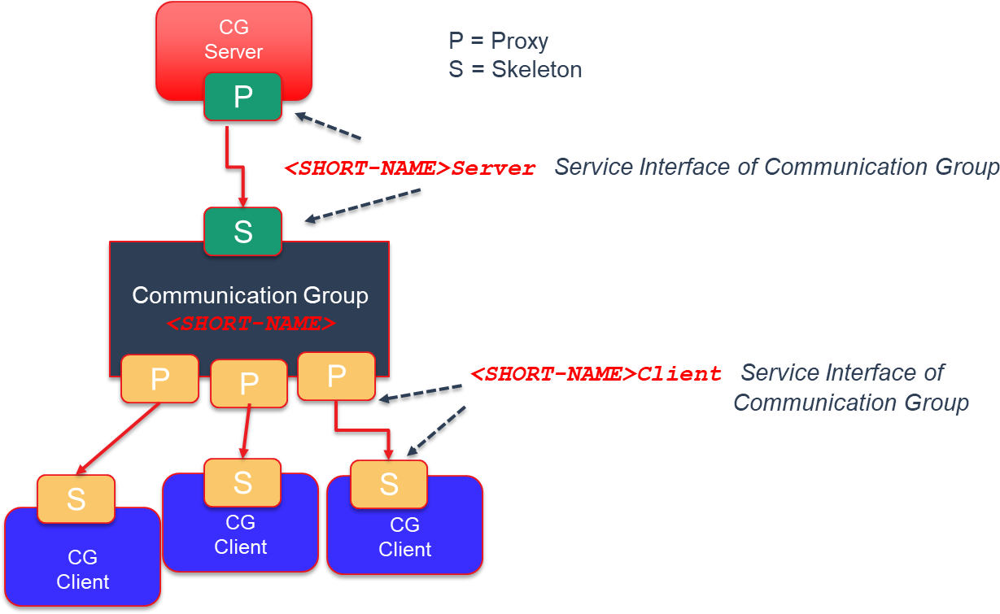

**Figure 5.4: Communication Group**

Note: Message types of a Communciation Group are defined with the
Communciation Group meta-model, see also following chapters.

### Usage Scope

The initial usage of the Communcation Group has been Adaptive State
Management applications. The SWS_StateManagement \[[4](#_bookmark3)\]
specification has defined two Com- munication Groups, named:
[PowerMode](#_bookmark72) and [DiagnosticReset](#_bookmark73). The usage
scope of the State Management Communication Groups are applications
within a machine only. But from design point of view, a Communication
Group supports the connection of local and remote applications (CP and
AP). The figure below presents a local and remote scenarios for
Communication Groups.

> 初始使用的通信组已经是自适应状态管理应用程序。SWS_StateManagement
> [\[4\]](#_bookmark3)
> 规范定义了两个名为PowerMode和DiagnosticReset的通信组。状态管理通信组的使用范围仅限于机器内的应用程序。但从设计角度来看，通信组支持本地和远程应用程序（CP和AP）之间的连接。下图显示了通信组的本地和远程场景。

{width="5.2858967629046365in"
height="2.487082239720035in"}

**Figure 5.5: Communication Group within a Vehicle**

2.  ### Special Topics

    1.  \[\]{#5.7.4.1_Architecture .anchor}**Architecture**

> **建筑**

As before described the Communcation Group contains

> 正如之前描述的，通信小组包含

-   only one Service Skeleton instantiation of type Communication Group
    server ( ServiceInterface with the category value
    [COMMUNICATION_GROUP\_-](#_bookmark21) [SERVER](#_bookmark21)).

> 只有一个类型为Communication Group Server的Service
> Skeleton实例（ServiceInterface的category值为\[COMMUNICATION_GROUP\_-\]（#\_bookmark21）\[SERVER\]（#\_bookmark21））。

Note: Today there is the constraint that only one Communication server
can con- nect to the Communication Group server ServiceInterface.

-   multiple Service Proxy instantiations of type Communication Group
    client( ServiceInterface with the category value
    [COMMUNICATION_GROUP\_-](#_bookmark22) [CLIENT](#_bookmark22)).

> 多个类型为Communication Group client的Service
> Proxy实例（ServiceInterface，其类别值为\[COMMUNICATION_GROUP\_-\]
> \[CLIENT\]）。

Note: The number of Service Proxy instantiations is implementation and
use case dependent. The theoretical limit (not considering for memory
space re- quirements) is the available number of Communication client
*Client_IDs*. On the other side there might be Safety requirements which
force the design to support a limited known number of Communication
Group clients.

### Remote Connection

As mentioned before the Communication Group server or clients can be
remote from the Communication Group instance. This is supported since
the Communication Group is designed as composite service. Therefore also
no limit in terms of AUTOSAR Classic and Adaptive platforms.

> 提到过，通信组服务器或客户端可以远程访问通信组实例。这是可行的，因为通信组被设计为复合服务。因此，对于AUTOSAR
> Classic和Adaptive平台也没有限制。

### Service Versioning

Service contract versioning is supported by the Communication Group by
the according

> 通信小组支持服务合同版本控制。

ServiceInterfaces.

# Tutorials

This selection of tutorials shows some minimal examples on how to use
the fundamen- tals and features of ara::com.

> 这个教程选择展示了一些关于如何使用ara::com的基础和特性的最小示例。

## Usage of Service Interfaces

The [ara::com](#_bookmark15) model elements related to both design and
deployment are included in the Manifest. Since not all the model
elements are relevant in all the development phases, the Manifest can be
divided in different partitions:

> 清单中包含了与设计和部署相关的[ara::com](#_bookmark15)模型元素。由于不是所有的模型元素都与所有的开发阶段相关，因此清单可以分为不同的分区。

-   **Machine Manifest:** Specifies where the Adaptive AUTOSAR Software
    Stack is running. In the MachineDesign the Communication System
    structure is speci- fied. This includes CommunicationConnectors and
    NetworkEndpoints.

> -   **机器清单：** 指定Adaptive
>     AUTOSAR软件堆栈运行的位置。在MachineDesign中指定通信系统结构。这包括通信连接器和网络端点。
> -   [**SI**](#_bookmark71) **Manifest:** Specifies the events, methods
>     and fields that a Service provides.

-   **Execution Manifest:** Specifies the information related to the
    deployment of the applications. This includes Executables and
    Processes. The executable refer- ences an rootSwComponentPrototype.

> 执行清单：指定与应用程序部署相关的信息。这包括可执行文件和进程。可执行文件引用rootSwComponentPrototype。

-   **RPortPrototypes and PPortPrototypes:** The
    rootSwComponentPrototype has an Application Type that defines
    PPortPrototypes and RPortProto- types and they reference the
    corresponding [SI](#_bookmark71)

> -   **RPortPrototypes 和 PPortPrototypes：** rootSwComponentPrototype
>     有一个应用类型，它定义了 PPortPrototypes 和
>     RPortPrototypes，它们引用相应的[SI](#_bookmark71)。

For all the details about the manifest specification please see the
\[[2](#_bookmark1)\].

> 请参阅\[[2](#_bookmark1)\]获取有关清单规范的所有详细信息。

Assuming that the previously mentioned partitions of the Manifest exist,
the following sections describe the deployment of [SI](#_bookmark71) and
ServiceInstance. Finally the most relevant aspects related with the
implementation are also introduced.

> 假设之前提到的Manifest的分区存在，以下部分描述了[SI](#_bookmark71)和ServiceInstance的部署。最后还介绍了与实施相关的最相关的方面。

### Service Interface Deployment

The [SI](#_bookmark71) Deployment describes how the [SI](#_bookmark71)
will communicate over the network. The following information must be
provided:

> SI部署描述了SI如何通过网络进行通信。必须提供以下信息：

-   Reference to the network binding used in the [SI](#_bookmark71)
    Deployment (e.g. SOME/IP, DDS)

-   [SI](#_bookmark71) ID

-   Deployment information for the Events, Methods and Fields. This
    includes IDs and any Network Binding specific information
    (e.g. Transport Protocol)

> 部署事件、方法和字段的信息，包括ID和任何网络绑定特定信息（例如传输协议）。

     **\<AR-PACKAGE\>**

     **\<SHORT-NAME\>**ServiceInterfaceDeployments**\</SHORT-NAME\>**

     **\<ELEMENTS\>**

     **\<SOMEIP-SERVICE-INTERFACE-DEPLOYMENT\>**

     **\<EVENT-DEPLOYMENTS\>**

     **\<SOMEIP-EVENT-DEPLOYMENT\>**

     **\<SHORT-NAME\>**Counter_SOMEIP**\</SHORT-NAME\>**

     **\<EVENT-REF DEST=**\"VARIABLE-DATA-PROTOTYPE\"**\>**/myExample/

     ServiceInterfaces/myInterface/Counter**\</EVENT-REF\>**

     **\<EVENT-ID\>**1**\</EVENT-ID\>**

     **\<TRANSPORT-PROTOCOL\>**UDP**\</TRANSPORT-PROTOCOL\>**

     **\</SOMEIP-EVENT-DEPLOYMENT\>**

     **\</EVENT-DEPLOYMENTS\>**

     **\<SERVICE-INTERFACE-REF DEST=**\"SERVICE-INTERFACE\"**\>**/myExample/

     ServiceInterfaces/myInterface**\</SERVICE-INTERFACE-REF\>**

     **\<SERVICE-INTERFACE-ID\>**99**\</SERVICE-INTERFACE-ID\>**

     **\<SERVICE-INTERFACE-VERSION\>**

     **\<MAJOR-VERSION\>**1**\</MAJOR-VERSION\>**

     **\<MINOR-VERSION\>**0**\</MINOR-VERSION\>**

     **\</SERVICE-INTERFACE-VERSION\>**

     **\</SOMEIP-SERVICE-INTERFACE-DEPLOYMENT\>**

     **\</ELEMENTS\>**

     **\</AR-PACKAGE\>**

     **Listing 6.1: Example Service Interface Deployment**

+methodDeployment

+fieldDeployment

+eventDeployment

0..\*

**Figure 6.1:** \[\]{#\_bookmark175 .anchor}**SOME/IP Service Insterface
Deployment**

### Service Instance Deployment

The Service Instance Deployment consists of Service Instance mapping to
Application Endpoints and to Machine.

> 服务实例部署包括将服务实例映射到应用程序端点和机器。

The mapping to ApplicationEndpoints connects a ServiceInstance to a

> 映射到ApplicationEndpoints将服务实例连接起来

PortPrototype and Process.

> 端口原型和流程

     **\<AR-PACKAGE\>**

     **\<SHORT-NAME\>**ServiceInstanceToPortPrototypeMappings**\</SHORT-NAME\>**

     **\<ELEMENTS\>**

     **\<SERVICE-INSTANCE-TO-PORT-PROTOTYPE-MAPPING\>**

     **\<SHORT-NAME\>**ProvidedServiceInstance_toPort**\</SHORT-NAME\>**

     **\<PORT-PROTOTYPE-IREF\>**

     **\<CONTEXT-ROOT-SW-COMPONENT-PROTOTYPE-REF DEST=**\"ROOT-SW-COMPONENT-

     PROTOTYPE\"**\>**/myExample/Executables/myExecutable/ mySwComponentPrototype**\</CONTEXT-ROOT-SW-COMPONENT-PROTOTYPE-REF\>**

     **\<TARGET-PORT-PROTOTYPE-REF DEST=**\"P-PORT-PROTOTYPE\"**\>**/apd/

     AdaptiveApplicationSwComponentTypes/Publisher/myInterface_PPort**\<**

     **/TARGET-PORT-PROTOTYPE-REF\>**

     **\</PORT-PROTOTYPE-IREF\>**

     **\<PROCESS-REF DEST=**\"PROCESS\"**\>**/apd/Machines/PublisherMachine/ Processes/myProcess**\</PROCESS-REF\>**

     **\<SERVICE-INSTANCE-REF DEST=**\"PROVIDED-SOMEIP-SERVICE-INSTANCE\"**\>**/

     myExample/Machines/myMachine/ServiceInstances/ ProvidedSomeipServiceInstance**\</SERVICE-INSTANCE-REF\>**

     **\</SERVICE-INSTANCE-TO-PORT-PROTOTYPE-MAPPING\>**

     **\</ELEMENTS\>**

     **\</AR-PACKAGE\>**

     **Listing 6.2: Example Service Interface Manifest**

     +portPrototype

     «instanceRef,atpUriDef»

     0..1

     +processDesign

    «atpUriDef»

     0..1

     0..1

    +serviceInstance

    0..1

    +serviceInterfaceDeployment

    0..1

     **Figure 6.2: Service Instance to Port Prototype Mapping**

     The mapping to a Machine connects the ServiceInstance to a Communication- Connector.

     **\<AR-PACKAGE\>**

     **\<SHORT-NAME\>**ServiceInstanceToMachineMappings**\</SHORT-NAME\>**

     **\<ELEMENTS\>**

     **\<SOMEIP-SERVICE-INSTANCE-TO-MACHINE-MAPPING\>**

     **\<SHORT-NAME\>**ProvidedServiceInstance_toMachine**\</SHORT-NAME\>**

     **\<COMMUNICATION-CONNECTOR-REF DEST=**\"ETHERNET-COMMUNICATION-CONNECTOR

     \"**\>**/myExample/MachineDesigns/myMachineDesign/myConnector**\</ COMMUNICATION-CONNECTOR-REF\>**

     **\<SERVICE-INSTANCE-REFS\>**

     **\<SERVICE-INSTANCE-REF DEST=**\"PROVIDED-SOMEIP-SERVICE-INSTANCE\"**\>**/

     myExample/Machines/myMachine/ServiceInstances/ ProvidedSomeipServiceInstance**\</SERVICE-INSTANCE-REF\>**

     **\</SERVICE-INSTANCE-REFS\>**

     **\</SOMEIP-SERVICE-INSTANCE-TO-MACHINE-MAPPING\>**

     **\</ELEMENTS\>**

     **\</AR-PACKAGE\>**

     **Listing 6.3: Example Service Instance to Machine Mapping**

    

    +serviceInstance

    0..\*

    +serviceInterfaceDeployment

    0..1

     **Figure 6.3: Service InstanceToMachineMapping**

     The CommunicationConnector references a NetworkEndpoint that includes Ad- dress, Network Mask and Gateway.

     **\<AR-PACKAGE\>**

     **\<SHORT-NAME\>**CommunicationClusters**\</SHORT-NAME\>**

     **\<ELEMENTS\>**

     **\<ETHERNET-CLUSTER\>**

     **\<SHORT-NAME\>**myNet**\</SHORT-NAME\>**

     **\<ETHERNET-CLUSTER-VARIANTS\>**

     **\<ETHERNET-CLUSTER-CONDITIONAL\>**

     **\<PHYSICAL-CHANNELS\>**

     **\<ETHERNET-PHYSICAL-CHANNEL\>**

     **\<SHORT-NAME\>**myChannel**\</SHORT-NAME\>**

     **\<COMM-CONNECTORS\>**

     **\<COMMUNICATION-CONNECTOR-REF-CONDITIONAL\>**

     **\<COMMUNICATION-CONNECTOR-REF DEST=**\"ETHERNET-COMMUNICATION-

     CONNECTOR\"**\>**/myExample/MachineDesigns/myMachineDesign/ myConnector**\</COMMUNICATION-CONNECTOR-REF\>**

     **\</COMMUNICATION-CONNECTOR-REF-CONDITIONAL\>**

     **\</COMM-CONNECTORS\>**

     **\<NETWORK-ENDPOINTS\>**

     **\<NETWORK-ENDPOINT\>**

     **\<SHORT-NAME\>**myMachineEndpoint**\</SHORT-NAME\>**

     **\<FULLY-QUALIFIED-DOMAIN-NAME/\>**

     **\<NETWORK-ENDPOINT-ADDRESSES\>**

     **\<IPV-4-CONFIGURATION\>**

     **\<DEFAULT-GATEWAY\>**192.168.7.1**\</DEFAULT-GATEWAY\>**

     **\<IPV-4-ADDRESS\>**192.168.7.2**\</IPV-4-ADDRESS\>**

     **\<NETWORK-MASK\>**255.255.255.0**\</NETWORK-MASK\>**

     **\</IPV-4-CONFIGURATION\>**

     **\</NETWORK-ENDPOINT-ADDRESSES\>**

     **\</NETWORK-ENDPOINT\>**

     **\<SHORT-NAME\>**mySDEndpoint**\</SHORT-NAME\>**

     **\<FULLY-QUALIFIED-DOMAIN-NAME/\>**

     **\<NETWORK-ENDPOINT-ADDRESSES\>**

     **\<IPV-4-CONFIGURATION\>**

     **\<IPV-4-ADDRESS\>**224.244.224.245**\</IPV-4-ADDRESS\>**

     **\</IPV-4-CONFIGURATION\>**

     **\</NETWORK-ENDPOINT-ADDRESSES\>**

     **\</NETWORK-ENDPOINT\>**

     **\</NETWORK-ENDPOINTS\>**

     **\</ETHERNET-PHYSICAL-CHANNEL\>**

     **\</PHYSICAL-CHANNELS\>**

     **\</ETHERNET-CLUSTER-CONDITIONAL\>**

     **\</ETHERNET-CLUSTER-VARIANTS\>**

     **\</ETHERNET-CLUSTER\>**

     **\</ELEMENTS\>**

     **\</AR-PACKAGE\>**

     {width="0.154086832895888in" height="7.999890638670167e-2in"}**Listing 6.4: Example Service Interface Manifest**

    +----------------------------------------------+---------------------------+------------------------------------------------------------+
    | *AtpStructureElement*                        | > +communicationConnector | > *Identifiable*                                           |
    |                                              |                           | >                                                          |
    | *FibexElement*                               |                           | > *CommunicationConnector*                                 |
    |                                              |                           |                                                            |
    | > MachineDesign                              |                           |                                                            |
    +==============================================+===========================+============================================================+
    |                                              |                           | \+ createEcuWakeupSource: Boolean \[0..1\]                 |
    |                                              |                           |                                                            |
    |                                              |                           | \+ pncFilterArrayMask: PositiveInteger \[0..\*\] {ordered} |
    +----------------------------------------------+---------------------------+------------------------------------------------------------+
    | \+ accessControl: AccessControlEnum \[0..1\] | > «atpSplitable» 0..\*    |                                                            |
    |                                              |                           |                                                            |
    | \+ pncPrepareSleepTimer: TimeValue \[0..1\]  |                           |                                                            |
    |                                              |                           |                                                            |
    | \+ pnResetTimer: TimeValue \[0..1\]          |                           |                                                            |
    +----------------------------------------------+---------------------------+------------------------------------------------------------+

     EthernetCommunicationConnector

     \+ maximumTransmissionUnit: PositiveInteger \[0..1\]

     \+ neighborCacheSize: PositiveInteger \[0..1\]

     \+ pathMtuEnabled: Boolean \[0..1\]

     \+ pathMtuTimeout: TimeValue \[0..1\]

     «atpVariation,atpSplitable»

     +physicalChannel 1..\*

     *Identifiable*

    +unicastNetworkEndpoint

    NetworkEndpoint

     0..\*

     *Identifiable*

    *PhysicalChannel*

     \+ fullyQualifiedDomainName: String \[0..1\]

     \+ priority: PositiveInteger \[0..1\]

    0..\*

     +networkEndpoint

     «atpSplitable»

     +networkEndpointAddress 1..\*

     EthernetPhysicalChannel *NetworkEndpointAddress*

    Ipv4Configuration

     \+ assignmentPriority: PositiveInteger \[0..1\]

     \+ defaultGateway: Ip4AddressString \[0..1\]

     \+ dnsServerAddress: Ip4AddressString \[0..\*\]

     \+ ipAddressKeepBehavior: IpAddressKeepEnum \[0..1\]

     \+ ipv4Address: Ip4AddressString \[0..1\]

     \+ ipv4AddressSource: Ipv4AddressSourceEnum \[0..1\]

     \+ networkMask: Ip4AddressString \[0..1\]

     \+ ttl: PositiveInteger \[0..1\]

     Ipv6Configuration

     \+ assignmentPriority: PositiveInteger \[0..1\]

     \+ defaultRouter: Ip6AddressString \[0..1\]

     \+ dnsServerAddress: Ip6AddressString \[0..\*\]

     \+ enableAnycast: Boolean \[0..1\]

     \+ hopCount: PositiveInteger \[0..1\]

     \+ ipAddressKeepBehavior: IpAddressKeepEnum \[0..1\]

     \+ ipAddressPrefixLength: PositiveInteger \[0..1\]

     \+ ipv6Address: Ip6AddressString \[0..1\]

     \+ ipv6AddressSource: Ipv6AddressSourceEnum \[0..1\]

     **Figure 6.4: Network Connection**

### Service Implementation

Services are implemented in an application layer and are also used by
the other applications. To enable the communication be- tween both
applications the Service Discovery protocol is used.

> 服务在应用层实现，也被其他应用程序使用。为了实现两个应用之间的通信，使用服务发现协议。

**Figure 6.5: Service Discovery**

The Communication Management provides a method in the Service Skeleton
class to offer the service:

> 通信管理在服务骨架类中提供了一种方法，以提供服务。

     ara::core::Result\<void\> OfferService();

After the method OfferService() has been called, the service can be
found by the applications. The Communication Management provides in the
Service Proxy class a methods to find a service according to the
[InstanceIdentifier](#_bookmark31) or InstanceSpecifier:

> 在调用OfferService（）方法之后，应用程序可以找到该服务。通信管理在Service
> Proxy类中提供了根据\[InstanceIdentifier\]（#\_bookmark31）或InstanceSpecifier查找服务的方法：

     static ara::core::Result\<ara::com::ServiceHandleContainer\<

     \<ProxyClassName\>::HandleType\>\> FindService(ara::com::InstanceIdentifier instance);

     static ara::core::Result\<ara::com::ServiceHandleContainer\<

     \<ProxyClassName\>::HandleType\>\> FindService(ara::core::InstanceSpecifier instance);

These methods return a ServiceHandleContainer that can have different
number of elements:

> 这些方法返回一个可以具有不同数量元素的ServiceHandleContainer。

-   Empty: No Service Instance was found
-   One: A single Service instance was found
-   Several: Multiple Service instances were found

The example in [5.5](#_bookmark115) (lines 52 - 60) shows how to create
a Service Proxy using

> [5.5](#_bookmark115) 中（52-60 行）的示例展示了如何创建服务代理。

FindService().

A Service Handler gives access to all the events, methods and fields of
the service. For the events, the application has to subscibe to the
events using the corresponding method setting also the size of the cache
for this event :

> 服务处理程序提供对服务的所有事件、方法和字段的访问。对于事件，应用程序必须使用相应的方法订阅事件，同时还要为该事件设置缓存大小。

     ara::core:Result\<void\> Event::Subscribe(size_t maxSampleCount);

To unsubscribe to an event the Unsubscribe method must be used:

> 要取消订阅某个事件，必须使用取消订阅方法。

     void Event::Unsubscribe();

The example in [5.5](#_bookmark115) (lines 62 - 64) shows how to
subscribe for an event.

> 例子[5.5](#_bookmark115)（行62-64）展示了如何订阅一个事件。

The application code for the Service Proxy and Skeleton is generated
according to the [SI](#_bookmark71) defined in the Manifest. An example
of the generated code for the Proxy Class can be found in the
[5.2](#_bookmark104) and for the Skeleton Class in [5.12](#_bookmark127)

> 应用程序代码根据清单中定义的[SI](#_bookmark71)为服务代理和骨架生成。
> 代理类的生成代码的示例可以在[5.2](#_bookmark104)中找到，而骨架类在[5.12](#_bookmark127)中找到。

## Usage of InstanceSpecifier

InstanceSpecifier is a core concept defined in \[[3](#_bookmark2)\],
representing a \"/\"-separated list of shortNames of model elements
conforming an absolute path to an specific model element. In less formal
terms, Instance Specifiers bridge Adaptive Platform models and
applications, allowing application code to unequivocally reference
resource instances defined by the system model.

> 实例指示符是在[\[3\]](#_bookmark2)中定义的核心概念，它表示一个"/"分隔的模型元素的简称列表，构成一个到特定模型元素的绝对路径。用不太正式的话说，实例指示符桥接自适应平台模型和应用程序，允许应用程序代码明确引用系统模型定义的资源实例。

The instances referenced by Instance Specifiers may be of many different
kinds: pro- vided or required service instances, key/value or file
stores, or cryptographic resources, to name a few.

> 实例规范所指的实例可以是多种不同类型的：提供的或所需的服务实例、键/值或文件存储，或者加密资源，这只是其中的一些。

In the C++ language binding of the Adaptive Platform, the
InstanceSpecifier class has several common traits:

> 在Adaptive
> Platform的C++语言绑定中，InstanceSpecifier类具有几个常见特征：

-   It is **not** default constructible.
-   It is copiable and movable.
-   It is comparable against StringView and other InstanceSpecifier
    objects.
-   It is explicitly convertible to StringView.

See listing [4.2](#_bookmark93) in chapter
[subsection](#instance-identifiers-and-instance-specifiers)
[4.8.1](#instance-identifiers-and-instance-specifiers) for more detailed
information.

> 请参阅第4.8.1节（实例标识符和实例规范）中的4.2列表，以获取更详细的信息。

Considering these characteristics, the only way to create a new
InstanceSpecifier object that's not a copy or a move of an existing one
is to do so from a StringView object.

> 考虑到这些特征，创建一个新的InstanceSpecifier对象而不是复制或移动现有对象的唯一方法是从StringView对象中进行。

In practice, the contents of such StringView are syntactically but not
semantically checked upon construction. This means that construction
succeeds as long as the source StringView object contains a
\"/\"-separated list of names conformed only of

> 在实践中，这种StringView的内容在构建时只进行了语法检查，而没有进行语义检查。这意味着，只要源StringView对象包含了一个仅由"/"分隔的名称列表，构建就会成功。

from which the application derives, is something that will be checked by
the different functional clusters when attempting to access or
instantiate resources pointed by the InstanceSpecifier in question.

> 此应用所派生的内容，将在尝试访问或实例化由问题中的InstanceSpecifier指向的资源时，由不同的功能集群进行检查。

The following examples show the way in which, according to
\[[1](#_bookmark0)\], InstanceSpeci- fiers might be used to instantiate
and access services via skeleton and proxy classes.

> 以下示例展示了根据\[1\]，使用InstanceSpeci-fiers实例化和通过骨架和代理类访问服务的方式。

Instance specifiers point to instances of port prototypes associated
with a service. Therefore multiple instance specifiers for each
PortPrototype can be created. In the examples below,
*SwComponentInstance_0* and *SwComponentInstance_1* are 2 instantiations
of the the same SwComponentPrototype, containing the RPortPro- totype
*RPort_3*:

> 实例说明符指向与服务关联的端口原型的实例。因此，可以为每个PortPrototype创建多个实例说明符。在下面的示例中，\*
> SwComponentInstance_0 *和* SwComponentInstance_1
> *是同一个SwComponentPrototype的两个实例，其中包含RPortPro- totype *
> RPort_3 \*：

    #include \"ara/core/instance_specifier.h\"

    #include \"ara/com/sample/tire_skeleton.h\"

    class TireSkeletonImplementation : public ara::com::sample::skeleton:: TireSkeleton

    {

    using TireSkeleton::TireSkeleton;

    // Implement service interface methods, if any

    };

    int main()

    {

    const ara::core::InstanceSpecifier tire0_Instance{\"/ServerExe/ RootSWCP_0/Comp_Lvl1/Comp_Lvl2/SwComponentInstance_0/PPort_3\"};

    const ara::core::InstanceSpecifier tire1_Instance{\"/ServerExe/ RootSWCP_0/Comp_Lvl1/Comp_Lvl2/SwComponentInstance_1/PPort_3\"};

    TireSkeletonImplementation tire0(tire0_Instance);

    TireSkeletonImplementation tire1(tire1_Instance);

    // Sleep while Skeleton instances run, process requests, etc.

    return 0;

    }

     **Listing 6.5: Example Usage of Instance Specifiers with Skeletons**

    #include \"ara/core/instance_specifier.h\"

    #include \"ara/com/sample/tire_proxy.h\"

    int main()

    {

    using Proxy = ara::com::sample::proxy::TireProxy;

    const ara::core::InstanceSpecifier tire0_Instance{\"/ClientExe/ RootSWCP_0/Comp_Lvl1/Comp_Lvl2/SwComponentInstance_0/RPort_3\"};

    const ara::core::InstanceSpecifier tire1_Instance{\"/ClientExe/ RootSWCP_0/Comp_Lvl1/Comp_Lvl2/SwComponentInstance_1/RPort_3\"};

    auto tire0_handles = Proxy::FindService(tire0_Instance).ValueOrThrow();

    auto tire1_handles = Proxy::FindService(tire1_Instance).ValueOrThrow();

    Proxy tire0(tire0_handles\[0\]);

    Proxy tire1(tire1_handles\[0\]);

    // Call methods, subscribe to events, etc.

    return 0;

    }

**Listing 6.6: Example Usage of Instance Specifiers with Proxies**

> 例6.6：使用代理的实例指定示例

In these examples the AUTOSAR Adaptive implementation manages
process-specific manifests with isolated contexts. These can be dictated
on process startup via e.g. command line arguments, environment
variables, working directory contents or any other
implementation-specific means.

> 在这些示例中，AUTOSAR
> Adaptive实施管理具有隔离上下文的特定进程清单。这些可以通过例如命令行参数、环境变量、工作目录内容或任何其他实施特定的方式在进程启动时指定。

### Modeling and configuration/mapping over Manifest from user perspective

The InstanceSpecifier used for finding a service maps to the particular
instance of the port associated with that service.

> 实例指定符用于查找服务映射到与该服务关联的端口的特定实例。

    #include \"ara/core/instance_specifier.h\"

    #include \"ara/com/sample/radar_proxy.h\"

     4

    int main() {

    using Proxy = ara::com::sample::proxy::radarProxy;

    // \...

    ara::core::InstanceSpecifier portSpecifier{\"fusionExe/fusion/ radar_RPort\"};

    auto res = Proxy::FindService(portSpecifier);

    //\....

    }

**Listing 6.7: CPP Example Usage with FindService**

> **列表6.7：使用FindService的CPP示例**

In the Application Design, the Executable node specifies its
RootSwCompo- nentPrototype. In turn the SwComponentPrototype defines one
or more Port- Prototype.

> 在应用程序设计中，可执行节点指定其根SwComponentPrototype。反过来，SwComponentPrototype定义一个或多个端口原型。

     **\<?xml version=**\"1.0\" **encoding=**\"UTF-8\"**?\>**

     **\<AUTOSAR xmlns=**[\"http://autosar.org/schema/r4.0\"](http://autosar.org/schema/r4.0) **xmlns:xsi=**\"http://www.w3. org/2001/XMLSchema-instance\" **xsi:schemaLocation=**[\"http://autosar.org/](http://autosar.org/) schema/r4.0 AUTOSAR_00049.xsd\"**\>**

     **\<AR-PACKAGES\>**

     **\<AR-PACKAGE\>**

     **\<AR-PACKAGE\>**

     **\<SHORT-NAME\>**apd**\</SHORT-NAME\>**

     **\<AR-PACKAGE\>**

     **\<SHORT-NAME\>**da**\</SHORT-NAME\>**

     **\<ELEMENTS\>**

     **\<EXECUTABLE\>**

     **\<SHORT-NAME\>**fusionExe**\</SHORT-NAME\>**

     **\<CATEGORY\>**APPLICATION_LEVEL**\</CATEGORY\>**

     **\<SHORT-NAME\>**fusion**\</SHORT-NAME\>**

     **\<APPLICATION-TYPE-TREF DEST=**\"ADAPTIVE-APPLICATION-SW- COMPONENT-TYPE\"**\>**/apd/da/fusion**\</APPLICATION-TYPE-TREF\>**

     **\</ROOT-SW-COMPONENT-PROTOTYPE\>**

     **\</EXECUTABLE\>**

     **\<ADAPTIVE-APPLICATION-SW-COMPONENT-TYPE\>**

     **\<SHORT-NAME\>**fusion**\</SHORT-NAME\>**

     **\<PORTS\>**

     **\<R-PORT-PROTOTYPE\>**

     **\<SHORT-NAME\>**radar_RPort**\</SHORT-NAME\>**

     **\<REQUIRED-INTERFACE-TREF DEST=**\"SERVICE-INTERFACE\"**\>**/apd/da

     /radar**\</REQUIRED-INTERFACE-TREF\>**

     **\</R-PORT-PROTOTYPE\>**

     **\</PORTS\>**

     **\</ADAPTIVE-APPLICATION-SW-COMPONENT-TYPE\>**

     **\<SOMEIP-SERVICE-INTERFACE-DEPLOYMENT\>**

     **\<SHORT-NAME\>**radar_Someip**\</SHORT-NAME\>**

     **\<!*\-- \...\... \--*\>**

     **\</SOMEIP-SERVICE-INTERFACE-DEPLOYMENT\>**

    **\</ELEMENTS\>**

    **\</AR-PACKAGE\>**

     **\</AR-PACKAGE\>**

     **\</AR-PACKAGE\>**

     **\</AR-PACKAGES\>**

     **\</AUTOSAR\>**

     **Listing 6.8: Path towards port instance**

See [Figure](#_bookmark175) [6.1](#_bookmark175) for the SOME/IP Service
Interface Deployment.

> 见[图6.1](#_bookmark175)，了解SOME / IP服务接口部署情况。

The mapping between a RequiredServiceInstance and an InstanceSpeci- fier
is done via the *Service Instance Manifest*. In the Service Instance
Man- ifest the ServiceInstanceToPortPrototypeMapping defines which
*Service Instance* is associated with a certain port inside a specific
RootSwComponentProto- type. The RequiredServiceInstance specifies the
InstanceId as Require- ServiceInstanceId, in the example below this
value is 19.

> 在服务实例清单中，ServiceInstanceToPortPrototypeMapping定义了哪个服务实例与特定RootSwComponentPrototype中的特定端口相关联。RequiredServiceInstance指定InstanceId作为RequiredServiceInstanceId，在下面的示例中，该值为19，这就完成了RequiredServiceInstance和InstanceSpecifier之间的映射。

     **\<?xml version=**\"1.0\" **encoding=**\"UTF-8\"**?\>**

     **\<AUTOSAR xmlns=**[\"http://autosar.org/schema/r4.0\"](http://autosar.org/schema/r4.0) **xmlns:xsi=**\"http://www.w3. org/2001/XMLSchema-instance\" **xsi:schemaLocation=**[\"http://autosar.org/](http://autosar.org/) schema/r4.0 AUTOSAR_00049.xsd\"**\>**

     **\<AR-PACKAGES\>**

     **\<AR-PACKAGE\>**

     **\<AR-PACKAGE\>**

     **\<SHORT-NAME\>**apd**\</SHORT-NAME\>**

     **\<AR-PACKAGE\>**

     **\<SHORT-NAME\>**da**\</SHORT-NAME\>**

     **\<AR-PACKAGE\>**

     **\<ELEMENTS\>**

     **\<SHORT-NAME\>**instance**\</SHORT-NAME\>**

     **\<SHORT-NAME\>**radar_RequiredServiceInstance_toMachine**\</ SHORT-NAME\>**

     **\<COMMUNICATION-CONNECTOR-REF DEST=**\"ETHERNET-

     COMMUNICATION-CONNECTOR\"**\>**/apd/da/fusionMachineDesign

     /fusionCommunicationConnector**\</COMMUNICATION- CONNECTOR-REF\>**

     **\<SERVICE-INSTANCE-REFS\>**

     **\<SERVICE-INSTANCE-REF DEST=**\"REQUIRED-SOMEIP-SERVICE-

     INSTANCE\"**\>**/apd/da/instance/ radar_RequiredSomeipServiceInstance**\</SERVICE- INSTANCE-REF\>**

     **\</SERVICE-INSTANCE-REFS\>**

     **\<UDP-PORT\>**33111**\</UDP-PORT\>**

     **\</SOMEIP-SERVICE-INSTANCE-TO-MACHINE-MAPPING\>**

     **\<SERVICE-INSTANCE-TO-PORT-PROTOTYPE-MAPPING\>**

     **\<SHORT-NAME\>**radar_RequiredServiceInstance_toPort**\</SHORT**

     **-NAME\>**

     **\<PORT-PROTOTYPE-IREF\>**

     **\<CONTEXT-ROOT-SW-COMPONENT-PROTOTYPE-REF DEST=**\"ROOT-

     SW-COMPONENT-PROTOTYPE\"**\>**/apd/da/fusionExe/fusion**\</ CONTEXT-ROOT-SW-COMPONENT-PROTOTYPE-REF\>**

     **\<TARGET-PORT-PROTOTYPE-REF DEST=**\"R-PORT-PROTOTYPE\"**\>**/

     apd/da/fusion/radar_RPort**\</TARGET-PORT-PROTOTYPE- REF\>**

     **\</PORT-PROTOTYPE-IREF\>**

     **\<PROCESS-REF DEST=**\"PROCESS\"**\>**/apd/da/fusion_instance1**\</ PROCESS-REF\>**

     **\<SERVICE-INSTANCE-REF DEST=**\"REQUIRED-SOMEIP-SERVICE-

     INSTANCE\"**\>**/apd/da/instance/ radar_RequiredSomeipServiceInstance**\</SERVICE- INSTANCE-REF\>**

     **\</SERVICE-INSTANCE-TO-PORT-PROTOTYPE-MAPPING\>**

     **\<REQUIRED-SOMEIP-SERVICE-INSTANCE\>**

     **\<SHORT-NAME\>**radar_RequiredSomeipServiceInstance**\</SHORT- NAME\>**

     **\<SERVICE-INTERFACE-DEPLOYMENT-REF DEST=**\"SOMEIP-SERVICE-

     INTERFACE-DEPLOYMENT\"**\>**/apd/da/deployment/ radar_Someip**\</SERVICE-INTERFACE-DEPLOYMENT-REF\>**

     **\<!*\-- \...\... \--*\>**

     **\<REQUIRED-MINOR-VERSION\>**0**\</REQUIRED-MINOR-VERSION\>**

     **\<REQUIRED-SERVICE-INSTANCE-ID\>**19**\</REQUIRED-SERVICE- INSTANCE-ID\>**

     **\</REQUIRED-SOMEIP-SERVICE-INSTANCE\>**

    **\</ELEMENTS\>**

    **\</AR-PACKAGE\>**

     **\</AR-PACKAGE\>**

     **\</AR-PACKAGE\>**

     **\</AR-PACKAGES\>**

     **\</AUTOSAR\>**

**Listing 6.9: Service Instance Manifest specification of
RequiredServiceInstance**

> 列表6.9：RequiredServiceInstance服务实例清单规格

**Figure 6.6: SOME/IP Required Service Instance
Deployment**

**Note**: An executable can be started multiple times. Each of the
processes is started with a different Service Instance Manifest,
therefore the mapping between an In- stanceSpecifier and a
RequiredServiceInstance will be different between the separate
processes.

> **注意**：可执行文件可以被多次启动。每个进程都使用不同的服务实例清单启动，因此InstanceSpecifier和RequiredServiceInstance之间的映射在不同的进程之间会有所不同。

### Instance IDs only for provided Services

The InstanceSpecifier and the [InstanceIdentifier](#_bookmark31) can be
used to uniquely identify a provided service. This means that clients
know which particular service instance they are communicating with. This
information is lacking for provided services. Clients can't be uniquely
identified with an [InstanceIdentifier](#_bookmark31), therefore the
server can't know for sure with which client it communicates with. For
most cases this is not a problem, however we envision that for safety
this can be a problem. For these cases we recommend using the E2E
parameter dataID of the method E2E_check (see \[PRS_E2E_00323\] of
\[[10](#_bookmark9)\]).

> 实例规范和[实例标识符](#_bookmark31)可用于唯一标识提供的服务。这意味着客户端知道它们正在与哪个特定服务实例通信。但是，提供的服务缺少此信息。无法使用[实例标识符](#_bookmark31)来唯一标识客户端，因此服务器无法确定它正在与哪个客户端通信。在大多数情况下，这不是问题，但我们认为，为了安全起见，这可能是一个问题。对于这些情况，我们建议使用方法E2E_check的E2E参数dataID（请参见\[[10](#_bookmark9)\]中的\[PRS_E2E_00323\]）。

## Usage in context of MultiBinding

The following section revamps the example shown in
[6.2.1](#modeling-and-configurationmapping-over-manifest-from-user-perspective),
depicting how multiple network bindings for a single PPortPrototype can
be defined in the Application and Instance Manifests without altering
the Adaptive Application's source code. In this case, we will add an
additional DDS-based instatiation of the /apd/da/radar
[SI](#_bookmark71).

> 以下部分重新编排了[6.2.1](#modeling-and-configurationmapping-over-manifest-from-user-perspective)中示例所示，描述了如何在应用程序和实例清单中为单个PPortPrototype定义多个网络绑定，而不改变自适应应用程序的源代码。在这种情况下，我们将添加另一个基于DDS的/apd/da/radar
> [SI](#_bookmark71)实例。

To begin with, the Application Manifest is extended with an
DdsServiceInter- faceDeployment, named radar_Dds, portraying
DDS-specific deployment ele- ments of the [SI](#_bookmark71):

> 首先，应用程序清单被扩展了一个叫做radar_Dds的DdsServiceInterfaceDeployment，描述了[SI](#_bookmark71)的DDS特定部署元素。

     **\<?xml version=**\"1.0\" **encoding=**\"UTF-8\"**?\>**

     **\<AUTOSAR xmlns=**[\"http://autosar.org/schema/r4.0\"](http://autosar.org/schema/r4.0) **xmlns:xsi=**\"http://www.w3. org/2001/XMLSchema-instance\" **xsi:schemaLocation=**[\"http://autosar.org/](http://autosar.org/) schema/r4.0 AUTOSAR_00049.xsd\"**\>**

     **\<AR-PACKAGES\>**

     **\<AR-PACKAGE\>**

     **\<AR-PACKAGE\>**

     **\<SHORT-NAME\>**apd**\</SHORT-NAME\>**

     **\<AR-PACKAGE\>**

     **\<SHORT-NAME\>**da**\</SHORT-NAME\>**

     **\<ELEMENTS\>**

     **\<EXECUTABLE\>**

     **\<SHORT-NAME\>**fusionExe**\</SHORT-NAME\>**

     **\<CATEGORY\>**APPLICATION_LEVEL**\</CATEGORY\>**

     **\<ROOT-SW-COMPONENT-PROTOTYPE\>**

     **\<SHORT-NAME\>**fusion**\</SHORT-NAME\>**

     **\<APPLICATION-TYPE-TREF DEST=**\"ADAPTIVE-APPLICATION-SW- COMPONENT-TYPE\"**\>**/apd/da/fusion**\</APPLICATION-TYPE-TREF\>**

     **\</ROOT-SW-COMPONENT-PROTOTYPE\>**

     **\</EXECUTABLE\>**

     **\<ADAPTIVE-APPLICATION-SW-COMPONENT-TYPE\>**

     **\<SHORT-NAME\>**fusion**\</SHORT-NAME\>**

     **\<PORTS\>**

     **\<P-PORT-PROTOTYPE\>**

     **\<SHORT-NAME\>**radar_PPort**\</SHORT-NAME\>**

     **\<PROVIDED-INTERFACE-TREF DEST=**\"SERVICE-INTERFACE\"**\>**/apd/da

     /radar**\</PROVIDED-INTERFACE-TREF\>**

     **\</P-PORT-PROTOTYPE\>**

     **\</PORTS\>**

     **\</ADAPTIVE-APPLICATION-SW-COMPONENT-TYPE\>**

     **\<SOMEIP-SERVICE-INTERFACE-DEPLOYMENT\>**

     **\<SHORT-NAME\>**radar_Someip**\</SHORT-NAME\>**

     **\<!*\-- \...\... \--*\>**

     **\</SOMEIP-SERVICE-INTERFACE-DEPLOYMENT\>**

     **\<DDS-SERVICE-INTERFACE-DEPLOYMENT\>**

     **\<SHORT-NAME\>**radar_Dds**\</SHORT-NAME\>**

     **\<!*\-- \...\... \--*\>**

     **\</DDS-SERVICE-INTERFACE-DEPLOYMENT\>**

    **\</ELEMENTS\>**

    **\</AR-PACKAGE\>**

     **\</AR-PACKAGE\>**

     **\</AR-PACKAGE\>**

     **\</AR-PACKAGES\>**

     **\</AUTOSAR\>**

**Listing 6.10: Path towards port instance**

> 列表6.10：前往端口实例的路径

See [Figure](#_bookmark175) [6.1](#_bookmark175) for the SOME/IP Service
Interface Deployment.

> 请参考图6.1，了解SOME/IP服务接口部署情况。

+fieldDeployment

+eventDeployment

0..\*

{width="8.022747156605424e-2in"
height="0.15312445319335083in"}

     +fieldTopicsAccessRule

     +eventTopicAccessRule 0..1

    0..1

**Figure 6.7: DDS Service Interface Deployment**

In the Instance Manifest, separate sets of ServiceInstanceToMachineMap-
ping, ServiceInstanceToPortPrototypeMapping and ProvidedService-
Instance are listed, each defining SOME/IP and DDS-specific deployment
param- eters.

> 在实例清单中，列出了单独的ServiceInstanceToMachineMapping、ServiceInstanceToPortPrototypeMapping和ProvidedServiceInstance集合，每个集合定义了SOME/IP和DDS特定的部署参数。

     **\<?xml version=**\"1.0\" **encoding=**\"UTF-8\"**?\>**

     **\<AUTOSAR xmlns=**[\"http://autosar.org/schema/r4.0\"](http://autosar.org/schema/r4.0) **xmlns:xsi=**\"http://www.w3. org/2001/XMLSchema-instance\" **xsi:schemaLocation=**[\"http://autosar.org/](http://autosar.org/) schema/r4.0 AUTOSAR_00049.xsd\"**\>**

     **\<AR-PACKAGES\>**

     **\<AR-PACKAGE\>**

     **\<AR-PACKAGE\>**

     **\<SHORT-NAME\>**apd**\</SHORT-NAME\>**

     **\<AR-PACKAGE\>**

     **\<SHORT-NAME\>**da**\</SHORT-NAME\>**

     **\<AR-PACKAGE\>**

     **\<SHORT-NAME\>**instance**\</SHORT-NAME\>**

     **\<ELEMENTS\>**

     **\<!*\-- For SOME/IP \--*\>**

     **\<SOMEIP-SERVICE-INSTANCE-TO-MACHINE-MAPPING\>**

     **\<SHORT-NAME\>**

     radar_ProvidedServiceInstance_toMachine_Someip**\</ SHORT-NAME\>**

     **\<COMMUNICATION-CONNECTOR-REF DEST=**\"ETHERNET-

     COMMUNICATION-CONNECTOR\"**\>**/apd/da/fusionMachineDesign

     /fusionCommunicationConnector**\</COMMUNICATION- CONNECTOR-REF\>**

     **\<SERVICE-INSTANCE-REFS\>**

     **\<SERVICE-INSTANCE-REF DEST=**\"PROVIDED-SOMEIP-SERVICE-

     INSTANCE\"**\>**/apd/da/instance/ radar_ProvidedSomeipServiceInstance**\</SERVICE- INSTANCE-REF\>**

     **\</SERVICE-INSTANCE-REFS\>**

     **\<UDP-PORT\>**33111**\</UDP-PORT\>**

     **\</SOMEIP-SERVICE-INSTANCE-TO-MACHINE-MAPPING\>**

     **\<SERVICE-INSTANCE-TO-PORT-PROTOTYPE-MAPPING\>**

     **\<SHORT-NAME\>**radar_ProvidedServiceInstance_toPort_Someip

     **\</SHORT-NAME\>**

     **\<PORT-PROTOTYPE-IREF\>**

     **\<CONTEXT-ROOT-SW-COMPONENT-PROTOTYPE-REF DEST=**\"ROOT-

     SW-COMPONENT-PROTOTYPE\"**\>**/apd/da/fusionExe/fusion**\</ CONTEXT-ROOT-SW-COMPONENT-PROTOTYPE-REF\>**

     **\<TARGET-PORT-PROTOTYPE-REF DEST=**\"P-PORT-PROTOTYPE\"**\>**/

     apd/da/fusion/radar_PPort**\</TARGET-PORT-PROTOTYPE- REF\>**

     **\</PORT-PROTOTYPE-IREF\>**

     **\<PROCESS-REF DEST=**\"PROCESS\"**\>**/apd/da/fusion_instance1**\</ PROCESS-REF\>**

     **\<SERVICE-INSTANCE-REF DEST=**\"PROVIDED-SOMEIP-SERVICE-

     INSTANCE\"**\>**/apd/da/instance/ radar_ProvidedSomeipServiceInstance**\</SERVICE- INSTANCE-REF\>**

     **\</SERVICE-INSTANCE-TO-PORT-PROTOTYPE-MAPPING\>**

     **\<SOMEIP-PROVIDED-SERVICE-INSTANCE\>**

     **\<SHORT-NAME\>**radar_ProvidedSomeipServiceInstance**\</SHORT- NAME\>**

     **\<SERVICE-INTERFACE-DEPLOYMENT-REF DEST=**\"SOMEIP-SERVICE-

     INTERFACE-DEPLOYMENT\"**\>**/apd/da/deployment/ radar_Someip**\</SERVICE-INTERFACE-DEPLOYMENT-REF\>**

     **\<!*\-- \...\... \--*\>**

     **\<SERVICE-INSTANCE-ID\>**19**\</SERVICE-INSTANCE-ID\>**

     **\</SOMEIP-PROVIDED-SERVICE-INSTANCE\>**

     **\<!*\-- For DDS \--*\>**

     **\<DDS-SERVICE-INSTANCE-TO-MACHINE-MAPPING\>**

     **\<SHORT-NAME\>**radar_ProvidedServiceInstance_toMachine_Dds

     **\</SHORT-NAME\>**

     **\<COMMUNICATION-CONNECTOR-REF DEST=**\"ETHERNET-

     COMMUNICATION-CONNECTOR\"**\>**/apd/da/fusionMachineDesign

     /fusionCommunicationConnector**\</COMMUNICATION- CONNECTOR-REF\>**

     **\<SERVICE-INSTANCE-REFS\>**

     **\<SERVICE-INSTANCE-REF DEST=**\"DDS-PROVIDED-SERVICE-

     INSTANCE\"**\>**/apd/da/instance/ radar_ProvidedSomeipServiceInstance**\</SERVICE- INSTANCE-REF\>**

     **\</SERVICE-INSTANCE-REFS\>**

     **\</DDS-SERVICE-INSTANCE-TO-MACHINE-MAPPING\>**

     **\<SERVICE-INSTANCE-TO-PORT-PROTOTYPE-MAPPING\>**

     **\<SHORT-NAME\>**radar_ProvidedServiceInstance_toPort_Dds**\</**

     **\<PORT-PROTOTYPE-IREF\>**

     **\<CONTEXT-ROOT-SW-COMPONENT-PROTOTYPE-REF DEST=**\"ROOT-

     SW-COMPONENT-PROTOTYPE\"**\>**/apd/da/fusionExe/fusion**\</ CONTEXT-ROOT-SW-COMPONENT-PROTOTYPE-REF\>**

     **\<TARGET-PORT-PROTOTYPE-REF DEST=**\"P-PORT-PROTOTYPE\"**\>**/

     apd/da/fusion/radar_PPort**\</TARGET-PORT-PROTOTYPE- REF\>**

     **\</PORT-PROTOTYPE-IREF\>**

     **\<PROCESS-REF DEST=**\"PROCESS\"**\>**/apd/da/fusion_instance1**\</ PROCESS-REF\>**

     **\<SERVICE-INSTANCE-REF DEST=**\"PROVIDED-DDS-SERVICE-

     INSTANCE\"**\>**/apd/da/instance/ radar_ProvidedDdsServiceInstance**\</SERVICE-INSTANCE- REF\>**

     **\</SERVICE-INSTANCE-TO-PORT-PROTOTYPE-MAPPING\>**

     **\<DDS-PROVIDED-SERVICE-INSTANCE\>**

     **\<SHORT-NAME\>**radar_ProvidedDdsServiceInstance**\</SHORT- NAME\>**

     **\<SERVICE-INTERFACE-DEPLOYMENT-REF DEST=**\"DDS-SERVICE-

     INTERFACE-DEPLOYMENT\"**\>**/apd/da/deployment/radar_Dds**\</ SERVICE-INTERFACE-DEPLOYMENT-REF\>**

     **\<!*\-- \...\... \--*\>**

     **\<SERVICE-INSTANCE-ID\>**19**\</SERVICE-INSTANCE-ID\>**

     **\</DDS-PROVIDED-SERVICE-INSTANCE\>**

    **\</ELEMENTS\>**

    **\</AR-PACKAGE\>**

     **\</AR-PACKAGE\>**

     **\</AR-PACKAGE\>**

     **\</AR-PACKAGES\>**

     **\</AUTOSAR\>**

     **Listing 6.11: Service Instance Manifest specification of ProvidedServiceInstance**

    

     **Figure 6.8: SOME/IP Provided Service Instance Deployment**

    +serviceInterfaceDeployment

    0..1

     +event

    0..1

     +field 0..1

     0..\*

**Figure 6.9: DDS Provided Service Instance Deployment**

Adaptive Applications looking to bind against instances of the
/apd/da/radar [SI](#_bookmark71) will now have to properly configure
ServiceInstanceToMachineMapping, Servi- ceInstanceToPortPrototypeMapping
and ProvidedServiceInstance sub- classes in their Instance Manifests,
according to their Network Binding (DDS or SOME/IP) preference.

> 适应性应用程序希望绑定到/apd/da/雷达\[SI\]（#\_bookmark71）实例的实例，现在必须根据其网络绑定（DDS或SOME/IP）偏好，在其实例清单中正确配置ServiceInstanceToMachineMapping，Servi-
> ceInstanceToPortPrototypeMapping和ProvidedServiceInstance子类。

## Usage of RawDataStreaming

This chapter describes how RawDataStreams can be used in an AUTOSAR
Adaptive application.

> 本章节描述了如何在AUTOSAR Adaptive应用中使用RawDataStreams。

RawDataStreaming currently supports four use cases regarding
configuration of uni- cast/multicast and UDP/TCP connections. These use
cases are described in chapter Raw Data Streaming of
\[[1](#_bookmark0)\].

> 目前，RawDataStreaming支持四种关于配置单播/多播和UDP/TCP连接的用例。这些用例在\[1\]中的Raw
> Data Streaming章节中有描述。

The most common use case is \"'1:1 TCP unicast\"', so that is used as
example in this tutorial.

> 最常见的用例是"1:1 TCP单播"，因此它被用作本教程的示例。

### Sequence diagrams

The diagram [6.10](#_bookmark184) shows the sequence when using the Raw
Data Streaming API on the client side.

> 图6.10显示了客户端使用原始数据流API时的序列。

{width="3.040363079615048in"
height="3.8228116797900262in"}

**Figure 6.10:** \[\]{#\_bookmark184 .anchor}**Client sequence diagram**

The diagram [6.11](#_bookmark185) shows the sequence when using the Raw
Data Streaming API on the server side.

> 图6.11显示了在服务器端使用原始数据流API时的序列。

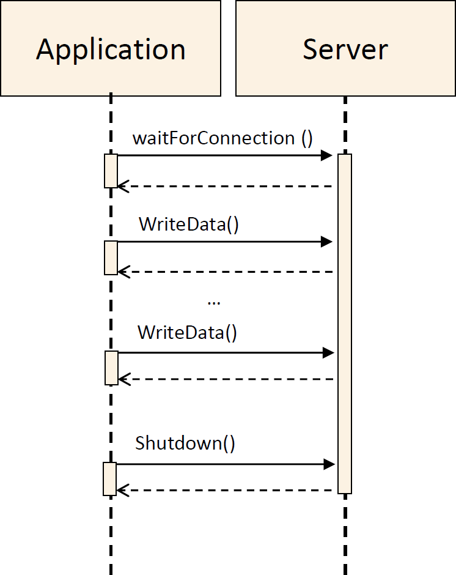{width="3.030624453193351in" height="3.81875in"}

**Figure 6.11:** \[\]{#\_bookmark185 .anchor}**Client sequence diagram**

Note that the sequences with a client that sends data and a server that
reads data are also valid.

### Usage

Since the Raw Data Streaming provides an API it is required to have the
instances of the RawDataStreamServer or RawDataStreamClient and call the
methods according to the sequences described in
[6.4.1](#sequence-diagrams)

> 由于Raw Data
> Streaming提供了一个API，因此需要实例化RawDataStreamServer或RawDataStreamClient，并按照\[6.4.1\]（#序列图）中描述的顺序调用方法。

### Example of usage as server

The code [6.12](#_bookmark188) shows how to use the RawDataStreamServer
for sending and receiving data.

> 代码[6.12](#_bookmark188)展示了如何使用RawDataStreamServer来发送和接收数据。

    []{#_bookmark188 .anchor}// NOTE! For simplicity the example does not use ara::core::Result.

    #include \"ara/core/instance_specifier.h\"

    #include \"raw_data_stream.h\"

    int main() {

    size_t rval;

    ara::com::raw::RawDataStream::ReadDataResult result;

    // Instance Specifier from model

    ara::core::InstanceSpecifier instspec

    {\...}

    // Create RawDataStream Server instance

    ara::com::raw::RawDataStreamServer server{instspec};

    // Wait for incoming connections

    server.WaitForConnection();

    // Read data from the RawData stream in chunks of 10 bytes

    do{

    result = server.ReadData(10);

    rval = result.numberOfBytes;

    if (rval \> 0) {

    // assumes the data is printable

    std::cout \<\< \"\--\>\" \<\< result.data.get() \<\< std::endl;

    }

    } while (rval \> 0);

    // Write data to the RawData stream in chunks of 16 bytes

    int i=0;

    do{

    std::unique_ptr\<uint8_t\> write_buf (new uint8_t\[1024\] \\{. });

    rval = server.WriteData(std::move(write_buf), 16);

    ++i;

    }while (i\<1000);

    // Shutdown RawDataStream connection

    server.Shutdown(); return 0;

    }

     **Listing 6.12: Example of usage as server**

    ### Example of usage as client

     The code [6.13](#_bookmark190) shows how to use the RawDataStreamClient for sending and receiving data.

    []{#_bookmark190 .anchor}// NOTE! For simplicity the example does not use ara::core::Result.

    #include \"ara/core/instance_specifier.h\"

    #include \"raw_data_stream.h\"

    int main() {

    size_t rval;

    ara::com::raw::RawDataStream::ReadDataResult result;

    // Instance Specifier from model

    ara::core::InstanceSpecifier instspec

    {\...}

    // Create a RawDataStreamClient instance

    ara::com::raw::RawDataStreamClient client {instspec};

    // Connect to RawDataStream Server

    client.Connect();

    // Write data to RawData stream in chunks of 40 bytes

    int i=0;

    do {

    std::unique_ptr\<uint8_t\> write_buf (new uint8_t\[1024\]{. });

    rval = client.WriteData(std::move(write_buf), 40);

    ++i;

    } while (i\<1000);

    // Read data from the RawData stream in chunks of 4 bytes

    do {

    result = client.ReadData(4);

    rval = result.numberOfBytes;

    if (rval \> 0){

    // assumes the data is printable

    std::cout \<\< \"\--\>\" \<\< result.data.get() \<\< std::endl;

    }

    } while (rval \> 0);

    // Shutdown RawDataStream connection

    client.Shutdown(); return 0;

    }

**Listing 6.13: Example of usage as client**

> 例 6.13: 作为客户端的使用示例

3.  ## Usage of CommunicationGroups

> 3.  ## 使用通訊群組

1.  ### Setup

This section describes the configuration steps to define a Communication
Group by using the Communication Group Template (category = COMMUNICA-
TION_GROUP). There are three items which need to be specified to define
a Com- munication Group:

> 本节描述了使用通讯组模板（类别=COMMUNICA-
> TION_GROUP）定义通讯组的配置步骤。需要指定三个项目来定义通讯组：

-   The name of the Communication Group = SHORT-NAME.
-   The data type of messages sent to the clients.
-   The data type of response message sent by the clients.

The figure below presents the Communication Group Template.

> 下图展示了通信组模板。

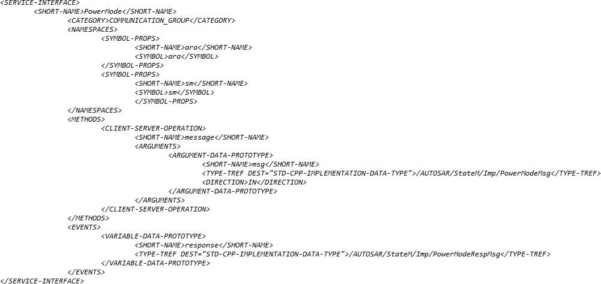

response message definition

> 回复消息定义

**Figure 6.12: CG Template Service Interface Descritpion, example
PowerMode**

### Service Interface Description Generation

To create Communication Group server and client ServiceInterface
description files, the Communication Group Template need to be setup
(see chapter be- fore). Based on the Communication Group Template the
ServiceInterface description files of the Communication Group server and
client can be generated. See figures below.

> 为了创建通信组服务器和客户端服务接口描述文件，需要先设置通信组模板（参见前面的章节）。基于通信组模板，可以生成通信组服务器和客户端的服务接口描述文件。请参见下图。

Note: The Communication Group Template is a ServiceInterface which is
only used for generation of Communication Group ServiceInterfaces and it
has else no usage.

\<\<derive\>\>

**Figure 6.13: Communication Group Service Interfaces Relationship**

{width="6.238988407699038in"
height="2.410311679790026in"}

**Figure 6.14: Communication Group Service Interfaces Generation**

### Proxy and Skeleton Generation

Using the ServiceInterface descriptions for the Communication Group
server and client the according Proxy and Skeleton Service classes can
be genrated (hint: stan- dard ara::com [SI](#_bookmark71) generation
flow). See figures below.

> 使用Communication
> Group服务器和客户端的ServiceInterface描述，可以生成相应的Proxy和Skeleton
> Service类（提示：标准ara :: com
> \[SI\]（#\_bookmark71）生成流程）。请参见下图。

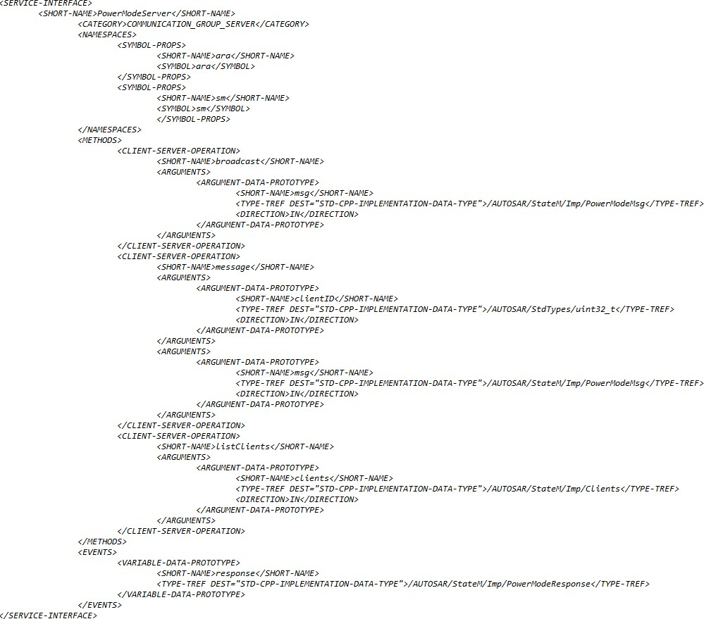

**Figure 6.15: CG Server Service Interface Description, example
PowerMode**

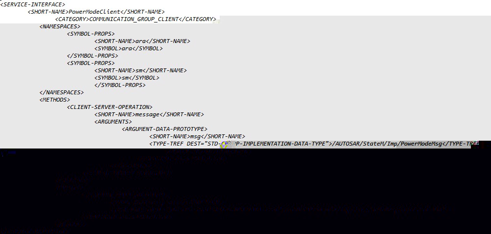

**Figure 6.16: CG Client Service Interface Description, example
PowerMode**

### Example

The following chapter outlines the steps to define and create the
Communication Group [PowerMode](#_bookmark72).

> 以下章节概述了定义和创建\[PowerMode\]（＃\_bookmark72）通信组的步骤。

-   Define the CG name and add this name as SHORT-NAME into the
    ServiceIn- terface description of the Communication Group Template.

> 定义通信组模板的CG名称，并将此名称添加为SHORT-NAME到服务接口描述中。

\+ SHORT-NAME = [PowerMode](#_bookmark72)

> +简称 = [PowerMode](#_bookmark72)

-   Define the message data type for peer to peer and broadcast message
    according to \[SWS_CM_99001\], \[SWS_CM_99002\], \[SWS_CM_99008\]
    and edit it into the ServiceInterface description of the
    Communication Group Template.

> 根据\[SWS_CM_99001\]、\[SWS_CM_99002\]、\[SWS_CM_99008\]定义点对点和广播消息的消息数据类型，并将其编辑到通信组模板的服务接口描述中。

     \+ message definition \<typename T\>

     PowerModeMsg = \[On, Off, Suspend\] according to \[SWS_SM_91011\] background info:

     sample CG code for \[SWS_CM_99001\]:

     template \<typename T\>

     ara::core::Future\<void\> broadcast (const T& msg);

     sample CG code for \[SWS_CM_99002\]:

     template \<typename T\>

     ara::core::Future\<void\> message (uint32_t clientID, const T& msg);

     sample CG code for \[SWS_CM_99008\]:

     template \<typename T\>

     ara::core::Future\<void\> message (const T& msg);

-   Define the response message data type according to \[SWS_CM_99014\],
    \[SWS\_- CM_99009\] and edit it into the ServiceInterface
    description of the Commu- nication Group Template.

> 根据\[SWS_CM_99014\]、\[SWS\_-
> CM_99009\]定义响应消息数据类型，并将其编辑到通信组模板的服务接口描述中。

     \+ response message definition \<typename R\>

     PowerModeRspMsg = \[Done, Failed, Busy, NotSupported\] accord- ing to \[SWS_SM_91012\]

     background info:

     sample CG code for \[SWS_CM_99014\]:

     template \<typename R\> struct Response {

     uint32_t clientID;

     const R& responseMsg }

     sample CG code for \[SWS_CM_99009\]:

     template \<typename R\> const R& responseMsg;

-   Generate the Server and Client ServiceInterface descriptions out of
    the setup Communication Group Template.

> 生成服务器和客户端服务接口描述，从设置的通信组模板中。 - Generate the
> Server and Client ServiceInterface Proxy and Skeleton Ser- vice class
> templates.

-   Instatiate the Communication Group Server and Client Proxy and
    Skeleton Ser- vice classes into the application code. See examples
    below.

> 实例化通信组服务器和客户端代理和骨架服务类到应用代码中。参见下面的示例。

{width="4.173254593175853in"
height="3.429757217847769in"}**Figure 6.17: Usage Example Communication
Group PowerMode**

Confidential C

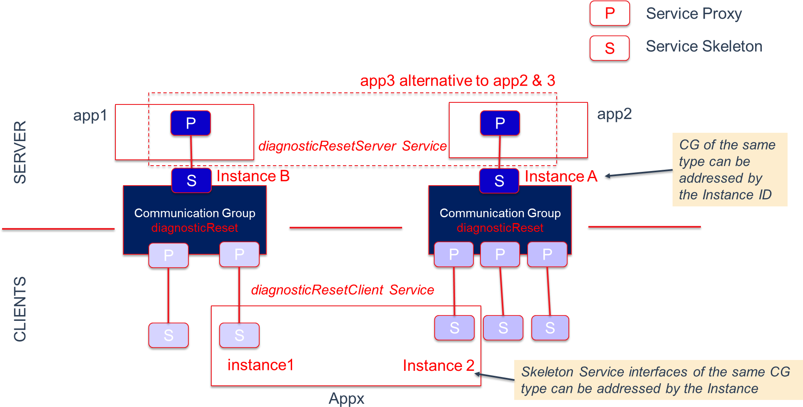{width="6.222201443569554in"
height="3.158124453193351in"}

**Figure 6.18: Usage Example 2 x Communication Groups diagnosticReset**

**Figure 6.19: Usage Example Communication Group PowerMode and
diagnosticReset**

7.  # Appendix

    1.  ## Serialization

Serialization (see \[[11](#_bookmark10)\]) is the process of
transforming certain data structures into a standardized format for
exchange between a sender and a (possibly different) receiver. You
typically have this notion if you transfer data from one network node to
another. When putting data on the wire and reading it back, you have to
follow exact, agreed-on rules to be able to correctly interpret the data
on the receiver side. For the network communication use case the need
for a defined approach to convert an in-process data representation into
a wire-format and back is very obvious: The boxes doing the
communication might be based on different micro-controllers with
different endianness and different data-word sizes (16-bit, 32-bit,
64-bit) and therefore employing totally different alignments. In the
AUTOSAR CP serialization typically plays no role for platform
internal/node internal communication! Here the internal in-memory data
representation can be directly copied from a sender to a receiver. This
is possible, because three assumptions are made in the typical CP
product:

> 序列化（参见\[\[11\]\]）是将某些数据结构转换为供发送者和（可能不同的）接收者交换的标准格式的过程。如果您在一个网络节点和另一个网络节点之间传输数据，您通常会有这种概念。当将数据放在电线上并读取它时，您必须遵循精确的、约定的规则，才能正确地在接收端解释数据。对于网络通信用例，将内存中的数据表示转换为线格式并返回所需的定义方法的需求非常明显：进行通信的盒子可能基于不同的微控制器，具有不同的字节序和不同的数据字大小（16位，32位，64位），因此采用完全不同的对齐方式。在AUTOSAR
> CP中，序列化通常对于平台内部/节点内部通信而言没有作用！在这里，可以直接从发送者复制到接收者的内部内存数据表示。这是可能的，因为在典型的CP产品中做出了三个假设：

-   Endianness is identical among all local SWCs.
-   Alignment of certain data structures is homogeneous among all local
    SWCs.
-   Data structures exchanged are contiguous in memory.

The first point is maybe a bit pathological as it is most common, that
"internal" com- munication generally means communication on a single- or
multi-core MCU or even a multi-processor system, where endianness is
identical everywhere. Only if we look at a system/node composed of CPUs
made of different micro-controller families this assumption may be
invalid, but then you are already in the discussion, whether this
communication is still "internal" in the typical sense. The second
assumption is valid/ac- ceptable for CP as here a static image for the
entire single address space system is built from sources and/or object
files, which demands that compiler settings among the different parts of
the image are somewhat aligned anyway. The third one is also as- sured
in CP. It is not allowed/possible to model non contiguous data types,
which get used in inter-SWC communication.

> 第一点可能有点病态，因为最常见的情况是，"内部"通信通常指在单核或多核MCU甚至多处理器系统上的通信，其中字节序在所有地方都是相同的。只有当我们看到由不同微控制器家族组成的系统/节点时，才可能使这个假设无效，但是你已经在讨论中，这种通信在典型意义上是否仍然是"内部"的。第二个假设对CP是有效/可接受的，因为这里从源代码和/或对象文件中为整个单地址空间系统构建静态图像，这要求图像的不同部分之间的编译器设置在某种程度上是一致的。第三个也是CP的。不允许/不可能模拟用于SWC间通信的非连续数据类型。

For the AP things look indeed different. Here the loading of executables
during run- time, which have been built independently at different times
and have been uploaded to an AP ECU at different times, is definitely a
supported use case. The chance, that compiler settings for different
[ara::com](#_bookmark15) applications were different regarding align-
ment decisions is consequently high. Therefore an AP product (more
concrete its [IPC](#_bookmark70)binding implementation) has to
use/support serialization of exchanged event/field-

> 就AP而言，情况确实有所不同。在运行时加载独立构建的可执行文件，并在不同时间上传到AP
> ECU，这绝对是一个支持的用例。因此，不同\[ara ::
> com\]（#\_bookmark15）应用程序的编译器设置在对齐决策方面可能不同。因此，AP产品（更具体地说，其\[IPC\]（#\_bookmark70）绑定实现）必须使用/支持交换的事件/字段的序列化。

/method data. How serialization for AP internal[IPC](#_bookmark70)is
done (i.e. to what generalized format) is fully up to the AP vendor.
Also regarding the 3rd point, the AP is less re- strictive. So for
example the AP supports exchange of std::map data types or record like
datatypes, which contain variable-length members. These datatypes are
generally NOT contiguous in-memory (depending on the allocation
strategy). So even if the data

> 数据的/方法。AP内部\[IPC\]（＃\_bookmark70）的序列化完全取决于AP供应商。此外，关于第三点，AP不那么受限制。因此，例如，AP支持交换std
> ::
> map数据类型或包含可变长度成员的记录类型。这些数据类型通常不是内存中连续的（取决于分配策略）。因此，即使数据

copy (meaning collecting contained elements and their references from
various mem- ory regions --- see \[[12](#_bookmark11)\]) must be done
during transfer. Of course the product vendor could apply optimization
strategies to get rid of the serialization and de-serialization stages
within a communication path:

> 在传输过程中必须进行复制（意思是从各种内存区域收集元素及其引用，参见\[12\]）。当然，产品供应商可以采用优化策略来消除通信路径中的序列化和反序列化阶段。

-   Regarding alignment issues, the most simple one could be to allow
    the integrator of the system to configure, that alignment for
    certain communication relations can be considered compatible
    (because he has the needed knowledge about the involved components).

> 关于对齐问题，最简单的方法可以是允许系统集成人员配置，可以认为某些通信关系的对齐是兼容的（因为他有涉及到的组件的必要知识）。

-   Another approach common to middleware technology is to verify,
    whether align- ment settings on both sides are equal by exchanging a
    check-pattern as kind of a init-sequence before first
    [ara::com](#_bookmark15) communication call.

> 另一种常见的中间件技术方法是在首次[ara::com](#_bookmark15)通信调用之前，通过交换检查模式作为初始序列来验证双方的对齐设置是否相等。

-   The problem regarding need for deep-copying because of
    non-contiguous mem- ory allocation could be circumvented by
    providing vector implementations which care for continuity.

> 问题涉及由于非连续内存分配而需要深度复制可以通过提供关注连续性的向量实现来规避。

1.  ### Zero-Copy implications

> ### 零复制意义

One thing which typically is at the top of the list of performance
optimizations in IPC/middleware implementations is the avoidance of
unnecessary copies between sender and the receiver of data. So the
buzzword "zero-copy" is widely used to de- scribe this pattern. When we
talk about AP, where we have architectural expectations like
applications running in separate processes providing memory protection,
the typi- cal communication approach needs at least ONE copy of the data
from source address space to target address space. Highly optimizing
middleware/IPC implementations could even get rid of this single copy
step by setting up shared memory regions be- tween communicating
[ara::com](#_bookmark15) components. If you look at
[5.19](#_bookmark138), you see, that we directly encourage such
implementation approaches in the API design. But the not so good news
is, that if the product vendor does NOT solve the serialization problem,
he barely gets benefit from the shared memory approach: If conversions
(aka de/se- rialization) have to be done between communication partners,
copying must be done anyhow --- so tricky shared memory approaches to
aim for "zero-copy" do not pay.

> 一般来说，IPC/中间件实现中性能优化的第一位通常是避免数据发送者和接收者之间的不必要的拷贝。因此，常见的"零拷贝"一词用于描述这种模式。当我们谈论AP时，我们有像应用程序运行在单独进程中提供内存保护的架构期望，典型的通信方法至少需要从源地址空间到目标地址空间的数据的一个副本。高度优化的中间件/IPC实现可以通过在通信[ara::com](#_bookmark15)组件之间设置共享内存区域，甚至可以消除这个单一拷贝步骤。如果您查看[5.19](#_bookmark138)，您会发现，我们在API设计中直接鼓励这种实施方法。但不好的消息是，如果产品供应商没有解决序列化问题，他几乎不会从共享内存方法中受益：如果在通信合作伙伴之间需要进行转换（也称为序列化/反序列化），则无论如何都必须进行复制-因此，旨在实现"零拷贝"的棘手共享内存方法不会有任何收益。

## Service Discovery Implementation Strategies

As laid out in the preceding chapters, [ara::com](#_bookmark15) expects
the functionality of a ser- vice discovery being implemented by the
product vendor. As the service discovery functionality is basically
defined at the API level with the methods for FindService, OfferService
and StopOfferService, the protocol and implementation details are
partially open.

> 根据前面几章所述，[ara::com](#_bookmark15)期望产品供应商实施服务发现功能。由于服务发现功能基本上是在API级别定义的，具有FindService、OfferService和StopOfferService方法，因此协议和实现细节部分是开放的。

When an AP node (more concretely an AP SWC) offers a service over the
network or requires a service from another network node, then service
discovery/service registry

> 当一个AP节点（更具体地说是AP
> SWC）在网络上提供服务或者从另一个网络节点需要服务时，就需要服务发现/服务注册。

obviously takes place over the wire. The protocol for service discovery
over the wire needs to be completely specified by the used communication
protocol. For SOME/IP, this is done in the SOME/IP Service Discovery
Protocol Specification \[[13](#_bookmark12)\]. But if an
[ara::com](#_bookmark15) application wants to communicate with another
[ara::com](#_bookmark15) application on the same node within the AP of
the same vendor there has to be a local variant of a ser- vice discovery
available. Here the only difference is, that the protocol implementation
for service discovery taking place locally is totally up to the AP
product vendor.

> 显然是通过线路进行的。服务发现的协议必须完全由所使用的通信协议来指定。对于SOME/IP，这在SOME/IP服务发现协议规范中完成\[\[13\]（#\_bookmark12）\]。但是，如果\[ara
> :: com\]（#\_bookmark15）应用程序想要与同一节点上的另一个\[ara ::
> com\]（#\_bookmark15）应用程序在同一供应商的AP上进行通信，则必须有一个本地的服务发现变体。这里唯一的不同之处在于，本地发现协议的实现完全取决于AP产品供应商。

### Central vs Distributed approach

From an abstract perspective a AP product vendor could choose between
two ap- proaches: The first one is a centralist approach, where the
vendor decides to have one central entity (f.i. a daemon process),
which:

> 从抽象的角度来看，AP产品供应商可以选择两种方法：第一种是集中式方法，供应商决定拥有一个中央实体（例如，一个守护进程），其中：

-   maintains a registry of all service instances together with their
    location informa- tion

-   serves all FindService, OfferService and StopOfferService re- quests
    from local [ara::com](#_bookmark15) applications, thereby either
    updating the registry (OfferService, StopOfferService) or querying
    the registry ( FindSer- vice)

> 它为本地[ara::com](#_bookmark15)应用程序提供所有FindService、OfferService和StopOfferService请求，从而更新注册表（OfferService、StopOfferService）或查询注册表（FindService）。

-   serves all SOME/IP SD messages from the network either updating its
    registry (SOME/IP Offer Service received) or querying the registry
    (SOME/IP Find Service received)

> 它可以从网络接收所有SOME/IP SD消息，无论是更新其注册表（收到SOME/IP
> Offer Service）还是查询注册表（收到SOME/IP Find Service）。 -
> propagates local updates to its registry to the network by sending out
> SOME/IP SD messages.

The following figure roughly sketches this approach.

> 下图大致勾勒了这种方法。

ECU with AP/CP product

**Figure 7.1: Centralized discovery approach**

A slightly different --- more distributed --- approach would be, to
distribute the service registry information (availability and location
information) among the [ara::com](#_bookmark15) appli- cations within
the node. So for the node local communication use case no prominent
discovery demon would be needed. That could be technically reached by
having a broadcast-like communication. That means any service offering
and finding is prop- agated to all local [ara::com](#_bookmark15)
applications, so that each application has a local (in process) view of
the service registry. There might be a benefit with this approach as
local communication might be more flexible/stable as it is not dependent
from a single registry demon. However, for the service discovery
communication to/from the network a single responsible instance is
needed anyhow. Here the distributed approach is not feasible as SOME/IP
SD requires a fixed/defined set of ports, which just can be pro- vided
(in typical operating systems / with typical network stacks) by a single
application process.

> 一种略有不同的------更分布式的------方法是，将服务注册信息（可用性和位置信息）分布在节点中的\[ara
> ::
> com\]（#\_bookmark15）应用程序中。因此，对于节点本地通信用例，不需要显着的发现恶魔。这可以通过具有广播般的通信来技术上实现。这意味着任何服务提供和发现都传播到所有本地\[ara
> ::
> com\]（#\_bookmark15）应用程序，因此每个应用程序都具有服务注册表的本地（进程中）视图。这种方法可能具有好处，因为本地通信可能更灵活/稳定，因为它不依赖于单一的注册恶魔。但是，对于与网络的服务发现通信，仍然需要单一的负责实例。在这里，分布式方法不可行，因为SOME
> / IP SD需要固定/定义的端口集，这只能由单个应用程序进程提供。

At the end we also do have a singleton/central instance, with the slight
difference, that it is responsible for taking the role as a service
discovery protocol bridge between node local discovery protocol and
network SOME/IP SD protocol. On top of that --- since registry is
duplicated/distributed among all [ara::com](#_bookmark15) applications
within the node --- this bridge also holds a local registry.

> 最后，我们也有一个单例/中央实例，略有不同之处在于，它负责在节点本地发现协议和网络SOME
> / IP
> SD协议之间扮演服务发现协议桥梁的角色。此外，由于注册表在节点中的所有\[ara
> ::
> com\]（＃\_bookmark15）应用程序之间被复制/分布，因此该桥梁还拥有本地注册表。

ECU with AP/CP product

**Figure 7.2: Distributed discovery approach**

## Multi-Binding implications

As shortly discussed in [subsection](#instantiation-constructors)
[5.4.3](#instantiation-constructors) Multi-Binding describes the
solution to support setups, where the technical transport/connection
between different instances of a certain proxy class/skeleton class are
different. There might be various technical reasons for that:

> 在[小节](#instantiation-constructors)
> [5.4.3](#instantiation-constructors)中所讨论的多绑定描述了支持特定代理类/骨架类的不同实例之间的技术传输/连接的解决方案。可能有各种技术原因：

-   proxy class uses different transport/IPC to communicate with
    different skeleton instances. Reason: Different service instances
    support different transport mech- anisms because of deployment
    decisions.

> 代理类使用不同的传输/IPC与不同的骨架实例进行通信。原因：由于部署决策，不同的服务实例支持不同的传输机制。

-   symmetrically it may also be the case, that different proxy
    instances for the same skeleton instance uses different
    transport/IPC to communicate with this instance: The skeleton
    instance supports multiple transport mechanisms to get contacted.

> 可以对称地认为，对于同一个骨架实例，不同的代理实例使用不同的传输/IPC来与此实例通信：骨架实例支持多种传输机制来被联系。

1.  ### Simple Multi-Binding use case

> ### 简单的多绑定使用案例

The following figure depicts an obvious and/or rather simple case. In
this example, which only deals with node local (inside one AP
product/ECU) communication between service consumers (proxy) and service
providers (skeleton), there are two instances of the same proxy class on
the service consumer side. You see in the picture, that the service
consumer application has triggered a "FindService" first, which returned
two handles for two different service instances of the searched service
type. The service consumer application has instantiated a proxy instance
for each of those handles. Now in this example the instance 1 of the
service is located inside the same adaptive ap- plication (same
process/address space) as the service consumer (proxy instance 1), while
the service instance 2 is located in a different adaptive application
(different pro- cess/address space).

> 以下图示描绘了一个明显而且相当简单的情况。在这个只涉及节点本地（在一个AP产品/ECU内）服务消费者（代理）和服务提供者（骨架）之间通信的例子中，服务消费者端有两个相同的代理类实例。您可以在图片中看到，服务消费者应用程序首先触发了"FindService"，它返回了两个不同服务类型的服务实例的句柄。服务消费者应用程序为每个句柄实例化了一个代理实例。现在，在这个例子中，服务实例1位于与服务消费者（代理实例1）相同的自适应应用程序（同一进程/地址空间）中，而服务实例2位于不同的自适应应用程序（不同进程/地址空间）中。

ECU with AP product

**Figure 7.3: Simple Multi-Binding intra AP example**

The line symbolizing the transport layer between proxies and skeletons
are colored differently in this picture: The instance of the proxy class
for instance 1 has a red colored transport layer (binding
implementation), while the transport layer for instance 2 is colored
blue. They are colored differently because the used technology will be
different already on the level of the proxy implementation. At least if
you expect that the AP product vendor (in the role
as[IPC](#_bookmark70)binding implementer) strives for a well performing
product!

> 这张图片中，代理和骨架之间的传输层用不同的颜色来符号化：实例1的代理类的实例具有红色的传输层（绑定实现），而实例2的传输层则为蓝色。它们之间的颜色不同，是因为代理实现的使用技术已经在代理实现的层面上就不同了。如果你期望AP产品供应商（以IPC绑定实施者的角色）努力实现一个性能良好的产品，那么至少这是必须的！

The communication between proxy instance 1 and the service instance 1
(red) should in this case be optimized to a plain method call, since
proxy instance and skeleton instance 1 are contained in ONE process.

> 在这种情况下，代理实例1和服务实例1（红色）之间的通信应优化为简单的方法调用，因为代理实例和骨架实例1都包含在一个进程中。

The communication between proxy instance 2 and the service instance 2
(blue) is a real IPC. So the actions taken here are of much higher costs
involving most likely a variety of syscalls/kernel context switches to
transfer calls/data from process of ser- vice consumer application to
service application (typically using basic technologies like pipes,
sockets or shared mem with some signaling on top for control).

> 在代理实例2和服务实例2（蓝色）之间的通信是一种真正的IPC。因此，在这里采取的行动的成本要高得多，涉及到大量系统调用/内核上下文切换，以将来自服务消费应用程序的调用/数据传输到服务应用程序（通常使用基本技术，如管道、套接字或共享内存，以及用于控制的信号）。

So from the service consumer side application developer it is totally
transparent: From the vendors ProxyClass::FindService implementation he
gets two opaque han- dles for the two service instances, from which he
creates two instances of the same

> 从服务消费者端应用程序开发者的角度来看，完全透明：从供应商ProxyClass::FindService实现中，他获得两个不透明的句柄，用于两个服务实例，从中他创建了两个相同的实例。

proxy class. But "by magic" both proxies behave totally different in the
way, they con- tact their respective service instances. So --- somehow
there must be some information contained inside this handle, from which
the proxy class instance knows which tech- nical transport to choose.
Although this use case looks simple at the first look it isn't on the
second \... The question is: *Who* writes *When* into the handle, that
the proxy in- stance created from it shall use a direct method/function
call instead of a more complex [IPC](#_bookmark70)mechanism or vice
versa?

> 代理类。但是，"凭借魔法"，这两个代理在接触它们各自的服务实例的方式上表现出完全不同的行为。因此---某种程度上，这个句柄中必须包含一些信息，让代理类实例知道选择哪种技术传输。虽然这个用例在第一眼看起来很简单，但在第二眼看来却不是这样......问题是：*谁*在*什么时候*写入句柄，以便从中创建的代理实例使用直接的方法/函数调用而不是更复杂的\[IPC\]（＃\_bookmark70）机制或者相反？

At the point in time when instance 1 of the service does register itself
via Skele- tonClass::OfferService at the registry/service discovery,
this cannot be decided! Since it depends on the service consumer which
uses it later on. So most likely the SkeletonClass::OfferService
implementation of the AP vendor takes the needed information from the
argument (skeleton generated by the AP vendor) and no- tifies via AP
vendor specific[IPC](#_bookmark70)the registry/service discovery
implementation of the AP vendor. The many "AP vendor" in the preceding
sentence were intentional. Just show- ing, that all those mechanisms
going on here are not standardized and can therefore deliberately
designed and optimized by the AP vendors. However, the basic steps will
remain. So what typically will be communicated from the service instance
side to the registry/discovery in the course of
SkeletonClass::OfferService is the technical addressing information, how
the instance could be reached via the AP products local
[IPC](#_bookmark70)implementation.

> 在服务实例1通过SkeletonClass ::
> OfferService注册到注册表/服务发现时，无法决定！因为这取决于后来使用它的服务消费者。因此，AP供应商的SkeletonClass
> ::
> OfferService实现可能从参数（AP供应商生成的骨架）中获取所需的信息，并通过AP供应商特定的\[IPC\]（＃\_bookmark70）通知注册表/服务发现实现。前面句子中的"AP供应商"是有意的。只是表明，这里发生的所有机制都没有标准化，因此可以被故意设计和优化。但是，基本步骤将保持不变。因此，在SkeletonClass
> ::
> OfferService过程中，服务实例端通常会传递技术地址信息，即通过AP产品的本地\[IPC\]（＃\_bookmark70）实现如何访问实例。

Normally there will be only ONE IPC-mechanism used inside one AP
product/AP node! If the product vendor already has implemented a highly
optimized/efficient local [IPC](#_bookmark70)implementation between
adaptive applications, which will then be generally used. So --- in our
example let"s say the underlying IPC-mechanism is unix domain sockets

> 一般情况下，在一个AP产品/AP节点中只会使用一种IPC机制！如果产品供应商已经实现了一种高度优化/高效的本地[IPC](#_bookmark70)实现，它将被普遍使用。因此 -
> 在我们的例子中，假设底层的IPC机制是Unix域套接字。

--- the skeleton instance 1 would get/create some file descriptor to
which its socket endpoint is connected and would communicate this
descriptor to the registry/service discovery during
SkeletonClass::OfferService. Same goes for the skeleton in- stance 2,
just the descriptor is different. When later on the service consumer
applica- tion part does a ProxyClass::FindService, the registry will
send the addressing information for both service instances to the
service consumer, where they are visible as two opaque handles.

So in this example obviously the handles look exactly the same --- with
the small dif- ference, that the contained filedescriptor values would
be different as they reference distinctive unix domain sockets. So in
this case it somehow has to be detected inside the proxy for instance 1,
that there is the possibility to optimize for direct method/func- tion
calls. One possible trivial trick could be, that inside the addressing
information, which skeleton instance 1 gives to the registry/discovery,
also the ID of the process (pid) is contained; either explicitly or by
including it into the socket descriptor filename. So the service
consumer side proxy instance 1 could simply check, whether the PID
inside the handle denotes the same process as itself and could then use
the optimized path. By the way: Detection of process local optimization
potential is a triviality, which almost every existing middleware
implementation does today --- so no further need to stress this topic.

> 在这个例子中，句柄看起来完全一样，只有包含的文件描述符值不同，因为它们引用不同的Unix域套接字。因此，在这种情况下，代理实例1中必须检测出有可能优化直接方法/函数调用的可能性。一种可能的简单技巧是，骨架实例1给注册/发现的地址信息中，也包含进程的ID（PID），或者显式地包含它，或者将其包含在套接字描述符文件名中。因此，服务消费者端代理实例1可以简单地检查句柄中的PID是否指定为与自身相同的进程，然后可以使用优化的路径。顺便说一句：检测进程本地优化潜力几乎是每个现有中间件实现今天都要做的琐事，因此不需要进一步强调这个主题。

Now, if we step back, we have to realize, that our simple example here
does NOT fully reflect what Multi-Binding means. It does indeed describe
the case, where two instances of the same proxy class use different
transport layers to contact the service instance, but as the example
shows, this is NOT reflected in the handles denoting the different
instances, but is simply an optimization! In our concrete example, the
service consumer using the proxy instance 1 to communicate with the
service instance 1 could have used also the Unix domain socket transport
like the proxy instance 2 without any functional losings --- only from a
non-functional performance viewpoint it would be obviously bad.
Nonetheless this simple scenario was worth being mentioned here as it is
a real-world scenario, which is very likely to happen in many
deployments and therefore must be well supported!

> 现在，如果我们退后一步，我们必须意识到，我们这里的简单示例并不能完全反映多绑定的意义。它确实描述了同一代理类的两个实例使用不同的传输层来联系服务实例的情况，但是正如示例所示，这并不反映在表示不同实例的句柄上，而只是一种优化！在我们的具体示例中，使用代理实例1与服务实例1通信的服务消费者也可以使用像代理实例2一样的Unix域套接字传输，而不会有任何功能损失-仅从非功能性性能角度来看，这显然是不好的。尽管如此，这个简单的场景值得在这里提及，因为它是很可能发生在许多部署中的真实场景，因此必须得到很好的支持！

### Local/Network Multi-Binding use case

After we have seen a special variant of Multi-Binding in the preceding
section, we now look at a variant, which can also be considered as being
a real-world case. Let"s suppose, we have have a setup quite similar to
the one of the preceding chapter. The only difference is now, that the
instance 2 of the service is located on a different ECU attached to the
same Ethernet network as our ECU with the AP product, where the service
consumer (with its proxies for instance 1 and 2) resides. As the
standard protocol on Ethernet for AP is SOME/IP, it is expected, that
the communication between both ECUs is based on SOME/IP. For our
concrete example this means, that proxy 1 talks to service 1 via unix
domain sockets (which might be optimized for process local communication
to direct method calls, if the AP vendor/IPC implementer did his
homework), while the proxy 2 talks to service 2 via network sockets in a
SOME/IP compliant message format.

> 在前一节中看到了多重绑定的一个特殊变体后，我们现在来看一个变体，可以被认为是一个真实世界的案例。假设我们有一个与前一章相当相似的设置。唯一的不同之处在于，服务的第二个实例位于与具有AP产品的ECU相同的以太网网络上的另一个ECU上，其中服务消费者（具有实例1和2的代理）所在。由于AP的标准协议是SOME
> / IP，因此预计两个ECU之间的通信是基于SOME /
> IP的。对于我们的具体示例，这意味着代理1通过Unix域套接字（如果AP供应商/
> IPC实施者做了他的家庭作业，这可能被优化为进程本地通信以直接方法调用）与服务1进行通信，而代理2则通过网络套接字以SOME
> / IP兼容的消息格式与服务2进行通信。

*Before someone notes, that this is not true for the typical SOME/IP
deployment, be- cause there adaptive SWCs will not directly open network
socket connections to remote nodes: We will cover this in more detail
here (* [subsection](#typical-someip-multi-binding-use-case)
[7.3.3](#typical-someip-multi-binding-use-case)*), but for now suppose,
that this is a realistic scenario. (For other network protocols it might
indeed be realistic)*

> 在有人注意到这对典型的SOME/IP部署不正确之前，因为自适应SWC不会直接打开与远程节点的网络套接字连接：我们将在这里（[子节](#typical-someip-multi-binding-use-case)
> [7.3.3](#typical-someip-multi-binding-use-case)\*）中更详细地介绍，但现在假设这是一个现实的情景（对于其他网络协议可能确实是现实的）。

ECU with AP product

**Figure 7.4: Multi-Binding local and network example**

So in this scenario the registry/service discovery demon on our AP ECU
has seen a service offer of instance 2 and this offer contained the
addressing information on IP network endpoint basis. Regarding the
service offer of the instance 1 nothing changed: This offer is still
connected with some Unix domain socket name, which is essentially a
filename. In this example the two handles for instance 1 and 2 returned
from ProxyClass::FindService internally look very different: Handle of
instance 1 contains the information, that it is a Unix domain socket and
a name, while han- dle 2 contains the information, that it is a network
socket and an IP address and port number. So --- in contrast to our
first example ([subsection](#simple-multi-binding-use-case)
[7.3.1](#simple-multi-binding-use-case)) here we do really have a full
blown Multi-Binding, where our proxy class [ctor](#_bookmark23)
instantiates/creates two completely different transport mechanisms from
handle 1 and handle 2! How this dynamic decision, which transport
mechanism to use, made during call of the [ctor](#_bookmark23), is
technically solved is --- again --- up to the middleware implementer:
The generated proxy class implementation could already contain any
supported mechanism and the information contained in the handle is just
used to switch between different behavior or the needed transport
functionality aka binding could be loaded during runtime after a certain
need is detected from the given handle via shared library mechanisms.

> 在这种情况下，我们AP
> ECU上的注册/服务发现恶魔已经看到了实例2的服务报价，该报价包含了基于IP网络端点的地址信息。关于实例1的服务报价没有任何改变：这个报价仍然与某个Unix域套接字名称相关联，这实际上是一个文件名。在这个例子中，从ProxyClass::FindService内部返回的实例1和2的两个句柄看起来非常不同：句柄1包含的信息是它是一个Unix域套接字和一个名称，而句柄2包含的信息是它是一个网络套接字和一个IP地址和端口号。因此，与我们的第一个示例（\[7.3.1\]（#simple-multi-binding-use-case））相比，这里我们确实有一个完整的多绑定，我们的代理类\[ctor\]（#\_bookmark23）实例化/创建了两个完全不同的传输机制，从句柄1和句柄2！在调用\[ctor\]（#\_bookmark23）时如何动态决定使用哪种传输机制，技术上的解决方案是：生成的代理类实现可能已经包含任何支持的机制，句柄中包含的信息只是用于在不同的行为之间切换，或者在检测到给定句柄的某种需要后，通过共享库机制加载所需的传输功能，即绑定。

### Typical SOME/IP Multi-Binding use case

In the previous section we briefly mentioned, that in a typical
deployment scenario with SOME/IP as network protocol, it is highly
unlikely that an adaptive SWC (i.e. the language and network binding
which runs in its context) opens socket connections itself to
communicate with a remote service. Why is it unlikely? Because SOME/IP
was explicitly designed to use as few ports as possible. The reason for
that requirement

> 在前一节中，我们简要提到，在典型的部署场景中，使用SOME/IP作为网络协议，自适应SWC（即运行其上下文的语言和网络绑定）本身开放套接字连接以与远程服务通信是极不可能的。为什么不可能？因为SOME/IP被明确设计为尽可能使用少量的端口。这个要求的原因是什么？

comes from low power/low resources embedded ECUs: Managing a huge amount
of IP sockets in parallel means huge costs in terms of memory (and
runtime) resources. So somehow our AUTOSAR CP siblings which will be
main communication partner in an inside vehicle network demand this
approach, which is uncommon, compared to non-automotive IT usage pattern
for ports.

> 来自低功耗/低资源嵌入式ECU：并行管理大量的IP套接字意味着在内存（和运行时）资源方面的巨大成本。因此，我们的AUTOSAR
> CP兄弟将成为车辆内部网络中的主要通信伙伴，这种方法与非汽车IT使用模式的端口相比是不同寻常的。

Typically this requirement leads to an architecture, where the entire
SOME/IP traffic of an ECU / network endpoint is routed through one IP
port! That means SOME/IP messages originating from/dispatched to many
different local applications (service providers or service consumers)
are (de)multiplexed to/from one socket connection. In Classic AUTOSAR
(CP) this is a straight forward concept, since there is already a shared
communication stack through which the entire communication flows. The
multiplexing of different upper layer PDUs through one socket is core
functionality inte- grated in CPs SoAd basic software module. For a
typical POSIX compatible OS with POSIX socket API, multiplexing SOME/IP
communication of many applications to/from one port means the
introduction of a separate/central (demon) process, which man- ages the
corresponding port. The task of this process is to bridge between
SOME/IP network communication and local communication and vice versa.

> 通常，此要求导致一种架构，即ECU /网络端点的整个SOME /
> IP流量通过一个IP端口路由！这意味着来自/发送到许多不同本地应用程序（服务提供者或服务消费者）的SOME
> / IP消息被（去）多路复用到/从一个套接字连接。在Classic
> AUTOSAR（CP）中，这是一个直接的概念，因为已经有一个共享的通信堆栈，通过该堆栈流动整个通信。将不同的上层PDU多路复用到一个端口是CP的SoAd基本软件模块集成的核心功能。对于具有POSIX套接字API的典型POSIX兼容操作系统，将许多应用程序的SOME
> /
> IP通信多路复用到/从一个端口意味着引入一个单独/中央（恶魔）进程，该进程管理相应的端口。此过程的任务是在SOME
> / IP网络通信和本地通信之间桥接，反之亦然。

ECU with AP product

**Figure 7.5: SOME/IP Bridge**

In the above figure you see, that the service proxy within our
[ara::com](#_bookmark15) enabled appli- cation communicates through
(green line) a SOME/IP Bridge with the remote service instance 2. Two
points which may pop out in this figure:

> 在上图中，您可以看到，我们启用ara :: com的服务代理在（绿线）SOME /
> IP桥接器上与远程服务实例2进行通信。此图中可能引起注意的两点是：

-   we intentionally colored the part of the communication route from
    app to bridge (green) differently than the part from the bridge to
    the service instance 2 (blue).

> 我们有意将应用程序到桥梁（绿色）的通信路由与桥梁到服务实例2（蓝色）的部分颜色不同。 -
> we intentionally drew a box around the function block service
> discovery and SOME/IP bridge.

The reason for coloring first part of the route differently from the
second one is simple: Both parts use a different transport mechanism.
While the first one (green) between the proxy and the bridge uses a
fully vendor specific implementation, the second one (blue) has to
comply with the SOME/IP specification. "Fully vendor specific" here
means, that the vendor not only decides which technology he uses (pipes,
sockets, shared mem, \...), but also which serialization format (see
[section](#serialization) [7.1](#serialization)) he employs on that
path. Here we obviously dive into the realm of optimizations: In an
optimized AP product, the vendor would not apply a different
(proprietary) serialization format for the path denoted with the green
line. Otherwise it would lead to an inefficient runtime behavior. First
the proxy within the service consumer app would employ a proprietary
serialization of the data before transferring it to the bridge node and
then the bridge would have to de-serialize and re-serialize it to
SOME/IP serialization format! So even if the AP product vendor has a
much more efficient/refined serialization approach for local
communication, using it here does not pay, since then the bridge is not
able to simply copy the data through between internal and external side.
The result is, that for our example scenario we eventually do have a
Multi-Binding setup. So even if the technical transport (pipes, unix
domain sockets, shared mem, \...) for communication to other local
[ara::com](#_bookmark15) applications and to the bridge node is the
same, the serialization part of the binding differs.

> 原因很简单：路由的第一部分和第二部分使用不同的传输机制。第一部分（绿色）介于代理和桥梁之间使用完全供应商特定的实现，而第二部分（蓝色）必须遵守SOME/IP规范。"完全供应商特定"这里意味着，供应商不仅决定使用哪种技术（管道、套接字、共享内存等），还决定使用哪种序列化格式（参见\[序列化\]（＃序列化）\[7.1\]（＃序列化））。在这里我们显然深入到了优化领域：在优化的AP产品中，供应商不会在用绿线标记的路径上应用不同的（专有的）序列化格式。否则，它将导致低效的运行时行为。首先，服务消费者应用程序中的代理将在传输数据到桥梁节点之前采用专有的序列化，然后桥梁将必须反序列化并重新序列化为SOME
> /
> IP序列化格式！因此，即使AP产品供应商有更有效/精细的序列化方法用于本地通信，但在这里使用它并不划算，因为桥梁无法在内部和外部之间简单地复制数据。结果是，对于我们的示例场景，我们最终确实拥有了多绑定设置。因此，即使用于与其他本地\[ara
> ::
> com\]（＃\_bookmark15）应用程序和桥梁节点通信的技术传输（管道、Unix域套接字、共享内存等）相同，绑定的序列化部分也不同。

Regarding the second noticeable point in the figure: We drew a box
around the ser- vice discovery and SOME/IP bridge functionality since in
product implementations it is very likely, that it is integrated into
one component/running within one (demon) pro- cess. Both functionalities
are highly related: The discovery/registry part also consists of parts
local to the ECU (receiving local registrations/offers and serving local
Find- Service requests) and network related functions (SOME/IP service
discovery based offers/finds) , where the registry has to arbitrate.
This arbitration in its core is also a bridging functionality.

> 关于图中的第二个显著点：我们绘制了一个框围着服务发现和SOME /
> IP桥接功能，因为在产品实施中很可能将它们整合到一个组件/运行在一个（恶魔）进程中。这两种功能高度相关：发现/注册部分也包括局部ECU（接收本地注册/报价和提供本地查找服务请求）和网络相关功能（基于SOME
> /
> IP服务发现的报价/查找），其中注册表必须进行仲裁。这种仲裁的核心也是桥接功能。

## ara::com and AUTOSAR meta-model relationship

Throughout this document we paid attention to explain ara::com API ideas
and mechanisms **without** relating to the concrete/specific AP
meta-model (the manifest parts of it), which is the basis to formally
describe the [SI](#_bookmark71) signature (and partially the behavior)
from which the ara::com API artifacts like ProxyClass and Skeleton-
Class and data types used in the communication are generated/created. In
[5.1](#_bookmark100) we even introduced an oversimplified/synthetic IDL,
just to shield the reader from complex- ities of the real
meta-model/IDL, which wouln't have added any value at that point.

> 在本文中，我们注意到解释ara :: com
> API的想法和机制，而无需涉及具体的AP元模型（其显示部分），该元模型是正式描述\[SI\]（#
> \_bookmark71）签名（和部分行为）的基础，从而生成/创建ara :: com
> API的工件，如ProxyClass和Skeleton-Class以及用于通信的数据类型。在\[5.1\]（#
> \_bookmark100）中，我们甚至引入了一种过度简化/合成的IDL，仅仅是为了避免读者陷入真实的元模型/IDL的复杂性，这在这一点上不会增加任何价值。

This chapter shall by no means serve as a thorough explanation of the
AUTOSAR meta-model, which is fully described in its own document, but it
shall shed some light on the relation between [ara::com](#_bookmark15)
and the meta-model parts described in \[[2](#_bookmark1)\]. So bear in
mind, that the following parts are still somewhat high level and try to
give a basic understanding of the relationship.

> 本章不会作为AUTOSAR元模型的详细解释（详细解释见有关文档），但将揭示[ara
> ::
> com](#_bookmark15)与\[[2](#_bookmark1)\]中描述的元模型部分之间的关系。因此，请记住，以下部分仍然是比较高级别的，试图给出一个基本的理解关系。

### Connection to AUTOSAR_TR_AdaptiveMethodology

Overview of Modeling elements and how they are related to each other:
[SI](#_bookmark71), Deploy- ment, Actual generation dependant from
provided Deployment Information (E.g. also [SI](#_bookmark71) Elements
that will be generated later and connection to Service Instance
Manifest)

> 模型元素概述及其相互关系：\[SI\]（＃\_bookmark71），部署，根据提供的部署信息实际生成（例如也是\[SI\]（＃\_bookmark71）元素，稍后将生成，并与服务实例清单连接）

AUTOSAR Adaptive Platform methodology explains the process aspects
necessary to build an Adaptive AUTOSAR system and how they relate to
each other \[TR_AMETH\_- 00100\]. It defines activities and work
products delivered or consumed \[TR_AMETH\_- 00102\] and the Roles
performed by OEMs and suppliers.

> AUTOSAR Adaptive Platform 方法论解释了构建Adaptive
> AUTOSAR系统所必需的过程方面以及它们彼此之间的关系\[TR_AMETH\_-
> 00100\]。它定义了汽车制造商和供应商执行的活动和工作产品\[TR_AMETH\_-
> 00102\]。

Major steps involved in the development of Adaptive Software are

> 主要参与自适应软件开发的步骤有：

-   Architecture and Design
-   Adaptive Software Development
-   Integration and Deployment

Adaptive applications run on top of ARA layer and exchanges the
information using [SI](#_bookmark71)s and Ports. Important contribution
for [ara::com](#_bookmark15) API work performed during the Inte- gration
and Deployment step of Adaptive Methodology. It supports the generation
of [SI](#_bookmark71) Description ARXML file, which aggregates the
[SI](#_bookmark71)s and ports. [SI](#_bookmark71)s for service-oriented
communication defined by Events, Methods and Fields \[
[5.1](#_bookmark100)\]. This is done independent of Software components
or Transport layer used for underlying communication.

> 适应性应用程序运行在ARA层之上，并使用[SI](#_bookmark71)和端口交换信息。在适应性方法论的集成和部署步骤期间，对[ara::com](#_bookmark15)
> API的重要贡献。它支持生成[SI](#_bookmark71)描述ARXML文件，该文件聚合[SI](#_bookmark71)和端口。[SI](#_bookmark71)用于基于事件、方法和字段定义的面向服务的通信[5.1](#_bookmark100)。这是独立于用于底层通信的软件组件或传输层完成的。

Adaptive Platform supports two types of ports namely Provided and
Required. [SI](#_bookmark71) along with Provided port details used for
the generation of the Service Skeleton class and Required port details
used for the generation of Proxy classes \[[Figure](#_bookmark117)
[5.2](#_bookmark117)\]. Proxy and Skeleton classes use
[ara::com](#_bookmark15) API to communicate with other Adaptive Platform
clusters and Adaptive Applications.

> 适应性平台支持两种端口类型，即提供的端口和所需的端口（SI），以及用于生成服务骨架类的提供端口详细信息和用于生成代理类的所需端口详细信息（图5.2）。代理和骨架类使用ara
> :: com API与其他适应性平台集群和适应性应用程序进行通信。

Service instances are configured, notably the binding of the
[SI](#_bookmark71)s to a chosen transport layer, whether a specific
service instance is either Provided or Required and whether there is a
mapping to a dedicated Machine. The configurations of the service
instance are manifested in the Service Instance Manifest.

> 服务实例已配置，特别是将\[SI\]（#\_bookmark71）绑定到所选择的传输层，无论特定服务实例是提供还是要求，以及是否将其映射到专用机器。服务实例的配置体现在服务实例清单中。

Executable of an Adaptive Software are instantiated by means of the
Execution Man- ifest. Instantiation here means to bind the executables
to the context of specific pro- cesses of the operating system. Each
process may start with a different start-up con- figuration depending on
a machine mode. Further on, the Execution Manifest also defines Software
process dependencies.

> 可执行的自适应软件通过执行清单实例化。这里的实例化意味着将可执行文件绑定到操作系统特定进程的上下文中。每个进程可以根据机器模式以不同的启动配置开始。此外，执行清单还定义了软件进程依赖关系。

### Service Interface

The most important meta-model element from the [ara::com](#_bookmark15)
perspective is the [SI](#_bookmark71). Most important, because it
defines everything signaturewise of an [ara::com](#_bookmark15) proxy or
skeleton. The [SI](#_bookmark71) describes the methods, fields and the
methods a [SI](#_bookmark71) consists of and how the signatures of those
elements (arguments and data types) look like. So the

> 从[ara::com](#_bookmark15)的角度来看，最重要的元模型元素是[SI](#_bookmark71)。最重要的是，它定义了[ara::com](#_bookmark15)代理或骨架的一切签名。[SI](#_bookmark71)描述了一个[SI](#_bookmark71)所包含的方法、字段以及这些元素（参数和数据类型）的签名是什么样子的。因此，[SI](#_bookmark71)是[ara::com](#_bookmark15)中最重要的元素。

[5.1](#_bookmark100) is basically a simplification of meta-model
[SI](#_bookmark71) and the real meta-model data type system.

> [5.1](#_bookmark100)基本上是[SI](#_bookmark71)元模型的简化，以及真实的元模型数据类型系统。

The relationship between the meta-model element [SI](#_bookmark71) and
[ara::com](#_bookmark15) is therefore clear:

> [SI](#_bookmark71)和[ara::com](#_bookmark15)之间的关系很清楚：

[ara::com](#_bookmark15) proxy and skeleton classes get generated from
[SI](#_bookmark71).

> [ara::com](#_bookmark15) 代理和骨架类可以从[SI](#_bookmark71)生成。

### Software Component

With software components, the AUTOSAR methodology defines a higher order
ele- ment than just interfaces. The idea of a software component is to
describe a reusable part of software with well defined interfaces. For
this the AUTOSAR manifest spec- ification defines a model element
SoftwareComponentType, which is an abstract element with several
concrete subtypes, of which the subtype AdaptiveApplica-
tionSwComponentType is the most important one for Adaptive Application
software developers. A SoftwareComponentType model element is realized
by C++ code. Which [SI](#_bookmark71)s such a component \"provides to\"
or \"requires from\" the outside is expressed by ports. Ports are typed
by [SI](#_bookmark71)s. P-ports express that the [SI](#_bookmark71),
which types the port, is provided, while R-ports express, that the
[SI](#_bookmark71), which types the port, is required by the
SoftwareComponentType.

> 软件组件的AUTOSAR方法学定义了比接口更高级别的元素。软件组件的想法是用定义良好的接口来描述可重用的软件部件。为此，AUTOSAR清单规范定义了一个模型元素SoftwareComponentType，它是一个抽象元素，有几个具体的子类型，其中AdaptiveApplica-tionSwComponentType是自适应应用软件开发人员最重要的子类型。SoftwareComponentType模型元素由C
> ++代码实现。这个组件"提供给"或"从外部需求"的是由端口表达的。端口的类型是SI。P端口表示类型化端口的SI被提供，而R端口表示类型化端口的SI被SoftwareComponentType所需要的。

The figure [Figure](#_bookmark209) [7.6](#_bookmark209) gives a coarse
idea, how the model view relates to the code implementation.

> 图7.6给出了一个粗略的概念，模型视图与代码实现之间的关系。

**Figure 7.6:** \[\]{#\_bookmark209 .anchor}**meta-model to
Implementation**

For both of the different SoftwareComponentTypes A and B from the
example in the upper part (meta-model level) a concrete implementation
exists on implementation level (lower part in the figure). The
realization/implementation of R-Port of Soft- wareComponentType A is
based on an instance of [ara::com](#_bookmark15) proxy class on imple-
mentation level, while the P-Port implementation of
SoftwareComponentType B is using an instance of [ara::com](#_bookmark15)
skeleton class. Proxy and skeleton class are gener- ated from the
[SI](#_bookmark71) definition [SI](#_bookmark71), which is referenced by
the corresponding ports. In this example it is the [SI](#_bookmark71)
\"RadarService\", which we already use throughout the document.

> 两个不同的软件组件类型A和B（上部图中的元模型层）都有具体的实现（图中下部）。软件组件类型A的R端口的实现基于实现层的\[ara
> ::
> com\]（＃\_bookmark15）代理类的实例，而软件组件类型B的P端口实现则使用\[ara
> ::
> com\]（＃\_bookmark15）骨架类的实例。代理类和骨架类是从\[SI\]（＃\_bookmark71）定义\[SI\]（＃\_bookmark71）生成的，该定义由相应的端口引用。在本示例中，它是我们在整个文档中使用的"RadarService"
> \[SI\]（＃\_bookmark71）。

Such a code fragment, which realizes a SoftwareComponentType can
obviously be re-used. On C++ implementation level an implementation of
an AdaptiveAppli- cationSwComponentType typically boils down to one or
several C++ classes. So re-use simply means instantiating this
class/those classes in different contexts multiple times. Here we can
basically distinguish the following cases:

> 这样一个实现SoftwareComponentType的代码片段显然可以被重用。在C++实现级别，AdaptiveApplicationSwComponentType的实现通常归结为一个或多个C++类。因此重用只是意味着在不同的上下文中多次实例化这个类/这些类。在这里我们基本上可以区分以下几种情况：

-   Explicit multiple instantiation of the C++ class(es) within Code.
-   Implicit multiple instantiation by starting/running the same
    executable multiple times.

The first case still belongs to the realm of \"implementation level\".

> 第一种情况仍属于"实施层面"的范畴。

**Figure 7.7: Multiple Instantiation in Implementation Contexts**

The figure above shows an arbitrary example, where the implementations
of A and B are instantiated in different contexts. On the lower left
side there is an Executable 1, which directly uses two instances of As
impl and one instance of Bs impl. Opposed to that, the right side shows
an Executable 2, which \"directly\" (i.e. on its top most level) uses
one instance of Bs impl and an instance of a composite software
component, which itself \"in its body\" again instantiates one instance
of As and Bs impl. Note: This natural implementation concept of
composing software components from other compo- nents to a
bigger/composite artefact is fully reflected in the AUTOSAR meta-model
in the form of a CompositionSwComponentType, which itself is a
SoftwareCompo- nentType and allows arbitrary recursive
nesting/compositing of software components.

> 图中展示了一个任意的例子，A和B的实现被实例化在不同的上下文中。在左下方有一个可执行文件1，它直接使用两个A的实现实例和一个B的实现实例。相反，右边展示了一个可执行文件2，它"直接"（即在最顶层）使用一个B的实现实例和一个组合软件组件的实例，它本身"在其体内"又实例化了一个A和B的实现实例。注意：这种将软件组件组合成更大/复合的工件的自然实现概念在AUTOSAR元模型中完全体现为CompositionSwComponentType，它本身是一个SoftwareComponentType，允许任意递归嵌套/组合软件组件。

The second case on the other hand belongs to the realm of \"deployment
level\" and shall be clarified in the following sub-chapter.

> 第二种情况另一方面属于"部署层"的领域，将在下一个子章节中进行澄清。

### Adaptive Application/Executables and Processes

Deployable software units within AP are so called Adaptive Applications
(the corre- sponding meta-model element is AdaptiveAutosarApplication).
Such an Adap- tive Application consists of 1..n executeables, which are
in turn built up by instantiating CompositionSwComponentType (with
arbitrary nesting) as described in the previ- ous chapter. Typically
integrators then decide, which Adaptive Applications in the form of its
1..n executables they start at all and how many times they start a
certain Adaptive

> 可部署的软件单元在AP中被称为自适应应用程序（相应的元模型元素是AdaptiveAutosarApplication）。这样的自适应应用程序由1..n可执行文件组成，它们又通过按照前面章节描述的方式实例化CompositionSwComponentType（任意嵌套）而构建。通常，集成器会决定以1..n可执行文件的形式启动哪些自适应应用程序，以及启动某个自适应应用程序的次数。

Application/its associated executables. That
means for those kind of implicit instanti- ation no specific code has to
be written! Integrators rather have to deal with machine configuration,
to configure how many times Applications get started. A started Adaptive
Application then turns into 1..n processes (depending on the number of
executables it is made of). We call this then the \"deployment level\".

**Figure 7.8: Instantiation of Adaptive Applications in Deployment**

The figure above shows a simple example, where we have two Adaptive
Applications, where each of those exactly consists of one executable.
Adaptive Application 1 with Executable 1 is deployed twice, leading to
Process 1 and Process 2 after executable start, where Application 2,
which consists of Executable 2 is deployed once leading to Process 3
after start.

> 图中给出了一个简单的例子，我们有两个自适应应用，每个应用都只有一个可执行文件。自适应应用1（包含可执行文件1）被部署了两次，在可执行文件启动后导致进程1和进程2，自适应应用2（包含可执行文件2）只被部署了一次，在可执行文件启动后导致进程3。

### Usage of meta-model identifiers within ara::com based application code

The explanations of meta-model/[ara::com](#_bookmark15) relation up to
this point should help to understand the structure of instance
specifiers used in ResolveInstanceIDs described in [4.3](#_bookmark94).
As described in the previous chapter and depicted in
[Figure](#_bookmark209) [7.6](#_bookmark209) the instance specifiers
relate in a certain way to the corresponding port in the model of the
SoftwareComponentType. If you followed the previous chapters the **port
name** of the model alone isn't sufficient to clearly identify it in its
final instantiation, where the same component implementation might be
instantiated multiple times in the code and then eventually started
multiple times in different processes. Instance IDs obviously have to be
assigned to objects, which finally have a distinct identity in an
deployment.

> 至此，元模型/[ara ::
> com](#_bookmark15)关系的解释应该有助于理解[4.3](#_bookmark94)中描述的ResolveInstanceIDs中使用的实例指定符的结构。如前章所述并如[图7.6](#_bookmark209)所示，实例指定符与软件组件类型模型中的相应端口以某种方式相关联。如果您遵循了以前的章节，则模型的**端口名称**本身不足以在最终实例化中清楚地标识它，其中相同的组件实现可能在代码中多次实例化，然后最终在不同进程中多次启动。显然，必须为具有最终在部署中具有明确身份的对象分配实例ID。

Process specific Service Instance Manifest

**Figure 7.9: InstanceIds in Deployment**

The figure above outlines the \"problem\" with a simple example. Within
Executable 2 there are three instantiations of SoftwareComponentType B
implementation in different contexts (nesting levels). All instances do
provide a specific instance of SI RadarService. The integrator, who
applies the Service Instance Manifest for Process 2 has to do the
technical mapping on [ara::com](#_bookmark15) level. I.e. he has to de-
cide, which technical transport binding is to be used in each of the B
instantiations and subsequently also, which technical transport binding
specific instance ID. In our example, the integrator wants to provide
the SI RadarService via SOME/IP binding and an SOME/IP specific instance
ID \"1\" in the context of the B instantiation, which is nested inside
the composite component on the right side, while he decides to pro- vide
the SI RadarService via local[IPC](#_bookmark70)(Unix domain socket)
binding and a Unix domain socket specific instance ID \"/tmp/Radar/3\"
and \"/tmp/Radar/4\" in the context of the B instantiations on the left
side, which are not nested (they are instantiated at \"top-level\" of
the executable). Here it gets obvious, that within the Service Instance
Manifest, which allows to specify the mapping of port instantiations
within a Process to techni- cal bindings and their concrete instance
IDs, the sole usage of the **port name** from the model isn't sufficient
to differentiate. To get unique identifiers within an executable (and
therefore a process), the nature of nested instantiation and re-use of
SoftwareCom- ponentTypes has to be considered. Every time a
SoftwareComponentType gets instantiated, its instantiation gets a unique
name within its instantiation context. This concept applies to both: C++
implementation level and AUTOSAR meta-model level! In our concrete
example this means:

> 图中简单地概括了"问题"。在可执行文件2中，有三个不同上下文（嵌套级别）的软件组件类型B实例化。所有实例都提供特定的SI雷达服务实例。应用进程2的服务实例清单的集成器必须在[ara
> ::
> com](#_bookmark15)级别上进行技术映射。也就是说，他必须决定，每个B实例化中将使用哪种技术传输绑定，并且随后还要决定哪种技术传输绑定特定的实例ID。在我们的示例中，集成器希望通过SOME
> / IP绑定和SOME /
> IP特定的实例ID"1"提供SI雷达服务，而在右侧复合组件嵌套的B实例化的上下文中，他决定通过本地[IPC](#_bookmark70)（Unix域套接字）绑定和Unix域套接字特定的实例ID"/
> tmp / Radar / 3"和"/ tmp / Radar /
> 4"提供SI雷达服务，而不是在可执行文件的"顶级"级别实例化的左侧B实例化的上下文中。在这里，很明显，只使用模型中的**端口名称**，在服务实例清单中，用于指定进程中端口实例化到技术绑定及其具体实例ID的映射，是不够的。为了在可执行文件（因此进程）中获得唯一标识符，必须考虑嵌套实例化和软件组件类型的重用。每次实例化软件组件类型时，它的实例化在其实例化上下文中都具有唯一的名称。这个概念适用于C
> ++实现级别和AUTOSAR元模型级别！在我们的具体示例中，这意味着：

-   B instantiations on top level get unique names on their level:
    \"B_Inst_1\" and \"B_Inst_2\"

-   B instantiation within the Composite Component Type gets unique name
    on this level: \"B_Inst_1\"

-   Composite Component instantiation on top level gets unique name on
    its level: \"Comp_Inst_1\"

-   From the perspective of the executable/process, we therefore have
    unique iden- tifiers for all instances of B:

> 从可执行文件/进程的角度来看，我们为B的所有实例都有唯一的标识符。

-   \"B_Inst_1\"
-   \"B_Inst_2\"
-   \"Comp_Inst_1::B_Inst_1\"

For an Adaptive Software Component developer this then means in a
nutshell:

> 对于一个自适应软件组件开发者，这意味着：简而言之，

If you construct an instance specifier to be transormed via
ResolveInstan- ceIDs() into an
[ara::com::InstanceIdentifier](#_bookmark31) or used directly with Find-
Service() (R-port side from model perspective) or as
[ctor](#_bookmark23) parameter for a skeleton (P-port side from model
perspective), it shall look like:

> 如果您构建一个实例规范，以通过ResolveInstanceIDs（）转换为\[ara :: com
> ::
> InstanceIdentifier\]（#\_bookmark31）或直接使用Find-Service（）（模型视角的R端）或作为\[ctor\]（#\_bookmark23）参数进行骨架（模型视角的P端），它应该看起来像：

\<context identifier\>/\<port name\>

> \<上下文标识符\>/\<端口名称\>

Port name is to be taken from the model, which describes the
AdaptiveApplica- tionSwComponentType to be developed. Since you are not
necessarily the person who decides where and how often your component
gets deployed, you should fore- see, that your
AdaptiveApplicationSwComponentType implementation can be handed over a
stringified \<context identifier\>, which you

> 模型描述要开发的AdaptiveApplica-tionSwComponentType的端口名称应该被采用。由于您不一定是决定您的组件何时何地部署的人，您应该预见到，您的AdaptiveApplicationSwComponentType实现可以接收一个字符串\<上下文标识符\>，它将提供给您。

-   either use directly, when constructing
    [ara::core::InstanceSpecifier](#_bookmark42) to instantiate
    proxies/skeleton, which reflect your own component ports.

> 使用[ara::core::InstanceSpecifier](#_bookmark42)直接构造时，可以反映您自己的组件端口来实例化代理/骨架。

-   \"hand over\" to other AdaptiveApplicationSwComponentType
    implementa- tions, which you instantiate from your own
    AdaptiveApplicationSwCompo- nentType implementation (that is
    creating a new nesting level)

> 交付给其他AdaptiveApplicationSwComponentType实现，这些实现是从您自己的AdaptiveApplicationSwComponentType实现中创建的新嵌套级别。

**Note**: Since AUTOSAR AP does **not** prescribe, how the component
model on meta- model level shall be translated to (C++) implementation
level, component instantiation (nesting of components) and \"handing
over\" of the \<context identifier\> is up to the implementer! It might
be a \"natural\" solution, to solve this by a \<context iden- tifier\>
ctor parameter for multi instantiable AdaptiveApplicationSwCompo-
nentTypes.

> **注意**：由于AUTOSAR AP没有规定如何将元模型层的组件模型转换为（C
> ++）实现层，组件实例化（组件嵌套）以及\<上下文标识符\>的"交接"由实施者自行决定！通过\<上下文标识符\>
> ctor参数为可多次实例化的AdaptiveApplicationSwComponentTypes解决这个问题可能是一个"自然"的解决方案。

## Abstract Protocol Network Binding Examples

This chapter presents Abstract Protocol Network Bindings expamples using
an In- stanceSpecifier.

> 本章介绍了使用InstanceSpecifier的抽象协议网络绑定示例。

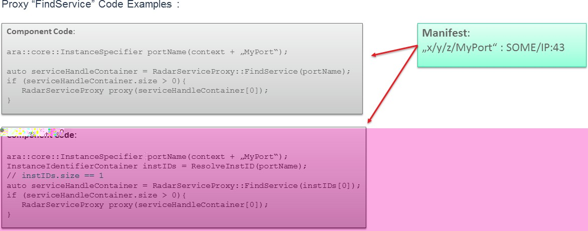{width="6.114093394575678in"
height="2.4010411198600177in"}

**Figure 7.10: Find Service using abstract network binding**

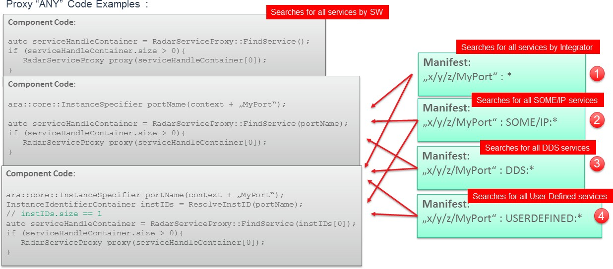{width="6.18in" height="2.715in"}

**Figure 7.11: Find Service using abstract network binding - ANY**

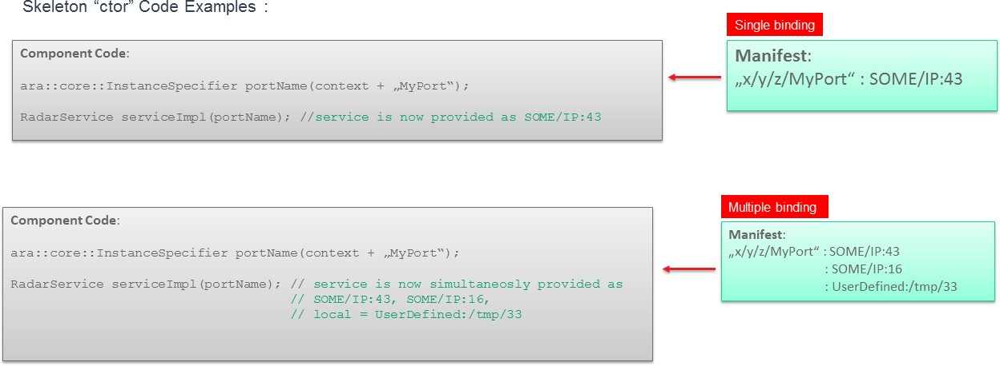{width="6.24in" height="2.29in"}

**Figure 7.12: Skeleton creation using abstract network bindings**

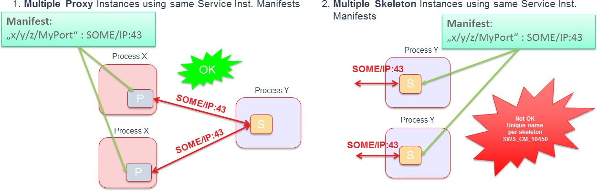{width="6.255in" height="2.01in"}

**Figure 7.13: Multiple usage of the same service instance manifest for
an abstract binding**
