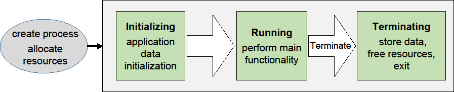
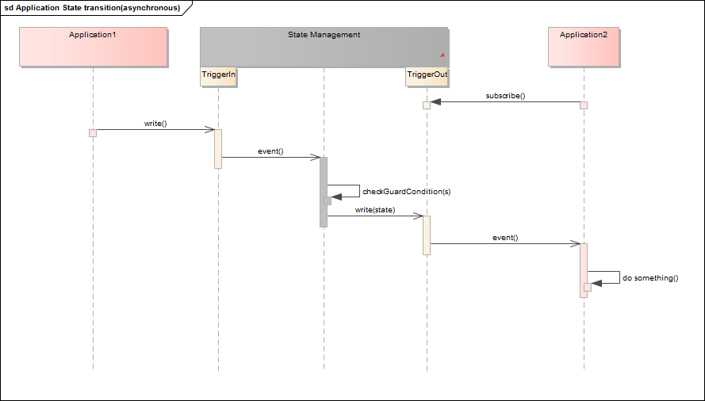
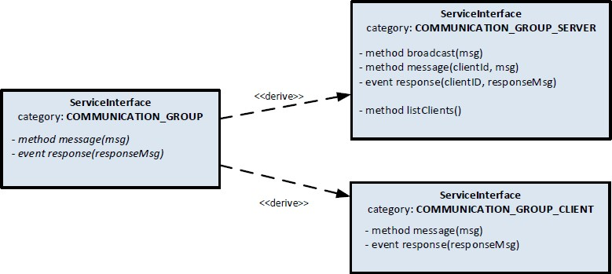
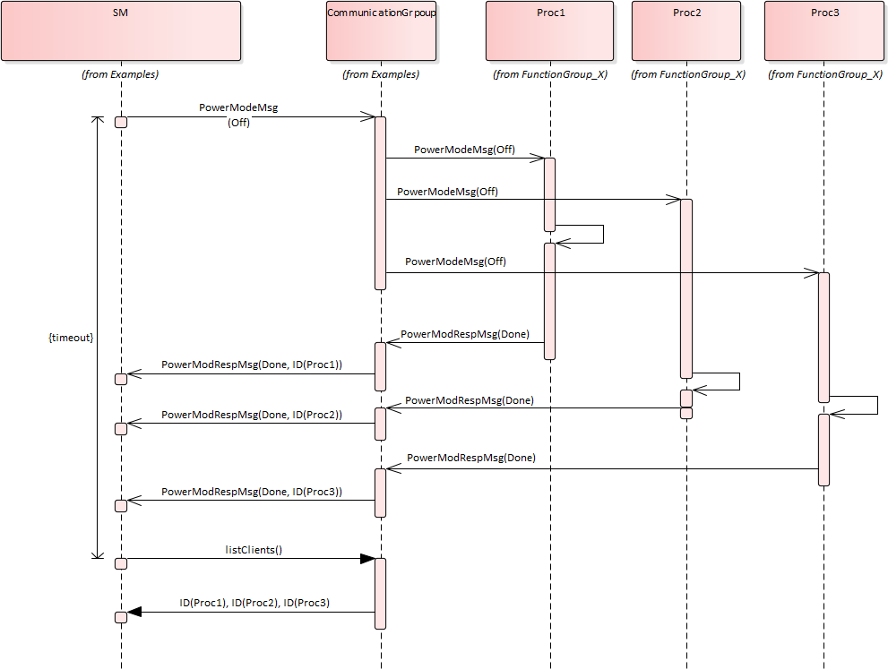
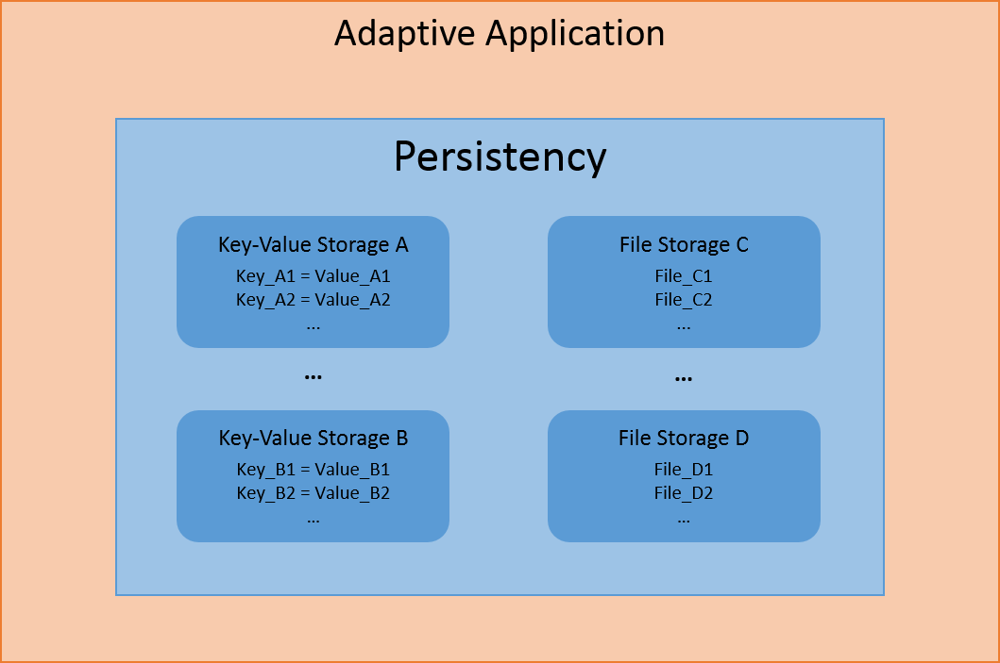

# Table of Contents

- [Table of Contents](#table-of-contents)
  - [Prereads](#prereads)
  - [Relationship to other AUTOSAR specifications](#relationship-to-other-autosar-specifications)
    - [ErrorCode](#errorcode)
    - [Result](#result)
    - [Faults inside constructors](#faults-inside-constructors)
  - [Deterministic Execution](#deterministic-execution)
    - [Advanced State Management functionality](#advanced-state-management-functionality)
    - [Key Value Storage](#key-value-storage)
    - [File Storage](#file-storage)
  - [Example usage of Key-Value Storage API](#example-usage-of-key-value-storage-api)
  - [Example usage of File Storage API](#example-usage-of-file-storage-api)
  - [Redundancy feature](#redundancy-feature)
  - [Reset Storage](#reset-storage)
  - [Update and Removal of Persistent Data](#update-and-removal-of-persistent-data)
  - [Method deployments](#method-deployments)
  - [Data transfer, message loss and block sizes](#data-transfer-message-loss-and-block-sizes)
- [References](#references)

```{=html}
<!-- -->
```

1. # Introduction to this document

   1. ## Contents

While SWS of FC is a specification for ARA interfaces, some of the interfaces require "guidelines" on how to use them. The guidelines are indeed related to the specification, but some are indirect and having such information within each SWS bloats SWS hence making it difficult for readers to grasp the usage. Another important perspective is that these guidelines are a kind of requirement against AA to follow, but SWS of FC are specification requirements for FCs. Therefore, it does not fit well to have these contents in SWS, and this is the purpose of this "Guidelines for using Adaptive Platform Interfaces."

The main contents of this document will be the guidelines for applications to follow as mentioned in the background above. Not necessarily all FCs will have contents in this document; they will be added when it deems valid.

The contents are organized per relevant topic, but in general, this will be grouped by FC, each having its independent chapter. Also, note that the contents may be provided in separate AUTOSAR AP documents. If this is the case, such documents will be listed or referenced from this guideline.

## Prereads

This document is a supplementary document to the SWS of AP. Therefore, the relevant SWS of the topic in these guidelines should be read in parallel. Also, the first AP document to be read is \[1\], which gives the architectural overview of AP.

## Relationship to other AUTOSAR specifications

Refer to [Contents](#contents) and [Prereads](#prereads).

2. # Common Regulations

   1. ## Reserved namespaces

The namespace ara (and all namespaces below it) are reserved by AUTOSAR.

The behavior of an Adaptive Application is undefined if it adds declarations or definitions to namespace ara or to a namespace within namespace ara.

Note: the standardized namespaces could have been extended by the platform vendors to be able to implement the standard or to provide extensions.

3. # Adaptive Core

   1. ## Error handling

Handling errors is a crucial topic for any software development. For safety-critical software, it is even more important, because lives can depend on it. However, current standards for the development of safety-critical software places significant restrictions on the build toolchain, especially with regard to C++ exceptions. For ASIL applications, using C++ exceptions is usually not possible due to the lack of exceptions support with ASIL-certified C++ compilers.

The Adaptive Platform introduces a concept that enables error handling without C++ exceptions and defines a number of C++ data types to aid in this.

From an application programmer's point of view, the central types implementing this concept are []{#_bookmark8 .anchor}ara::core::ErrorCode and ara::core::Result.

### ErrorCode

An instance of ara::core::ErrorCode represents a specific error condition within a software. It is similar to std::error_code, but differs in significant aspects from it.

An ErrorCode always contains an enumeration value (type-erased into an integral type) and a reference to an *error domain*. The enumeration value describes the specific type of error, and the error domain reference defines the context where that error is applicable. Additional optional members are a user-defined message string and a vendor-defined supplementary error description value.

### Result

Class ara::core::Result follows the "ValueOrError" concept from the C++ proposal p0786 (see https://wg21.link/P0786). It either contains a value or an error. Due to their templated nature, both value and error can be of any type. However,

*ErrorType* defaults to ara::core::ErrorCode, and it is expected that this assignment is kept throughout the Adaptive Platform.

Because the *ErrorType* is defaulted to ara::core::ErrorCode, most declarations of ara::core::Result only need to give the *ValueType*, e.g. ara::core::Result\<int\> for a Result type that contains either an int variable, or an ErrorCode.

ARA interfaces use ara::core::Result as the return type for functions that can encounter recoverable errors. This type can be used to either generate a C++ exception from the object if the user chooses to use exceptions, or retrieve

error information via observer methods without using exceptions.

This section guides you on how to handle such Result objects returned from ARA interface in your application code, and also gives guidance on how to create new Result objects within your own Adaptive Application.

1. **Creation of a Result**

For creating a Result with an embedded *value*, there are constructors allowing implicit conversion from a *ValueType*. This makes defining a Result with a value quite straightforward:

Result\<int\> res1(42); Result\<int\> res2 = 42;

Returning a value from a function declared to return a Result is similarly straightforward:

Result\<int\> myfunction()

{

return 42;

}

Putting an *error* inside a Result requires calling an explicit constructor, e.g.:

ErrorCode ec = MyEnum::some_error; Result\<int\> res2(ec);

Alternatively, construction of Result objects is also possible with static member functions, for instance:

Result\<int\> res1 = Result\<int\>::FromValue(42); Result\<int\> res2 = Result\<int\>::FromError(ec);

These forms can be advantageous when *ValueType* or *ErrorType* are expensive to copy because they allow in-place construction. For instance, returning a Result containing an instance of BigClass which is constructed with two constructor arguments "a1" and "a2" could look like this:

return Result\<BigClass\>::FromValue(a1, a2);

For *ErrorType*, this also allows implicit construction of the ErrorCode instance, including an optional supplementary data value:

return Result\<BigClass\>::FromError(

MyEnum::some_error, // ErrorCode enum value

0x12345678 // support data value

);

With this form of construction, only one constructor call is performed, unlike the regular (unnamed) constructor call, where at least two constructor calls are performed, because the pre-created value must then be copied or moved into the Result instance.

2. **Retrieving values and errors**

When trying to retrieve the value or error that is contained within a Result, one first has to consider which one of these (value or error) is available. In general, this is not

When working without exceptions, the Result object is queried to check whether it contains a value or an error:

Result\<int\> some_function() { ... }

Result\<int\> res = some_function(); if (res.HasValue()) {

int theValue = res.Value();

} else {

ErrorCode const& ec = res.Error();

}

This code also works in a completely exception-free environment, including with a compiler that does not support exceptions at all.

When working with an exception-based workflow, the query code looks quite similar to regular exception-based code:

Result\<int\> some_function() { ... }

int theValue = some_function().ValueOrThrow();

Here, the Result object that is returned by some_function() is immediately reduced to its *ValueType* (int) by calling its ValueOrThrow() member function.

If the Result did contain an ErrorCode, this would immediately throw an exception type that corresponds to the embedded ErrorCode object.

Naturally, a try...catch block should be added at a suitable location in the code.

3. **Advanced topics**

The two basic methods for retrieving the embedded value or error are called just as such: Result::Value() and Result::Error(). However, when calling any of these, one has to be certain that the Result object does indeed contain what is implied by calling one of these functions. In the previous section, this was done by first calling Result::HasValue(), and calling Value() or Error() depending on the outcome of that call.

A more convenient way of accessing the embedded value has already also been mentioned in the previous section: By calling Result::ValueOrThrow, no if-statement is needed, and the invocation collapses into a single-line statement (excluding the try...catch block, which might exist elsewhere).

Other convenience methods exist, for instance Result::ValueOr, which retrieves the value, if if exists, or takes a default value otherwise (i.e., in case of any error), e.g.:

int res = some_function().ValueOr(42);

A generalization of Result::ValueOr is called Result::Resolve, which does not take a default value as an argument, but a Callable, which is to create the default value on-

int res = some_function()

.Resolve(\[\](ErrorCode const& ec){ return 42; });

For this particular example, using Result::Resolve instead of Result::ValueOr does not make much sense. However, it can be advantageous when the default value is expensive to create. By using Result::Resolve, the default value is only created when it is needed.

Another convenience method is Result::Bind, which allows to transform the contained value into another value, or even into another type. For instance:

Result\<String\> res = some_function()

.Bind(\[\](int v){ return v + 1; })

.Bind(\[\](int v){ return std::to_string(v); })

.Bind(\[\](String const& s) { return \"\'\" + s + \"\'\"); });

The first call to Result::Bind takes the int value contained in the Result object, adds one to it, puts that into a new Result object, and returns it.

The second call to Result::Bind takes the incremented int value from the new Result object, converts it into a String, and returns a new Result\<String\> object with it.

The third and final call to Result::Bind takes the String object contained in the new

Result object, adds quote characters to it, and returns a new Result object with it.

If the Result does not contain a value, then none of these Callables are invoked, and the Result object is only type-converted but retains the original ErrorCode.

The Callables passed to Result::Bind must take a suitable type as a parameter and can return either a *ValueType* directly (as shown above, and either the same *ValueType* as before, or a new, different *ValueType*), or a Result\<ValueType\>.

### Faults inside constructors

Constructors cannot return ara::core::Result objects. Therefore, constructors that may encounter recoverable errors will throw exceptions when they do so. The ARA API uses a technique that is similar to the named constructor idiom to support applications that do not use exception mechanisms. For each constructor that may throw exceptions as part of its defined behavior, a class provides an additional static method as an alternative to create objects. The method has the name Create and does not throw exceptions. It has the same parameters as the constructor.

For example, a class that provides the constructor

SomeClass::SomeClass(uint8_t i);

which may throw exceptions, also provides the static method

static ara::core::Result\<SomeClass\> SomeClass::Create(uint8_t i) noexcept;

The method Create returns an ara::core::Result object, which either contains the new instance of the class or an error. Retrieving one or the other from the return value is similar to all other functions that return ara::core::Result objects (see Section 2.1.2).

Both the constructor itself and the method Create are available for constructors that may throw exceptions if the toolchain supports exceptions. However, if the toolchain does not support exceptions, only the method Create is available. Calling the constructor will result in a compilation error. Accordingly, code that uses the static method will compile on both kinds of toolchains. Code that uses the constructor will only compile on toolchains that support exceptions.

The static methods for creating instances of a class are only provided for constructors that may throw exceptions as part of their defined behavior. For other constructors, invariably use the constructor.

2. ## Reserved symbols

   1. ### Preprocessor macros

The Adaptive Platform generally avoids the use of C/C++ preprocessor macros.

However, in case macros are introduced at some later point in time, any such macro will start with the prefix ARA. Macros with this prefix should thus not be defined by developers of an Adaptive Application.

4. # Execution Management

   1. ## Execution State

The Execution State characterizes the internal lifecycle of any Process. Each Process needs to report changes in its Execution State to Execution Management, using the ExecutionClient::ReportExecutionState() interface (see \[2\]).

{width="6.364103237095363in" height="1.2962489063867018in"}

**Figure 4-1 Execution States**

Upon Process startup, Execution Management shall consider Process initialization complete when the state kRunning is reported (see \[SWS_EM_01004 and SWS_EM_01402\]). Please note that Service Discovery can introduce nondeterministic delays and thus is advised to be done after reporting kRunning state; thus, the Process may not have completed all its initialization when the kRunning state is reported by the Process.

Execution Management initiates Process termination by sending the SIGTERM signal to a Process.

On receipt of SIGTERM, the Process is expected to save persistent data and free all internally used resources. The Process indicates completion of the Terminating state by termination with exit status 0 (EXIT_SUCCESS). Execution Management does not require an explicit notification of actual Process termination by the process itself.

## Deterministic Execution

Execution Management supports a fully deterministic multithreaded execution of a Process, so processing a given set of input data always produces a consistent output within a bounded time, i.e. the behavior is reproducible.

Expected use cases of the AUTOSAR Adaptive Platform where such determinism is required include redundant execution in a Software Lockstep framework for systems with high safety goals (up to ASIL D) and reuse of verified software. For more details see \[2\], section "Deterministic Execution".

A Process that can be executed fully deterministically must be designed, implemented and integrated in a way such that it is independent of processor load caused by other functions and calculations, sporadic unrelated events, race conditions, deviating random numbers, etc.

Non-deterministic behavior may arise from different reasons; for example insufficient computing resources, or uncoordinated access of data, potentially by multiple threads running on multiple processor cores. The order in which the threads access such data will affect the result, which makes it non-deterministic.

Full deterministic execution includes:

- Time Determinism: The output of the calculation is always produced before a given deadline. The resource demands of the Process need to be described in a standardized way, so the integrator can assign sufficient resources to the Process (see subsection "Real-Time Resources" in \[2\]).
- Data Determinism: Given the same input and internal state, the calculation always produces the same output. The rest of this section will describe how to achieve Data Determinism.

Execution Management provides DeterministicClient library functions to support deterministic execution:

- Control of a process-internal cycle by wait point API WaitForNextActivation() (\[SWS_EM_01301\]). The Process shall execute one cycle when the API returns and then call the API again to wait for the next activation. A return value of the API controls the internal lifecycle (e.g. init, run, terminate) of the Process, which must be prepared accordingly (\[SWS_EM_01302\], \[SWS_EM_01303\] and \[SWS_EM_01304\]).
- A blocking deterministic worker pool API RunWorkerPool() (\[SWS_EM_01305\]) for the execution of a set of container elements (\[SWS_EM_01306\]) which are processed in parallel or sequentially by the same worker runnable object (i.e. application function).
- APIs GetActivationTime() (\[SWS_EM_01310\]) and GetNextActivationTime() (\[SWS_EM_01311\]) to provide activation time stamps which don\'t change until the Process reaches its next wait point.
- API GetRandom() to provide random numbers (\[SWS_EM_01308\]). If used from within the worker pool, the random numbers are assigned to specific

To ensure deterministic behavior, only a "deterministic subset" of all available APIs may be used by the deterministic user Process, including the worker runnable objects:

- The Process is not allowed to create threads on its own by using normal POSIX mechanisms or access any other POSIX APIs directly, to avoid the risk of inducing indeterministic behavior.
- Only a "deterministic subset" of all available ara::com mechanisms are allowed to be used by the Process. A detailed list of such APIs and mechanisms will be provided at a later point in time.
- Only the following ara::exec interfaces may be used:

  - DeterministicClient
  - ExecutionClient
- No other ARA interfaces are allowed to be accessed by the user Process.

If the worker pool API RunWorkerPool() is used, the worker runnable object which processes the container elements, i.e. the jobs to be computed, needs to satisfy certain implementation rules to ensure Data Determinism:

- The runnable object is not allowed to exchange any information while it is running, i.e. it doesn\'t access data which can be altered by other instances of the runnable object to avoid race conditions.

Rationale: The runnable object instances can physically run in parallel or sequentially in any order. The timing between individual workers is not guaranteed. The Operating System is scheduling threads individually.

Concurrent influencing of the same data will result in indeterminate results.

- No locks and synchronization points except common joins for all workers by returning from RunWorkerPool() (e.g. no Semaphores/Mutexes, no locking/blocking).

Rationale: locking/blocking makes Process runtime in-deterministic. Workers are provided to increase the utilization of runtime. If synchronization is needed, a return from RunWorkerPool() is necessary.

The worker pool cannot be used to process multiple different tasks in parallel. The use of multiple potentially different explicit functions (worker runnable objects) could add unnecessary complexity and can lead to extremely heterogeneous runtime utilization, as each worker may have different computing time. This would complicate the planning of resource deployment, which is necessary for black-box integration.

Example of the implementation of Worker Pool Users, i.e. of a worker runnable object:

class MyWorker1

: public DeterministicClient::WorkerrunnableBase\<myContainer:: value_type, MyWorker1\>

{

public:

void worker_runnable(myContainer::value_type& container_element, DeterministicClient::WorkerThread& t)

{

// Get a unique and deterministic pseudo-random number} uint64_t random_number = t.GetRandom();

}

};

Worker-thread object:

class DeterministicClient::WorkerThread

{

// returns a deterministic pseudo-random number}

// which is unique for each container element} uint64_t GetRandom();

\...

};

5. # State Management

   1. ## Interaction with AUTOSAR Adaptive (Platform) Applications

      1. ### Basic State Management functionality

State Management provides a set of 'Trigger' and 'Notifier' fields via ara::com. The SM essentially listens to the 'Triggers', and perform implementation‐specific state machine processing internally, and provides the effect to the 'Notifier' fields if there is any. The State Management also interacts with other FCs through the standard interface provided by them.

The following effects can be achieved by using this mechanism:

- FunctionGroups can be requested to be set to a dedicated state
- (Partial) Networks can be requested to be de- / activated
- The machine can be requested to be shutdown or restarted
- Other Adaptive (Platform) Applications can be influenced in their behavior
- Project specific actions could be performed.

Some of these functions are critical. Therefor the access to the Trigger fields has to be secured properly by Integrator via Identity and Access Management not to change the internal state of State Management (and therefor the depending effects) accidently.

The internal states of State Management are propagated to the system through its provided 'Notifier' fields. The read access to these fields is less critical and so each Adaptive (Platform) Application can register to their events to be informed whenever State Managements internal states change. So each Adaptive (Platform) Application can carry out an operation(s) (when needed) when the state of State Management changes.

{width="6.859725503062117in" height="3.9004166666666666in"}

**Figure 5-1 A basic application State transition example**

### Advanced State Management functionality

Some use cases within AUTOSAR Adaptive require to support a synchronized behavior in the states managed by State Management. One example might be a low- power mode: State Management can only switch finally to a low-power state when all Adaptive (Platform) Applications which are involved in this low-power mode scenario are finally prepared for low-power (e.g. have persisted its information).

To achieve such kind of synchronized communication AUTOSAR adaptive provides a mechanism called CommunicationGroup. This mechanism provides a template for the messages and reply messages, from which the corresponding ara::com methods and events are generated by the tooling. For Details see TPS_ManifestSpecification and SWS_CommunicationManagement.

{width="6.004486001749782in" height="2.6902077865266842in"}

**Figure 5-2 CoomunicationGroup ServiceInterface**

Therefore each Adaptive (Platform) Application which is required to support such a synchronized working mode has to offer the method and the event generated in the context of CommunicationGroupClient.

StateMangement provides two predefined sets of messages and reply messages:

- PowerMode
- DiagnosticReset

For details see SWS_StateManagement.

{width="6.09417760279965in" height="4.590937226596675in"}

**Figure 5-3 Distributing PowerMode example**

StateManagement offers methods and events in the context of CommunicationGroupServer. So it can broadcast the PowerMode to all Processes, which are part of the CommunicationGroup (means offering the methods and events of the CommunicationGroupClient). Each Process has to give its answer to the request by writing to the response field, thus StateManagement can collect all answers.

StateManagement can retrieve a list of all clients in the CommunicationGroup, thus it can check if all clients did answer (in time). Depending on the result (all clients answered, not all clients answered (in time), the answer was different from \"success\",

\...)

StateManagement has to do a project-specific reaction.

The messages and reply messages for the DiagnosticReset are meant as a tool for Diagnostic reset requests, where it should be possible to communicate to running Processes (without the need to terminate and restart them). If and how this tool is used is project-specific.

6. # Persistency cluster

   1. ## Overview

Persistency is one of the foundation clusters of the adaptive AUTOSAR platform which provides static APIs to the application to store and retrieve the user data. It supports two different storage mechanisms: Key-Value Storage and File Storage.

Both storage mechanisms might use a file system of the operating system, and in this case rely on this file system to be able to synchronize changes immediately. This has to be ensured by a proper integration of the file system, e.g. by using appropriate mount options. See also Appendix C of the SWS Persistency.

{width="6.286327646544182in" height="4.174061679790026in"}

**Figure 6-1 Persistency functionality overview**

### Key Value Storage

It is a simple key based data base that helps the user to store their smaller data in the data base.

### File Storage

It is a file based storage and the data is stored in the files under a folder and it supports storing huge data into files.

An application needs to design Key Value Storage and File Storage as a port interface in order to access the Key Value Storage and File Storage features. After designing the persistency port interfaces, further configuration information will be

provided during the deployment stage (e.g. storage location, redundancy CRC, redundancy M out of N configurations, etc.)

Based on the logging implementation inside persistency, the cluster can log the run time-related warnings errors and fatal problems can be reported to PHM.

Note: AUTOSAR_SWS_Persistency does not specify the above details as that is implementation specific.

## Example usage of Key-Value Storage API

Deploy the Key-Value Storage in a specific location and map the short name of the Key-Value Storage with location during deployment of the Key-Value Storage.

**Write operation sequence**

1. Open the Key-Value Storage with the instance specifier

ara::core::Result\<SharedHandle\<KeyValueStorage\>\> kvsRes = ara::per::OpenKeyValueStorage(kDatabaseNameIS);

Parse the ara::core::Result to check success or error in case of failure of open Key-Value Storage operation

2. Parse the KeyValueStorage object (kvs) from ara::core::Result SharedHandle\<KeyValueStorage\> db = std::move(kvsRes).Value();
3. Invoke the SetValue with key and value that needs to be persisted in the Key-

Value Storage

ara::core::Result\<void\> result = db-\>SetValue(kDoubleKeyName, DoubleValue);

Parse the result to check the status of the write operation

Hint: In order to effectively use the underlying storage device it is designed that all the user requests are stored intermediately in the RAM and the data will be persisted to file system only after invoking the below sync call. Hence it is suggested that after opening the Key-Value Storage, perform multiple SetValue() operations then persist the data finally via sync call.

4. Invoke the below API to persist data to the nonvolatile storage (Flash/Hard disk)

ara::core::Result\<void\> result = db-\>SyncToStorage();

Parse the result to check the status of the sync operation

5. There is a possibility that a user can go to last sync state by calling the API DiscardPendingChanges() which will discard the transaction of syncing the locally stored key value pairs with the underlying data base.

ara::core::Result\<void\> result = db-\>DiscardPendingChanges();

**Read operation sequence:**

1. Open the Key-Value Storage with the instance specifier

ara::core::Result\<SharedHandle\<KeyValueStorage\>\> kvsRes = ara::per::OpenKeyValueStorage(kDatabaseNameIS);

This returns ara::core::Result which contains kvsobject or error in case of failure

2. Parse the Kvs object from ara::core::Result SharedHandle\<KeyValueStorage\> db = std::move(kvsRes).Value();
3. Invoke the GetValue with key and value that needs to be retrieved from the

Key-Value Storage

ara::core::Result\<ara::core::String\> first_value = db-\> GetValue\<String\>(kStringKeyName);

Parse the result to check the status of the read operation and get the value assigned to a key

## Example usage of File Storage API

**Write operation**

1. Open File storage with the short name of the portprototype

ara::core::Result\<SharedHandle\<FileStorage\>\> fsRes = OpenFileStorage(kFolderNameIS);

Parse the ara::core::Result to check success or error in case of failure

2. Parse the File Storage object from ara::core::Result SharedHandle\<FileStorage\> fs = std::move(fsRes).Value();
3. Invoke the OpenFileWriteOnly with the file name which is short name of the

portprototype to get the writeaccessor object

ara::core::Result\<UniqueHandle\<ReadWriteAccessor\>\> fileRes = fs-\> OpenFileWriteOnly(kFileName);

4. Perform the formatted writing via overloading operator

(\*(std::move(fileRes).Value())) \<\< \"Overwriting!\";

**Read operation**

1. Open File storage with the short name of the portprototype

ara::core::Result\<SharedHandle\<FileStorage\>\> fsRes =

Parse the ara::core::Result to check success or error in case of failure

2. Parse the FileStorage object from ara::core::Result SharedHandle\<FileStorage\> fs = std::move(fsRes).Value();
3. Invoke the OpenFileReadWrite() with the file name to get the

readwriteaccessor object

ara::core::Result\<UniqueHandle\<ReadWriteAccessor\>\> fileRes = fs-\> OpenFileReadWrite(kFileName);

4. Perform the read operation

UniqueHandle\<ReadWriteAccessor\> rwa = std::move(fileRes).Value(); ara::core::Result\<ara::core::String\> = rwa-\>ReadLine();

Read the value in the buffer until default delimiter.

## Redundancy feature

This feature ensures persistent data safety for both Key-Value Storage and File Storage. There are three possible ways to ensure data safety (integrity).

1. CRC
2. Hashes
3. M out of N approach

It is a configurable parameter. Based on the project need, either one or a combination of them can be configured. With respect to CRC, all the AUTOSAR CRCs are supported to configure. In addition to the detection of integrity M out of N approach helps to recover the data if there are sufficient redundant copies available.

Persistency also allows the application to install a callback that will report any problems detected in any of the storages, even if the problem could be corrected because the redundancy was sufficient. This callback can be used in safety critical application, or when the application wants to monitor the health of the hardware.

**Recover Storage:** It is part of Redundancy Feature if integrity checks fail for Key- Value Storage or File Storage or file or key-value pair, user can use RecoverKeyValueStorage/RecoverFileStorage/RecoverFile/RecoverKey APIs to recover the data based on best effort recovery mechanism. Upon invocation of Recover APIs, a valid Key-Value Storage/File Storage/file/key-value pair could be retrieved which might have lost some key-value pairs/files as it is a best effort recovery mechanism.

## Reset Storage

This feature resets a Key-Value Storage/File Storage/file/key-value pair to the initial state, containing only Keys/Files which were deployed from the manifest, with their initial values and it will fail with a kResourceBusyError when the Key-Value Storage/FileStorage/File/Key-Value Pair is currently open/accessed and with a kInitValueNotAvailableError when deployment

does not define an initial content for the Key-Value Pair/File.

Reset APIs:

-ResetPersistency(): Reset all Key-Value Storages and File Storages to the initial state with key-value pairs deployed from manifest

-ResetKeyValueStorage(): Reset Key-Value Storage to the initial state with key-value pairs deployed from manifest

-ResetAllFiles(): Reset the whole File Storage, including all files from the deployed content from manifest

-ResetFile(): Reset a single file to its initial content which was deployed from the manifest

-ResetKey(): Reset a single key-value pair to its initial content which was deployed from the manifest

## Update and Removal of Persistent Data

There are APIs which will perform the specific action (update/rollback/remove) on the persistent data of the application based on the invocation of API UpdatePersistency(Update all persistency file and key-value storages after a new manifest was installed). An application may also register a callback function (RegisterApplicationDataUpdateCallback) that is called after the update of any Key- Value Storage and File Storage. This callback function will be called from the context of UpdatePersistency(), OpenKeyValueStorage(), or OpenFileStorage().

7. # Platform Health Management

   1. ## Shutdown functionality

In the sense of a safe system, the integrator shall ensure that the applications are configured to be supervised by Platform Health Management are terminated before triggering shut down of the Platform Health Management. Please refer to \[3\]

8. # Update and Configuration Management

   1. ## Port configuration

UCM can be configured to share a network port with other applications and does not necessarily need a dedicated port.

## Method deployments

Most UCM methods have no or small parameters or return values that fit into an unsegmented SOMEIP message (\~1300 byte payload) and can therefore be deployed via UDP. Some have however potentially large parameters or return values and therefore need to be deployed via TCP or SOMEIP/TP. The following table shows the recommended deployments.

A similar consideration can be done for the UCM master interface methods.

## Data transfer, message loss and block sizes

UCM needs to transfer potentially large amounts of data over the ara::com service interface. The configuration of the TransferData method is crucial for the performance of the data transmission.

Non-trivial software packages exceed the segmantation size of a single SOMEIP message transmitted over UDP. UCM can set the maximum BlockSize that may be used by the client so that the message will not be segemented (\~1440 byte).

However, this will lead to poor transfer performance because each block has to be acknowledged in the application context before sending the next block.

If the platform supports method calls via TCP or SOMEIP/TP segmentation the BlockSize setting can be increased to reduce protocol header overhead and move the segmentation effort into lower layers.

In case of SOMEIP/TP the integrator has to consider that a message loss will lead to the loss of the complete SOMEIP message. The following formula shows how to calculate the total probability of losing the segmented message 𝑝~SOMEIP/TP~ from the probability of a single UDP message loss 𝑝~UDP~, the maximum transmission unit MTU~Eth~, the individual layers header sizes Header~𝑖~ and the BlockSize. The individual loss probability is multiplicated by the number of messages sent to get the total loss probability. Note: For IPv6 the header size is 40 byte, so the denominator would be 1440 instead of 1460.

In case of TCP, message loss is handled by its retransmission features, so loss of an individual TCP message does not break the SOMEIP message. The block size is virtually unlimited, so you could transfer the complete software package in a single TransferData call. In addition to this, the segmantation is handled in kernel space with highly optimized implementations. However, establishing the connection in a three-way handshake and keeping the connection context on both sides consumes more resources compared to SOMEIP/TP.

The following table shows a summary of pros and cons of the options.

# References
