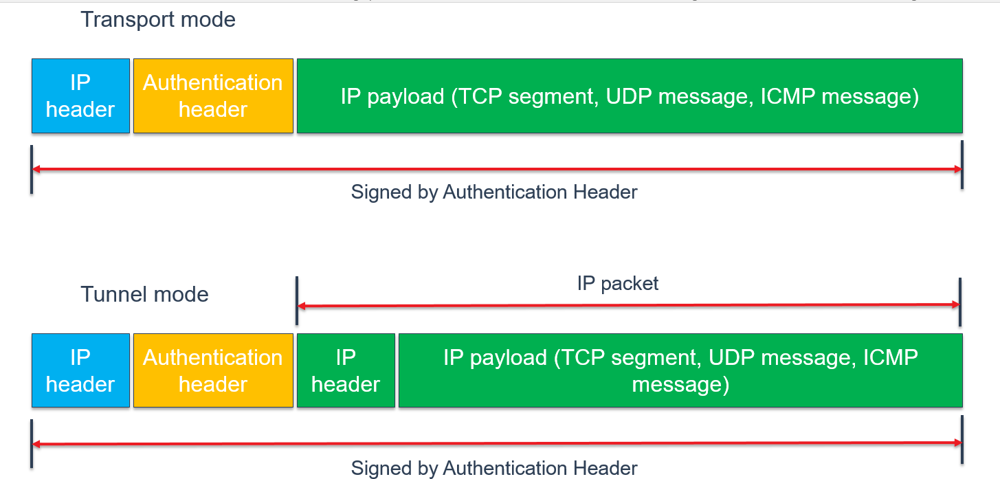
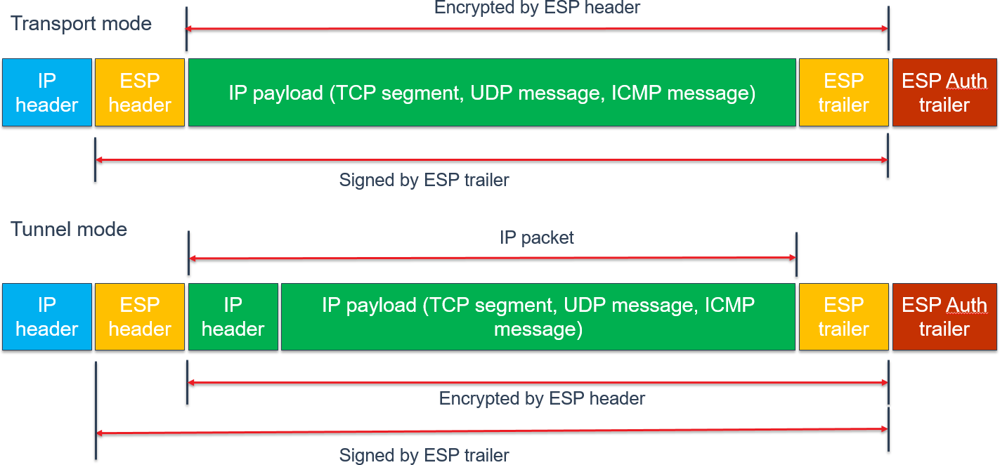
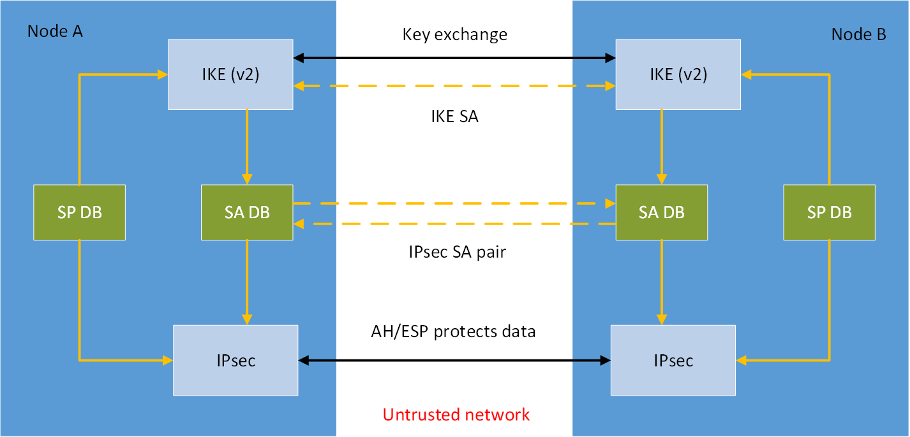
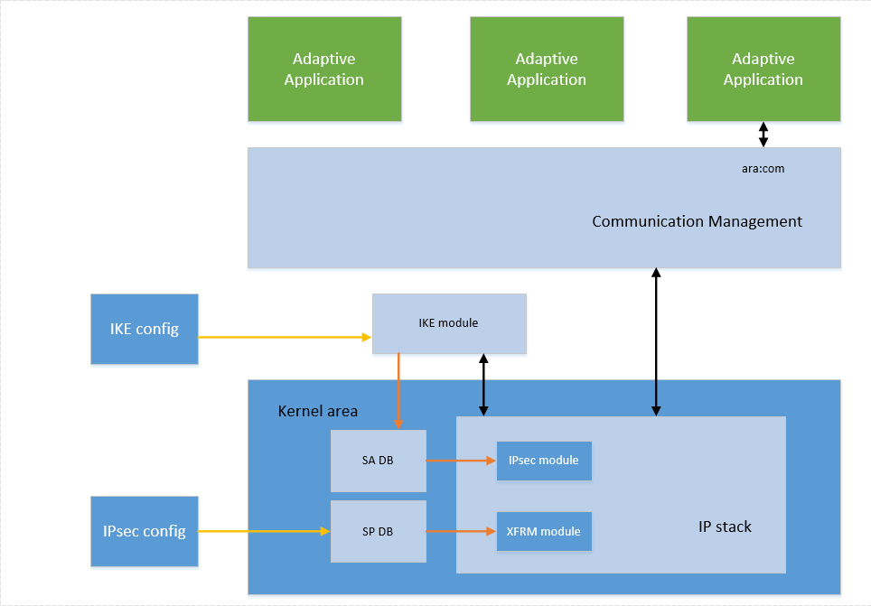

---
tip: translate by openai@2023-06-23 13:12:51
...
# **Contents**

1. # Introduction


   1. ## Scope of this document

> 本文档的范围


This document provides guidelines for IPsec implementation in the AUTOSAR Adaptive Platform.

> 此文件提供了AUTOSAR Adaptive Platform中IPsec实施的指南。

## Relation to other standards


This document is relevant to AUTOSAR Adaptive Platform only.

> 这份文件只与AUTOSAR Adaptive Platform有关。


2. # The Basics of IPsec Protocol

> 2. # IPsec 协议的基础


   1. ## IPsec protocol - network security standard

> ## IPsec协议 - 网络安全标准


IPsec is a network layer protocol suite that secures network connections by encrypting or authenticating IP packets. It constitutes a part of IP protocol suite.

> IPsec是一种网络层协议套件，可通过加密或验证IP数据包来保护网络连接。它构成了IP协议套件的一部分。


IPsec consists of three elementary components:

> IPsec由三个基本组件组成：

- Internet Key Exchange - most widely used module for key management
- Authentication Header - (IP protocol 51) for integrity
- Encapsulating Security Payload - (IP protocol 50) for integrity and confidentiality


It is an open network standard, maintained by IETF since 1995 and commonly used in network equipment as well as server and desktop operating systems.

> 这是一种开放的网络标准，自1995年以来由IETF维护，常用于网络设备以及服务器和桌面操作系统。


The IPsec can be implemented in the IP stack of an operating system, which requires modification of the source code. This method of implementation is done for many host and security gateway operating systems.

> IPsec可以在操作系统的IP堆栈中实现，这需要修改源代码。这种实施方法已经应用于许多主机和安全网关操作系统。


IPsec works in two basic modes of operation:

> IPsec 在两种基本操作模式下工作：

- Transport mode
- Tunnel mode


The following drawings explain packet structure of Authentication Header and Encap- sulating Security Payload.

> 以下图示解释了认证头和封装安全有效载荷的数据包结构。

{width="6.365624453193351in" height="3.0493744531933507in"}

**Figure 2.1: Authentication Header (AH) frame**

{width="6.077395013123359in" height="2.8272911198600177in"}

**Figure 2.2: Encapsulating Security Payload (ESP) frame**

## Internet Key Exchange operation


In order to create session keys necessary for the network traffic protection IKE starts key exchange and stores Security Associations. A Security Association (SA) is the formation of shared security elements between two network nodes in order to support secure communication. It may include attributes such as: cryptographic algorithm and mode, traffic encryption key, and parameters for the network data to be passed over the connection. They are usually stored in Security Associations Database.

> 为了创建保护网络流量所必需的会话密钥，IKE开始密钥交换并存储安全关联。安全关联（SA）是在两个网络节点之间建立的共享安全元素，以支持安全通信。它可能包括的属性有：加密算法和模式、流量加密密钥以及网络数据在连接中传输的参数。它们通常存储在安全关联数据库中。


Usually, a Security Association consists of at least the following parameters:

> 通常，安全协议至少包含以下参数：

- Destination IP address
- Security Parameter Index (SPI)
- IPsec protocol identifier (AH / ESP)
- Mode (transport / tunnel)
- Key and algorithms used
- Lifetime


The following drawing explains the meaning of IKE module, security associations and security policies databases for securing IPsec network communication.

> 以下图示解释了IKE模块、安全关联和安全策略数据库在保护IPsec网络通信中的意义。

{width="5.941666666666666in" height="2.8625in"}

**Figure 2.3: SA creation with IKE for network traffic protection**

# Objective


The objective of IPsec protocol implementation in AUTOSAR Adaptive Platform is pro- viding secure communication channels in the in-vehicle IP network.

> IPsec 协议在 AUTOSAR Adaptive 平台中的实施目标是为车载 IP 网络提供安全的通信通道。


Implementing IPsec in AUTOSAR Adaptive Platform would provide options for secur- ing communication between network nodes with confidentiality, integrity or both guar- anteed.

> 实施AUTOSAR Adaptive平台的IPsec将提供保护网络节点之间通信的可靠性、完整性或两者的选项。


IPsec, as a standard network security protocol provides means for secure communica- tion, while supporting multi-vendor stack interoperability.

> IPsec是一种标准的网络安全协议，可以提供安全通信的手段，同时支持多厂商堆栈的互操作性。


4. # Primary recommendations

> 4. 主要建议

   1. ## Prerequisites


As IPsec is a subset of IP protocol suite and is fully dependent on IP stack functionality, a fully useful IP stack enables IP network packet flow, necessary for IPsec protocol service.

> 由于IPsec是IP协议族的一个子集，完全依赖于IP堆栈功能，完整有用的IP堆栈可以实现IP网络数据包流，这是IPsec协议服务所必需的。

## Implementation of IPsec in AUTOSAR AP stack


Adaptive Platform does not specify any operating system for an Electronic Control Unit (ECU) and as of that, implementing state-of-the-art IPsec functionality along with best practices, it is the stack vendor responsibility.

> 适配平台不为电子控制单元（ECU）指定任何操作系统，因此，实施最先进的IPsec功能以及最佳实践，是堆栈供应商的责任。


This goal can be achieved without engaging any higher network stack level, i.e. com- munication channel established with IPsec would be fully transparent for AUTOSAR Adaptive Platform Communication Management functional cluster, thus for Adaptive Applications as well.

> 这个目标可以在不涉及任何更高网络堆栈级别的情况下实现，即使用IPsec建立的通信信道对AUTOSAR自适应平台通信管理功能集群，以及自适应应用程序都是完全透明的。


The following picture outlines the design of the AUTOSAR Adaptive stack. The func- tionality of the stack, presented below Communication Management there, is defined in AUTOSAR Adaptive Platform documentation only in the Specification of Manifest \[17\], what is represented as 'IKE config' and 'IPsec config' here.

> 以下图片概述了AUTOSAR自适应堆栈的设计。下面提供的通信管理功能，只在AUTOSAR自适应平台文档中的清单规范[17]中定义，这里表示为“IKE config”和“IPsec config”。

### This is only an example, based on Linux architecture and might require some modifications for other operating systems.

{width="6.32625in" height="4.403437226596675in"}

**Figure 4.1: Communication with IPsec in AUTOSAR Adaptive Platform**

## Operating System kernel with an IP stack


As mentioned above, IPsec requires OS usage of an IP stack, usually located in the kernel area. Being just a subset of the IP protocol suite, and a part of the IP stack in the end, IPsec would need to be integrated with the bare IP stack. That would be routinely obtained with compiling OS kernel along with IP stack and IPsec modules.

> 如上所述，IPsec需要操作系统使用IP栈，通常位于内核区域。作为IP协议族的一个子集，最终作为IP栈的一部分，IPsec需要与裸IP栈集成。这将通过编译操作系统内核以及IP栈和IPsec模块来获得。

## Kernel IPsec module


Most of current operating systems offer modern IP stack modules, extensible with IPsec functionality. They should be applied along with filtering modules (like e.g. the XFRM Framework in Linux), allowing packet management according to IPsec rules, as described in Specification of Manifest \[17\].

> 大多数当前操作系统提供具有IPsec功能的现代IP堆栈模块，可以与过滤模块（如Linux中的XFRM框架）一起使用，根据《清单规范》[17]中描述的IPsec规则进行数据包管理。


IPconfig part defined in Specification of Manifest would be typically represented as security policies, forming security policies database, but it depends on implementation in the end.

> IPconfig部分在清单规范中的定义通常会被表示为安全策略，形成安全策略数据库，但最终取决于实施。

## IKE module


In order to make IPsec operative an Internet Key Exchange (IKE) module is needed. Typically, it would not be a part of the kernel space and require separated integration.

> 为了使IPsec有效，需要一个Internet Key Exchange（IKE）模块。通常，它不是内核空间的一部分，需要单独集成。


For AUTOSAR Adaptive Platform IKE version 2 should be used. IKEv2 provides mod- ern security options and is eventually easier to implement.

> 对于AUTOSAR自适应平台，应使用IKE版本2。IKEv2提供现代安全选项，最终实现起来更容易。


IKE config would usually stand for a configuration file.

> 我们通常用IKE config来指代一个配置文件。


IKE module needs to be initialised during boot process in order to make sure all nec- essary security associations would be ready before the node starts communication.

> 模块IKE需要在启动过程中初始化，以确保在节点开始通信之前所有必要的安全关联都准备就绪。

# Detailed requirements for IPsec implementation


While integrating IPsec in AUTOSAR Adaptive Platform, the following requirements should be met. That would ensure compatibility and superior security posture.

> 在AUTOSAR Adaptive平台中集成IPsec时，应满足以下要求，以确保兼容性和更高的安全态势。


1. ## IPsec shall be implemented based on the following standards:

> IPsec应根据以下标准实施：


   - \"Security Architecture for the Internet Protocol\" \[2\]

> 《互联网协议的安全体系结构》[2]

   - \"Authentication Header (AH)\" \[3\]

> "认证头（AH）"[3]

   - \"Encapsulating Security Payload (ESP)\" \[4\]

> 封装安全负载（ESP）[4]
    - 500/UDP: IKEv2 packets
    - 4500/UDP: IKEv2 packets
    - 6801/TCP: Diagnostics

```{=html}
<!-- -->
```

6. # Further guidance


   1. ## Multicast communication

> ## 多播通信


Multicast communication secured with IPsec is currently not planned for AUTOSAR Adaptive Platform, what simplifies key management and reduces the risk of a key dis- closure.

> 多播通信使用IPsec进行安全保护，目前尚未计划在AUTOSAR Adaptive Platform上实施，这简化了密钥管理，并降低了密钥泄露的风险。


These benefits for smaller networks, like in-vehicle network, would usually prevail.

> 这些好处通常适用于较小的网络，如车载网络。

## Retry for key update


If the peer ECU is not available when keys shall be updated, the ECU retries, whether the peer ECU is available again. That way security association can be obtained despite a temporary node unavailability.

> 如果在更新密钥时对等ECU不可用，ECU会重试，以查看对等ECU是否再次可用。这样，即使节点暂时不可用，也可以获得安全关联。

## Backward Compatibility


Electronic Control Units with IPsec support shall allow integration into vehicles, in which their communication partners do not support IPsec. Configuration options for either IP or IPsec communication for specific peers shall be available.

> 电子控制单元支持IPsec，可以集成到其通信伙伴不支持IPsec的车辆中。可以为特定对等体提供IP或IPsec通信的配置选项。

## Filtering with IPsec rules


The ECU shall support that certain application sockets - IP address, protocol, and port number - can only be connected using IPsec.

> ECU必须支持特定的应用程序套接字 - IP地址，协议和端口号 - 只能使用IPsec连接。

## Patch Management


It is highly recommended to check, if there is an update available for libraries integrated in the IPsec kernel module or IKE module, and apply them whenever possible.

> 强烈建议检查IPsec内核模块或IKE模块中集成的库是否有更新，并尽可能地应用它们。

## Security Functions Development


When there is a new cryptographic function available, like e.g. new encryption algo- rithm, it would make sense to introduce it. It would work reasonable, however, only when performed based on approved RFC documents.

> 当有新的密码函数可用时，例如新的加密算法，引入它是有意义的。但是，只有在基于批准的RFC文档执行时，它才能正常工作。

# Supplementary information


The above mentioned requirements should not be regarded as exhaustive, and the final implementation does not need to be restricted to them.

> 以上提到的要求不应被视为穷尽，最终实施也不必受到其限制。


In particular, documentation specific to software packets picked out for integration with the operating system stack should be taken into consideration.

> 特别是，应该考虑与操作系统堆栈集成的软件包的相关文档。

# Related documentation


\[1 \] AUTOSAR Specifications in general \[2 \] RFC 4301

> 【1】AUTOSAR规范总体 【2】RFC 4301

\[16 \] Specification of Manifest

> [16] 规格说明书

# Acronyms and Abbreviations


The glossary below includes acronyms and abbreviations relevant to the explanation of IPsec implementation in AUTOSAR Adaptive Platform.

> 以下词汇表包含与AUTOSAR Adaptive Platform中IPsec实施有关的缩写和缩略语。
