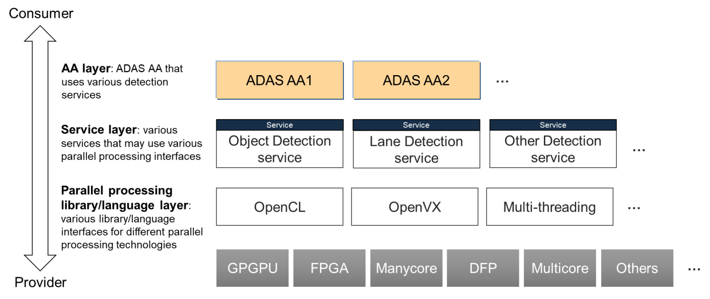
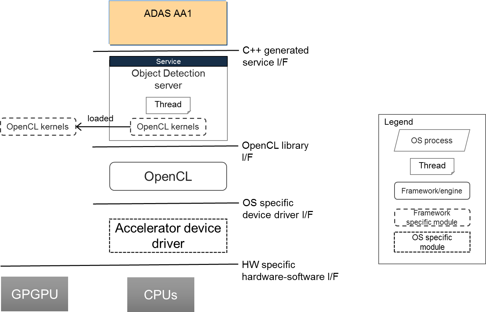
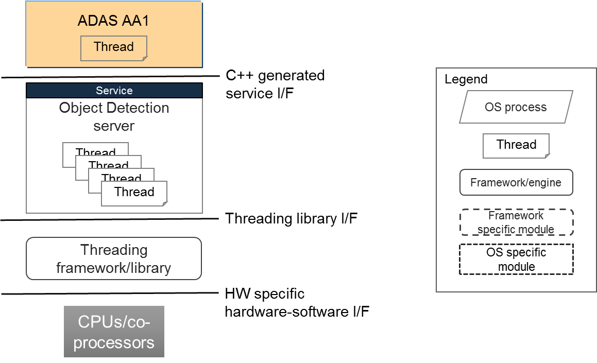

---
tip: translate by openai@2023-06-23 13:00:02
...
# **Contents**

1. # Introduction

   1. ## Contents


This document specifies the guidelines for using parallel processing technologies on the Adaptive Platform, or Parallel Processing Guidelines, in short.

> 本文档指定了在自适应平台上使用并行处理技术的指南，简称为“并行处理指南”。


The purpose of this document is to provide design guidelines for using parallel pro- cessing technologies on the Adaptive Platform. The focus is on software, especially the application layer including the services. General hardware discussions are also included to build the base for software.

> 本文档的目的是为 Adaptive Platform 上使用并行处理技术提供设计指南。重点是软件，特别是应用层，包括服务。还包括一般的硬件讨论，以建立软件的基础。

## Prereads


This document is one of the high-level conceptual documents of AUTOSAR. Useful pre-reads are [[1](#_bookmark7)] [[2](#_bookmark8)] [[3](#_bookmark9)] [[4](#_bookmark10)].

> 这份文档是AUTOSAR高级概念文档之一。有用的预读参考资料为[[1](#_bookmark7)] [[2](#_bookmark8)] [[3](#_bookmark9)] [[4](#_bookmark10)]。

## Relationship to other AUTOSAR specifications


Refer to Contents and Prereads.

> 参考目录和预读。

# Definition of terms and acronyms


Acronyms and abbreviations which have a local scope and therefore are not contained in the AUTOSAR glossary [[1](#_bookmark7)] must be defined in this chapter.

> 本章节必须定义具有本地范围，因此不包含在AUTOSAR词汇表[[1](#_bookmark7)]中的首字母缩写和缩略语。

## Acronyms and abbreviations

```
  -----------------------------------------------------------------------
  **Abbreviation**         **Description**
  ------------------------ ----------------------------------------------
  ADAS                     Autonomous Driving and Assistance System

  ARA                      AUTOSAR Run-time for Applications

  SOA                      Service-Oriented Architecture
  -----------------------------------------------------------------------
```

# Related Documentation


1. []{#\_bookmark7 .anchor}Glossary []{#\_bookmark8 .anchor}AUTOSAR_TR_Glossary

> 1. 术语表（AUTOSAR_TR_Glossary）

2. Main Requirements []{#\_bookmark9 .anchor}AUTOSAR_RS_Main

> 2. 主要要求[]{#\_bookmark9 .anchor}AUTOSAR_RS_Main

3. Methodology for Adaptive Platform []{#\_bookmark10 .anchor}AUTOSAR_TR_AdaptiveMethodology

> 3. 自适应平台的方法学 []{#\_bookmark10 .anchor}AUTOSAR_TR_AdaptiveMethodology

4. Explanation of Adaptive Platform Design []{#\_bookmark11 .anchor}AUTOSAR_EXP_PlatformDesign

> 自适应平台设计的解释AUTOSAR

5. Specification of Execution Management AUTOSAR_SWS_ExecutionManagement

> 5. AUTOSAR_SWS_执行管理的规格

```{=html}
<!-- -->
```

4. # Scope


   1. ## Definition of parallel processing \"technologies\"

> 平行处理技术的定义


In this document, the meaning of parallel processing technologies is loosely defined. This is so on purpose, with hopes to provide design principles for parallel and related processing (see Distributed, concurrent, and parallel).

> 在本文档中，并行处理技术的含义是松散定义的。这是故意的，希望能够为并行和相关处理（参见分布式、同步和并行）提供设计原则。


The term \"parallel processing technologies\" in this document, therefore, covers both hardware and software. In term of hardware, multicore, manycore, DFP (Data-Flow Processor), GPU (Graphical Processing Unit), FPGA (Field Programmable Gate Ar- ray), or alike; in terms of software, multi-thread programming, pragma based tech- niques like OpenMP[1](#_bookmark15), various template programming such as TBB[2](#_bookmark16), accelerator pro- gramming language like OpenCL[3](#_bookmark17), and even various message passing APIs like MPI[4](#_bookmark18) that are not by themselves parallel processing technologies but are tightly related to. The technologies also include various tooling that assists in designing and implement- ing the parallel processing technologies into an Adaptive Platform based system.

> 本文中的“并行处理技术”一词，因此，涵盖了硬件和软件。从硬件的角度来看，多核、多核、DFP（数据流处理器）、GPU（图形处理单元）、FPGA（可编程门阵列）等；从软件的角度来看，多线程编程、基于Pragma的技术，如OpenMP [1]（#_bookmark15），各种模板编程，如TBB [2]（#_bookmark16），加速器编程语言，如OpenCL [3]（#_bookmark17），甚至各种消息传递API，如MPI [4]（#_bookmark18），它们本身不是并行处理技术，但与之密切相关。该技术还包括各种工具，用于设计和实施基于自适应平台的并行处理技术。


It is not a purpose of this document to list all the existing parallel processing technolo- gies, to explain what they are, nor to guide how to use the technologies themselves. Nevertheless, the document may contain some references to the technologies as min- imum as deemed necessary to describe the design guidelines.

> 此文档的目的不是列出所有现有的并行处理技术，解释它们是什么，也不是指导如何使用这些技术。尽管如此，文档可能包含一些技术参考，只要认为有必要描述设计准则即可。

## Audience


This specification is for multiple domains of Adaptive Platform related designers and developers, namely the system designer who decides hardware/software partitioning, hardware designer who design and/or select computing hardware resources, a soft- ware designer who design overall software system architecture, Adaptive Platform de- velopers, and developers of Adaptive Platform services running on ARA.

> 这个规范是针对多个领域的自适应平台相关设计师和开发人员，即决定硬件/软件分割的系统设计师，设计和/或选择计算硬件资源的硬件设计师，设计整个软件系统架构的软件设计师，自适应平台开发人员，以及在ARA上运行的自适应平台服务的开发人员。


Adaptive Application developers, on the other hand, who may not directly use parallel processing technologies and only design sequential, single-threaded applica- tion, may find this irrelevant, if his/her software architect follows the architectural de- sign guideline described in this document. However, nowadays it is becoming difficult to write an application without some form of multi-thread programming, and it is likely to be more so in future, so essentially everyone concerned with Adaptive Platform is advised to reference this document.

> 适应性应用开发者可能不会直接使用并行处理技术，只设计顺序的单线程应用程序，他们可能会认为本文档中描述的架构设计准则不相关，但是如今，要编写一个没有多线程编程的应用程序已经变得越来越困难，而且未来可能会更加困难，因此，涉及到适应性平台的每个人都应该参考本文档。


1[[]{#\_bookmark16 .anchor}]{#\_bookmark15 .anchor}[http://www.openmp.org/](http://www.openmp.org/) 2[]{#\_bookmark17 .anchor}[https://www.threadingb](http://www.threadingbuildingblocks.org/)uildingb[locks.org/](http://www.threadingbuildingblocks.org/) 3[]{#\_bookmark18 .anchor}[https://jp.khronos.org/opencl](https://jp.khronos.org/opencl) 4[http://www.mcs.anl.gov/research/projects/mpi/](http://www.mcs.anl.gov/research/projects/mpi/)

> 1[[]{#\_bookmark16 .anchor}]{#\_bookmark15 .anchor}[http://www.openmp.org/](http://www.openmp.org/) 2[]{#\_bookmark17 .anchor}[https://www.threadingb](http://www.threadingbuildingblocks.org/)uildingb[locks.org/](http://www.threadingbuildingblocks.org/) 3[]{#\_bookmark18 .anchor}[https://jp.khronos.org/opencl](https://jp.khronos.org/opencl) 4[http://www.mcs.anl.gov/research/projects/mpi/](http://www.mcs.anl.gov/research/projects/mpi/)

1[[]{#\_bookmark16 .anchor}]{#\_bookmark15 .anchor}[http://www.openmp.org/](http://www.openmp.org/) 2[]{#\_bookmark17 .anchor}[https://www.threadingb](http://www.threadingbuildingblocks.org/)uildingb[locks.org/](http://www.threadingbuildingblocks.org/) 3[]{#\_bookmark18 .anchor}[https://jp.khronos.org/opencl](https://jp.khronos.org/opencl) 4[http://www.mcs.anl.gov/research/projects/mpi/](http://www.mcs.anl.gov/research/projects/mpi/)

1[[]{#\_bookmark16 .anchor}]{#\_bookmark15 .anchor}[http://www.openmp.org/](http://www.openmp.org/) 2[]{#\_bookmark17 .anchor}[https://www.threadingb](http://www.threadingbuildingblocks.org/)uildingb[locks.org/](http://www.threadingbuildingblocks.org/) 3[]{#\_bookmark18 .anchor}[https://jp.khronos.org/opencl](https://jp.khronos.org/opencl) 4[http://www.mcs.anl.gov/research/projects/mpi/](http://www.mcs.anl.gov/research/projects/mpi/)

1[[]{#\_bookmark16 .anchor}]{#\_bookmark15 .anchor}[http://www.openmp.org/](http://www.openmp.org/) 2[]{#\_bookmark17 .anchor}[https://www.threadingb](http://www.threadingbuildingblocks.org/)uildingb[locks.org/](http://www.threadingbuildingblocks.org/) 3[]{#\_bookmark18 .anchor}[https://jp.khronos.org/opencl](https://jp.khronos.org/opencl) 4[http://www.mcs.anl.gov/research/projects/mpi/](http://www.mcs.anl.gov/research/projects/mpi/)

1[[]{#\_bookmark16 .anchor}]{#\_bookmark15 .anchor}[http://www.openmp.org/](http://www.openmp.org/) 2[]{#\_bookmark17 .anchor}[https://www.threadingb](http://www.threadingbuildingblocks.org/)uildingb[locks.org/](http://www.threadingbuildingblocks.org/) 3[]{#\_bookmark18 .anchor}[https://jp.khronos.org/opencl](https://jp.khronos.org/opencl) 4[http://www.mcs.anl.gov/research/projects/mpi/](http://www.mcs.anl.gov/research/projects/mpi/)

1[[]{#\_bookmark16 .anchor}]{#\_bookmark15 .anchor}[http://www.openmp.org/](http://www.openmp.org/) 2[]{#\_bookmark17 .anchor}[https://www.threadingb](http://www.threadingbuildingblocks.org/)uildingb[locks.org/](http://www.threadingbuildingblocks.org/) 3[]{#\_bookmark18 .anchor}[https://jp.khronos.org/opencl](https://jp.khronos.org/opencl) 4[http://www.mcs.anl.gov/research/projects/mpi/](http://www.mcs.anl.gov/research/projects/mpi/)

1[[]{#\_bookmark16 .anchor}]{#\_bookmark15 .anchor}[http://www.openmp.org/](http://www.openmp.org/) 2[]{#\_bookmark17 .anchor}[https://www.threadingb](http://www.threadingbuildingblocks.org/)uildingb[locks.org/](http://www.threadingbuildingblocks.org/) 3[]{#\_bookmark18 .anchor}[https://jp.khronos.org/opencl](https://jp.khronos.org/opencl) 4[http://www.mcs.anl.gov/research/projects/mpi/](http://www.mcs.anl.gov/research/projects/mpi/)

1[[]{#\_bookmark16 .anchor}]{#\_bookmark15 .anchor}[http://www.openmp.org/](http://www.openmp.org/)：开放多处理环境 2[]{#\_bookmark17 .anchor}[https://www.threadingb](http://www.threadingbuildingblocks.org/)uildingb[locks.org/](http://www.threadingbuildingblocks.org/)：线程构建块 3[]{#\_bookmark18 .anchor}[https://jp.khronos.org/opencl](https://jp.khronos.org/opencl)：开放式计算语言 4[http://www.mcs.anl.gov/research/projects/mpi/](http://www.mcs.anl.gov/research/projects/mpi/)：多处理器消息传递接口


5. # Architectural design

> 5. # 建筑设计

   1. ## Background

      1. ### Evolving parallel processing technologies


The parallel processing technologies are still rapidly evolving, both in hardware and software. In hardware, GPGPU (General Purpose GPU) is one of them but never the only one - various manycore processors, data flow processors, FPGA, and some dedicated accelerators are emerging, and it seems there are more to come, including the evolutions of these existing technologies.

> 并行处理技术仍在快速发展，无论是在硬件还是软件方面。在硬件方面，GPGPU（通用GPU）是其中之一，但绝不是唯一的 - 各种多核处理器，数据流处理器，FPGA以及一些专用加速器正在出现，似乎还有更多的东西要来，包括这些现有技术的进化。


The picture looks similar in software. Starting with the threading library offered by POSIX and C++ Standard libraries that the Adaptive Platform supports, and other threading libraries such as TBB, MTAPI[1](#_bookmark23), compiler directives based threading like

> 图片在软件中看起来很相似。从POSIX和C++标准库提供的线程库开始，可移植平台支持其他线程库，如TBB、MTAPI[1]，以及基于编译器指令的线程。


OpenMP, accelerator programming language like OpenCL and CUDAÂ*⃝*R (proprietary),

> OpenMP，像OpenCL和CUDA（专有）这样的加速编程语言


HLS[2](#_bookmark24) compiler based FPGA programming, and various parallelization compilers/tools, such as graph or process network-based tools, which generally use threading under- neath but technologically not limited to, and there are even model based paralleliza-

> 基于HLS[2](#_bookmark24)编译器的FPGA编程，以及各种并行化编译器/工具，例如基于图或进程网络的工具，它们通常使用线程作为底层，但技术上并不局限于此，甚至存在基于模型的并行化。


tion tools that can take a SimulinkÂ*⃝*R model as input. Also, there are various mes-

> 有一些工具可以把Simulink* R模型作为输入。此外，还有各种消息处理工具。


sage passing APIs, like MPI, that often work along with these technologies. There are higher-level libraries such as OpenCV[3](#_bookmark25), OpenVX[4](#_bookmark26) - though these are not by themselves parallel processing libraries, they generally use parallel processing technologies under- neath to accelerate the processing. At last, similar in a sense that they are higher-level, there are C++ AMP[5](#_bookmark27) and SYCL[6](#_bookmark28). To further complicate the matter, OpenMP 4 now sup- ports accelerators. And this is not a complete list.

> sage通过API，如MPI，通常与这些技术一起工作。有更高级别的库，如OpenCV[3]（＃_bookmark25），OpenVX[4]（＃_bookmark26）-虽然它们本身不是并行处理库，但它们通常在底层使用并行处理技术来加速处理。最后，在某种意义上类似的是，它们是更高级别的，有C ++ AMP[5]（＃_bookmark27）和SYCL[6]（＃_bookmark28）。要进一步复杂化这个问题，OpenMP 4现在支持加速器。这还不是完整的列表。

### Distributed, concurrent, and parallel


In most cases, AUTOSAR systems are distributed systems. A distributed system is concurrent, meaning multiple tasks are running at the same time. Each subsystem in the distributed system has some sort of processing elements, typically CPUs (but not necessarily) - therefore at the whole this is a multi-processor system, capable of both concurrent and parallel computing. Note that if the Adaptive Platform runs on a single- core processor Machine without any other computing elements, parallel processing is not possible, although concurrency still is, as OS provides the threading mechanism to switch processing (threads) triggered by some event.

> 在大多数情况下，AUTOSAR系统是分布式系统。分布式系统是并发的，意味着多个任务同时运行。分布式系统中的每个子系统都有某种处理元素，通常是CPU（但不一定）- 因此，整体上这是一个多处理器系统，能够进行并发和并行计算。请注意，如果自适应平台在没有任何其他计算元素的单核处理器机器上运行，则无法实现并行处理，尽管并发仍然可以，因为操作系统提供了由某些事件触发的处理（线程）切换机制。


1[[]{#\_bookmark24 .anchor}]{#\_bookmark23 .anchor}The Multicore Association [http://www.multicore-association.org/workgroup/mtapi.php](http://www.multicore-association.org/workgroup/mtapi.php)

> 多核协会[http://www.multicore-association.org/workgroup/mtapi.php](http://www.multicore-association.org/workgroup/mtapi.php)


2[]{#\_bookmark25 .anchor}High Level Synthesis 3[]{#\_bookmark26 .anchor}[http://opencv.org/](http://opencv.org/) 4[]{#\_bookmark27 .anchor}[https://www](http://www.khronos.org/openvx/).khronos[.org/openvx/](http://www.khronos.org/openvx/)

> 2[]{#\_bookmark25 .anchor}高层综合 3[]{#\_bookmark26 .anchor}[http://opencv.org/](http://opencv.org/) 4[]{#\_bookmark27 .anchor}[https://www](http://www.khronos.org/openvx/).khronos[.org/openvx/](http://www.khronos.org/openvx/)
高级综合[http://opencv.org/](http://opencv.org/)[https://www](http://www.khronos.org/openvx/).khronos[.org/openvx/](http://www.khronos.org/openvx/)


5[http://download.microsoft.com/download/4/0/E/40EA02D8-23A7-4BD2-AD3A-](http://download.microsoft.com/download/4/0/E/40EA02D8-23A7-4BD2-AD3A-)

> 五[http://download.microsoft.com/download/4/0/E/40EA02D8-23A7-4BD2-AD3A-](http://download.microsoft.com/download/4/0/E/40EA02D8-23A7-4BD2-AD3A-)


[]{#\_bookmark28 .anchor}0BFFFB640F28/CppAMPLanguageAndProgrammingModel.pdf

> 0BFFFB640F28/CppAMPLanguageAndProgrammingModel.pdf（C++ AMP 语言和编程模型）


6[https://www](http://www.khronos.org/sycl).khronos[.org/sycl](http://www.khronos.org/sycl)

> 6[https://www.khronos.org/sycl](http://www.khronos.org/sycl)（SYCL）


Parallel processing may occur at different computing layers, from bit-level, instruction- level, thread-level, (and/or) task-level. The definition of \"task-level\" differs among com- puting models and methodologies. In AUTOSAR Adaptive Platform software point of view, however, parallel processing strictly applies either on thread-level, process level, or on Machine (platform) level. It is also noteworthy to recognize that a process, in the context of the Adaptive Platform that is based on POSIX multi-process OS, is just a container for threads and not an execution entity like a thread by itself. The container provides an enclosure for a certain unique set of resources, which include some logical memory accessible by the process. This is also the same for the machines. It is always the thread-concurrency and parallelism (if more than two processors are available) at the software level that is directly executed on top of the AUTOSAR Adaptive Platform OS.

> 并行处理可以发生在不同的计算层次，从位级到指令级别、线程级别（和/或）任务级别。“任务级别”的定义因计算模型和方法而异。然而，从AUTOSAR Adaptive Platform软件的角度来看，并行处理严格地适用于线程级别、进程级别或机器（平台）级别。值得注意的是，在基于POSIX多进程操作系统的Adaptive Platform上下文中，进程只是线程的一个容器，而不是像线程一样的执行实体。该容器为某些唯一资源集提供了一个封装，其中包括进程可访问的某些逻辑内存。这对机器也是一样的。在软件层面上，始终是线程并发和并行（如果有多个处理器可用），它们直接在AUTOSAR Adaptive Platform操作系统之上执行。


There may be other processing elements that are either incapable of directly executing Adaptive Platform but offer some useful computing. GPU, FPGA, DFP (Data Flow Processor), and manycore processor, are representative examples, although some of them can execute some executive or OS, and even Adaptive Platform itself, fully or partially. If they are incapable of running Adaptive Platform at least partially, then the parallel processing capability can only be accessed by some kind of specific interfaces from a thread running on Adaptive Platform, regardless of the mechanism behind the interface. They are still programmable in one way or another - but just not in the way ARA and C++ bindings that the Adaptive Platform defines.

> 可能还有其他处理元素，它们无法直接执行自适应平台，但可以提供一些有用的计算。GPU、FPGA、DFP（数据流处理器）和多核处理器就是典型的例子，尽管它们中的一些可以完全或部分地执行某些执行程序或操作系统，甚至可以执行自适应平台本身。如果它们无法至少部分运行自适应平台，那么无论接口背后的机制是什么，并行处理能力只能通过自适应平台上运行的线程的某种特定接口访问。它们仍然可以以某种方式编程，但不是自适应平台定义的ARA和C++绑定的方式。


The important architectural design consideration here is that parallel processing at large is a system level topic. Distributed, concurrent, and parallel processing are highly interrelated. One example is that a well-designed multi-threaded program may run con- currently on a single-core processor, or in parallel on a multi-core processor, or even distributed over two machines provided it uses some processor/Machine transparent thread communication.

> 重要的建筑设计考虑在这里是并行处理在大多数情况下是系统级别的话题。分布式、并发和并行处理是高度相关的。一个例子是，一个设计良好的多线程程序可以在单核处理器上运行，也可以在多核处理器上并行运行，甚至可以使用一些处理器/机器透明的线程通信分布在两台机器上运行。

### TLP/DLP/PLP


In general, there are three types of parallel processing: Task Level Parallelism (TLP), Data Level Parallelism (DLP), and Pipeline Level Parallelism (PLP). The TLP refers per- forming multiple tasks at the same time as they are (mostly) independent and (mostly) do not depend on each other. DLP refers to performing the same calculation with mul- tiple, (mostly) non-interdependent sets of (large) data. The same calculation is multi- plexed with the different set of data. PLP refers to executing multiple inter-dependent tasks in a pipeline fashion. Each task is assigned to a pipeline stage according to the data dependency of the task input/output.

> 一般来说，有三种并行处理：任务级并行（TLP）、数据级并行（DLP）和流水级并行（PLP）。TLP指的是同时执行多个任务，因为它们（大多数情况下）是独立的，（大多数情况下）不相互依赖的。DLP指的是使用多个（大多数情况下）不相互依赖的（大量）数据执行相同的计算。相同的计算用不同的数据集复用。PLP指的是以流水线方式执行多个相互依赖的任务。根据任务输入/输出的数据依赖性，将每个任务分配给流水线阶段。


The three types of parallelism exist in multiple layers of the system. There can be system level parallelism, like two Adaptive Platform machines may have TLP or even PLP. Another example may be that multiple-camera-based 360-degree real-time object recognition may be realized by multiple Adaptive Platform machines performing DLP against a large data set of (virtual) vehicle surrounding video image. The point here

> 三种并行性存在于系统的多个层次中。可以有系统级并行性，比如两台自适应平台机器可以具有TLP甚至PLP。另一个例子可能是基于多摄像头的360度实时物体识别可以通过多台自适应平台机器对大型数据集（虚拟）车辆周围视频图像执行DLP来实现。这里的重点是


is that it is critical for a vehicle system designer to understand the system overall data flow and processing loads and allocate Adaptive Platform machines accordingly. This can be termed as an Adaptive Platform Machine level parallelism.

> 作为一个车辆系统设计师，了解整个系统的数据流动和处理负载，并相应地分配自适应平台机器是至关重要的。这可以称为自适应平台机器级别的并行性。


The next physical level below is OS-thread level parallelism. The three types of paral- lelism described above can be implemented using OS threads.

> 下一个物理层次是操作系统线程层次的并行性。上述三种并行性可以使用操作系统线程实现。


Yet another physical level below is the instruction level parallelism. This is generally in the field of processor and compiler technologies. For example, a VLIW[7](#_bookmark32) processor architecture has multiple execution units that allow concurrent execution of multiple instruction streams, in either TLP or DLP fashion. A SIMD (Single Instruction Multi- ple Data) co-processor instruction extension enables DLP at the instruction level. A GPGPU, in general, is a form of instruction level DLP in \"[5.2.2](#accelerator-model) _Accelerator-model_\". The SIMD extension, on the other hand, is DLP in \"[5.2.3](#cpuco-processor-model) _CPU/co-processor-model_\". A manycore processor, including most of DFP (Data Flow Processor), offer in general MIMD (Multiple Instruction Multiple Data) instruction level parallelism. Since it is not the same single instruction as in the case of SIMD, MIMD can be used to implement all three forms of parallelism, namely TLP, DLP, and PLP.

> 另一种物理水平低于指令水平并行。这通常是处理器和编译器技术领域。例如，VLIW[7]（#_bookmark32）处理器架构具有多个执行单元，允许同时执行多个指令流，以TLP或DLP方式。 SIMD（单指令多数据）共享处理器指令扩展可在指令级别实现DLP。 GPGPU通常是“[5.2.2]（#accelerator-model）_Accelerator-model_”中的指令级DLP的一种形式。另一方面，SIMD扩展是“[5.2.3]（#cpuco-processor-model）_CPU / co-processor-model_”中的DLP。 大多数DFP（数据流处理器）的多核处理器通常提供MIMD（多指令多数据）指令级并行性。由于它不是与SIMD相同的单个指令，因此MIMD可用于实现三种形式的并行性，即TLP，DLP和PLP。


Also, regardless of the physical levels, namely Adaptive Platform Machine level, OS- thread level, or Instruction level, the TLP, DLP, and PLP are not always used indepen- dently. For example, for the multi-stage processing of large data, the combination of DLP and PLP are popular.

> 此外，不管是自适应平台机器级别，操作系统线程级别还是指令级别，TLP、DLP和PLP并不总是独立使用。例如，用于大数据的多阶段处理，DLP和PLP的组合很流行。

## Service-based parallel processing


With the background provided in [5.1](#background), the key concept of this guideline is to utilize the SOA of Adaptive Platform. That is, to push the use of parallel processing technologies underneath non-platform services, leaving the Adaptive Application free from the various parallel processing technologies used. The service 'implementation', on the other hand, will be specific to the choice of parallel processing technologies used. We call this model of parallel processing as \"[5.2](#service-based-parallel-processing) _Service-based parallel processing_\".

> 随着[5.1]（#背景）中提供的背景，本准则的关键概念是利用Adaptive Platform的SOA。也就是说，推动在非平台服务之下使用并行处理技术，使Adaptive Application免受各种并行处理技术的影响。另一方面，服务'实施'将根据所使用的并行处理技术而具体化。我们将这种并行处理模型称为“[5.2]（#基于服务的并行处理）_基于服务的并行处理_”。


This model allows the maximum reuse of Adaptive Application that requires high-performance computing in realizing its functionality. The heavy lifting part will be separated into non-platform services, and the implementation of services are free to utilize the full capability of the parallel processing technologies of choice, provided they conform to the safety/security requirements of the project.

> 这个模型允许最大限度地重用自适应应用程序，以实现其功能所需的高性能计算。重担部分将被分离成非平台服务，服务的实现可以充分利用所选择的并行处理技术，只要它们符合项目的安全/安全要求。

### Layered architectural view


Figure [5.1](#_bookmark33) illustrates the overall architecture of the service-based parallel processing. The example is based on some ADAS domain application, but it is not the intention to limit the domain in any way.

> 图5.1（#_bookmark33）描绘了基于服务的并行处理的整体架构。该示例基于某些ADAS领域应用，但不是有意限制该领域的任何方式。


7[]{#\_bookmark32 .anchor}Very Long Instruction Word

> 7[]{#\_bookmark32 .anchor}非常长的指令词

{width="6.371891951006124in" height="2.6812489063867018in"}

**Figure 5.1:** []{#\_bookmark33 .anchor}**Parallel processing consumer-provider layered view example**


The overall picture shows the producers and consumers of various parallel processing services, in a top-down layered fashion.

> 总体图片以自上而下的分层方式显示各种并行处理服务的生产者和消费者。


The Adaptive Application layer is the Adaptive Application that uses vari- ous services. The Adaptive Application does (or should) not know which of the services it is using uses parallel processing underneath.

> 适应性应用层是使用各种服务的适应性应用程序。适应性应用程序（或应该）不知道它正在使用的服务使用的是并行处理。


The Service layer, in the context of this guideline, consists of the services which use parallel processing technologies. There are non-platform services that use ara::com. They provide C++ interface library generated from the service definition, which is used by the Adaptive Application. Note that these services may very well use other services internally. One example is that one may design a pre-processing or low-level sensing service, and a meta-data provider service that uses the output of the former service. Another example may be that one may design various detection services and a predictor service that use the detection services to predict the object in a future hori- zon. Also, note that there may well be some common higher-level library or engine used by the Service layer. Such a library may use some parallel processing library under- neath. One example may be the relationship between OpenCV and OpenCL. OpenCV provides the vision processing framework/library, which underneath (can) use OpenCL to use programmable accelerators. The OpenCV library may be used by multiple ser- vices. This is similar for the relationship between OpenVX and OpenCL - however, unlike OpenCV, OpenVX is designed so that the OpenVX interface implementations can directly access the specific accelerators, without OpenCL in between. Therefore, it is drawn to be in the Parallel processing library/language layer in the figure.

> 本指南中的服务层由使用并行处理技术的服务组成。有使用ara::com的非平台服务。它们提供从服务定义生成的C++接口库，被自适应应用程序使用。注意，这些服务可能在内部使用其他服务。例如，可以设计一个预处理或低级传感服务，以及使用前者服务的元数据提供程序服务。另一个例子可能是，可以设计各种检测服务和一个预测服务，该服务使用检测服务来预测未来的对象。另外，注意，服务层可能有一些共同的高级库或引擎。这样的库可能在底层使用一些并行处理库。一个例子可能是OpenCV和OpenCL之间的关系。OpenCV提供视觉处理框架/库，它在底层（可以）使用OpenCL来使用可编程加速器。OpenCV库可以被多个服务使用。OpenVX和OpenCL之间的关系也是如此，但与OpenCV不同，OpenVX设计为OpenVX接口实现可以直接访问特定加速器，而不需要OpenCL中间层。因此，它被绘制为图中的并行处理库/语言层。


The Service layer uses Parallel processing library/language layer, which can vary de- pending on the choice of parallel processing technologies used in the service imple- mentation. The programming interface for this layer varies as discussed in \"[5.1.1](#evolving-parallel-processing-technologies) _Evolving parallel processing technologies_\", and it is just not semantically possible to have a single unified interface to generalize all or even most of the different inter- face/languages, without severely impacting the performance benefit, which contradicts the purpose of employing the parallel processing in the first place.

> 服务层使用并行处理库/语言层，其取决于服务实现中使用的并行处理技术的选择。此层的编程接口如“[5.1.1]（＃不断发展的并行处理技术）_不断发展的并行处理技术_”中所述而有所不同，而且单一统一的接口无法概括所有或大多数不同的接口/语言，否则会严重影响性能收益，这与采用并行处理的目的相矛盾。

### Accelerator-model


The Parallel processing library/languages layer interacts with the parallel processing hardware in different ways. There are two general models. One is accelerator-model, where the parallel processing library/language calls underneath some form of device drivers that directly controls the parallel processing hardware. The device driver, de- pending upon the design of OS used, maybe another process or some form of kernel module that executes in the context of OS kernel. The examples of this accelerator model include OpenCL/CUDA, OpenVX, etc. Figure [5.2](#_bookmark35) shows the combined process and physical architectural views for OpenCL based parallel processing.

> 并行处理库/语言层以不同的方式与并行处理硬件交互。有两种常见的模型。一种是加速器模型，其中并行处理库/语言调用某种形式的设备驱动程序，直接控制并行处理硬件。设备驱动程序根据所使用的操作系统的设计，可能是另一个进程或某种内核模块，在操作系统内核的上下文中执行。此加速器模型的示例包括OpenCL/CUDA、OpenVX等。图5.2显示了基于OpenCL的并行处理的组合过程和物理体系结构视图。

{width="5.593124453193351in" height="3.594165573053368in"}

**Figure 5.2:** []{#\_bookmark35 .anchor}**Accelerator-model example**

### CPU/co-processor-model


The other model is CPU/co-processor-model, where the parallel processing is exe- cuted directly by the CPUs with or without co-processor support. The most popular ex- ample is a threading model, which uses multiple POSIX threads to parallelize the pro- cessing. This can be fully handwritten, directive-based like OpenMP, or use some other vendor specific semi/full parallelization compiler technologies. Furthermore, there may be support for utilizing the specialized co-processor instructions, also may be manual or semi-automatic. Figure [5.3](#_bookmark37) shows the combined process and physical architectural views for threading-based (like POSIX threads) parallel processing.

> 其他模型是CPU/协处理器模型，其中并行处理由CPU直接执行，有时可以支持协处理器。最常见的例子是线程模型，它使用多个POSIX线程来并行处理。这可以是完全手写的，基于指令的，如OpenMP，或者使用其他供应商特定的半/全并行化编译器技术。此外，可能还支持利用专用的协处理器指令，也可以是手动或半自动的。图5.3显示了基于线程（如POSIX线程）并行处理的组合过程和物理体系结构视图。

{width="4.591416229221347in" height="2.7906244531933506in"}

**Figure 5.3:** []{#\_bookmark37 .anchor}**CPU/co-processor-model example**

## Rationale: decoupling of parallel processing specific knowl- edge from application development


Understanding the specifics of non-general computing hardware requires specific skills. As previously mentioned, the parallel processing technologies are still actively being developed and evolving, it is hard at the best to understand all these. Some standard- ization effort, such as OpenCL, aims to ease this problem by setting up a hardware independent API set. However, in order to cover various types of hardware and also to fully exploit the hardware features for best performance, the OpenCL, in general, is very low-level API, essentially requiring the similar level of detailed hardware level knowledge.

> 理解非通用计算硬件的具体情况需要具备特定的技能。正如之前提到的，并行处理技术仍在积极开发和演进，要充分理解这些技术是很困难的。一些标准化努力，如OpenCL，旨在通过建立一个独立于硬件的API集来简化这个问题。但是，为了覆盖各种类型的硬件，并充分利用硬件特性以获得最佳性能，OpenCL通常是一个非常底层的API，基本上需要相似水平的细节硬件知识。


Our proposed model of Service-based parallel processing decouples the required knowledge of parallel processing hardware from Adaptive Application develop- ers via Adaptive Platform service interfaces. This frees the Adaptive Application developers from acquiring the specific hardware knowledge every time a new, more ef- ficient, or more suitable hardware is introduced, and also allows the system designer to do so if that the introduction of such hardware yields better system design. At the same time, this decoupling also frees hardware designers to come up with new, innovative parallel processing technologies, as long as they can provide the Adaptive Platform services required by the users.

> 我们提出的基于服务的并行处理模型通过自适应平台服务接口将所需的并行处理硬件知识与自适应应用开发者解耦。这使得自适应应用开发者不必每次引入新的、更有效的或更合适的硬件时就去获取特定的硬件知识，也允许系统设计师如果引入这种硬件可以带来更好的系统设计时去做到这一点。同时，这种解耦也使得硬件设计师能够提出新的、创新的并行处理技术，只要他们能够提供用户所需的自适应平台服务即可。

## Adaptive Platform methodology consideration


Service-based parallel processing approach will not introduce any new Adaptive Plat- form methodology. It uses already defined service interface description to define the services.

> 服务基础的并行处理方法不会引入任何新的自适应平台方法。它使用已经定义的服务接口描述来定义服务。


6. # Non-functional design topics

> # 非功能性设计主题

   1. ## Performance


One of the primary purposes of using parallel processing is to achieve higher perfor- mance. Since \"Service-based parallel processing\" utilizes the SOA of Adaptive Plat- form, the general performance-related design techniques also apply.

> 一个使用并行处理的主要目的是实现更高的性能。由于“基于服务的并行处理”利用了自适应平台的SOA，因此通用的性能相关设计技术也适用。

### Interface granularity and communication overhead


The granularity of interface is the size of operation unit per API. If the granularity is small, the service has many API. The finer the granularity is, the more flexible the service is in general, because it will allow the different application to optimize its usage.

> 接口的粒度是每个API的操作单元的大小。如果粒度较小，服务就会拥有许多API。粒度越细，一般来说，服务的灵活性就越高，因为它将允许不同的应用程序优化其使用。


In SOA, increasing the granularity will increase the communication between the client and server in general. Caching mechanisms may circumvent that problem. However, in a real-time system such as Adaptive Platform, caching, depending on the architecture and implementation increases non-determinism, thus not a convenient choice.

> 在面向服务的架构中，增加粒度通常会增加客户端和服务器之间的通信。缓存机制可以规避这个问题。但是，在诸如自适应平台这样的实时系统中，根据架构和实现，缓存会增加非确定性，因此不是一个便利的选择。


In the Adaptive Platform, there are two possible approaches to minimize the com- munication overhead of services. One is to make the service interface as coarse as possible, especially for the interface that has a high frequency in its usage. For exam- ple, instead of providing an interface only for processing one datum, providing another interface for processing a batch of data at a time is recommended. The other approach is to optimize at the service interface library. This means that the service interface may cache some server-side data for client-local processing, and/or simple interfaces that set up or read fields in an object stored locally in the client process heap. The two techniques can be mixed.

> 在自适应平台中，有两种可能的方法可以最小化服务的通信开销。一种是尽可能粗略地设计服务接口，特别是那些使用频率很高的接口。例如，为了处理一个数据，不仅提供一个接口，还建议提供另一个接口来处理一批数据。另一种方法是优化服务接口库。这意味着服务接口可以为客户端本地处理缓存一些服务器端数据，或者简单的接口来设置或读取存储在客户端进程堆中的对象中的字段。这两种技术可以混合使用。

### Data handling and throughput balancing


The overhead of moving very large data is costly. This is especially true if a lot of cop- ing of data occurs. Often, parallel processing is used to perform processing a large amount of data, and this is often performed against a stream of data, constituting a data-flow processing. It is therefore essential to design the whole chain of data flow, from a data-generating device, a device driver, a primary server to process the raw data, a secondary server to work on the primary server output, then finally an Adap- tive Application that uses the result of the secondary server. One typical design to achieve the highest throughput is to have all these components forming PLP, each component forming a stage of a pipeline. For the servers that perform heavy computa- tion, DLP and/or PLP is employed. The data that flows between the components have to be propagated in an efficient manner, avoiding copying of the data where possible.

> 移动大量数据的开销很昂贵。如果发生大量数据复制，则尤其如此。通常使用并行处理来处理大量数据，而这通常是针对数据流进行处理，构成数据流处理。因此，设计整个数据流链路是非常重要的，从数据生成设备、设备驱动程序、主服务器处理原始数据、二级服务器处理主服务器输出，最后是使用二级服务器结果的自适应应用程序。实现最高吞吐量的典型设计是，所有这些组件形成PLP，每个组件形成管道的一个阶段。对于执行重量计算的服务器，采用DLP和/或PLP。组件之间传输的数据必须以有效的方式传播，尽量避免数据的复制。

## Deterministic execution


If it is necessary to achieve a high level of deterministic execution by the service-based parallel processing, the approach defined by [[5](#_bookmark11)] should be followed.

> 如果需要通过基于服务的并行处理实现高水平的确定性执行，应遵循[[5](#_bookmark11)]定义的方法。


For CPU/co-processor-model (Section [5.2.3](#cpuco-processor-model)), especially if there are enough processing elements to perform the redundant execution in parallel, the approach can be applied in a straightforward fashion.

> 对于CPU/协处理器模型（[5.2.3](#cpuco-processor-model)节），特别是如果有足够的处理元素可以并行执行冗余操作，该方法可以直接应用。


For accelerator-model (Section [5.2.2](#accelerator-model)), there is still the server process and also the main thread and some sub-threads, the main computation will be performed by the kernel executed on the accelerator. Although it varies, the accelerator is often only capable of executing a single kernel at a time. Therefore, it is not possible to perform the redundant execution in parallel, unless the accelerator is capable of running multiple kernels in parallel or by employing multiple accelerator units. With a single accelerator, one option is to perform the redundant execution in series. However, as this will impact the performance, a practical option is to abandon the redundant execution and take the system design approach of accepting the service-based parallel processing at ASIL-B, and another ASIL-B or higher sub-system for monitoring the result of accelerator-model service.

> 对于加速器模型（第5.2.2节），仍然存在服务器进程，主线程和一些子线程，主要计算将由在加速器上执行的内核完成。尽管可能会有所不同，但加速器通常只能同时执行一个内核。因此，除非加速器能够并行运行多个内核或采用多个加速器单元，否则无法并行执行冗余执行。对于单个加速器，一种选择是串行执行冗余执行。但是，由于这会影响性能，一种实用的选择是放弃冗余执行，采用接受ASIL-B服务基于并行处理的系统设计方法，以及另一个ASIL-B或更高级别的子系统来监视加速器模型服务的结果。

## Safety considerations


Safety is a system design topic. One of the typical issues is that the parallel processing hardware technology does not satisfy ASIL-D but only up to ASIL-B. The software can be developed based on ASIL-D practices but as the hardware is only capable of ASIL-B, as a whole it cannot achieve ASIL-D. The required ASIL for a \"subsystem\" depends on the system functionality it provides - e.g. parallel processing subsystem is used for ASIL-B system functionality, which computation result is safety-checked by ASIL-D subsystem. Or, one can go duplicate ASIL-B subsystem to achieve ASIL-D (though it may be expensive). The design guidelines for system design to achieve overall functional safety requirements are out of the scope of this document.

> 安全是一个系统设计主题。典型的问题之一是并行处理硬件技术不能满足ASIL-D，只能达到ASIL-B。软件可以根据ASIL-D实践开发，但由于硬件只能实现ASIL-B，因此整体无法实现ASIL-D。“子系统”所需的ASIL取决于它提供的系统功能-例如，并行处理子系统用于ASIL-B系统功能，其计算结果由ASIL-D子系统安全检查。或者，可以重复ASIL-B子系统以实现ASIL-D（尽管可能会很贵）。本文档不包括设计指南，以实现整体功能安全要求。


To achieve the determinism that is essential for achieving ASIL-D by the service-based parallel processing, it is advised to follow the approach as discussed in \"[[5](#_bookmark11)] _Determin- istic execution_\".

> 为了实现ASIL-D所必需的确定性，建议遵循“[5]确定性执行”中讨论的基于服务的并行处理方法。

## Prospects


This guideline, especially the parallel processing hidden under the service model, should be capable of surviving a long time to come, due to the intrinsic decoupling. There are two areas with foreseeable advancement in future; (1) Adaptive Platform standard application services and (2) more parallel processing directly within Adap- tive Application.

> 这个指南，特别是服务模型下的并行处理，由于其内在的解耦，应该能够长久存在。未来有两个可预见的发展领域：（1）自适应平台标准应用服务和（2）更多的直接在自适应应用中的并行处理。

### Adaptive Platform standard application services


It should be reasonable for one to expect such application services that use parallel processing technologies to be standardized by the Adaptive Platform. This indeed will not occur immediately, nor all services at once - however, even incremental introduction of such services should help both the providers of parallel processing technologies and also users of such. Higher level API standardization, that uses parallel processing technologies underneath, are already emerging in some areas, such as OpenVX.

> 应该期望使用并行处理技术的应用服务得到自适应平台的标准化。这确实不会立即发生，也不会一次性标准化所有服务，但是，即使逐步引入这些服务也会对并行处理技术的提供者和用户都有帮助。一些领域已经出现了使用并行处理技术作为底层的更高级别的API标准化，比如OpenVX。

### More parallel processing within Adaptive Application


Following the service-based parallel processing design, Adaptive Application will use multiple services in parallel. As the number of services grows and if the Adaptive Application remains single-threaded, then the Adaptive Applica- tion itself can be a bottleneck in the whole processing chain. This will call for more parallel processing within Adaptive Application eventually. The Adaptive Plat- form already provides threading APIs of currently supported C++ standard and POSIX APIs, however, this may not be sufficient.

> 随着基于服务的并行处理设计，自适应应用程序将并行使用多个服务。随着服务数量的增加，如果自适应应用程序仍然是单线程的，那么自适应应用程序本身就可能成为整个处理链中的瓶颈。这最终将需要自适应应用程序本身更多的并行处理。自适应平台已经提供了当前支持的C ++标准和POSIX API的线程API，但是，这可能还不够。


AUTOSAR Adaptive Platform adopts the C++ standard, along with the CPP Coding Guidelines to use the language with safety and security in mind. The C++ standard is incrementally introducing parallel processing. The most of both open source and commercial compilers support the standard and widely used in the industry. There- fore, it is foreseeable and perhaps promising to introduce the more parallel processing technologies as the C++ standard progresses. One potentially promising standard is SYCL, as it is purely based on standard C++ with template libraries to write parallel processing, part of it being introduced in C++17. The single source approach with the standard language and also capable of mixing with normal C++ multi-threading may help to consolidate the situation in future.

> AUTOSAR Adaptive Platform采用C++标准，以及CPP编码准则，以安全和安全的方式使用该语言。 C++标准正在逐步引入并行处理。大多数开源和商业编译器都支持标准，并在行业中广泛使用。因此，随着C ++标准的进展，引入更多的并行处理技术是可以预见的，也许是有希望的。 SYCL可能是一个有前途的标准，因为它完全基于标准C ++，模板库来编写并行处理，其中一部分已经引入C ++17。 单一源代码方法与标准语言，并且能够与正常的C ++多线程混合，可能有助于在未来巩固情况。
