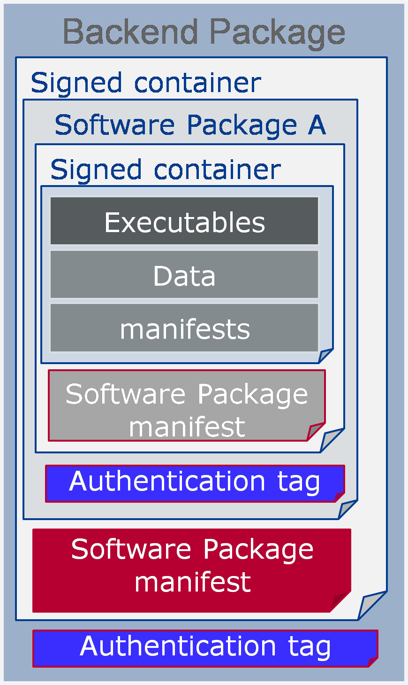

# Contents

1. [Introduction](#introduction) 9

   1. [Contents](#contents-1) . . . . . . . . . . . . . . . . . . . . . . . . . . . . . . . . . . . 9
   2. [Prereads](#prereads) . . . . . . . . . . . . . . . . . . . . . . . . . . . . . . . . . . . 9
   3. [Relationship to other AUTOSAR specifications](#relationship-to-other-autosar-specifications) . . . . . . . . . . . . . . 9
2. [Related Documentation](#related-documentation) 10
3. [Technical Scope and Approach](#technical-scope-and-approach) 12

   1. [Overview - a landscape of intelligent ECUs](#overview---a-landscape-of-intelligent-ecus) 12
   2. [Technology Drivers](#technology-drivers) 12
   3. [Adaptive Platform - Characteristics](#adaptive-platform---characteristics) 13

      1. [C++](#c) 13
      2. [SOA](#soa) 14
      3. [Parallel processing](#parallel-processing) 14
      4. [Leveraging existing standard](#leveraging-existing-standard) 14
      5. [Safety and security](#safety-and-security) 15
      6. [Planned dynamics](#planned-dynamics) 15
      7. [Agile](#agile) 15
   4. [Integration of Classic, Adaptive and Non-AUTOSAR ECUs](#integration-of-classic-adaptive-and-non-autosar-ecus) 16
   5. [Scope of specification](#scope-of-specification) 17
4. [Architecture](#architecture) 18

   1. [Logical view](#logical-view) 18

      1. [ARA](#ara) 18
      2. [Language binding, C++ Standard Library, and POSIX API](#language-binding-c-standard-library-and-posix-api) 19
      3. [Application launch and shutdown](#application-launch-and-shutdown) 19
      4. [Application interactions](#application-interactions) 20
      5. [Non-standard interfaces](#non-standard-interfaces) 20
   2. [Physical view](#physical-view) 20

      1. [OS, processes, and threads](#os-processes-and-threads) 20
      2. [Library-based or Service based Functional Cluster imple-](#library-based-or-service-based-functional-cluster-implementation) [mentation](#library-based-or-service-based-functional-cluster-implementation) 21
      3. [The interaction between Functional Clusters](#the-interaction-between-functional-clusters) 22
      4. [Machine/hardware](#machinehardware) 22
   3. [Methodology and Manifest](#methodology-and-manifest) 22
   4. [Manifest](#manifest) 23
   5. [Application Design](#application-design) 24
   6. [Execution manifest](#execution-manifest) 25
   7. [Service Instance Manifest](#service-instance-manifest) 26
   8. [Machine Manifest](#machine-manifest) 26
5. [Operating System](#operating-system) 28

   1. [Overview](#overview) 28
   2. [POSIX](#posix) 28
   3. [Scheduling](#scheduling) 29
   4. [Memory management](#memory-management) 29
   5. [Device management](#device-management) 29
   6. [Networking](#networking) 29
6. [Execution Management](#execution-management) 30

   1. [Overview](#overview-1) 30
   2. [System Startup](#system-startup) 30
   3. [Execution Management Responsibilities](#execution-management-responsibilities) 31
   4. [Deterministic Execution](#deterministic-execution) 31
   5. [Resource Limitation](#resource-limitation) 32
   6. [Application Recovery](#application-recovery) 33
   7. [Trusted Platform](#trusted-platform) 33
7. [State Management](#state-management) 35
8. [Communication Management](#communication-management) 38

   1. [Overview](#overview-2) 38
   2. [Service Oriented Communication](#service-oriented-communication) 38
   3. [Language binding and Network binding](#language-binding-and-network-binding) 39
   4. [Generated Proxies and Skeletons of C++ Language Binding](#generated-proxies-and-skeletons-of-c-language-binding) 40
   5. [Static and dynamic configuration](#static-and-dynamic-configuration) 40
   6. [Service Contract Versioning](#service-contract-versioning) 41
   7. [Raw Data Streaming Interface](#raw-data-streaming-interface) 41
9. [Diagnostics](#diagnostics) 42

   1. [Overview](#overview-3) 42
   2. [Software Cluster](#software-cluster) 42
   3. [Diagnostic communication sub-cluster](#diagnostic-communication-sub-cluster) 43
   4. [Diagnostic in Adaptive Application (AA)](#diagnostic-in-adaptive-application-aa) 44
   5. [Typed vs generic interfaces](#typed-vs-generic-interfaces) 44
   6. [Diagnostic conversations](#diagnostic-conversations) 44
   7. [Event memory sub-cluster](#event-memory-sub-cluster) 45
   8. [Service Oriented Vehicle Diagnostics](#service-oriented-vehicle-diagnostics) 45
10. [Persistency](#persistency) 46

    1. [Overview](#overview-4) 46
    2. [Key-Value Storage](#key-value-storage) 47
    3. [File Storage](#file-storage) 48
    4. [Use cases for handling persistent data for UCM](#use-cases-for-handling-persistent-data-for-ucm) 48
11. [Time Synchronization](#time-synchronization) 50

    1. [Overview](#overview-5) 50
    2. [Design](#design) 50
    3. [Architecture](#architecture-1) 51
12. [Network Management](#network-management) 52

    1. [Overview on Network Management Algorithm](#overview-on-network-management-algorithm) 52
    2. [Architecture](#architecture-2) 52
13. [Update and Config Management](#update-and-config-management) 54

    1. [Overview](#overview-6) 54
    2. [Update protocol](#update-protocol) 55

       1. [Data transfer](#data-transfer) 56
    3. [Packages](#packages) 56

       1. [Software package](#software-package) 56
       2. [Backend package](#backend-package) 58
       3. [Vehicle Package](#vehicle-package) 59
       4. [Software release and packaging workflow](#software-release-and-packaging-workflow) 60
    4. [UCM processing and activating Software Packages](#ucm-processing-and-activating-software-packages) 61
    5. [UCM Master update campaign coordination](#ucm-master-update-campaign-coordination) 63

       1. [Adaptive applications interacting with UCM Master](#adaptive-applications-interacting-with-ucm-master) 64

          1. [OTA Client](#ota-client) 65
          2. [Vehicle driver](#vehicle-driver) 65
          3. [Vehicle state manager](#vehicle-state-manager) 65
          4. [Flashing Adapter](#flashing-adapter) 65
    6. [Software information reporting](#software-information-reporting) 66
    7. [Software update consistency and authentication](#software-update-consistency-and-authentication) 66
    8. [Securing the update process](#securing-the-update-process) 66
    9. [Appropriate State Management during an update process](#appropriate-state-management-during-an-update-process) 67
14. [Identity and Access Management](#identity-and-access-management) 69

    1. [Terminology](#terminology) 69
    2. [Scope and Focus of the IAM framework:](#scope-and-focus-of-the-iam-framework) 70
    3. [Contents of the AUTOSAR specification](#contents-of-the-autosar-specification) 70
    4. [The architecture of the IAM Framework](#the-architecture-of-the-iam-framework) 71

       1. [General Framework](#general-framework) 71
       2. [Identification of Adaptive Applications](#identification-of-adaptive-applications) 72
       3. [The IAM Sequence](#the-iam-sequence) 72
15. [Cryptography](#cryptography) 74

    1. [Security Architecture](#security-architecture) 74
    2. [Key Management Architecture](#key-management-architecture) 75
    3. [Remarks on API Extension](#remarks-on-api-extension) 76
16. [Log and Trace](#log-and-trace) 77

    1. [Overview](#overview-7) 77
    2. [Architecture](#architecture-3) 78
17. [Safety](#safety) 79

    1. [Functional Safety Architecture](#functional-safety-architecture) 79
    2. [Protection of Information Exchange (E2E-Protection)](#protection-of-information-exchange-e2e-protection) 80
    3. [Platform Health Management](#platform-health-management) 80
    4. [System Health Monitoring](#system-health-monitoring) 83

---

[18 Core Types](#core-types)                                                                                                  85

---

[18.1 Error](#error-handling)   [Handling](#error-handling) . . . . . . . . . . . . . . . . . . . . . . . . . . . . . . . .   85

[18.1.1](#overview-8)           [Overview](#overview-8) . . . . . . . . . . . . . . . . . . . . . . . . . . . . .             85

[18.1.2](#errorcode)            [ErrorCode](#errorcode) . . . . . . . . . . . . . . . . . . . . . . . . . . . .               85

[18.1.3](#result)               [Result](#result) . . . . . . . . . . . . . . . . . . . . . . . . . . . . . . .               85

[18.1.4](#future-and-promise)   [Future and Promise](#future-and-promise) . . . . . . . . . . . . . . . . . . . . . . .       86
----------------------------------------------------------------------------------

2. [Advanced data types](#advanced-data-types) 86
3. [Primitive data types](#primitive-data-types) 87
4. [Global initialization and shutdown functions](#global-initialization-and-shutdown-functions) 87

```{=html}
<!-- -->
```

19. [Intrusion Detection System Manager](#intrusion-detection-system-manager) 89
20. [Firewall](#firewall) 90

```{=html}
<!-- -->
```

1. # Introduction

   1. ## Contents

This specification describes the AUTOSAR Adaptive Platform (AP) design. The pur- pose of this document is to provide an overview of AP but is not to detail all the elements of AP design. It is to provide the overall design of the AP and key concepts for both AP users and AP implementers.

The document is organized as follows. It starts with Technical Scope and Approach to provide some background of AP, followed by Architecture describing both logical and physical views of AP. Independent chapters of Methodology and Manifest and all Functional Clusters follow, which are the units of functionalities of AP, each containing its overview and introductions to their key concepts.

The detailed specification and discussions on the explained concepts are defined in the relevant RS, SWS, TR and EXP documents.

## Prereads

This document is one of the high-level conceptual documents of AUTOSAR. Useful pre-reads are \[[1](#_bookmark5)\], \[[2](#_bookmark6)\], and \[[3](#_bookmark7)\].

## Relationship to other AUTOSAR specifications

The detailed specification and discussions on the explained concepts are defined in the relevant RS, SWS, TR and EXP documents. A detailed technical architecture doc- umentation of the AUTOSAR Adaptive Platform is provided in \[[4](#_bookmark8)\].

# Related Documentation

1. []{#_bookmark5 .anchor}Glossary []{#_bookmark6 .anchor}AUTOSAR_TR_Glossary
2. Main Requirements []{#_bookmark7 .anchor}AUTOSAR_RS_Main
3. Methodology for Adaptive Platform []{#_bookmark8 .anchor}AUTOSAR_TR_AdaptiveMethodology
4. Explanation of Adaptive Platform Software Architecture []{#_bookmark9 .anchor}AUTOSAR_EXP_SWArchitecture
5. []{#_bookmark10 .anchor}The 4+1 View Model of Architecture
6. Specification of Execution Management []{#_bookmark11 .anchor}AUTOSAR_SWS_ExecutionManagement
7. Specification of Platform Types for Adaptive Platform []{#_bookmark12 .anchor}AUTOSAR_SWS_AdaptivePlatformTypes
8. Specification of Synchronized Time-Base Manager AUTOSAR_SWS_SynchronizedTimeBaseManager
9. Requirements on Identity and Access Management []{#_bookmark14 .anchor}AUTOSAR_RS_IdentityAndAccessManagement
10. Specification of Identity and Access Management []{#_bookmark15 .anchor}AUTOSAR_SWS_IdentityAndAccessManagement
11. Specification of Manifest []{#_bookmark16 .anchor}AUTOSAR_TPS_ManifestSpecification
12. Explanation of Safety Overview []{#_bookmark17 .anchor}AUTOSAR_EXP_SafetyOverview
13. Safety Requirements for AUTOSAR Adaptive Platform and AUTOSAR Classic Platform []{#_bookmark18 .anchor}AUTOSAR_RS_Safety
14. ISO 26262:2018 (all parts) -- Road vehicles -- Functional Safety []{#_bookmark19 .anchor}[http://www.iso.org](http://www.iso.org/)
15. E2E Protocol Specification []{#_bookmark20 .anchor}AUTOSAR_PRS_E2EProtocol
16. Specification of Communication Management []{#_bookmark21 .anchor}AUTOSAR_SWS_CommunicationManagement
17. Requirements on Health Monitoring AUTOSAR_RS_HealthMonitoring
18. []{#_bookmark22 .anchor}Specification of Health Monitoring []{#_bookmark23 .anchor}AUTOSAR_ASWS_HealthMonitoring
19. Requirements on Platform Health Management []{#_bookmark24 .anchor}AUTOSAR_RS_PlatformHealthManagement
20. Specification of Platform Health Management AUTOSAR_SWS_PlatformHealthManagement

```{=html}
<!-- -->
```

3. # Technical Scope and Approach

   1. ## Overview - a landscape of intelligent ECUs

Traditionally ECUs mainly implement functionality that replaces or augments electro- mechanical systems. Software in those deeply-embedded ECUs controls electrical output signals based on input signals and information from other ECUs connected to the vehicle network. Much of the control software is designed and implemented for the target vehicle and does not change significantly during vehicle lifetime.

New vehicle functions, such as highly automated driving, will introduce highly complex and computing resource demanding software into the vehicles and must fulfill strict integrity and security requirements. Such software realizes functions, such as environ- ment perception and behavior planning, and integrates the vehicle into external back- end and infrastructure systems. The software in the vehicle needs to be updated during the lifecycle of the vehicle, due to evolving external systems or improved functionality.

The AUTOSAR Classic Platform (CP) standard addresses the needs of deeply- embedded ECUs, while the needs of ECUs described above cannot be fulfilled. There- fore, AUTOSAR specifies a second software platform, the AUTOSAR Adaptive Plat- form (AP). AP provides mainly high-performance computing and communication mech- anisms and offers flexible software configuration, e.g. to support software update over- the-air. Features specifically defined for the CP, such as access to electrical signals and automotive specific bus systems, can be integrated into the AP but is not in the focus of standardization.

## Technology Drivers

There are two major groups of technology drivers behind. One is Ethernet, and the other is processors.

The ever-increasing bandwidth requirement of the on-vehicle network has led to the introduction of Ethernet, that offers higher bandwidth and with switched networks, en- abling the more efficient transfer of long messages, point-to-point communications, among others, compared to the legacy in-vehicle communication technologies such as CAN. The CP, although it supports Ethernet, is primarily designed for the legacy com- munication technologies, and it has been optimized for such, and it is difficult to fully utilize and benefit from the capability of Ethernet-based communications.

Similarly, performance requirements for processors have grown tremendously in recent years as vehicles are becoming even more intelligent. Multicore processors are already in use with CP, but the needs for the processing power calls for more than multicore. Manycore processors with tens to hundreds of cores, GPGPU (General Purpose use of GPU), FPGA, and dedicated accelerators are emerging, as these offer orders of magnitudes higher performance than the conventional MCUs. The increasing number of cores overwhelms the design of CP, which was originally designed for a single core

MCU, though it can support multicore. Also, as the computing power swells, the power efficiency is already becoming an issue even in data centers, and it is in fact much more significant for these intelligent ECUs. From semiconductor and processor technologies point of view, constrained by Pollack's Rule, it is physically not possible to increase the processor frequency endlessly and the only way to scale the performance is to employ multiple (and many) cores and execute in parallel. Also, it is known that the best performance-per-watt is achieved by a mix of different computing resources like manycore, co-processors, GPU, FPGA, and accelerators. This is called heterogeneous computing - which is now being exploited in HPC (High-Performance Computing) - certainly overwhelms the scope of CP by far.

It is also worthwhile to mention that there is a combined effect of both processors and faster communications. As more processing elements are being combined in a single chip like manycore processors, the communication between these processing elements is becoming orders of magnitude faster and efficient than legacy inter-ECU communications. This has been made possible by the new type of processor inter- connect technologies such as Network-on-Chip (NoC). Such combined effects of more processing power and faster communication within a chip also prompts the need for a new platform that can scale over ever-increasing system requirements.

## Adaptive Platform - Characteristics

The characteristic of AP is shaped by the factors outlined in sections [3.1](#overview---a-landscape-of-intelligent-ecus) and [3.2](#technology-drivers). The landscape inevitably demands significantly more computing power, and the technolo- gies trend provides a baseline of fulfilling such needs. However, the HPC in the space of safety-related domain while power and cost efficiencies also matter, is by itself im- poses various new technical challenges.

To tackle them, AP employs various proven technologies traditionally not fully exploited by ECUs, while allowing maximum freedom in the AP implementation to leverage the innovative technologies.

### C++

From top-down, the applications can be programmed in C++. It is now the language of choice for the development of new algorithms and application software in performance critical complex applications in the software industry and in academics. This should bring faster adaptations of novel algorithms and improve application development pro- ductivity if properly employed.

### SOA

To support the complex applications, while allowing maximum flexibility and scalabil- ity in processing distribution and compute resource allocations, AP follows service- oriented-architecture (SOA). The SOA is based on the concept that a system consists of a set of services, in which one may use another in turn, and applications that use one or more of the services depending on its needs. Often SOA exhibits system-of- system characteristics, which AP also has. A service, for instance, may reside on a local ECU that an application also runs, or it can be on a remote ECU, which is also running another instance of AP. The application code is the same in both cases - the communication infrastructure will take care of the difference providing transparent communication. Another way to look at this architecture is that of distributed comput- ing, communicating over some form of message passing. At large, all these represent the same concept. This message passing, communication-based architecture can also benefit from the rise of fast and high-bandwidth communication such as Ethernet.

### Parallel processing

Distributed computing is inherently parallel. The SOA, as different applications use a different set of services, shares this characteristic. The advancement or manycore processors and heterogeneous computing that offer parallel processing capability offer technological opportunities to harness the computing power to match the inherent par- allelism. Thus, the AP possesses the architectural capability to scale its functionality and performance as the manycore-heterogeneous computing technologies advance. Indeed, the hardware and platform interface specification are only parts of the equa- tion, and advancements in OS/hypervisor technologies and development tools such as automatic parallelization tools are also critical, which are to be fulfilled by AP provider and the industry/academic eco-system. The AP aims to accommodate such technolo- gies as well.

### Leveraging existing standard

There is no point in re-inventing the wheels, especially when it comes to specifications, not implementations. As with already described in section [3.3.1](#c), AP takes the strategy of reusing and adapting the existing open standards, to facilitate the faster develop- ment of the AP itself and benefiting from the eco-systems of existing standards. It is, therefore, a critical focus in developing the AP specification not to casually introduce a new replacement functionality that an existing standard already offers. For instance, this means no new interfaces are casually introduced just because an existing stan- dard provides the functionality required but the interface is superficially not easy to understand.

### Safety and security

The systems that AP targets often require some level of safety and security, possibly at its highest level. The introduction of new concepts and technologies should not under- mine such requirements although it is not trivial to achieve. To cope with the challenge, AP combines architectural, functional, and procedural approaches. The architecture is based on distributed computing based on SOA, which inherently makes each compo- nent more independent and free of unintended interferences, dedicated functionalities to assist achieving safety and security, and guidelines such as C++ coding guideline, which facilitates the safe and secure usage of complex language like C++, for example.

### Planned dynamics

The AP supports the incremental deployment of applications, where resources and communications are managed dynamically to reduce the effort for software develop- ment and integration, enabling short iteration cycles. Incremental deployment also supports explorative software development phases.

For product delivery, AP allows the system integrator to carefully limit dynamic behavior to reduce the risk of unwanted or adverse effects allowing safety qualification. Dynamic behavior of an application will be limited by constraints stated in the Execution manifest (see section [4.6](#execution-manifest)). The interplay of the manifests of several applications may cause that already at design time. Nevertheless, at execution time dynamic allocation of resources and communication paths are only possible in defined ways, within configured ranges, for example.

Implementations of an AP may further remove dynamic capabilities from the software configuration for production use. Examples of planned dynamics might be:

- Pre-determination of the service discovery process
- Restriction of dynamic memory allocation to the startup phase only
- Fair scheduling policy in addition to priority-based scheduling
- Fixed allocation of processes to CPU cores
- Access to pre-existing files in the file-system only
- Constraints for AP API usage by Applications
- Execution of authenticated code only

  1. ### Agile

Although not directly reflected in the platform functionalities, the AP aims to be adaptive to different product development processes, especially agile based processes. For agile based development, it is critical that the underlying architecture of the system is

incrementally scalable, with the possibility of updating the system after its deployment. The architecture of AP should allow this.

## Integration of Classic, Adaptive and Non-AUTOSAR ECUs

As described in previous sections, AP will not replace CP or Non-AUTOSAR platforms in IVI/COTS. Rather, it will interact with these platforms and external backend systems such as road-side infrastructures, to form an integrated system (see Figures [3.1](#_bookmark37) and [3.2](#_bookmark38)). As an example, CP already incorporates SOME/IP, which is also supported by AP, among other protocols.

{width="6.261874453193351in" height="4.125311679790026in"}

**Figure 3.1:** []{#_bookmark37 .anchor}**Exemplary deployment of different platforms**

{width="6.355173884514436in" height="4.129687226596675in"}

**Figure 3.2:** []{#_bookmark38 .anchor}**Exemplary interactions of AP and CP**

## Scope of specification

AP defines the runtime system architecture, what constitutes a platform, and what functionalities and interfaces it provides. It also defines machine-readable models that are used in the development of such a system. The specification should provide nec- essary information on developing a system using the platform, and what needs to be met to implement the platform itself.

4. # Architecture

   1. ## Logical view

      1. ### ARA

Figure [4.1](#_bookmark43) shows the architecture of AP. The **Adaptive Applications (AA)** run on top of **ARA, AUTOSAR Runtime for Adaptive applications**. ARA consists of application interfaces provided by **Functional Clusters**, which belong to either **Adaptive Plat- form Foundation** or **Adaptive Platform Services**. Adaptive Platform Foundation pro- vides fundamental functionalities of AP, and Adaptive Platform Services provide plat- form standard services of AP. Any AA can also provide Services to other AA, illustrated as **Non-platform service** in the figure.

The interface of Functional Clusters, either they are those of Adaptive Platform Foun- dation or Adaptive Platform Services, are indifferent from AA point of view - they just provide specified C++ interface or any other language bindings AP may support in fu- ture. There are indeed differences under the hood. Also, note that underneath the ARA interface, including the libraries of ARA invoked in the AA contexts, may use other interfaces than ARA to implement the specification of AP and it is up to the design of AP implementation.

{width="6.239583333333333in" height="3.03125in"}

**Figure 4.1:** []{#_bookmark43 .anchor}**AP architecture logical view**

Be aware that Figure [4.1](#_bookmark43) contains Functional Clusters that are not part of the current release of AP, to provide a better idea of overall structure. Further new Functional Clusters not shown here may well be added future releases of AP.

### Language binding, C++ Standard Library, and POSIX API

The language binding of these API is based on C++, and the C++ Standard library is also available as part of ARA. Regarding the OS API, only PSE51 interface, a single- process profile of POSIX standard is available as part of ARA. The PSE51 has been selected to offer portability for existing POSIX applications and to achieve freedom of interference among applications.

Note that the C++ Standard Library contains many interfaces based on POSIX, in- cluding multi-threading APIs. It is recommended not to mix the C++ Standard library threading interface with the native PSE51 threading interface to avoid complications. Unfortunately, the C++ Standard Library does not cover all the PSE51 functionalities, such as setting a thread scheduling policy. In such cases, the combined use of both interfaces may be necessary.

### Application launch and shutdown

Lifecycles of applications are managed by Execution Management (EM). Load- ing/launching of an application is managed by using the functionalities of EM, and it needs appropriate configuration at system integration time or at runtime to launch an application. In fact, all the Functional Clusters are applications from EM point of view, and they are also launched in the same manner, except for EM itself. Figure [4.2](#_bookmark46) illus- trates different types of applications within and on AP.

{width="5.036458880139983in" height="2.625in"}

**Figure 4.2:** []{#_bookmark46 .anchor}**Applications**

Note that decisions on which and when the application starts or terminates are not made by EM. A special FC, called State Management (SM), is the controller, com- manding EM based on the design of a system, arbitrating different states thus control- ling the overall system behavior. Since the system here refers to the whole machine AP and its application are running, the internal behavior thus the implementation is project specific. The SM also interact with other FCs to coordinate the overall machine

behavior. The SM should use only the standard ARA interface to maintain portability among different AP stack implementations.

### Application interactions

Regarding the interaction between AAs, PSE51 do not include IPC (Inter-Process- Communication), so there is no direct interface to interact between AAs. Communi- cation Management (CM) is the only explicit interface. CM also provides Service Ori- ented Communication for both intra-machine and inter-machine, which are transparent to applications. CM handles routing of Service requests/replies regardless of the topo- logical deployment of Service and client applications. Note that other ARA interfaces may internally trigger interactions between AAs, however, this is not an explicit com- munication interface but just a byproduct of functionalities provided by the respective ARA interfaces.

### Non-standard interfaces

AA and Functional Clusters may use any non-standard interfaces, provided that they do not conflict with the standard AP functionalities and also that they conform to the safety/security requirements of the project. Unless they are pure application local run- time libraries, care should be taken to keep such use minimal, as this will impact the software portability onto other AP implementations.

## Physical view

The physical architecture [1](#_bookmark51) of AP is discussed here. Note that most of the contents in this section are for illustration purpose only, and do not constitute the formal require- ment specification of AP, as the internals of AP is implementation-defined. Any formal requirement on the AP implementation is explicitly stated. As an additional source of information, refer to \[[4](#_bookmark8)\] which describes the AP internal architecture in more detail.

### OS, processes, and threads

The AP Operating System is required to provide multi-process POSIX OS capability. Each AA is implemented as an independent process, with its own logical memory space and namespace. Note that a single AA may contain multiple processes, and this may be deployed onto a single AP instance or distributed over multiple AP instances. From the module organization point of view, each process is instantiated by OS from

1[]{#_bookmark51 .anchor}The 'physical architecture' here means mainly the Process View, Physical View, and some Develop- ment View as described in \[[5](#_bookmark9)\].

an executable. Multiple processes may be instantiated from a single executable. Also, AA may constitute multiple executables.

Functional Clusters are also typically implemented as processes. A Functional Clus- ter may also be implemented with a single process or multiple (sub) processes. The Adaptive Platform Services and the non-platform Services are also implemented as processes.

All these processes can be a single-threaded process or a multi-threaded process. However, the OS API they can use differs depending on which logical layer the pro- cesses belong to. If they are AAs running on top of ARA, then they should only use PSE51. If a process is one of the Functional Clusters, it is free to use any OS interface available.

In summary, from the OS point of view, the AP and AA forms just a set of processes, each containing one or multiple threads - there is no difference among these pro- cesses, though it is up to the implementation of AP to offer any sort of partitioning. These processes do interact with each other through IPC or any other OS functionali- ties available. Note that AA processes, may not use IPC directly and can only commu- nicate via ARA.

### Library-based or Service based Functional Cluster implementation

As in Figure [4.1](#_bookmark43), a Functional Cluster can be an Adaptive Platform Foundation module or an Adaptive Platform Service. As described previously, these are generally both processes. For them to interact with AAs, which are also processes, they need to use IPC. There are two alternative designs to achieve this. One is \"Library-based\" design, in which the interface library, provided by the Functional Cluster and linked to AA, calls IPC directly. The other is \"Service-based\" design, where the process uses Communication Management functionality and has a Server proxy library linked to the

AA. The proxy library calls Communication Management interface, which coordinates IPC between the AA process and Server process. Note it is implementation-defined whether AA only directly performs IPC with Communication Management or mix with direct IPC with the Server through the proxy library.

A general guideline to select a design for Functional Cluster is that if it is only used locally in an AP instance, the Library-based design is more appropriate, as it is simpler and can be more efficient. If it is used from other AP instance in a distributed fashion, it is advised to employ the Service-based design, as the Communication Management provides transparent communication regardless of the locations of the client AA and Service. Functional Clusters belonging to Adaptive Platform Foundation are \"Library- based\" and Adaptive Platform Services are \"Service-based\" as the name rightly indi- cate.

Finally, note that it is allowed for an implementation of an FC to not to have a process but realize in the form of a library, running in the context of AA process, as long as it

fulfills the defined RS and SWS of the FC. In this case, the interaction between an AA and the FC will be regular procedure call instead of IPC-based as described previously.

### The interaction between Functional Clusters

In general, the Functional Clusters may interact with each other in the AP implementation-specific ways, as they are not bound to ARA interfaces, like for ex- ample PSE51, that restricts the use of IPC. It may indeed use ARA interfaces of other Functional Clusters, which are public interfaces. One typical interaction model be- tween Functional Clusters is to use protected interfaces of Functional Clusters to provide privileged access required to achieve the special functionalities of Functional Clusters.

Also, from AP18-03, a new concept of Inter-Functional-Cluster (IFC) interface has been introduced. It describes the interface an FC provides to other FCs. Note that it is not part of ARA, nor does it constitute formal specification requirements to AP implemen- tations. These are provided to facilitate the development of the AP specification by clarifying the interaction between FCs, and they may also provide better architectural views of AP for the users of AP specification. The interfaces are described in the Annex of respective FC SWS.

### Machine/hardware

The AP regards hardware it runs on as a Machine. The rationale behind that is to achieve a consistent platform view regardless of any virtualization technology which might be used. The Machine might be a real physical machine, a fully-virtualized ma- chine, a para-virtualized OS, an OS-level-virtualized container or any other virtualized environment.

On hardware, there can be one or more Machines, and only a single instance of AP runs on a machine. It is generally assumed that this 'hardware' includes a single chip, hosting a single or multiple Machines. However, it is also possible that multiple chips form a single Machine if the AP implementation allows it.

## Methodology and Manifest

The support for distributed, independent, and agile development of functional applica- tions requires a standardized approach to the development methodology. AUTOSAR adaptive methodology involves the standardization of **work products** for the descrip- tion of artifacts like services, applications, machines, and their configuration; and the respective **tasks** to define how these work products shall interact to achieve the ex- change of design information for the various activities required for the development of products for the adaptive platform.

Figure [4.3](#_bookmark56) illustrates a draft overview of how adaptive methodology might be imple- mented. For the details of these steps see \[[3](#_bookmark7)\].

{width="6.370833333333334in" height="4.720833333333333in"}

**Figure 4.3:** []{#_bookmark56 .anchor}**AP development workflow**

## Manifest

A Manifest represents a piece of AUTOSAR model description that is created to sup- port the configuration of an AUTOSAR AP product and which is uploaded to the AU- TOSAR AP product, potentially in combination with other artifacts (like binary files) that contain executable code to which the Manifest applies.

The usage of a Manifest is limited to the AUTOSAR AP. This does not mean, however, that all ARXML produced in a development project that targets the AUTOSAR AP is au- tomatically considered a Manifest. In fact, the AUTOSAR AP is usually not exclusively used in a vehicle project.

A typical vehicle will most likely be also equipped with a number of ECUs developed on the AUTOSAR CP and the system design for the entire vehicle will, therefore, have to cover both - ECUs built on top of the AUTOSAR CP and ECUs created on top of the AUTOSAR AP.

In principle, the term Manifest could be defined such that there is conceptually just one \"Manifest\" and every deployment aspect would be handled in this context. This does not seem appropriate because it became apparent that manifest-related model- elements exist that are relevant in entirely different phases of a typical development project.

This aspect is taken as the main motivation that next to the application design it is necessary to subdivide the definition of the term Manifest in three different partitions:

- **Application Design** This kind of description specifies all design-related aspects that apply to the creation of application software for the AUTOSAR AP. It is not necessarily required to be deployed to the adaptive platform machine, but the application design aids the definition of the deployment of application software in the Execution manifest and Service Instance Manifest.
- **Execution Manifest** his kind of Manifest is used to specify the deployment- related information of applications running on the AUTOSAR AP. An Execution manifest is bundled with the actual executable code to support the integration of the executable code onto the machine.
- **Service Instance Manifest** This kind of Manifest is used to specify how service- oriented communication is configured in terms of the requirements of the under- lying transport protocols. A Service Instance Manifest is bundled with the actual executable code that implements the respective usage of service-oriented com- munication.
- **Machine Manifest** This kind of Manifest is supposed to describe deployment- related content that applies to the configuration of just the underlying machine (i.e. without any applications running on the machine) that runs an AUTOSAR AP. A Machine Manifest is bundled with the software taken to establish an instance of the AUTOSAR AP.

The temporal division between the definition (and usage) of different kinds of Manifest leads to the conclusion that in most cases different physical files will be used to store the content of the three kinds of Manifest.

In addition to the Application Design and the different kinds of Manifest, the AUTOSAR Methodology supports a **System Design** with the possibility to describe Software Com- ponents of both AUTOSAR Platforms that will be used in a System in one single model. The Software Components of the different AUTOSAR platforms may communicate in a service-oriented way with each other. But it is also possible to describe a mapping of Signals to Services to create a bridge between the service-oriented communication and the signal-based communication.

## Application Design

The application design describes all design-related modeling that applies to the cre- ation of application software for the AUTOSAR AP.

Application Design focuses on the following aspects:

- Data types used to classify information for the software design and implementa- tion
- Service interfaces as the pivotal element for service-oriented communication
- Definition how service-oriented communication is accessible by the application
- Persistency Interfaces as the pivotal element to access persistent data and files
- Definition how persistent storage is accessible by the application
- Definition how files are accessible by the application
- Definition how crypto software is accessible by the application
- Definition how the Platform Health Management is accessible by the application
- Definition how Time Bases are accessible by the application
- Serialization properties to define the characteristics of how data is serialized for the transport on the network
- Description of client and server capabilities
- Grouping of applications in order to ease the deployment of software.

The artifacts defined in the application design are independent of a specific deployment of the application software and thus ease the reuse of application implementations for different deployment scenarios.

## Execution manifest

The purpose of the execution manifest is to provide information that is needed for the actual deployment of an application onto the AUTOSAR AP.

The general idea is to keep the application software code as independent as possible from the deployment scenario to increase the odds that the application software can be reused in different deployment scenarios.

With the execution manifest the instantiation of applications is controlled, thus it is possible to

- instantiate the same application software several times on the same machine, or to
- deploy the application software to several machines and instantiate the applica- tion software per machine.

The Execution manifest focuses on the following aspects:

- Startup configuration to define how the application instance shall be started. The startup includes the definition of startup options and access roles. Each startup may be dependent on machines states and/or function group states.
- Resource Management, in particular resource group assignments.

  1. ## Service Instance Manifest

The implementation of service-oriented communication on the network requires con- figuration which is specific to the used communication technology (e.g. SOME/IP). Since the communication infrastructure shall behave the same on the provider and the requesters of a service, the implementation of the service must be compatible on both sides.

The Service Instance Manifest focuses on the following aspects:

- Service interface deployment to define how a service shall be represented on the specific communication technology.
- Service instance deployment to define for specific provided and required service instances the required credentials for the communication technology.
- The configuration of E2E protection
- The configuration of Security protection
- The configuration of Log and Trace

  1. ## Machine Manifest

The machine manifest allows to configure the actual adaptive platform instance running on specific hardware (machine).

The Machine Manifest focuses on the following aspects:

- Configuration of the network connection and defining the basic credentials for the network technology (e.g. for Ethernet this involves setting of a static IP address or the definition of DHCP).
- Configuration of the service discovery technology (e.g. for SOME/IP this involves the definition of the IP port and IP multicast address to be used).
- Definition of the used machine states
- Definition of the used function groups
- Configuration of the adaptive platform functional cluster implementations (e.g. the operating system provides a list of OS users with specific rights).
- The configuration of the Crypto platform Module
- The configuration of Platform Health Management
- The configuration of Time Synchronization
- Documentation of available hardware resources (e.g. how much RAM is avail- able; how many processor cores are available)

5. # Operating System

   1. ## Overview

The Operating System (OS) is responsible for run-time scheduling, resource manage- ment (including policing memory and time constraints) and inter-process communica- tion for all Applications on the Adaptive Platform. The OS works in conjunction with Execution Management which is responsible for platform initialization and uses the OS to perform the start-up and shut-down of Applications.

The Adaptive Platform does not specify a new Operating System for highly performant processors. Rather, it defines an execution context and Operating System Interface (OSI) for use by Adaptive Applications.

The OSI specification contains application interfaces that are part of ARA, the standard application interface of Adaptive Application. The OS itself may very well provide other interfaces, such as creating processes, that are required by Execution Management to start an Application. However, the interfaces providing such functionality, among others, are not available as part of ARA and it is defined to be platform implementation dependent.

The OSI provides both C and C++ interfaces. In the case of a C program, the applica- tion's main source code business logic include C function calls defined in the POSIX standard, namely PSE51 defined in IEEE1003.13 \[[1](#_bookmark5)\]. During compilation, the com- piler determines which C library from the platform's operating system provides these C functions and the applications executable shall be linked against at runtime. In case of a C++ program, application software component's source code includes function calls defined in the C++ Standard and its Standard C++ Library.

## POSIX

There are several operating systems on the market, e.g. Linux, that provide POSIX compliant interfaces. However, applications are required to use a more restricted API to the operating systems as compared to the platform services and foundation.

The general assumption is that a user Application shall use PSE51 as OS interface whereas platform Application may use full POSIX. In case more features are needed on application level they will be taken from the POSIX standard and NOT newly specified wherever possible.

The implementation of Adaptive Platform Foundation and Adaptive Platform Services functionality may use further POSIX calls. The use of specific calls will be left open to the implementer and not standardized.

## Scheduling

The Operating System provides multi-threading and multi-process support. The stan- dard scheduling policies are SCHED_FIFO and SCHED_RR, which are defined by the POSIX standard. Other scheduling policies such as SCHED_DEADLINE or any other operating system specific policies are allowed, with the limitation that this may not be portable across different AP implementations.

## Memory management

One of the reasons behind the multi-process support is to realize 'freedom of interfer- ences' among different Functional Clusters and AA. The multi-process support by OS forces each process to be in an independent address space, separated and protected from other processes. Two instances of the same executable run in different address spaces such that they may share the same entry point address and code as well as data values at startup, however, the data will be in different physical pages in memory.

## Device management

Device management is largely Operating System-specific. Intentionally, the Adaptive Platform Foundation favors the creation of services to expose the main system func- tionalities.

While there is no current plan to standardize the concrete APIs of device drivers them- selves, higher-level functionality fulfilled by such drivers may be standardized through Adaptive Platform Services.

## Networking

The main interconnection mechanism between multiple Machines, as well as with other sensors is expected to be based on Ethernet. Consequently, the use of TCP/IP- and UDP/IP-based protocols is clearly described. It is therefore expected that the Operating System will provide such a networking stack.

Applications will transparently benefit from the networking support by using Communi- cation Management. As part of the Adaptive Platform Foundation, additional features like VLAN, IPSEC and more are enabling secure communications within and across systems.

6. # Execution Management

   1. ## Overview

Execution Management is responsible for all aspects of system execution management including initialization of the Adaptive Platform and the startup/shutdown of Processes. Execution Management works in conjunction with the Operating System to configure the run-time scheduling of Processes.

## System Startup

When the Machine is started, the OS will be initialized and then Execution Management will be launched as the Platform's initial process. Other platform-level Processes (rep- resenting Functional Clusters) of the Adaptive Platform Foundation are then launched by Execution Management. After the Adaptive Platform Foundation is up and running, Execution Management continues launching Processes of Adaptive Applications. The startup order of the platform-level and Application-level Processes are determined by the Execution Management, based on the Machine Manifest and dependencies speci- fied in the Execution manifest.

{width="3.773332239720035in" height="3.906665573053368in"}

**Figure 6.1: AP start-up sequence**

An Adaptive Application can consist of multiple Executable elements -- which typically would correspond to executable files on the filesystem. Each Executable can have

multiple Process configurations -- and hence startup configurations -- dependent on the Function Group States in which the Executable is active.

Execution Management optionally supports authenticated startup where starting from a trust anchor the Adaptive Platform is started while maintaining the chain of trust. During authenticated startup Execution Management validates the authenticity and integrity of applications and will (optionally) prevent their execution if violations are detected. Through these mechanisms, a Trusted Platform can be established.

## Execution Management Responsibilities

Execution Management is responsible for all aspects of Adaptive Platform execution management and Application execution management including:

1. **Platform Lifecycle Management** Execution Management is launched as part of the Adaptive Platform startup phase and is responsible for the initialization of the Adaptive Platform and deployed Applications.
2. **Application Lifecycle Management** Execution Management is responsible for the ordered startup and shutdown of the deployed Applications. Execution Man- agement determines the set of deployed Applications based on information in the Machine Manifest and Execution manifests and derives an ordering for star- tup/shutdown based on declared execution dependencies. Depending on the Machine State and on the Function Group States, the Processes of deployed Ap- plications are started during Adaptive Platform startup or later, however it is not expected that all will begin active work immediately since many Applications will provide services to other Applications and therefore wait and \"listen\" for incoming service requests.

The Execution Management is not responsible for run-time scheduling of Applications since this is the responsibility of the Operating System. However, Execution Manage- ment is responsible for configuration of the OS to enable the OS to perform the nec- essary run-time scheduling based on information extracted by Execution Management from the Machine Manifest and Execution manifests.

## Deterministic Execution

Deterministic execution provides a mechanism such that a calculation using a given input data set always produces a consistent output irrespective of interference. Ex- ecution Management distinguishes between time and data determinism. The former states that the output is always produced by the deadline whereas the latter refers to generating the same output from the same input data set and internal state.

The support provided by Execution Management focuses on data determinism as time determinism is handled by the provision of sufficient resources. For data determinism, Execution Management provides the DeterministicClient APIs to support control of the

process-internal cycle, a deterministic worker pool, activation time stamps, and random numbers. DeterministicClient interacts with Communication Management to synchro- nize data handling with cycle activation. The API supported by DeterministicClient and its interaction with an application is illustrated in Figure [6.2](#_bookmark74).

{width="6.171666666666667in" height="5.261666666666667in"}

**Figure 6.2:** []{#_bookmark74 .anchor}**Deterministic Client**

Additional to process-local DeterministicClient, Execution Management supports De- terministicSyncMaster that provides for coordination amongst multiple Deterministic- Client instances to ensure that their deterministic execution is synchronized.

## Resource Limitation

The Adaptive Platform permits execution of multiple Adaptive Applications on the same Machine and thus ensuring freedom from interference is a system property. Hence an incorrectly behaving Adaptive Application should be limited with respect to its ability to affect other applications, for example, an application Process should be prevented from

consuming more CPU time than specified due to the potential for consequent impacts on the correct functioning of other applications.

Execution Management supports freedom from interference through the configuration of one or more ResourceGroups to which application's processes are assigned. Each ResourceGroup may then be assigned a limit for CPU time or memory that permits restricting the Application's available resources.

## Application Recovery

Execution Management is responsible for the state-dependent management of Pro- cess start/stop, so it has to have the special right to start and stop Processes. The Platform Health Management monitors Processes and could trigger a Recovery Action in case any Process behaves not within the specified parameters. The Recovery Ac- tions are defined by the integrator based on the software architecture requirements for the Platform Health Management and configured in the Execution Manifest.

## Trusted Platform

To guarantee the correct function of the system, it is crucial to ensure that the code ex- ecuted on the platform has legitimate origin. Keeping this property allows the integrator to build a Trusted Platform.

A key property of a system that implements a Trusted Platform is a Trust Anchor (also called Root of Trust). A Trust Anchor is often realized as a public key that is stored in a secure environment, e.g. in non-modifiable persistent memory or in an HSM.

A system designer is responsible to ensure at least that the system starts beginning with a Trust Anchor and that the trust is kept until Execution Management is launched. Depending on the mechanism that is chosen by the system designer to establish the chain of trust, the integrity and authenticity of the entire system may have been checked at this point in the system start-up. However, if the system designer only ensured that the already executed software has been checked regarding integrity and authenticity, Execution Management takes over responsibility on continuing the chain of trust when it takes over control of the system. In this case, the system integrator is responsible to ensure that Execution Management is configured properly.

One example of passing trust from the Trust Anchor to the OS and the Adaptive Plat- form (i.e. establishing a chain of trust) could look like this: The Trust Anchor - as an authentic entity by definition - authenticates the bootloader before the bootloader is being started. In each subsequent step in the boot process, the to-be-started Exe- cutable shall be authenticated first. This authenticity check shall be done by an already authenticated entity, i.e. the authenticity check could be done e.g. by the Executable started previously or by some external entity like an HSM, for example.

After the OS has been authentically started, it shall launch Execution Management as one of its first processes. Before Execution Management is being launched, the OS shall ensure that the authenticity of the Execution Management has been verified by an already authenticated and thus trustworthy entity.

Note: If authentication is not checked by the functionality of the Trust Anchor itself, which is authentic by definition, the Software that shall be applied to verify authenticity of an Executable has to be authenticated before it is applied. For instance, if the Crypto API shall be used to verify authentication of Executables, the Crypto API itself shall be authenticated by some trusted entity before it is used.

Execution Management takes now over the responsibility of authenticating Adaptive Applications before launching them. However, there exists more than one possibility to validate the integrity and authenticity of the Executable code. In \[[6](#_bookmark10)\], a list of possible mechanisms is provided that fulfill this task.

# State Management

State Management is a unique Functional Cluster that is intended to be mostly an ECU development project specific, and generally, the final implementation is to be performed by the system integrator. It is responsible for all aspects of the operational state of the AUTOSAR Adaptive Platform, including handling of incoming events, prioritization of these events/requests to set the corresponding internal states. State Management may consist of one or more state machines depending on the project needs.

The State Management interact with Adaptive Applications via project specific ara::com service interface consisting of 'Fields' as described below. The interaction between State Management and other Function Clusters shall be done via a standardized inter- face(s) defined by each Function Cluster.

{width="6.34in" height="5.236666666666666in"}

**Figure 7.1: State Management interactions**

The following effects can be requested by State Management:

- FunctionGroups can be requested to be set to a dedicated state
- (Partial) Networks can be requested to be de- / activated
- The machine can be requested to be shutdown or restarted
- Other Adaptive (Platform) Applications can be influenced in their behavior
- Project-specific actions could be performed
- Recover from (supervision) errors when being informed by Platform Health Man- agement or by Execution Management
- Execution of project specific reset per Diagnostic Addresses on request from Di- agnostics
- Preparation and verification of software clusters for being installed, updated or removed on request from Update and Configuration Management
- Influence behavior of running Processes to achieve synchronized behavior within (parts of) the machine (e.g. Power Modes)

To achieve synchronized behavior State Management provides defined messages and reply messages from where ara::com methods and fields are generated in the scope of Communication Groups of Communication Management.

State Management provides a set of 'Trigger' and 'Notifier' fields via ara::com. The SM essentially listens to the 'Triggers', and perform implementation-specific state machine processing internally, and provides the effect to the 'Notifier' fields if there is any.

Since State Management functionality is critical, access from other Functional Clusters or Applications must be secured, e.g. by IAM (Identity and Access Management). State Management is monitored and supervised by Platform Health Management.

The 'lightweight' StateMachine approach has been introduced by State Management to help user of Adaptive Platform, in creation of State Management functionality. StateMa- chines are designed to cover standard use-cases with minimal configuration effort. Please note that StateMachines are a complementary part of AUTOSAR and thus are optional to use. It is expected that complex use-cases will still require user provided source code.

The StateMachine does not implement project-specific logic. Instead it provides in- put interface for a project-specific Adaptive Application (i.e. SMControlApplication). This application contains project-specific logic and makes decision which state of the StateMachine should be requested next. Please note that error reaction, to errors re- ported by Execution Management and/or Platform Health Management, is configured directly inside the StateMachine.

{width="6.226527777777778in" height="3.200311679790026in"}

**Figure 7.2: Overview of 'lightweight' StateMachine concept**

8. # Communication Management

   1. ## Overview

The Communication Management is responsible for all aspects of communication be- tween applications in a distributed real-time embedded environment.

The concept behind is to abstract from the actual mechanisms to find and connect communication partners such that implementers of application software can focus on the specific purpose of their application.

## Service Oriented Communication

The notion of a service means functionality provided to applications beyond the func- tionality already provided by the basic operating software. The Communication Man- agement software provides mechanisms to offer or consume such services for intra- machine communication as well as inter-machine communication.

A service consists of a combination of

- Events
- Methods
- Fields

Communication paths between communication partners can be established at design-, at startup- or at run-time. An important component of that mechanism is the Service Registry that acts as a brokering instance and is also part of the Communication Management software.

{width="3.781770559930009in" height="2.8266666666666667in"}

**Figure 8.1: Service-oriented communication**

Each application that provides services registers these services at the Service Reg- istry. To use a service a consuming application needs to find the requested service by querying the Service Registry, this process is known as Service Discov- ery.

## Language binding and Network binding

The Communication Management provides standardized means how a defined ser- vice is presented to the application implementer (upper layer, Language Binding) as well as the respective representation of the service's data on the network (lower layer, Network Binding). This assures portability of source code and compatibility of compiled services across different implementations of the platform.

The Language Binding defines how the methods, events, and fields of a service are translated into directly accessible identifiers by using convenient features of the targeted programming language. Performance and type safety (as far as supported by the target language) are the primary goals. Therefore, the Language Binding is typically implemented by a source code generator that is fed by the service interface definition.

{width="6.290624453193351in" height="3.0708333333333333in"}

**Figure 8.2: Example Language and Network Binding**

The Network Binding defines how the actual data of a configured service is serial- ized and bound to a specific network. It can be implemented based on Communication Management configuration (interface definition of the AUTOSAR meta model) either by interpreting a generated service specific recipe or by directly generating the seri- alizing code itself. Currently, Communication Management supports SOME/IP, DDS, IPC (Inter-Process-Communication or any other custom binding), Signal PDU (Signal- Based Network binding) and Signal-Based Static Network binding.

The local Service Registry is also part of the Network Binding.

Please note: the interface between Language Binding and Network Binding is considered as a private interface inside Communication Management software. There- fore, a normative specification defining this interface is currently out of scope. Never- theless, platform vendors are encouraged to define independently such an interface for their software to allow for easy implementation of other Language Bindings than C++ together with other Network Bindings inside their platform implementation.

## Generated Proxies and Skeletons of C++ Language Binding

The upper layer interface of the C++ Language Binding provides an object-oriented mapping of the services defined in the interface description of the AUTOSAR meta model.

A generator that is part of the development tooling for the Communication Management software generates C++ classes that contain type safe representations of the fields, events, and methods of each respective service.

On the service implementation side, these generated classes are named Service Provider Skeletons. On the client side, they are called Service Requester Proxies.

For Service Methods, a Service Requester Proxy provides mechanisms for syn- chronous (blocking the caller until the server returns a result) and asynchronous calling (called function returns immediately). A caller can start other activities in parallel and receives the result when the server's return value is available via special features of the Core Type ara::core::Future (see Section [18.1.4](#future-and-promise)).

A platform implementation may be configured such that the generator creates mock-up classes for easy development of client functionality when the respective server is not yet available. The same mechanism can also be used for unit testing the client.

Whereas proxy classes can be used directly by the client the Service Provider Skele- tons for the C++ binding are just abstract base classes. A service implementation shall derive from the generated base class and implement the respective functionality.

The interfaces of ara::com can also provide proxies and skeletons for safety-related E2E protected communication. These interfaces are designed that compatibility to the applications is assured independent whether E2E protection is switched on or off.

## Static and dynamic configuration

The configuration of communication paths can happen at design-, at startup- or at run-time and is therefore considered either static or dynamic:

- **Full static configuration** Service discovery is not needed at all as the server knows all clients and clients know the server.
- **No discovery by application code** The clients know the server but the server does not know the clients. Event subscription is the only dynamic communication pattern in the application.
- **Full service discovery in the application** No communication paths are known at configuration time. An API for Service discovery allows the application code to choose the service instance at runtime.

  1. ## Service Contract Versioning

In SOA environments the client and the provider of a service rely on a contract which covers the service interface and behavior. During the development of a service the service interface or the behavior may change over time. Therefore, service contract versioning has been introduced to differentiate between the different versions of a ser- vice. The AUTOSAR Adaptive platform supports contract versioning for the design and for the deployment phase of a service. Additionally, the Service Discovery of a client may be configured to support version backwards-combability. This means that a client service can connect to different provided service versions if these are backwards- compatible to the required service version of the client.

## Raw Data Streaming Interface

Besides the Service Oriented Communication, the Communication Management also provides a standalone API for processing raw binary data streams towards an external ECU, e.g. a sensor in an ADAS system. The API is static and implements function- ality for a client application to establish a communication channel to a server, and for a server application to wait for incoming connections from a client. The API provides functionality for both clients and servers, to destroy a communication channel, and to read and write raw data (a stream of bytes) over the communication channel. The Raw Data Stream channels can be configured by an integrator by applying deployment information, containing e.g. network endpoint information and selected protocols. Cur- rently, TCP/IP sockets shall be used as a transport layer, but other alternatives can be added in the future. The Raw Data Stream interface is available in the namespace ara::com::raw.

9. # Diagnostics

   1. ## Overview

The Diagnostic Management (DM) realizes the ISO 14229-5 (UDSonIP) which is based on the ISO 14229-1 (UDS) and ISO 13400-2 (DoIP).

Diagnostic Management represents a functional cluster of the Adaptive Platform on the foundation layer.

The configuration is based on the AUTOSAR Diagnostic Extract Template (DEXT) of the Classic Platform.

The supported Transport Layer is DoIP. DoIP is a vehicle discovery protocol and designed for off-board communication with the diagnostic infrastructure (diagnostic clients, production-/workshop tester).

In-vehicle or for remote diagnostics often other transport protocols are used, wherefore an API to extend the platform with a custom transport layer is provided.

UDS is typically used within the production of a vehicle and within the workshops to be able to repair the vehicle.

## Software Cluster

The atomic updateable/extendable parts are managed by SoftwareClusters (SWCL). A SoftwareCluster contains all parts which are relevant to update installed or deploy a particular set of new functionalities/applications. Hence the Adaptive Di- agnostics Manager supports an own DiagnosticAddress for each installed Soft- wareCluster. But it also supports a single DiagnosticAddress for the whole Machine or any diagnostic deployment in between. An own DiagnosticAddress has always its own Diagnostic Server instance as consequence. An own Diagnostic Server instance per SoftwareCluster offers an independent development also for diagnostics like an own independent ODX file. Note that this SoftwareCluster is also coupled with the Software Package of UCM so that the SoftwareCluster can be updated or newly introduced to a Machine.


+--------------------------------------------+----------------+---+--------------------------------------------+---------------+
| > [app2Root: Software Cluste]{.underline}r |                |   |                                            |               |
+============================================+================+===+============================================+===============+
| -   category = APPLICATION_LAYER           |                |   |                                            |               |
|                                            |                |   |                                            |               |
| -   diagnosticAddress = 0x2                |                |   |                                            |               |
+--------------------------------------------+----------------+---+--------------------------------------------+---------------+
|                                            |                |   |                                            |               |
+--------------------------------------------+----------------+---+--------------------------------------------+---------------+
| > [app2Sub1: Software Cluste]{.underline}r |                |   | > [app2Sub2: Software Cluste]{.underline}r |               |
+--------------------------------------------+----------------+---+--------------------------------------------+---------------+
| > \- category = APPLICATION_LAYER          |                |   | > \- category = APPLICATION_LAYER          |               |
+--------------------------------------------+----------------+---+--------------------------------------------+---------------+

+---------------------------+-------------------------------------------------+---------------+----------------+---+
| > Dinagnostic address 0x3 |                                                 |               |                |   |
+===========================+=================================================+===============+================+===+
|                           | > [Platform Core: Software Cluste]{.underline}r |               |                |   |
+---------------------------+-------------------------------------------------+---------------+----------------+---+
|                           | -   category = PLATFORM_CORE                    |               |                |   |
|                           |                                                 |               |                |   |
|                           | -   diagnosticAddress = 0x3                     |               |                |   |
+---------------------------+-------------------------------------------------+---------------+----------------+---+
|                           |                                                 |               |                |   |
+---------------------------+-------------------------------------------------+---------------+----------------+---+
|                           | > :DiagnosticContributionSet                    |               |                |   |
+---------------------------+-------------------------------------------------+---------------+----------------+---+
|                           | > \- DID 0x1234                                 |               |                |   |
+---------------------------+-------------------------------------------------+---------------+----------------+---+
|                           |                                                 |               |                |   |
+---------------------------+-------------------------------------------------+---------------+----------------+---+


**Figure 9.1: One Diagnostic Address Per SWCL**


**Figure 9.2: Single Diagnostic Address Per Machine**

## Diagnostic communication sub-cluster

The diagnostic communication sub-cluster realizes the diagnostic server (like the DCM of the Classic Platform). Currently, the supported services are limited, but the support of further UDS services will be extended in future releases.

DM supports multi client handling according to ISO 14229-1. This allows satisfying the demands of modern vehicle architectures including several diagnostic clients (tester) for data collection, access from the backend and finally some of the classic workshop and production use-cases.

## Diagnostic in Adaptive Application (AA)

The DM dispatch as a diagnostic server incoming diagnostic requests (like a routine control or DID service) to the mapped providing port of the corresponding AA.

To realize this the AA needs to provide a specialized DiagnosticPortInterface.

## Typed vs generic interfaces

There are different abstraction levels of DiagnosticPortInterfaces available:

- A RoutineControl message is available as a

  - **Typed interface** The API signature includes all requests- and response message parameters with their primitive types. The DM takes care of the serialization. This API is individual to a specific RoutineControl message.
  - **Generic interface** The API signature includes only a Byte-Vector for the request- and response message. The application is in the responsibility of the request- and response message serialization. The same API could be used for multiple RoutineControl messages.
- A DataIdentifier Message is available as a

  - **Typed interface** The API signature includes all requests- (for writing) and response message (for reading) parameters with their primitive types. The DM takes care of the serialization.
  - **Generic interface** The API signature includes only a Byte-Vector for the request- and response message. The application is in the responsibility of the request- and response message serialization.
  - **DataElement individual** Each request- and response message parameter has its own interface. This is the highest level of abstraction i.e. any change in the request- and response message structure will have no effect on the API. Further, the parameters of the same diagnostic message could be in different processes.

  1. ## Diagnostic conversations

As the DM demands pseudo-parallel handling as it is mentioned above, it supports Diagnostic Conversations to reflect a distinct conversation between a Diagnostic Client and a Diagnostic Server. A Diagnostic Server is identified by a target address of the according UDS request and is dynamically allocated during run-time in the Adaptive Platform.

## Event memory sub-cluster

The event memory sub-cluster is responsible for DiagnosticTroubleCode (DTC) man- agement (like the DEM of the Classic Platform).

An active DTC is representing a certainly detected issue (typically important for pro- duction or workshop) in the vehicle. The DM is managing the storage of DTCs and its configured SnapshotRecords (a set of configured environmental data on the occur- rence time of the DTC) and/or ExtendedDataRecords (statistical data belonging to the DTC like the number of reoccurrences).

The detection logic is called Diagnostic Monitor. Such a monitor is reporting its recent test result to a DiagnosticEvent in the DM. The UDS DTC status is derived from one or multiple DiagnosticEvent(s).

The DTC can be assigned to PrimaryMemory (accessible via 19 02/04/06) or to con- figurable UserMemories (accessible via 0x19 17/18/19).

Counter- and Timebase Debouncing are supported. Furthermore, DM offers notifica- tions about internal transitions: interested parties are informed about DTC status byte changes, the need to monitor re-initialization for DiagnosticEvents and if the Snapshot- or ExtendedDataRecord is changed.

A DTC can vanish from the DTC memory if it is not active for a configured amount of Operation Cycles.

The DM supports generalized handling for the enable conditions. Enabling Conditions can be used to control the update of DTCs under special conditions like to disable all network-related DTCs within under-voltage condition.

## Service Oriented Vehicle Diagnostics

With release R22-11 the ASAM related concept SOVD was introduced to the Diag- nostics Functional Cluster. The main features are the SOVD gateway, SOVD to UDS translation, backend connectivity, authorization and proximity challenge.

10. # Persistency

    1. ## Overview

Persistency offers mechanisms to applications and other functional clusters of the Adaptive Platform to store information in the non-volatile memory of an Adaptive Ma- chine. The data is available over boot and ignition cycles. Persistency offers standard interfaces to access the non-volatile memory.

The Persistency APIs take identifiers for PersistencyInterfaces as parameters from the application to address different storage locations. The available storage loca- tions fall into two categories:

- Key-Value Storage
- File Storage

Every application may use a combination of multiple of these storage types.


**Figure 10.1: Typical usage of Persistency within an Adaptive Application**

Persistent data is always private to one process of one application. There is no mech- anism available to share data between different processes using the Persistency. This decision was taken to prevent a second communication path beneath the functionality provided by Communication Management.

Persistency is prepared to handle concurrent access from multiple threads of the same application, running in the context of the same Process. To create shared access to a

Key-Value Storage or File Storage, either the SharedHandle returned by OpenKeyVal- ueStorage and OpenFileStorage can be passed on (i.e. copied) to another thread or OpenKeyValueStorage and OpenFileStorage can be called in independent threads for the same Key-Value Storage or File Storage, respectively.

Persistency is able to take care of the integrity of the stored data. It uses redundant in- formation to detect data corruption. The redundant information consists in CRC codes, Hash values, and \"M out of N\" schema. These mechanisms can be used either to- gether or independently.

Persistency offers also safe storage. This is basically implemented using redundancy, but with the additional feature of letting the application know if there was any problem with the stored data, even if it could be recovered using redundant data.

Persistency offers to application statistics regarding the number of used resources. It can also ensure that a given quota is not exceeded.

Persistency offers encryption for stored data to make sure that sensitive data will be encrypted before storing it on a physical device, ensuring confidentiality of the stored data. Persistency also offers authentication using a MAC (message authentication code) to ensure authenticity of stored data.

## Key-Value Storage

The Key-Value Storage provides a mechanism to store and retrieve multiple Key-Value pairs in one storage location. The following three kinds of data types are supported directly by Key-Value Storage:

- Data types defined in SWS_AdaptivePlatformTypes \[[7](#_bookmark11)\].
- Simple byte arrays that result from a streaming of complex types in the applica- tion.
- All Implementation Data Types referred via dataTypeForSerialization by a PersistencyKeyValueStorageInterface or specialized as Persisten- cyDataElements of that interface in the Application Design.

To be able to migrate values from one type to another during an update, Persistency offers data type mappings, that map a currently used data type to a set of data types that were used in previous versions for the same key.

The keys need to be unique for each Key-Value Storage and are defined by an appli- cation using the methods provided by the Persistency.

## File Storage

Not all data relevant for persistent storage is structured in such a way that Key-Value Storages are a suitable storage mechanism.

For this kind of data the mechanism of File Storage was introduced. A File Storage Port allows an application to access a storage location and create one or multiple accessors in it. These accessors again are identified by unique keys in string format.

To give a better impression of this mechanism, a comparison to a file system helps: a File Storage Port can be understood as a filesystem directory in which an application is allowed to create multiple files (accessors).

## Use cases for handling persistent data for UCM

In general, there are three main use cases supported in UCM for handling adaptive applications over the life cycle of the ECU or Adaptive Machine.

- Installation of new application software to the Adaptive Machine
- Update of existing application software to the Adaptive Machine
- Uninstallation of the existing application software from the Adaptive Machine

In the first two scenarios, the application is triggered by UCM via EM to validate the in- stallation/update, which then triggers Persistency to deploy/update the persistent data of an application, based on the configuration of Persistency in the Manifest.

In the third scenario, UCM removes remaining persistent data using the URIs from the Persistency configuration.

Persistency supports the below-mentioned scenarios for deploying persistent data to Key-Value Storages and File Storages.

- Persistency shall be able to deploy the persistent data that was defined by an application designer during the Adaptive Application installation.
- Persistency shall be able to deploy the persistent data that was changed by an integrator.
- Persistency shall be able to deploy the persistent data that was defined by an integrator.
- Persistency shall be able to overwrite or retain the persistent data as per the update strategies configured for the Key-Value Storage or File Storage when a new version of an application is installed.

In general, the Persistency layer is configured during application design and deploy- ment. Persistency shall be able to use the deployment stage configuration to override the application design configuration. If deployment stage configurations are missing,

then configuration from the application design will be considered for the deployment of persistent data.

11. # Time Synchronization

    1. ## Overview

Time Synchronization (TS) between different applications and/or ECUs is of paramount importance when the correlation of different events across a distributed system is needed, either to be able to track such events in time or to trigger them at an accu- rate point in time.

For this reason, a Time Synchronization API is offered to the Application, so it can retrieve the time information synchronized with other Entities / ECUs.

The Time Synchronization functionality is then offered by means of different \"Time Base Resources\" (from now on referred to as TBR) which are present in the system via a pre-build configuration.

## Design

For the Adaptive Platform, the following three different technologies were considered to fulfill all necessary Time Synchronization requirements:

- StbM of the Classic Platform
- Library chrono - either std::chrono (C++11) or boost::chrono
- The Time POSIX interface

After an analysis of the interfaces of these modules and the Time Synchronization fea- tures they cover, the motivation is to design a Time Synchronization API that provides a functionality wrapped around the StbM module of the Classic Platform, but with a std::chrono like flavor.

The following functional aspects are considered by the Time Synchronization module:

- Startup Behavior
- Shutdown Behavior
- Constructor Behavior (Initialization)
- Normal Operation
- Error Handling

The following functional aspects will be considered in future releases:

- Error Classification
- Version Check

  1. ## Architecture

The application will have access to a different specialized class implementation for each TBR.

The TBRs are classified in different types. These types have an equivalent design to the types of the time bases offered in the Synchronized Time Base Manager specifica- tion \[[8](#_bookmark12)\]. The classification is the following:

- Synchronized Master Time Base
- Offset Master Time Base
- Synchronized Slave Time Base
- Offset Slave Time Base

As in StbM, the TBRs offered by the Time Synchronization module (TS from now on), are also synchronized with other Time Bases on other nodes of a distributed system.

From this handle, the Application will be able to inquire about the type of Time Base offered (which shall be one of the four types presented above) to then obtain a spe- cialized class implementation for that type of Time Base. Moreover, the Application will also be able to create a timer directly.

The TS module itself does not provide means to synchronize TBRs to Time Bases on other nodes and/or ECUs like network time protocols or time agreement protocols.

An implementation of TBRs may have a dedicated cyclic functionality, which retrieves the time information from the Time Synchronization Ethernet module or alike to syn- chronize the TBRs.

The Application consumes the time information provided and managed by the TBRs. Therefore, the TBRs serve as Time Base brokers, offering access to Synchronized Time Bases. By doing so, the TS module abstracts from the \"real\" Time Base provider.

12. # Network Management

    1. ## Overview on Network Management Algorithm

The AUTOSAR NM is based on a decentralized network management strategy, which means that every network node performs activities independently depending only on the NM messages received and/or transmitted within the communication system.

The AUTOSAR NM algorithm is based on periodic NM messages, which are received by all nodes in the cluster via multicast messages.

The reception of NM messages indicates that sending nodes want to keep the NM- cluster awake. If any node is ready to go to sleep mode, it stops sending NM messages, but as long as NM messages from other nodes are received, it postpones the transition to sleep mode. Finally, if a dedicated timer elapses because no NM messages are received any more, every node performs the transition to the sleep mode.

If any node in the NM-cluster requires bus-communication, it can keep the NM-cluster awake by starting the transmission NM messages.

## Architecture

The Adaptive Platform specification describes the functionality, the API design and the configuration of the Network Management for the AUTOSAR Adaptive Platform inde- pendently of the underlying communication media used. At the moment only Ethernet is considered but the architecture is kept bus - independent.

The Network Management (NM) is intended to be controlled via State Management as the control of partial network needs to be coordinated with the set of the relevant application via Function Group State of EM controlled by SM. The contents in this chapter do not yet reflect the design.

{width="3.864588801399825in" height="5.264791119860018in"}

**Figure 12.1: Overview NM**

Its main purpose is to coordinate the transition between normal operation and bus- sleep mode of the underlying networks (Partial Networks, VLANs or physical channel) in internally coordinated state machines.

It provides a Serviceinterface to the Statemanagement for requesting and releasing networks and querying their actual state. It coordinates the requests of different in- stances (Network Handles) and provides an aggregated machine request over the net- work..

If the Partial Networking feature is used the Nm messages can contain Partial Network (PN) requests, giving the ECU the possibility to ignore Nm messages which do not request any PN which is relevant to the ECU. This gives the possibility to shut down the ECU (or parts of it), although communication is still going on in other Partial Networks.

13. # Update and Config Management

    1. ## Overview

One of the declared goals of the AUTOSAR Adaptive Platform is the ability to flexi- bly update the software and its configuration through over-the-air updates (OTA). To support changes in the software on an Adaptive Platform, the Update and Configura- tion Management (UCM) provides an Adaptive Platform service that handles software update requests.

UCM is responsible for updating, installing, removing and keeping a record of the soft- ware on an Adaptive Platform. Its role is similar to known package management sys- tems like dpkg or YUM in Linux, with additional functionality to ensure a safe and secure way to update or modify the software on the Adaptive Platform.

UCM Master is providing a standard Adaptive Platform solution to update vehicle soft- ware over-the-air or by a diagnostic tester. It is coordinating and distributing packages within a vehicle among several UCMs. Therefore, UCM Master can be considered as an AUTOSAR standard UCM Client.

**Machine**

**Figure 13.1: Vehicle Update Architecture**

## Update protocol

UCM and UCM Master services have been designed to support the software con- figuration management over vehicle diagnostics and support performing changes in Adaptive Platforms in safe, secure and resource-efficient update processes. To fulfill the requirements to support updates from several clients and to enable fast download,

UCM needs to be capable of transferring Software Packages (UCM input) separately from their processing.

### Data transfer

Data transfer is done over ara::com. This enables transferring data into UCM or UCM Master without the need to buffer data on the way from the backend or diagnostic tester. UCM can store packages into a local repository where packages can be processed in the order requested by the UCM client or UCM Master.

The transfer phase can be separated from the processing phase, UCM supports re- ceiving data from multiple clients without limitations.

UCM Master is relying on the same transfer API as UCM but accessible through its own dedicated service interface. It allows the same features as UCM like pausing or resuming of parallel transfers.

3. ## Packages

   1. ### Software package

The unit of installation which is the input for the UCM is a Software Package.

The package includes, for example, one or several executables of (Adaptive) Applica- tions, operating system or firmware updates, or updated configuration and calibration data that shall be deployed on the Adaptive Platform. This constitutes the Updatable Package part in Software Packages and contains the actual data to be added to or changed in the Adaptive Platform. Beside application and configuration data, each Software Package contains a Software Package Manifest providing metadata like the package name, version, dependencies and possible some vendor-specific information for processing the package.

The format of the Software Package is not specified, which enables using different kind of solutions for the implementation of UCM. Software Package consists of updates to be performed in software and metadata. This content is packaged by the UCM vendor tooling to generate a Software Package which will be processed by the targeted UCM.

**Figure 13.2:** []{#_bookmark114 .anchor}**Overview Software Package**

UCM processes the vendor-specific Software Package based on the provided meta- data. You can find below for information purpose a description of the fields that must be contained in a Software Package Manifest:

General information

- Package name: fully qualified short-name.
- Version: Version from Software Cluster model that has to follow [https://semver.org](https://semver.org) semantic versioning specification with the exception that build number is mandatory for debugging/tracking purposes. Used primitive name is StrongRevisionLabelString
- deltaPackageApplicableVersion: Version of the Software Cluster to which this delta package can be applied
- Minimum supported UCM version: to make sure that the Software Package can be parsed properly by the UCM.
- Dependencies between Software Clusters: TPS Manifest Specification document contains a model describing dependencies between Software Cluster after it is updated or installed.

Sizes to allow checking if there is enough memory available:

- uncompressedSoftwareClusterSize: Size of Software Cluster in the targeted plat- form
- compressedSoftwareClusterSize: Size of Software Package For information and tracking purpose
- Vendor: vendor id
- Vendor authentication tag
- Packager: vendor id
- Packager authentication tag: for package consistency check and security pur- poses (for UCM to check if the Software Package is trustable)
- Type approval: optional, homologation information. Could, for instance, be RXSWIN from UN ECE WP.29
- Release notes: description of this release changes
- License: for instance, MIT, GPL, BSD, proprietary.
- Estimated duration of operation: estimated duration including, transfer, process- ing and verification.

To distribute the package to the correct UCM within the vehicle:

- Diagnostic address: coming from the Software Cluster model, used in case pack- age is coming from the tester via UDS for instance
- Action type: can be update, install, or remove
- Activation action: can be nothing, reboot (Machine) and restartApplication

  1. ### Backend package

For an OEM backend to understand packages contents from several package suppli- ers, a backend package format is proposed as described in Figure [13.3](#_bookmark116).

{width="1.9031244531933509in" height="3.189374453193351in"}

**Figure 13.3:** []{#_bookmark116 .anchor}**Overview Backend Package**

The software package format is vendor-specific. However, as the backend package is meant to be vendor-independent, Software Package Manifest (in red in Figure [13.3](#_bookmark116)) must use the ARXML file format.

### Vehicle Package

A vehicle package is typically assembled by an OEM backend. It contains a collec- tion of Software Package Manifests extracted from backend packages stored in the backend database. It also contains a Vehicle Package Manifest including a campaign orchestration and other fields needed for packages distribution by UCM Master within the vehicle (Figure [13.4](#_bookmark118)).

**Figure 13.4:** []{#_bookmark118 .anchor}**Overview Vehicle Package**

You can find below for information purpose a description of the fields that should be contained in Vehicle Package Manifest:

- Repository: uri, repository or diagnostic address, for history, tracking and security purposes
- Minimum supported UCM Master version: to make sure that the Vehicle Package can be parsed properly by the UCM Master.
- For update campaign orchestration:

  - UCM identifier: unique identifier within vehicle architecture, to allow UCM Master identifying UCM subordinates in the vehicle
  - Associations of Software Packages to describe the sequence of transfer, processing, and activation
  - Vehicle driver notification: to interact with vehicle driver, asking for his con- sent or notifying him at several steps of the vehicle update of the optional safety measures to be taken during update.

The Vehicle Package could be used by a garage to fix a car having issues downloading an update for instance. Therefore, like backend Package, Vehicle Package Manifest shall be an ARXML file format for interoperability purposes.

### Software release and packaging workflow

In order to create a backend package, an integrator has to use a packager compati- ble with the targeted UCM. This package could be provided by an Adaptive Platform stack vendor including the targeted UCM. After the integrator is assembling executable, Manifests, persistency, etc., he uses the packager to create a Software Package using UCM vendor-specific format. This same Software Package is then embedded into a backend Package along with ARXML Software Package Manifest. The Software Pack- age could be signed by the packager or integrator and authentication tag included in Software Package. As backend Package might be transferred via the internet between an integrator and an OEM backend, both Software Package and Software Package Manifest should be signed into a container along with its authentication tag in order to avoid any Software Package Manifest modification.

{width="6.203124453193351in" height="3.084374453193351in"}

**Figure 13.5: Packaging steps**

Backend Packages assembled by integrator can then be put in the backend database or repository. When a vehicle needs an update or new installation, the backend server will query software packages from backend package database and associate the re- lated Software Package Manifests into a Vehicle Package. In this package, backend server embeds a campaign orchestration selected based on the vehicle specific elec- tronic architecture, deducted for instance from Vehicle Identifying Number.

{width="6.266440288713911in" height="3.25375in"}

**Figure 13.6: Packages distribution to vehicle**

{width="6.304686132983377in" height="3.2343744531933507in"}

**Figure 13.7: Packages distribution to vehicle**

## UCM processing and activating Software Packages

Install, update, and uninstall actions are performed through the ProcessSwPackage interface where UCM parses from metadata which actions need to be performed.

UCM sequence has been designed to support for example A/B update scenario or 'in- place' scenario where package manager provides the possibility to roll back into the previous version if this is needed.


**Figure 13.8: Overview of Processing and Activation of a Software Package**

To keep implementation simpler and more robust, only one client at a time can request to process a Software Package with the ProcessSwPackage method, switching UCM state to PROCESSING. Several clients can request to process transferred packages in sequence. In the case of A/B partition update scenario, several clients can process the inactive /B partition being updated; in case of software cluster cross dependencies, each client must update in sequence into \"B partition\". Once, processing is finished, UCM state switches to READY for activation or another processing.

Activation of changes with the Activate method is done for all processed packages regardless of the requesting client. UCM Master is coordinating this multi-client sce- nario. UCM might not know if all targeted Software Packages have been processed, but it shall perform a dependency check to see that system is consistent with the re- quirements of the installed software in \"B partition\". In case of dependencies are not fulfilled, UCM shall reject the activation and switch back to READY state.

When updates are being activated, UCM opens an UpdateSession at SM via ara::com. For each Function Group in each affected Software Cluster the PrepareUpdate method is called. It executes Function Group specific preparation steps. On success, the state changes to VERIFYING. UCM then requests either a machine reset or a Function

Group restart depending on the type of update via SM interface. For instance, if the update includes the operating system or functional cluster updates, UCM might want to reset the machine. However, if the update is only about a low criticality function, only restarting Function Groups could be enough, reducing annoyance to the driver. In this phase, UCM requests from SM to verify that targeted Function Groups are running properly. Once these restarts are finished successfully, UCM switches to ACTIVATED state.

When updates have been ACTIVATED, other processing requests will be rejected until activation has been resolved. In this phase, UCM Client or UCM Master can either call Finish for confirming the changes or Rollback for ignoring the changes and going back to the previous version of the software. This is intended for instance in case such update is part of a global update campaign coordinated by UCM Master, during which the update of another ECU has failed. After Finish is called, UCM cleans all unneeded resources and returns to IDLE.

In the case of Rollback is called, UCM is switched to the ROLLING-BACK state to re- activate the old versions of the software clusters by calling PrepareRollback method for each Function Group in each affected Software Cluster. For instance, in this state, in case of an A/B partition scenario, UCM will prepare the \"A partition\" to be reacti- vated/executed at the next restart. Then, when the restart takes place by calling the SM interface and the \"A partition\" is reactivated, UCM switches to the ROLLED-BACK state.

In both cases, Rollback and successful activation, UCM has to finish the update ses- sion at SM.

Processing while transferring is supported by UCM design in order to avoid storing Soft- ware Packages in Adaptive Platform, reducing costs and update time. For instance, in the case of Software Cluster containing only Adaptive application, UCM could decom- press received blocks, place files to its target location, finally authenticate and check integrity of the Software Package.

## UCM Master update campaign coordination

As UCM Master is coordinating several elements within the vehicle, its state machines are accessible from the CampaignState or TransferState fields, allowing to reduce UCM Master's API complexity. UCM Master is continuously discovering the UCM service instances in the vehicle using service discovery from ara::com.


**Figure 13.9: UCM Master state machine**

The UCM Master state machine is not completely matching the UCM state machine as specific vehicle aspects have to be considered. For instance, the vehicle pack- age transfer, synchronization of available software in vehicle and backend or vehicle integrity check after update, are specific to UCM Master.

### Adaptive applications interacting with UCM Master

As vehicle update involves OEM specificities, OEM specific aspects are pushed by design into the Adaptive Application side. In order to have interoperability and ex- changeability for those applications with several vendors platforms, the UCM Master interface is standardized as a Platform Service, like UCM. UCM Master assumes three applications to interact with itself, as described below.

### OTA Client

OTA Client sets the communication channel between backend and UCM Master. The communication protocol between backend and OTA Client is not specified. OTA Client could include a scheduler regularly triggering synchronization of databases (managed by backend or UCM Master) containing available software from backend and present software in the vehicle. Updatable, installable or removable software are computed by the difference between these two in backend or UCM Master.

If a UCM Master is failing, it could be replaced by another one present in the vehicle. OTA Client should then include the decision mechanism to choose with which UCM Master to interact.

### Vehicle driver

During an update, it could be necessary to interact with the vehicle human driver to:

- get consent to download (impacting data transfer costs), process or activate the software (safety measures acknowledgment)
- put the vehicle in a specific state (to guarantee safety during a critical update, it could be asked to stop vehicle and shutdown engine)

### Vehicle state manager

Vehicle State Manager is collecting states from all vehicle ECUs or Machines. From these collected states, Vehicle State Manager is computing a vehicle state based on the SafetyConditions field exposed by UCM Master, which is contained in the Vehicle Package. If the computed vehicle state is changing, the Vehicle State Manager has to call UCM Master's method SafetyState. If the update's safety is not met, the UCM Master can decide to postpone, pause or cancel an update.

### Flashing Adapter

The Flashing Adapter is an Adaptive Application exposing same interface as UCM Subordinate to UCM Master but includes OEM specific sequences related to flashing via diagnostic. It uses an implementation of diagnostic protocol data unit application programming interface (D-PDU API following ISO22900) to communicate with Classic ECUs.

## Software information reporting

UCM provides service interfaces that expose functionality to retrieve Adaptive Plat- form software information, such as names and versions of transferred packages, for processed but not committed software and for the last committed software. As the UCM update process has clear states, UCM provides information in which state is the processing of each Software Package.

UCM Master also provides service interfaces to expose Software information but at the vehicle level, aggregating information from several UCMs. This information is then exchanged with backend through OTA Client, for instance, to resolve what Software could be updated in the vehicle. Furthermore UCM Master provides a way to access the history of its actions like activation time and the result of processed packages. This history can be used by the backend to gather update campaign statistics from a fleet of cars or to troubleshoot issues at garage with a Diagnostic Tester.

## Software update consistency and authentication

UCM and UCM Master shall authenticate their respective packages using an authen- tication tag covering the whole package as described in Figure [13.2](#_bookmark114) and Figure [13.4](#_bookmark118). The Adaptive platform shall provide necessary checksum algorithms, cryptographic signatures or other vendor and/or OEM specific mechanisms to validate the package, otherwise, an error will be returned by UCM or UCM Master. Practically, a package should be packaged by the tool coming from the same vendor as the one developing the targeted UCM or UCM Master in order to have authentication algorithm compatibil- ity.

As authentication algorithms are using hashes, consistency is also checked when au- thenticating a package. Packages authentication and consistency could be checked at TransferData, TransferExit and ProcessSwPackages calls to cover many possible use cases and scenarios but shall be performed before any package is processed by UCM or UCM Master for maximum security.

## Securing the update process

UCM and UCM Master provide services over ara::com. There is no authentication step of a client in both UCM and UCM Master update protocol. Instead, it is up to Identity and Access Management to ensure that the client requesting services over ara::com is legit.

## Appropriate State Management during an update process

UCM is using the UpdateRequest service interface from State Management to request an update session that can be rejected due to state conflicts or safety considerations. It can also prepare FunctionGroups for an activation with PrepareUpdate method and verify the update, installation or remove with the VerifyUpdate method. If the veri- fication is failing, UCM could request to change FunctionGroup states with rollback method. Reset of Machine can also be requested by UCM to SM if needed, otherwise a reparse of Manifests is necessary after activation to keep the platform's configuration consistent.


**Figure 13.10: State Management during an update process**

# Identity and Access Management

The concept of Identity and Access Management (IAM) is driven by the increasing need for security, as the AUTOSAR Adaptive Platform needs a robust and well-defined trust relationship with its applications. IAM introduces privilege separation for Adaptive Applications and protection against privilege escalation in case of attacks. In addition, IAM enables integrators to verify access on resources requested by Adaptive Appli- cations in advance during deployment. Identity and Access Management provides a framework for access control for requests from Adaptive Applications on Service Inter- faces, Functional Clusters of the Adaptive Platform Foundation and related modeled resources.

## Terminology

To understand how the framework works, a few important notions must be defined in advance. As a reference see also 'Terminology for Policy-Based Management' in RFC3198 ([https://tools.ietf.org/html/rfc3198)](https://tools.ietf.org/html/rfc3198)).

- **Access Control Decision:** The access control decision is a Boolean value indi- cating if the requested operation is permitted or not. It is based on the identity of the caller and the Access Control Policy.
- **Access Control Policy:** Access Control Policies are used to define constraints that have to be met in order to access specific objects (e.g. Service Interfaces).
- **Policy Decision Point (PDP):** A PDP makes the access control decision. It determines if an Adaptive Application is allowed to perform the requested task by checking the Access Control Policy.
- **Policy Enforcement Point (PEP):** A PEP interrupts the control flow during re- quests from Adaptive Applications by requesting the Access Control Decision from a PDP and enforces this decision.
- **Intent:** An Intent is a property of an Adaptive Application Identity. Access to an AUTOSAR resource (e.g. Service interface) is granted only if a requesting AA possesses all acknowledged Intents that are mandatory for that specific resource. Intents are assigned to AAs within their Application Manifest.
- **Grant:** During deployment of Adaptive Applications, each Intent requested in the design phase shall be acknowledged. Grant elements are available in the meta- model. Grants will support integrators to review Intents, but it's not intended to allow partial acceptance of Intent.
- **Intermediate Identifier (IntID):** An identifier that enables the identification of run- ning POSIX-processes and the mapping to modeled AUTOSAR Processes. The concrete nature of IntID depends on the mechanism that is used to authenticate running POSIX processes.
- **Adaptive Application Identity (AAID):** The modelled identity of an Adaptive Ap- plication is represented by the AUTOSAR Process.
- **Adaptive Application Identifier:** A referrer to AAID, i.e. AUTOSAR Process, pointing to exactly one AAID.

  1. ## Scope and Focus of the IAM framework:

The IAM framework provides a mechanism for developers of AUTOSAR Adaptive Plat- form stacks and Adaptive Applications to model the intents of each application, to provide access control decisions upon access requests, and to enforce the access control. IAM focuses on providing means to limit access from Adaptive Applications to interfaces of the Adaptive Platform Foundation, Service Interfaces, and well-defined resources related to Function Clusters (e.g. KeySlots). In particular enforcing quotas on system resources like CPU or RAM is not covered by IAM.

During runtime, the process of IAM is transparent to Adaptive Applications unless a request gets rejected and a notification is raised.

The framework is designed to enforce access control to AUTOSAR resources at run- time. It is assumed that Adaptive Applications will be authenticated during startup and that an existing protected runtime environment ensures that Adaptive Applications are properly isolated and prevented from escalating their privileges (i.e., by-passing access control).

## Contents of the AUTOSAR specification

The following table represents which parts of the IAM framework will be defined by AUTOSAR and which parts are up to the developer implementation-wise.

*[q]{.smallcaps}*

**

+--------------------------------------------------------------------------------------------------------------+----------------------------+----------------------------------------------------------+
| > API for communication between Functional clusters implementing a PDP and the PEP in the Adaptive Platform. | > Not specified by AUTOSAR | > \-                                                     |
+==============================================================================================================+============================+==========================================================+
| > The application intents & Access control policies (Manifest file information).                             | > AUTOSAR specification    | > TPS_Manifest_Specification \[[11](#_bookmark15)\]      |
+--------------------------------------------------------------------------------------------------------------+----------------------------+----------------------------------------------------------+
| > Format and contents of warnings/error messages that the applications receive on failed authorization.      | > AUTOSAR specification    | > SWS_IdentityAndAccessManagement \[[10](#_bookmark14)\] |
+--------------------------------------------------------------------------------------------------------------+----------------------------+----------------------------------------------------------+
| > API for activity logging.                                                                                  | > AUTOSAR Specification    | > Not yet decided                                        |
+--------------------------------------------------------------------------------------------------------------+----------------------------+----------------------------------------------------------+
| > Contents of the logging information.                                                                       | > AUTOSAR Specification    | > Not yet decided                                        |
+--------------------------------------------------------------------------------------------------------------+----------------------------+----------------------------------------------------------+
| > Interface between Adaptive Application and Functional Clusters                                             | > Not specified by AUTOSAR | > \-                                                     |
+--------------------------------------------------------------------------------------------------------------+----------------------------+----------------------------------------------------------+
| > Identification of Adaptive Applications during runtime                                                     | > Not specified by AUTOSAR | > \-                                                     |
+--------------------------------------------------------------------------------------------------------------+----------------------------+----------------------------------------------------------+

**Table 14.1: Overview of IAM framework parts**

3. ## The architecture of the IAM Framework

   1. ### General Framework

The IAM architecture divides the authorizing entities logically into an entity that decides whether an Adaptive Application is allowed to access a resource (PDP) and an entity that enforces the access control decision (PEP). Functional Clusters that need to re- strict access to their application interfaces need to implement the PEP that enforces the access control decision provided by a PDP. For that, the PEP will communicate with the PDP if an Adaptive Application requests access to such an interface. Access control decisions are sent back to the PEP based on the request and the application's intents. The necessary information for the access control decision is based on the intents found in the Application Manifest of the Adaptive Application that initiated the request as well as the policies. Policies represent the rules that apply for the interfaces,

i.e. the preliminaries that an Adaptive Application must fulfill in order to gather access. For each resource under access control, policies are defined within the specification of Functional Clusters.

Preliminaries and Assumptions

- Applications are designed/configured to have intents (properties that allow them to access certain resources).
- Each intent will be acknowledged during deployment.
- Deployed applications will be cryptographically signed to make verification of au- thenticity possible.
- Applications are deployed together with an Application Manifest containing in- tents.
- An Adaptive Application that is subject to IAM has to be started authentically in order and its manifest has to be authenticated during deployment. The PEP interprets the request and demands a Policy Decision from a PDP (may be im- plemented in the same process).

  1. ### Identification of Adaptive Applications

In order to request a Policy Decision from a PDP, the PEP has to determine the identity of calling Adaptive Applications. Since every call is mediated through Inter-Process- Communication, the middleware shall support this identification.

The identity itself is a reference to a modeled AA. Intents are bound to PortPrototypes and therefore to SWComponentType (see Manifest Specification).

The IAM Framework does not fully specify the identification of AAs. The most appro- priate solution heavily depends on the operating system and platform a stack vendor chooses. Many modern operating systems do support the identification of peers on communication endpoints (see SO_PEERCRED in Linux, getpeerid() or Message Passing in QNX). On platforms that do not provide such mechanisms, it might be ap- propriate to implement a protocol on message-level.

Since Execution Management creates running instances of Adaptive Applications by modeled AUTOSAR Processes it is responsible for keeping track of properties of run- ning processes (i.e. PID of running Adaptive Application) or for assigning properties like setting dedicated UID or assigning keys or UUIDs for message-level implementa- tions. Execution Management shall enable PEPs to find the modeled Adaptive Appli- cation for each valid request to the PEP.

The PEP shall be implemented in the Adaptive Foundation and shall be properly iso- lated from the calling Adaptive Application. PDP shall not be provided by an Adaptive Applications that itself is subject to access control regarding requested action.

### The IAM Sequence

- Adaptive Application (AA) initiates request to resource (e.g. Service Interface).
- PEP interrupts control flow.
- PEP resolves identity of the requesting Process via EM.
- PEP passes identity of caller and request parameters to PD.
- PDP checks if intents of AA are sufficient and returns the Access Control Deci- sions to PEP.
- PEP enforces Access Control Decision by blocking or allowing the request.

{width="6.325in" height="2.6755205599300087in"}

**Figure 14.1: IAM Sequence**

The Transport Library is aligned with the mechanism used by EM to identify AAs.

Giving the example using POSIX-Process-IDs EM tracks the PID retrieved from the operating system during the call to fork(). EM provides this information to PEPs by a protected Functional-Cluster Interface. When using UID EM shall actively set the UID of new POSIX-processes.

# Cryptography

AUTOSAR Adaptive Platform supports an API for common cryptographic operations and secure key management. The API supports the dynamic generation of keys and crypto jobs at runtime, as well as operating on data streams. To reduce storage require- ments, keys may be stored internally in the crypto backend or externally and imported on demand.

The API is designed to support encapsulation of security-sensitive operations and deci- sions in a separate component, such as a Hardware Security Module (HSM). Additional protection of keys and key usage can be provided by constraining keys to particular us- ages (e.g., decrypt-only), or limiting the availability of keys to individual applications as reported by IAM.

Depending on application support, the API can also be used to protect session keys and intermediate secrets when processing cryptographic protocols such as TLS and SecOC.

The FC Crypto offers applications and other Adaptive AUTOSAR Functional Clusters

a standardized interface, which provides operations for cryptographic and related cal- culations. These operations include cryptographic operations, key management and certificate handling. FC Crypto handles the actual implementation of all operations, including all necessary configuration and brokering of operations between requesting application and stack-provided implementation. The standardized interface is exposed by the CryptoAPI.

X.509 Certificate Management Provider (CMP, namespace ara::crypto::x509) is re- sponsible for X.509 certificates parsing, verification, authentic storage and local

searching by different attributes. In addition, CMP is responsible for storage, manage- ment, and processing of Certificate Revocation Lists (CRLs) and Delta CRLs. CMP supports of requests preparation and responses parsing for On-line Certificate Status Protocol (OCSP).

## Security Architecture

While AUTOSAR AP only defines the high-level Crypto Stack API exposed to applica- tions, this API is defined with a security architecture in mind that was designed to meet above security and functional requirements.

The general architecture is depicted in Figure 15-1. On the highest layer, AUTOSAR AP, as well as native and hybrid applications, link against the AUTOSAR AP Crypto Stack API. The API implementation may refer to a central unit (Crypto Service Man- ager) to implement platform-level tasks such as access control and certificate storage consistently across applications. The implementation may also use the Crypto Service Manager to coordinate the offloading of functionality to a Crypto Driver, such as a Hard- ware Security Module (HSM). Indeed, the offloading functionality of the Crypto Stack

API this way is expected to be a typical implementation strategy: The Crypto Driver may implement the complete set of key management and crypto functions in order to accelerate crypto operations and shield managed keys from malicious applications.

{width="6.265311679790027in" height="3.378228346456693in"}

**Figure 15.1: Crypto Stack - Reference Architecture**

In order to realize this layered security architecture, the Crypto Stack API does not only perform typical crypto operations like encryption and decryption but also provides native support for:

1. Operating with encrypted keys or key handles
2. Managing keys securely despite possible application compromise
3. Constraining application access to and allowed operations on keys

   1. ## Key Management Architecture

To support the secure remote management of keys despite potential application com- promise, the Crypto Stack integrates a key management architecture where keys and associated data are managed in end-to-end protected form. Keys can be introduced into the system either in a trusted fashion, based on an existing provisioning key, or in an untrusted fashion via local key generation. Assuming an appropriately secured crypto backend/driver, applications are unable to modify keys except via well-defined, authorized requests such as key update or revocation.

{width="6.3529604111986in" height="2.937915573053368in"}

**Figure 15.2: CKI Key Management Interactions**

## Remarks on API Extension

Significant new usages and interactions that require the introduction of new or modi- fied permission/policy validation logic should be tied to corresponding new key usage policy flags. For example, alternative provisioning keys with different ownership/per- mission checks can be introduced by adding a corresponding new key usage policy and enforcing the new logic in all key management operations involving those new keys.

16. # Log and Trace

    1. ## Overview

The Log and Trace Functional Cluster is responsible for managing and instrument- ing the logging features of the AUTOSAR Adaptive Platform. The logging and tracing features can be used by the platform during development as well as in and after pro- duction. These two use cases differ, and the Log and Trace component allows flexible instrumentation and configuration of logging in order to cover the full spectrum. The logging information can be forwarded to multiple sinks, depending on the configura- tion, such as the communication bus, a file on the system and a serial console. The provided logging information is marked with severity levels and the Log and Trace com- ponent can be instrumented to log the information only above a certain severity level, this enables complex filtering and straightforward fault detection of issues on the log- ging client side. For each severity level, a separate method is provided to be used by Adaptive applications or by Functional Clusters.

The AUTOSAR Adaptive Platform and the logging Functional Cluster are responsible for maintaining the platform stability to not overload the system resources.

Log and Trace relies on the LT protocol standardized within the AUTOSAR consortium. The protocol ensures that the logging information is packed into a standardized delivery and presentation format. Furthermore, the LT protocol can add additional information to the logging messages, such as an ECU ID. This information can be used by a logging client to relate, sort or filter the received logging frames.

In addition, utility methods are provided, e.g. to convert decimal values into the hex- adecimal numeral system or into the binary numeral system. These are necessary to enable applications to provide data to Log and Trace which conforms to the standard- ized serialization format of the LT protocol.

The Log And Trace Functional Cluster also offers two principal \"classes\" of log mes- sages: *Modeled* and *Non-Modeled* messages. Both these support adding one or more \"arguments\" to a log message. A log message without any arguments serves no pur- pose and is discarded.

*Non-Modeled* messages are the traditional way of composing log messages: All ar- guments of the message are added to an internal message buffer and then eventually serialized for output, either to a console/file, or via network. All parts of the messages will be sent via network. In the DLT protocol, these messages are called \"verbose\" messages.

*Modeled* messages are designed to reduce traffic on the network, by omitting certain static (i.e. unchanging) parts of a message from the network. As the name suggests, these parts are instead added to the application ARXML model. In the DLT protocol, these messages are called \"non-verbose\" messages. A log message viewer applica- tion is able to display the full message by combining the static parts from the model with the dynamic parts from the received message.

Non-modeled messages are mainly used during development, as the information re- quired for the modeled messages may not be available at that time. However, nonmod- eled messages can impose a high load on the network, making modeled messages usually the preferred choice in production systems.

## Architecture

The Log and Trace interfaces are provided in the namespace ara::log for applications to forward logging onto one of the aforementioned logging sinks.

The Log and Trace interfaces rely on the back-end implementation that is a part of the Logging framework. The Logging framework can use other Functional Clusters to fulfill certain features, such as Time Synchronization or Communication Management.

{width="6.111874453193351in" height="2.810937226596675in"}

**Figure 16.1: Overview Log and Trace**

The ara::log Functional Cluster defines a \"Builder\"-pattern inspired set of APIs for constructing non-modeled messages and a single member function ara::log::Logger::Log for sending modeled messages.

Unlike the non-modeled message APIs, it represents a single-call interface, i.e. a single function call passes all arguments to the Logger instance and performs all necessary actions to generate and send the message. This has the advantage that the runtime cost for a modeled message that is eventually not being output (because the messages log level does not reach the configured log level threshold) can be made very small: after parameter passing and function call, a single if clause checks the log level threshold and immediately returns if the threshold is not reached. This contrasts with the non-modeled message APIs, where multiple function calls are performed for constructing a message object, even if that is then eventually discarded.

17. # Safety

    1. ## Functional Safety Architecture

AUTOSAR provides a safety overview and safety requirements for the Adaptive Plat- form to support the integration of the Adaptive Platform in safety projects. For this release, the safety overview is presented in the form of an explanatory document (AU- TOSAR_EXP_SafetyOverview \[[12](#_bookmark16)\]) and safety requirements in the form of require- ments document (RS_Safety \[[13](#_bookmark17)\]).

These documents shall help functional safety engineers to identify functional safety- related topics within the AUTOSAR Adaptive Platform. The following list pro- vides a general guidance on how to map contents in RS_Safety \[[13](#_bookmark17)\] and AU- TOSAR_EXP_SafetyOverview \[[12](#_bookmark16)\] to the contents and structures in ISO 26262 \[[14](#_bookmark18)\]:

- AUTOSAR Adaptive Platform assumptions, objectives, scenarios and use-cases (AUTOSAR_EXP_SafetyOverview \[[12](#_bookmark16)\])
- System definition, system context and fault considerations (AU- TOSAR_EXP_SafetyOverview \[[12](#_bookmark16)\])
- Hazard analysis (AUTOSAR_EXP_SafetyOverview \[[12](#_bookmark16)\])
- Safety Goals (AUTOSAR_EXP_SafetyOverview \[[12](#_bookmark16)\])
- Functional safety concept and functional safety requirements (RS_Safety \[[13](#_bookmark17)\])
- Technical safety requirements (RS_Safety \[[13](#_bookmark17)\])

The objective of the safety overview document (AUTOSAR_EXP_SafetyOverview \[[12](#_bookmark16)\]) is to state top-level safety goals and assumed use-cases or scenarios. The explanatory document contains assumptions, exemplary items such as reference models, and/or references to exemplary technical solutions, devices, processes or software. Any such assumptions or exemplary items contained in this document are for illustration pur- poses only. These assumptions are not part of the AUTOSAR standard.

The requirement specification (RS_Safety \[[13](#_bookmark17)\]) elaborates the high-level safety re- quirements written in RS_Main \[[2](#_bookmark6)\]. It makes use of the intended functionality described in this document. The functional safety requirements are derived from the safety goals and hazards mentioned in EXP_SafetyOverview \[[12](#_bookmark16)\]. Technical safety requirements towards the AUTOSAR functional cluster and safety relevant applications are derived from the functional safety requirements.

The following content is scheduled for later releases:

- Technical safety concept and technical safety requirements
- Validation of safety requirements, safety analysis, and exemplary use-cases

As a final remark, the use of the AUTOSAR Adaptive Platform does not imply ISO 26262 \[[14](#_bookmark18)\] compliance. It is still possible to build unsafe systems using the AUTOSAR

Adaptive Platform safety measures and mechanisms. The architecture of the AU- TOSAR Adaptive Platform can, in the best case, only be considered to be a Safety Element out-of Context (SEooC).

## Protection of Information Exchange (E2E-Protection)

Protection of information exchange is supported within AUTOSAR by several E2E pro- files for different use cases. The provided functionality gives the possibility to verify that information has not changed during the transmission.

E2E protection within AUTOSAR will be supported to allow safe communication be- tween all combinations of AUTOSAR AP and CP instances, whether they are in the same or different ECUs. Where useful, mechanisms will be provided to allow safe communication using more capabilities of the service-oriented approaches within the Adaptive Platform.

E2E protection detects communication faults as described in ISO 26262 \[[14](#_bookmark18)\] but with limitations see document AUTOSAR_PRS_E2EProtocol \[[15](#_bookmark19)\].

E2E checks for communication faults and provides results of the checks but does not trigger further reactions to communication faults. Acknowledgment of transmission and transmission security is not provided in the E2E context.

For this release E2E supports:

- Events (with limitation, see AP SWS Communication Management)
- Methods (with limitation, see AP SWS Communication Management)
- Fields (with limitation, see AP SWS Communication Management) The following use cases are not supported:
- Events in callout mode
- Non-periodic events
- Methods (without constraints)

The profiles that can be used for E2E protection and diagrams for mes- sage flow are described in (AUTOSAR_PRS_E2EProtocol \[[15](#_bookmark19)\] and AU- TOSAR_SWS_CommunicationManagement \[[16](#_bookmark20)\]).

## Platform Health Management

The Platform Health Management supervises the execution of software. It offers the following supervision functionalities (all supervision functions can be invoked indepen- dently):

- Alive supervision
- Deadline supervision
- Logical supervision
- Health Channel Supervision

{width="6.188853893263342in" height="7.972083333333333in"}

**Figure 17.1: PHM interface with other components**

Note: Health Channels (HealthChannelExternalStatus) are currently under discus- sion. The architectural question to which Functional Cluster this feature belongs to is expected to be resolved for the next release.

Alive Supervision checks that a supervised entity is not running too frequently and not too rarely.

Deadline supervision checks that steps in a supervised entity are executed in a time that is within the configured minimum and maximum limits.

Logical supervision checks that the control flow during execution matches the designed control flow.

Alive, Deadline and Logical Supervision are performed based on reporting of checkpoints by applications/non-platform services or functional clusters via API Re- portCheckpoint.

Health channel supervision provides the possibility to hook external supervision results (like RAM test, voltage monitoring, etc.) to the Platform Health Management.

Health channel supervision is performed based on reporting of Health statuses via API ReportHealthStatus.

Platform Health Management notifies State Manager if a failure is detected in the su- pervised entities via API RecoveryHandler of RecoveryAction.

In case a failure in Execution Management or State Management is detected, Platform Health Management will trigger a reset through watchdog.

Known limitations for this release:

- Dependency on the Diagnostic Manager is not yet defined.

Functionality shared by CP and AP is described in the foundation documents and named \"Health Monitoring\" (RS_HealthMonitoring \[[17](#_bookmark21)\] and ASWS_HealthMonitoring \[[18](#_bookmark22)\]). Additional specifications for AP only are described in the AP documents and named \"Platform Health Management\" (RS_PlatformHealthManagement \[[19](#_bookmark23)\], SWS_PlatformHealthManagement \[[20](#_bookmark24)\]).

Note that the architectural elements EM, SM and PHM are highly safety-relevant; safe execution management and safe health monitoring are fundamental to the safe opera- tion of an Adaptive Application. The EM, PHM, SM elements are inter-dependent and coordinate their activities to ensure functional safety within the AUTOSAR Adaptive Platform.

## System Health Monitoring

System Health Monitoring (SHM) introduces platform agnostic health monitoring. SHM focuses on system wide coordination of error handling across multiple platforms on multiple controllers and machines.

The System Health Monitor component can be instantiated either as a master instance or a client instance. SHM client is responsible for communicating platform level health data to the master instance whereas SHM master is responsible for de-

termination of Health Indicators. The Health Indicators can be determined at subsystem level, feature level, domain level and eventually at vehicle level. These Health Indicators can be used either for platform level recovery actions or to en- hance the services with a Health of Service parameter, similar to Quality of Service.

System Health Monitor requirements are described in the foundation document (RS_HealthMonitoring \[[17](#_bookmark21)\]. Abstract specifications of System Health Monitor in- terfaces and HealthIndicator format are described in ASWS_HealthMonitoring \[[18](#_bookmark22)\]).

{width="6.242395013123359in" height="2.424478346456693in"}

**Figure 17.2: SHM overview**

# Core Types

Core Types defines common classes and functionality used by multiple Functional Clusters as part of their public interfaces. One of the rationale to define Core Types was to include common complex data types that are often used in the interface definition.

1. ## Error Handling

   1. ### Overview

Handling errors is a crucial topic for any software development. For safety-critical soft- ware, it is even more important, because lives can depend on it. However, current standards for the development of safety-critical software impose significant restrictions on the build toolchain, especially with regard to C++ exceptions. For ASIL applications, using C++ exceptions is usually not possible due to the lack of exceptions support with ASIL-certified C++ compilers.

The Adaptive Platform introduces a concept that enables error handling without C++ exceptions and defines a number of C++ data types to aid in this.

From an application programmer's point of view, the central types implementing this concept are ara::core::ErrorCode and ara::core::Result.

### ErrorCode

An instance of ara::core::ErrorCode represents a specific error condition within a software. It is similar to std::error_code, but differs in significant aspects from it.

An ErrorCode always contains an enumeration value (type-erased into an integral type) and a reference to an error domain. The enumeration value describes the spe- cific type of error, and the error domain reference defines the context where that error is applicable. Additional optional members are a user-defined message string and a vendor-defined supplementary error description value.

Within the Adaptive Platform, each Functional Cluster defines one or more error do- mains. For instance, the Functional Cluster \"Core Types\" defines two error domains \"Core\" and \"Future\", which contain error codes for different sets of error conditions.

### Result

Class ara::core::Result is a wrapper type that either contains a value or an error. Due to its templated nature, both value and error can be of any type. However, the error type is defaulted to ara::core::ErrorCode, and it is expected that this assignment is kept throughout the Adaptive Platform.

Because the error type has a default, most declarations of ara::core::Result only need to give the type of the value, e.g. ara::core::Result\<int\> for a Result type that contains either an int or an ara::core::ErrorCode.

The contained value or error can be accessed via the member functions Result::Value or Result::Error. It is the caller's responsibility to ensure that these access functions are called only if the Result instance contains a value or an error, re- spectively. The type of the content of a Result, i.e. a value or an error, can be queried by Result::HasValue. None of these member functions throw any exceptions and thus can be used in environments that do not support C++ exceptions.

In addition to the exception-less workflow described above, the class ara::core::Result allows to convert a contained ara::core::ErrorCode ob- ject into a C++ exception, by calling ara::core::Result::ValueOrThrow. This call returns any contained value as-is, but treats a contained error by throwing the corresponding exception type, which is automatically derived from the contents of the contained ara::core::ErrorCode.

### Future and Promise

Similar to the way ara::core::Result is used as a generalized return type for syn- chronous function calls, ara::core::Future is used as a generalized return type for asynchronous function calls.

ara::core::Future is closely modeled on std::future, but has been extended to interoperate with ara::core::Result.

Similar to ara::core::Result, ara::core::Future is a class that either contains a value or an error. This content can be extracted in two ways:

1. by calling ara::core::Future::get, which returns the contained value, if it ex- ists, or throws an exception otherwise
2. by calling ara::core::Future::GetResult, which returns a ara::core::Result object which contains the value or the error from the Future

Both of these calls will block until the value or error has been made available by the asynchronous function call.

## Advanced data types

In addition to the error-handling data types mentioned in the previous section, the Adaptive Platform also contains a number of other data types and helper functions.

Some of these types are already contained in the C++11 standard; however, types with almost identical behavior are re-defined within the ara::core namespace. The reason

for this is that the memory allocation behavior of the std:: types is often unsuitable for automotive purposes. Thus, the ara::core ones define their own memory allocation behavior.

Examples of such data types are Vector, Map, and String.

Other types defined in ara::core have been defined in or proposed for a newer C++ standard, and the Adaptive Platform includes them into the ara::core namespace, be- cause they are necessary for supporting certain constructs of the Manifest, or because they are deemed very useful to use in an API.

Examples of such data types are StringView, Span, Optional, and Variant.

## Primitive data types

Another document, AUTOSAR_SWS_AdaptivePlatformTypes \[[7](#_bookmark11)\], exists, which defines primitive types that can be used in ServiceInterface descriptions. This document may be considered to be merged with Core Types document in the future.

## Global initialization and shutdown functions

The following functions are available to initialize and de-initialize respective data struc- tures and threads of the AUTOSAR Runtime for Adaptive Application:

- ara::core::Initialize
- ara::core::Deinitialize

ara::core::Initialize initializes data structures and threads of the AUTOSAR Adaptive Runtime for Applications. Prior to this call, no interaction with the ARA is pos- sible. This call must be made inside of main(), i.e., in a place where it is guaranteed that static memory initialization has completed. Depending on the individual functional cluster specification, the calling application may have to provide additional configura- tion data (e.g., set an Application ID for Logging) or make additional initialization calls (e.g., start a FindService in ara::com) before other API calls to the respective functional cluster can be made. Such calls must be made after the call to Initialize(). Calls to ARA APIs made before static initialization has completed lead to undefined behav- ior. Calls made after static initialization has completed but before Initialize() was called will be rejected by the functional cluster implementation with an error or, if no error to be reported is defined, lead to undefined behavior.

ara::core::Deinitialize destroys all data structures and threads of the AUTOSAR Adaptive Runtime for Applications. After this call, no interaction with the ARA is possi- ble. This call must be made inside of main(), i.e., in a place where it is guaranteed that the static initialization has completed and destruction of statically initialized data has not yet started. Calls made to ARA APIs after a call to ara::core::Deinitialize()

but before destruction of statically initialized data will be rejected with an error or, if no error is defined, lead to undefined behavior. Calls made to ARA APIs after the destruction of statically initialized data will lead to undefined behavior.

# Intrusion Detection System Manager

The IdsM is part of the AUTOSAR Intrusion Detection System (IDS).

The functional cluster Intrusion Detection System Manager (IdsM) provides a stan- dardized interface for receiving notifications of security events (SEv). The SEvs can be reported by security sensors implemented in other functional clusters and adaptive applications. Additionally, the SEvs can be reported with optional context data such as event type and suspicious data, which can be useful information for the security forensic performed at the back end. Besides collecting, the IdsM has the capability of qualifying SEvs according to configurable rules. The IdsM filters and transforms reported SEvs to qualified onboard security events (QSEv). The QSEv is further han- dled by the IdsM for storage or forwarding. Depending on the overall security concept, QSEv can be persisted locally on the ECU or propagated towards the Ids Reporter Module (IdsR), which might pass the QSEv data to a security operation center (SOC) in the back end.

Note: IDSR and SOC are not part of standardization work in AUTOSAR. SEM will follow in one of the next releases in accordance with the IDSM for Classic Platform.

The following picture from the concept folder demonstrates the IDS architecture overview.

{width="6.177083333333333in" height="3.15625in"}

**Figure 19.1: Distributed IDS Architecture**

# Firewall

AP supports filtering of Ethernet traffic based on a pattern-matching algorithm based on firewall rules. The functional cluster Firewall is responsible for managing these rules and configuring the firewall engine.

For every AP instance where the firewall is deployed, a set of firewall rules can be configured. Every firewall rule consists of a pattern against which the network packets are matched and an action to be carried out by the firewall in case of a match (i.e., allow or block the network packet). The firewall iterates over this list of firewall rules and performs the associated action in case of a pattern match. If no firewall rule matches, a default action is carried out.

Pattern no-match

**Figure 20.1: Firewall pattern matching algorithm**

The firewall rule format is specified within the AUTOSAR MetaModel, hence the rules can be configured and deployed to the AP instances by means of the Machine Mani- fest. The firewall supports filtering within three categories: stateless network inspec- tion, stateful network inspection (focusing on TCP) and deep packet inspection of ap- plication layer protocols.

The network packet inspection is carried out by a firewall engine, which is typically lo- cated at a low layer (TCP/IP stack or below). AP specifies a Functional Cluster Firewall that acts as a management cluster: it takes the firewall rules configuration from the manifest and configures the underlying firewall engine accordingly.

**Figure 20.2: Firewall architecture**

Additionally, the Firewall supports the following use-cases:

- **State-dependent filtering:** It is possible to define OEM-specific firewall states, where the network traffic is expected to be different (e.g. since the vehicle is currently driving, parked or in a diagnostic session). Firewall rules can be associ- ated with a firewall state and only the rules that are associated with the currently active firewall state are used to inspect and filter network packets. The current firewall state can be set by a user-application by using an API exposed by the FC Firewall.
- **Security Events:** The FC Firewall supports the Intrusion Detection System by specifying a set of security events that can be raised in case of blocked mes- sages. The security events are reported to the AUTOSAR IdsM module, which takes care of event qualification and further handling of the events (passing them to a SOC or storing them persistently on the ECU).
