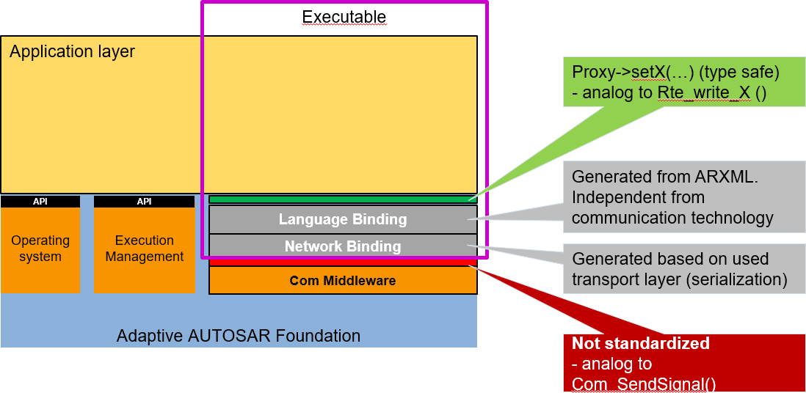

---
tip: translate by openai@2023-06-23 12:20:30
...
# Contents

```
1. [Introduction](#introduction) 9

   1. [Contents](#contents-1) . . . . . . . . . . . . . . . . . . . . . . . . . . . . . . . . . . . 9
   2. [Prereads](#prereads) . . . . . . . . . . . . . . . . . . . . . . . . . . . . . . . . . . . 9
   3. [Relationship to other AUTOSAR specifications](#relationship-to-other-autosar-specifications) . . . . . . . . . . . . . . 9
2. [Related Documentation](#related-documentation) 10
3. [Technical Scope and Approach](#technical-scope-and-approach) 12

   1. [Overview a landscape of intelligent ECUs](#overview---a-landscape-of-intelligent-ecus) 12
   2. [Technology Drivers](#technology-drivers) 12
   3. [Adaptive Platform Characteristics](#adaptive-platform---characteristics) 13

      1. [C++](#c) 13
      2. [SOA](#soa) 14
      3. [Parallel processing](#parallel-processing) 14
      4. [Leveraging existing standard](#leveraging-existing-standard) 14
      5. [Safety and security](#safety-and-security) 15
      6. [Planned dynamics](#planned-dynamics) 15
      7. [Agile](#agile) 15
   4. [Integration of Classic, Adaptive and Non-AUTOSAR ECUs](#integration-of-classic-adaptive-and-non-autosar-ecus) 16
   5. [Scope of specification](#scope-of-specification) 17
4. [Architecture](#architecture) 18

   1. [Logical view](#logical-view) 18

      1. [ARA](#ara) 18
      2. [Language binding, C++ Standard Library, and POSIX API](#language-binding-c-standard-library-and-posix-api) 19
      3. [Application launch and shutdown](#application-launch-and-shutdown) 19
      4. [Application interactions](#application-interactions) 20
      5. [Non-standard interfaces](#non-standard-interfaces) 20
   2. [Physical view](#physical-view) 20

      1. [OS, processes, and threads](#os-processes-and-threads) 20
      2. [Library-based or Service based Functional Cluster imple-](#library-based-or-service-based-functional-cluster-implementation) [mentation](#library-based-or-service-based-functional-cluster-implementation) 21
      3. [The interaction between Functional Clusters](#the-interaction-between-functional-clusters) 22
      4. [Machine/hardware](#machinehardware) 22
   3. [Methodology and Manifest](#methodology-and-manifest) 22
   4. [Manifest](#manifest) 23
   5. [Application Design](#application-design) 24
   6. [Execution manifest](#execution-manifest) 25
   7. [Service Instance Manifest](#service-instance-manifest) 26
   8. [Machine Manifest](#machine-manifest) 26
5. [Operating System](#operating-system) 28

   1. [Overview](#overview) 28
   2. [POSIX](#posix) 28
   3. [Scheduling](#scheduling) 29
   4. [Memory management](#memory-management) 29
   5. [Device management](#device-management) 29
   6. [Networking](#networking) 29
6. [Execution Management](#execution-management) 30

   1. [Overview](#overview-1) 30
   2. [System Startup](#system-startup) 30
   3. [Execution Management Responsibilities](#execution-management-responsibilities) 31
   4. [Deterministic Execution](#deterministic-execution) 31
   5. [Resource Limitation](#resource-limitation) 32
   6. [Application Recovery](#application-recovery) 33
   7. [Trusted Platform](#trusted-platform) 33
7. [State Management](#state-management) 35
8. [Communication Management](#communication-management) 38

   1. [Overview](#overview-2) 38
   2. [Service Oriented Communication](#service-oriented-communication) 38
   3. [Language binding and Network binding](#language-binding-and-network-binding) 39
   4. [Generated Proxies and Skeletons of C++ Language Binding](#generated-proxies-and-skeletons-of-c-language-binding) 40
   5. [Static and dynamic configuration](#static-and-dynamic-configuration) 40
   6. [Service Contract Versioning](#service-contract-versioning) 41
   7. [Raw Data Streaming Interface](#raw-data-streaming-interface) 41
9. [Diagnostics](#diagnostics) 42

   1. [Overview](#overview-3) 42
   2. [Software Cluster](#software-cluster) 42
   3. [Diagnostic communication sub-cluster](#diagnostic-communication-sub-cluster) 43
   4. [Diagnostic in Adaptive Application (AA)](#diagnostic-in-adaptive-application-aa) 44
   5. [Typed vs generic interfaces](#typed-vs-generic-interfaces) 44
   6. [Diagnostic conversations](#diagnostic-conversations) 44
   7. [Event memory sub-cluster](#event-memory-sub-cluster) 45
   8. [Service Oriented Vehicle Diagnostics](#service-oriented-vehicle-diagnostics) 45
10. [Persistency](#persistency) 46

    1. [Overview](#overview-4) 46
    2. [Key-Value Storage](#key-value-storage) 47
    3. [File Storage](#file-storage) 48
    4. [Use cases for handling persistent data for UCM](#use-cases-for-handling-persistent-data-for-ucm) 48
11. [Time Synchronization](#time-synchronization) 50

    1. [Overview](#overview-5) 50
    2. [Design](#design) 50
    3. [Architecture](#architecture-1) 51
12. [Network Management](#network-management) 52

    1. [Overview on Network Management Algorithm](#overview-on-network-management-algorithm) 52
    2. [Architecture](#architecture-2) 52
13. [Update and Config Management](#update-and-config-management) 54

    1. [Overview](#overview-6) 54
    2. [Update protocol](#update-protocol) 55

       1. [Data transfer](#data-transfer) 56
    3. [Packages](#packages) 56

       1. [Software package](#software-package) 56
       2. [Backend package](#backend-package) 58
       3. [Vehicle Package](#vehicle-package) 59
       4. [Software release and packaging workflow](#software-release-and-packaging-workflow) 60
    4. [UCM processing and activating Software Packages](#ucm-processing-and-activating-software-packages) 61
    5. [UCM Master update campaign coordination](#ucm-master-update-campaign-coordination) 63

       1. [Adaptive applications interacting with UCM Master](#adaptive-applications-interacting-with-ucm-master) 64

          1. [OTA Client](#ota-client) 65
          2. [Vehicle driver](#vehicle-driver) 65
          3. [Vehicle state manager](#vehicle-state-manager) 65
          4. [Flashing Adapter](#flashing-adapter) 65
    6. [Software information reporting](#software-information-reporting) 66
    7. [Software update consistency and authentication](#software-update-consistency-and-authentication) 66
    8. [Securing the update process](#securing-the-update-process) 66
    9. [Appropriate State Management during an update process](#appropriate-state-management-during-an-update-process) 67
14. [Identity and Access Management](#identity-and-access-management) 69

    1. [Terminology](#terminology) 69
    2. [Scope and Focus of the IAM framework:](#scope-and-focus-of-the-iam-framework) 70
    3. [Contents of the AUTOSAR specification](#contents-of-the-autosar-specification) 70
    4. [The architecture of the IAM Framework](#the-architecture-of-the-iam-framework) 71

       1. [General Framework](#general-framework) 71
       2. [Identification of Adaptive Applications](#identification-of-adaptive-applications) 72
       3. [The IAM Sequence](#the-iam-sequence) 72
15. [Cryptography](#cryptography) 74

    1. [Security Architecture](#security-architecture) 74
    2. [Key Management Architecture](#key-management-architecture) 75
    3. [Remarks on API Extension](#remarks-on-api-extension) 76
16. [Log and Trace](#log-and-trace) 77

    1. [Overview](#overview-7) 77
    2. [Architecture](#architecture-3) 78
17. [Safety](#safety) 79

    1. [Functional Safety Architecture](#functional-safety-architecture) 79
    2. [Protection of Information Exchange (E2E-Protection)](#protection-of-information-exchange-e2e-protection) 80
    3. [Platform Health Management](#platform-health-management) 80
    4. [System Health Monitoring](#system-health-monitoring) 83

[18 Core Types](#core-types) 85
[18.1 Error](#error-handling)   [Handling](#error-handling) . . . . . . . . . . . . . . . . . . . . . . . . . . . . . . . .   85
[18.1.1](#overview-8)           [Overview](#overview-8) . . . . . . . . . . . . . . . . . . . . . . . . . . . . .             85
[18.1.2](#errorcode)            [ErrorCode](#errorcode) . . . . . . . . . . . . . . . . . . . . . . . . . . . .               85
[18.1.3](#result)               [Result](#result) . . . . . . . . . . . . . . . . . . . . . . . . . . . . . . .               85
[18.1.4](#future-and-promise)   [Future and Promise](#future-and-promise) . . . . . . . . . . . . . . . . . . . . . . .       86

2. [Advanced data types](#advanced-data-types) 86
3. [Primitive data types](#primitive-data-types) 87
4. [Global initialization and shutdown functions](#global-initialization-and-shutdown-functions) 87

19. [Intrusion Detection System Manager](#intrusion-detection-system-manager) 89
20. [Firewall](#firewall) 90
```

1. # Introduction

   1. ## Contents


This specification describes the AUTOSAR Adaptive Platform (AP) design. The purpose of this document is to provide an overview of AP but is not to detail all the elements of AP design. It is to provide the overall design of the AP and key concepts for both AP users and AP implementers.

> 这份规范描述了AUTOSAR自适应平台（AP）的设计。本文档的目的是提供AP的概览，而不是详细描述AP设计的所有要素。它旨在为AP用户和AP实施者提供总体设计和关键概念。


The document is organized as follows. It starts with Technical Scope and Approach to provide some background of AP, followed by Architecture describing both logical and physical views of AP. Independent chapters of Methodology and Manifest and all Functional Clusters follow, which are the units of functionalities of AP, each containing its overview and introductions to their key concepts.

> 文件的组织如下：首先介绍技术范围和方法，以提供AP的背景信息，然后是描述AP的逻辑和物理视图的架构。接下来是方法和宣言的独立章节，以及AP的功能簇，每个簇包含其概述和对其关键概念的介绍。


The detailed specification and discussions on the explained concepts are defined in the relevant RS, SWS, TR and EXP documents.

> 详细的规格和讨论关于解释的概念已经在相关的RS、SWS、TR和EXP文件中定义。

## Prereads


This document is one of the high-level conceptual documents of AUTOSAR. Useful pre-reads are [[1](#_bookmark5)], [[2](#_bookmark6)], and [[3](#_bookmark7)].

> 这份文件是AUTOSAR的高级概念文档之一。有用的预读文章分别是[[1](#_bookmark5)], [[2](#_bookmark6)], 和 [[3](#_bookmark7)]。

## Relationship to other AUTOSAR specifications


The detailed specification and discussions on the explained concepts are defined in the relevant RS, SWS, TR and EXP documents. A detailed technical architecture documentation of the AUTOSAR Adaptive Platform is provided in [[4](#_bookmark8)].

> 详细的规范和对解释的概念的讨论定义在相关的RS、SWS、TR和EXP文件中。AUTOSAR Adaptive Platform的详细技术架构文档见[[4](#_bookmark8)]。

# Related Documentation

```
1. []{#_bookmark5 .anchor}Glossary []{#_bookmark6 .anchor}AUTOSAR_TR_Glossary
2. Main Requirements []{#_bookmark7 .anchor}AUTOSAR_RS_Main
3. Methodology for Adaptive Platform []{#_bookmark8 .anchor}AUTOSAR_TR_AdaptiveMethodology
4. Explanation of Adaptive Platform Software Architecture []{#_bookmark9 .anchor}AUTOSAR_EXP_SWArchitecture
5. []{#_bookmark10 .anchor}The 4+1 View Model of Architecture
6. Specification of Execution Management []{#_bookmark11 .anchor}AUTOSAR_SWS_ExecutionManagement
7. Specification of Platform Types for Adaptive Platform []{#_bookmark12 .anchor}AUTOSAR_SWS_AdaptivePlatformTypes
8. Specification of Synchronized Time-Base Manager AUTOSAR_SWS_SynchronizedTimeBaseManager
9. Requirements on Identity and Access Management []{#_bookmark14 .anchor}AUTOSAR_RS_IdentityAndAccessManagement
10. Specification of Identity and Access Management []{#_bookmark15 .anchor}AUTOSAR_SWS_IdentityAndAccessManagement
11. Specification of Manifest []{#_bookmark16 .anchor}AUTOSAR_TPS_ManifestSpecification
12. Explanation of Safety Overview []{#_bookmark17 .anchor}AUTOSAR_EXP_SafetyOverview
13. Safety Requirements for AUTOSAR Adaptive Platform and AUTOSAR Classic Platform []{#_bookmark18 .anchor}AUTOSAR_RS_Safety
14. ISO 26262:2018 (all parts) -Road vehicles -Functional Safety []{#_bookmark19 .anchor}[http://www.iso.org](http://www.iso.org/)
15. E2E Protocol Specification []{#_bookmark20 .anchor}AUTOSAR_PRS_E2EProtocol
16. Specification of Communication Management []{#_bookmark21 .anchor}AUTOSAR_SWS_CommunicationManagement
17. Requirements on Health Monitoring AUTOSAR_RS_HealthMonitoring
18. []{#_bookmark22 .anchor}Specification of Health Monitoring []{#_bookmark23 .anchor}AUTOSAR_ASWS_HealthMonitoring
19. Requirements on Platform Health Management []{#_bookmark24 .anchor}AUTOSAR_RS_PlatformHealthManagement
20. Specification of Platform Health Management AUTOSAR_SWS_PlatformHealthManagement
```

# 3. Technical Scope and Approach

## 1. Overview a landscape of intelligent ECUs


Traditionally ECUs mainly implement functionality that replaces or augments electromechanical systems. Software in those deeply-embedded ECUs controls electrical output signals based on input signals and information from other ECUs connected to the vehicle network. Much of the control software is designed and implemented for the target vehicle and does not change significantly during vehicle lifetime.

> 传统上，ECU主要实现取代或增强机电系统的功能。这些深度嵌入式ECU中的软件根据输入信号和与车辆网络相连的其他ECU的信息控制电气输出信号。大部分控制软件是为目标车辆设计和实现的，在车辆使用寿命期间不会发生重大变化。


New vehicle functions, such as highly automated driving, will introduce highly complex and computing resource demanding software into the vehicles and must fulfill strict integrity and security requirements. Such software realizes functions, such as environment perception and behavior planning, and integrates the vehicle into external backend and infrastructure systems. The software in the vehicle needs to be updated during the lifecycle of the vehicle, due to evolving external systems or improved functionality.

> 新型车辆功能，如高度自动驾驶，将引入高度复杂且计算资源要求苛刻的软件到车辆中，并必须满足严格的完整性和安全性要求。该软件实现环境感知和行为规划等功能，并将车辆集成到外部后端和基础设施系统中。车辆中的软件需要在车辆的使用寿命期间进行更新，以应对不断变化的外部系统或改进功能。


The AUTOSAR Classic Platform (CP) standard addresses the needs of deeplyembedded ECUs, while the needs of ECUs described above cannot be fulfilled. Therefore, AUTOSAR specifies a second software platform, the AUTOSAR Adaptive Platform (AP). AP provides mainly high-performance computing and communication mechanisms and offers flexible software configuration, e.g. to support software update overthe-air. Features specifically defined for the CP, such as access to electrical signals and automotive specific bus systems, can be integrated into the AP but is not in the focus of standardization.

> AUTOSAR经典平台（CP）标准满足深度嵌入式ECU的需求，而上述ECU的需求无法满足。因此，AUTOSAR指定了第二个软件平台，即AUTOSAR自适应平台（AP）。AP主要提供高性能计算和通信机制，并提供灵活的软件配置，例如支持软件升级。特定于CP的功能，如访问电气信号和汽车特定总线系统，可以集成到AP中，但不是标准化的重点。

## Technology Drivers


There are two major groups of technology drivers behind. One is Ethernet, and the other is processors.

> 有两大类技术驱动力背后。一个是以太网，另一个是处理器。


The ever-increasing bandwidth requirement of the on-vehicle network has led to the introduction of Ethernet, that offers higher bandwidth and with switched networks, enabling the more efficient transfer of long messages, point-to-point communications, among others, compared to the legacy in-vehicle communication technologies such as CAN. The CP, although it supports Ethernet, is primarily designed for the legacy communication technologies, and it has been optimized for such, and it is difficult to fully utilize and benefit from the capability of Ethernet-based communications.

> 随着车载网络带宽要求的不断增加，以太网的引入提供了更高的带宽，并且通过交换网络可以更有效地传输长消息、点对点通信等，与传统的车载通信技术（如CAN）相比，有了显著改善。CP虽然支持以太网，但主要是为传统的通信技术而设计，并且已经进行了优化，很难充分利用和受益于基于以太网的通信能力。


Similarly, performance requirements for processors have grown tremendously in recent years as vehicles are becoming even more intelligent. Multicore processors are already in use with CP, but the needs for the processing power calls for more than multicore. Manycore processors with tens to hundreds of cores, GPGPU (General Purpose use of GPU), FPGA, and dedicated accelerators are emerging, as these offer orders of magnitudes higher performance than the conventional MCUs. The increasing number of cores overwhelms the design of CP, which was originally designed for a single core

> 随着汽车变得越来越智能，处理器的性能要求也在近年来急剧增长。多核处理器已经在CP中使用，但是处理能力的需求要求超过多核。许多核处理器拥有数十到数百个核心，GPGPU（GPU的通用用途），FPGA和专用加速器正在出现，因为它们比传统的MCU提供的性能提高了几个数量级。核心数量的增加使CP的设计超出了原本为单核而设计的范围。


MCU, though it can support multicore. Also, as the computing power swells, the power efficiency is already becoming an issue even in data centers, and it is in fact much more significant for these intelligent ECUs. From semiconductor and processor technologies point of view, constrained by Pollack's Rule, it is physically not possible to increase the processor frequency endlessly and the only way to scale the performance is to employ multiple (and many) cores and execute in parallel. Also, it is known that the best performance-per-watt is achieved by a mix of different computing resources like manycore, co-processors, GPU, FPGA, and accelerators. This is called heterogeneous computing which is now being exploited in HPC (High-Performance Computing) certainly overwhelms the scope of CP by far.

> MCU虽然支持多核，但随着计算能力的增加，电源效率已经成为数据中心的一个问题，对于这些智能ECU来说，这个问题更加严重。从半导体和处理器技术的角度来看，受Pollack规则的限制，无法无限地提高处理器频率，唯一的方法是采用多个（和许多）核心并并行执行。此外，众所周知，最佳性能/瓦特是通过多核，协处理器，GPU，FPGA和加速器等不同计算资源的混合实现的。这称为异构计算，现在正在HPC（高性能计算）中利用，远远超出CP的范围。


It is also worthwhile to mention that there is a combined effect of both processors and faster communications. As more processing elements are being combined in a single chip like manycore processors, the communication between these processing elements is becoming orders of magnitude faster and efficient than legacy inter-ECU communications. This has been made possible by the new type of processor interconnect technologies such as Network-on-Chip (NoC). Such combined effects of more processing power and faster communication within a chip also prompts the need for a new platform that can scale over ever-increasing system requirements.

> 也值得一提的是，处理器和更快的通信有着综合的效果。随着越来越多的处理元素被集成到单个芯片中，如多核处理器，这些处理元素之间的通信比传统的ECU间通信快几个数量级且更有效。这一切都得益于新型的处理器互连技术，如网络片上系统（NoC）。这种处理能力更强和片上通信更快的综合效果也促使了需要一个新的平台来承载日益增长的系统需求。

## Adaptive Platform Characteristics


The characteristic of AP is shaped by the factors outlined in sections [3.1](#overview---a-landscape-of-intelligent-ecus) and [3.2](#technology-drivers). The landscape inevitably demands significantly more computing power, and the technologies trend provides a baseline of fulfilling such needs. However, the HPC in the space of safety-related domain while power and cost efficiencies also matter, is by itself imposes various new technical challenges.

> AP的特征受到[3.1](#overview---a-landscape-of-intelligent-ecus)和[3.2](#technology-drivers)部分概述的因素的影响。这种景观不可避免地需要更多的计算能力，而技术趋势提供了满足这些需求的基线。但是，安全领域中的HPC，同时考虑到功率和成本效率也很重要，它本身也会带来各种新的技术挑战。


To tackle them, AP employs various proven technologies traditionally not fully exploited by ECUs, while allowing maximum freedom in the AP implementation to leverage the innovative technologies.

> 为了解决它们，AP采用了传统上由ECU未充分利用的各种经过验证的技术，同时允许AP实现最大的自由度，以利用创新技术。

### C++


From top-down, the applications can be programmed in C++. It is now the language of choice for the development of new algorithms and application software in performance critical complex applications in the software industry and in academics. This should bring faster adaptations of novel algorithms and improve application development productivity if properly employed.

> 从顶层到底层，应用程序可以用C++编程。它现在是软件行业和学术界开发新算法和应用软件的首选语言，特别是在性能关键的复杂应用中。如果正确使用，这将带来更快的新算法适应，提高应用开发生产率。

### SOA


To support the complex applications, while allowing maximum flexibility and scalability in processing distribution and compute resource allocations, AP follows serviceoriented-architecture (SOA). The SOA is based on the concept that a system consists of a set of services, in which one may use another in turn, and applications that use one or more of the services depending on its needs. Often SOA exhibits system-ofsystem characteristics, which AP also has. A service, for instance, may reside on a local ECU that an application also runs, or it can be on a remote ECU, which is also running another instance of AP. The application code is the same in both cases the communication infrastructure will take care of the difference providing transparent communication. Another way to look at this architecture is that of distributed computing, communicating over some form of message passing. At large, all these represent the same concept. This message passing, communication-based architecture can also benefit from the rise of fast and high-bandwidth communication such as Ethernet.

> 为了支持复杂的应用，同时允许在处理分发和计算资源分配方面最大限度的灵活性和可扩展性，AP 遵循面向服务的架构（SOA）。SOA 的概念是，一个系统由一组服务组成，其中一个可以依次使用另一个，而根据需要使用一个或多个服务的应用程序。通常，SOA 具有系统-系统特性，AP 也具有这种特性。例如，服务可以位于应用程序也运行的本地 ECU 上，或者可以位于运行另一个 AP 实例的远程 ECU 上。两种情况下的应用程序代码相同，通信基础设施将处理差异，提供透明通信。另一种看待这种架构的方式是分布式计算，通过某种消息传递进行通信。总体而言，所有这些都代表相同的概念。这种基于消息传递的通信架构也可以从快速、高带宽的通信（如以太网）中受益。

### Parallel processing


Distributed computing is inherently parallel. The SOA, as different applications use a different set of services, shares this characteristic. The advancement or manycore processors and heterogeneous computing that offer parallel processing capability offer technological opportunities to harness the computing power to match the inherent parallelism. Thus, the AP possesses the architectural capability to scale its functionality and performance as the manycore-heterogeneous computing technologies advance. Indeed, the hardware and platform interface specification are only parts of the equation, and advancements in OS/hypervisor technologies and development tools such as automatic parallelization tools are also critical, which are to be fulfilled by AP provider and the industry/academic eco-system. The AP aims to accommodate such technologies as well.

> 分布式计算本质上是并行的。SOA也具有这一特性，因为不同的应用程序使用不同的服务。提供并行处理能力的多核处理器和异构计算的进步为利用计算能力来满足内在并行性提供了技术机会。因此，AP具有随着多核异构计算技术的进步而扩展功能和性能的架构能力。实际上，硬件和平台接口规范只是方程的一部分，操作系统/虚拟机技术和开发工具（如自动并行化工具）的进步也至关重要，这些都将由AP提供商和行业/学术生态系统来实现。AP也旨在适应这些技术。

### Leveraging existing standard


There is no point in re-inventing the wheels, especially when it comes to specifications, not implementations. As with already described in section [3.3.1](#c), AP takes the strategy of reusing and adapting the existing open standards, to facilitate the faster development of the AP itself and benefiting from the eco-systems of existing standards. It is, therefore, a critical focus in developing the AP specification not to casually introduce a new replacement functionality that an existing standard already offers. For instance, this means no new interfaces are casually introduced just because an existing standard provides the functionality required but the interface is superficially not easy to understand.

> 没有必要重新发明轮子，尤其是在规范方面，而不是实施方面。正如在第3.3.1节中已经描述的那样，AP采用重用和调整现有开放标准的策略，以促进AP本身的更快发展，并从现有标准的生态系统中受益。因此，在开发AP规范时，关键的重点是不要随意引入新的替代功能，而这种功能已经由现有标准提供。例如，这意味着不要因为现有标准提供了所需的功能，但接口表面上不容易理解而随意引入新的接口。

### Safety and security


The systems that AP targets often require some level of safety and security, possibly at its highest level. The introduction of new concepts and technologies should not undermine such requirements although it is not trivial to achieve. To cope with the challenge, AP combines architectural, functional, and procedural approaches. The architecture is based on distributed computing based on SOA, which inherently makes each component more independent and free of unintended interferences, dedicated functionalities to assist achieving safety and security, and guidelines such as C++ coding guideline, which facilitates the safe and secure usage of complex language like C++, for example.

> 系统通常需要一定程度的安全性，可能处于最高水平。新概念和技术的引入不应破坏这些要求，尽管实现这一点并不容易。为了应对这一挑战，AP结合了架构、功能和程序方法。架构基于基于SOA的分布式计算，其固有地使每个组件更加独立，免受意外干扰，专用功能有助于实现安全性，以及指导方针，如C++编码指南，有助于安全地使用复杂的语言，如C++。

### Planned dynamics


The AP supports the incremental deployment of applications, where resources and communications are managed dynamically to reduce the effort for software development and integration, enabling short iteration cycles. Incremental deployment also supports explorative software development phases.

> AP支持应用程序的逐步部署，其中动态管理资源和通信，以减少软件开发和集成的工作量，实现短迭代周期。增量部署也支持探索性的软件开发阶段。


For product delivery, AP allows the system integrator to carefully limit dynamic behavior to reduce the risk of unwanted or adverse effects allowing safety qualification. Dynamic behavior of an application will be limited by constraints stated in the Execution manifest (see section [4.6](#execution-manifest)). The interplay of the manifests of several applications may cause that already at design time. Nevertheless, at execution time dynamic allocation of resources and communication paths are only possible in defined ways, within configured ranges, for example.

> 为了产品交付，AP允许系统集成商仔细限制动态行为，以减少不希望或不利影响的风险，从而允许安全认证。应用程序的动态行为将由执行清单中所述的约束限制（请参见[4.6]（#execution-manifest）部分）。几个应用程序的清单之间的相互作用可能会在设计时就引起。尽管如此，在执行时，资源和通信路径的动态分配只能以定义的方式，在配置的范围内进行，例如。


Implementations of an AP may further remove dynamic capabilities from the software configuration for production use. Examples of planned dynamics might be:

> 实施AP可能进一步从软件配置中移除动态功能以供生产使用。计划动态的示例可能是：

- Pre-determination of the service discovery process
- Restriction of dynamic memory allocation to the startup phase only
- Fair scheduling policy in addition to priority-based scheduling
- Fixed allocation of processes to CPU cores
- Access to pre-existing files in the file-system only
- Constraints for AP API usage by Applications
- Execution of authenticated code only

  1. ### Agile


Although not directly reflected in the platform functionalities, the AP aims to be adaptive to different product development processes, especially agile based processes. For agile based development, it is critical that the underlying architecture of the system is

> 尽管不会直接反映在平台功能上，AP旨在适应不同的产品开发流程，尤其是基于敏捷开发的流程。对于基于敏捷开发的系统，其基础架构至关重要。


incrementally scalable, with the possibility of updating the system after its deployment. The architecture of AP should allow this.

> AP的架构应允许逐步可扩展，并可在部署后更新系统。

## Integration of Classic, Adaptive and Non-AUTOSAR ECUs


As described in previous sections, AP will not replace CP or Non-AUTOSAR platforms in IVI/COTS. Rather, it will interact with these platforms and external backend systems such as road-side infrastructures, to form an integrated system (see Figures [3.1](#_bookmark37) and [3.2](#_bookmark38)). As an example, CP already incorporates SOME/IP, which is also supported by AP, among other protocols.

> 根据前面几节所述，AP不会取代CP或非AUTOSAR平台在IVI/COTS中。相反，它将与这些平台和外部后端系统（如路边基础设施）交互，形成一个集成系统（参见图3.1和3.2）。例如，CP已经包含SOME/IP，这也是AP支持的协议之一。

{width="6.261874453193351in" height="4.125311679790026in"}

**Figure 3.1:** []{#_bookmark37 .anchor}**Exemplary deployment of different platforms**

{width="6.355173884514436in" height="4.129687226596675in"}

**Figure 3.2:** []{#_bookmark38 .anchor}**Exemplary interactions of AP and CP**

## Scope of specification


AP defines the runtime system architecture, what constitutes a platform, and what functionalities and interfaces it provides. It also defines machine-readable models that are used in the development of such a system. The specification should provide necessary information on developing a system using the platform, and what needs to be met to implement the platform itself.

> AP 定义了运行时系统架构、构成一个平台的内容以及它提供的功能和接口。它还定义了用于开发这样的系统的可机读模型。该规范应提供使用该平台开发系统所需的必要信息，以及实现该平台本身所需的内容。

4. # Architecture

   1. ## Logical view

      1. ### ARA


Figure [4.1](#_bookmark43) shows the architecture of AP. The **Adaptive Applications (AA)** run on top of **ARA, AUTOSAR Runtime for Adaptive applications**. ARA consists of application interfaces provided by **Functional Clusters**, which belong to either **Adaptive Platform Foundation** or **Adaptive Platform Services**. Adaptive Platform Foundation provides fundamental functionalities of AP, and Adaptive Platform Services provide platform standard services of AP. Any AA can also provide Services to other AA, illustrated as **Non-platform service** in the figure.

> 图4.1显示了AP的架构。**自适应应用（AA）**运行在**ARA，自适应应用的AUTOSAR运行时**之上。ARA由**功能集群**提供的应用程序接口组成，这些功能集群属于**自适应平台基础**或**自适应平台服务**。自适应平台基础提供AP的基本功能，自适应平台服务提供AP的平台标准服务。任何AA也可以向其他AA提供服务，如图中所示的**非平台服务**。


The interface of Functional Clusters, either they are those of Adaptive Platform Foundation or Adaptive Platform Services, are indifferent from AA point of view they just provide specified C++ interface or any other language bindings AP may support in future. There are indeed differences under the hood. Also, note that underneath the ARA interface, including the libraries of ARA invoked in the AA contexts, may use other interfaces than ARA to implement the specification of AP and it is up to the design of AP implementation.

> 界面功能集群，无论是自适应平台基础设施还是自适应平台服务，在AA的角度来看是没有区别的，只是提供指定的C++界面或者其他语言绑定AP可能在未来支持。实际上，在底层有着不同之处。另外，请注意，在ARA界面下，包括在AA上下文中调用的ARA库，可以使用其他界面来实现AP的规范，这取决于AP实现的设计。

{width="6.239583333333333in" height="3.03125in"}

**Figure 4.1:** []{#_bookmark43 .anchor}**AP architecture logical view**


Be aware that Figure [4.1](#_bookmark43) contains Functional Clusters that are not part of the current release of AP, to provide a better idea of overall structure. Further new Functional Clusters not shown here may well be added future releases of AP.

> 要注意，图4.1包含的功能簇不属于AP当前版本，以便更好地了解整体结构。未在此处显示的新功能簇可能会在AP的未来版本中添加。

### Language binding, C++ Standard Library, and POSIX API


The language binding of these API is based on C++, and the C++ Standard library is also available as part of ARA. Regarding the OS API, only PSE51 interface, a singleprocess profile of POSIX standard is available as part of ARA. The PSE51 has been selected to offer portability for existing POSIX applications and to achieve freedom of interference among applications.

> 这些API的语言绑定基于C++，ARA也提供C++标准库。关于操作系统API，只有PSE51接口，这是POSIX标准的单进程配置，也是ARA的一部分。PSE51被选择是为了为现有的POSIX应用提供可移植性，并实现应用之间的干扰自由。

Note that the C++ Standard Library contains many interfaces based on POSIX, including multi-threading APIs. It is recommended not to mix the C++ Standard library threading interface with the native PSE51 threading interface to avoid complications. Unfortunately, the C++ Standard Library does not cover all the PSE51 functionalities, such as setting a thread scheduling policy. In such cases, the combined use of both interfaces may be necessary.

### Application launch and shutdown


Lifecycles of applications are managed by Execution Management (EM). Loading/launching of an application is managed by using the functionalities of EM, and it needs appropriate configuration at system integration time or at runtime to launch an application. In fact, all the Functional Clusters are applications from EM point of view, and they are also launched in the same manner, except for EM itself. Figure [4.2](#_bookmark46) illustrates different types of applications within and on AP.

> 应用程序的生命周期由执行管理（EM）管理。使用EM的功能来管理加载/启动应用程序，在系统集成时或运行时需要适当的配置才能启动应用程序。实际上，从EM的角度来看，所有功能集都是应用程序，它们也以相同的方式启动，除了EM本身。图4.2描述了AP内部和外部的不同类型的应用程序。

{width="5.036458880139983in" height="2.625in"}

**Figure 4.2:** []{#_bookmark46 .anchor}**Applications**

Note that decisions on which and when the application starts or terminates are not made by EM. A special FC, called State Management (SM), is the controller, commanding EM based on the design of a system, arbitrating different states thus controlling the overall system behavior. Since the system here refers to the whole machine AP and its application are running, the internal behavior thus the implementation is project specific. The SM also interact with other FCs to coordinate the overall machine


behavior. The SM should use only the standard ARA interface to maintain portability among different AP stack implementations.

> SM 应该只使用标准的 ARA 接口，以在不同的 AP 栈实现之间保持可移植性。

### Application interactions


Regarding the interaction between AAs, PSE51 do not include IPC (Inter-ProcessCommunication), so there is no direct interface to interact between AAs. Communication Management (CM) is the only explicit interface. CM also provides Service Oriented Communication for both intra-machine and inter-machine, which are transparent to applications. CM handles routing of Service requests/replies regardless of the topological deployment of Service and client applications. Note that other ARA interfaces may internally trigger interactions between AAs, however, this is not an explicit communication interface but just a byproduct of functionalities provided by the respective ARA interfaces.

> 关于AA之间的交互，PSE51不包括IPC（进程间通信），因此没有直接的接口来交互AA。通信管理（CM）是唯一的显式接口。CM还为机内和机间提供面向服务的通信，对应用程序透明。CM处理服务请求/响应的路由，无论服务和客户端应用程序的拓扑部署如何。请注意，其他ARA接口可能会在内部触发AA之间的交互，但这不是一个显式的通信接口，而只是各自ARA接口提供的功能的副产品。

### Non-standard interfaces


AA and Functional Clusters may use any non-standard interfaces, provided that they do not conflict with the standard AP functionalities and also that they conform to the safety/security requirements of the project. Unless they are pure application local runtime libraries, care should be taken to keep such use minimal, as this will impact the software portability onto other AP implementations.

> AA和功能集群可以使用任何非标准接口，只要它们不与标准AP功能冲突，并且符合该项目的安全/安全要求。除非它们是纯应用程序本地运行时库，应该注意尽量减少此类使用，因为这将影响软件在其他AP实现上的可移植性。

## Physical view


The physical architecture [1](#_bookmark51) of AP is discussed here. Note that most of the contents in this section are for illustration purpose only, and do not constitute the formal requirement specification of AP, as the internals of AP is implementation-defined. Any formal requirement on the AP implementation is explicitly stated. As an additional source of information, refer to [[4](#_bookmark8)] which describes the AP internal architecture in more detail.

> 物理架构[1](#_bookmark51)的AP在这里讨论。请注意，本节中的大部分内容仅用于说明目的，不构成AP的正式需求规范，因为AP的内部是实现定义的。对AP实现的任何正式要求都将明确指出。作为额外的信息来源，请参阅[[4](#_bookmark8)]，其中更详细地描述了AP的内部架构。

### OS, processes, and threads


The AP Operating System is required to provide multi-process POSIX OS capability. Each AA is implemented as an independent process, with its own logical memory space and namespace. Note that a single AA may contain multiple processes, and this may be deployed onto a single AP instance or distributed over multiple AP instances. From the module organization point of view, each process is instantiated by OS from

> AP操作系统需要提供多进程POSIX操作系统功能。每个AA都作为一个独立的进程实现，拥有自己的逻辑内存空间和命名空间。请注意，单个AA可以包含多个进程，可以部署在单个AP实例上，也可以分布在多个AP实例上。从模块组织的角度来看，每个进程都是由操作系统实例化的。


1[]{#_bookmark51 .anchor}The 'physical architecture' here means mainly the Process View, Physical View, and some Development View as described in [[5](#_bookmark9)].

> '物理架构'这里主要指的是在[[5](#_bookmark9)]中描述的进程视图、物理视图以及一些开发视图。


an executable. Multiple processes may be instantiated from a single executable. Also, AA may constitute multiple executables.

> 一个可执行文件。可以从一个可执行文件实例化多个进程。此外，AA也可以构成多个可执行文件。


Functional Clusters are also typically implemented as processes. A Functional Cluster may also be implemented with a single process or multiple (sub) processes. The Adaptive Platform Services and the non-platform Services are also implemented as processes.

> 功能集群通常也实现为进程。功能集群也可以用单个进程或多个（子）进程实现。自适应平台服务和非平台服务也实现为进程。


All these processes can be a single-threaded process or a multi-threaded process. However, the OS API they can use differs depending on which logical layer the processes belong to. If they are AAs running on top of ARA, then they should only use PSE51. If a process is one of the Functional Clusters, it is free to use any OS interface available.

> 所有这些进程可以是单线程进程或多线程进程。但是，它们可以使用的操作系统API取决于它们属于哪个逻辑层。如果它们是运行在ARA之上的AA，那么它们应该只使用PSE51。如果进程是功能集群之一，则可以自由使用任何可用的操作系统接口。


In summary, from the OS point of view, the AP and AA forms just a set of processes, each containing one or multiple threads there is no difference among these processes, though it is up to the implementation of AP to offer any sort of partitioning. These processes do interact with each other through IPC or any other OS functionalities available. Note that AA processes, may not use IPC directly and can only communicate via ARA.

> 总而言之，从操作系统的角度来看，AP和AA形式只是一组进程，每个进程包含一个或多个线程，这些进程之间没有区别，但这取决于AP的实现是否提供任何分区。这些进程可以通过IPC或其他可用的操作系统功能相互交互。请注意，AA进程可能不能直接使用IPC，只能通过ARA进行通信。

### Library-based or Service based Functional Cluster implementation


As in Figure [4.1](#_bookmark43), a Functional Cluster can be an Adaptive Platform Foundation module or an Adaptive Platform Service. As described previously, these are generally both processes. For them to interact with AAs, which are also processes, they need to use IPC. There are two alternative designs to achieve this. One is \"Library-based\" design, in which the interface library, provided by the Functional Cluster and linked to AA, calls IPC directly. The other is \"Service-based\" design, where the process uses Communication Management functionality and has a Server proxy library linked to the

> 如图4.1所示，功能集群可以是自适应平台基础模块或自适应平台服务。正如前面所述，这些通常都是过程。为了与AA（也是过程）交互，它们需要使用IPC。有两种替代设计可以实现这一点。一种是“基于库”的设计，其中由功能集群提供的接口库链接到AA，直接调用IPC。另一种是“基于服务”的设计，其中进程使用通信管理功能，并具有链接到AA的服务器代理库。


AA. The proxy library calls Communication Management interface, which coordinates IPC between the AA process and Server process. Note it is implementation-defined whether AA only directly performs IPC with Communication Management or mix with direct IPC with the Server through the proxy library.

> AA：代理库调用通信管理接口，该接口协调AA进程和服务器进程之间的IPC。注意，是否只有AA直接与通信管理执行IPC，或者通过代理库直接与服务器执行IPC，是实现定义的。


A general guideline to select a design for Functional Cluster is that if it is only used locally in an AP instance, the Library-based design is more appropriate, as it is simpler and can be more efficient. If it is used from other AP instance in a distributed fashion, it is advised to employ the Service-based design, as the Communication Management provides transparent communication regardless of the locations of the client AA and Service. Functional Clusters belonging to Adaptive Platform Foundation are \"Librarybased\" and Adaptive Platform Services are \"Service-based\" as the name rightly indicate.

> 一般的指导原则来选择功能集群的设计是，如果它只在AP实例中本地使用，那么基于库的设计更合适，因为它更简单，也可以更有效率。如果从其他AP实例以分布式方式使用，建议采用基于服务的设计，因为通信管理提供透明的通信，无论客户端AA和服务的位置如何。属于自适应平台基础的功能集群是“基于库”的，而自适应平台服务是“基于服务”的，正如其名称所暗示的那样。


Finally, note that it is allowed for an implementation of an FC to not to have a process but realize in the form of a library, running in the context of AA process, as long as it

> 最后，请注意，实现FC可以不必有一个进程，而是以库的形式运行在AA进程的上下文中，只要它符合要求即可。


fulfills the defined RS and SWS of the FC. In this case, the interaction between an AA and the FC will be regular procedure call instead of IPC-based as described previously.

> 符合FC定义的RS和SWS。在这种情况下，AA与FC之间的交互将是常规的过程调用，而不是先前描述的基于IPC的。

### The interaction between Functional Clusters


In general, the Functional Clusters may interact with each other in the AP implementation-specific ways, as they are not bound to ARA interfaces, like for example PSE51, that restricts the use of IPC. It may indeed use ARA interfaces of other Functional Clusters, which are public interfaces. One typical interaction model between Functional Clusters is to use protected interfaces of Functional Clusters to provide privileged access required to achieve the special functionalities of Functional Clusters.

> 一般来说，功能簇可以以AP实施特定的方式相互交互，因为它们不受ARA接口（例如PSE51）的限制，这些接口限制了IPC的使用。它确实可以使用其他功能簇的ARA接口，这些接口是公共接口。功能簇之间的典型交互模型是使用功能簇的受保护接口来提供所需的特权访问，以实现功能簇的特殊功能。


Also, from AP18-03, a new concept of Inter-Functional-Cluster (IFC) interface has been introduced. It describes the interface an FC provides to other FCs. Note that it is not part of ARA, nor does it constitute formal specification requirements to AP implementations. These are provided to facilitate the development of the AP specification by clarifying the interaction between FCs, and they may also provide better architectural views of AP for the users of AP specification. The interfaces are described in the Annex of respective FC SWS.

> 此外，从AP18-03引入了新的功能集群（IFC）接口概念。它描述了FC向其他FC提供的接口。请注意，它不是ARA的一部分，也不构成对AP实现的正式规范要求。这些提供的是为了促进AP规范的开发，通过澄清FC之间的交互，并且它们也可以为AP规范的用户提供更好的体系结构视图。这些接口在各个FC SWS的附录中有描述。

### Machine/hardware


The AP regards hardware it runs on as a Machine. The rationale behind that is to achieve a consistent platform view regardless of any virtualization technology which might be used. The Machine might be a real physical machine, a fully-virtualized machine, a para-virtualized OS, an OS-level-virtualized container or any other virtualized environment.

> AP将其运行的硬件视为机器。其背后的原因是要实现一致的平台视图，无论使用任何虚拟化技术。机器可能是真实的物理机器，完全虚拟化的机器，半虚拟化的操作系统，操作系统级虚拟容器或任何其他虚拟环境。


On hardware, there can be one or more Machines, and only a single instance of AP runs on a machine. It is generally assumed that this 'hardware' includes a single chip, hosting a single or multiple Machines. However, it is also possible that multiple chips form a single Machine if the AP implementation allows it.

> 在硬件上，可以有一台或多台机器，而每台机器上只能运行一个AP实例。通常假定这种“硬件”包括一个芯片，它可以宿主一台或多台机器。但也有可能多个芯片组成一台机器，如果AP实现允许的话。

## Methodology and Manifest


The support for distributed, independent, and agile development of functional applications requires a standardized approach to the development methodology. AUTOSAR adaptive methodology involves the standardization of **work products** for the description of artifacts like services, applications, machines, and their configuration; and the respective **tasks** to define how these work products shall interact to achieve the exchange of design information for the various activities required for the development of products for the adaptive platform.

> 支持功能应用程序的分布式、独立和敏捷开发需要一种标准化的开发方法。AUTOSAR自适应方法涉发到对服务、应用程序、机器及其配置等工件的描述的**工作产品**的标准化，以及定义这些工作产品如何相互作用，以实现设计信息的交换，以实现为自适应平台开发产品所需的各种活动所必需的**任务**。


Figure [4.3](#_bookmark56) illustrates a draft overview of how adaptive methodology might be implemented. For the details of these steps see [[3](#_bookmark7)].

> 图4.3（#_bookmark56）示意了自适应方法的草案概览。有关这些步骤的详细信息，请参见[[3](#_bookmark7)]。

{width="6.370833333333334in" height="4.720833333333333in"}

**Figure 4.3:** []{#_bookmark56 .anchor}**AP development workflow**

## Manifest


A Manifest represents a piece of AUTOSAR model description that is created to support the configuration of an AUTOSAR AP product and which is uploaded to the AUTOSAR AP product, potentially in combination with other artifacts (like binary files) that contain executable code to which the Manifest applies.

> 一个清单代表一个AUTOSAR模型描述，用于支持AUTOSAR AP产品的配置，并且可能与其他包含可执行代码的工件（例如二进制文件）一起上传到AUTOSAR AP产品中，而这些工件受该清单的影响。


The usage of a Manifest is limited to the AUTOSAR AP. This does not mean, however, that all ARXML produced in a development project that targets the AUTOSAR AP is automatically considered a Manifest. In fact, the AUTOSAR AP is usually not exclusively used in a vehicle project.

> 使用清单仅限于AUTOSAR AP。但这并不意味着所有针对AUTOSAR AP研发的ARXML自动被视为清单。实际上，AUTOSAR AP通常不是车辆项目中的唯一使用者。


A typical vehicle will most likely be also equipped with a number of ECUs developed on the AUTOSAR CP and the system design for the entire vehicle will, therefore, have to cover both ECUs built on top of the AUTOSAR CP and ECUs created on top of the AUTOSAR AP.

> 一辆典型的车辆很可能也配备了一些基于AUTOSAR CP开发的电子控制单元，因此，整辆车的系统设计必须涵盖基于AUTOSAR CP和基于AUTOSAR AP创建的电子控制单元。


In principle, the term Manifest could be defined such that there is conceptually just one \"Manifest\" and every deployment aspect would be handled in this context. This does not seem appropriate because it became apparent that manifest-related modelelements exist that are relevant in entirely different phases of a typical development project.

> 原则上，“Manifest”这个术语可以被定义为只有一个概念上的“Manifest”，每个部署方面都会在这个上下文中处理。但这似乎不合适，因为显然存在与Manifest相关的模型元素，这些模型元素在典型开发项目的完全不同阶段都是相关的。


This aspect is taken as the main motivation that next to the application design it is necessary to subdivide the definition of the term Manifest in three different partitions:

> 这一方面被视为主要动机，除了应用程序设计之外，有必要将“Manifest”一词的定义细分为三个不同的部分。


- **Application Design** This kind of description specifies all design-related aspects that apply to the creation of application software for the AUTOSAR AP. It is not necessarily required to be deployed to the adaptive platform machine, but the application design aids the definition of the deployment of application software in the Execution manifest and Service Instance Manifest.

> - **应用设计** 这种描述指定了适用于AUTOSAR AP创建应用软件的所有与设计相关的方面。它不一定要部署到自适应平台机器上，但应用设计有助于在执行清单和服务实例清单中定义应用软件的部署。

- **Execution Manifest** his kind of Manifest is used to specify the deploymentrelated information of applications running on the AUTOSAR AP. An Execution manifest is bundled with the actual executable code to support the integration of the executable code onto the machine.

> - **执行清单** 此类清单用于指定在AUTOSAR AP上运行的应用程序的部署相关信息。执行清单与实际可执行代码一起打包，以支持将可执行代码集成到机器上。

- **Service Instance Manifest** This kind of Manifest is used to specify how serviceoriented communication is configured in terms of the requirements of the underlying transport protocols. A Service Instance Manifest is bundled with the actual executable code that implements the respective usage of service-oriented communication.

> 服务实例清单：此类清单用于指定服务导向通信如何根据底层传输协议的要求进行配置。服务实例清单与实际执行实现服务导向通信的代码一起打包。

- **Machine Manifest** This kind of Manifest is supposed to describe deploymentrelated content that applies to the configuration of just the underlying machine (i.e. without any applications running on the machine) that runs an AUTOSAR AP. A Machine Manifest is bundled with the software taken to establish an instance of the AUTOSAR AP.

> -**机器清单** 这种清单旨在描述与运行AUTOSAR AP的基础机器（即没有任何应用程序运行在机器上）的配置相关的内容。机器清单与用于建立AUTOSAR AP实例的软件一起打包。


The temporal division between the definition (and usage) of different kinds of Manifest leads to the conclusion that in most cases different physical files will be used to store the content of the three kinds of Manifest.

> 时间上对不同类型Manifest的定义（和使用）的划分导致了在大多数情况下，会使用不同的物理文件来存储这三种Manifest的内容。


In addition to the Application Design and the different kinds of Manifest, the AUTOSAR Methodology supports a **System Design** with the possibility to describe Software Components of both AUTOSAR Platforms that will be used in a System in one single model. The Software Components of the different AUTOSAR platforms may communicate in a service-oriented way with each other. But it is also possible to describe a mapping of Signals to Services to create a bridge between the service-oriented communication and the signal-based communication.

> 此外，AUTOSAR方法支持系统设计，可以在一个模型中描述将用于系统中的AUTOSAR平台的软件组件。不同AUTOSAR平台的软件组件可以以服务导向的方式进行通信。但也可以描述信号到服务的映射，以建立服务导向通信和基于信号的通信之间的桥梁。

## Application Design


The application design describes all design-related modeling that applies to the creation of application software for the AUTOSAR AP.

> 应用设计描述了所有与AUTOSAR AP创建应用软件相关的设计建模。


Application Design focuses on the following aspects:

> 应用程序设计专注于以下方面：

- Data types used to classify information for the software design and implementation
- Service interfaces as the pivotal element for service-oriented communication
- Definition how service-oriented communication is accessible by the application
- Persistency Interfaces as the pivotal element to access persistent data and files
- Definition how persistent storage is accessible by the application
- Definition how files are accessible by the application
- Definition how crypto software is accessible by the application
- Definition how the Platform Health Management is accessible by the application
- Definition how Time Bases are accessible by the application

- Serialization properties to define the characteristics of how data is serialized for the transport on the network

> 序列化属性用于定义网络传输中数据序列化的特征。
- Description of client and server capabilities
- Grouping of applications in order to ease the deployment of software.


The artifacts defined in the application design are independent of a specific deployment of the application software and thus ease the reuse of application implementations for different deployment scenarios.

> 应用设计中定义的工件独立于应用软件的具体部署，因此可以为不同的部署方案轻松重用应用实现。

## Execution manifest


The purpose of the execution manifest is to provide information that is needed for the actual deployment of an application onto the AUTOSAR AP.

> 执行清单的目的是为了提供将应用程序部署到AUTOSAR AP所需的信息。


The general idea is to keep the application software code as independent as possible from the deployment scenario to increase the odds that the application software can be reused in different deployment scenarios.

> 总的想法是尽量使应用软件代码与部署情景保持独立，以增加应用软件能够在不同部署情景中重复使用的几率。


With the execution manifest the instantiation of applications is controlled, thus it is possible to

> 通过执行清单控制应用的实例化，因此可以

- instantiate the same application software several times on the same machine, or to

- deploy the application software to several machines and instantiate the application software per machine.

> 部署应用软件到几台机器，并在每台机器上实例化应用软件。


The Execution manifest focuses on the following aspects:

> 执行清单重点关注以下方面：


- Startup configuration to define how the application instance shall be started. The startup includes the definition of startup options and access roles. Each startup may be dependent on machines states and/or function group states.

> 配置启动以定义应用程序实例如何启动。启动包括启动选项和访问角色的定义。每个启动可能取决于机器状态和/或功能组状态。
- Resource Management, in particular resource group assignments.


  1. ## Service Instance Manifest

> ## 服务实例清单


The implementation of service-oriented communication on the network requires configuration which is specific to the used communication technology (e.g. SOME/IP). Since the communication infrastructure shall behave the same on the provider and the requesters of a service, the implementation of the service must be compatible on both sides.

> 实现网络上服务导向通信需要特定于所使用的通信技术（例如SOME / IP）的配置。由于服务的提供者和请求者的通信基础架构应该保持相同，因此服务的实施必须在双方都兼容。


The Service Instance Manifest focuses on the following aspects:

> 服务实例清单主要关注以下方面：


- Service interface deployment to define how a service shall be represented on the specific communication technology.

> 服务接口部署定义了如何在特定通信技术上表示服务。

- Service instance deployment to define for specific provided and required service instances the required credentials for the communication technology.

> 为特定提供的和所需的服务实例定义服务实例部署，以获取通信技术所需的凭据。
- The configuration of E2E protection
- The configuration of Security protection
- The configuration of Log and Trace


  1. ## Machine Manifest

> ## 机器清单


The machine manifest allows to configure the actual adaptive platform instance running on specific hardware (machine).

> 机器清单允许配置在特定硬件（机器）上运行的实际自适应平台实例。


The Machine Manifest focuses on the following aspects:

> 机器宣言重点关注以下几个方面：


- Configuration of the network connection and defining the basic credentials for the network technology (e.g. for Ethernet this involves setting of a static IP address or the definition of DHCP).

> 配置网络连接并为网络技术定义基本凭据（例如，对于以太网，这涉及设置静态IP地址或定义DHCP）。

- Configuration of the service discovery technology (e.g. for SOME/IP this involves the definition of the IP port and IP multicast address to be used).

> 配置服务发现技术（例如对于SOME/IP，这涉及定义要使用的IP端口和IP多播地址）。
- Definition of the used machine states
- Definition of the used function groups

- Configuration of the adaptive platform functional cluster implementations (e.g. the operating system provides a list of OS users with specific rights).

> 配置自适应平台功能集群实现（例如，操作系统提供具有特定权限的操作系统用户列表）。
- The configuration of the Crypto platform Module
- The configuration of Platform Health Management
- The configuration of Time Synchronization

- Documentation of available hardware resources (e.g. how much RAM is available; how many processor cores are available)

> 文档中提供的硬件资源（例如可用多少内存；可用多少处理器核心）

5. # Operating System

   1. ## Overview


The Operating System (OS) is responsible for run-time scheduling, resource management (including policing memory and time constraints) and inter-process communication for all Applications on the Adaptive Platform. The OS works in conjunction with Execution Management which is responsible for platform initialization and uses the OS to perform the start-up and shut-down of Applications.

> 操作系统（OS）负责运行时调度、资源管理（包括内存和时间约束的管理）和所有应用程序在自适应平台上的进程间通信。操作系统与执行管理协同工作，负责平台初始化，并使用操作系统来执行应用程序的启动和关闭。


The Adaptive Platform does not specify a new Operating System for highly performant processors. Rather, it defines an execution context and Operating System Interface (OSI) for use by Adaptive Applications.

> 适应性平台不为高性能处理器指定新的操作系统。相反，它为适应性应用程序定义了一个执行上下文和操作系统接口（OSI）。


The OSI specification contains application interfaces that are part of ARA, the standard application interface of Adaptive Application. The OS itself may very well provide other interfaces, such as creating processes, that are required by Execution Management to start an Application. However, the interfaces providing such functionality, among others, are not available as part of ARA and it is defined to be platform implementation dependent.

> OSI规范包含ARA的标准应用程序接口，ARA是自适应应用的标准应用程序接口。操作系统本身可能提供其他接口，例如创建进程，这些接口是执行管理启动应用程序所必需的。但是，提供此等功能的接口，以及其他接口，不作为ARA的一部分提供，它是平台实现相关的。


The OSI provides both C and C++ interfaces. In the case of a C program, the application's main source code business logic include C function calls defined in the POSIX standard, namely PSE51 defined in IEEE1003.13 [[1](#_bookmark5)]. During compilation, the compiler determines which C library from the platform's operating system provides these C functions and the applications executable shall be linked against at runtime. In case of a C++ program, application software component's source code includes function calls defined in the C++ Standard and its Standard C++ Library.

> 系统开放接口（OSI）提供C和C++接口。对于C程序，应用程序的主要源代码业务逻辑包括在POSIX标准中定义的C函数调用，即IEEE1003.13 [[1]]（#_bookmark5）中定义的PSE51。在编译期间，编译器确定平台操作系统提供的哪个C库，应用程序可执行文件将在运行时链接到该库。对于C++程序，应用软件组件的源代码包括C++标准及其标准C++库中定义的函数调用。

## POSIX


There are several operating systems on the market, e.g. Linux, that provide POSIX compliant interfaces. However, applications are required to use a more restricted API to the operating systems as compared to the platform services and foundation.

> 在市场上有几种操作系统，例如Linux，提供符合POSIX的接口。然而，与平台服务和基础设施相比，应用程序需要使用更受限制的API来访问操作系统。


The general assumption is that a user Application shall use PSE51 as OS interface whereas platform Application may use full POSIX. In case more features are needed on application level they will be taken from the POSIX standard and NOT newly specified wherever possible.

> 一般假设，用户应用程序应该使用PSE51作为操作系统接口，而平台应用程序可以使用完整的POSIX。如果应用程序级别需要更多功能，它们将从POSIX标准中获取，而不是尽可能新指定。


The implementation of Adaptive Platform Foundation and Adaptive Platform Services functionality may use further POSIX calls. The use of specific calls will be left open to the implementer and not standardized.

> 实施自适应平台基础设施和自适应平台服务功能可能会使用更多的POSIX调用。具体调用的使用将留给实现者，不进行标准化。

## Scheduling


The Operating System provides multi-threading and multi-process support. The standard scheduling policies are SCHED_FIFO and SCHED_RR, which are defined by the POSIX standard. Other scheduling policies such as SCHED_DEADLINE or any other operating system specific policies are allowed, with the limitation that this may not be portable across different AP implementations.

> 操作系统提供多线程和多进程支持。根据POSIX标准定义的标准调度策略是SCHED_FIFO和SCHED_RR。允许使用其他调度策略，如SCHED_DEADLINE或任何其他操作系统特定的策略，但限制是可能无法在不同的AP实现之间移植。

## Memory management


One of the reasons behind the multi-process support is to realize 'freedom of interferences' among different Functional Clusters and AA. The multi-process support by OS forces each process to be in an independent address space, separated and protected from other processes. Two instances of the same executable run in different address spaces such that they may share the same entry point address and code as well as data values at startup, however, the data will be in different physical pages in memory.

> 一个支持多进程的原因是为了实现不同功能集群和AA之间的“干扰自由”。操作系统提供的多进程支持使每个进程在独立的地址空间中运行，与其他进程分离和保护。两个相同可执行文件的实例在不同的地址空间中运行，因此它们可以在启动时共享相同的入口地址和代码以及数据值，但是数据将在内存中的不同物理页面中。

## Device management


Device management is largely Operating System-specific. Intentionally, the Adaptive Platform Foundation favors the creation of services to expose the main system functionalities.

> 设备管理在很大程度上取决于操作系统。自适应平台基础架构倾向于创建服务来公开主要的系统功能。


While there is no current plan to standardize the concrete APIs of device drivers themselves, higher-level functionality fulfilled by such drivers may be standardized through Adaptive Platform Services.

> 没有目前的计划去标准化设备驱动程序本身的具体API，但是驱动程序实现的更高级的功能可以通过自适应平台服务来标准化。

## Networking


The main interconnection mechanism between multiple Machines, as well as with other sensors is expected to be based on Ethernet. Consequently, the use of TCP/IPand UDP/IP-based protocols is clearly described. It is therefore expected that the Operating System will provide such a networking stack.

> 主要的连接机制应基于以太网连接多台机器以及其他传感器。因此，清楚地描述了基于TCP/IP和UDP/IP协议的使用。因此，预计操作系统将提供这样的网络堆栈。


Applications will transparently benefit from the networking support by using Communication Management. As part of the Adaptive Platform Foundation, additional features like VLAN, IPSEC and more are enabling secure communications within and across systems.

> 应用程序将透明地受益于通信管理提供的网络支持。作为自适应平台基础的一部分，VLAN、IPSEC等附加功能可以在系统内外实现安全通信。


6. # Execution Management

> 6. # 执行管理

   1. ## Overview


Execution Management is responsible for all aspects of system execution management including initialization of the Adaptive Platform and the startup/shutdown of Processes. Execution Management works in conjunction with the Operating System to configure the run-time scheduling of Processes.

> 执行管理负责系统执行管理的所有方面，包括Adaptive Platform的初始化以及进程的启动/关闭。执行管理与操作系统配合，配置进程的运行时调度。

## System Startup


When the Machine is started, the OS will be initialized and then Execution Management will be launched as the Platform's initial process. Other platform-level Processes (representing Functional Clusters) of the Adaptive Platform Foundation are then launched by Execution Management. After the Adaptive Platform Foundation is up and running, Execution Management continues launching Processes of Adaptive Applications. The startup order of the platform-level and Application-level Processes are determined by the Execution Management, based on the Machine Manifest and dependencies specified in the Execution manifest.

> 当机器启动时，操作系统将被初始化，然后执行管理将作为平台的初始进程启动。然后，适应性平台基础的其他平台级进程（代表功能集群）将由执行管理启动。在适应性平台基础启动后，执行管理继续启动适应性应用程序的进程。平台级和应用级进程的启动顺序由执行管理根据机器清单和执行清单中指定的依赖关系确定。

{width="3.773332239720035in" height="3.906665573053368in"}

**Figure 6.1: AP start-up sequence**


An Adaptive Application can consist of multiple Executable elements -which typically would correspond to executable files on the filesystem. Each Executable can have

> 一个自适应应用可以由多个可执行元素组成，通常对应于文件系统中的可执行文件。每个可执行文件都可以有


multiple Process configurations -and hence startup configurations -dependent on the Function Group States in which the Executable is active.

> 多个进程配置-以及因此的启动配置-取决于可执行文件所处的功能组状态。


Execution Management optionally supports authenticated startup where starting from a trust anchor the Adaptive Platform is started while maintaining the chain of trust. During authenticated startup Execution Management validates the authenticity and integrity of applications and will (optionally) prevent their execution if violations are detected. Through these mechanisms, a Trusted Platform can be established.

> 执行管理可选择性地支持认证启动，从可信锚点开始启动自适应平台，同时保持可信链。在认证启动期间，执行管理将验证应用程序的真实性和完整性，如果检测到违规行为，可选择性地阻止其执行。通过这些机制，可以建立一个可信平台。

## Execution Management Responsibilities


Execution Management is responsible for all aspects of Adaptive Platform execution management and Application execution management including:

> 执行管理负责自适应平台执行管理和应用程序执行管理的所有方面，包括：


1. **Platform Lifecycle Management** Execution Management is launched as part of the Adaptive Platform startup phase and is responsible for the initialization of the Adaptive Platform and deployed Applications.

> 执行管理作为自适应平台启动阶段的一部分启动，负责自适应平台和部署的应用程序的初始化。

2. **Application Lifecycle Management** Execution Management is responsible for the ordered startup and shutdown of the deployed Applications. Execution Management determines the set of deployed Applications based on information in the Machine Manifest and Execution manifests and derives an ordering for startup/shutdown based on declared execution dependencies. Depending on the Machine State and on the Function Group States, the Processes of deployed Applications are started during Adaptive Platform startup or later, however it is not expected that all will begin active work immediately since many Applications will provide services to other Applications and therefore wait and \"listen\" for incoming service requests.

> 执行管理负责部署应用程序的有序启动和关闭。执行管理根据机器清单和执行清单中的信息确定部署的应用程序集，并根据声明的执行依赖性推导出启动/关闭的顺序。根据机器状态和功能组状态，部署的应用程序的进程在自适应平台启动时或之后启动，但不预计所有进程都会立即开始活动工作，因为许多应用程序将为其他应用程序提供服务，因此等待并“侦听”传入的服务请求。


The Execution Management is not responsible for run-time scheduling of Applications since this is the responsibility of the Operating System. However, Execution Management is responsible for configuration of the OS to enable the OS to perform the necessary run-time scheduling based on information extracted by Execution Management from the Machine Manifest and Execution manifests.

> 执行管理不负责应用程序的运行时调度，因为这是操作系统的责任。但是，执行管理负责配置操作系统，以使操作系统能够根据执行管理从机器清单和执行清单中提取的信息执行必要的运行时调度。

## Deterministic Execution


Deterministic execution provides a mechanism such that a calculation using a given input data set always produces a consistent output irrespective of interference. Execution Management distinguishes between time and data determinism. The former states that the output is always produced by the deadline whereas the latter refers to generating the same output from the same input data set and internal state.

> 决定性执行提供了一种机制，即使用给定的输入数据集进行计算，也始终会产生一致的输出，而不受干扰影响。执行管理区分时间和数据决定性。前者指的是总是按照期限产生输出，而后者指的是从相同的输入数据集和内部状态产生相同的输出。


The support provided by Execution Management focuses on data determinism as time determinism is handled by the provision of sufficient resources. For data determinism, Execution Management provides the DeterministicClient APIs to support control of the

> 执行管理提供的支持专注于数据决定性，而时间决定性则通过提供足够的资源来处理。对于数据决定性，执行管理提供了DeterministicClient API来支持对控制的控制。


process-internal cycle, a deterministic worker pool, activation time stamps, and random numbers. DeterministicClient interacts with Communication Management to synchronize data handling with cycle activation. The API supported by DeterministicClient and its interaction with an application is illustrated in Figure [6.2](#_bookmark74).

> 过程内循环，一个确定性的工作池，激活时间戳和随机数。确定性客户端与通信管理交互以同步数据处理与循环激活。确定性客户端支持的API以及其与应用程序的交互如图6.2所示。

{width="6.171666666666667in" height="5.261666666666667in"}

**Figure 6.2:** []{#_bookmark74 .anchor}**Deterministic Client**


Additional to process-local DeterministicClient, Execution Management supports DeterministicSyncMaster that provides for coordination amongst multiple DeterministicClient instances to ensure that their deterministic execution is synchronized.

> 除了进程本地的DeterministicClient之外，执行管理还支持DeterministicSyncMaster，它可以在多个DeterministicClient实例之间协调，以确保它们的确定性执行同步。

## Resource Limitation


The Adaptive Platform permits execution of multiple Adaptive Applications on the same Machine and thus ensuring freedom from interference is a system property. Hence an incorrectly behaving Adaptive Application should be limited with respect to its ability to affect other applications, for example, an application Process should be prevented from

> 适应性平台允许在同一台机器上执行多个适应性应用程序，从而确保系统属性不受干扰。因此，行为不正确的自适应应用程序应该限制其影响其他应用程序的能力，例如，应防止应用程序进程影响其他应用程序。


consuming more CPU time than specified due to the potential for consequent impacts on the correct functioning of other applications.

> 消耗的CPU时间超过指定的时间，可能会对其他应用程序的正确运行产生影响。


Execution Management supports freedom from interference through the configuration of one or more ResourceGroups to which application's processes are assigned. Each ResourceGroup may then be assigned a limit for CPU time or memory that permits restricting the Application's available resources.

> 执行管理通过配置一个或多个资源组来支持免受干扰，应用程序的进程将被分配到这些资源组中。每个资源组可以分配CPU时间或内存的限制，以限制应用程序可用的资源。

## Application Recovery


Execution Management is responsible for the state-dependent management of Process start/stop, so it has to have the special right to start and stop Processes. The Platform Health Management monitors Processes and could trigger a Recovery Action in case any Process behaves not within the specified parameters. The Recovery Actions are defined by the integrator based on the software architecture requirements for the Platform Health Management and configured in the Execution Manifest.

> 执行管理负责进程的启动/停止的状态依赖性管理，因此它必须具有启动和停止进程的特殊权限。平台健康管理监视进程，并可以在任何进程不符合指定参数时触发恢复操作。恢复操作由集成商根据平台健康管理的软件架构要求定义，并在执行清单中进行配置。

## Trusted Platform


To guarantee the correct function of the system, it is crucial to ensure that the code executed on the platform has legitimate origin. Keeping this property allows the integrator to build a Trusted Platform.

> 为了确保系统的正确功能，确保在平台上执行的代码具有合法的起源至关重要。保持这一特性可以使整合器构建一个可信的平台。


A key property of a system that implements a Trusted Platform is a Trust Anchor (also called Root of Trust). A Trust Anchor is often realized as a public key that is stored in a secure environment, e.g. in non-modifiable persistent memory or in an HSM.

> 一个实现可信平台的系统的关键属性是可信锚（也称为可信根）。可信锚常常以存储在安全环境中的公钥的形式实现，例如存储在不可修改的持久内存中或HSM中。


A system designer is responsible to ensure at least that the system starts beginning with a Trust Anchor and that the trust is kept until Execution Management is launched. Depending on the mechanism that is chosen by the system designer to establish the chain of trust, the integrity and authenticity of the entire system may have been checked at this point in the system start-up. However, if the system designer only ensured that the already executed software has been checked regarding integrity and authenticity, Execution Management takes over responsibility on continuing the chain of trust when it takes over control of the system. In this case, the system integrator is responsible to ensure that Execution Management is configured properly.

> 系统设计师负责确保至少系统从信任锚点开始启动，并且在启动执行管理之前保持信任。根据系统设计师选择的建立信任链的机制，系统启动时可能已经检查了整个系统的完整性和真实性。但是，如果系统设计师仅确保已经执行的软件已经检查了完整性和真实性，当执行管理接管系统控制权时，执行管理就负责继续保持信任链。在这种情况下，系统集成商负责确保执行管理配置正确。


One example of passing trust from the Trust Anchor to the OS and the Adaptive Platform (i.e. establishing a chain of trust) could look like this: The Trust Anchor as an authentic entity by definition authenticates the bootloader before the bootloader is being started. In each subsequent step in the boot process, the to-be-started Executable shall be authenticated first. This authenticity check shall be done by an already authenticated entity, i.e. the authenticity check could be done e.g. by the Executable started previously or by some external entity like an HSM, for example.

> 一个从可信锚点到操作系统和自适应平台传递信任的例子可能是这样的：按照定义，可信锚点作为一个可信的实体，会在引导加载程序开始之前对其进行认证。在引导过程的每一个步骤中，要启动的可执行文件首先要进行认证。这一认证检查应该由一个已经认证的实体来完成，例如，可以由先前启动的可执行文件或者像HSM这样的外部实体来完成认证检查。


After the OS has been authentically started, it shall launch Execution Management as one of its first processes. Before Execution Management is being launched, the OS shall ensure that the authenticity of the Execution Management has been verified by an already authenticated and thus trustworthy entity.

> 在操作系统被正确启动后，它将作为其首要进程之一启动执行管理。在启动执行管理之前，操作系统应确保已经被一个已经认证并因此可信的实体验证的执行管理的真实性。

Note: If authentication is not checked by the functionality of the Trust Anchor itself, which is authentic by definition, the Software that shall be applied to verify authenticity of an Executable has to be authenticated before it is applied. For instance, if the Crypto API shall be used to verify authentication of Executables, the Crypto API itself shall be authenticated by some trusted entity before it is used.


Execution Management takes now over the responsibility of authenticating Adaptive Applications before launching them. However, there exists more than one possibility to validate the integrity and authenticity of the Executable code. In [[6](#_bookmark10)], a list of possible mechanisms is provided that fulfill this task.

> 执行管理现在负责在启动应用程序之前对自适应应用程序进行身份验证。但是，存在多种可能性来验证可执行代码的完整性和真实性。在[[6]](#_bookmark10)中，提供了一个可以完成此任务的机制列表。

# State Management


State Management is a unique Functional Cluster that is intended to be mostly an ECU development project specific, and generally, the final implementation is to be performed by the system integrator. It is responsible for all aspects of the operational state of the AUTOSAR Adaptive Platform, including handling of incoming events, prioritization of these events/requests to set the corresponding internal states. State Management may consist of one or more state machines depending on the project needs.

> 状态管理是一个独特的功能集群，旨在主要是ECU开发项目特定的，而且通常最终的实施将由系统集成商执行。它负责AUTOSAR自适应平台的所有操作状态方面，包括处理传入事件，优先处理这些事件/请求以设置相应的内部状态。根据项目需要，状态管理可以由一个或多个状态机组成。


The State Management interact with Adaptive Applications via project specific ara::com service interface consisting of 'Fields' as described below. The interaction between State Management and other Function Clusters shall be done via a standardized interface(s) defined by each Function Cluster.

> 状态管理通过项目特定的ara::com服务接口与自适应应用程序进行交互，接口由下面描述的“字段”组成。状态管理与其他功能集群之间的交互应通过每个功能集群定义的标准化接口完成。

{width="6.34in" height="5.236666666666666in"}

**Figure 7.1: State Management interactions**


The following effects can be requested by State Management:

> 以下效果可以通过状态管理请求：

- FunctionGroups can be requested to be set to a dedicated state
- (Partial) Networks can be requested to be de/ activated
- The machine can be requested to be shutdown or restarted
- Other Adaptive (Platform) Applications can be influenced in their behavior
- Project-specific actions could be performed

- Recover from (supervision) errors when being informed by Platform Health Management or by Execution Management

> 收到平台健康管理或执行管理的通知时，从（监督）错误中恢复。
- Execution of project specific reset per Diagnostic Addresses on request from Diagnostics

- Preparation and verification of software clusters for being installed, updated or removed on request from Update and Configuration Management

> 准备和验证软件集群以按更新和配置管理要求安装、更新或删除

- Influence behavior of running Processes to achieve synchronized behavior within (parts of) the machine (e.g. Power Modes)

> 影响运行进程的行为，以实现机器（例如电源模式）内部的同步行为。


To achieve synchronized behavior State Management provides defined messages and reply messages from where ara::com methods and fields are generated in the scope of Communication Groups of Communication Management.

> 为了实现同步行为，状态管理提供了定义的消息和回复消息，这些消息来自于ara::com方法和字段，这些方法和字段在通信管理的通信组的范围内生成。


State Management provides a set of 'Trigger' and 'Notifier' fields via ara::com. The SM essentially listens to the 'Triggers', and perform implementation-specific state machine processing internally, and provides the effect to the 'Notifier' fields if there is any.

> 状态管理通过ara::com提供一组'触发器'和'通知者'字段。SM本质上是侦听'触发器'，在内部执行实现特定的状态机处理，如果有任何影响，就将其提供给'通知者'字段。


Since State Management functionality is critical, access from other Functional Clusters or Applications must be secured, e.g. by IAM (Identity and Access Management). State Management is monitored and supervised by Platform Health Management.

> 由于状态管理功能至关重要，必须保护来自其他功能集群或应用程序的访问，例如通过IAM（身份和访问管理）。状态管理由平台健康管理监控和监督。


The 'lightweight' StateMachine approach has been introduced by State Management to help user of Adaptive Platform, in creation of State Management functionality. StateMachines are designed to cover standard use-cases with minimal configuration effort. Please note that StateMachines are a complementary part of AUTOSAR and thus are optional to use. It is expected that complex use-cases will still require user provided source code.

> 状态管理引入了“轻量级”状态机方法，以帮助自适应平台的用户创建状态管理功能。状态机旨在以最少的配置工作覆盖标准用例。请注意，状态机是AUTOSAR的一个补充部分，因此使用它是可选的。预计复杂的用例仍将需要用户提供的源代码。


The StateMachine does not implement project-specific logic. Instead it provides input interface for a project-specific Adaptive Application (i.e. SMControlApplication). This application contains project-specific logic and makes decision which state of the StateMachine should be requested next. Please note that error reaction, to errors reported by Execution Management and/or Platform Health Management, is configured directly inside the StateMachine.

> 状态机不实现特定项目的逻辑。相反，它为特定项目的自适应应用程序（即SMControlApplication）提供输入接口。此应用程序包含特定项目的逻辑，并决定应请求状态机的下一个状态。请注意，对执行管理和/或平台健康管理报告的错误反应是直接在状态机中配置的。

{width="6.226527777777778in" height="3.200311679790026in"}

**Figure 7.2: Overview of 'lightweight' StateMachine concept**


8. # Communication Management

> 管理沟通

   1. ## Overview


The Communication Management is responsible for all aspects of communication between applications in a distributed real-time embedded environment.

> 通信管理负责在分布式实时嵌入式环境中应用之间的所有通信方面。


The concept behind is to abstract from the actual mechanisms to find and connect communication partners such that implementers of application software can focus on the specific purpose of their application.

> 概念背后的意图是抽象出找到和连接通信伙伴的实际机制，以便应用软件的实施者可以专注于其应用的特定目的。

## Service Oriented Communication


The notion of a service means functionality provided to applications beyond the functionality already provided by the basic operating software. The Communication Management software provides mechanisms to offer or consume such services for intramachine communication as well as inter-machine communication.

> 服务的概念意味着提供给应用程序的功能超出基本操作软件已提供的功能。通信管理软件提供机制来提供或使用这些服务，用于机内通信以及机间通信。


A service consists of a combination of

> 一项服务由多种组合组成

- Events
- Methods
- Fields


Communication paths between communication partners can be established at design-, at startupor at run-time. An important component of that mechanism is the Service Registry that acts as a brokering instance and is also part of the Communication Management software.

> 通信伙伴之间可以在设计、启动或运行时建立通信路径。该机制的一个重要组成部分是服务注册表，它充当经纪实例，也是通信管理软件的一部分。

{width="3.781770559930009in" height="2.8266666666666667in"}

**Figure 8.1: Service-oriented communication**


Each application that provides services registers these services at the Service Registry. To use a service a consuming application needs to find the requested service by querying the Service Registry, this process is known as Service Discovery.

> 每个提供服务的应用程序都会在服务注册表中注册这些服务。 要使用服务，消费应用程序需要通过查询服务注册表来查找所请求的服务，这一过程称为服务发现。

## Language binding and Network binding


The Communication Management provides standardized means how a defined service is presented to the application implementer (upper layer, Language Binding) as well as the respective representation of the service's data on the network (lower layer, Network Binding). This assures portability of source code and compatibility of compiled services across different implementations of the platform.

> 通信管理提供标准化的方式，可以将定义的服务提供给应用实现者（上层，语言绑定）以及服务数据在网络上的相应表示（下层，网络绑定）。这确保了源代码的可移植性以及编译服务在不同的平台实现之间的兼容性。


The Language Binding defines how the methods, events, and fields of a service are translated into directly accessible identifiers by using convenient features of the targeted programming language. Performance and type safety (as far as supported by the target language) are the primary goals. Therefore, the Language Binding is typically implemented by a source code generator that is fed by the service interface definition.

> 语言绑定定义了如何将服务的方法、事件和字段转换为直接可访问的标识符，并使用目标编程语言的便捷特性。性能和类型安全（受目标语言的支持）是主要目标。因此，语言绑定通常由源代码生成器实现，该源代码生成器由服务接口定义驱动。

{width="6.290624453193351in" height="3.0708333333333333in"}

**Figure 8.2: Example Language and Network Binding**


The Network Binding defines how the actual data of a configured service is serialized and bound to a specific network. It can be implemented based on Communication Management configuration (interface definition of the AUTOSAR meta model) either by interpreting a generated service specific recipe or by directly generating the serializing code itself. Currently, Communication Management supports SOME/IP, DDS, IPC (Inter-Process-Communication or any other custom binding), Signal PDU (SignalBased Network binding) and Signal-Based Static Network binding.

> 网络绑定定义了如何将配置的服务的实际数据序列化并绑定到特定的网络。它可以基于通信管理配置（AUTOSAR元模型的接口定义）实现，要么通过解释生成的特定服务配方，要么直接生成序列化代码本身。目前，通信管理支持SOME / IP、DDS、IPC（进程间通信或任何其他自定义绑定）、Signal PDU（基于信号的网络绑定）和基于信号的静态网络绑定。


The local Service Registry is also part of the Network Binding.

> 本地服务注册也是网络绑定的一部分。


Please note: the interface between Language Binding and Network Binding is considered as a private interface inside Communication Management software. Therefore, a normative specification defining this interface is currently out of scope. Nevertheless, platform vendors are encouraged to define independently such an interface for their software to allow for easy implementation of other Language Bindings than C++ together with other Network Bindings inside their platform implementation.

> 请注意：语言绑定和网络绑定之间的接口被视为通信管理软件内部的私有接口。因此，目前不在范围内制定定义这个接口的规范性规范。然而，平台供应商鼓励独立定义这样一个接口，以便在其平台实现中轻松实现其他语言绑定以及其他网络绑定。

## Generated Proxies and Skeletons of C++ Language Binding


The upper layer interface of the C++ Language Binding provides an object-oriented mapping of the services defined in the interface description of the AUTOSAR meta model.

> C++ 语言绑定的上层接口提供了 AUTOSAR 元模型接口描述中定义的服务的面向对象映射。


A generator that is part of the development tooling for the Communication Management software generates C++ classes that contain type safe representations of the fields, events, and methods of each respective service.

> 一个作为通信管理软件开发工具的部分的发生器可以生成包含每个服务的字段、事件和方法的类型安全表示的C++类。


On the service implementation side, these generated classes are named Service Provider Skeletons. On the client side, they are called Service Requester Proxies.

> 在服务实施方面，这些生成的类被称为服务提供者骨架。在客户端，它们被称为服务请求者代理。


For Service Methods, a Service Requester Proxy provides mechanisms for synchronous (blocking the caller until the server returns a result) and asynchronous calling (called function returns immediately). A caller can start other activities in parallel and receives the result when the server's return value is available via special features of the Core Type ara::core::Future (see Section [18.1.4](#future-and-promise)).

> 对于服务方法，服务请求者代理提供同步（阻塞调用者，直到服务器返回结果）和异步调用（调用函数立即返回）的机制。调用者可以并行启动其他活动，当服务器的返回值可用时，通过ara :: core :: Future（参见[18.1.4]（# future-and-promise）节）的特殊功能接收结果。


A platform implementation may be configured such that the generator creates mock-up classes for easy development of client functionality when the respective server is not yet available. The same mechanism can also be used for unit testing the client.

> 平台实施可以配置，以便在尚未提供相应服务器的情况下，生成器可以为客户端功能的简单开发创建模拟类。同样的机制也可以用于对客户端进行单元测试。


Whereas proxy classes can be used directly by the client the Service Provider Skeletons for the C++ binding are just abstract base classes. A service implementation shall derive from the generated base class and implement the respective functionality.

> 尽管代理类可以直接被客户端使用，但C++绑定的服务提供者骨架只是抽象基类。服务实现应该从生成的基类派生，并实现相应的功能。


The interfaces of ara::com can also provide proxies and skeletons for safety-related E2E protected communication. These interfaces are designed that compatibility to the applications is assured independent whether E2E protection is switched on or off.

> 智能空间ara::com的接口也可以提供用于安全相关的端到端受保护的通信的代理和骨架。这些接口的设计保证了应用程序的兼容性，无论端到端保护是开启还是关闭。

## Static and dynamic configuration


The configuration of communication paths can happen at design-, at startupor at run-time and is therefore considered either static or dynamic:

> 通信路径的配置可以在设计时、启动时或运行时发生，因此被认为是静态的或动态的。


- **Full static configuration** Service discovery is not needed at all as the server knows all clients and clients know the server.

> **完全静态配置**根本不需要服务发现，因为服务器知道所有客户端，客户端也知道服务器。

- **No discovery by application code** The clients know the server but the server does not know the clients. Event subscription is the only dynamic communication pattern in the application.

> 没有通过应用程序代码发现。客户端知道服务器，但服务器不知道客户端。事件订阅是应用程序中唯一的动态通信模式。

- **Full service discovery in the application** No communication paths are known at configuration time. An API for Service discovery allows the application code to choose the service instance at runtime.

> 在应用中实现完整的服务发现：在配置时不知道任何通信路径。服务发现的API允许应用代码在运行时选择服务实例。


  1. ## Service Contract Versioning

> ## 服务合同版本管理


In SOA environments the client and the provider of a service rely on a contract which covers the service interface and behavior. During the development of a service the service interface or the behavior may change over time. Therefore, service contract versioning has been introduced to differentiate between the different versions of a service. The AUTOSAR Adaptive platform supports contract versioning for the design and for the deployment phase of a service. Additionally, the Service Discovery of a client may be configured to support version backwards-combability. This means that a client service can connect to different provided service versions if these are backwardscompatible to the required service version of the client.

> 在SOA环境中，服务的客户端和提供者依赖于一个涵盖服务接口和行为的合同。在服务的开发过程中，服务接口或行为可能会随时间而改变。因此，引入了服务合同版本控制来区分不同版本的服务。AUTOSAR Adaptive平台支持服务合同版本控制，用于服务的设计和部署阶段。此外，客户端的服务发现可以配置为支持版本向后兼容性。这意味着，如果提供的服务版本与客户端所需的服务版本兼容，客户端服务可以连接到不同版本的提供服务。

## Raw Data Streaming Interface


Besides the Service Oriented Communication, the Communication Management also provides a standalone API for processing raw binary data streams towards an external ECU, e.g. a sensor in an ADAS system. The API is static and implements functionality for a client application to establish a communication channel to a server, and for a server application to wait for incoming connections from a client. The API provides functionality for both clients and servers, to destroy a communication channel, and to read and write raw data (a stream of bytes) over the communication channel. The Raw Data Stream channels can be configured by an integrator by applying deployment information, containing e.g. network endpoint information and selected protocols. Currently, TCP/IP sockets shall be used as a transport layer, but other alternatives can be added in the future. The Raw Data Stream interface is available in the namespace ara::com::raw.

> 除了面向服务的通信，通信管理还提供了一个独立的API，用于将原始二进制数据流处理到外部ECU，例如ADAS系统中的传感器。该API是静态的，实现了客户端应用程序建立到服务器的通信通道，以及服务器应用程序等待来自客户端的连接的功能。该API为客户端和服务器提供了销毁通信通道，以及通过通信通道读写原始数据（字节流）的功能。原始数据流通道可以通过集成器应用部署信息进行配置，其中包括网络端点信息和所选协议。目前，TCP/IP套接字将作为传输层使用，但可以在将来添加其他替代方案。原始数据流接口位于命名空间ara :: com :: raw中。

9. # Diagnostics

   1. ## Overview


The Diagnostic Management (DM) realizes the ISO 14229-5 (UDSonIP) which is based on the ISO 14229-1 (UDS) and ISO 13400-2 (DoIP).

> 诊断管理（DM）实现了基于ISO 14229-1（UDS）和ISO 13400-2（DoIP）的ISO 14229-5（UDSonIP）。


Diagnostic Management represents a functional cluster of the Adaptive Platform on the foundation layer.

> 诊断管理代表了自适应平台的基础层上的一个功能集群。


The configuration is based on the AUTOSAR Diagnostic Extract Template (DEXT) of the Classic Platform.

> 配置基于Classic Platform的AUTOSAR诊断提取模板(DEXT)。


The supported Transport Layer is DoIP. DoIP is a vehicle discovery protocol and designed for off-board communication with the diagnostic infrastructure (diagnostic clients, production-/workshop tester).

> 支持的传输层是DoIP。DoIP是一种车辆发现协议，旨在与诊断基础架构（诊断客户端、生产/车间测试仪）进行脱机通信。


In-vehicle or for remote diagnostics often other transport protocols are used, wherefore an API to extend the platform with a custom transport layer is provided.

> 车载或远程诊断经常使用其他传输协议，因此提供了一个API来扩展平台，添加自定义传输层。


UDS is typically used within the production of a vehicle and within the workshops to be able to repair the vehicle.

> UDS通常用于汽车生产和车间维修中，以便能够修理汽车。

## Software Cluster


The atomic updateable/extendable parts are managed by SoftwareClusters (SWCL). A SoftwareCluster contains all parts which are relevant to update installed or deploy a particular set of new functionalities/applications. Hence the Adaptive Diagnostics Manager supports an own DiagnosticAddress for each installed SoftwareCluster. But it also supports a single DiagnosticAddress for the whole Machine or any diagnostic deployment in between. An own DiagnosticAddress has always its own Diagnostic Server instance as consequence. An own Diagnostic Server instance per SoftwareCluster offers an independent development also for diagnostics like an own independent ODX file. Note that this SoftwareCluster is also coupled with the Software Package of UCM so that the SoftwareCluster can be updated or newly introduced to a Machine.

> 软件集群（SWCL）管理可原子更新/扩展的部分。软件集群包含所有与更新安装或部署特定功能/应用程序集相关的部分。因此，自适应诊断管理器为每个安装的软件集群支持自己的诊断地址。但它也支持整台机器或任何诊断部署之间的单个诊断地址。每个诊断地址都有自己的诊断服务器实例作为结果。每个软件集群的自己的诊断服务器实例也为诊断提供了独立的开发，如独立的ODX文件。请注意，此软件集群也与UCM的软件包相关联，以便可以更新或将新功能引入到机器中。


+--------------------------------------------+----------------+---+--------------------------------------------+---------------+
| > [app2Root: Software Cluste]{.underline}r |                |   |                                            |               |
+============================================+================+===+============================================+===============+
|   category = APPLICATION_LAYER           |                |   |                                            |               |
|                                            |                |   |                                            |               |
|   diagnosticAddress = 0x2                |                |   |                                            |               |
+--------------------------------------------+----------------+---+--------------------------------------------+---------------+
|                                            |                |   |                                            |               |
+--------------------------------------------+----------------+---+--------------------------------------------+---------------+
| > [app2Sub1: Software Cluste]{.underline}r |                |   | > [app2Sub2: Software Cluste]{.underline}r |               |
+--------------------------------------------+----------------+---+--------------------------------------------+---------------+
| > \category = APPLICATION_LAYER          |                |   | > \category = APPLICATION_LAYER          |               |
+--------------------------------------------+----------------+---+--------------------------------------------+---------------+

+---------------------------+-------------------------------------------------+---------------+----------------+---+
| > Dinagnostic address 0x3 |                                                 |               |                |   |
+===========================+=================================================+===============+================+===+
|                           | > [Platform Core: Software Cluste]{.underline}r |               |                |   |
+---------------------------+-------------------------------------------------+---------------+----------------+---+
|                           |   category = PLATFORM_CORE                    |               |                |   |
|                           |                                                 |               |                |   |
|                           |   diagnosticAddress = 0x3                     |               |                |   |
+---------------------------+-------------------------------------------------+---------------+----------------+---+
|                           |                                                 |               |                |   |
+---------------------------+-------------------------------------------------+---------------+----------------+---+
|                           | > :DiagnosticContributionSet                    |               |                |   |
+---------------------------+-------------------------------------------------+---------------+----------------+---+
|                           | > \DID 0x1234                                 |               |                |   |
+---------------------------+-------------------------------------------------+---------------+----------------+---+
|                           |                                                 |               |                |   |
+---------------------------+-------------------------------------------------+---------------+----------------+---+


**Figure 9.1: One Diagnostic Address Per SWCL**


**Figure 9.2: Single Diagnostic Address Per Machine**

## Diagnostic communication sub-cluster


The diagnostic communication sub-cluster realizes the diagnostic server (like the DCM of the Classic Platform). Currently, the supported services are limited, but the support of further UDS services will be extended in future releases.

> 子群集诊断通信实现诊断服务器（如经典平台的DCM）。目前，支持的服务有限，但将在今后的版本中扩展对更多UDS服务的支持。


DM supports multi client handling according to ISO 14229-1. This allows satisfying the demands of modern vehicle architectures including several diagnostic clients (tester) for data collection, access from the backend and finally some of the classic workshop and production use-cases.

> DM支持根据ISO 14229-1进行多客户端处理，这可以满足现代车辆架构的要求，包括用于数据收集、后端访问以及一些经典车间和生产用例的几个诊断客户端（测试仪）。

## Diagnostic in Adaptive Application (AA)


The DM dispatch as a diagnostic server incoming diagnostic requests (like a routine control or DID service) to the mapped providing port of the corresponding AA.

> DM将作为诊断服务器将诊断请求（如例行控制或DID服务）分派到相应AA的映射提供端口。


To realize this the AA needs to provide a specialized DiagnosticPortInterface.

> 要实现这一目标，AA需要提供一个专用的诊断端口接口。

## Typed vs generic interfaces


There are different abstraction levels of DiagnosticPortInterfaces available:

> 有不同的诊断端口接口抽象级别可用：

- A RoutineControl message is available as a


  **Typed interface** The API signature includes all requestsand response message parameters with their primitive types. The DM takes care of the serialization. This API is individual to a specific RoutineControl message.

> 接口签名包括所有请求和响应消息参数及其原始类型。DM负责序列化。此API专用于特定的RoutineControl消息。

  **Generic interface** The API signature includes only a Byte-Vector for the requestand response message. The application is in the responsibility of the requestand response message serialization. The same API could be used for multiple RoutineControl messages.

> 通用接口：API 签名仅包括用于请求和响应消息的字节向量。请求和响应消息的序列化由应用程序负责。同一个 API 可以用于多个例行控制消息。
- A DataIdentifier Message is available as a


  **Typed interface** The API signature includes all requests(for writing) and response message (for reading) parameters with their primitive types. The DM takes care of the serialization.

> 接口签名包括所有写入请求和响应消息参数及其原始类型。DM负责序列化。

  **Generic interface** The API signature includes only a Byte-Vector for the requestand response message. The application is in the responsibility of the requestand response message serialization.

> 通用接口：API签名仅包括请求和响应消息的字节向量。请求和响应消息的序列化由应用程序负责。

  **DataElement individual** Each requestand response message parameter has its own interface. This is the highest level of abstraction i.e. any change in the requestand response message structure will have no effect on the API. Further, the parameters of the same diagnostic message could be in different processes.

> 数据元个体：每个请求和响应消息参数都有自己的接口。这是最高级别的抽象，即对请求和响应消息结构的任何更改都不会影响API。此外，同一诊断消息的参数可以在不同的进程中。


  1. ## Diagnostic conversations

> ## 诊断会话


As the DM demands pseudo-parallel handling as it is mentioned above, it supports Diagnostic Conversations to reflect a distinct conversation between a Diagnostic Client and a Diagnostic Server. A Diagnostic Server is identified by a target address of the according UDS request and is dynamically allocated during run-time in the Adaptive Platform.

> 随着DM要求如上所述的伪并行处理，它支持诊断对话，以反映诊断客户端和诊断服务器之间的独特对话。诊断服务器由相应UDS请求的目标地址标识，并在自适应平台的运行时动态分配。

## Event memory sub-cluster


The event memory sub-cluster is responsible for DiagnosticTroubleCode (DTC) management (like the DEM of the Classic Platform).

> 事件记忆子集群负责诊断故障码（DTC）管理（类似经典平台的DEM）。


An active DTC is representing a certainly detected issue (typically important for production or workshop) in the vehicle. The DM is managing the storage of DTCs and its configured SnapshotRecords (a set of configured environmental data on the occurrence time of the DTC) and/or ExtendedDataRecords (statistical data belonging to the DTC like the number of reoccurrences).

> 活动DTC代表车辆中确定检测到的问题（通常对生产或车间很重要）。DM负责管理DTC和配置的快照记录（DTC发生时的一组配置环境数据）和/或扩展数据记录（与DTC相关的统计数据，如发生次数）。


The detection logic is called Diagnostic Monitor. Such a monitor is reporting its recent test result to a DiagnosticEvent in the DM. The UDS DTC status is derived from one or multiple DiagnosticEvent(s).

> 诊断监视器被称为检测逻辑。这样的监视器将其最近的测试结果报告给DM中的诊断事件。UDS DTC状态是从一个或多个诊断事件中派生出来的。


The DTC can be assigned to PrimaryMemory (accessible via 19 02/04/06) or to configurable UserMemories (accessible via 0x19 17/18/19).

> DTC可以分配给主存储器（通过19 02/04/06访问）或可配置的用户存储器（通过0x19 17/18/19访问）。


Counterand Timebase Debouncing are supported. Furthermore, DM offers notifications about internal transitions: interested parties are informed about DTC status byte changes, the need to monitor re-initialization for DiagnosticEvents and if the Snapshotor ExtendedDataRecord is changed.

> 计数器和时基去抖动都被支持。此外，DM还提供有关内部转换的通知：有兴趣的各方被告知DTC状态字节的变化，监视诊断事件的重新初始化的需要，以及快照或扩展数据记录是否被更改。


A DTC can vanish from the DTC memory if it is not active for a configured amount of Operation Cycles.

> 一个DTC如果在配置的操作周期内没有活动，就可以从DTC存储器中消失。


The DM supports generalized handling for the enable conditions. Enabling Conditions can be used to control the update of DTCs under special conditions like to disable all network-related DTCs within under-voltage condition.

> DM支持允許條件的廣泛處理。允許條件可用於在特殊條件下控制DTC的更新，例如在欠壓條件下禁用所有與網絡相關的DTC。

## Service Oriented Vehicle Diagnostics


With release R22-11 the ASAM related concept SOVD was introduced to the Diagnostics Functional Cluster. The main features are the SOVD gateway, SOVD to UDS translation, backend connectivity, authorization and proximity challenge.

> 随着R22-11版本的发布，ASAM相关的概念SOVD被引入到诊断功能群集中。主要特征是SOVD网关、SOVD到UDS转换、后端连接、授权和接近挑战。

10. # Persistency

    1. ## Overview


Persistency offers mechanisms to applications and other functional clusters of the Adaptive Platform to store information in the non-volatile memory of an Adaptive Machine. The data is available over boot and ignition cycles. Persistency offers standard interfaces to access the non-volatile memory.

> 持久性为应用程序和自适应平台的其他功能群提供了将信息存储在自适应机器的非易失性存储器中的机制。数据在引导和点火周期可用。持久性提供标准接口来访问非易失性存储器。


The Persistency APIs take identifiers for PersistencyInterfaces as parameters from the application to address different storage locations. The available storage locations fall into two categories:

> 持久性API从应用程序中接受持久性接口的标识符，以访问不同的存储位置。可用的存储位置分为两类：

- Key-Value Storage
- File Storage


Every application may use a combination of multiple of these storage types.

> 每个应用程序可能会使用多种存储类型的组合。


**Figure 10.1: Typical usage of Persistency within an Adaptive Application**


Persistent data is always private to one process of one application. There is no mechanism available to share data between different processes using the Persistency. This decision was taken to prevent a second communication path beneath the functionality provided by Communication Management.

> 持久数据总是属于一个应用程序的一个进程的私有数据。没有机制可以使用持久性在不同进程之间共享数据。这一决定是为了防止在通信管理提供的功能之下存在第二条通信路径。


Persistency is prepared to handle concurrent access from multiple threads of the same application, running in the context of the same Process. To create shared access to a

> 持久性可以处理来自同一应用程序的多个线程在同一进程上的并发访问。为了创建对共享访问的访问


Key-Value Storage or File Storage, either the SharedHandle returned by OpenKeyValueStorage and OpenFileStorage can be passed on (i.e. copied) to another thread or OpenKeyValueStorage and OpenFileStorage can be called in independent threads for the same Key-Value Storage or File Storage, respectively.

> 无论是由OpenKeyValueStorage返回的SharedHandle，还是由OpenFileStorage返回的SharedHandle，都可以传递给另一个线程（即复制），或者可以在独立的线程中调用OpenKeyValueStorage和OpenFileStorage分别对同一个键值存储或文件存储进行操作。


Persistency is able to take care of the integrity of the stored data. It uses redundant information to detect data corruption. The redundant information consists in CRC codes, Hash values, and \"M out of N\" schema. These mechanisms can be used either together or independently.

> 持久性可以确保存储数据的完整性。它使用冗余信息来检测数据损坏。冗余信息包括CRC码、哈希值和“M out of N”模式。这些机制可以单独使用，也可以同时使用。


Persistency offers also safe storage. This is basically implemented using redundancy, but with the additional feature of letting the application know if there was any problem with the stored data, even if it could be recovered using redundant data.

> 持久性还提供安全存储。这基本上是通过冗余来实现的，但是附加的功能是让应用程序知道存储的数据是否存在任何问题，即使可以使用冗余数据恢复也是如此。


Persistency offers to application statistics regarding the number of used resources. It can also ensure that a given quota is not exceeded.

> 持久性可为应用程序提供关于使用资源数量的统计信息。它还可以确保不超过给定配额。


Persistency offers encryption for stored data to make sure that sensitive data will be encrypted before storing it on a physical device, ensuring confidentiality of the stored data. Persistency also offers authentication using a MAC (message authentication code) to ensure authenticity of stored data.

> 持久性提供加密存储数据，以确保敏感数据在存储到物理设备之前被加密，确保孅储数据的机密性。持久性还提供使用MAC（消息认证码）进行身份验证，以确保存储的数据的真实性。

## Key-Value Storage


The Key-Value Storage provides a mechanism to store and retrieve multiple Key-Value pairs in one storage location. The following three kinds of data types are supported directly by Key-Value Storage:

> 键值存储提供了一种机制来在一个存储位置中存储和检索多个键值对。以下三种数据类型直接由键值存储支持：

- Data types defined in SWS_AdaptivePlatformTypes [[7](#_bookmark11)].
- Simple byte arrays that result from a streaming of complex types in the application.

- All Implementation Data Types referred via dataTypeForSerialization by a PersistencyKeyValueStorageInterface or specialized as PersistencyDataElements of that interface in the Application Design.

> 所有通过PersistencyKeyValueStorageInterface或者在应用设计中作为该接口的PersistencyDataElements专门实现的数据类型都被dataTypeForSerialization引用。


To be able to migrate values from one type to another during an update, Persistency offers data type mappings, that map a currently used data type to a set of data types that were used in previous versions for the same key.

> 为了在更新时能够将值从一种类型迁移到另一种类型，Persistency提供数据类型映射，将当前使用的数据类型映射到前几个版本中与同一键相关的一组数据类型。


The keys need to be unique for each Key-Value Storage and are defined by an application using the methods provided by the Persistency.

> 钥匙需要为每个键值存储唯一，并由应用程序使用持久性提供的方法定义。

## File Storage


Not all data relevant for persistent storage is structured in such a way that Key-Value Storages are a suitable storage mechanism.

> 不是所有用于持久存储的数据都以适合键值存储的方式结构化。


For this kind of data the mechanism of File Storage was introduced. A File Storage Port allows an application to access a storage location and create one or multiple accessors in it. These accessors again are identified by unique keys in string format.

> 为了处理这种数据，引入了文件存储机制。文件存储端口允许应用程序访问存储位置，并在其中创建一个或多个访问者。这些访问者又通过字符串格式的唯一键来识别。


To give a better impression of this mechanism, a comparison to a file system helps: a File Storage Port can be understood as a filesystem directory in which an application is allowed to create multiple files (accessors).

> 为了更好地展示这种机制，与文件系统的对比有助于理解：文件存储端口可以理解为一个文件系统目录，允许应用程序在其中创建多个文件（访问器）。

## Use cases for handling persistent data for UCM


In general, there are three main use cases supported in UCM for handling adaptive applications over the life cycle of the ECU or Adaptive Machine.

> 一般来说，UCM支持三种主要用例来处理ECU或自适应机器的生命周期中的自适应应用程序。

- Installation of new application software to the Adaptive Machine
- Update of existing application software to the Adaptive Machine
- Uninstallation of the existing application software from the Adaptive Machine


In the first two scenarios, the application is triggered by UCM via EM to validate the installation/update, which then triggers Persistency to deploy/update the persistent data of an application, based on the configuration of Persistency in the Manifest.

> 在前两种情况下，应用程序由UCM通过EM触发，以验证安装/更新，然后触发Persistency根据Manifest中的Persistency配置部署/更新应用程序的持久数据。


In the third scenario, UCM removes remaining persistent data using the URIs from the Persistency configuration.

> 在第三种情况下，UCM使用Persistency配置中的URI删除剩余的持久性数据。


Persistency supports the below-mentioned scenarios for deploying persistent data to Key-Value Storages and File Storages.

> 持久性支持以下用于将持久数据部署到键值存储和文件存储的场景。


- Persistency shall be able to deploy the persistent data that was defined by an application designer during the Adaptive Application installation.

> 持久性应能够部署应用程序设计师在自适应应用安装期间定义的持久数据。
- Persistency shall be able to deploy the persistent data that was changed by an integrator.
- Persistency shall be able to deploy the persistent data that was defined by an integrator.

- Persistency shall be able to overwrite or retain the persistent data as per the update strategies configured for the Key-Value Storage or File Storage when a new version of an application is installed.

> 持久性可以根据为键值存储或文件存储配置的更新策略，在安装新版本的应用程序时覆盖或保留持久数据。


In general, the Persistency layer is configured during application design and deployment. Persistency shall be able to use the deployment stage configuration to override the application design configuration. If deployment stage configurations are missing,

> 一般而言，持久层在应用程序设计和部署时就配置好了。持久性应该能够使用部署阶段配置来覆盖应用程序设计配置。如果部署阶段配置缺失，


then configuration from the application design will be considered for the deployment of persistent data.

> 然后，将考虑应用程序设计中的配置，用于部署持久性数据。


11. # Time Synchronization

> 11. # 同步时间

    1. ## Overview


Time Synchronization (TS) between different applications and/or ECUs is of paramount importance when the correlation of different events across a distributed system is needed, either to be able to track such events in time or to trigger them at an accurate point in time.

> 时间同步（TS）在不同应用程序和/或ECU之间至关重要，当需要在分布式系统中相关联不同事件时，要么可以按时跟踪这些事件，要么在准确的时间点触发它们。


For this reason, a Time Synchronization API is offered to the Application, so it can retrieve the time information synchronized with other Entities / ECUs.

> 为此，提供了一个时间同步API给应用程序，以便它可以获取与其他实体/ ECU同步的时间信息。


The Time Synchronization functionality is then offered by means of different \"Time Base Resources\" (from now on referred to as TBR) which are present in the system via a pre-build configuration.

> 功能时间同步然后通过不同的“时间基础资源”（以下简称TBR）提供，这些资源通过预先构建的配置存在于系统中。

## Design


For the Adaptive Platform, the following three different technologies were considered to fulfill all necessary Time Synchronization requirements:

> 对于自适应平台，考虑了以下三种不同技术来满足所有必要的时间同步要求：

- StbM of the Classic Platform
- Library chrono either std::chrono (C++11) or boost::chrono
- The Time POSIX interface


After an analysis of the interfaces of these modules and the Time Synchronization features they cover, the motivation is to design a Time Synchronization API that provides a functionality wrapped around the StbM module of the Classic Platform, but with a std::chrono like flavor.

> 经过对这些模块的接口和它们所覆盖的时间同步特性的分析，我们的动机是设计一个时间同步API，它为Classic Platform的StbM模块提供一个功能，但具有std::chrono的风格。


The following functional aspects are considered by the Time Synchronization module:

> 时间同步模块考虑了以下功能方面：

- Startup Behavior
- Shutdown Behavior
- Constructor Behavior (Initialization)
- Normal Operation
- Error Handling


The following functional aspects will be considered in future releases:

> 以下功能方面将在未来的版本中考虑：

- Error Classification
- Version Check

  1. ## Architecture


The application will have access to a different specialized class implementation for each TBR.

> 应用程序将可以访问每个TBR的不同专用类实现。


The TBRs are classified in different types. These types have an equivalent design to the types of the time bases offered in the Synchronized Time Base Manager specification [[8](#_bookmark12)]. The classification is the following:

> TBRs可分为不同类型，这些类型与Synchronized Time Base Manager规范中提供的时间基础类型具有相同的设计。分类如下：

- Synchronized Master Time Base
- Offset Master Time Base
- Synchronized Slave Time Base
- Offset Slave Time Base


As in StbM, the TBRs offered by the Time Synchronization module (TS from now on), are also synchronized with other Time Bases on other nodes of a distributed system.

> 正如在StbM中，时间同步模块（以下简称TS）提供的TBR也与分布式系统中的其他时间基准同步。


From this handle, the Application will be able to inquire about the type of Time Base offered (which shall be one of the four types presented above) to then obtain a specialized class implementation for that type of Time Base. Moreover, the Application will also be able to create a timer directly.

> 从这个句柄，应用程序将能够查询提供的时间基础类型（其中一个四种类型如上所示），然后获得专门的该类型时间基础的类实现。此外，应用程序还可以直接创建定时器。


The TS module itself does not provide means to synchronize TBRs to Time Bases on other nodes and/or ECUs like network time protocols or time agreement protocols.

> 模块本身不提供同步TBRs到其他节点和/或ECU的时间基准的手段，如网络时间协议或时间协议。


An implementation of TBRs may have a dedicated cyclic functionality, which retrieves the time information from the Time Synchronization Ethernet module or alike to synchronize the TBRs.

> 一种TBRs的实现可能具有专用的循环功能，该功能从时间同步以太网模块或类似模块中检索时间信息以同步TBRs。


The Application consumes the time information provided and managed by the TBRs. Therefore, the TBRs serve as Time Base brokers, offering access to Synchronized Time Bases. By doing so, the TS module abstracts from the \"real\" Time Base provider.

> 应用程序消耗由TBR提供和管理的时间信息。因此，TBR充当时间基础经纪人，提供对同步时间基础的访问。通过这样做，TS模块抽象出“真实”时间基础提供者。


12. # Network Management

> 网络管理

    1. ## Overview on Network Management Algorithm


The AUTOSAR NM is based on a decentralized network management strategy, which means that every network node performs activities independently depending only on the NM messages received and/or transmitted within the communication system.

> AUTOSAR NM基于分散式网络管理策略，这意味着每个网络节点根据通信系统内收到和/或发送的NM消息独立执行活动。


The AUTOSAR NM algorithm is based on periodic NM messages, which are received by all nodes in the cluster via multicast messages.

> AUTOSAR NM算法基于定期的NM消息，通过组播消息，被集群中的所有节点接收。


The reception of NM messages indicates that sending nodes want to keep the NMcluster awake. If any node is ready to go to sleep mode, it stops sending NM messages, but as long as NM messages from other nodes are received, it postpones the transition to sleep mode. Finally, if a dedicated timer elapses because no NM messages are received any more, every node performs the transition to the sleep mode.

> 接收NM消息表明发送节点希望保持NM集群保持清醒。如果任何节点准备进入睡眠模式，它会停止发送NM消息，但只要收到其他节点的NM消息，它就会推迟进入睡眠模式。最后，如果因为不再收到NM消息而专用计时器耗尽，每个节点都将执行进入睡眠模式的转换。


If any node in the NM-cluster requires bus-communication, it can keep the NM-cluster awake by starting the transmission NM messages.

> 如果NM集群中的任何节点需要总线通信，它可以通过启动传输NM消息来保持NM集群保持清醒。

## Architecture


The Adaptive Platform specification describes the functionality, the API design and the configuration of the Network Management for the AUTOSAR Adaptive Platform independently of the underlying communication media used. At the moment only Ethernet is considered but the architecture is kept bus independent.

> 自适应平台规范描述了AUTOSAR自适应平台的网络管理的功能、API设计和配置，独立于所使用的底层通信介质。目前只考虑以太网，但架构保持总线独立。


The Network Management (NM) is intended to be controlled via State Management as the control of partial network needs to be coordinated with the set of the relevant application via Function Group State of EM controlled by SM. The contents in this chapter do not yet reflect the design.

> 网络管理（NM）旨在通过状态管理来控制，因为部分网络的控制需要与通过SM控制的EM功能组的相关应用程序一起协调。本章的内容尚未反映设计。

{width="3.864588801399825in" height="5.264791119860018in"}

**Figure 12.1: Overview NM**


Its main purpose is to coordinate the transition between normal operation and bussleep mode of the underlying networks (Partial Networks, VLANs or physical channel) in internally coordinated state machines.

> 它的主要目的是协调底层网络（部分网络、VLAN或物理信道）在内部协调状态机中的正常操作和bussleep模式之间的过渡。


It provides a Serviceinterface to the Statemanagement for requesting and releasing networks and querying their actual state. It coordinates the requests of different instances (Network Handles) and provides an aggregated machine request over the network..

> 它为状态管理提供服务接口，用于请求和释放网络，并查询它们的实际状态。它协调不同实例（网络句柄）的请求，并在网络上提供聚合请求。


If the Partial Networking feature is used the Nm messages can contain Partial Network (PN) requests, giving the ECU the possibility to ignore Nm messages which do not request any PN which is relevant to the ECU. This gives the possibility to shut down the ECU (or parts of it), although communication is still going on in other Partial Networks.

> 如果使用局部网络功能，NM消息可以包含局部网络（PN）请求，使ECU有可能忽略不请求与ECU相关的PN的NM消息。这为关闭ECU（或其部分）提供了可能性，尽管在其他局部网络中仍在进行通信。


13. # Update and Config Management

> 13. # 更新和配置管理

    1. ## Overview


One of the declared goals of the AUTOSAR Adaptive Platform is the ability to flexibly update the software and its configuration through over-the-air updates (OTA). To support changes in the software on an Adaptive Platform, the Update and Configuration Management (UCM) provides an Adaptive Platform service that handles software update requests.

> 一个AUTOSAR Adaptive Platform的声明目标是通过空中更新（OTA）灵活更新软件及其配置。为了支持Adaptive Platform上软件的变化，更新和配置管理（UCM）提供一个Adaptive Platform服务来处理软件更新请求。


UCM is responsible for updating, installing, removing and keeping a record of the software on an Adaptive Platform. Its role is similar to known package management systems like dpkg or YUM in Linux, with additional functionality to ensure a safe and secure way to update or modify the software on the Adaptive Platform.

> UCM负责更新、安装、移除和记录自适应平台上的软件。它的角色类似于Linux中的dpkg或YUM等已知的软件包管理系统，具有额外的功能，以确保安全地更新或修改自适应平台上的软件。


UCM Master is providing a standard Adaptive Platform solution to update vehicle software over-the-air or by a diagnostic tester. It is coordinating and distributing packages within a vehicle among several UCMs. Therefore, UCM Master can be considered as an AUTOSAR standard UCM Client.

> UCM Master提供一种标准的自适应平台解决方案，可以通过空中或诊断测试仪更新车辆软件。它在车辆内的几个UCM之间协调和分发包裹。因此，UCM Master可以被视为AUTOSAR标准的UCM客户端。

**Machine**

**Figure 13.1: Vehicle Update Architecture**

## Update protocol


UCM and UCM Master services have been designed to support the software configuration management over vehicle diagnostics and support performing changes in Adaptive Platforms in safe, secure and resource-efficient update processes. To fulfill the requirements to support updates from several clients and to enable fast download,

> UCM和UCM主服务旨在支持车辆诊断的软件配置管理，并在安全、安全和资源高效的更新过程中对自适应平台进行更改。为了满足支持来自多个客户端的更新要求，并实现快速下载，


UCM needs to be capable of transferring Software Packages (UCM input) separately from their processing.

> UCM需要能够将软件包（UCM输入）独立于其处理过程进行传输。

### Data transfer


Data transfer is done over ara::com. This enables transferring data into UCM or UCM Master without the need to buffer data on the way from the backend or diagnostic tester. UCM can store packages into a local repository where packages can be processed in the order requested by the UCM client or UCM Master.

> 数据传输是通过ara::com完成的。这使得无需在后端或诊断测试仪之间缓冲数据就可以将数据传输到UCM或UCM Master。UCM可以将数据包存储到本地存储库，其中的数据包可以按照UCM客户端或UCM Master请求的顺序进行处理。


The transfer phase can be separated from the processing phase, UCM supports receiving data from multiple clients without limitations.

> 转移阶段可以从处理阶段分离出来，UCM支持无限制地接收来自多个客户端的数据。


UCM Master is relying on the same transfer API as UCM but accessible through its own dedicated service interface. It allows the same features as UCM like pausing or resuming of parallel transfers.

> UCM Master使用与UCM相同的传输API，但可通过自己的专用服务接口访问。它具有与UCM相同的功能，如暂停或恢复并行传输。

3. ## Packages


   1. ### Software package

> ### 软件包


The unit of installation which is the input for the UCM is a Software Package.

> 输入到UCM的安装单元是软件包。


The package includes, for example, one or several executables of (Adaptive) Applications, operating system or firmware updates, or updated configuration and calibration data that shall be deployed on the Adaptive Platform. This constitutes the Updatable Package part in Software Packages and contains the actual data to be added to or changed in the Adaptive Platform. Beside application and configuration data, each Software Package contains a Software Package Manifest providing metadata like the package name, version, dependencies and possible some vendor-specific information for processing the package.

> 包括的内容，例如，一个或多个（自适应）应用程序的可执行文件，操作系统或固件更新，或更新的配置和校准数据，将部署在自适应平台上。这构成了软件包中的可更新包部分，并包含要添加到自适应平台中或更改的实际数据。除了应用程序和配置数据外，每个软件包还包含软件包清单，提供诸如包名、版本、依赖关系以及可能的一些供应商特定的处理包的信息等元数据。


The format of the Software Package is not specified, which enables using different kind of solutions for the implementation of UCM. Software Package consists of updates to be performed in software and metadata. This content is packaged by the UCM vendor tooling to generate a Software Package which will be processed by the targeted UCM.

> 软件包的格式没有被指定，这使得使用不同种类的解决方案来实现UCM成为可能。软件包由要在软件中执行的更新和元数据组成。这些内容由UCM供应商的工具打包，生成一个软件包，该软件包将由目标UCM处理。

**Figure 13.2:** []{#_bookmark114 .anchor}**Overview Software Package**


UCM processes the vendor-specific Software Package based on the provided metadata. You can find below for information purpose a description of the fields that must be contained in a Software Package Manifest:

> UCM根据提供的元数据处理特定供应商的软件包。以下是软件包清单中必须包含的字段的描述，仅供参考：

General information

- Package name: fully qualified short-name.

- Version: Version from Software Cluster model that has to follow [https://semver.org](https://semver.org) semantic versioning specification with the exception that build number is mandatory for debugging/tracking purposes. Used primitive name is StrongRevisionLabelString

> 版本：软件集群模型的版本必须遵循[https://semver.org](https://semver.org)语义版本规范，但为了调试/跟踪目的，构建号是必须的。使用的原始名称是StrongRevisionLabelString。

- deltaPackageApplicableVersion: Version of the Software Cluster to which this delta package can be applied

> 此增量包可应用于软件集群的版本

- Minimum supported UCM version: to make sure that the Software Package can be parsed properly by the UCM.

> 最低支持的UCM版本：确保软件包可以被UCM正确解析。

- Dependencies between Software Clusters: TPS Manifest Specification document contains a model describing dependencies between Software Cluster after it is updated or installed.

> 软件集群之间的依赖关系：TPS清单规范文档包含了一个模型，描述更新或安装后软件集群之间的依赖关系。


Sizes to allow checking if there is enough memory available:

> 可以检查是否有足够内存的尺寸：

- uncompressedSoftwareClusterSize: Size of Software Cluster in the targeted platform
- compressedSoftwareClusterSize: Size of Software Package For information and tracking purpose
- Vendor: vendor id
- Vendor authentication tag
- Packager: vendor id

- Packager authentication tag: for package consistency check and security purposes (for UCM to check if the Software Package is trustable)

> 包装器认证标签：用于包的一致性检查和安全目的（用于UCM检查软件包是否可信）

- Type approval: optional, homologation information. Could, for instance, be RXSWIN from UN ECE WP.29

> 审批类型：可选，合法信息。例如，可以是UN ECE WP.29的RXSWIN。
- Release notes: description of this release changes
- License: for instance, MIT, GPL, BSD, proprietary.

- Estimated duration of operation: estimated duration including, transfer, processing and verification.

> 估计操作持续时间：包括传输、处理和验证的预计持续时间。


To distribute the package to the correct UCM within the vehicle:

> 将包裹分发到车辆内正确的UCM。


- Diagnostic address: coming from the Software Cluster model, used in case package is coming from the tester via UDS for instance

> 诊断地址：来自软件集群模型，如果包是从测试员通过UDS发送的，则可以使用。
- Action type: can be update, install, or remove
- Activation action: can be nothing, reboot (Machine) and restartApplication


  1. ### Backend package

> ### 后端软件包


For an OEM backend to understand packages contents from several package suppliers, a backend package format is proposed as described in Figure [13.3](#_bookmark116).

> 为了让OEM后端能够理解来自多个包装供应商的包装内容，提出了一种后端包格式，如图13.3所示。

{width="1.9031244531933509in" height="3.189374453193351in"}

**Figure 13.3:** []{#_bookmark116 .anchor}**Overview Backend Package**


The software package format is vendor-specific. However, as the backend package is meant to be vendor-independent, Software Package Manifest (in red in Figure [13.3](#_bookmark116)) must use the ARXML file format.

> 软件包格式是供应商特定的。但是，由于后端包是旨在独立于供应商的，因此软件包清单（图13.3中的红色部分）必须使用ARXML文件格式。

### Vehicle Package


A vehicle package is typically assembled by an OEM backend. It contains a collection of Software Package Manifests extracted from backend packages stored in the backend database. It also contains a Vehicle Package Manifest including a campaign orchestration and other fields needed for packages distribution by UCM Master within the vehicle (Figure [13.4](#_bookmark118)).

> 一个车辆包通常由OEM后端组装而成。它包含从后端数据库中存储的后端包中提取的软件包清单集合。它还包含一个车辆包清单，包括活动编排和车辆内UCM Master分发包所需的其他字段（图13.4）。

**Figure 13.4:** []{#_bookmark118 .anchor}**Overview Vehicle Package**


You can find below for information purpose a description of the fields that should be contained in Vehicle Package Manifest:

> 以下是车辆包裹清单应包含的字段的描述，供信息用途：

- Repository: uri, repository or diagnostic address, for history, tracking and security purposes

- Minimum supported UCM Master version: to make sure that the Vehicle Package can be parsed properly by the UCM Master.

> 最低支持的UCM主版本：确保车辆包能够由UCM主机正确解析。
- For update campaign orchestration:


  UCM identifier: unique identifier within vehicle architecture, to allow UCM Master identifying UCM subordinates in the vehicle

> UCM标识符：车辆架构中的唯一标识符，允许UCM主机识别车辆中的UCM下属。

  Associations of Software Packages to describe the sequence of transfer, processing, and activation

> 软件包的关联来描述传输、处理和激活的序列

  Vehicle driver notification: to interact with vehicle driver, asking for his consent or notifying him at several steps of the vehicle update of the optional safety measures to be taken during update.

> 车辆司机通知：与车辆司机互动，在车辆更新的几个步骤中询问他是否同意或通知他采取可选的安全措施。


The Vehicle Package could be used by a garage to fix a car having issues downloading an update for instance. Therefore, like backend Package, Vehicle Package Manifest shall be an ARXML file format for interoperability purposes.

> 车辆包可以用于车库来修理有下载更新问题的汽车，因此，就像后端包一样，车辆包清单应该是一个ARXML文件格式，以便于互操作。

### Software release and packaging workflow


In order to create a backend package, an integrator has to use a packager compatible with the targeted UCM. This package could be provided by an Adaptive Platform stack vendor including the targeted UCM. After the integrator is assembling executable, Manifests, persistency, etc., he uses the packager to create a Software Package using UCM vendor-specific format. This same Software Package is then embedded into a backend Package along with ARXML Software Package Manifest. The Software Package could be signed by the packager or integrator and authentication tag included in Software Package. As backend Package might be transferred via the internet between an integrator and an OEM backend, both Software Package and Software Package Manifest should be signed into a container along with its authentication tag in order to avoid any Software Package Manifest modification.

> 为了创建后端包，集成商必须使用与目标UCM兼容的打包器。该软件包可由包括目标UCM的Adaptive Platform堆栈供应商提供。集成商在组装可执行文件、清单、持久性等之后，使用打包器以UCM特定格式创建软件包。然后将该软件包与ARXML软件包清单一起嵌入到后端包中。软件包可由打包器或集成商签名，认证标签包含在软件包中。由于后端包可能通过互联网在集成商和OEM后端之间传输，因此应将软件包和软件包清单一起签名到容器中，并附带其认证标签，以避免对软件包清单的任何修改。

{width="6.203124453193351in" height="3.084374453193351in"}

**Figure 13.5: Packaging steps**


Backend Packages assembled by integrator can then be put in the backend database or repository. When a vehicle needs an update or new installation, the backend server will query software packages from backend package database and associate the related Software Package Manifests into a Vehicle Package. In this package, backend server embeds a campaign orchestration selected based on the vehicle specific electronic architecture, deducted for instance from Vehicle Identifying Number.

> 后端集成商组装的后端软件包可以放入后端数据库或存储库中。当车辆需要更新或新安装时，后端服务器将从后端软件包数据库中查询软件包，并将相关的软件包清单合并到车辆包中。在此软件包中，后端服务器嵌入了基于车辆特定电子架构（例如从车辆识别号推断）选择的活动编排。

{width="6.266440288713911in" height="3.25375in"}

**Figure 13.6: Packages distribution to vehicle**

{width="6.304686132983377in" height="3.2343744531933507in"}

**Figure 13.7: Packages distribution to vehicle**

## UCM processing and activating Software Packages


Install, update, and uninstall actions are performed through the ProcessSwPackage interface where UCM parses from metadata which actions need to be performed.

> 通过ProcessSwPackage接口执行安装、更新和卸载操作，UCM从元数据解析出需要执行的操作。


UCM sequence has been designed to support for example A/B update scenario or 'inplace' scenario where package manager provides the possibility to roll back into the previous version if this is needed.

> 应用程序包管理器提供了回滚到之前版本的可能性，UCM序列被设计用来支持例如A/B更新场景或“原地”场景。


**Figure 13.8: Overview of Processing and Activation of a Software Package**


To keep implementation simpler and more robust, only one client at a time can request to process a Software Package with the ProcessSwPackage method, switching UCM state to PROCESSING. Several clients can request to process transferred packages in sequence. In the case of A/B partition update scenario, several clients can process the inactive /B partition being updated; in case of software cluster cross dependencies, each client must update in sequence into \"B partition\". Once, processing is finished, UCM state switches to READY for activation or another processing.

> 为了使实施更加简单和稳健，只能有一个客户端同时请求使用ProcessSwPackage方法处理软件包，将UCM状态切换到PROCESSING。几个客户端可以按顺序请求处理传输的包。在A/B分区更新场景中，几个客户端可以处理要更新的非活动/B分区；在软件集群交叉依赖的情况下，每个客户端必须按顺序更新到“B分区”。处理完成后，UCM状态切换到READY，以便激活或进行其他处理。


Activation of changes with the Activate method is done for all processed packages regardless of the requesting client. UCM Master is coordinating this multi-client scenario. UCM might not know if all targeted Software Packages have been processed, but it shall perform a dependency check to see that system is consistent with the requirements of the installed software in \"B partition\". In case of dependencies are not fulfilled, UCM shall reject the activation and switch back to READY state.

> 激活所有处理的软件包的更改都是通过Activate方法完成的，不管是哪个请求客户端。UCM Master正在协调这个多客户端场景。UCM可能不知道是否所有目标软件包都已处理，但它应该执行依赖性检查，以查看系统是否符合安装在“B分区”中的软件的要求。如果依赖性不满足，UCM将拒绝激活并切换回READY状态。


When updates are being activated, UCM opens an UpdateSession at SM via ara::com. For each Function Group in each affected Software Cluster the PrepareUpdate method is called. It executes Function Group specific preparation steps. On success, the state changes to VERIFYING. UCM then requests either a machine reset or a Function

> 当更新被激活时，UCM通过ara :: com在SM上打开UpdateSession。对于每个受影响的软件集群中的每个功能组，都会调用PrepareUpdate方法。它执行特定于功能组的准备步骤。成功后，状态将更改为VERIFYING。然后，UCM请求机器重置或功能。


Group restart depending on the type of update via SM interface. For instance, if the update includes the operating system or functional cluster updates, UCM might want to reset the machine. However, if the update is only about a low criticality function, only restarting Function Groups could be enough, reducing annoyance to the driver. In this phase, UCM requests from SM to verify that targeted Function Groups are running properly. Once these restarts are finished successfully, UCM switches to ACTIVATED state.

> 根据通过SM接口进行更新的类型，组重新启动。例如，如果更新包括操作系统或功能集群更新，UCM可能希望重置机器。但是，如果更新仅仅是关于低关键性功能，仅重新启动功能组可能就足够了，减少对司机的困扰。在这个阶段，UCM从SM请求验证目标功能组正常运行。一旦这些重启成功完成，UCM切换到激活状态。


When updates have been ACTIVATED, other processing requests will be rejected until activation has been resolved. In this phase, UCM Client or UCM Master can either call Finish for confirming the changes or Rollback for ignoring the changes and going back to the previous version of the software. This is intended for instance in case such update is part of a global update campaign coordinated by UCM Master, during which the update of another ECU has failed. After Finish is called, UCM cleans all unneeded resources and returns to IDLE.

> 当更新已经激活时，其他处理请求将被拒绝，直到激活被解决。在这个阶段，UCM客户端或UCM主机可以调用Finish来确认更改，或调用Rollback来忽略更改并返回到软件的先前版本。例如，当另一个ECU的更新失败，这是由UCM主机协调的全局更新活动的一部分。调用Finish后，UCM清除所有不必要的资源并返回IDLE状态。


In the case of Rollback is called, UCM is switched to the ROLLING-BACK state to reactivate the old versions of the software clusters by calling PrepareRollback method for each Function Group in each affected Software Cluster. For instance, in this state, in case of an A/B partition scenario, UCM will prepare the \"A partition\" to be reactivated/executed at the next restart. Then, when the restart takes place by calling the SM interface and the \"A partition\" is reactivated, UCM switches to the ROLLED-BACK state.

> 在调用回滚的情况下，UCM切换到回滚状态，以通过为每个软件群集中的每个功能组调用PrepareRollback方法来激活旧版本的软件群集。例如，在这种情况下，如果是A/B分区场景，UCM将准备“A分区”在下次重新启动时重新激活/执行。然后，当通过调用SM接口并重新激活“A分区”时，UCM切换到已回滚状态。


In both cases, Rollback and successful activation, UCM has to finish the update session at SM.

> 在回滚和成功激活的两种情况下，UCM都必须在SM上完成更新会话。


Processing while transferring is supported by UCM design in order to avoid storing Software Packages in Adaptive Platform, reducing costs and update time. For instance, in the case of Software Cluster containing only Adaptive application, UCM could decompress received blocks, place files to its target location, finally authenticate and check integrity of the Software Package.

> UCM设计支持在传输过程中的处理，以避免将软件包存储在自适应平台中，从而降低成本和更新时间。例如，在仅包含自适应应用程序的软件集群中，UCM可以解压缩收到的块，将文件放置到其目标位置，最后验证软件包的完整性。

## UCM Master update campaign coordination


As UCM Master is coordinating several elements within the vehicle, its state machines are accessible from the CampaignState or TransferState fields, allowing to reduce UCM Master's API complexity. UCM Master is continuously discovering the UCM service instances in the vehicle using service discovery from ara::com.

> UCM Master负责协调车辆内的多个元素，可以从CampaignState或TransferState字段访问它的状态机，从而减少UCM Master的API复杂性。UCM Master不断使用ara :: com的服务发现来发现车辆中的UCM服务实例。


**Figure 13.9: UCM Master state machine**


The UCM Master state machine is not completely matching the UCM state machine as specific vehicle aspects have to be considered. For instance, the vehicle package transfer, synchronization of available software in vehicle and backend or vehicle integrity check after update, are specific to UCM Master.

> UCM Master状态机并不完全与UCM状态机匹配，因为必须考虑特定的车辆方面。例如，车辆包装传输，车辆和后端可用软件的同步以及更新后的车辆完整性检查，都是UCM Master的特定功能。

### Adaptive applications interacting with UCM Master


As vehicle update involves OEM specificities, OEM specific aspects are pushed by design into the Adaptive Application side. In order to have interoperability and exchangeability for those applications with several vendors platforms, the UCM Master interface is standardized as a Platform Service, like UCM. UCM Master assumes three applications to interact with itself, as described below.

> 随着车辆更新涉及到OEM的特殊性，OEM的特定方面被设计推向自适应应用程序一侧。为了在几个供应商平台上实现互操作性和可交换性，UCM Master接口被标准化为一种平台服务，如UCM。UCM Master假定三个应用程序与自身交互，如下所述。

### OTA Client


OTA Client sets the communication channel between backend and UCM Master. The communication protocol between backend and OTA Client is not specified. OTA Client could include a scheduler regularly triggering synchronization of databases (managed by backend or UCM Master) containing available software from backend and present software in the vehicle. Updatable, installable or removable software are computed by the difference between these two in backend or UCM Master.

> OTA客户端设置了后端和UCM主机之间的通信渠道。后端和OTA客户端之间的通信协议未指定。OTA客户端可以包括一个定期触发由后端或UCM主机管理的数据库同步的调度程序，从后端获取可用软件，并在车辆中显示软件。可更新、可安装或可移除的软件是通过后端或UCM主机中这两者之间的差异计算出来的。


If a UCM Master is failing, it could be replaced by another one present in the vehicle. OTA Client should then include the decision mechanism to choose with which UCM Master to interact.

> 如果UCM主机出故障，可以用车辆上的另一个UCM主机替换。OTA客户端应该包括决策机制来选择与哪个UCM主机交互。

### Vehicle driver


During an update, it could be necessary to interact with the vehicle human driver to:

> 在更新期间，可能需要与车辆人类驾驶员互动，以便：


- get consent to download (impacting data transfer costs), process or activate the software (safety measures acknowledgment)

> 获得下载（影响数据传输成本）、处理或激活软件（安全措施确认）的同意。

- put the vehicle in a specific state (to guarantee safety during a critical update, it could be asked to stop vehicle and shutdown engine)

> 将车辆置于特定状态（为确保在关键更新期间的安全，可能会要求停止车辆并关闭发动机）

### Vehicle state manager


Vehicle State Manager is collecting states from all vehicle ECUs or Machines. From these collected states, Vehicle State Manager is computing a vehicle state based on the SafetyConditions field exposed by UCM Master, which is contained in the Vehicle Package. If the computed vehicle state is changing, the Vehicle State Manager has to call UCM Master's method SafetyState. If the update's safety is not met, the UCM Master can decide to postpone, pause or cancel an update.

> 车辆状态管理器正在从所有车辆ECU或机器中收集状态。根据UCM Master暴露的SafetyConditions字段，从这些收集的状态中，车辆状态管理器正在计算车辆状态，这个状态包含在车辆包中。如果计算的车辆状态发生变化，车辆状态管理器必须调用UCM Master的SafetyState方法。如果更新的安全性不达标，UCM Master可以决定推迟、暂停或取消更新。

### Flashing Adapter


The Flashing Adapter is an Adaptive Application exposing same interface as UCM Subordinate to UCM Master but includes OEM specific sequences related to flashing via diagnostic. It uses an implementation of diagnostic protocol data unit application programming interface (D-PDU API following ISO22900) to communicate with Classic ECUs.

> 适配器闪烁是一种自适应应用程序，它与UCM主机具有相同的接口，但包括与通过诊断进行闪烁相关的OEM特定序列。它使用遵循ISO22900的诊断协议数据单元应用程序编程接口（D-PDU API）与经典ECU进行通信。

## Software information reporting


UCM provides service interfaces that expose functionality to retrieve Adaptive Platform software information, such as names and versions of transferred packages, for processed but not committed software and for the last committed software. As the UCM update process has clear states, UCM provides information in which state is the processing of each Software Package.

> UCM提供服务接口，公开可用于检索自适应平台软件信息（例如传输包的名称和版本）的功能，用于处理但未提交的软件，以及最后提交的软件。由于UCM更新过程有清晰的状态，UCM提供每个软件包处理的状态信息。


UCM Master also provides service interfaces to expose Software information but at the vehicle level, aggregating information from several UCMs. This information is then exchanged with backend through OTA Client, for instance, to resolve what Software could be updated in the vehicle. Furthermore UCM Master provides a way to access the history of its actions like activation time and the result of processed packages. This history can be used by the backend to gather update campaign statistics from a fleet of cars or to troubleshoot issues at garage with a Diagnostic Tester.

> UCM Master也提供服务接口来公开软件信息，但是以车辆级别为单位，聚合来自几个UCM的信息。然后，这些信息将通过OTA客户端与后端进行交换，例如，以解决车辆中可以更新哪些软件。此外，UCM Master提供了一种访问其行为历史记录的方法，例如激活时间和处理包的结果。后端可以利用这个历史记录来从一群汽车中收集更新活动统计信息，或者用诊断测试仪在车库中排除故障。

## Software update consistency and authentication


UCM and UCM Master shall authenticate their respective packages using an authentication tag covering the whole package as described in Figure [13.2](#_bookmark114) and Figure [13.4](#_bookmark118). The Adaptive platform shall provide necessary checksum algorithms, cryptographic signatures or other vendor and/or OEM specific mechanisms to validate the package, otherwise, an error will be returned by UCM or UCM Master. Practically, a package should be packaged by the tool coming from the same vendor as the one developing the targeted UCM or UCM Master in order to have authentication algorithm compatibility.

> UCM和UCM Master将使用如图13.2和图13.4所示的覆盖整个包的认证标记来认证它们各自的包。自适应平台将提供必要的校验算法，加密签名或其他供应商和/或OEM特定的机制来验证包，否则UCM或UCM Master将返回错误。实际上，要想让认证算法兼容，应该使用与开发目标UCM或UCM Master的供应商相同的工具来打包包。


As authentication algorithms are using hashes, consistency is also checked when authenticating a package. Packages authentication and consistency could be checked at TransferData, TransferExit and ProcessSwPackages calls to cover many possible use cases and scenarios but shall be performed before any package is processed by UCM or UCM Master for maximum security.

> 当使用哈希作为认证算法时，在认证包时也会检查一致性。在TransferData、TransferExit和ProcessSwPackages调用中检查包的认证和一致性可以涵盖许多可能的用例和场景，但是在UCM或UCM Master处理任何包之前，必须先执行认证和一致性检查，以获得最大的安全性。

## Securing the update process


UCM and UCM Master provide services over ara::com. There is no authentication step of a client in both UCM and UCM Master update protocol. Instead, it is up to Identity and Access Management to ensure that the client requesting services over ara::com is legit.

> UCM和UCM Master通过ara::com提供服务。在UCM和UCM Master更新协议中没有客户端认证步骤。而是由身份和访问管理来确保请求ara::com服务的客户端是合法的。

## Appropriate State Management during an update process


UCM is using the UpdateRequest service interface from State Management to request an update session that can be rejected due to state conflicts or safety considerations. It can also prepare FunctionGroups for an activation with PrepareUpdate method and verify the update, installation or remove with the VerifyUpdate method. If the verification is failing, UCM could request to change FunctionGroup states with rollback method. Reset of Machine can also be requested by UCM to SM if needed, otherwise a reparse of Manifests is necessary after activation to keep the platform's configuration consistent.

> UCM使用来自状态管理的UpdateRequest服务接口请求更新会话，由于状态冲突或安全考虑可能会被拒绝。它还可以使用PrepareUpdate方法为激活准备FunctionGroups，并使用VerifyUpdate方法验证更新、安装或删除。如果验证失败，UCM可以请求使用回滚方法更改FunctionGroup状态。如果需要，UCM还可以向SM请求机器重置，否则激活后需要重新解析Manifests以保持平台配置的一致性。


**Figure 13.10: State Management during an update process**

# Identity and Access Management


The concept of Identity and Access Management (IAM) is driven by the increasing need for security, as the AUTOSAR Adaptive Platform needs a robust and well-defined trust relationship with its applications. IAM introduces privilege separation for Adaptive Applications and protection against privilege escalation in case of attacks. In addition, IAM enables integrators to verify access on resources requested by Adaptive Applications in advance during deployment. Identity and Access Management provides a framework for access control for requests from Adaptive Applications on Service Interfaces, Functional Clusters of the Adaptive Platform Foundation and related modeled resources.

> 概念身份和访问管理（IAM）受到安全需求的日益增加的驱动，因为AUTOSAR自适应平台需要与其应用程序建立强大且明确的信任关系。 IAM为自适应应用程序引入特权分离，并在发生攻击时防止特权提升。此外，IAM使集成器可以在部署期间提前验证自适应应用程序请求的资源的访问权限。身份和访问管理提供了一个框架，用于自适应应用程序对自适应平台基础的服务接口、功能集群及相关建模资源的访问请求的访问控制。

## Terminology


To understand how the framework works, a few important notions must be defined in advance. As a reference see also 'Terminology for Policy-Based Management' in RFC3198 ([https://tools.ietf.org/html/rfc3198)](https://tools.ietf.org/html/rfc3198)).

> 要了解框架如何工作，必须预先定义几个重要概念。参考RFC3198中的“基于策略的管理术语”（[https://tools.ietf.org/html/rfc3198](https://tools.ietf.org/html/rfc3198)）。


- **Access Control Decision:** The access control decision is a Boolean value indicating if the requested operation is permitted or not. It is based on the identity of the caller and the Access Control Policy.

> 控制决策：访问控制决策是一个布尔值，表明请求的操作是否允许。它基于调用者的身份和访问控制策略。

- **Access Control Policy:** Access Control Policies are used to define constraints that have to be met in order to access specific objects (e.g. Service Interfaces).

> 控制访问策略：控制访问策略用于定义访问特定对象（例如服务接口）所必须满足的约束条件。

- **Policy Decision Point (PDP):** A PDP makes the access control decision. It determines if an Adaptive Application is allowed to perform the requested task by checking the Access Control Policy.

> 决策点（PDP）：决策点负责做出访问控制决定。它通过检查访问控制策略来确定自适应应用是否被允许执行请求的任务。

- **Policy Enforcement Point (PEP):** A PEP interrupts the control flow during requests from Adaptive Applications by requesting the Access Control Decision from a PDP and enforces this decision.

> 政策执行点（PEP）：PEP在来自自适应应用程序的请求期间中断控制流，要求从PDP获取访问控制决策，并执行该决策。

- **Intent:** An Intent is a property of an Adaptive Application Identity. Access to an AUTOSAR resource (e.g. Service interface) is granted only if a requesting AA possesses all acknowledged Intents that are mandatory for that specific resource. Intents are assigned to AAs within their Application Manifest.

> 意图：意图是自适应应用身份的一个属性。只有当请求的AA拥有特定资源（例如服务接口）必需的所有被承认的意图时，才能访问AUTOSAR资源。意图在应用清单中分配给AA。

- **Grant:** During deployment of Adaptive Applications, each Intent requested in the design phase shall be acknowledged. Grant elements are available in the metamodel. Grants will support integrators to review Intents, but it's not intended to allow partial acceptance of Intent.

> 在部署自适应应用程序期间，设计阶段请求的每个意图都将被确认。授予元素可在元模型中找到。授予将支持集成器审查意图，但不是允许部分接受意图的目的。

- **Intermediate Identifier (IntID):** An identifier that enables the identification of running POSIX-processes and the mapping to modeled AUTOSAR Processes. The concrete nature of IntID depends on the mechanism that is used to authenticate running POSIX processes.

> 中级标识符（IntID）：一种标识符，可用于识别运行的POSIX进程并将其映射到建模的AUTOSAR进程。 IntID的具体性质取决于用于验证运行的POSIX进程的机制。

- **Adaptive Application Identity (AAID):** The modelled identity of an Adaptive Application is represented by the AUTOSAR Process.

> 适应性应用身份（AAID）：适应性应用的建模身份由AUTOSAR过程代表。

- **Adaptive Application Identifier:** A referrer to AAID, i.e. AUTOSAR Process, pointing to exactly one AAID.

> 适应性应用标识符：指向AAID的引用，即AUTOSAR过程，指向恰好一个AAID。


  1. ## Scope and Focus of the IAM framework:

> ## IAM 框架的范围和重点：


The IAM framework provides a mechanism for developers of AUTOSAR Adaptive Platform stacks and Adaptive Applications to model the intents of each application, to provide access control decisions upon access requests, and to enforce the access control. IAM focuses on providing means to limit access from Adaptive Applications to interfaces of the Adaptive Platform Foundation, Service Interfaces, and well-defined resources related to Function Clusters (e.g. KeySlots). In particular enforcing quotas on system resources like CPU or RAM is not covered by IAM.

> 架构提供了一种机制，让AUTOSAR自适应平台堆栈和自适应应用程序的开发者模型每个应用程序的意图，在访问请求时提供访问控制决策，并执行访问控制。IAM专注于提供限制自适应应用程序对自适应平台基础设施、服务接口和针对功能群（例如KeySlots）定义的资源的访问的手段。特别是强制对系统资源（如CPU或RAM）实施配额不在IAM的范围内。


During runtime, the process of IAM is transparent to Adaptive Applications unless a request gets rejected and a notification is raised.

> 在运行时，IAM的过程对自适应应用程序是透明的，除非请求被拒绝并发出通知。


The framework is designed to enforce access control to AUTOSAR resources at runtime. It is assumed that Adaptive Applications will be authenticated during startup and that an existing protected runtime environment ensures that Adaptive Applications are properly isolated and prevented from escalating their privileges (i.e., by-passing access control).

> 框架旨在在运行时强制执行对AUTOSAR资源的访问控制。假设自适应应用程序在启动时已经认证，并且现有的受保护的运行时环境确保自适应应用程序被适当隔离并防止其提升其特权（即，绕过访问控制）。

## Contents of the AUTOSAR specification


The following table represents which parts of the IAM framework will be defined by AUTOSAR and which parts are up to the developer implementation-wise.

> 以下表格描述了IAM框架的哪些部分将由AUTOSAR定义，哪些部分由开发人员实施。

*[q]{.smallcaps}*

*Δ*

+--------------------------------------------------------------------------------------------------------------+----------------------------+----------------------------------------------------------+
| > API for communication between Functional clusters implementing a PDP and the PEP in the Adaptive Platform. | > Not specified by AUTOSAR | > \                                                    |
+==============================================================================================================+============================+==========================================================+
| > The application intents & Access control policies (Manifest file information).                             | > AUTOSAR specification    | > TPS_Manifest_Specification [[11](#_bookmark15)]      |
+--------------------------------------------------------------------------------------------------------------+----------------------------+----------------------------------------------------------+
| > Format and contents of warnings/error messages that the applications receive on failed authorization.      | > AUTOSAR specification    | > SWS_IdentityAndAccessManagement [[10](#_bookmark14)] |
+--------------------------------------------------------------------------------------------------------------+----------------------------+----------------------------------------------------------+
| > API for activity logging.                                                                                  | > AUTOSAR Specification    | > Not yet decided                                        |
+--------------------------------------------------------------------------------------------------------------+----------------------------+----------------------------------------------------------+
| > Contents of the logging information.                                                                       | > AUTOSAR Specification    | > Not yet decided                                        |
+--------------------------------------------------------------------------------------------------------------+----------------------------+----------------------------------------------------------+
| > Interface between Adaptive Application and Functional Clusters                                             | > Not specified by AUTOSAR | > \                                                    |
+--------------------------------------------------------------------------------------------------------------+----------------------------+----------------------------------------------------------+
| > Identification of Adaptive Applications during runtime                                                     | > Not specified by AUTOSAR | > \                                                    |
+--------------------------------------------------------------------------------------------------------------+----------------------------+----------------------------------------------------------+


**Table 14.1: Overview of IAM framework parts**

> 表14.1：IAM框架部分概览


3. ## The architecture of the IAM Framework

> 3. IAM 框架的架构


   1. ### General Framework

> ### 一般框架


The IAM architecture divides the authorizing entities logically into an entity that decides whether an Adaptive Application is allowed to access a resource (PDP) and an entity that enforces the access control decision (PEP). Functional Clusters that need to restrict access to their application interfaces need to implement the PEP that enforces the access control decision provided by a PDP. For that, the PEP will communicate with the PDP if an Adaptive Application requests access to such an interface. Access control decisions are sent back to the PEP based on the request and the application's intents. The necessary information for the access control decision is based on the intents found in the Application Manifest of the Adaptive Application that initiated the request as well as the policies. Policies represent the rules that apply for the interfaces,

> 智能应用程序架构将授权实体逻辑地分为一个决定智能应用程序是否允许访问资源（PDP）的实体和执行访问控制决定（PEP）的实体。需要限制对其应用程序接口的访问的功能集群需要实现PEP来执行PDP提供的访问控制决定。为此，PEP将与PDP通信，如果智能应用程序请求访问此类接口。基于请求和应用程序的意图，将发送访问控制决定回到PEP。访问控制决定所需的信息基于启动请求的智能应用程序的应用程序清单中找到的意图以及策略。策略代表适用于接口的规则。


i.e. the preliminaries that an Adaptive Application must fulfill in order to gather access. For each resource under access control, policies are defined within the specification of Functional Clusters.

> 对于获取访问权限，自适应应用必须满足的初步要求。对于受访问控制的每个资源，在功能集群的规范中定义策略。


Preliminaries and Assumptions

> 前置条件和假设


- Applications are designed/configured to have intents (properties that allow them to access certain resources).

> 应用程序设计/配置有意图（允许它们访问某些资源的属性）。
- Each intent will be acknowledged during deployment.

- Deployed applications will be cryptographically signed to make verification of authenticity possible.

> 部署的应用程序将被加密签名，以使真实性的验证成为可能。
- Applications are deployed together with an Application Manifest containing intents.

- An Adaptive Application that is subject to IAM has to be started authentically in order and its manifest has to be authenticated during deployment. The PEP interprets the request and demands a Policy Decision from a PDP (may be implemented in the same process).

> 一个受IAM管理的自适应应用必须按顺序被正确地启动，而且在部署时，它的清单也必须被认证。PEP解释请求并要求PDP（可能在同一个进程中实现）做出策略决定。


  1. ### Identification of Adaptive Applications

> ### 自适应应用的识别


In order to request a Policy Decision from a PDP, the PEP has to determine the identity of calling Adaptive Applications. Since every call is mediated through Inter-ProcessCommunication, the middleware shall support this identification.

> 为了从PDP请求政策决定，PEP必须确定调用自适应应用程序的身份。由于每次调用都是通过进程间通信进行调解的，因此中间件应支持此标识。


The identity itself is a reference to a modeled AA. Intents are bound to PortPrototypes and therefore to SWComponentType (see Manifest Specification).

> 身份本身是对建模的AA的引用。意图与PortPrototypes绑定，因此也与SWComponentType绑定（参见Manifest Specification）。


The IAM Framework does not fully specify the identification of AAs. The most appropriate solution heavily depends on the operating system and platform a stack vendor chooses. Many modern operating systems do support the identification of peers on communication endpoints (see SO_PEERCRED in Linux, getpeerid() or Message Passing in QNX). On platforms that do not provide such mechanisms, it might be appropriate to implement a protocol on message-level.

> 框架IAM不完全指定AA的识别。最合适的解决方案严重取决于堆叠供应商选择的操作系统和平台。许多现代操作系统确实支持通信端点上对等体的识别（请参阅Linux中的SO_PEERCRED、getpeerid()或QNX中的消息传递）。在不提供此类机制的平台上，可能适当实施基于消息级别的协议。


Since Execution Management creates running instances of Adaptive Applications by modeled AUTOSAR Processes it is responsible for keeping track of properties of running processes (i.e. PID of running Adaptive Application) or for assigning properties like setting dedicated UID or assigning keys or UUIDs for message-level implementations. Execution Management shall enable PEPs to find the modeled Adaptive Application for each valid request to the PEP.

> 由于执行管理通过模型化的AUTOSAR过程创建自适应应用程序的运行实例，因此它负责跟踪运行过程的属性（即正在运行的自适应应用程序的PID），或者为属性分配，例如为消息级实现设置专用UID或分配键或UUID。执行管理应使PEP能够为每个有效请求到PEP找到建模的自适应应用程序。


The PEP shall be implemented in the Adaptive Foundation and shall be properly isolated from the calling Adaptive Application. PDP shall not be provided by an Adaptive Applications that itself is subject to access control regarding requested action.

> PEP 应在 Adaptive Foundation 中实施，并且应当与调用的 Adaptive 应用程序隔离开来。不得由受访问控制针对请求操作的 Adaptive 应用程序提供 PDP。

### The IAM Sequence

- Adaptive Application (AA) initiates request to resource (e.g. Service Interface).
- PEP interrupts control flow.
- PEP resolves identity of the requesting Process via EM.
- PEP passes identity of caller and request parameters to PD.
- PDP checks if intents of AA are sufficient and returns the Access Control Decisions to PEP.
- PEP enforces Access Control Decision by blocking or allowing the request.

{width="6.325in" height="2.6755205599300087in"}

**Figure 14.1: IAM Sequence**


The Transport Library is aligned with the mechanism used by EM to identify AAs.

> 转运图书馆与EM用于识别氨基酸的机制保持一致。


Giving the example using POSIX-Process-IDs EM tracks the PID retrieved from the operating system during the call to fork(). EM provides this information to PEPs by a protected Functional-Cluster Interface. When using UID EM shall actively set the UID of new POSIX-processes.

> 给出使用POSIX进程ID的例子，EM跟踪从操作系统调用fork()时获取的PID。 EM通过受保护的功能集群接口将这些信息提供给PEPs。 使用UID时，EM应主动设置新POSIX进程的UID。

# Cryptography


AUTOSAR Adaptive Platform supports an API for common cryptographic operations and secure key management. The API supports the dynamic generation of keys and crypto jobs at runtime, as well as operating on data streams. To reduce storage requirements, keys may be stored internally in the crypto backend or externally and imported on demand.

> AUTOSAR Adaptive Platform支持用于常见加密操作和安全密钥管理的API。该API支持在运行时动态生成密钥和加密作业，以及对数据流进行操作。为了减少存储需求，可以将密钥存储在加密后端内部或外部并按需导入。


The API is designed to support encapsulation of security-sensitive operations and decisions in a separate component, such as a Hardware Security Module (HSM). Additional protection of keys and key usage can be provided by constraining keys to particular usages (e.g., decrypt-only), or limiting the availability of keys to individual applications as reported by IAM.

> API被设计用来支持安全敏感操作和决策的封装，比如硬件安全模块（HSM）。可以通过将密钥限制为特定用途（例如，仅解密）或限制IAM报告的单个应用程序的密钥可用性来提供密钥和密钥使用的额外保护。


Depending on application support, the API can also be used to protect session keys and intermediate secrets when processing cryptographic protocols such as TLS and SecOC.

> 根据应用程序支持，API也可用于在处理诸如TLS和SecOC之类的加密协议时保护会话密钥和中间密钥。


The FC Crypto offers applications and other Adaptive AUTOSAR Functional Clusters

> FC Crypto提供应用程序和其他自适应AUTOSAR功能集群。


a standardized interface, which provides operations for cryptographic and related calculations. These operations include cryptographic operations, key management and certificate handling. FC Crypto handles the actual implementation of all operations, including all necessary configuration and brokering of operations between requesting application and stack-provided implementation. The standardized interface is exposed by the CryptoAPI.

> 提供加密及相关计算操作的标准化接口，其中包括加密操作、密钥管理和证书处理。FC Crypto处理所有操作的实际实现，包括所有必要的配置和请求应用程序与堆栈提供的实现之间的经纪人操作。标准接口由CryptoAPI暴露。


X.509 Certificate Management Provider (CMP, namespace ara::crypto::x509) is responsible for X.509 certificates parsing, verification, authentic storage and local

> X.509 证书管理提供者（CMP，命名空间ara :: crypto :: x509）负责X.509证书解析、验证、认证存储和本地存储。


searching by different attributes. In addition, CMP is responsible for storage, management, and processing of Certificate Revocation Lists (CRLs) and Delta CRLs. CMP supports of requests preparation and responses parsing for On-line Certificate Status Protocol (OCSP).

> 搜索不同属性。此外，CMP负责存储、管理和处理证书撤销列表（CRLs）和Delta CRLs。 CMP支持在线证书状态协议（OCSP）的请求准备和响应解析。

## Security Architecture


While AUTOSAR AP only defines the high-level Crypto Stack API exposed to applications, this API is defined with a security architecture in mind that was designed to meet above security and functional requirements.

> 虽然AUTOSAR AP仅定义了向应用暴露的高级加密堆栈API，但该API是按照一种安全架构设计的，旨在满足上述安全和功能要求。


The general architecture is depicted in Figure 15-1. On the highest layer, AUTOSAR AP, as well as native and hybrid applications, link against the AUTOSAR AP Crypto Stack API. The API implementation may refer to a central unit (Crypto Service Manager) to implement platform-level tasks such as access control and certificate storage consistently across applications. The implementation may also use the Crypto Service Manager to coordinate the offloading of functionality to a Crypto Driver, such as a Hardware Security Module (HSM). Indeed, the offloading functionality of the Crypto Stack

> 图15-1描绘了一般的架构。在最高层，AUTOSAR AP以及原生和混合应用程序都与AUTOSAR AP Crypto Stack API链接。API实现可以引用一个中央单元（Crypto Service Manager）来实现平台级任务，如跨应用程序一致地实现访问控制和证书存储。实现也可以使用Crypto Service Manager来协调功能的转移到Crypto Driver，比如硬件安全模块（HSM）。事实上，Crypto Stack的转移功能。


API this way is expected to be a typical implementation strategy: The Crypto Driver may implement the complete set of key management and crypto functions in order to accelerate crypto operations and shield managed keys from malicious applications.

> API的这种方式预计将是一种典型的实施策略：Crypto Driver可以实现完整的密钥管理和加密功能，以加速加密操作并保护受管理的密钥免受恶意应用程序的攻击。

{width="6.265311679790027in" height="3.378228346456693in"}

**Figure 15.1: Crypto Stack Reference Architecture**


In order to realize this layered security architecture, the Crypto Stack API does not only perform typical crypto operations like encryption and decryption but also provides native support for:

> 为了实现这种分层安全架构，Crypto Stack API不仅执行典型的加密和解密操作，还提供本机支持：


1. Operating with encrypted keys or key handles

> 1. 使用加密密钥或密钥句柄操作

2. Managing keys securely despite possible application compromise

> 2. 即使应用程序可能被攻击，也能安全管理密钥

3. Constraining application access to and allowed operations on keys

> 限制应用程序对密钥的访问和允许的操作。


   1. ## Key Management Architecture

> ## 键管理架构


To support the secure remote management of keys despite potential application compromise, the Crypto Stack integrates a key management architecture where keys and associated data are managed in end-to-end protected form. Keys can be introduced into the system either in a trusted fashion, based on an existing provisioning key, or in an untrusted fashion via local key generation. Assuming an appropriately secured crypto backend/driver, applications are unable to modify keys except via well-defined, authorized requests such as key update or revocation.

> 为了支持在可能的应用程序遭到破坏的情况下安全地远程管理密钥，Crypto Stack集成了一个密钥管理架构，其中密钥及其相关数据以端到端保护的形式进行管理。密钥可以以可信方式（基于现有的预设密钥）或不可信方式（通过本地密钥生成）引入系统中。假设有一个适当安全的加密后端/驱动程序，应用程序除了通过如密钥更新或撤销等明确授权的请求以外，无法修改密钥。

{width="6.3529604111986in" height="2.937915573053368in"}

**Figure 15.2: CKI Key Management Interactions**

## Remarks on API Extension


Significant new usages and interactions that require the introduction of new or modified permission/policy validation logic should be tied to corresponding new key usage policy flags. For example, alternative provisioning keys with different ownership/permission checks can be introduced by adding a corresponding new key usage policy and enforcing the new logic in all key management operations involving those new keys.

> 重要的新用法和交互需要引入新的或修改的权限/策略验证逻辑，应该与相应的新的密钥使用策略标志绑定。例如，可以通过添加相应的新密钥使用策略并强制在所有涉及这些新密钥的密钥管理操作中执行新的逻辑，来引入具有不同所有权/权限检查的替代配置密钥。

16. # Log and Trace

    1. ## Overview


The Log and Trace Functional Cluster is responsible for managing and instrumenting the logging features of the AUTOSAR Adaptive Platform. The logging and tracing features can be used by the platform during development as well as in and after production. These two use cases differ, and the Log and Trace component allows flexible instrumentation and configuration of logging in order to cover the full spectrum. The logging information can be forwarded to multiple sinks, depending on the configuration, such as the communication bus, a file on the system and a serial console. The provided logging information is marked with severity levels and the Log and Trace component can be instrumented to log the information only above a certain severity level, this enables complex filtering and straightforward fault detection of issues on the logging client side. For each severity level, a separate method is provided to be used by Adaptive applications or by Functional Clusters.

> 功能集群日志和跟踪负责管理和记录AUTOSAR Adaptive平台的日志功能。日志和跟踪功能可以在开发期间以及生产前后使用。这两种用例不同，日志和跟踪组件允许灵活的仪表和配置日志以涵盖全部范围。根据配置，日志信息可以转发到多个接收器，例如通信总线、系统上的文件和串行控制台。提供的日志信息带有严重程度级别，日志和跟踪组件可以仪表化以只记录某个严重程度级别以上的信息，这样可以实现复杂的过滤和直接的故障检测。对于每个严重程度级别，Adaptive应用程序或功能集群都提供了单独的方法来使用。


The AUTOSAR Adaptive Platform and the logging Functional Cluster are responsible for maintaining the platform stability to not overload the system resources.

> AUTOSAR自适应平台和日志功能群负责维护平台稳定性，以免超载系统资源。


Log and Trace relies on the LT protocol standardized within the AUTOSAR consortium. The protocol ensures that the logging information is packed into a standardized delivery and presentation format. Furthermore, the LT protocol can add additional information to the logging messages, such as an ECU ID. This information can be used by a logging client to relate, sort or filter the received logging frames.

> 日志和跟踪依赖于AUTOSAR联盟内标准化的LT协议。该协议确保日志信息打包成标准的传输和展示格式。此外，LT协议可以为日志消息添加其他信息，如ECU ID。日志客户端可以使用此信息来关联、排序或过滤接收的日志帧。


In addition, utility methods are provided, e.g. to convert decimal values into the hexadecimal numeral system or into the binary numeral system. These are necessary to enable applications to provide data to Log and Trace which conforms to the standardized serialization format of the LT protocol.

> 此外，还提供了实用程序方法，例如将十进制值转换为十六进制进制或二进制进制。这些是必须的，以便应用程序能够提供符合LT协议标准序列化格式的数据给Log和Trace。


The Log And Trace Functional Cluster also offers two principal \"classes\" of log messages: *Modeled* and *Non-Modeled* messages. Both these support adding one or more \"arguments\" to a log message. A log message without any arguments serves no purpose and is discarded.

> 日志和跟踪功能集群还提供两种主要的日志消息类别：*建模*和*非建模*消息。这两种都支持向日志消息添加一个或多个“参数”。没有任何参数的日志消息没有任何用处，将被丢弃。


*Non-Modeled* messages are the traditional way of composing log messages: All arguments of the message are added to an internal message buffer and then eventually serialized for output, either to a console/file, or via network. All parts of the messages will be sent via network. In the DLT protocol, these messages are called \"verbose\" messages.

> *非建模*消息是组成日志消息的传统方式：所有消息参数都会被添加到内部消息缓冲区，然后最终序列化输出，可以是控制台/文件，或者通过网络。所有消息的部分都将通过网络发送。在DLT协议中，这些消息被称为“详细”消息。


*Modeled* messages are designed to reduce traffic on the network, by omitting certain static (i.e. unchanging) parts of a message from the network. As the name suggests, these parts are instead added to the application ARXML model. In the DLT protocol, these messages are called \"non-verbose\" messages. A log message viewer application is able to display the full message by combining the static parts from the model with the dynamic parts from the received message.

> 模型消息旨在通过省略消息中某些静态（即不变）部分来减少网络上的流量。正如其名称所暗示的，这些部分将被添加到应用程序ARXML模型中。在DLT协议中，这些消息被称为“非冗长”消息。日志消息查看器应用程序可以通过将模型中的静态部分与从接收到的消息中的动态部分结合起来来显示完整的消息。


Non-modeled messages are mainly used during development, as the information required for the modeled messages may not be available at that time. However, nonmodeled messages can impose a high load on the network, making modeled messages usually the preferred choice in production systems.

> 非建模消息主要在开发过程中使用，因为建模消息所需的信息可能在当时还不可用。但是，非建模消息会给网络带来很大的负载，因此在生产系统中通常会选择建模消息。

## Architecture


The Log and Trace interfaces are provided in the namespace ara::log for applications to forward logging onto one of the aforementioned logging sinks.

> 提供在ara::log命名空间中的日志和跟踪接口，以便应用程序将日志转发到上述日志接收器之一。


The Log and Trace interfaces rely on the back-end implementation that is a part of the Logging framework. The Logging framework can use other Functional Clusters to fulfill certain features, such as Time Synchronization or Communication Management.

> 日志和跟踪接口依赖于日志框架的后端实现。日志框架可以使用其他功能集群来实现某些功能，如时间同步或通信管理。

{width="6.111874453193351in" height="2.810937226596675in"}

**Figure 16.1: Overview Log and Trace**


The ara::log Functional Cluster defines a \"Builder\"-pattern inspired set of APIs for constructing non-modeled messages and a single member function ara::log::Logger::Log for sending modeled messages.

> "ara::log功能集群定义了一组基于“构建器”模式的API，用于构建非建模消息，以及一个ara::log::Logger::Log成员函数，用于发送建模消息。


Unlike the non-modeled message APIs, it represents a single-call interface, i.e. a single function call passes all arguments to the Logger instance and performs all necessary actions to generate and send the message. This has the advantage that the runtime cost for a modeled message that is eventually not being output (because the messages log level does not reach the configured log level threshold) can be made very small: after parameter passing and function call, a single if clause checks the log level threshold and immediately returns if the threshold is not reached. This contrasts with the non-modeled message APIs, where multiple function calls are performed for constructing a message object, even if that is then eventually discarded.

> 与非模型消息API不同，它代表了单调用接口，即一个函数调用将所有参数传递给Logger实例，并执行所有必要的操作来生成和发送消息。这具有优点，即最终未输出的模型消息的运行时成本可以非常小：在参数传递和函数调用之后，只有一个if子句检查日志级别阈值，如果未达到阈值，则立即返回。这与非模型消息API形成对比，即即使最终丢弃消息对象，也要执行多个函数调用来构造消息对象。

17. # Safety

    1. ## Functional Safety Architecture


AUTOSAR provides a safety overview and safety requirements for the Adaptive Platform to support the integration of the Adaptive Platform in safety projects. For this release, the safety overview is presented in the form of an explanatory document (AUTOSAR_EXP_SafetyOverview [[12](#_bookmark16)]) and safety requirements in the form of requirements document (RS_Safety [[13](#_bookmark17)]).

> AUTOSAR为适应性平台提供了安全概览和安全要求，以支持将适应性平台集成到安全项目中。对于本次发布，安全概览以解释性文档（AUTOSAR_EXP_SafetyOverview [[12] (#_bookmark16)]）的形式呈现，安全要求以要求文档（RS_Safety [[13] (#_bookmark17)]）的形式呈现。


These documents shall help functional safety engineers to identify functional safetyrelated topics within the AUTOSAR Adaptive Platform. The following list provides a general guidance on how to map contents in RS_Safety [[13](#_bookmark17)] and AUTOSAR_EXP_SafetyOverview [[12](#_bookmark16)] to the contents and structures in ISO 26262 [[14](#_bookmark18)]:

> 这些文件将有助于功能安全工程师在AUTOSAR自适应平台中识别功能安全相关主题。 以下列表提供了将RS_Safety [[13]（＃_bookmark17）]和AUTOSAR_EXP_SafetyOverview [[12]（＃_bookmark16）]中的内容映射到ISO 26262 [[14]（＃_bookmark18）]中的内容和结构的一般指导：


- AUTOSAR Adaptive Platform assumptions, objectives, scenarios and use-cases (AUTOSAR_EXP_SafetyOverview [[12](#_bookmark16)])

> AUTOSAR自适应平台的假设、目标、场景和用例（AUTOSAR_EXP_SafetyOverview [[12]（#_bookmark16）]）

- System definition, system context and fault considerations (AUTOSAR_EXP_SafetyOverview [[12](#_bookmark16)])

> 系统定义、系统上下文和故障考虑（AUTOSAR_EXP_SafetyOverview [[12]（# _bookmark16）]）
- Hazard analysis (AUTOSAR_EXP_SafetyOverview [[12](#_bookmark16)])
- Safety Goals (AUTOSAR_EXP_SafetyOverview [[12](#_bookmark16)])
- Functional safety concept and functional safety requirements (RS_Safety [[13](#_bookmark17)])
- Technical safety requirements (RS_Safety [[13](#_bookmark17)])


The objective of the safety overview document (AUTOSAR_EXP_SafetyOverview [[12](#_bookmark16)]) is to state top-level safety goals and assumed use-cases or scenarios. The explanatory document contains assumptions, exemplary items such as reference models, and/or references to exemplary technical solutions, devices, processes or software. Any such assumptions or exemplary items contained in this document are for illustration purposes only. These assumptions are not part of the AUTOSAR standard.

> 目的是概述安全概览文档（AUTOSAR_EXP_SafetyOverview [[12]（＃_bookmark16）]）的顶层安全目标和假设的用例或场景。 说明文档包含假设，示例项，如参考模型，以及/或对示例技术解决方案，设备，过程或软件的引用。 此文档中包含的任何此类假设或示例项仅用于说明目的。 这些假设不是AUTOSAR标准的一部分。


The requirement specification (RS_Safety [[13](#_bookmark17)]) elaborates the high-level safety requirements written in RS_Main [[2](#_bookmark6)]. It makes use of the intended functionality described in this document. The functional safety requirements are derived from the safety goals and hazards mentioned in EXP_SafetyOverview [[12](#_bookmark16)]. Technical safety requirements towards the AUTOSAR functional cluster and safety relevant applications are derived from the functional safety requirements.

> 要求规范（RS_Safety [[13](#_bookmark17)]) 阐述了RS_Main [[2](#_bookmark6)] 中的高级安全要求。它利用本文档中描述的预期功能。功能安全要求源自EXP_SafetyOverview [[12](#_bookmark16)] 中提及的安全目标和危险。针对AUTOSAR功能集群和安全相关应用的技术安全要求源自功能安全要求。


The following content is scheduled for later releases:

> 以下内容安排在稍后发布：

- Technical safety concept and technical safety requirements
- Validation of safety requirements, safety analysis, and exemplary use-cases


As a final remark, the use of the AUTOSAR Adaptive Platform does not imply ISO 26262 [[14](#_bookmark18)] compliance. It is still possible to build unsafe systems using the AUTOSAR

> 最后一句话，使用AUTOSAR Adaptive Platform并不意味着符合ISO 26262[[14](#_bookmark18)]标准。使用AUTOSAR仍然可能构建不安全的系统。


Adaptive Platform safety measures and mechanisms. The architecture of the AUTOSAR Adaptive Platform can, in the best case, only be considered to be a Safety Element out-of Context (SEooC).

> 自适应平台的安全措施和机制。AUTOSAR自适应平台的体系结构最好只能被认为是一个上下文之外的安全要素（SEooC）。

## Protection of Information Exchange (E2E-Protection)


Protection of information exchange is supported within AUTOSAR by several E2E profiles for different use cases. The provided functionality gives the possibility to verify that information has not changed during the transmission.

> AUTOSAR支持通过几种不同用例的E2E配置文件来保护信息交换。提供的功能可以验证在传输过程中信息没有改变。


E2E protection within AUTOSAR will be supported to allow safe communication between all combinations of AUTOSAR AP and CP instances, whether they are in the same or different ECUs. Where useful, mechanisms will be provided to allow safe communication using more capabilities of the service-oriented approaches within the Adaptive Platform.

> AUTOSAR将支持端到端保护，以允许所有AUTOSAR AP和CP实例之间的安全通信，无论它们是否在同一个ECU中。在有用的情况下，将提供机制，允许使用自适应平台中的服务导向方法实现安全通信。


E2E protection detects communication faults as described in ISO 26262 [[14](#_bookmark18)] but with limitations see document AUTOSAR_PRS_E2EProtocol [[15](#_bookmark19)].

> E2E保护根据ISO 26262 [[14](#_bookmark18)] 描述检测通信故障，但有限制，请参阅AUTOSAR_PRS_E2EProtocol [[15](#_bookmark19)]文档。


E2E checks for communication faults and provides results of the checks but does not trigger further reactions to communication faults. Acknowledgment of transmission and transmission security is not provided in the E2E context.

> E2E检查可以检查通信故障，并且提供检查结果，但不会触发进一步的对通信故障的反应。E2E上不提供传输确认和传输安全性。


For this release E2E supports:

> 对于这个版本，E2E支持：

- Events (with limitation, see AP SWS Communication Management)
- Methods (with limitation, see AP SWS Communication Management)

- Fields (with limitation, see AP SWS Communication Management) The following use cases are not supported:

> 不支持以下用例：（受限制，请参见AP SWS通信管理）
- Events in callout mode
- Non-periodic events
- Methods (without constraints)


The profiles that can be used for E2E protection and diagrams for message flow are described in (AUTOSAR_PRS_E2EProtocol [[15](#_bookmark19)] and AUTOSAR_SWS_CommunicationManagement [[16](#_bookmark20)]).

> 被用于端到端保护的配置文件和消息流程的图表被描述在AUTOSAR_PRS_E2EProtocol [[15](#_bookmark19)] 和 AUTOSAR_SWS_CommunicationManagement [[16](#_bookmark20)]中。

## Platform Health Management


The Platform Health Management supervises the execution of software. It offers the following supervision functionalities (all supervision functions can be invoked independently):

> 平台健康管理监督软件的执行。它提供以下监督功能（所有监督功能都可以单独调用）：

- Alive supervision
- Deadline supervision
- Logical supervision
- Health Channel Supervision

{width="6.188853893263342in" height="7.972083333333333in"}

**Figure 17.1: PHM interface with other components**

Note: Health Channels (HealthChannelExternalStatus) are currently under discussion. The architectural question to which Functional Cluster this feature belongs to is expected to be resolved for the next release.


Alive Supervision checks that a supervised entity is not running too frequently and not too rarely.

> 监督监测检查受监督实体的运行频率既不太频繁也不太罕见。


Deadline supervision checks that steps in a supervised entity are executed in a time that is within the configured minimum and maximum limits.

> 监管期限检查确保受监管实体中的步骤按照配置的最小和最大限制执行。


Logical supervision checks that the control flow during execution matches the designed control flow.

> 逻辑监督检查确保执行期间的控制流符合设计的控制流。


Alive, Deadline and Logical Supervision are performed based on reporting of checkpoints by applications/non-platform services or functional clusters via API ReportCheckpoint.

> 活跃、截止日期和逻辑监督基于应用程序/非平台服务或功能集群通过API ReportCheckpoint报告检查点进行。


Health channel supervision provides the possibility to hook external supervision results (like RAM test, voltage monitoring, etc.) to the Platform Health Management.

> 健康通道监管为平台健康管理提供了将外部监管结果（如RAM测试、电压监测等）挂钩的可能性。


Health channel supervision is performed based on reporting of Health statuses via API ReportHealthStatus.

> 健康频道监督是基于通过API ReportHealthStatus报告健康状况而进行的。


Platform Health Management notifies State Manager if a failure is detected in the supervised entities via API RecoveryHandler of RecoveryAction.

> 平台健康管理会通过恢复动作的API RecoveryHandler，如果在受监督的实体中检测到故障，则会通知州管理员。


In case a failure in Execution Management or State Management is detected, Platform Health Management will trigger a reset through watchdog.

> 如果检测到执行管理或状态管理出现故障，平台健康管理将通过看门狗触发重置。


Known limitations for this release:

> 此版本的已知限制：

- Dependency on the Diagnostic Manager is not yet defined.


Functionality shared by CP and AP is described in the foundation documents and named \"Health Monitoring\" (RS_HealthMonitoring [[17](#_bookmark21)] and ASWS_HealthMonitoring [[18](#_bookmark22)]). Additional specifications for AP only are described in the AP documents and named \"Platform Health Management\" (RS_PlatformHealthManagement [[19](#_bookmark23)], SWS_PlatformHealthManagement [[20](#_bookmark24)]).

> 功能共享由CP和AP描述在基础文档中，并命名为“健康监测”（RS_HealthMonitoring [[17](#_bookmark21)] 和 ASWS_HealthMonitoring [[18](#_bookmark22)]）。仅针对AP的附加规格描述在AP文档中，并命名为“平台健康管理”（RS_PlatformHealthManagement [[19](#_bookmark23)]，SWS_PlatformHealthManagement [[20](#_bookmark24)]）。

Note that the architectural elements EM, SM and PHM are highly safety-relevant; safe execution management and safe health monitoring are fundamental to the safe operation of an Adaptive Application. The EM, PHM, SM elements are inter-dependent and coordinate their activities to ensure functional safety within the AUTOSAR Adaptive Platform.

## System Health Monitoring


System Health Monitoring (SHM) introduces platform agnostic health monitoring. SHM focuses on system wide coordination of error handling across multiple platforms on multiple controllers and machines.

> 系统健康监测（SHM）引入了与平台无关的健康监测。 SHM专注于跨多个平台、多个控制器和机器的系统错误处理的协调。


The System Health Monitor component can be instantiated either as a master instance or a client instance. SHM client is responsible for communicating platform level health data to the master instance whereas SHM master is responsible for de-

> 系统健康监控组件可以作为主实例或客户端实例实例化。SHM客户端负责将平台级健康数据与主实例通信，而SHM主实例负责解译。


termination of Health Indicators. The Health Indicators can be determined at subsystem level, feature level, domain level and eventually at vehicle level. These Health Indicators can be used either for platform level recovery actions or to enhance the services with a Health of Service parameter, similar to Quality of Service.

> 健康指标的终止。健康指标可以在子系统级别、功能级别、域级别和最终在车辆级别确定。这些健康指标可以用于平台级别的恢复操作，或者通过健康服务参数来增强服务，类似于质量服务。


System Health Monitor requirements are described in the foundation document (RS_HealthMonitoring [[17](#_bookmark21)]. Abstract specifications of System Health Monitor interfaces and HealthIndicator format are described in ASWS_HealthMonitoring [[18](#_bookmark22)]).

> 系统健康监控的要求在基础文件（RS_HealthMonitoring [17]）中描述。系统健康监控接口和HealthIndicator格式的抽象规范在ASWS_HealthMonitoring [18]中描述。

{width="6.242395013123359in" height="2.424478346456693in"}

**Figure 17.2: SHM overview**

# Core Types


Core Types defines common classes and functionality used by multiple Functional Clusters as part of their public interfaces. One of the rationale to define Core Types was to include common complex data types that are often used in the interface definition.

> 核心类型定义了多个功能集群在其公共接口中使用的常见类和功能。定义核心类型的原因之一是包括常用的复杂数据类型，这些类型经常用于接口定义。

1. ## Error Handling

   1. ### Overview


Handling errors is a crucial topic for any software development. For safety-critical software, it is even more important, because lives can depend on it. However, current standards for the development of safety-critical software impose significant restrictions on the build toolchain, especially with regard to C++ exceptions. For ASIL applications, using C++ exceptions is usually not possible due to the lack of exceptions support with ASIL-certified C++ compilers.

> 处理错误对于任何软件开发都是一个至关重要的话题。 对于安全关键软件，它更加重要，因为生命可能取决于它。 但是，当前针对安全关键软件开发的标准对构建工具链施加了重大限制，特别是关于C ++异常。 对于ASIL应用，由于ASIL认证的C ++编译器缺乏异常支持，通常不能使用C ++异常。


The Adaptive Platform introduces a concept that enables error handling without C++ exceptions and defines a number of C++ data types to aid in this.

> 适应性平台引入了一种概念，可以在不使用C++异常的情况下处理错误，并定义了一些C++数据类型来帮助实现这一点。


From an application programmer's point of view, the central types implementing this concept are ara::core::ErrorCode and ara::core::Result.

> 从应用程序程序员的角度来看，实现此概念的核心类型是ara::core::ErrorCode和ara::core::Result。

### ErrorCode


An instance of ara::core::ErrorCode represents a specific error condition within a software. It is similar to std::error_code, but differs in significant aspects from it.

> 一个ara::core::ErrorCode的实例代表软件中的一个特定错误状态。它类似于std::error_code，但在重要方面有所不同。


An ErrorCode always contains an enumeration value (type-erased into an integral type) and a reference to an error domain. The enumeration value describes the specific type of error, and the error domain reference defines the context where that error is applicable. Additional optional members are a user-defined message string and a vendor-defined supplementary error description value.

> 一个错误码总是包含一个枚举值（转换为一个整数类型）和一个错误域的引用。枚举值描述特定类型的错误，而错误域引用定义了该错误适用的上下文。其他可选成员还包括用户定义的消息字符串和供应商定义的补充错误描述值。


Within the Adaptive Platform, each Functional Cluster defines one or more error domains. For instance, the Functional Cluster \"Core Types\" defines two error domains \"Core\" and \"Future\", which contain error codes for different sets of error conditions.

> 在自适应平台中，每个功能集群定义一个或多个错误域。例如，功能集群“核心类型”定义了两个错误域“核心”和“未来”，其中包含不同错误条件的错误代码。

### Result


Class ara::core::Result is a wrapper type that either contains a value or an error. Due to its templated nature, both value and error can be of any type. However, the error type is defaulted to ara::core::ErrorCode, and it is expected that this assignment is kept throughout the Adaptive Platform.

> 类ara::core::Result是一种封装类型，它要么包含一个值，要么包含一个错误。由于它的模板性质，值和错误都可以是任何类型。但是，错误类型默认为ara::core::ErrorCode，并且期望在Adaptive Platform中保持这种赋值。


Because the error type has a default, most declarations of ara::core::Result only need to give the type of the value, e.g. ara::core::Result\<int\> for a Result type that contains either an int or an ara::core::ErrorCode.

> 因为错误类型有默认值，大多数ara::core::Result声明只需要给出值的类型，例如ara::core::Result\<int\>，用于包含int或ara::core::ErrorCode的Result类型。


The contained value or error can be accessed via the member functions Result::Value or Result::Error. It is the caller's responsibility to ensure that these access functions are called only if the Result instance contains a value or an error, respectively. The type of the content of a Result, i.e. a value or an error, can be queried by Result::HasValue. None of these member functions throw any exceptions and thus can be used in environments that do not support C++ exceptions.

> 可以通过Result::Value或Result::Error成员函数访问所包含的值或错误。调用者有责任确保只有在Result实例包含值或错误时才调用这些访问函数。可以通过Result::HasValue查询Result的内容类型，即值或错误。这些成员函数都不抛出任何异常，因此可以在不支持C++异常的环境中使用。


In addition to the exception-less workflow described above, the class ara::core::Result allows to convert a contained ara::core::ErrorCode object into a C++ exception, by calling ara::core::Result::ValueOrThrow. This call returns any contained value as-is, but treats a contained error by throwing the corresponding exception type, which is automatically derived from the contents of the contained ara::core::ErrorCode.

> 除了上面描述的无异常工作流之外，ara :: core :: Result类还允许通过调用ara :: core :: Result :: ValueOrThrow将包含的ara :: core :: ErrorCode对象转换为C ++异常。此调用将任何包含的值作为原样返回，但将包含的错误处理为抛出相应的异常类型，该类型自动从包含的ara :: core :: ErrorCode的内容中派生。

### Future and Promise


Similar to the way ara::core::Result is used as a generalized return type for synchronous function calls, ara::core::Future is used as a generalized return type for asynchronous function calls.

> 类似于ara::core::Result被用作同步函数调用的通用返回类型，ara::core::Future被用作异步函数调用的通用返回类型。


ara::core::Future is closely modeled on std::future, but has been extended to interoperate with ara::core::Result.

> ara::core::Future 模仿 std::future，但已扩展以与 ara::core::Result 互操作。


Similar to ara::core::Result, ara::core::Future is a class that either contains a value or an error. This content can be extracted in two ways:

> 类似于ara::core::Result，ara::core::Future是一个可以包含值或错误的类。这个内容可以通过两种方式提取：


1. by calling ara::core::Future::get, which returns the contained value, if it exists, or throws an exception otherwise

> 通过调用ara::core::Future::get，如果它存在，则返回包含的值，否则抛出异常。

2. by calling ara::core::Future::GetResult, which returns a ara::core::Result object which contains the value or the error from the Future

> 通过调用ara::core::Future::GetResult，它会返回一个ara::core::Result对象，其中包含来自Future的值或错误。


Both of these calls will block until the value or error has been made available by the asynchronous function call.

> 这两个调用都会阻塞，直到异步函数调用提供了值或错误。

## Advanced data types


In addition to the error-handling data types mentioned in the previous section, the Adaptive Platform also contains a number of other data types and helper functions.

> 除了前一节提到的错误处理数据类型外，Adaptive Platform还包含许多其他数据类型和辅助函数。


Some of these types are already contained in the C++11 standard; however, types with almost identical behavior are re-defined within the ara::core namespace. The reason

> 一些这些类型已经包含在C++11标准中；然而，具有几乎相同行为的类型将在ara::core命名空间中重新定义。原因是


for this is that the memory allocation behavior of the std:: types is often unsuitable for automotive purposes. Thus, the ara::core ones define their own memory allocation behavior.

> 因为std::类型的内存分配行为通常不适合汽车用途，因此ara::core定义了自己的内存分配行为。


Examples of such data types are Vector, Map, and String.

> 例如这种数据类型有向量、映射和字符串。


Other types defined in ara::core have been defined in or proposed for a newer C++ standard, and the Adaptive Platform includes them into the ara::core namespace, because they are necessary for supporting certain constructs of the Manifest, or because they are deemed very useful to use in an API.

> 其他在ara :: core中定义的类型已经在新的C ++标准中定义或提出，Adaptive Platform将它们纳入ara :: core命名空间，因为它们对于支持Manifest的某些结构是必要的，或者因为它们被认为在API中非常有用。


Examples of such data types are StringView, Span, Optional, and Variant.

> 例如，这些数据类型有StringView、Span、Optional和Variant。

## Primitive data types


Another document, AUTOSAR_SWS_AdaptivePlatformTypes [[7](#_bookmark11)], exists, which defines primitive types that can be used in ServiceInterface descriptions. This document may be considered to be merged with Core Types document in the future.

> 另一个文档AUTOSAR_SWS_AdaptivePlatformTypes[[7](#_bookmark11)]存在，它定义了可以在服务接口描述中使用的基本类型。未来可以考虑将此文档与核心类型文档合并。

## Global initialization and shutdown functions


The following functions are available to initialize and de-initialize respective data structures and threads of the AUTOSAR Runtime for Adaptive Application:

> 以下功能可用于初始化和反初始化AUTOSAR运行时适用于自适应应用程序的各种数据结构和线程：

- ara::core::Initialize
- ara::core::Deinitialize


ara::core::Initialize initializes data structures and threads of the AUTOSAR Adaptive Runtime for Applications. Prior to this call, no interaction with the ARA is possible. This call must be made inside of main(), i.e., in a place where it is guaranteed that static memory initialization has completed. Depending on the individual functional cluster specification, the calling application may have to provide additional configuration data (e.g., set an Application ID for Logging) or make additional initialization calls (e.g., start a FindService in ara::com) before other API calls to the respective functional cluster can be made. Such calls must be made after the call to Initialize(). Calls to ARA APIs made before static initialization has completed lead to undefined behavior. Calls made after static initialization has completed but before Initialize() was called will be rejected by the functional cluster implementation with an error or, if no error to be reported is defined, lead to undefined behavior.

> ara::core::Initialize 初始化 AUTOSAR Adaptive Runtime for Applications 的数据结构和线程。在此调用之前，不可能与ARA进行交互。此调用必须在main()中进行，即保证静态内存初始化完成的地方。根据各个功能集群规范，调用应用程序可能需要提供额外的配置数据（例如，为日志设置应用程序ID）或进行额外的初始化调用（例如，在ara :: com中启动FindService），然后才能对相应的功能集群进行其他API调用。这些调用必须在调用Initialize（）之后才能进行。在静态初始化完成之前调用ARA API将导致未定义的行为。在静态初始化完成之后但在调用Initialize（）之前调用将被功能集群实现拒绝，并返回错误，或者如果未定义要报告的错误，则会导致未定义的行为。


ara::core::Deinitialize destroys all data structures and threads of the AUTOSAR Adaptive Runtime for Applications. After this call, no interaction with the ARA is possible. This call must be made inside of main(), i.e., in a place where it is guaranteed that the static initialization has completed and destruction of statically initialized data has not yet started. Calls made to ARA APIs after a call to ara::core::Deinitialize()

> ara::core::Deinitialize销毁了所有AUTOSAR Adaptive Runtime for Applications的数据结构和线程。调用后，将不能与ARA进行交互。此调用必须在main()中进行，即在静态初始化完成并且静态初始化数据销毁尚未开始的地方。在调用ara::core::Deinitialize()之后，调用ARA API将无效。


but before destruction of statically initialized data will be rejected with an error or, if no error is defined, lead to undefined behavior. Calls made to ARA APIs after the destruction of statically initialized data will lead to undefined behavior.

> 但是，在静态初始化数据被销毁之前，将会被拒绝并报错，或者如果没有定义错误，会导致不确定的行为。调用ARA API在静态初始化数据被销毁之后将会导致不确定的行为。

# Intrusion Detection System Manager


The IdsM is part of the AUTOSAR Intrusion Detection System (IDS).

> IDSM是AUTOSAR入侵检测系统（IDS）的一部分。


The functional cluster Intrusion Detection System Manager (IdsM) provides a standardized interface for receiving notifications of security events (SEv). The SEvs can be reported by security sensors implemented in other functional clusters and adaptive applications. Additionally, the SEvs can be reported with optional context data such as event type and suspicious data, which can be useful information for the security forensic performed at the back end. Besides collecting, the IdsM has the capability of qualifying SEvs according to configurable rules. The IdsM filters and transforms reported SEvs to qualified onboard security events (QSEv). The QSEv is further handled by the IdsM for storage or forwarding. Depending on the overall security concept, QSEv can be persisted locally on the ECU or propagated towards the Ids Reporter Module (IdsR), which might pass the QSEv data to a security operation center (SOC) in the back end.

> 功能集群入侵检测系统管理器（IdsM）提供了一个标准化的接口来接收安全事件（SEv）的通知。这些SEv可以由其他功能集群和自适应应用中实施的安全传感器报告。此外，SEv可以带有可选的上下文数据，如事件类型和可疑数据，这些数据可以为后端进行的安全取证提供有用的信息。除了收集之外，IdsM还具有根据可配置规则对SEv进行资格认证的能力。 IdsM过滤和转换报告的SEv以获得合格的本地安全事件（QSEv）。 QSEv将由IdsM进一步处理以存储或转发。根据整体安全概念，QSEv可以在ECU上本地持久化，也可以向Ids报告模块（IdsR）传播，IdsR可能将QSEv数据传递到后端的安全操作中心（SOC）。

Note: IDSR and SOC are not part of standardization work in AUTOSAR. SEM will follow in one of the next releases in accordance with the IDSM for Classic Platform.


The following picture from the concept folder demonstrates the IDS architecture overview.

> 下图来自概念文件夹，演示了IDS架构概览。

{width="6.177083333333333in" height="3.15625in"}

**Figure 19.1: Distributed IDS Architecture**

# Firewall


AP supports filtering of Ethernet traffic based on a pattern-matching algorithm based on firewall rules. The functional cluster Firewall is responsible for managing these rules and configuring the firewall engine.

> AP支持基于防火墙规则的模式匹配算法过滤以太网流量。功能集群防火墙负责管理这些规则并配置防火墙引擎。


For every AP instance where the firewall is deployed, a set of firewall rules can be configured. Every firewall rule consists of a pattern against which the network packets are matched and an action to be carried out by the firewall in case of a match (i.e., allow or block the network packet). The firewall iterates over this list of firewall rules and performs the associated action in case of a pattern match. If no firewall rule matches, a default action is carried out.

> 对于部署了防火墙的每个AP实例，可以配置一组防火墙规则。每条防火墙规则由一个模式组成，用于与网络数据包进行匹配，以及在匹配时防火墙要执行的动作（即允许或阻止网络数据包）。防火墙迭代遍历这个防火墙规则列表，并在出现模式匹配时执行相关动作。如果没有防火墙规则匹配，则执行默认动作。

Pattern no-match

**Figure 20.1: Firewall pattern matching algorithm**


The firewall rule format is specified within the AUTOSAR MetaModel, hence the rules can be configured and deployed to the AP instances by means of the Machine Manifest. The firewall supports filtering within three categories: stateless network inspection, stateful network inspection (focusing on TCP) and deep packet inspection of application layer protocols.

> 防火墙规则格式在AUTOSAR元模型中指定，因此可以通过机器清单将规则配置和部署到AP实例。防火墙支持在三个类别中进行过滤：无状态网络检查、有状态网络检查（专注于TCP）和深度数据包检查应用层协议。


The network packet inspection is carried out by a firewall engine, which is typically located at a low layer (TCP/IP stack or below). AP specifies a Functional Cluster Firewall that acts as a management cluster: it takes the firewall rules configuration from the manifest and configures the underlying firewall engine accordingly.

> 网络数据包检查由防火墙引擎完成，通常位于低层（TCP / IP堆栈或更低）。AP指定了一个功能集群防火墙，作为管理集群：它从清单中获取防火墙规则配置，并相应地配置底层防火墙引擎。

**Figure 20.2: Firewall architecture**


Additionally, the Firewall supports the following use-cases:

> 此外，防火墙还支持以下用例：


- **State-dependent filtering:** It is possible to define OEM-specific firewall states, where the network traffic is expected to be different (e.g. since the vehicle is currently driving, parked or in a diagnostic session). Firewall rules can be associated with a firewall state and only the rules that are associated with the currently active firewall state are used to inspect and filter network packets. The current firewall state can be set by a user-application by using an API exposed by the FC Firewall.

> 状态依赖过滤：可以定义OEM特定的防火墙状态，其中网络流量预期会有所不同（例如，由于车辆当前正在行驶、停车或处于诊断会话）。可以将防火墙规则与防火墙状态关联，并且只使用与当前活动防火墙状态关联的规则来检查和过滤网络数据包。当前防火墙状态可以通过FC防火墙暴露的API由用户应用程序设置。

- **Security Events:** The FC Firewall supports the Intrusion Detection System by specifying a set of security events that can be raised in case of blocked messages. The security events are reported to the AUTOSAR IdsM module, which takes care of event qualification and further handling of the events (passing them to a SOC or storing them persistently on the ECU).

> FC防火墙支持入侵检测系统，可以在被阻止的消息的情况下指定一组安全事件。安全事件被报告给AUTOSAR IdsM模块，该模块负责事件资格和进一步处理事件（将它们传递给SOC或在ECU上持久存储）。
