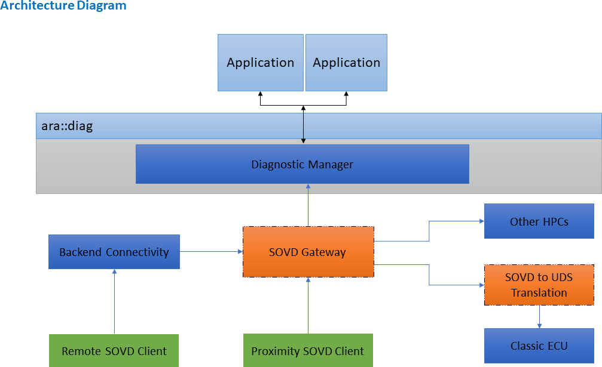

# **Contents**

# Introduction

This document contains explanation and description how to use the SOVD extensions in AUTOSAR Adaptive. In contrast to the AUTOSAR_SWS_Diagnostics this document does aim on providing a more general overview on the usage of SOVD inclduing a reference architecture, whereas the AUTOSAR_SWS_Diagnostics focuses describes the behavior of one individual SOVD server within this architecture.

SOVD is a modern API standardized by ASAM with the intent of accessing diagnostic information of a vehicle. The main motivation and principles of SOVD are:

- Central edge node
- Usage of state-of-the-art technologies
- Support of remote, proximity and in-vehicle diagnostics use case
- Independence from diagnostic data interpretation files such as ODX files
- Encapsulation of UDS (ISO 14229-1)
- Support of HPC use-cases

These principles lead to many new challenges that need to be addressed. Since SOVD clients shall only communicate with one central edge node, the entire vehicle must be abstracted by the SOVD API. For distributed E/E systems this leads to different re- quirements on different levels of the E/E architecture. Chapter 2 covers the challenges on bringing together one SOVD API in a distributes system. Therefore, a reference architecture will be presented with several functional blocks. Besides infrastructural challenges SOVD also introduces new use cases and defines APIs for existing use cases. AUTOSAR Adaptive aims to provide a native SOVD support by the Diagnostic Manager. Chapter 3 summarizes how different SOVD use cases are realized by the Diagnostic Manager and how SOVD coexists besides UDS (ISO 14229-1).

# SOVD reference architecture

Providing a central SOVD edge node in a distributed system does require some infras- tructural components. To achieve this a reference architecture that clusters functions into several blocks has been introduced. This architecture is displayed in Figure 1.

Main components of this reference architecture are:

- SOVD Gateway
- Diagnostic Manager
- SOVD to UDS Translation

{width="5.035in" height="3.0749989063867016in"}

**Figure 2.1: SOVD Reference architecture**

## SOVD Gateway

Upon request from a SOVD client the SOVD Gateway acts as SOVD edge node and routes the requests to respective internal SOVD endpoints. The routing takes place based on the entity part in the URI of the SOVD request. The SOVD Gateway must extract this part of the URI and route towards the corresponding endpoint. The setup of potential internal SOVD endpoints can be statically configured or dynamically dis- covered using mDNS. The forwarding itself takes place on application layer, i. e. the SOVD gateway acts as HTTP reverse proxy.

For the configuration of the SOVD Gateway the SOVDGatewayInstantiation has been introduced in the TPS_Manifest. This manifest allows to configure the external SOVD connection towards SOVD clients as well as the internal forwarding targets.

## Diagnostic Manager

Before the introduction of SOVD the Diagnostic Manager's main purpose was to handle diagnostic services and fault memory according to ISO 14229-1. With the introduction of SOVD the Diagnostic Manager also aims on natively supporting SOVD and therefore acts as SOVD server.

One of the main guiding principles for the introduction of SOVD was to reuse as much of existing functionality of UDS as suitable while not limiting the native support of SOVD.

On structural level the Diagnostic manager does allow multiple Diagnostic Server In- stances. This aims on keeping individual Software Clusters independent. Each Diag- nostic Contribution Set in the DEXT represents one Diagnostic Server Instance with an individual Diagnostic Address. This addressing principle was adapted by SOVD. The Diagnostic Manager itself represents a SOVD component, whereas each Diagnostic Server Instance is represented by a SOVD subcomponent.

Still the Diagnostic Manager acts as SOVD server and routing towards each subcom- ponent is handled within the Diagnostic Manager. For the configuration of this SOVD server the SOVDServerInstance has been introduced in the TPS_Manifest. The inter- nal behavior of the Diagnostic Manager does depend on the SOVD use case and will be discussed in detail in SWS Diagnostic.

## SOVD to UDS Translation

This functional block allows the translation of SOVD commands to UDS requests, based on predefined ODX definition of SOVD to UDS mapping. The details of this SOVD to UDS translation is defined by ASAM. This functional block shall be treated as an on-board test client and will send UDS requests to the target diagnostic address and send translated UDS responses to SOVD clients.

The complexity of this functional block from implementation point of view is high. But since ASAM has defined these details, AUTOSAR will just refer to ASAM standard at this point.

## Backend Connectivity

SOVD aims on supporting proximity, remote and in-vehicle diagnostics. SOVD has standardized proximity and in-vehicle access rather precisely by introducing mDNS. Standardizing remote access is rather difficult since many dependencies towards the backend infrastructure exist. This degree of freedom kept open by AUTOSAR.

Nonetheless a rather straightforward solution is possible by abstracting the backend connection by some backend connectivity functional block, which routes the SOVD requests towards the SOVD Gateway. Discovery of the SOVD Gateway by the Backend

Connectivity function block can be accomplished by using mDNS, while routing can be realized by HTTP forwarding.

3. # SOVD use cases

   1. ## SOVD use cases

This chapter focuses on describing how SOVD use cases on level of a Diagnostic Server Instance are designed and achieved.

## SOVD differentiation and new use-cases

A big portion of the SOVD use cases can be mapped in a straightforward fashion to existing UDS use cases. How this mapping has been done in the context of the Diagnostic manager is displayed in SWS Diagnostics.

For cases matching UDS (ISO 14229-1) one of the main principles was introduced: Reuse of the same port instance as used for the corresponding UDS service. This is especially convenient for designing applications since no further ports need to be integrated with redundant functionality. Also, for these kinds of implementations the same rules regarding reentrancy and parallel execution as for UDS apply.

SOVD handling of some use-cases may be sufficiently different from their UDS coun- terparts requiring differentiated requirements and mechanisms.

Also, in terms of methodology these SOVD methods are adopting the existing config- uration mechanism by using DEXT and only extending the DEXT at certain needed place. This matching has been done in the following way:

- SOVD data are derived from DiagnosticDataIdentifier
- SOVD configuration are derived from DiagnosticDataIdentifier
- SOVD operation are derived from DiagnosticRoutine
- SOVD fault are derived from DiagnosticTroubleCodeUDS

Since DiagnosticDataIdentifier are used for both SOVD data and configuration the stan- dardized categories SOVD_CONFIGURATION and SOVD_DATA were introduced.

Besides these configurable methods also two standardized modes have been intro- duced which match the existing ISO 14229-1 services 0x28 CommunicationControl and 0x85 ControlDTCSettings.

The static meta data needed for SOVD are derived from semantically corresponding DEXT and Manifest attributes. Details of this mapping is listed in the SWS_Diagnostics and in the TPS_Manifest.

For the dynamic data which is passed from application to the Diagnostic Master an interpretation must be done by the Diagnostic Master. This is a big contradiction to the UDS (ISO 14229-1) solution, where the Diagnostic Manager could simply pass the data towards the tester, which in return was parameterized. These dynamic data are

expressed in the DEXT by DiagnosticDataElements. For expressing the data interpre- tation the compuMethod within the SwDataDefProps of the DiagnosticDataElement is used. The Diagnostic Manager must then use this compuMethods to convert the byte stream from the application to valid SOVD JSON for the SOVD client and vice versa. Details on how this conversion shall be done is expressed in SWS_Diagnostics.

### SOVD specific use cases

Use cases that are exclusively for SOVD and find no match in ISO 14229-1 are also supported by the Diagnostic Manager. For these use cases new interfaces are intro- duced to the Diagnostic Manager that are exclusively used by SOVD. Currently two new interfaces have been introduced for Authorization and Proximity Challenge.

Additionally, the SOVD use case data-lists is handled by the Diagnostic Manager na- tively. Further SOVD specific use cases will be added in further releases.

### Authorization

Authorization in SOVD is handled using OAuth tokens that are part of the request header. When a request with OAuth token is received, the Diagnostic Manager uses the interface SovdAuthorization to request the encoded authorization role from the application. With this authorization role the Diagnostic Manager can determine whether the SOVD Client is authorized to perform the requested SOVD.

For the underlying roles, the existing DEXT model for Service 0x29 of ISO 14229-1 is used. Meaning the DiagnosticAuthRoles as well as the relation between Diagnostic AccessPermission and the individual SOVD methods (which have been mapped to the existing services as described in the SOVD section of the Diagnostic Manager).

## Proximity Challenge

SOVD proximity challenge is used by the SOVD server to challenge the client for prove of proximity before executing a SOVD operation. For this challenge, the new interface SovdProximityChallenge was introduced that hands the challenge procedure to the application and informs the Diagnostic Manager about the result. Based on the result the Diagnostic Manager will then perform the operation.

The configuration whether a SOVD operation does require a proximity challenge or not is also done by DEXT using a special data group (SDG). For details of this SDG see SWS_Diagnostics

## Limitations

- Identification of SW Clusters associated to SOVD entities.
- Deployment of routine and data elements deployed for UDS identified and asso- ciated to SOVD resources (SOVD/ASAM recommends but does not require that for elements exposed in SOVD and UDS that there should be a 1:1 mapping between a UDS service deployment and a SOVD resource).

  1. ## Unsupported use cases

With step I of the implementation of SOVD in AUTOSAR Adaptive, the mandatory SOVD features will be supported. In step 2, the optional use cases are planned to be added in R23-11.

# Example

As an example, providing all fault memory entries of a single ECU could be mentioned or even the fault memory entries of the entire vehicle.
