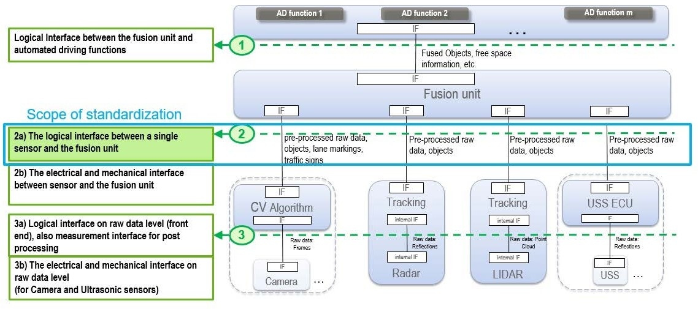
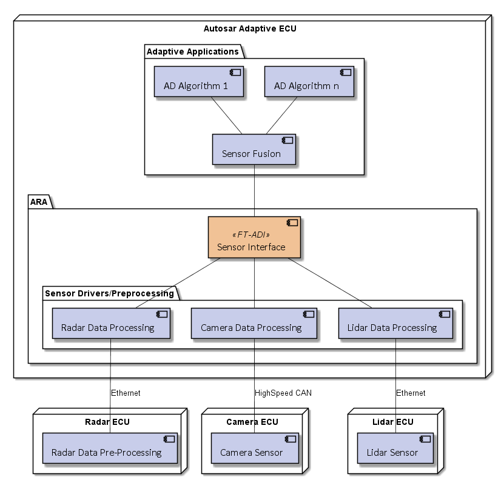
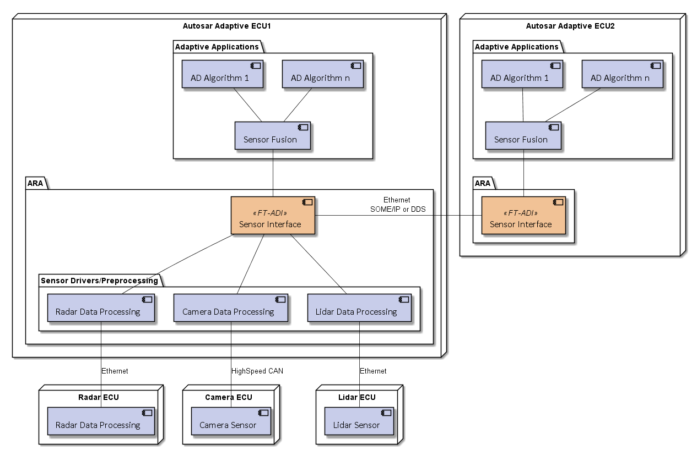
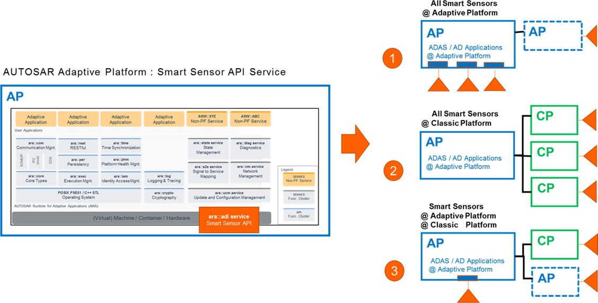
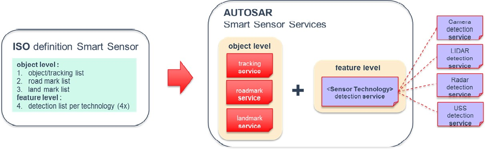

# Contents

**Known Limitations**

This explanatory document may contain assumptions, exemplary items, like exemplary reference models, use-cases, scenarios, and/or references to exemplary technical so- lutions, devices, processes or software. Any such assumptions or exemplary items are contained in this document for illustration purposes only, and they themselves are not part of the AUTOSAR standard. Neither their presence in such specifications, nor any later documentation of AUTOSAR conformance of products actually implementing such exemplary items, imply that intellectual property rights covering such exemplary items or assumptions are licensed under the same rules as applicable to the AUTOSAR standard.

List of limitations:

- the list of use cases contains the stable and relevant use cases from the devel- opment so far, further use cases will be added if needed
- detailed architecture and interface design is still in development
- this document will be extended with the chapter \"Interface Design\" which explains the rationale and design choices of the sensor interface
- the description of interface usage is scheduled for later releases

# Introduction and functional overview

A key point to meet the challenges of developing automated driving functions, espe- cially SAE J3016 automation level 3-5, is standardization: There is a huge potential in reducing development and validation costs by standardizing subsections of the com- plex hardware and software setup for automated driving functions. Sensors for detect- ing the vehicle environment and its connected environmental models are considered major enablers for automated driving. The current focus is on the standardization of sensor interfaces that serve as an input to environmental models or data fusion algo- rithms which in turn serve as the input for automated driving functions equal or greater than SAE level 3. Specifically, the focus is on interfaces for on-board sensors that can independently perceive their environment for performing safety critical tasks, e.g. camera, radar, lidar and ultrasonic sensors. This includes the actual measurement data as well as dynamically changing sensor performance values such as the currently estimated detection range. Other information sources like Car2X and maps are consid- ered as potential extensions. With the resulting standardized sensor interfaces, OEMs, suppliers, service providers and tool providers can reduce their costs and time for the development and validation of automated driving functions.

Automated driving functions in general are highly complex. To overcome the com- plexity, one way is to design the function for a specific use case, scenario or driving condition. For instance, an Autonomous Emergency Braking (AEB) system could be limited to operate only on highways with no oncoming or crossing traffic. Another AEB system could be designed to operate in urban environments as well which would in- clude oncoming and crossing traffic. In contrast to the highway-only AEB, the urban AEB could require an additional classification indicator from the sensor, e.g. to dis- tinguish between vehicles and pedestrians to better detect and track cross traffic. In general, many driving functions require similar or identical information from a sensor,

e.g. the sensor's mounting position. However, most driving functions additionally have specific requirements for the data and signals provided by the sensor.

Currently, the interfaces of sensors for automated driving functions are proprietary and differ between suppliers. Thus, the integration of a new sensor requires a lot of effort as both the semantic as well as the logical interface need to be specified and developed according to functional safety requirements. There is an ongoing standardization of the semantic interfaces in the ISO 23150\[[1](#_bookmark23)\], i.e. the ISO defines which sensor data or signals are mandatory or optional and how are they defined, e.g. in terms of coordinate systems and units. The standard defined by the ISO is used as the basis to specify logical sensor interfaces within AUTOSAR. From these interfaces, sensors and data fusion systems can be directly implemented.

For each sensor type like radar, lidar or camera, the ISO standard will contain lots of optional sensor data or signals in addition to the required signals, e.g. the classification of an object might be optional. During development of a driving function or data fusion system, a specific set of optional signals is selected by the function or data fusion developer according to the requirements of the driving function. To reduce develop- ment costs, especially in terms of functional safety, the set of optionals and thus the

resulting logical sensor interface are required to be fixed during design-time, i.e. the specified sensor signals must not suddenly disappear from the interface of the sensor during runtime of the system so that a data fusion system can rely on the presence of the specified signals. Vice versa, a sensor interface must not add additional signals during runtime, e.g. to not risk an unintentional behavior change due to the increased bandwidth requirements. There will be a specification within AUTOSAR to handle and specify the optional sensor data and signals during design-time.

## Intended audience

The document shall explain the motivation behind the standardization of the Sensor interface for autonomous driving for the AUTOSAR Adaptive platform as well as the usage and limitations of the interface. As this interface is an essential connection be- tween different stakeholders in future vehicle architecture and software, this document is intended for the users of the AUTOSAR Adaptive platform and people involved in system development with sensors for autonomous driving.

More specifically different roles and their motivation behind a sensor standardization for the AUTOSAR Adaptive platform is described in the following, structured by main technical aspects.

### System Designer

From a System Designer perspective including rapid prototyping, the expectation to- wards the sensor standardization is to rely on a comparable and extendable interface for different sensor types.

### System Engineer

From a System Designer and System Engineer perspective, the reuse of standardized communication protocols enables exchangability and compatibility between sensors from different suppliers and the target sensor fusion platform.

### System Integrator

From an Integrator and Application Developer perspective, the standardized descrip- tion of the interface and configuration is required for the generic, testable software implementation as well as the interoperability between implementations. Further AP Developers rely on the usable interface description for efficient fusion and algorithm implementation.

### Safety and Security Engineer

From a Safety and Security Engineer perspective, the interface has to be compatible to the standardized mechanisms and can be validated during development.

## Relation to other standards

The currently ongoing standardization of the international standard ISO 23150 \[[1](#_bookmark23)\] \"Road vehicles - Data communication between sensors and data fusion unit for au- tomated driving functions - Logical interface\" will be applicable to road vehicles with automated driving functions. It specifies the logical interface between smart in-vehicle sensors that sense the environment (e.g. camera, lidar, radar, ultrasonic, etc.) and the vehicle fusion unit. The interface is described in a modular, semantic representation allowing different types of sensor technologies and fusion concepts.

The \"Open Simulation Interface\" (OSI) is a generic software interface for the environmental perception of automated driving functions in virtual scenarios ([https://github.com/OpenSimulationInterface/open-simulation-interface)](https://github.com/OpenSimulationInterface/open-simulation-interface)). OSI ensures modularity, integrability and interchangeability of the individual components. These can be environment simulation models, sensor models, logical models for the detected en- vironment or sensor fusion and models for automated driving functions. Additional in- formations can be found on [https://opensimulationinterface.github.io/open-simulation](https://opensimulationinterface.github.io/open-simulation)- interface/.

**Figure 1.1: Overall approach for Sensor Interface Standardization considers different Standardization Levels**

The Open Simulation Interface and the Autosar ADI will support the ISO 23150 \[[1](#_bookmark23)\].

# Acronyms and Abbreviations

The glossary below includes acronyms and abbreviations relevant to the explanation of ara::adi.

# Automated Driving Sensor Use Cases

The following sections describe the main use case for the automated driving sensor standardization from the perspective of different stakeholders within the described pro- cess. Chapter [3.1](#use-case-1-sensor-supplier-interface) describes the main use case in detail and following use cases in chapters [3.2](#use-case-2-standardized-sensor-api) to [3.5](#use-case-5-sensor-implementation-testing) further detail the intention and restriction of scope for different stakeholders. Use case 6 in chapter [3.6](#use-case-6-sensor-simulation) extends the focus area to virtual sensor simu- lation.

## Use Case 1: "Sensor Supplier Interface"

**Table 3.1: Characteristic Information of UC1 "Sensor Supplier Interface"**

## Use Case 2: "Standardized Sensor API"

**Table 3.2: Characteristic Information of UC2 "Standardized Sensor API"**

## Use Case 3: "Sensor Fusion Algorithm"

**Table 3.3: Characteristic Information of UC3 "Sensor Fusion Algorithm"**

## Use Case 4: "Sensor Fusion Integration"

**Table 3.4: Characteristic Information of UC4 "Sensor Fusion Integration"**

## Use Case 5: "Sensor Implementation Testing"

**Table 3.5: Characteristic Information of UC5 "Sensor Implementation Tester"**

## Use Case 6: "Sensor Simulation"

**Table 3.6: Characteristic Information of UC6 "Virtual Sensor Simulation"**

# Scope of Sensor Interface Standardization

The standardization of sensor interfaces aims at creating a well accepted specifica- tion, that builds on and is compliant to the sensor interface specification released by the International Organization for Standardization (ISO). While the ISO specification mainly focuses on the semantic definition of interfaces for different sensors, the ADI specification of the AUTOSAR Adaptive platform covers all additional aspects to make it fully compliant to the Adaptive platform. This includes all syntactic elements for the implementation as well as additional functionalities like sensor configuration.

The following figure provides a high level view of the sensor interface standardization scope:

{width="6.164243219597551in" height="2.7354166666666666in"}

**Figure 4.1: Scope of Sensor Interface Standardization**

The following aspects of sensor interfaces are intentionally excluded from the specifi- cation, to not impose constraints:

- Mechanical and electrical interface
- Raw data level interface

For reading and writing Raw Data Streams an API for Adaptive applications is defined in SWS Communication Management.

The main boundary condition of the specification is that sensors are connected over a service interface to the AUTOSAR Adaptive computing unit.

The following figures show the basic sensor setups with the sensors directly connected to the AUTOSAR Adaptive ECU. The selection of sensors and connection interfaces is only given as an example.

{width="6.3190616797900265in" height="6.0225in"}

**Figure 4.2: AD sensors directly connected to ECU**

In addition, it shall be possible to provide sensor data from one Adaptive ECU to an- other one as shown in the following scenario.

{width="6.325in" height="4.09in"}

**Figure 4.3: AD sensors connected via a second AUTOSAR AP ECU**

# Sensor Interface API Design

This chapter outlines the rationale about the current Interface API design proposal for Smart Sensors.

## Sensor Interface realization as a Service

The decision has been taken to realize the Sensor Interface as a Service. The principal reason for this is to universally offer Sensor services within a vehi- cle deployed on different AUTOSAR platforms (Classic and Adaptive). This sup- ports the major future sensor architectures as presented in the figure below.

{width="5.7575in" height="2.9246872265966752in"}

**Figure 5.1: Future Architectures for Smart Sensor APIs**

NB: this figure does not present a valid scenario in which a Classic platform may run ADAS/AD applications.

## ISO mapping to Sensor Services

ISO has defined the syntax and content of Smart Sensors. These are object level lists for tracking, roadmark and landmark independent from the sensor technology. In addition, there is a sensor technology dependent feature list for detection. The Sensor Service design directly maps this structure. Therefore each Smart Sensor offers a tracking, roadmark and landmark service plus a detection service dependent on the sensor technology. The figure below presents the ISO lists mapping to Sensor services.

{width="6.06in" height="1.8699989063867017in"}

**Figure 5.2: ISO mapping to Smart Sensors Services**

## Sensor Service Template

The individual Service template design of Smart Sensors has faced the challenge that the ISO lists contain a lot of optional elements. This means a service template has mandatory and optional elements. The key assumption here is that the optional ele- ments are known and fixed at design time by Sensor providers and users.

There is a service capability vector indicating which optional element is provided by the Sensor. In addition, the same type of sensor may have different performance, i.e. also possible to use different data type resolutions with the same capability setting. This means a service template has different profiles e.g. Low and High profile. The figure below presents the conceptual view of this service template with capability vector and service profiles.

ISO optionals : A B C D E F H

**Figure 5.3: Service Template with Capability vector and service profiles**

The service compatibility between sensor service provider and users are checked ei- ther by the integrator in the deployment phase or by the user during the service discov- ery phase. The sequence diagram below outlines the vector capability checking during the service discovery phase. After the service provider has offered its service, the user will register to it. Then the user will request the capability vector from the provider to check that the required optional elements are provided by service of the sensor. If the required optional elements are supported (provided), the client will subscribe to the service and process the data package according to the setting of the capability vector. The Service Provider and User Code does not check optional status after the checking in the initialization phase.

CAP = 1101

**Figure 5.4: Service Registering flow for capability vector checking**

## Interface stability

One of the driving factors for autonomous driving is the availability of suitable sensors for an affordable price. Out of this reason the research and development in this area is huge. New sensors, new accuracy possibilities or just higher sampling rates make it hard to define an interface that lasts a very long time.

## Interface configuration

The configuration of the sensor interface connectivity can happen at three different times:

- Design time

An architect or developer specifies the whole system and configures all connec- tions. Then the interface bindings are generated and the whole software is com- piled and flashed to the complete environment. This might also require software updates of sensors.

- Connection time

When the system is specified and the connections are configured, it is possible to specify more than one interface version for a connection. In other words the configuration is not complete at 'design time'. This implies that a service might have to implement several versions of an interface. If the system is powering up, the client initiates a handshake and determines the most suitable interface version for the connection. When this process is finished, the system initiates a final check to validate the complete configuration. Then, the same safety level can be reached as with the design time approach.

- Runtime

Clients can connect to any available interface during runtime of the system. This creates a huge amount of flexibility but also the deterministic behaviour of the system decreases. For example the bandwidth usage of a connection cannot be guaranteed without additional countermeasures. This complicates the safety analysis as more configuration variants have to be evaluated.

The conclusion is that the runtime approach is not suitable for an autonomous system as the safety analysis will get too complex and the costs will increase significantly.

Design time configuration was used over decades and a lot of experience exists to create safe systems. Nevertheless, due to the fact that the interfaces might experience a high amount of changes during the next years, more flexibility is appreciated. If this is not introduced in the overall design, workarounds will be created to overcome this limitation.

Therefore the idea is to use connection time configuration to provide the flexibility that is mandatory to simplify the development and to avoid workarounds.

Here are some potential future use-cases that show the necessity for flexibility:

- A new sensor supports additionally the last generation interface to act as a space part.
- A new interface can be added to a sensor without affection the existing system. This is especially useful during development time when a new interface shall be tested in a working environment.
- Several new interfaces can be tested in parallel or in tight schedule without re- compilation and re-flashing of the whole system.

There might also be new features for a sensor that might affect the interface. One example could be the ultrasonic sensor. Currently the sensor has one beam and the interface provides the distance to the object. This is used e.g. in the park distance control. In future, there might be sensors that support more beams. The interface will

be adapted to provide the beam directions and the corresponding distances. Then, it might be a good idea to calculate a virtual single beam out of the multi beam informa- tion and to provide this information with the old interface. Then, the sensor supports the new and the old interface in parallel. A modern automatic parking software will be adapted to the new interface to use the full capabilities but the park distance control can still use the old interface and does not need to be changed. In addition the new sensor might act as replace part for already developed systems.

# References

[]{#\_bookmark23 .anchor}\[1\] ISO-23150 Road vehicles--Data communication between sensors and data fusion unit for automated driving functions--Logical interface
