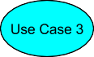

# Contents

7. # Functional specification

   1. ## General description

The AUTOSAR Adaptive architecture organizes the software of the AUTOSAR Adaptive foundation as functional clusters. These clusters offer common functionality as services to the applications. The Communication Management (CM) for AUTOSAR Adaptive is such a functional cluster and is part of \"AUTOSAR Runtime for Adaptive Applications\" ARA. It is responsible for the construction and supervision of communication paths between applications, both local and remote.

The CM provides the infrastructure that enables communication between Adaptive AUTOSAR Applications within one machine and with software entities on other machines, e.g. other Adaptive AUTOSAR applications or Classic AUTOSAR SWCs. All communication paths can be established at design, start-upor run-time.

This specification includes the syntax of the API, the relationship of API to the model and describes semantics, e.g. through state machines, and assumption of pre-, postconditions and use of APIs. The specification does not provide constraints on the SW architecture of a platform implementation, so there is no definition of basic software modules and no specification of implementation or internal technical architecture of the Communication Management.

### Architectural concepts

The Communication management of AUTOSAR Adaptive can be logically divided into the following sub-parts:

- Language binding
- End-to-end communication protection
- Communication / Network binding
- Communication Management software

**Figure 7.1:** **Technical Architecture of Communication Management**

In the context of Communication Management, the following types of interfaces are defined:

- Public Application Interface: Part of the Adaptive AUTOSAR API and specified in the SWS. This is the standardized ara::com API.
- Functional Cluster Interactions: Interaction between functional clusters. Not normative, intended to make specification more readable and to support integration of SW into demonstrator. (dotted arrow in [7.1](#_bookmark3)) And also interactions between elements within a functional cluster. Not used in specifications, so it is a nonstandardized interface. Used for communication inside Communication Management software (grey arrow in [7.1](#_bookmark3))

Please note, that Language Binding and Communication Binding depend on a specific configuration by the integrator, but they need to be deployed within the application binary. This results in the fact that the serialization of the Communication Binding will run in the execution context of the Adaptive Application.

For the design of ARA API the following constraints apply:

- Support the independence of application software components
- Use of Service-oriented communication without dependency on a specific communication protocol
- Make the API as lean as possible, neither supporting very specific use cases which could also be done on top of the API, nor supporting component model or higher level concepts. The API is restricted to support core communication mechanisms.
- Support for dynamic communication:

  No discovery by application middleware, the clients know the server but the Server does not know the clients. Event subscription is the only dynamic communication pattern in the application.
  Full service discovery in the application. No communication paths are known at configuration time. An API for Service discovery allows the application code to choose the service instance.
- Support both Event/Callback and Polling style usage of the API to enable classic RTE style paradigms. To support high determinism demands in case of callbackbased / event-based interaction, there shall be the possibility to avoid uncontrolled context switches.
- Support both synchronous callback-based communication and asynchronous communication philosophy.
- Support of client/server communication.
- Support of sender/receiver communication with queued semantics where the receiver caches are configurable.
- Support of selection of trigger conditions for task activation.
- Extensions for security.
- Extensions for Quality Of Service QoS.
- Scalability for real-time systems.
- Support of built-in end-to-end communication protection, where a use-casespecific behavior can be done on top of ARA API.

  1. ### Design decisions

The design of the ARA API covers the following principles:

- It uses the Proxy/Skeleton pattern:

  The (service) proxy is the representative of the possibly remote (i.e. other process, other core, other node) service. It is an instance of a C++ class local to the application/client, which uses the service.
  The (service) skeleton is the connection of the user provided service implementation to the middleware transport infrastructure. Service implementation class is derived from the (service) skeleton.
  Beside proxies/skeletons, there might exist a so-called \"Runtime\" (singleton) class to provide some essentials to manage proxies and skeletons. But this is communication management software implementation specific and therefore not specified in this document, but may be specified in a future version.

Regarding proxy/skeleton design pattern in general and its role in middleware implementations, see [9] [10].

- It supports callback mechanisms on data reception.
- The API has zero-copy capabilities including the possibility for memory management in the middleware.
- It is aligned with the AUTOSAR service model (services, instances, events, methods, \...) to allow the generation of proxies and skeletons out of this model.
- Full discovery and service instance selection support on API level.
- Client/Server Communication uses concepts introduced by C++11 language, e.g. std::future, std::promise, to fully support method calls between different contexts.
- Abstract from SOME/IP specific behavior, but support SOME/IP service mechanisms, as methods, events and fields.
- Support/implement the standard end-to-end protection protocols, as specified in

[7] and [4].

- Support of Service contract versioning.
- Support Event and Polling style usage of the API equally to enable classic RT style paradigms.
- Fully exploit C++11/14 features in API design to provide usability and comfort for the application developer.

See ARAComAPI explanatory [1] for more details and explanations on the ARA API design.

### Communication paradigms

Service-Oriented Communication (SoC) as a part of Service-Oriented Architecture (SOA) [11] is the main communication pattern for Adaptive AUTOSAR Applications. It allows establishing communication paths both at run-time, so it can be used to build up dynamic communication with unknown number of participants. Figure [7.2](#_bookmark8) shows the basic operation principle of Service-Oriented Communication.

**Figure 7.2:** **Service-Oriented Communication**

Service Discovery decides whether external and internal service-oriented communication is established. The discovery strategy shall allow either returning a specific service instance or all available instances providing the requested service at the time of the request, no matter if they are available locally or remote. The Communication Management software should provide an optimized implementation for both the Service discovery and the communication connection, depending on the location where the service provider resides. More about Service Discovery can be found in *SOME/IP Service Discovery Protocol Specification* [12].

The service class is the central element of the Service-Oriented Communication pattern applied in Adaptive AUTOSAR. It represents the service by collecting the methods and events which are provided or requested by the applications implementing the concrete service functionality.

### Service contract versioning

In Service Oriented Architecture (SOA) environments the client and the provider of a service rely on a contract which covers the service interface and behavior. The interface and the behavior of a service may change over time. Therefore, service contract versioning has been introduced to differentiate between the different versions of a service.

{width="5.627187226596676in" height="1.5709372265966755in"}

**Figure 7.3: Service contract versioning over time**

The AUTOSAR Adaptive platform supports service contract versioning. The service contract versioning is separated between the design phase and the deployment phase. This means that any service at design level may have its own version number which is mapped to a version number of the used network binding and vice versa. The mapping process is manually done by the service designer or integrator.

{width="6.290103893263342in" height="4.225in"}

**Figure 7.4: Service contract versioning flow**

Note:

1. The contract version of a ServiceInterface consists of a majorVersion and a minorVersion number. The majorVersion number indicates backwardsincompatible service changes. The minorVersion number indicates backwardscompatible service changes.

   for backwards-incompatible interface or behavior changes the majorVersion

number is increased and the minorVersion number is set to 0.

- for backwards-compatible interface or behavior changes the majorVersion

number is unchanged and the minorVersion number is increased.

2. The contract version of a ServiceInterface is mapped to a version of the ServiceInterfaceDeployment. This version mapping may be done several times resulting in several ServiceInterfaceDeployments for the same ServiceInterface. Such a mapping will result in unambiguous identification on each VLAN according to the [constr_1723] in [6].

**[SWS_CM_99003]**{DRAFT} *[*The version of ServiceInterfaceDeployment shall be evaluated by the Service Discovery in terms of backwards-compatibility based on the used network binding for service connection.*♩(RS_CM_00500, RS_CM_00501, RS_CM_00700)*

1. ## Raw Data Streaming

   1. ### Raw Data Streaming Interface

In some cases it is necessary for the application software to be able to process raw binary data streams sent over a communication channel. In a raw binary data stream the data is not typed, and is handled as a continuing sequence of bytes. So serialization of the data is not necessary. This section specifies an interface as part of ara::com to support processing of raw binary data streams, as an alternative to SOME/IP.

The interface is statically defined and independent of the underlying network protocol. However, currently the modeling for the Raw Data Streaming Interface only supports TCP/IP sockets as transport layer. Both unicast and multicast socket connections shall be supported. The sockets can use both TCP or UDP as transport protocol. TCP is the natural choice for RawDataStreams since it is a reliable stream oriented protocol. However, UDP shall also be supported when an unreliable connection is acceptable for the application.

The operations of the interface are synchronous. The default behavior is blocking, but a timeout handling shall be implemented to return the call with an error if the operation takes too long. The timeout values are applied as parameters to each operation. See the description for each operation below on how the timeout handling is applied.

The integration of the Raw Data Streaming Interface and Adaptive Applications is done in the deployment phase, by specifying various attributes and parameters for the socket connections that shall be used for the Raw Data Stream, using RawDataStreamMapping and EthernetRawDataStreamMapping. The model and the parameters are described in *TPS_ManifestSpecification* [6].

Secure communication can be achieved by applying TLS or IPSec protocols in the middleware. Also access control imposed by the IAM can be applied for Raw Data

Streams. All security functions are configurable in the deployment and mapping model of Raw Data Streaming Interface, see *TPS_ManifestSpecification* [6].

For safety critical applications wanting to use RawDataStreaming, a safety analysis needs to be done by the application developer, to find relevant communication faults for the stream data. If a protection of data exchange algorithm is needed, such as E2E protection, this will not be provided in the RawDataStream interface, but is to be implemented in the application layer that is using the RawDataStream interface. This is because only raw data with no data type information is transferred over the RawDataStream.

An application can use the Raw Data Streaming API both as a client (connecting to a listening Raw Data Streaming service) or server (waiting for incoming connections from clients).

Figure [7.5](#_bookmark12) shows the logical view of the usage of RawDataStream instances.

{width="6.046874453193351in" height="3.276561679790026in"}

**Figure 7.5:** **Raw Data Stream Logical View.**

### Limitations

The current solution does not support any runtime variance in terms of network topology, such as service discovery functionality, which means that the RawDataStreams has to be configured statically on the same ECU as the application. Dynamic configuration and runtime functionality will be added in future releases if needed.

The multicast support is limited to one-to-many, i.e. a server can send data to multiple clients using multicast, but only receive data from one client, using the unicast

address. Also multicast shall only be used with UDP. For TCP connections, only 1-to-1 connections are supported, i.e. multiple clients to one server is not supported.

### Use cases

The RawDataStream interface can be used in the following set-ups:

- Client (connect to) to an external non-AUTOSAR sensor providing raw data on a socket connection.
- Server (wait for a connection from) for an external non-AUTOSAR sensor providing raw data on a socket connection.
- Client or Server for another AUTOSAR external RawDataStream instance.

RawDataStream socket connections can be setup for UDP or TCP, Unicast or Multicast. Currently the use cases in fig [7.6](#_bookmark15) are supported.

{width="1.8246576990376202in" height="0.14583333333333334in"}{width="0.5989577865266842in" height="0.3645833333333333in"} {width="0.6273129921259842in" height="6.635389326334208e-2in"}

{width="0.5989577865266842in" height="0.3645833333333333in"}{width="0.6323228346456693in" height="6.499890638670167e-2in"}{width="4.205056867891513in" height="1.0208333333333333in"}{width="0.5989577865266842in" height="0.3645833333333333in"}{width="1.8231200787401576in" height="8.333333333333333e-2in"}{width="0.6075142169728784in" height="0.3697911198600175in"}{width="3.961777121609799in" height="8.333333333333333e-2in"}


{width="2.451048775153106in" height="0.14583333333333334in"}

**Figure 7.6:** **The currently supported use cases for Raw Data Streams, and which artifacts in the Deployment model that shall be used to configure the different use cases**

### Raw Data Streaming

For the Raw Data Stream C++ API reference, see chapter 8.1.3.21.

**[SWS_CM_10476] Defining a RawDataStream** *[*To open a RawDataStream connection a RawDataStream instance is created. The constructor creates the necessary socket data structures for RawDataStream Communication, using the artifacts specified in the mapped EthernetRawDataStreamClientMapping and EthernetRawDataStreamServerMapping.*♩(RS_CM_00410, RS_CM_00411, RS_CM_00412)*

### [SWS_CM_99004] {DRAFT} Ethernet endpoint configuration *[*

Ethernet socket connections are statically configured in the Deployment model as part of the Service Instance Manifest, and used throughout the connected session for the RawDataStreams communication. The following configuration elements can be specified on the Deployment model of each RawDataStreamClient or RawDataStreamServer instance, identified through the InstanceSpecifier provided to the constructor.

RawDataStreamClient endpoint and credentials configuration elements:

- Local Network Endpoint: EthernetRawDataStreamClientMapping.localCommConnector
- Local UdpPort: EthernetRawDataStreamClientMapping.localUdpPort
- Local TcpPort: EthernetRawDataStreamClientMapping.localTcpPort
- Socket Options: EthernetRawDataStreamClientMapping.socketOption
- (D)TLS properties: EthernetRawDataStreamClientMapping.tlsSecureComProps
- Remote Unicast Credentials: EthernetRawDataStreamClientMapping. unicastCredentials (UDP/TCP)
- Multicast Credentials: EthernetRawDataStreamClientMapping.multicastCredentials (UDP only)

RawDataStreamServer endpoint and credentials configuration elements:

- Local Network Endpoint: EthernetRawDataStreamServerMapping.localCommConnector
- Local UdpPort: EthernetRawDataStreamServerMapping.localUdpPort
- Local TcpPort: EthernetRawDataStreamServerMapping.localTcpPort
- Socket Options: EthernetRawDataStreamServerMapping.socketOption
- (D)TLS properties: EthernetRawDataStreamServerMapping.tlsSecureComProps
- Remote Unicast Credentials: EthernetRawDataStreamServerMapping. unicastUdpCredentials (UDP only)
- Multicast Credentials: EthernetRawDataStreamServerMapping.multicastCredentials (UDP only)

For the RawDataStreamClients the following shall apply:

- Remote server credentials for unicast communication must always be defined for the client. The Unicast remote server credentials are configured in RawDataStreamEthernetTcpUdpCredentials aggregated by the EthernetRawDataStreamClientMapping in the role unicastCredentials.
- A tcpPort and udpPort shall not be defined in the same RawDataStreamEthernetTcpUdpCredentials element.
- If a TcpPort is defined in the EthernetRawDataStreamClientMapping.unicastCredentials, these credentials are used for Connect() calls to establish the connection to the server.
- This unicast connection shall always be used for WriteData() calls to send data to the server (for both UDP and TCP).
- If Multicast Credentials are defined for the client, the RawDataStream shall bind and join the multicast address and udpPort given in the MulticastCredentials. The MulticastCredentials is configured in RawDataStreamEthernetUdpCredentials aggregated by the EthernetRawDataStreamClientMapping. This multicast socket connection shall be read from when ReadData() is called.
- If no MulticastCredentials are defined for the client, the Unicast Remote Credentials shall also be used for ReadData() calls.

For the RawDataStreamServers the following shall apply:

- If Multicast Credentials is defined for the server, a multicast connection shall be created using the Multicast Credentials which are configured in RawDataStreamEthernetUdpCredentials aggregated by the EthernetRawDataStreamServerMapping in the role multicastCredentials. Then the data is sent on this multicast socket when WriteData() is called.
- If Remote Unicast Credentials are defined for the server, a unicast socket shall be created using the Unicast Credentials which are configured in RawDataStreamEthernetUdpCredentials aggregated by the EthernetRawDataStreamServerMapping in the role unicastUdpCredentials. Then the data is sent on this unicast socket when WriteData() is called.
- The local credentials defined in EthernetCommunicationConnector shall always be used to create a unicast socket and read data from a client when ReadData() is called on the server side. If no local credentials are defined, reading of data from the server cannot be performed, and an error kStreamNotConnected will be returned.
- If a localTcpPort is defined in EthernetRawDataStreamServerMapping, the credentials defined in EthernetCommunicationConnector are used to create, bind, and listen to the socket used for TCP communication when the constructor of RawDataStream is called. Then the server accepts incoming connection requests when WaitForConnection() is called.

*♩(RS_CM_00410, RS_CM_00411, RS_CM_00412)*

**[SWS_CM_90216]**{DRAFT} **Socket Options configuration** *[*For both RawDataStreamClients and RawDataStreamServers a list of socket options can be defined in the attribute socketOption to be applied to the sockets created for unicast or multicast communication. The options shall be specified as a list of strings. The accepted values are platform specific and shall be documented by the vendor.*♩(RS_CM_00410, RS_CM_00411, RS_CM_00412)*

An example of socketOption definition is to provide a series of \"option\", \"value\" pairs for POSIX socket level options, e.g.: [\"SO_KEEPALIVE\", \"1\", SO_RCVBUF\",\"1024\"]

**[SWS_CM_90217]**{DRAFT} **TLS properties configuration** *[*For both RawDataStreamClients and RawDataStreamServers (D)TLS properties can be defined in the attributes tlsSecureComProps to configure usage of TLS to create secure UDP and TCP channels for the RawDataStreams according to the Transport Layer Security protocol. See [[SWS_CM_90211](#_bookmark302)]*♩(RS_CM_00410, RS_CM_00411)*

Note: Usage of (D)TLS is restricted to 1:1 socket connections (use case 1 and 2 of figure [Figure](#_bookmark15) [7.6](#_bookmark15)).

The functionality of a RawDataStream for Client communication is realized in these four operations: Connect, Shutdown, ReadData and WriteData. A RawDataStream for Server Communication is realized in these four operations: WaitForConnection, Shutdown, ReadData and WriteData.

**[SWS_CM_10477] Connect stream link** *[*Each invocation of the Connect operation for a TCP socket connection shall establish a communication link with a remote server that is listening for socket connections, The socket created in the RawDataStream instance shall be used for the connection. For UDP socket connections Connect shall do nothing.*♩(RS_CM_00410, RS_CM_00411, RS_CM_00412)*

**[SWS_CM_99005]**{DRAFT} **Wait for incoming connections** *[*Each invocation of the WaitForConnection operation shall wait for and accept incoming requests for establishment of a TCP communication link with a connecting remote client. The socket created and prepared in the RawDataStream instance shall be used for the connection. For UDP socket connections WaitForConnection shall do nothing.*♩(RS_CM_00411, RS_CM_00412)*

**[SWS_CM_10478] Shutdown stream link** *[*Each invocation of the Shutdown operation shall destroy the communication link for the stream.*♩(RS_CM_00410, RS_CM_00411, RS_CM_00412)*

**[SWS_CM_10479] Read data from stream** *[*Each invocation of the ReadData operation shall request to read a number of bytes from the stream. The read data shall be

moved to a buffer returned as result from the function, together with the actual number of bytes transferred.*♩(RS_CM_00410, RS_CM_00411, RS_CM_00412)*

**[SWS_CM_10480] Write data to stream** *[*Each invocation of the WriteData operation shall request to write a number of bytes to the stream and send it out on the socket connection. The actual number of bytes transferred shall be returned. It shall be possible to apply a timeout value for the operation. The operation shall write the data to the socket or internal buffer, and then return with the number of bytes written. For efficiency, the Write operation does not wait until data is actually sent on the bus, but the TCP data flow handling shall make sure that data is transmitted and received in the correct order. For UDP connections the order cannot be guaranteed.*♩(RS_CM_00410, RS_CM_00411, RS_CM_00412)*

**[SWS_CM_99006]**{DRAFT} **Timeout handling** *[*For all Connect, WaitForConnection, Read and Write RawDataStream operations a timeout value can be specified via a parameter in runtime. If no timeout parameter is given the operation shall block. If a timeout value is specified, and the operation does not finish within the specified time, an error code RawErrc::kCommunicationTimeout shall be returned and the technical state of the RawDataStream connection shall be restored to the same as before the call was made.*♩(RS_CM_00410, RS_CM_00411)*

## Communication Group

The Communication Group is a communication concept based on ara::com which is designed for Adaptive State Management applications. It can be seen as a composite Service which manages information routing in a defined manner. A Communication Group has one server and multiple clients. The server is able to send broadcast and peer to peer messages to the clients of a Communication Group. The clients can acknowledge these messages. The server of a Communication Group can further verify how many clients are connected to the Communication Group at every time. Applications can connect/disconnect to a Communication Group instance using one of the two Communication Group Service Interfaces, CommunicationGroupServer or CommunicationGroupClient.


**Figure 7.7: Communication Group**

### Interfaces

The Communication Group uses two Service interfaces, one for a Communication Group Server and one for Communication Group clients.

### Communication Group Server

**[SWS_CM_99000]**{DRAFT} **CommunicationGroupServer Service** *[*A Communication Group shall provide a CommunicationGroupServer Service to be used by the Server of a Communication Group.*♩(RS_CM_00600, RS_CM_00601)*

**[SWS_CM_99001]**{DRAFT} **Broadcast method of CommunicationGroupServer Service** *[*The CommunicationGroupServer Service shall provide the method broadcast to broadcast messages to the clients of the Communication Group. This method shall take as input parameter the message to be broadcasted. In case the boardcast method fails the method return shall provide an error code as specified in [[SWS_CM_99024](#_bookmark506)].*♩(RS_CM_00600, RS_CM_00601)*

The C++ signature below presents the resulting boardcast method of a generated Service Proxy/Skeleton interface.

template \<typename T\>

ara::core::Future\<void\> broadcast (const T& msg);

**[SWS_CM_99002]**{DRAFT} **Peer To Peer Message method of CommunicationGroupServer Service** *[*The CommunicationGroupServer Service shall provide a method message to send a message to a dedicated client of the Communication Group. This method shall take as input parameters the message to be sent, and the clientID of the client which shall be addressed. In case the message method fails the method return shall provide an error code as specified in [[SWS_CM_99024](#_bookmark506)].*♩ (RS_CM_00600, RS_CM_00601)*

The C++ signature below presents the resulting message method of a generated Service Proxy/Skeleton interface.

template \<typename T\>

ara::core::Future\<void\> message (std::uint32_t clientID, const T& msg);

**[SWS_CM_99014]**{DRAFT} **Message Response event of CommunicationGroupServer Service** *[*The CommunicationGroupServer Service shall provide an event response that contains the respond of a dedicated client to a broadcast or a peer to peer message of the Communication Group. The event shall provide the response message and the clientID of this response.*♩(RS_CM_00600, RS_CM_00601)*

The C++ signature below presents the resulting event response message of a generated Service Proxy/Skeleton interface.

template \<typename R\> struct Response {

std::uint32_t clientID; const R& responseMsg

}

**[SWS_CM_99015]**{DRAFT} **List Clients method of CommunicationGroupServer Service** *[*The CommunicationGroupServer Service shall provide a method listClients to report about the connected clients of the Communication Group. This method shall have no input parameters and shall return the list of clients. In case the listClients method fails the method return shall provide an error code as specified in [[SWS_CM_99024](#_bookmark506)].*♩(RS_CM_00600, RS_CM_00601)*

The C++ signature below presents the resulting listClients method of a generated Service Proxy/Skeleton interface.

ara::core::Future\<ara::core::Vector\<std::uint32_t\>\> listClients();

### Communication Group Client

**[SWS_CM_99007]**{DRAFT} **CommunicationGroupClient Service** *[*The clients of a Communication Group shall provide a CommunicationGroupClient Service to be used by a Communication Group.

*♩(RS_CM_00600, RS_CM_00601)*

**[SWS_CM_99008]**{DRAFT} **Message method of CommunicationGroupClient Service** *[*The CommunicationGroupClient Service shall provide a method message for the client to receive a message from the Communication Group. This method shall take as input parameter the message. In case the message method fails the method return shall provide an error code as specified in [[SWS_CM_99024](#_bookmark506)].*♩(RS_CM_00600, RS_CM_00601)*

The C++ signature below presents the resulting message method of a generated Service Proxy/Skeleton interface.

template \<typename T\>

ara::core::Future\<void\> message (const T& msg);

**[SWS_CM_99009]**{DRAFT} **Message Response event of CommunicationGroupClient Service** *[*The CommunicationGroupClient Service shall provide an event response for the client to send a response message to the Communication Group. The event shall provide the response message.*♩(RS_CM_00600, RS_CM_00601)*

The C++ signature below presents the resulting event response message of a generated Service Proxy/Skeleton interface.

template \<typename R\> const R& responseMsg;

### Behavior

The Communication Group performs the following tasks to enable a Communication Group.

**[SWS_CM_99010]**{DRAFT} **Broadcast task** *[*A Broadcast task shall be triggered by the broadcast method of the CommunicationGroupServer Service. The CommunicationGroup shall forward this broadcast message to all connected clients by calling the message method of the CommunicationGroupClient Service from each connected client.*♩(RS_CM_00600, RS_CM_00601)*

**[SWS_CM_99011]**{DRAFT} **Peer To Peer message task** *[*A Peer to Peer message task shall be triggered by the message method (which includes the client address) of the CommunicationGroupServer Service. The CommunicationGroup shall forward

this message to the addressed client by calling the message method of the CommunicationGroupClient Service of this client.*♩(RS_CM_00600, RS_CM_00601)*

**[SWS_CM_99012]**{DRAFT} **Message Response task** *[*The Message Response task shall be triggered by the message response event of the CommunicationGroupClient Service from a client . The CommunicationGroup shall forward this response message with the client source address to the message response event of the CommunicationGroupServer Service.*♩(RS_CM_00600, RS_CM_00601)*

**[SWS_CM_99013]**{DRAFT} **List Clients task** *[*The List Clients task shall be triggered by the list clients method of the CommunicationGroupServer Service. The CommunicationGroup shall provide the list of all connected client addresses with the return of the list clients method of the CommunicationGroupServer Service.*♩ (RS_CM_00600, RS_CM_00601)*

### Connection

The connection and disconnection to Communication Group is performed by standard

ara::com functions.

### Communication Group Server

The Server of a Communication Group connects to a Communication Group by connecting to the CommunicationGroupServer Service of this Communication group (using FindService or StartFindService).

**[SWS_CM_99016]**{DRAFT} **Connection Status of a Communication Group Server** *[*The Server of the Communication Group shall be considered to be connected if the server has successfully subscribed to the response message response event of the CommunicationGroupServer Service, else the Server shall be considered not connected.*♩(RS_CM_00600, RS_CM_00601)*

### Communication Group Client

A Communication Group client connects to a Communication Group by offering the CommunicationGroupClient Service. A Communication Group client disconnects to a Communication Group by stop offering the CommunicationGroupClient Service.

### Limitations

The Communication Group concept has the following limitations:

- There is only one Server for an instance of a Communication Group at a given time.
- A Client provides the CommunicationGroupClient Service to only one instance of a Communication Group at a given time.

The figure below outlines a connection example for a Communication Group.

{width="5.278894356955381in" height="2.4870833333333335in"}

**Figure 7.8: Communication Group connection example**

### Communication Group Model

The model of Communication Group is labeled by one of three standard ServiceInterface.category values. See also the *TPS_ManifestSpecification* [6].

**[SWS_CM_99017]**{DRAFT} **category value COMMUNICATION_GROUP** *[*The ServiceInterface.category value COMMUNICATION_GROUP shall be used to define a Communication Group template.*♩(RS_CM_00600, RS_CM_00601)*

### [SWS_CM_99018] {DRAFT} category value COMMUNICATION_GROUP_SERVER

*[*The ServiceInterface.category value COMMUNICATION_GROUP_SERVER shall be used to define CommunicationGroupServer service.*♩(RS_CM_00600, RS_CM_00601)*

### [SWS_CM_99019] {DRAFT} category value COMMUNICATION_GROUP_CLIENT

*[*The ServiceInterface.category value COMMUNICATION_GROUP_CLIENT shall be used to define CommunicationGroupClient service.*♩(RS_CM_00600, RS_CM_00601)*

The figure below presents the relations between these category values.

\<\<derive\>\>

**Figure 7.9: Communication Group service interface categories**

### Communication Group Creation

A Communication Group is created by defining a Communication Group template

only.

**[SWS_CM_99020]**{DRAFT} **Communcation Group template** *[*The Communication Group template is a ServiceInterface of type CommunicationGroupClient with the category value COMMUNICATION_GROUP. It shall be used to define a Communication Group, where:

- The SHORT-NAME of this template shall define of the name of the Communication Group.
- The event definition according to [[SWS_CM_99009](#_bookmark24)] shall define the data type of the message responses of the Communication Group.
- The method definition according to [[SWS_CM_99008](#_bookmark23)] shall define the data type of the messages of the Communication Group.

*♩(RS_CM_00600, RS_CM_00601)*

Based on the Communication Group template [[SWS_CM_99020](#_bookmark32)] the ServiceInterfaces for the CommunicationGroupServer [[SWS_CM_99000](#_bookmark20)] and the CommunicationGroupClient [[SWS_CM_99007](#_bookmark22)] can be generated/derived.

**[SWS_CM_99021]**{DRAFT} **SHORT-NAME value of generated CommunicationGroupServer service** *[*The SHORT-NAME value of generated Communication-

GroupServer service shall be the SHORT-NAME of the according Communication Group template concatenated by the name Server.*♩(RS_CM_00600, RS_CM_00601)*

**[SWS_CM_99022]**{DRAFT} **SHORT-NAME value of generated CommunicationGroupClient service** *[*The SHORT-NAME value of generated CommunicationGroupClient service shall be the SHORT-NAME of the according Communication Group template concatenated by the name Client.*♩(RS_CM_00600, RS_CM_00601)*

The figures below outline the Communication Group creation flow.

The Communication Group Template defines the name of the Communication Group and defines the message and message response datatypes.


response message definition

**Figure 7.10: Communication Group Template**

The CommunicationGroupServer and the CommunicationGroupClient Service descriptions are derived from the Communication Group Template.

{width="6.2456933508311465in" height="2.410311679790026in"}

**Figure 7.11: Communication Group Flow**


**Figure 7.12: Communication Group Server Service Description**

Note:

- The PowerModeResponse datatype is a structure of clientID and PowerModeRespMsg datatype.
- The Clients datatype is a vector of uint32 datatype.


**Figure 7.13: Communication Group Client Service Description**

## Optional Execution Context

Some ara::com API's with an asynchronous callback allow the use of an optional execution context parameter (see [[SWS_CM_11352](#_bookmark553)], [[SWS_CM_11352](#_bookmark553)], [[SWS_CM_11354](#_bookmark564)], [[SWS_CM_11356](#_bookmark574)], [[SWS_CM_11358](#_bookmark571)], [[SWS_CM_11360](#_bookmark544)],

[[SWS_CM_11362](#_bookmark547)]). The execution context parameter gives the user more control over the execution environment of a method call.

**[SWS_CM_11364]**{DRAFT} **Minimal behaviour of provided Execution Context** *[*An optionally provided execution context executor shall:

- execute every function that it was passed to.
- execute each function it was passed to only once.

*♩(RS_CM_00204)*

## Network binding

The following chapters describe the requirements according to specific network protocol bindings.

Since the selection of a particular network protocol binding is an integrator driven deployment decision, any change in the selection of a particular network protocol binding or changes in the various attributes and parameters of a particular network protocol

binding shall be possible without requiring a re-compilation of the involved adaptive applications. The required changes to the involved adaptive application shall be limited to a re-linking (either static or dynamic) of the involved adaptive application.

**[SWS_CM_10384]**{DRAFT} **Change of Service Interface Deployment** *[*A change of the service interface deployment shall be possible without re-compiling the involved adaptive applications. -This means that the following changes in the service interface deployment shall be possible without the need for a re-compilation of the adaptive applications:

- changes to the concrete type of ServiceInterfaceDeployment and the composed ServiceMethodDeployment, ServiceFieldDeployment, and ServiceEventDeployment (e.g., changing a SomeipServiceInterfaceDeployment to a UserDefinedServiceInterfaceDeployment)
- changes to one or more attributes of meta-classes derived from ServiceInterfaceDeployment, ServiceMethodDeployment, ServiceFieldDeployment, and ServiceEventDeployment (e.g., changing the value of SomeipEventDeployment.separationTime)
- backwards-compatible changes to the technology specific service version number of the ServiceInterfaceDeployment.

*♩(RS_CM_00315)*

Note that changes to SomeipServiceVersion.majorVersion are an exception here, since any change to SomeipServiceVersion.majorVersion indicates an incompatible change of the ServiceInterface and thus affects the involved adaptive applications mandating a re-compilation of the involved adaptive applications.

**[SWS_CM_10385]**{DRAFT} **Change of Service Instance Deployment** *[*A change of the service instance deployment shall be possible without re-compiling the involved adaptive applications. -This means that the following changes in the service instance deployment shall be possible without the need for a re-compilation of the adaptive applications:

- changes to the concrete type of ProvidedApServiceInstance and/or RequiredApServiceInstance (e.g., changing a ProvidedSomeipServiceInstance to a ProvidedUserDefinedServiceInstance and a RequiredSomeipServiceInstance to a RequiredUserDefinedServiceInstance)
- changes to one or more attributes of meta-class derived from ProvidedApServiceInstance and/or RequiredApServiceInstance (e.g., changing the value of the SomeipProvidedEventGroup.multicastThreshold or the SomeipSdServerServiceInstanceConfig.serviceOfferTimeToLive).
- backwards-compatible changes to the technology specific service version number of the ServiceInterfaceDeployment.

*♩(RS_CM_00315)* Note that changes to SomeipServiceVersion.majorVersion are an exception here, since any change to SomeipServiceVersion.majorVersion indicates an incompatible change of the ServiceInterface and thus affects

the involved adaptive applications mandating a re-compilation of the involved adaptive applications.

**[SWS_CM_10386]**{DRAFT} **Change of Network Configuration** *[*A change of the network configuration shall be possible without re-compiling the involved adaptive applications. -This means that the following changes in the network configuration shall be possible without the need for a re-compilation of the adaptive applications:

- changes to one or more attributes of a concrete ServiceInstanceToMachineMapping (e.g., changing the value of the SomeipServiceInstanceToMachineMapping.udpPort or the SomeipServiceInstanceToMachineMapping.tcpPort.

*♩(RS_CM_00315)*

Abstract network protocol bindings for service ports shall be specified inside the service instance manifest to deploy network bindings of service instances.

**[SWS_CM_10590]**{DRAFT} **Abstract Network Protocol Binding** *[*The usage of abstract network protocol binding for ProvidedApServiceInstance and RequiredApServiceInstance shall be supported to deploy network bindings of ServiceInterfaces. An abstract network protocol binding shall cover SOME/IP, DDS and UserDefined protocols and is specified inside the service instance manifest. It is used with an InstanceSpecifier and shall be specified as followed:

\<port context\>::\<port name\>, where:

- \<port context\> specifies the instantiation context of the port which might be an instantiation path or any other unique identifiable information.
- \<port name\> specifies the port name.

Note: it is possible to specify multiple technology bindings for a port (Multi-Binding).*♩*

*(RS_CM_00200, RS_AP_00137)*

**[SWS_CM_10416]**{DRAFT} **Reception of a malformed message** *[*In case any network binding does receive a message, which it identifies as malformed, the message shall be discarded and the error shall not be propagated to the application.*♩(RS_CM_00005)*

Note: The incident should also be logged if logging is configured and the corresponding network binding supports it.

### SOME/IP Network binding

SOME/IP supports different kind of bindings:

### SOME/IP Events:

- uni-cast is one-to-one communication
- multi-cast is one-to-many communication

In case the active subscriptions will reach the multi-cast-threshold the communication paradigm will be switched from uni-cast to multi-cast to gain a better network utilization. Below the multi-cast-threshold SOME/IP is maintaining for a subscription a single unicast communication.

### SOME/IP Events:

- many-to-one communication using multiple uni-cast communications

**[SWS_CM_10000] SOME/IP Compliance** *[*The SOME/IP network binding shall implement the SOME/IP Protocol and the SOME/IP Service Discovery Protocol defined in

[5] and [12].*♩(RS_CM_00204, RS_CM_00205)*

**[SWS_CM_10013] Header Byte order** *[*All headers shall be encoded in network byte order Big Endian (MostSignificantByteFirst) [RFC 791].*♩(RS_CM_00204, RS_SOMEIP_00026)*

**[SWS_CM_10172] Payload Byte order definition** *[*The byte order of the parameters inside the payload shall be defined by byteOrder of ApSomeipTransformationProps.*♩(RS_CM_00204, RS_SOMEIP_00026)*

**[SWS_CM_10240]**{DRAFT} **Session handling state** *[*If ApSomeipTransformationProps.sessionHandling is present and set to value SOMEIPTransformerSessionHandlingEnum.sessionHandlingActive, the Session handling shall be Active. If ApSomeipTransformationProps.sessionHandling is present and set to value SOMEIPTransformerSessionHandlingEnum.sessionHandlingInactive, the Session handling shall be Inactive.*♩(RS_CM_00204, RS_SOMEIP_00012)*

### Static Service Connection

**[SWS_CM_02201] Static service connection** *[*The static connection of services which are bound to SOME/IP protocols shall be preformed by statically pre-configured application end-points as described in the TPS_ManifestSpecification for a ProvidedSomeipServiceInstance by [TPS_MANI_03312], [TPS_MANI_03313] and for a RequiredSomeipServiceInstance by [TPS_MANI_03314], [TPS_MANI_03315], [TPS_MANI_03316].*♩(RS_CM_00710)*

**[SWS_CM_02202] Service Discovery is bypassed by static service connection** *[*The service discovery protocols are bypassed in case of a static service connection.*♩ (SWS_CM_02201)*

**[SWS_CM_02203] Service versioning is not checked at runtime in case of a static service connection** *[*Service versions are not checked at run-time in case of a static service connection since the Service Discovery has been bypassed.*♩(SWS_CM_02201)*

Note: ara::com language APIs are agnostic to static service connection.

### Service Discovery

**[SWS_CM_11374] Periodic link state monitoring** *[*The SOME/IP network binding shall periodically monitor and obtain the current link state of the underlying network interfaces.

Note: This information is required since the behavior of SOME/IP service discovery is influenced by the current link state as well as by changes in the link state*♩()*

**[SWS_CM_00201] Start of service discovery protocol on Server side** *[*The registration of a new offered service which is bound to SOME/IP by invoking the OfferService method (see [[SWS_CM_00101](#_bookmark522)]) of the ServiceSkeleton class shall trigger the start of the initial wait phase of the SOME/IP service discovery protocol after link up according to [PRS_SOMEIPSD_00133].*♩(RS_CM_00204, RS_CM_00101, RS_SOMEIPSD_00024, RS_SOMEIPSD_00013)*

The different phases of SOME/IP Service Discovery on the Server side are configured in the Manifest in the SomeipSdServerServiceInstanceConfig referenced in ProvidedSomeipServiceInstance element in the role sdServerConfig. The configuration is described in more detail in TPS_ManifestSpecification by

- [TPS_MANI_03012] (Initial Wait Phase),
- [TPS_MANI_03013] (Repetition Phase),
- [TPS_MANI_03014] (Main Phase).

The corresponding timing parameters for these phases are configured via InitialSdDelayConfig in the role initialOfferBehavior, RequestResponseDelay in the role requestResponseDelay, and TimeValue in attribute offerCyclicDelay. The sharing of timers is described in [TPS_MANI_03230].

**[SWS_CM_00209] Start of service discovery protocol on Client side** *[*The search for a new service which is bound to SOME/IP by invoking the FindService methods (see [[SWS_CM_00122](#_bookmark550)] and [[SWS_CM_00622](#_bookmark551)]) or the StartFindService methods (see [[SWS_CM_00123](#_bookmark552)] and [[SWS_CM_00623](#_bookmark554)]) of the ServiceProxy class shall trigger the start of the initial wait phase of the SOME/IP service discovery protocol after link up according to [PRS_SOMEIPSD_00397].*♩(RS_CM_00204, RS_CM_00102, RS_SOMEIPSD_00024, RS_SOMEIPSD_00008)*

Note for [[SWS_CM_00201](#_bookmark43)] and [[SWS_CM_00209](#_bookmark44)]: See also [PRS_SOMEIPSD_00395], [PRS_SOMEIPSD_00397], [PRS_SOMEIPSD_00399], [PRS_SOMEIPSD_-

00416], [PRS_SOMEIPSD_00435], [PRS_SOMEIPSD_00752], [PRS_SOMEIPSD_-

00133], [PRS_SOMEIPSD_00805] and [PRS_SOMEIPSD_00751].

The different phases of SOME/IP Service Discovery on the Client side are configured in the Manifest in the SomeipSdClientServiceInstanceConfig referenced in RequiredSomeipServiceInstance element in the role sdClientConfig. The configuration is described in more detail in TPS_ManifestSpecification by

- [TPS_MANI_03026] (Initial Wait Phase),
- [TPS_MANI_03027] (Repetition Phase).

The corresponding timing parameters for these phases are configured via InitialSdDelayConfig in the role initialFindBehavior, and RequestResponseDelay in the role requestResponseDelay. The sharing of timers is described in [TPS_MANI_03231].

**[SWS_CM_00202] SOME/IP FindService message** *[*The fields in the SOME/IP FindService message shall be as follows:

- The Type field and the TTL field shall be set to values suitable for a FindService entry, which means that

  The Type field shall be set to FindService (see [PRS_SOMEIPSD_00351] for numerical value)
  TTL for FindService messages shall not be used, and the value may be set to an arbitrary value. The field is only defined in the protocol for backward compatibility.
- The Service ID field shall be set to a value derived from the Manifest where the SomeipServiceInterfaceDeployment element defines the serviceInterfaceId.
- The Instance ID shall be set to a value derived from the Manifest where the RequiredSomeipServiceInstance element defines the requiredServiceInstanceId for the SomeipServiceInterfaceDeployment that is referenced by the RequiredSomeipServiceInstance in the role serviceInterfaceDeployment. If the requiredServiceInstanceId is set to \"ALL\" then 0xFFFF shall be used.
- The Major Version field of the RequiredSomeipServiceInstance that is searched shall be set to a value derived from the Manifest where the SomeipServiceVersion element that is aggregated by the SomeipServiceInterfaceDeployment in the role serviceInterfaceVersion defines the majorVersion.
- The Minor Version field of the RequiredSomeipServiceInstance that is searched shall be set to a value derived from the Manifest from the requiredMinorVersion attribute in the RequiredSomeipServiceInstance.

  If versionDrivenFindBehavior is set to minimumMinorVersion then the Minor Version Field shall be set to 0xFFFF FFFF and all found services with a minor version smaller than the requiredMinorVersion shall not be considered for service discovery.
  If versionDrivenFindBehavior is set to exactOrAnyMinorVersion then the Minor Version Field shall be set with the requiredMinorVersion.
  If the minorVersion is set to \"ALL\", then the Minor Version Field shall be set to 0xFFFF FFFF.
- Configuration Option shall be used in the find message if at least one capabilityRecord is defined in the RequiredSomeipServiceInstance element. The content of the Configuration Option shall be derived from the key/value pairs defined in each capabilityRecord.

*♩(RS_CM_00204, RS_CM_00200, RS_CM_00102, RS_SOMEIPSD_00006, RS_SOMEIPSD_00005, RS_SOMEIPSD_00008, RS_SOMEIPSD_00010)*

**[SWS_CM_10202] Version blocklist** *[*The service connection of a RequiredSomeipServiceInstance with a certain SomeipServiceVersion shall not be considered for service discovery for this instance if this SomeipServiceVersion is listed inside a RequiredSomeipServiceInstance.blocklistedVersion.*♩ (RS_CM_00701)*

**[SWS_CM_00203] SOME/IP OfferService message** *[*The fields in the SOME/IP OfferService message shall be as follows:

- The Type field and the TTL field shall be set to values suitable for a OfferService entry, which means that

  The Type field shall be set to OfferService (see [PRS_SOMEIPSD_00356] for numerical value).
  The TTL field shall be set to a value derived from the Manifest where the SomeipSdServerServiceInstanceConfig element that is referenced by the ProvidedSomeipServiceInstance in the role sdServerConfig defines the serviceOfferTimeToLive.
- The Service ID field shall be set to a value derived from the Manifest where the SomeipServiceInterfaceDeployment element defines the serviceInterfaceId.
- The Instance ID shall be set to a value derived from the Manifest where the ProvidedSomeipServiceInstance element defines the serviceInstanceId for the SomeipServiceInterfaceDeployment that is referenced by the ProvidedSomeipServiceInstance in the role serviceInterfaceDeployment.
- Major Version field of the SomeipServiceInterfaceDeployment that is offered shall be set to a value derived from the Manifest where the SomeipServiceVersion element that is aggregated by the SomeipServiceInterfaceDeployment in the role serviceInterfaceVersion defines the majorVersion.
- Minor Version field of the SomeipServiceInterfaceDeployment that is offered shall be set to a value derived from the Manifest where the SomeipServiceVersion element that is aggregated by the SomeipServiceInterfaceDeployment in the role serviceInterfaceVersion defines the minorVersion.
- The Endpoint Option(s) shall be set in the following way:

  An IPv4 Endpoint Option shall be used if the Machine to which the ProvidedSomeipServiceInstance is mapped with the ServiceInstanceToMachineMapping provides an EthernetCommunicationConnector that refers to a NetworkEndpoint in the role unicastNetworkEndpoint where an IPv4 Address is configured in the Ipv4Configuration element.
  An IPv6 Endpoint Option shall be used if the Machine to which the ProvidedSomeipServiceInstance is mapped with the ServiceInstanceToMachineMapping provides an EthernetCommunicationConnector that refers to a NetworkEndpoint in the role unicastNetworkEndpoint where an IPv6 Address is configured in the Ipv6Configuration element.
  The Transport Layer Protocol used in the IPv4 Endpoint option and/or IPv6 Endpoint option shall be derived from the Manifest where the SomeipServiceInstanceToMachineMapping element that maps the ProvidedSomeipServiceInstance to an EthernetCommunicationConnector of a Machine defines the transport protocol and the port number.

*∗* UDP shall be used if SomeipServiceInstanceToMachineMapping.

udpPort is configured.

*∗* TCP shall be used ifSomeipServiceInstanceToMachineMapping. tcpPort is configured. In case the port number (SomeipServiceInstanceToMachineMapping.udpPort or SomeipServiceInstanceToMachineMapping.tcpPort) is configured to 0, an *ephemeral* port shall be used. If the port number is configured to a value different from 0 exactly that value shall be used.

*♩(RS_CM_00204, RS_CM_00200, RS_CM_00101, RS_SOMEIPSD_00006, RS_SOMEIPSD_00005, RS_SOMEIPSD_00010, RS_SOMEIPSD_00013, RS_SOMEIPSD_00025)*

**[SWS_CM_11373] Cyclic interval of OfferService messages** *[*If attribute SomeipSdServerServiceInstanceConfig.offerCyclicDelay is configured in SomeipSdServerServiceInstanceConfig and is greater than 0, in the Main Phase an OfferService entry shall be sent cyclically with an interval defined by configuration item SomeipSdServerServiceInstanceConfig.offerCyclicDelay.

If SomeipSdServerServiceInstanceConfig.offerCyclicDelay is 0, no OfferService entries shall be sent in Main Phase for this Server Service Instance.*♩()*

**[SWS_CM_00204] SOME/IP StopOffer message** *[*The fields in the SOME/IP StopOffer message shall be as follows:

- The Type field and the TTL field shall be set to values suitable for a StopOffer entry, which means that

  The Type field shall be set to OfferService (see [PRS_SOMEIPSD_00356] for numerical value)
  The TTL fields shall be set to 0x000000 (see [PRS_SOMEIPSD_00364])
- The Service ID field shall be set to the same value as in the OfferService message.
- The Instance ID field shall be set to the same value as in the OfferService message.
- The Major Version field shall be set to the same value as in the OfferService message.
- The Minor Version field shall be set to the same value as in the OfferService message.
- IPv4 Endpoint Option shall be set to the same value as in the OfferService message.
- IPv6 Endpoint Option shall be set to the same value as in the OfferService message.
- Configuration Option shall be set to the same value as in the OfferService message.

*♩(RS_CM_00204, RS_CM_00105, RS_SOMEIPSD_00006, RS_SOMEIPSD_00005, RS_SOMEIPSD_00010, RS_SOMEIPSD_00014)*

**[SWS_CM_10377] Sending SOME/IP SubscribeEventgroup messages initial** *[*The subscription to *at least one* Event (ServiceInterface.event) of an Eventgroup (SomeipEventGroup) by invoking the Subscribe method (see [[SWS_CM_00141](#_bookmark559)]) of the specific Event class of the ServiceProxy class shall cause the sending of a SOME/IP SubscribeEventgroup messages in case there is no active subscription for the particular Eventgroup (either because there was no previous subscription to this particular Eventgroup or the TTL of every received SubscribeGroupAck message (see [[SWS_CM_00206](#_bookmark48)]) for the particular Eventgroup has already expired).

The subscription to *at least one* Event of an Eventgroup by invoking the Subscribe method (see [[SWS_CM_00141](#_bookmark559)]) of the specific Event class of the ServiceProxy class shall *not* cause the sending of a SOME/IP SubscribeEventgroup messages in case there is an active subscription for the particular Eventgroup (because there was some previous subscription to this particular Eventgroup and the TTL of at least one received SubscribeGroupAck message (see [[SWS_CM_00206](#_bookmark48)]) for the particular Eventgroup has not yet expired).

The client shall explicitly request Initial Events for Field notifier according to [PRS_SOMEIPSD_00703] and [PRS_SOMEIPSD_00811].*♩(RS_CM_00204, RS_CM_00200, RS_CM_00103, RS_SOMEIPSD_00006, RS_SOMEIPSD_00015)*

**[SWS_CM_10381] Sending SOME/IP SubscribeEventgroup messages renewal** *[*If the TTL of an active subscription for a particular Eventgroup is about to expire and there is *at least one* active subscription for an Event of this Eventgroup, a SubscribeEventgroup message shall be sent to refresh the active subscription to

the particular Eventgroup.*♩(RS_CM_00204, RS_CM_00200, RS_CM_00103, RS_SOMEIPSD_00006, RS_SOMEIPSD_00015)*

**[SWS_CM_00205] Content of SOME/IP SubscribeEventgroup message** *[*The fields in the SOME/IP SubscribeEventgroup message shall be as follows:

- The Type field and the TTL field shall be set to values suitable for a SubscribeEventgroup entry, which means that

  The Type field shall be set to SubscribeEventgroup (see [PRS_SOMEIPSD_00386] for numerical value)
  The TTL field shall be set to a value derived from Manifest, where the RequiredSomeipServiceInstance element aggregates the SomeipRequiredEventGroup in the role requiredEventGroup. The SomeipRequiredEventGroup aggregates the sdClientEventGroupTimingConfig where the timeToLive is defined.
- The Service ID shall be taken from the offer message.
- The Instance ID shall be taken from the offer message.
- Major Version shall be derived from the offer message.
- The Eventgroup ID field shall be derived from Manifest where the RequiredSomeipServiceInstance element aggregates the SomeipRequiredEventGroup in the role requiredEventGroup. The SomeipRequiredEventGroup contains the eventGroup reference to the SomeipEventGroup where the eventGroupId is defined.
- IPv4 Endpoint Option shall be sent if the offer message contains an IPv4 Endpoint Option. In this case the IPv4 Address sent in the IPv4 Endpoint Option of the SubscribeEventgroup message is configured in the Manifest where the RequiredSomeipServiceInstance element is mapped with the ServiceInstanceToMachineMapping to an EthernetCommunicationConnector of a Machine. The EthernetCommunicationConnector refers to a NetworkEndpoint in the role unicastNetworkEndpoint where an IPv4 Address is configured in theIpv4Configuration element.
- IPv6 Endpoint Option shall be sent if the offer message contains an IPv6 Endpoint Option. In this case the IPv6 Address sent in the IPv6 Endpoint Option of the SubscribeEventgroup message is configured in the Manifest where the RequiredSomeipServiceInstance element is mapped with the ServiceInstanceToMachineMapping to an EthernetCommunicationConnector of a Machine. The EthernetCommunicationConnector refers to a NetworkEndpoint in the role unicastNetworkEndpoint where an IPv6 Address is configured in theIpv6Configuration element.
- The Transport Layer Protocol used in the IPv4 Endpoint option and/or IPv6 Endpoint option shall be derived from the Manifest where the SomeipEventGroup points either to SomeipEventDeployments where the transportProtocol

is set to udp or to tcp. The SomeipServiceInstanceToMachineMapping element that maps the RequiredSomeipServiceInstance to an EthernetCommunicationConnector of a Machine the transport protocol and the port number.

- The UDP port shall be derived from SomeipServiceInstanceToMachineMapping.udpPort. In case the port number (SomeipServiceInstanceToMachineMapping.udpPort) is configured to 0, an *ephemeral* port shall be used. If the port number is configured to a value different from 0 exactly that value shall be used.
- The TCP port shall be derived from SomeipServiceInstanceToMachineMapping.tcpPort. In case the port number (SomeipServiceInstanceToMachineMapping.tcpPort) is configured to 0, an *ephemeral* port shall be used. If the port number is configured to a value different from 0 exactly that value shall be used.

```{=html}
<!--->
```

- The InitialDataRequested flag shall be set to 1 for fields and to 0 for events.
- Reserved shall be set to 0.
- Counter shall be set to 0.

*♩(RS_CM_00204, RS_CM_00200, RS_CM_00103, RS_SOMEIPSD_00006, RS_SOMEIPSD_00005, RS_SOMEIPSD_00015)*

**Note:** In AUTOSAR Adaptive Platform (and ara::com) there are currently no use cases in having parallel subscribes by the same subscriber to the same eventgroup of the same service (, with the only difference being in the endpoint).

**[SWS_CM_00206] SOME/IP SubscribeEventgroupAck message** *[*The fields in the SOME/IP SubscribeEventgroupAck message shall be as follows:

- The Type field and the TTL field shall be set to values suitable for a SubscribeEventgroupAck entry, which means that

  The Type field shall be set to SubscribeEventgroupAck (see [PRS_SOMEIPSD_00391] for numerical value)
  The TTL field shall be set to the same value as in the SubscribeEventgroup message that is answered by this SubscribeEventgroupAck message (see [PRS_SOMEIPSD_00391])
- The Service ID field shall be set to the same value as in the SubscribeEventgroup message that is answered by this SubscribeEventgroupAck message.
- The Instance ID field shall be set to the same value as in the SubscribeEventgroup message that is answered by this SubscribeEventgroupAck message.
- The Major Version field shall be set to the same value as in the SubscribeEventgroup message that is answered by this SubscribeEventgroupAck message.
- The Eventgroup ID field shall be set to the same value as in the SubscribeEventgroup message that is answered by this SubscribeEventgroupAck message.
- The Multicast Option(s) shall be set in the following way

  An IPv4 Multicast Option shall be derived from the Manifest if a multicastThreshold with a value greater 0 is defined for the SomeipProvidedEventGroup and a ipv4MulticastIpAddress is defined for the same SomeipProvidedEventGroup.
  An IPv6 Multicast Option shall be derived from the Manifest if a multicastThreshold with a value greater 0 is defined for the SomeipProvidedEventGroup and a ipv6MulticastIpAddress is defined for the same SomeipProvidedEventGroup.
  The Transport Layer Protocol shall be set to UDP. Only UDP is supported as transport layer protocol in the IPv4 Multicast Option and/or IPv6 Multicast Option.
  The UDP Port shall be derived from the the Manifest where the ProvidedSomeipServiceInstance that aggregates the SomeipProvidedEventGroup has the eventMulticastUdpPort defined.
- The InitialDataRequested flag shall be set to 1 for fields and to 0 for events.
- Reserved shall be set to 0.
- Counter shall be set to 0.

*♩(RS_CM_00204, RS_SOMEIPSD_00015, RS_SOMEIPSD_00006, RS_SOMEIPSD_00002, RS_SOMEIPSD_00003, RS_SOMEIPSD_00005)*

**[SWS_CM_00208] SOME/IP SubscribeEventgroupNack message** *[*The fields in the SOME/IP SubscribeEventgroupNack message shall be as follows:

- The Type field and the TTL field shall be set to values suitable for a SubscribeEventgroupNack entry, which means that

  The type field shall be set to SubscribeEventgroupAck (see [PRS_SOMEIPSD_00394] for numerical value)
  The TTL field shall be set to 0x000000 (see [PRS_SOMEIPSD_00394])
- The Service ID field shall be set to the same value as in the SubscribeEventgroup message that is answered by this SubscribeEventgroupNack message.
- The Instance ID field shall be set to the same value as in the SubscribeEventgroup message that is answered by this SubscribeEventgroupNack message.
- The Major Version field shall be set to the same value as in the SubscribeEventgroup message that is answered by this SubscribeEventgroupNack message.
- The Eventgroup ID field shall be set to the same value as in the SubscribeEventgroup message that is answered by this SubscribeEventgroupNack message.
- The InitialDataRequested flag shall be set to 1 for fields and to 0 for events.
- Reserved shall be set to 0.
- Counter shall be set to 0.

*♩(RS_CM_00204, RS_SOMEIPSD_00016, RS_SOMEIPSD_00006, RS_SOMEIPSD_00005)*

**[SWS_CM_10378] Sending SOME/IP StopSubscribeEventgroup messages** *[*Stopping the subscription of an Event (ServiceInterface.event) of an Eventgroup (SomeipEventGroup) by invoking the Unsubscribe method (see [[SWS_CM_00151](#_bookmark560)]) of the specific Event class of the ServiceProxy class shall *not* cause the sending of a SOME/IP StopSubscribeEventgroup message if there are still active subscriptions for other Events of the same Eventgroup.

Stopping the subscription of the *last* Event of an Eventgroup by invoking the Unsubscribe method (see [[SWS_CM_00151](#_bookmark560)]) of the specific Event class of the ServiceProxy class shall cause the sending of a SOME/IP StopSubscribeEventgroup message.*♩(RS_CM_00204, RS_CM_00104, RS_SOMEIPSD_00006, RS_SOMEIPSD_00005, RS_SOMEIPSD_00017)*

**[SWS_CM_00207] Content of SOME/IP StopSubscribeEventgroup message** *[*The fields in the SOME/IP StopSubscribeEventgroup message shall be as follows:

- The Type field and the TTL field shall be set to values suitable for a StopSubscribeEventgroup entry, which means that

  The Type field shall be set to SubscribeEventgroup (see [PRS_SOMEIPSD_00386] for numerical value)
  The TTL field shall be set to 0x000000 (see [PRS_SOMEIPSD_00389])
- The Service ID field shall be set to the same value as in the SubscribeEventgroup message.
- The Instance ID field shall be set to the same value as in the SubscribeEventgroup message.
- The Major Version field shall be set to the same value as in the SubscribeEventgroup message.
- The Eventgroup ID field shall be set to the same value as in the SubscribeEventgroup message.
- IPv4 Endpoint Option shall be set to the same value as in the SubscribeEventgroup message.
- IPv6 Endpoint Option shall be set to the same value as in the SubscribeEventgroup message.
- The InitialDataRequested flag shall be set to 1 for fields and to 0 for events.
- Reserved shall be set to 0.
- Counter shall be set to 0.

*♩(RS_CM_00204, RS_CM_00104, RS_SOMEIPSD_00006, RS_SOMEIPSD_00005, RS_SOMEIPSD_00017)*

**[SWS_CM_11375] Link loss on Client side** *[*In case the SOME/IP network binding detects a link loss on the client side, the SOME/IP service discovery shall react according to [PRS_SOMEIPSD_00752] (i.e., re-enter the initial wait phase once the link is up again and the service is still requested).*♩()*

**[SWS_CM_11376] Link loss on Server side** *[*In case the SOME/IP network binding detects a link loss on the server side, the SOME/IP service discovery shall react according to [PRS_SOMEIPSD_00751] (i.e., re-enter the initial wait phase once the link is up again and the service is still requested).*♩()*

### Accumulation of SOME/IP messages

**[SWS_CM_10387] Data accumulation for UDP data transmission** *[*To allow for the transmission of multiple SOME/IP event, method request and method response messages within a single UDP datagram, data accumulation for UDP data transmission shall be supported.*♩(RS_CM_00204)*

**[SWS_CM_10388] Enabling of data accumulation for UDP data transmission** *[*Data accumulation for UDP data transmission over the udpPort and unicastNetworkEndpoint defined on the EthernetCommunicationConnector that is referenced by a SomeipServiceInstanceToMachineMapping shall be enabled if the attribute SomeipServiceInstanceToMachineMapping.udpCollectionBufferSizeThreshold is set to a value. In this case all event and method messages that are configured for data accumulation shall be aggregated in a buffer until a transmission trigger (see [[SWS_CM_10389](#_bookmark52)] and [[SWS_CM_10390](#_bookmark53)]) arrives and the data transmission starts.*♩(RS_CM_00204)*

**[SWS_CM_10389] Configuration of a data accumulation on a ProvidedSomeipServiceInstance for transmission over UDP** *[*For a ProvidedSomeipServiceInstance all method responses and events for which the udpCollectionTrigger is set to never shall be aggregated in a buffer until a trigger arrives that starts the data transmission.

The following trigger options shall be supported:

- a SOME/IP message needs to be transmitted for which the udpCollectionTrigger is set to always.
- the udpCollectionBufferTimeout is reached for one of the SOME/IP message already aggregated in the buffer.
- the buffer size defined by the attribute udpCollectionBufferSizeThreshold is reached.
- adding the method response or event to the buffer would lead to a message larger than the maximum possible size (e.g. MTU size). In this case the actual buffer shall be triggered before handling the new event or method response.

*♩(RS_CM_00204)*

**[SWS_CM_10390] Configuration of a data accumulation on a RequiredSomeipServiceInstance for transmission over UDP** *[*For a RequiredSomeipServiceInstance all method requests for which the udpCollectionTrigger is set to never shall be aggregated in a buffer until a trigger arrives that starts the data transmission.

The following trigger options shall be supported:

- a SOME/IP message needs to be transmitted for which the udpCollectionTrigger is set to always.
- the udpCollectionBufferTimeout is reached for one of the SOME/IP message already aggregated in the buffer.
- the buffer size defined by the attribute udpCollectionBufferSizeThreshold is reached.
- adding the method request or event to the buffer would lead to a message larger than the maximum possible size (e.g. MTU size). In this case the actual buffer shall be triggered before handling the new event or method response.

*♩(RS_CM_00204)*

In the following sections the term \"sending of a SOME/IP message shall be requested\" will be used to describe the fact that the sending of the message is requested but may be deferred due to data accumulation for UDP data transmission according to [[SWS_CM_10388](#_bookmark51)], [[SWS_CM_10389](#_bookmark52)], and [[SWS_CM_10390](#_bookmark53)].

### Execution context of message reception actions

In the following sections the term \"upon reception\" will be used to describe the fact that certain actions (e.g, the deserialization of the payload according to [[SWS_CM_10294](#_bookmark65)]) will be performed at a point in time between the actual reception of a message and the call of the corresponding API (e.g., the GetNewSamples (see [[SWS_CM_00701](#_bookmark570)]) method of the respective Event class). This specification deliberately does not explicitly state whether these actions will be performed in the context of message reception, in the context of the API call, or in a completely seperate execution context to leave room for potential optimizations of a concrete ara::com implementation.

The only restriction imposed here refers to the execution context of the EventReceiveHandler (see [[SWS_CM_00309](#_bookmark481)]). -Executing the EventReceiveHandler in the context of the GetNewSamples (see [[SWS_CM_00701](#_bookmark570)]) method is not allowed,

since according to [[SWS_CM_00181](#_bookmark573)] the EventReceiveHandlershall use the GetNewSamples method to access the retrieved event data.

**[SWS_CM_11270]**{DRAFT} **Selecting elements of the ServiceInterface for SecOC transmission** *[*It is possible to define which elements of the ServiceInterface of the particular AdaptivePlatformServiceInstance shall be securedby SecOC. The selection of ServiceInterface elements is done by the ServiceInterfaceElementSecureComConfigthat is aggregated by AdaptivePlatformServiceInstance.

The following configuration in the ServiceInterfaceElementSecureComConfig

is applicable:

- ### Methods

The roles methodCall and methodReturn identify the method(s) that shall be sprotected by SecOC with the configuration settings that are available in the ServiceInterfaceElementSecureComConfig element.

- ### Events

The role event identifies the event(s) that shall be protected by SecOC with the configuration settings that are availble in the ServiceInterfaceElementSecureComConfig element.

- ### Fields

The roles fieldNotifier, getterCall, getterReturn, setterCall and setterReturn identify the field content that shall be protected by SecOC with the configuration settings that are available in the ServiceInterfaceElementSecureComConfig element.

*♩(RS_CM_00801, RS_CM_00803)*

### Handling Events

**[SWS_CM_10287] Conditions for sending of a SOME/IP event message** *[*The sending of a SOME/IP event message shall be requested by invoking the Send method of the respective Event class (see [[SWS_CM_00162](#sws_cm_00162-send-event-where-application-is-responsible-for-the-data)] and [[SWS_CM_90437](#_bookmark532)]) if there is static service connection according to [SWS_CM_02201] or if there is at least one active subscriber and the offer of the service containing the event has not been stopped (either because the TTL contained in the SOME/IP OfferService message (see [[SWS_CM_00203](#_bookmark45)]) has expired or because the StopOfferService method (see [[SWS_CM_00111](#_bookmark523)]) of the ServiceSkeleton class has been called). An active subscriber is an adaptive application that has invoked the Subscribe method of the respective Event class (see [[SWS_CM_00141](#_bookmark559)]) and has not canceled the subscription by invoking the Unsubscribe method of the respective Event class (see [[SWS_CM_00151](#_bookmark560)]) and where the subscription has not yet expired since the TTL contained in the SOME/IP SubscribeEventgroup message (see [[SWS_CM_00205](#_bookmark47)]) has been exceeded.*♩(RS_CM_00204, RS_CM_00201, RS_SOMEIP_00004, RS_SOMEIP_00005, RS_SOMEIP_00017)*

**[SWS_CM_10288] Transport protocol for sending of a SOME/IP event message** *[*The SOME/IP event message shall be transmitted using the transport protocol defined via the SomeipServiceInterfaceDeployment.eventDeployment.transportProtocol attribute (see [TPS_MANI_03050]).*♩(RS_CM_00204, RS_CM_00201, RS_SOMEIP_00004, RS_SOMEIP_00010)*

**[SWS_CM_10289] Source of a SOME/IP event message** *[*The SOME/IP event message shall use the unicast IP address and port taken from the IPv4/v6 Endpoint Option (see [PRS_SOMEIPSD_00307] and [PRS_SOMEIPSD_00315]) of the SOME/IP Of-

ferService message ([[SWS_CM_00203](#_bookmark45)]) or the server address which has been statically pre-configured by the static service connection according to [SWS_CM_02201] as source address and source port for the transmission.*♩(RS_CM_00204, RS_CM_00201, RS_SOMEIP_00004, RS_SOMEIP_00042)*

**[SWS_CM_10290] Destination of a SOME/IP event message** *[*The SOME/IP event message shall use the multicast IP address and the port taken from the IPv4/v6 Multicast Option (see [PRS_SOMEIPSD_00326] and [PRS_SOMEIPSD_00333]) of the SOME/IP SubscribeEventgroupAck message (see [[SWS_CM_00206](#_bookmark48)]) or the client address which has been statically pre-configured by the static service connection according to [SWS_CM_02201] as destination address and destination port for the transmission if the threshold defined by the multicastThreshold attribute of the SomeipProvidedEventGroup that is aggregated by the ProvidedSomeipServiceInstance in the role eventGroup in the Manifest has been reached (see [PRS_SOMEIPSD_00134]). The SOME/IP event message shall use the unicast IP address and the port taken from the IPv4/v6 Endpoint Option (see [PRS_SOMEIPSD_00307] and [PRS_SOMEIPSD_00315]) of the SOME/IP SubscribeEventgroup message ([[SWS_CM_00205](#_bookmark47)]) as destination address and destination port for the transmission if this threshold has not been reached (see [PRS_SOMEIPSD_00134]). In case multiple Endpoint Options have been contained in the SOME/IP SubscribeEventgroup message, the one matching the selected transport protocol (see [[SWS_CM_10289](#_bookmark58)]) shall be used.*♩(RS_CM_00204, RS_CM_00201, RS_SOMEIP_00004, RS_SOMEIP_00042)*

**[SWS_CM_10291] Content of the SOME/IP event message** *[*The entries in the SOME/IP event message shall be as follows:

- The Service ID (see [PRS_SOMEIP_00245]) shall be derived from the Manifest where the SomeipServiceInterfaceDeployment element defines the serviceInterfaceId.
- The Method ID (see [PRS_SOMEIP_00245]) shall be derived from the Manifest where the SomeipServiceInterfaceDeployment element defines the eventDeployment.eventId by adding 0x8000 to the eventDeployment. eventId.
- The Length (see [PRS_SOMEIP_00042]) shall be set to the length of the serialized payload in units of bytes incremented by 8 (second part of the SOME/IP header that is covered by the Length)
- The Client ID (see [PRS_SOMEIP_00702]) is unused for event messages (according to [PRS_SOMEIP_00702]) and thus shall be set to 0x0000.
- In case of inactive Session Handling, see [[SWS_CM_10240](#_bookmark40)], the Session ID (see [PRS_SOMEIP_00703]) is unused for event messages and thus shall be set to 0x0000 (see [PRS_SOMEIP_00932]) and [PRS_SOMEIP_00925]).

In case of active Session Handling, see [[SWS_CM_10240](#_bookmark40)], the Session ID is used for event messages and thus shall be incremented (with proper wrap around) upon every transmission of an event message (see [PRS_SOMEIP_00933], [PRS_SOMEIP_00934], [PRS_SOMEIP_00521], and [PRS_SOMEIP_-

00925]).

The information whether the Session Handling is activated or deactivated for an event can be derived from the sessionHandling attribute contained in the ApSomeipTransformationProps that is referenced by the TransformationPropsToServiceInterfaceElementMapping that in turn points to the event.

- The Protocol Version (see [PRS_SOMEIP_00052]) shall be set to 0x01.
- The Interface Version (see [PRS_SOMEIP_00053]) shall be derived from the Manifest where the SomeipServiceInterfaceDeployment element defines the serviceInterfaceVersion.majorVersion.
- The Message Type (see [PRS_SOMEIP_00055]) shall be set to NOTIFICATION

(0x02).

- The Return Code (see [PRS_SOMEIP_00058] and [PRS_SOMEIP_00191]) is unused for event messages and thus (according to [PRS_SOMEIP_00925]) shall be set to E_OK (0x00).
- The Payload shall contain the serialized payload (i.e., the serialized VariableDataPrototype composed by the ServiceInterface in role event) according to the SOME/IP serialization rules.

*♩(RS_CM_00204, RS_CM_00200, RS_CM_00201, RS_SOMEIP_00041, RS_-*

*SOMEIP_00022, RS_SOMEIP_00003, RS_SOMEIP_00004)* The serialization rules are explained in section [7.5.1.9](#serialization-of-payload).

**[SWS_CM_10292] Checks for a received SOME/IP event message** *[*Upon reception of a SOME/IP event message the following checks shall be conducted:

- Verify that the Protocol Version (see [PRS_SOMEIP_00052]) is set to 0x01.
- Use the Length (see [PRS_SOMEIP_00042]) being larger than 8 in combination with the Message type (see [PRS_SOMEIP_00055]) being set to NOTIFICATION to determine that the received SOME/IP message is actually an event.
- Use the Service ID (see [PRS_SOMEIP_00245]) and the serviceInterfaceId attribute of the SomeipServiceInterfaceDeployment element in the Manifest to determine the right ServiceInterface.
- Verify that the Method ID (see [PRS_SOMEIP_00245]) matches 0x8000 + the eventId attribute of one of the SomeipEventDeployments of the SomeipServiceInterfaceDeployment.
- Verify that the Client ID (see [PRS_SOMEIP_00702]) is set to 0x0000.
- Verify that the Interface Version (see [PRS_SOMEIP_00053]) matches SomeipServiceInterfaceDeployment.serviceInterfaceVersion. majorVersion.
- Verify that the Return Code (see [PRS_SOMEIP_00058] and [PRS_SOMEIP_00191]) is set to E_OK (0x00).

If any of the above checks fails the received SOME/IP event message shall be discarded and and the incident shall be logged (if logging is enabled for the ara::com implementation).*♩(RS_CM_00204, RS_CM_00200, RS_CM_00201, RS_SOMEIP_00019, RS_SOMEIP_00022, RS_SOMEIP_00003, RS_SOMEIP_00004, RS_SOMEIP_00008, RS_SOMEIP_00014)*

**[SWS_CM_10293] Identifying the right event** *[*Using the Service ID (see [PRS_SOMEIP_00245]) and the serviceInterfaceId attribute of the SomeipServiceInterfaceDeployment element as well as the Method ID (see [PRS_SOMEIP_00245]) and 0x8000 + the eventId attribute of the SomeipEventDeployments of the SomeipServiceInterfaceDeployment, the right event shall be identified.*♩(RS_CM_00204, RS_CM_00200, RS_CM_00201, RS_SOMEIP_00004, RS_SOMEIP_00022)*

**[SWS_CM_10379] Silently discarding SOME/IP event messages for unsubscribed events** *[*If the event identified according to [[SWS_CM_10293](#_bookmark62)] does not have an active subscription because the Subscribe method (see [[SWS_CM_00141](#_bookmark559)]) of the specific Event class of the ServiceProxy class has not been called, or the Unsubscribe method (see [[SWS_CM_00151](#_bookmark560)]) of the specific Event class of the ServiceProxy class has been called, or the TTL of the SOME/IP SubscribeEventgroup message (see [[SWS_CM_00205](#_bookmark47)]) has expired, and if there is no static service connection according to [SWS_CM_02201], the received SOME/IP event message shall be silently discarded (i.e., [[SWS_CM_10294](#_bookmark65)], [[SWS_CM_10295](#_bookmark66)], and [[SWS_CM_10296](#_bookmark64)] shall *not* be performed).*♩(RS_CM_00204, RS_CM_00203, RS_SOMEIP_00004)*

**[SWS_CM_10296] Invoke receive handler** *[*In case a receive handler was registered using the SetReceiveHandler method (see [[SWS_CM_00181](#_bookmark573)]) of the respective Event class for the event determined according to [[SWS_CM_10293](#_bookmark62)] this registered receive handler shall be invoked.*♩(RS_CM_00204, RS_CM_00203, RS_SOMEIP_00004)*

**[SWS_CM_10294] Deserializing the payload** *[*Based on the event determined according to [[SWS_CM_10293](#_bookmark62)] the Payload of the SOME/IP event message (i.e., the serialized VariableDataPrototype composed by the ServiceInterface in role event) shall be deserialized according to the SOME/IP serialization rules.*♩(RS_CM_00204, RS_CM_00201, RS_SOMEIP_00004, RS_SOMEIP_00028)* The serialization rules are explained in section [7.5.1.9](#serialization-of-payload).

**[SWS_CM_10295] Providing the received event data** *[*The deserialized payload containing the event data shall be provided via the GetNewSamples (see [[SWS_CM_00701](#_bookmark570)]) method of the respective Event class for the event determined according to [[SWS_CM_10293](#_bookmark62)].*♩(RS_CM_00204, RS_CM_00202, RS_SOMEIP_00004)*

**[SWS_CM_10360]**{DRAFT} **Failures in sending a SOME/IP event message** *[*If the sending of the SOME/IP event message fails locally (due to a network error which is notified to the ara::com implementation), the ara::com implementation shall return an error indicating \"network binding failure\" in the Result of the Send() method of the respective Event class (see [[SWS_CM_00162](#sws_cm_00162-send-event-where-application-is-responsible-for-the-data)] and [[SWS_CM_90437](#_bookmark532)]).*♩(RS_CM_00204, RS_CM_00201, RS_SOMEIP_00004, RS_SOMEIP_00005, RS_CM_00004)*

### Handling Triggers

**[SWS_CM_10511]**{DRAFT} **Conditions for sending of a SOME/IP trigger** *[*The sending of a SOME/IP trigger shall be requested by invoking the Send method of the respective Trigger class (see [[SWS_CM_00721](#_bookmark535)]) if there is static service connection according to [SWS_CM_02201] or if there is at least one active subscriber and the offer of the service containing the trigger has not been stopped (either because the TTL contained in the SOME/IP OfferService message (see [[SWS_CM_00203](#_bookmark45)]) has expired or because the StopOfferService method (see [[SWS_CM_00111](#_bookmark523)]) of the ServiceSkeleton class has been called). An active subscriber is an adaptive application that has invoked the Subscribe method of the respective Trigger class (see [[SWS_CM_00723](#_bookmark579)]) and has not canceled the subscription by invoking the Unsubscribe method of the respective Trigger class (see [[SWS_CM_00810](#_bookmark580)]) and where the subscription has not yet expired since the TTL contained in the SOME/IP SubscribeEventgroup message (see [[SWS_CM_00205](#_bookmark47)]) has been exceeded.*♩(RS_CM_00204, RS_CM_00201, RS_SOMEIP_00004, RS_SOMEIP_00005, RS_SOMEIP_-*

*00017)*

Please note that in the Manifest configuration the SomeipServiceInterfaceDeployment.eventDeployment is used to configure triggers in the same way as events. The only difference is that in case of a trigger the SomeipEventDeployment will reference the Trigger in the role trigger. Therefore the following specification items described in chapter [7.5.1.5](#handling-events) are also valid for Triggers since a trigger defines a special kind of an event.

- [[SWS_CM_10288](#_bookmark57)]
- [[SWS_CM_10289](#_bookmark58)]
- [[SWS_CM_10290](#_bookmark59)]

**[SWS_CM_10512]**{DRAFT} **Content of the SOME/IP trigger** *[*The entries in the SOME/IP trigger shall be as follows:

- The Service ID (see [PRS_SOMEIP_00245]) shall be derived from the Manifest where the SomeipServiceInterfaceDeployment element defines the serviceInterfaceId.
- The Method ID (see [PRS_SOMEIP_00245]) shall be derived from the Manifest where the SomeipServiceInterfaceDeployment element defines the eventDeployment.eventId by adding 0x8000 to the eventDeployment. eventId.
- The Length (see [PRS_SOMEIP_00042]) shall be set to 8
- The Client ID (see [PRS_SOMEIP_00702]) is unused for triggers (according to [PRS_SOMEIP_00702]) and thus shall be set to 0x0000.
- In case of inactive Session Handling, see [[SWS_CM_10240](#_bookmark40)], the Session ID (see [PRS_SOMEIP_00703]) is unused for triggers and thus shall be set to 0x0000 (see [PRS_SOMEIP_00932]) and [PRS_SOMEIP_00925]).

In case of active Session Handling, see [[SWS_CM_10240](#_bookmark40)], the Session ID is used for triggers and thus shall be incremented (with proper wrap around) upon every transmission of an trigger (see [PRS_SOMEIP_00933], [PRS_SOMEIP_00934], [PRS_SOMEIP_00521], and [PRS_SOMEIP_00925]).

The information whether the Session Handling is activated or deactivated for a trigger can be derived from the sessionHandling attribute contained in the ApSomeipTransformationProps that is referenced by the TransformationPropsToServiceInterfaceElementMapping that in turn points to the trigger.

- The Protocol Version (see [PRS_SOMEIP_00052]) shall be set to 0x01.
- The Interface Version (see [PRS_SOMEIP_00053]) shall be derived from the Manifest where the SomeipServiceInterfaceDeployment element defines the serviceInterfaceVersion.majorVersion.
- The Message Type (see [PRS_SOMEIP_00055]) shall be set to NOTIFICATION

(0x02).

- The Return Code (see [PRS_SOMEIP_00058] and [PRS_SOMEIP_00191]) is unused for triggers and thus (according to [PRS_SOMEIP_00925]) shall be set to E_OK (0x00).

*♩(RS_CM_00204, RS_CM_00200, RS_CM_00201, RS_SOMEIP_00041, RS_SOMEIP_00022, RS_SOMEIP_00003, RS_SOMEIP_00004)*

**[SWS_CM_10513]**{DRAFT} **Checks for a received SOME/IP trigger** *[*Upon reception of a SOME/IP trigger the following checks shall be conducted:

- Verify that the Protocol Version (see [PRS_SOMEIP_00052]) is set to 0x01.
- Use the Length (see [PRS_SOMEIP_00042]) being equal to 8 in combination with the Message type (see [PRS_SOMEIP_00055]) being set to NOTIFICATION to determine that the received SOME/IP message is actually a trigger.
- Use the Service ID (see [PRS_SOMEIP_00245]) and the serviceInterfaceId attribute of the SomeipServiceInterfaceDeployment element in the Manifest to determine the right ServiceInterface.
- Verify that the Method ID (see [PRS_SOMEIP_00245]) matches 0x8000 + the eventId attribute of one of the SomeipEventDeployments of the SomeipServiceInterfaceDeployment.
- Verify that the Client ID (see [PRS_SOMEIP_00702]) is set to 0x0000.
- Verify that the Interface Version (see [PRS_SOMEIP_00053]) matches SomeipServiceInterfaceDeployment.serviceInterfaceVersion. majorVersion.
- Verify that the Return Code (see [PRS_SOMEIP_00058] and [PRS_SOMEIP_00191]) is set to E_OK (0x00).

If any of the above checks fails the received SOME/IP trigger shall be discarded and and the incident shall be logged (if logging is enabled for the ara::com implementation).*♩(RS_CM_00204, RS_CM_00200, RS_CM_00201, RS_SOMEIP_00019, RS_SOMEIP_00022, RS_SOMEIP_00003, RS_SOMEIP_00004, RS_SOMEIP_00008, RS_SOMEIP_00014)*

**[SWS_CM_10514]**{DRAFT} **Identifying the right trigger** *[*Using the Service ID (see [PRS_SOMEIP_00245]) and the serviceInterfaceId attribute of the SomeipServiceInterfaceDeployment element as well as the Method ID (see [PRS_SOMEIP_00245]) and 0x8000 + the eventId attribute of the SomeipEventDeployments of the SomeipServiceInterfaceDeployment, the right trigger shall be identified.*♩(RS_CM_00204, RS_CM_00200, RS_CM_00201, RS_SOMEIP_00004, RS_SOMEIP_00022)*

**[SWS_CM_10515]**{DRAFT} **Silently discarding SOME/IP triggers for unsubscribed triggers** *[*If the trigger identified according to [[SWS_CM_10514](#_bookmark69)] does not have an active subscription because the Subscribe method (see [[SWS_CM_00723](#_bookmark579)]) of the specific Trigger class of the ServiceProxy class has not been called, or the Unsubscribe method (see [[SWS_CM_00810](#_bookmark580)]) of the specific Trigger class of the ServiceProxy class has been called, or the TTL of the SOME/IP SubscribeTriggergroup message (see [[SWS_CM_00205](#_bookmark47)]) has expired, and if there is no static service connection according to [SWS_CM_02201], the received SOME/IP trigger shall be silently discarded (i.e., [[SWS_CM_00226](#_bookmark582)], and [[SWS_CM_00249](#_bookmark584)] shall *not* be performed).*♩ (RS_CM_00204, RS_CM_00203, RS_SOMEIP_00004)*

**[SWS_CM_10516]**{DRAFT} **Invoke receive handler** *[*In case a receive handler was registered using the SetReceiveHandler method (see [[SWS_CM_00249](#_bookmark584)]) of the respective Trigger class for the trigger determined according to [[SWS_CM_10514](#_bookmark69)] this registered receive handler shall be invoked.*♩(RS_CM_00204, RS_CM_00203, RS_SOMEIP_00004)*

**[SWS_CM_10517]**{DRAFT} **Failures in sending a SOME/IP trigger** *[*If the sending of the SOME/IP trigger fails locally (due to a network error which is notified to the ara::com implementation), the ara::com implementation shall return an error indicating \"network binding failure\" in the Result of the Send() method of the respective Trigger class (see [[SWS_CM_00721](#_bookmark535)]).*♩(RS_CM_00204, RS_CM_00201, RS_SOMEIP_00004, RS_SOMEIP_00005, RS_CM_00004)*

### Handling Method Calls

**[SWS_CM_10297] Conditions for sending of a SOME/IP request message** *[*The sending of a SOME/IP request message shall be requested by invoking the function call operator (operator()) of the respective Method class (see [[SWS_CM_00196](#_bookmark586)]) if there is static service connection according to [SWS_CM_02201] or if the providing service instance has not stopped offering the service (either because the TTL contained in the SOME/IP OfferService message (see [[SWS_CM_00203](#_bookmark45)]) has expired or because the StopOfferService method (see [[SWS_CM_00111](#_bookmark523)]) of the ServiceSkeleton class has been called).*♩(RS_CM_00204, RS_CM_00212, RS_CM_00213, RS_SOMEIP_00006, RS_SOMEIP_00007)*

**[SWS_CM_10441] Failures in sending of a SOME/IP request message** *[*If the sending of the SOME/IP request message fails locally (in a way which is notified to the ara::com implementation), the ara::com implementation shall make the Future returned by the function call operator (operator()) of the respective Method class (see [[SWS_CM_00196](#_bookmark586)]) ready according to [[SWS_CM_10440](#_bookmark437)].*♩(RS_CM_00204, RS_CM_00212, RS_CM_00213, RS_SOMEIP_00006, RS_SOMEIP_00007)*

**[SWS_CM_10298] Transport protocol for sending of a SOME/IP request message** *[*The SOME/IP request message shall be transmitted using the transport protocol defined by the attribute SomeipServiceInterfaceDeployment.methodDeployment.transportProtocol in the Manifest.*♩(RS_CM_00204, RS_CM_00212, RS_CM_00213, RS_SOMEIP_00006, RS_SOMEIP_00007, RS_SOMEIP_00010)*

**[SWS_CM_10299] Source of a SOME/IP request message** *[*The SOME/IP request message shall use the unicast IP address defined in the Manifest by the Ipv4Configuration/Ipv6Configuration attribute of the NetworkEndpoint that is referenced (in role unicastNetworkEndpoint) by the EthernetCommunicationConnector of a Machine which in turn is mapped to the RequiredSomeipServiceInstance by means of a SomeipServiceInstanceToMachineMapping as source address for the transmission. The port number configured via udpPort shall be used to derive the source port for the transmission in case the selected transport protocol (see [[SWS_CM_10298](#_bookmark71)]) is UDP. If this port number is configured to 0, an *ephemeral* port shall be used. If the port number is configured to a value different from 0 exactly that port shall be used. The port number configured via tcpPort shall be used to derive the source port for the transmission in case the selected transport protocol (see [[SWS_CM_10298](#_bookmark71)]) is TCP. If this port number is configured to 0, an *ephemeral* port shall be used. If the port number is configured to a value different from 0 exactly that port shall be used.*♩(RS_CM_00204, RS_CM_00212, RS_CM_00213, RS_SOMEIP_00010)*

**[SWS_CM_10300] Destination of a SOME/IP request message** *[*The SOME/IP request message shall use the unicast IP address and port taken from the IPv4/v6 Endpoint Option (see [PRS_SOMEIPSD_00307] and [PRS_SOMEIPSD_00315]) of the SOME/IP OfferService message ([[SWS_CM_00203](#_bookmark45)]) or the server address which has been statically pre-configured by the static service connection according to [SWS_CM_02201] as destination address and destination port for the transmission. In case multiple Endpoint Options have been contained in the SOME/IP OfferService message, the one matching the selected transport protocol (see [[SWS_CM_10298](#_bookmark71)]) shall be used.*♩(RS_CM_00204, RS_CM_00212, RS_CM_00213, RS_SOMEIP_00006, RS_SOMEIP_00007)*

**[SWS_CM_10301] Content of the SOME/IP request message** *[*The entries in the SOME/IP request message shall be as follows:

- The Service ID (see [PRS_SOMEIP_00245]) shall be derived from the Manifest where the SomeipServiceInterfaceDeployment element defines the serviceInterfaceId.
- The Method ID (see [PRS_SOMEIP_00245]) shall be derived from the Manifest where the SomeipServiceInterfaceDeployment element defines the methodDeployment.methodId.
- The Length (see [PRS_SOMEIP_00042]) shall be set to the length of the serialized payload in units of bytes incremented by 8 (second part of the SOME/IP header that is covered by the Length)
- The Client ID (see [PRS_SOMEIP_00702]) shall be set to a value that uniquely identifies the client within a Machine. This may be achived by dynamically generating unique client IDs upon construction of the ServiceProxy.
- The Session ID (see [PRS_SOMEIP_00703]) shall be set to 0x0001 for the first call of a particular method by a given client and shall be incremented by 1 after each call performed by this client for the respective method (see [PRS_SOMEIP_00533]). Once the Session ID reaches 0xFFFF, it shall wrap around and start with 0x0001 again (see [PRS_SOMEIP_00521]).
- The Protocol Version (see [PRS_SOMEIP_00052]) shall be set to 0x01.
- The Interface Version (see [PRS_SOMEIP_00053]) shall be derived from the Manifest where the SomeipServiceInterfaceDeployment element defines the serviceInterfaceVersion.majorVersion.
- The Message Type (see [PRS_SOMEIP_00055]) shall be set to REQUEST_NO_RETURN (0x01) in case the ClientServerOperation referenced by methodDeployment.method contains a fireAndForget attribute which is set to true. The Message Type shall be set to REQUEST (0x00) otherwise.
- The Return Code (see [PRS_SOMEIP_00058] and [PRS_SOMEIP_00191]) is unused for request messages and thus (according to [PRS_SOMEIP_00920]) shall be set to E_OK (0x00).
- The Payload shall contain the serialized payload (i.e., the ArgumentDataPrototypes of the ClientServerOperation with direction set to in and inout serialized according to their order) according to the SOME/IP serialization rules.

*♩(RS_CM_00204, RS_CM_00200, RS_CM_00212, RS_CM_00213, RS_SOMEIP_00006, RS_SOMEIP_00007, RS_SOMEIP_00003, RS_SOMEIP_00012, RS_SOMEIP_00021, RS_SOMEIP_00025, RS_SOMEIP_00041)* The SOME/IP serialization rules are explained in section [7.5.1.9](#serialization-of-payload).

**[SWS_CM_10302] Checks for a received SOME/IP request message** *[*Upon reception of a SOME/IP request message the following checks shall be conducted:

- Verify that the Protocol Version (see [PRS_SOMEIP_00052]) is set to 0x01.
- Verify that the Length (see [PRS_SOMEIP_00042]) is larger than 7.
- Use the Message Type (see [PRS_SOMEIP_00055]) which is set to either REQUEST_NO_RETURN (0x01) or REQUEST (0x00) to determine that the received SOME/IP message is actually a SOME/IP request message.
- Use the Service ID (see [PRS_SOMEIP_00245]) and the serviceInterfaceId attribute of the SomeipServiceInterfaceDeployment element in the Manifest to determine the right ServiceInterface.
- Verify that the Method ID (see [PRS_SOMEIP_00245]) matches the methodId attribute of one of the SomeipMethodDeployments of the SomeipServiceInterfaceDeployment.
- Verify that the Message Type (see [PRS_SOMEIP_00055]) is set to REQUEST_NO_RETURN (0x01) in case the the ClientServerOperation referenced by methodDeployment.method of the SomeipMethodDeployment with matching methodId attribute contains a fireAndForget attribute which is set to true. Verify that the Message Type is set to REQUEST (0x00) otherwise.
- Verify that the Interface Version (see [PRS_SOMEIP_00053]) matches SomeipServiceInterfaceDeployment.serviceInterfaceVersion. majorVersion.
- Verify that the Return Code (see [PRS_SOMEIP_00058] and [PRS_SOMEIP_00191]) is set to E_OK (0x00).

If any of the above checks fails the received SOME/IP request message shall be discarded and the incident shall be logged (if logging is enabled for the ara::com implementation). In case of a received REQUEST message (see [PRS_SOMEIP_00055]), additionally, an ERROR message with return code set to either E_WRONG_PROTOCOL_VERSION, E_UNKNOWN_SERVICE, E_WRONG_INTERFACE_VERSION, E_UNKNOWN_METHOD, or E_WRONG_MESSAGE_TYPE (see [PRS_SOMEIP_00191]) shall be sent to the requester, depending on the detected error.*♩(RS_CM_00204, RS_CM_00200, RS_CM_00212, RS_CM_00213, RS_SOMEIP_00006, RS_SOMEIP_00007, RS_SOMEIP_00003, RS_SOMEIP_00019, RS_SOMEIP_00021, RS_SOMEIP_00008, RS_SOMEIP_00014)*

**[SWS_CM_10303] Identifying the right method** *[*Using the Service ID (see [PRS_SOMEIP_00245]) and the serviceInterfaceId attribute of the SomeipServiceInterfaceDeployment element as well as the Method ID (see [PRS_SOMEIP_00245]) and the methodId attribute of the SomeipMethodDeployments of the SomeipServiceInterfaceDeployment, the right method shall be identified.*♩ (RS_CM_00204, RS_CM_00200, RS_CM_00212, RS_CM_00213, RS_SOMEIP_00006, RS_SOMEIP_00007, RS_SOMEIP_00021)*

**[SWS_CM_10304] Deserializing the payload** *[*Based on the method determined according to [[SWS_CM_10303](#_bookmark75)] the Payload of the SOME/IP request message shall be deserialized according to the SOME/IP serialization rules.*♩(RS_CM_00204, RS_CM_00212, RS_CM_00213, RS_SOMEIP_00006, RS_SOMEIP_00007, RS_SOMEIP_-*

*00028)* The SOME/IP serialization rules are explained in section [7.5.1.9](#serialization-of-payload).

**[SWS_CM_10306] Invoke the method event driven** *[*In case a MethodCallProcessingMode of either kEvent or kEventSingleThread has been passed to the constructor of the ServiceSkeleton (see [[SWS_CM_00130](#_bookmark525)]), the deserialized payload containing the method data (i.e., method ID and input arguments) shall be used to invoke the service method (see [[SWS_CM_00191](#_bookmark537)]) identified according to [[SWS_CM_10303](#_bookmark75)] of the ServiceSkeleton class as a consequence to the reception of the SOME/IP request message.*♩(RS_CM_00204, RS_CM_00212, RS_CM_00213, RS_SOMEIP_00006, RS_SOMEIP_00007)*

**[SWS_CM_10307] Invoke the method polling** *[*In case a MethodCallProcessingMode of kPoll has been passed to the constructor of the ServiceSkeleton (see [[SWS_CM_00130](#_bookmark525)]), the deserialized payload containing the method data (i.e., method ID and input arguments) shall be used to invoke the service method (see [[SWS_CM_00191](#_bookmark537)]) identified according to [[SWS_CM_10303](#_bookmark75)] of the ServiceSkeleton class upon a call to the ProcessNextMethodCall method (see [[SWS_CM_00199](#sws_cm_00199-process-service-method-invocation)]) of the ServiceSkeleton class.*♩(RS_CM_00204, RS_CM_00212, RS_CM_00213, RS_SOMEIP_00006, RS_SOMEIP_00007)*

**[SWS_CM_10447]**{DRAFT} **Dealing with unmodelled ApApplicationErrors** *[*If the service method (see [[SWS_CM_00191](#_bookmark537)]) returnes an ApApplicationError different from the modeled ones (i.e., different from the ones referenced by the ClientServerOperation in role possibleApError or in role possibleApErrorSet.apApplicationError),treating this as a violation according to [SWS_CORE_00003]. No message shall be sent back to the client.*♩(RS_CM_00204, RS_CM_00212, RS_CM_00213, RS_SOMEIP_00007)*

**[SWS_CM_10308] Conditions for sending of a SOME/IP response message** *[*The sending of a SOME/IP response message shall be requested upon availability of a result of the ara::core::Future, which either contains a valid value or an ara::core::ErrorCode matching one of the possible ApApplicationErrors referenced by the ClientServerOperation in the role possibleApError or in role possibleApErrorSet.apApplicationError of the service method (see [[SWS_CM_10306](#_bookmark77)] and [[SWS_CM_10307](#_bookmark78)]) in case the Message Type of the corresponding SOME/IP request message was set to REQUEST (0x00).*♩(RS_CM_00204, RS_CM_00212, RS_CM_00213, RS_SOMEIP_00007)*

**[SWS_CM_10309] Transport protocol for sending of a SOME/IP response message** *[*The SOME/IP response message shall be transmitted using the transport protocol defined by the attribute SomeipServiceInterfaceDeployment.methodDeployment.transportProtocol in the Manifest.*♩(RS_CM_00204, RS_CM_00212, RS_CM_00213, RS_SOMEIP_00007, RS_SOMEIP_00010)*

**[SWS_CM_10310] Source of a SOME/IP response message** *[*The SOME/IP response message shall use the unicast IP address defined in the Manifest by the Ipv4Configuration/Ipv6Configuration attribute of the NetworkEndpoint that is referenced (in role unicastNetworkEndpoint) by the EthernetCommunicationConnector of a Machine which in turn is mapped to the ProvidedSomeipServiceInstance by means of a SomeipServiceInstanceToMachineMapping as source address for the transmission. The port number configured via udpPort shall be used to derive the source port for the transmission in case the selected transport protocol (see [[SWS_CM_10309](#_bookmark79)]) is UDP. If this port number is configured to 0, an *ephemeral* port shall be used. If the port number is configured to a value different from 0 exactly that port shall be used. The port number configured via tcpPort shall be used to derive the source port for the transmission in case the selected transport protocol (see [[SWS_CM_10309](#_bookmark79)]) is TCP. If this port number is configured to 0, an *ephemeral* port shall be used. If the port number is configured to a value different from 0 exactly that port shall be used.*♩(RS_CM_00204, RS_CM_00212, RS_CM_00213, RS_SOMEIP_00007, RS_SOMEIP_00010)*

**[SWS_CM_10311] Destination of a SOME/IP response message** *[*The SOME/IP response message shall use the unicast source IP address and the source port of the corresponding received SOME/IP request message (see [[SWS_CM_10299](#_bookmark72)]) as destination address and destination port for the transmission.*♩(RS_CM_00204, RS_CM_00212, RS_CM_00213, RS_SOMEIP_00007)*

**[SWS_CM_10312] Content of the SOME/IP response message** *[*The entries in the SOME/IP response message shall be as follows:

- The Service ID (see [PRS_SOMEIP_00245]) shall be derived from the Manifest where the SomeipServiceInterfaceDeployment element defines the serviceInterfaceId.
- The Method ID (see [PRS_SOMEIP_00245]) shall be derived from the Manifest where the SomeipServiceInterfaceDeployment element defines the methodDeployment.methodId.
- The Length (see [PRS_SOMEIP_00042]) shall be set to the length of the serialized payload in units of bytes incremented by 8 (second part of the SOME/IP header that is covered by the Length)
- The Client ID (see [PRS_SOMEIP_00702]) shall be copied from the corresponding SOME/IP request message (see [[SWS_CM_10301](#_bookmark74)]).
- The Session ID (see [PRS_SOMEIP_00703]) shall be copied from the corresponding SOME/IP request message (see [[SWS_CM_10301](#_bookmark74)]).
- The Protocol Version (see [PRS_SOMEIP_00052]) shall be set to 0x01.
- The Interface Version (see [PRS_SOMEIP_00053]) shall be derived from the Manifest where the SomeipServiceInterfaceDeployment element defines the serviceInterfaceVersion.majorVersion.
- The Message Type (see [PRS_SOMEIP_00055]) shall be set to ERROR (0x81) in case the ClientServerOperation returned one of the possible ApApplicationErrors referenced by the ClientServerOperation in role possibleApError or in role possibleApErrorSet.apApplicationError[^1^](#_bookmark84). The Message Type shall be set to RESPONSE (0x80) otherwise.
- The Return Code (see [PRS_SOMEIP_00058] and [PRS_SOMEIP_00191]) shall be set to E_NOT_OK (0x01) in case the ClientServerOperation raised one of the possible ApApplicationErrors referenced by the ClientServerOperation in role possibleApError or in role possibleApErrorSet.apApplicationError. The Return Code shall be set to E_OK (0x00) otherwise.
- The Payload shall contain the serialized payload according to the SOME/IP serialization rules. In case of NO raised ApApplicationError, the ArgumentDataPrototypes of the ClientServerOperation with direction set to inout and out shall be serialized according to their order. -otherwise in case of a raised ApApplicationError, which is represented as an ara::core::ErrorCode contained in the ara::core::Result, the payload shall contain the serialized application error according to [[SWS_CM_10428](#_bookmark83)].

*♩(RS_CM_00204, RS_CM_00200, RS_CM_00212, RS_CM_00213, RS_SOMEIP_00007, RS_SOMEIP_00003, RS_SOMEIP_00012, RS_SOMEIP_00021, RS_SOMEIP_00025, RS_SOMEIP_00041, RS_SOMEIP_00008)* The SOME/IP serialization rules are explained in section [7.5.1.9](#serialization-of-payload).

**[SWS_CM_10428] payload representing application error** *[*A raised application error shall be represented by a SOME/IP union: The type field of the union shall be set to 0x01. The element of the union with type field set to 0x01 shall be a SOME/IP struct with the following elements in depicted order:

1Note that this is in fact an incompatibility with the AUTOSAR classic platform (i.e., in cases where an AUTOSAR adaptive platform server operates with an AUTOSAR classic platform client) which defines that a Message Type of RESPONSE (0x80) shall be used in case an ApApplicationError is raised. -Please consult the release notes of the AUTOSAR classic platform regarding details about this incompatibility issue and how to create a project specific work-around.

- an uint64 representing the ApApplicationErrorDomain.value, to which the raised ApApplicationError belongs (ApApplicationError.errorDomain).
- an int32 representing the ApApplicationError.errorCode, which is represented on binding level as ara::core::ErrorCode::Value().

Additionally, following SOME/IP Transformation property values for the ApApplicationError are hard coded:

- sizeOfUnionLengthField/=32bit
- sizeOfUnionTypeSelectorField/=8bit
- sizeOfStructLengthField/=16bit
- sizeOfStringLengthField/=16bit
- byte-Order=network-byte-order(big endian)
- TLV for struct=no
- alignment=no
- String encoding=UTF-8
- String BOM=true
- String null-termination=true

*♩(RS_SOMEIP_00014)*

**[SWS_CM_10313] Checks for a received SOME/IP response message** *[*Upon reception of a SOME/IP response message the following checks shall be conducted:

- Verify that the Protocol Version (see [PRS_SOMEIP_00052]) is set to 0x01.
- Verify that the Length (see [PRS_SOMEIP_00042]) is larger than 7.
- Use the Message Type (see [PRS_SOMEIP_00055]) which is set to either RESPONSE (0x80) or ERROR (0x81) to determine that the received SOME/IP message is actually a SOME/IP response message or error response message.
- Use the Service ID (see [PRS_SOMEIP_00245]) and the serviceInterfaceId attribute of the SomeipServiceInterfaceDeployment element in the Manifest to determine the right ServiceInterface.
- Verify that the Method ID (see [PRS_SOMEIP_00245]) matches the methodId attribute of one of the SomeipMethodDeployments of the SomeipServiceInterfaceDeployment.
- Verify that the Interface Version (see [PRS_SOMEIP_00053]) matches SomeipServiceInterfaceDeployment.serviceInterfaceVersion. majorVersion.
- Verify that the Client ID (see [PRS_SOMEIP_00702]) matches the client from the corresponding SOME/IP request message (see [[SWS_CM_10301](#_bookmark74)]).
- The Session ID (see [PRS_SOMEIP_00703]) matches the client from the corresponding SOME/IP request message (see [[SWS_CM_10301](#_bookmark74)]).

If any of the above checks fails the received SOME/IP response message shall be discarded and the incident shall be logged (if logging is enabled for the ara::com implementation).*♩(RS_CM_00204, RS_CM_00200, RS_CM_00212, RS_CM_00213, RS_SOMEIP_00007, RS_SOMEIP_00003, RS_SOMEIP_00012, RS_SOMEIP_00019, RS_SOMEIP_00021, RS_SOMEIP_00025, RS_SOMEIP_00041, RS_SOMEIP_00008, RS_SOMEIP_00014)*

**[SWS_CM_10314] Identifying the right method** *[*Using the Service ID (see [PRS_SOMEIP_00245]) and the serviceInterfaceId attribute of the SomeipServiceInterfaceDeployment element as well as the Method ID (see [PRS_SOMEIP_00245]) and the methodId attribute of the SomeipMethodDeployments of the SomeipServiceInterfaceDeployment, the right method shall be identified.*♩ (RS_CM_00204, RS_CM_00200, RS_CM_00212, RS_CM_00213, RS_SOMEIP_00006, RS_SOMEIP_00007, RS_SOMEIP_00021)*

**[SWS_CM_10315] Discarding orphaned responses** *[*In case the method call has been canceled according to [[SWS_CM_00194](#_bookmark436)] in the mean time, the received response/error messages of the canceled methods shall be ignored.*♩(RS_CM_00204, RS_CM_00212, RS_CM_00213)*

**[SWS_CM_10357] Distinguishing errors from normal responses** *[*The Message Type (see [PRS_SOMEIP_00055]) and the Return Code (see [PRS_SOMEIP_00058] and [PRS_SOMEIP_00191]) of the SOME/IP message shall be used to determine whether the received SOME/IP message is a normal response (Message Type set to RESPONSE (0x80) **and** Return Code set to 0x0) or an error response (Message Type set to ERROR (0x81) **or** Return Code set to a value different from 0x0)[2](#_bookmark90) w.r.t. the further processing according to [[SWS_CM_10316](#_bookmark89)], [[SWS_CM_10358](#_bookmark91)], [[SWS_CM_10429](#_bookmark92)], [[SWS_CM_10430](#_bookmark93)] and [[SWS_CM_10317](#_bookmark94)].*♩(RS_CM_00204, RS_SOMEIP_00008)*

**[SWS_CM_10316] Deserializing the payload normal response messages** *[*Based on the method determined according to [[SWS_CM_10314](#_bookmark86)] the Payload of the response message shall be deserialized according to the SOME/IP serialization rules. -Therefore the ArgumentDataPrototypes with direction set to inout and out shall be deserialized according to their order.*♩(RS_CM_00204, RS_CM_00212, RS_CM_00213, RS_SOMEIP_00007, RS_SOMEIP_00028)* The SOME/IP serialization rules are explained in section [7.5.1.9](#serialization-of-payload).

**[SWS_CM_10442] Failures during deserialization of response messages** *[*In case of failures during deserialization of response messages, the ara::com

2The additional case of SOME/IP response messages with a Return Code (see [PRS_SOMEIP_00058] and [PRS_SOMEIP_00191]) set to a value different from 0x0 is in place for the sake of compatibility with the AUTOSAR classic platform (i.e., AUTOSAR adaptive platform client and AUTOSAR classic platform server) which defines that a Message Type of RESPONSE (0x80) shall be used even in case ApApplicationErrors are raised.

implementation shall make the Future returned by the function call operator (operator()) of the respective Method class (see [[SWS_CM_00196](#_bookmark586)]) ready according to [[SWS_CM_10440](#_bookmark437)].*♩(RS_CM_00204, RS_CM_00212, RS_CM_00213, RS_SOMEIP_00007, RS_SOMEIP_00028)*

**[SWS_CM_10358] Identifying the right application error in a message with Message Type set to RESPONSE (0x80)** *[*If the Return Code see [PRS_SOMEIP_00058] and [PRS_SOMEIP_00191]) contains a value larger than 0x1F the corresponding value of the ApApplicationError.errorCode attribute shall be determined by subtracting 0x1F from the Return Code value. Using this computed ApApplicationError.errorCode attribute value and the ApApplicationError.errorCode attribute of all ApApplicationErrors referenced in role possibleApError by the ClientServerOperation corresponding to the method determined according to [[SWS_CM_10314](#_bookmark86)], the right application error shall be identified.

If this computed ApApplicationError.errorCode attribute value does not match any of the ApApplicationError.errorCode attributes of all ApApplicationErrors referenced in role possibleApError or in role possibleApErrorSet. apApplicationError by the ClientServerOperation, the error response message shall be discarded and the incident shall be logged (if logging is enabled for the ara::com implementation), and the Future returned by the function call operator (operator()) of the respective Method class (see [[SWS_CM_00196](#_bookmark586)]) shall be made ready according to [[SWS_CM_10440](#_bookmark437)].

If this computed ApApplicationError.errorCode attribute value does match more than one of the ApApplicationError.errorCode attributes of all ApApplicationErrors referenced in role possibleApError or in role possibleApErrorSet.apApplicationError by the ClientServerOperation, the error response message shall be discarded and the incident shall be logged (if logging is enabled for the ara::com implementation), and the Future returned by the function call operator (operator()) of the respective Method class (see [[SWS_CM_00196](#_bookmark586)]) shall be made ready according to [[SWS_CM_10440](#_bookmark437)].*♩(RS_CM_00204, RS_SOMEIP_00008)*

Note: This is for backward compatibility to old servers using RESPONSE (0x80) even in case of application errors.

**[SWS_CM_10429] Identifying the right application error in a message with Message Type set to ERROR (0x81)** *[*If the Return Code see [PRS_SOMEIP_00058] and [PRS_SOMEIP_00191]) contains a value equal to 0x01 (E_NOT_OK) then the corresponding ApApplicationError shall be identfied by deserializing the Payload of the message according to the error payload format described in [[SWS_CM_10428](#_bookmark83)].*♩ (RS_CM_00204, RS_SOMEIP_00008)*

**[SWS_CM_10430] Handling invalid messages with Message Type set to ERROR (0x81)** *[*If the Return Code see [PRS_SOMEIP_00058] and [PRS_SOMEIP_00191]) contains a value NOT equal to 0x01 or the value is equal to 0x01, but either the contained payload does NOT comply with [[SWS_CM_10428](#_bookmark83)] or the application error identified by the deserialized ApApplicationErrorDomain.value and ApApplicationError.errorCode is not referenced in role possibleApError or in role possibleApErrorSet.apApplicationError by the related ClientServerOperation, the error response message shall be discarded, the incident shall be logged (if logging is enabled for the ara::com implementation), and the Future returned by the function call operator (operator()) of the respective Method class (see [[SWS_CM_00196](#_bookmark586)]) shall be made ready according to [[SWS_CM_10440](#_bookmark437)].*♩(RS_CM_00204, RS_SOMEIP_00008)*

**[SWS_CM_10317] Making the Future ready** *[*In order to make the Future returned by the function call operator (operator()) of the respective Method class (see [[SWS_CM_00196](#_bookmark586)]) ready, depending on the type or received message (see [[SWS_CM_10357](#_bookmark88)]) either the set_value operation (see [SWS_CORE_00345] and [SWS_CORE_00346]) or the SetError (see [SWS_CORE_00353]) operation of the Promise corresponding to this Future shall be invoked. This will unblock any blocking get, wait, wait_for, and wait_until calls that have been performed on this Future. -The set_value operation shall be invoked in case of a received normal response message using the deserialized payload according to [[SWS_CM_10316](#_bookmark89)] as an argument. The SetError operation shall be invoked in case of a received error response message using the determined application error according to [[SWS_CM_10358](#_bookmark91)] and [[SWS_CM_10429](#_bookmark92)] of type ara::core::ErrorCode as an argument.*♩(RS_CM_00204, RS_CM_00212, RS_CM_00213, RS_CM_00215, RS_SOMEIP_00007, RS_SOMEIP_00008)*

**[SWS_CM_10318] Invoke the notification function** *[*If a notification function has been registered with the Future's then method (see [[SWS_CM_00197](#_bookmark438)]), this notification function shall be invoked.*♩(RS_CM_00204, RS_CM_00212, RS_CM_00213, RS_CM_00215, RS_SOMEIP_00007)*

### Handling Fields

**[SWS_CM_10319] Conditions for sending of a SOME/IP event message** *[*The sending of a SOME/IP event message shall be requested by invoking the Update method of the respective Field class (see [[SWS_CM_00119](#_bookmark548)]) or if the Future returned by the SetHandler registered with RegisterSetHandler (see [[SWS_CM_00116](#_bookmark546)]) becomes ready if there is static service connection according to [SWS_CM_02201] or if there is at least one active subscriber and the offer of the service containing the event has not been stopped (either because the TTL contained in the SOME/IP OfferService message (see [[SWS_CM_00203](#_bookmark45)]) has expired or because the StopOfferService method (see [[SWS_CM_00111](#_bookmark523)]) of the ServiceSkeleton class has been called). An active subscriber is an adaptive application that has invoked the Subscribe method of the respective Field class (see [[SWS_CM_00120](#_bookmark440)]) and has not canceled the subscription by invoking the Unsubscribe method of the respective Field class (see [[SWS_CM_00120](#_bookmark440)]) and where the subscription has not yet expired since the TTL contained in the SOME/IP SubscribeEventgroup message (see [[SWS_CM_00205](#_bookmark47)]) has been exceeded.*♩(RS_CM_00204, RS_CM_00201, RS_-SOMEIP_00004, RS_SOMEIP_00009, RS_SOMEIP_00005, RS_SOMEIP_00017, RS_SOMEIP_00018)*

**[SWS_CM_10320] Transport protocol for sending of a SOME/IP event message** *[*The SOME/IP event message shall be transmitted using UDP if the threshold defined by the multicastThreshold attribute of the SomeipProvidedEventGroup that is aggregated by the ProvidedSomeipServiceInstance in the role eventGroup in the Manifest has been reached (see [PRS_SOMEIPSD_00134]). The SOME/IP event message shall be transmitted using the transport protocol defined by the attribute SomeipServiceInterfaceDeployment.fieldDeployment.notifier. transportProtocol in the Manifest if this threshold has not been reached (see [PRS_SOMEIPSD_00802]).*♩(RS_CM_00204, RS_CM_00201, RS_SOMEIP_00004, RS_SOMEIP_00009, RS_SOMEIP_00010)*

**[SWS_CM_10321] Source of a SOME/IP event message** *[*The source address and the source port of the SOME/IP event message shall set according to [[SWS_CM_10289](#_bookmark58)].*♩(RS_CM_00204, RS_CM_00201, RS_SOMEIP_00004, RS_SOMEIP_00009, RS_SOMEIP_00042)*

**[SWS_CM_10322] Destination of a SOME/IP event message** *[*The destination address and the destination port of the SOME/IP event message shall be set according to [[SWS_CM_10290](#_bookmark59)].*♩(RS_CM_00204, RS_CM_00201, RS_SOMEIP_00004, RS_SOMEIP_00009, RS_SOMEIP_00042)*

**[SWS_CM_10323] Content of the SOME/IP event message** *[*The entries in the SOME/IP event message shall be as follows:

- The Service ID (see [PRS_SOMEIP_00245]) shall be derived from the Manifest where the SomeipServiceInterfaceDeployment element defines the serviceInterfaceId.
- The Method ID (see [PRS_SOMEIP_00245]) shall be derived from the Manifest where the SomeipServiceInterfaceDeployment element defines the eventDeployment.eventId by adding 0x8000 to the eventDeployment. eventId.
- The Length (see [PRS_SOMEIP_00042]) shall be set to the length of the serialized payload in units of bytes incremented by 8 (second part of the SOME/IP header that is covered by the Length)
- The Client ID (see [PRS_SOMEIP_00702]) is unused for event messages (according to [PRS_SOMEIP_00702]) and thus shall be set to 0x0000.
- In case of inactive Session Handling, see [[SWS_CM_10240](#_bookmark40)], the Session ID (see [PRS_SOMEIP_00703]) is unused for event messages and thus shall be set to 0x0000 (see [PRS_SOMEIP_00932]) and [PRS_SOMEIP_00925]).

In case of active Session Handling, see [[SWS_CM_10240](#_bookmark40)], the Session ID is used for event messages and thus shall be incremented (with proper wrap around) upon every transmission of an event message (see [PRS_SOMEIP_-00933], [PRS_SOMEIP_00934], [PRS_SOMEIP_00521], and [PRS_SOMEIP_-00925]).

The information whether the Session Handling is activated or deactivated for an event can be derived from the sessionHandling attribute contained in the ApSomeipTransformationProps that is referenced by the TransformationPropsToServiceInterfaceElementMapping that in turn points to the event.

- The Protocol Version (see [PRS_SOMEIP_00052]) shall be set to 0x01.
- The Interface Version (see [PRS_SOMEIP_00053]) shall be derived from the Manifest where the SomeipServiceInterfaceDeployment element defines the serviceInterfaceVersion.majorVersion.
- The Message Type (see [PRS_SOMEIP_00055]) shall be set to NOTIFICATION (0x02).

- The Return Code (see [PRS_SOMEIP_00058] and [PRS_SOMEIP_00191]) is unused for event messages and thus (according to [PRS_SOMEIP_00925]) shall be set to E_OK (0x00).
- The Payload shall contain the serialized payload (i.e., the serialized Field composed by the ServiceInterface in role field) according to the SOME/IP serialization rules.

*♩(RS_CM_00204, RS_CM_00200, RS_CM_00201, RS_SOMEIP_00041, RS_SOMEIP_00022, RS_SOMEIP_00003, RS_SOMEIP_00004, RS_SOMEIP_00009)*

The SOME/IP serialization rules are explained in section [7.5.1.9](#serialization-of-payload).

**[SWS_CM_10324] Checks for a received SOME/IP event message** *[*Upon reception of a SOME/IP event message the checks defined in [[SWS_CM_10292](#_bookmark61)] shall be conducted. If any of the above checks fails the received SOME/IP event message shall be discarded and and the incident shall be logged (if logging is enabled for the ara::com implementation).*♩(RS_CM_00204, RS_CM_00201, RS_SOMEIP_00019, RS_-*

*SOMEIP_00022, RS_SOMEIP_00003, RS_SOMEIP_00004, RS_SOMEIP_00009, RS_SOMEIP_00014)*

**[SWS_CM_10325] Identifying the right event** *[*Using the Service ID (see [PRS_SOMEIP_00245]) and the serviceInterfaceId attribute of the SomeipServiceInterfaceDeployment element as well as the Method ID (see [PRS_SOMEIP_00245]) and 0x8000 + the eventId attribute of the SomeipFieldDeployment.notifiers of the SomeipServiceInterfaceDeployment, the right event shall be identified.*♩(RS_CM_00204, RS_CM_00200, RS_CM_00201, RS_SOMEIP_00004, RS_SOMEIP_00009, RS_SOMEIP_00022)*

**[SWS_CM_10380] Silently discarding SOME/IP event messages for unsubscribed events** *[*If the event identified according to [[SWS_CM_10325](#_bookmark103)] does not have an active subscription because the Subscribe method (see [[SWS_CM_00141](#_bookmark559)]) of the specific Field class of the ServiceProxy class has not been called, or the Unsubscribe method (see [[SWS_CM_00151](#_bookmark560)]) of the specific Field class of the ServiceProxy class has been called, or the TTL of the SOME/IP SubscribeEventgroup message

(see [[SWS_CM_00205](#_bookmark47)]) has expired, the received SOME/IP event message shall be silently discarded (i.e., [[SWS_CM_10326](#_bookmark106)], [[SWS_CM_10327](#_bookmark107)], and [[SWS_CM_10328](#_bookmark105)] shall *not* be performed).*♩(RS_CM_00204, RS_CM_00203, RS_SOMEIP_00004, RS_SOMEIP_00009)*

**[SWS_CM_10328] Invoke receive handler** *[*In case a ReceiveHandler was registered using the SetReceiveHandler method (see [[SWS_CM_00181](#_bookmark573)]) of the respective Field class for the event determined according to [[SWS_CM_10325](#_bookmark103)] this registered receive handler shall be invoked.*♩(RS_CM_00204, RS_CM_00203, RS_SOMEIP_00004, RS_SOMEIP_00009)*

**[SWS_CM_10326] Deserializing the payload** *[*Based on the event determined according to [[SWS_CM_10325](#_bookmark103)] the Payload of the SOME/IP event message (i.e., the serialized Field composed by the ServiceInterface in role field) shall be deserialized according to the SOME/IP serialization rules.*♩(RS_CM_00204, RS_CM_00201, RS_SOMEIP_00004, RS_SOMEIP_00009, RS_SOMEIP_00028)* The SOME/IP serialization rules are explained in section [7.5.1.9](#serialization-of-payload).

**[SWS_CM_10327] Providing the received event data** *[*The deserialized payload containing the event data shall be provided via the GetNewSamples (see [[SWS_CM_00701](#_bookmark570)]) method of the respective Field class for the event determined according to [[SWS_CM_10325](#_bookmark103)].*♩(RS_CM_00204, RS_CM_00202, RS_SOMEIP_00004, RS_SOMEIP_00009)*

**[SWS_CM_10329] Conditions for sending of a SOME/IP request message** *[*The sending of a SOME/IP request message shall be requested by invoking the Set or Get method of the respective Field class (see [[SWS_CM_00112](#_bookmark588)] and [[SWS_CM_00113](#_bookmark591)]) if the providing service instance has not stopped offering the service (either because the TTL contained in the SOME/IP OfferService message (see [[SWS_CM_00203](#_bookmark45)]) has expired or because the StopOfferService method (see [[SWS_CM_00111](#_bookmark523)]) of the ServiceSkeleton class has been called).*♩(RS_CM_00212, RS_CM_00213, RS_CM_00217, RS_CM_00218, RS_SOMEIP_00007, RS_SOMEIP_00009)*

**[SWS_CM_10443] Failures in sending of a SOME/IP request message** *[*If the sending of the SOME/IP request message fails locally (in a way which is notified to the ara::com implementation), the ara::com implementation shall make the Future returned by the Set or Get method of the respective Field class (see [[SWS_CM_00112](#_bookmark588)] and [[SWS_CM_00113](#_bookmark591)]) ready according to [[SWS_CM_10440](#_bookmark437)].*♩ (RS_CM_00212, RS_CM_00213, RS_CM_00217, RS_CM_00218, RS_SOMEIP_00007, RS_SOMEIP_00009)*

**[SWS_CM_10330] Transport protocol for sending of a SOME/IP request message** *[*The SOME/IP request message for the Set method shall be transmitted using the transport protocol defined by the attribute SomeipServiceInterfaceDeployment. fieldDeployment.set.transportProtocol in the Manifest. The SOME/IP request message for the Get method shall be transmitted using the transport protocol defined by the attribute SomeipServiceInterfaceDeployment.fieldDeployment. get.transportProtocol respectively.*♩(RS_CM_00204, RS_CM_00212, RS_CM_00213, RS_SOMEIP_00007, RS_SOMEIP_00009, RS_SOMEIP_00010)*

**[SWS_CM_10331] Source of a SOME/IP request message** *[*The source address and the source port of the SOME/IP request message shall be set according to [[SWS_CM_10299](#_bookmark72)].*♩(RS_CM_00204, RS_CM_00212, RS_CM_00213, RS_SOMEIP_00007, RS_SOMEIP_00009, RS_SOMEIP_00010)*

**[SWS_CM_10332] Destination of a SOME/IP request message** *[*The destination address and the destination port of the SOME/IP request message shall be set according to [[SWS_CM_10300](#_bookmark73)].*♩(RS_CM_00204, RS_CM_00212, RS_CM_00213, RS_SOMEIP_00007, RS_SOMEIP_00009)*

**[SWS_CM_10333] Content of the SOME/IP request message** *[*The entries in the SOME/IP request message shall be as follows:

- The Service ID (see [PRS_SOMEIP_00245]) shall be derived from the Manifest where the SomeipServiceInterfaceDeployment element defines the serviceInterfaceId.
- The Method ID (see [PRS_SOMEIP_00245]) for the Set method shall be derived from the Manifest where the SomeipServiceInterfaceDeployment element defines the fieldDeployment.set.methodId. The Method ID for the Get method shall be derived from the Manifest where the SomeipServiceInterfaceDeployment element defines the fieldDeployment.get.methodId.
- The Length (see [PRS_SOMEIP_00042]) shall be set to the length of the serialized payload in units of bytes incremented by 8 (second part of the SOME/IP header that is covered by the Length)
- The Client ID (see [PRS_SOMEIP_00702]) shall be set to a value that uniquely identifies the client within a Machine. -This may be achieved by dynamically generating unique client IDs upon construction of the ServiceProxy.
- The Session ID (see [PRS_SOMEIP_00703]) shall be set to 0x0001 for the first call of the particular method by a given client and shall be incremented by 1 after each call performed by this client for the respective method (see [PRS_SOMEIP_00533]). Once the Session ID reaches 0xFFFF, it shall wrap around and start with 0x0001 again (see [PRS_SOMEIP_00521]).
- The Protocol Version (see [PRS_SOMEIP_00052]) shall be set to 0x01.
- The Interface Version (see [PRS_SOMEIP_00053]) shall be derived from the Manifest where the SomeipServiceInterfaceDeployment element defines the serviceInterfaceVersion.majorVersion.
- The Message Type (see [PRS_SOMEIP_00055]) shall be set to REQUEST (0x00).
- The Return Code (see [PRS_SOMEIP_00058] and [PRS_SOMEIP_00191]) is unused for request messages and thus (according to [PRS_SOMEIP_00920]) shall be set to E_OK (0x00).
- The Payload for the request message for the Set method shall contain the serialized payload (i.e., the serialized Field composed by the ServiceInterface in role field) according to the SOME/IP serialization rules. The Payload for the request message for the Get method will be empty.

*♩(RS_CM_00204, RS_CM_00200, RS_CM_00212, RS_CM_00213, RS_SOMEIP_00007, RS_SOMEIP_00009, RS_CM_00217, RS_CM_00218, RS_SOMEIP_00003, RS_SOMEIP_00012, RS_SOMEIP_00021, RS_SOMEIP_00025, RS_SOMEIP_-00041)* The SOME/IP serialization rules are explained in section [7.5.1.9](#serialization-of-payload).

**[SWS_CM_10334] Checks for a received SOME/IP request message** *[*Upon reception of a SOME/IP request message the following checks shall be conducted:

- Verify that the Protocol Version (see [PRS_SOMEIP_00052]) is set to 0x01.
- Verify that the Length (see [PRS_SOMEIP_00042]) is larger than 7.
- Use the Message Type (see [PRS_SOMEIP_00055]) which is set to REQUEST (0x00) to determine that the received SOME/IP message is actually a SOME/IP request message.
- Use the Service ID (see [PRS_SOMEIP_00245]) and the serviceInterfaceId attribute of the SomeipServiceInterfaceDeployment element in the Manifest to determine the right ServiceInterface.
- Verify that the Method ID (see [PRS_SOMEIP_00245]) matches the methodId attribute of one of the SomeipMethodDeployments of the SomeipServiceInterfaceDeployment.
- Verify that the Message Type (see [PRS_SOMEIP_00055]) is set to REQUEST(0x00).

- Verify that the Interface Version (see [PRS_SOMEIP_00053]) matches SomeipServiceInterfaceDeployment.serviceInterfaceVersion. majorVersion.
- Verify that the Return Code (see [PRS_SOMEIP_00058] and [PRS_SOMEIP_00191]) is set to E_OK (0x00).

If any of the above checks fails the received SOME/IP request message shall be discarded and the incident shall be logged (if logging is enabled for the ara::com implementation). In case of a received REQUEST message (see [PRS_SOMEIP_00055]), additionally, an ERROR message with return code set to either E_WRONG_PROTOCOL_VERSION, E_UNKNOWN_SERVICE, E_WRONG_INTERFACE_VERSION, E_UNKNOWN_METHOD, or E_WRONG_MESSAGE_TYPE (see [PRS_SOMEIP_00191]) shall be sent to the requester, depending on the detected error.*♩(RS_CM_00204, RS_CM_00200, RS_CM_00212, RS_CM_00213, RS_SOMEIP_00007, RS_SOMEIP_00009, RS_-SOMEIP_00003, RS_SOMEIP_00019, RS_SOMEIP_00021, RS_SOMEIP_00008, RS_SOMEIP_00014)*

**[SWS_CM_10335] Identifying the right method** *[*Using the Service ID (see [PRS_SOMEIP_00245]) and the serviceInterfaceId attribute of the SomeipServiceInterfaceDeployment element as well as the Method ID (see [PRS_SOMEIP_-00245]) and the methodId attribute of the SomeipFieldDeployment.sets and SomeipFieldDeployment.gets of the SomeipServiceInterfaceDeployment, the right method shall be identified.*♩(RS_CM_00204, RS_CM_00200, RS_CM_00212, RS_CM_00213, RS_CM_00217, RS_CM_00218, RS_SOMEIP_00007, RS_SOMEIP_00009, RS_SOMEIP_00021)*

**[SWS_CM_10336] Deserializing the payload** *[*Based on the method determined according to [[SWS_CM_10335](#_bookmark115)] the Payload of the SOME/IP request message shall be deserialized according to the SOME/IP serialization rules.*♩(RS_CM_00204, RS_CM_00212, RS_CM_00213, RS_SOMEIP_00007, RS_SOMEIP_00009, RS_SOMEIP_-00028)* The SOME/IP serialization rules are explained in section [7.5.1.9](#serialization-of-payload).

**[SWS_CM_10338] Invoke the registered set/get handlers event driven** *[*In case a MethodCallProcessingMode of either kEvent or kEventSingleThread has been passed to the constructor of the ServiceSkeleton (see [[SWS_CM_00130](#_bookmark525)]), the deserialized payload containing the method data (i.e., method ID and input arguments) shall be used to invoke a registered SetHandler resp. GetHandler (see [[SWS_CM_00114](#_bookmark543)] and [[SWS_CM_00116](#_bookmark546)]) of the Field class as a consequence to the reception of the SOME/IP request message.*♩(RS_CM_00204, RS_CM_00212, RS_CM_00213, RS_CM_00220, RS_CM_00221, RS_SOMEIP_00007, RS_SOMEIP_00009)*

**[SWS_CM_10339] Invoke the registered set/get handlers polling** *[*In case a MethodCallProcessingMode of kPoll has been passed to the constructor of the ServiceSkeleton (see [[SWS_CM_00130](#_bookmark525)]), the deserialized payload containing the method data (i.e., method ID and input arguments) shall be used to invoke a registered SetHandler resp. GetHandler (see [[SWS_CM_00114](#_bookmark543)] and [[SWS_CM_00116](#_bookmark546)]) of the Field class upon a call to the ProcessNextMethodCall method (see [[SWS_CM_00199](#sws_cm_00199-process-service-method-invocation)]) of the ServiceSkeleton class.*♩(RS_CM_00204, RS_CM_00212, RS_CM_00213, RS_CM_00220, RS_CM_00221, RS_SOMEIP_00007, RS_SOMEIP_00009)*

**[SWS_CM_10340] Conditions for sending of a SOME/IP response message** *[*The sending of a SOME/IP response message shall be requested upon the return of a registered SetHandler resp. GetHandler (see [[SWS_CM_00114](#_bookmark543)] and [[SWS_CM_00116](#_bookmark546)]).*♩(RS_CM_00204, RS_CM_00212, RS_CM_00213, RS_CM_00220, RS_CM_00221, RS_SOMEIP_00007, RS_SOMEIP_00009)*

**[SWS_CM_10341] Transport protocol for sending of a SOME/IP response message** *[*The SOME/IP response message for the Set method shall be transmitted using the transport protocol defined by the attribute SomeipServiceInterfaceDeployment.fieldDeployment.set.transportProtocol in the Manifest. The SOME/IP response message for the Get method shall be transmitted using the transport protocol defined by the attribute SomeipServiceInterfaceDeployment.fieldDeployment.get.transportProtocol respectively.*♩(RS_CM_00204, RS_CM_00212, RS_CM_00213, RS_SOMEIP_00007, RS_SOMEIP_00009, RS_SOMEIP_00010)*

**[SWS_CM_10342] Source of a SOME/IP response message** *[*The source address and the source port of the SOME/IP response message shall be set according to [[SWS_CM_10310](#_bookmark80)].*♩(RS_CM_00204, RS_CM_00212, RS_CM_00213, RS_SOMEIP_00007, RS_SOMEIP_00009, RS_SOMEIP_00010)*

**[SWS_CM_10343] Destination of a SOME/IP response message** *[*The destination address and the destination port of the SOME/IP response message shall be set according to [[SWS_CM_10311](#_bookmark81)].*♩(RS_CM_00204, RS_CM_00212, RS_CM_00213, RS_SOMEIP_00007, RS_SOMEIP_00009)*

**[SWS_CM_10344] Content of the SOME/IP response message** *[*The entries in the SOME/IP response message shall be as follows:

- The Service ID (see [PRS_SOMEIP_00245]) shall be derived from the Manifest where the SomeipServiceInterfaceDeployment element defines the serviceInterfaceId.
- The Method ID (see [PRS_SOMEIP_00245]) for the Set method shall be derived from the Manifest where the SomeipServiceInterfaceDeployment element defines the fieldDeployment.set.methodId. The Method ID for the Get method shall be derived from the Manifest where the SomeipServiceInterfaceDeployment element defines the fieldDeployment.get.methodId.
- The Length (see [PRS_SOMEIP_00042]) shall be set to the length of the serialized payload in units of bytes incremented by 8 (second part of the SOME/IP header that is covered by the Length)
- The Client ID (see [PRS_SOMEIP_00702]) shall be copied from the corresponding SOME/IP request message (see [[SWS_CM_10301](#_bookmark74)]).
- The Session ID (see [PRS_SOMEIP_00703]) shall be copied from the corresponding SOME/IP request message (see [[SWS_CM_10301](#_bookmark74)]).
- The Protocol Version (see [PRS_SOMEIP_00052]) shall be set to 0x01.
- The Interface Version (see [PRS_SOMEIP_00053]) shall be derived from the Manifest where the SomeipServiceInterfaceDeployment element defines the serviceInterfaceVersion.majorVersion.
- The Message Type (see [PRS_SOMEIP_00055]) shall be set to RESPONSE

(0x80).

- The Return Code (see [PRS_SOMEIP_00058] and [PRS_SOMEIP_00191]) shall be set to E_OK (0x00).
- The Payload shall contain the serialized payload (i.e., the serialized Field composed by the ServiceInterface in role field) which has either been provided by the value of the Future returned by the registered SetHandler resp. GetHandler or obtained internally) according to the SOME/IP serialization rules.

*♩(RS_CM_00204, RS_CM_00212, RS_CM_00213, RS_CM_00217, RS_CM_00218, RS_SOMEIP_00007, RS_SOMEIP_00009, RS_SOMEIP_00003, RS_SOMEIP_-00012, RS_SOMEIP_00021, RS_SOMEIP_00025, RS_SOMEIP_00041, RS_-SOMEIP_00008)* The SOME/IP serialization rules are explained in section [7.5.1.9](#serialization-of-payload).

**[SWS_CM_10345] Checks for a received SOME/IP response message** *[*Upon reception of a SOME/IP response message the checks defined in [[SWS_CM_10313](#_bookmark85)] shall be conducted. If any of the above checks fails the received SOME/IP event message shall be discarded and the incident shall be logged (if logging is enabled for the ara::com implementation).*♩(RS_CM_00204, RS_CM_00212, RS_CM_00213, RS_SOMEIP_00007, RS_SOMEIP_00009, RS_SOMEIP_00003, RS_SOMEIP_00012, RS_SOMEIP_00019, RS_SOMEIP_00021, RS_SOMEIP_00025, RS_SOMEIP_00041, RS_SOMEIP_00008, RS_SOMEIP_00014)*

**[SWS_CM_10346] Identifying the right method** *[*Using the Service ID (see [PRS_SOMEIP_00245]) and the serviceInterfaceId attribute of the SomeipServiceInterfaceDeployment element as well as the Method ID (see [PRS_SOMEIP_00245]) and the methodId attribute of the SomeipFieldDeployment.sets and SomeipFieldDeployment.gets of the SomeipServiceInterfaceDeployment, the right method shall be identified.*♩(RS_CM_00204, RS_CM_00200, RS_CM_00212, RS_CM_00213, RS_CM_00217, RS_CM_00218, RS_SOMEIP_00007, RS_SOMEIP_00009, RS_SOMEIP_00021)*

**[SWS_CM_10347] Discarding orphaned responses** *[*Orphaned responses shall be discarded according to [[SWS_CM_10315](#_bookmark87)].*♩(RS_CM_00204, RS_CM_00212, RS_CM_00213)*

**[SWS_CM_10348] Deserializing the payload** *[*Based on the method determined according to [[SWS_CM_10346](#_bookmark125)] the Payload of the SOME/IP response message shall be deserialized according to the SOME/IP serialization rules.*♩(RS_CM_00204, RS_CM_00212, RS_CM_00213, RS_SOMEIP_00007, RS_SOMEIP_00009, RS_SOMEIP_-00028)* The SOME/IP serialization rules are explained in section [7.5.1.9](#serialization-of-payload).

**[SWS_CM_10444] Failures during deserialization of response messages** *[*In case of failures during deserialization of response messages, the ara::com implementation shall make the Future returned by the Set or Get method of the respective Field class (see [[SWS_CM_00112](#_bookmark588)] and [[SWS_CM_00113](#_bookmark591)]) ready according to [[SWS_CM_10440](#_bookmark437)].*♩(RS_CM_00204, RS_CM_00212, RS_CM_00213, RS_SOMEIP_00007, RS_SOMEIP_00009, RS_SOMEIP_00028)*

**[SWS_CM_10349] Making the Future ready** *[*In order to make the Future returned by the Set or Get method of the respective Field class (see [[SWS_CM_00113](#_bookmark591)] and [[SWS_CM_00112](#_bookmark588)]) ready, the set_value operation (see [SWS_CORE_00345] and [SWS_CORE_00346]) of the Promise corresponding to this Future shall be invoked using the deserialized payload as an argument. This will unblock any blocking get, wait, wait_for, and wait_until calls that have been performed on this Future.*♩ (RS_CM_00204, RS_CM_00212, RS_CM_00213, RS_CM_00215, RS_SOMEIP_00007, RS_SOMEIP_00009)*

**[SWS_CM_10350] Invoke the notification function** *[*Any registered notification function shall be invoked according to [[SWS_CM_10318](#_bookmark95)].*♩(RS_CM_00204, RS_CM_00212, RS_CM_00213, RS_CM_00215, RS_SOMEIP_00007, RS_SOMEIP_00009)*

**[SWS_CM_10363]**{DRAFT} **Failures in sending a SOME/IP event message** *[*If the sending of the SOME/IP event message generated by a field update fails locally (due to a network error which is notified to the ara::com implementation), the ara::com implementation shall return an error indicating \"network binding failure\" in the Result of the Update() method of the respective Field class (see [[SWS_CM_00119](#_bookmark548)]).*♩(RS_CM_00204, RS_CM_00201, RS_SOMEIP_00004, RS_SOMEIP_00005, RS_CM_00004)*

### Serialization of Payload

**[SWS_CM_10034] Serialization of Payload** *[*The serialization of the payload shall be based on the definition of the ServiceInterface of the data.*♩(RS_CM_00204, RS_CM_00201, RS_SOMEIP_00004, RS_SOMEIP_00005, RS_SOMEIP_00028)*

**[SWS_CM_10169] Missing parameters** *[*To allow migration the deserialization shall ignore parameters attached to the end of previously known parameter list.*♩(RS_CM_00204, RS_CM_00202)*

This means: Parameters that were not defined in the ServiceInterface used to generate or parametrize the deserialization code but exist at the end of the serialized data will be ignored by the deserialization.

**[SWS_CM_10259] Seralization Padding** *[*After the serialized data of a variable data length DataPrototype a padding for alignment purposes shall be added for the configured alignment (see [[SWS_CM_10260](#_bookmark133)]) if the variable data length DataPrototype is not the last element in the serialized data stream.*♩(RS_CM_00204, RS_CM_00201, RS_CM_00202, RS_CM_00211)* This requirement does not apply for the serialization of extensible structs and methods (see chapter [7.5.1.9.4](#structured-data-types-structs)).

**[SWS_CM_10260] Setting the alignment for a variable data length data element** *[*If SomeipDataPrototypeTransformationProps.someipTransformationProps. alignment is set for a variable data length data element, the value of SomeipDataPrototypeTransformationProps.someipTransformationProps.alignment shall define the alignment. This requirement does not apply for the serialization of extensible structs and methods.*♩(RS_CM_00204, RS_CM_00204, RS_CM_00201, RS_CM_00202, RS_CM_00211)* (see chapter [7.5.1.9.4](#structured-data-types-structs))

**[SWS_CM_11262] Missing alignment for a variable data length data element** *[*If SomeipDataPrototypeTransformationProps.someipTransformationProps.alignment is not set for a variable data length data element, the value of TransformationPropsToServiceInterfaceElementMapping.transformationProps.alignment shall define the alignment. This requirement does not apply for the serialization of extensible structs and methods.*♩(RS_CM_00204, RS_CM_00201, RS_CM_00202, RS_CM_00211)* (see chapter [7.5.1.9.4](#structured-data-types-structs))

**[SWS_CM_11263] Precedence of alignment settings for a variable data length data element** *[*If SomeipDataPrototypeTransformationProps.someipTransformationProps.alignment and TransformationPropsToServiceInterfaceElementMapping.transformationProps.alignment are both not set for a variable data length data element, no alignment shall be applied.*♩(RS_CM_00204, RS_CM_00201, RS_CM_00202, RS_CM_00211)*

**[SWS_CM_10263] Padding for a fixed length data element** *[*After serialized fixed data length data elements, the SOME/IP network binding shall never add automatically a padding for alignment.*♩(RS_CM_00201, RS_CM_00211)*

Note:

If the following data element shall be aligned, a padding element of according size needs to be explicitly inserted into the CppImplementationDataType.

**[SWS_CM_10037] Alignment calculation** *[*Alignment shall always be calculated from start of SOME/IP message.*♩(RS_CM_00204, RS_CM_00201, RS_CM_00202, RS_CM_00211)*

This attribute defines the memory alignment. The SOME/IP network binding does not try to automatically align parameters but aligns as specified. The alignment is currently constraint to multiple of 1 Byte to simplify code generators.

SOME/IP payload should be placed in memory so that the SOME/IP payload is suitable aligned. For infotainment ECUs an alignment of 8 Bytes (i.e. 64 bits) should be achieved, for all ECU at least an alignment of 4 Bytes should be achieved. An efficient alignment is highly hardware dependent.

**[SWS_CM_10016] Deserializing of exceeded unexpected data** *[*If more data than expected shall be deserialized, the unexpected data shall be discarded. The known fraction shall be considered.*♩(RS_CM_00204, RS_CM_00202)*

**[SWS_CM_11411] Deserializing incomplete data on the skeleton side** *[*If less data than expected shall be deserialized on the skeleton side the data shall be discarded and the incident shall be logged. In case of a received REQUEST message (see [PRS_SOMEIP_00055]), additionally, an ERROR message with return code set to E_MALFORMED_MESSAGE (see [PRS_SOMEIP_00191]) shall be sent to the requester.*♩(RS_CM_00204, RS_CM_00202)*

**[SWS_CM_11412] Deserializing incomplete data on the proxy side** *[*If less data than expected shall be deserialized on the proxy side and the data to be deserialized does not belong to a Field, the data shall be discarded and the incident shall be logged. In case of a received REQUEST message (see [PRS_SOMEIP_00055]), additionally, an ERROR message with return code set to E_MALFORMED_MESSAGE (see [PRS_SOMEIP_00191]) shall be sent to the requester.*♩(RS_CM_00204, RS_CM_00202)*

**[SWS_CM_10017] Deserializing incomplete data on the proxy side belonging to a field and initValue defined** *[*If less data than expected shall be deserialized on the proxy side and the data to be deserialized belong to a Field and the initValue is defined, the initValue shall be used as a substitute for the missing data.*♩(RS_CM_00204, RS_CM_00202)*

**[SWS_CM_11413] Deserializing incomplete data on the proxy side belonging to a field and initValue not defined** *[*If less data than expected shall be deserialized on the proxy side and the data to be deserialized belong to a Field and the initValue is not defined the data shall be discarded and the incident shall be logged. In case of a received REQUEST message (see [PRS_SOMEIP_00055]), additionally, an ERROR message with return code set to E_MALFORMED_MESSAGE (see [PRS_SOMEIP_00191]) shall be sent to the requester.*♩(RS_CM_00204, RS_CM_00202)*

In the following the serialization of different parameters is specified.

### Basic Data Types

**[SWS_CM_10036] Serialization of supported StdCppImplementationDataTypes** *[*The primitive StdCppImplementationDataTypes defined in [13] which shall be supported for serialization are listed in Table [7.1](#_bookmark136).*♩(RS_CM_00204, RS_CM_00201, RS_CM_00202, RS_CM_00211)*


**Table 7.1: Primitive StdCppImplementationDataTypes supported for serialization**

The Byte Order is specified common for all parameters by byteOrder of ApSomeipTransformationProps.

### Enumeration Data Types

**[SWS_CM_10361] Serializing Enumeration Data Type** *[*Enumeration Data Type shall be serialized according to [[SWS_CM_10036](#_bookmark135)] based on their underlying primitive StdCppImplementationDataType (i.e., the Primitive Cpp Implementation Data Type that is defined as the underlying type of the enumeration as defined in [SWS_LBAP_00027])*♩(RS_CM_00204, RS_CM_00201, RS_CM_00202, RS_CM_00211)*

### Scale Linear And Texttable Data Types

**[SWS_CM_10391] Serializing Scale Linear And Texttable Data Type** *[*Scale Linear And Texttable Data Type shall be serialized according to [[SWS_CM_10361](#_bookmark138)] based on the Enumeration Data Type they were specified with (see [SWS_LBAP_00031]).*♩(RS_CM_00204, RS_CM_00201, RS_CM_00202, RS_CM_00211)*

### Structured Data Types (structs)

**[SWS_CM_10042] Serializing a struct Data Type** *[*A Structure Cpp Implementation Data Type shall be serialized in order of depth-first traversal.*♩(RS_CM_00204, RS_CM_00201, RS_CM_00202, RS_CM_00211)*

The SOME/IP network binding doesn't automatically align parameters of a struct.

Insert reserved/padding elements into the AUTOSAR data type if needed for alignment, since the SOME/IP network binding shall not automatically add such padding.

So if for example a struct includes a std::uint8_t and a std::uint32_t, they are just written sequentially into the buffer. This means that there is no padding between the uint8 and the first byte of the std::uint32_t; therefore, the std::uint32_t might not be aligned. So the system designer has to consider to add padding elements to the data type to achieve the required alignment or set it globally.

Warning about unaligned structs or similar shall not be done in the SOME/IP network binding but only in the tool chain used to generate the SOME/IP network binding.

The SOME/IP network binding does not automatically insert dummy/padding elements.

SOME/IP allows to add a length field of 8, 16 or 32 bit in front of structs. The length field of a struct describes the number of bytes of the struct. This allows for extensible structs which allow better migration of interfaces.

**[SWS_CM_00252] Missing size of length field for structs** *[*If attribute SomeipDataPrototypeTransformationProps.someipTransformationProps.sizeOfStructLengthField is set to a value equal to 0, no length field shall be inserted in front of the serialized struct for which the ApSomeipTransformationProps is defined via SomeipDataPrototypeTransformationProps.someipTransformationProps.*♩(RS_CM_00204, RS_CM_00201, RS_CM_00202, RS_CM_00211)*

**[SWS_CM_10252]** *[*If attribute SomeipDataPrototypeTransformationProps. someipTransformationProps.sizeOfStructLengthField is set to a value greater 0, a length field shall be inserted in front of the serialized struct for which the ApSomeipTransformationProps is defined via SomeipDataPrototypeTransformationProps.someipTransformationProps.*♩(RS_CM_00204, RS_CM_00201, RS_CM_00202, RS_CM_00211)*

**[SWS_CM_10268] Setting the size length field for structs** *[*If attribute SomeipDataPrototypeTransformationProps.someipTransformationProps.byteOrder is set this attribute shall define the byte order for the length field that shall be inserted in front of the serialized struct for which the ApSomeipTransformationProps is defined via SomeipDataPrototypeTransformationProps. someipTransformationProps.*♩(RS_CM_00204, RS_CM_00201, RS_CM_00202, RS_CM_00211)*

**[SWS_CM_00253] Default size of length field for structs** *[*If attribute TransformationPropsToServiceInterfaceElementMapping.transformationProps. sizeOfStructLengthField is set to a value equal to 0 and attribute SomeipDataPrototypeTransformationProps.someipTransformationProps.sizeOfStructLengthField is not set, no length field shall be inserted in front of the serialized struct for which the ApSomeipTransformationProps is defined via SomeipDataPrototypeTransformationProps.someipTransformationProps.*♩(RS_CM_00204, RS_CM_00201, RS_CM_00202, RS_CM_00211)*

**[SWS_CM_00254] Precedence when setting size of length field for structs** *[*If attribute TransformationPropsToServiceInterfaceElementMapping.transformationProps.sizeOfStructLengthField is set to a value greater 0 and attribute SomeipDataPrototypeTransformationProps.someipTransformationProps.sizeOfStructLengthField is not set, a length field shall be inserted in front of the serialized struct for which the ApSomeipTransformationProps is defined via SomeipDataPrototypeTransformationProps.someipTransformationProps.*♩(RS_CM_00204, RS_CM_00201, RS_CM_00202, RS_CM_00211)*

**[SWS_CM_10269] Setting the byte order of the length field for structs** *[*If attribute TransformationPropsToServiceInterfaceElementMapping.transformationProps.byteOrder is set and attribute SomeipDataPrototypeTransformationProps.someipTransformationProps.byteOrder is not set, the attribute TransformationPropsToServiceInterfaceElementMapping.transformationProps.byteOrder shall define the byte order for the length field that shall be inserted in front of the serialized struct for which the ApSomeipTransformationProps is defined via SomeipDataPrototypeTransformationProps. someipTransformationProps.*♩(RS_CM_00204, RS_CM_00201, RS_CM_00202, RS_CM_00211)*

**[SWS_CM_00255] Default size of length field for structs** *[*If attribute TransformationPropsToServiceInterfaceElementMapping.transformationProps.sizeOfStructLengthField is not set and attribute SomeipDataPrototypeTransformationProps.someipTransformationProps.sizeOfStructLengthField is not set, no length field shall be inserted in front of the serialized struct.*♩(RS_CM_00204, RS_CM_00201, RS_CM_00202, RS_CM_00211)*

**[SWS_CM_10270] Default byte order for the length field of structs** *[*If attribute TransformationPropsToServiceInterfaceElementMapping.transformationProps.byteOrder is not set and attribute SomeipDataPrototypeTransformationProps.someipTransformationProps.byteOrder is not set, a byte order of mostSignificantByteFirst (i.e., big endian) shall be used for the length field that shall be inserted in front of the serialized associative struct.*♩(RS_CM_00204, RS_CM_00201, RS_CM_00202, RS_CM_00211)*

**[SWS_CM_10253] Default data type for the length field of structs** *[*If SomeipDataPrototypeTransformationProps.someipTransformationProps.sizeOfStructLengthField defines the data type for the length field of a struct, the data shall be:

- *uint8* if sizeOfStructLengthField equals 1
- *uint16* if sizeOfStructLengthField equals 2
- *uint32* if sizeOfStructLengthField equals 4

*♩(RS_CM_00204, RS_CM_00201, RS_CM_00202, RS_CM_00211)*

**[SWS_CM_00256] Default data type for the length field of structs** *[*If TransformationPropsToServiceInterfaceElementMapping.transformationProps.sizeOfStructLengthField defines the the data type for the length field of a struct, the data shall be:

- *uint8* if sizeOfStructLengthField equals 1
- *uint16* if sizeOfStructLengthField equals 2
- *uint32* if sizeOfStructLengthField equals 4

*♩(RS_CM_00204, RS_CM_00201, RS_CM_00202, RS_CM_00211)*

**[SWS_CM_10218] Scope of length field value for structs** *[*The serializing SOME/IP network binding shall write the size (in bytes) of the serialized struct (without the size of the length field) into the length field of the struct.*♩(RS_CM_00204, RS_CM_00201, RS_CM_00202, RS_CM_00211)*

**[SWS_CM_10219] Length greater than expected struct length** *[*If the length is greater than the expected length of a struct (as specified in the data type definition) a deserializing SOME/IP network binding shall only interpret the expected data and skip the unexpected.*♩(RS_CM_00204, RS_CM_00201, RS_CM_00202, RS_CM_00211)*

To determine the start of the next expected data following the skipped unexpected part, the SOME/IP network binding can use the supplied length information.

**Figure 7.14: Serialization of Structs without Length Fields (Example)**
**Figure 7.15: Serialization of Structs with Length Fields (Example)**

**[SWS_CM_01046] Definition of tlvDataIdDefinition** *[*Regarding the definition of tlvDataIdDefinition see [TPS_MANI_01097] and [constr_1594] for details.*♩ (RS_CM_00204, RS_CM_00205, RS_SOMEIP_00050)*

### Structured Datatypes and Arguments with Identifier and optional Members

To achieve enhanced forward and backward compatibility, an additional Data ID can be added in front of struct members or method arguments. The receiver then can skip unknown members/arguments, i.e. where the Data ID is unknown. New members/arguments can be added at arbitrary positions when Data IDs are transferred in the serialized byte stream.

Structs are modeled in the Manifest using CppImplementationDataType of category STRUCTURE and members are represented by CppImplementationDataTypeElements. Method arguments are represented by ArgumentDataPrototypes.

The assignment of Data IDs is modeled in the Manifest in the context of TransformationPropsToServiceInterfaceElementMapping. Refer to [6] for more details.

Moreover, the usage of Data IDs allows describing structs with optional members. Whether a member is optional or not, is defined in the Manifest using the attribute CppImplementationDataTypeElement.isOptional.

Whether an optional member is actually present in the struct or not, is to be determined during runtime. This is realized in the Adaptive Platform using the ara::core::Optional class template (see [8.1.2.6.3](#optional-data-types) Optional Data Types).

In addition to the Data ID, a wire type encodes the datatype of the following member. Data ID and wire type are encoded in a so-called tag.

For more details, please refer to [5].

**[SWS_CM_90443] Wire type for non-dynamic data types** *[*If TransformationPropsToServiceInterfaceElementMapping.transformationProps. isDynamicLengthFieldSize is set to false or is not defined, the serializer shall use wire type 4 for serializing complex types and shall use the fixed size length fields. The size is defined in TransformationPropsToServiceInterfaceElementMapping.transformationProps.sizeOfStructLengthField, sizeOfArrayLengthField or sizeOfStringLengthField.*♩(RS_CM_00204)*

**[SWS_CM_90444] Wire type for dynamic data types** *[*If TransformationPropsToServiceInterfaceElementMapping.transformationProps.isDynamicLengthFieldSize is set to true, the transformer shall use wire types 5,6,7 for serializing complex types and shall chose the size of the length field according to this wire type.*♩(RS_CM_00204)*

**[SWS_CM_90445] A deserializer shall always be able to handle the wire types 4, 5, 6 and 7** *[*A deserializer shall always be able to handle the wire types 4, 5, 6 and 7 independent of the setting of TransformationPropsToServiceInterfaceElementMapping.transformationProps.isDynamicLengthFieldSize.*♩ (RS_CM_00204)*

**[SWS_CM_90446] Data ID** *[*If a Data ID is defined for an ArgumentDataPrototype or CppImplementationDataType by means of TransformationPropsToServiceInterfaceElementMapping.TlvDataIdDefinition.id, a tag shall be inserted in the serialized byte stream.*♩(RS_CM_00204)*

Note: regarding existence of Data IDs, refer to [6]. Note: regarding existence of length field, refer to [5].

Rationale: The length field is required to skip unknown members/arguments during deserialization.

**[SWS_CM_90451] Byte order for the length field of serialized structs** *[*TransformationPropsToServiceInterfaceElementMapping.transformationProps. byteOrder shall define the byte order for the length field.*♩(RS_CM_00204)*

**[SWS_CM_90452] Default byte order for the length field of structs** *[*TransformationPropsToServiceInterfaceElementMapping.transformationProps. byteOrder is not defined, a byte order of mostSignificantByteFirst shall be used for the length field.*♩(RS_CM_00204)*

Regarding structure members and serialization examples, refer to [5].

### Strings

**[SWS_CM_10053] Strings encoding** *[*Strings shall be encoded using Unicode and terminated with a \"\\0\"-character.*♩(RS_CM_00204, RS_CM_00201, RS_CM_00202, RS_CM_00211)*

**[SWS_CM_10054] Supported encoding** *[*Different Unicode encoding shall be supported including UTF-8, UTF-16BE, and UTF-16LE. Since these encoding have a dynamic length of bytes per character, the maximum length in bytes is up to three times the length of characters in UTF-8 plus 1 Byte for the termination with a \"\\0\" or two times the length of the characters in UTF-16 plus 2 Bytes for a \"\\0\". UTF-8 character can be up to 6 bytes and an UTF-16 character can be up to 4 bytes.*♩(RS_CM_00204, RS_CM_00201, RS_CM_00202, RS_CM_00211, RS_AP_00136)*

**[SWS_CM_10285] Responsibility of proper string encoding** *[*The application provides the string always in the UTF-8 encoding. The SOME/IP binding has to re-encode the data to the on-the-wire encoding that is configured by ApSomeipTransformationProps.stringEncoding.*♩(RS_CM_00204, RS_CM_00201, RS_CM_00202, RS_CM_00211, RS_AP_00136)*

**[SWS_CM_10055] UTF-16LE and UTF-16BE terminating bytes** *[*UTF-16LE and UTF-16BE strings shall be zero terminated with a \"\\0\" character. This means they shall end with (at least) two 0x00 Bytes.*♩(RS_CM_00204, RS_CM_00201, RS_CM_00202, RS_CM_00211)*

**[SWS_CM_10056] UTF-16LE and UTF-16BE strings length** *[*UTF-16LE and UTF16BE strings shall have an even length.*♩(RS_CM_00204, RS_CM_00201, RS_CM_00202, RS_CM_00211)*

**[SWS_CM_10057] Odd UTF-16LE and UTF-16BE string length** *[*For UTF-16LE and UTF-16BE strings having an odd length the last byte shall be silently removed by the receiving SOME/IP network binding.*♩(RS_CM_00204, RS_CM_00201, RS_CM_00202, RS_CM_00211)*

**[SWS_CM_10248] Odd UTF-16LE and UTF-16BE string length** *[*In case of UTF16LE and UTF-16BE strings having an odd length, after removal of the last byte, the two bytes before shall be 0x00 bytes (termination) for a string to be valid.*♩(RS_CM_00204, RS_CM_00201, RS_CM_00202, RS_CM_00211)*

**[SWS_CM_10058] String start byte(BOM)** *[*All strings shall always start with a Byte Order Mark (BOM).*♩(RS_CM_00204, RS_CM_00201, RS_CM_00202, RS_CM_00211)*

For the specification of BOM, see [14] and [15]. Please note that the BOM is used in the serialized strings to achieve compatibility with Unicode.

**[SWS_CM_10459]**{OBSOLETE} **Legacy string serialization** *[*The legacy string serialization shall be triggered if a Unicode is detected and attribute ApSomeipTransformationProps.implementsLegacyStringSerialization is true.*♩(RS_CM_00204, RS_CM_00201, RS_CM_00202, RS_CM_00211)*

**[SWS_CM_10059] BOM checking by SOME/IP network binding implementation** *[*The receiving SOME/IP network binding implementation shall check the BOM and handle a missing BOM or a malformed BOM as an error by discarding the complete payload and logging the incident (if logging is enabled for the ara::com implementation).*♩(RS_CM_00204, RS_CM_00201, RS_CM_00202, RS_CM_00211)*

**[SWS_CM_10060] BOM addition** *[*The BOM shall be added by the SOME/IP sending network binding implementation.*♩(RS_CM_00204, RS_CM_00201, RS_CM_00202, RS_CM_00211)*

**[SWS_CM_10061] Supported encoding of CppImplementationDataType with category equal to STRING** *[*If a CppImplementationDataType with category equal to STRING is used in the context of a ServiceInterface then the encoding of this String DataType is UTF-8.*♩()*

This means that the CppImplementationDataType can only be mapped to an ApplicationDataType of category STRING where attribute swDataDefProps.swTextProps.baseType.baseTypeEncoding is set to the value UTF-8 as defined by [constr_5035]. If a CppImplementationDataType without an ApplicationDataType is used there is no formal description about the UTF-8 encoding in the ServiceInterface description.

According to SOME/IP serialized strings start with a length field of 8, 16 or 32 bit which preceeds the actual string data. The value of this length field holds the length of the string including the BOM and any string termination in units of bytes.

**[SWS_CM_10271] Default size of length field for strings** *[*If attribute SomeipDataPrototypeTransformationProps.someipTransformationProps.sizeOfStringLengthField is set to a value greater 0, a length field shall be inserted in front of the serialized string for which the ApSomeipTransformationProps is defined via SomeipDataPrototypeTransformationProps.someipTransformationProps.*♩(RS_CM_00204, RS_CM_00201, RS_CM_00202, RS_CM_00211)*

**[SWS_CM_10272] Byte order of length field for strings** *[*If attribute SomeipDataPrototypeTransformationProps.someipTransformationProps.byteOrder is set this attribute shall define the byte order for the length field that shall be inserted in front of the serialized string for which the ApSomeipTransformationProps is defined via SomeipDataPrototypeTransformationProps. someipTransformationProps.*♩(RS_CM_00204, RS_CM_00201, RS_CM_00202, RS_CM_00211)*

**[SWS_CM_10273] Size of length field for strings** *[*If attribute TransformationPropsToServiceInterfaceElementMapping.transformationProps. sizeOfStringLengthField is set to a value greater 0 and attribute SomeipDataPrototypeTransformationProps.someipTransformationProps.sizeOfStringLengthField is not set, a length field shall be inserted in front of the serialized struct for which the ApSomeipTransformationProps is defined via SomeipDataPrototypeTransformationProps.someipTransformationProps.*♩(RS_CM_00204, RS_CM_00201, RS_CM_00202, RS_CM_00211)*

**[SWS_CM_10274] Setting byte order for the length field of strings** *[*If attribute TransformationPropsToServiceInterfaceElementMapping.transformationProps.byteOrder is set and attribute SomeipDataPrototypeTransformationProps.someipTransformationProps.byteOrder is not set, the attribute TransformationPropsToServiceInterfaceElementMapping.transformationProps.byteOrder shall define the byte order for the length field that shall be inserted in front of the serialized string for which the ApSomeipTransformationProps is defined via SomeipDataPrototypeTransformationProps. someipTransformationProps.*♩(RS_CM_00204, RS_CM_00201, RS_CM_00202, RS_CM_00211)*

**[SWS_CM_10275] Default size of length field for strings** *[*If attribute TransformationPropsToServiceInterfaceElementMapping.transformationProps. sizeOfStringLengthField is not set or set a value of 0 and attribute SomeipDataPrototypeTransformationProps.someipTransformationProps.sizeOfStringLengthField is not set or set to a value of 0, a length field of 4 bytes with the data type *uint32* shall be inserted in front of the serialized string.*♩(RS_CM_00204, RS_CM_00201, RS_CM_00202, RS_CM_00211)*

**[SWS_CM_10276] Default byte order for the length field of strings** *[*If attribute TransformationPropsToServiceInterfaceElementMapping.transformationProps.byteOrder is not set and attribute SomeipDataPrototypeTransformationProps.someipTransformationProps.byteOrder is not set, a byte order of mostSignificantByteFirst (i.e., big endian) shall be used for the length field that shall be inserted in front of the serialized string.*♩(RS_CM_00204, RS_CM_00201, RS_CM_00202, RS_CM_00211)*

**[SWS_CM_10277] Data type of the length field for strings** *[*If SomeipDataPrototypeTransformationProps.someipTransformationProps.sizeOfStringLengthField defines the the data type for the length field of a string, the data shall be:

- *uint8* if sizeOfStringLengthField equals 1
- *uint16* if sizeOfStringLengthField equals 2
- *uint32* if sizeOfStringLengthField equals 4

*♩(RS_CM_00204, RS_CM_00201, RS_CM_00202, RS_CM_00211)*

**[SWS_CM_10278] Data type of the length field for strings** *[*If TransformationPropsToServiceInterfaceElementMapping.transformationProps. sizeOfStringLengthField defines the the data type for the length field of a string, the data shall be:

- *uint8* if sizeOfStringLengthField equals 1
- *uint16* if sizeOfStringLengthField equals 2
- *uint32* if sizeOfStringLengthField equals 4

*♩(RS_CM_00204, RS_CM_00201, RS_CM_00202, RS_CM_00211)*

**[SWS_CM_10245] Serialization of strings** *[*Serialization of strings shall consist of the following steps:

1. Add the Length Field The value of the length field shall be filled with the number of bytes needed for the string (i.e., the result of ara::core::String::length ()), including the BOM and any string termination that needs to be added.
2. Appending BOM right after the length field according to the configured ApSomeipTransformationProps.byteOrder, if BOM is not already available in the first 3 (UTF-8) bytes of the to be serialized array containing the string. If the BOM is already present, simply copy the BOM into the output buffer.
3. Perform the re-encoding from UTF-8 to UTF-16 if the on-the-wire encoding is configured as UTF-16 by ApSomeipTransformationProps.stringEncoding. The re-encoding from UTF-8 to UTF-16BE shall be done if the configured ApSomeipTransformationProps.byteOrder is set to mostSignificantByteFirst. The re-encoding rom UTF-8 to to UTF-16LE shall be done if the configured ApSomeipTransformationProps.byteOrder is set to mostSignificantByteLast.
4. Copying the string data into the output buffer.
5. Termination of the string with 0x00(UTF-8) or 0x0000 (UTF-16) if not terminated yet by appending 0x00(UTF-8) or 0x0000 (UTF-16).

*♩(RS_CM_00204, RS_CM_00201, RS_CM_00202, RS_CM_00211, RS_AP_00136)*

**[SWS_CM_10247]**{DRAFT} **Deserialization of strings** *[*Deserialization of strings shall consist of the following steps:

1. Check whether the string starts with a BOM. If not, the complete payload shall be discarded and the incident shall be logged (if logging is enabled for the ara::com implementation). In case of a received REQUEST message (see [PRS_SOMEIP_00055]), additionally, an ERROR message with return code set to E_MALFORMED_MESSAGE (see [PRS_SOMEIP_00191]) shall be sent to the requester.
2. Check whether BOM has the same value as ApSomeipTransformationProps.byteOrder. If not, the complete payload shall be discarded and the incident shall be logged. In case of a received REQUEST message (see [PRS_SOMEIP_00055]), additionally, an ERROR message with return code set to E_MALFORMED_MESSAGE (see [PRS_SOMEIP_00191]) shall be sent to the requester.
3. Remove the BOM
4. Silently discard the last byte of the string in case of an UTF-16 string with odd length (in bytes)
5. Check whether the string terminates with 0x00 (UTF-8) or 0x0000 (UTF-16). If not, the complete payload shall be discarded and the incident shall be logged. In case of a received REQUEST message (see [PRS_SOMEIP_00055]), additionally, an ERROR message with return code set to E_MALFORMED_MESSAGE ( see [PRS_SOMEIP_00191]) shall be sent to the requester.
6. Perform the re-encoding from UTF-16 to UTF-8 if the on-the-wire encoding is configured as UTF-16 by ApSomeipTransformationProps.stringEncoding. The re-encoding from UTF-16BE to UTF-8 shall be done if the configured ApSomeipTransformationProps.byteOrder is set to mostSignificantByteFirst. The re-encoding from UTF-16LE to UTF-8 shall be done if the configured ApSomeipTransformationProps.byteOrder is set to mostSignificantByteLast.
7. Copy the string data (i.e., everything but the BOM and any string termination added during serialization).

*♩(RS_CM_00204, RS_CM_00201, RS_CM_00202, RS_CM_00211, RS_AP_00136)*

### Vectors and arrays

SOME/IP supports arrays with static and dynamic length but there is no definition of vectors on this abstraction level. Therefore, vectors are mapped to arrays with dynamic length. The SOME/IP specification requires to add a length field of 8, 16 or 32 bit in front of data structures with dynamic length. The length field of arrays describes the total number of bytes. Note that this section uses only the term array which can also be used to realize vectors.

**[SWS_CM_00257] Missing size of array length field** *[*If attribute SomeipDataPrototypeTransformationProps.someipTransformationProps.sizeOfArrayLengthField is set to a value equal to 0, no length field shall be inserted in front of the serialized array for which the ApSomeipTransformationProps is defined via SomeipDataPrototypeTransformationProps.someipTransfor-mationProps. -Note that omitting the length field by setting someipTransformationProps.sizeOfArrayLengthField to 0 is only allowed for arrays with static length (i.e., fixed length arrays) though (see also [constr_3447]).*♩(RS_CM_00204, RS_CM_00201, RS_CM_00202, RS_CM_00211)*

**[SWS_CM_10256] Size of the length field for arrays** *[*If attribute SomeipDataPrototypeTransformationProps.someipTransformationProps.sizeOfArrayLengthField is set to a value greater 0, a length field shall be inserted in front of the serialized array for which the ApSomeipTransformationProps is defined via SomeipDataPrototypeTransformationProps.someipTransformationProps.*♩(RS_CM_00204, RS_CM_00201, RS_CM_00202, RS_CM_00211)*

**[SWS_CM_10279] Setting byte order for the length field of strings** *[*If attribute SomeipDataPrototypeTransformationProps.someipTransformationProps.byteOrder is set this attribute shall define the byte order for the length field that shall be inserted in front of the serialized array for which the ApSomeipTransformationProps is defined via SomeipDataPrototypeTransformationProps.someipTransformationProps.*♩(RS_CM_00204, RS_CM_00201, RS_CM_00202, RS_CM_00211)*

**[SWS_CM_00258] Default size of the length field for arrays** *[*If attribute TransformationPropsToServiceInterfaceElementMapping.transformationProps.sizeOfArrayLengthField is set to a value equal to 0 and attribute SomeipDataPrototypeTransformationProps.someipTransformationProps.sizeOfArrayLengthField is not set, no length field shall be inserted in front of the serialized array for which the ApSomeipTransformationProps is defined via SomeipDataPrototypeTransformationProps.someipTransformationProps. -Note that omitting the length field by setting someipTransformationProps.sizeOfArrayLengthField to 0 is only allowed for arrays with static length (i.e., fixed length arrays) though (see also [constr_3447]).*♩(RS_CM_00204, RS_CM_00201, RS_CM_00202, RS_CM_00211)*

**[SWS_CM_00259] Setting size of the length field for arrays** *[*If attribute TransformationPropsToServiceInterfaceElementMapping.transformationProps.sizeOfArrayLengthField is set to a value greater 0 and attribute SomeipDataPrototypeTransformationProps.someipTransformationProps.sizeOfArrayLengthField is not set, a length field shall be inserted in front of the serialized array for which the ApSomeipTransformationProps is defined via SomeipDataPrototypeTransformationProps.someipTransformationProps.*♩(RS_CM_00204, RS_CM_00201, RS_CM_00202, RS_CM_00211)*

**[SWS_CM_10280] Setting the byte order for size of length field for arrays** *[*If attribute TransformationPropsToServiceInterfaceElementMapping.transformationProps.byteOrder is set and attribute SomeipDataPrototypeTransformationProps.someipTransformationProps.byteOrder is not set, the attribute TransformationPropsToServiceInterfaceElementMapping.transformationProps.byteOrder shall define the byte order for the length field that shall be inserted in front of the serialized array for which the ApSomeipTransformationProps is defined via SomeipDataPrototypeTransformationProps. someipTransformationProps.*♩(RS_CM_00204, RS_CM_00201, RS_CM_00202, RS_CM_00211)*

**[SWS_CM_10258] Default size of the length field for arrays** *[*If attribute TransformationPropsToServiceInterfaceElementMapping.transformationProps. sizeOfArrayLengthField is not set and attribute SomeipDataPrototypeTransformationProps.someipTransformationProps.sizeOfArrayLengthField is not set, a length field of 4 bytes with the data type *uint32* shall be inserted in front of the serialized array.*♩(RS_CM_00204, RS_CM_00201, RS_CM_00202, RS_CM_00211)*

**[SWS_CM_10281] Byte order of length field for arrays** *[*If attribute TransformationPropsToServiceInterfaceElementMapping.transformationProps. byteOrder is not set and attribute SomeipDataPrototypeTransformationProps.someipTransformationProps.byteOrder is not set, a byte order of mostSignificantByteFirst (i.e., big endian) shall be used for the length field that shall be inserted in front of the serialized array.*♩(RS_CM_00204, RS_CM_00201, RS_CM_00202, RS_CM_00211)*

**[SWS_CM_10257] Datatype for the length field of arrays** *[*If SomeipDataPrototypeTransformationProps.someipTransformationProps.sizeOfArrayLengthField defines the the data type for the length field of a array, the data shall be:

- *uint8* if sizeOfArrayLengthField equals 1
- *uint16* if sizeOfArrayLengthField equals 2
- *uint32* if sizeOfArrayLengthField equals 4

*♩(RS_CM_00204, RS_CM_00201, RS_CM_00202, RS_CM_00211)*

**[SWS_CM_00260] Datatype for the length field of arrays** *[*If TransformationPropsToServiceInterfaceElementMapping.transformationProps. sizeOfArrayLengthField defines the the data type for the length field of a array, the data shall be:

- *uint8* if sizeOfArrayLengthField equals 1
- *uint16* if sizeOfArrayLengthField equals 2
- *uint32* if sizeOfArrayLengthField equals 4

*♩(RS_CM_00201, RS_CM_00202, RS_CM_00211)*

**[SWS_CM_10076] Serializing arrays** *[*A array shall be serialized as the concatenation of the following elements:

- the length indicator which holds the length (in bytes) of the following array
- the array which contains the serialized elements of the array

where the size of the length field shall be determined as specified by ApSomeipTransformationProps.sizeOfArrayLengthField which applies to the array*♩ (RS_CM_00204, RS_CM_00201, RS_CM_00202, RS_CM_00211)*

**[SWS_CM_10234] Vector representation** *[*A vector is represented in adaptive platform by a CppImplementationDataType with the category VECTOR. The payload is defined by a templateArgument that points with the templateType reference to the data type of elements that are contained in the vector. Note that vectors are realized with dynamic sized arrays on SOME/IP level.*♩(RS_CM_00204, RS_CM_00201, RS_CM_00202, RS_CM_00211)*

**[SWS_CM_10235] Array representation** *[*An array is represented in adaptive platform by an CppImplementationDataType with the category ARRAY. The payload is defined by a templateArgument that points with the templateType reference to the data type of elements that are contained in the array. Note that CppImplementationDataType with the category ARRAY are realized with fixed length arrays on SOME/IP level.*♩(RS_CM_00204, RS_CM_00201, RS_CM_00202, RS_CM_00211)*

In case of nested arrays, the same scheme applies.

**[SWS_CM_10222] Setting the size of the length field for arrays** *[*The serializing SOME/IP network binding shall write the size (in bytes) of the serialized array (without the size of the length field) into the length field.*♩(RS_CM_00204, RS_CM_00201, RS_CM_00202, RS_CM_00211)*

The layout of arrays with dynamic length is shown in [7.16](#_bookmark144) and Figure [7.17](#_bookmark145) where L_1 and L_2 denote the length in bytes. The serialization of oneand multi-dimensional dynamic length arrays is described in the next two subchapters.

### One-dimensional

A one-dimensional array carries a number of elements of the same type.

**Figure 7.16:** **One-dimensional arrays (Example)**

**[SWS_CM_10070] Serializing one-dimentional array** *[*A one-dimensional array shall be serialized by concatenating the arrays elements in order.*♩(RS_CM_00204, RS_CM_00201, RS_CM_00202, RS_CM_00211)*

### Multi-dimensional

**[SWS_CM_10072] Serializing multi-dimentional array** *[*The serialization of multidimensional arrays shall happen in depth-first order.*♩(RS_CM_00204, RS_CM_00201, RS_CM_00202, RS_CM_00211)*

**Figure 7.17:** **Multi-dimensional arrays (Example)**

In case of multi-dimensional dynamic length arrays, each array (serialized as SOME/IP array) needs to have its own length field. See L_1 and L_2 in Figure [7.17](#_bookmark145).

### Associative Maps

Associative map is modeled as StdCppImplementationDataType with category ASSOCIATIVE_MAP in the Manifest. As stated in the AUTOSAR Manifest Specification [6] the "natural" language binding in C++ for an associative map is ara::core::Map\<key_type,value_type\> where key_type is the data type used for the key of a map element and value_type is the data type for the value of a map element. Hereby key_type and value_type are derived from defined CppTemplateArguments aggregated by the Associative Map Cpp Implementation Data Type. Please see [SWS_LBAP_00023] for more details.

**[SWS_CM_10261] Serialization of an associative map** *[*As far as serialization is concerned the serialized representation of an associative map shall consist of the following parts without any intermediate padding:

- **Length field:** A length field describing the size of the associative map excluding the length field itself in units of bytes.
- **Elements:** The individual map elements themselves

*♩(RS_CM_00204, RS_CM_00201, RS_CM_00202, RS_CM_00211)*

**[SWS_CM_10262] Insertion of an associative map length field** *[*If attribute SomeipDataPrototypeTransformationProps.someipTransformationProps.sizeOfArrayLengthField is set to a value greater 0, a length field shall be inserted in front of the serialized associative map for which the ApSomeipTransformationProps is defined via SomeipDataPrototypeTransformationProps. someipTransformationProps. -Note that omitting the length field by setting someipTransformationProps.sizeOfArrayLengthField to 0 is only allowed for arrays with static length (i.e., fixed length arrays) though (see also [constr_3447]).*♩ (RS_CM_00204, RS_CM_00204, RS_CM_00201, RS_CM_00202, RS_CM_00211)*

**[SWS_CM_10282] Setting the byte order for size of the length field for associative maps** *[*If attribute SomeipDataPrototypeTransformationProps.someipTransformationProps.byteOrder is set this attribute shall define the byte order for the length field that shall be inserted in front of the serialized associative map for which the ApSomeipTransformationProps is defined via SomeipDataPrototypeTransformationProps.someipTransformationProps.*♩(RS_CM_00204, RS_CM_00201, RS_CM_00202, RS_CM_00211)*

**[SWS_CM_00264] Setting the size of the length field for associative maps** *[*If attribute TransformationPropsToServiceInterfaceElementMapping.transformationProps.sizeOfArrayLengthField is set to a value greater 0 and attribute SomeipDataPrototypeTransformationProps.someipTransformationProps.sizeOfArrayLengthField is not set, a length field shall be inserted in front of the serialized associative map for which the ApSomeipTransformationProps is defined via SomeipDataPrototypeTransformationProps. someipTransformationProps. -Note that omitting the length field by setting someipTransformationProps.sizeOfArrayLengthField to 0 is only allowed for arrays with static length (i.e., fixed length arrays) though (see also [constr_3447]).*♩ (RS_CM_00204, RS_CM_00201, RS_CM_00202, RS_CM_00211)*

**[SWS_CM_10283] Setting the byte order for size of the length field for associative maps** *[*If attribute TransformationPropsToServiceInterfaceElementMapping.transformationProps.byteOrder is set and attribute SomeipDataPrototypeTransformationProps.someipTransformationProps.byteOrder is not set, the attribute TransformationPropsToServiceInterfaceElementMapping.transformationProps.byteOrder shall define the byte order for the length field that shall be inserted in front of the serialized associative map for which the ApSomeipTransformationProps is defined via SomeipDataPrototypeTransformationProps.someipTransformationProps.*♩(RS_CM_00204, RS_CM_00201, RS_CM_00202, RS_CM_00211)*

**[SWS_CM_10267] Insertion of an associative map length field** *[*If attribute TransformationPropsToServiceInterfaceElementMapping.transformationProps.sizeOfArrayLengthField is not set and attribute SomeipDataPrototypeTransformationProps.someipTransformationProps.sizeOfArrayLengthField is not set, a length field of 4 bytes with the data type *uint32* shall be inserted in front of the serialized associative map.*♩(RS_CM_00204, RS_CM_00201, RS_CM_00202, RS_CM_00211)*

**[SWS_CM_10284] Default byte order for size of the length field for associative maps** *[*If attribute TransformationPropsToServiceInterfaceElementMapping.transformationProps.byteOrder is not set and attribute SomeipDataPrototypeTransformationProps.someipTransformationProps.byteOrder is not set, a byte order of mostSignificantByteFirst (i.e., big endian) shall be used for the length field that shall be inserted in front of the serialized associative map.*♩(RS_CM_00204, RS_CM_00201, RS_CM_00202, RS_CM_00211)*

**[SWS_CM_10264] Size of the associative map length field** *[*If SomeipDataPrototypeTransformationProps.someipTransformationProps.sizeOfArrayLengthField defines the the data type for the length field of an associative map, the data shall be:

- *uint8* if sizeOfArrayLengthField equals 1
- *uint16* if sizeOfArrayLengthField equals 2
- *uint32* if sizeOfArrayLengthField equals 4

*♩(RS_CM_00204, RS_CM_00201, RS_CM_00202, RS_CM_00211)*

**[SWS_CM_00265] Datatype for the length field of associative maps** *[*If TransformationPropsToServiceInterfaceElementMapping.transformationProps.sizeOfArrayLengthField defines the the data type for the length field of an associative map, the data shall be:

- *uint8* if sizeOfArrayLengthField equals 1
- *uint16* if sizeOfArrayLengthField equals 2
- *uint32* if sizeOfArrayLengthField equals 4

*♩(RS_CM_00201, RS_CM_00202, RS_CM_00211)*

**[SWS_CM_10265] Serialization of associative map elements** *[*The individual elements of the associative map shall be serialized as a sequence of key-value pairs without any *additional* intermediate padding. Hereby the key attribute of an element shall be serialized first followed by the value attribute of this element.*♩(RS_CM_00204, RS_CM_00201, RS_CM_00202, RS_CM_00211)*

Table [7.2](#_bookmark147) illustrates the serialized form of an example map consisting of 3 elements where each element consists of a key-value pair of type uint16 each. The sizeOfArrayLengthField is set to 4 bytes.


**Table 7.2: Example of a serialized associative map**

**[SWS_CM_10266] Applicability of mandatory padding after variable length data elements** *[*Any mandatory padding (see [TPS_MANI_03107] and [TPS_MANI_03073]) after variable length data elements (see [[TPS_MANI_03103], [TPS_MANI_03104], [TPS_MANI_03117] and [TPS_MANI_03105]) shall be applied after the serialized key attribute as well as after the value attribute in case the respective attributes is typed by a variable length data type. This requirement does not apply for the serialization of extensible structs and methods.*♩(RS_CM_00204, RS_CM_00201, RS_CM_00202, RS_CM_00211)* (see chapter [7.5.1.9.4](#structured-data-types-structs))

Note: Adhering to [[SWS_CM_10266](#_bookmark148)] is essential to ensure interoperability with the AUTOSAR classic platform where maps may be modelled as ApplicationArrayDataType with a dynamicArraySizeProfile of VSA_LINEAR where each array element is an ApplicationRecordDataType of variable length and thus [TPS_SYST_02126] applies to the individual ApplicationRecordElements.

### Variants

A Variant (type-safe union) can contain different types of elements. For example, if one defines a Variant of type uint8 and type uint16, the Variant shall carry an element of uint8 or uint16. When using different types of elements the alignment of subsequent parameters may be distorted. To resolve this, padding might be needed.

**[SWS_CM_10088] Serialization layout of Variants** *[*The default serialization layout of Variants are specified by the union data type in SOME/IP which is shown in Table [7.3](#_bookmark151).*♩(RS_CM_00201, RS_CM_00202, RS_CM_00211)*

**Table 7.3: Default serialization layout of unions (Variants)**

SOME/IP allows to add a length field of 8, 16 or 32 bit in front of unions (Variants). The length field of a union (Variant) describes the number of bytes in the union (Variant).

This allows the deserializing network binding to quickly calculate the position where the data after the union (Variant) begin in the serialized data stream. This gets necessary if the union (Variant) contains data which are larger than expected, for example if a struct was extended with appended new members and only the first \"old\" members are deserialized by the SOME/IP network binding.

**[SWS_CM_10254] Variant length field** *[*If attribute sizeOfUnionLengthField of ApSomeipTransformationProps is set to a value greater 0, a length field shall be inserted in front of the serialized Variant for which the ApSomeipTransformationProps is defined.*♩(RS_CM_00201, RS_CM_00202, RS_CM_00211)*

**[SWS_CM_10255] Variant length field data type** *[*If ApSomeipTransformationProps.sizeOfUnionLengthField is present for a Variant specified the data type of the length field for the Variant shall be determined by the value of ApSomeipTransformationProps.sizeOfUnionLengthField:

- *uint8* if sizeOfUnionLengthField equals 1
- *uint16* if sizeOfUnionLengthField equals 2
- *uint32* if sizeOfUnionLengthField equals 4

*♩(RS_CM_00204, RS_CM_00201, RS_CM_00202, RS_CM_00211)*

**[SWS_CM_10226] Serialized Variant size** *[*The serializing SOME/IP network binding shall write the size (in bytes) of the serialized Variant (including padding bytes but without the size of the length field and type field) into the length field of the Variant. This requirement does not apply for the serialization of extensible structs and methods.*♩ (RS_CM_00201, RS_CM_00202, RS_CM_00211)* (see chapter [7.5.1.9.4](#structured-data-types-structs))

**[SWS_CM_10227] Length greater than expected Variant length** *[*If the length is greater than the expected length of a Variant a deserializing SOME/IP network binding shall only interpret the expected data and skip the unexpected.*♩(RS_CM_00201, RS_CM_00202, RS_CM_00211)*

To determine the start of the next expected data following the skipped unexpected part, the SOME/IP network binding can use the supplied length information.

The type field describes the type of the element. The length of the type field can be 32, 16, 8 or 0 bits.

**[SWS_CM_10250] Data type for the length field of variants** *[*The data type of the type field of a Variant shall be determined using the ara::core::Variant::index () member function. The Variant template class is specified in [16].*♩(RS_CM_00201, RS_CM_00202, RS_CM_00211)*

**[SWS_CM_10251] Value of the variant type field** *[*The value of the type field shall be set to the value which is returned by the ara::core::Variant::index() member function and incremented by 1.

Note: The ara::core::Variant::index() member function returns a zero-based index of the element hold in the Variant. A negative index represents a valueless Variant.*♩(RS_CM_00201, RS_CM_00202, RS_CM_00211)*

**[SWS_CM_10098] Possible values of the variant type field** *[*Possible values of the type field are defined by the elements of the Variant. The types are encoded in ascending order starting with 1 reusing the index encoding format of the Variant incremented by 1. The encoded value 0 is reserved for the NULL type i.e. a valueless (empty) Variant.*♩(RS_CM_00201, RS_CM_00202, RS_CM_00211)*

**[SWS_CM_10099] Serialization of variant types** *[*The element is serialized depending on the type in the type field. This also defines the length of the data. All bytes behind the data that are covered by the length, are padding. The deserializer shall skip the padding bytes by calculating the required number according to the formula given in [[SWS_CM_10088](#_bookmark150)].*♩(RS_CM_00201, RS_CM_00202, RS_CM_00211)*

**[SWS_CM_10230]**{DRAFT} **Data type for size of union field** *[*If ApSomeipTransformationProps.sizeOfUnionTypeSelectorField is present for a specified Variant, the data type of the type selector field for the Variant shall be determined by the value of ApSomeipTransformationProps.sizeOfUnionTypeSelectorField:

- uint8 if sizeOfUnionTypeSelectorField equals 1
- uint16 if sizeOfUnionTypeSelectorField equals 2
- uint32 if sizeOfUnionTypeSelectorField equals 4

*♩(RS_CM_00204, RS_CM_00201, RS_CM_00202, RS_CM_00211)*

### Example: Variant of uint8/uint16 both padded to 32 bit

In this example a length of the length field is specified as 32 bits. The Variant shall support a uint8 and a uint16 as elements. Both are padded to the 32 bit boundary (length=4 Bytes).

A uint8 will be serialized like this:

### Segmentation of SOME/IP messages

**[SWS_CM_10454] Event message segmentation** *[*If the attribute SomeipEventDeployment.maximumSegmentLength is set to a value, and the data length is larger than maximumSegmentLength, the SOME/IP event message shall be transmitted/received using segmentation as described in [PRS_SOMEIP_00720] and following.*♩(RS_SOMEIP_00051)*

**[SWS_CM_99036] Event message separation time** *[*If attribute SomeipEventDeployment. separationTime is set, and segmentation is activated for the corresponding SOME/IP event message according to [[SWS_CM_10454](#_bookmark154)], the segments shall be separated in time by this value.*♩(RS_SOMEIP_00051)*

**[SWS_CM_10455] Method request message segmentation** *[*If the attribute SomeipMethodDeployment.maximumSegmentLengthRequest is set to a value, and the data length is larger than maximumSegmentLengthRequest, the SOME/IP request message shall be transmitted/received using segmentation as described in [PRS_SOMEIP_00720] and following.*♩(RS_SOMEIP_00051)*

**[SWS_CM_99037] Method request message separation time** *[*If attribute SomeipMethodDeployment. separationTimeRequest is set, and segmentation is activated for the corresponding SOME/IP method request message according to [[SWS_CM_10455](#_bookmark155)], the segments shall be separated in time by this value.*♩(RS_SOMEIP_00051)*

**[SWS_CM_99038] Method response message segmentation** *[*If the attribute SomeipMethodDeployment.maximumSegmentLengthResponse is set to a value, and the data length is larger than maximumSegmentLengthResponse, the SOME/IP response message shall be transmitted/received using segmentation as described in [PRS_SOMEIP_00720] and following.*♩(RS_SOMEIP_00051)*

**[SWS_CM_99039] Method response message separation time** *[*If attribute SomeipMethodDeployment. separationTimeResponse is set, and segmentation is activated for the corresponding SOME/IP method response message according to [[SWS_CM_99038](#_bookmark156)], the segments shall be separated in time by this value.*♩(RS_SOMEIP_00051)*

**[SWS_CM_10456] Message segmentation for the get and set methods of fields** *[*For the get and set methods aggregated by a SomeipFieldDeployment [[SWS_CM_10455](#_bookmark155)] shall apply. For the notifier aggregated by a SomeipFieldDeployment [[SWS_CM_10454](#_bookmark154)] shall apply.*♩(RS_SOMEIP_00051)*

**[SWS_CM_10457] Small messages segmentation** *[*For messages that would fit into one segment no segmentation (i.e. no TP-Header) shall be applied.*♩(RS_SOMEIP_00051)*

**[SWS_CM_10445]**{DRAFT} **SomeIpBurstTransmission** *[*If parameter SomeipEventDeployment.burstSize, SomeipMethodDeployment.burstSizeRequest or SomeipMethodDeployment.burstSizeResponse is set to a value \> 1 and the corresponding message is segmented no separationTime shall be applied for this number of segments. If not configured, SeparationTime will be applied between all frames.*♩(RS_SOMEIP_00051)*

Note: If burstSize is set on receiver side it can be used to optimize buffer handling for reception of bursts.

### Marker Interface

On the AUTOSAR adaptive platform there are use-cases for the utilization of a ServiceInterface that does not have any method, event, or field defined. In other words, the existence of a ServiceInterface by itself represents a valid semantics that has a value on its own.

A service instance that corresponds to such a ServiceInterface may be offered with the mere intention to signal that the ECU that provides the service instance is becoming ready for something. So the SOME/IP Service Discovery mechanism is used to indicate the readiness. But for the communication not SOME/IP but a different protocol will be used.

For example an ECU may indicate with a service offer that it is ready to being diagnosed. A tester could then take the existence of the offer as an indication to initiate a connection to the respective ECU.

**[SWS_CM_10458] Handling of an ServiceInterface that does not contain any events, methods, or fields** *[*If a SomeipServiceInterfaceDeployment is defined for a ServiceInterface that does not contain any events, methods, or fields and a ProvidedSomeipServiceInstance is defined in the ServiceInstanceManifest that points to the SomeipServiceInterfaceDeployment in the role serviceInterface then:

- the ServiceInterface shall be offered over SOME/IP as defined by [[SWS_CM_00203](#_bookmark45)] which means that the Endpoint Option shall include the IP-Address, Port Number and Protocol as defined by the ProvidedSomeipServiceInstance
- the Server shall not create a UDP/TCP socket and shall not bind any socket to the configured server address

*♩(RS_CM_00101)*

### Signal-Based Network binding

The applications on the adaptive platform communicate with each other in a serviceoriented manner. When exchanging information with software components executed on an AUTOSAR classic platform which make use of signal-based communication, a conversion between this signal-based communication and the service-oriented communication needs to take place. Hereby the signals of a received signal-based communication is being made available as elements of a provided ServiceInterface. The signals of a sent signal-based communication are being made available as elements of a required ServiceInterface. The conversion between signal-based communication and service-oriented communication may be performed by a software component on an AUTOSAR classic platform gateway ECU or by an adaptive application on an AUTOSAR adaptive platform Machine.

There are two approaches how the signal-based information is made available at the adaptive AUTOSAR Machine:

- Network binding (see section [7.5.2.1](#signal-based-someip-network-binding))
- Network binding (see section [7.5.2.2](#signal-based-static-network-binding))

  1. ### Signal-Based SOME/IP Network binding

The [Signal-Based SOME/IP](#_bookmark159) network binding is currently a specialization of the SOME/IP network binding and many aspects of the SOME/IP network binding are re-used. Instead of replicating many specification items from the SOME/IP network binding the approach of this [Signal-Based SOME/IP](#_bookmark159) network binding chapter is to replicate the chapter structure. Specification items which are applicable to the [Sig-](#_bookmark159) [nal-Based SOME/IP](#_bookmark159) network binding are just referenced, specification items which are NOT applicable to the [Signal-Based SOME/IP](#_bookmark159) network binding are explicitly ex-

cluded (via reference), and changed specification items are marked and the origin is referenced.

One major difference between the SOME/IP network binding and the [Signal-Based](#_bookmark159) [SOME/IP](#_bookmark159) network binding is the serialization technology. While the SOME/IP network binding only supports SOME/IP serialized payload the [Signal-Based SOME/IP](#_bookmark159) network binding supports the signal-based serialization of Classic platform COM-Stack as well as the SOME/IP serialization of payload (in order to support mixed use-cases).

**[SWS_CM_11269]**{DRAFT} **Definition of serialization technology** *[*The serialization technology is defined by the attribute SomeipEventDeployment.serializer. If the attribute is set to signalBased then the signal-service-translation is responsible for the handling of the serialization. If the attribute is set to someip then the SOME/IP serializer is responsible for the handling of the serialization.*♩(RS_CM_00204)*

See also chapter [7.5.2.1.8](#serialization-of-payload-1) and chapter [7.5.1.9](#serialization-of-payload).

In figure [7.18](#_bookmark162) an example of a mixed serialized service is illustrated. The event *x* is defined to use someip serializer while event *y* is defined to use signalBased serializer. Both are part of one service and share the service discovery and general event handling.


**Figure 7.18:** **Example serialization settings**

The modeling of the signal-based communication and the mapping between the individual elements of a ServiceInterface to the corresponding ISignalTriggerings is defined in the chapter "Signal-based communication" in [6].

**[SWS_CM_10174]**{DRAFT} **Mix of signal-based and SOME/IP communication** *[*A combination of signal-based network binding and SOME/IP network binding shall be possible in a way to support the reception of a mix of signal-based communication and SOME/IP communication within a single UDP datagram or a single TCP stream on one UDP/TCP socket. Such a mix can occur when using [17] with enabled PDU-header option on the sender side.*♩(RS_CM_00204)*

This allows to define the transport of messages from several services on the same socket, regardless of the serialization setting. Thus messages using the pure SOME/IP network binding can be transported together with messages using the signal-based network binding on the same socket.

Also one service which consists of events with different serialization technologies (i.e. someip and signalBased) shall be able to be transported on the same socket (this is covered by the signal-based network binding).

Based on [[SWS_CM_10000](#_bookmark37)]:

**[SWS_CM_80001]**{DRAFT} *[*The signal-based network binding shall implement the SOME/IP Service Discovery Protocol defined in [12] and the SOME/IP Protocol defined in [5] (except for the serialization of signal-based payload).*♩(RS_CM_00204, RS_CM_00205, RS_CM_00004)*

[[SWS_CM_10013](#_bookmark38)] applies.

This means that Length and Type fields shall be always in network byte order. Based on [[SWS_CM_10172](#_bookmark39)]:

**[SWS_CM_80003]**{DRAFT} **Byte order for signal-based network binding with SOME/IP serialization** *[*If SomeipEventDeployment.serializer is set to someip then the byte order of the parameters inside the payload shall be defined by byteOrder of ApSomeipTransformationProps.*♩(RS_CM_00204, RS_SOMEIP_00026, RS_CM_00004)*

**[SWS_CM_80004]**{DRAFT} **Byte order for signal-based network binding with signal-based serialization** *[*If SomeipEventDeployment.serializer is set to signalBased then the byte order of the parameters inside the payload shall be defined by the respective packingByteOrder of ISignalToIPduMapping and by the packingByteOrder of PduToFrameMapping.*♩(RS_CM_00004)*

[[SWS_CM_10240](#_bookmark40)] applies.

### Service Discovery

The section [7.5.1.2](#service-discovery) is fully applicable to the signal-based network binding.

### Accumulation of messages

Based on [[SWS_CM_10387](#_bookmark50)]:

**[SWS_CM_80017]**{DRAFT} **Data accumulation for UDP data transmission** *[*To allow for the transmission of multiple messages (SOME/IP event, SOME/IP method request, SOME/IP method response, signal-based event, and signal-based field notifier) within a single UDP datagram, data accumulation for UDP data transmission shall be supported.*♩(RS_CM_00204, RS_CM_00004)*

[[SWS_CM_10388](#_bookmark51)] applies. Based on [[SWS_CM_10389](#_bookmark52)]:

**[SWS_CM_80019]**{DRAFT} **Configuration of a data accumulation on a ProvidedSomeipServiceInstance for transmission over UDP** *[*For a ProvidedSomeipServiceInstance all method responses and events for which the udpCollectionTrigger is set to never shall be aggregated in a buffer until a trigger arrives that starts the data transmission.

The following trigger options shall be supported:

- a message needs to be transmitted for which the udpCollectionTrigger is set to always.
- the udpCollectionBufferTimeout is reached for one of the message already aggregated in the buffer.
- the buffer size defined by the attribute udpCollectionBufferSizeThreshold is reached.
- adding the method response or event to the buffer would lead to a message larger than the maximum possible size (e.g. MTU size). In this case the actual buffer shall be triggered before handling the new event or method response.

*♩(RS_CM_00204, RS_CM_00004)*

Based on [[SWS_CM_10390](#_bookmark53)]:

**[SWS_CM_80020]**{DRAFT} **Configuration of a data accumulation on a RequiredSomeipServiceInstance for transmission over UDP** *[*For a RequiredSomeipServiceInstance all method requests for which the udpCollectionTrigger is set to never shall be aggregated in a buffer until a trigger arrives that starts the data transmission.

The following trigger options shall be supported:

- a message needs to be transmitted for which the udpCollectionTrigger is set to always.
- the udpCollectionBufferTimeout is reached for one of the message already aggregated in the buffer.
- the buffer size defined by the attribute udpCollectionBufferSizeThreshold is reached.
- adding the method request or event to the buffer would lead to a message larger than the maximum possible size (e.g. MTU size). In this case the actual buffer shall be triggered before handling the new event or method response.

*♩(RS_CM_00204, RS_CM_00004)*

In the following sections the term \"sending of a message shall be requested\" will be used to describe the fact that the sending of the message is requested but may be deferred due to data accumulation for UDP data transmission according to [[SWS_CM_10388](#_bookmark51)], [[SWS_CM_80019](#_bookmark166)], and [[SWS_CM_80020](#_bookmark167)].

### Execution context of message reception actions

The section [7.5.1.4](#execution-context-of-message-reception-actions) is fully applicable to the signal-based network binding.

### Handling Events

Based on [[SWS_CM_10287](#_bookmark56)]:

**[SWS_CM_80021]**{DRAFT} **Conditions for sending of an event message** *[*The sending of an event message shall be requested by invoking the Send method of the respective Event class (see [[SWS_CM_00162](#sws_cm_00162-send-event-where-application-is-responsible-for-the-data)] and [[SWS_CM_90437](#_bookmark532)]) if there is at least one active subscriber and the offer of the service containing the event has not been stopped (either because the TTL contained in the SOME/IP OfferService message (see [[SWS_CM_00203](#_bookmark45)]) has expired or because the StopOfferService method (see [[SWS_CM_00111](#_bookmark523)]) of the ServiceSkeleton class has been called). An active subscriber is an adaptive application that has invoked the Subscribe method of the respective Event class (see [[SWS_CM_00141](#_bookmark559)]) and has not canceled the subscription by invoking the Unsubscribe method of the respective Event class (see [[SWS_CM_00151](#_bookmark560)]) and where the subscription has not yet expired since the TTL contained in the SOME/IP SubscribeEventgroup message (see [[SWS_CM_00205](#_bookmark47)]) has been exceeded.*♩(RS_CM_00204, RS_CM_00201, RS_SOMEIP_00004, RS_SOMEIP_00005, RS_SOMEIP_00017, RS_CM_00004)*

Based on [[SWS_CM_10288](#_bookmark57)]:

**[SWS_CM_80022]**{DRAFT} **Transport protocol for sending of an event message** *[*The event message shall be transmitted using UDP if the threshold defined by the multicastThreshold attribute of the SomeipProvidedEventGroup that is aggregated by the ProvidedSomeipServiceInstance in the role eventGroup in the Manifest has been reached (see [PRS_SOMEIPSD_00134]).

The event message shall be transmitted using the transport protocol defined by the attribute SomeipServiceInterfaceDeployment.eventDeployment.transportProtocol in the Manifest if this threshold has not been reached (see [PRS_SOMEIPSD_00802]).*♩(RS_CM_00204, RS_CM_00201, RS_SOMEIP_00004, RS_SOMEIP_00010, RS_CM_00004)*

Based on [[SWS_CM_10289](#_bookmark58)]:

**[SWS_CM_80023]**{DRAFT} **Source of an event message** *[*The event message shall use the unicast IP address and port taken from the IPv4/v6 Endpoint Option (see [PRS_SOMEIPSD_00307] and [PRS_SOMEIPSD_00315]) of the SOME/IP OfferSer-

vice message ([[SWS_CM_00203](#_bookmark45)]) as source address and source port for the transmission.*♩(RS_CM_00204, RS_CM_00201, RS_SOMEIP_00004, RS_SOMEIP_00042, RS_CM_00004)*

Based on [[SWS_CM_10290](#_bookmark59)]:

**[SWS_CM_80024]**{DRAFT} **Destination of an event message** *[*The event message shall use the multicast IP address and the port taken from the IPv4/v6 Multicast Option (see [PRS_SOMEIPSD_00326] and [PRS_SOMEIPSD_00333]) of the SOME/IP SubscribeEventgroupAck message (see [[SWS_CM_00206](#_bookmark48)]) as destination address and destination port for the transmission if the threshold defined by the multicastThreshold attribute of the SomeipProvidedEventGroup that is aggregated by the ProvidedSomeipServiceInstance in the role eventGroup in the Manifest has been reached (see [PRS_SOMEIPSD_00134]). The event message shall use the unicast IP address and the port taken from the IPv4/v6 Endpoint Option (see [PRS_SOMEIPSD_00307] and [PRS_SOMEIPSD_00315]) of the SOME/IP SubscribeEventgroup message ([[SWS_CM_00205](#_bookmark47)]) as destination address and destination port for the transmission if this threshold has not been reached (see [PRS_SOMEIPSD_00134]). In case multiple Endpoint Options have been contained in the SOME/IP SubscribeEventgroup message, the one matching the selected transport protocol (see [[SWS_CM_80023](#_bookmark171)]) shall be used.*♩(RS_CM_00204, RS_CM_00201, RS_SOMEIP_00004, RS_SOMEIP_00042, RS_CM_00004)*

Based on the serviceInterfaceId and eventId the respective event is determined. If the serializer is defined as someip serializer the SOME/IP event handling applies.

Based on [[SWS_CM_10291](#_bookmark60)]:

### [SWS_CM_80025] {DRAFT} Content of the SOME/IP serialized event message *[*If

SomeipEventDeployment.serializer is set to someip then the entries in the SOME/IP serialized event message shall be as follows:

- The Service ID (see [PRS_SOMEIP_00245]) shall be derived from the Manifest where the SomeipServiceInterfaceDeployment element defines the serviceInterfaceId.
- The Method ID (see [PRS_SOMEIP_00245]) shall be derived from the Manifest where the SomeipServiceInterfaceDeployment element defines the eventDeployment.eventId by adding 0x8000 to the eventDeployment. eventId.

- The Length (see [PRS_SOMEIP_00042]) shall be set to the length of the serialized payload in units of bytes incremented by 8 (second part of the SOME/IP header that is covered by the Length)
- The Client ID (see [PRS_SOMEIP_00702]) is unused for event messages (according to [PRS_SOMEIP_00702]) and thus shall be set to 0x0000.
- In case of inactive Session Handling, see [[SWS_CM_10240](#_bookmark40)], the Session ID (see [PRS_SOMEIP_00703]) is unused for event messages and thus shall be set to 0x0000 (see [PRS_SOMEIP_00932]) and [PRS_SOMEIP_00925]).

In case of active Session Handling, see [[SWS_CM_10240](#_bookmark40)], the Session ID is used for event messages and thus shall be incremented (with proper wrap around) upon every transmission of an event message (see [PRS_SOMEIP_00933], [PRS_SOMEIP_00934], [PRS_SOMEIP_00521], and [PRS_SOMEIP_- 00925]).

The information whether the Session Handling is activated or deactivated for an event can be derived from the sessionHandling attribute contained in the ApSomeipTransformationProps that is referenced by the TransformationPropsToServiceInterfaceElementMapping that in turn points to the event.

- The Protocol Version (see [PRS_SOMEIP_00052]) shall be set to 0x01.
- The Interface Version (see [PRS_SOMEIP_00053]) shall be derived from the Manifest where the SomeipServiceInterfaceDeployment element defines the serviceInterfaceVersion.majorVersion.
- The Message Type (see [PRS_SOMEIP_00055]) shall be set to NOTIFICATION

(0x02).

- The Return Code (see [PRS_SOMEIP_00058] and [PRS_SOMEIP_00191]) is unused for event messages and thus (according to [PRS_SOMEIP_00925]) shall be set to E_OK (0x00).
- The Payload shall contain the serialized payload (i.e., the serialized VariableDataPrototype composed by the ServiceInterface in role event) according to the SOME/IP serialization rules.

*♩(RS_CM_00204, RS_CM_00200, RS_CM_00201, RS_SOMEIP_00041, RS_SOMEIP_00022, RS_SOMEIP_00003, RS_SOMEIP_00004, RS_CM_00004)*

If the serializer is defined as signalBased the signal-based event handling applies. As the message containing the signal-based payload is going to be routed to the Classic platform (without the SOME/IP Transformation) the header just contains the Message Id (i.e. ServiceID and Method ID) (see [[SWS_CM_80026](#sws_cm_80026draft-content-of-the-signal-based-serialized-event-message)]).

### [SWS_CM_80026] {DRAFT} Content of the signal-based serialized event message

*[*If SomeipEventDeployment.serializer is set to signalBased then the entries in the signal-based event message shall be as follows:

- The Service ID (see [PRS_SOMEIP_00245]) shall be derived from the Manifest where the SomeipServiceInterfaceDeployment element defines the serviceInterfaceId.
- The Method ID (see [PRS_SOMEIP_00245]) shall be derived from the Manifest where the SomeipServiceInterfaceDeployment element defines the eventDeployment.eventId by adding 0x8000 to the eventDeployment. eventId.
- The Length (see [PRS_SOMEIP_00042]) shall be set to the length of the serialized payload in units of bytes
- The Payload shall contain the serialized payload (i.e., the serialized VariableDataPrototype composed by the ServiceInterface in role event) according to the signal-service-translation serialization rules defined in TPSManifestSpecification [6].

*♩(RS_CM_00204, RS_CM_00200, RS_CM_00201, RS_SOMEIP_00041, RS_SOMEIP_00022, RS_SOMEIP_00003, RS_SOMEIP_00004, RS_CM_00004)*

If the serializer is defined as someip serializer the SOME/IP event handling applies.

Based on [[SWS_CM_10292](#_bookmark61)]:

**[SWS_CM_80027]**{DRAFT} **Checks for a received SOME/IP serialized event message** *[*If SomeipEventDeployment.serializer is set to someip then upon reception of a SOME/IP serialized event message the following checks shall be conducted:

- Verify that the Protocol Version (see [PRS_SOMEIP_00052]) is set to 0x01.
- Use the Length being larger than 8 in combination with the Message type (see [PRS_SOMEIP_00055]) being set to NOTIFICATION to determine that the received SOME/IP message is actually an event.
- Use the Service ID (see [PRS_SOMEIP_00245]) and the serviceInterfaceId attribute of the SomeipServiceInterfaceDeployment element in the Manifest to determine the right ServiceInterface.
- Verify that the Method ID (see [PRS_SOMEIP_00245]) matches 0x8000 + eventId attribute of one of the SomeipEventDeployments of the SomeipServiceInterfaceDeployment which have the attribute SomeipEventDeployment.serializer set to someip.
- Verify that the Client ID (see [PRS_SOMEIP_00702]) is set to 0x0000.
- Verify that the Interface Version (see [PRS_SOMEIP_00053]) matches SomeipServiceInterfaceDeployment.serviceInterfaceVersion. majorVersion.
- Verify that the Return Code (see [PRS_SOMEIP_00058] and [PRS_SOMEIP_00191]) is set to E_OK (0x00).

If any of the above checks fails the received SOME/IP serialized event message shall be discarded and the incident shall be logged (if logging is enabled for the ara::com implementation).*♩(RS_CM_00204, RS_CM_00200, RS_CM_00201, RS_SOMEIP_00019, RS_SOMEIP_00022, RS_SOMEIP_00003, RS_SOMEIP_00004, RS_SOMEIP_00008, RS_SOMEIP_00014, RS_CM_00004)*

If the serializer is defined as signalBased the signal-based event handling applies. As the message containing the signal-based payload is coming from the Classic platform (without the SOME/IP Transformation) the header just contains the Message Id (i.e. ServiceID and Method ID) (see [[SWS_CM_80028](#_bookmark175)]).

**[SWS_CM_80028]**{DRAFT} **Checks for a received signal-based serialized event message** *[*If SomeipEventDeployment.serializer is set to signalBased then upon reception of a signal-based serialized event message the following checks shall be conducted:

- Use the Service ID (see [PRS_SOMEIP_00245]) and the serviceInterfaceId attribute of the SomeipServiceInterfaceDeployment element in the Manifest to determine the right ServiceInterface.
- Verify that the Method ID (see [PRS_SOMEIP_00245]) matches 0x8000  the eventId attribute of one of the SomeipEventDeployments of the SomeipServiceInterfaceDeployment which have the attribute SomeipEventDeployment.serializer set to signalBased.

- Verify that the Length is larger than 0.

If any of the above checks fails the received signal-based event message shall be discarded and the incident shall be logged (if logging is enabled for the ara::com implementation).*♩(RS_CM_00204, RS_CM_00200, RS_CM_00201, RS_SOMEIP_00019, RS_SOMEIP_00022, RS_SOMEIP_00003, RS_SOMEIP_00004, RS_SOMEIP_00008, RS_SOMEIP_00014, RS_CM_00004)*

[[SWS_CM_10293](#_bookmark62)] applies. Based on [[SWS_CM_10379](#_bookmark63)]:

**[SWS_CM_80030]**{DRAFT} **Silently discarding event messages for unsubscribed events** *[*If the event identified according to [[SWS_CM_10293](#_bookmark62)] does not have an active subscription because the Subscribe method (see [[SWS_CM_00141](#_bookmark559)]) of the specific Event class of the ServiceProxy class has not been called, or the Unsubscribe method (see [[SWS_CM_00151](#_bookmark560)]) of the specific Event class of the ServiceProxy class has been called, or the TTL of the SOME/IP SubscribeEventgroup message (see [[SWS_CM_00205](#_bookmark47)]) has expired, then the received event message shall be silently discarded (i.e., [[SWS_CM_80032](#sws_cm_80032draft-deserializing-the-someip-serialized-payload-if)], [[SWS_CM_80033](#_bookmark177)], [[SWS_CM_10295](#_bookmark66)], and [[SWS_CM_10296](#_bookmark64)] shall *not* be performed).*♩(RS_CM_00204, RS_CM_00203, RS_SOMEIP_00004, RS_CM_00004)*

[[SWS_CM_10296](#_bookmark64)] applies. Based on [[SWS_CM_10294](#_bookmark65)]:

### [SWS_CM_80032] {DRAFT} Deserializing the SOME/IP serialized payload *[*If

SomeipEventDeployment.serializer is set to someip then based on the event determined according to [[SWS_CM_10293](#_bookmark62)] the Payload of the SOME/IP serialized event message (i.e., the serialized VariableDataPrototype composed by the ServiceInterface in role event) shall be deserialized according to the SOME/IP serialization rules.*♩(RS_CM_00204, RS_CM_00201, RS_SOMEIP_00004, RS_SOMEIP_00028, RS_CM_00004)*

**Note:** [[SWS_CM_80032](#sws_cm_80032draft-deserializing-the-someip-serialized-payload-if)] supports the mix of signal-based and SOME/IP communication use case defined in [[SWS_CM_10174](#_bookmark163)].

**[SWS_CM_80033]**{DRAFT} **Deserializing the signal-based serialized payload** *[*If SomeipEventDeployment.serializer is set to signalBased then based on the event determined according to [[SWS_CM_10293](#_bookmark62)] the Payload of the signal-based serialized event message (i.e., the serialized VariableDataPrototype composed by the ServiceInterface in role event) shall be deserialized according to the signalservice-translation serialization rules defined in TPS-ManifestSpecification [6].*♩(RS_CM_00004)*

[[SWS_CM_10295](#_bookmark66)] applies. [[SWS_CM_10360](#_bookmark67)] applies.

### Handling Triggers

**[SWS_CM_10518]**{DRAFT} **Conditions for sending of a trigger** *[*The sending of an trigger shall be requested by invoking the Send method of the respective Trigger class (see [[SWS_CM_00721](#_bookmark535)] if there is at least one active subscriber and the offer of the service containing the trigger has not been stopped (either because the TTL contained in the SOME/IP OfferService message (see [[SWS_CM_00203](#_bookmark45)]) has expired or because the StopOfferService method (see [[SWS_CM_00111](#_bookmark523)]) of the ServiceSkeleton class has been called). An active subscriber is an adaptive application that has invoked the Subscribe method of the respective Trigger class (see [[SWS_CM_00723](#_bookmark579)]) and has not canceled the subscription by invoking the Unsubscribe method of the respective Trigger class (see [[SWS_CM_00810](#_bookmark580)]) and where the subscription has not yet expired since the TTL contained in the SOME/IP SubscribeEventgroup message (see [[SWS_CM_00205](#_bookmark47)]) has been exceeded.*♩(RS_CM_00204, RS_CM_00201, RS_SOMEIP_00004, RS_SOMEIP_00005, RS_SOMEIP_-00017, RS_CM_00004)*

Please note that in the Manifest configuration the SomeipServiceInterfaceDeployment.eventDeployment is used to configure triggers in the same way as events. The only difference is that in case of a trigger the SomeipEventDeployment will reference the Trigger in the role trigger. Therefore the following specification items described in chapter [7.5.2.1.4](#handling-events-1) are also valid for Triggers since a trigger defines a special kind of an event.

- [[SWS_CM_80022](#_bookmark170)]
- [[SWS_CM_80023](#_bookmark171)]
- [[SWS_CM_80024](#_bookmark172)]

Based on the serviceInterfaceId and eventId the respective trigger is determined. If the serializer is defined as someip serializer the SOME/IP trigger handling applies.

### [SWS_CM_10519] {DRAFT} Content of the SOME/IP serialized trigger message *[*If

SomeipEventDeployment.serializer is set to someip then the entries in the SOME/IP serialized trigger message shall be as follows:

- The Service ID (see [PRS_SOMEIP_00245]) shall be derived from the Manifest where the SomeipServiceInterfaceDeployment element defines the serviceInterfaceId.
- The Method ID (see [PRS_SOMEIP_00245]) shall be derived from the Manifest where the SomeipServiceInterfaceDeployment element defines the eventDeployment.eventId by adding 0x8000 to the eventDeployment. eventId.
- The Length shall be set to 8
- The Client ID (see [PRS_SOMEIP_00702]) is unused for trigger (according to [PRS_SOMEIP_00702]) and thus shall be set to 0x0000.
- In case of inactive Session Handling, see [[SWS_CM_10240](#_bookmark40)], the Session ID (see [PRS_SOMEIP_00703]) is unused for trigger and thus shall be set to 0x0000 (see [PRS_SOMEIP_00932]) and [PRS_SOMEIP_00925]).

In case of active Session Handling, see [[SWS_CM_10240](#_bookmark40)], the Session ID is used for trigger and thus shall be incremented (with proper wrap around) upon every transmission of an trigger (see [PRS_SOMEIP_00933], [PRS_SOMEIP_00934], [PRS_SOMEIP_00521], and [PRS_SOMEIP_00925]).

The information whether the Session Handling is activated or deactivated for a trigger can be derived from the sessionHandling attribute contained in the ApSomeipTransformationProps that is referenced by the TransformationPropsToServiceInterfaceElementMapping that in turn points to the trigger.

- The Protocol Version (see [PRS_SOMEIP_00052]) shall be set to 0x01.
- The Interface Version (see [PRS_SOMEIP_00053]) shall be derived from the Manifest where the SomeipServiceInterfaceDeployment element defines the serviceInterfaceVersion.majorVersion.
- The Message Type (see [PRS_SOMEIP_00055]) shall be set to NOTIFICATION

(0x02).

- The Return Code (see [PRS_SOMEIP_00058] and [PRS_SOMEIP_00191]) is unused for trigger messages and thus (according to [PRS_SOMEIP_00925]) shall be set to E_OK (0x00).

*♩(RS_CM_00204, RS_CM_00200, RS_CM_00201, RS_SOMEIP_00041, RS_SOMEIP_00022, RS_SOMEIP_00003, RS_SOMEIP_00004, RS_CM_00004)*

If the serializer is defined as signalBased the signal-based trigger handling applies. As the message containing the signal-based payload is going to be routed to the Classic platform (without the SOME/IP Transformation) the header just contains the Message Id (i.e. ServiceID and Method ID) (see [[SWS_CM_10520](#_bookmark179)]).

**[SWS_CM_10520]**{DRAFT} **Content of the signal-based serialized trigger message** *[*If SomeipEventDeployment.serializer is set to signalBased then the entries in the signal-based trigger shall be as follows:

- The Service ID (see [PRS_SOMEIP_00245]) shall be derived from the Manifest where the SomeipServiceInterfaceDeployment element defines the serviceInterfaceId.
- The Method ID (see [PRS_SOMEIP_00245]) shall be derived from the Manifest where the SomeipServiceInterfaceDeployment element defines the eventDeployment.eventId by adding 0x8000 to the eventDeployment. eventId.
- The Length shall be set to 0.

*♩(RS_CM_00204, RS_CM_00200, RS_CM_00201, RS_SOMEIP_00041, RS_SOMEIP_00022, RS_SOMEIP_00003, RS_SOMEIP_00004, RS_CM_00004)*

If the serializer is defined as someip serializer the SOME/IP trigger handling applies.

**[SWS_CM_10521]**{DRAFT} **Checks for a received SOME/IP serialized trigger message** *[*If SomeipEventDeployment.serializer is set to someip then upon reception of a SOME/IP serialized trigger the following checks shall be conducted:

- Verify that the Protocol Version (see [PRS_SOMEIP_00052]) is set to 0x01.
- Use the Length being equal to 8 in combination with the Message type (see [PRS_SOMEIP_00055]) being set to NOTIFICATION to determine that the received SOME/IP message is actually a trigger.
- Use the Service ID (see [PRS_SOMEIP_00245]) and the serviceInterfaceId attribute of the SomeipServiceInterfaceDeployment element in the Manifest to determine the right ServiceInterface.
- Verify that the Method ID (see [PRS_SOMEIP_00245]) matches 0x8000

\+ the eventId attribute of one of the SomeipEventDeployments of the SomeipServiceInterfaceDeployment which have the attribute SomeipEventDeployment.serializer set to someip.

- Verify that the Client ID (see [PRS_SOMEIP_00702]) is set to 0x0000.
- Verify that the Interface Version (see [PRS_SOMEIP_00053]) matches SomeipServiceInterfaceDeployment.serviceInterfaceVersion. majorVersion.
- Verify that the Return Code (see [PRS_SOMEIP_00058] and [PRS_SOMEIP_00191]) is set to E_OK (0x00).

If any of the above checks fails the received SOME/IP serialized trigger shall be discarded and the incident shall be logged (if logging is enabled for the ara::com implementation).*♩(RS_CM_00204, RS_CM_00200, RS_CM_00201, RS_SOMEIP_00019, RS_SOMEIP_00022, RS_SOMEIP_00003, RS_SOMEIP_00004, RS_SOMEIP_00008, RS_SOMEIP_00014, RS_CM_00004)*

If the serializer is defined as signalBased the signal-based trigger handling applies. As the message containing the signal-based payload is coming from the Classic platform (without the SOME/IP Transformation) the header just contains the Message Id (i.e. ServiceID and Method ID) (see [[SWS_CM_10520](#_bookmark179)]).

### [SWS_CM_10522] {DRAFT} Checks for a received signal-based serialized trigger

*[*If SomeipEventDeployment.serializer is set to signalBased then upon reception of a signal-based serialized trigger the following checks shall be conducted:

- Use the Service ID (see [PRS_SOMEIP_00245]) and the serviceInterfaceId attribute of the SomeipServiceInterfaceDeployment element in the Manifest to determine the right ServiceInterface.
- Verify that the Method ID (see [PRS_SOMEIP_00245]) matches 0x8000

\+ the eventId attribute of one of the SomeipEventDeployments of the SomeipServiceInterfaceDeployment which have the attribute SomeipEventDeployment.serializer set to signalBased.

- Verify that the Length is equal to 0.

If any of the above checks fails the received signal-based trigger shall be discarded and the incident shall be logged (if logging is enabled for the ara::com implementation).*♩(RS_CM_00204, RS_CM_00200, RS_CM_00201, RS_SOMEIP_00019, RS_SOMEIP_00022, RS_SOMEIP_00003, RS_SOMEIP_00004, RS_SOMEIP_00008, RS_SOMEIP_00014, RS_CM_00004)*

[[SWS_CM_10514](#_bookmark69)] applies.

**[SWS_CM_10523]**{DRAFT} **Silently discarding trigger for unsubscribed triggers** *[*If the trigger identified according to [[SWS_CM_10514](#_bookmark69)] does not have an active subscription because the Subscribe method (see [[SWS_CM_00723](#_bookmark579)]) of the specific Trigger class of the ServiceProxy class has not been called, or the Unsubscribe method (see [[SWS_CM_00810](#_bookmark580)]) of the specific Trigger class of the ServiceProxy class has been called, or the TTL of the SOME/IP SubscribeEventgroup message (see [[SWS_CM_00205](#_bookmark47)]) has expired, then the received trigger shall be silently discarded (i.e., [[SWS_CM_00226](#_bookmark582)], and [[SWS_CM_00249](#_bookmark584)] shall *not* be performed).*♩(RS_CM_00204, RS_CM_00203, RS_SOMEIP_00004, RS_CM_00004)* [[SWS_CM_00249](#_bookmark584)] applies.

### Handling Method Calls

As the signal service translation does not apply to methods the handling is identical to the SOME/IP method serialization, see chapter [7.5.1.7](#handling-method-calls).

### Handling Fields

Based on [[SWS_CM_10319](#_bookmark97)]:

**[SWS_CM_80063]**{DRAFT} **Conditions for sending of an event message** *[*The sending of an event message shall be requested by invoking the Update method of the respective Field class (see [[SWS_CM_00119](#_bookmark548)]) or if the Future returned by the SetHandler registered with RegisterSetHandler (see [[SWS_CM_00116](#_bookmark546)]) becomes ready if there is at least one active subscriber and the offer of the service containing the event has not been stopped (either because the TTL contained in the SOME/IP OfferService message (see [[SWS_CM_00203](#_bookmark45)]) has expired or because the StopOfferService method (see [[SWS_CM_00111](#_bookmark523)]) of the ServiceSkeleton class has been called). An active subscriber is an adaptive application that has invoked the Subscribe method of the respective Field class (see [[SWS_CM_00120](#_bookmark440)]) and has not canceled the subscription by invoking the Unsubscribe method of the respective Field class (see [[SWS_CM_00120](#_bookmark440)]) and where the subscription has not yet expired since the TTL contained in the SOME/IP SubscribeEventgroup message (see [[SWS_CM_00205](#_bookmark47)]) has been exceeded.*♩(RS_CM_00204, RS_CM_00201, RS_SOMEIP_00004, RS_SOMEIP_00009, RS_SOMEIP_00005, RS_SOMEIP_00017, RS_SOMEIP_00018, RS_CM_00004)*

Based on [[SWS_CM_10320](#_bookmark98)]:

**[SWS_CM_80064]**{DRAFT} **Transport protocol for sending of an event message** *[*The event message shall be transmitted using UDP if the threshold defined by the multicastThreshold attribute of the SomeipProvidedEventGroup that is aggregated by the ProvidedSomeipServiceInstance in the role eventGroup in the Manifest has been reached (see [PRS_SOMEIPSD_00134]).

The event message shall be transmitted using the transport protocol defined by the attribute SomeipServiceInterfaceDeployment.fieldDeployment.notifier. transportProtocol in the Manifest if this threshold has not been reached (see [PRS_SOMEIPSD_00802]).*♩(RS_CM_00204, RS_CM_00201, RS_SOMEIP_00004, RS_SOMEIP_00009, RS_SOMEIP_00010, RS_CM_00004)*

Based on [[SWS_CM_10321](#_bookmark99)]:

**[SWS_CM_80065]**{DRAFT} **Source of an event message** *[*The source address and the source port of the event message shall set according to [[SWS_CM_80023](#_bookmark171)].*♩ (RS_CM_00204, RS_CM_00201, RS_SOMEIP_00004, RS_SOMEIP_00009, RS_SOMEIP_00042, RS_CM_00004)*

Based on [[SWS_CM_10322](#_bookmark100)]:

**[SWS_CM_80066]**{DRAFT} **Destination of an event message** *[*The destination address and the destination port of the event message shall be set according to [[SWS_CM_80024](#_bookmark172)].*♩(RS_CM_00204, RS_CM_00201, RS_SOMEIP_00004, RS_SOMEIP_00009, RS_SOMEIP_00042, RS_CM_00004)*

Based on the serviceInterfaceId and eventId the respective field notifier is determined. If the serializer is defined as someip serializer the SOME/IP serialized event handling applies.

Based on [[SWS_CM_10323](#_bookmark101)]:

### [SWS_CM_80067] {DRAFT} Content of the SOME/IP serialized event message *[*If

SomeipEventDeployment.serializer is set to someip then the entries in the SOME/IP serialized event message shall be as follows:

- The Service ID (see [PRS_SOMEIP_00245]) shall be derived from the Manifest where the SomeipServiceInterfaceDeployment element defines the serviceInterfaceId.
- The Method ID (see [PRS_SOMEIP_00245]) shall be derived from the Manifest where the SomeipServiceInterfaceDeployment element defines the eventDeployment.eventId by adding 0x8000 to the eventDeployment. eventId.
- The Length (see [PRS_SOMEIP_00042]) shall be set to the length of the serialized payload in units of bytes incremented by 8 (second part of the SOME/IP header that is covered by the Length)
- The Client ID (see [PRS_SOMEIP_00702]) is unused for event messages (according to [PRS_SOMEIP_00702]) and thus shall be set to 0x0000.
- In case of inactive Session Handling the Session ID (see [[SWS_CM_10240](#_bookmark40)]) the Session ID (see [PRS_SOMEIP_00703]) is unused for event messages and thus shall be set to 0x0000 (see [PRS_SOMEIP_00932]) and [PRS_SOMEIP_00925]).

In case of active Session Handling, see [[SWS_CM_10240](#_bookmark40)], the Session ID is used for event messages and thus shall be incremented (with proper wrap around) upon every transmission of an event message (see [PRS_SOMEIP_00933], [PRS_SOMEIP_00934], [PRS_SOMEIP_00521], and [PRS_SOMEIP_-00925]).

The information whether the Session Handling is activated or deactivated for an event can be derived from the sessionHandling attribute contained in the ApSomeipTransformationProps that is referenced by the TransformationPropsToServiceInterfaceElementMapping that in turn points to the event.

- The Protocol Version (see [PRS_SOMEIP_00052]) shall be set to 0x01.
- The Interface Version (see [PRS_SOMEIP_00053]) shall be derived from the Manifest where the SomeipServiceInterfaceDeployment element defines the serviceInterfaceVersion.majorVersion.
- The Message Type (see [PRS_SOMEIP_00055]) shall be set to NOTIFICATION

(0x02).

- The Return Code (see [PRS_SOMEIP_00058] and [PRS_SOMEIP_00191]) is unused for event messages and thus (according to [PRS_SOMEIP_00925]) shall be set to E_OK (0x00).
- The Payload shall contain the serialized payload (i.e., the serialized Field composed by the ServiceInterface in role field) according to the SOME/IP serialization rules.

*♩(RS_CM_00204, RS_CM_00200, RS_CM_00201, RS_SOMEIP_00041, RS_SOMEIP_00022, RS_SOMEIP_00003, RS_SOMEIP_00004, RS_SOMEIP_00009, RS_CM_00004)*

If the serializer is defined as signalBased the signal-based event handling applies. As the message containing the signal-based payload is going to be routed to the Classic platform (without the SOME/IP Transformation) the header just contains the Message Id (i.e. ServiceID and Method ID) (see [[SWS_CM_80068](#sws_cm_80068draft-content-of-the-signal-based-serialized-event-message)]).

### [SWS_CM_80068] {DRAFT} Content of the signal-based serialized event message

*[*If SomeipEventDeployment.serializer is set to signalBased then the entries in the signal-based serialized event message shall be as follows:

- The Service ID (see [PRS_SOMEIP_00245]) shall be derived from the Manifest where the SomeipServiceInterfaceDeployment element defines the serviceInterfaceId.
- The Method ID (see [PRS_SOMEIP_00245]) shall be derived from the Manifest where the SomeipServiceInterfaceDeployment element defines the eventDeployment.eventId by adding 0x8000 to the eventDeployment. eventId.
- The Length (see [PRS_SOMEIP_00042]) shall be set to the length of the serialized payload in units of bytes
- The Payload shall contain the serialized payload (i.e., the serialized VariableDataPrototype composed by the ServiceInterface in role event) according to the signal-service-translation serialization rules defined in TPSManifestSpecification [6].

*♩(RS_CM_00204, RS_CM_00200, RS_CM_00201, RS_SOMEIP_00041, RS_SOMEIP_00022, RS_SOMEIP_00003, RS_SOMEIP_00004, RS_SOMEIP_00009, RS_CM_00004)*

If the serializer is defined as someip serializer the SOME/IP serialized event handling applies.

Based on [[SWS_CM_10324](#_bookmark102)]:

**[SWS_CM_80069]**{DRAFT} **Checks for a received SOME/IP serialized event message** *[*If SomeipEventDeployment.serializer is set to someip then upon reception of a SOME/IP serialized event message the checks defined in [[SWS_CM_80027](#_bookmark174)] shall be conducted.

If any of the above checks fails the received SOME/IP serialized event message shall be discarded and the incident shall be logged (if logging is enabled for the ara::com implementation).*♩(RS_CM_00204, RS_CM_00201, RS_SOMEIP_00019, RS_-*

*SOMEIP_00022, RS_SOMEIP_00003, RS_SOMEIP_00004, RS_SOMEIP_00009, RS_SOMEIP_00014, RS_CM_00004)*

If the serializer is defined as signalBased the signal-based event handling applies. As the message containing the signal-based payload is coming from the Classic platform (without the SOME/IP Transformation) the header just contains the Message Id (i.e. ServiceID and Method ID) (see [[SWS_CM_80070](#sws_cm_80070draft-checks-for-a-received-signal-based-event-message-if)]).

### [SWS_CM_80070] {DRAFT} Checks for a received signal-based event message *[*If

SomeipEventDeployment.serializer is set to signalBased then upon reception of a signal-based event message the checks defined in [[SWS_CM_80028](#_bookmark175)] shall be conducted.

If any of the above checks fails the received signal-based event message shall be discarded and the incident shall be logged (if logging is enabled for the ara::com implementation).*♩(RS_CM_00004)*

[[SWS_CM_10325](#_bookmark103)] applies. Based on [[SWS_CM_10380](#_bookmark104)]:

**[SWS_CM_80072]**{DRAFT} **Silently discarding event messages for unsubscribed events** *[*If the event identified according to [[SWS_CM_10325](#_bookmark103)] does not have an active subscription because the Subscribe method (see [[SWS_CM_00141](#_bookmark559)]) of the specific Field class of the ServiceProxy class has not been called, or the Unsubscribe method (see [[SWS_CM_00151](#_bookmark560)]) of the specific Field class of the ServiceProxy class has been called, or the TTL of the SOME/IP SubscribeEventgroup message (see [[SWS_CM_00205](#_bookmark47)]) has expired, then the received event message shall be silently discarded (i.e., [[SWS_CM_80074](#sws_cm_80074draft-deserializing-the-someip-serialized-payload-if)], [[SWS_CM_80101](#_bookmark186)], [[SWS_CM_10327](#_bookmark107)],

and [[SWS_CM_10328](#_bookmark105)] shall *not* be performed).*♩(RS_CM_00204, RS_CM_00203, RS_SOMEIP_00004, RS_SOMEIP_00009, RS_CM_00004)*

[[SWS_CM_10328](#_bookmark105)] applies. Based on [[SWS_CM_10326](#_bookmark106)]:

### [SWS_CM_80074] {DRAFT} Deserializing the SOME/IP serialized payload *[*If

SomeipEventDeployment.serializer is set to someip then based on the event determined according to [[SWS_CM_10325](#_bookmark103)] the Payload of the SOME/IP serialized event message (i.e., the serialized Field composed by the ServiceInterface in role field) shall be deserialized according to the SOME/IP serialization rules.*♩(RS_CM_00204, RS_CM_00201, RS_SOMEIP_00004, RS_SOMEIP_00009, RS_SOMEIP_00028, RS_CM_00004)*

**Note:** [[SWS_CM_80074](#sws_cm_80074draft-deserializing-the-someip-serialized-payload-if)] supports the mix of signal-based and SOME/IP communication use case defined in [[SWS_CM_10174](#_bookmark163)].

### [SWS_CM_80075] {DRAFT} Deserializing the signal-based payload *[*If

SomeipEventDeployment.serializer is set to signalBased then based on the event determined according to [[SWS_CM_10325](#_bookmark103)] the Payload of the signal-based serialized event message (i.e., the serialized Field composed by the ServiceInterface in role field) shall be deserialized according to the signalservice-translation serialization rules defined in TPS-ManifestSpecification [6].*♩(RS_CM_00004)*

[[SWS_CM_10327](#_bookmark107)] applies. [[SWS_CM_10329](#_bookmark108)] applies. [[SWS_CM_10443](#_bookmark109)] applies. [[SWS_CM_10330](#_bookmark110)] applies. [[SWS_CM_10331](#_bookmark111)] applies. [[SWS_CM_10332](#_bookmark112)] applies. [[SWS_CM_10333](#_bookmark113)] applies. [[SWS_CM_10334](#_bookmark114)] applies. [[SWS_CM_10335](#_bookmark115)] applies. [[SWS_CM_10336](#_bookmark116)] applies. [[SWS_CM_10338](#_bookmark117)] applies. [[SWS_CM_10339](#_bookmark118)] applies. [[SWS_CM_10340](#_bookmark119)] applies. [[SWS_CM_10341](#_bookmark120)] applies. [[SWS_CM_10342](#_bookmark121)] applies.

[[SWS_CM_10343](#_bookmark122)] applies. [[SWS_CM_10344](#_bookmark123)] applies. [[SWS_CM_10345](#_bookmark124)] applies. [[SWS_CM_10346](#_bookmark125)] applies. [[SWS_CM_10347](#_bookmark126)] applies. [[SWS_CM_10348](#_bookmark127)] applies. [[SWS_CM_10444](#_bookmark128)] applies. [[SWS_CM_10349](#_bookmark129)] applies. [[SWS_CM_10350](#_bookmark130)] applies. [[SWS_CM_10363](#_bookmark131)] applies.

### Serialization of Payload

The serialization technology is defined by the attribute SomeipEventDeployment. serializer. If the attribute is set to signalBased then the signal-servicetranslation is responsible for the handling of the serialization. If the attribute is set to someip then the SOME/IP serializer (see section [7.5.1.9](#serialization-of-payload)) is responsible for the handling of the serialization.

**[SWS_CM_80100]**{DRAFT} **SOME/IP serialization of signal-based network binding** *[*If the attribute SomeipEventDeployment.serializer is set to someip then the serialization of the payload shall be based on the SOME/IP serialization rules.*♩ (RS_CM_00004)*

Note: SOME/IP serialization rules are defined in section [7.5.1.9](#serialization-of-payload).

**[SWS_CM_80101]**{DRAFT} **Signal-based serialization** *[*If the attribute

SomeipEventDeployment.serializer is set to signalBased then the serialization of the payload shall be based on the definition of the ServiceInstanceToSignalMapping defined for the signal-service-translation in TPS-ManifestSpecification [6].*♩(RS_CM_00004)*

**[SWS_CM_80102]**{DRAFT} **Ignoring not mapped elements** *[*To allow migration the deserialization shall ignore signals which are not subject to ServiceInstanceToSignalMapping.*♩(RS_CM_00004, RS_CM_00204, RS_CM_00202)*

**[SWS_CM_80103]**{DRAFT} **Deserializing incomplete data belonging to a field** *[*If less data than expected shall be deserialized and the data to be deserialized belong to a Field, the initValue shall be used if it is defined. Otherwise the data shall be completely discarded and the incident shall be logged (if logging is enabled for the ara::com implementation).*♩(RS_CM_00004, RS_CM_00204, RS_CM_00202)*

### Signal-Based Static Network binding

The [Signal-Based Static](#_bookmark160) network binding is enabled when a ServiceInstanceToSignalMapping refers to a ProvidedUserDefinedServiceInstance or RequiredUserDefinedServiceInstance of category SIGNALBASED_WITH_HEADER or SIGNALBASED_NO_HEADER.

Please note that there is currently no static *ara::com* API optimization defined, thus it is expected that the adaptive application, which interacts with a ServiceInterface, uses the same steps as in any other service oriented interaction (i.e. calling OfferService(), FindService(), Subscribe(), \...).

The general approach is:

For a ProvidedUserDefinedServiceInstance the connection is established in a UDP / TCP Server role.
For a RequiredUserDefinedServiceInstance the connection is established in a UDP / TCP Client role.

### Service Discovery

**[SWS_CM_80501]**{DRAFT} **Mapping of Offer Service ([Signal-Based Static](#_bookmark160) network binding)** *[*When instructed to *offer* a service instance which is mapped to a ProvidedUserDefinedServiceInstance of category SIGNALBASED_WITH_HEADER or SIGNALBASED_NO_HEADER, then the [Signal-Based](#_bookmark160) [Static](#_bookmark160) network binding shall create / use a socket for each entry in the remotePeers list. Each connection is defined by the localUdpPortNumber or localTcpPortNumber and one element out of the remotePeers list. If a connection with identical credentials already exists then this existing connection shall be used.

If a localUdpPortNumber is defined then each connection is created using the UDP protocol and bound to the listed remotePeers.

If a localTcpPortNumber is defined then each connection is created using the TCP protocol and is listening for client connections.*♩(RS_CM_00004, RS_CM_00204)*

**[SWS_CM_80512]**{DRAFT} **Mapping of Stop Offer Service ([Signal-Based](#_bookmark160)** [**Static**](#_bookmark160) **network binding)** *[*When instructed to *stop offering* a service instance which is mapped to a ProvidedUserDefinedServiceInstance of category SIGNALBASED_WITH_HEADER or SIGNALBASED_NO_HEADER, then the [Signal-Based](#_bookmark160) [Static](#_bookmark160) network binding shall check:

- If this is the last service instance which uses the respective connection then this connection shall be closed.
- If there are still other service instance using this connection then the connection shall be kept open.

*♩(RS_CM_00004, RS_CM_00204)*

**[SWS_CM_80502]**{DRAFT} **Mapping of Find Service ([Signal-Based Static](#_bookmark160) network binding)** *[*When instructed to *find* a service instance which is mapped to a RequiredUserDefinedServiceInstance of category SIGNALBASED_WITH_HEADER or SIGNALBASED_NO_HEADER, then the [Signal-Based](#_bookmark160) [Static](#_bookmark160) network binding shall immediately return a ara::com::ServiceHandleContainer with information about the static connection:

- localUdpPortNumber or localTcpPortNumber
- information about the EthernetCommunicationConnector (VLAN) where the connection shall be applied to
- a multicastIpAddress where the events will be consumed in case of multicast reception
- remotePeer information of the remote sender of the data (IP-Address and Port number)

*♩(RS_CM_00004, RS_CM_00204)*

**[SWS_CM_80503]**{DRAFT} **Mapping of Subscribe Service ([Signal-Based](#_bookmark160) [Static](#_bookmark160) network binding)** *[*When instructed to *subscribe* to an event which is part of a RequiredUserDefinedServiceInstance of category SIGNALBASED_WITH_HEADER or SIGNALBASED_NO_HEADER, then the [Signal-Based](#_bookmark160) [Static](#_bookmark160) network binding shall:

If there is not already a socket connection established:

- TCP: use the information from the ara::com::ServiceHandleContainer create the socket and connect to the server.
- UDP: use the information from the ara::com::ServiceHandleContainer create the socket.

If there is already a socket connection established: use this socket connection.*♩(RS_CM_00004, RS_CM_00204)*

**[SWS_CM_80513]**{DRAFT} **Mapping of Unsubscribe Service ([Signal-Based](#_bookmark160) [Static](#_bookmark160) network binding)** *[*When instructed to *un-subscribe* from an event which is part of a RequiredUserDefinedServiceInstance of category SIGNALBASED_WITH_HEADER or SIGNALBASED_NO_HEADER, then the [Signal-Based](#_bookmark160) [Static](#_bookmark160) network binding shall check:

- If this is the last service instance which uses the respective connection then this connection shall be closed.
- If there are still other service instance using this connection then the connection shall be kept open.

*♩(RS_CM_00004, RS_CM_00204)*

### Accumulation of messages

**[SWS_CM_80505]**{DRAFT} **Data accumulation for UDP data transmission ( [Signal-Based Static](#_bookmark160) network binding)** *[*To allow for the transmission of multiple messages (signal-based events and signal-based field notifiers) within a single UDP datagram, data accumulation for UDP data transmission shall be supported.*♩ (RS_CM_00004, RS_CM_00204)*

**[SWS_CM_80504]**{DRAFT} **Configuration of a data accumulation on a RequiredUserDefinedServiceInstance for transmission over UDP ([Signal-Based](#_bookmark160) [Static](#_bookmark160) network binding)** *[*For a ProvidedUserDefinedServiceInstance of category SIGNALBASED_WITH_HEADER which has a udpCollectionBufferSizeThreshold \> 0 defined, the events and field notifiers where udpCollectionTrigger is set to never shall be aggregated in a buffer until a trigger arrives that starts the data transmission.

The following trigger options shall be supported:

- a message needs to be transmitted for which the udpCollectionTrigger is set to always.
- the udpCollectionBufferTimeout is reached for one of the messages already aggregated in the buffer.
- the buffer size defined by the attribute udpCollectionBufferSizeThreshold is reached.
- adding the event of field notifier to the buffer would lead to a message larger than the maximum possible size (e.g. MTU size). In this case the actual buffer shall be triggered before handling the new event or field notifier.

*♩(RS_CM_00004, RS_CM_00204)*

### Execution context of message reception actions

The section [7.5.1.4](#execution-context-of-message-reception-actions) is fully applicable to the [Signal-Based Static](#_bookmark160) network binding.

### Handling Events

**[SWS_CM_80506]**{DRAFT} **Arbitrary Message Header usage for [Signal-](#_bookmark160) [Based Static](#_bookmark160) network binding messages** *[*If a ProvidedUserDefinedServiceInstance or RequiredUserDefinedServiceInstance of category SIGNALBASED_WITH_HEADER is defined then each message shall have an Arbitrary Message Header (see [TPS_Manifest]) defined. This message header is composed of a 32 bit wide Message ID field and 32 bit wide Message Length field. Both encoded in big endian.

The the signal based payload is appended (the Message Length field is used to determine how long the payload is in bytes).*♩(RS_CM_00004, RS_CM_00204)*

**[SWS_CM_80507]**{DRAFT} **No header option for** [**Signal-Based Static**](#_bookmark160) **network binding messages** *[*If a ProvidedUserDefinedServiceInstance or RequiredUserDefinedServiceInstance of category SIGNALBASED_NO_HEADER is defined then there is no header information standardized and thus the signal based payload is the only content of the message.*♩(RS_CM_00004, RS_CM_00204)*

### Handling Method Calls

**[SWS_CM_80508]**{DRAFT} **No method support for [Signal-Based Static](#_bookmark160) network binding** *[*The [Signal-Based Static](#_bookmark160) network binding does not support methods.*♩(RS_CM_00004, RS_CM_00204)*

### Handling Fields

**[SWS_CM_80509]**{DRAFT} **Only field notifier support for [Signal-Based Static](#_bookmark160) network binding** *[*The [Signal-Based Static](#_bookmark160) network binding only supports the field notifier. Getter or Setter methods are not supported.*♩(RS_CM_00004, RS_CM_00204)*

### Serialization of Payload

In case of the static signal-service-translation always the signal-service-translation is responsible for the handling of the serialization.

**[SWS_CM_80510]**{DRAFT} **Ignoring not mapped elements** *[*To allow migration the deserialization shall ignore signals which are not subject to ServiceInstanceToSignalMapping.*♩(RS_CM_00004)*

**[SWS_CM_80511]**{DRAFT} **Deserializing incomplete data belonging to a field** *[*If less data than expected shall be deserialized and the data to be deserialized belong to a Field, the initValue shall be used if it is defined. Otherwise the data shall be completely discarded and the incident shall be logged (if logging is enabled for the ara::com implementation).*♩(RS_CM_00004)*

### DDS Network binding

**[SWS_CM_11000] DDS Compliance** *[*The DDS network binding shall comply with the DDS Minimum Profile defined in [18], the DDS Wire Interoperability protocol (RTPS) defined in [19], and the DDS-XTYPES Minimal Programming Interface and Network Interoperability Profiles defined in [20].*♩(RS_CM_00204)*

**[SWS_CM_90500]**{DRAFT} **Choice of Service Instance discovery protocol** *[* DdsProvidedServiceInstances and DdsRequiredServiceInstances provide a discoveryType attribute permitting the choice between two distinct discovery protocols. For a Service Interface Skeleton to be discoverable by a Service Interface Proxy, both shall be configured with the same discoveryType value.*♩(RS_CM_00101, RS_CM_00102)*

The DomainParticipantUserDataQos setting provides a discovery protocol that leverages the USER_DATA QoS policy of DDS Domain Participants, assigning a purpose-specific format string to it as described in [7.5.3.1](#service-discovery-via-domain-participant-user_data-qos-policy) below. This approach is fast and nimble, since no additional DDS Entities beyond Domain Participants need to be created to exercise discovery of Service Instances.

The Topic setting provides, as described in section [7.5.3.2](#service-discovery-via-topic) below, a discovery protocol that employs a purpose-specific Topic of a well-defined type to distribute Service Instance announcements in a publish-subscribe, instance-based fashion. This protocol, although more resource-demanding (DDS entities down to a single DataWriter need to be created for Skeletons, same for a DataReader in Proxies), enhances interoperability and enables advanced DDS features such as persistence, routing and durability.

**[SWS_CM_90501]**{DRAFT} **Topic naming for Domain Participant USER_DATA QoS based Service Instances** *[*When DomainParticipantUserDataQos is set in the discoveryType attribute for a specific DdsProvidedServiceInstance or DdsRequiredServiceInstance, the de-facto Topic naming scheme for events, triggers, methods and fields is the one described for SERVICE_INSTANCE_RESOURCE_PARTITION.*♩(RS_CM_00201, RS_CM_00211, RS_CM_00216)*

### Service Discovery via Domain Participant USER_DATA QoS policy

**[SWS_CM_11001] Mapping of OfferService method** *[*When instructed to offer a Service, the DDS Binding shall perform the following operations:

- [[SWS_CM_11002](#_bookmark198)] It shall assign a DDS DomainParticipant to the Service Instance.
- [[SWS_CM_11003](#_bookmark201)] It shall assign a DDS Topic and a DDS DataWriter to every VariableDataPrototype defined in the ServiceInterface in the role event.
- [[SWS_CM_10550](#_bookmark202)] It shall assign a DDS Topic and a DDS DataWriter to every

Trigger defined in the ServiceInterface in the role trigger.

- [[SWS_CM_11029](#sws_cm_11029-assigning-a-dds-request-and-reply-topic-and-datawriters-and-datareaders-to-the-methods-in-the-serviceinterface-the-dds-binding-shall)] It shall assign a DDS Request Topic and a DDS Reply Topic, and create their corresponding DDS DataWriter and DataReader, to provide access to all ClientServerOperations defined in the ServiceInterface the role method.
- [[SWS_CM_11030](#_bookmark204)] It shall assign a DDS Topic and a DDS DataWriter to every Field defined in the ServiceInterface in the role field with its hasNotifier attribute set to true.
- [[SWS_CM_11031](#sws_cm_11031-assigning-a-dds-request-and-reply-topic-and-datawriters-and-datareaders-to-the-field-getterssetters-in-the-serviceinterface-the-dds)] It shall assign a DDS Request Topic and a DDS Reply Topic, and create their corresponding DDS DataWriter and DDS DataReader, to provide access to all the Fields defined in the ServiceInterface in the role field with hasGetter and/or hasSetter attributes set to true via getter/setter invocation.
- [[SWS_CM_09004](#_bookmark206)] It shall add the Service ID, Service Instance IDs, and ServiceInterface contract version to the DDS DomainParticipant's USER_DATA QoS Policy.

*♩(RS_CM_00204, RS_CM_00200, RS_CM_00101)*

**[SWS_CM_11002] Assigning a DDS DomainParticipant to a Service Instance** *[*The DDS Binding shall assign a DDS DomainParticipant to every Service Instance. The configuration of the DomainParticipant is described in the TPS_ManifestSpecification:

- The Domain ID of the DomainParticipant shall be derived from the Manifest, where the DdsProvidedServiceInstance element defines the domainId.
- The QoS Profile of the DomainParticipant shall be derived from the Manifest, where the DdsProvidedServiceInstance element defines the qosProfile.

Before creating a new DomainParticipant, the DDS binding shall first look for existing DomainParticipants in the current process that match the configuration criteria specified above[3](#_bookmark199). If the search is successful, the binding shall assign the DomainParticipant found to the Service[4](#_bookmark200); otherwise, the binding shall create a new DomainParticipant according to the desired configuration and assign it to the Service.

Once the DomainParticipant is available to the Service Instance, the binding implementation shall create a DDS Publisher and a DDS Subscriber to enclose all DataWriters and DataReaders associated with the Instance. The Partition QoS of both the DDS Publisher and DDS Subscriber shall contain the following partition name:

\"ara.com://services/\<svcId\>_\<svcInId\>\"

Where:

**\<svcId\>** is the Service Id derived from the Manifest, where the DdsServiceInterfaceDeployment element defines the serviceInterfaceId.

**\<svcInId\>** is the Instance Id derived from the Manifest, where the DdsProvidedServiceInstance element defines the serviceInstanceId.

3The DDS APIs that provide the ability to find existing DomainParticipants search in the scope of the address space of the current process---only local DomainParticipants may be reused.

4The rules specified in this binding ensure the creation of only one DomainParticipant for a given Domain and set of QoS settings (qosProfile).

Publisher and Subscriber objects may be reused across events and other resources provided by the Service Instance; therefore, they shall not be removed until the enclosing DomainParticipant is destroyed.

*♩(RS_CM_00204, RS_CM_00200, RS_CM_00101)*

**[SWS_CM_11003] Assigning a DDS Topic and a DDS DataWriter to every Event in the ServiceInterface** *[*The DDS binding shall assign a DDS Topic to every event in the ServiceInterface according to the mapping rules specified in [[SWS_CM_11015](#_bookmark232)]. Since these DDS Topics may already be available in the DomainParticipant assigned to the Service Instance (e.g., because a different Service Instance assigned to the same DomainParticipant may have created them), the service shall first look for existing Topics in the DomainParticipant matching the required criteria. If the search is unsuccessful, the DomainParticipant shall create a new DDS Topic to represent the event as defined in [[SWS_CM_11015](#_bookmark232)].

Once all DDS Topics representing the events in the ServiceInterface are ready for use, the DomainParticipant assigned to the Service Instance shall create one DDS DataWriter of the equivalent Topic per event using the DDS Publisher created in [[SWS_CM_11002](#_bookmark198)]. The DataWriter shall be configured according to the qosProfile specified in the associated DdsEventQosProps.

Topic objects may be reused across service instances; therefore, they shall not be removed until the enclosing DomainParticipant is destroyed.*♩(RS_CM_00204, RS_CM_00200, RS_CM_00101)*

**[SWS_CM_10550]**{DRAFT} **Assigning a DDS Topic and a DDS DataWriter to every Trigger in the ServiceInterface** *[*The DDS binding shall assign a DDS Topic to every trigger in the ServiceInterface according to the mapping rules specified in [[SWS_CM_10524](#_bookmark244)]. Since these DDS Topics may already be available in the DomainParticipant assigned to the Service Instance (e.g., because a different Service Instance assigned to the same DomainParticipant may have created them), the service shall first look for existing Topics in the DomainParticipant matching the required criteria. If the search is unsuccessful, the DomainParticipant shall create a new DDS Topic to represent the trigger as defined in [[SWS_CM_10524](#_bookmark244)].

Once all DDS Topics representing the triggers in the ServiceInterface are ready for use, the DomainParticipant assigned to the Service Instance shall create one DDS DataWriter of the equivalent Topic per trigger using the DDS Publisher created in [[SWS_CM_11002](#_bookmark198)]. The DataWriter shall be configured according to the qosProfile specified in the associated DdsEventQosProps that in turn refers via DdsEventDeployment to the triggers.

Topic objects may be reused across service instances; therefore, they shall not be removed until the enclosing DomainParticipant is destroyed.*♩(RS_CM_00204, RS_CM_00200, RS_CM_00101)*

[SWS_CM_11029] Assigning a DDS Request and Reply Topic, and DataWriters and DataReaders, to the Methods in the ServiceInterface *[*The DDS binding shall instantiate a DDS Service [21] to handle requests to all the methods in the ServiceInterface.

In practice, this implies assigning a DDS Request Topic and a DDS Reply Topic to the DDS Service that handles those method calls according to the mapping rules specified in [[SWS_CM_11100](#_bookmark248)]. Since these DDS Topics may already be available in the DomainParticipant assigned to the Service Instance (e.g., because a different Service Instance assigned to the same DomainParticipant may have created them), the service shall first look for existing Topics in the DomainParticipant matching the required criteria. If the search is unsuccessful, the DomainParticipant shall create new DDS Request and Reply Topics to represent the DDS Service as specified in [[SWS_CM_11100](#_bookmark248)].

Once the corresponding DDS Request and Reply Topics are ready for use, the DomainParticipant assigned to the Service Instance shall create:

- [[SWS_CM_11106](#_bookmark254)] A DDS DataReader of the DDS Request Topic to handle requests using the DDS Subscriber created in [[SWS_CM_11002](#_bookmark198)].
- [[SWS_CM_11107](#_bookmark255)] A DDS DataWriter of the DDS Reply Topic to handle replies using the DDS Publisher created in [[SWS_CM_11002](#_bookmark198)].

Topic objects may be reused across service instances; therefore, they shall not be removed until the enclosing DomainParticipant is destroyed.*♩(RS_CM_00204, RS_CM_00200, RS_CM_00101)* The handling of method calls with DDS is specified in [7.5.3.5](#handling-method-calls-3).

**[SWS_CM_11030] Assigning a DDS Topic and a DDS DataWriter to every Field in the ServiceInterface with its hasNotifier attribute equal to true** *[*The DDS binding shall assign a DDS Topic to every field in the ServiceInterface with its hasNotifier attribute set to true according to the mapping rules specified in [[SWS_CM_11130](#_bookmark261)]. Since these DDS Topics may already be available in the DomainParticipant assigned to the Service Instance (e.g., because a different Service Instance assigned to the same DomainParticipant may have created them), the service shall first look for existing Topics in the DomainParticipant matching the required criteria. If the search is unsuccessful, the DomainParticipant shall create a new DDS Topic to represent the field as defined in [[SWS_CM_11130](#_bookmark261)].

Once all DDS Topics representing the fields in the ServiceInterface are ready for use, the DomainParticipant assigned to the Service Instance shall create one DDS DataWriter of the equivalent Topic per field with the hasNotifier attribute set to true using the DDS Publisher created in [[SWS_CM_11002](#_bookmark198)]. The DataWriter shall be configured according to the qosProfile specified in the associated DdsFieldQosProps.

Topic objects may be reused across service instances; therefore, they shall not be removed until the enclosing DomainParticipant is destroyed.*♩(RS_CM_00204, RS_CM_00200, RS_CM_00101)*

[SWS_CM_11031] Assigning a DDS Request and Reply Topic, and DataWriters and DataReaders, to the Field Getters/Setters in the ServiceInterface *[*The DDS binding shall instantiate a DDS Service [21] to handle get/set requests to all the fields in the ServiceInterface with hasGetter and/or hasSetter set to true.

In practice, this implies assigning a DDS Request Topic and a DDS Reply Topic to the DDS Service according to the mapping rules specified in [[SWS_CM_11144](#_bookmark265)]. Since these DDS Topics may already be available in the DomainParticipant assigned to the Service Instance (e.g., because a different Service Instance assigned to the same DomainParticipant may have created them), the service shall first look for existing Topics in the DomainParticipant matching the required criteria. If the search is unsuccessful, the DomainParticipant shall create new DDS Request and Reply Topics to represent the DDS Service as specified in [[SWS_CM_11144](#_bookmark265)].

Once the corresponding DDS Request and Reply Topics are ready for use, the DomainParticipant assigned to the Service Instance shall create:

- [[SWS_CM_11149](#_bookmark270)] A DDS DataReader of the DDS Request Topic to handle requests using the DDS Subscriber created in [[SWS_CM_11002](#_bookmark198)].
- [[SWS_CM_11150](#_bookmark271)] A DDS DataWriter of the DDS Reply Topic to handle replies using the DDS Publisher created in [[SWS_CM_11002](#_bookmark198)].

Topic objects may be reused across service instances; therefore, they shall not be removed until the enclosing DomainParticipant is destroyed.*♩(RS_CM_00204, RS_CM_00200, RS_CM_00101)* The handling of fields with DDS is specified in section [7.5.3.6](#handling-fields-3).

**[SWS_CM_09004] Adding Service IDs, Service Instance IDs, and ServiceInterface Contract Versions to the DDS DomainParticipant's USER_DATA QoS Policy** *[*The binding implementation shall configure the USER_DATA QoS Policy of the DDS DomainParticipant associated with the Service Instance to propagate Service IDs, Instance IDs, and ServiceInterface contract versions, using the native DDS discovery mechanisms defined in [19]. The USER_DATA QoS Policy appends a user-defined value to the DomainParticipant's discovery messages. This information shall be used by ara::com Clients and DDS native applications to identify a DomainParticipant as an "ara::com DomainParticipant" that provides one or more Service Instances.

Service IDs, Service Instance IDs, and ServiceInterface contract versions shall be encoded in the USER_DATA QoS Policy in string format according to the following pattern:

\"ara.com://services/\<svcId\>_\<svcInId\>-\<svcMajVersion\>.\<svcMinVersion\> [&\<svcId\>_\<svcInId\>-\<svcMajVersion\>.\<svcMinVersion\>]\*\"

Where:

**\<svcId\>** is the Service ID derived from the Manifest, where the DdsServiceInterfaceDeployment element defines the serviceInterfaceId.

**\<svcInId\>** is the Instance ID derived from the Manifest, where the DdsProvidedServiceInstance element defines the serviceInstanceId.

**\<svcMajVersion\>** is derived from the Manifest, where the majorVersion element of the ServiceInterface defines the contract's major version.

**\<svcMinVersion\>** is derived from the Manifest, where the minorVersion element of the ServiceInterface defines the contract's minor version.

Because a DomainParticipant may be associated with one or more Service Instances, the syntax specified above allows appending one or more \<svcId\>_\<svcInId\>-

\<svcMajVersion\>.\<svcMinVersion\> pairs to the USER_DATA QoS:

- If USER_DATA QoS is empty, the binding implementation shall set it to \"ara.com://services/\<svcId\>_\<svcInId\>-\<svcMajVersion\>.-

\<svcMinVersion\>\".

- Else, if USER_DATA QoS is not empty, the binding implementation shall append the Service ID and Instance to the current value preceded by an ampersand symbol (i.e., \"&\<svcId\>_\<svcInId\>-\<svcMajVersion\>.\<svcMinVersion\>\").

*♩(RS_CM_00204, RS_CM_00200, RS_CM_00101, RS_CM_00500, RS_CM_00501)*

**[SWS_CM_11005] Mapping of StopOfferService method** *[*When instructed to stop offering a Service, the DDS Binding shall perform the following operations:

- It shall remove the appropriate Service and Instance IDs from the USER_DATA QoS Policy of the DDS DomainParticipant assigned to the Service Instance.
- It shall remove all DDS DataWriters associated with events in the ServiceInterface created in previous calls to the OfferService() method.
- It shall remove all DDS DataWriters associated with triggers in the ServiceInterface created in previous calls to the OfferService() method.
- It shall remove all DDS DataWriters and DataReaders associated with the ClientServerOperations defined in the role method created in previous calls to the OfferService() method.
- It shall remove all DDS DataWriters associated with fields in the ServiceInterface with their hasNotifier attribute set to true created in previous calls to the OfferService() method.
- It shall remove all DDS DataWriters and DataReaders associated with the fields in the ServiceInterface with hasGetter and/or hasSetter attributes set to true created in previous calls to the OfferService() method.

*♩(RS_CM_00204, RS_CM_00105)*

**[SWS_CM_11006] Mapping of FindService method** *[*When instructed to find remote Services, the DDS Binding shall perform the following operations:

- [[SWS_CM_11007](#_bookmark208)] It shall look for an existing DDS DomainParticipant capable of finding remote Services Instances. If such DomainParticipant does not exist, the DDS binding shall create a new one as specified in [[SWS_CM_11008](#_bookmark209)].
- [[SWS_CM_11009](#_bookmark210)] It shall iterate over the list of discovered remote DomainParticipants and look for those associated with Service Instances that: (1) match the filter criteria specified in the FindService() call, (2) have a compatible ServiceInterface contract version, and (3) have a ServiceInterface contract version that is not part of a DdsRequiredServiceInstance.blocklistedVersion.
- It shall return a HandleType object for every Service Instance that: (1) matches the filter criteria, (2) has a compatible ServiceInterface contract version, and \(3\) has a ServiceInterface contract version that is not part of a DdsRequiredServiceInstance.blocklistedVersion. The Handle object shall contain a reference to both the DomainParticipant that was used in the discovery phase and the DDS Publisher and Subscriber created to match the partition of the remote service instance (see [[SWS_CM_11009](#_bookmark210)]), so that they can be used to create the appropriate DataWriters and DataReaders to handle remote communication.

*♩(RS_CM_00204, RS_CM_00200, RS_CM_00102)*

**[SWS_CM_11007] Finding a DDS DomainParticipant suitable for performing client-side operations** *[*The DDS binding shall provide client-side methods with a DDS DomainParticipant capable of discovering and communicating with remote DDS DomainParticipants assigned to the requested Service Instance(s). The configuration of the DomainParticipant is described in the TPS_ManifestSpecification:

- The Domain ID of the DomainParticipant shall be derived from the Manifest, where the DdsRequiredServiceInstance element defines the domainId.
- The QoS Profile of the DomainParticipant shall be derived from the Manifest, where the DdsRequiredServiceInstance element defines the qosProfile.

*♩(RS_CM_00204, RS_CM_00200, RS_CM_00102)*

**[SWS_CM_11008] Creating a DDS DomainParticipant suitable for performing client-side operations** *[*To create a DomainParticipant capable of discovering and communicating with remote DDS DomainParticipants assigned to Service Instances, the binding implementation shall use the configuration parameters in the TPS_ManifestSpecification described in [[SWS_CM_11007](#_bookmark208)].*♩(RS_CM_00204, RS_CM_00200, RS_CM_00102)*

**[SWS_CM_11009] Discovering remote Service Instances through DDS DomainParticipants** *[*DDS DomainParticipants created or retrieved in the context of Service Discovery are responsible for discovering remote DomainParticipants assigned to ara::com Service Instances.

To retrieve the list of discovered Service Instances, the DDS binding shall iterate first the list of remote DomainParticipants the DomainParticipant has discovered so far. This shall be done by calling read() on the DomainParticipant's built-in DataReader for the DCPSParticipant Topic. DCPSParticipant is a standard DDS Topic defined in [19] that DomainParticipants use to inform other DomainParticipants of their

presence in the network. Among other things, DCPSParticipant Topics propagate the DomainParticipant's USER_DATA QoS Policy; therefore, these messages provide all the necessary information to identify remote DomainParticipants associated with ara::com Service Instances.

The DDS binding shall analyze the content of the USER_DATA QoS of each remote DomainParticipant and check whether they are associated with Service Instances matching the following criteria:

If requiredServiceInstanceId is set to "ALL", the binding shall return a new handle for each service instance found in remote DomainParticipants' USER_DATA QoS according to the following pattern:

\"ara.com://services/.\*\<svcId\>.\*\"

Else, if requiredServiceInstanceId is set to any value other than "ALL", the binding shall return a new handle for every service instance found in remote DomainParticipants' USER_DATA QoS according to the following pattern:

\"ara.com://services/.\*\<svcId\>_\<reqSvcInId\>.\*\"

Where:

**\<svcId\>** is the corresponding serviceInterfaceId.

**\<reqSvcInId\>** is the corresponding requiredServiceInstanceId.

In either case, before returning new handles the binding implementation shall evaluate the ServiceInterface contract version for the corresponding Service Instance in the content of the USER_DATA QoS. The binding shall return a new handle only if:

1. The ServiceInterface contract version of the discovered service instance is compatible with the serviceInterfaceDeployment version of the DdsRequiredServiceInstance according to [RS_CM_00501].
2. The ServiceInterface contract version is not part of any DdsRequiredServiceInstance.blocklistedVersion, according to [RS_CM_00701].

Before returning new handles, the binding implementation shall ensure that the DomainParticipant used in the discovery phase has one DDS Publisher and one DDS Subscriber per service instance found matching the filter criteria[5](#_bookmark211). The Partition QoS of both DDS Publisher and DDS Subscriber shall contain the following partition name to match the partition in which the DataReaders and DataWriters associated with the remote service instance are operating (in consonance with [[SWS_CM_11002](#_bookmark198)]):

\"ara.com://services/\<svcId\>_\<reqSvcInId\>\"

If the binding implementation does not find a DDS Publisher with the aforementioned requirements, it shall create a new one and configure the Publisher's Partition QoS with

5These Publishers and Subscribers will be used to enclose all the DDS DataWriters and DataReaders, respectively, that will handle communication with the corresponding remote service instance's DDS DataReaders and DataWriters.

the partition name defined above. Likewise, if it does not find a DDS Subscriber with those requirements, it shall create a new one and configure it accordingly.

Publisher and Subscriber objects may be reused across proxies associated with a remote service instance; therefore, they shall not be removed until the enclosing DomainParticipant is destroyed.

*♩(RS_CM_00204, RS_CM_00200, RS_CM_00102)*

**[SWS_CM_11010] Mapping of StartFindService method** *[*When instructed to start a continuous service search, the DDS Binding shall perform the following operations:

- [[SWS_CM_11007](#_bookmark208)] It shall look for an existing DDS DomainParticipant capable of finding remote Service Instances. If such DomainParticipant does not exist, the DDS binding shall create it as specified in [[SWS_CM_11008](#_bookmark209)].
- [[SWS_CM_11011](#_bookmark212)] It shall define a DDS BuiltinParticipantListener capable of calling the given FindServiceHandler upon the occurrence of any of the following events:

  1. A remote DomainParticipant assigned to a matching Service is discovered.
  2. A remote DomainParticipant assigned to a matching Service does not contain the service anymore (i.e., any time a remote DomainParticipant stopped offering a matching Service by removing it from its USER_DATA QoS).
  3. A remote DomainParticipant assigned to a matching Service ceases to exist (i.e., the instance state is either NOT_ALIVE_DISPOSED or NOT_ALIVE_NO_WRITERS).
- [[SWS_CM_11012](#_bookmark213)] It shall bind the defined BuiltinParticipantListener to the DomainParticipant.

*♩(RS_CM_00204, RS_CM_00200, RS_CM_00102)*

**[SWS_CM_11011] Defining a DDS BuiltinParticipantListener** *[*The DDS Binding implementation shall define a BuiltinParticipantListener class to handle notifications whenever a remote DomainParticipant is discovered. This class shall derive from the standard DataReaderListener class [18], specifying that the data type of the samples to be handled is ParticipantBuiltinTopicData---the data type associated with the built-in DataReader for samples of DCPSParticipant Topic [19].

BuiltinParticipantListener shall implement the following methods according to the specified instructions:

- A Constructor that takes as a parameter references to a FindServiceHandler and a requiredServiceInstanceId. These references shall be stored in member variables so that they can be used by subsequent executions of on_data_available()---which is the method the listener calls every time a new DomainParticipant is discovered.
- An on_data_available() method that calls FindServiceHandler using the value of the member variable requiredServiceInstanceId. If the returned [ServiceHandleContainer](#_bookmark474) contains more than one element, on_data_available() shall invoke FindServiceHandler and pass the container as a parameter; otherwise the method shall return and perform no further action.

*♩(RS_CM_00204, RS_CM_00200, RS_CM_00102)*

**[SWS_CM_11012] Binding a BuiltinParticipantListener to a DDS DomainParticipant** *[*To bind a BuiltinParticipantListener to a DDS DomainParticipant, the DDS binding implementation shall create a new BuiltinParticipantListener object (see [[SWS_CM_11011](#_bookmark212)]) passing FindServiceHandler and requiredServiceInstanceId to the listener's constructor. Then service shall then bind the newly created listener to the DomainParticipant using the set_listener() method with StatusMask = DATA_AVAILABLE_STATUS[^6^](#_bookmark215).

The BuiltinParticipantListener shall be removed when the enclosing DomainParticipant is destroyed.*♩(RS_CM_00204, RS_CM_00200, RS_CM_00102)*

**[SWS_CM_11013] Mapping of StopFindService method** *[*When instructed to stop a continuous service search initiated by a previous call to StartFindService(), the DDS Binding shall perform the following operations:

- [[SWS_CM_11007](#_bookmark208)] It shall look for an existing DDS DomainParticipant capable of finding remote Service Instances. If such DomainParticipant does not exist, StopFindService() shall return and perform no further action.
- [[SWS_CM_11014](#_bookmark214)] It shall unbind the BuiltinParticipantListener from the retrieved DDS DomainParticipant[7](#_bookmark216).

*♩(RS_CM_00204, RS_CM_00200)*

**[SWS_CM_11014] Unbinding a BuiltinParticipantListener from a DDS DomainParticipant** *[*When instructed to unbind a BuiltinParticipantListener from a DDS DomainParticipant, the DDS binding implementation service shall invoke the DomainParticipant's set_listener() method to disable the listener. In that case, set_listener() shall be called with StatusMask = STATUS_MASK_NONE.*♩(RS_CM_00204, RS_CM_00200)*

6Note that the syntax of set_listener() and StatusMask is described in terms of the DDS Platform-Independent Model specified in [18]. Different Platform-Specific Mappings, such as the DDSCPP-PSM specified in [22], map these concepts into more language-friendly constructs.

7Note that with the behavior specified for FindService() and StartFindService()---the only methods capable of creating DomainParticipants---guarantees that the DomainParticipant used by subsequent calls to StartFindService() and StopFindService() will be the same.

### Service Discovery via Topic

**[SWS_CM_90502]**{DRAFT} **Mapping of OfferService method** *[*When instructed to offer a Service, the DDS Binding shall perform the following operations:

- [[SWS_CM_90503](#_bookmark218)] It shall assign a DDS DomainParticipant to the Service Instance.
- [[SWS_CM_90504](#_bookmark220)] It shall assign a DDS Topic and a DDS DataWriter to every VariableDataPrototype defined in the ServiceInterface in the role event.
- [[SWS_CM_90505](#_bookmark221)] It shall assign a DDS Request Topic and a DDS Reply Topic, and create their corresponding DDS DataWriter and DataReader, to provide access to all ClientServerOperations defined in the ServiceInterface the role method.
- [[SWS_CM_90506](#_bookmark223)] It shall assign a DDS Topic and a DDS DataWriter to every Field defined in the ServiceInterface in the role field with its hasNotifier attribute set to true.
- [[SWS_CM_90507](#_bookmark224)] It shall assign a DDS Request Topic and a DDS Reply Topic, and create their corresponding DDS DataWriter and DDS DataReader, to provide access to all the Fields defined in the ServiceInterface in the role field with hasGetter and/or hasSetter attributes set to true via getter/setter invocation.
- [[SWS_CM_90508](#_bookmark225)] It shall advertise the Service Interface ID, Service Instance ID, and ServiceInterface contract version via the ara.com://services/discovery DDS topic

*♩(RS_CM_00204, RS_CM_00200, RS_CM_00101)*

**[SWS_CM_90503]**{DRAFT} **Assigning a DDS DomainParticipant to a Service Instance** *[*The DDS Binding shall assign a DDS DomainParticipant to every Service Instance. The configuration of the DomainParticipant is described in the TPS_ManifestSpecification:

- The Domain ID of the DomainParticipant shall be derived from the Manifest, where the DdsProvidedServiceInstance element defines the domainId.
- The QoS Profile of the DomainParticipant shall be derived from the Manifest, where the DdsProvidedServiceInstance element defines the qosProfile.

Before creating a new DomainParticipant, the DDS binding shall first look for existing DomainParticipants in the current process that match the configuration criteria specified above[8](#_bookmark219). If the search is successful, the binding shall assign the DomainParticipant found to the Service[9](#_bookmark222); otherwise, the binding shall create a new DomainParticipant according to the desired configuration and assign it to the Service.

8The DDS APIs that provide the ability to find existing DomainParticipants search in the scope of the address space of the current process---only local DomainParticipants may be reused.

Once the DomainParticipant is available to the Service Instance, the binding implementation shall create a DDS Publisher and a DDS Subscriber to enclose all DataWriters and DataReaders associated with the Service Instance.

*♩(RS_CM_00204, RS_CM_00200, RS_CM_00101)*

**[SWS_CM_90504]**{DRAFT} **Assigning a DDS Topic and a DDS DataWriter to every Event in the ServiceInterface** *[*The DDS binding shall assign a DDS Topic to every event in the ServiceInterface according to the mapping rules specified in [[SWS_CM_11015](#_bookmark232)]. Since these DDS Topics may already be available in the DomainParticipant assigned to the Service Instance (e.g., because a different Service Instance assigned to the same DomainParticipant may have created them), the service shall first look for existing Topics in the DomainParticipant matching the required criteria. If the search is unsuccessful, the DomainParticipant shall create a new DDS Topic to represent the event as defined in [[SWS_CM_11015](#_bookmark232)].

Once all DDS Topics representing the events in the ServiceInterface are ready for use, the DomainParticipant assigned to the Service Instance shall create one DDS DataWriter of the equivalent Topic per event using the DDS Publisher created in [[SWS_CM_90503](#_bookmark218)]. The DataWriter shall be configured according to the qosProfile specified in the associated DdsEventQosProps.

Topic objects may be reused across service instances; therefore, they shall not be removed until the enclosing DomainParticipant is destroyed.*♩(RS_CM_00204, RS_CM_00200, RS_CM_00101)*

**[SWS_CM_90505]**{DRAFT} **Assigning a DDS Request and Reply Topic, and DataWriters and DataReaders, to the Methods in the ServiceInterface** *[*The DDS binding shall instantiate a DDS Service [21] to handle requests to all the methods in the ServiceInterface.

In practice, this implies assigning a DDS Request Topic and a DDS Reply Topic to the DDS Service that handles those method calls according to the mapping rules specified in [[SWS_CM_11100](#_bookmark248)]. Since these DDS Topics may already be available in the DomainParticipant assigned to the Service Instance (e.g., because a different Service Instance assigned to the same DomainParticipant may have created them), the service shall first look for existing Topics in the DomainParticipant matching the required criteria. If the search is unsuccessful, the DomainParticipant shall create new DDS Request and Reply Topics to represent the DDS Service as specified in [[SWS_CM_11100](#_bookmark248)].

Once the corresponding DDS Request and Reply Topics are ready for use, the DomainParticipant assigned to the Service Instance shall create:

- [[SWS_CM_11106](#_bookmark254)] A DDS DataReader of the DDS Request Topic to handle requests using the DDS Subscriber created in [[SWS_CM_90503](#_bookmark218)].

9The rules specified in this binding ensure the creation of only one DomainParticipant for a given Domain and set of QoS settings (qosProfile).

- [[SWS_CM_11107](#_bookmark255)] A DDS DataWriter of the DDS Reply Topic to handle replies using the DDS Publisher created in [[SWS_CM_90503](#_bookmark218)].

Topic objects may be reused across service instances; therefore, they shall not be removed until the enclosing DomainParticipant is destroyed.*♩(RS_CM_00204, RS_CM_00200, RS_CM_00101)*

The handling of method calls with DDS is specified in [7.5.3.5](#handling-method-calls-3).

**[SWS_CM_90506]**{DRAFT} **Assigning a DDS Topic and a DDS DataWriter to every Field in the ServiceInterface with its hasNotifier attribute equal to true** *[*The DDS binding shall assign a DDS Topic to every field in the ServiceInterface with its hasNotifier attribute set to true according to the mapping rules specified in [[SWS_CM_11130](#_bookmark261)]. Since these DDS Topics may already be available in the DomainParticipant assigned to the Service Instance (e.g., because a different Service Instance assigned to the same DomainParticipant may have created them), the service shall first look for existing Topics in the DomainParticipant matching the required criteria. If the search is unsuccessful, the DomainParticipant shall create a new DDS Topic to represent the field as defined in [[SWS_CM_11130](#_bookmark261)].

Once all DDS Topics representing the fields in the ServiceInterface are ready for use, the DomainParticipant assigned to the Service Instance shall create one DDS DataWriter of the equivalent Topic per field with the hasNotifier attribute set to true using the DDS Publisher created in [[SWS_CM_90503](#_bookmark218)]. The DataWriter shall be configured according to the qosProfile specified in the associated DdsFieldQosProps.

Topic objects may be reused across service instances; therefore, they shall not be removed until the enclosing DomainParticipant is destroyed.*♩(RS_CM_00204, RS_CM_00200, RS_CM_00101)*

**[SWS_CM_90507]**{DRAFT} **Assigning a DDS Request and Reply Topic, and DataWriters and DataReaders, to the Field Getters/Setters in the ServiceInterface** *[*The DDS binding shall instantiate a DDS Service [21] to handle get/set requests to all the fields in the ServiceInterface with hasGetter and/or hasSetter set to true.

In practice, this implies assigning a DDS Request Topic and a DDS Reply Topic to the DDS Service according to the mapping rules specified in [[SWS_CM_11144](#_bookmark265)]. Since these DDS Topics may already be available in the DomainParticipant assigned to the Service Instance (e.g., because a different Service Instance assigned to the same DomainParticipant may have created them), the service shall first look for existing Topics in the DomainParticipant matching the required criteria. If the search is unsuccessful, the DomainParticipant shall create new DDS Request and Reply Topics to represent the DDS Service as specified in [[SWS_CM_11144](#_bookmark265)].

Once the corresponding DDS Request and Reply Topics are ready for use, the DomainParticipant assigned to the Service Instance shall create:

- [[SWS_CM_11149](#_bookmark270)] A DDS DataReader of the DDS Request Topic to handle requests using the DDS Subscriber created in [[SWS_CM_90503](#_bookmark218)].
- [[SWS_CM_11150](#_bookmark271)] A DDS DataWriter of the DDS Reply Topic to handle replies using the DDS Publisher created in [[SWS_CM_90503](#_bookmark218)].

Topic objects may be reused across service instances; therefore, they shall not be removed until the enclosing DomainParticipant is destroyed.*♩(RS_CM_00204, RS_CM_00200, RS_CM_00101)*

The handling of fields with DDS is specified in section [7.5.3.6](#handling-fields-3).

**[SWS_CM_90508]**{DRAFT} **Advertising Service IDs, Service Instance IDs, and ServiceInterface Contract Versions over the ara.com://services/discovery topic** *[*The binding implementation shall configure DDS Topic, Publisher and DataWriter objects supporting the publication of announcement messages over the ara.com://services/discovery topic, whose type is ServiceAnnouncementMessage and is defined as follows[10](#_bookmark226):

```
1 module dds {

2 module ara {

3 module com {

4

5 enum ServiceInstanceResourceIdentifierType {

6 SERVICE_INSTANCE_RESOURCE_PARTITION,

7 SERVICE_INSTANCE_RESOURCE_TOPIC_PREFIX,

8 SERVICE_INSTANCE_RESOURCE_INSTANCE_ID

9 };

10

11 struct ServiceVersion {

12 uint32 major_version;

13 uint32 minor_version;

14 };

15

16 struct ServiceAnnouncementMessage {

17 \@key string\<256\> interface_id;

18 \@key uint16 instance_id;

19 ServiceVersion version;

20 ServiceInstanceResourceIdentifierType identifier_type;

21 };

22

23 }; // module com

24 }; // module ara

25 }; // module dds
```

Where:

10DDS types are often defined in OMG IDL [23], which provides a standard language-independent format to represent data types and interfaces. Even though we use IDL throughout the specification to define data types, the use of IDL to is not mandated (i.e., a compliant implementation could choose to hand-craft these types, run code generation from an equivalent XML syntax, or run vendor-specific mechanisms to generate the actual data types).

**interface_id** is the Service Instance ID derived from the Manifest, where the DdsServiceInterfaceDeployment defines the serviceInterfaceId.

The value of this field contributes to the topic instance key

**instance_id** is the Service Instance ID derived from the Manifest, where the DdsProvidedServiceInstance element defines the serviceInterfaceId. The value of this field contributes to the topic instance key

**version** is derived from the Manifest, where the majorVersion element of the ServiceInterface defines the contract major version, and the minorVersion element of the ServiceInterface defines the contract minor version

**identifier_type** defines the protocol used by consumers of the Service Instance to bind themselves with it. This choice will determine topic naming, usage of partitions and the relevance of in-band instance identifers in the following requirements: [[SWS_CM_11015](#_bookmark232)], [[SWS_CM_11100](#_bookmark248)], [[SWS_CM_11130](#_bookmark261)], [[SWS_CM_11144](#_bookmark265)] and [[SWS_CM_10524](#_bookmark244)].

In order to guarantee reception of ServiceAnnouncementMessage samples by all Service Interface consumers, including those joining after the Service Instance has been advertised, the following DataWriter QoS policies shall be set for the ara.com:-

//services/discovery topic:

- RELIABILITY set to RELIABLE
- HISTORY set to KEEP_LAST with DEPTH set to 1
- DURABILITY set to TRANSIENT_LOCAL

Once the ara.com://services/discovery topic DataWriter is properly set up and ready to use, the offering Service Instance shall:

1. Instantiate a ServiceAnnouncementMessage sample, update it with the proper values uniquely identifying the Service Instance, and use it to register via register_instance() a unique instance (keyed by interface_id and instance_id)
2. Use the Instance Handle returned by the previous step to publish the sample via write()
3. Keep a copy the sample and the Instance Handle for use upon Service Instance tear down (see [[SWS_CM_11005](#_bookmark207)])

*♩(RS_CM_00204, RS_CM_00200, RS_CM_00101, RS_CM_00500, RS_CM_00501)*

**[SWS_CM_90509]**{DRAFT} **Mapping of StopOfferService method** *[*When instructed to stop offering a Service, the DDS Binding shall perform the following operations:

- Call dispose() using the sample and the Instance Handle kept during Service Instance announcement (see [[SWS_CM_90508](#_bookmark225)])
- It shall remove all DDS DataWriters associated with events in the ServiceInterface created in previous calls to the OfferService() method.
- It shall remove all DDS DataWriters and DataReaders associated with the ClientServerOperations defined in the role method created in previous calls to the OfferService() method.
- It shall remove all DDS DataWriters associated with fields in the ServiceInterface with their hasNotifier attribute set to true created in previous calls to the OfferService() method.
- It shall remove all DDS DataWriters and DataReaders associated with the fields in the ServiceInterface with hasGetter and/or hasSetter attributes set to true created in previous calls to the OfferService() method.

*♩(RS_CM_00204, RS_CM_00105)*

**[SWS_CM_90510]**{DRAFT} **Mapping of FindService method** *[*When instructed to find remote Services, the DDS Binding shall perform the following operations:

- [[SWS_CM_90511](#_bookmark228)] It shall look for an existing DDS DomainParticipant capable of finding remote Services Instances. If such DomainParticipant does not exist, the DDS binding shall create a new one as specified in [[SWS_CM_90512](#_bookmark229)].
- [[SWS_CM_90513](#_bookmark230)] It shall create a DataReader matching the Topic and QoS policies defined by [[SWS_CM_90508](#_bookmark225)], looking into all samples received for those associated with Service Instances that: (1) match the filter criteria specified in the FindService() call, (2) have a compatible ServiceInterface contract version, and (3) have a ServiceInterface contract version that is not part of a DdsRequiredServiceInstance.blocklistedVersion.
- It shall return a HandleType object for every Service Instance that: (1) matches the filter criteria, (2) has a compatible ServiceInterface contract version, and \(3\) has a ServiceInterface contract version that is not part of a DdsRequiredServiceInstance.blocklistedVersion.

*♩(RS_CM_00204, RS_CM_00200, RS_CM_00102)*

**[SWS_CM_90511]**{DRAFT} **Finding a DDS DomainParticipant suitable for performing client-side operations** *[*The DDS binding shall provide client-side methods with a DDS DomainParticipant capable of discovering and communicating with remote DDS DomainParticipants assigned to the requested Service Instance(s). The configuration of the DomainParticipant is described in the TPS_ManifestSpecification:

- The Domain ID of the DomainParticipant shall be derived from the Manifest, where the DdsRequiredServiceInstance element defines the domainId.
- The QoS Profile of the DomainParticipant shall be derived from the Manifest, where the DdsRequiredServiceInstance element defines the qosProfile.

*♩(RS_CM_00204, RS_CM_00200, RS_CM_00102)*

**[SWS_CM_90512]**{DRAFT} **Creating a DDS DomainParticipant suitable for performing client-side operations** *[*To create a DomainParticipant capable of discovering and communicating with remote DDS DomainParticipants assigned to Service Instances, the binding implementation shall use the configuration parameters in the TPS_ManifestSpecification described in [[SWS_CM_90511](#_bookmark228)].*♩(RS_CM_00204, RS_CM_00200, RS_CM_00102)*

**[SWS_CM_90513]**{DRAFT} **Discovering remote Service Instances through the ara.com://services/discovery topic** *[*DDS DomainParticipants created or retrieved in the context of Service Discoverty are responsible for discovering remote DomainParticipants assigned to ara::com Service Instances.

To retrieve a list of discovered Service Instances, the DDS binding shall process inbound ServiceAnnouncementMessage samples from the ara.com://services/discovery topic. This shall be done by calling read() on the DataReader object defined by [[SWS_CM_90510](#_bookmark227)].

If requiredServiceInstanceId is set to ALL, the binding shall return a new handle for each service instance declared by inbound ServiceAnnouncementMessage, as long as its interface_id field matches the corresponding serviceInterfaceId.

Else, if requiredServiceInstanceId is set to any value other than ALL, the binding should return a new handle for each service instance declared by inbound ServiceAnnouncementMessage, as long as its interface_id field matches the serviceInterfaceId and its instance_id field matches requiredServiceInstanceId.

In either case, before returning new handles, the binding implementation shall evaluate the ServiceInterface contract version for the corresponding Service Instance in the content of the ServiceAnnouncementMessage samples. The binding shall return a new handle only if:

1. The ServiceInterface contract version of the discovered service instance is compatible with the serviceInterfaceDeployment version of the DdsRequiredServiceInstance according to [RS_CM_00501]
2. The ServiceInterface contract version is not part of any DdsRequiredServiceInstance.blocklistedVersion, according to [RS_CM_00701].

*♩(RS_CM_00204, RS_CM_00200, RS_CM_00102)*

**[SWS_CM_90514]**{DRAFT} **Mapping of StartFindService method** *[*When instructed to start a continuous service search, the DDS Binding shall perform the following operations:

- [[SWS_CM_90511](#_bookmark228)] It shall look for an existing DDS DomainParticipant capable of finding remote Service Instances. If such DomainParticipant does not exist, the DDS binding shall create it as specified in [[SWS_CM_90512](#_bookmark229)].
- It shall continuously monitor arrival of ServiceAnnouncementMessage samples through the ara.com://services/discovery topic, calling FindServiceHandler whenever a matching Service Instance is discovered.

*♩(RS_CM_00204, RS_CM_00200, RS_CM_00102)*

**[SWS_CM_90515]**{DRAFT} **Mapping of StopFindService method** *[*When instructed to stop a continuous service search initiated by a previous call to StartFindService (), the DDS Binding shall perform the following operations:

- [[SWS_CM_90511](#_bookmark228)] It shall look for an existing DDS DomainParticipant capable of finding remote Service Instances. If such DomainParticipant does not exist, StopFindService() shall return and perform no further action.
- It shall stop monitoring the arrival of ServiceAnnouncementMessage samples through the ara.com://services/discovery topic.

*♩(RS_CM_00204, RS_CM_00200)*

### Handling Events

**[SWS_CM_11015] Mapping Events to DDS Topics** *[*The DDS binding shall map every VariableDataPrototype defined in the ServiceInterface in the role event to a DDS Topic. The equivalent DDS Topic shall be configured as follows:

- The Topic Name shall be derived from the Manifest according to the following rules:

  If the provided or consumed Service Instance has been advertised with the identifier_type attribute set to SERVICE_INSTANCE_RESOURCE_PARTITION or SER-

VICE_INSTANCE_RESOURCE_INSTANCE_ID, then the topic name shall be set to ara.com://services/\<InterfaceID\>/\<Major\>.\<Minor\>

/\<TopicName\>

- Additionally, if the provided or consumed Service Instance has been advertised with the identifier_type attribute set to SERVICE_INSTANCE_RESOURCE_PARTITION, then samples of this topic shall be sent and received via DataWriters and DataReaders whose respective parent Publisher and Subscriber objects include the following partition in the PARTITION QoS policy: ara.com://services/\<InterfaceID\>/\<InstanceId\>
- Finally, if the provided or consumed Service Instance has been advertised with the identifier_type attribute set to SERVICE_INSTANCE_TOPIC_PREFIX, then the topic name shall be set to ara.com://services/\<InterfaceID\>/\<InstanceID\>/\<TopicName\>
- Where:

**\<InterfaceID\>** is the value of DdsServiceInterfaceDeployment. serviceInterfaceId

**\<InstanceID\>** is the value of either DdsProvidedServiceInstance. serviceInstanceId or DdsRequiredServiceInstance.requiredServiceInstanceId

**\<Major\> and \<Minor\>** are the values of ServiceInterface.majorVersion and ServiceInterface.minorVersion, respectively

**\<TopicName\>** is the value of DdsEventDeployment.topicName

- The Topic Data Type shall be defined as specified in [[SWS_CM_11016](#_bookmark233)], and shall be registered under the equivalent data type name.

*♩(RS_CM_00204, RS_CM_00201)*

**[SWS_CM_11016] DDS Topic data type definition** *[*The data type of a DDS Topic representing an Event shall be constructed according to the following IDL definition:

```
1 struct \<eventTypeName\>EventType {

2 \@key uint16 instance_id;

3 \<eventTypeName\> data;

4 };
```

Where:

**\<eventTypeName\>** is the Cpp Implementation Data Type symbol

**instance_id** is a \@key member of the type, which identifies all samples with the same instance_id as samples of the same Topic Instance.

**data** is the actual value of the event, which shall be constructed and encoded according to the DDS serialization rules. The \@external annotation is optionally allowed, for cases where references yield implementation benefits over values.

*♩(RS_CM_00204, RS_CM_00201)*

The DDS serialization rules are defined in section [7.5.3.7](#serialization-of-payload-3).

**[SWS_CM_11017] Mapping of Send method** *[*When instructed to send an event message, the DDS Binding shall construct a new sample of the equivalent DDS Topic data type (see [[SWS_CM_11016](#_bookmark233)]) as follows:

- The Instance Id field (instance_id) shall be derived from the Manifest, where the DdsProvidedServiceInstance element defines the serviceInstanceId.
- The Data field (data) shall point to the data input parameter of the Send() method.

That sample shall be then passed as a parameter to the write() method of the DDS DataWriter associated with the event, which shall serialize the sample according to the serialization rules, and publish it over DDS.*♩(RS_CM_00204, RS_CM_00201)*

The DDS serialization rules are defined in section [7.5.3.7](#serialization-of-payload-3).

**[SWS_CM_11018] Mapping of Subscribe method** *[*When instructed to subscribe to an event, the DDS binding shall create a DDS DataReader using the DDS Subscriber created for the proxy in [[SWS_CM_11009](#_bookmark210)]. The rules to create the DataReader are specified in [[SWS_CM_11019](#_bookmark234)].

*♩(RS_CM_00204, RS_CM_00103)*

**[SWS_CM_11019] Creating a DDS DataReader for event subscription** *[*The DDS binding shall create a DDS DataReader for the Topic associated with the event (see [[SWS_CM_11015](#_bookmark232)]). If the provided or consumed Service Instance has been advertised with the identifier_type attribute set to SERVICE_INSTANCE_RESOURCE_PARTITION, to ensure the proxy communicates only with the service instance it is bound to, the binding implementation shall use the DDS Subscriber created in [[SWS_CM_11002](#_bookmark198)] (whose partition name is \"ara.com://services/\<svcId\>_\<reqSvcInId\>\") to create the DataReader.

The DataReader shall be configured as follows:

- DataReaderQos shall be set as specified in the Manifest, where the DdsEventQosProps element defines the qosProfile that shall be used. To configure the DataReader's cache size according to the maxSampleCount specified in the Subscribe() method call, the value of the DataReader's HISTORY QoS specified in qosProfile shall be overridden as follows:

  history.kind = KEEP_LAST_HISTORY_QOS
  history.depth = \<maxSampleCount\>
- Listener shall be an instance of the DataReaderListener class specified in [[SWS_CM_11020](#_bookmark235)].
- StatusMask shall be set to STATUS_MASK_NONE.

*♩(RS_CM_00204, RS_CM_00103)*

**[SWS_CM_11020] Defining a DDS DataReaderListener** *[*The DDS Binding implementation shall define a DataReaderListener class capable of handling notifications when a new sample is received and/or when the matched status of the subscription changes. This class shall derive from the standard DataReaderListener class [18], specifying that the samples to be handled are of the Topic data type specified in [[SWS_CM_11016](#_bookmark233)].

The DataReaderListener shall implement the following methods according to the specified instructions:

- A Constructor that initializes two member variables that hold references to an EventReceiveHandler and a SubscriptionStateChangeHandler.
- An on_data_available() method that calls the EventReceiveHandler if it has been set and there are valid samples in the DataReader's cache.
- An on_subscription_matched() method that calls GetSubscriptionState() and passes the resulting SubscriptionState to SubscriptionStateChangeHandler if it has been set.
- A set_event_receive_handler() method that takes as an input parameter a reference to an EventReceiveHandler and updates the member variable holding a reference to an EventReceiveHandler to point to the input parameter.
- A set_subscription_state_change_handler() method that takes as an input parameter a reference to a SubscriptionStateChangeHandler and updates the member variable holding a reference to a SubscriptionStateChangeHandler to point to the input parameter.

*♩(RS_CM_00204, RS_CM_00103)*

**[SWS_CM_11021] Mapping of Unsubscribe method** *[*When instructed to unsubscribe from a service event, the DDS binding shall delete the DataReader associated with the event.*♩(RS_CM_00204, RS_CM_00104)*

**[SWS_CM_11022] Mapping of GetSubscriptionState method** *[*When instructed to provide the subscription state, the DDS binding shall check if the DataReader associated with the subscription exists:

- If it does exist, the binding shall call the DataReader's get_subscription_matched_status() method next.
- If the total_count attribute of the resulting SubscriptionMatchedStatus is greater than zero, GetSubscriptionState() shall return SubscriptionState = kSubscribed.
- Otherwise, it shall return SubscriptionState = kSubscriptionPending.

```{=html}
<!--->
```

- Else, if it does not exist---which indicates that either Subscribe() has never invoked or Unsubscribe() has been called before---GetSubscriptionState () shall return SubscriptionState = kNotSubscribed.

*♩(RS_CM_00204, RS_CM_00106)*

**[SWS_CM_11023] Mapping of GetNewSamples method** *[*When instructed to get new samples, the DDS binding shall perform a take() on the DataReader as follows:

- If a maxNumberOfSamples is specified, the binding implementation shall invoke take() with max_samples = maxNumberOfSamples.

- Else, if no maxNumberOfSamples is specified (i.e., if maxNumberOfSamples is equal to the default value std::numeric_limits\<std::size_t\>::max()), the binding implementation shall invoke take() without specifying a max_samples limit.

After calling take(), the binding implementation shall invoke the Callable f for every valid sample taken from the DataReader's cache (i.e., every sample with SampleInfo.valid_data equal to true), providing f with a reference to the corresponding sample.

*♩(RS_CM_00204, RS_CM_00202)*

**[SWS_CM_11024] Mapping of GetFreeSampleCount method** *[*When instructed to provide the number of free sample slots, the binding implementation shall return the number free sample slots in the DDS DataReader's cache.*♩(RS_CM_00204, RS_CM_00202)*

**[SWS_CM_11025] Mapping of SetReceiveHandler method** *[*When instructed to register an EventReceiveHandler, the binding implementation shall perform the following operations:

- It shall get a reference to the DataReader's listener using the get_listener() method.

- It shall use the set_event_receive_handler() method to instruct the listener to invoke the new EventReceiveHandler whenever there is data available.
- It shall update the DataReader's listener by calling set_listener() with listener equal to the new listener object and StatusMask set as follows:

  If the original value of StatusMask was STATUS_MASK_NONE or

DATA_AVAILABLE_STATUS, set it to DATA_AVAILABLE_STATUS.

- If the original value of StatusMask was SUBSCRIPTION_MATCHED_STATUS, set it to DATA_AVAILABLE_STATUS\|SUBSCRIPTION_MATCHED_STATUS.
- If the original value of StatusMask was DATA_AVAILABLE_STATUS\|SUBSCRIPTION_MATCHED_STATUS, set it to DATA_AVAILABLE_STATUS\|SUBSCRIPTION_MATCHED_STATUS.

*♩(RS_CM_00204, RS_CM_00203)*

**[SWS_CM_11026] Mapping of UnsetReceiveHandler method** *[*When instructed to unregister an EventReceiveHandler, the binding implementation shall perform the following operations:

- It shall get a reference to the DataReader's listener using the get_listener() method.
- It shall use the set_event_receive_handler() method to unset the internal

EventReceiveHandler that is called whenever there is data available.

- It shall update the DataReader's listener by calling set_listener() with listener equal to the new listener object and StatusMask set as follows:

  If the original value of StatusMask was STATUS_MASK_NONE or

DATA_AVAILABLE_STATUS, set it to STATUS_MASK_NONE.

- If the original value of StatusMask was SUBSCRIPTION_MATCHED_STATUS, set it to SUBSCRIPTION_MATCHED_STATUS.
- If the original value of StatusMask was DATA_AVAILABLE_STATUS\|SUBSCRIPTION_MATCHED_STATUS, set it to SUBSCRIPTION_MATCHED_STATUS.

*♩(RS_CM_00204, RS_CM_00203)*

**[SWS_CM_11027] Mapping of SetSubscriptionStateHandler method** *[*When instructed to register a SubscriptionStateChangeHandler, the binding implementation shall perform the following operations:

- It shall get a reference to the DataReader's listener using the get_listener() method.
- It shall use the set_subscription_state_change_handler() method to instruct the listener to invoke the new SubscriptionStateChangeHandler whenever there is a change in the SubscriptionMatchedStatus.
- It shall update the DataReader's listener by calling set_listener() with listener equal to the new listener object and StatusMask set as follows:

  If the original value of StatusMask was STATUS_MASK_NONE or SUBSCRIPTION_MATCHED_STATUS, set it to SUBSCRIPTION_MATCHED_STATUS.
  If the original value of StatusMask was DATA_AVAILABLE_STATUS, set it to DATA_AVAILABLE_STATUS\|SUBSCRIPTION_MATCHED_STATUS.
  If the original value of StatusMask was DATA_AVAILABLE_STATUS\|SUBSCRIPTION_MATCHED_STATUS, set it to DATA_AVAILABLE_STATUS\|SUBSCRIPTION_MATCHED_STATUS.

*♩(RS_CM_00204, RS_CM_00106)*

**[SWS_CM_11028] Mapping of UnsetSubscriptionStateHandler method** *[*When instructed to unregister a SubscriptionStateChangeHandler, the binding implementation shall perform the following operations:

- It shall get a reference to the DataReader's listener using the get_listener() method.

- It shall use the set_subscription_state_change_handler() method to instruct the listener to unset the internal SubscriptionStateChangeHandler that is called whenever there is a change in the SubscriptionMatchedStatus.
- It shall update the DataReader's listener by calling set_listener() with listener equal to the new listener object and StatusMask set as follows:

  If the original value of StatusMask was STATUS_MASK_NONE or SUBSCRIPTION_MATCHED_STATUS, set it to STATUS_MASK_NONE.
  If the original value of StatusMask was DATA_AVAILABLE_STATUS, set it to DATA_AVAILABLE_STATUS.
  If the original value of StatusMask was DATA_AVAILABLE_STATUS\|SUBSCRIPTION_MATCHED_STATUS, set it to DATA_AVAILABLE_STATUS.

*♩(RS_CM_00204, RS_CM_00106)*

### Handling Triggers

**[SWS_CM_10524]**{DRAFT} **Mapping Triggers to DDS Topics** *[*The DDS binding shall map every Trigger defined in the ServiceInterface in the role trigger to a DDS Topic. The equivalent DDS Topic shall be configured as follows:

- The Topic Name shall be derived from the Manifest according to the following rules:

  If the provided or consumed Service Instance has been advertised with the identifier_type attribute set to SERVICE_INSTANCE_RESOURCE_PARTITION or SER-

VICE_INSTANCE_RESOURCE_INSTANCE_ID, then the topic name shall be set to ara.com://services/\<InterfaceID\>/\<Major\>.\<Minor\>

/\<TopicName\>

- Additionally, if the provided or consumed Service Instance has been advertised with the identifier_type attribute set to SERVICE_INSTANCE_RESOURCE_PARTITION, then samples of this topic shall be sent and received via DataWriters and DataReaders whose respective parent Publisher and Subscriber objects include the following partition in the PARTITION QoS policy: ara.com://services/\<InterfaceID\>/\<InstanceId\>
- Finally, if the provided or consumed Service Instance has been advertised with the identifier_type attribute set to SERVICE_INSTANCE_TOPIC_PREFIX, then the topic name shall be set to ara.com://services/\<InterfaceID\>/\<InstanceID\>/\<TopicName\>
- Where:

**\<InterfaceID\>** is the value of DdsServiceInterfaceDeployment. serviceInterfaceId

**\<InstanceID\>** is the value of either DdsProvidedServiceInstance. serviceInstanceId or DdsRequiredServiceInstance.requiredServiceInstanceId

**\<Major\> and \<Minor\>** are the values of ServiceInterface.majorVersion and ServiceInterface.minorVersion, respectively

**\<TopicName\>** is the value of DdsEventDeployment.topicName associated with the trigger

- The Topic Data Type shall be defined as specified in [[SWS_CM_10525](#_bookmark245)], and shall be registered under the equivalent data type name.

*♩(RS_CM_00204, RS_CM_00201)*

**[SWS_CM_10525]**{DRAFT} **DDS Topic data type definition** *[*The data type of a DDS Topic representing a trigger shall be constructed according to the following IDL definition:

```
1 struct TriggerType {

2 \@key uint16 instanceIdentifier;

3 };
```

Where:

**instance_id** is a \@key member of the type, which identifies all samples with the same instance_id as samples of the same Topic Instance.

*♩(RS_CM_00204, RS_CM_00201)*

**[SWS_CM_10526]**{DRAFT} **Mapping of Send method** *[*When instructed to send a trigger message, the DDS Binding shall construct a new sample of the equivalent DDS Topic data type (see [[SWS_CM_10525](#_bookmark245)]) as follows:

- The Instance Id field (instance_id) shall be derived from the Manifest, where the DdsProvidedServiceInstance element defines the serviceInstanceId.

That sample shall be then passed as a parameter to the write() method of the DDS DataWriter associated with the trigger, which shall serialize the sample according to the serialization rules, and publish it over DDS.*♩(RS_CM_00204, RS_CM_00201)*

The DDS serialization rules are defined in section [7.5.3.7](#serialization-of-payload-3).

**[SWS_CM_10527]**{DRAFT} **Mapping of Subscribe method** *[*When instructed to subscribe to a trigger, the DDS binding shall create a DDS DataReader using the DDS Subscriber created for the proxy in [[SWS_CM_11009](#_bookmark210)] or [[SWS_CM_90513](#_bookmark230)]. The rules to create the DataReader are specified in [[SWS_CM_10528](#_bookmark246)].*♩(RS_CM_00204, RS_CM_00103)*

**[SWS_CM_10528]**{DRAFT} **Creating a DDS DataReader for trigger subscription** *[*The DDS binding shall create a DDS DataReader for the Topic associated with the trigger (see [[SWS_CM_10524](#_bookmark244)]). If the provided or consumed Service

Instance has been advertised with the identifier_type attribute set to SERVICE_INSTANCE_RESOURCE_PARTITION, to ensure the proxy communicates only with the service instance it is bound to, the binding implementation shall use the DDS Subscriber created in [[SWS_CM_11009](#_bookmark210)] (whose partition name is \"ara.com://services/\<svcId\>_\<reqSvcInId\>\") to create the DataReader.

The DataReader shall be configured as follows:

- DataReaderQos shall be set as specified in the Manifest, where the DdsEventQosProps element defines the qosProfile that shall be used.
- Listener shall be an instance of the DataReaderListener class specified in [[SWS_CM_11020](#_bookmark235)].
- StatusMask shall be set to STATUS_MASK_NONE.

*♩(RS_CM_00204, RS_CM_00103)*

**[SWS_CM_10529]**{DRAFT} **Defining a DDS DataReaderListener** *[*The DDS Binding implementation shall define a DataReaderListener class capable of handling notifications when a new sample is received and/or when the matched status of the subscription changes. This class shall derive from the standard DataReaderListener class [18], specifying that the samples to be handled are of the Topic data type specified in [[SWS_CM_10525](#_bookmark245)].

The DataReaderListener shall implement the following methods according to the specified instructions:

- A Constructor that initializes two member variables that hold references to an TriggerReceiveHandler and a SubscriptionStateChangeHandler.
- An on_data_available() method that calls the TriggerReceiveHandler

if it has been set and there are valid samples in the DataReader's cache.

- An on_subscription_matched() method that calls GetSubscriptionState() and passes the resulting SubscriptionState to SubscriptionStateChangeHandler if it has been set.
- A set_trigger_receive_handler() method that takes as an input parameter a reference to an TriggerReceiveHandler and updates the member variable holding a reference to an TriggerReceiveHandler to point to the input parameter.
- A set_subscription_state_change_handler() method that takes as an input parameter a reference to a SubscriptionStateChangeHandler and updates the member variable holding a reference to a SubscriptionStateChangeHandler to point to the input parameter.

*♩(RS_CM_00204, RS_CM_00103)*

**[SWS_CM_10530]**{DRAFT} **Mapping of Unsubscribe method** *[*When instructed to unsubscribe from a service trigger, the DDS binding shall delete the DataReader associated with the trigger.*♩(RS_CM_00204, RS_CM_00104)*

**[SWS_CM_10531]**{DRAFT} **Mapping of GetSubscriptionState method** *[*When instructed to provide the subscription state, the DDS binding shall check if the DataReader associated with the subscription exists:

- If it does exist, the binding shall call the DataReader's

get_subscription_matched_status() method next.

- If the total_count attribute of the resulting SubscriptionMatchedStatus is greater than zero, GetSubscriptionState() shall return SubscriptionState = kSubscribed.
- Otherwise, it shall return SubscriptionState = kSubscriptionPending.

```{=html}
<!--->
```

- Else, if it does not exist---which indicates that either Subscribe() has never invoked or Unsubscribe() has been called before---GetSubscriptionState () shall return SubscriptionState = kNotSubscribed.

*♩(RS_CM_00204, RS_CM_00106)*

**[SWS_CM_10532]**{DRAFT} **Mapping of GetNewTriggers method** *[*When instructed to get new triggers, the DDS binding shall perform a take() on the DataReader without specifying a max_samples limit.

After calling take(), the binding implementation shall increase the internal trigger count proportionally to the number of samples returned by take().*♩(RS_CM_00204, RS_CM_00202)*

**[SWS_CM_10534]**{DRAFT} **Mapping of SetReceiveHandler method** *[*When instructed to register an TriggerReceiveHandler, the binding implementation shall perform the following operations:

- It shall get a reference to the DataReader's listener using the get_listener() method.
- It shall use the set_trigger_receive_handler() method to instruct the listener to invoke the new TriggerReceiveHandler whenever there is data available.
- It shall update the DataReader's listener by calling set_listener() with listener equal to the new listener object and StatusMask set as follows:

- If the original value of StatusMask was STATUS_MASK_NONE or DATA_AVAILABLE_STATUS, set it to DATA_AVAILABLE_STATUS.
- If the original value of StatusMask was SUBSCRIPTION_MATCHED_STATUS, set it to DATA_AVAILABLE_STATUS\|SUBSCRIPTION_MATCHED_STATUS.
- If the original value of StatusMask was DATA_AVAILABLE_STATUS\|SUBSCRIPTION_MATCHED_STATUS, set it to DATA_AVAILABLE_STATUS\|SUBSCRIPTION_MATCHED_STATUS.

*♩(RS_CM_00204, RS_CM_00203)*

**[SWS_CM_10535]**{DRAFT} **Mapping of UnsetReceiveHandler method** *[*When instructed to unregister an TriggerReceiveHandler, the binding implementation shall perform the following operations:

- It shall get a reference to the DataReader's listener using the get_listener() method.
- It shall use the set_trigger_receive_handler() method to unset the internal TriggerReceiveHandler that is called whenever there is data available.
- It shall update the DataReader's listener by calling set_listener() with listener equal to the new listener object and StatusMask set as follows:

- If the original value of StatusMask was STATUS_MASK_NONE or DATA_AVAILABLE_STATUS, set it to STATUS_MASK_NONE.
- If the original value of StatusMask was SUBSCRIPTION_MATCHED_STATUS, set it to SUBSCRIPTION_MATCHED_STATUS.
- If the original value of StatusMask was DATA_AVAILABLE_STATUS\|SUBSCRIPTION_MATCHED_STATUS, set it to SUBSCRIPTION_MATCHED_STATUS.

*♩(RS_CM_00204, RS_CM_00203)*

**[SWS_CM_10536]**{DRAFT} **Mapping of SetSubscriptionStateHandler method** *[*When instructed to register a SubscriptionStateChangeHandler, the binding implementation shall perform the following operations:

- It shall get a reference to the DataReader's listener using the get_listener() method.

- It shall use the set_subscription_state_change_handler() method to instruct the listener to invoke the new SubscriptionStateChangeHandler whenever there is a change in the SubscriptionMatchedStatus.
- It shall update the DataReader's listener by calling set_listener() with listener equal to the new listener object and StatusMask set as follows:

  If the original value of StatusMask was STATUS_MASK_NONE or SUBSCRIPTION_MATCHED_STATUS, set it to SUBSCRIPTION_MATCHED_STATUS.
  If the original value of StatusMask was DATA_AVAILABLE_STATUS, set it to DATA_AVAILABLE_STATUS\|SUBSCRIPTION_MATCHED_STATUS.
  If the original value of StatusMask was DATA_AVAILABLE_STATUS\|SUBSCRIPTION_MATCHED_STATUS, set it to DATA_AVAILABLE_STATUS\|SUBSCRIPTION_MATCHED_STATUS.

*♩(RS_CM_00204, RS_CM_00106)*

**[SWS_CM_10537]**{DRAFT} **Mapping of UnsetSubscriptionStateHandler method** *[*When instructed to unregister a SubscriptionStateChangeHandler, the binding implementation shall perform the following operations:

- It shall get a reference to the DataReader's listener using the get_listener() method.
- It shall use the set_subscription_state_change_handler() method to instruct the listener to unset the internal SubscriptionStateChangeHandler that is called whenever there is a change in the SubscriptionMatchedStatus.
- It shall update the DataReader's listener by calling set_listener() with listener equal to the new listener object and StatusMask set as follows:

  If the original value of StatusMask was STATUS_MASK_NONE or SUBSCRIPTION_MATCHED_STATUS, set it to STATUS_MASK_NONE.
  If the original value of StatusMask was DATA_AVAILABLE_STATUS, set it to DATA_AVAILABLE_STATUS.
  If the original value of StatusMask was DATA_AVAILABLE_STATUS\|SUBSCRIPTION_MATCHED_STATUS, set it to DATA_AVAILABLE_STATUS.

*♩(RS_CM_00204, RS_CM_00106)*

### Handling Method Calls

The RPC over DDS Specification (DDS-RPC) [21] introduces the concept of DDS Services. These Services provide the mechanisms required to define and implement methods that can be invoked remotely by DDS "client" applications using the building blocks of the DDS data-centric publish-subscribe middleware [18]. In this section, we specify how to handle ara::com method calls over DDS by defining the appropriate mapping between ara::com service methods and DDS service methods.

**[SWS_CM_11100] Mapping Methods to DDS Service Methods and Topics** *[*Every ServiceInterface containing one or more ClientServerOperations defined in the role method shall have an associated DDS Service to enable ara::com Service Instances to offer those operations, and to enable client applications to invoke them. The equivalent DDS Service shall provide all of the methods of the corresponding ServiceInterface.

DDS Services shall be constructed according to the Basic Service Mapping Profile of the RPC over DDS specification [21], which assigns two DDS Topics to every DDS Service: a Request Topic and a Reply Topic. Thus, every ServiceInterface containing one or more ClientServerOperations defined in the role method shall trigger the creation of two equivalent DDS Topics.

The equivalent DDS Request Topic shall be configured as follows:

- The Request Topic Name shall be derived from the Manifest according to the following rules:

  If the provided or consumed Service Instance has been advertised with the identifier_type attribute set to SERVICE_INSTANCE_RESOURCE_PARTITION or SER-

VICE_INSTANCE_RESOURCE_INSTANCE_ID, then the topic name shall be set to ara.com://services/\<InterfaceID\>/\<Major\>.\<Minor\>

/\<TopicName\>

- Additionally, if the provided or consumed Service Instance has been advertised with the identifier_type attribute set to SERVICE_INSTANCE_RESOURCE_PARTITION, then samples of this topic shall be sent and received via DataWriters and DataReaders whose respective parent Publisher and Subscriber objects include the following partition in the PARTITION QoS policy: ara.com://services/\<InterfaceID\>/\<InstanceId\>
- Finally, if the provided or consumed Service Instance has been advertised with the identifier_type attribute set to SERVICE_INSTANCE_TOPIC_PREFIX, then the topic name shall be set to ara.com://services/\<InterfaceID\>/\<InstanceID\>/\<TopicName\>

**\<InterfaceID\>** is the value of DdsServiceInterfaceDeployment. serviceInterfaceId

**\<InstanceID\>** is the value of either DdsProvidedServiceInstance. serviceInstanceId or DdsRequiredServiceInstance.requiredServiceInstanceId

**\<Major\> and \<Minor\>** are the values of ServiceInterface.majorVersion and ServiceInterface.minorVersion, respectively

**\<TopicName\>** is the value of DdsServiceInterfaceDeployment. methodRequestTopicName

- The Request Topic Data Type shall be defined as specified in [[SWS_CM_11101](#_bookmark249)], and shall be registered under the equivalent data type's name.

The equivalent DDS Reply Topic shall be configured as follows:

- The Reply Topic Name shall be derived from the Manifest according to the following rules:

  If the provided or consumed Service Instance has been advertised with the identifier_type attribute set to SERVICE_INSTANCE_RESOURCE_PARTITION or SERVICE_INSTANCE_RESOURCE_INSTANCE_ID, then the topic name shall be set to ara.com://services/\<InterfaceID\>/\<Major\>.\<Minor\>

/\<TopicName\>

- Additionally, if the provided or consumed Service Instance has been advertised with the identifier_type attribute set to SERVICE_INSTANCE_RESOURCE_PARTITION, then samples of this topic shall be sent and received via DataWriters and DataReaders whose respective parent Publisher and Subscriber objects include the following partition in the PARTITION QoS policy: ara.com://services/\<InterfaceID\>/\<InstanceId\>
- Finally, if the provided or consumed Service Instance has been advertised with the identifier_type attribute set to SERVICE_INSTANCE_TOPIC_PREFIX, then the topic name shall be set to ara.com://services/\<InterfaceID\>/\<InstanceID\>/\<TopicName\>
- Where:

**\<InterfaceID\>** is the value of DdsServiceInterfaceDeployment. serviceInterfaceId

**\<InstanceID\>** is the value of either DdsProvidedServiceInstance. serviceInstanceId or DdsRequiredServiceInstance.requiredServiceInstanceId

**\<Major\> and \<Minor\>** are the values of ServiceInterface.majorVersion and ServiceInterface.minorVersion, respectively

**\<TopicName\>** is the value of DdsServiceInterfaceDeployment. methodReplyTopicName

- The Reply Topic Data Type shall be defined as specified in [[SWS_CM_11102](#_bookmark250)], and shall be registered under the equivalent data type's name.

*♩(RS_CM_00204, RS_CM_00212, RS_CM_00213)*

**[SWS_CM_11101] DDS Service Request Topic data type definition** *[*As specified in section 7.5.1.1.6 of [21], the Request Topic data type is a structure composed of a Request Header with meta-data a Call Structure with data. The IDL definition of the Request Topic data type is the following:

1 struct \<svcId\>Method_Request {

2 dds::rpc::RequestHeader header;

3 \<svcId\>Method_Call data;

4 };

Where:

**\<svcId\>** is the corresponding serviceInterfaceId.

**dds::rpc::RequestHeader** is the standard Request Header defined in section 7.5.1.1.1 of [21].

**\<svcId\>Method_Call** is the union that holds the value of the input parameters of the corresponding methods, according to the rules specified in section 7.5.1.1.6 of [21].

dds::rpc::RequestHeader shall be constructed as specified in section 7.5.1.1.1 of [21]. On top of that, the binding implementation shall set instanceName (a member of the RequestHeader structure that specifies the DDS Service instance name) to a string representation of the serviceInstanceId of the service instance that provides the methods.

\<svcId\>Method_Call shall be constructed as specified in section 7.5.1.1.6 of [21]:

- The name of the union shall be \<svcId\>Method_Call.
- The union discriminator shall be a 32-bit signed integer.
- The union shall have a default case of type dds::rpc::UnknownOperation (defined in section 7.5.1.1.1 of [21]) for unsupported and unknown operations.
- The union shall have a case label for each ClientServerOperation defined in the ServiceInterface with the role method, where:

  The integer value of the case label shall be a 32-bit hash of the ClientServerOperation's shortName. The binding implementation shall compute the hash as specified in section 7.5.1.1.2 of [21]. Representations of the service interface in OMG IDL [23] shall define 32-bit signed integer constants (i.e., const int32 \<svcId\>Method_\<methodName\>

_Hash; where \<methodName\> is the shortName of the ClientServerOperation) to simplify the representation of the union cases (see below).

- The member name for the case label shall be the shortName of the ClientServerOperation.
- The type for each case label shall be \<svcId\>Method_\<methodName\> _In, which shall be constructed as specified in section 7.5.1.1.4 of [21] (see below).

The IDL definition of the \<svcId\>Method_Call union is the following:

```
1 union \<svcId\>Method_Call switch(int32) {

2 default:

3 dds::rpc::UnknownOperation unknownOp;

4 case \<svcId\>Method_\<method0Name\>_Hash:

5 \<svcId\>Method_\<method0Name\>_In \<method0Name\>;

6 case \<svcId\>Method_\<method1Name\>_Hash:

7 \<svcId\>Method_\<method1Name\>_In \<method1Name\>;

8 // \...

9 case \<svcId\>Method_\<methodNName\>_Hash:

10 \<svcId\>Method_\<methodNName\>_In \<methodNName\>;

11 };
```

As defined in section 7.5.1.1.4 of [21], the \<svcId\>Method_\<methodName\>_In structure shall contain as members all the ArgumentDataPrototypes of the ClientServerOperation with direction set to in or inout. The IDL representation of \<svcId\>Method_\<methodName\>_In is the following:

```
1 struct \<svcId\>Method_\<methodName\>_In {

2 \<ArgumentDataPrototype[0]\>;

3 \<ArgumentDataPrototype[1]\>;

4 // \...

5 \<ArgumentDataPrototype[n]\>;

6 };
```

In accordance with [21], for methods with no input parameters, the DDS binding shall generate a \<svcId\>Method_\<methodName\>_In structure with a single member named dummy of type dds::rpc::UnusedMember (see section 7.5.1.1.1 of [21]).

The resulting Request Topic data type shall be encoded according to the DDS serialization rules. Unions, such as the \<svcId\>Method_Call union, shall be serialized as specified in section 7.4.3.5 of [20].*♩(RS_CM_00204, RS_CM_00212, RS_CM_00213, RS_CM_00200)*

**[SWS_CM_11102] DDS Service Reply Topic data type definition** *[*As specified in section 7.5.1.1.7 of [21], the Reply Topic data type is a structure composed of a Reply Header with meta-data and a Return Structure with data. The IDL definition of the Reply Topic data type is the following:

```
1 struct \<svcId\>Method_Reply {

2 dds::rpc::ReplyHeader header;

3 \<svcId\>Method_Return data;

4 };
```

Where:

**\<svcId\>** is the corresponding serviceInterfaceId.

**dds::rpc::ReplyHeader** is the standard Reply Header defined in section 7.5.1.1.1 of [21].

**\<svcId\>Method_Return** is the union that holds the return values (i.e., return values, output parameter values, and/or errors) of the corresponding response, according to the rules specified in section 7.5.1.1.7 of [21].

dds::rpc::ReplyHeader shall be constructed as specified in section 7.5.1.1.1 of [21].

\<svcId\>Method_Return shall be constructed as specified in section 7.5.1.1.7 of [21]:

- The name of the union shall be \<svcId\>Method_Return.
- The union discriminator shall be a 32-bit signed integer.
- The union shall have a default case of type dds::rpc::UnknownOperation (defined in section 7.5.1.1.1 of [21]) for unsupported and unknown operations.

- The union shall have a case label for each ClientServerOperation defined in the ServiceInterface with the role method, where:

  The integer value of the case label shall be a 32-bit hash of the ClientServerOperation's shortName. The binding implementation shall compute the hash as specified in section 7.5.1.1.2 of [21]. Representations of the service interface in OMG IDL [23] shall define 32-bit signed integer constants (i.e., const int32 \<svcId\>Method_\<methodName\> _Hash; where \<methodName\> is the shortName of the ClientServerOperation) to simplify the representation of the union cases (see below).

- The member name for the case label shall be the shortName of the ClientServerOperation.
- The type for each case label shall be \<svcId\>Method_\<methodName\> _Result, which shall be constructed as specified in section 7.5.1.1.4 of [21] (see below).

The IDL definition of \<svcId\>Method_Return is the following:

```
1 union \<svcId\>Method_Return switch(int32) {

2 default:

3 dds::rpc::UnknownOperation unknownOp;

4 case \<svcId\>Method_\<method0Name\>_Hash:

5 \<svcId\>Method_\<method0Name\>_Result \<method0Name\>;

6 case \<svcId\>Method_\<method1Name\>_Hash:

7 \<svcId\>Method_\<method1Name\>_Result \<method1Name\>;

8 // \...

9 case \<svcId\>Method_\<methodNName\>_Hash:

10 \<svcId\>Method_\<methodNName\>_Result \<methodNName\>

11 };
```

As defined in section 7.5.1.1.5 of [21], the \<svcId\>Method_\<methodName\>_Result union shall be constructed as follows:

- The union discriminator shall be a 32-bit signed integer.
- The union shall have a case with label dds::RETCODE_OK to represent a successful return:

  The value of RETCODE_OK shall be 0x00, as specified in section 2.3.3 of [18].
  The successful case shall have a single member named result of type

\<svcId\>Method_\<methodName\>_Out (see below).

- The union shall also have a case with label dds::RETCODE_ERROR to represent the ApApplicationError the method may return:

  The value of RETCODE_ERROR shall be 0x01, as specified in section 2.3.3 of [18].
  The error case shall have a single member named error of type ara::core::ErrorCode (see [[SWS_CM_10428](#_bookmark83)]).

The IDL representation of \<svcId\>Method_\<methodName\>_Result is the following:

```
1 union \<svcId\>Method_\<methodName\>_Result switch(int32) {

2 case dds::RETCODE_OK:

3 \<svcId\>Method_\<methodName\>_Out result;

4 case dds::RETCODE_ERROR:

5 ara::core::ErrorCode error;

6 };
```

Lastly, as defined in section 7.5.1.1.5 of [21], the \<svcId\>Method_\<methodName\> _Out structure be constructed as follows:

- The structure shall contain as members all the ArgumentDataPrototypes of the ClientServerOperation with direction set to out or inout.
- The members of the structure representing out and inout arguments shall appear in the structure in the same order as they were declared.
- If the method has no out, and no inout arguments, the structure shall contain a single member named dummy of type dds::rpc::UnusedMember (in accordance with section 7.5.1.1.1 of [21]).

The IDL representation of \<svcId\>Method_\<methodName\>_Out is the following:

```
1 struct \<svcId\>Method_\<methodName\>_Out {

2 \<ArgumentDataPrototype[0]\>;

3 \<ArgumentDataPrototype[1]\>;

4 // \...

5 \<ArgumentDataPrototype[n]\>;

6 };
```

The resulting Reply Topic data type shall be encoded according to the DDS serialization rules. Unions, such as the \<svcId\>Method_\<methodName\>_Result union, shall be serialized as specified in section 7.4.3.5 of [20].*♩(RS_CM_00204, RS_CM_00212, RS_CM_00213, RS_CM_00200)*

**[SWS_CM_10431] Mapping of ara::core::ErrorCode** *[*A ApApplicationError shall be represented according to the following IDL [23]:

```
1 module dds {

2 module ara {

3 module core {

4

5 struct ErrorCode {

6 uint64 error_domain_value;

7 int32 error_code;

8 };

9

10 }; // module core

11 }; // module ara

12 }; // module dds
```

Where:

**error_domain_value** is a 64-bit unsigned integer representing the ApApplicationErrorDomain. value, to which the raised ApApplicationError belongs.

**error_code** is a 32-bit signed integer representing the ApApplicationError. errorCode, which is represented on binding level as ara::core::ErrorCode::Value().

ara::core::ErrorCode shall be serialized according to the DDS serialization rules. Since IDL modules are translated to C++ namespaces during IDL to C++ code generation, the additional top-level module dds prevents clashing of the generated C++ type with ara::com's own ara::core::ErrorCode definition.*♩(RS_CM_00204)*

The DDS serialization rules are defined in section [7.5.3.7](#serialization-of-payload-3).

**[SWS_CM_11103] Creating a DataWriter to handle method requests on the client side** *[*The DDS binding shall create a DDS DataWriter for the Request Topic associated with the methods of the ServiceInterface (see [[SWS_CM_11101](#_bookmark249)]) upon proxy instantiation.

If the provided or consumed Service Instance has been advertised with the identifier_type attribute set to SERVICE_INSTANCE_RESOURCE_PARTITION, to ensure the proxy communicates only with the service instance it is bound to, the binding implementation shall use the DDS Publisher created in [[SWS_CM_11009](#_bookmark210)] (whose partition name is \"ara.com://services/\<svcId\>_\<reqSvcInId\>\") to create the DataWriter.

The DataWriter shall be configured as follows:

- DataWriterQos shall be set as specified in the Manifest, where the DdsRequiredServiceInstance element defines the qosProfile that shall be used.

*♩(RS_CM_00204, RS_CM_00212, RS_CM_00213)*

**[SWS_CM_11104] Creating a DataReader to handle method responses on the client side** *[*The DDS binding shall create a DDS DataReader for the Reply Topic associated with the methods of the ServiceInterface (see [[SWS_CM_11102](#_bookmark250)]) upon proxy instantiation.

If the provided or consumed Service Instance has been advertised with the identifier_type attribute set to SERVICE_INSTANCE_RESOURCE_PARTITION, to ensure the proxy communicates only with the service instance it is bound to, the binding implementation shall use the DDS Subscriber created in [[SWS_CM_11009](#_bookmark210)] (whose partition name is \"ara.com://services/\<svcId\>_\<reqSvcInId\>\") to create the DataReader.

The DataReader shall be configured as follows:

- DataReaderQos shall be set as specified in the Manifest, where the DdsRequiredServiceInstance element defines the qosProfile that shall be used.

*♩(RS_CM_00204, RS_CM_00212, RS_CM_00213, RS_CM_00215)*

**[SWS_CM_11105] Creating a DataReader to handle method requests on the server side** *[*The DDS binding shall create a DDS DataReader for the Request Topic associated with the methods of the ServiceInterface (see [[SWS_CM_11101](#_bookmark249)]) as part of the OfferService() operation (see [[SWS_CM_11001](#_bookmark197)]).

If the provided or consumed Service Instance has been advertised with the identifier_type attribute set to SERVICE_INSTANCE_RESOURCE_PARTITION, the binding shall use the DDS Subscriber created in [[SWS_CM_11002](#_bookmark198)] (whose partition name is \"ara.com://services/\<svcId\>_\<svcInId\>\") to create the DataReader.

The DataReader shall be configured as follows:

- DataReaderQos shall be set as specified in the Manifest, where the DdsProvidedServiceInstance element defines the qosProfile that shall be used.
- Listener and StatusMask shall be set according to the value of MethodCallProcessingMode that was selected in the constructor of the ServiceSkeleton class:

  For MethodCallProcessingMode = kEvent or kEventSingleThread, Listener shall be set to an instance of the DataReaderListener class specified in [[SWS_CM_11110](#_bookmark257)], and StatusMask shall be set to DATA_AVAILABLE_STATUS.
  For MethodCallProcessingMode = kPoll, Listener shall remain unset, and StatusMask shall be set to STATUS_MASK_NONE.

*♩(RS_CM_00204, RS_CM_00212, RS_CM_00213)*

**[SWS_CM_11106] Creating a DataWriter to handle method responses on the server side** *[*The DDS binding shall create a DDS DataWriter for the Reply Topic associated with the methods of the ServiceInterface (see [[SWS_CM_11102](#_bookmark250)]) as part of the OfferService() operation (see [[SWS_CM_11101](#_bookmark249)]).

If the provided or consumed Service Instance has been advertised with the identifier_type attribute set to SERVICE_INSTANCE_RESOURCE_PARTITION, the binding implementation shall use the DDS Publisher created in [[SWS_CM_11002](#_bookmark198)] (whose partition name is \"ara.com://services/\<svcId\>_\<svcInId\>\") to create the DataWriter.

The DataWriter shall be configured as follows:

- DataWriterQos shall be set as specified in the Manifest, where the DdsProvidedServiceInstance element defines the qosProfile that shall be used.

*♩(RS_CM_00204, RS_CM_00212, RS_CM_00213)*

**[SWS_CM_11107] Calling a service method from the client side** *[*When instructed to call a method from the client side, the DDS binding shall construct a new sample of the Request Topic---an instance of the Request Topic data type defined in [[SWS_CM_11101](#_bookmark249)])---as follows:

- To initialize the RequestHeader object, requestId shall be set by the underlying DDS implementation according to the rules specified in [21]. instanceName shall be set by the binding implementation to the serviceInstanceId of the remote service instance.
- To initialize the \<svcId\>Method_Call object, the binding implementation shall first select the appropriate union case (as specified in [[SWS_CM_11101](#_bookmark249)], the hash of the method's name is the union discriminator that selects the union case), and then set accordingly the structure containing all the in and inout arguments.

That sample shall then be passed as a parameter to the write() method of the DDS DataWriter created in [[SWS_CM_11103](#_bookmark251)] to handle method requests on the client side, which shall serialize the sample according to the DDS serialization rules, and publish it over DDS.*♩(RS_CM_00204, RS_CM_00200, RS_CM_00212, RS_CM_00213)*

The DDS serialization rules are defined in section [7.5.3.7](#serialization-of-payload-3).

**[SWS_CM_11108] Notifying the client of a response to a method call** *[*To notify the client application of a response as a result of a method call, the DDS binding implementation shall invoke either the set_value() operation or the SetError() operation of the ara::core::Promise corresponding to the ara::core::Future that is returned to the caller.

If the discriminator of the \<svcId\>Method_\<methodName\>_Result union holding the response for the specific method call in the received DDS Reply Topic sample is dds::RETCODE_OK (i.e., 0 as defined in [18]), the binding implementation shall call the ara::core::Promise's set_value() operation (see [SWS_CORE_00345] and [SWS_CORE_00346]) using the members representing the out and inout arguments in the corresponding \<svcId\>Method_\<methodName\>_Out result (see [[SWS_CM_11102](#_bookmark250)]).

Else, for any other discriminator value, the binding implementation shall call the ara::core::Promise's SetError() operation (see [SWS_CORE_00353]) with the corresponding ara::core::ErrorCode, which is based on the corresponding ApApplicationError (see [[SWS_CM_11102](#_bookmark250)]).

In either case, the associated set operation shall be performed upon the reception of a new Reply Topic sample by the corresponding DDS DataReader (see [[SWS_CM_11104](#_bookmark252)]). The DDS binding shall use the DataReader's take() to process the sample. Moreover, to correlate a request with a response, the binding shall compare the header.relatedRequestId of the received sample with the original requestId that was set and sent in [[SWS_CM_11107](#_bookmark255)][11](#_bookmark258) [12](#_bookmark259).

If a received relatedRequestId does not correspond to a requestId that has been sent by the client, the response shall be discarded.*♩(RS_CM_00204, RS_CM_00212, RS_CM_00213, RS_CM_00215)*

**[SWS_CM_11109] Processing a method call on the server side (event driven)** *[*In case a MethodCallProcessingMode of either kEvent or kEventSingleThread has been passed to the constructor of the ServiceSkeleton (see [[SWS_CM_00130](#_bookmark525)]), the binding implementation shall create a DataReaderListener to process the requests asynchronously---as described in [[SWS_CM_11110](#_bookmark257)]--and attach an instance of it to the DataReader processing the requests in accordance with [[SWS_CM_11105](#_bookmark253)]. The listener is responsible for identifying the method that shall process the request and dispatch it (see [[SWS_CM_11110](#_bookmark257)]).*♩(RS_CM_00204, RS_CM_00212, RS_CM_00213)*

**[SWS_CM_11110] Creating a DataReaderListener to process asynchronous requests on the server side** *[*According to [[SWS_CM_11105](#_bookmark253)], a MethodCallProcessingMode of either kEvent or kEventSingleThread requires the instantiation of a DataReaderListener to process asynchronously requests on the server side. The resulting listener shall derive from the standard DataReaderListener class [18], specifying that the data type of the samples to be handled is the Request Topic data type defined in [[SWS_CM_11101](#_bookmark249)].

The DataReaderListener shall implement the following methods according to the specified instructions:

- An on_data_available() method responsible for reading the received requests from the DataReader's cache---using the take() operation---and dispatching them to the appropriate methods for processing. To identify the method of the ServiceSkeleton class that shall process each request, on_data_available() shall use the union discriminator of the \<svcId\> Method_Call and provide the destination method with the specific ArgumentDataPrototypes in the union case.

*♩(RS_CM_00204, RS_CM_00212, RS_CM_00213)*

11The RPC over DDS specification [21] does not mandate a specific mechanism or context to invoke the take() operation on the DataReader that subscribes to method replies.Implementers of this specification may therefore follow different approaches to address this issue.

12For instance, a proxy could provide a ara::core::Map\<dds::SampleIdentity, ara::core::Promise\<T\> \> to hold the ara::core::Promises assigned to every request (identified by their dds::SampleIdentity requestId), and install a DataReaderListener (on the DataReader created in [[SWS_CM_11104](#_bookmark252)]) with an on_data_available() method that could call the setter of the corresponding ara::core::Promise using the relatedRequestId of the received Reply Topic sample to address it. Alternatively, a compliant solution could also call take() in the context of a std::async using a dds::core::Waitset [18] to block until the reception of the expected sample.

**[SWS_CM_11111] Processing a method call on the server side (polling)** *[*In case a MethodCallProcessingMode of kPoll has been passed to the constructor of the ServiceSkeleton (see [[SWS_CM_00130](#_bookmark525)]), the ProcessNextMethodCall method is be responsible for calling take() on the DataReader processing the Request Topic associated with the service (see [[SWS_CM_11105](#_bookmark253)]). ProcessNextMethodCall, shall take only the first sample from the DataReader's cache and dispatch the call the appropriate service method (see [[SWS_CM_00191](#_bookmark537)]) of the ServiceSkeleton class according to the value of the of the discriminator of the \<svcId\>Method_Call union and provide the destination method with the specific ArgumentDataPrototypes in the union case.*♩(RS_CM_00204, RS_CM_00212, RS_CM_00213)*

**[SWS_CM_11112] Sending a method call response from the server side** *[*The binding implementation shall send a response upon the return (either as a result of a normal return or through one of the possible ApApplicationErrors referenced by the ClientServerOperation in the role possibleApError) of the service method (see [[SWS_CM_10306](#_bookmark77)] and [[SWS_CM_10307](#_bookmark78)]).

To send the response, the DDS binding shall construct a new sample of the Reply Topic ---an instance of the Reply Topic data type defined in [[SWS_CM_11102](#_bookmark250)])---as follows:

- To initialize the ReplyHeader object, relatedRequestId shall be set to the value of the header.requestId attribute of the request that triggered the method call (see [[SWS_CM_11107](#_bookmark255)]).
- To initialize the \<svcId\>Method_Return object, the binding implementation shall:

  Select the appropriate union case (as specified in [[SWS_CM_11102](#_bookmark250)], the hash of the method's name is the union discriminator that selects the union case).
  Set the \<svcId\>Method_\<methodName\>_Result union selecting its union discriminator based on whether the operation generated the correct result or raised an ApApplicationError:

*∗* If operation generated the correct result, the binding shall select the union case for dds::RETCODE_OK and set the \<svcId\>Method_ \<methodName\>_Out structure with all the out and inout arguments.

*∗* Otherwise, if the operation raised an ApApplicationError, the binding shall select the union case 0x01 and construct the corresponding ara::core::ErrorCode (see [[SWS_CM_11102](#_bookmark250)]).

The sample shall then be passed as a parameter to the write() method of the DDS DataWriter created in [[SWS_CM_11105](#_bookmark253)] to handle method responses on the server side, which shall serialize the sample according to the DDS serialization rules, and publish it over DDS.*♩(RS_CM_00204, RS_CM_00200, RS_CM_00212, RS_CM_00213)*

The DDS serialization rules are defined in section [7.5.3.7](#serialization-of-payload-3).

### Handling Fields

**[SWS_CM_11130] Mapping Fields with hasNotifier attribute to DDS Topics** *[*The DDS binding shall assign a DDS Topic to every Field defined in the ServiceInterface in the role field with hasNotifier = true to enable its notification semantics over DDS. The equivalent DDS Topic shall be configured as follows:

- The Topic Name shall be derived from the Manifest according to the following rules:

  If the provided or consumed Service Instance has been advertised with the identifier_type attribute set to SERVICE_INSTANCE_RESOURCE_PARTITION or SERVICE_INSTANCE_RESOURCE_INSTANCE_ID, then the topic name shall be set to ara.com://services/\<InterfaceID\>/\<Major\> .\<Minor\>/\<TopicName\>

- Additionally, if the provided or consumed Service Instance has been advertised with the identifier_type attribute set to SERVICE_INSTANCE_RESOURCE_PARTITION, then samples of this topic shall be sent and received via DataWriters and DataReaders whose respective parent Publisher and Subscriber objects include the following partition in the PARTITION QoS policy: ara.com://services/\<InterfaceID\>/\<InstanceId\>
- Finally, if the provided or consumed Service Instance has been advertised with the identifier_type attribute set to SERVICE_INSTANCE_TOPIC_PREFIX, then the topic name shall be set to ara.com://services/\<InterfaceID\>/\<InstanceID\>/\<TopicName\>
- Where:

**\<InterfaceID\>** is the value of DdsServiceInterfaceDeployment. serviceInterfaceId

**\<InstanceID\>** is the value of either DdsProvidedServiceInstance. serviceInstanceId or DdsRequiredServiceInstance.requiredServiceInstanceId

**\<Major\> and \<Minor\>** are the values of ServiceInterface.majorVersion and ServiceInterface.minorVersion, respectively

**\<TopicName\>** is the value of DdsEventDeployment.topicName defined for DdsFieldDeployment in the notifier role

- The Topic Data Type shall be defined as specified in [[SWS_CM_11131](#_bookmark262)], and shall be registered under the equivalent data type's name.

*♩(RS_CM_00204, RS_CM_00201)*

**[SWS_CM_11131] Field Notifier DDS Topic data type definition** *[*The data type of a DDS Topic representing a Field Notifier shall be constructed according to the following IDL definition:

```
1 struct \<fieldTypeName\>FieldNotifierType {

2 \@key uint16 instance_id;

3 \<fieldTypeName\> data;

4 };
```

Where:

**\<fieldTypeName\>** is the Cpp Implementation Data Type symbol [24].

**instance_id** is a \@key member of the type, which identifies all samples with the same instance_id as samples of the same Topic Instance.

**data** is the actual value of the field, which shall be constructed and encoded according to the DDS serialization rules. The \@external annotation is optionally allowed, for cases where references yield implementation benefits over values.

*♩(RS_CM_00204, RS_CM_00201)*

The DDS serialization rules are defined in section [7.5.3.7](#serialization-of-payload-3).

**[SWS_CM_11132] Mapping of Update method** *[*When instructed to transmit a field notification message, the DDS binding shall construct a new sample of the equivalent DDS Topic data type (see [[SWS_CM_11131](#_bookmark262)]) as follows:

- The Instance Id field (instance_id) shall be derived from the Manifest, where the DdsProvidedServiceInstance element defines the serviceInstanceId.
- The Data field (data) shall point to the data input parameter of the Update() method.

That sample shall be then passed as a parameter to the write() method of the DDS DataWriter associated with the field, which shall serialize the sample according to the DDS serialization rules specified, and publish it over DDS.*♩(RS_CM_00204, RS_CM_00201)*

The DDS serialization rules are defined in section [7.5.3.7](#serialization-of-payload-3).

**[SWS_CM_11133] Mapping of Subscribe method** *[*When instructed to subscribe to a field, the DDS binding shall create a DDS DataReader to handle the subscription using the DDS Subscriber created for the proxy in [[SWS_CM_11002](#_bookmark198)]. The rules to create the DataReader are specified in [[SWS_CM_11134](#_bookmark263)].*♩(RS_CM_00204, RS_CM_00103)*

**[SWS_CM_11134] Creating a DDS DataReader for field subscription** *[*The DDS binding shall create a DDS DataReader for the Topic associated with the field (see [[SWS_CM_11130](#_bookmark261)]). If the provided or consumed Service Instance has been advertised with the identifier_type attribute set to SERVICE_INSTANCE_RESOURCE_PARTITION, to ensure the proxy communicates only with the service intsance it is bound to, the binding implementation shall use the DDS Subscriber created in [[SWS_CM_11009](#_bookmark210)] (whose partition name is \"ara.com://services/\<svcId\>_\<reqSvcInId\>\") to create the DataReader.

The DataReader shall be configured as follows:

- DataReaderQos shall be set as specified in the Manifest, where the DdsFieldQosProps element defines the qosProfile that shall be used. To configure the DataReader's cache size according to the field subscription semantics, the maxSampleCount specified in the Subscribe() method call, the value of the DataReader's HISTORY QoS specified in qosProfile shall be overridden as follows:

  history.kind = KEEP_LAST_HISTORY_QOS
  history.depth = \<maxSampleCount\>

Moreover, to ensure that the proxy received the current value of the field as soon as it creates the subscription, the DataReaders's DURABILITY QoS shall be overridden as follows:

- durability.kind = TRANSIENT_LOCAL_DURABILITY_QOS

Likewise, the RELIABILITY QoS shall be overridden as follows:

- reliability.kind = RELIABLE_RELIABILITY_QOS

```{=html}
<!--->
```

- Listener shall be an instance of the DataReaderListener class specified in [[SWS_CM_11135](#_bookmark264)].
- StatusMask shall be set to STATUS_MASK_NONE.

*♩(RS_CM_00204, RS_CM_00103)*

**[SWS_CM_11135] Creating a DDS DataReaderListener for field subscription** *[*The DDS implementation shall define a DataReaderListener class to handle field notifications when a new sample is received and/or the matched status of the subscription changes following the instructions specified in [[SWS_CM_11020](#_bookmark235)].

The DataReaderListener class shall specify that the samples to be handled are of the Topic data type specified in [[SWS_CM_11131](#_bookmark262)].*♩(RS_CM_00204, RS_CM_00103)*

**[SWS_CM_11136] Mapping of Unsubscribe method** *[*When instructed to unsubscribe from a field event, the DDS binding shall delete the DataReader associated with the field notifier.*♩(RS_CM_00204, RS_CM_00104)*

**[SWS_CM_11137] Mapping of GetSubscriptionState method** *[*The GetSubscriptionState method shall be mapped as specified in [[SWS_CM_11022](#_bookmark236)] using the DataReader created in [[SWS_CM_11134](#_bookmark263)].*♩(RS_CM_00204, RS_CM_00106)*

**[SWS_CM_11138] Mapping of GetNewSamples method** *[*The GetNewSamples method shall be mapped as specified in [[SWS_CM_11023](#_bookmark237)] using the DataReader created in [[SWS_CM_11134](#_bookmark263)].*♩(RS_CM_00204, RS_CM_00202)*

**[SWS_CM_11139] Mapping of GetFreeSampleCount method** *[*The GetFreeSampleCount method shall be mapped as specified in [[SWS_CM_11024](#_bookmark238)] using the DataReader created in [[SWS_CM_11134](#_bookmark263)].*♩(RS_CM_00204, RS_CM_00202)*

**[SWS_CM_11140] Mapping of SetReceiveHandler method** *[*The SetReceiveHandler method shall be mapped as specified in [[SWS_CM_11025](#_bookmark239)] using the DataReader created in [[SWS_CM_11134](#_bookmark263)].*♩(RS_CM_00204, RS_CM_00203)*

**[SWS_CM_11141] Mapping of UnsetReceiveHandler method** *[*The UnsetReceiveHandler method shall be mapped as specified in [[SWS_CM_11026](#_bookmark240)] using the DataReader created in [[SWS_CM_11134](#_bookmark263)].*♩(RS_CM_00204, RS_CM_00203)*

**[SWS_CM_11142] Mapping of SetSubscriptionStateHandler method** *[*The SetSubscriptionStateHandler method shall be mapped as specified in [[SWS_CM_11027](#_bookmark241)] using the DataReader created in [[SWS_CM_11134](#_bookmark263)].*♩(RS_CM_00204, RS_CM_00106)*

**[SWS_CM_11143] Mapping of UnsetSubscriptionStateHandler method** *[*The UnsetSubscriptionStateHandler method shall be mapped as specified in [[SWS_CM_11028](#_bookmark242)] using the DataReader created in [[SWS_CM_11134](#_bookmark263)].*♩(RS_CM_00204, RS_CM_00106)*

**[SWS_CM_11144] Mapping of Field Get/Set methods to DDS Service Methods and Topics** *[*Every ServiceInterface containing one or more Fields defined in the role field with hasGetter or hasSetter attributes set to true shall have an associated DDS Service to enable ara::com Service Instances to offer those operations, and to enable client applications to invoke them. The equivalent DDS Service shall provide the getter and setter methods for all the fields in the corresponding ServiceInterface.

In compliance with [[SWS_CM_11100](#_bookmark248)], these DDS Services shall be constructed according to the Basic Service Mapping Profile of the RPC over DDS specification [21]. Thus, every ServiceInterface containing one or more fields with the hasGetter or hasSetter attributes enabled shall trigger the creation of a pair of DDS Topics: a Request Topic and a Reply Topic.

The equivalent DDS Request Topic shall be configured as follows:

- The Request Topic Name shall be derived from the Manifest according to the following rules:

  If the provided or consumed Service Instance has been advertised with the identifier_type attribute set to SERVICE_INSTANCE_RESOURCE_PARTITION or SERVICE_INSTANCE_RESOURCE_INSTANCE_ID, then the topic name shall be set to ara.com://services/\<InterfaceID\>/\<Major\>.\<Minor\>/\<TopicName\>

- Additionally, if the provided or consumed Service Instance has been advertised with the identifier_type attribute set to SERVICE_INSTANCE_RESOURCE_PARTITION, then samples of this topic shall be sent and received via DataWriters and DataReaders whose respective parent Publisher and Subscriber objects include the following partition in the PARTITION QoS policy: ara.com://services/\<InterfaceID\>/\<InstanceId\>
- Finally, if the provided or consumed Service Instance has been advertised with the identifier_type attribute set to SERVICE_INSTANCE_TOPIC_PREFIX, then the topic name shall be set to ara.com://services/\<InterfaceID\>/\<InstanceID\>/\<TopicName\>
- Where:

**\<InterfaceID\>** is the value of DdsServiceInterfaceDeployment. serviceInterfaceId

**\<InstanceID\>** is the value of either DdsProvidedServiceInstance. serviceInstanceId or DdsRequiredServiceInstance.requiredServiceInstanceId

**\<Major\> and \<Minor\>** are the values of ServiceInterface.majorVersion and ServiceInterface.minorVersion, respectively

**\<TopicName\>** is the value of DdsServiceInterfaceDeployment. fieldRequestTopicName

- The Request Topic Data Type shall be defined as specified in [[SWS_CM_11145](#_bookmark266)]. The equivalent DDS Reply Topic shall be configured as follows:
- The Reply Topic Name shall be derived from the Manifest according to the following rules:

  If the provided or consumed Service Instance has been advertised with the identifier_type attribute set to SERVICE_INSTANCE_RESOURCE_PARTITION or SERVICE_INSTANCE_RESOURCE_INSTANCE_ID, then the topic name shall be set to ara.com://services/\<InterfaceID\>/\<Major\>.\<Minor\>/\<TopicName\>

- Additionally, if the provided or consumed Service Instance has been advertised with the identifier_type attribute set to SERVICE_INSTANCE_RESOURCE_PARTITION, then samples of this topic shall be sent and received via DataWriters and DataReaders whose respective parent Publisher and Subscriber objects include the following partition in the PARTITION QoS policy: ara.com://services/\<InterfaceID\>/\<InstanceId\>
- Finally, if the provided or consumed Service Instance has been advertised with the identifier_type attribute set to SERVICE_INSTANCE_TOPIC_PREFIX, then the topic name shall be set to ara.com://services/\<InterfaceID\>/\<InstanceID\>/\<TopicName\>
- Where:

**\<InterfaceID\>** is the value of DdsServiceInterfaceDeployment. serviceInterfaceId

**\<InstanceID\>** is the value of either DdsProvidedServiceInstance. serviceInstanceId or DdsRequiredServiceInstance.requiredServiceInstanceId

**\<Major\> and \<Minor\>** are the values of ServiceInterface.majorVersion and ServiceInterface.minorVersion, respectively

**\<TopicName\>** is the value of DdsServiceInterfaceDeployment. fieldReplyTopicName

- The Reply Topic Data Type shall be defined as specified in [[SWS_CM_11146](#_bookmark267)].

*♩(RS_CM_00204, RS_CM_00212, RS_CM_00213)*

**[SWS_CM_11145] DDS Service Request Topic data type definition for Field getter and setter operations** *[*As specified in section 7.5.1.1.6 of [21], the Request Topic data type is a structure composed of a Request Header with meta-data and a Call Structure with data. The IDL definition of the Request Topic data type for the DDS Service handling field getters and setters is the following:

```
1 struct \<svcId\>Field_Request {

2 dds::rpc::RequestHeader header;

3 \<svcId\>Field_Call data;

4 };
```

Where:

**\<svcId\>** is the corresponding serviceInterfaceId.

**dds::rpc::RequestHeader** is the standard Request Header defined in section 1. of [21].

**\<svcId\>Field_Call** is the union that holds the value of the input parameters of the corresponding methods, according to the rules specified in section 7.5.1.1.6 of [21].

dds::rpc::RequestHeader shall be constructed as specified in section 7.5.1.1.1 of [21]. On top of that, the binding implementation shall set the instanceName (a member of the RequestHeader structure that specifies the DDS service instance name) to a string representation of the serviceInstanceId of the service instance that provides the fields (which have getters or setters).

\<svcId\>Field_Call shall be constructed as specified in section 7.5.1.1.6 of [21].

- The name of the union shall be \<svcId\>Field_Call.
- The union discriminator shall be a 32-bit signed integer.
- The union shall have a default case of type dds::rpc::UnknownOperation (defined in section 7.5.1.1.1 of [21]) for unsupported and unknown operations.

- The union shall have a case label for each hasGetter and hasSetter attribute equal to true in the Fields defined in the ServiceInterface with the role field, where:

  The integer value of the case label shall be a 32-bit hash of the field getter or setter name. That is, \"Get\<fieldName\>\" and \"Set\<fieldName\>\"; where \<fieldName\> is the shortName of the Field. The binding implementation shall compute the hash as specified in section 1. of [21]. Representations of the service interface in OMG IDL [23] shall define 32-bit signed integer constants (i.e., const int32 \<svcId\> Field_Get\<fieldName\>_Hash or const int32 \<svcId\>Field_Set\<fieldName\>_Hash) to simplify the representation of the union cases (see below).

- The member name for the case label shall be get\<FieldName\> for getter methods and set\<FieldName\> for setter methods.
- The type for each case level shall be \<svcId\>Field_Get\<fieldName\>_In for getter methods, and \<svcId\>Field_Set\<fieldName\>_In for setter methods, which shall be constructed as specified in section 7.5.1.1.4 of [21] (see below).

The IDL definition of the \<svcId\>Field_Call union is the following:

```
1 union \<svcId\>Field_Call switch(int32) {

2 default:

3 dds::rpc::UnknownOperation unknownOp;

4 case \<svcId\>Field_Get\<Field0Name\>_Hash:

5 \<svcId\>Field_Get\<Field0Name\>_In get\<Field0Name\>;

6 case \<svcId\>Field_Set\<Field0Name\>_Hash:

7 \<svcId\>Field_Set\<Field0Name\>_In set\<Field0Name\>;

8 case \<svcId\>Field_Get\<Field1Name\>_Hash:

9 \<svcId\>Field_Get\<Field1Name\>_In get\<Field1Name\>;

10 case \<svcId\>Field_Set\<Field1Name\>_Hash:

11 \<svcId\>Field_Set\<Field1Name\>_In set\<Field1Name\>;

12 // \...

13 case \<svcId\>Field_Get\<FieldNName\>_Hash:

14 \<svcId\>Field_Get\<FieldNName\>_In get\<FieldNName\>;

15 case \<svcId\>Field_Set\<FieldNName\>_Hash:

16 \<svcId\>Field_Set\<FieldNName\>_In set\<FieldNName\>;

17 };
```

According to 7.5.1.1.4 of [21], \<svcId\>Field_Set\<FieldName\>_In structures shall contain as member, the corresponding StdCppImplementationDataType representing the value of Field to be set. Conversely, \<svcId\>Field_Get\<FieldName\>_In shall contain a single member named dummy of type dds::rpc::UnusedMember (see section 7.5.1.1.1 of [21]) to indicate that the method has no input parameters.

The resulting Request Topic data type shall be encoded according to the DDS serialization rules. Unions, such as the \<svcId\>Field_Call union, shall be serialized as specified in section 7.4.3.5 of [20].*♩(RS_CM_00204, RS_CM_00212, RS_CM_00213)*

**[SWS_CM_11146] DDS Service Reply Topic data type definition for Field getter and setter operations** *[*As specified in section 7.5.1.1.7 of [21], the Reply Topic data type is a structure composed of a Reply Header with meta-data and a Return Structure with data. The IDL definition of the Reply Topic data type for the DDS Service handling field getters and setters is the following:

```
1 struct \<svcId\>Field_Reply {

2 dds::rpc::ReplyHeader header;

3 \<svcId\>Field_Return data;

4 };
```

Where:

**\<svcId\>** is the corresponding serviceInterfaceId.

**dds::rpc::ReplyHeader** is the standard Reply Header defined in section 7.5.1.1.1 of [21].

**\<svcId\>Field_Return** is the union that holds the return values of the corresponding response, according to the rules specified in section 7.5.1.1.7 of [21].

dds::rpc::ReplyHeader shall be constructed as specified in section 7.5.1.1.1 of [21].

\<svcId\>Field_Return shall be constructed as specified in section 7.5.1.1.7 of [21]:

- The name of the union shall be \<svcId\>Field_Return.
- The union discriminator shall be a 32-bit signed integer.
- The union shall have a default case of type dds::rpc::UnknownOperation

(defined in section 7.5.1.1.1 of [21]) for unsupported and unknown operations.

- The union shall have a case label for each hasGetter and hasSetter attribute equal to true in the Fields defined in the ServiceInterface with the role field, where:

  The integer value of the case label shall be a 32-bit hash of the field getter or setter name. That is, \"Get\<FieldName\>\" and \"Set\<FieldName\>\"; where \<FieldName\> is the shortName of the Field. The binding implementation shall compute the hash as specified in section 7.5.1.1.2 of [21]. Representations of the service interface in OMG IDL [23] shall define 32-bit signed integer constants (i.e., const int32 \<svcId\> Field_Get\<FieldName\>_Hash or const int32 \<svcId\>Field_Set\<FieldName\>_Hash) to simplify the representation of the union cases (see below).

- The member name of the case label shall be get\<FieldName\> for getter methods and set\<FieldName\> for setter methods.
- The type for each case label shall be \<svcId\>Field_Get\<FieldName\>_Result for getter methods and \<svcId\>Field_Set\<FieldName\>_Result for setter methods, which shall be constructed as specified in section 4. of [21] (see below).

The IDL definition of \<svcId\>Field_Return is the following:

```
1 union \<svcId\>Field_Return switch(int32) {

2 default:

3 dds::rpc::UnknownOperation unknownOp;

4 case \<svcId\>Field_Get\<Field0Name\>_Hash:

5 \<svcId\>Field_Get\<Field0Name\>_Result get\<Field0Name\>;

6 case \<svcId\>Field_Set\<Field0Name\>_Hash:

7 \<svcId\>Field_Set\<Field0Name\>_Result set\<Field0Name\>;

8 case \<svcId\>Field_Get\<Field1Name\>_Hash:

9 \<svcId\>Field_Get\<Field1Name\>_Result get\<Field1Name\>;

10 case \<svcId\>Field_Set\<Field1Name\>_Hash:

11 \<svcId\>Field_Set\<Field1Name\>_Result set\<Field1Name\>;

12 // \...

13 case \<svcId\>Field_Get\<FieldNName\>_Hash:

14 \<svcId\>Field_Get\<FieldNName\>_Result get\<FieldNName\>;

15 case \<svcId\>Field_Set\<FieldNName\>_Hash:

16 \<svcId\>Field_Set\<FieldNName\>_Result set\<FieldNName\>;

17 };
```

According with [[SWS_CM_00112](#_bookmark588)] and [[SWS_CM_00113](#_bookmark591)], both getters and setters have the same output parameter. Therefore, in accordance with section 5. of [21], both the \<svcId\>Field_Get\<FieldName\>_Result and \<svcId\> Field_Set\<FieldName\>_Result unions shall be constructed as follows:

   The union discriminator shall be a 32-bit signed integer.
   The union shall have a case with label dds::RETCODE_OK to represent a successful return:

   The value of RETCODE_OK shall be 0, as specified in section 2.3.3 of [18].
   The successful case shall have a single member named result_ of type

\<svcId\>Field_Get\<FieldName\>_Out to hold the value to be returned to the getter, or type \<svcId\>Field_Set\<FieldName\>_Out to hold the value to be returned to the setter (see below).

The IDL representation of \<svcId\>Field_Get\<FieldName\>_Result is the following:

```
1 union \<svcId\>Field_Get\<FieldName\>_Result switch(int32) {

2 case dds::RETCODE_OK:

3 \<svcId\>Field_Get\<FieldName\>_Out result_;

4 };
```

Likewise, the IDL representation of \<svcId\>Field_Set\<FieldName\>_Result is the following:

```
1 union \<svcId\>Field_Set\<FieldName\>_Result switch(int32) {

2 case dds::RETCODE_OK:

3 \<svcId\>Field_Set\<FieldName\>_Out result_;

4 };
```

Both types \<svcId\>Field_Get\<FieldName\>_Out and its counterpart \<svcId\> Field_Set\<FieldName\>_Out shall map to a structure with a single member named return_ of the StdCppImplementationDataType representing the value of the corresponding Field.

The resulting Reply Topic data type shall be encoded according to the DDS serialization rules. Unions, such as the \<svcId\>Field_Return union, shall be serialized as specified in section 7.4.3.5 of [20].*♩(RS_CM_00204, RS_CM_00212, RS_CM_00213)*

**[SWS_CM_11147] Creating a DataWriter to handle get/set requests on the client side** *[*The DDS binding shall create a DDS DataWriter for the Request Topic associated with the getters and setters of the fields of the ServiceInterface (see [[SWS_CM_11145](#_bookmark266)]) upon proxy instantiation.

If the provided or consumed Service Instance has been advertised with the identifier_type attribute set to SERVICE_INSTANCE_RESOURCE_PARTITION, to ensure the proxy communicates only with the service instance it is bound to, the binding implementation shall use the DDS Publisher created in [[SWS_CM_11009](#_bookmark210)] (whose partition name is \"ara.com://services/\<svcId\>_\<reqSvcInId\>\") to create the DataWriter.

The DataWriter shall be configured as follows:

- DataWriterQos shall be set as specified in the Manifest, where the DdsFieldQosProps element defines the qosProfile that shall be used.

*♩(RS_CM_00204, RS_CM_00212, RS_CM_00213)*

**[SWS_CM_11148] Creating a DataReader to handle get/set responses on the client side** *[*The DDS binding shall create a DDS DataReader for the Reply Topic associated with the getters and setters of the fields of the ServiceInterface (see [[SWS_CM_11146](#_bookmark267)]) upon proxy instantiation.

If the provided or consumed Service Instance has been advertised with the identifier_type attribute set to SERVICE_INSTANCE_RESOURCE_PARTITION, to ensure the proxy communicates only with the service instance it is bound to, the binding implementation shall use the DDS Subscriber created in [[SWS_CM_11009](#_bookmark210)] (whose partition name is \"ara.com://services/\<svcId\>_\<reqSvcInId\>\") to create the DataReader.

The DataReader shall be configured as follows:

- DataReaderQos shall be set as specified in the Manifest, where the DdsFieldQosProps element defines the qosProfile that shall be used.

*♩(RS_CM_00204, RS_CM_00212, RS_CM_00213, RS_CM_00215)*

**[SWS_CM_11149] Creating a DataReader to handle get/set requests on the server side** *[*The DDS binding shall create a DDS DataReader for the Request Topic associated with the getters and setters of the fields of the ServiceInterface (see [[SWS_CM_11145](#_bookmark266)]).

If the provided or consumed Service Instance has been advertised with the identifier_type attribute set to SERVICE_INSTANCE_RESOURCE_PARTITION, the binding shall use the DDS Subscriber created in [[SWS_CM_11002](#_bookmark198)] (whose partition name is \"ara.com://services/\<svcId\>_\<svcInId\>\") to create the DataReader.

The DataReader shall be configured as follows:

- DataReaderQos shall be set as specified in the Manifest, where the DdsFieldQosProps element defines the qosProfile that shall be used.
- Listener and StatusMask shall be set according to the value of MethodCallProcessingMode that was selected in the constructor of the ServiceSkeleton class:

  For MethodCallProcessingMode = kEvent or kEventSingleThread, Listener shall be set to an instance of the DataReaderListener class specified in [[SWS_CM_11154](#_bookmark274)], and StatusMask shall be set to DATA_AVAILABLE_STATUS.
  For MethodCallProcessingMode = kPoll, Listener shall remain unset, and StatusMask shall be set to STATUS_MASK_NONE.

*♩(RS_CM_00204, RS_CM_00212, RS_CM_00213)*

**[SWS_CM_11150] Creating a DataWriter to handle get/set responses on the server side** *[*The DDS binding shall create a DDS DataWriter for the Reply Topic associated with the getters and setters of the fields of the ServiceInterface (see [[SWS_CM_11146](#_bookmark267)]).

If the provided or consumed Service Instance has been advertised with the identifier_type attribute set to SERVICE_INSTANCE_RESOURCE_PARTITION, the binding implementation shall use the DDS Publisher created in [[SWS_CM_11002](#_bookmark198)] (whose partition name is \"ara.com://services/\<svcId\>_\<svcInId\>\") to create the DataWriter.

The DataWriter shall be configured as follows:

- DataWriterQos shall be set as specified in the Manifest, where the DdsFieldQosProps element defines the qosProfile that shall be used.

*♩(RS_CM_00204, RS_CM_00212, RS_CM_00213)*

**[SWS_CM_11151] Calling get/set method associated with a field from the client side** *[*When instructed to call the Get() or Set() method associated with a Field from the client side, the DDS binding shall construct a new sample of the corresponding Request Topic---an instance of the Request Topic data type defined in [[SWS_CM_11145](#_bookmark266)]---as follows:

- To initialize the RequestHeader object, requestId shall be set by the underlying DDS implementation according to the rules specified in [21]. instanceName shall be set by the binding implementation to the serviceInstanceId of the remote service instance.
- To initialize the \<svcId\>Field_Call object, the binding implementation shall first select the appropriate union case (as specified in [[SWS_CM_11145](#_bookmark266)], the hash of the field getter/setter's name is the union discriminator that selects the union case). Then,

  If the call corresponds to a getter, the binding shall leave the dummy member of the \<svcId\>Field_Get\<FieldName\>_In structure unset.
  Else, if the call corresponds to a setter, the binding shall set accordingly the only member of the \<svcId\>Field_Set\<FieldName\>_In structure with the new value for the field.

That sample shall then be passed as a parameter to the write() method of the DDS DataWriter created in [[SWS_CM_11147](#_bookmark268)] to handle get/set requests on the client side, which shall serialize the sample according to the DDS serialization rules, and publish it over DDS.*♩(RS_CM_00204, RS_CM_00200, RS_CM_00212, RS_CM_00213, RS_CM_00217, RS_CM_00218)*

The DDS serialization rules are defined in section [7.5.3.7](#serialization-of-payload-3).

**[SWS_CM_11152] Notifying the client of the response to the get/set method call** *[*To notify the client application of a response as a result of call to a Get() or Set() method associated with a Field, the DDS binding implementation shall invoke the set_value() operation (see [SWS_CORE_00345] and [SWS_CORE_00346]) with the value of the corresponding result_ member of either the \<svcId\>Field_Get\<FieldName\>_Result structure, for get operations; or \<svcId\> Field_Set\<FieldName\>_Out, for set operations.

The associated set operation shall be performed upon the reception of a new Reply Topic sample by the corresponding DDS DataReader (see [[SWS_CM_11148](#_bookmark269)]). The DDS binding shall use the DataReader's take() method to process the sample. Moreover, to correlate a request with a response, the binding shall compare the header.relatedRequestsId of the received sample with the original requestId that was sent in [[SWS_CM_11151](#_bookmark272)][13](#_bookmark273). If the relatedRequestId does not correspond to a requestId that has been sent by the client, the response shall be discarded.*♩ (RS_CM_00204, RS_CM_00212, RS_CM_00213, RS_CM_00217, RS_CM_00218)*

**[SWS_CM_11153] Processing a get/set method call associated with a field on the server side (event driven)** *[*In case a MethodCallProcessingMode of either kEvent or kEventSingleThread has been passed to the constructor of the ServiceSkeleton (see [[SWS_CM_00130](#_bookmark525)]), the binding implementation shall create a DataReaderListener to process the requests asynchronously---as described in [[SWS_CM_11154](#_bookmark274)]---and attach an instance of it to the DataReader processing the requests for the getters and setters of the ServiceInterface's fields in accordance with [[SWS_CM_11149](#_bookmark270)]. The listener is responsible for identifying the method that shall process the request and dispatch it (see [[SWS_CM_11154](#_bookmark274)]).*♩(RS_CM_00204, RS_CM_00212, RS_CM_00213, RS_CM_00220, RS_CM_00221)*

13See footnotes in [[SWS_CM_11108](#_bookmark256)].


**[SWS_CM_11154] Creating a DataReaderListener to process asynchronous requests for field getters and setters on the server side** *[*According to [[SWS_CM_11149](#_bookmark270)], a MethodCallProcessingMode of either kEvent or kEventSingleThread requires the instantiation of a DataReaderListener to process asynchronously requests on the server side. The resulting listener shall derive from the standard DataReaderListener class [18], specifying that the type of the samples to be handled is the Request Topic data type defined in [[SWS_CM_11145](#_bookmark266)].

The DataReaderListener shall implement the following method according to the specified instructions:

- An on_data_available() method responsible for reading the received requests from the DataReader's cache---using the take() operation---and dispatching it to the corresponding registered SetHandler or---if it applies--GetHandler (see [[SWS_CM_00114](#_bookmark543)] and [[SWS_CM_00116](#_bookmark546)]). To identify the field of the ServiceSkeleton class, the operation (i.e., Set() or Get()), and therefore the corresponding handler; on_data_available() shall use the union discriminator of the \<svcId\>Field_Call union (see [[SWS_CM_11145](#_bookmark266)]). In the case of a Set() operation, the method shall provide the corresponding SetHandler with the only member of the received \<svcId\>Field_\<FieldName\>_In structure, which contains the new value to be set. In the case of a Get () operation, the binding shall dispatch to the corresponding GetHandler---if it was registered---or to an internal lookup operation for the current value of the field if it was not.

*♩(RS_CM_00204, RS_CM_00212, RS_CM_00213, RS_CM_00220, RS_CM_00221)*

**[SWS_CM_11155] Processing a get/set method call associated with a field on the server side (polling)** *[*In case a MethodCallProcessingMode of kPoll has been passed to the constructor of the ServiceSkeleton (see [[SWS_CM_00130](#_bookmark525)]), the ProcessNextMethodCall method is responsible for calling take() on the DataReader processing the Request Topic associated with the service (see [[SWS_CM_11145](#_bookmark266)]). ProcessNextMethodCall shall take only the first sample from the DataReader's cache and dispatch it to the corresponding registered SetHandler or---if it applies---GetHandler (see [[SWS_CM_00114](#_bookmark543)] and [[SWS_CM_00116](#_bookmark546)]).

To identify the field of the ServiceSkeleton class, the operation (i.e., Set() or Get ()), and therefore the corresponding handler, the binding implementation shall use the union discriminator of the \<svcId\>Field_Call union (see [[SWS_CM_11145](#_bookmark266)]). In the case of a Set() operation, the binding shall provide the corresponding SetHandler with the only member of the received \<svcId\>Field_\<FieldName\>

_In structure, which contains the new value to be set. In the case of a Get() operation, the binding shall call the corresponding GetHandler---if it was registered---or dispatch to an internal lookup operation for the current value of the field if it was not.*♩ (RS_CM_00204, RS_CM_00212, RS_CM_00213, RS_CM_00220, RS_CM_00221)*

**[SWS_CM_11156] Sending a response for a get/set method call associated with a field from the server side** *[*The binding implementation shall send a response upon the return of (1) a SetHandler in the case of a Set() operation; (2) a GetHandler in the case of a Get() operation where a GetHandler has previously been registered; or (3) a lookup operation[14](#_bookmark276) as a result of a Get() operation where no GetHandler was previously registered.

To send the response, the DDS binding shall construct a new sample of the Reply Topic---an instance of the Reply Topic data type defined in [[SWS_CM_11146](#_bookmark267)]---as follows:

- To initialize the ReplyHeader object,

  relatedRequestId shall be set to the value of the header.requestId attribute of the request that triggered the method call (see [[SWS_CM_11151](#_bookmark272)]).
- To initialize the \<svcId\>Field_Return object, the binding implementation shall:

  Select the appropriate union case (as specified in [[SWS_CM_11146](#_bookmark267)]), the hash of the field's getter/setter method is the union discriminator that selects the union case).
  Set the appropriate \<svcId\>Field_Get\<FieldName\>_Result---for Get () operations---or \<svcId\>Field_Set\<FieldName\>_Result---for Set () operations. In both cases, the binding shall select the union case for dds::RETCODE_OK and set the corresponding structure with the value retrieved upon the return of (1), (2), or (3).

The sample shall then be passed as a parameter to the write() method of the DDS DataWriter created in [[SWS_CM_11150](#_bookmark271)] to handle method responses on the server side, which shall serialize the sample according to the DDS serialization rules, an publish it over DDS.*♩(RS_CM_00204, RS_CM_00212, RS_CM_00213, RS_CM_00220, RS_CM_00221)*

The DDS serialization rules are defined in section [7.5.3.7](#serialization-of-payload-3).

### Serialization of Payload

**[SWS_CM_11040] DDS standard serialization rules** *[*The serialization of the payload shall be done according to the DDS standard serialization rules defined in section 7.4.3.5 of [20].*♩(RS_CM_00204, RS_CM_00201)*

14An internal lookup operation to retrieve the current value of a field.

### Basic Data Types

**[SWS_CM_11041] DDS serialization of StdCppImplementationDataType of category VALUE** *[*StdCppImplementationDataType of category VALUE shall be serialized according to the standard serialization rules for the equivalent DDS PRIMITIVE_TYPE defined in section 7.4.3.5 of [20]. Table [7.4](#_bookmark278) provides the equivalent DDS PRIMITIVE_TYPEs for the primitive StdCppImplementationDataTypes with category VALUE defined in [13].*♩(RS_CM_00204, RS_CM_00200, RS_CM_00102)*

**Table 7.4: StdCppImplementationDataTypes with category VALUE supported for serialization**

### Enumeration Data Types

**[SWS_CM_11042] DDS serialization of enumeration data types** *[*Enumeration data types shall be serialized according to the standard serialization rules for DDS ENUM_TYPE defined in section 7.4.3.5 of [20].

The bit bound of the ENUM_TYPE shall be set to the size of the enumeration's underlying basic data type (i.e., the Primitive Cpp Implementation Data Type according to [SWS_LBAP_00027]) in bits.*♩(RS_CM_00204, RS_CM_00201, RS_CM_00202, RS_CM_00211)*

### Structured Data Types (structs)

**[SWS_CM_11043] DDS serialization of StdCppImplementationDataType of category STRUCTURE** *[*StdCppImplementationDataType of category STRUCTURE shall be serialized according to the standard serialization rules for DDS STRUCT_TYPE defined in section 7.4.3.5 of [20].

Optional members of the structure shall be marked as optional as specified in section 7.2.2.4.4.5 of [20].*♩(RS_CM_00204, RS_CM_00201, RS_CM_00202, RS_CM_00211)*

### Strings

**[SWS_CM_11044] DDS serialization of StdCppImplementationDataType of category STRING with string shortName** *[*An StdCppImplementationDataType of category STRING shall be serialized according to the standard serialization rules for DDS STRING_TYPE defined in section 7.4.3.5 of [20].*♩(RS_CM_00204, RS_CM_00201, RS_CM_00202, RS_CM_00211)*

[SWS_CM_11046] Encoding Format and Endianness of Strings in DDS *[*Section 7.4.1.1.2 of [20] specifies the standard character encoding format for STRING_TYPE: UTF-8. The serialized version shall not include a Byte Order Mark (BOM), as byte order information is already available in the RTPS Encapsulation Identifier and the XCDR serialization format [20].*♩(RS_CM_00204, RS_CM_00201, RS_CM_00202, RS_CM_00211, RS_AP_00136)*

### Vectors and Arrays

**[SWS_CM_11047] DDS serialization of CppImplementationDataType of category VECTOR** *[*A CppImplementationDataType of category VECTOR shall be serialized according to the standard serialization rules for DDS SEQUENCE_TYPE defined in section 7.4.3.5 of [20].

Binding implementations shall serialize VECTOR CppImplementationDataTypes with more than one dimension, as nested DDS sequences.*♩(RS_CM_00204, RS_CM_00201, RS_CM_00202, RS_CM_00211)*

**[SWS_CM_11048] DDS serialization of CppImplementationDataType of category ARRAY** *[*A CppImplementationDataType of category ARRAY shall be serialized according to the standard serialization rules for DDS ARRAY_TYPE defined in section 7.4.3.5 of [20].*♩(RS_CM_00204, RS_CM_00201, RS_CM_00202, RS_CM_00211)*

### Associative Maps

**[SWS_CM_11049] DDS serialization of CppImplementationDataType of category ASSOCIATIVE_MAP** *[*CppImplementationDataType of category ASSOCIATIVE_MAP shall be serialized according to the standard serialization rules for DDS MAP_TYPE defined in section 7.4.3.5 of [20].*♩(RS_CM_00204, RS_CM_00201, RS_CM_00202, RS_CM_00211)*

### Variant

**[SWS_CM_11050] DDS serialization of CppImplementationDataType of category VARIANT** *[*CppImplementationDataType of category VARIANT shall be serialized according to the standard serialization rules for DDS UNION_TYPE defined in section 7.4.3.5 of [20].*♩(RS_CM_00204, RS_CM_00201, RS_CM_00202, RS_CM_00211)*

### End-to-end communication protection

The present DDS network binding is defined in terms of interactions between ara::com APIs and standard DDS APIs. Hence, End-to-end communication protection as described in sections [7.7.1](#end-to-end-communication-protection-for-events) and [7.7.2](#end-to-end-communication-protection-for-methods) doesn't apply, because API calls can't be checksummed or payloaded the same way serialized messages are.

By no means does this imply that DDS is exempt from E2E protection assurances, they are simply provided by the DDS middleware. Please find below the different kinds of faults defined in [4] (derived from ISO-26262-6:2011, annex D.2.4) and their corresponding DDS/RTPS protection mechanism:

- Repetition, loss, insertion, incorrect sequence, information from a sender received by only a subset of receivers, and blocking access to a communication channel: submessage 64-bit sequence number, as defined in [19] section 8.3.5.4 \"SequenceNumber\", and additional SequenceNumber-typed fields in section 8.3.7 \"RTPS Submessages\"

- Delay of information and blocking access to a communication channel: LATENCY_BUDGET Quality of Service policy, as defined in [18] section 2.2.3.8 \"LATENCY_BUDGET\"
- Masquerade or incorrect addressing of information: DDS Security authentication plugin, as defined in [25] section 8.3 \"Authentication Plugin\"
- Corruption of information, asymmetric information sent from a sender to multiple receivers: rtpsMessageChecksum under HeaderExtension submessage ([RTPS 2.5 or higher]). In absence of this feature, [25] also provides message integrity verification built into its message authentication protocol
- Translation of these fault conditions into ara::com::e2e::ProfileCheckStatus values depends on the specific capacities of the DDS implementation to report per-sample the status of the aforementioned protection measures (sequence numbers, latency budget, message authentications, checksums)

  1. ## Security

In the following chapter the behavior according to the meta-model of access control and secure communication shall be described.

### IAM

Access control for Communication Management allows to restrict the instances and elements of services that a local application or a *remote subject* (e.g., a remote ECU) may request to access. Having access control in place reduces the potential damage that a compromised application (in case of local IAM) or a compromised ECU (in case of remote IAM) can cause.

Figure [7.19](#_bookmark288) demonstrates an example scenario where local IAM and remote IAM can take place. Upon a method call from a service, the client's request will be checked by the local IAM to ensure that the application is issuing a legitimate request based on its configured access rights. After successful authorization, the request will be forwarded to the machine where the service is running. When the request arrives at the recipient machine, the remote IAM takes place and a check will be performed to verify if such a request coming from the given sender ECU was envisioned.

{width="4.147099737532808in" height="2.1999989063867016in"}

**Figure 7.19:** **Local and Remote Identity and Access Management**

The following assumptions have to be held true to realize access control:

1. Communication between two applications has to be realized by using ara::com interfaces Communication Management to enable access control.
2. Process separation as defined in SWS IdentityAndAccessManagement [26].

All access permissions for Communication Management are modeled using ComGrant model elements. A ComGrant can be used to model access permissions that either apply to a Machine-local Process or to a remote subject, i.e., either a local Process or a remote entity can be the *subject* of the access control policy: If a ComGrant references an AbstractIamRemoteSubject in the role remoteSubject, then the subjects of the ComGrant are all remote entities that can be identified using the information specified in the referenced AbstractIamRemoteSubject. If a ComGrant does not reference any remoteSubject, then the subjects of the ComGrant are all Processes referenced in the role process by ServiceInstanceToPortPrototypeMappings which reference an AdaptivePlatformServiceInstance in the role serviceInstance that is referenced by the ComGrant in the role serviceInstance.

Local access control and remote access control may be enforced independently from each other.

### Configuration of Access Control

While Identity and Access Management (IAM) serves as an umbrella for access control on the Adaptive Platform, the enforcement of access control is implemented in different functional clusters such as CM. If no IAM Functional Cluster is instantiated on a Machine, then no enforcement of access control by CM is expected.

**[SWS_CM_10492]**{DRAFT} **IAM Module Instantiation** *[*If no IamModuleInstantiation is defined on the Machine, CM shall perform no access control, i.e., no access to any service shall be restricted because of missing ComGrants.*♩(RS_IAM_00002)*

Depending on the architecture and the security model, all local Processes might be trusted, thus not requiring local access control. Furthermore, it is possible that all remote ECUs are trusted, e.g., because access control is already performed locally. For these cases, there are two configuration options to enable remote access control and local access control independently.

**[SWS_CM_10493]**{DRAFT} **Local Access Control Activation** *[*If IamModuleInstantiation.localComAccessControlEnabled is defined and is set to false, CM shall perform no local access control, i.e., no access to any service from a local Process shall be restricted because of missing ComGrants. If IamModuleInstantiation is defined on the Machine and IamModuleInstantiation.localComAccessControlEnabled is not defined or is set to true, CM shall perform local access control.*♩(RS_IAM_00002)*

**[SWS_CM_10494]**{DRAFT} **Remote Access Control Activation** *[*If IamModuleInstantiation.remoteAccessControlEnabled is defined and is set to false, CM shall perform no remote access control, i.e., no access to any service from a remote subject shall be restricted because of missing ComGrants. If IamModuleInstantiation is defined on the Machine and IamModuleInstantiation.remoteAccessControlEnabled is not defined or is set to true, CM shall perform remote access control.*♩(RS_IAM_00002)*

**[SWS_CM_90001]**{DRAFT} **Restrictions on executing methods** *[*The invocation of a method by an application shall be executed depending on the existence of ComMethodGrant, ComFieldGrant without a reference remoteSubject and with the role attribute of ComFieldGrant set to FieldAccessEnum.getter or FieldAccessEnum.setter. From a temporal perspective the enforcement of intent shall take place between the invocation of one of the following methods and invocation of the continuation registered with then() (see [SWS_CORE_00331]) or the access to result of the Future (via the get() method (see [SWS_CORE_00326])) returned by these methods:

- the function call operator (operator()) of the respective Method class (see [[SWS_CM_00196](#_bookmark586)])
- the Set() method of the respective Field class (see [[SWS_CM_00113](#_bookmark591)])
- the Get() method of the respective Field class (see [[SWS_CM_00112](#_bookmark588)])

If the software tries to access a field/event/method in the absence of a Grant that controls access to the field/even/method then the error code ComErrc::kGrantEnforcementError shall be returned in the Future of the respective methods (operator(), Set(), Get()). The error shall be logged.*♩(RS_IAM_00006, RS_IAM_00007, RS_IAM_00010)*

**[SWS_CM_90002]**{DRAFT} **Restrictions on sending events** *[*Sending an event by an application shall be enabled depending on the existence of ComEventGrant or ComFieldGrant without a reference remoteSubject and with the role attribute set to FieldAccessEnum.setter. From a temporal perspective the enforcement of intent shall take place after the invocation of the following method:

- the Send() method of the respective Event class (see [[SWS_CM_00162](#sws_cm_00162-send-event-where-application-is-responsible-for-the-data)])
- the Update() method of the respective Field class (see [[SWS_CM_00119](#_bookmark548)])

A failure of the Grant enforcement (i.e., the triggering of an event without appropriate intent modeling) shall cause the event to be dropped silently.*♩(RS_IAM_00006, RS_IAM_00007, RS_IAM_00010)*

**[SWS_CM_90003]**{DRAFT} **Restrictions on receiving events** *[*Subscribing to event notifications shall be enabled depending on the existence of ComEventGrant or ComFieldGrant without a reference remoteSubject and with the role attribute set to FieldAccessEnum.getter. From a temporal perspective the enforcement of the intent shall take place after the invocation of the following method:

- the Subscribe() method of the respective Event class (see [[SWS_CM_00141](#_bookmark559)])

A failure of the Grant enforcement (i.e., the subscription to an event without appropriate intent modeling) shall cause the subscription to the event to be dropped silently.*♩ (RS_IAM_00006, RS_IAM_00007, RS_IAM_00010)*

**[SWS_CM_10538]**{DRAFT} **Restrictions on sending triggers** *[*Sending a trigger by an application shall be enabled depending on the existence of ComEventGrant without a reference remoteSubject. In case of a Trigger the ComEventGrant references the ServiceEventDeployment that in turn references the trigger. From a temporal perspective the enforcement of intent shall take place after the invocation of the following method:

- the Send() method of the respective Trigger class (see [[SWS_CM_00721](#_bookmark535)])

A failure of the Grant enforcement (i.e., the triggering of a trigger without appropriate intent modeling) shall cause the trigger to be dropped silently.*♩(RS_IAM_00006, RS_IAM_00007, RS_IAM_00010)*

**[SWS_CM_10539]**{DRAFT} **Restrictions on receiving triggers** *[*Receiving a trigger shall be enabled depending on the existence of ComEventGrant without a reference remoteSubject. In case of a Trigger the ComEventGrant references the ServiceEventDeployment that in turn references the trigger. From a temporal perspective the enforcement of the intent shall take place after the invocation of the following method:

- the Subscribe() method of the respective Trigger class (see [[SWS_CM_00723](#_bookmark579)])

A failure of the Grant enforcement (i.e., the subscription to a trigger without appropriate intent modeling) shall cause the subscription to the trigger to be dropped silently.*♩ (RS_IAM_00006, RS_IAM_00007, RS_IAM_00010)*

**[SWS_CM_90005]**{DRAFT} **Restrictions on offering services** *[*Offering a service instance shall be enabled depending on the presence of a ComOfferServiceGrant without a reference remoteSubject. From a temporal perspective the enforcement of the intent shall take place after the invocation of the following method:

- the constructor of the respective ServiceSkeleton class (see [[SWS_CM_00130](#_bookmark525)])

If the software tries to access a field/event/method in the absence of a Grant that controls access to the field/even/method then the error code ComErrc::kGrantEnforcementError shall be returned in the Result of the named constructor function Create() for the ServiceSkeleton class. The error shall be logged.*♩(RS_IAM_00006, RS_IAM_00007, RS_IAM_00010)*

**[SWS_CM_90006]**{DRAFT} **Restrictions on using services** *[*Using a service instance shall be enabled depending on the presence of a ComFindServiceGrant without a reference remoteSubject. From a temporal perspective the enforcement of the intent shall take place after the invocation of the following method:

- the constructor of the respective ServiceProxy class (see [[SWS_CM_00131](#_bookmark557)])

If the software tries to access a field/event/method in the absence of a Grant that controls access to the field/even/method then the error code ComErrc::kGrantEnforcementError shall be returned in the Result of the named constructor function Create() for the ServiceProxy class. The error shall be logged.*♩(RS_IAM_00006, RS_IAM_00007, RS_IAM_00010)*

**[SWS_CM_90007] Restrictions on using RawDataStreams** *[*Using a RawDataStream instance shall be enabled depending on the presence of a RawDataStreamGrant. From a temporal perspective the enforcement of the intent shall take place after the invocation of the following method:

- the Connect() method of the respective RawDataStream class (see [SWS_CM_10484])

If the software tries to access a field/event/method in the absence of a Grant that controls access to the field/even/method then the error code ComErrc::kGrantEnforcementError shall be returned in the Result of the Connect() function. The error shall be logged.*♩(RS_IAM_00006, RS_IAM_00007, RS_IAM_00010)*

Note:

In case of [[SWS_CM_90002](#_bookmark291)] and [[SWS_CM_90003](#_bookmark292)] dropping data, the application will not be notified.

A logging facility for security events is currently not defined in the AUTOSAR Adaptive Platform. Logging violations of access restrictions according to [[SWS_CM_90001](#_bookmark290)], [[SWS_CM_90002](#_bookmark291)], [[SWS_CM_90003](#_bookmark292)], [[SWS_CM_90005](#_bookmark293)] and [[SWS_CM_90006](#_bookmark294)] is up to the implementation or specific ECU projects.

### Remote Access Control

In order to enforce access control on remote entities, the requesting entity first has to be authenticated, i.e., the identity of the *remote subject* has to be established. Then, it has to be decided whether the access is allowed according to the modeled grants.

There are currently three ways to authenticate a remote subject:

- **TLS:** If the remote subject is connected via (D)TLS secure communication, properties of this TLS connection and the used certificates can be used for authenticating the remote subject.
- **IPsec:** If IPsec is used to establish secure communication, IP related information specified for IPsec configuration can be used for authenticating the remote subject.
- **IP:** If IP based communication is used and the authenticity of communication partners can be guaranteed by, e.g., the operational environment, IP related information can be used for authenticating the remote subject.

Please note that while SecOC can also provide authenticity of a communication partner, it is not used in this section, because the existing association between SecOC keys and DataIDs already provides a fine grained access control mechanism directly on the level of secure communication and thus additionally applying IAM would not yield any benefit.

**[SWS_CM_10495]**{DRAFT} **TLS-based Authentication** *[*Communication Management shall associate remote subjects communicating via an established (D)TLS connection to a TlsIamRemoteSubject according to [TPS_MANI_03240].*♩(RS_CM_00803)*

**[SWS_CM_10496]**{DRAFT} **IP and IPsec-based Authentication** *[*Communication Management shall associate remote subjects communicating via IP to an IPSecIamRemoteSubject or an IpIamRemoteSubject according to [TPS_MANI_03242] and [TPS_MANI_03244].*♩(RS_CM_00803)*

Please note that IPsec is usually handled by the OS and may therefore be transparent to Communication Management. Therefore, authentication of IPsec secured connections relies on tuples of IP addresses, protocols, and ports only.

**[SWS_CM_10497]**{DRAFT} **Authentication Failure** *[*If IamModuleInstantiation. remoteAccessControlEnabled is set to true and a remote subject cannot be authenticated, Communication Management shall silently drop all messages from this remote subject.*♩(RS_CM_00803)*

**[SWS_CM_10498]**{DRAFT} **Remote access control on executing methods** *[*If a remote subject requests the execution of a method of a service interface, but there exists no ComMethodGrant that

- references the requesting remote subject in the role remoteSubject and
- references a ProvidedApServiceInstance in the role serviceInstance

and

- references the requested method in the role serviceDeployment, then Communication Management shall drop the request.*♩(RS_IAM_00001, RS_IAM_00002)*

**[SWS_CM_10499]**{DRAFT} **Remote access control on providing methods** *[*If the execution of a method of a service interface provided by a remote subject is requested, but there exists no ComMethodGrant that

- references the providing remote subject in the role remoteSubject and
- references a RequiredApServiceInstance in the role serviceInstance

and

- references the requested method in the role serviceDeployment, then Communication Management shall drop the request.*♩(RS_IAM_00001, RS_IAM_00002)*

**[SWS_CM_10500]**{DRAFT} **Remote access control on providing events** *[*If a remote subject provides an event of a service interface, but there exists no ComEventGrant that

- references the providing remote subject in the role remoteSubject and
- references a RequiredApServiceInstance in the role serviceInstance

and

- references the provided event in the role serviceDeployment, then Communication Management shall drop the provided event.*♩(RS_IAM_00001, RS_IAM_00002)*

**[SWS_CM_10501]**{DRAFT} **Remote access control on consuming events** *[*If a remote subject subscribes to an event of a service interface, but there exists no ComEventGrant that

- references the subscribing remote subject in the role remoteSubject and
- references a ProvidedApServiceInstance in the role serviceInstance

and

- references the subscribed event in the role serviceDeployment, then Communication Management shall drop the subscription request.*♩(RS_IAM_00001, RS_IAM_00002)*

**[SWS_CM_10502]**{DRAFT} **Remote access control on providing field notifiers** *[*If a remote subject sends a field notifier, but there exists no ComFieldGrant that

- references the providing remote subject in the role remoteSubject and
- references a RequiredApServiceInstance in the role serviceInstance

and

- references the event in the role serviceDeployment, then Communication Management shall drop the field notifier.*♩(RS_IAM_00001, RS_IAM_00002)*

**[SWS_CM_10503]**{DRAFT} **Remote access control on providing field setters** *[*If the execution of a set method of a field provided by a remote subject is requested, but there exists no ComFieldGrant that

- has the parameter ComFieldGrant.role set to setter or getterSetter and
- references the providing remote subject in the role remoteSubject and
- references a RequiredApServiceInstance in the role serviceInstance

and

- references the event in the role serviceDeployment, then Communication Management shall drop the request.*♩(RS_IAM_00001, RS_IAM_00002)*

**[SWS_CM_10504]**{DRAFT} **Remote access control on providing field getters** *[*If the execution of a get method of a field provided by a remote subject is requested, but there exists no ComFieldGrant that

- has the parameter ComFieldGrant.role set to getter or getterSetter and
- references the providing remote subject in the role remoteSubject and
- references a RequiredApServiceInstance in the role serviceInstance

and

- references the event in the role serviceDeployment, then Communication Management shall drop the request.*♩(RS_IAM_00001, RS_IAM_00002)*

**[SWS_CM_10505]**{DRAFT} **Remote access control on consuming field notifiers** *[*If a remote subject subscribes to a field notifier , but there exists no ComFieldGrant that

- references the subscribing remote subject in the role remoteSubject and
- references a ProvidedApServiceInstance in the role serviceInstance

and

- references the event in the role serviceDeployment, then Communication Management shall drop the the subscription request.*♩(RS_IAM_00001, RS_IAM_00002)*

**[SWS_CM_10506]**{DRAFT} **Remote access control on calling field setters** *[*If a remote subject requests the execution of a set method of a field, but there exists no ComFieldGrant that

- has the parameter ComFieldGrant.role set to setter or getterSetter and
- references the requesting remote subject in the role remoteSubject and
- references a ProvidedApServiceInstance in the role serviceInstance

and

- references the event in the role serviceDeployment, then Communication Management shall drop the request.*♩(RS_IAM_00001, RS_IAM_00002)*

**[SWS_CM_10507]**{DRAFT} **Remote access control on calling field getters** *[*If a remote subject requests the execution of a get method of a field, but there exists no ComFieldGrant that

- has the parameter ComFieldGrant.role set to getter or getterSetter and
- references the requesting remote subject in the role remoteSubject and
- references a ProvidedApServiceInstance in the role serviceInstance

and

- references the event in the role serviceDeployment, then Communication Management shall drop the request.*♩(RS_IAM_00001, RS_IAM_00002)*

**[SWS_CM_10540]**{DRAFT} **Remote access control on providing triggers** *[*If a remote subject provides a trigger of a service interface, but there exists no ComEventGrant that

- references the providing remote subject in the role remoteSubject and
- references a RequiredApServiceInstance in the role serviceInstance

and

- references the ServiceEventDeployment in the role serviceDeployment that in turn references the provided trigger.

then Communication Management shall drop the provided trigger.*♩(RS_IAM_00001, RS_IAM_00002)*

**[SWS_CM_10541]**{DRAFT} **Remote access control on consuming triggers** *[*If a remote subject subscribes to an trigger of a service interface, but there exists no ComEventGrant that

- references the subscribing remote subject in the role remoteSubject and
- references a ProvidedApServiceInstance in the role serviceInstance

and

- references the ServiceEventDeployment in the role serviceDeployment

that in turn references the subscribed trigger.

then Communication Management shall drop the subscription request.*♩(RS_IAM_00001, RS_IAM_00002)*

### Secure Communication

Communication in Adaptive Platform can be transported via TCP and UDP. Therefore different security mechanisms have to be available to secure the communication. Thefollowing security protocols are currently supported:

- TLS 1.2 (see [RFC5246])
- DTLS 1.2 (see [RFC6347])
- SecOC
- IPSec
- DDS Security
- MACsec

The configuration of SecOc and TLS security protocols has a dependency on the network binding:

- For SOME/IP network binding AUTOSAR allows the configuration of secure communication for a ServiceInterface by configuring either TlsSecureComProps meta-class or SecOcSecureComProps meta-class . Both are specialization of SecureComProps class that is referenced by ServiceInstanceToMachineMapping. In the case of SecOc additionally ServiceInterfaceElementSecureComConfig needs to be defined and it determines the configuration settings for the individual ServiceInterface elements. When TlsSecureComProps is configured, all the service interface elements are secured and ServiceInterfaceElementSecureComConfig is not used.

- For Signal based network binding, only SecOc configuration is possible, and the configuration is determined by SecureCommunicationAuthenticationProps of a SecuredIPdu referenced by the PduTriggering. SecureComProps is not used in the context of signal-based network binding.
- For DDS Network binding, DDS Transport Security over TCP (TLS), DDS Transport Security over UDP (DTLS) and DDS Security [25] (as transport-independent security) are valid, independent and mutually exclusive choices for securing underlying DDS communications.

The configuration of Ipsec (IPSecConfig) in aggregated by a NetworkEndpoint therefore it is independent of the network binding.

SOME/IP supports one-to-many (unicast) and many-to-many (multicast) communication paradigms. These paradigms may switch at runtime for events (see multicastThreshold).

It is therefore important to be aware of the limitations of the secure channel approach:

- ### Confidentiality of events

If events are transported using UDP and may be sent using multicast, they cannot be guaranteed confidential due to the fact that only SecOC can be used to secure multicast communication and SecOC does not offer confidentiality. This restriction does not apply to DDS Security.

1. ### Creation and use of secure channels

   1. **SOME/IP and DDS network binding**

**[SWS_CM_90101]**{DRAFT} **Secure UDP and TCP channel creation for TLS, DTLS and SecOC** *[*The Communication Management software shall create secure UDP channels according to the input for all SecureComProps referenced by ServiceInstanceToMachineMapping in the role secureComPropsForUdp. The Communication Management software shall create secure TCP channels according to the input for all SecureComProps referenced by ServiceInstanceToMachineMapping in the role secureComPropsForTcp. Secure channels may be shared by multiple AdaptivePlatformServiceInstances by multiplexing the communication, i.e. by referencing the same SecureComProps in the same role.*♩(RS_CM_00801)*

**[SWS_CM_90102]**{DRAFT} **Using secure TLS, DTLS and SecOC channels** *[*All communication triggered by a Skeleton or Proxy shall be sent via the respective secure channel according to the configuration input. In the configuration the appropriate secure channel is identified by examining the references to SecureComProps of ServiceInstanceToMachineMapping for the AdaptivePlatformServiceInstance that is mapped to an EthernetCommunicationConnector of a Machine by this ServiceInstanceToMachineMapping.*♩(RS_CM_00801, RS_CM_00803)*

The actual secure channel to be created is determined by the concrete sub-class of the SecureComProps base-class.

**[SWS_CM_90201]**{DRAFT} **Secure TLS and DTLS channel creation in the DDS Network Binding** *[*Secure channels shall be created as specified in [[SWS_CM_90101](#_bookmark299)].*♩(RS_CM_00801)*

**[SWS_CM_90202]**{DRAFT} **Using TLS and DTLS secure channels in the DDS Network Binding** *[*Secure channels shall be used as specified in [[SWS_CM_90102](#_bookmark300)].*♩ (RS_CM_00801, RS_CM_00803)*

### Raw data streaming

**[SWS_CM_90211] Secure UDP and TCP channel creation for TLS and DTLS** *[*The Communication Management software shall create secure UDP and TCP channels according to the input for all TlsSecureComProps as part of the EthernetRawDataStreamMapping.*♩(RS_CM_00801)*

**[SWS_CM_90212] Using secure TLS, DTLS channels** *[*All communication triggered by a RawDataStream shall be sent via the respective secure channel according to the input. The appropriate secure channel is defined in the TlsSecureComProps as part of the EthernetRawDataStreamMapping that is mapped to an EthernetCommunicationConnector.*♩(RS_CM_00801, RS_CM_00803)*

### (D)TLS

A (D)TLS secure channel may provide authenticity, integrity and confidentiality which may be used on combination with SOME/IP and DDS network binding as well as with raw data streaming.

The TLS and DTLS implementation should support the following cipher suites:

- TLS_PSK_WITH_NULL_SHA256 for authentic communication (see [RFC5487])
- TLS_PSK_WITH_AES_128_GCM_SHA256 for confidential communication (see [RFC5487])

  1. ### SOME/IP Network binding

**[SWS_CM_90103]**{DRAFT} **TLS secure channel for ServiceInterface content using reliable transport** *[*A TLS secure channel shall be created and used if a TlsSecureComProps instance is referenced in the role secureComPropsForTcp by a ServiceInstanceToMachineMapping. All content of the ServiceInterface that is referenced by the AdaptivePlatformServiceInstance that in turn is referenced by the ServiceInstanceToMachineMapping that is configured for transmission over "tcp" in the ServiceInterfaceDeployment is selected for transmission over the TLS secured channel.*♩(RS_CM_00801)*

**[SWS_CM_90104]**{DRAFT} **DTLS secure channel for ServiceInterface content using unreliable transport** *[*A DTLS secure channel shall be created and used if a TlsSecureComProps instance is referenced in the role secureComPropsForUdp by a ServiceInstanceToMachineMapping. All content of the ServiceInterface that is referenced by the AdaptivePlatformServiceInstance that in turn is referenced by the ServiceInstanceToMachineMapping that is configured for transmission over "udp" in the ServiceInterfaceDeployment is selected for transmission over the TLS secured channel.*♩(RS_CM_00801)*

**[SWS_CM_90121]**{DRAFT} **TLS server role of a Skeleton** *[*The TLS secure channel shall be associated with the respective [Skeleton](#_bookmark5) and the implementation shall act as a TLS server, if the AdaptivePlatformServiceInstance referenced in

- [[SWS_CM_90103](#_bookmark305)]
- [[SWS_CM_90104](#_bookmark306)]

is a ProvidedApServiceInstance.*♩(RS_CM_00801)*

According to the constraints [constr_3485] and [constr_3486] a [Proxy](#_bookmark6) and [Skeleton](#_bookmark5) cannot be bound to the identical local endpoint (IP address and port). Hence, a local endpoint can either act as a TLS client or as a TLS server exclusively. However, if multiple [Proxys](#_bookmark6) are bound to the same endpoint, their common channel shall be shared in the middleware. Likewise, if multiple [Skeletons](#_bookmark5) are bound to the same endpoint, their common channel shall be shared in the middleware.

**[SWS_CM_90119]**{DRAFT} **Behavior of a creating ServiceProxy over TLS or DTLS** *[*The instantiation according to [[SWS_CM_00131](#_bookmark557)] shall trigger the asynchronous handshake.*♩(RS_CM_00804)*

**[SWS_CM_90111]**{DRAFT} **Behavior of a ServiceProxy over TLS before successful completion of the handshake** *[*The communication channel is ready as soon as the TLS handshake is completed.

Therefore, the future returned by the following methods shall only be satisfied after the handshake has finished and once the communication was successful:

- the function call operator (operator()) of the respective Method class (see [[SWS_CM_00196](#_bookmark586)])
- the Set() method of the respective Field class (see [[SWS_CM_00113](#_bookmark591)])
- the Get() method of the respective Field class (see [[SWS_CM_00112](#_bookmark588)])

If the handshake fails, the error code ComErrc::kPeerIsUnreachable shall be returned in the Future of the respective methods (operator(), Set(), Get()). The error shall be logged.*♩(RS_CM_00804)*

**[SWS_CM_90112]**{DRAFT} **Behavior of a ServiceProxy over DTLS before successful completion of the handshake** *[*The communication channel is ready as soon as the DTLS handshake is completed. Before completion the middleware shall drop all requests as if the remote peer is unreachable.*♩(RS_CM_00804)*

The rationale for choosing different behavior in [[SWS_CM_90111](#_bookmark307)] and [[SWS_CM_90112](#_bookmark308)] is to reflect the nature of the underlying transport. E.g. plain UDP would also silently discard packets that cannot be sent, where TCP would report an error.

**[SWS_CM_90113]**{DRAFT} **Behavior of a ServiceSkeleton over TLS before successful completion of the handshake** *[*The communication channel is ready as soon as the TLS handshake is completed. Therefore, [[SWS_CM_10287](#_bookmark56)] and [[SWS_CM_10319](#_bookmark97)] shall be extended to checking whether the TLS handshake did successfully finish.

Therefore, as if the proxy was not connected, the invocation of the following methods shall not result in sending any data:

- the Send() method of the respective Event class (see [[SWS_CM_00162](#sws_cm_00162-send-event-where-application-is-responsible-for-the-data)])
- the Send() method of the respective Trigger class (see [[SWS_CM_00721](#_bookmark535)])
- the Update() method of the respective Field class (see [[SWS_CM_00119](#_bookmark548)])

*♩(RS_CM_00804)*

**[SWS_CM_90114]**{DRAFT} **Behavior of a ServiceSkeleton over DTLS before successful completion of the handshake** *[*The communication channel is ready as soon as the TLS handshake is completed. Therefore, [[SWS_CM_10287](#_bookmark56)] and [[SWS_CM_10319](#_bookmark97)] shall be extended to checking whether the TLS handshake did successfully finish.

Therefore, as if the proxy was not connected, the invocation of the following methods shall not result in sending any data:

- the Send() method of the respective Event class (see [[SWS_CM_00162](#sws_cm_00162-send-event-where-application-is-responsible-for-the-data)])
- the Send() method of the respective Trigger class (see [[SWS_CM_00721](#_bookmark535)])
- the Update() method of the respective Field class (see [[SWS_CM_00119](#_bookmark548)])

*♩(RS_CM_00804)*

### DDS Network Binding (secure transports)

DDS is built upon the Real-Time Publish-Subscribe (RTPS) wire protocol, which allows different implementations of the standard to interoperate at the wire level. The DDSRTPS specification [19] defines the wire protocol using a Model Driven Architecture; i.e., in terms of a Platform-Independent Model (PIM), which can be mapped to Platform Specific Models (PSM) targeting different transport protocols. In particular, [19] defines a UDP PSM, and different DDS vendors have implemented TCP PSMs[15](#_bookmark313), and Shared Memory PSMs for Inter-Process Communication (IPC).

For consistency with the secure channel modeling and secure communication mechanisms specified in [7.6.2.2.1](#someip-network-binding-1), this section defines support for communication over the following security protocols:

- DTLS, for secure communication over UDP.
- TLS, for secure communication over TCP.
- IPSec, for secure communication over IP.

**[SWS_CM_90203]**{DRAFT} **TLS secure channel for methods using reliable transport** *[*A TLS secure channel shall be created and used if:

- a TlsSecureComProps instance is referenced in the role secureComPropsForTcp by a ServiceInstanceToMachineMapping and a method of the AdaptivePlatformServiceInstance is selected for transmission over the secure channel by the ServiceInterfaceElementSecureComConfig and this method is configured for transmission over "tcp" by transportProtocol in the associated DdsServiceInterfaceDeployment.

The DataReaders and DataWriters associated with the method shall be configured to operate over TLS.*♩(RS_CM_00801)*

**[SWS_CM_90204]**{DRAFT} **DTLS secure channel for methods using unreliable transport** *[*A DTLS secure channel shall be created and used if:

- a TlsSecureComProps instance is referenced in the role secureComPropsForUdp by a ServiceInstanceToMachineMapping and a method of the AdaptivePlatformServiceInstance is selected for transmission over the secured channel by the ServiceInterfaceElementSecureComConfig and this method is configured for transmission over "udp" by transportProtocol in the associated DdsServiceInterfaceDeployment.

The DataReaders and DataWriters associated with the method shall be configured to operate over DTLS.*♩(RS_CM_00801)*

**[SWS_CM_90205]**{DRAFT} **TLS secure channel for events using reliable transport** *[*A TLS secure channel shall be created and used if:

15A standard TCP PSM for DDS-RTPS is under development, the RFP document is publicly available at the Object Management Group website: [https://www.omg.org/cgi-bin/doc.cgi?mars/](https://www.omg.org/cgi-bin/doc.cgi?mars/2017-9-24) [2017-9-24](https://www.omg.org/cgi-bin/doc.cgi?mars/2017-9-24).

- A TlsSecureComProps instance is referenced in the role secureComPropsForTcp by a ServiceInstanceToMachineMapping and an event of the AdaptivePlatformServiceInstance is selected for transmission over the secured channel by the ServiceInterfaceElementSecureComConfig and this event is configured for transmission over "tcp" by transportProtocol in the associated DdsEventDeployment.

The DataReaders and DataWriters associated with the event shall be configured to operate over TLS.*♩(RS_CM_00801)*

**[SWS_CM_90206]**{DRAFT} **DTLS secure channel for events using unreliable transport** *[*A DTLS secure channel shall be created and used if:

- a TlsSecureComProps instance is referenced in the role secureComPropsForUdp by a ServiceInstanceToMachineMapping and an event of the AdaptivePlatformServiceInstance is selected for transmission over the secured channel by the ServiceInterfaceElementSecureComConfig and this event is configured for transmission over "udp" by transportProtocol in the associated DdsEventDeployment.

The DataReaders and DataWriters associated with the event shall be configured to operate over DTLS.*♩(RS_CM_00801)*

**[SWS_CM_90207]**{DRAFT} **TLS secure channel for fields** *[*The requirements [[SWS_CM_90203](#_bookmark310)], [[SWS_CM_90204](#_bookmark311)], [[SWS_CM_90205](#_bookmark312)] and [[SWS_CM_90206](#_bookmark314)] ap-

ply to fields in the same manner, since fields are a composition of methods and

events.*♩(RS_CM_00801)*

**[SWS_CM_90209]**{DRAFT} **IPsec secure channel between communication nodes and Transport of Service communication over an IPsec security association** *[*An IPsec secure channel shall be created and used according to the requirements and constraints specified in [[SWS_CM_90117](#_bookmark333)] and [[SWS_CM_90118](#_bookmark334)].*♩(RS_CM_00801)*

### Raw Data Streaming

Raw Data Stream communication can be transported via TCP and UDP. Therefore different security mechanism have to be available to secure the stream communication. The following security protocols are currently supported:

- TLS
- DTLS
- IPSec

**[SWS_CM_90213] TLS secure channel for raw data streams using reliable transport** *[*A TLS secure channel shall be created and used if

- a TlsSecureComProps instance is part of a EthernetRawDataStreamMapping and is configured for transmission over "tcp" by assigning a localTcpPort in the EthernetRawDataStreamMapping

*♩(RS_CM_00801)*

### [SWS_CM_90214] DTLS secure channel for methods using unreliable transport

*[*A DTLS secure channel shall be created and used if:

- a TlsSecureComProps instance is part of a EthernetRawDataStreamMapping and is configured for transmission over "udp" by assigning a localUdpPort in the EthernetRawDataStreamMapping

*♩(RS_CM_00801)*

**[SWS_CM_90215] IPsec secure channel between communication nodes and Transport of Raw Data Stream communication over an IPsec security association** *[*An IPsec secure channel shall be created and used according to the requirements and constraints specified in [[SWS_CM_90117](#_bookmark333)] and [[SWS_CM_90118](#_bookmark334)], but applying the EthernetRawDataStreamMapping to map to the EthernetCommunicationConnector.*♩(RS_CM_00801)*

### SecOC

The Secure Onboard Communication (SecOC) feature is embedded into the Adaptive Communication Management. The behavioral aspects of the SecOC protocol are specified in the *PRS_SecOcProtocolSpecification*.

One major goal is to achieve interoperability with the AUTOSAR Classic Platform *SecOC* functionality. This is especially applicable to the usage of *UDP multicast* messages (where SecOC is currently the only protocol supported) and secured signalbased communication with AUTOSAR Classic Platform through the signal-based network binding.

The SecOC secure channel may provide authenticity and integrity.

**Figure 7.20: SecOC embedded in the Adaptive Communication Management**

In order to achieve interoperability with the AUTOSAR Classic Platform the SecOC should be applied identically also in Adaptive Communication Management. The authentication information comprises of an Authenticator (e.g. Message Authentication Code) and optionally a Freshness Value.

The SOME/IP Message Header as shown in figure [7.21](#_bookmark317) divided into two parts: Part I containing the Message ID and the Length and Part II containing Request ID, Protocol Version, Interface Version, Message Type and Return Code(SOME/IP Protocol Specification [5]).

bit offset


**Figure 7.21:** **SOME/IP header structure**

In figure [7.23](#_bookmark319) the handling of the SOME/IP payload, the SecOC part, and the SOME/IP Message Header are illustrated. This setup is defined by the AUTOSAR Classic platform. In order to achieve interoperability the Communication Management shall implement an identical behavior. It is essential that the Part I of the SOME/IP Message header is NOT covered by the SecOC calculation.

To keep the interoperability with the AUTOSAR Classic Platform and provide the optional Freshness Value Management functionality the Adaptive Communication Management will rely on a pluggable Freshness Value Management Library.

{width="4.22128937007874in" height="3.011874453193351in"}

**Figure 7.22: Freshness Value Management Pluggable Library**

This library will provide the Freshness Value Management API comprising the replica of the AUTOSAR Classic Platform *FreshnessManagement* Client Server Interface and corresponding functions of the *Callout Definitions*.

### SOME/IP network binding

**Figure 7.23:** **Payload covered by SecOC and SOME/IP transport**

**[SWS_CM_90108]**{DRAFT} **SecOC secure channel for methods using reliable transport** *[*A SecOC secure channel shall be created and used if:

- A SecOcSecureComProps instance is referenced in the role secureComPropsForTcp by a ServiceInstanceToMachineMapping and a method of the AdaptivePlatformServiceInstance is selected for transmission over the secured channel by the ServiceInterfaceElementSecureComConfig and this method of the AdaptivePlatformServiceInstance is configured for transmission over "tcp" by transportProtocol in the associated SomeipMethodDeployment.

*♩(RS_CM_00801)*

**[SWS_CM_90115]**{DRAFT} **SecOC secure channel for methods using unreliable transport** *[*A SecOC secure channel shall be created and used if:

- A SecOcSecureComProps instance is referenced in the role secureComPropsForUdp by a ServiceInstanceToMachineMapping and a method of the AdaptivePlatformServiceInstance is selected for transmission over the secured channel by the ServiceInterfaceElementSecureComConfig and this method of the AdaptivePlatformServiceInstance is configured for transmission over "udp" by transportProtocol in the associated SomeipMethodDeployment.

*♩(RS_CM_00801)*

**[SWS_CM_90109]**{DRAFT} **SecOC secure channel for events and triggers using reliable transport** *[*A SecOC secure channel shall be created and used if:

- A SecOcSecureComProps instance is referenced in the role secureComPropsForTcp by a ServiceInstanceToMachineMapping and an event or trigger of the AdaptivePlatformServiceInstance is selected for transmission over the secured channel by the ServiceInterfaceElementSecureComConfig and this event or trigger of the AdaptivePlatformServiceInstance is configured for transmission over "tcp" by transportProtocol in the associated SomeipEventDeployment.

*♩(RS_CM_00801)*

**[SWS_CM_90116]**{DRAFT} **SecOC secure channel for events and triggers using unreliable transport** *[*A SecOC secure channel shall be created and used if:

- A SecOcSecureComProps instance is referenced in the role secureComPropsForUdp by a ServiceInstanceToMachineMapping and an event or trigger of the AdaptivePlatformServiceInstance is selected for transmission over the secured channel by the ServiceInterfaceElementSecureComConfig and this event or trigger of the AdaptivePlatformServiceInstance is configured for transmission over "udp" by transportProtocol in the associated SomeipEventDeployment.

*♩(RS_CM_00801)*

**[SWS_CM_90110]**{DRAFT} **SecOC secure channel for fields** *[*The requirements [[SWS_CM_90108](#_bookmark320)], [[SWS_CM_90109](#_bookmark322)], [[SWS_CM_90115](#_bookmark321)], [[SWS_CM_90116](#_bookmark323)] apply

to fields in the same manner, since fields are a composition of methods and events.*♩*

*(RS_CM_00801)*

**[SWS_CM_11271]**{DRAFT} **SecOC secure channel behavior** *[*Whenever a SecOC secure channel interaction is detected (based on the configuration options of [[SWS_CM_90108](#_bookmark320)], [[SWS_CM_90115](#_bookmark321)], [[SWS_CM_90109](#_bookmark322)], [[SWS_CM_90116](#_bookmark323)], and

[[SWS_CM_90110](#_bookmark324)]) the SecOC functionality shall be applied according to:

- sending according to [[SWS_CM_11274](#_bookmark325)], [[SWS_CM_11275](#_bookmark326)]
- reception according to [[SWS_CM_11276](#_bookmark327)], [[SWS_CM_11277](#_bookmark328)]

*♩(RS_CM_00801)*

**[SWS_CM_11272]**{DRAFT} **Lifecycle management of FVM** *[*The lifecycle of an SecOC FreshnessValueManager implementation shall be managed by ara::com.*♩ (RS_CM_00801)*

### [SWS_CM_11273] {DRAFT} Initialization of the FVM *[*

- Initializing of the SecOC FreshnessValueManager implementation by calling Freshness Value Mananement Library API ara::com::secoc::FVM::Initialize.

*♩(RS_CM_00801)*

**[SWS_CM_11274]**{DRAFT} **SecOC secure channel sending** *[*If a message is configured to be SecOC sent, the message shall be secured according to [27] and following steps shall be performed:

- the message shall be handled as Authentic message by the Communication Management
- the message Authentication shall be performed in the order of operations after the E2E protection calculations
- if the ServiceInterfaceElementSecureComConfig has an attribute freshnessValueId defined, the Communication Management shall call the Freshness Value Mananement Library API ara::com::secoc::FVM::GetTxFreshness with the freshnessValueId
- calculate the MAC using the Authentic message ([PRS_SecOc_00200] see [27]), (optionally the Freshness Value), and the dataId
- if the attribute authInfoTxLength is defined, the Authenticator ([PRS_SecOc_00210] see [27]) shall be truncated
- if the attribute freshnessValueTxLength is defined, the Freshness Value shall be truncated ([PRS_SecOc_00201] see [27])
- combine the Authentic message, (truncated) Freshness Value, and (truncated) Authenticator ([PRS_SecOc_00211] see [27])
- continue in the Communication Management with the send processing

The details for the construction of secure message are described in: [PRS_SecOc_00103], [PRS_SecOc_00105], [PRS_SecOc_00200], [PRS_SecOc_00207], [PRS_SecOc_00208], [PRS_SecOc_00209], [PRS_SecOc_00210], [PRS_SecOc_00211], [PRS_SecOc_00212] (see [27])*♩(RS_CM_00801)*

**[SWS_CM_11275]**{DRAFT} **SecOC secure message build attempts** *[*For every message to be send and secured with SecOC [27] an Authentication Build Counter([PRS_SecOc_00202] see [27]) shall be maintained:

- the Authentication Build Counter shall be set to 0 if the operation was successful.
- if the query of the freshness value ara::com::secoc::FVM::GetTxFreshness return a recoverable error kFVNotAvailable, or an error occurs during calculation of the Authenticator, the Authentication Build Counter is incremented and the process of securing the message will be retried in an implementation specific manner.
- if the Authentication Build Counter has reached the SecOC implementation specific threshold SecOCAuthenticationBuildAttempts([PRS_SecOc_00206] see [27]), the message shall be discarded and the incident shall be logged (if logging is enabled for the ara::com implementation).

The process is described in: [PRS_SecOc_00201], [PRS_SecOc_00202], [PRS_SecOc_00203], [PRS_SecOc_00204], [PRS_SecOc_00205], [PRS_SecOc_00206] (see [27])*♩(RS_CM_00801)*

**[SWS_CM_11276]**{DRAFT} **SecOC secure channel reception** *[*If a message is configured to be SecOC received and the attribute securedRxVerification is set to true or is not defined, then the message shall be verified according to [27] and following steps shall be performed:

- the message shall be handled as Secured message by the Communication Management
- if the attribute freshnessValueTxLength is defined, the Freshness Value will be calculated by calling the Freshness Value Mananement Library API ara::com::secoc::FVM::GetRxFreshness with SecOCFreshnessValueID equals to defined freshnessValueId and with the SecOCTruncatedFreshnessValue equals to the extracted Truncated Freshness Value([PRS_SecOc_00317] see [27]) from the Secured message, otherwise the Freshness Value([PRS_SecOc_00316] see [27]) shall be extracted from the Secured message itself
- if the attribute authInfoTxLength is defined, the Truncated Authenticator([PRS_SecOc_00315] see [27]) shall be extracted from the Secured message, otherwise the Authenticator([PRS_SecOc_00317] see [27]) shall be extracted from the Secured message
- verify the message by calculating the MAC using the Secured message, optionally the Freshness Value([PRS_SecOc_00300], and comparing the result with received Truncated Authenticator([PRS_SecOc_00315] and continue in the Communication Management with the receive processing

- the message authentication procedure is done before E2E checks

The details for the verification of secure message are described in: [PRS_SecOc_00103], [PRS_SecOc_00300], [PRS_SecOc_00313], [PRS_SecOc_00314], [PRS_SecOc_00315], [PRS_SecOc_00316], [PRS_SecOc_00317], [PRS_SecOc_00318], [PRS_SecOc_00330] (see [27])*♩(RS_CM_00801)*

**[SWS_CM_11372]**{DRAFT} **SecOC secure channel reception bypass** *[*If a message is configured to be SecOC received and the attribute securedRxVerification is set to false, then

- the message shall be handled as Secured message without verification by the Communication Management
- the Authentic message part shall be extracted and processed
- the VerificationStatus shall be set to VerificationStatusResult. kSecOcNoVerification

*♩(RS_CM_00801)*

**[SWS_CM_11277]**{DRAFT} **SecOC secure message verification attempts** *[*For every message received and secured with SecOc, an Authentication Build Counter([PRS_SecOc_00301] shall be maintained:

- the Authentication Build Counter shall be set to 0 if the operation was successful.
- if the query of the freshness value Freshness Value Mananement Library API ara::com::secoc::FVM::GetRxFreshness returns a recoverable error kFVNotAvailable, or an error occurs during calculation of the Authenticator, the Authentication Build Counter shall be incremented and the process of message verification will be retried in an implementation specific manner.
- if the counter has reached the parameter authenticationRetries([PRS_SecOc_00307] see [27]), the message shall be discarded and the incident shall be logged (if logging is enabled for the ara::com implementation).
- if the calculation of the Authenticator([PRS_SecOc_00315] was successful but the verification failed for the parameter authenticationRetries([PRS_SecOc_00306] see [27]), the message shall be discarded and the incident shall be logged (if logging is enabled for the ara::com implementation).

The process is described in: [PRS_SecOc_00301], [PRS_SecOc_00302], [PRS_SecOc_00303], [PRS_SecOc_00304], [PRS_SecOc_00305], [PRS_SecOc_00306],

[PRS_SecOc_00307], [PRS_SecOc_00308], [PRS_SecOc_00309], [PRS_SecOc_00310], [PRS_SecOc_00311], [PRS_SecOc_00312] (see [27])*♩(RS_CM_00801)*

The SecOC VerificationStatus service is used to propagate the status of each verification attempt from the SecOC to an application. It can be used to continuously monitor the number of failed verification attempts and would allow setting up a security management system/intrusion detection system that is able to detect an attack flood and react with adequate dynamic countermeasures.

**[SWS_CM_11278]**{DRAFT} **SecOC verification results** *[*Communication Management shall make each verification result (VerificationStatusResult) accessible via the VerificationStatus service.*♩(RS_CM_00801)*

**[SWS_CM_11279]**{DRAFT} **SecOc override the verification result** *[*Communication Management shall allow the configuration of SecOC behavior via the VerifyStatusOverride or VerifyStatusOverride methods. The overwrite options are defined by OverrideStatus. The configuration is available per dataID in the case of VerificationStatusConfigurationByDataId service or per freshnessID in the case of VerificationStatusConfigurationByFreshnessId service.*♩ (RS_CM_00801)*

### Signal based network binding

The SOME/IP Message Header as shown in figure [7.21](#_bookmark317) is divided into two parts: Part I containing the Message ID and the Length and Part II containing Request ID, Protocol Version, Interface Version, Message Type and Return Code (SOME/IP Protocol Specification [5]).

In case of signal-service-translation only a partial header is used, namely the Part I. In figure [7.24](#_bookmark330) the handling of the Header Part I, the signal based payload, and the SecOC part is illustrated.


Payload covered by SecOC
{width="3.7238648293963252in" height="0.12031167979002624in"}Payload covered by SOME/IP Length
**Figure 7.24:** **Payload covered by SecOC and Signal2Service transport**

**[SWS_CM_11346]**{DRAFT} *[*If the ISignalTriggering is used in a signal-servicetranslation (the attribute SomeipEventDeployment.serializer equals signalBased), CM shall check if the PduTriggering of this ISignalIPdu is referenced by a SecuredIPdu and use the SecureCommunicationAuthenticationProps, SecureCommunicationFreshnessProps and SecureCommunicationProps of the SecuredIPdu as configuration of SecOc.*♩(RS_CM_00801)*

As described in Security chapter of [6], in the context of signal-based communication, SecOC is highly embedded into the Classic platform architecture the signalservice translation approach on security is to use the same architecture for its specification.

The input for signal based SecOC configuration is shown in figure [7.25](#_bookmark331):


**Figure 7.25:** **Input for for signal based SecOC configuration**

### IPsec

IPsec provides cryptographic protection for IP datagrams in IPv4 and IPv6 network packets.

**[SWS_CM_90117]**{DRAFT} **IPsec secure channel between communication nodes** *[*An IPsec secure channel shall be created and used if an AdaptivePlatformServiceInstance is mapped by ServiceInstanceToMachineMapping to an EthernetCommunicationConnector that points with the unicastNetworkEndpoint to a NetworkEndpoint that aggregates an IPSecConfig.

The IPSecRules in the IPSecConfig define security associations between the NetworkEndpoint that aggregates this IPSecConfig and remote nodes that are defined by the referenced remoteIpAddress.*♩(RS_CM_00801)*

**[SWS_CM_90118]**{DRAFT} **Transport of Service communication over an IPsec security association** *[*If a communication connection is established between a Service Provider and Service Requester and the configured transport layer connection matches the defined security association then the IP packets exchanged between the Service Provider and Service Requester will be protected by IPsec.

In other words it means that if the IPsec security association defined by

- the local Address (IP Address defined by the networkEndpointAddress, Port and Protocol defined by localPortRangeStart and localPortRangeEnd
- the remote Address (IP Address defined by the remoteIpAddress, Port and Protocol defined by remotePortRangeStart or remotePortRangeEnd)

equals the settings defined by

- the ServiceInstanceToMachineMapping for the ProvidedApServiceInstance and
- the ServiceInstanceToMachineMapping for the RequiredApServiceInstance and
- this network connection is established

then the IP packets between the two nodes will be protected according to the configuration that is also defined in the IPSecRule.*♩(RS_CM_00801)*

### DDS Security

DDS Security, as defined in [25], is a complementary standard to DDS, providing transport-independent security measures (authentication, secrecy, non-repudiation, integrity, access control and logging) without requiring changes to application logic.

Mapping DDS Service Interface and Instance Deployment models, as well as IAM Communications Grant models, to DDS QoS policies, and DDS Security certificate, governance and permission files is defined by [28].

### [SWS_CM_90218] {DRAFT} Enforcement of IAM grants through DDS Security

*[*Adaptive Applications providing or requiring Service Interface Instances through the DDS Network Binding shall enforce, when provided, deployed DDS Security policies.*♩*

*(RS_IAM_00001, RS_IAM_00002)*

### MACsec

MACsec provides cryptographic protection for MAC frames.

**[SWS_CM_99040]**{DRAFT} **MACsec secure channel between communication nodes and MACsec security association** *[*A MACsec secure channel and secure association shall be created and used according to the requirements and constraints specified in [[SWS_CM_90117](#_bookmark333)] and [[SWS_CM_90118](#_bookmark334)].*♩(FO_RS_MACsec_00001, FO_RS_MACsec_00006)*

## Safety

In the following chapter the behavior according to the meta-model of safety communication shall be described.

### End-to-end communication protection for Events

This section specifies the integration of E2E communication protection in ara::com for the processing of Events.

**[SWS_CM_90402]**{DRAFT} *[*An E2E-protected Event shall have its options configured in End2EndEventProtectionProps and E2EProfileConfiguration.*♩ (RS_E2E_08540)*

**[SWS_CM_90433]**{DRAFT} *[*The E2E functions mentioned in this section using the names E2E_protect and E2E_check shall meet the requirements on E2E protection as defined in [7] and comply with the E2E protection protocol specification of [4] (especially [PRS_E2E_00323]).*♩(RS_E2E_08540, RS_CM_00223)*

For each specific Event class belonging to a specific ServiceProxy/ServiceSkeleton class the E2E dataID based on, e.g., a combination of Service ID, Service Instance ID and Event ID is available.

### Limitations

The specified E2E communication protection for events is limited.

- EndToEndTransformationComSpecProps are not supported.

General limitations regarding E2E protection and the detectable failure modes are described in [4].

The values of the following E2E parameters are defined as fixed by the standard and shall not be changed. See [PRS_E2E_00324] of [4]:

- counterOffset
- crcOffset
- dataIdNibbleOffset

The value of following E2E parameters shall be set to the default values specified by [PRS_E2E_00324] of [4]:

- offset

The value of dataIdMode for Events and the notifier of Fields shall be set according to the dataIdMode of the E2EProfileConfiguration which is referenced (in role e2eProfileConfiguration) by the AdaptivePlatformServiceInstance.e2eEventProtectionProps which reference (in role event) the ServiceEventDeployment of the particular Event or the Field notifier.

### Publisher

**[SWS_CM_90453]**{DRAFT} *[*For E2E-protected Events, E2E protection shall be performed within the context of Send.*♩(RS_CM_00223, RS_E2E_08540)*

Figure [7.26](#_bookmark343) shows an overview of the interaction of components involved during the E2E protection at the publisher side.

Publisher application

**Figure 7.26:** **E2E Publisher**

**[SWS_CM_90430]**{DRAFT} *[*For E2E-protected Events, Send shall serialize the sample and potentially add a protocol header according to the rules of the respective network binding (e.g., according to [[SWS_CM_10291](#_bookmark60)] in case of SOME/IP network binding), resulting in serialized data.*♩(RS_CM_00223, RS_E2E_08540)*

From E2E protection perspective this serialized data include both a non-protected part as well as the part to be protected (see [PRS_E2E_UC_00239] and [PRS_E2E_USE_00741]).

**[SWS_CM_90401]**{DRAFT} *[*For E2E-protected Events, E2E_protect shall be invoked on the to be protected serialized data (passed as argument serializedData to E2E_protect) according to [PRS_E2E_00323].*♩(RS_E2E_08540)*

**[SWS_CM_90403]**{DRAFT} *[*For E2E-protected Events, the End2EndEventProtectionProps.dataId shall be passed as argument dataID to E2E_protect.*♩(RS_E2E_08540)*

**[SWS_CM_90404]**{DRAFT} *[*For E2E-protected Events, in case of SOME/IP serialization the E2E protection header shall be added to the message. If the protocol specification of the respective network binding imposes restrictions on the placement of the E2E protection header (e.g., [PRS_SOMEIP_00941] in case of SOME/IP network binding), then these restrictions shall be honored.*♩(RS_E2E_08540)*

### Subscriber GetNewSamples

**[SWS_CM_90406]**{DRAFT} *[*For E2E-protected Events, E2E checking shall be performed within the context of GetNewSamples.*♩(RS_CM_00223, RS_E2E_08540)*

Figure [7.27](#_bookmark345) shows an overview of the interaction of components involved during the E2E checking at the subscriber side.


**Figure 7.27:** **E2E Subscriber**

**[SWS_CM_90407]**{DRAFT} *[*For E2E-protected Events, GetNewSamples shall first get the collection of all serialized data that have not been fetched during the last call of this GetNewSamples function.*♩(RS_CM_00224, RS_E2E_08540)*

From E2E protection perspective this serialized data include both a non-protected part as well as the part to be protected (see [PRS_E2E_UC_00239] and [PRS_E2E_USE_00741]).

### Case 1 there are one or more serialized samples

For E2E-protected Events, in case serialized data for one or more samples are received, then for each sample, the following steps are to be done:

**[SWS_CM_90408]**{DRAFT} *[*For the given E2E-protected sample, GetNewSamples shall process the non-E2E protected header (if any) of the sample's serialized data.*♩ (RS_CM_00224, RS_E2E_08540)*

**[SWS_CM_90410]**{DRAFT} *[*For the given E2E-protected sample, E2E_check shall be invoked on the protected serialized data (passed as argument serializedData to E2E_check) according to [RS_E2E_08540] and [PRS_E2E_00323].*♩(RS_E2E_08540)*

**[SWS_CM_90454]**{DRAFT} *[*For the given E2E-protected sample, the End2EndEventProtectionProps.dataId shall be passed as argument dataID to E2E_check.*♩(RS_E2E_08540)*

**[SWS_CM_90411]**{DRAFT} *[*In return, for the given E2E-protected sample, E2E_check shall provide a Result (e2eResult according to [PRS_E2E_00322] of [4]) containing the elements SMState (e2eState according to [PRS_E2E_00322] of [4]) and ProfileCheckStatus (e2eStatus according to [PRS_E2E_00322] of [4]).*♩ (RS_E2E_08540, RS_E2E_08534)*

**[SWS_CM_90455]**{DRAFT} *[*For the given E2E-protected sample, the E2E protection header shall be removed from the serialized data.*♩(RS_E2E_08540)*

**[SWS_CM_90412]**{DRAFT} *[*For the given E2E-protected sample, GetNewSamples shall deserialize the resulting serialized data according to the rules of the respective network binding (e.g., according to [[SWS_CM_10294](#_bookmark65)] in case of SOME/IP network binding), resulting in the deserialized sample.*♩(RS_CM_00224, RS_E2E_08540)*

**[SWS_CM_90413]**{DRAFT} *[*For the given E2E-protected sample, GetNewSamples shall store the ProfileCheckStatus in the SamplePtr and shall update/overwrite the global SMState within its specific Event class of the specific E2E-protected Event.*♩(RS_CM_00224, RS_E2E_08540, RS_E2E_08534)*

### Case 2 there are no serialized samples

For E2E-protected Events, in case no serialized data are received, the steps are simpler and E2E protection works as timeout detection.

**[SWS_CM_90415]**{DRAFT} *[*E2E_check shall be invoked on a null sample (i.e., a null pointer shall be passed as argument serializedData to E2E_check) according to [RS_E2E_08540] and [PRS_E2E_00323].*♩(RS_E2E_08540)*

**[SWS_CM_90456]**{DRAFT} *[*The End2EndEventProtectionProps.dataId shall be passed as argument dataID to E2E_check.*♩(RS_E2E_08540)*

**[SWS_CM_90416]**{DRAFT} *[*In return, for the given null sample, E2E_check shall provide a Result (e2eResult according to [PRS_E2E_00322] of [4]) containing the elements SMState (e2eState according to [PRS_E2E_00322] of [4]) and ProfileCheckStatus (e2eStatus according to [PRS_E2E_00322] of [4]).*♩(RS_E2E_08540, RS_E2E_08534)*

**[SWS_CM_90417]**{DRAFT} *[*GetNewSamples shall update/overwrite the global SMState within its specific Event class of the specific E2E-protected Event.*♩(RS_CM_00224, RS_E2E_08540, RS_E2E_08534)*

### Subscriber Callable f

The user provided Callable f is invoked for each received sample. The Callable f is called with the SamplePtr of the corresponding sample as parameter. The SamplePtr contains the deserialized sample including the ProfileCheckStatus.

### Subscriber Access to E2E information

**[SWS_CM_90457]**{DRAFT} *[*Each SamplePtr shall provide a GetProfileCheckStatus method to access the ProfileCheckStatus of each sample (see [[SWS_CM_90420](#_bookmark479)]).*♩(RS_CM_00224, RS_E2E_08540)*

**[SWS_CM_10475]**{DRAFT} *[*A GetE2EStateMachineState method shall be provided for each Event class of a specific ServiceProxy class.*♩(RS_CM_00224, RS_E2E_08534)*

**[SWS_CM_90431]**{DRAFT} *[*The GetE2EStateMachineState method shall provide access to the global SMState of the specific Event class, which was determined by the last run of E2E_check function invoked during the last call of GetNewSamples (see [[SWS_CM_90417](#_bookmark349)]).*♩(RS_CM_00224, RS_E2E_08534)*

1 ara::com::e2e::SMState GetE2EStateMachineState() const noexcept;

### End-to-end communication protection for Methods

This section specifies the integration of E2E communication protection in ara::com for the processing of Methodss. This includes E2E communication protection for a Method's request as well as E2E communication protection for any kind of Method's response (i.e., normal or error response).

**[SWS_CM_10460]**{DRAFT} *[*An E2E-protected Method shall have its options configured in End2EndMethodProtectionProps and E2EProfileConfiguration.*♩ (RS_CM_00400, RS_E2E_08540)*

**[SWS_CM_90485]**{DRAFT} *[*The E2E functions mentioned in this section using the name E2E_protect and E2E_check shall meet the requirements on E2E protection as defined in [7] and comply with the E2E protection protocol specification of [4] (especially [PRS_E2E_00828]).*♩(RS_CM_00400, RS_E2E_08541, RS_CM_00223)*

For each specific Method class ([[SWS_CM_00196](#_bookmark586)]) belonging to a specific ServiceProxy class and for each provided method (see [[SWS_CM_00191](#_bookmark537)]) belonging to a specific ServiceSkeleton class the E2E dataID based on, e.g., a combination of Service ID, Service Instance ID and Method ID is available.

Within the scope of this section a failed E2E check is an invocation of E2E_check returning an e2eStatus of either REPEATED, WRONGSEQUENCE, NOTAVAILABLE, or NONEWDATA. A successful E2E check is an invocation of E2E_check returning an e2eStatus different from REPEATED, WRONGSEQUENCE, NOTAVAILABLE, and NONEWDATA.

### Limitations

The specified E2E communication protection for methods is limited.

- The processing mode kEvent (concurrent threads) is not supported for E2E protected methods.
- EndToEndTransformationComSpecProps are not supported.

General limitations regarding E2E protection and the detectable failure modes are described in [4].

The values of the following E2E parameters are defined as fixed by the standard and shall not be changed. See [PRS_E2E_00324] of [4]:

- counterOffset
- crcOffset
- dataIdNibbleOffset

The value of following E2E parameters shall be set to the default values specified by [PRS_E2E_00324] of [4]:

- offset

The value of dataIdMode for Methods and the getters and setters of Fields shall be set according to the dataIdMode of the E2EProfileConfiguration which is referenced (in role e2eProfileConfiguration) by the AdaptivePlatformServiceInstance.e2eMethodProtectionProps which reference (in role method) the ServiceMethodDeployment of the particular Method or the Field getter/setter.

### E2E protection of the service method request (Client)

**[SWS_CM_10462]**{DRAFT} *[*For E2E-protected Methods, E2E protection of the request message shall be performed within the context of the operator() of the Method class (see [[SWS_CM_00196](#_bookmark586)]) of the respective service method.*♩(RS_CM_00400, RS_E2E_08541)*

Figure [7.28](#_bookmark357) shows an overview of the interaction of components involved during the E2E protection of the Method request at the client side.

Client application ara::com Transmission

**Figure 7.28:** **Interaction of components during E2E protection of the Method request at the client side**

### Serializing the payload

**[SWS_CM_90458]**{DRAFT} *[*For E2E-protected Method requests, operator() shall serialize the Method's in and inout arguments and potentially add a protocol header according to the rules of the respective network binding (e.g., according to

[[SWS_CM_10301](#_bookmark74)] in case of SOME/IP network binding), resulting in the serialized data.*♩(RS_CM_00400, RS_E2E_08541)*

From E2E protection perspective this serialized data include both a non-protected part as well as the part to be protected (see [PRS_E2E_UC_00239] and [PRS_E2E_USE_00741]).

### E2E protection of the payload

**[SWS_CM_90479]**{DRAFT} *[*For E2E-protected Method requests, E2E_protect shall be invoked on the to be protected serialized data (passed as argument serializedData to E2E_protect) according to [RS_E2E_08541], [PRS_E2E_00323], and [PRS_E2E_00828].*♩(RS_CM_00400, RS_E2E_08541)*

**[SWS_CM_10463]**{DRAFT} *[*For E2E-protected Method requests, the End2EndMethodProtectionProps.dataId shall be passed as argument dataID to E2E_protect.*♩(RS_CM_00400, RS_E2E_08541)*

**[SWS_CM_90486]**{DRAFT} *[*For E2E-protected Method requests using profiles P04m, P07m, P08m, or P44m, the End2EndMethodProtectionProps.sourceId shall be passed as argument sourceID to E2E_protect.*♩(RS_CM_00400, RS_E2E_08541)*

**[SWS_CM_90487]**{DRAFT} *[*For E2E-protected Method requests using profiles P04m, P07m, P08m, or P44m, STD_MESSAGETYPE_REQUEST (0) shall be passed as argument messageType to E2E_protect.*♩(RS_CM_00400, RS_E2E_08541)*

**[SWS_CM_90488]**{DRAFT} *[*For E2E-protected Method requests using profiles P04m, P07m, P08m, or P44m, STD_MESSAGERESULT_OK (0) shall be passed as argument messageResult to E2E_protect.*♩(RS_CM_00400, RS_E2E_08541)*

**[SWS_CM_10464]**{DRAFT} *[*For E2E-protected Method requests, the E2E protection header shall be added to the message. If the protocol specification of the respective network binding imposes restrictions on the placement of the E2E protection header (e.g., [PRS_SOMEIP_00941] in case of SOME/IP network binding), then these restrictions shall be honored.*♩(RS_CM_00400, RS_E2E_08541)*

### E2E checking the service method request (Server)

**[SWS_CM_10466]**{DRAFT} *[*For E2E-protected Method requests, E2E checking shall be performed within the context of the message reception within the ServiceSkeleton if the MethodCallProcessingMode is set to kEventSingleThread.*♩(RS_CM_00400, RS_E2E_08541)*

**[SWS_CM_10468]**{DRAFT} *[*For E2E-protected Method requests, E2E checking shall be performed within the context of ProcessNextMethodCall within the ServiceSkeleton if the MethodCallProcessingMode is set to kPoll.*♩(RS_CM_00400, RS_E2E_08541)*

**[SWS_CM_10467]**{DRAFT} *[*In case a MethodCallProcessingMode of kEvent has been passed to the named constructor of the ServiceSkeleton for a service using E2E-protected methods (see [[SWS_CM_10436](#_bookmark528)] or [[SWS_CM_10435](#_bookmark526)]), an error code ComErrc:kWrongMethodCallProcessingMode shall be returned in the Result of the named constructor Create(). If logging is enabled, the error shall be logged.*♩ (RS_CM_00402, RS_CM_00400, RS_E2E_08541)*

**Note:** A MethodCallProcessingMode set to kEvent is not supported for E2Eprotected Methods.

Figures [7.29](#_bookmark364) and [7.30](#_bookmark365) show an overview of the interaction of components involved during the E2E checking of the Method request at the server side.


**Figure 7.29:** **Interaction of components during E2E checking of the Method request at the server side polling**


**Figure 7.30:** **Interaction of components during E2E checking of the Method request at the server side event driven**

### E2E checking of the payload

For E2E-protected Method requests, in case serialized data are available the following steps are to be done:

**[SWS_CM_90459]**{DRAFT} *[*For the given E2E-protected Method request, the nonE2E-protected header (if any) of the Method request's serialized data shall be processed.*♩(RS_CM_00400, RS_E2E_08541)*

**[SWS_CM_90480]**{DRAFT} *[*For the given E2E-protected Method request, E2E_check() shall be invoked on the protected serialized data (passed as argument serializedData to E2E_check()) according to [RS_E2E_08541], [PRS_E2E_00323], and [PRS_E2E_00828].*♩(RS_CM_00400, RS_E2E_08541)*

**[SWS_CM_90460]**{DRAFT} *[*For the given E2E-protected Method request, the End2EndMethodProtectionProps.dataId shall be passed as argument dataID to E2E_check()).*♩(RS_CM_00400, RS_E2E_08541)*

**[SWS_CM_90489]**{DRAFT} *[*For E2E-protected Method requests using profiles P04m, P07m, P08m, or P44m, a reference to a variable to store the sourceID to shall be passed as argument sourceID to E2E_check. E2E_check shall extract the E2E Source ID contained in the E2E protection header into this variable. This extracted sourceID shall be stored for later use during E2E protection of response payload (see [[SWS_CM_90492](#_bookmark378)]).*♩(RS_CM_00400, RS_E2E_08541)*

**[SWS_CM_90490]**{DRAFT} *[*For E2E-protected Method requests using profiles P04m, P07m, P08m, or P44m, STD_MESSAGETYPE_REQUEST (0) shall be passed as argument messageType to E2E_protect.*♩(RS_CM_00400, RS_E2E_08541)*

**[SWS_CM_90491]**{DRAFT} *[*For E2E-protected Method requests using profiles P04m, P07m, P08m, or P44m, STD_MESSAGERESULT_OK (0) shall be passed as argument messageResult to E2E_protect.*♩(RS_CM_00400, RS_E2E_08541)*

**[SWS_CM_90461]**{DRAFT} *[*In return, for the given E2E-protected Method request, E2E_check shall provide a Result (e2eResult according to [PRS_E2E_00322] of [4]) containing the elements SMState (e2eState according to [PRS_E2E_00322] of [4]) and ProfileCheckStatus (e2eStatus according to [PRS_E2E_00322] of [4]).*♩ (RS_E2E_08541, RS_E2E_08534)*

**[SWS_CM_90462]**{DRAFT} *[*For the given E2E-protected Method request, the E2E protection header shall be removed from the serialized data.*♩(RS_CM_00400, RS_E2E_08541)*

### Deserializing the payload

In case the call to E2E_check (according to [[SWS_CM_90459](#_bookmark367)]) indicated a successful E2E check of the request message further processing of the request message shall take place.

**[SWS_CM_90463]**{DRAFT} *[*For the given E2E-protected Method request, the resulting serialized data shall be deserialized according to the rules of the respective network binding (e.g., according to [[SWS_CM_10304](#_bookmark76)] in case of SOME/IP network binding), resulting in the deserialized in and inout arguments to the Method call.*♩(RS_CM_00400, RS_E2E_08541)*

### E2E error notification

In case the call to E2E_check (according to [[SWS_CM_90459](#_bookmark367)]) indicated a failed E2E check of the request message, the server application can get notified via an E2E error handler.

The registration of an application's E2E error handler is static (before runtime). A dynamic registration/de-registration of an application's E2E error handler (like a publisher/subscriber pattern) is neither necessary nor possible.

**[SWS_CM_10470]**{DRAFT} **E2E Error Handler Existence** *[*The ServiceSkeleton shall provide a virtual E2EErrorHandler method with arguments for errorCode, dataID, and messageCounter. This E2EErrorHandler function shall have an empty implementation which may be overridden by the actual ServiceSkeleton implementation. The E2EErrorHandler implementation is not required to be reentrant.

```

```

*♩(RS_CM_00401, RS_CM_00402)*

**Note Faulty DataID:** If the E2E error is a CRC error then some parts of the received message are faulty. If this part is the DataID then the E2E error handler is called with a faulty DataID. Consequently, in case of CRC error the server application can not rely on the DataID received by its error handler.

**[SWS_CM_90464]**{DRAFT} **E2E Error Handler Invocation** *[*E2EErrorHandler shall be invoked from within a separate thread by the Communication Management software in case E2E_check reports an E2E error.*♩(RS_CM_00401, RS_CM_00402)*

**[SWS_CM_10471]**{DRAFT} **E2E Error Handler Invocation Arguments** *[*In case a new request message is available, E2EErrorHandler shall be called with the following arguments: errorCode shall be set to the ProfileCheckStatus obtained in [[SWS_CM_90411](#_bookmark347)], dataID shall be set to End2EndMethodProtectionProps. dataId, and messageCounter shall be set to the E2E counter of the received request message.*♩(RS_CM_00223, RS_CM_00401, RS_CM_00402)*

**[SWS_CM_90465]**{DRAFT} **E2E Error Handler Invocation Arguments** *[*In case no new request message is available, E2EErrorHandler shall be called with the following arguments: errorCode shall be set to the kNotAvailable, dataID shall be set to 0, and messageCounter shall be set 0.*♩(RS_CM_00401, RS_CM_00402)*

### E2E protection of the service method response (Server))

**[SWS_CM_90481]**{DRAFT} *[*For E2E-protected Methods, E2E protection of the response message shall be performed after the execution of the service method (in case of a successful E2E_check according to [[SWS_CM_90480](#_bookmark368)]) or after the execution of the E2E error handler (in case of a failed E2E check according to [[SWS_CM_90480](#_bookmark368)]).*♩ (RS_CM_00400, RS_E2E_08541)*

Figure [7.31](#_bookmark373) shows an overview of the interaction of components involved during the E2E protection of the Method response at the server side.


**Figure 7.31:** **Interaction of components during E2E protection of the Method response at the server side**

### Serializing the E2E error response payload

**[SWS_CM_10472]**{DRAFT} **E2E Error Response** *[*In case E2E_check (according to [[SWS_CM_90480](#_bookmark368)]) reported an E2E error, an error response message according to the used network binding (e.g., [[SWS_CM_10312](#_bookmark82)] in case of SOME/IP) shall be sent to the client.*♩(RS_CM_00223, RS_CM_00400, RS_E2E_08541)*

**[SWS_CM_90466]**{DRAFT} **Payload of the E2E Error Response** *[*The payload of this error response message shall contain an ara::core::ErrorCode of error domain ara::com::e2e::E2EErrorDomain. The value of this ara::core::ErrorCode shall be set to the corresponding error value of E2E_check according to [[SWS_CM_90421](#_bookmark508)]. The serialization of this error code and the potential adding of a protocol header shall take place according to the used network binding (e.g., according to [[SWS_CM_10312](#_bookmark82)] and [[SWS_CM_10428](#_bookmark83)] in case of SOME/IP).*♩(RS_CM_00400, RS_E2E_08541)*

### Serializing the response payload

**[SWS_CM_90467]**{DRAFT} **Payload of the Normal or Application Error Response** *[*For E2E-protected Methods the Method inout and out arguments or the application error shall be serialized and a protocol header shall be potentially added according to the rules of the respective network binding (e.g., according to [[SWS_CM_10312](#_bookmark82)] in case of SOME/IP network binding), resulting in the serialized data.*♩(RS_CM_00400, RS_E2E_08541)*

From E2E communication protection perspective this serialized data include both a non-protected part as well as the part to be protected (see [PRS_E2E_UC_00239] and [PRS_E2E_USE_00741]).

### E2E protection of the response payload

**[SWS_CM_90468]**{DRAFT} *[*For E2E-protected Method responses, E2E_protect shall be invoked on the to be protected serialized data (passed as argument serializedData to E2E_protect) according to [RS_E2E_08541], [PRS_E2E_00323], and [PRS_E2E_00828].*♩(RS_CM_00400, RS_E2E_08541)*

**[SWS_CM_10469]**{DRAFT} *[*For E2E-protected Method responses, the End2EndMethodProtectionProps.dataId shall be passed as argument dataID to E2E_protect.*♩(RS_CM_00400, RS_E2E_08541)*

**Note:** This is the same dataID that has been contained in the corresponding Method request.

**[SWS_CM_90492]**{DRAFT} *[*For E2E-protected Method responses using profiles P04m, P07m, P08m, or P44m, the stored sourceID (which has been extracted according to [[SWS_CM_90489](#_bookmark369)]) shall shall be passed as argument sourceID to E2E_protect.*♩(RS_CM_00400, RS_E2E_08541)*

**[SWS_CM_90493]**{DRAFT} *[*For E2E-protected Method responses using profiles P04m, P07m, P08m, or P44m, STD_MESSAGETYPE_RESPONSE (1) shall be passed as argument messageType to E2E_protect.*♩(RS_CM_00400, RS_E2E_08541)*

**[SWS_CM_90494]**{DRAFT} *[*For E2E-protected Method responses using profiles P04m, P07m, P08m, or P44m, in case of a normal response (i.e., neither an application error response message nor an E2E error response message), STD_MESSAGERESULT_OK (0) shall be passed as argument messageResult to E2E_protect.*♩(RS_CM_00400, RS_E2E_08541)*

**[SWS_CM_90495]**{DRAFT} *[*For E2E-protected Method responses using profiles P04m, P07m, P08m, or P44m, in case of an error response (i.e., either an application error response message or an E2E error response message), STD_MESSAGERESULT_ERROR (1) shall be passed as argument messageResult to E2E_protect.*♩(RS_CM_00401, RS_E2E_08541)*

**[SWS_CM_90469]**{DRAFT} *[*For E2E-protected Method responses, the E2E counter contained in the corresponding Method request shall be used as E2E counter in the call to E2E_protect.*♩(RS_CM_00400, RS_E2E_08541)*

**Note:** The Method response carries the same dataID and E2E counter as the corresponding Method request to simplify the multiple client scenarios and allow the client to monitor the E2E counter.

**[SWS_CM_90470]**{DRAFT} *[*For E2E-protected Method responses, the E2E protection header shall be added to the message. If the protocol specification of the respective network binding imposes restrictions on the placement of the E2E protection header (e.g., [PRS_SOMEIP_00941] in case of SOME/IP network binding), then these restrictions shall be honored.*♩(RS_CM_00400, RS_E2E_08541)*

### E2E checking the service method response (Client)

**[SWS_CM_90471]**{DRAFT} *[*For E2E-protected Method responses, E2E checking shall be performed within the context of the message reception within the ServiceProxy.*♩(RS_CM_00400, RS_E2E_08541)*

Figure [7.32](#_bookmark380) shows an overview of the interaction of components involved during the E2E checking of the Method response at the client side.

{width="4.627294400699912in" height="7.4870833333333335in"}

**Figure 7.32:** **Interaction of components during E2E checking of the Method response at the client side**

### E2E checking of the payload

For E2E-protected Method responses, in case serialized data are available the following steps are to be done:

**[SWS_CM_90472]**{DRAFT} *[*For the given E2E-protected Method responses, the non-E2E-protected header (if any) of the Method response's serialized data shall be processed.*♩(RS_CM_00400, RS_E2E_08541)*

**[SWS_CM_90473]**{DRAFT} *[*For the given E2E-protected Method response, E2E_check() shall be invoked on the protected serialized data (passed as argument serializedData to E2E_check()) according to [RS_E2E_08541], [PRS_E2E_00323], and [PRS_E2E_00828].*♩(RS_CM_00400, RS_E2E_08541)*

**[SWS_CM_90474]**{DRAFT} *[*For the given E2E-protected Method response, the End2EndMethodProtectionProps.dataId shall be passed as argument dataID to E2E_check()).*♩(RS_CM_00400, RS_E2E_08541)*

**[SWS_CM_10465]**{DRAFT} *[*For E2E-protected Method response, the response message shall carry the same E2E counter value as the request message. In case the E2E counter is different, the response message shall be discarded (without any further processing).*♩(RS_CM_00400, RS_E2E_08541)*

**Implementation Hint:** The E2E counter can be extracted from the resulting state of the E2E_Protect()/E2E_Check() function.

**[SWS_CM_90496]**{DRAFT} *[*For E2E-protected Method responses using profiles P04m, P07m, P08m, or P44m, the End2EndMethodProtectionProps.sourceId shall be passed as argument sourceID to E2E_check.*♩(RS_CM_00400, RS_E2E_08541)*

**[SWS_CM_90497]**{DRAFT} *[*For E2E-protected Method responses using profiles P04m, P07m, P08m, or P44m, STD_MESSAGETYPE_RESPONSE (1) shall be passed as argument messageType to E2E_check.*♩(RS_CM_00400, RS_E2E_08541)*

**[SWS_CM_90498]**{DRAFT} *[*For E2E-protected Method responses using profiles P04m, P07m, P08m, or P44m, in case of a normal response (i.e., neither an application error response message nor an E2E error response message), STD_MESSAGERESULT_OK (0) shall be passed as argument messageResult to E2E_check.*♩(RS_CM_00400, RS_E2E_08541)*

**[SWS_CM_90499]**{DRAFT} *[*For E2E-protected Method responses using profiles P04m, P07m, P08m, or P44m, in case of an error response (i.e., either an application error response message or an E2E error response message), STD_MESSAGERESULT_ERROR (1) shall be passed as argument messageResult to E2E_check.*♩(RS_CM_00401, RS_E2E_08541)*

**[SWS_CM_90478]**{DRAFT} *[*In return, for the given E2E-protected Method response, E2E_check shall provide a Result (e2eResult according to [PRS_E2E_00322] of [4]) containing the elements SMState (e2eState according to [PRS_E2E_00322] of [4]) and ProfileCheckStatus (e2eStatus according to [PRS_E2E_00322] of [4]).*♩*

*(RS_E2E_08541, RS_E2E_08534)*

**[SWS_CM_90482]**{DRAFT} *[*The global SMState within its specific Method class of a specific ServiceProxy class shall be updated/overwriten with the element SMState of the Result provided by E2E_check according to [[SWS_CM_90478](#_bookmark383)].*♩(RS_CM_00400, RS_E2E_08541, RS_E2E_08534)*

**[SWS_CM_90475]**{DRAFT} *[*For the given E2E-protected Method response, the E2E protection header shall be removed from the serialized data.*♩(RS_CM_00400, RS_E2E_08541)*

### Deserializing the payload

In case the call to E2E_check (according to [[SWS_CM_90473](#_bookmark382)]) indicated a successful E2E check of the response message, further processing of the response message shall take place.

**[SWS_CM_90476]**{DRAFT} *[*For the given E2E-protected Method response, the resulting serialized data shall be deserialized according to the rules of the respective network binding (e.g., according to [[SWS_CM_10316](#_bookmark89)] and [[SWS_CM_10429](#_bookmark92)] in case of SOME/IP network binding), resulting in the deserialized inout and out arguments to the Method call or in the deserialized application error.*♩(RS_CM_00400, RS_E2E_08541)*

**[SWS_CM_10473]**{DRAFT} **Handling the E2E Error Response** *[*Handling of an E2E error response message (sent due to a detected E2E error in request according to [[SWS_CM_10472](#_bookmark375)]) shall be done in the same way as the reception and the handling of any other error response message according to the used network binding (e.g., according to [[SWS_CM_10429](#_bookmark92)] in case of SOME/IP network binding).*♩(RS_CM_00223, RS_CM_00400, RS_E2E_08541)*

### E2E error notification

In case the call to E2E_check (according to [[SWS_CM_90473](#_bookmark382)]) indicated a failed E2E check of the response message, the client application shall get notified in the following way:

**[SWS_CM_90477]**{DRAFT} **E2E Error Return Code** *[*For the given E2E-protected Method response in case of failed E2E check an ara::core::ErrorCode of error domain ara::com::e2e::E2EErrorDomain with value set to ProfileCheckStatus obtained in [[SWS_CM_90478](#_bookmark383)] shall be constructed according to [[SWS_CM_90421](#_bookmark508)]. This ara::core::ErrorCode shall be passed as argument in a call to SetError() on the ara::core::Promise.*♩(RS_CM_00400, RS_E2E_08541)*

The handling of normal and application error responses (according to [[SWS_CM_90476](#_bookmark386)]) combined with the handlling of E2E error responses (according to [[SWS_CM_10473](#_bookmark387)]) and the explicit notification of E2E errors detected in the response message (according to [[SWS_CM_90477](#_bookmark389)]) will yield an ara::core::Result containing either

- the correct output of the server operation in case of absence of any error
- an ara::core::ErrorCode of the error domain ApApplicationError.errorDomain with the value set to ApApplicationError.errorCode of the raised ApApplicationError in case the ClientServerOperation raised one of its configured possible ClientServerOperation.possibleApErrors and no E2E error was detected in the request message and the response message
- an ara::core::ErrorCode of error domain ara::com::e2e::E2EErrorDomain and the value set to the ProfileCheckStatus of the Result of the E2E_check call at the server side in case an E2E error was detected in the request message at the server side and no E2E error was detected in the response message at the client side
- an ara::core::ErrorCode of error domain ara::com::e2e::E2EErrorDomain and the value set to the ProfileCheckStatus of the Result of the E2E_check call at the client side in case an E2E error was detected in the response message at the client side

**[SWS_CM_90483]**{DRAFT} *[*A GetE2EStateMachineState method shall be provided for each Method class of a specific ServiceProxy class.*♩(RS_E2E_08534)*

**[SWS_CM_90484]**{DRAFT} *[*The GetE2EStateMachineState method shall provide access to the global SMState of the specific Method class, which was determined by the last run of E2E_check function invoked during the last reception of the Method response (see [[SWS_CM_90482](#_bookmark384)]).*♩(RS_E2E_08534)*

1 ara::com::e2e::SMState GetE2EStateMachineState() const noexcept;

### Timeout supervision

ara::com does not support any timeout supervision for method calls. A lost response message could block some ara::core::Future methods like wait() forever. In case of E2E such a timeout supervision is desired, wherefore the adaptive application is strongly recommended to implement timeout supervision, e.g., by using the ReportCheckpoint() method of the ara::phm::SupervisedEntity or the wait_for(), wait_until(), or the is_ready() methods of the ara::core::Future.

### End-to-end communication protection for Fields

This section specifies E2E protection for fields. For details of fields see [5]. A field is a data object that can be accessed by a getter and/or setter method. In addition update notifications may be provided to subscribers, whenever the value of the field gets updated. The principle of fields is already specified. This section specifies the E2E protection for fields. The E2E protection for methods Get and Set follows the E2E protection for Methods (chapter [7.7.2](#end-to-end-communication-protection-for-methods)). The specifications [[SWS_CM_10460](#_bookmark353)] and [[SWS_CM_90485](#_bookmark354)] define the parameters for E2E protection of the methods Get() and Set(). The limitations of chapter [7.7.2.1](#limitations-3) are applicable.

The E2E protection for Update follows the E2E protection for events (chapter [7.7.1](#end-to-end-communication-protection-for-events)). The specifications [[SWS_CM_90402](#_bookmark339)] and [[SWS_CM_90433](#_bookmark340)] define the parameters for E2E protection of the update event. The limitations of chapter [7.7.1.1](#limitations-2) are applicable.

E2E results OK and OK_SOME_LOST are successful results. E2E results ERROR, REPEATED, WRONGSEQUENCE, NOTAVAILABLE and NONEWDATA are considered error results.

There are E2E profiles 4m, 7m, 8m or 44m for the protection of methods (Get, Set). Also the other E2E profiles can be used for the protection of methods. But in this case some parameters of SOME/IP are not protected.

### Send a GET message

The client application calls the Get() function at ara::com without arguments. A future for this method call is created by ara::com. Data of method Get() are serialized.

The E2E serialization follows the specification of [[SWS_CM_90458](#_bookmark359)] with the following exception: The result is a list without parameters because a Get() method has no IN or INOUT parameters.

The parameters dataID, sourceID, messageType and messageResult for E2E_XXmProtect method are passed as described in chapter [7.7.2.2.2](#e2e-protection-of-the-payload).

After E2E protection the non E2E protected part is added to the message as described in [[SWS_CM_10464](#_bookmark361)].

Figure [7.33](#_bookmark393) shows the message flow of sending a Get() method. The figure does not list all details of E2E protection, e.g. functions of CRC library are omitted in this figure.


**Figure 7.33:** **Send a GET Message**

### Receive a GET message

The message is received by the Publisher application. The Publisher application is a server application.

The E2E check of the received message follows the specification of chapter [7.7.2.3](#e2e-checking-the-service-method-request-server).

The type of the message to be sent back to the client is RESPONSE or ERROR. That depends on the result of the E2E check. If the E2E check fails, then the Return Code of the ERROR message is initialized with an E2E error code (See [PRS_SOMEIP_00191]).

Figure [7.34](#_bookmark395) shows the reception of a GET message. The E2E protected part of the serialized header is checked for E2E errors. If the incoming message was received with an E2E error, then the Publisher is informed through the E2E error handler (see chapter [7.7.2.3.3](#e2e-error-notification)). In this case no value is retrieved from Publisher.

If the incoming message is received without E2E error, the GetHandler of the Publisher application is called.

Independent of the result of the E2E check a response message is sent to the client (caller of the Get() function). The message sent back to the client has message type type RESPONSE and return code either (OK) or (ERROR).

This response message is E2E protected the same way as the Get() message as described in chapters [7.7.2.4.1](#serializing-the-e2e-error-response-payload), [7.7.2.4.2](#serializing-the-response-payload) and [7.7.2.4.3](#e2e-protection-of-the-response-payload).


**Figure 7.34:** **Receive a GET Message**

### Receive a response to a GET message

The reception of an E2E protected response message is described in chapter [7.7.2.5](#e2e-checking-the-service-method-response-client).

If the message is received with an E2E error, then the E2E Errorhandler of the client is called. The future of the Get() function is set to ready state with an error code. That is described in chapter [7.7.2.5](#e2e-checking-the-service-method-response-client).

The received message is of type RESPONSE or ERROR (see [PRS_SOMEIP_00055]). Type ERROR indicates that an E2E error occurred at the server site. If a message of type ERROR is received with Return Code of E2E error (indicating that the Publisher received the Get request with an E2E error) then the E2E Errorhandler of the Client Application is called. The future of the Get() function is set to ready state with an error code.

It is up to the Client application how to react to a call of its Errorhandler.

If the RESPONSE message is received without E2E errors then the future is updated with the received value of the Publishers field. The future becomes ready and the Client application can use this value.

If a RESPONSE message to an outgoing Get message does not arrive at all, then the client application is not informed if the value was retrieved from the remote application. The future of Field.Get() is not updated to state ready. In this case the client application can send the Get message again to the remote application to retrieve the value, or initiate its own error handling. A timeout supervision (chapter [7.7.2.6](#timeout-supervision)) may unlock the future. Figure [7.35](#_bookmark397) shows reception of a message from the server.

Client Application


**Figure 7.35:** **Receive response to a GET Message**

### Send a SET message

The E2E serialization follows the specification of [[SWS_CM_90458](#_bookmark359)]. Only one parameter is serialized: The parameter to be set at the publisher application.

The parameters dataID, sourceID, messageType and messageResult for

E2E_XXmProtect method are passed as described in chapter [7.7.2.2.2](#e2e-protection-of-the-payload).

After E2E protection the non E2E protected part is added to message as described in specification [[SWS_CM_10464](#_bookmark361)].

Figure [7.36](#_bookmark399) shows the message flow of sending a Set() method. The figure does not list all details of E2E protection, e.g. functions of libraries E2ELib and CrcLib are omitted in this figure.

The client application calls the Set() function at ara::com with one argument (the value that shall overwrite the field's value).


**Figure 7.36:** **Send a SET Message**

### Receive a SET message

The message is received by the Publisher application. The Publisher application is a server application.

The E2E check of the received message follows the specification of chapter [7.7.2.3](#e2e-checking-the-service-method-request-server).

If the incoming message is received without E2E error the SetHandler of the Publisher application is called. The SetHandler returns the value to be written to the Publisher's field. The returned value may be identical to the parameter of the SET message (successful update). But there is also the possibility that an update could not be performed completely. If the parameter of the SET message is out of range then the field may be left unchanged or the field is updated by a value inside the field's range. The type of the response message is RESPONSE.

If the incoming message is received with an E2E error, then the Publisher is informed through the E2E error handler (see chapter [7.7.2.3.3](#e2e-error-notification)). In this case The SetHandler of the Publisher is not called. The type of the response message is ERROR. If the E2E_Check fails the Return Code of the ERROR message is initialized with an E2E error code (See [PRS_SOMEIP_00191]).

The type of the message to be sent back to the client is RESPONSE or ERROR. That depends on the result of the E2E check.

The message to be returned (type ERROR or RESPONSE) is serialized, E2E protected and sent back to the client.

This response message is E2E protected the same way as the Get() message as described in chapters [7.7.2.4.1](#serializing-the-e2e-error-response-payload), [7.7.2.4.2](#serializing-the-response-payload) and [7.7.2.4.3](#e2e-protection-of-the-response-payload).

Figure [7.37](#_bookmark401) shows the reception of a SET message. The E2E protected part of the serialized header is checked for E2E errors. If the incoming message was received with an E2E error, then the Publisher is informed through the E2E error handler. The Publisher's field is not updated and no value is retrieved from Publisher's field.


**Figure 7.37:** **Receive a SET Message**

### Receive a response to a SET message

The reception of an E2E protected response message is described in chapter [7.7.2.5](#e2e-checking-the-service-method-response-client).

If the message is received with an E2E error, then the Errorhandler of the client is called. The future of the Set() function is set to ready state with an error code ().That is described in chapter [7.7.2.5.3](#e2e-error-notification-1).

The received message is of type RESPONSE or ERROR (see [PRS_SOMEIP_00055]). Type ERROR indicates that an E2E error occurred at the server site. If a message of type ERROR is received with Return Code of E2E error (indicating that the Publisher received the Set request with an E2E error) then the Errorhandler of the Client Application is called. The future of the Set() function is set to ready state with an error code.

It is up to the Client application how to react to a call of its Errorhandler.

If the RESPONSE message is received without E2E errors then the future is updated with the received value of Publisher's field. The future becomes ready and the Client application can use this value.

If a RESPONSE message to an outgoing Set message does not arrive at all then the client application is not informed about the value which is set at the remote application. The future of Field.Set() is not updated to state ready. In this case the client application can send the Set message again to the remote application in order to set the intended value and receive the set value or initiate its own error handling. A timeout supervision (chapter [7.7.2.6](#timeout-supervision)) can unlock the future.

Figure [7.38](#_bookmark403) shows reception of a response. This message is of type RESPONSE or ERROR (see [PRS_SOMEIP_00055]) and similar to the reception of a response to a GET message.

Client Application


**Figure 7.38:** **Receive response to a SET Message**

### Send an UPDATE message

The application triggers the sending of update messages to subscribers. The update of a field's value by a SetHandler() is a reason to trigger update messages.

An update of a subscriber is an event. The E2E protection of an update is described in chapter [7.7.1.2](#publisher). The update message is sent to every subscriber to the publisher's field.

Figure [7.39](#_bookmark405) shows sending of field update messages.


**Figure 7.39:** **Send an UPDATE Message**

### Receive an UPDATE message

The loop over samples indicates that more than one update messages are collected and evaluated by E2E state machine. In the case of E2E fields this is rather a theoretical option. Usually the number of received update messages is zero or one.

The reception of E2E protected fields is described in chapter [7.7.1.3](#subscriber---getnewsamples).

The reception of E2E protected fields follows the principle of E2E protected events (see figure [7.27](#_bookmark345) in chapter [7.7.1](#end-to-end-communication-protection-for-events)). This reception of E2E protected fields demands periodic communication.

If one or more update messages are received the E2E state machine provides one of the following results: OK, ERROR, REPEATED, NONEWDATA, WRONGSEQUENCE (See [PRS_E2E_00597]). Only result OK indicates that the received value is valid.

Figure [7.40](#_bookmark407) shows reception of a field update message.


**Figure 7.40:** **Receive an UPDATE Message**

## Functional cluster lifecycle

The Communication Management functional cluster provides the primary communication infrastructure for Adaptive AUTOSAR, which is used by State Management. Because the interaction between State Management and Execution Management has a key impact on the lifecycle of the entire Adaptive AUTOSAR platform, the availability of communication infrastructure is essential for system state changes. AUTOSAR assumes the availability of this communication in the states Startup and Shutdown to the extent necessary to perform these states.

### Startup

No special startup handling is needed for the Communication Management functional cluster. However, Communication Management provides the communication infrastructure used by State Management. Therefore, it is recommended to start Communication Management in parallel with Execution Management or after starting Execution Management but before starting State Management. Once State Management and Execution Management are operational, they should take control of the Communication Management lifecycle.

Please note that the specific implementation details and configuration of Language Binding, Communication Binding and Network Binding made by the integrator affects the specific requirements for a given deployment.

### Shutdown

Control over this state of the Communication Management functional cluster lifecycle should be handled by State Management and Execution Management. However, Communication Management provides the communication infrastructure used by State Management. Therefore, the Communication Management functional cluster should maintain the functionality required by State Management as long as it is necessary.

Please note that the specific implementation details and configuration of Language Binding, Communication Binding, and Network Binding affects the shutdown strategy for a particular deployment. It is the responsibility of the system integrator to carefully consider when the Communication Management elements will terminate to ensure the success of the system shutdown and notification of Applications. In particular the system integrator should provide a concept how to notify application processes still holding SamplePtr's to memory elements of communication management.

## Communication Interfaces

ara::com is the interface that AUTOSAR Adaptive Applications use to interact with the Communication Management.

In this chapter, the functional specifications for the communication interfaces of ara::com are described. The actual C++ APIs of ara::com are described in chapter [8](#communication-api-specification).

### Offer service

For the service offering C++ API reference, see chapter [8.1.3.2](#offer-service-1).

**[SWS_CM_00102]**{DRAFT} **Uniqueness of offered service on local machine** *[*Upon a call to OfferService() the Communication Management shall check the offered service for uniqueness on the local machine using information available to the service discovery. If the implementation detects a duplication (i.e., a service with the same serviceInstanceId, serviceInterfaceId and majorVersion on the same VLAN (e.g.according to [constr_1723] of [6]) is already registered, the requested service offering shall not start, and the function shall return positively after error is logged.*♩ (RS_CM_00200, RS_CM_00101, RS_CM_00108)*

**Note: System/vehicle-wide Uniqueness of offered service** (see [RS_CM_00108]); System/vehicle-wide uniqueness should be targeted in a best-effort way, i.e., if knowledge about a a remotely offered service is available, this knowledge shall be used in the uniqueness check.

**[SWS_CM_00103] Network binding where a service is offered** *[*When a new service is offered by the application, the Communication Management shall check over which network binding this service shall be offered. This information is configured in the class of ServiceInterfaceDeployment referencing the offered ServiceInterface in the role serviceInterface. If the class is SomeipServiceInterfaceDeployment then the Some/IP network binding shall handle the OfferService call as described in [[SWS_CM_00203](#_bookmark45)]. If the class is DdsServiceInterfaceDeployment, then the DDS network binding shall handle the OfferService call as described in [[SWS_CM_11001](#_bookmark197)]. If the class is UserDefinedServiceInterfaceDeployment, the Communication Management implementer is responsible for implementing the OfferService method in an appropriate way.*♩(RS_CM_00101)*

**[SWS_CM_00104]**{DRAFT} **Network binding for StopOfferService** *[*When a service calls StopOfferService, the Communication Management shall check over which network binding the offered service shall be stopped. This information is configured in the class of ServiceInterfaceDeployment referencing the offered ServiceInterface in the role serviceInterface. If the class is SomeipServiceInterfaceDeployment then the Some/IP network binding shall handle the mapping of the StopOfferService method as described in [[SWS_CM_00204](#_bookmark46)]. If the class is DdsServiceInterfaceDeployment, then the DDS network binding shall

handle the mapping of the StopOfferService as described in [[SWS_CM_11005](#_bookmark207)]. If the class is UserDefinedServiceInterfaceDeployment, the Communication Management implementer is responsible for implementing the StopOfferService method in an appropriate way.*♩(RS_CM_00101)*

### Service skeleton creation

For the service skeleton creation C++ API reference, see chapter [8.1.3.3](#service-skeleton-creation-1).

**[SWS_CM_10410] InstanceIdentifier check during the creation of service skeleton** *[*The Communication Management shall check the value of the InstanceIdentifier argument: the identifier shall be unique. If the same InstanceIdentifier is used for the creation of more than one skeleton instance of the same service shall be handled as violation according to [SWS_CORE_00003].*♩(RS_CM_00101)*

**[SWS_CM_10450] InstanceSpecifier check during the creation of service skeleton** *[*The Communication Management shall check the value of the InstanceSpecifier argument: the specifier shall be unique, using the same instance specifier for the creation of more than one skeleton instance of the same service shall be handled as violation according to [SWS_CORE_00003].*♩(RS_CM_00101, RS_AP_00137)*

**[SWS_CM_10451] InstanceIdentifierContainer check during the creation of service skeleton** *[*The Communication Management shall check the value of the InstanceIdentifierContainer argument:

- the container size shall be bigger than zero
- the identifiers of the container shall be unique
- the identifiers of the container shall correspond to the same instance specifier.

If there are failing checks, and the same InstanceIdentifier is used for the creation of more than one skeleton instance of the same service shall be handled as violation according to [SWS_CORE_00003].*♩(RS_CM_00101)*

### Send event

For the event sending C++ API reference, see chapter [8.1.3.4](#send-event-1).

To support sending of events where the data is owned by the application and continuously updated and the data is explicitly created for sending, the Send method shall be provided in two ways: One where the application is owner of the data and the Send method makes a copy for sending and one where Communication Management is responsible for the data and the application is not allowed to do anything with the data after sending.

**[SWS_CM_99031] Send event where application is responsible for the data** *[*As defined in [[SWS_CM_00162](#sws_cm_00162-send-event-where-application-is-responsible-for-the-data)], the Send method of the specific Event class where the application is responsible for the data and the Communication Management creates a copy for sending shall be used whenever the application wants to work further with the data.*♩(RS_CM_00201)*

**[SWS_CM_99032] Send event where Communication Management is responsible for the data** *[*As defined in [[SWS_CM_90437](#_bookmark532)], the Send method of the specific Event class where the Communication Management is responsible for the data and the application is not allowed to access the data after sending shall be used whenever the data is created explicitly for sending and no further processing is happening afterward by the application itself.

Before sending the event, the corresponding data has to be requested from the Communication Management (see [[SWS_CM_99033](#_bookmark415)]) and filled with the respective data.*♩ (RS_CM_00201)*

**[SWS_CM_99033] Allocating data for event transfer** *[*Data shall be requested by calling the Allocate method of the specific Event class as defined in [[SWS_CM_90438](#sws_cm_90438-allocate-data-when-communication-management-is-responsi--ble-for-the-data)]. By calling the Send method with the data, it is ensured that the data will be freed by the Communication Management.*♩(RS_CM_00201)*

**[SWS_CM_99034]** *[*Since the SampleAllocateePtr pointer type behaves like a std::unique_ptr, the ownership of the pointer has to be transferred via std::move for utilizing zero-copy optimizations.*♩(RS_CM_00201)*

### Processing of service methods

For the processing of service methods C++ API reference, see chapter [8.1.3.7](#processing-of-service-methods-1).

The *Method Call Processing Mode* defined in [[SWS_CM_00198](#sws_cm_00198draft-set-service-method-processing-mode)] allows the implementation providing the service method to select how the incoming service method invocations are processed. The selection is valid for all the methods of the specific ServiceSkeleton instance.

**[SWS_CM_10411]**{DRAFT} **Service method processing modes** *[*The following service method processing modes shall be supported:

- **Polling**: Instead of calling a provided service method, the Communication Management software collects incoming service method invocations. The processing of each invocation is explicitly triggered by the implementation providing the service method using the mechanism defined in [[SWS_CM_00199](#sws_cm_00199-process-service-method-invocation)].
- **Event-driven, concurrent**: The Communication Management software activates the invoked service method when the invocation arrives. Consumer concurrent calls are allowed and will be processed concurrently on provider side by using different threads.

This is the default mode.

- **Event-driven, sequential**: The Communication Management software activates the invoked service method when the invocation arrives. Consumer concurrent

calls are allowed, but will not be processed concurrently on provider side, by instead executing them one after the other to avoid the need of synchronization mechanisms in the implementation providing the service method.

*♩(RS_CM_00211)*

The ProcessNextMethodCall defined in [[SWS_CM_00199](#sws_cm_00199-process-service-method-invocation)] allows the implementation providing the service method to trigger the execution of the next service consumer method call at a specific point of time if the processing mode is set to Polling.

### Registering get handlers for fields

For the registering get handlers for fields C++ API reference, see chapter [8.1.3.8](#registering-get-handlers-for-fields-1).

**[SWS_CM_10412]**{DRAFT} **Invoking GetHandlers** *[*The registered GetHandler shall be called by the implementation whenever the Communication Management receives a Get.*♩(RS_CM_00218)*

### Registering set handlers for fields

For the registering set handlers for fields C++ API reference, see chapter [8.1.3.9](#registering-set-handlers-for-fields-1).

**[SWS_CM_10413]**{DRAFT} **Invoking SetHandlers** *[*The registered SetHandler shall be called by the implementation whenever the Communication Management receives a Set.*♩(RS_CM_00218)*

Note: Upon a call to the SetHandler, the Service Provider has to validate the received field value (it can accept, modify or reject it). After that, it sets the new value in the future object (see [[SWS_CM_00116](#_bookmark546)]). If the SetHandler needs to access the current field value to validate the new field value, the skeleton implementation has to provide a replica of the underlying field value that is accessible from application level.

**[SWS_CM_10415]**{DRAFT} **Notify the Field value after a call to the SetHandler function** *[*The Communication Management implementation shall take the effective field value returned by the SetHandler function, and send it back to the requester as return value of the set function (see [[SWS_CM_00113](#_bookmark591)]), and to all the other subscribed entities via notification (see [[SWS_CM_00119](#_bookmark548)]).*♩(RS_CM_00218)*

**[SWS_CM_00128]**{DRAFT} **Ensuring the existence of valid Field values** *[*To ensure the existence of a valid field values upon a call to the Subscribe() method (see [[SWS_CM_00141](#_bookmark559)]) or to the Get() method (see [[SWS_CM_00112](#_bookmark588)]) the ara::com implementation shall do the following: If a service containing a Field is offered via a call to OfferService() (see [[SWS_CM_00101](#_bookmark522)]), if Update() has not been called yet and one or more of the following applies:

- hasNotifier = true
- hasGetter = true and a GetHandler (see [[SWS_CM_00114](#_bookmark543)]) has not yet been registered.

Then the error code ComErrc::kFieldValueIsNotValid shall be returned in the result type of OfferService(). The error shall be logged.*♩(RS_CM_00218)*

**[SWS_CM_00129]**{DRAFT} **Ensuring the existence of SetHandler** *[*Upon a call to OfferService() in a skeleton implementation for a given service, the following error check shall be made: if for at least one contained Field having hasSetter = true no SetHandler (see [[SWS_CM_00116](#_bookmark546)]) has been registered yet, the error code ComErrc::kSetHandlerNotSet shall be returned in the result type of OfferService(). The error shall be logged.*♩(RS_CM_00218)*

### Find service

For the find service C++ API reference, see chapter [8.1.3.10](#find-service-1).

**[SWS_CM_00124]**{DRAFT} **Find service handler invocation** *[*After calling the StartFindService method, the FindServiceHandler shall be called by the Communication Management software to receive the found services. By the first call, the FindServiceHandler shall receive the initially known matches, if there are any. In following, the FindServiceHandler shall be called every time the availability of any of the services matching the given instance criteria changes.*♩(RS_CM_00102)*

**[SWS_CM_10382]**{DRAFT} **Calling stop find service for already stopped finds** *[*Calls to the StopFindService method using a FindServiceHandle obtained from a StartFindService that already has been stopped shall be silently ignored.*♩ (RS_CM_00102)*

### Service proxy creation

For the service proxy creation C++ API reference, see chapter [8.1.3.11](#service-proxy-creation-1).

**[SWS_CM_10491]**{DRAFT} **Re-establishing service connection** *[*In case the service becomes temporarily unavailable (due to restart, network problem or so), or if an error occurs while establishing a connection to the service, the error shall be logged, and the Communication Management shall retry to establish the connection once the next offer is received.*♩(RS_CM_00102, RS_CM_00107)*

### Service proxy destruction

**[SWS_CM_10446]**{DRAFT} **Destruction of service proxy** *[*The destructor of each specific ServiceProxy class shall destroy the Promise instances corresponding to the Future instances returned by the function call operator (operator()) of the respective Method class (see [[SWS_CM_00196](#_bookmark586)]) or by the Get or Set method of the respective Field class (see [[SWS_CM_00112](#_bookmark588)] and [[SWS_CM_00113](#_bookmark591)]) by explicitly or implicitly invoking the destructor of the Promise (see [SWS_CORE_00349]). This in turn will make the corresponding Future ready (if this is not already the case) with an ara::core::ErrorCode (see [SWS_CORE_00501]) where the error domain is set to ara::core::FutureErrorDomain (see [SWS_CORE_00421]) and the value is set to broken_promise (see [SWS_CORE_00400]).*♩(RS_CM_00102, RS_AP_00114, RS_AP_00127, RS_AP_00145)*

### Service event subscription

For the service event subscription C++ API reference, see chapter [8.1.3.12](#service-event-subscription-1).

**[SWS_CM_00700]**{DRAFT} **Ensure memory allocation of maxSampleCount samples** *[*The Communication Management shall ensure, that after returning from method Subscribe sufficient memory resources are available, so that the number of samples given in parameter maxSampleCount can be concurrently accessed by application layer.*♩(RS_CM_00103)*

**[SWS_CM_99035] Set Subscription State change handler** *[*The handler SetSubscriptionStateChangeHandler defined in [[SWS_CM_00333](#sws_cm_00333-set-subscription-state-change-handler)] shall be called by the Communication Management implementation as soon as the subscription state of this event has changed. Handler may be overwritten during runtime.*♩(RS_CM_00106)*

**[SWS_CM_00313] Call SubscriptionStateChangeHandler with kSubscriptionPending** *[*The Communication Management shall call the SubscriptionStateChangeHandler with the value kSubscriptionPending in the following cases:

- the client subscribes to an event and the actual subscription does not happen immediately (e.g. due to a bus protocol)
- the client is subscribed to an event and Communication Management has detected that the server instance is currently not available (due to restart, network problem or so)

*♩(RS_CM_00103, RS_CM_00104, RS_CM_00106, RS_CM_00107)*

Note: Method Calls may lead to a kServiceNotAvailable error [[SWS_CM_11264](#_bookmark495)] at that time.

**[SWS_CM_00314] Call SubscriptionStateChangeHandler with kSubscribed** *[*The Communication Management shall call the SubscriptionStateChangeHandler with the value kSubscribed in the following cases:

- the client subscribes to an event and the actual subscription is established successfully
- the client is subscribed to an event and the actual subscription is re-established again after being temporarily unavailable (due to restart, network problem or so)

*♩(RS_CM_00103, RS_CM_00104, RS_CM_00106, RS_CM_00107)*

**[SWS_CM_00315] Re-establishing an active subscription** *[*The Communication Management shall re-establish the actual subscription again after the server service being temporarily unavailable (due to restart, network problem or so). This shall work independently of whether a network binding is involved or not. The reestablishment shall also provide a possible update of binding specific connection properties if needed.*♩(RS_CM_00103, RS_CM_00104, RS_CM_00106, RS_CM_00107)*

### Receive event

For the event data access C++ API reference, see chapter [8.1.3.13](#receive-event-1).

**[SWS_CM_00703] Sequence of actions in GetNewSamples** *[*In the context of the GetNewSamples call, the Communication Management shall do the following steps repeatedly:

- get next received event data sample from underlying receive buffers.
- de-serialize the data, if needed.
- place the de-serialized data sample of type SampleType in the local cache.
- call user provided f with a SamplePtr (including ProfileCheckStatus) referencing the data sample located in local cache.

until at least one of the following conditions is true:

- maxNumberOfSamples have already been fetched from the underlying receive buffers within this GetNewSamples call.
- maxSampleCount reached. I.e. the application is currently holding exactly as many SamplePtrs provided by this Event class instance, than it has committed in call to Subscribe via maxSampleCount.
- no new data samples available from underlying receive buffers.

*♩(RS_CM_00202)*

### [SWS_CM_00707] Calculation of Free Sample Count *[*

- After call to Subscribe with parameter maxSampleCount set to N and *before* any call to GetNewSamples on the same Event class instance, a call to GetFreeSampleCount shall return N.
- Each SamplePtr created by the Communication Middleware in the context of a call to GetNewSamples on the same Event class instance shall lead to a decrement of count of free samples.
- Each destruction or std::nullptr_t assignment (see [[SWS_CM_00306](#_bookmark478)]) of a SamplePtr instance created from this Event class instance shall lead to an increment of count of free samples.

*♩(RS_CM_00202)*

**[SWS_CM_00709] FIFO semantics** *[*The Communication Management shall provide buffering with FIFO semantics between sender and receiver of events.*♩(RS_CM_00203)*

**[SWS_CM_00710]**{DRAFT} **No implicit context switches** *[*Reception of a new event shall not lead to an implicit context switch in the receiver process when polling behavior is employed (i.e. No ReceiveHandler has been set via SetReceiveHandler())*♩ (RS_CM_00203)*

### Receive event by polling

For the polling access no additional APIs on top of [8.1.3.13](#receive-event-1) are needed.

### Receive event by getting triggered

For the receive event by getting triggered C++ API reference, see chapter [8.1.3.13.1](#receive-event-by-getting-triggered-1).

**[SWS_CM_00182]**{DRAFT} **Event Receive Handler call serialization** *[*The Communication Management shall serialize calls to the registered EventReceiveHandler function as it is not guaranteed that the callback function is re-entrant.*♩(RS_CM_00203)*

**[SWS_CM_00711]**{DRAFT} *[*After the Communication Management has called the registered EventReceiveHandler function for a specific Event class instance, the next call to GetNewSamples on the same instance shall provide at least one data sample as long as GetFreeSampleCount is not already returning 0 at the point in time of the call.*♩(RS_CM_00203)*

### Service trigger subscription

For the service trigger subscription C++ API reference, see chapter [8.1.3.14](#service-trigger-subscription-1).

Getting subscription state and set a subscription change handler for Trigger is the same as for Event. The following specification are also valid for Trigger:

```
- [[SWS_CM_00316](#_bookmark561)] Query Subscription State.
- [[SWS_CM_00024](#_bookmark562)] Reentrancy GetSubscriptionState.
- [[SWS_CM_00333](#sws_cm_00333-set-subscription-state-change-handler)] Set Subscription State change handler.
- [[SWS_CM_11354](#_bookmark564)] Execution Context for setting Subscription State change handler.
- [[SWS_CM_11355](#_bookmark565)] Error behavior of provided Execution Context for setting Subscription State change handler.
- [[SWS_CM_00025](#_bookmark566)] Reentrancy SetSubscriptionStateChangeHandler.
- [[SWS_CM_00334](#_bookmark567)] Unset Subscription State change handler.
- [[SWS_CM_00026](#_bookmark568)] Reentrancy UnsetSubscriptionStateChangeHandler.
- [[SWS_CM_00313](#_bookmark425)] Call SubscriptionStateChangeHandler with kSubscriptionPending.
- [[SWS_CM_00314](#_bookmark426)] Call SubscriptionStateChangeHandler with kSubscribed.
- [[SWS_CM_00315](#_bookmark427)] Re-establishing an active subscription.
```

  1. ### Receive trigger

For the trigger data access C++ API reference, see chapter [8.1.3.15](#receive-trigger-1).

**[SWS_CM_00227]**{DRAFT} **Sequence of actions in GetNewTriggers** *[*In the context of the GetNewTriggers (see [[SWS_CM_00226](#_bookmark582)]) call, the Communication Management shall get the number of triggers occurred since the last call of GetNewTriggers.*♩(RS_CM_00202)*

### Receive trigger by getting triggered

For the receive event by getting triggered C++ API reference, see chapter [8.1.3.15.1](#receive-trigger-by-getting-triggered-1). The following specification are also valid for Trigger

- [[SWS_CM_00028](#_bookmark575)] Reentrancy SetReceiveHandler
- [[SWS_CM_00183](#_bookmark576)] Disable service event trigger
- [[SWS_CM_00029](#_bookmark577)] Reentrancy UnsetReceiveHandler

  1. ### Call a service method

For the call a service method C++ API reference, see chapter [8.1.3.16](#call-a-service-method-1).

**[SWS_CM_10414]**{DRAFT} **Initiate a method call** *[*At the point of time when the caller calls the method (see [[SWS_CM_00196](#_bookmark586)]), the Communication Management software does not know yet if the result shall be returned with synchronous or asynchronous behavior. Therefore the Communication Management software shall instantiate the ara::core::Future object to be returned to the caller, but shall not perform actions which lead to uncontrolled context switches from the caller point of view, e.g. an asynchronous event-style mechanism for a wait-on-event.*♩(RS_CM_00212, RS_CM_00213, RS_AP_00138)*

**[SWS_CM_10371]**{DRAFT} **Context of return checked errors** *[*If during processing of a method call one of the checked errors occurs, the corresponding ara::core::ErrorCode shall be returned in the context of the ara::core::Future::GetResult()/ara::core::Future::get() call.*♩(RS_CM_00211, RS_CM_00212, RS_CM_00213, RS_CM_00214)*

See [subsubsection](#error-types) [8.1.2.7](#error-types)) for the definition of checked errors.

**[SWS_CM_90436]**{DRAFT} **No checked errors for Fire and Forget method calls** *[*There shall be no checked errors returned for Fire and Forget method calls.*♩(RS_CM_00225)*

**[SWS_CM_00194]**{DRAFT} **Cancel the method call** *[*The destructor of the returned ara::core::Future object shall be used by the caller to cancel the request after issuing a method call. Deleting the returned ara::core::Future object shall result in the abort of the method call and ensure that any related buffers are released and no result is returned to the caller.*♩(RS_CM_00212, RS_CM_00213, RS_AP_00114, RS_AP_00127)*

This is a mechanism on client side to tell the Communication Management software that the caller is not interested in the method result anymore. Cancellation of the method call is not propagated to the server side execution of the method.

**[SWS_CM_00195]**{DRAFT} **Retrieving results of the method call** *[*The method GetResult() of the returned ara::core::Future object shall be used to retrieve the result of the method call as ara::core::Result. The call of the method GetResult() will block if there is not yet a result available and will return after the result has been received returning an object of the respective Output or an error. As an alternative, get() returns the contained object of the result from GetResult(), or throws the contained error as exception, respectively.*♩(RS_CM_00212, RS_AP_00114, RS_AP_00120, RS_AP_00138, RS_AP_00128, RS_AP_00127, RS_AP_00139)*

**[SWS_CM_00192]**{DRAFT} **Synchronous behavior of method call** *[*To achieve synchronous behavior of the method call, the methods of ara::core::Future object with blocking behavior shall be used because they only return when the output of the method call according to [[SWS_CM_00196](#_bookmark586)] is available: get(), wait(), wait_for (), wait_until(). With the call of one of these methods and the result still pending, the Communication Management software is allowed to perform actions which lead to uncontrolled context switches from the caller point of view, e.g. an asynchronous event-style mechanism for a wait-on-event.*♩(RS_CM_00212, RS_AP_00114, RS_AP_00120, RS_AP_00138, RS_AP_00128, RS_AP_00127, RS_AP_00138)*

Note that there are situations where the methods of an ara::core::Future object with blocking behavior will block forever. The adaptive application will need to gracefully handle such a situation. Prominent examples for such situations are the following ones:

- the request message or the response message of the (remote) service method call gets lost
- the implementation for the service method in the subclass of the respective ServiceSkeleton (see [[SWS_CM_00194](#_bookmark436)]) does not return (i.e., hangs)

ara::com will **not** internally perform some kind of timeout supervision in order to eventually unblock those blocking ara::core::Future methods. If such a timeout supervision is desired from the perspective of the adaptive application, it is up to the adaptive application to implement according mechanisms, e.g., by using the wait_for (), wait_until(), or the is_ready() methods of the ara::core::Future.

On the other hand there are situations where the ara::com implementation on the client side **knows** that an issued (remote) service method call will not succeed and thus would block forever. Prominent examples for such situations are the following ones:

- the sending of request message of the (remote) service method failed locally (i.e., the corresponding system or library call indicated an error)
- the received response message partly contains malformed message content but contains sufficient correct information allowing to determine the method this response is targeted at (i.e., there is sufficient information available about who to notify/which ara::core::Future to fulfill) -in case of the SOME/IP network binding (see Section [7.5.1](#someip-network-binding)) this would be a response message where the layer 2 and layer 4 checksums are correct the SOME/IP header (which contains the method ID) is intact (e.g., in case of a SOME/IP response message, the checks described in [[SWS_CM_10313](#_bookmark85)] are passed ) the de-serialization of the payload fails though

**[SWS_CM_10440]**{DRAFT} **Aborting method calls in case of locally detected failures** *[*To notify the adaptive application about locally detected failures which prevent an issued (remote) service method call from succeeding, the ara::com implementation shall make the Future returned by the function call operator (operator()) of the respective Method class (see [[SWS_CM_00196](#_bookmark586)]) or by the Get or Set method of the respective Field class (see [[SWS_CM_00112](#_bookmark588)] and [[SWS_CM_00113](#_bookmark591)]) ready by invoking the SetError (see [SWS_CORE_00353]) operation of the Promise corresponding to this Future with an ara::core::ErrorCode (see [SWS_CORE_00501]) where the error domain is set to ara::com::ComErrorDomain (see [[SWS_CM_11264](#_bookmark495)]) and the value is set to kNetworkBindingFailure (see [[SWS_CM_10432](#_bookmark496)]) as an argument.*♩(RS_CM_00213, RS_CM_00214, RS_AP_00114, RS_AP_00119, RS_AP_00127)*

**[SWS_CM_00193]**{DRAFT} **Asynchronous behavior of method call with polling** *[*To achieve asynchronous behavior of the method call with polling on the result availability, the non-blocking method is_ready() of ara::core::Future object shall be used. If is_ready() returns true, the next call of get() shall not block, but immediately return the valid value.*♩(RS_CM_00213, RS_CM_00214, RS_AP_00114, RS_AP_00127)*

### Note:

When the user just calls is_ready() of ara::core::Future and on positive response, finally GetResult()/get() of ara::core::Future, retrieving the result works polling-based without any overhead in the middleware and uncontrolled context switches due to asynchronous event-style mechanisms.

**[SWS_CM_00197]**{DRAFT} **Asynchronous behavior of method call with notification** *[*To achieve asynchronous behavior of the method call with event-driven notification on the result availability, the non-blocking method then() of ara::core::Future object shall be used. It allows to register a function, which gets asynchronously called in case the future has a valid result.*♩(RS_CM_00213, RS_CM_00215, RS_AP_00114, RS_AP_00127, RS_AP_00138)*

### Update notification events for fields

**[SWS_CM_00120]**{DRAFT} **Provision of an update notification event for a Field** *[*If hasNotifier is true, update notification events for the Field shall be provided as of the following requirements:

- [[SWS_CM_00141](#_bookmark559)] Method to subscribe to a service event. This subscribe leads immediately to a service event that contains the initial field value send from provider side to the consumer.
- [[SWS_CM_00151](#_bookmark560)] Method to unsubscribe from a service event.
- [[SWS_CM_00316](#_bookmark561)] Method to query the subscription state.
- [[SWS_CM_00701](#_bookmark570)] Method to receive a service event using polling.
- [[SWS_CM_00181](#_bookmark573)] Method to enable service event trigger.
- [[SWS_CM_00182](#_bookmark431)] Event Receive Handler call serialization.
- [[SWS_CM_00183](#_bookmark576)] Method to disable service event trigger.
- [[SWS_CM_00333](#sws_cm_00333-set-subscription-state-change-handler)] Method to set a subscription state change handler.
- [[SWS_CM_00334](#_bookmark567)] Method to unset a subscription state change handler.

Except that the corresponding methods reside in the Field class instead of the Event class.*♩(RS_CM_00218)*

### Instance Specifier Translation

For the instance specifier translation C++ API reference, see chapter [8.1.3.19](#instance-specifier-translation-1).

**[SWS_CM_10452]**{DRAFT} **InstanceSpecifier translation to InstanceIdentifiers** *[*The Communication Management shall translate an InstancSpecifier to InstanceIdentifiers. Based on the match there shall be zero, 1 or multiple InstanceIdentifiers .*♩(RS_CM_00200, RS_AP_00137)*

### API Data Types

This chapter describes the functionality of the data types used by the ara::com API, both the specific ones which are part of the standardized proxy and skeleton interfaces, and the ones derived from the description based on the AUTOSAR meta-model.

### Service Identifier Data Types

For the Service Identifier Data Types C++ API reference, see chapter [8.1.2.1](#service-identifier-data-types-1).

The data types described in this chapter are used to identify a specific service or service instance.

There might exist different instances of exactly the same service in the system. To handle this, an InstanceIdentifier or an InstanceSpecifier are used to identify a specific instance of a service.

An InstanceIdentifier (see [[SWS_CM_00302](#sws_cm_00302draft-instance-identifier-class)]) is a unique identifier of a specific instance of a service, needed to distinguish different instances of exactly the same service in the system. It contains instance information and information about the service type. This will make the InstanceIdentifier unique for different instances.

A service can be identified at least by a fully qualified name and a version.

**[SWS_CM_99029]**{DRAFT} **Service Contract Version** *[*The value of the service contract major version (serviceContractVersionMajor) shall be derived from the majorVersion attribute in the ServiceInterface. The value of the service contract minor version (serviceContractVersionMinor) shall be derived from the minorVersion attribute in the ServiceInterface.*♩(RS_CM_00500)*

The following data types are used for the handling of services on the service consumer side.

**[SWS_CM_99030]**{DRAFT} **Find Service Handle** *[*To identify a triggered request to find a service, the StartFindService method of [[SWS_CM_00123](#_bookmark552)] shall return a FindServiceHandle which is used as parameter to cancel this request with StopFindService as described in [[SWS_CM_00125](#_bookmark555)].*♩(RS_CM_00102, RS_AP_00122, RS_AP_00119)*

The usage of the API to find service instances, as defined in [[SWS_CM_00122](#_bookmark550)] and [[SWS_CM_00123](#_bookmark552)], provides a *handle container* (see [[SWS_CM_00319](#_bookmark469)]) holding a list of *handle*s. Each *handle* represents an existing service instance and by passing the *handle* as parameter to the proxy constructor [[SWS_CM_00131](#_bookmark557)], it allows the ara::com API user to create a proxy instance to access this service instance.

### Event Related Data Types

For the Event Related Data Types C++ API reference, see chapter [8.1.2.2](#event-related-data-types-1).

Event handling on receiver side is based on queued communication with configurable cache sizes. The cache size for a specific event of a proxy instance is determined by the Communication Management, when subscribing to a specific event by [[SWS_CM_00141](#_bookmark559)].

After the receiver subscribed to an event, the method GetNewSamples, as defined in [[SWS_CM_00701](#_bookmark570)], is used to retrieve the *data samples* of that event. In the context of GetNewSamples application provided callback functions are called by the Communication Management, where *Sample Pointer* s to the data samples retrieved from underlying queues are passed in. A *Sample Pointer* (see [[SWS_CM_00306](#_bookmark478)]) is an alias for an event data type pointer.

On the event provider side, it is possible to let the Communication Management allocate the memory for the storage of the data before sending it as defined in [[SWS_CM_90438](#sws_cm_90438-allocate-data-when-communication-management-is-responsi--ble-for-the-data)]. A *Sample Allocatee Pointer* (see [[SWS_CM_00308](#_bookmark480)]) is an alias for an event data type pointer used both for allocation and data sending.

The event receiver can register an *Event Receive Handler* (see [[SWS_CM_00309](#_bookmark481)]) as a callback to get notified if new event data has arrived. The callback function itself is defined in the event consumer implementation; the *Event Receive Handler* type is just an general purpose function alias for the use in the method SetReceiveHandler as defined by [[SWS_CM_00181](#_bookmark573)].

The event receiver can monitor the state of a service event subscription by requesting or getting a notification of the *Subscription State* (see [[SWS_CM_00310](#_bookmark482)], [[SWS_CM_00316](#_bookmark561)] and [[SWS_CM_00311](#_bookmark483)]), as the real process of subscription might happen at a later point in time than the return of the call to Subscribe. The *Subscription State* related ara::com API methods require the definitions of a *Subscription State* enumeration ([[SWS_CM_00310](#_bookmark482)]) and a *Subscription State Changed Handler* function wrapper.

### Trigger Related Data Types

For the Trigger Related Data Types C++ API reference, see chapter [8.1.2.3](#trigger-related-data-types-1).

The trigger receiver can register a *Trigger Receive Handler* (see [[SWS_CM_00351](#_bookmark485)]) as a callback to get notified if new trigger has arrived. The callback function itself is defined in the trigger consumer implementation; the *Trigger Receive Handler* type is just an general purpose function alias for the use in the method SetReceiveHandler as defined by [[SWS_CM_00249](#_bookmark584)].

The trigger receiver can monitor the state of a service trigger subscription by requesting or getting a notification of the *Subscription State* (see [[SWS_CM_00310](#_bookmark482)], [[SWS_CM_00316](#_bookmark561)] and [[SWS_CM_00311](#_bookmark483)]), as the real process of subscription might happen at a later point in time than the return of the call to Subscribe. The *Subscription State* related ara::com API methods require the definitions of a *Subscription State* enumeration ([[SWS_CM_00310](#_bookmark482)]) and a *Subscription State Changed Handler* function wrapper.

The [[SWS_CM_00310](#_bookmark482)] and [[SWS_CM_00311](#_bookmark483)] are also valid for triggers as well.

### Method Related Data Types

For the Method Related Data Types C++ API reference, see chapter [8.1.2.4](#method-related-data-types-1).

Service method invocation on provider side can be executed in different processing modes, where the *Method Call Processing Mode* (see [[SWS_CM_00301](#_bookmark487)]) is set as a parameter of the ServiceSkeleton constructor defined by [[SWS_CM_00130](#_bookmark525)].

The expected behavior of each processing mode is described in [[SWS_CM_00198](#sws_cm_00198draft-set-service-method-processing-mode)].

# Communication API specification

While the primary focus of ara::com is targeted towards an implementation in the C++ programming language, the following chapter structures of the document allow for future versions to add further Language Bindings.

1. ## C++ language binding

   1. ### API Header files

This chapter specifies those C++ header files used directly in the API implementation of the ServiceInterface in an Adaptive Application. As part of the Adaptive Platform Methodology, these C++ header files are generated by a workflow tool directly from the ServiceInterface ARXML configuration either as part of the i) *Service/Common/Types Header file* generation, or the ii) *Implementation Types header file* generation [24].

The following requirements are applicable for all header files; requirements which are specific for a header file are described in own sub-chapters.

**[SWS_CM_01020]**{DRAFT} **Common/Service header files directory structure** *[*The *Service header file*s defined by [[SWS_CM_01002](#_bookmark451)] and the *Common header file*s defined by [[SWS_CM_01012](#_bookmark459)] shall be located within the folder:

\<namespace[0]\>/\<namespace[1]\>/\.../\<namespace[n]\>/

where:

\<namespace[0]\> \... \<namespace[n]\> are the namespace names as defined in [[SWS_CM_01005](#_bookmark452)].*♩(RS_CM_00001, RS_AP_00114)*

**[SWS_CM_12000]**{DRAFT} **Implementation types header files directory structure** *[*The communication management expects the *Implementation Types header file*s generated according to [[SWS_CM_12001](#_bookmark463)] shall be located within the directory according to [SWS_LBAP_00034].*♩(RS_CM_00001, RS_AP_00114)*

### Service header files

The *Service header file*s are the central definition of the ara::com API and any associated data structures that are required by the AdaptiveApplication software components to use the communication management.

**[SWS_CM_01002]**{DRAFT} **Service header files existence** *[*The communication management shall provide one *Proxy header file* and one *Skeleton header file* for each ServiceInterface defined in the input by using the file name \<name\>_proxy.h for the *Proxy header file* and \<name\>_skeleton.h for the *Skeleton header file*, where \<name\> is the ServiceInterface.shortName converted to lower-case letters.*♩(RS_CM_00001, RS_AP_00114, RS_AP_00116)*

**[SWS_CM_01004]**{DRAFT} **Inclusion of common header file** *[*The *Proxy* and *Skeleton header file* shall include the *Common header file*:

```
1 #include \"\<namespace[0]\>/\<namespace[1]\>/\.../\<namespace[n]\>/\<name\>
```

_common.h\"

where:

\<namespace[0]\> \... \<namespace[n]\> are the namespace names as defined in [[SWS_CM_01005](#_bookmark452)] and [SWS_LBAP_00035]. \<name\> is the the ServiceInterface.shortName converted to lower-case letters.*♩(RS_CM_00001, RS_AP_00114)*

Namespaces are used to separate the definition of services from each other to prevent name conflicts and they allow to use reasonably short names.

**[SWS_CM_01005]**{DRAFT} **Namespace of Service header files** *[*Based on the symbol attributes of the ordered SymbolProps aggregated by PortInterface in role namespace, the C++ namespace of the *Service header file* shall be:

```
1 namespace \<ServiceInterface.namespace[0].symbol\> {

2 namespace \<ServiceInterface.namespace[1].symbol\> {

3 namespace \<\...\> {

4 namespace \<ServiceInterface.namespace[n].symbol\> {

5 \...

6 } // namespace \<ServiceInterface.namespace[n].symbol\>

7 } // namespace \<\...\>

8 } // namespace \<ServiceInterface.namespace[1].symbol\>

9 } // namespace \<ServiceInterface.namespace[0].symbol\>
```

with all namespace names converted to lower-case letters.*♩(RS_CM_00002, RS_AP_00114)*

Note: In order to avoid name clashes between Events, Fields, and Methods of different ServiceInterfaces in situation where the Events (ServiceInterface.event), Fields (ServiceInterface.field), and Methods (ServiceInterface.method) of the different ServiceInterfaces carry the same shortName, it is highly recommend to place different ServiceInterfaces into dedicated unique C++ namespaces. This is achieved by attaching corresponding ordered SymbolProps to the ServiceInterfaces where the ordered SymbolProps differ in at least one of their symbol attributes.

Starting from the innermost namespace as defined by [[SWS_CM_01005](#_bookmark452)], there are additional C++ namespaces for the proxy or the skeleton and for the events and methods. These namespaces are used for the declarations and definitions as described in chapter [8.1.3](#api-reference).

**[SWS_CM_01006]**{DRAFT} **Service skeleton namespace** *[*The C++ namespace for a specific service skeleton class shall be:

```
1 namespace skeleton {

2 \...

3 } // namespace skeleton
```

*♩(RS_CM_00002, RS_AP_00114)*

**[SWS_CM_01007]**{DRAFT} **Service proxy namespace** *[*The C++ namespace for a specific service proxy class shall be:

```
1 namespace proxy {

2 \...

3 } // namespace proxy
```

*♩(RS_CM_00002, RS_AP_00114)*

**[SWS_CM_01009]**{DRAFT} **Service events namespace** *[*The *Proxy* and *Skeleton header file* shall provide a C++ namespace for the definition of events within the namespace defined by [[SWS_CM_01006](#_bookmark453)] and [[SWS_CM_01007](#_bookmark454)] respectively:

```
1 namespace events {

2 \...

3 } // namespace events
```

*♩(RS_AP_00114, RS_CM_00002)*

**[SWS_CM_01015]**{DRAFT} **Service methods namespace** *[*The *Proxy* and *Skeleton header file* shall provide a C++ namespace for the definition of methods within the namespace defined by [[SWS_CM_01006](#_bookmark453)] and [[SWS_CM_01007](#_bookmark454)] respectively:

```
1 namespace methods {

2 \...

3 } // namespace methods
```

*♩(RS_CM_00002, RS_AP_00114)*

**[SWS_CM_01031]**{DRAFT} **Service fields namespace** *[*The *Proxy* and *Skeleton header file* shall provide a C++ namespace for the definition of fields within the namespace defined by [[SWS_CM_01006](#_bookmark453)] and [[SWS_CM_01007](#_bookmark454)] respectively:

```
1 namespace fields {

2 \...

3 } // namespace fields
```

*♩(RS_CM_00002, RS_CM_00216, RS_AP_00114)*

As a summary of the C++ namespace requirements [[SWS_CM_01005](#_bookmark452)], [[SWS_CM_01006](#_bookmark453)], and [[SWS_CM_01009](#_bookmark455)], the namespace hierarchy in the *Skeleton header file* looks like:

```
1 namespace \<ServiceInterface.namespace[0].symbol\> {

2 namespace \<ServiceInterface.namespace[1].symbol\> {

3 namespace \<\...\> {

4 namespace \<ServiceInterface.namespace[n].symbol\> {

5 namespace skeleton {

6

7 namespace events {

8 \...

9 } // namespace events

10

11 namespace methods {

12 \...

13 } // namespace methods

14

15 namespace fields {

16 \...

17 } // namespace fields

18

19 \...

20 } // namespace skeleton

21 } // namespace \<ServiceInterface.namespace[n].symbol\>

22 } // namespace \<\...\>

23 } // namespace \<ServiceInterface.namespace[1].symbol\>

24 } // namespace \<ServiceInterface.namespace[0].symbol\>
```

As a summary of the C++ namespace requirements [[SWS_CM_01005](#_bookmark452)], [[SWS_CM_01007](#_bookmark454)], [[SWS_CM_01009](#_bookmark455)], and [[SWS_CM_01015](#_bookmark456)], the namespace hierarchy in the *Proxy header file* looks like:

```
+----+-----------------------------------------------------------------+---+
| 1  | namespace \<ServiceInterface.namespace[0].symbol\>            | { |
+====+=================================================================+===+
| 2  | namespace \<ServiceInterface.namespace[1].symbol\>            | { |
+----+-----------------------------------------------------------------+---+
| 3  | namespace \<\...\> {                                            |   |
+----+-----------------------------------------------------------------+---+
| 4  | namespace \<ServiceInterface.namespace[n].symbol\>            | { |
+----+-----------------------------------------------------------------+---+
| 5  | namespace proxy {                                               |   |
+----+-----------------------------------------------------------------+---+
| 6  | namespace events {                                              |   |
|    |                                                                 |   |
| 7  |                                                                 |   |
+----+-----------------------------------------------------------------+---+
| 8  | \...                                                            |   |
+----+-----------------------------------------------------------------+---+
| 9  | } // namespace events                                           |   |
+----+-----------------------------------------------------------------+---+
| 10 |                                                                 |   |
+----+-----------------------------------------------------------------+---+
| 11 | namespace methods {                                             |   |
+----+-----------------------------------------------------------------+---+
| 12 | \...                                                            |   |
+----+-----------------------------------------------------------------+---+
| 13 | } // namespace methods                                          |   |
+----+-----------------------------------------------------------------+---+
| 14 |                                                                 |   |
+----+-----------------------------------------------------------------+---+
| 15 | namespace fields {                                              |   |
+----+-----------------------------------------------------------------+---+
| 16 | \...                                                            |   |
+----+-----------------------------------------------------------------+---+
| 17 | } // namespace fields                                           |   |
+----+-----------------------------------------------------------------+---+
| 18 |                                                                 |   |
+----+-----------------------------------------------------------------+---+
| 19 | \...                                                            |   |
+----+-----------------------------------------------------------------+---+

20 } // namespace proxy

21 } // namespace \<ServiceInterface.namespace[n].symbol\>

22 } // namespace \<\...\>

23 } // namespace \<ServiceInterface.namespace[1].symbol\>

24 } // namespace \<ServiceInterface.namespace[0].symbol\>
```

### Common header file

The *Common header file* includes the ara::com specific type declarations derived from the ApApplicationErrors composed by a particular ServiceInterface as well Service Identifier type declarations related to a particular ServiceInterface.

**[SWS_CM_01012]**{DRAFT} **Common header file existence** *[*The communication management shall provide a *Common header file* for each ServiceInterface defined in the input by using the file name \<name\>_common.h, where \<name\> is the ServiceInterface.shortName converted to lower-case letters.*♩(RS_CM_00001, RS_AP_00114, RS_AP_00116)*

As a minimal requirement, the *Types header file* and the *Implementation Types header files* need to be included.

**[SWS_CM_01001]**{DRAFT} **Inclusion of Types header file** *[*The *Common header file* shall include the *Types header file*:

```
1 #include \"ara/com/types.h\"
```

*♩(RS_CM_00001, RS_AP_00114)*

**[SWS_CM_10372]**{DRAFT} **Inclusion of Implementation Types header files** *[*The *Common header file* shall include the *Implementation Types header files* of those CppImplementationDataTypes that are actually *used* by the particular ServiceInterface:

```
1 #include \"\<namespace[0]\>/\<namespace[1]\>/\.../\<namespace[n]\>/impl_type_\< symbol\>.h\"
```

where \<namespace[0..n]\> is the namespace hierarchy defined in [SWS_LBAP_00035], and \<symbol\> is the Cpp Implementation Data Type symbol according to [24] converted to lower-case letters.*♩(RS_CM_00001, RS_AP_00114)*

It is not mandatory that all declarations and definitions are located directly in the *Common header file*. A Communication Management implementation might also distribute the declarations and definitions into different header files, but at least all those header files need to be included into the *Common header file*.

**[SWS_CM_10370]**{DRAFT} **Common header file for Application Errors** *[*The *Common header file* shall include the class definitions for all ApApplicationErrorDomains for the ApApplicationErrors of a ServiceInterface according to [[SWS_CM_11266](#_bookmark500)].*♩(RS_CM_00001)*

**[SWS_CM_01017]**{DRAFT} **Service Identifier Type definitions in Common header file** *[*The *Common header file* shall include the information to identify the service type according to the requirement [[SWS_CM_01010](#_bookmark467)].*♩(RS_CM_00001)*

**[SWS_CM_01008]**{DRAFT} **Namespace for Service Identifier Type definitions** *[*The declarations and definitions according to [[SWS_CM_01017](#_bookmark460)] shall be located in the C++ namespace as defined by [[SWS_CM_01005](#_bookmark452)] to match to the namespace of the related skeleton and proxy header file.*♩(RS_CM_00002)*

### Types header file

The *Types header file* includes the data type definitions which are specific for the ara::com API. Such data type definitions are used in the standardized proxy and skeleton interfaces defined in chapter [8.1.3](#api-reference).

**[SWS_CM_01013]**{DRAFT} **Types header file existence** *[*The communication management shall provide a *Types header file* by using the file name types.h.*♩(RS_CM_00001, RS_AP_00114, RS_AP_00116)*

**[SWS_CM_01018]**{DRAFT} **Types header file namespace** *[*The C++ namespace for the data type definitions included by the *Types header file* shall be:

```
1 namespace ara {

2 namespace com {

3 \...

4 } // namespace com

5 } // namespace ara
```

*♩(RS_CM_00002, RS_AP_00114)*

It is not mandatory that all data type definitions are located directly in the *Types header file*. A Communication Management implementation might also distribute the definitions into different header files, but at least all those header files need to be included into the *Types header file*.

**[SWS_CM_01019]**{DRAFT} **Data Type declarations in Types header file** *[*The *Types header file* shall include the data type definitions according to [[SWS_CM_00301](#_bookmark487)], [[SWS_CM_00302](#sws_cm_00302draft-instance-identifier-class)], [[SWS_CM_00303](#_bookmark470)], [[SWS_CM_00304](#_bookmark475)], [[SWS_CM_00383](#_bookmark476)], [[SWS_CM_00306](#_bookmark478)], [[SWS_CM_00308](#_bookmark480)], [[SWS_CM_00309](#_bookmark481)], [[SWS_CM_00310](#_bookmark482)], and [[SWS_CM_00311](#_bookmark483)].*♩(RS_CM_00001)*

### Implementation Types header files

As part of the Adaptive Application methodology, all referenced CppImplementationDataTypes in all modeled ServiceInterfaces for a given Adaptive Application, must be processed by an ARA generator to generate the respective C++ language binding representation [29].

The processing rules which specify how an ARA generator shall create the *Implementation Types header files* are specified in detail in [24]. The role of communication management is as a 'consumer' of the respective generated *Implementation Types header files*.

**[SWS_CM_12001]**{DRAFT} **C++ Implementation Data Types files** *[*The communication management shall use the generated *C++ Implementation Types header file*s produced according to:

- [SWS_LBAP_00032] (header file generation),
- [SWS_LBAP_00033] (header file naming),
- [SWS_LBAP_00034] (directory naming),

*♩()*

### Raw Data Stream header file

The *Raw data stream header file* includes the data type definitions specific for the ara::com::raw API for Raw Data Streams.

**[SWS_CM_10488] Raw data stream header file existence** *[*The communication management shall provide a *Raw data stream header file* by using the file name raw_data_stream.h.*♩(RS_CM_00001)*

**[SWS_CM_10489] Raw data stream header file namespace** *[*The C++ namespace for the data type definitions included by the *Raw data stream header file* shall be:

```
1 namespace ara {

2 namespace com {

3 namespace raw {

4 \...

5 } // namespace raw

6 } // namespace com

7 } // namespace ara
```

*♩(RS_CM_00002)*

**[SWS_CM_10490] Data Type declarations in Raw data stream header file** *[*The *Raw data stream header file* shall include the class definitions according to [SWS_CM_10481], [SWS_CM_10482], [SWS_CM_10483], [SWS_CM_10484], [SWS_CM_10485], [SWS_CM_10486] and [SWS_CM_10487].*♩(RS_CM_00001)*

### API Data Types

This chapter describes the data types used by the ara::com API, both the specific ones which are part of the standardized proxy and skeleton interfaces, and the ones derived from the description based on the AUTOSAR meta-model.

### Service Identifier Data Types

For the functional description of the Service Identifier Data Types, see chapter [7.9.17.1](#service-identifier-data-types). The data types described in this chapter are derived from the ara::com API design.

The serviceIdentifier is not visible in the ara::com API, as the specific service skeleton and proxy class itself represent the service type, but the serviceIdentifier is needed for the implementation of the Communication Management software. It is defined here to guarantee a minimum amount of information.

**[SWS_CM_01010]**{DRAFT} **Service Identifier and Service Contract Version** *[*The Communication Management shall provide a C++ class named ServiceInterface.shortName. The class contains at least a fully qualified name identifier (serviceIdentifier) , a service contract major (serviceContractVersionMajor) and minor (serviceContractVersionMinor) version number.

The exact type of serviceIdentifier is specific to the Communication Management software provider. Its concrete realization is implementation defined. To allow for logging and for storing and managing in C++ container classes by the using application, however, the type of the class shall satisfy the EqualityComparable requirements according to table 17, the LessThanComparable requirements according to table 18, and the CopyAssignable requirements according to table 23 of section 17.6.3.1 of [30]. These requirements are fulfilled if the operators operator==, operator\<, and operator= as well as a toString() method is provided.

```
1 class \<ServiceInterface.shortName\> {

2 public:

3 static const serviceIdentifierType serviceIdentifier;

4

5 static std::uint32_t serviceContractVersionMajor;

6 static std::uint32_t serviceContractVersionMinor;

7 };

8

9 class serviceIdentifierType {

10 bool operator==(const serviceIdentifierType& other) const;

11 bool operator\<(const serviceIdentifierType& other) const;

12 serviceIdentifierType& operator=(const serviceIdentifierType& other);

13 ara::core::StringView ToString() const;

14 };
```

*♩(RS_CM_00200, RS_CM_00500)*

InstanceIdentifier or InstanceSpecifier are a necessary parameter of the API defined for both the skeleton and proxy side:

- on service skeleton side, it types the parameter needed to identify the service instance when creating an instance by [[SWS_CM_00130](#_bookmark525)],[[SWS_CM_00152](#_bookmark527)],[[SWS_CM_00153](#_bookmark529)].
- on service proxy side, it types the parameter needed to identify the service instance when searching for a specific instance by [[SWS_CM_00122](#_bookmark550)] or [[SWS_CM_00123](#_bookmark552)].

### [SWS_CM_00302] {DRAFT} Instance Identifier Class *[*

The Communication Management shall provide a class InstanceIdentifier. The definition of the InstanceIdentifier can be extended by the Communication Management software provider, but at least the given Named Constructor Create (), the class constructor and the class method signatures must be preserved. InstanceIdentifier shall further satisfy the EqualityComparable requirements according to table 17, the LessThanComparable requirements according to table 18, and the CopyAssignable requirements according to table 23 of section 17.6.3.1 of [30] to allow for logging of InstanceIdentifiers as well as storing and managing InstanceIdentifiers in C++ container classes by the using application. These requirements are fulfilled if the operators operator==, operator\<, and operator= as well as a ToString() method is provided.

The format of the string passed to the constructor, or returned by the ToString() method is specific to the Communication Management software provider, and not standardized.

In case the format of the string representation provided to Create() is corrupted, or not compliant to the software provider specification, an error code ComErrc::kInvalidInstanceIdentifierString shall be returned in the Result type.

The class constructor shall throw a ComException in case the format of the string provided is corrupted, or not compliant to the software provider specification.

```
1 class InstanceIdentifier {

2 public:

3

4 static ara::core::Result\<InstanceIdentifier\> Create(StringView serializedFormat) noexcept;

5 explicit InstanceIdentifier( ara::core::StringView serializedFormat);

6 ara::core::StringView ToString() const;

7 bool operator==(const InstanceIdentifier& other) const;

8 bool operator\<(const InstanceIdentifier& other) const;

9 InstanceIdentifier& operator=(const InstanceIdentifier& other);

10 };
```

*♩(RS_CM_00101, RS_CM_00102, RS_AP_00114, RS_AP_00122, RS_AP_00127)*

**[SWS_CM_00319]**{DRAFT} **Instance Identifier Container Class** *[*The Communication Management shall provide the definition of a InstanceIdentifierContainer. The container holds a list of [render=InstanceIdentifier]ara::com::InstanceIdentifier. The assigned data type is allowed to be changed by the Communication Management software provider, but must adhere to the *general container requirements* according to table 96 of section 23.2.1 and the *sequence container requirements* according to table 100 of section 23.2.3 of [30]. A ara::core::Vector for example fulfills these requirements.

1 using InstanceIdentifierContainer = ara::core::Vector\<InstanceIdentifier\>;

*♩(RS_CM_00101, RS_CM_00102, RS_AP_00114, RS_AP_00122)*

The following data types are used for the handling of services on the service consumer side, therefore they are part of the API defined for the proxy side.

**[SWS_CM_00303]**{DRAFT} **Find Service Handle** *[*The Communication Management shall provide the definition of an opaque FindServiceHandle with exactly this name. FindServiceHandle shall satisfy the EqualityComparable requirements according to table 17, the LessThanComparable requirements according to table 18, and the CopyAssignable requirements according to table 23 of section 17.6.3.1 of [30] to allow storing and managing FindServiceHandles in C++ container classes by the using application. These requirements are fulfilled if the following operators are provided: operator==, operator\<, and operator=. The exact definition of FindServiceHandle is communication management implementation specific.*♩(RS_CM_00102, RS_AP_00122)*

For example, a definition of FindServiceHandle could look like this:

```
1 struct FindServiceHandle {

2 internal::ServiceId serviceIdentifier;

3 internal::InstanceId instanceIdentifier;

4 std::uint32_t uid;

5

6 bool operator==(const FindServiceHandle& other) const;

7 bool operator\<(const FindServiceHandle& other) const;

8 FindServiceHandle& operator=(const FindServiceHandle& other);

9 \...

10 };
```

**[SWS_CM_00312]**{DRAFT} **Handle Type Class** *[*The Communication Management shall provide the definition of HandleType. It types the handle for a specific service instance and shall contain the information that is needed to create a ServiceProxy. The definition of the HandleType can be extended by the Communication Management software provider, but at least the given class and class method signatures must be preserved.

HandleType shall satisfy the EqualityComparable requirements according to table 17 and the LessThanComparable requirements according to table 18 of section 17.6.3.1 of [30]. These requirements are fulfilled if the following operators are provided: operator== and operator\<. This, together with [[SWS_CM_00317](#_bookmark472)] and [[SWS_CM_00318](#_bookmark473)], allows storing and managing HandleTypes in C++ container classes by the using application.

The definition of the HandleType class shall be located inside the ServiceProxy class defined by [[SWS_CM_00004](#_bookmark516)]. This allows the Communication Management software to provide handles with different implementation dependent on the binding to the represented service.

```
1 class HandleType {

2 public:

3 bool operator==(const HandleType& other) const;

4 bool operator\<(const HandleType& other) const;

5 const ara::com::InstanceIdentifier& GetInstanceId() const;

6 };
```

*♩(RS_CM_00102, RS_AP_00114, RS_AP_00122)*

Since the Communication Management software is responsible for creation of handles and the application just uses instances of it, the constructor signature is not part of the HandleType specification.

**[SWS_CM_00820]**{DRAFT} **Binding information** *[*HandleType class shall have embedded information to determine how the ServiceProxy shall react to different service discovery mechanism.*♩()*

**[SWS_CM_00317]**{DRAFT} **Copy semantics of handle Type Class** *[*The Communication Management shall provide the possibility to copy construct and copy assign a HandleType instance from another instance.

HandleType(const HandleType&); HandleType& operator=(const HandleType&);

*♩(RS_CM_00102, RS_AP_00114, RS_AP_00145)*

**[SWS_CM_00318]**{DRAFT} **Move semantics of handle Type Class** *[*The Communication Management shall provide the possibility to move construct and move assign a HandleType instance from another instance.

HandleType(HandleType &&); HandleType& operator=(HandleType &&);

*♩(RS_CM_00102, RS_AP_00114, RS_AP_00145)*

**[SWS_CM_11371]**{DRAFT} **HandleType destructor** *[*The Communication Management shall provide a destructor for the the HandleType.

\~HandleType() noexcept;

*♩(RS_AP_00114, RS_AP_00145, RS_AP_00132)*

**[SWS_CM_00304]**{DRAFT} **Service Handle Container** *[*The Communication Management shall provide the definition of a ServiceHandleContainer. The container holds a list of service handles and is used as a return value of the FindService methods. The assigned data type is allowed to be changed by the Communication Management software provider, but must adhere to the *general container requirements*

according to table 96 of section 23.2.1 and the *sequence container requirements* according to table 100 of section 23.2.3 of [30]. A ara::core::Vector for example fulfills these requirements.

```
1 template \<typename T\>

2 using ServiceHandleContainer = ara::core::Vector\<T\>;
```

*♩(RS_CM_00102, RS_AP_00114, RS_AP_00122)*

The possibility to continuously find services by registering a *handler function* as defined in [[SWS_CM_00123](#_bookmark552)] requires a definition of such a *handler function*. The function implementation itself is to be provided by the proxy user.

**[SWS_CM_00383]**{DRAFT} **Find Service Handler** *[*The Communication Management shall provide the definition of FindServiceHandler as a function wrapper for the handler function that gets called by the Communication Management software in case the service availability changes. It takes as input parameter a handle container containing handles for all matching service instances and a FindServiceHandle which can be used to invoke StopFindService (see [[SWS_CM_00125](#_bookmark555)]) from within the FindServiceHandler.

```
1 template \<typename T\>

2 using FindServiceHandler =

3 std::function\<void(ServiceHandleContainer\<T\>, FindServiceHandle)\>;
```

*♩(RS_CM_00102, RS_AP_00114, RS_AP_00120)*

See [[SWS_CM_00304](#_bookmark475)] for the type definition of ServiceHandleContainer.

### Event Related Data Types

For the functional description of the Event Related Data Types, see chapter [7.9.17.2](#event-related-data-types).

SamplePtr behaves similar to std::unique_ptr but it may be implemented with a subset of features. It also contains an additional method GetProfileCheckStatus to access the E2E results provided by ProfileCheckStatus of the referred sample.

**[SWS_CM_00306]**{DRAFT} **Sample Pointer** *[*The Communication Management shall provide a SamplePtr template which provides a pointer to a managed data object. The implementation shall at least contain the following constructors, assign operators and methods:

```
template\< typename T \> class SamplePtr {

// Default constructor constexpr SamplePtr() noexcept;

// semantically equivalent to Default constructor constexpr SamplePtr(std::nullptr_t) noexcept;

// Copy constructor is deleted SamplePtr ( const SamplePtr& ) = delete;

// Move constructor

SamplePtr( SamplePtr&& ) noexcept;

// Destructor

\~SamplePtr() noexcept;

// Default copy assignment operator is deleted SamplePtr& operator=( const SamplePtr& ) = delete;

// Assignment of nullptr_t

SamplePtr& operator=(std::nullptr_t) noexcept;

// Move assignment operator

SamplePtr& operator=( SamplePtr&& ) noexcept;

// Dereferences the stored pointer T& operator\*() const noexcept;

T\* operator-\>() const noexcept;

//Checks if the stored pointer is null explicit operator bool () const noexept;

// Swaps the managed object

void Swap ( SamplePtr& ) noexcept;

//Replaces the managed object

void Reset (std::nullptr_t) noexcept;

//Returns the stored object T\* Get () const noexcept;

// Returns the end 2 end protection check result ara::com::e2e::ProfileCheckStatus GetProfileCheckStatus() const noexcept;

};
```

*♩(RS_CM_00202, RS_CM_00203, RS_AP_00114, RS_AP_00122, RS_AP_00132, RS_AP_00135, RS_AP_00145)*

**[SWS_CM_90420]**{DRAFT} **E2E ProfileCheckStatus of a sample** *[*The SamplePtr shall provide the access to the ProfileCheckStatus of each sample by means of the method GetProfileCheckStatus:

```
1 ara::com::e2e::ProfileCheckStatus GetProfileCheckStatus() const noexcept;

2
```

*♩(RS_E2E_08534, RS_AP_00114, RS_AP_00120, RS_AP_00132)*

**[SWS_CM_00308]**{DRAFT} **Sample Allocatee Pointer** *[*The Communication Management shall provide the definition of SampleAllocateePtr as a pointer to a data sample allocated by the Communication Management implementation. The implementation is allowed to be changed by the Communication Management software provider.

```
1 template \<typename T\>

2 using SampleAllocateePtr = std::unique_ptr\<T\>;
```

*♩(RS_CM_00201, RS_AP_00114, RS_AP_00122, RS_AP_00135)*

**[SWS_CM_00309]**{DRAFT} **Event Receive Handler** *[*The Communication Management shall provide the definition of EventReceiveHandler as a function wrapper without parameters for the handler function that gets called by the Communication Management software in case new event data arrives for an event. The event receiver must provide the function implementation which is not required to be re-entrant.

The symbolic name is set; for the alias it is recommended to use the C++ generalpurpose polymorphic function wrapper std::function, but this is not mandatory and is allowed to be changed by the Communication Management software provider.

```
1 using EventReceiveHandler = std::function\<void()\>;
```

*♩(RS_AP_00114, RS_CM_00203, RS_AP_00120)*

**[SWS_CM_00310]**{DRAFT} **Subscription State** *[*The Communication Management shall provide an enumeration SubscriptionState which defines the subscription state of an event.

```
1 enum class SubscriptionState : std::uint8_t {

2 kSubscribed,

3 kNotSubscribed,

4 kSubscriptionPending

5 };
```

*♩(RS_CM_00103, RS_CM_00104, RS_CM_00106, RS_AP_00114, RS_AP_00125, RS_AP_00119)*

**[SWS_CM_00311]**{DRAFT} **Subscription State Changed Handler** *[*The Communication Management shall provide the definition of SubscriptionStateChangeHandler as a function wrapper for the handler function that gets called by the Communication Management software in case the subscription state of an event has changed.

```
1 using SubscriptionStateChangeHandler =

2 std::function\<void(SubscriptionState)\>;
```

*♩(RS_CM_00103, RS_CM_00104, RS_CM_00106, RS_AP_00114, RS_AP_00120)*

### Trigger Related Data Types

For the functional description of the Trigger Related Data Types, see chapter [7.9.17.3](#trigger-related-data-types).

**[SWS_CM_00351]**{DRAFT} **Trigger Receive Handler** *[*The definition of *Trigger Receive Handler* is the same as *Trigger Receive Handler* defined in [[SWS_CM_00309](#_bookmark481)]

```
1 using TriggerReceiveHandler = std::function\<void()\>;
```

*♩(RS_AP_00114, RS_CM_00203, RS_AP_00120)*

### Method Related Data Types

For the functional description of the Method Related Data Types, see chapter [7.9.17.4](#method-related-data-types).

**[SWS_CM_00301]**{DRAFT} **Method Call Processing Mode** *[*The Communication Management shall provide an enumeration MethodCallProcessingMode which defines the processing modes for the service implementation side.

```
1 enum class MethodCallProcessingMode : std::uint8_t {

2 kPoll,

3 kEvent,

4 kEventSingleThread

5 };
```

*♩(RS_CM_00211, RS_AP_00114, RS_AP_00125)*

### Service Related Data Types [SWS_CM_01071] {DRAFT} *[*

*♩()*

**[SWS_CM_01072]**{DRAFT} *[*

*♩()*

5. ### Generic Data Types

   1. **Invalid Value**

**[SWS_CM_10453]**{DRAFT} **Implementation of invalidValue** *[*For AUTOSAR data types which have an invalidValue specified, header file shall also contain the following definition in the same namespace as type declaration:

constexpr static \<SourceDataType\> kInvalidValue\<DataType\> = \<InvalidValue\>;

where

- \<DataType\> is the short name of the data type
- \<SourceDataType\> is data type, implicitly convertible to \<DataType\>; In simplest case \<DataType\> itself.
- \<InvalidValue\> is the value defined as invalidValue for the data type

*♩(RS_CM_00001)*

**Note:** invalidValues are only applicable to CppImplementationDataType of category TYPE_REFERENCE and STRING.

### Future and Promise

The Future and Promise class templates are described in [16].

### Optional Data Types

The Optional class template ara::core::Optional used in ara::com to provide access to optional record elements of a Structure Cpp Implementation Data Type is described in [16].

### Variant Data Types

The class template ara::core::Variant is used to provide a type-save union representation is described in [16]. Whenever there is a mention of the standard C++17 Item std::variant, the implied source material is [31].

The class template std::variant at a given time either holds a value of one of its alternative types, or in the case of an error, no value.

**[SWS_CM_01050]**{DRAFT} **Variant Class Template** *[*The Communication Management shall at least provide an Variant class template which provides a type-save union representation.

```
template\< class\... Types \> class Variant {

// Default constructor Variant() noexcept;

// Move constructor

Variant( Variant&& ) noexcept;

// Copy constructor Variant( const Variant& );

// Converting constructor template\< class T \> Variant ( T&& ) noexcept;

// Explicit converting constructors template\< class T, class\... Args \>

explicit Variant ( std::in_place_type_t\<T\> , Arg&&\... ); template\< class T, class U, class\... Args \>

explicit Variant ( std::in_place_type_t\<T\> , std::initializer_list\<U\> , Arg&&\... );

template\< std::size_t I, class\... Args \>

explicit Variant ( std::in_place_index_t\<I\> , Arg&&\... ); template\< std::size_t I, class U, class\... Args \>

explicit Variant ( std::in_place_index_t\<I\> , std::initializer_list\<U\> , Arg&&\... );

// Destructor

\~Variant() noexcept;

// Move assignment operator

Variant& operator=( Variant&& ) noexcept;

// Default copy assignment operator Variant& operator=( const Variant& );

// Converting assignment operator template \< class T \>

Variant& operator=( T&& ) noexcept;

// Returns the zero-based index of the alternative std::size_t index();

// Checks if the Variant is an invalid state bool valueless_by_exception() const noexcept;

// Modifiers

template \< class T, class\... Args \> void emplace( Args&&\... );

template \< class T, class U, class\... Args \>

void emplace( std::initializer_list\<U\> , Args&&\... ); template \< std::size_t I, class\... Args \>

void emplace( Args&&\... );

template \<std::size_t I, class U, class\... Args\>

void emplace( initializer_list\<U\> , Args&&\... );

// Swap

void swap( Variant& ) noexcept;

};
```

*♩(RS_CM_00205, RS_SOMEIP_00050, RS_AP_00114, RS_AP_00122, RS_AP_00132, RS_AP_00127, RS_AP_00134, RS_AP_00145)*

**[SWS_CM_01051]**{DRAFT} **Variant default constructor** *[*The Variant constructor

1 Variant();

behaves as the std::variant constructor

1 variant();

*♩(RS_CM_00205, RS_SOMEIP_00050, RS_AP_00114, RS_AP_00145)*

**[SWS_CM_01052]**{DRAFT} **Variant move constructor** *[*The Variant move constructor

1 Variant( Variant&&) noexcept;

behaves as the std::variant move constructor

1 constexpr variant( variant&& other ) noexcept;

*♩(RS_CM_00205, RS_SOMEIP_00050, RS_AP_00114, RS_AP_00132, RS_AP_00145)*

**[SWS_CM_01053]**{DRAFT} **Variant copy constructor** *[*The Variant copy constructor

1 Variant( const Variant& );

behaves as the std::variant copy constructor

1 constexpr variant( const variant& other );

*♩(RS_CM_00205, RS_SOMEIP_00050, RS_AP_00114, RS_AP_00145)*

**[SWS_CM_01054]**{DRAFT} **Variant converting constructor** *[*The Variant converting constructor

1 template\< class T \>

2 Variant ( T&& ) noexcept;

behaves as the std::variant converting constructor

1 template\< class T \>

2 constexpr variant( TT& t ) noexcept;

*♩(RS_CM_00205, RS_SOMEIP_00050, RS_AP_00114, RS_AP_00132, RS_AP_00145)*

**[SWS_CM_01055]**{DRAFT} **Variant explicit converting constructor with specified alternative** *[*The Variant explicit converting constructor with specified alternative

1 template\< class T, class\... Args \>

2 explicit Variant ( std::in_place_type_t\<T\> , Arg&&\... );

behaves as the std::variant explicit converting constructor with specified alternative

1 template\< class T, class\... Args \>

2 constexpr explicit variant ( std::in_place_type_t\<T\> , Arg&&\... args );

*♩(RS_CM_00205, RS_SOMEIP_00050, RS_AP_00114, RS_AP_00132, RS_AP_00145)*

**[SWS_CM_01056]**{DRAFT} **Variant explicit converting constructor with specified alternative and initializer list** *[*The Variant explicit converting constructor with specified alternative and initializer list

1 template\< class T, class U, class\... Args \>

2 explicit Variant ( std::in_place_type_t\<T\> , std::initializer_list\<U\> , Arg&&\... );

behaves as the std::variant explicit converting constructor with specified alternative and initializer list

1 template\< class T, class U, class\... Args \>

2 constexpr explicit variant ( std::in_place_type_t\<T\> , std:: initializer_list\<U\> il, Arg&&\... args );

*♩(RS_CM_00205, RS_SOMEIP_00050, RS_AP_00114, RS_AP_00145)*

**[SWS_CM_01057]**{DRAFT} **Variant explicit converting constructor with alternative specified by index** *[*The Variant explicit converting constructor with alternative specified by index

1 template\< std::size_t I, class\... Args \>

2 explicit Variant ( std::in_place_index_t\<I\> , Arg&&\... );

behaves as the std::variant with alternative specified by index

1 template\< std::size_t I, class\... Args \>

2 constexpr explicit variant ( std::in_place_index_t\<I\> , Arg&&\... args )

;

*♩(RS_CM_00205, RS_SOMEIP_00050, RS_AP_00114, RS_AP_00145)*

**[SWS_CM_01058]**{DRAFT} **Variant explicit converting constructor with alternative specified by index and initializer list** *[*The Variant explicit converting constructor with alternative specified by index and initializer list

1 template\< std::size_t I, class U, class\... Args \>

2 explicit Variant ( std::in_place_index_t\<I\> , std::initializer_list\<U\>

, Arg&&\... );

behaves as the std::variant with alternative specified by index and initializer list

1 template\< std::size_t I, class U, class\... Args \>

2 constexpr explicit variant ( std::in_place_index_t\<I\> , std:: initializer_list\<U\> il, Arg&&\... args );

*♩(RS_CM_00205, RS_SOMEIP_00050, RS_AP_00114, RS_AP_00145)*

**[SWS_CM_01059]**{DRAFT} **Variant destructor** *[*The Variant destructor

1 \~Variant() noexcept;

behaves as the std::variant destructor with noexcept specifier

1 \~variant() noexcept;

*♩(RS_CM_00205, RS_SOMEIP_00050, RS_AP_00114, RS_AP_00134, RS_AP_00145)*

**[SWS_CM_01060]**{DRAFT} **Variant move assignment operator** *[*The Variant

move assignment operator

1 Variant& operator=( Variant&& ) noexcept;

behaves as the std::variant move assignment operator

1 constexpr variant( variant&& rhs ) noexcept

*♩(RS_CM_00205, RS_SOMEIP_00050, RS_AP_00114, RS_AP_00132, RS_AP_00145)*

### [SWS_CM_01061] {DRAFT} Variant default copy assignment operator *[*The

Variant default copy assignment operator

1 Variant& operator=(const Variant&);

behaves as the std::variant default copy assignment operator

1 variant& operator=( const variant& rhs );

*♩(RS_CM_00205, RS_SOMEIP_00050, RS_AP_00114, RS_AP_00145)*

**[SWS_CM_01062]**{DRAFT} **Variant converting assignment operator** *[*The Variant converting assignment operator

1 template \< class T \>

2 Variant& operator=( T&& ) noexcept;

behaves as the std::variant converting assignment operator

1 template \< class T \>

2 variant& operator=( T&& t ) noexcept;

*♩(RS_CM_00205, RS_SOMEIP_00050, RS_AP_00114, RS_AP_00132)*

**[SWS_CM_01063]**{DRAFT} **Variant function to return the zero-based index of the alternative** *[*The Variant function returns the zero-based index of the alternative

1 std::size_t index();

behaves as the std::variant function to return the zero-based index of the alternative

1 constexpr std::size_t index();

*♩(RS_CM_00205, RS_SOMEIP_00050, RS_AP_00114)*

**[SWS_CM_01064]**{DRAFT} **Variant function to check if the Variant is in invalid state** *[*The Variant function checks if the Variant is in invalid state

1 bool valueless_by_exception() const noexcept;

behaves as the std::variant function to return false if the variant holds a value, else true

1 constexpr bool valueless_by_exception() const noexcept;

*♩(RS_CM_00205, RS_SOMEIP_00050, RS_AP_00114, RS_AP_00132)*

**[SWS_CM_01066]**{DRAFT} **Variant function to create a new value in-place, in an existing Variant object** *[*The Variant creates a new value in-place, in an existing Variant object

1 template \< class T, class\... Args \>

2 void emplace( Args&&\... );

behaves as the std::variant emplace function to create a new value in-place, in an existing Variant object

1 template \< class T, class\... Args \>

2 void emplace( Args&&\... args );

*♩(RS_CM_00205, RS_SOMEIP_00050, RS_AP_00114)*

**[SWS_CM_01067]**{DRAFT} **Variant function to create a new value in-place, in an existing Variant object using an initializer list** *[*The Variant creates a new value in-place, in an existing Variant object using initializer list

1 template \< class T, class U, class\... Args \>

2 void emplace( std::initializer_list\<U\> , Args&&\... );

behaves as the std::variant emplace function to create a new value in-place, in an existing Variant object using an initializer list

1 template \< class T, class U, class\... Args \>

2 void emplace( std::initializer_list\<U\> il , Args&&\... args );

*♩(RS_CM_00205, RS_SOMEIP_00050, RS_AP_00114)*

**[SWS_CM_01068]**{DRAFT} **Variant function to create a new value in-place, in an existing Variant object by destoying and initializing the contained value** *[*The Variant creates a new value in-place, in an existing Variant object by destroying and initializing the contained value

1 template \< std::size_t I, class\... Args \>

2 void emplace( Args&&\... );

behaves as the std::variant emplace function to create a new value in-place, in an existing Variant object by destroying and initializing the contained value

1 template \< std::size_t I, class\... Args \>

2 void emplace( Args&&\... args );

The behavior is undefined if I is not less than sizeof\...(Types)*♩(RS_CM_00205, RS_SOMEIP_00050, RS_AP_00114)*

**[SWS_CM_01069]**{DRAFT} **Variant function to create a new value in-place, in an existing Variant object by destoying and initializing the contained value using an initializer list** *[*The Variant creates a new value in-place, in an existing Variant object by destroying and initializing the contained value using an initializer list

1 template \<std::size_t I, class U, class\... Args\>

2 void emplace( initializer_list\<U\> , Args&&\... );

behaves as the std::variant emplace function to create a new value in-place, in an existing Variant object by destroying and initializing the contained value using an initializer list

1 template \<std::size_t I, class U, class\... Args\>

2 void emplace( initializer_list\<U\> il , Args&&\... args );

The behavior is undefined if I is not less than sizeof\...(Types)*♩(RS_CM_00205, RS_SOMEIP_00050, RS_AP_00114)*

**[SWS_CM_01065]**{DRAFT} **Variant function to swap two Variants** *[*The Variant

function swaps two Variants

1 void swap( Variant& ) noexcept;

behaves as the std::variant function to swap two Variants

1 void swap( Variant& rhs ) noexcept;

*♩(RS_CM_00205, RS_SOMEIP_00050, RS_AP_00114, RS_AP_00132)*

### Error Types

**[SWS_CM_11265]**{DRAFT} **Use of general ara::com errors** *[*Any Checked Error of a service interface shall be reported via the return type as specified in [16].*♩(RS_CM_00211, RS_AP_00119)*

In ara::com, there are the following types of Checked Errors:

1. General ara::com errors: These errors can occur in a call of a service interface method but are not specific to a certain service interface. They are defined in the error domain ara::com::ComErrorDomain.
2. E2E errors: These errors are specific to E2E checks. They are defined in the error domain ara::com::e2e::E2EErrorDomain (see chapter [8.1.2.8](#e2e-related-data-types))
3. Application Errors: These errors are specific to a certain service interface call. They are defined as ApApplicationError in the meta-model.
4. Communication Group Errors: These errors are specific to communication groups. They are defines in the error domain ara::com::cg::CgErrorDomain

Errors can also occur in a call to a RawDataStreamClientInterface or RawDataStreamServerInterface instance method. These errors are defined in the error domain ara::com::raw::RawErrorDomain

**[SWS_CM_11264]**{DRAFT} **Definition general ara::com errors** *[*General ara::com errors shall be defined in the error domain ara::com::ComErrorDomain in accordance with [16].*♩(RS_CM_00102, RS_AP_00115, RS_AP_00119)*

**[SWS_CM_11267]**{DRAFT} **General errors domain** *[*Error domain to describe general ara::com errors ara::com::ComErrorDomain shall be defined. It shall have the shortname Com and the identifier 0x8000'0000'0000'1267.*♩(RS_AP_00130)*

**[SWS_CM_10432]**{DRAFT} *[*

*♩(RS_AP_00120, RS_AP_00121, RS_AP_00130, RS_AP_00132)*

**[SWS_CM_11266]**{DRAFT} **Definition of Application Errors** *[*Each ApApplicationError references an ApApplicationErrorDomain. The error domain corresponding ApApplicationErrorDomain shall be defined as specified in [16]. The corresponding enumeration shall contain an entry for each ApApplicationError referencing this ApApplicationErrorDomain using the shortName of the ApApplicationError as symbol and the errorCode of the ApApplicationError as value:
```

1

2 enum class \<ApApplicationErrorDomain.SN\>Errc : ara::core::ErrorDomain:: CodeType

3 {

4 \<ApApplicationError.SN\> = \<ApApplicationError.errorCode\>,

5

6 };
```

*♩(RS_CM_00211, RS_AP_00114, RS_AP_00119, RS_AP_00127)*

**[SWS_CM_11268] Definition general ara::com::raw errors** *[*General ara::com::raw errors shall be defined in the error domain ara::com::raw::RawErrorDomain in accordance with [16].

*♩(RS_AP_00130)*

**[SWS_CM_99025]**{DRAFT} **Raw errors domain** *[*Error domain to describe ara::com errors related to the RawDataStreamInterface ara::com::raw::RawErrorDomain shall be defined. It shall have the shortname Raw and the identifier 0x8000'0000'0000'1280.*♩(RS_AP_00130)*

### [SWS_CM_12367] *[*

*♩(RS_AP_00130)*

**[SWS_CM_99027]**{DRAFT} **Cg errors domain** *[*Error domain to describe ara::com errors related to the Communication Groups ara::com::cg::CgErrorDomain shall be defined. It shall have the shortname Cg and the identifier 0x8000'0000'0000'1270.*♩ (RS_AP_00130)*

### E2E Related Data Types

Some data types are used only in context of e2e-protected communication of events.

**[SWS_CM_90421]**{DRAFT} **ara::com::e2e::ProfileCheckStatus** *[*The Communication Management shall provide an enumeration ara::com::e2e::ProfileCheckStatus which represents the results of the check of a single sample:

- kOk: The checks of the sample in this cycle were successful (including counter check).
- kRepeated: sample has a repeated counter.
- kWrongSequence: The checks of the sample in this cycle were successful, with the exception of counter jump, which changed more than the allowed delta.
- kError: Error not related to counters occurred (e.g. wrong crc, wrong length, wrong Data ID).
- kCheckDisabled: No E2E check status available. Return value of function GetProfileCheckStatus if EndToEndTransformationComSpecProps. disableEndToEndCheck is set to TRUE

```
1 enum class ProfileCheckStatus : std::uint8_t

2 {

3 kOk,

4 kRepeated,

5 kWrongSequence,

6 kError,

7 kCheckDisabled

8 };
```

Results of E2E are described in [PRS_E2E_00322] and [PRS_E2E_00677] of [4].*♩*

*(RS_E2E_08534, RS_AP_00114, RS_AP_00115, RS_AP_00119)*

**[SWS_CM_90426]**{DRAFT} **Mapping of ProfileCheckStatus** *[*The E2E profile independent results according to [PRS_E2E_00677] shall be mapped to the enumeration literals of ara::com::e2e::ProfileCheckStatus as described in [Table](#_bookmark509) [8.1](#_bookmark509).*♩ (RS_E2E_08534, RS_AP_00114, RS_AP_00115, RS_AP_00119)*

**Table 8.1: Mapping of ProfileCheckStatus**

The E2E state machine SMState is determined by checking a history of ProfileCheckStatuses. The current value of SMState mirrors the current state of the E2E supervision, but is not necessarily applicable to all samples received during the last update.

**[SWS_CM_90422]**{DRAFT} **ara::com::e2e::SMState** *[*The Communication Management shall provide an enumeration ara::com:e2e::SMState which represents in what state is the E2E supervision after the most recent check of the sample(s) of a received sample of the event. If SMState is Valid, and the GetProfileCheckStatus did not result in Error then the last checked sample can be used.

- kValid: Communication of the samples of this event functioning properly according to E2E checks, sample(s) *can* be used.
- kNoData: No data have been received from the publisher at all.
- kInit: Not enough data where the E2E check yielded OK from the publisher is available since the initialization, sample(s) cannot be used.
- kInvalid: Too few data where the E2E check yielded OK or to many data where the E2E check yielded ERROR were received within the E2E time window -communication of the sample of this event not functioning properly, sample(s) *cannot* be used.
- kStateMDisabled: No E2E state machine available. Return value of function GetE2EStateMachineState if EndToEndTransformationComSpecProps. disableEndToEndStateMachine is set to TRUE.
```

1 enum class SMState : std::uint8_t

2 {

3 kValid,

4 kNoData,

5 kInit,

6 kInvalid,

7 kStateMDisabled

8 };
```

Results of E2E state machine are described in [PRS_E2E_00322] and [PRS_E2E_00678] of [4].*♩(RS_E2E_08534, RS_AP_00114, RS_AP_00115, RS_AP_00119)*

**[SWS_CM_90427]**{DRAFT} **Mapping of SMState** *[*The communication channel status according to [PRS_E2E_00678] shall be mapped to the enumeration literals of SMState as described in [Table](#_bookmark510) [8.2](#_bookmark510).*♩(RS_E2E_08534, RS_AP_00114, RS_AP_00115, RS_AP_00119)*


**Table 8.2: Mapping of SMState**

### Raw Data Stream Data Type [SWS_CM_11300] {DRAFT} *[*

*♩(RS_CM_00410,* *RS_CM_00411, RS_CM_00412)*

**[SWS_CM_11301]**{DRAFT} *[*

*♩(RS_CM_00410, RS_CM_00411, RS_CM_00412)*

### API Reference

The ServiceInterface description is the input for the generation of the service API header files content.

The proxy and skeleton header files contain different classes representing the ServiceInterface itself and its elements event, method and field.

**[SWS_CM_00002]**{DRAFT} **Service skeleton class** *[*The Communication Management shall provide the definition of a C++ class named \<name\>Skeleton in the service skeleton header file within the namespace defined by [[SWS_CM_01006](#_bookmark453)], where

\<name\> is the ServiceInterface.shortName in upper camel case format.

```
1 class UpperCamelCase(\<ServiceInterface.shortName\>)Skeleton {

2 \...

3 };

```
*♩(RS_CM_00101, RS_AP_00114, RS_AP_00122)*

**[SWS_CM_00003]**{DRAFT} **Service skeleton Event class** *[*For each VariableDataPrototype defined in the ServiceInterface in the role event the definition of a C++ class using the shortName in upper camel case format of the VariableDataPrototype shall be provided in the service skeleton header file within the namespace defined by [[SWS_CM_01009](#_bookmark455)].

```
1 class UpperCamelCase(\<VariableDataPrototype.shortName\>) {

2 \...

3 };
```

*♩(RS_CM_00201, RS_AP_00114)*

**[SWS_CM_11400]**{DRAFT} **Service skeleton SampleType type alias** *[*Each service skeleton Event class (according to [[SWS_CM_00003](#_bookmark514)]) shall provide a type alias named SampleType for the CppImplementationDataType of the Event (i.e., for the CppImplementationDataType which is either referenced by the VariableDataPrototype in role type directly or via the indirection of a DataTypeMap.

```
1 using SampleType = \<name\>;
```

where \<name\> is the Cpp Implementation Data Type symbol of the CppImplementationDataType of the event.*♩(RS_CM_00201, RS_AP_00114)*

**[SWS_CM_00007]**{DRAFT} **Service skeleton Field class** *[*For each Field defined in the ServiceInterface in the role field the definition of a C++ class using the shortName in upper camel case format of the Field shall be provided in the service skeleton header file within the namespace defined by [[SWS_CM_01031](#_bookmark457)].

```
1 class UpperCamelCase(\<Field.shortName\>) {

2 \...

3 };
```

*♩(RS_CM_00219, RS_AP_00114)*

**[SWS_CM_11402]**{DRAFT} **Service skeleton FieldType class** *[*Each skeleton Field class (according to [[SWS_CM_00007](#_bookmark515)]) shall provide a type alias named FieldType for the CppImplementationDataType of the Field (i.e., for the CppImplementationDataType which is either referenced by the VariableDataPrototype in role type or via indirection of a DataTypeMap).

```
1 using FieldType = \<name\>;
```

where \<name\> is the Cpp Implementation Data Type symbol of the CppImplementationDataType of the Field.*♩(RS_CM_00219, RS_AP_00114)*

**[SWS_CM_00004]**{DRAFT} **Service proxy class** *[*The Communication Management shall provide the definition of a C++ class named \<name\>Proxy in the service proxy header file within the namespace defined by [[SWS_CM_01007](#_bookmark454)], where \<name\> is the ServiceInterface.shortName in upper camel case format.

```
1 class UpperCamelCase(\<ServiceInterface.shortName\>)Proxy {

2 \...

3 };
```

*♩(RS_CM_00102, RS_AP_00114, RS_AP_00122)*

**[SWS_CM_00005]**{DRAFT} **Service proxy Event class** *[*For each VariableDataPrototype defined in the ServiceInterface in the role event the definition of a C++ class using the shortName in upper camel case format of the VariableDataPrototype shall be provided in the service proxy header file within the namespace defined by [[SWS_CM_01009](#_bookmark455)].

1 class UpperCamelCase(\<VariableDataPrototype.shortName\>) {

2 \...

3 };

*♩(RS_CM_00103, RS_AP_00114)*

**[SWS_CM_11401]**{DRAFT} **Service proxy SampleType type alias** *[*Each service proxy Event class (according to [[SWS_CM_00005](#_bookmark517)]) shall provide a type alias named SampleType for the CppImplementationDataType of the Event (i.e., for the CppImplementationDataType which is either referenced by the VariableDataPrototype in role type directly or via the indirection of a DataTypeMap).

1 using SampleType = \<name\>;

where \<name\> is the Cpp Implementation Data Type symbol of the CppImplementationDataType of the event.*♩(RS_CM_00103, RS_AP_00114)*

**[SWS_CM_00006]**{DRAFT} **Service proxy Method class** *[*For each ClientServerOperation defined in the ServiceInterface in the role method the definition of a C++ class using the shortName in upper camel case format of the ClientServerOperation shall be provided in the service proxy header file within the namespace defined by [[SWS_CM_01015](#_bookmark456)].

1 class UpperCamelCase(\<ClientServerOperation.shortName\> {

2 \...

3 };

*♩(RS_CM_00212, RS_CM_00213, RS_AP_00114)*

**[SWS_CM_00008]**{DRAFT} **Service proxy Field class** *[*For each Field defined in the ServiceInterface in the role Field the definition of a C++ class using the shortName in upper camel case format of the Field shall be provided in the service proxy header file within the namespace defined by [[SWS_CM_01031](#_bookmark457)].

1 class UpperCamelCase(\<Field.shortName\>) {

2 \...

3 };

*♩(RS_CM_00216, RS_AP_00114)*

**[SWS_CM_11403]**{DRAFT} **Service proxy FieldType alias** *[*Each service proxy Field class (according to [[SWS_CM_00008](#_bookmark518)]) shall provide a type alias named FieldType for the CppImplementationDataType of the Field (i.e., for the CppImplementationDataType which is either referenced by the VariableDataPrototype in role type directly or via the indirection of a DataTypeMap).

1 using FieldType = \<name\>;

where \<name\> is the Cpp Implementation Data Type symbol of the CppImplementationDataType of the Field.*♩(RS_CM_00216, RS_AP_00114)*

**[SWS_CM_99028]**{DRAFT} **Types of APIs Communication and Service Discovery APIs** *[*There are two categories of APIs: Service Discovery API and Communication API.

Service Discovery API : These APIs are used in service discovery process. The following APIs are Service Discovery APIs:

- OfferService()
- StopOfferService()
- RegisterGetHandler()
- RegisterSetHandler()
- FindService()
- StartFindService()
- StopFindService()
- GetHandle()
- Subscribe()
- Unsubscribe()
- GetSubscriptionState()
- SetSubscriptionStateChangeHandler()
- UnsetSubscriptionStateChangeHandler()
- SetReceiveHandler()
- UnsetReceiveHandler()

Communication API : These APIs are used in communication between Client and Server. The following APIs are Communication APIs:

- Send()
- Allocate()
- Update()
- GetNewSamples()
- GetFreeSampleCount()
- Method call operator()
- Get()
- Set()

*♩()*

**[SWS_CM_00009]**{DRAFT} **Re-entrancy and thread-safety General** *[*The concurrent invocation of communication APIs shall be allowed irrespective of the class instance. I.e., concurrent invocation of *different* member functions shall be allowed for the same class instance and for *different* class instances.

The concurrent invocation of service discovery APIs shall be allowed for *different* class instances and shall not be allowed for same class instances.

Only communication APIs shall be thread-safe against each other (for same class instance).

Service Discovery APIs shall be NOT thread-safe against each other, or against Communication APIs (for same proxy/skeleton instance).*♩(RS_Main_00050)*

The following sub-chapters describe the content of the previously defined classes.

### Object Creation via Named Constructor Approach

The Named Constructor approach enables exception-less error reporting for object construction. Since service skeletons and service proxies can be created using a Named Constructor, this section describes the general requirements of this approach. For the service skeleton and service proxy creation C++ API reference, see chapter [8.1.3.3](#service-skeleton-creation-1) and [8.1.3.11](#service-proxy-creation-1), respectively.

**[SWS_CM_11326]**{DRAFT} **Creation of an object using Named Constructor approach** *[*The ClassToBeCreated shall provide a static member function Create() returning the constructed object embedded in an ara::core::Result. This function first performs all operations for constructing an object of ClassToBeCreated, which may fail or result in an error. E.g. parameter checks or resource allocation may fail. If an error occurs during these operations, the error is returned as an ara::core::ErrorCode in the ara::core::Result. If no error occurs, the created object is returned as a value in the ara::core::Result. The value object can then be considered as valid. The function shall not throw an exception.

static ara::core::Result\<ClassToBeCreated\> Create(/\* construction arguments \*/) noexcept;

Unless a potentially-throwing constructor shall be available for ClassToBeCreated, only the Create() function shall be public for the user. All regular constructors shall be private.*♩(RS_CM_00101, RS_AP_00114, RS_AP_00139, RS_AP_00128, RS_AP_00132, RS_AP_00127, RS_AP_00139)*

### Offer service

For the functional description of the service offering API, see chapter [7.9.1](#offer-service).

**[SWS_CM_00101] Method to offer a service** *[*The Communication Management shall provide an OfferService method as part of the ServiceSkeleton class to offer a service to applications.

ara::core::Result\<void\> OfferService();

If the offered service contains a Field, and the field value is not valid according to [[SWS_CM_00128](#_bookmark419)] when OfferService() is called, the service shall not be offered, and the error code ComErrc::kFieldValueIsNotValid shall be returned in the Result type.

If the offered service contains a Field that is defined with hasSetter=true, and no SetHandler has been registered yet, the service shall not be offered, and the error code ComErrc::kSetHandlerNotSet shall be returned in the Result type. See [[SWS_CM_00129](#_bookmark420)]*♩(RS_CM_00101, RS_AP_00114, RS_AP_00120)*

**[SWS_CM_00010]**{DRAFT} **Re-entrancy and thread-safety OfferService** *[*OfferService shall be re-entrant and thread-safe for *different* ServiceSkeleton class instances. When called re-entrant or concurrently on the same ServiceSkeleton class instance, the behavior is undefined.*♩(RS_CM_00101, RS_AP_00114, RS_AP_00120)*

**[SWS_CM_00111] Method to stop offering a service** *[*The Communication Management shall provide a StopOfferService method as part of the ServiceSkeleton class to stop offering services to applications.

void StopOfferService();

*♩(RS_CM_00105, RS_AP_00114, RS_AP_00120)*

**[SWS_CM_00011]**{DRAFT} **Re-entrancy and thread-safetyStopOfferService** *[*StopOfferService shall be re-entrant and thread-safe for *different* ServiceSkeleton class instances. When called re-entrant or concurrently on the same ServiceSkeleton class instance, the behavior is undefined.*♩(RS_CM_00105, RS_AP_00114, RS_AP_00120)*

### Service skeleton creation

For the functional description of the service skeleton creation API, see chapter [7.9.2](#service-skeleton-creation).

**[SWS_CM_00130] Creation of service skeleton using Instance ID** *[*The Communication Management shall provide a constructor for each specific ServiceSkeleton class taking two arguments:

- InstanceIdentifier: See [[SWS_CM_00302](#sws_cm_00302draft-instance-identifier-class)] for the type definition.
- MethodCallProcessingMode: As a default argument with kEvent as default value. See [[SWS_CM_00301](#_bookmark487)] for the type definition and [[SWS_CM_00198](#sws_cm_00198draft-set-service-method-processing-mode)] for more details on the behavior.

```
ServiceSkeleton( ara::com::InstanceIdentifier instanceID, ara::com::MethodCallProcessingMode mode =

ara::com::MethodCallProcessingMode::kEvent

);
```

*♩(RS_CM_00101, RS_AP_00114, RS_AP_00121, RS_AP_00145)*

**[SWS_CM_10435] Exception-less creation of service skeleton using Instance ID** *[*The Communication Management shall provide a non-throwing constructor for each specific ServiceSkeleton class using the Named Constructor idiom according to [[SWS_CM_11326](#_bookmark520)]. The Named Constructor shall be called Create() and shall take two arguments:

- InstanceIdentifier: See [[SWS_CM_00302](#sws_cm_00302draft-instance-identifier-class)] for the type definition.
- MethodCallProcessingMode: As a default argument with kEvent as default value. See [[SWS_CM_00301](#_bookmark487)] for the type definition and [[SWS_CM_00198](#sws_cm_00198draft-set-service-method-processing-mode)] for more details on the behavior.

```
static ara::core::Result\<ServiceSkeleton\> Create(

const ara::com::InstanceIdentifier &instanceID, ara::com::MethodCallProcessingMode mode =

ara::com::MethodCallProcessingMode::kEvent) noexcept ;
```

In case E2E-protected methods are used by the service, and a MethodCallProcessingMode of kEvent is passed to the constructor, an error code kWrongMethodCallProcessingMode shall be returned in the Result. See [[SWS_CM_10467](#_bookmark363)]

In case of a Grant enforcement failure, an error code ComErrc::kGrantEnforcementError shall be returned in the Result. See [[SWS_CM_90005](#_bookmark293)].

*♩(RS_CM_00101, RS_AP_00114, RS_AP_00115, RS_AP_00121, RS_AP_00139, RS_AP_00128, RS_AP_00132, RS_AP_00127, RS_AP_00139, RS_AP_00145)*

**[SWS_CM_00152] Creation of service skeleton using Instance Spec** *[*The Communication Management shall provide a constructor for each specific ServiceSkeleton class taking two arguments:

- InstanceSpecifier: See [SWS_CORE_08001] for the type definition.
- MethodCallProcessingMode: As a default argument with kEvent as default value. See [[SWS_CM_00301](#_bookmark487)] for the type definition and [[SWS_CM_00198](#sws_cm_00198draft-set-service-method-processing-mode)] for more details on the behavior.

```
ServiceSkeleton( ara::core::InstanceSpecifier instanceSpec, ara::com::MethodCallProcessingMode mode =

ara::com::MethodCallProcessingMode::kEvent

);
```

*♩(RS_CM_00101, RS_AP_00114, RS_AP_00115, RS_AP_00121, RS_AP_00127, RS_AP_00137, RS_AP_00145)*

**[SWS_CM_10436] Exception-less creation of service skeleton using Instance Spec** *[*The Communication Management shall provide a non-throwing constructor for each specific ServiceSkeleton class using the Named Constructor idiom according to [[SWS_CM_11326](#_bookmark520)]. The Named Constructor shall be called Create() and shall take two arguments:

- InstanceSpecifier: See [SWS_CORE_08001] for the type definition.
- MethodCallProcessingMode: As a default argument with kEvent as default value. See [[SWS_CM_00301](#_bookmark487)] for the type definition and [[SWS_CM_00198](#sws_cm_00198draft-set-service-method-processing-mode)] for more details on the behavior.

```
static ara::core::Result\<ServiceSkeleton\> Create(

const ara::core::InstanceSpecifier &instanceSpec, ara::com::MethodCallProcessingMode mode =

ara::com::MethodCallProcessingMode::kEvent) noexcept;
```

In case E2E-protected methods are used by the service, and a MethodCallProcessingMode of kEvent is passed to the constructor, an error code kWrongMethodCallProcessingMode shall be returned in the Result. See [[SWS_CM_10467](#_bookmark363)].

In case of a Grant enforcement failure, an error code ComErrc::kGrantEnforcementError shall be returned in the Result. See [[SWS_CM_90005](#_bookmark293)].

*♩(RS_CM_00101, RS_AP_00114, RS_AP_00115, RS_AP_00121, RS_AP_00139, RS_AP_00128, RS_AP_00132, RS_AP_00127, RS_AP_00137, RS_AP_00139, RS_AP_00145)*

**[SWS_CM_00153] Creation of service skeleton using Instance ID Container** *[*The Communication Management shall provide a constructor for each specific ServiceSkeleton class taking two arguments:

- InstanceIdentifierContainer: See [[SWS_CM_00319](#_bookmark469)] for the type definition.
- MethodCallProcessingMode: As a default argument with kEvent as default value. See [[SWS_CM_00301](#_bookmark487)] for the type definition and [[SWS_CM_00198](#sws_cm_00198draft-set-service-method-processing-mode)] for more details on the behavior.

```
ServiceSkeleton( ara::com::InstanceIdentifierContainer instanceIDs, ara::com::MethodCallProcessingMode mode =

ara::com::MethodCallProcessingMode::kEvent

);
```

*♩(RS_CM_00101, RS_AP_00114, RS_AP_00115, RS_AP_00121, RS_AP_00145)*

**[SWS_CM_10437] Exception-less creation of service skeleton using Instance ID Container** *[*The Communication Management shall provide a non-throwing constructor for each specific ServiceSkeleton class using the Named Constructor idiom according to [[SWS_CM_11326](#_bookmark520)]. The Named Constructor shall be called Create() and shall take two arguments:

- InstanceIdentifierContainer: See [[SWS_CM_00319](#_bookmark469)] for the type definition.
- MethodCallProcessingMode: As a default argument with kEvent as default value. See [[SWS_CM_00301](#_bookmark487)] for the type definition and [[SWS_CM_00198](#sws_cm_00198draft-set-service-method-processing-mode)] for more details on the behavior.

```
static ara::core::Result\<ServiceSkeleton\> Create(

const ara::com::InstanceIdentifierContainer &instanceIDs, ara::com::MethodCallProcessingMode mode =

ara::com::MethodCallProcessingMode::kEvent) noexcept;
```

In case E2E-protected methods are used by the service, and a MethodCallProcessingMode of kEvent is passed to the constructor, an error code kWrongMethodCallProcessingMode shall be returned in the Result. See [[SWS_CM_10467](#_bookmark363)].

In case of a Grant enforcement failure, an error code ComErrc::kGrantEnforcementError shall be returned in the Result. See [[SWS_CM_90005](#_bookmark293)].

*♩(RS_CM_00101, RS_AP_00114, RS_AP_00115, RS_AP_00121, RS_AP_00139, RS_AP_00128, RS_AP_00132, RS_AP_00127, RS_AP_00139, RS_AP_00145)*

Note: See chapter [7.9.17.1](#service-identifier-data-types) for more details on the behavior of InstanceIdentifier, InstanceIdentifierContainer and InstanceSpecifier.

**[SWS_CM_00134] Copy semantics of service skeleton class** *[*The Communication Management shall disable the generation of the copy constructor and the copy assignment operator for each specific ServiceSkeleton class.

ServiceSkeleton(const ServiceSkeleton&) = delete; ServiceSkeleton& operator=(const ServiceSkeleton&) = delete;

*♩(RS_CM_00101, RS_AP_00114, RS_AP_00145, RS_AP_00147)*

**[SWS_CM_00135] Move semantics of service skeleton class** *[*The Communication Management shall provide the possibility to move construct and move assign a ServiceSkeleton instance from another instance.

ServiceSkeleton(ServiceSkeleton &&); ServiceSkeleton& operator=(ServiceSkeleton &&);

*♩(RS_CM_00101, RS_AP_00114, RS_AP_00145, RS_AP_00147)*

**[SWS_CM_11370]**{DRAFT} **ServiceSkeleton destructor** *[*The Communication Management shall provide a destructor for the ServiceSkeleton.

\~ServiceSkeleton();

*♩(RS_AP_00114, RS_AP_00145)*

### Send event

For the functional description of event sending API, see chapter [7.9.3](#send-event).

Inside the specific Event class belonging to the specific ServiceSkeleton class, a Send method shall be provided to initiate sending the corresponding event.

### [SWS_CM_00162] Send event where application is responsible for the data *[*

The Send method of the specific Event class where the application is responsible for the data and the Communication Management creates a copy for sending takes in the input parameter data, the data to send and sends it to all subscribed applications.

ara::core::Result\<void\> Event::Send(const SampleType &data);

If not successful, Send() shall return an ara::core::ErrorCode from the ara::com::ComErrorDomain indicating the error. The following errors are possible:

- ComErrc::kServiceNotOffered: Service not offered.
- ComErrc::kCommunicationLinkError: Communication link is broken.
- ComErrc::kCommunicationStackError: Communication Stack Error, e.g. network stack, network binding, or communication framework reports an error.

*♩(RS_CM_00201, RS_AP_00114, RS_AP_00120, RS_AP_00121)*

**[SWS_CM_90437] Send event where Communication Management is responsible for the data** *[*The Send method of the specific Event class where the Communication Management is responsible for the data and the application is not allowed to access the data after sending takes in the input parameter data, the data to send and sends it to all subscribed applications.

ara::core::Result\<void\> Event::Send(ara::com::SampleAllocateePtr \<SampleType\> data);

If not successful, Send() shall return an ara::core::ErrorCode from the ara::com::ComErrorDomain indicating the error. The following errors are possible:

- ComErrc::kServiceNotOffered: Service not offered.
- ComErrc::kCommunicationLinkError: Communication link is broken.
- ComErrc::kCommunicationStackError: Communication Stack Error, e.g. network stack, network binding, or communication framework reports an error.

*♩(RS_CM_00201, RS_AP_00114, RS_AP_00120, RS_AP_00121)*

**[SWS_CM_00012]**{DRAFT} **Re-entrancy and thread-safety Send** *[*Send shall be re-entrant and thread-safe for *different* Event class instances. When called re-entrant or concurrently on the same Event class instance, the behavior is undefined.*♩(RS_CM_00201, RS_AP_00114, RS_AP_00120, RS_AP_00121)*

### [SWS_CM_90438] Allocate data when Communication Management is responsible for the data *[*

The Allocate method of the specific Event class is used to allocate memory for the event data when Communication Management is responsible for the data.

ara::core::Result\<ara::com::SampleAllocateePtr\<SampleType\>\> Event::Allocate();

There are two error codes that shall be returned in the Result of the Allocate method of the specific Event class:

- ComErrc::kSampleAllocationFailure: If the allocation of the shared memory fails (i.e., failure to retrieve/allocate a shared slot for a sample).
- ComErrc::kIllegalUseOfAllocate: If the allocation is done via custom allocator (i.e., not via shared memory allocation).The error shall be logged.

*♩(RS_CM_00201, RS_AP_00114, RS_AP_00115, RS_AP_00120)*

See [[SWS_CM_00308](#_bookmark480)] for the type definition of SampleAllocateePtr and ARAComAPI explanatory document [1] for more details on the behavior.

**[SWS_CM_00013]**{DRAFT} **Re-entrancy and thread-safety Allocate** *[*Allocate

shall be re-entrant and thread-safe for *different* Event class instances. When called

re-entrant or concurrently on the same Event class instance, the behavior is undefined.*♩(RS_CM_00201, RS_AP_00114, RS_AP_00115, RS_AP_00120)*

### Send Trigger

Inside the specific Trigger class belonging to the specific ServiceSkeleton class a Send method shall be provided to initiate sending the corresponding trigger.

**[SWS_CM_00721]**{DRAFT} **Send trigger** *[*The Send method of the specific Trigger class send trigger to all subscribed applications.

ara::core::Result\<void\> Trigger::Send();

If not successful, Send() shall return an ara::core::ErrorCode from the ara::com::ComErrorDomain indicating the error. The following errors are possible:

- ComErrc::kServiceNotOffered: Service not offered.
- ComErrc::kCommunicationLinkError: Communication link is broken.
- ComErrc::kCommunicationStackError: Communication Stack Error, e.g. network stack, network binding, or communication framework reports an error.

*♩(RS_CM_00201, RS_AP_00114, RS_AP_00120, RS_AP_00121)*

**[SWS_CM_00722]**{DRAFT} **Re-entrancy and thread-safety Send** *[*Send shall be re-entrant and thread-safe for different Trigger class instances. When called reentrant or concurrently on the same Trigger class instance, the behavior is undefined.*♩(RS_CM_00201, RS_AP_00114, RS_AP_00120, RS_AP_00121)*

### Provide a service method

**[SWS_CM_00191]**{DRAFT} **Provision of method** *[*A pure virtual method shall be defined inside the specific ServiceSkeleton class for each provided method of the service.

The name of this method and its parameters are derived from the signature of the provided service method.

The service method input parameters shall become input parameters of the respective method defined inside the ServiceSkeleton class.

An Output type combining the possible output parameters shall be provided inside the ServiceSkeleton class.

The method shall return an ara::core::Future object wrapping the output parameters as result.

A corresponding subclass providing implementations for the methods shall be created to implement the methods of a respective ServiceSkeleton.

```
struct Method1Output { TypeOutputParameter1 output1;

TypeOutputParameter2 output2;

\...

};

virtual ara::core::Future \<Method1Output\> Method1( TypeInputParameter1 input1,

TypeInputParameter2 input2,

\...

) = 0;
```

*♩(RS_CM_00211, RS_AP_00114, RS_AP_00138, RS_AP_00128, RS_AP_00127, RS_AP_00138)*

**[SWS_CM_90434]**{DRAFT} **Provision of a Fire and Forget method** *[*A pure virtual method shall be defined inside the specific ServiceSkeleton class for each provided Fire and Forget method of the service.

The name of this method and its parameters are derived from the signature of the provided Fire and Forget method.

The Fire and Forget method input parameters shall become input parameters of the respective method defined inside the ServiceSkeleton class. The Fire and Forget method shall have no return values.

A corresponding subclass providing implementations for the Fire and Forget methods shall be created to implement the Fire and Forget method of a respective ServiceSkeleton.

```
virtual void FireForgetMethod1( TypeInputParameter1 input1, TypeInputParameter2 input2,

\...

) = 0;
```

*♩(RS_CM_00225, RS_AP_00114)*

**[SWS_CM_00017]**{DRAFT} **Re-entrancy and thread-safety ServiceSkeleton method implementation** *[*The ServiceSkeleton method implementation shall be re-entrant and thread-safe in case the ServiceSkeleton instance has been created in event-driven concurrent mode(kEvent). The ServiceSkeleton method implementation may be non-re-entrant and non-thread-safe otherwise (i.e., in eventdriven sequential mode (kEventSingleThread) and in polling mode (kPoll)).*♩ (RS_CM_00211, RS_AP_00114, RS_AP_00138, RS_AP_00128, RS_AP_00127, RS_AP_00138)*

### Processing of service methods

For the functional description of the processing of service methods API, see chapter [7.9.4](#processing-of-service-methods).

### [SWS_CM_00198] {DRAFT} Set service method processing mode *[*

With the instantiation of a specific ServiceSkeleton class, the mode for processing service method invocations is set by providing an ara::com::MethodCallProcessingMode as a parameter of the constructor. The data type representing the processing modes is defined by [[SWS_CM_00301](#_bookmark487)].

The following processing modes shall be supported:

- **Polling** (enumeration element kPoll)
- **Event-driven, concurrent** (enumeration element kEvent)
- **Event-driven, sequential** (enumeration element kEventSingleThread)

*♩(RS_CM_00211, RS_AP_00114, RS_AP_00115, RS_AP_00120)*

### [SWS_CM_00199] Process Service method invocation *[*

Inside the specific ServiceSkeleton class, a ProcessNextMethodCall method shall be provided.

The method shall return an ara::core::Future object wrapping a bool parameter as return value. A returned value true indicates that there is at least one pending invocation, returning false indicates the opposite. The returned ara::core::Future becomes ready, after the service method (see [[SWS_CM_00191](#_bookmark537)] or [[SWS_CM_90434](#_bookmark538)]) invoked due to ProcessNextMethodCall() has completed.

ara::core::Future\<bool\> ProcessNextMethodCall();

*♩(RS_CM_00211, RS_AP_00114, RS_AP_00120, RS_AP_00138, RS_AP_00128, RS_AP_00127, RS_AP_00138)*

### [SWS_CM_11350] {DRAFT} Execution Context for process service method invocation *[*

For the ProcessNextMethodCall method described in [[SWS_CM_00199](#sws_cm_00199-process-service-method-invocation)], a second overload with an additional input parameter shall be provided. This parameter shall provide an executioner object in which any asynchronous computation spawn by ProcessNextMethodCall shall be invoked. The minimum behavior of the Execution Context is defined in [[SWS_CM_11364](#_bookmark34)]. For the first overload without an execution context argument, an implementation defined default execution context (like in previous AUTOSAR releases) shall be used.

```
template\<typename ExecutorT\>

ara::core::Future\<bool\> ProcessNextMethodCall(ExecutorT &&executor);
```

*♩(RS_CM_00211, RS_AP_00114, RS_AP_00120, RS_AP_00138, RS_AP_00128, RS_AP_00127, RS_AP_00138)*

**[SWS_CM_11351]**{DRAFT} **Error behaviour of provided Execution Context for process service method invocation** *[*In case a ProcessNextMethodCall() cannot be executed with the provided executor (e.g. because of resource problem) an

ComErrc::kCouldNotExecute error shall be raised in all cases.*♩(RS_CM_00211, RS_CM_00212, RS_CM_00213, RS_CM_00214, RS_AP_00114, RS_AP_00119, RS_AP_00127)*

**[SWS_CM_10362]**{DRAFT} **Raising checked errors for application errors** *[*Whenever on the skeleton side of a service method an ApApplicationError -according to the interface description in the Manifest -is detected, the corresponding ara::core::ErrorCode representing this ApApplicationError (see [[SWS_CM_11266](#_bookmark500)]) shall be stored into the ara::core::Promise object, from which the ara::core::Future is returned to the caller.*♩(RS_CM_00211, RS_CM_00212, RS_CM_00213, RS_CM_00214, RS_AP_00114, RS_AP_00119, RS_AP_00127)*

### Registering get handlers for fields

For the functional description of the registering get handlers for fields API, see chapter [7.9.5](#registering-get-handlers-for-fields).

**[SWS_CM_00114] Registering Getters** *[*Inside the specific Field class belonging to the specific ServiceSkeleton class a RegisterGetHandler method shall be provided to give the possibility to register a GetHandler.

ara::core::Result\<void\> RegisterGetHandler( std::function\<ara::core::Future\<FieldType\>(

)\> getHandler);

*♩(RS_CM_00218, RS_AP_00114, RS_AP_00120, RS_AP_00138, RS_AP_00128, RS_AP_00127)*

**[SWS_CM_11360]**{DRAFT} **Execution Context for registering Getters** *[*For the RegisterGetHandler method described in [[SWS_CM_00114](#_bookmark543)] a second overload with an additional input parameter shall be provided. This parameter shall provide an executioner object in which any asynchronous computation spawn by RegisterGetHandler shall be invoked. The minimum behavior of the Execution Context is defined in [[SWS_CM_11364](#_bookmark34)].

template\<typename ExecutorT\> ara::core::Result\<void\> RegisterGetHandler(

std::function\<ara::core::Future\<FieldType\>(

)\> getHandler, ExecutorT&& executor);

For the first overload without an execution context argument an implementation defined default execution context (like in previous AUTOSAR releases) shall be used.*♩ (RS_CM_00211, RS_AP_00114, RS_AP_00120, RS_AP_00138, RS_AP_00128, RS_AP_00127, RS_AP_00138)*

**[SWS_CM_11361]**{DRAFT} **Error behaviour of provided Execution Context for registering Getters** *[*In case a RegisterGetHandler() cannot be executed with

the provided executor (e.g. because of resource problem) a ComErrc::kCouldNotExecute error shall be raised in all cases.*♩(RS_CM_00211, RS_CM_00212, RS_CM_00213, RS_CM_00214, RS_AP_00114, RS_AP_00119, RS_AP_00127)*

**[SWS_CM_00115]**{DRAFT} **Existence of RegisterGetHandler method** *[*The existence of RegisterGetHandler as part of the Field class shall be controlled by Field.hasGetter.*♩(RS_CM_00218, RS_AP_00114)*

**[SWS_CM_00014]**{DRAFT} **Re-entrancy and thread-safety RegisterGetHandler** *[*RegisterGetHandler shall be re-entrant and thread-safe for *different* Field class instances. When called re-entrant or concurrently on the same Field class instance, the behavior is undefined.*♩(RS_CM_00218, RS_AP_00114, RS_AP_00120, RS_AP_00138, RS_AP_00128, RS_AP_00127)*

### Registering set handlers for fields

For the functional description of the registering set handlers for fields API, see chapter [7.9.6](#registering-set-handlers-for-fields).

**[SWS_CM_00116] Registering Setters** *[*Inside the specific Field class belonging to the specific ServiceSkeleton class a RegisterSetHandler function shall be provided to give the possibility to register a SetHandler.

ara::core::Result\<void\> RegisterSetHandler( std::function\<ara::core::Future\<FieldType\>(

const FieldType& value)\> setHandler);

*♩(RS_CM_00218, RS_AP_00114, RS_AP_00120, RS_AP_00138, RS_AP_00128, RS_AP_00127)*

**[SWS_CM_11362]**{DRAFT} **Execution Context for registering Setters** *[*For the RegisterSetHandler method described in [[SWS_CM_00116](#_bookmark546)] a second overload with an additional input parameter shall be provided. This parameter shall provide an executioner object in which any asynchronous computation spawn by RegisterSetHandler shall be invoked. The minimum behavior of the Execution Context is defined in [[SWS_CM_11364](#_bookmark34)].

template\<typename ExecutorT\> ara::core::Result\<void\> RegisterSetHandler(

std::function\<ara::core::Future\<FieldType\>(

const FieldType& value)\> setHandler, ExecutorT&& executor);

For the first overload without an execution context argument an implementation defined default execution context (like in previous AUTOSAR releases) shall be used.*♩ (RS_CM_00211, RS_AP_00114, RS_AP_00120, RS_AP_00138, RS_AP_00128, RS_AP_00127, RS_AP_00138)*

**[SWS_CM_11363]**{DRAFT} **Error behaviour of provided Execution Context for registering Setters** *[*In case a RegisterGetHandler() cannot be executed with

the provided executor (e.g. because of resource problem) a ComErrc::kCouldNotExecute error shall be raised in all cases.*♩(RS_CM_00211, RS_CM_00212, RS_CM_00213, RS_CM_00214, RS_AP_00114, RS_AP_00119, RS_AP_00127)*

**[SWS_CM_00117]**{DRAFT} **Existence of the RegisterSetHandler method** *[*The existence of RegisterSetHandler as part of the Field class shall be controlled by Field.hasSetter.*♩(RS_CM_00218, RS_AP_00114)*

**[SWS_CM_00015]**{DRAFT} **Re-entrancy and thread-safety RegisterSetHandler** *[*RegisterSetHandler shall be re-entrant and thread-safe for *different* Field class instances. When called re-entrant or concurrently on the same Field class instance, the behavior is undefined.*♩(RS_CM_00218, RS_AP_00114, RS_AP_00120, RS_AP_00138, RS_AP_00128, RS_AP_00127)*

**[SWS_CM_00119]**{DRAFT} **Update Function** *[*Inside the specific Field class belonging to the specific ServiceSkeleton class an Update function shall be provided to initiate the transmission of updated field data to the subscribers. See [[SWS_CM_00162](#sws_cm_00162-send-event-where-application-is-responsible-for-the-data)] for the required behavior. The Update method shall look as follows:

ara::core::Result\<void\> Field::Update(const FieldType &value);

It shall return void if the connection is successful, or an ara::core::ErrorCode

from the ara::com::ComErrorDomain indicating the error if not successful. The following errors from the ara::core::ComErrorDomain are possible:

- **kServiceNotOffered:** Service not offered.
- **kCommunicationLinkError:** Communication link is broken.
- **kCommunicationStackError:** Communication Stack Error, e.g. network stack, network binding, or communication framework reports an error

The Update function shall also update the field's internal value, if:

- If Field.hasGetter is true (according to [[SWS_CM_00132](#_bookmark589)] and
- no custom Getter has been registered

An update notification shall be sent, if hasNotification is true (in accordance to [[SWS_CM_00120](#_bookmark440)].*♩(RS_CM_00218, RS_AP_00114, RS_AP_00120, RS_AP_00121)*

**[SWS_CM_00016]**{DRAFT} **Re-entrancy and thread-safety Update** *[*Update shall be re-entrant and thread-safe for *different* Field class instances. When called reentrant or concurrently on the same Field class instance, the behavior is undefined.*♩ (RS_CM_00218, RS_AP_00114, RS_AP_00120, RS_AP_00121)*

### Find service

For the functional description of the find service API, see chapter [7.9.7](#find-service).

The Communication Management shall provide FindService methods as part of the ServiceProxy class to enable applications to find services. To support event-based and time-triggered systems the FindService methods shall be provided in a handler registration and a immediately returned request style.

**[SWS_CM_00122]**{DRAFT} **Find service with immediately returned request using Instance ID** *[*The FindService method of the ServiceProxy class with immediately returned request takes an instance ID qualifying the wanted instance of the service as input parameter.

It shall return a result struct encapsulating a container of handles for all matching service instances, or an ara::core::ErrorCode from the ara::com::ComErrorDomain indicating the error if not successful.

There is one FindService method for using a specified InstanceIdentifier.

static ara::core::Result\<ara::com::ServiceHandleContainer\<

\<ProxyClassName\>::HandleType\>\> FindService(ara::com::InstanceIdentifier instance);

where \<ProxyClassName\> is the name of the ServiceProxy class as defined in [[SWS_CM_00004](#_bookmark516)].

The following errors from ara::com::ComErrorDomain are possible:

- kNetworkBindingFailure: Local failure has been detected by the network binding.
- kGrantEnforcementError: Request was refused by Grant enforcement layer.
- kPeerIsUnreachable: Transport Layer Security handshake failed.

InstanceIdentifier validation errors or allocation failures of the ServiceHandleContainer shall be treated as Violations. ([SWS_CORE_00003], [SWS_CORE_00005])*♩(RS_CM_00102, RS_AP_00114, RS_AP_00115, RS_AP_00120, RS_AP_00121, RS_AP_00119)*

For the definition of the types used in the FindService signature, see:

- [[SWS_CM_00304](#_bookmark475)] for ServiceHandleContainer,
- [[SWS_CM_00312](#_bookmark471)] for HandleType,
- [[SWS_CM_00302](#sws_cm_00302draft-instance-identifier-class)] for InstanceIdentifier.

**[SWS_CM_00622]**{DRAFT} **Find service with immediately returned request using Instance Specifier** *[*The FindService method of the ServiceProxy class with immediately returned request takes an instance Specifier qualifying the wanted Abstract Network Binding for the instance.

It shall return a result struct encapsulating a container of handles for all matching service instances, or an ara::core::ErrorCode from the ara::com::ComErrorDomain indicating the error if not successful.

static ara::core::Result\<ara::com::ServiceHandleContainer\<

\<ProxyClassName\>::HandleType\>\> FindService(ara::core::InstanceSpecifier instance);

where \<ProxyClassName\> is the name of the ServiceProxy class as defined in [[SWS_CM_00004](#_bookmark516)].

The following errors from ara::com::ComErrorDomain are possible:

- kNetworkBindingFailure: Local failure has been detected by the network binding.
- kGrantEnforcementError: Request was refused by Grant enforcement layer.
- kPeerIsUnreachable: Transport Layer Security handshake failed.

InstanceSpecifier validation errors, or allocation failures of the ServiceHandleContainer shall be treated as Violations. ([SWS_CORE_00003], [SWS_CORE_00005])*♩(RS_CM_00102, RS_AP_00114, RS_AP_00115, RS_AP_00121, RS_AP_00119, RS_AP_00127, RS_AP_00137)*

For the definition of the types used in the FindService signature, see:

- [[SWS_CM_00304](#_bookmark475)] for ServiceHandleContainer,
- [[SWS_CM_00312](#_bookmark471)] for HandleType,
- [SWS_CORE_08001] for InstanceSpecifier.

**[SWS_CM_00018]**{DRAFT} **Re-entrancy and thread-safety FindService** *[*FindService is neither re-entrant nor thread-safe. When called re-entrant or concurrently, the behavior is undefined.*♩(RS_CM_00102, RS_AP_00114, RS_AP_00115, RS_AP_00121, RS_AP_00119, RS_AP_00127, RS_AP_00137)*

**[SWS_CM_00123]**{DRAFT} **Find service with handler registration using Instance ID** *[*The StartFindService method of the ServiceProxy class with handler registration takes as input parameters a FindServiceHandler, fitting for the corresponding ServiceProxy class which gets called upon detection of a matching service, and an instance ID qualifying the wanted instance of the service. The return value is a result struct encapsulating a FindServiceHandle for this search/find request, or an ara::core::ErrorCode from the ara::com::ComErrorDomain indicating the error if not successful. The FindServiceHandle is needed to stop the service availability monitoring and related firing of the given handler.

There is one StartFindService method for using a specified InstanceIdentifier.

```
static ara::core::Result\<ara::com::FindServiceHandle\> StartFindService( ara::com::FindServiceHandler\<\<ProxyClassName\>::HandleType\> handler, ara::com::InstanceIdentifier instance);
```

where \<ProxyClassName\> is the name of the ServiceProxy class as defined in [[SWS_CM_00004](#_bookmark516)].

The following errors from ara::com::ComErrorDomain are possible:

- kNetworkBindingFailure: Local failure has been detected by the network binding.
- kGrantEnforcementError: Request was refused by Grant enforcement layer.
- kPeerIsUnreachable: Transport Layer Security handshake failed.

InstanceIdentifier validation errors or allocation failures of the ServiceHandleContainer shall be treated as Violations. ([SWS_CORE_00003], [SWS_CORE_00005])

*♩(RS_CM_00102, RS_AP_00114, RS_AP_00115, RS_AP_00120, RS_AP_00121, RS_AP_00119)*

For the definition of the types used in the StartFindService signature, see:

- [[SWS_CM_00303](#_bookmark470)] for FindServiceHandle,
- [[SWS_CM_00383](#_bookmark476)] for FindServiceHandler,
- [[SWS_CM_00312](#_bookmark471)] for HandleType,
- [[SWS_CM_00302](#sws_cm_00302draft-instance-identifier-class)] for InstanceIdentifier.

Note: StartFindService is an asynchronous indication of availability and not to be abused for liveness monitoring.

**[SWS_CM_11352]**{DRAFT} **Execution Context for finding service with handler registration using Instance ID** *[*For the StartFindService method described in [[SWS_CM_00123](#_bookmark552)] a second overload with an additional input parameter shall be provided. This parameter shall provide an executioner object in which any asynchronous computation spawn by StartFindService shall be invoked. The minimum behavior of the Execution Context is defined in [[SWS_CM_11364](#_bookmark34)].

template\<typename ExecutorT\>

static ara::com::FindServiceHandle StartFindService( ara::com::FindServiceHandler\<\<ProxyClassName\>::HandleType\> handler, ara::com::InstanceIdentifier instance, ExecutorT&& executor);

For the first overload without an execution context argument an implementation defined default execution context (like in previous AUTOSAR releases) shall be used.*♩ (RS_CM_00102, RS_AP_00114, RS_AP_00115, RS_AP_00120, RS_AP_00121, RS_AP_00119)*

**[SWS_CM_11353]**{DRAFT} **Error behavior of provided Execution Context for finding service with handler registration using Instance ID** *[*In case a StartFindService() cannot be executed with the provided executor (e.g. because of resource problem) an ComErrc::kCouldNotExecute error shall be raised in all cases.*♩(RS_CM_00211, RS_CM_00212, RS_CM_00213, RS_CM_00214, RS_AP_00114, RS_AP_00119, RS_AP_00127)*

**[SWS_CM_00623]**{DRAFT} **Find service with handler registration using Instance Specifier** *[*The StartFindService method of the ServiceProxy class with handler registration takes as input parameters a FindServiceHandler, fitting for the corresponding ServiceProxy class which gets called upon detection of a matching service, and an instance Specifier qualifying the wanted Abstract Network Binding of the instance of the service. The return value is a result struct encapsulating a FindServiceHandle for this search/find request, or an ara::core::ErrorCode from the ara::com::ComErrorDomain indicating the error if not successful. The FindServiceHandle is needed to stop the service availability monitoring and related firing of the given handler.

```
static ara::core::Result\<ara::com::FindServiceHandle\> StartFindService( ara::com::FindServiceHandler\<\<ProxyClassName\>::HandleType\> handler, ara::core::InstanceSpecifier instance);
```

where \<ProxyClassName\> is the name of the ServiceProxy class as defined in [[SWS_CM_00004](#_bookmark516)].

The following errors from ara::com::ComErrorDomain are possible:

- kNetworkBindingFailure: Local failure has been detected by the network binding.
- kGrantEnforcementError: Request was refused by Grant enforcement layer.
- kPeerIsUnreachable: Transport Layer Security handshake failed.

InstanceSpecifier validation errors, or allocation failures of the ServiceHandleContainer should be treated as Violations. ([SWS_CORE_00003], [SWS_CORE_00005])*♩(RS_CM_00102, RS_AP_00114, RS_AP_00115, RS_AP_00121, RS_AP_00119, RS_AP_00127, RS_AP_00137)*

For the definition of the types used in the StartFindService signature, see:

- [[SWS_CM_00303](#_bookmark470)] for FindServiceHandle,
- [[SWS_CM_00383](#_bookmark476)] for FindServiceHandler,
- [[SWS_CM_00312](#_bookmark471)] for HandleType,
- [SWS_CORE_08001] for InstanceSpecifier.

Note: StartFindService is an asynchronous indication of availability and not to be abused for liveness monitoring.

### [SWS_CM_00019] {DRAFT} Re-entrancy and thread-safety StartFindService

*[*StartFindService is neither re-entrant nor thread-safe. When called re-entrant or concurrently, the behavior is undefined.*♩(RS_CM_00102, RS_AP_00114, RS_AP_00115, RS_AP_00121, RS_AP_00119, RS_AP_00127, RS_AP_00137)*

**[SWS_CM_00125]**{DRAFT} **Stop find service** *[*To stop receiving further notifications the ServiceProxy class shall provide a StopFindService method. The FindServiceHandle returned by the FindService method with handler registration has to be provided as input parameter.

```
void StopFindService(ara::com::FindServiceHandle handle)
```

*♩(RS_CM_00102, RS_AP_00114, RS_AP_00120, RS_AP_00121)*

See [[SWS_CM_00303](#_bookmark470)] for the type definition of FindServiceHandle.

**[SWS_CM_00020]**{DRAFT} **Re-entrancy and thread-safety StopFindService** *[*StopFindService shall be re-entrant and thread-safe for *different* ara::com::FindServiceHandles. When called re-entrant or concurrently with the same ara::com::FindServiceHandle, the behavior is undefined.*♩(RS_CM_00102, RS_AP_-*

*00114, RS_AP_00120, RS_AP_00121)*

### Service proxy creation

For the functional description of the service proxy creation API, see chapter [7.9.8](#service-proxy-creation).

**[SWS_CM_00131]**{DRAFT} **Creation of service proxy** *[*The Communication Management shall provide a constructor for each specific ServiceProxy class taking a handle returned by any FindService method of the ServiceProxy class to get a valid ServiceProxy based on the handles returned by FindService.

explicit ServiceProxy::ServiceProxy(const HandleType &handle);

*♩(RS_CM_00102, RS_AP_00114, RS_AP_00121, RS_AP_00145)*

**[SWS_CM_10438]**{DRAFT} **Exception-less creation of service proxy** *[*The Communication Management shall provide a non-throwing constructor for each specific ServiceProxy class using the Named Constructor idiom according to [[SWS_CM_11326](#_bookmark520)]. The Named Constructor shall be called Create() and shall take a handle returned by any FindService method of the ServiceProxy class as argument.

static ara::core::Result\<ServiceProxy\> Create( const HandleType &handle) noexcept;

In case the handle returned from FindService is corrupt, an error code kErroneousFileHandle shall be returned in the Result.

In case of a Grant enforcement failure, an error code ComErrc::kGrantEnforcementError shall be returned in the Result. See [[SWS_CM_90006](#_bookmark294)].

*♩(RS_CM_00102, RS_AP_00114, RS_AP_00121, RS_AP_00139, RS_AP_00128, RS_AP_00132, RS_AP_00127, RS_AP_00139, RS_AP_00145)*

**[SWS_CM_10383]**{DRAFT} **GetHandle function to return the proxy instance creation handle** *[*The Communication Management shall provide a GetHandle method for each specific ServiceProxy class to get the handle from which the ServiceProxy instance has been created.

HandleType ServiceProxy::GetHandle() const;

*♩(RS_CM_00107, RS_AP_00114, RS_AP_00119)*

See [[SWS_CM_00312](#_bookmark471)] for the type definition of HandleType.

**[SWS_CM_00021]**{DRAFT} **Re-entrancy and thread-safety GetHandle** *[*GetHandle shall be re-entrant and thread-safe irrespective of the ServiceProxy class instance. i.e. GetHandle shall be re-entrant and thread-safe for the same ServiceProxy class instance and for *different* ServiceProxy class instances.*♩ (RS_CM_00107, RS_AP_00114, RS_AP_00119)*

**[SWS_CM_00136]**{DRAFT} **Copy semantics of service proxy class** *[*The Communication Management shall disable the generation of the copy constructor and the copy assignment operator for each specific ServiceProxy class.

ServiceProxy(const ServiceProxy&) = delete; ServiceProxy& operator=(const ServiceProxy&) = delete;

*♩(RS_CM_00102, RS_AP_00114, RS_AP_00145, RS_AP_00147)*

**[SWS_CM_00137]**{DRAFT} **Move semantics of service proxy class** *[*The Communication Management shall provide the possibility to move construct and move assign a ServiceProxy instance from another instance.

ServiceProxy(ServiceProxy &&); ServiceProxy& operator=(ServiceProxy &&);

*♩(RS_CM_00102, RS_AP_00114, RS_AP_00145, RS_AP_00147)*

**[SWS_CM_00821]**{DRAFT} **Service location scenarios** *[*Service proxy creation shall react according to the location of the service provided by the handle type class information, these scenarios are:

- The found service is located on a different node on the network
- The found service is located within a different application on the same node (within the same AP infrastructure)
- The found service is located within the same process and allow multiple scenarios at the same time.

*♩()*

### Service event subscription

For the functional description of the service event subscription API, see chapter [7.9.10](#service-event-subscription).

**[SWS_CM_00141] Method to subscribe to a service event** *[*Inside the specific Event class belonging to the specific ServiceProxy class a Subscribe method shall be provided to start subscription of the corresponding event. As input parameter the cacheSize of the subscription needs to be specified.

ara::core:Result\<void\> Event::Subscribe( std::size_t maxSampleCount

);

If the Event is already subscribed to at the time of the call, and the provided maxSampleCount value is the same as for the current subscription, Subscribe() shall return silently without any action.

If the Event is already subscribed to at the time of the call, and the provided maxSampleCount value is different from the value for the current subscription, Subscribe () shall return the error code ComErrc::kMaxSampleCountNotRealizable in the Result.*♩(RS_CM_00103, RS_AP_00114, RS_AP_00120)*

**[SWS_CM_00022]**{DRAFT} **Re-entrancy and thread-safety Subscribe** *[*Subscribe shall be re-entrant and thread-safe for *different* Event class instances. When called re-entrant or concurrently on the same Event class instance, the behavior is undefined.*♩(RS_CM_00103, RS_AP_00114, RS_AP_00120)*

**[SWS_CM_00151] Method to unsubscribe from a service event** *[*Inside the specific Event class belonging to the specific ServiceProxy class a Unsubscribe method shall be provided to allow for unsubscribing from previously subscribed events.

void Event::Unsubscribe();

If the Event is not subscribed to at the time of the call, Unsubscribe() shall return silently without any action.*♩(RS_CM_00104, RS_AP_00114, RS_AP_00120)*

**[SWS_CM_00023]**{DRAFT} **Re-entrancy and thread-safety Unsubscribe** *[*Unsubscribe shall be re-entrant and thread-safe for *different* Event class instances. When called re-entrant or concurrently on the same Event class instance, the behavior is undefined.*♩(RS_CM_00104, RS_AP_00114, RS_AP_00120)*

**[SWS_CM_00316] Query Subscription State** *[*The Communication Management shall provide an API GetSubscriptionState which returns the subscription state of an event. The conditions for the Subscription state being returned by GetSubscriptionState shall be the same as for the SubscriptionStateChangeHandler described in [[SWS_CM_00311](#_bookmark483)], [[SWS_CM_00313](#_bookmark425)] and [[SWS_CM_00314](#_bookmark426)].

1 ara::com::SubscriptionState GetSubscriptionState() const;

*♩(RS_CM_00106, RS_AP_00114, RS_AP_00115, RS_AP_00120, RS_AP_00119)*

**[SWS_CM_00024]**{DRAFT} **Re-entrancy and thread-safety GetSubscriptionState** *[*GetSubscriptionState shall be re-entrant and thread-safe for *different* Event class instances. When called re-entrant or concurrently on the same Event class instance, the behavior is undefined.*♩(RS_CM_00106, RS_AP_00114, RS_AP_00115, RS_AP_00120, RS_AP_00119)*

### [SWS_CM_00333] Set Subscription State change handler *[*

The Communication Management shall provide an API SetSubscriptionStateChangeHandler to give the possibility to set a subscription state change handler.

1 ara::core::Result\<void\> SetSubscriptionStateChangeHandler(ara::com:: SubscriptionStateChangeHandler handler);

*♩(RS_CM_00106, RS_AP_00114, RS_AP_00120, RS_AP_00121)*

**[SWS_CM_11354]**{DRAFT} **Execution Context for setting Subscription State change handler** *[*For the SetSubscriptionStateChangeHandler method described in [[SWS_CM_00333](#sws_cm_00333-set-subscription-state-change-handler)] a second overload with an additional input parameter shall be provided. This parameter shall provide an executioner object in which any asynchronous computation spawn by SetSubscriptionStateChangeHandler shall be invoked. The minimum behavior of the Execution Context is defined in [[SWS_CM_11364](#_bookmark34)].

template\<typename ExecutorT\>

ara::core::Result\<void\> SetSubscriptionStateChangeHandler( ara::com::SubscriptionStateChangeHandler handler, ExecutorT&& executor);

For the first overload without an execution context argument an implementation defined default execution context (like in previous AUTOSAR releases) shall be used.*♩ (RS_CM_00211, RS_AP_00114, RS_AP_00120, RS_AP_00138, RS_AP_00128, RS_AP_00127, RS_AP_00138)*

**[SWS_CM_11355]**{DRAFT} **Error behaviour of provided Execution Context for setting Subscription State change handler** *[*In case a SetSubscriptionStateChangeHandler() cannot be executed with the provided executor (e.g. because of resource problem) an ComErrc::kCouldNotExecute error shall be raised in all cases.*♩(RS_CM_00211, RS_CM_00212, RS_CM_00213, RS_CM_00214, RS_AP_00114, RS_AP_00119, RS_AP_00127)*

**[SWS_CM_00025]**{DRAFT} **Re-entrancy and thread-safety SetSubscriptionStateChangeHandler** *[*SetSubscriptionStateChangeHandler shall be reentrant and thread-safe for *different* Event class instances. When called re-entrant or concurrently on the same Event class instance, the behavior is undefined.*♩(RS_CM_00106, RS_AP_00114, RS_AP_00120, RS_AP_00121)*

**[SWS_CM_00334] Unset Subscription State change handler** *[*The Communication Management shall provide an API UnsetSubscriptionStateChangeHandler to give the possibility to unset the subscription state change handler.

1 void UnsetSubscriptionStateChangeHandler();

*♩(RS_CM_00106, RS_AP_00114, RS_AP_00120)*

**[SWS_CM_00026]**{DRAFT} **Re-entrancy and thread-safety UnsetSubscriptionStateChangeHandler** *[*UnsetSubscriptionStateChangeHandler shall be re-entrant and thread-safe for *different* Event class instances. When called reentrant or concurrently on the same Event class instance, the behavior is undefined.*♩ (RS_CM_00106, RS_AP_00114, RS_AP_00120)*

### Receive event

For the functional description of the event receiving API, see chapter [7.9.11](#receive-event).

Inside the specific Event class belonging to the specific ServiceProxy class, a GetNewSamples and a GetFreeSampleCount method shall be provided to allow for access of received events.

**[SWS_CM_00701] Method to update the event cache** *[*The Communication Management shall provide an GetNewSamples method as part of the Event class to update the event cache with the meanwhile received data samples. As input parameters the GetNewSamples method expects a Callable f and allows to specify a maxNumberOfSamples to restrict the number of received data samples being processed in this call.

template \<typename F\> ara::core::Result\<std::size_t\> GetNewSamples(

F&& f,

std::size_t maxNumberOfSamples = std::numeric_limits\<std::size_t\>::max());

*♩(RS_CM_00202, RS_AP_00114, RS_AP_00120, RS_AP_00121, RS_AP_00139, RS_AP_00128, RS_AP_00127, RS_AP_00139)*

**[SWS_CM_00702] Signature of Callable f** *[*The user provided Callable f has to comply with the following signature:

void(ara::com::SamplePtr\<SampleType const\>)

For the definition of the types used in the signature of f, see:

- [[SWS_CM_00306](#_bookmark478)] for SamplePtr.

*♩(RS_CM_00202, RS_AP_00114)*

**[SWS_CM_00704]**{DRAFT} **Return Value** *[*The returned ara::core::Result either contains a

- size_t indicating the total number of data samples passed to f in the context of the GetNewSamples call.

or

- a ara::core::ErrorCode (see [SWS_CORE_00501]) where the error domain is set to ara::com::ComErrorDomain with the value kMaxSamplesExceeded indicating, that applications SamplePtrs count has been exceeded. This means that all SamplePtrs are currently held by the application and no more samples can be delivered.

*♩(RS_CM_00202, RS_AP_00114, RS_AP_00119, RS_AP_00127)*

Note: This means that maxSampleCount, which is given in the Subscribe() method is exceeded

**[SWS_CM_11358]**{DRAFT} **Execution Context to update the event cache** *[*For the GetNewSamples method described in [[SWS_CM_00701](#_bookmark570)] a second overload with an additional input parameter shall be provided. This parameter shall provide an executioner object in which any asynchronous computation spawn by GetNewSamples shall be invoked. The minimum behavior of the Execution Context is defined in [[SWS_CM_11364](#_bookmark34)].

template \<typename F, typename ExecutorT\>

ara::core::Result\<std::size_t\> GetNewSamples(F&& f, ExecutorT&& executor, std::s

For the first overload without an execution context argument an implementation defined default execution context (like in previous AUTOSAR releases) shall be used.*♩ (RS_CM_00211, RS_AP_00114, RS_AP_00120, RS_AP_00138, RS_AP_00128, RS_AP_00127, RS_AP_00138)*

**[SWS_CM_11359]**{DRAFT} **Error behaviour of provided Execution Context to update the event cache** *[*In case a GetNewSamples() cannot be executed with the provided executor (e.g. because of resource problem) an ComErrc::kCouldNotExecute error shall be raised in all cases.*♩(RS_CM_00211, RS_CM_00212, RS_CM_00213, RS_CM_00214, RS_AP_00114, RS_AP_00119, RS_AP_00127)*

**[SWS_CM_00714] Re-entrancy and thread-safety GetNewSamples** *[*GetNewSamples shall be re-entrant and thread-safe for *different* Event class instances. When called re-entrant or concurrently on the same Event class instance, the behavior is undefined. (If required, the application shall implement the locks).*♩ (RS_CM_00202, RS_AP_00114)*

**[SWS_CM_00705] Query Free Sample Slots** *[*The Communication Management shall provide a GetFreeSampleCount method as part of the Event class to query the number of free/unused slots for event sample data.

std::size_t GetFreeSampleCount() const noexcept;

*♩(RS_CM_00202, RS_AP_00114, RS_AP_00120, RS_AP_00139, RS_AP_00128, RS_AP_00132, RS_AP_00127, RS_AP_00139)*

**[SWS_CM_00706] Return Value of GetFreeSampleCount** *[*The returned size_t indicates the number of free/unused slots for event sample data in the local cache.*♩ (RS_CM_00202, RS_AP_00114, RS_AP_00119, RS_AP_00139, RS_AP_00128, RS_AP_00127)*

**[SWS_CM_00027]**{DRAFT} **Re-entrancy and thread-safety GetFreeSampleCount** *[*GetFreeSampleCount shall be re-entrant and thread-safe irrespective of the Event class instance i.e. GetFreeSampleCount shall be re-entrant and thread-safe for the same Event class instance and for *different* Event class instances.*♩(RS_CM_00202, RS_AP_00114, RS_AP_00120, RS_AP_00139, RS_AP_00128, RS_AP_00132, RS_AP_00127, RS_AP_00139)*

### Receive event by getting triggered

For the functional description of the receive event by getting triggered API, see chapter [7.9.11.2](#receive-event-by-getting-triggered).

**[SWS_CM_00181]**{DRAFT} **Enable service event trigger** *[*To enable that applications get triggered upon receiving of an event inside the specific Event class belonging to the specific ServiceProxy class a SetReceiveHandler method shall be provided to allow for specifying the function to call upon event arrival. Therefore, it takes as input parameter handler a pointer to the respective function.

ara::core::Result\<void\> Event::SetReceiveHandler( ara::com::EventReceiveHandler handler);

The EventReceiveHandler constitutes a function without parameters and has to use the GetNewSamples method of the specific Event class to access the retrieved event data. See [[SWS_CM_00309](#_bookmark481)] for its definition.

In case SetReceiveHandler() fails, ComErrc::kSetHandlerNotSet shall be returned in the Result.*♩(RS_CM_00203, RS_AP_00114, RS_AP_00120, RS_AP_00121)*

**[SWS_CM_11356]**{DRAFT} **Execution Context for enabling service event trigger** *[*For the SetReceiveHandler method described in [[SWS_CM_00181](#_bookmark573)] a second overload with an additional input parameter shall be provided. This parameter shall provide an executioner object in which any asynchronous computation spawn by SetReceiveHandler shall be invoked. The minimum behavior of the Execution Context is defined in [[SWS_CM_11364](#_bookmark34)].

template\<typename ExecutorT\> ara::core::Result\<void\> Event::SetReceiveHandler(

ara::com::EventReceiveHandler handler, ExecutorT&& executor);

For the first overload without an execution context argument an implementation defined default execution context (like in previous AUTOSAR releases) shall be used.*♩ (RS_CM_00211, RS_AP_00114, RS_AP_00120, RS_AP_00138, RS_AP_00128, RS_AP_00127, RS_AP_00138)*

**[SWS_CM_11357]**{DRAFT} **Error behaviour of provided Execution Context for enabling service event trigger** *[*In case a SetReceiveHandler() cannot be executed with the provided executor (e.g. because of resource problem) an ComErrc::kCouldNotExecute error shall be raised in all cases.*♩(RS_CM_00211, RS_CM_00212, RS_CM_00213, RS_CM_00214, RS_AP_00114, RS_AP_00119, RS_AP_-*

*00127)*

**[SWS_CM_00028]**{DRAFT} **Re-entrancy and thread-safety SetReceiveHandler** *[*SetReceiveHandler shall be re-entrant and thread-safe for *different* Event class instances. When called re-entrant or concurrently on the same Event class instance, the behavior is undefined.*♩(RS_CM_00203, RS_AP_00114, RS_AP_00120, RS_AP_00121)*

**[SWS_CM_00183]**{DRAFT} **Disable service event trigger** *[*To disable the triggering of the application upon receiving of an event inside the specific Event class belonging to the specific ServiceProxy class an UnsetReceiveHandler method shall be provided to allow for disabling of triggering the application.

ara::core::Result\<void\> Event::UnsetReceiveHandler();

In case UnsetReceiveHandler() fails, ComErrc::kUnsetFailure shall be returned in the Result.

*♩(RS_CM_00203, RS_AP_00114, RS_AP_00120)*

**[SWS_CM_00029]**{DRAFT} **Re-entrancy and thread-safety UnsetReceiveHandler** *[*UnsetReceiveHandler shall be re-entrant and thread-safe for *different* Event class instances. When called re-entrant or concurrently on the same Event class instance, the behavior is undefined.*♩(RS_CM_00203, RS_AP_00114, RS_AP_00120)*

### Service Trigger subscription

For the functional description of the service trigger subscription API, see chapter [7.9.12](#service-trigger-subscription).

**[SWS_CM_00723]**{DRAFT} **Method to subscribe to a service trigger** *[*Inside the specific Trigger class belonging to the specific ServiceProxy class a Subscribe method shall be provided to start subscription of the corresponding trigger.

ara::core::Result\<void\> Trigger::Subscribe();

If the Trigger is already subscribed to at the time of the call, and Subscribe() is invoked, it shall return silently without any action.*♩(RS_CM_00103, RS_AP_00114, RS_AP_00120)*

**[SWS_CM_00724]**{DRAFT} **Re-entrancy and thread-safety Subscribe** *[*Subscribe shall be re-entrant and thread-safe for different Trigger class instances. When called re-entrant or concurrently on the same Trigger class instance, the behavior is undefined.*♩(RS_CM_00103, RS_AP_00114, RS_AP_00120)*

**[SWS_CM_00810]**{DRAFT} **Method to unsubscribe from a service trigger** *[*Inside the specific Trigger class belonging to the specific ServiceProxy class a Unsubscribe method shall be provided to allow for unsubscribing from previously subscribed triggers.

void Trigger::Unsubscribe();

If the Trigger is not subscribed to at the time of the call, Unsubscribe() shall return silently without any action.*♩(RS_CM_00104, RS_AP_00114, RS_AP_00120)*

**[SWS_CM_00035]**{DRAFT} **Re-entrancy and thread-safety Unsubscribe** *[*Unsubscribe shall be re-entrant and thread-safe for different Trigger class instances. When called re-entrant or concurrently on the same Trigger class instance, the behavior is undefined.*♩(RS_CM_00104, RS_AP_00114, RS_AP_00120)*

### Receive Trigger

For the functional description of the trigger receiving API, see chapter [7.9.13](#receive-trigger).

Inside the specific Trigger class belonging to the specific ServiceProxy class, a

GetNewTriggers method shall be provided to allow for access of received triggers.

**[SWS_CM_00226]**{DRAFT} **Method to update the trigger counter** *[*The Communication Management shall provide an GetNewTriggers method as part of the Trigger class to update the trigger counter.

std::size_t GetNewTriggers();

*♩(RS_CM_00202, RS_AP_00114, RS_AP_00120, RS_AP_00121, RS_AP_00139, RS_AP_00128, RS_AP_00127, RS_AP_00139)*

**[SWS_CM_00228]**{DRAFT} **Return Value** *[*The returned size_t indicates the number of triggers occurred since the last call to GetNewTriggers (Zero value means that there is no new triggers received).*♩(RS_CM_00202, RS_AP_00114, RS_AP_00119, RS_AP_00127)*

**[SWS_CM_11251]**{DRAFT} **Re-entrancy and thread-safety GetNewTriggers** *[*GetNewTriggers shall be re-entrant and thread-safe for different Trigger class instances. When called concurrently on the same Trigger class instance, the behavior is undefined.*♩(RS_CM_00202, RS_AP_00114)*

### Receive trigger by getting triggered

For the functional description of the receive trigger by getting triggered API, see [[SWS_CM_00182](#_bookmark431)] and chapter [7.9.13.1](#receive-trigger-by-getting-triggered).

**[SWS_CM_00249]**{DRAFT} **Enable service Trigger trigger** *[*To enable that applications get triggered upon receiving of a trigger inside the specific Trigger class

belonging to the specific ServiceProxy class a SetReceiveHandler method shall be provided to allow for specifying the function to call upon trigger arrival. Therefore, it takes as input parameter handler a pointer to the respective function.

ara::core::Result\<void\> Trigger::SetReceiveHandler( ara::com::TriggerReceiveHandler handler);

The TriggerReceiveHandler constitutes a function without parameters and has to use the GetNewTriggers method of the specific Trigger class to access the retrieved trigger counter. See [[SWS_CM_00351](#_bookmark485)] for its definition. In case SetReceiveHandler() fails, ComErrc::kSetHandlerNotSet shall be returned in the Result.*♩(RS_CM_00203, RS_AP_00114, RS_AP_00120, RS_AP_00121)*

### Call a service method

For the functional description of the call a service method API, see chapter [7.9.14](#call-a-service-method).

**[SWS_CM_00196]**{DRAFT} **Initiate a method call** *[*For each service method (i.e., ServiceInterface.method with ClientServerOperation.fireAndForget set to false) of a ServiceInterface a specific Method class named by the ServiceInterface.method.shortName shall be provided inside the specific ServiceProxy class of the ServiceInterface.

Within this Method class, a dedicated method Output type combining the possible output parameters (ClientServerOperation.arguments with ArgumentDataPrototype.direction set to out or inout) shall be provided.

Additionally the operator() shall be provided inside the specific Method class to allow the call of a method provided by a server.

As input parameters, the operator() shall take the respective input parameters ( ClientServerOperation.arguments with ArgumentDataPrototype.direction set to in or inout) of the provided method.

The operator() shall return an ara::core::Future object wrapping the dedicated method Output type.

class Method { struct Output {

TypeOutputParameter1 output1; TypeOutputParameter2 output2;

\...

};

ara::core::Future\<Output\> operator()( TypeInputParameter1 input1, TypeInputParameter2 input2,

\...

);

};

*♩(RS_CM_00212, RS_CM_00213, RS_AP_00114, RS_AP_00120, RS_AP_00138, RS_AP_00128, RS_AP_00127, RS_AP_00138)*

The method call according to [[SWS_CM_00196](#_bookmark586)] will return immediately. The caller's selection of a synchronous or asynchronous behavior to get the method output is achieved by the use of the returned ara::core::Future object which is used to query for method completion and result including possible error.

**[SWS_CM_00032]**{DRAFT} **Re-entrancy and thread-safety Method call operator** *[*operator() shall be re-entrant and thread-safe irrespective of the Method class instance i.e. operator() shall be re-entrant and thread-safe for the same Method class instance and for *different* Method class instances.*♩(RS_CM_00212, RS_CM_00213, RS_AP_00114, RS_AP_00120, RS_AP_00138, RS_AP_00128, RS_AP_-*

*00127, RS_AP_00138)*

**[SWS_CM_90435]**{DRAFT} **Initiate a Fire and Forget method call** *[*For each fire and forget service method (i.e., ServiceInterface.method with ClientServerOperation.fireAndForget set to true) of a ServiceInterface a specific FireAndForgetMethod class named by the ServiceInterface. method.shortName shall be provided inside the specific ServiceProxy class of the ServiceInterface.

Within this FireAndForgetMethod class, the operator() shall be provided to allow the call of a fire and forget method provided by a server.

As input parameters, the operator() shall take the respective input parameters ( ClientServerOperation.arguments with ArgumentDataPrototype.direction set to in) of the provided fire and forget method.

The operator() shall not have return values.

class FireAndForgetMethod { void operator()(

TypeInputParameter1 input1, TypeInputParameter2 input2,

\...

);

};

*♩(RS_CM_00225, RS_AP_00114, RS_AP_00120)*

### Get method for fields

**[SWS_CM_00112] Method to get the value of a field** *[*The Communication Management shall provide a Get method as part of the Field class to offer a service to request the current value of the service provider.

ara::core::Future\<FieldType\> Get();

*♩(RS_CM_00218, RS_AP_00114, RS_AP_00120, RS_AP_00138, RS_AP_00128, RS_AP_00127, RS_AP_00138)*

**[SWS_CM_00132]**{DRAFT} **Existence of getter method** *[*The existence of the Get method as part of the Field class shall be controlled by Field.hasGetter.*♩(RS_CM_00218, RS_AP_00114)*

**[SWS_CM_00030]**{DRAFT} **Re-entrancy and thread-safety Get** *[*Get shall be reentrant and thread-safe irrespective of the Field class instance i.e. Get shall be reentrant and thread-safe for the same Field class instance and for *different* Field class instances.*♩(RS_CM_00218, RS_AP_00114, RS_AP_00120, RS_AP_00138, RS_AP_00128, RS_AP_00127, RS_AP_00138)*

### Set method for fields

**[SWS_CM_00113] Method to set the value of a field** *[*The Communication Management shall provide a Set method as part of the Field class to offer a service to the applications to request the setting of a new value within the service provider.

ara::core::Future\<FieldType\> Set(const FieldType& value);

*♩(RS_CM_00217, RS_AP_00114, RS_AP_00120, RS_AP_00121, RS_AP_00138, RS_AP_00138, RS_AP_00127, RS_AP_00138)*

**[SWS_CM_00133]**{DRAFT} **Existence of the set method** *[*The existence of the set method as part of the Field class shall be controlled by Field.hasSetter.*♩(RS_CM_00218, RS_AP_00114)*

**Note:** There is no need to have Get method itself return [Application Errors] errors when getting a field value (as there are no errors possible when getting a field value). The Set-Method may return [Application Errors], but does so via returning a value different from the one passed in the request parameter.

**[SWS_CM_00031]**{DRAFT} **Re-entrancy and thread-safety Set** *[*Set shall be reentrant and thread-safe irrespective of the Field class instance i.e. Set shall be reentrant and thread-safe for the same Field class instance and for *different* Field class instances.*♩(RS_CM_00217, RS_AP_00114, RS_AP_00120, RS_AP_00121, RS_AP_00138, RS_AP_00138, RS_AP_00127, RS_AP_00138)*

### Instance Specifier Translation

For the functional description of the Instance Specifier Translation API, see chapter [7.9.16](#instance-specifier-translation).
