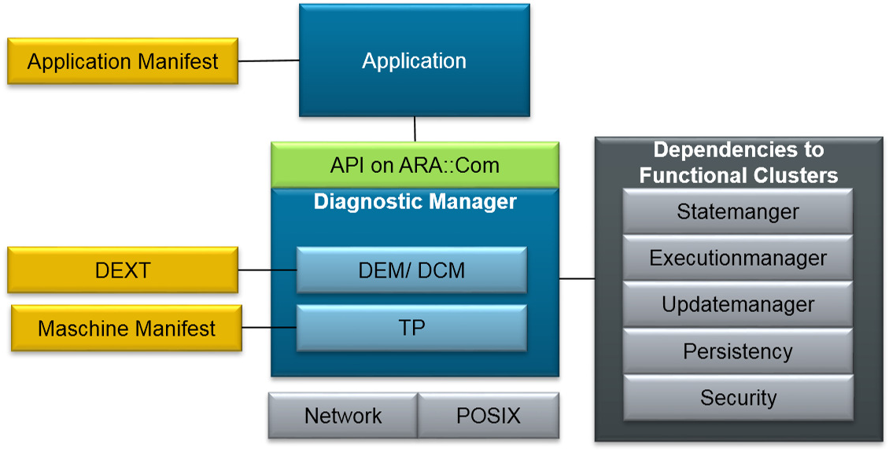
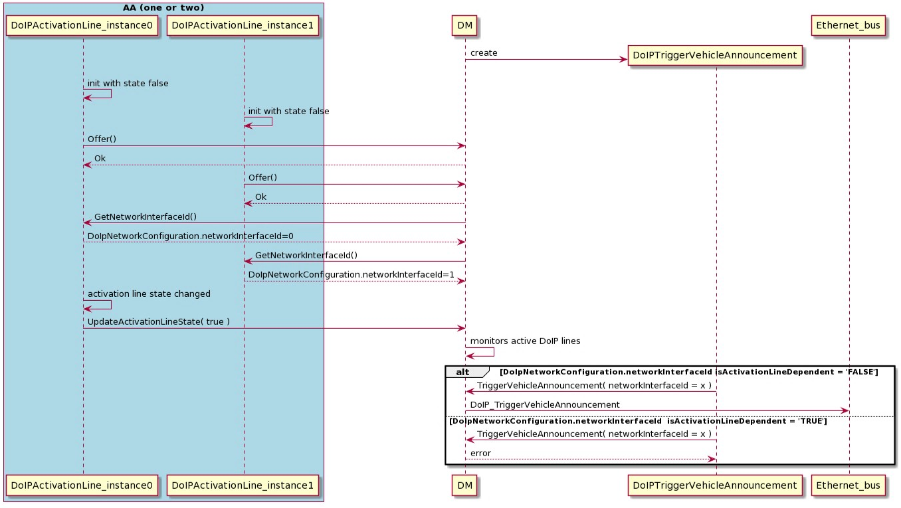
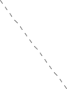

# Contents

1. [Introduction and functional overview](#introduction-and-functional-overview) 26

   1. [Diagnostic interface](#diagnostic-interface) 26
   2. [AUTOSAR Diagnostic Extract Template (DEXT)](#autosar-diagnostic-extract-template-dext) 26
   3. [Software Cluster](#software-cluster) 26

      1. [Diagnostic Server](#diagnostic-server) 26
      2. [Diagnostic Managers external dependencies](#diagnostic-managers-external-dependencies) 29
2. Acronyms and Abbreviations 30
3. [Related documentation](#related-documentation) 35

   1. [Input documents & related standards and norms](#input-documents-related-standards-and-norms) 35
   2. [Further applicable specification](#further-applicable-specification) 36
4. [Constraints and assumptions](#constraints-and-assumptions) 37

   1. [Known Limitations](#known-limitations) 37
5. [Dependencies to other modules](#dependencies-to-other-modules) 40
6. Requirements Tracing 41

   1. Not applicable requirements 59
7. [Functional specification](#functional-specification) 60

   1. [Functional cluster life-cycle](#functional-cluster-life-cycle) 61
   2. [Startup](#startup) 61
   3. [Shutdown](#shutdown) 61
   4. [UDS Transport Layer](#uds-transport-layer) 61

      1. [Support of proprietary UDS Transport Layer](#support-of-proprietary-uds-transport-layer) 62

         1. [Initialization, Starting and Stopping of a proprietary](#initialization-starting-and-stopping-of-a-proprietary-uds-transportlayer)

 [UDS TransportLayer](#initialization-starting-and-stopping-of-a-proprietary-uds-transportlayer) 63

2. [UDS message reception on a proprietary UDS](#uds-message-reception-on-a-proprietary-uds-transportlayer) [TransportLayer](#uds-message-reception-on-a-proprietary-uds-transportlayer) 64
3. [UDS message transmission on a proprietary UDS](#uds-message-transmission-on-a-proprietary-uds-transportlayer) [TransportLayer](#uds-message-transmission-on-a-proprietary-uds-transportlayer) 67
4. [Channel Notifications](#channel-notifications) 67

```{=html}
<!-- -->
```

2. [DoIP](#doip) 68
3. [Dispatching of UDS Requests](#dispatching-of-uds-requests) 71

```{=html}
<!-- -->
```

5. [SOVD Transport Layer](#sovd-transport-layer) 72
6. [Diagnostic Server](#diagnostic-server-1) 72

   1. [Interaction between DM and applications](#interaction-between-dm-and-applications) 73
   2. [Diagnostic Communication Management](#diagnostic-communication-management) 74

      1. [Diagnostic Conversations](#diagnostic-conversations) 74

         1. [Parallel Client Handling](#parallel-client-handling) 75
         2. [Life-cycle of a Diagnostic Conversation](#life-cycle-of-a-diagnostic-conversation) 78
         3. [Diagnostic Conversation Service Interface](#diagnostic-conversation-service-interface) 79
      2. [Assignment of UDS requests to Diagnostic Conver-](#assignment-of-uds-requests-to-diagnostic-conversations) [sations](#assignment-of-uds-requests-to-diagnostic-conversations) 80

         1. [Prioritization](#prioritization) 82
         2. [Replacement of Diagnostic Conversations and](#replacement-of-diagnostic-conversations-and-initial-values) [initial values](#replacement-of-diagnostic-conversations-and-initial-values) 83
         3. [Refusal of incoming diagnostic request](#refusal-of-incoming-diagnostic-request) 83
      3. [Handling Authentication State and DynamicAc-](#handling-authentication-state-and-dynamicaccesslists) [cessLists](#handling-authentication-state-and-dynamicaccesslists) 84

         1. [ExternalAuthentication](#externalauthentication) 84
         2. [ClientAuthentication](#clientauthentication) 84
         3. [ClientAuthenticationHandle](#clientauthenticationhandle) 86
         4. [DynamicAccessList Creation and Update](#dynamicaccesslist-creation-and-update) 87
      4. [Diagnostic Service Authentication checks](#diagnostic-service-authentication-checks) 88
      5. [UDS request Validation/Verification](#uds-request-validationverification) 89

         1. [UDS request format checks](#uds-request-format-checks) 90
         2. [Supported service checks](#supported-service-checks) 90
         3. [Session and Security Checks](#session-and-security-checks) 90
         4. [Manufacturer and Supplier Permission Checks](#manufacturer-and-supplier-permission-checks-and-confirmation)

[and Confirmation](#manufacturer-and-supplier-permission-checks-and-confirmation) 91

5. [Condition checks](#condition-checks) 92

```{=html}
<!-- -->
```

6. [UDS response handling](#uds-response-handling) 94
7. [Keep track of active non-default sessions](#keep-track-of-active-non-default-sessions) 94
8. [UDS service processing](#uds-service-processing) 95

   1. [Supported UDS Services](#supported-uds-services) 95
   2. [Common service processing items](#common-service-processing-items) 96
   3. [Service 0x10 -- DiagnosticSessionControl](#service-0x10-diagnosticsessioncontrol) 96
   4. [Service 0x11 -- ECUReset](#service-0x11-ecureset) 97
   5. [Service 0x14 -- ClearDiagnosticInformation](#service-0x14-cleardiagnosticinformation) 99

      1. [Clearing user-defined fault memory](#clearing-user-defined-fault-memory) 101
   6. [Service 0x19 -- ReadDTCInformation](#service-0x19-readdtcinformation) 102

      1. [SF 0x01 -- reportNumberOfDTCBySta-](#sf-0x01-reportnumberofdtcbystatusmask) [tusMask](#sf-0x01-reportnumberofdtcbystatusmask) 102
      2. [SF 0x02 -- reportDTCByStatusMask](#sf-0x02-reportdtcbystatusmask) 103
      3. [SF 0x03 -- reportDTCSnapshotIdentifi-](#sf-0x03-reportdtcsnapshotidentification) [cation](#sf-0x03-reportdtcsnapshotidentification) 103
      4. [SF 0x04 -- reportDTCSnapshotRecord-](#sf-0x04-reportdtcsnapshotrecordbydtcnumber) [ByDTCNumber](#sf-0x04-reportdtcsnapshotrecordbydtcnumber) 103
      5. [SF 0x06 -- reportDTCExtDataRecord-](#sf-0x06-reportdtcextdatarecordbydtcnumber) [ByDTCNumber](#sf-0x06-reportdtcextdatarecordbydtcnumber) 103
      6. [SF 0x07 -- reportNumberOfDTCBy-](#sf-0x07-reportnumberofdtcbyseveritymaskrecord) [SeverityMaskRecord](#sf-0x07-reportnumberofdtcbyseveritymaskrecord) 104
      7. [SF 0x0A -- reportSupportedDTC](#sf-0x0a-reportsupporteddtc) 104
      8. [SF 0x14 -- reportDTCFaultDetection-](#sf-0x14-reportdtcfaultdetectioncounter) [Counter](#sf-0x14-reportdtcfaultdetectioncounter) 104
      9. [SF 0x17 -- reportUserDefMemory-](#sf-0x17-reportuserdefmemorydtcbystatusmask) [DTCByStatusMask](#sf-0x17-reportuserdefmemorydtcbystatusmask) 105
      10. [SF 0x18 -- reportUserDefMemoryDTC-](#sf-0x18-reportuserdefmemorydtcsnapshotrecordbydtcnum--ber) [SnapshotRecordByDTCNumber](#sf-0x18-reportuserdefmemorydtcsnapshotrecordbydtcnum--ber) 105
      11. [SF 0x19 -- reportUserDefMemory-](#sf-0x19-reportuserdefmemorydtcextdatarecordbydtcnumber) [DTCExtDataRecordByDTCNumber](#sf-0x19-reportuserdefmemorydtcextdatarecordbydtcnumber)

[. 105](#replacement-of-diagnostic-conversations-and-initial-values)

7. [Service 0x22 -- ReadDataByIdentifier](#service-0x22-readdatabyidentifier) 105
8. [Service 0x27 -- SecurityAccess](#service-0x27-securityaccess) 107
9. [Service 0x28 -- CommunicationControl](#service-0x28-communicationcontrol) 109
10. [Service 0x29 -- Authentication](#service-0x29-authentication) 110

    1. [VerifyCertificateUnidirectional](#verifycertificateunidirectional-sws_dm_01230draft-processing-the-verifycertificateunidirectional-request) 111
    2. [VerifyCertificateBidirectional](#verifycertificatebidirectional) 112
    3. [ProofOfOwnership](#proofofownership) 113
    4. [DeAuthenticate](#deauthenticate) 114
    5. [AuthenticationConfiguration](#authenticationconfiguration) 114
    6. [TransmitCertificate](#transmitcertificate) 115
11. [Service 0x2A -- ReadDataByPeriodicIdentifier](#service-0x2a-readdatabyperiodicidentifier) 115
12. [Service 0x2C -- DynamicallyDefineDataIdentifier](#service-0x2c-dynamicallydefinedataidentifier-sws_dm_01070draft-support-of-uds-service-0x2c-in-adaptive-autosar)119
13. [Service 0x2E -- WriteDataByIdentifier](#service-0x2e-writedatabyidentifier) 121
14. [Service 0x31 -- RoutineControl](#service-0x31-routinecontrol) 122
15. [Service 0x34 -- RequestDownload](#service-0x34-requestdownload) 123
16. [Service 0x35 -- RequestUpload](#service-0x35-requestupload) 124
17. [Service 0x36 -- TransferData](#service-0x36-transferdata) 124
18. [Service 0x37 -- RequestTransferExit](#service-0x37-requesttransferexit) 124
19. [Service 0x38 -- RequestFileTransfer](#service-0x38-requestfiletransfer) 125
20. [Service 0x3E -- TesterPresent](#service-0x3e-testerpresent) 127
21. [Service 0x85 -- ControlDTCSetting](#service-0x85-controldtcsetting) 128
22. [Service 0x86 -- ResponseOnEvent](#service-0x86-responseonevent) 129
23. [Custom Diagnostic Services](#custom-diagnostic-services) 132

```{=html}
<!-- -->
```

9. [Cancellation of a Diagnostic Conversation](#cancellation-of-a-diagnostic-conversation) 132

```{=html}
<!-- -->
```

3. [Diagnostic SOVD Management](#diagnostic-sovd-management) 134

   1. [SOVD Conversations and UDS Interplay](#sovd-conversations-and-uds-interplay) 134
   2. [SOVD Request Validation and Verification](#sovd-request-validation-and-verification) 134
   3. [SOVD Data Conversion](#sovd-data-conversion) 136
   4. [Standardized APIs](#standardized-apis) 137

      1. [Docs](#docs) 137
      2. [Version-Info](#version-info) 138
      3. [Data-categories](#data-categories) 138
      4. [Data-groups](#data-groups) 139
      5. [Locks](#locks) 139
   5. [Configurable APIs](#configurable-apis) 139

      1. [Data](#data) 140
      2. [Configuration](#configuration) 142
      3. [Data-list](#data-list) 143
      4. [Faults](#faults) 143
      5. [Operations](#operations) 146
      6. [Modes](#modes) 148
      7. [CommunicationControl](#communicationcontrol) 149
      8. [ControlDTCSetting](#controldtcsetting) 149
4. [Diagnostic Event Management](#diagnostic-event-management) 150

   1. [Caching of application call for event processing](#caching-of-application-call-for-event-processing) 150
   2. [Diagnostic Events](#diagnostic-events) 151

      1. [Definition](#definition) 151
      2. [Monitors](#monitors) 151
      3. [Event Combination](#event-combination) 153

         1. [Combination On Storage](#combination-on-storage) 155
         2. [Combination On Retrieval](#combination-on-retrieval) 156
      4. [EnableConditions](#enableconditions) 157
      5. [Debouncing](#debouncing) 157

         1. [Counter-based debouncing](#counter-based-debouncing) 159
         2. [Time-based debouncing](#time-based-debouncing) 161
         3. [Monitor-internal debouncing](#monitor-internal-debouncing) 164
         4. [Debounce algorithm reset](#debounce-algorithm-reset) 164
         5. [Dependencies to enable conditions](#dependencies-to-enable-conditions) 165
         6. [Dependencies to UDS service 0x85](#dependencies-to-uds-service-0x85-controldtcsettings) [ControlDTCSettings](#dependencies-to-uds-service-0x85-controldtcsettings) 165
      6. [Event Status processing](#event-status-processing) 166
      7. [Event status change notifications](#event-status-change-notifications) 167
      8. [Event occurrence](#event-occurrence) 167
   3. [Condition Mangement](#condition-mangement) 168
   4. [Operation Cycles Management](#operation-cycles-management) 169
   5. [Event memory](#event-memory) 170

      1. [DTC Introduction](#dtc-introduction) 171

         1. [Format](#format) 171
         2. [Groups](#groups) 171
         3. [Priority](#priority) 172
      2. [UDS DTC Status](#uds-dtc-status) 173

         1. [Status processing](#status-processing) 173
         2. [UDS DTC Status change notifications](#uds-dtc-status-change-notifications) . 174 [7.6.4.5.2.3 Suppress DTC reporting](#suppress-dtc-reporting) 174

         ```{=html}
         <!-- -->
         ```

         4. [Indicators](#indicators) 176
         5. [User controlled](#user-controlled-warningindicatorrequest-bit) [WarningIndicatorRequest-bit](#user-controlled-warningindicatorrequest-bit) 178
      3. [Destination](#destination) 179
      4. [DTC related data](#dtc-related-data) 179

         1. [Triggering for data storage](#triggering-for-data-storage) 179
         2. [Storage of snapshot record data](#storage-of-snapshot-record-data) 180
         3. [Storage of extended data](#storage-of-extended-data) 181
         4. [Internal statistical data elements in EDRs](#internal-statistical-data-elements-in-edrs) 182
      5. [Clearing DTCs](#clearing-dtcs) 186

         1. [Locking of the DTC clearing process by](#locking-of-the-dtc-clearing-process-by-a-client)

[a client](#locking-of-the-dtc-clearing-process-by-a-client) 186

2. [ClearConditions](#clearconditions) 187
3. [DTC clearing triggered by application](#dtc-clearing-triggered-by-application) . . 187

```{=html}
<!-- -->
```

6. [Aging](#aging) 188
7. [NumberOfStoredEntries](#numberofstoredentries) 190
8. [Active / Passive Status of Events](#active-passive-status-of-events) 190
9. [Event memory overflow](#event-memory-overflow) 190
10. [Event memory entry displacement](#event-memory-entry-displacement) 192
11. [Reporting order of event memory entries](#reporting-order-of-event-memory-entries) 195

```{=html}
<!-- -->
```

5. [Required Configuration](#required-configuration) 196
6. [Diagnostic Data Management](#diagnostic-data-management) 196

   1. [Internal and External Diagnostic Data Elements](#internal-and-external-diagnostic-data-elements) 197
   2. [Reading and Writing Diagnostic Data Identifier](#reading-and-writing-diagnostic-data-identifier) 199

      1. [Supported Diagnostic Mappings](#supported-diagnostic-mappings) 199
      2. [Reading Diagnostic Data Identifier](#reading-diagnostic-data-identifier) 199
      3. [Writing Diagnostic Data Identifier](#writing-diagnostic-data-identifier) 200

```{=html}
<!-- -->
```

8. [API specification](#api-specification) 202

   1. [C++ language binding \<sub component\>](#c-language-binding-sub-component) 202
   2. [API Common Data Types](#api-common-data-types) 202

      1. [C++ Diagnostic Error Types](#c-diagnostic-error-types) 202
   3. [API Reference 217](#format)

      1. [C++ Diagnostic API Interfaces 217](#groups)

         1. [Introduction 217](#priority)
         2. [MetaInfo class 218](#uds-dtc-status)

            1. [diag::MetaInfo class 218](#status-processing)
            2. diag::MetaInfo::MetaInfo constructor 219
            3. [diag::MetaInfo::MetaInfo copy constructor 219](#indicators)
            4. [diag::MetaInfo::MetaInfo move constructor 219](#user-controlled-warningindicatorrequest-bit)
            5. [diag::MetaInfo::MetaInfo copy assignment op- erator 220](#destination)
            6. [diag::MetaInfo::MetaInfo move assignment op- erator 220](#dtc-related-data)
            7. [diag::MetaInfo::Context type 220](#triggering-for-data-storage)
            8. [diag::MetaInfo::Context kDiagnosticCommuni- cation 221](#storage-of-snapshot-record-data)
            9. [diag::MetaInfo::Context kFaultMemory 221](#storage-of-extended-data)
            10. diag::MetaInfo::Context kDoIP 221
            11. [diag::MetaInfo::GetValue function 222](#clearing-dtcs)
            12. diag::MetaInfo::GetContext function 222
            13. diag::MetaInfo::\~MetaInfo destructor 222
         3. [ReentrancyType class 223](#clearconditions)

            1. [diag::DataIdentifierReentrancyType class 224](#dtc-clearing-triggered-by-application)
         4. [Monitor class 225](#aging)

            1. [diag::Monitor::CounterBased type 226](#numberofstoredentries)
            2. [diag::Monitor::TimeBased type 228](#active-passive-status-of-events)
            3. [diag::InitMonitorReason enum 229](#event-memory-overflow)
            4. [diag::MonitorAction enum 229](#event-memory-entry-displacement)
            5. [diag::Monitor::Monitor constructors 230](#reporting-order-of-event-memory-entries)
            6. [diag::Monitor::ReportMonitorAction function . 231](#required-configuration)
            7. [diag::Monitor::Offer function 231](#diagnostic-data-management)
            8. [diag::Monitor::StopOffer function 232](#internal-and-external-diagnostic-data-elements)
         5. [GenericUDSService class 232](#reading-and-writing-diagnostic-data-identifier)

            1. [diag::GenericUDSService::OperationOutput](#supported-diagnostic-mappings)

[type 232](#reading-diagnostic-data-identifier)

2. [diag::GenericUDSService::OperationOut- put::responseData 233](#writing-diagnostic-data-identifier)
3. [diag::GenericUDSService::GenericUDSService function 233](#api-specification)
4. [diag::GenericUDSService::\~GenericUDSService function 233](#c-language-binding-sub-component)
5. [diag::GenericUDSService::Offer function 234](#api-common-data-types)
6. [diag::GenericUDSService::StopOffer function 234](#c-diagnostic-error-types)
7. diag::GenericUDSService::HandleMessage

function 234

6. GenericDataIdentifier class 236

   1. diag::GenericDataIdentifier::OperationOutput

type 237

2. diag::GenericDataIdentifier::GenericData

Identifier function 237

3. diag::GenericDataIdentifier::\~GenericData

Identifier function 238

4. diag::GenericDataIdentifier::Offer function 238
5. diag::GenericDataIdentifier::StopOffer function 239
6. diag::GenericDataIdentifier::Read function 239
7. diag::GenericDataIdentifier::Write function 241

```{=html}
<!-- -->
```

7. GenericRoutine class 243

   1. diag::GenericRoutine::OperationOutput type . 244
   2. diag::GenericRoutine::GenericRoutine function 244
   3. diag::GenericRoutine::\~GenericRoutine function 245
   4. diag::GenericRoutine::Offer function 245
   5. diag::GenericRoutine::StopOffer function 245
   6. diag::GenericRoutine::Start function 246
   7. diag::GenericRoutine::Stop function 248
   8. diag::GenericRoutine::RequestResults function 250
8. CancellationHandler class 252

   1. diag::CancellationHandler::CancellationHandler function 252
   2. diag::CancellationHandler::IsCanceled function 253
   3. diag::CancellationHandler::SetNotifier function 254
9. Event class 254

   1. diag::DTCFormatType type 255
   2. diag::EventStatusBit type 255
   3. diag::Event::EventStatusByte type 255
   4. diag::Event::DebouncingState type 256
   5. diag::Event::Event constructor 256
   6. diag::Event::\~Event destructor 257
   7. diag::Event::GetEventStatus function 257
   8. diag::Event::SetEventStatusChangedNotifier function 257
   9. diag::Event::GetLatchedWIRStatus function . 258
   10. diag::Event::SetLatchedWIRStatus function 258
   11. diag::Event::GetDTCNumber function 258
   12. diag::Event::GetDebouncingStatus function 259
   13. diag::Event::GetTestComplete function 259
   14. diag::Event::GetFaultDetectionCounter function 259
10. DTCInformation class 260

    1. diag::ControlDtcStatusType type 260
    2. diag::UdsDtcStatusBitType type 261
    3. diag::DtcSuppressionType type 261
    4. diag::DTCInformation::UdsDtcStatusByteType

type 262

5. diag::DTCInformation::SnapshotDataIdenti-

fierType type 262

6. diag::DTCInformation::SnapshotDataRecord-

Type type 262

7. diag::DTCInformation::SnapshotRecordUp- datedType type 263
8. diag::DTCInformation::DTCInformation function 263
9. diag::DTCInformation::\~DTCInformation func-

tion 263

10. diag::DTCInformation::GetCurrentStatus func-

tion 264

11. diag::DTCInformation::GetDtcSuppression

function 264

12. diag::DTCInformation::SetDTCSta- tusChangedNotifier function 264
13. diag::DTCInformation::SetDtcSuppression

function 265

14. diag::DTCInformation::SetSnap- shotRecordUpdatedNotifier function 265
15. diag::DTCInformation::GetNumberOfStore-

dEntries function 266

16. diag::DTCInformation::SetNumberOfStore- dEntriesNotifier function 266
17. diag::DTCInformation::Clear function 267
18. diag::DTCInformation::GetControlDTCStatus function 267
19. diag::DTCInformation::SetControlDtcStatus-

Notifier function 267

20. diag::DTCInformation::EnableControlDtc func-

tion 268

21. diag::DTCInformation::GetEventMemoryOver-

flow function 268

22. diag::DTCInformation::SetEventMemoryOver- flowNotifier function 269

```{=html}
<!-- -->
```

11. Conversation class 269

    1. diag::ActivityStatusType type 269
    2. diag::SessionControlType type 270
    3. diag::SessionControlType kDefaultSession 270
    4. diag::SessionControlType kExtendedDiagnos- ticSession 270
    5. diag::SessionControlType kProgrammingSes-

sion 271

6. diag::SessionControlType kSafetySystemDi- agnosticSession 271
7. diag::SecurityLevelType type 272
8. diag::SecurityLevelType kLocked 272
9. diag::Conversation::ConversationIdentifierType

type 272

10. diag::Conversation::GetConversation function 273
11. diag::Conversation::GetAllConversations func-

tion 273

12. diag::Conversation::GetCurrentActiveConver- sations function 273
13. diag::Conversation::GetActivityStatus function 274
14. diag::Conversation::SetActivityNotifier function 274
15. diag::Conversation::GetConversationIdentifier function 274
16. diag::Conversation::GetDiagnosticSession

function 275

17. diag::Conversation::SetDiagnosticSessionNo-

tifier function 275

18. diag::Conversation::GetDiagnosticSession- ShortName function 275
19. diag::Conversation::GetDiagnosticSecu-

rityLevel function 276

20. diag::Conversation::SetSecurityLevelNotifier function 276
21. diag::Conversation::GetDiagnosticSecu- rityLevelShortName function 277
22. diag::Conversation::ResetToDefaultSession

function 277

12. Condition class 277

    1. diag::ConditionType type 278
    2. diag::Condition::Condition function 278
    3. diag::Condition::\~Condition function 279
    4. diag::Condition::GetCondition function 279
    5. diag::Condition::SetCondition function 279
13. OperationCycle class 280

    1. diag::OperationCycle::OperationCycle function 280
    2. diag::OperationCycle::\~OperationCycle function 280
    3. diag::OperationCycle::SetNotifier function 281
    4. diag::OperationCycle::RestartOperationCycle function 281
14. Indicator class 281

    1. diag::IndicatorType type 282
    2. diag::Indicator::Indicator function 282
    3. diag::Indicator::\~Indicator function 283
    4. diag::Indicator::GetIndicator function 283
    5. diag::Indicator::SetNotifier function 283
15. ServiceValidation class 284

    1. diag::ConfirmationStatusType 284
    2. diag::ServiceValidation::ServiceValidation

function 285

3. diag::ServiceValidation::\~ServiceValidation

function 285

4. diag::ServiceValidation::Validate function 285
5. diag::ServiceValidation::Confirmation function 287
6. diag::ServiceValidation::Offer function 288
7. diag::ServiceValidation::StopOffer function 288

```{=html}
<!-- -->
```

16. SecurityAccess class 288

    1. diag::KeyCompareResultType type 289
    2. diag::SecurityAccess::SecurityAccess function 289
    3. diag::SecurityAccess::\~SecurityAccess function 289
    4. diag::SecurityAccess::GetSeed function 290
    5. diag::SecurityAccess::CompareKey function . 290
    6. diag::SecurityAccess::Offer function 291
    7. diag::SecurityAccess::StopOffer function 292
17. CommunicationControl class 292

    1. diag::CommunicationCon-

trol::ComCtrlRequestParamsType type 292

2. diag::CommunicationCon-

trol::CommunicationControl function 293

3. diag::CommunicationCon-

trol::\~CommunicationControl function 293

4. diag::CommunicationCon-

trol::CommCtrlRequest function 293

5. diag::CommunicationControl::Offer function 294
6. diag::CommunicationControl::StopOffer function 294

```{=html}
<!-- -->
```

18. DownloadService class 295

    1. diag::DownloadService::OperationOutput type 295
    2. diag::DownloadService::DownloadService

function 296

3. diag::DownloadService::\~DownloadService

function 296

4. diag::DownloadService::RequestDownload

function 297

5. diag::DownloadService::DownloadData function 297
6. diag::DownloadService::RequestDownloadExit function 298
7. diag::DownloadService::Offer function 299
8. diag::DownloadService::StopOffer function 299

```{=html}
<!-- -->
```

19. UploadService class 300

    1. diag::UploadService::OperationOutput type 300
    2. diag::UploadService::UploadService function . 301
    3. diag::UploadService::\~UploadService function 301
    4. diag::UploadService::RequestUpload function 301
    5. diag::UploadService::UploadData function 302
    6. diag::UploadService::RequestUploadExit

function 303

7. diag::UploadService::Offer function 304
8. diag::UploadService::StopOffer function 304

```{=html}
<!-- -->
```

20. EcuResetRequest class 305

    1. diag::EcuResetRequest::ResetRequestType

type 305

2. diag::EcuResetRequest::ResetRequestType kCustomReset 305
3. diag::EcuResetRequest::ResetRequestType kHardReset 306
4. diag::EcuResetRequest::ResetRequestType kKeyOffOnReset 306
5. diag::EcuResetRequest::ResetRequestType kSoftReset 306
6. diag::EcuResetRequest::StopOffer function 307
7. diag::EcuResetRequest::Offer function 307
8. diag::EcuResetRequest::RequestReset function 307
9. diag::EcuResetRequest::ExecuteReset function 309 8.3.1.20.10diag::EcuResetRe-

quest::EnableRapidShutdown function 310

11. diag::EcuResetRequest::\~EcuResetRequest destructor 312
12. diag::EcuResetRequest::EcuResetRequest constructor 312

```{=html}
<!-- -->
```

21. Authentication class 313

    1. diag::Authentication::Authentication constructor 313
    2. diag::Authentication::\~Authentication destructor 314

    ```{=html}
    <!-- -->
    ```

    3. diag::Authentica-

 tion::VerifyCertificateUnidirectional function . . 314

4. diag::Authentica-

 tion::VerifyCertificateBidirectional function . . . 315

5. diag::Authentication::VerifyOwnership function 316
6. diag::Authentication::TransmitCertificate function317
7. diag::Authentication::Offer function 318
8. diag::Authentication::StopOffer function 318

```{=html}
<!-- -->
```

22. ClientAuthentication class 319

    1. diag::ClientAuthentication::DiagnosticAuthState type 319
    2. diag::ClientAuthentication::DiagnosticAuthRole

 type 319

3. diag::ClientAuthentication::\~ClientAuthentication destructor 320
4. diag::ClientAuthentication::ClientAuthentication copy constructor 320
5. diag::ClientAuthentication::ClientAuthentication move constructor 320
6. diag::ClientAuthentication::ClientAuthentication copy assignment operator 321
7. diag::ClientAuthentication::ClientAuthentication move assignment operator 321
8. diag::ClientAuthentica-

 tion::OverrideDefaultRoles function 321

9. diag::ClientAuthentication::Authenticate function 322 8.3.1.22.10diag::ClientAuthentication::GetState function . 322 8.3.1.22.11diag::ClientAuthentication::SetNotifier function 323

```{=html}
<!-- -->
```

23. ClientAuthenticationHandle class 323

    1. diag::ClientAuthenticationHandle::ClientAu- thenticationHandle constructor 323
    2. diag::ClientAuthenticationHandle::\~ClientAu- thenticationHandle destructor 324
    3. diag::ClientAuthenticationHandle::ClientAu- thenticationHandle copy constructor 324
    4. diag::ClientAuthenticationHandle::ClientAu- thenticationHandle move constructor 324
    5. diag::ClientAuthenticationHandle::ClientAu- thenticationHandle copy assignment operator 325
    6. diag::ClientAuthenticationHandle::ClientAu- thenticationHandle move assignment operator 325
    7. diag::ClientAuthenticationHandle::Append

 function 325

8. diag::ClientAuthenticationHandle::Set function 326
9. diag::ClientAuthenticationHandle::Revoke

 function 326

10. diag::ClientAuthenticationHandle::Refresh

 function 327

24. DiagnosticServiceDynamicAccessList class 327

    1. diag::DiagnosticServiceDynamicAccessList:: DiagnosticServiceDynamicAccessList con- structor 327
    2. diag::DiagnosticServiceDynamicAccessList::

 \~DiagnosticServiceDynamicAccessList de- structor 328

3. diag::DiagnosticServiceDynamicAccessList:: DiagnosticServiceDynamicAccessList copy constructor 328
4. diag::DiagnosticServiceDynamicAccessList:: DiagnosticServiceDynamicAccessList move constructor 328
5. diag::DiagnosticServiceDynamicAccessList:: DiagnosticServiceDynamicAccessList copy assignment operator 329
6. diag::DiagnosticServiceDynamicAccessList:: DiagnosticServiceDynamicAccessList move assignment operator 329
7. diag::DiagnosticServiceDynamicAccessList:: Reserve function 330
8. diag::DiagnosticServiceDynamicAccessList:: MakeServiceBuilder function 330
9. diag::DiagnosticServiceDynamicAccessList:: MakeServiceBuilder function 331

```{=html}
<!-- -->
```

25. ExternalAuthentication class 331

    1. diag::ExternalAuthentication::Address type 331
    2. diag::ExternalAuthentica-

 tion::ExternalAuthentication constructor 332

3. diag::ExternalAuthentica-

 tion::ExternalAuthentication copy constructor . 332

4. diag::ExternalAuthentica-

 tion::ExternalAuthentication move constructor 332

5. diag::ExternalAuthentica-

 tion::ExternalAuthentication copy assignment operator 333

6. diag::ExternalAuthentica-

 tion::ExternalAuthentication move assignment operator 333

7. diag::ExternalAuthentica-

 tion::\~ExternalAuthentication destructor 334

8. diag::ExternalAuthentication::Get function 334
9. diag::ExternalAuthentication::Get function 334
10. diag::ExternalAuthentication::GetAll function . 335

```{=html}
<!-- -->
```

26. DynamicAccessListDiagServiceBuilder class 335

    1. ByteRange class 336

       1. diag::DynamicAccessListDiagSer- viceBuilder::ByteRange::ByteRange constructor 336
       2. diag::DynamicAccessListDiagSer- viceBuilder::ByteRange::\~ByteRange destructor 336
       3. diag::DynamicAccessListDiagService- Builder::ByteRange::ByteRange copy constructor 337
       4. diag::DynamicAccessListDiagService- Builder::ByteRange::ByteRange move constructor 337
       5. diag::DynamicAccessListDiagService- Builder::ByteRange::ByteRange copy assignment operator 337
       6. diag::DynamicAccessListDiagService- Builder::ByteRange::ByteRange move assignment operator 338
       7. diag::DynamicAccessListDiagService- Builder::ByteRange::GetMin function 338
       8. diag::DynamicAccessListDiagService- Builder::ByteRange::GetMax function . 339
    2. diag::DynamicAccessListDiagService-

 Builder::Byte type 339

3. diag::DynamicAccessListDiagService- Builder::ByteString type 339
4. diag::DynamicAccessListDiagServiceBuilder:: DynamicAccessListDiagServiceBuilder con- structor 340
5. diag::DynamicAccessListDiagServiceBuilder:: DynamicAccessListDiagServiceBuilder copy constructor 340
6. diag::DynamicAccessListDiagServiceBuilder:: DynamicAccessListDiagServiceBuilder move constructor 340
7. diag::DynamicAccessListDiagServiceBuilder:: DynamicAccessListDiagServiceBuilder copy assignment operator 341
8. diag::DynamicAccessListDiagServiceBuilder:: DynamicAccessListDiagServiceBuilder move assignment operator 341
9. diag::DynamicAccessListDiagServiceBuilder::

 \~DynamicAccessListDiagServiceBuilder

 destructor 342

10. diag::DynamicAccessListDiagService-

 Builder::Add function 342

11. diag::DynamicAccessListDiagService-

 Builder::Add function 342

12. diag::DynamicAccessListDiagService-

 Builder::Add function 343

13. diag::DynamicAccessListDiagService-

 Builder::Any function 343

14. diag::DynamicAccessListDiagService- Builder::EndsWith function 344
15. diag::DynamicAccessListDiagService- Builder::EndsWith function 344
16. diag::DynamicAccessListDiagService- Builder::Build function 345

```{=html}
<!-- -->
```

27. FileTransferService class 345

    1. diag::FileTransferService::FileSizes type 345
    2. diag::FileTransferService::WriteFileMode enum 346
    3. diag::FileTransferService::FileTransferService constructors 347
    4. diag::FileTransferService::\~FileTransferService destructor 348
    5. diag::FileTransferService::FileTransferService

 copy assignment operator 348

6. diag::FileTransferService::FileTransferService

 move assignment operator 348

7. diag::FileTransferService::RequestReadFile function 349
8. diag::FileTransferService::RequestReadDirec-

 tory function 349

9. diag::FileTransferService::RequestWriteFile

 function 350

10. diag::FileTransferService::RequestRe- sumeWriteFile function 351
11. diag::FileTransferService::DeleteFile function . 351 8.3.1.27.12diag::FileTransferService::Offer function 352

 8.3.1.27.13diag::FileTransferService::StopOffer function . 352 8.3.1.27.14diag::DataTransferExitType enum 352

28. DataTransferWriteHandler class 353

    1. diag::DataTransferWriteHandler::DataTrans- ferWriteHandler constructors 353
    2. diag::DataTransferWriteHandler::\~DataTrans- ferWriteHandler destructor 354
    3. diag::DataTransferWriteHandler::DataTrans- ferWriteHandler copy assignment operator 355
    4. diag::DataTransferWriteHandler::DataTrans- ferWriteHandler move assignment operator 355
    5. diag::DataTransferWriteHandler::Write function 355
    6. diag::DataTransferWriteHandler::ExitWrite

 function 356

29. DataTransferReadSharedDataHandler class 357

    1. diag::DataTransferReadSharedDataHandler:: DataTransferReadSharedDataHandler con- structor 357
    2. diag::DataTransferReadSharedDataHandler:: DataTransferReadSharedDataHandler move constructor 357
    3. diag::DataTransferReadSharedDataHandler:: DataTransferReadSharedDataHandler copy constructor 358
    4. diag::DataTransferReadSharedDataHandler::

 \~DataTransferReadSharedDataHandler de- structor 358

5. diag::DataTransferReadSharedDataHandler:: DataTransferReadSharedDataHandler move assignment operator 358
6. diag::DataTransferReadSharedDataHandler:: DataTransferReadSharedDataHandler copy assignment operator 359
7. diag::DataTransferReadSharedDataHan-

 dler::Read function 359

8. diag::DataTransferReadSharedDataHan- dler::ExitRead function 360

```{=html}
<!-- -->
```

30. DataTransferReadByPullHandler class 361

    1. diag::DataTransferReadByPullHandler::Data- TransferReadByPullHandler constructor 361
    2. diag::DataTransferReadByPullHandler::Data- TransferReadByPullHandler move constructor 361
    3. diag::DataTransferReadByPullHandler::Data- TransferReadByPullHandler copy constructor . 362
    4. diag::DataTransferReadByPullHandler::

 \~DataTransferReadByPullHandler destructor . 362

5. diag::DataTransferReadByPullHandler::Data- TransferReadByPullHandler move assignment operator 362
6. diag::DataTransferReadByPullHandler::Data- TransferReadByPullHandler copy assignment operator 363
7. diag::DataTransferReadByPullHandler::Read function 363
8. diag::DataTransferReadByPullHandler::Ex-

 itRead function 364

31. DataTransferReadByPushHandler class 365

    1. diag::DataTransferReadByPushHandler::

 DataTransferReadByPushHandler constructor 365

2. diag::DataTransferReadByPushHandler:: DataTransferReadByPushHandler move constructor 365
3. diag::DataTransferReadByPushHandler:: DataTransferReadByPushHandler copy con- structor 366
4. diag::DataTransferReadByPushHandler::

 \~DataTransferReadByPushHandler destructor 366

5. diag::DataTransferReadByPushHandler:: DataTransferReadByPushHandler move assignment operator 366
6. diag::DataTransferReadByPushHandler:: DataTransferReadByPushHandler copy as- signment operator 367
7. diag::DataTransferReadByPushHandler::Read function 367
8. diag::DataTransferReadByPushHandler::

 ExitRead function 368

32. DataTransferReadSession class 369

    1. diag::DataTransferReadSession::DataTrans- ferReadSession constructors 369
    2. diag::DataTransferReadSession::\~DataTrans- ferReadSession destructor 370
    3. diag::DataTransferReadSession::DataTrans- ferReadSession copy assignment operator 370
    4. diag::DataTransferReadSession::DataTrans- ferReadSession move assignment operator 371
33. DataTransferWriteSession class 371

    1. diag::DataTransferWriteSession::DataTrans- ferWriteSession constructors 371
    2. diag::DataTransferWriteSession::\~DataTrans- ferWriteSession destructor 372
    3. diag::DataTransferWriteSession::DataTrans- ferWriteSession copy assignment operator 373
    4. diag::DataTransferWriteSession::DataTrans- ferWriteSession move assignment operator 373
34. ReleaseHandler class 373

    1. diag::ReleaseHandler::ReleaseHandler con- structors 374
    2. diag::ReleaseHandler::ReleaseHandler copy assignment operator 374
    3. diag::ReleaseHandler::ReleaseHandler move assignment operator 375
    4. diag::ReleaseHandler::\~ReleaseHandler de- structor 375
    5. diag::ReleaseHandler::MayRelease function . 376
    6. diag::ReleaseHandler::SetNotifier function 376

```{=html}
<!-- -->
```

2. C++ Diagnostic generated API Interfaces 376

   1. Implementation Types header files 377
   2. Typed Routine class 378

      1. Routine::StartOutput type 378
      2. Routine::StopOutput type 378
      3. Routine::RequestResultsOutput type 379
      4. Routine constructor 379
      5. Routine destructor 379
      6. Routine::Offer function 380
      7. Routine::StopOffer function 380
      8. Routine::Start function 380
      9. Routine::Stop function 383
      10. Routine::RequestResults function 385
   3. Typed DataIdentifier class 387

      1. DataIdentifier::OperationOutput type 387
      2. DataIdentifier constructor 388
      3. DataIdentifier destructor 388
      4. DataIdentifier::Offer function 389
      5. DataIdentifier::StopOffer function 389
      6. DataIdentifier::Read function 389
      7. DataIdentifier::Write function 391
   4. Typed DataElement class 394

      1. DataElement::OperationOutput type 394
      2. DataElement constructor 394
      3. DataElement destructor 395
      4. DataElement::Offer function 395
      5. DataElement::StopOffer function 396
      6. DataElement::Read function 396
3. C++ Diagnostic SOVD API Interfaces 398

   1. SOVD Authorization 398

      1. SovdAuthorization class 398
      2. SovdAuthorization::SovdAuthorization con- structor 398
      3. SovdAuthorization::SovdAuthorization de- structor 399
      4. SovdAuthorization::GetTokenUrl function 399
      5. SovdAuthorization::GetAuthorizationUrl function 400
      6. SovdAuthorization::Offer function 400
      7. SovdAuthorization::StopOffer function 400
      8. SovdAuthorization::ValidateAuthorization

 function 401

2. SOVD Proximity Challenge 402

   1. SovdProximityChallenge class 402
   2. SovdProximityChallenge::SovdProximityChal- lengeType type 402
   3. SovdProximityChallenge::SovdProximityChal- lengeType valid until 402
   4. SovdProximityChallenge::SovdProximityChal- lengeType challenge 403
   5. SovdProximityChallenge::SovdProximityChal-

 lenge constructor 403

6. SovdProximityChallenge::SovdProximityChal-

 lenge destructor 403

7. SovdProximityChallenge::GetChallenge function 404
8. SovdProximityChallenge::Offer function 404
9. SovdProximityChallenge::StopOffer function . 404
10. SovdProximityChallenge::ValidateResponse function 405

```{=html}
<!-- -->
```

A.  Mentioned Manifest Elements 406

B.  Platform Extension API (normative) 466

```
1.  C++ UDS Transportlayer API Interfaces 466

    1.  UDS Transportlayer Types 466

        1.  uds_transport::ByteVector 466

        2.  uds_transport::ChannelID 466

        3.  uds_transport::Priority 467

        4.  uds_transport::ProtocolKind 467

        5.  uds_transport::UdsMessageConstPtr 467

        6.  uds_transport::UdsMessagePtr 468

        7.  uds_transport::UdsTransportProtocolHandlerID 468

    2.  UdsMessage Class 468

        1.  UdsMessage Types 469

            1.  uds_transport::UdsMessage::Address 469

            2.  uds_transport::UdsMessage::MetaInfoMap 469

            3.  uds_transport::UdsMes-
```

 sage::TargetAddressType 470

2. UdsMessage Methods 470

   1. uds_transport::UdsMessage::UdsMessage constructor 470
   2. uds_transport::UdsMessage::\~UdsMessage . 470
   3. uds_transport::UdsMessage::AddMetaInfo 471
   4. uds_transport::UdsMessage::GetPayload 471
   5. uds_transport::UdsMessage::GetSa 472
   6. uds_transport::UdsMessage::GetTa 472
   7. uds_transport::UdsMessage::GetTaType 473

```{=html}
<!-- -->
```

3. UdsTransportProtocolHandler Class 473

   1. UdsTransportProtocolHandlerClass Types 473

      1. uds_transport::UdsTransportProtocolHandler:: InitializationResult 473
   2. UdsTransportProtocolHandler Methods 474

      1. uds_transport::UdsTransportProtocolHandler:: UdsTransportProtocolHandler 474
      2. uds_transport::UdsTransportProtocolHandler::

 \~UdsTransport 474

3. uds_transport::UdsTransportProtocolHandler:: GetHandlerID 475
4. uds_transport::UdsTransportProtocolHandler:: Initialize 475
5. uds_transport::UdsTransportProtocolHandler:: NotifyReestablishment 475
6. uds_transport::UdsTransportProtocolHandler::

 Start 476

7. uds_transport::UdsTransportProtocolHandler::

 Stop 477

8. uds_transport::UdsTransportProtocolHandler:: Transmit 477
9. uds_transport::UdsTransportProtocolHandler:: GetPeriodicHandler 478

```{=html}
<!-- -->
```

4. UdsTransportProtocolMgr Class 478

   1. UdsTransportProtocolMgrClass Types 478

      1. uds_transport::UdsTransportProtocolMgr:: GlobalChannelIdentifier 478
      2. uds_transport::UdsTransportProtocolMgr:: IndicationResult 479
      3. uds_transport::UdsTransportProtocolMgr:: TransmissionResult 479
   2. UdsTransportProtocolMgr Methods 480

      1. uds_transport::UdsTransportProtocolMgr::\~ UdsTransportProtocolMgr 480
      2. uds_transport::UdsTransportProtocolMgr:: ChannelReestablished 480
      3. uds_transport::UdsTransportProtocolMgr:: HandleMessage 480
      4. uds_transport::UdsTransportProtocolMgr:: HandlerStopped 481
      5. uds_transport::UdsTransportProtocolMgr:: IndicateMessage 481
      6. uds_transport::UdsTransportProtocolMgr:: NotifyMessageFailure 482
      7. uds_transport::UdsTransportProtocolMgr:: TransmitConfirmation 483
      8. uds_transport::UdsTransportProtocolMgr:: PeriodicTransmitConfirmation 483
5. UdsTransportProtocolPeriodicHandler Class 484

   1. UdsTransportProtocolPeriodicHandler Methods 484

      1. uds_transport::UdsTransportProtocolPeri- odicHandler::GetNumberOfPeriodicMessages 484
      2. uds_transport::UdsTransportProtocolPeri- odicHandler::GetMaxPayloadLength 484
      3. uds_transport::UdsTransportProtocolPeri- odicHandler::PeriodicTransmit 485
6. Sequence Diagrams of UDS Transport Layer Interaction 486

   1. Lifecycle 486
   2. UDS Request Processing 487
   3. UDS Response Transmission 488
   4. Channel Reestablishment 489

```{=html}
<!-- -->
```

2. C++ DoIP API Interfaces 490

   1. DoIPGroupIdentification class 490

      1. diag::DoIPGroupIdentification::DoIPGroupIdentifica- tionType type 490
      2. diag::DoIPGroupIdentification::DoIPGroupIdentifica-

 tion function 490

3. diag::DoIPGroupIdentification::\~DoIPGroupIdentifi-

 cation function 491

4. diag::DoIPGroupIdentification::GetGidStatus function 491
5. diag::DoIPGroupIdentification::Offer function 491
6. diag::DoIPGroupIdentification::StopOffer function 492

```{=html}
<!-- -->
```

2. DoIPPowerMode class 492

   1. diag::PowerModeType type 493
   2. diag::DoIPPowerMode::DoIPPowerMode function 493
   3. diag::DoIPPowerMode::\~DoIPPowerMode function . 493
   4. diag::DoIPPowerMode::GetDoIPPowerMode function 494
   5. diag::DoIPPowerMode::Offer function 494
   6. diag::DoIPPowerMode::StopOffer function 495
3. DoIPActivationLine class 495

   1. diag::DoIPActivationLine::DoIPActivationLine function 495
   2. diag::DoIPActivationLine::\~DoIPActivationLine function 496
   3. diag::DoIPActivationLine::GetNetworkInterfaceId

 function 496

4. diag::DoIPActivationLine::UpdateActivationLineState function 496
5. diag::DoIPActivationLine::GetActivationLineState

 function 497

6. diag::DoIPActivationLine::Offer function 497
7. diag::DoIPActivationLine::StopOffer function 498

```{=html}
<!-- -->
```

4. DoIPTriggerVehicleAnnouncement class 498

   1. diag::DoIPTriggerVehicleAnnouncement::GetDoIP TriggerVehicleAnnouncement function 498
   2. diag::DoIPTriggerVehicleAnnouncement::TriggerVe- hicleAnnouncement function 499
5. DoIPEntityIdentification class 499

   1. diag::DoIPEntityIdentification::DoIPEntityIdentifica- tionType type 499

      1. diag::DoIPEntityIdentification::EntityId entityI- dentification 500
   2. diag::DoIPEntityIdentification::DoIPEntityIdentifica-

 tion constructor 500

3. diag::DoIPEntityIdentification::\~DoIPEntityIdentifica-

 tion destructor 501

4. diag::DoIPEntityIdentification::GetEntityId function . 501
5. diag::DoIPEntityIdentification::Offer function 501
6. diag::DoIPEntityIdentification::StopOffer function 502

```{=html}
<!-- -->
```

C.  Interfaces to other Functional Clusters (informative) 503

```
1.  Overview 503

2.  Interface Tables 503
```

D.  History of Constraints and Specification Items 504

```
1.  Constraint and Specification Item History of this document according
```

 to AUTOSAR Release 17-10 504

1. Added Traceables in 17-10 504
2. Changed Traceables in 17-10 506
3. Deleted Traceables in 17-10 508
4. Added Constraints in 17-10 509
5. Changed Constraints in 17-10 509
6. Deleted Constraints in 17-10 509

```{=html}
<!-- -->
```

2. Constraint and Specification Item History of this document according

 to AUTOSAR Release 18-03 510

1. Added Traceables in 18-03 510
2. Changed Traceables in 18-03 511
3. Deleted Traceables in 18-03 517
4. Added Constraints in 18-03 517
5. Changed Constraints in 18-03 518
6. Deleted Constraints in 18-03 518

```{=html}
<!-- -->
```

3. Constraint and Specification Item History of this document according

 to AUTOSAR Release 18-10 518

1. Added Traceables in 18-10 518
2. Changed Traceables in 18-10 520
3. Deleted Traceables in 18-10 526
4. Added Constraints in 18-10 527
5. Changed Constraints in 18-10 527
6. Deleted Constraints in 18-10 528

```{=html}
<!-- -->
```

4. Constraint and Specification Item History of this document according

 to AUTOSAR Release 19-03 528

1. Added Traceables in 19-03 528
2. Changed Traceables in 19-03 533
3. Deleted Traceables in 19-03 534
4. Added Constraints in 19-03 534
5. Changed Constraints in 19-03 534
6. Deleted Constraints in 19-03 534

```{=html}
<!-- -->
```

5. Constraint and Specification Item History of this document according

 to AUTOSAR Release R19-11 535

1. Added Traceables in 19-11 535
2. Changed Traceables in 19-11 538
3. Deleted Traceables in 19-11 543
4. Added Constraints in 19-11 546
5. Changed Constraints in 19-11 546
6. Deleted Constraints in 19-11 546

```{=html}
<!-- -->
```

6. Constraint and Specification Item History of this document according

 to AUTOSAR Release R20-11 546

1. Added Traceables in R20-11 546
2. Changed Traceables in R20-11 552
3. Deleted Traceables in R20-11 555
4. Added Constraints in R20-11 556
5. Changed Constraints in R20-11 556
6. Deleted Constraints in R20-11 556

```{=html}
<!-- -->
```

7. Constraint and Specification Item History of this document according

 to AUTOSAR Release R21-11 556

1. Added Traceables in R21-11 556
2. Changed Traceables in R21-11 561
3. Deleted Traceables in R21-11 571
4. Added Constraints in R21-11 572
5. Changed Constraints in R21-11 572
6. Deleted Constraints in R21-11 572

```{=html}
<!-- -->
```

8. Constraint and Specification Item History of this document according

 to AUTOSAR Release R22-11 572

1. Added Traceables in R22-11 572
2. Changed Traceables in R22-11 581
3. Deleted Traceables in R22-11 594
4. Added Constraints in R22-11 595
5. Changed Constraints in R22-11 595
6. Deleted Constraints in R22-11 595

# Introduction and functional overview

 This specification describes the functionality, API and the configuration for the AUTOSAR Adaptive Diagnostic Management (DM).

 The DM is an UDS diagnostic implementation according to ISO 14229-1\[[1](#_bookmark8)\] and a SOVD

 implementation according ASAMSOVD v 1.0.0 \[[2](#_bookmark9)\] for the Autosar Adaptive Platform.

## Diagnostic interface

 Since release R19-03 a C++ interface was introduced for diagnostics as a replacement for the former ara::com based service interface.

## AUTOSAR Diagnostic Extract Template (DEXT)

 The AUTOSAR Diagnostic Extract Template (DEXT) \[[3](#_bookmark10)\] is the configuration input to the

 DM.

## Software Cluster

 The AUTOSAR adaptive platform is able to be extended with new software packages without re-flashing the entire ECU. The individual software packages are described by SoftwareClusters. To support the current approaches of diagnostic management (like software updates), each SoftwareCluster have its own DiagnosticAddresses.

 The DM is intended to support an own diagnostic server instance per installed Soft- wareCluster. All diagnostic server instances share a single TransportLayer instance (e.g. DoIP on TCP/IP port 13400).

### Diagnostic Server

 The Diagnostic Communication Management response handling basically re- sembles the functionality of the Dcm BSW module of the AUTOSAR Classic platform.

 I.e. it is responsible for processing/dispatching of diagnostic services according to ISO 14229-1\[[1](#_bookmark8)\] and SOVD services as per Service-Oriented Vehicle Diagnostics standard Specification \[[2](#_bookmark9)\]. That means:

- Receiving UDS diagnostic request messages from the network layer.
- Receiving SOVD HTTP/REST requests from network layer.
- Extracting transport layer independent UDS information from it.
- Processing and extracting the request, SOVD entity path and resource informa- tion. Dispatching the request towards the Diagnostic Server instances depending on target address and target address type (physical or functional) of received UDS request message.
- Dispatching the SOVD request towards the Diagnostic Server instances depend- ing on the addressed SOVD entity and its path in the URI.
- Correlating the diagnostic request to an existing UDS session (if already exists).
- Checking whether the diagnostic request is allowed within current session and security settings.
- Authorization and validation of SOVD client requests and grant access to the re- quested resources.
- Handling modes and locks for the requested SOVD entity by SOVD client and pro- tect access to the resources (e.g., operations).
- If diagnostic request is NOT allowed, generate negative UDS response and send it to the network layer.
- If SOVD request is NOT allowed, generate corresponding SOVD error codes and send it as HTTP error responses.
- If diagnostic (UDS and SOVD) request is allowed, depending on DM's configuration and request type,

  - either process the service internally within Diagnostic Communication Management function block of DM
  - or process the service internally within Diagnostic Event Management

 function block of DM

- or hand it over for processing to an (external to DM) Adaptive Application

 The figure below depicts those processing steps and functional blocks of DM's Diag- nostic Communication Management part.

 **Figure 1.1: Architecture Diagnostic Communication Management**

### Diagnostic Managers external dependencies

{width="6.353721566054244in" height="3.2343744531933507in"}

 **Figure 1.2: Diagnostic Managers external dependencies**

3. # Related documentation

   1. ## Input documents & related standards and norms

```{=html}
<!-- -->
```

1. []{#_bookmark8 .anchor}Unified diagnostic services (UDS) -- Part 1: Application layer (Release 2020-02) []{#_bookmark9 .anchor}[http://www.iso.org](http://www.iso.org/)
2. ASAM SOVD Service-Oriented Vehicle Diagnostics - API Specification V1.0.0 []{#_bookmark10 .anchor}[http://www.asam.net](http://www.asam.net/)
3. Diagnostic Extract Template AUTOSAR_TPS_DiagnosticExtractTemplate
4. Glossary []{#_bookmark11 .anchor}AUTOSAR_TR_Glossary
5. Road vehicles -- Diagnostic communication over Internet Protocol (DoIP) -- Part 2: Network and transport layer requirements and services (Release 2019-12) []{#_bookmark12 .anchor}[http://www.iso.org](http://www.iso.org/)
6. Specification of Adaptive Platform Core []{#_bookmark13 .anchor}AUTOSAR_SWS_AdaptivePlatformCore
7. Specification of Execution Management []{#_bookmark14 .anchor}AUTOSAR_SWS_ExecutionManagement
8. Specification of Log and Trace []{#_bookmark15 .anchor}AUTOSAR_SWS_LogAndTrace
9. Specification of Persistency []{#_bookmark16 .anchor}AUTOSAR_SWS_Persistency
10. Specification of Cryptography AUTOSAR_SWS_Cryptography
11. Requirements on Diagnostics []{#_bookmark17 .anchor}AUTOSAR_RS_Diagnostics
12. Road vehicles -- Diagnostics on Controller Area Networks (CAN) -- Part2: Network []{#_bookmark18 .anchor}layer services
13. Specification of Manifest []{#_bookmark19 .anchor}AUTOSAR_TPS_ManifestSpecification
14. Unified diagnostic services (UDS) - Part 2: Session layer services (Release 2020-

 02\)

 [http://www.iso.org](http://www.iso.org/)

15. Unified diagnostic services (UDS) -- Part 1: Application layer (Release 2013-03) [http://www.iso.org](http://www.iso.org/)

    1. ## Further applicable specification

 AUTOSAR provides a core specification \[[6](#_bookmark12)\] which is also applicable for Diagnostic Management. The chapter \"General requirements for all FunctionalClusters\" of this specification shall be considered as an additional and required specification for imple- mentation of Diagnostic Management.

4. # Constraints and assumptions

   1. ## Known Limitations

 This chapter describes known limitation of the DM in respect to general claimed goals of the module. The nature of constraints can be a general exclusion of a certain do- main / functionality or it can be that the provided standard has not yet integrated this functionality and will do so in future releases.

- Only scheduler type 1 from \[[1](#_bookmark8)\] is supported for service 0x2A
- Subfunction defineByMemoryAddress for service 0x2C is not supported
- OBD ISO 15031 and WWH OBD ISO 27145 is not supported by the DM.
- *Software Cluster* /*Diagnostic Server instances* are supported by DM interfaces but are not specified in detail.
- *DoIP edge node* is not supported by the DM.
- The following UDS services are not implemented by the DM:

  - 0x23 ReadMemoryByAddress
  - 0x24 ReadScalingDataByIdentifier
  - 0x2F InputOutputControlByIdentifier
  - 0x38 RequestFileTransfer
  - 0x3D WriteMemoryByAddress
  - 0x83 AccessTimingParameter
  - 0x84 SecuredDataTransmission
  - 0x87 LinkControl
- Sub-functions of UDS services are implemented according to ISO 14229-1\[[1](#_bookmark8)\] unless explicitly stated.
- The UDS mirror event memory is not supported by the DM. As a result of this, the

 DM does not support the UDS service

- 0x19 with subfunction 0x0F (reportMirrorMemoryDTCByStatusMask)
- 0x19 with subfunction 0x10 (reportMirrorMemoryDTCExtDataRecordBy- DTCNumber)
- 0x19 with subfunction 0x11 (reportNumberOfMirrorMemoryDTCByStatus- Mask)

```{=html}
<!-- -->
```

- The OBD/WWH OBD is not supported by the DM. As a result of this, the DM does not support the UDS service

  - 0x19 with subfunction 0x05 (reportDTCStoredDataByRecordNumber)
  - 0x19 with subfunction 0x12 (reportNumberOfEmissionsOBDDTCByStatus- Mask)
  - 0x19 with subfunction 0x13 (reportEmissionsOBDDTCByStatusMask)
  - 0x19 with subfunction 0x42 (reportWWHOBDDTCByMaskRecord)
  - 0x19 with subfunction 0x55 (reportWWHOBDDTCWithPermanentStatus)
- The following general UDS services of ReadDTCInformation are not sup- ported:

  - 0x19 with subfunction 0x08 (reportDTCBySeverityMaskRecord)
  - 0x19 with subfunction 0x09 (reportSeverityInformationOfDTC)
  - 0x19 with subfunction 0x0B (reportFirstTestFailedDTC)
  - 0x19 with subfunction 0x0C (reportFirstConfirmedDTC)
  - 0x19 with subfunction 0x0D (reportMostRecentTestFailedDTC)
  - 0x19 with subfunction 0x0E (reportMostRecentConfirmedDTC)
  - 0x19 with subfunction 0x15 (reportDTCWithPermanentStatus)
  - 0x19 with subfunction 0x16 (reportDTCExtDataRecordByRecordNumber)
- Event Memory: Variant handling at runtime for events/DTCs is not supported.
- Event Memory: Details for combined events are not specified.
- Persistent Storage of failed attempts to change security level : After each incre- ment of the attempt counter, it shall be persisted to survive accidental or intended resets. Here the option to select the persistent storage is mandatory in Adaptive Autosar.
- Only Subfunction 0x01 (ON) and Subfunction 0x02 (OFF) is supported for service 0x85.
- For the UDS service 0x86 ResponseOnEvent the following applies:

  - Queuing of events is not supported.
  - Regarding the request message parameter eventWindowTime (refer to B.2 in \[[1](#_bookmark8)\]), the only values supported are infiniteTimeToResponse and power- WindowTime.
- The Diagnostic Manager only implements the UDS Service Authentication (0x29) via PKI certificate exchange. Authentication with challenge-response (ACR) is currently out of scope of the Diagnostic Manager.
- Manufacturer and Supplier specific service checks according to \"Figure 6 - Gen- eral server response behavior for request messages with SubFunction parame- ter\" of ISO 14229-1\[[1](#_bookmark8)\] are not supported.
- OEM-specific error codes are by intention not part of the AUTOSAR standardiza- tion but can be added platform vendor specific as an additional ErrorDomain.

 For SOVD\[[2](#_bookmark9)\] the following limitations apply:

- The SOVD entities area, app and function are not supported.
- SOVD bulk-data are not supported.
- SOVD updates are not supported.
- SOVD logs are not supported.
- Custom SOVD modes are not supported. Only standardized SOVD modes commu- nication_control (section 7.6.3.5.7) and control_dtc_settings (section 7.6.3.5.8) are supported
- For executions of SOVD operations custom capabilites are not supported.
- For SOVD operations the attribute modes is not supported.
- For SOVD configurations the usage of bulk data for read and write of is not sup- ported.
- SOVD locks cannot be acquired on component level. Acquiring SOVD locks

 is only possible on sub-component level.

# Dependencies to other modules

 As any other process started by Execution Management \[[7](#_bookmark13)\], DM needs to interact with the Execution Management.

 The DM may use ara::log (\[[8](#_bookmark14)\], Log and Trace) for logging and tracing purposes.

 DM may use ara::per (\[[9](#_bookmark15)\], Persistency) to store non-volatile data.

 DM may use ara::crypto (\[[10](#_bookmark16)\], Cryptography) to handle TLS for ASAM SOVD\[[2](#_bookmark9)\].

# Functional specification

 The functionality of DM is split into two layers: the UDS Transport Layer and the Appli- cation Layer. On the UDS Transport Layer, DM handles connections to Diagnostic Clients via standardized or user defined UDS Transport Protocols, see section [7.4](#uds-transport-layer) for details. The subcomponent of DM implementing a particular Transport Protocol is called a Transport Protocol Handler.

 Besides UDS Transport Layer also communication via SOVD is supported according to \[[2](#_bookmark9)\]. The SOVD Transport Layer is covered in section [7.5](#sovd-transport-layer) "[SOVD Transport Layer](#sovd-transport-layer)".

 On the Application Layer, DM implements the two main building blocks of diagnos- tics: Diagnostic Event Management and Diagnostic Communication Man- agement, both according to UDS ISO 14229-1\[[1](#_bookmark8)\] and SOVD\[[2](#_bookmark9)\]. On AUTOSAR adap- tive platform the Application Layer can be split into multiple SoftwareClusters, each with its own diagnostic address. Accordingly, DM instantiates for each Soft- wareCluster a Diagnostic Server that implements diagnostics with scope given by this SoftwareCluster, see section [7.6](#diagnostic-server-1). In context of SOVD the diagnostic address corresponds to an SOVD subcomponent, see section [7.6](#diagnostic-server-1) "[Diagnostic Server](#diagnostic-server-1)".

 The link between the UDS Transport Layer and the Application Layer is implemented by the Transport Protocol Manager ( see subsection B.1.4 "UdsTransportProto- colMgr Class".), which dispatches UDS messages in both directions: UDS requests from Diagnostic Clients are forwarded to the respective responsible Diagnostic Server instance, and UDS responses created by Diagnostic Server in- stances are dispatched towards the respective Transport Protocol Handler ( see subsection B.1.3 "UdsTransportProtocolHandler Class".) that handles the connec- tion to the Diagnostic Client. Accordingly, the dispatching between SOVD Trans- port Layer and different SOVD subcomponents need to be handled.

 A broad subcomponent view on DM is given as follows:

 **Figure 7.1:** []{#_bookmark25 .anchor}**Component view on Diagnostic Management**

## Functional cluster life-cycle

 No content.

## Startup

 No content.

## Shutdown

 No content.

## UDS Transport Layer

 Since there exist standardized as well as OEM specific UDS Transport Layers, the DM supports a standardized C++ API (called Transport Protocol API), where differ- ent kinds of UDS Transport Layers can be connected. Currently the Adaptive Platform only provides a detailed description of Ethernet-based network technologies, which mandates support of DoIP \[[5](#_bookmark11)\]. It is very likely, that upcoming releases of the DM will

 also detail CAN, CAN-FD, FR, \... networks. The Transport Protocol API allows for extensions of DM towards not-yet-detailed and proprietary UDS Transport Protocols.

 []{#_bookmark30 .anchor}**\[SWS_DM_00342\]**{DRAFT} **Indication of UDS message reception** *\[*UDS Trans- port Protocol implementation shall call ara::diag::uds_transport::- UdsTransportProtocolMgr::IndicateMessage on its ara::diag::uds\_- transport::UdsTransportProtocolMgr reference ((see \[[SWS_DM_00330](#_bookmark33)\])), as soon as it has at least the following information of an incoming UDS request avail- able:

- UDS source address of the request.
- UDS target address of the request.
- Type of the UDS target address (physical or functional)
- Size of the entire UDS message starting from SID
- If the UDS payload is larger than 1 byte, at least two bytes are received and shall be forwarded in the parameter payloadInfo

 *♩(RS_Diag_04168)*

 The UDS Transport Protocol (TP) implementation can optionally provide the so far re- ceived UDS message content in payloadInfo. It is up to the TP implementation to decide how much of the so far received data is provided. It is recommended to provide at least the first two bytes of the received message. The DM is then able to detect a functional received tester present (UDS bypass logic) and accept this message, even the DM is currently processing a physical request. If the TP does not provide any data in payloadInfo, the DM will not be able to detect the functional TP and will reject the message reception in ara::diag::uds_transport::UdsTransportProto- colMgr::IndicateMessage (see also \[[SWS_DM_00386](#_bookmark37)\]). This might or might not result to failures on the TP. E.g. DoIP provides 'Negative Acknowledge' (NACK) codes in that case, while CAN (Controller Area Network) does not have any TP failures.

### Support of proprietary UDS Transport Layer

 The UDS Transport Protocol API is formally described in section B.1. This section de- scribes the required interaction of the components using this API. Each (proprietary) UDS Transport Protocol implementation subclasses the abstract class ara::- diag::uds_transport::UdsTransportProtocolHandler, which shall be pro- vided by DM according to \[SWS_DM_00315\].

### Initialization, Starting and Stopping of a proprietary UDS TransportLayer

 **\[SWS_DM_00329\]**{DRAFT} **Lifecycle management of an UDS Transport Pro- tocol implementation** *\[*The lifecycle of an UDS Transport Protocol implemen- tation shall be managed by the DM in the following order:

- Creation of the UDS Transport Protocol implementation by calling its constructor ara::diag::uds_transport::UdsTransportProtocolHan- dler::UdsTransportProtocolHandler.
- Initializing of the UDS Transport Protocol implementation by calling ara::diag::uds_transport::UdsTransportProtocolHandler::Ini- tialize.
- Starting of the UDS Transport Protocol implementation by calling ara::- diag::uds_transport::UdsTransportProtocolHandler::Start.
- Stopping of the UDS Transport Protocol implementation by calling ara::- diag::uds_transport::UdsTransportProtocolHandler::Stop.

 *♩(RS_Diag_04168)*

 []{#_bookmark33 .anchor}**\[SWS_DM_00330\]**{DRAFT} **Construction of an UDS Transport Protocol imple- mentation** *\[*The DM shall call the specific constructor of the UDS Transport Pro- tocol implementation, where the argument handlerId is unique among all by DM instantiated UDS Transport Protocol implementations and the argument trans- portProtocolMgr is set to the reference of the instance of ara::diag::uds\_- transport::UdsTransportProtocolMgr provided by DM.*♩(RS_Diag_04168)*

 **\[SWS_DM_00331\]**{DRAFT} **Initialization of an UDS Transport Protocol im- plementation** *\[*The DM shall call the ara::diag::uds_transport::UdsTrans- portProtocolHandler::Initialize method of the UDS Transport Proto- col implementation during startup/initialization phase, before reporting Applica- tionState.kRunning to the execution management.*♩(RS_Diag_04168)*

 **\[SWS_DM_00332\]**{DRAFT} **Starting of an UDS Transport Protocol imple- mentation** *\[*The DM shall call the ara::diag::uds_transport::UdsTrans- portProtocolHandler::Start method of the UDS Transport Protocol im- plementation during startup/initialization phase, before reporting Application- State.kRunning to the execution management and after call to ara::- diag::uds_transport::UdsTransportProtocolHandler::Initialize has returned.*♩(RS_Diag_04168)*

 **\[SWS_DM_00333\]**{DRAFT} **Stopping of an UDS Transport Protocol imple- mentation** *\[*The DM shall call the ara::diag::uds_transport::UdsTransport- ProtocolHandler::Stop method of each UDS Transport Protocol implemen- tation it has started, if it is switching to state ApplicationState.kTerminating.*♩ (RS_Diag_04168)*

 **\[SWS_DM_00340\]**{DRAFT} **Waiting for Stop confirmation** *\[*After having called

 ara::diag::uds_transport::UdsTransportProtocolHandler::Stop

 method of any UDS Transport Protocol implementation, it shall wait for the corresponding ara::diag::uds_transport::UdsTransportProtocolMgr::- HandlerStopped callback with the related handlerId, before it finally terminates the process.*♩(RS_Diag_04168)*

### UDS message reception on a proprietary UDS TransportLayer

 []{#_bookmark35 .anchor}**\[SWS_DM_00347\]**{DRAFT} **Channel identification in Indication** *\[*UDS Transport Protocol implementation shall determine a distinct identifier to identify the network specific channel over which the UDS request has been received, which can be later used to deliver the UDS response to the source of the UDS request.*♩(RS_Diag_04168)*

 Note: A diagnostic client has basically two address parts which together serve for its unique identification:

- The UDS source address (SA) in the clients/testers request which represent a technology/transport layer independent part.
- The technology/transport layer specific/dependent network endpoint source ad- dress, from which the request from the client originates. In Ethernet-based net- works this typically is an IP-address/port number pair, while in CAN networks it is the CAN identifier of the CAN-TP message used by the client. In UDS on CAN (ISO ISO-15765-2\[[12](#_bookmark17)\]) contrary to DoIP, the SA is not explicitly transmitted, but directly deduced from the CAN identifier of the CAN-TP message. That means on CAN we do not have two separate address parts, only the network endpoint source address part is used for identification.

 The side effect of this is that from the viewpoint of Diagnostic Server, which supports parallel Diagnostic Clients, it is a perfectly valid scenario that two Diagnostic Clients with the same UDS SA can be active in parallel if they originate from different/distin- guishable network endpoints.

 []{#_bookmark36 .anchor}**\[SWS_DM_00385\]**{DRAFT} **Acceptance of UDS message reception** *\[*If the DM is able to process the indicated request, ara::diag::uds_transport::UdsTrans- portProtocolMgr::IndicateMessage shall return a std::pair with ara::- diag::uds_transport::UdsTransportProtocolMgr::IndicationResult set to kIndicationOk and a ara::diag::uds_transport::UdsMessagePtr, which owns a valid ara::diag::uds_transport::UdsMessage object, with a capacity of so many bytes, the DM wants to process of the indicated request. The minimum size of the ara::diag::uds_transport::UdsMessage object shall be one byte.*♩(RS_Diag_04168)*

 Note: For details about std::pair see \[SWS_DM_00309\].

 **\[SWS_DM_00392\]**{DRAFT} **Properties of returned UdsMessage** *\[*If the DM ac- cepted the UDS message reception, the returned ara::diag::uds_transport:-

 :UdsMessage owned by ara::diag::uds_transport::UdsMessagePtr shall

 return a ara::diag::uds_transport::ByteVector from ara::diag::uds\_- transport::UdsMessage::GetPayload, which shall be empty (i.e. empty() re- turns true, size() returns 0).*♩(RS_Diag_04168)*

 Note: In the normal case, where DM accepts the complete UDS request for process- ing, it will provide a std::pair with ara::diag::uds_transport::UdsTrans- portProtocolMgr::IndicationResult set to kIndicationOk and a ara:-

 :diag::uds_transport::UdsMessagePtr, which owns a valid ara::diag::- uds_transport::UdsMessage object, with the capacity equal (or greater) to param- eter size indicated by the UDS Transport Protocol implementation. There are use cases (typically for negative responses), where the DM does NOT need the entire UDS request message data to generate the UDS response and therefore might return a ara::diag::uds_transport::UdsMessagePtr, which owns a valid ara::- diag::uds_transport::UdsMessage object, with a capacity smaller than the in- dicated parameter size. E.g. this is useful e.g. in the case, where DM is busy and wants to ignore/reject a second parallel request. For declining a second request WITH sending a negative response according to \[[SWS_DM_00049](#_bookmark71)\], the DM would return an ara::diag::uds_transport::UdsMessagePtr with only enough capacity to be able to construct a valid negative response.

 []{#_bookmark37 .anchor}**\[SWS_DM_00386\]**{DRAFT} **Ignoring UDS message reception because DM is busy** *\[*If the Transport Protocol Manager is calling ara::diag::uds_trans- port::UdsTransportProtocolMgr::IndicateMessage and the DM is busy due to the active processing of a service from the same Tester Present conversation and the Tester Present request is not a functional request with the optional provided pay- loadInfo '0x3E 0x80', the DM shall return a std::pair with ara::diag::uds\_- transport::UdsTransportProtocolMgr::IndicationResult set to kIndi- cationOccupied and a ara::diag::uds_transport::UdsMessagePtr equal to nullptr.*♩(RS_Diag_04168)*

 Functional TesterPresents (compare \[[SWS_DM_00126](#_bookmark177)\]) with suppressPosR- spMsgIndicationBit = TRUE are exceptional requests in UDS and valid at any point in time. Therefore the DM allows to check for functional received TesterPresent request in the ara::diag::uds_transport::UdsTransportProtocolMgr::- IndicateMessage. For handling of the functional TesterPresent, see chapter [7.6.2.8.20](#service-0x3e-testerpresent).

 Note: For details about std::pair see \[SWS_DM_00309\].

 Note: For declining/ignoring a second request without sending a negative response according to \[[SWS_DM_00290](#_bookmark72)\], the DM would choose this behavior.

 []{#_bookmark38 .anchor}**\[SWS_DM_00387\]**{DRAFT} **Ignoring UDS message reception because DM has no (memory) ressources** *\[*If the DM is not able to process the indicated UDS re- quest, because it has not enough (memory) resources to hold the indicated UDS request, it shall return a std::pair with ara::diag::uds_transport::Ud- sTransportProtocolMgr::IndicationResult set to kIndicationOverflow and a ara::diag::uds_transport::UdsMessagePtr equal to UdsMessagePtr (nullptr).*♩(RS_Diag_04168)*

 Note: For details about std::pair see \[SWS_DM_00309\].

 Note: There might exist UDS Transport Protocol implementations, which make NO distinction between \[[SWS_DM_00386](#_bookmark37)\] and \[[SWS_DM_00387](#_bookmark38)\]. I.e. regardless, whether the DM returns a kIndicationOverflow or kIndicationOccupied, the behavior on transport layer level is the same. But, for instance, a CanTP UDS Trans- port Protocol implementation, would explicitly react on a kIndicationOver- flow with sending a FC.OFLW on CanTP level to the UDS request sender.

 **\[SWS_DM_00487\]**{DRAFT} **Ignoring UDS message reception because of un- known target address** *\[*If the DM is not able to process the indicated UDS request, because the indicated target address is unknown to DM, it shall return a std:-

 :pair with ara::diag::uds_transport::UdsTransportProtocolMgr::In- dicationResult set to kIndicationUnknownTargetAddress and a ara::- diag::uds_transport::UdsMessagePtr equal to UdsMessagePtr(nullptr)

 .*♩(RS_Diag_04168)*

 Note: For details about std::pair see \[SWS_DM_00309\].

 **\[SWS_DM_00388\]**{DRAFT} **Filling provided UdsMessage** *\[*If the DM returned kIndicationOk from the ara::diag::uds_transport::UdsTransportPro- tocolMgr::IndicateMessage, the UDS Transport Protocol implementation shall fill the ara::diag::uds_transport::UdsMessage owned by ara::diag:-

 :uds_transport::UdsMessagePtr from the received UDS request starting from SID up to either ara::diag::uds_transport::UdsMessage full capacity or up to the entire received UDS request message, whatever happens first.*♩(RS_Diag_04168)*

 []{#_bookmark39 .anchor}**\[SWS_DM_00345\]**{DRAFT} **Forwarding of UDS message** *\[*If the UDS Transport Protocol implementation has filled the payload of the returned ara::diag::uds\_- transport::UdsMessagePtr, it shall call ara::diag::uds_transport::Ud- sTransportProtocolMgr::HandleMessage on its ara::diag::uds_trans- port::UdsTransportProtocolMgr reference ((see \[[SWS_DM_00330](#_bookmark33)\]) with the returned ara::diag::uds_transport::UdsMessagePtr as argument.*♩(RS\_- Diag_04168)*

 **\[SWS_DM_00389\]**{DRAFT} **Skipping Forwarding of UDS message** *\[*If the DM re- turned a ara::diag::uds_transport::UdsTransportProtocolMgr::Indi- cationResult NOT equal to kIndicationOk from the ara::diag::uds_trans- port::UdsTransportProtocolMgr::IndicateMessage, the UDS Transport Protocol implementation shall NOT call ara::diag::uds_transport::Ud- sTransportProtocolMgr::HandleMessage.*♩(RS_Diag_04168)*

 **\[SWS_DM_00346\]**{DRAFT} **Aborting of UDS message** *\[*If the UDS Transport Protocol implementation has already called ara::diag::uds_transport::- UdsTransportProtocolMgr::IndicateMessage (see \[[SWS_DM_00342](#_bookmark30)\]), but is not willing to call ara::diag::uds_transport::UdsTransportProtocolMgr:-

 :HandleMessage (maybe due to errors receiving the entire/remaining UDS request),

 it shall notify DM by calling ara::diag::uds_transport::UdsTransportPro- tocolMgr::NotifyMessageFailure on its ara::diag::uds_transport::- UdsTransportProtocolMgr reference ((see \[[SWS_DM_00330](#_bookmark33)\]) with the returned ara::diag::uds_transport::UdsMessagePtr as argument.*♩(RS_Diag_04168)*

### UDS message transmission on a proprietary UDS TransportLayer

 []{#_bookmark41 .anchor}**\[SWS_DM_00348\]**{DRAFT} **Transmission of UDS response message** *\[*DM shall send a diagnostic response UDS message to the same UDS Transport Pro- tocol implementation, where it has received the UDS request message (see \[[SWS_DM_00345](#_bookmark39)\]) by calling the ara::diag::uds_transport::UdsTrans- portProtocolHandler::Transmit method of the UDS Transport Protocol implementation.*♩(RS_Diag_04168)*

 **\[SWS_DM_00349\]**{DRAFT} **Reuse channel identifier of Indication** *\[*DM shall set the argument channelId in the ara::diag::uds_transport::UdsTransportPro- tocolHandler::Transmit call to the same value as in the Indication of the corre- sponding UDS request message (see \[[SWS_DM_00347](#_bookmark35)\]).*♩(RS_Diag_04168)*

 []{#_bookmark42 .anchor}**\[SWS_DM_00350\]**{DRAFT} **Confirmation of UDS message transmission** *\[*When the UDS Transport Protocol implementation has a final feedback of the network layer, whether the UDS message triggered for transmission (see \[[SWS_DM_00348](#_bookmark41)\]) could be sent on the network or not, it shall notify DM by call- ing ara::diag::uds_transport::UdsTransportProtocolMgr::Transmit- Confirmation ((see \[[SWS_DM_00330](#_bookmark33)\]) setting the message argument to the message parameter of the ara::diag::uds_transport::UdsTransportPro- tocolHandler::Transmit call (\[[SWS_DM_00348](#_bookmark41)\]).*♩(RS_Diag_04168)*

 **\[SWS_DM_00351\]**{DRAFT} **Confirmation Result** *\[*When the the network layer was able to send the UDS response message to the network, the result argument in the ara::diag::uds_transport::UdsTransportProtocolMgr::Transmit- Confirmation shall be set to kTransmitOk, otherwise to kTransmitFailed.*♩ (RS_Diag_04168)*

### Channel Notifications

 Each incoming UDS request message is assigned an exact UDS Transport Pro- tocol implementation specific Channel. With the normal request/reply paradigm in diagnostics, the UDS response message is sent out at the same Channel, from which the UDS request has been received. Therefore the Channel identifier is given to the DM in ara::diag::uds_transport::UdsTransportProtocolMgr::Indi- cateMessage in the form of parameter globalChannelId. The Channel part from this parameter is then used in the corresponding response in ara::diag::uds\_- transport::UdsTransportProtocolHandler::Transmit.

 There are use cases, where a diagnostic request might be answered deferred after the restart of the DM. The UDS service for ECU reset is a candidate for such a requirement. The upcoming requirements shall cover this use case.

 []{#_bookmark44 .anchor}**\[SWS_DM_00356\]**{DRAFT} **Requesting Notification of a channel reestablishment** *\[*The DM shall call the ara::diag::uds_transport::UdsTransportProtocol- Handler::NotifyReestablishment method of a UDS Transport Protocol implementation, with the parameter channelId set to the identifier of the Channel, where it needs a re-establishment notification.*♩(RS_Diag_04168)*

 **\[SWS_DM_00357\]**{DRAFT} **Validity/lifetime of a Notification Request** *\[*A notifica- tion request registered at a UDS Transport Protocol implementation according to \[[SWS_DM_00356](#_bookmark44)\] is valid only for the next call to ara::diag::uds_trans- port::UdsTransportProtocolHandler::Start until the following call to ara:-

 :diag::uds_transport::UdsTransportProtocolHandler::Stop of this UDS Transport Protocol implementation.*♩(RS_Diag_04168)*

 **\[SWS_DM_00358\]**{DRAFT} **Notification of a channel reestablishment** *\[*UDS Transport Protocol implementation shall call ara::diag::uds_transport:-

 :UdsTransportProtocolMgr::ChannelReestablished on its UdsTrans- portProtocolMgr reference ((see \[[SWS_DM_00330](#_bookmark33)\]) setting the globalChan- nelId argument to the tuple consisting of its own handlerIdent and the Chan- nelID it has received in NotifyReestablishment (see \[[SWS_DM_00356](#_bookmark44)\]) once, in case it detects, that the underlying network Channel represented by ChannelID is getting available again.*♩(RS_Diag_04168)*

 **\[SWS_DM_00359\]**{DRAFT} **Persistent Storage of Notification Request** *\[*UDS Transport Protocol implementation shall store the notification request (see \[[SWS_DM_00356](#_bookmark44)\]) persistently, to be able to fulfill the notification even after a DM restart.*♩(RS_Diag_04168)*

### DoIP

 **\[SWS_DM_00005\]**{DRAFT} **DoIP Support** *\[*The DM shall implement/provide a UDS Transport Layer implementation on Ethernet compliant with ISO-13400-2\[[5](#_bookmark11)\], also called DoIP.*♩(SRS_Eth_00083)*

 **\[SWS_DM_00475\]**{DRAFT} **DoIP Version** *\[*The DM shall support DoIP ISO 13400-2\[[5](#_bookmark11)\] specification.*♩(RS_Diag_04242)*

 Note: According to the ISO 13400-2\[[5](#_bookmark11)\] specification, the DoIP entity supports protocol version = 0xFF in the vehicle identification request message.

 []{#_bookmark46 .anchor}**\[SWS_DM_00449\]**{DRAFT} **Supported DoIP message types** *\[*The DM shall sup- port the DoIP message types listed in Table [7.1](#_bookmark47).*♩(SRS_Eth_00026, SRS_Eth_00080, SRS_Eth_00082, SRS_Eth_00083, SRS_Eth_00084, SRS_Eth_00027)*

+--------------------------------------------------+------------------------------------------------------------------------+
| > []{#_bookmark47 .anchor}**Payload type value** | > **Payload type Name**                                                |
+==================================================+========================================================================+
| > 0x0000                                         | > Generic DoIP header negative acknowledge                             |
+--------------------------------------------------+------------------------------------------------------------------------+
| > 0x0001                                         | > Vehicle identification                                               |
+--------------------------------------------------+------------------------------------------------------------------------+
| > 0x0002                                         | > Vehicle identification request message with EID                      |
+--------------------------------------------------+------------------------------------------------------------------------+
| > 0x0003                                         | > Vehicle identification request message with VIN                      |
+--------------------------------------------------+------------------------------------------------------------------------+
| > 0x0004                                         | > Vehicle announcement message/vehicle identification response message |
+--------------------------------------------------+------------------------------------------------------------------------+
| > 0x0005                                         | > Routing activation request                                           |
+--------------------------------------------------+------------------------------------------------------------------------+
| > 0x0006                                         | > Routing activation response                                          |
+--------------------------------------------------+------------------------------------------------------------------------+
| > 0x0007                                         | > Alive check request                                                  |
+--------------------------------------------------+------------------------------------------------------------------------+
| > 0x0008                                         | > Alive check response                                                 |
+--------------------------------------------------+------------------------------------------------------------------------+
| > 0x4001                                         | > DoIP entity status request                                           |
+--------------------------------------------------+------------------------------------------------------------------------+
| > 0x4002                                         | > DoIP entity status response                                          |
+--------------------------------------------------+------------------------------------------------------------------------+
| > 0x4003                                         | > Diagnostic power mode information request                            |
+--------------------------------------------------+------------------------------------------------------------------------+
| > 0x4004                                         | > Diagnostic power mode information response                           |
+--------------------------------------------------+------------------------------------------------------------------------+
| > 0x8001                                         | > Diagnostic message                                                   |
+--------------------------------------------------+------------------------------------------------------------------------+
| > 0x8002                                         | > Diagnostic message positive acknowledgement                          |
+--------------------------------------------------+------------------------------------------------------------------------+
| > 0x8003                                         | > Diagnostic message negative acknowledgement                          |
+--------------------------------------------------+------------------------------------------------------------------------+

 **Table 7.1: Supported DoIp message types**

 **\[SWS_DM_00855\]**{DRAFT} **Providing the VIN in DoIP protocol messages** *\[*DM shall retrieve the VIN required in some DoIP messages by reading the data from the DID with DiagnosticDataIdentifier.representsVin set to TRUE.*♩(SRS_Eth_00026)*

 **\[SWS_DM_00814\]**{DRAFT} **Providing the PowerMode in DoIP protocol messages** *\[*If the DM needs to know the PowerMode to be able to react or answer on any DoIP message, it shall obtain it by calling the method ara::diag::DoIPPowerMode::- GetDoIPPowerMode.*♩(SRS_Eth_00026, SRS_Eth_00080)*

 **\[SWS_DM_01525\]**{DRAFT} **ara::diag::DoIPPowerMode not yet offered when client requests DoIP PowerMode** *\[*If a client requests the DoIP power mode infor- mation, the DM shall send a DoIP power mode information response with power mode value 0 (\"Not ready\") as long as the Offer function of the ara::diag::DoIPPower- Mode interface is not called yet by the Adaptive Application that provides it (as defined in the ISO 13400-2:2012 specification).*♩(SRS_Eth_00080)*

 **\[SWS_DM_00813\]**{DRAFT} **Providing the GID in DoIP protocol messages** *\[*If the DM needs to know the GID and the status of the GID to be able to react or answer on any DoIP message, it shall obtain it by calling the method ara::diag::DoIP- GroupIdentification::GetGidStatus.*♩(SRS_Eth_00026)*

 **\[SWS_DM_01527\]**{DRAFT} **ara::diag::DoIPGroupIdentification not yet of- fered when DM needs to retrieve GID** *\[*If the DM shall send the GID while the Offer function of the ara::diag::DoIPGroupIdentification interface was not called yet by the Adaptive Application that provides it, the DM shall send a GID value equal to 0x00 0x00 0x00 0x00 0x00 0x00 or 0xFF 0xFF 0xFF 0xFF 0xFF 0xFF (\"value not set\"), as defined in Table 5 and Table 1 in the ISO 13400-2:2012 specification.*♩(SRS\_- Eth_00026)*

 **\[SWS_DM_00815\]**{DRAFT} **When to send Vehicle announcement messages on interfaces without activation line control** *\[*The DM gets notified, when to send out vehicle announcement messages on a network interface without activation line con- trol (isActivationLineDependent == FALSE) by a call to method ara::diag::- DoIPTriggerVehicleAnnouncement::TriggerVehicleAnnouncement, which DM has to provide. The method call contains the network interface identified via net- workInterfaceId on which the announcement shall be sent.*♩(RS_Diag_04242)*

 **\[SWS_DM_00816\]**{DRAFT} **Notification of activation line status change on acti- vation line controlled network interfaces** *\[*The DM gets notified, when the activation line status changes for activation line controlled network interfaces (isActivation- LineDependent == TRUE) via software components providing an instance of Diag- nosticDoIPActivationLineInterface. The DM shall identify for which network interface an instance of DiagnosticDoIPActivationLineInterface is providing the activation line status via call to method ara::diag::DoIPActivationLine:-

 :GetNetworkInterfaceId. Whenever the status of the activation line of the re- lated network interface changes, the application calls ara::diag::DoIPActiva- tionLine::UpdateActivationLineState.*♩(RS_Diag_04242)*

 The DM needs to instantiate a singleton of ara::diag::DoIPTriggerVehi- cleAnnouncement only. The ara::diag::DoIPTriggerVehicleAnnounce- ment::TriggerVehicleAnnouncement method gets the according network- InterfaceId passed, to which the DoIP Vehicle Announcement Message (see \[[SWS_DM_00449](#_bookmark46)\]) shall be sent. Different AAs monitoring the DoIP Activation Line will inform the DM about an Activation Line toggle on its monitoring networkInter- faceId.

 **\[SWS_DM_01526\]**{DRAFT} **ara::diag::DoIPActivationLine not yet offered on activation line controlled network interfaces** *\[*As long as the Offer function of the ara::diag::DoIPActivationLine interface is not called by some Adaptive Appli- cation for a given activation line controlled network interface (DoIpNetworkConfig- uration.isActivationLineDependent == TRUE) the DoIP communication shall not be started on the related network interface, since the DoIP Activation Line state cannot be sensed by the DM (according to the ISO 13400-2:2012 specification).*♩()*

 **\[SWS_DM_01361\]**{DRAFT} **Providing the EID in DoIP protocol messages** *\[*If the DM needs to know the EID to be able to react or answer on any DoIP message , it shall obtain it by calling the method ara::diag::DoIPEntityIdentification:-

 :GetEntityId if configured according to \[TPS_MANI_03294\].*♩(SRS_Eth_00026)*

 **\[SWS_DM_01528\]**{DRAFT} **ara::diag::DoIPEntityIdentification not yet offered when DM needs to retrieve EID from Application** *\[*If the DM shall send the EID while the Offer function of the ara::diag::DoIPEntityIdentification in- terface was not called yet by the Adaptive Application that provides it, the DM shall send a EID value equal to 0x00 0x00 0x00 0x00 0x00 0x00 or 0xFF 0xFF 0xFF 0xFF 0xFF 0xFF (\"value not set\"), as defined in Table 5 and Table 1 in the ISO 13400-2:2012 specification.*♩(SRS_Eth_00026)*

 {width="6.353305993000875in" height="3.5859372265966756in"}

 **Figure 7.2: Example Sequence Diagram for Activation Line and Vehicle Announcement API use case**

### Dispatching of UDS Requests

 The Transport Protocol Manager has to dispatch the UDS-messages between the Transport Protocol Handler and the Diagnostic Server instances. To do this the Transport Protocol Manager uses the following information as provided by the Transport Protocol Handler indication function on received UDS requests:

- Target Address
- Target Address Type (phys / func)

 In transmit direction the Transport Protocol Manager provides the UDS mes- sage from the Diagnostic Server and calls the Transmit method from the Transport Protocol Handler.

 []{#_bookmark49 .anchor}**\[SWS_DM_00390\]**{DRAFT} **Dispatching physical Request** *\[*DM shall dispatch each UDS physical request to the Diagnostic Server instance responsible for the SoftwareCluster with diagnosticAddress matching the TargetAddress of the received UDS request and addressSemantics set to physicalAddress.*♩(RS\_- Diag_04216)*

 []{#_bookmark50 .anchor}**\[SWS_DM_00391\]**{DRAFT} **Dispatching functional Request** *\[*DM shall dispatch each UDS functional request to all Diagnostic Server instances responsible for those SoftwareClusters with a diagnosticAddress matching the TargetAddress of the received UDS request and addressSemantics set to functionalAddress.*♩ (RS_Diag_04216)*

## SOVD Transport Layer

 Beside the opportunity to perform diagnostic communication between a diagnostic client and the Diagnostic Manager via DoIP, the DM will provide further communi- cation interfaces for SOVD-based communication. Therefore, the DM requires one or more socket connections including port and IP address to be able to establish a HTTP resp. HTTPS connection.

 **\[SWS_DM_01369\]**{DRAFT} **DM as SOVD Server** *\[*The DM shall act as SOVD Server as specified by ASAM SOVD\[[2](#_bookmark9)\] according to the configuration referenced by SovdModule- Instantiation.communicationConnector.*♩(RS_Diag_04256)*

 **\[SWS_DM_01370\]**{DRAFT} **DNS-Based Service Discovery and Multicast DNS for SOVD** *\[*The DM shall support DNS-SD (DNS-Based Service Discovery) and mDNS (Mul- ticast DNS) as specified by ASAM SOVD\[[2](#_bookmark9)\].*♩(RS_Diag_04256)*

 **\[SWS_DM_01371\]**{DRAFT} **Secure Communication for SOVD using TLS** *\[*The DM shall secure its HTTP connections using TLS according to the configuration referenced by SovdModuleInstantiation.securePropsForTcp.*♩(RS_Diag_04256)*

 **\[SWS_DM_01372\]**{DRAFT} **Representation of DM by SOVD component** *\[*The DM shall be represented by an SOVD component that shall be a child of the SOVD Server in the role components. The corresponding component-identifier shall be derived from the SovdServerInstantiation.*♩(RS_Diag_04256)*

 **\[SWS_DM_01373\]**{DRAFT} **Representation of Diagnostic Server instance by SOVD subcomponents** *\[*Each Diagnostic Server instance shall be repre- sented by one corresponding SOVD component that shall be a child of the SOVD com- ponent representing the DM in the role subcomponent. The corresponding component- identifier shall be derived from the SoftwareClusterSovdAddress.*♩(RS_Diag\_- 04256)*

 **\[SWS_DM_01374\]**{DRAFT} **Dispatching of SOVD requests/responses** *\[*Within the DM SOVD requests and responses shall be dispatched to and from the Diagnostic Server instances based on the SOVD path.*♩(RS_Diag_04256)*

## Diagnostic Server

 The AUTOSAR adaptive platform is able to be extended with new software packages without re-flashing the entire ECU. The individual software packages are described by

 SoftwareClusters. To support the current approaches of diagnostic management (like software updates), two architecture approaches are possible:

- Each SoftwareCluster has its own diagnosticAddress and Diagnos- ticContributionSet.
- Multiple SoftwareCluster share the diagnosticAddress and also the Di- agnosticContributionSet.

 For details on the semantics and precise configuration of SoftwareClusters, see \[[13](#_bookmark18)\].

 DM is intended to support an own Diagnostic Server instance per Diagnos- ticContributionSet. All Diagnostic Server instances share the same UDS TransportLayer (see Figure [7.1](#_bookmark25)) and each Diagnostic Server manages its own resources.

 []{#_bookmark53 .anchor}**\[SWS_DM_00420\]**{DRAFT} **Instantiation of Diagnostic Server** *\[*DM shall instantiate an independent Diagnostic Server per DiagnosticContributionSet, which is ref- erenced by one or multiple SoftwareClusters in the role of diagnosticExtract, with dedicated resources and functionality configured by this DiagnosticContri- butionSet.*♩(RS_Diag_04216)*

 Details on required configuration items are described in section [7.6.5](#required-configuration).

 This chapter focuses on requirements concerning a single Diagnostic Server, hence we assume that

- requests from Diagnostic Clients are already dispatched towards this Diagnostic Server according to \[[SWS_DM_00390](#_bookmark49)\] and \[[SWS_DM_00391](#_bookmark50)\],
- DEXT configuration elements used in a requirement are meant to be part of the DiagnosticContributionSet associated to the Diagnostic Server according to \[[SWS_DM_00420](#_bookmark53)\].

 In particular, we note that requests addressing different Diagnostic Server in- stances shall be processed independently by the respective Diagnostic Servers.

 **\[SWS_DM_01345\]**{DRAFT} **Lifetime of MetaInfo** *\[*For each method called from DM to application with a MetaInfo as parameter, the DM shall limit the guaranteed life time of the MetaInfo object only to the time that function call is active.*♩(RS_Diag_04170)*

 Note: An example of a method call with MetaInfo as parameter is \[SWS_DM_00618\]. In general the callee is not supposed to store or reuse the MetaInfo object after the DM function has returned. This would result in undefined behavior.

### Interaction between DM and applications

 This chapter introduces ara::diag and provides general information on how these inter- faces behave and how they shall be used.

 Most interaction between DM and application is realized by instances of ara::diag classes. The application instantiates the ara::diag objects and uses the provided in- terface to interact with the DM. The application itself can be deployed anywhere. They can run in the local SoftwareCluster, but also remote on other SoftwareClus- ters or even other hardware is possible.

 **\[SWS_DM_01529\]**{DRAFT} **Behavior on failed ara::diag instantiation** *\[*If a client application instantiates an ara::diag interface with an invalid instance specifier in the constructor, the DM shall treat it as a violation according to \[SWS_CORE_90006\] .*♩ (RS_AP_00149)*

 Note: There are various reasons why an instantiation of an ara::diag interface can fail. Constructing the object requires valid PortPrototype, valid mapping and valid deploy- ment configuration in the model. This needs to be checked in the constructor.

### Diagnostic Communication Management

 A central element in the handling of diagnostic communication is the term Diagnos- tic Conversation, which is described in section [7.6.2.1](#diagnostic-conversations). A UDS request is always processed in the context of a Diagnostic Conversation. A single Diagnostic Server can handle multiple Diagnostic Conversations in parallel.

### Diagnostic Conversations

 A Diagnostic Conversation depicts a conversation between a distinct Diagnos- tic Client and a Diagnostic Server instance. In contrast to CP, on AP the details of connections between Diagnostic Clients and Diagnostic Server instances are not statically configured, but a Diagnostic Conversation is dy- namically allocated during run-time of the Diagnostic Server instance.

 For an incoming UDS request, the Diagnostic Server instance is iden- tified via the target address of the UDS request (see \[[SWS_DM_00390](#_bookmark49)\], \[[SWS_DM_00391](#_bookmark50)\]), whereas the identification of the Diagnostic Client is trans- port layer specific.

 **\[SWS_DM_00421\]**{DRAFT} **Identification of a Diagnostic Client** *\[*The Diag- nostic Server instance shall identify a Diagnostic Client by means of the tuple of sourceAddr and globalChannelId provided by the TP Layer on call of ara::diag::uds_transport::UdsTransportProtocolMgr::Indi- cateMessage, see \[[SWS_DM_00347](#_bookmark35)\].*♩(RS_Diag_04005)*

 **\[SWS_DM_00046\]**{DRAFT} **Each Diagnostic Conversation has its own ses- sion resources** *\[*The Diagnostic Server instance shall provide each Diag- nostic Conversation with its own and independently managed diagnostic session, which can be any valid UDS session type.*♩(RS_Diag_04119, RS_Diag_04006)*

 **\[SWS_DM_00047\]**{DRAFT} **Each Diagnostic Conversation has its own security-level resources** *\[*The Diagnostic Server instance shall provide each Diagnostic Conversation with its own and independently managed security- level.*♩(RS_Diag_04005)*

### \[SWS_DM_01259\] {DRAFT} Validation of Security Level Locked in

 **ara::diag::Conversation::GetDiagnosticSecurityLevelShortName**

 *\[*If the application calls the ara::diag::Conversation::GetDiagnosticSecu- rityLevelShortName with the parameter securityLevel set to kLocked, the Diagnostic Server instance shall return error code kInvalidArgument.*♩ (RS_Diag_04005)*

### \[SWS_DM_01260\] {DRAFT} Validation of Invalid Security Level in

 **ara::diag::Conversation::GetDiagnosticSecurityLevelShortName**

 *\[*If the application calls ara::diag::Conversation::GetDiagnosticSecu- rityLevelShortName with the parameter securityLevel set to value that is not equal to any ((DiagnosticSecurityAccess.requestSeedId + 1) / 2) in the DiagnosticContributionSet, the Diagnostic Server instance shall return error code kInvalidArgument.*♩(RS_Diag_04005)*

 **\[SWS_DM_01261\]**{DRAFT} **Validation of Invalid Session Level in ara::diag::Conversation::GetDiagnosticSessionShortName** *\[*If the application calls ara::diag::Conversation::GetDiagnosticSessionShort- Name with the parameter session set to a value that is not equal to any configured DiagnosticSession in the DiagnosticContributionSet, the Diagnostic Server instance shall return error code kInvalidArgument.*♩(RS_Diag_04005)*

### Parallel Client Handling

 The DM is capable of parallel processing of client requests, as long as all clients are in the default session. If one client switches to a non-default session, the DM will process only diagnostic requests from the conversation of that tester which has requested the non-default session. The DM itself distinguishes between two kinds of parallel process- ing in default session: Fully parallel processing and sequential processing, where a concurrent access can be denied with an NRC '0x21 (busyRepeatRequest)' or an in- ternal wait. In full parallel processing all application functions called from the DM would require a full reentrancy capability. Re-entrant software development is often by far more complex than non-reentrant software. The DM respects this situation and leaves it up to the application software developer to decide if a given application can be called re-entrant. A vehicle manufacturer may require that certain applications are support- ing re-entrant functionality. The DM needs to evaluate the information of supported re-entrancy and behave accordingly. All required 'ara::diag' ports have a constructor parameter to tell the DM if a certain port allows re-entrant calls or not.

 **Pseudo Parallel Mode** In pseudo parallel mode, the DM is capable of parallel process- ing of client requests, as long as all clients are in the default session. If one client switches to a non-default session, the DM will process only diagnostic requests

 from the conversation of that tester which has requested the non-default session. The DM itself distinguishes between two kinds of parallel processing in default session: Fully parallel processing and sequential processing, where a concurrent access can be denied with an NRC '0x21 (busyRepeatRequest)' or an internal wait. In full parallel processing all application functions called from the DM would require a full reentrancy capability. Re-entrant software development is often by far more complex than non-reentrant software. The DM respects this situation and leaves it up to the application software developer to decide if a given application can be called re-entrant. A vehicle manufacturer may require that certain applica- tions are supporting re-entrant functionality. The DM needs to evaluate the infor- mation of supported re-entrancy and behave accordingly. All required 'ara::diag' ports have a constructor parameter to tell the DM if a certain port allows re-entrant calls or not.

 **Impact of SOVD** With the introduction of SOVD\[[2](#_bookmark9)\] not only parallel handling of multi- ple UDS(ISO 14229-1) clients needs to be considered but also SOVD must be taken into account. The SOVD lock mechanism needs to be treated specially here. The SOVD lock mechanism allows to gain exclusive access to a Diagnos- tic server. Thus, if a SOVD lock was acquired from any client, parallel access with multiple UDS (ISO 14229-1) or SOVD clients shall not be possible. For SOVD requests without an SOVD lock the same parallel execution rules as for ISO 14229-1 apply. Further details regarding parallel handling for SOVD are discussed in section 7.6.3.1.

 **\[SWS_DM_00940\]**{DRAFT} **Re-entrant ara::diag interface calls for service pro- cessing** *\[*The DM shall only call a method on an interface for service processing in a re-entrant way, if the DM is

- in default session and
- multiple conversation requests are being processed simultaneously and
- the requested diagnostic service requires that the DM is calling the same required port for different clients and
- the interface constructor parameter typed by ara::diag::ReentrancyType

 and

- the value of this parameter is set to kFully.

 *♩(RS_Diag_04166)*

 In any other case, the DM will not call a method re-entrant and behave according to ISO 14229-1. There are various ways how a DM can handle concurrent requests to the same resource. It is implementation specific, which solution is chosen. One of the options is to return an NRC '0x21 (busyRepeatRequest)', but also other means such as delaying the request might be used. The DM does explicitly provide the possibility to implement project specific solutions to meet the vehicle manufacturers diagnostic requirements.

 []{#_bookmark58 .anchor}**\[SWS_DM_00941\]**{DRAFT} **Re-entrant ara::diag interface calls for DID read pro- cessing** *\[*The DM shall only call a read DID processing method on an interface for service processing in a re-entrant way if it is:

- in default session and
- multiple conversation requests are being processed simultaneously and
- the requested diagnostic service requires that the DM is calling methods on class Namespace1OfPortInterface::Namespace2OfPortInterface:-

 :ShortnameOfDIPortInterface or ara::diag::GenericDataIdenti- fier and the same required port for different clients and

- the interface constructor has the parameter ara::diag::DataIdentifier- ReentrancyType and
- the value of read is set to kFully.

 *♩(RS_Diag_04166)*

 []{#_bookmark59 .anchor}**\[SWS_DM_00942\]**{DRAFT} **Re-entrant ara::diag interface calls for DID write pro- cessing** *\[*The DM shall only call a write DID processing method on an interface for service processing in a re-entrant way if it is:

- in default session and
- multiple conversation requests are being processed simultaneously and
- the requested diagnostic service requires that the DM is calling methods on class Namespace1OfPortInterface::Namespace2OfPortInterface:-

 :ShortnameOfDIPortInterface or ara::diag::GenericDataIdenti- fier and the same required port for different clients and

- the interface constructor has the parameter ara::diag::DataIdentifier- ReentrancyType and
- the value of write is set to kFully.

 *♩(RS_Diag_04166)*

 []{#_bookmark60 .anchor}**\[SWS_DM_00943\]**{DRAFT} **Re-entrant ara::diag interface calls for DID read and write processing** *\[*The DM shall only call a write and read DID processing method on an interface for service processing in a re-entrant way if it is:

- in default session and
- multiple conversation requests are being processed simultaneously and
- the requested diagnostic service requires that the DM is calling methods on class Namespace1OfPortInterface::Namespace2OfPortInterface:-

 :ShortnameOfDIPortInterface or ara::diag::GenericDataIdenti- fier and the same required port for different clients and

- the interface constructor has the parameter ara::diag::DataIdentifier- ReentrancyType and
- the value readWrite is set to kFully.

 *♩(RS_Diag_04166)*

 **\[SWS_DM_00944\]**{DRAFT} **Validity of re-entrant ara::diag interface calls for DID processing** *\[*If the DM is requested to perform a parallel call to a DID interface accord- ing to \[[SWS_DM_00941](#_bookmark58)\], \[[SWS_DM_00942](#_bookmark59)\] or \[[SWS_DM_00943](#_bookmark60)\] and the conditions for the parallel call are not fulfilled, the DM shall not call any method on that interface until any other call from the DM has returned.*♩(RS_Diag_04166)*

 Note: The term \"pseudo parallel concept\" is already defined in ISO 14229-1, Annex J, and this possibility is explicitly limited to OBD in parallel with UDS protocol. The \"pseudo parallel mode\" allows other protocol combination can be processed in parallel. Particularly the use case of parallel processing of two or more UDS protocol requests.

 **\[SWS_DM_01375\]**{DRAFT} **Behavior on locked SOVD** *\[*If a service cannot be per- formed or a session change is not possible due to SOVD lock, NRC 22 (condition- sNotCorrect) shall be returned.*♩(RS_Diag_04256)*

### Life-cycle of a Diagnostic Conversation

 The life-cycle of a Diagnostic Conversation starts with the first reception of a UDS request from the given Diagnostic Client to the Diagnostic Server in- stance and ends either if it is canceled (see section [7.6.2.9](#cancellation-of-a-diagnostic-conversation)) or if **all** of the following conditions are satisfied:

- UDS request processing is finished by either

  - sending positive or final negative response and processing ara::diag::- uds_transport::UdsTransportProtocolMgr::TransmitConfir- mation call from TP-layer according to \[[SWS_DM_00350](#_bookmark42)\],
  - suppressing positive response,
  - suppressing negative response,
  - suppressing any response according to \[[SWS_DM_00860](#_bookmark96)\].
- associated Session is the Default Session.

 Note: A Diagnostic Conversation in Non-Default Session is kept alive, as long as no Session time-out occurred. In this case, possibly multiple UDS requests are processed within this Lifecycle.

### Diagnostic Conversation Service Interface

 In some cases, the current state of a Diagnostic Conversation needs to be known by some Adaptive Applications. For this purpose, the Diagnostic Server instance provides instances of the Service Interface ara::diag::Conversation.

### \[SWS_DM_00840\] {DRAFT} Instantiation of Diagnostic Conversation Interface

 *\[*The Diagnostic Server instance shall provide as many instances of ara:-

 :diag::Conversation class (\[SWS_DM_00693\])as the number of potential paral- lel Diagnostic Clients is configured by maxTesterConnections.*♩(RS_Diag\_- 04166)*

 **\[SWS_DM_00841\]**{DRAFT} **Assignment of Diagnostic Conversation to Service Instances** *\[*On establishment of a new Diagnostic Conversation, the Diag- nostic Server instance shall assign this Diagnostic Conversation to an inactive ara::diag::Conversation class Instance, i.e. the field value of ara::- diag::ActivityStatusType is set to kInactive. After assignment, the fields of the ara::diag::Conversation class Instance shall be updated according to the state of the given Diagnostic Conversation, i.e.,

- ara::diag::ActivityStatusType set to kActive,
- ara::diag::Conversation::ConversationIdentifierType match- ing the values of ara::diag::uds_transport::UdsTransportPro- tocolMgr::IndicateMessage call, that initiated the creation of this Diagnostic Conversation (see \[[SWS_DM_00347](#_bookmark35)\]),
- a call to ara::diag::Conversation::GetDiagnosticSession will return the Diagnostic Session of this Diagnostic Conversation,
- a call to ara::diag::Conversation::GetDiagnosticSecurityLevel

 will return the Diagnostic Security Level of this Diagnostic Conversation.

 *♩(RS_Diag_04166)*

 **\[SWS_DM_00844\]**{DRAFT} **Updating DiagnosticConversation Service Instance fields** *\[*During the life-cycle of a Diagnostic Conversation, the Diagnostic Server instance shall update the fields of the assigned ara::diag::Conversa- tion class instance according to any change of the state of the Diagnostic Con- versation.*♩(RS_Diag_04166)*

 []{#_bookmark63 .anchor}**\[SWS_DM_00843\]**{DRAFT} **Reset Service Instance fields on end of Diagnostic Conversation** *\[*If the life-cycle of a Diagnostic Conversation ends, the Diag- nostic Server instance shall reset

- the session reported with ara::diag::Conversation::GetDiagnostic- Session to kDefaultSession
- the security level reported with ara::diag::Conversation::GetDiagnos- ticSecurityLevel to kLocked

 of the assigned ara::diag::Conversation class instance.*♩(RS_Diag_04166)*

 Besides the described informative character of the ara::diag::Conversation class Interface, it also provides methods for interaction with the state of a Diagnostic Conversation.

 **\[SWS_DM_00842\]**{DRAFT} **Default session change trigger from AAs** *\[*If ara:-

 :diag::Conversation::ResetToDefaultSession method is called, the Di- agnostic Server instance shall complete the latest ongoing request and then switch the Diagnostic Session of this Diagnostic Conversation to Default Ses- sion.*♩(RS_Diag_04006)*

 **\[SWS_DM_01355\]**{DRAFT} **Consecutive registration of notifier with SetActivi- tyNotifier()** *\[*In case of a consecutive call of ara::diag::Conversation::SetAc- tivityNotifier of the corresponding ara::diag::Conversation instance, DM module shall overwrite the previous registered notifier.*♩(RS_Diag_04169)*

 **\[SWS_DM_01356\]**{DRAFT} **Consecutive registration of notifier with SetDiagnos- ticSessionNotifier()** *\[*In case of a consecutive call of ara::diag::Conversa- tion::SetDiagnosticSessionNotifier of the corresponding ara::diag::- Conversation instance, DM module shall overwrite the previous registered notifier.*♩ (RS_Diag_04169, RS_Diag_04208)*

 **\[SWS_DM_01357\]**{DRAFT} **Consecutive registration of notifier with SetSecu- rityLevelNotifier()** *\[*In case of a consecutive call of ara::diag::Conversation::- SetSecurityLevelNotifier of the corresponding ara::diag::Conversation instance, DM module shall overwrite the previous registered notifier.*♩(RS_Diag_04169, RS_Diag_04208)*

### Assignment of UDS requests to Diagnostic Conversations

 A UDS request is always processed within the context of a Diagnostic Conversa- tion. On reception, the Diagnostic Server instance has to choose from the following three options:

- assign the UDS request to an existing Diagnostic Conversation,
- establish a new Diagnostic Conversation and assign the UDS request to this Diagnostic Conversation,
- reject the UDS request.

 The evaluation which option to choose involves several steps that are summarized in Figure [7.3](#_bookmark65). The following requirements provide the details.

 ***[SWS_DM_00426]{.underline}:***

 *Assigning a UDS request toan existing Diagnostic Conversation*

 Is the existing Diagnostic Conversation busy?

 Process received UDS request in context of assigned DiagnosticConversation

 **Figure 7.3:** []{#_bookmark65 .anchor}**UDS request assignment to a Diagnostic Conversation and Prioritization**

 **\[SWS_DM_00425\]**{DRAFT} **Procedure to assign UDS requests to Diagnostic Con- versations** *\[*The Diagnostic Server instance shall handle a newly received UDS request as specified in Figure [7.3](#_bookmark65).*♩(RS_Diag_04166)*

 **\[SWS_DM_00426\]**{DRAFT} **Assigning a UDS request to an existing Diagnostic Conversation** *\[*If a UDS request is received and there already exists a Diagnostic Conversation associated to the transmitting Diagnostic Client, then the Diagnostic Server instance shall assign this UDS request to the same Diagnostic Con- versation.*♩(RS_Diag_04166)*

 Note that the assignment of a UDS request to a Diagnostic Conversation does not necessarily mean that the UDS request is actually processed, see \[[SWS_DM_00433](#_bookmark70)\].

### Prioritization

 If the Diagnostic Server instance lacks resources for new Diagnostic Conver- sations, a prioritization of the requested Diagnostic Conversation against existing Di- agnostic Conversations shall take place. For a Diagnostic Server instance , prioritization is required in case of an existing Diagnostic Conversation in non-default session.

 **\[SWS_DM_00427\]**{DRAFT} **Priority of a Diagnostic Conversation** *\[*The Diagnos- tic Server instance shall take as the priority of a Diagnostic Conversation the respective value provided by ara::diag::uds_transport::UdsTransport- ProtocolMgr::IndicateMessage that established the Diagnostic Conversa- tion.*♩(RS_Diag_04166)*

 **\[SWS_DM_00428\]**{DRAFT} **Treatment of priority values** *\[*The Diagnostic Server instance shall consider a lower value as higher priority and vice versa. In particular, priority value 0 represents highest priority.*♩(RS_Diag_04166)*

 **\[SWS_DM_00429\]**{DRAFT} **Prioritization in active non-default session** *\[*If a Diag- nostic Conversation is in non-default session, the Diagnostic Server shall com- pare the priority of the requested Diagnostic Conversation against the priority of the given Diagnostic Conversation in non-default session. If the priority of the re- quested Diagnostic Conversation is higher than the priority of the Diagnostic Conversation in non-default Session, the Diagnostic Server instance shall replace the Diagnostic Conversation in non- default session by the requested Diagnostic Conversation according to \[[SWS_DM_00431](#_bookmark68)\] and assign the UDS request to the newly established Diagnostic Conversation.*♩(RS_Diag_04166)*

 **\[SWS_DM_00430\]**{DRAFT} **Prioritization against all Diagnostic Conversations in active default session** *\[*On prioritization, the Diagnostic Server instance shall compare the priority of the requested Diagnostic Conversation against the pri- orities of the existing Diagnostic Conversations:

- If all priorities of the existing Diagnostic Conversations are higher or equal to the priority of the requested Diagnostic Conversation, the Di- agnostic Server instance shall refuse the UDS request according to \[[SWS_DM_00049](#_bookmark71)\] and \[[SWS_DM_00290](#_bookmark72)\].
- If some priority of the existing Diagnostic Conversations is lower than the priority of the requested Diagnostic Conversation, the Diagnos- tic Server instance shall replace the Diagnostic Conversation of lowest priority by the requested Diagnostic Conversation according to \[[SWS_DM_00431](#_bookmark68)\] and assign the UDS request to the newly established Di- agnostic Conversation.

 *♩(RS_Diag_04166)*

### Replacement of Diagnostic Conversations and initial values

 []{#_bookmark68 .anchor}**\[SWS_DM_00431\]**{DRAFT} **Replacement of Diagnostic Conversations** *\[*On re- placement of a given Diagnostic Conversation by a requested Diagnos- tic Conversation, the Diagnostic Server instance shall cancel the given Diagnostic Conversation according to \[[SWS_DM_00277](#_bookmark185)\], \[[SWS_DM_00278](#_bookmark186)\], \[[SWS_DM_00279](#_bookmark187)\], \[[SWS_DM_00280](#_bookmark188)\], \[[SWS_DM_00847](#_bookmark189)\] and establish a new Di- agnostic Conversation as requested.*♩(RS_Diag_04167)*

 **\[SWS_DM_00856\]**{DRAFT} **Initial values for Diagnostic Conversation** *\[*For a newly established Diagnostic Conversation, the Diagnostic Server instance shall use the following initial values:

- Session set to Default Session (kDefaultSession), which is synonymous with returning an according ara::diag::SessionControlType when ara:-

 :diag::Conversation::GetDiagnosticSession is called and

- Security Level set to status Locked (kLocked), which is synonymous with re- turning an according ara::diag::SecurityLevelType when ara::diag:-

 :Conversation::GetDiagnosticSecurityLevel is called .

 *♩(RS_Diag_04166)*

### Refusal of incoming diagnostic request

 []{#_bookmark70 .anchor}**\[SWS_DM_00433\]**{DRAFT} **Refusal of diagnostic request due to busy Diagnos- tic Conversation** *\[*If a UDS request is assigned to a Diagnostic Conversation that has not finished processing of a formerly assigned UDS request, then the Diagnostic Server instance shall ignore the new UDS request according to \[[SWS_DM_00386](#_bookmark37)\].*♩(RS_Diag_04020)*

 []{#_bookmark71 .anchor}**\[SWS_DM_00049\]**{DRAFT} **Refusal of diagnostic request due to prioritization with BusyRepeatRequest** *\[*If prioritization demands refusal of an incoming UDS request and the configuration parameter DiagnosticCommonProps.responseOn- SecondDeclinedRequest is TRUE, the Diagnostic Server instance shall accept this request according to \[[SWS_DM_00385](#_bookmark36)\] without further processing and a negative response with NRC 0x21 (BusyRepeatRequest) shall be issued for this re- quest.*♩(RS_Diag_04167)*

 []{#_bookmark72 .anchor}**\[SWS_DM_00290\]**{DRAFT} **Refusal of diagnostic request due to prioritization without response** *\[*If prioritization demands refusal of an incoming UDS request and the configuration parameter DiagnosticCommonProps.responseOnSecond- DeclinedRequest is FALSE, the Diagnostic Server instance shall ignore this request according to \[[SWS_DM_00386](#_bookmark37)\] without further processing and no re- sponse shall be issued.*♩(RS_Diag_04167)*

### Handling Authentication State and DynamicAccessLists

 This chapter describes the interfaces available to the application for handling of the Authentication States of the Diagnostic Clients and their corresponding DynamicAc- cessLists. The parts specified in this chapter are independent of the parts specified for the UDS Service Authentication (0x29), and may be used also with custom methods for authentication of clients.

### ExternalAuthentication

 In AUTOSAR Adaptive, a major part of the client authentication process is handled in the Application. It is therefore necessary for the application to convey the Authentica- tion state to the Diagnostic Server instance of the DM. Since the Diagnostic Server instance must handle the Authentication States and Roles independently for each Diagnostic Client, the Application must first receive a ClientAuthentica- tion instance from the DM. This can be done using the class ara::diag::Exter- nalAuthentication.

 **\[SWS_DM_01202\]**{DRAFT} **Get ClientAuthentication Instance** *\[*If the application calls any of the overloaded methods ara::diag::ExternalAuthentication:-

 :Get of the class ara::diag::ExternalAuthentication, the Diagnostic Man- ager shall return an instance of the ara::diag::ClientAuthentication class that is handling the Authentication State of the passed metaInfo or Diagnostic Client Address.*♩(RS_Diag_04240)*

 **\[SWS_DM_01203\]**{DRAFT} **GetAll ClientAuthentication Instance** *\[*If the application calls the method ara::diag::ExternalAuthentication::GetAll of the class ara::diag::ExternalAuthentication, the Diagnostic Server instance shall return all the existing instances of the ara::diag::ClientAuthentication class.*♩(RS_Diag_04240)*

### ClientAuthentication

 Once the Application has received an instance of the ara::diag::ClientAuthen- tication class, it may pass the Authentication State and Authentication Roles to the Diagnostic Manager using this instance. The Diagnostic Server instance maintains the Authentication State and Authentication Role for each Diagnostic Conversation.

 []{#_bookmark76 .anchor}**\[SWS_DM_01204\]**{DRAFT} **Default Authentication Role** *\[*The DiagnosticAuth- Role(s) with attribute "isDefault" set to TRUE shall be considered by the Diagnostic Server instance as the Default Authentication Role(s) of clients in the Authentica- tion State kDeAuthenticated.*♩(RS_Diag_04240)*

 **\[SWS_DM_01205\]**{DRAFT} **Default Authentication State** *\[*On startup, the default Authentication state for a client shall be 'kDeAuthenticated'.*♩(RS_Diag_04240)*

 []{#_bookmark77 .anchor}**\[SWS_DM_01206\]**{DRAFT} **Set AuthenticationRole** *\[*If the application calls the ara::diag::ClientAuthentication::Authenticate method of the class ara::diag::ClientAuthentication, the Diagnostic Server instance shall set the Authentication State of the ara::diag::ClientAuthentication in- stance to kAuthenticated and the Authentication Role of the ara::diag::Clien- tAuthentication instance to the user role(s) that are passed in the method call. The Diagnostic Server Instance shall return an instance of the ara::diag::Clien- tAuthenticationHandle to the application.*♩(RS_Diag_04240)*

 **\[SWS_DM_01207\]**{DRAFT} **Get Authentication State** *\[*If the application calls the ara::diag::ClientAuthentication::GetState method of the class ara::- diag::ClientAuthentication, the Diagnostic Server instance shall re- turn the current Authentication State of the Client.*♩(RS_Diag_04240)*

 **\[SWS_DM_01208\]**{DRAFT} **Authentication State Change Notifier** *\[*If the applica- tion calls the method ara::diag::ClientAuthentication::SetNotifier of the class ara::diag::ClientAuthentication, the Diagnostic Server in- stance shall call the passed notifier-function whenever there is a change in the Au- thentication State of the client.*♩(RS_Diag_04240)*

 []{#_bookmark78 .anchor}**\[SWS_DM_01209\]**{DRAFT} **Temporarily change Default Roles** *\[*If the client is in kDeAuthenticated state and the application calls the method ara::diag::- ClientAuthentication::OverrideDefaultRoles of the class ara::diag:-

 :ClientAuthentication, the Diagnostic Server instance shall change the default roles of the client to the passed 'defaultRoles' for a time period passed in the pa- rameter 'timeout'. On successful execution of this method, the Diagnostic Server instance shall return an instance of the ara::diag::ClientAuthentication- Handle to the application.*♩(RS_Diag_04239)*

 []{#_bookmark79 .anchor}**\[SWS_DM_01210\]**{DRAFT} **DeAuthenticate due to client inactivity** *\[*In Default Ses- sion, if a client is in kAuthenticated state, and no diagnostic request is received from the client for a time period DiagnosticAuthentication.authentication- Timeout, the Diagnostic Server instance shall set the Authentication State of the client to kDeAuthenticated.*♩(RS_Diag_04240)*

 **\[SWS_DM_01211\]**{DRAFT} **Transition to DeAuthenticated state on S3server time- out** *\[*On an S3 Server timeout, the Diagnostic Server instance shall reset the Authentication State of all clients to kDeAuthenticated.*♩(RS_Diag_04240)*

 []{#_bookmark80 .anchor}**\[SWS_DM_01212\]**{DRAFT} **Transition from Authenticated to DeAuthenticated State** *\[*If the Authentication State of a Client changes from kAuthenticated to kDeAuthenticated, the Diagnostic Server instance shall

- set the Authentication Role of the Client to the default roles as defined in \[[SWS_DM_01204](#_bookmark76)\]
- clear all DynamicAccessList entries associated with the Client

 *♩(RS_Diag_04240)*

 **\[SWS_DM_01360\]**{DRAFT} **Consecutive registration of notifier with ClientAuthen- tication::SetNotifier()** *\[*In case of a consecutive call of ara::diag::ClientAu- thentication::SetNotifier of the corresponding ara::diag::ClientAu- thentication instance, DM module shall overwrite the previous registered notifier.*♩ (RS_Diag_04251)*

### ClientAuthenticationHandle

 A ara::diag::ClientAuthenticationHandle instance is provided to the ap- plication by the Diagnostic Server instance, when either an ara::diag:-

 :ClientAuthentication::OverrideDefaultRoles method or an ara::- diag::ClientAuthentication::Authenticate method is successfully com- pleted.

 The Diagnostic Manager maintains a "DynamicAccessList" for every client that is au- thenticated. The DynamicAccessList may provide additional access of Diagnostic Re- sources to an authenticated client apart from the configurations described in the Di- agnostic Extract. The DynamicAccessList and the Authentication Status may be con- trolled by the application using the ara::diag::ClientAuthenticationHandle.

 []{#_bookmark82 .anchor}**\[SWS_DM_01213\]**{DRAFT} **Set DynamicAccessList** *\[*If the application calls the

 ara::diag::ClientAuthenticationHandle::Set method of the class ara:-

 :diag::ClientAuthenticationHandle, the Diagnostic Server instance shall replace the DynamicAccessList of the authenticated client with the DynamicAc- cessList passed by the application.*♩(RS_Diag_04240)*

 **\[SWS_DM_01214\]**{DRAFT} **Default DynamicAccessList** *\[*On startup, the Dynami- cAccessList of all clients shall be empty.*♩(RS_Diag_04240)*

 **\[SWS_DM_01215\]**{DRAFT} **Extend the DynamicAccessList** *\[*If the application calls the ara::diag::ClientAuthenticationHandle::Append method of the class ara::diag::ClientAuthenticationHandle, the Diagnostic Server instance shall extend the DynamicAccessList of the authenticated client with the DynamicAccessList passed by the application.*♩(RS_Diag_04240)*

 **\[SWS_DM_01216\]**{DRAFT} **Revoke an authentication** *\[*If the application calls the ara::diag::ClientAuthenticationHandle::Revoke method of the class ara::diag::ClientAuthenticationHandle, the Diagnostic Server in- stance shall set the Authentication State of the client to 'kDeAuthenticated'.*♩(RS\_- Diag_04240)*

 **\[SWS_DM_01217\]**{DRAFT} **Refresh timeouts** *\[*If an application calls the method ara::diag::ClientAuthenticationHandle::Refresh of the class ara::- diag::ClientAuthenticationHandle, the Diagnostic Server instance shall perform one of the following:

- If the ara::diag::ClientAuthenticationHandle was returned by the ara::diag::ClientAuthentication::OverrideDefaultRoles

 method, refresh the time period for which the OverrideDefaultRoles is valid. Refer \[[SWS_DM_01209](#_bookmark78)\].

- If the ara::diag::ClientAuthenticationHandle was returned by the ara::diag::ClientAuthentication::Authenticate method, refresh the client inactivity time period. Refer \[[SWS_DM_01210](#_bookmark79)\].

 *♩(RS_Diag_04240)*

### DynamicAccessList Creation and Update

 The Diagnostic Manager provides an interface to allow the application to build a Dy- namicAccessList. The DynamicAccessList is a series of diagnostic request patterns that provide additional access of diagnostic resources to an authenticated client. The DynamicAccessList may be created by the application using the C++ methods de- scribed in this chapter.

 **\[SWS_DM_01218\]**{DRAFT} **Building a new DynamicAccessList** *\[*If any of the over- loads of the method ara::diag::DiagnosticServiceDynamicAccessList:-

 :MakeServiceBuilder of the class ara::diag::DiagnosticServiceDynam- icAccessList is called by the application, the Diagnostic Server instance shall create a new DynamicAccessList beginning with the single-byte or byte-string pat- tern passed by the application. The Diagnostic Server instance shall return an instance of the class ara::diag::DynamicAccessListDiagServiceBuilder to the application.*♩(RS_Diag_04240)*

 **\[SWS_DM_01219\]**{DRAFT} **Adding patterns to a DynamicAccessList** *\[*If any of the overloads of the method ara::diag::DynamicAccessListDiagService- Builder::Add of the class ara::diag::DynamicAccessListDiagService- Builder are called by the application, the Diagnostic Server instance shall add the requested pattern to the DynamicAccessList of the client and return an in- stance of the same ara::diag::DynamicAccessListDiagServiceBuilder ob- ject to the application.*♩(RS_Diag_04240)*

 The returned instance of the same object may be used by the application to further add patterns to the DynamicAccessList.

 **\[SWS_DM_01220\]**{DRAFT} **Adding wildcards to a DynamicAccessList** *\[*If the method ara::diag::DynamicAccessListDiagServiceBuilder::Any of the class ara::diag::DynamicAccessListDiagServiceBuilder is called by the application, the Diagnostic Server instance shall add the passed number of bytes to the DynamicAccessList, but shall not consider them during pattern matching.*♩ (RS_Diag_04240)*

 For Example, 22F1XX could be used in the pattern to add all ReadDataByIdentifier Requests for DIDs beginning with 0xF1 to the DynamicAccessList.

 **\[SWS_DM_01221\]**{DRAFT} **End patterns of a DynamicAccessList** *\[*If any of the overloads of the method ara::diag::DynamicAccessListDiagService- Builder::EndsWith of the class ara::diag::DynamicAccessListDiagSer- viceBuilder are called by the application, the Diagnostic Server instance shall add the requested pattern to the end of the DynamicAccessList.*♩(RS_Diag\_- 04240)*

 **\[SWS_DM_01222\]**{DRAFT} **Finalize a DynamicAccessList** *\[*If the method ara::- diag::DynamicAccessListDiagServiceBuilder::Build of the class ara:-

 :diag::DynamicAccessListDiagServiceBuilder is called by the application, the Diagnostic Server instance shall finalize the DynamicAccessList.*♩(RS\_- Diag_04240)*

 After successful execution of this method, the application may use the created Dynam- icAccessList as described in \[[SWS_DM_01213](#_bookmark82)\].

### Diagnostic Service Authentication checks

 The UDS service Authentication (0x29) is used by the ECU as a means to identify the client and provide the relevant access to diagnostic resources, based on the client's 'role'. Depending on the authenticated role and the access-list, a dynamic set of di- agnostic services is available to the client. The Diagnostic Server instance verifies if a received diagnostic service is accessible to the client or not.

 []{#_bookmark85 .anchor}**\[SWS_DM_01223\]**{DRAFT} **Diagnostic service role verification** *\[*The Diagnostic Server instance shall check if a diagnostic service execution is permitted in the current Authentication State and Authentication Role (Refer \[[SWS_DM_01206](#_bookmark77)\]). The roles that are allowed to execute the diagnostic services are configured with the pa- rameter DiagnosticAccessPermission.DiagnosticAuthRole. The Diagnos- tic Server instance shall perform the following checks in the order given below. If a check grants access to a service, the remaining checks are skipped and the service is processed by the Diagnostic Server instance.

- Checks on service ID level
- Checks on service ID and sub-function level
- Checks for services with one or multiple DIDs
- Check on dynamically defined DIDs
- Checks on service 0x31 per sub-function
- Checks on service 0x19 parameter MemorySelection

 *♩(RS_Diag_04233)*

 []{#_bookmark86 .anchor}**\[SWS_DM_01224\]**{DRAFT} **Diagnostic service dynamic access-rights verification** *\[*If the check in \[[SWS_DM_01223](#_bookmark85)\] is unsuccessful, the Diagnostic Server in- stance shall additionally check if the requested Diagnostic Service is allowed by the client DynamicAccessList (Refer \[[SWS_DM_01213](#_bookmark82)\]).*♩(RS_Diag_04233)*

 **\[SWS_DM_01225\]**{DRAFT} **Response behavior of services without access rights** *\[*If the service execution verification fails due to a failed check in scope of \[[SWS_DM_01223](#_bookmark85)\] and \[[SWS_DM_01224](#_bookmark86)\], the Diagnostic Server instance shall send a negative Response with NRC '0x34 (authenticationRequired)' and stop the service processing.*♩(RS_Diag_04233)*

 **\[SWS_DM_01376\]**{DRAFT} **Response behavior of SOVD services without access rights** *\[*If the request is an SOVD request and the service execution verification fails due to a failed check in scope of \[[SWS_DM_01223](#_bookmark85)\], the Diagnostic Server in- stance shall send a HTTP response status code 401 (Unauthorized) and error_code set to insufficient-access-rights and stop the service processing.*♩(RS_Diag_04256)*

### UDS request Validation/Verification

 []{#_bookmark88 .anchor}**\[SWS_DM_00096\]**{DRAFT} **Validation Steps and Order** *\[*The Diagnostic Server instance shall execute the request validation, negative response code determination and processing according to ISO 14229-1\[[1](#_bookmark8)\].*♩(RS_Diag_04196, RS_Diag_04203)*

 ISO 14229-1\[[1](#_bookmark8)\] describes a common processing for all requests in "Figure 5 -- General server response behavior". There are further optional SID specific processing se- quences. This document describes the Diagnostic Server instance behavior for certain types of checks:

- **manufacturer specific failure detected?** Decision by applying manufacturer specific checks according to section [7.6.2.5.4](#manufacturer-and-supplier-permission-checks-and-confirmation)
- **SID supported?** Decision according to section [7.6.2.5.2](#supported-service-checks)
- **SID supported in active session?** Decision according to section [7.6.2.5.3](#session-and-security-checks)
- **SID security check o.k.?** Decision according to section [7.6.2.5.3](#session-and-security-checks)
- **supplier-specific failure detected?** Decision by applying supplier-specific checks according to section [7.6.2.5.4](#manufacturer-and-supplier-permission-checks-and-confirmation)

 **\[SWS_DM_00097\]**{DRAFT} **Abort on failed verification step** *\[*Whenever one of the verification steps fails, further processing of the request shall be aborted and a negative response shall be sent back.*♩(RS_Diag_04196)*

 The negative response code to be used will be defined in each step described in the following sections.

### UDS request format checks

 **\[SWS_DM_00098\]**{DRAFT} **UDS message checks** *\[*The Diagnostic Server in- stance shall check, whether the diagnostic request is syntactically correct. I.e. whether it conforms to ISO 14229-1 message format specification. If it does not con- form, the Verification shall be considered as failed and the negative response code shall be 0x13 (incorrectMessageLengthOrInvalidFormat).*♩(RS_Diag_04203)*

### Supported service checks

 **\[SWS_DM_00099\]**{DRAFT} **Supported Service SID level checks** *\[*The Diagnostic Server instance shall check, whether there is a configured internal or external service processor for the incoming diagnostic request. If there is no service processor on SID level, the Verification shall be considered as failed and the negative response code shall be 0x11 (serviceNotSupported).*♩(RS_Diag_04203)*

 []{#_bookmark91 .anchor}**\[SWS_DM_00100\]**{DRAFT} **Supported Service subfunction level checks** *\[*The Di- agnostic Server instance shall check, whether there is a configured internal or external service processor for the incoming diagnostic request. If there exists a service processor on SID level, but not for the subfunction of the request, the Veri- fication shall be considered as failed and the negative response code shall be 0x12 (subFunctionNotSupported).*♩(RS_Diag_04203)*

### Session and Security Checks

 []{#_bookmark93 .anchor}**\[SWS_DM_00101\]**{DRAFT} **Session Access SID level Permission** *\[*The Diagnos- tic Server instance shall check, whether the service processor (Diagnostic- ServiceInstance), which is assigned to handle the service has the permission to process the service in the current Diagnostic Session according to its DiagnosticAc- cessPermission.diagnosticSession. If DiagnosticServiceInstance has no access permissions in the current Diagnostic Session and:

- either the SID of the service has no subfunction
- or all other sub-functions also have no access permissions in the current Diag- nostic Session,

 the Verification shall be considered as failed and the negative response code shall be 0x7F (serviceNotSupportedInActiveSession).*♩(RS_Diag_04203, RS_Diag\_- 04006)*

 **\[SWS_DM_00102\]**{DRAFT} **Session Access subfunction level Permission** *\[*The Diagnostic Server instance shall check, whether the service processor (Di- agnosticServiceInstance), which is assigned to handle the service has the per- mission to process the service in the current Diagnostic Session according to its

 DiagnosticAccessPermission.diagnosticSession. If DiagnosticServi- ceInstance has no access permissions in the current Diagnostic Session and:

- the SID of the service has subfunctions
- and at least one other sub-functions has access permissions in the current Diag- nostic Session,

 the Verification shall be considered as failed and the negative response code shall be 0x7E (subFunctionNotSupportedInActiveSession).*♩(RS_Diag_04203, RS\_- Diag_04006)*

 []{#_bookmark94 .anchor}**\[SWS_DM_00103\]**{DRAFT} **Security Access level Permission** *\[*The Diagnostic Server instance shall check, whether the service processor (DiagnosticServi- ceInstance), which is assigned to handle the service has the permission to process the service in the current Security-Level according to its DiagnosticAccessPer- mission.securityLevel. If DiagnosticServiceInstance has no access per- missions in the current Security-Level, the Verification shall be considered as failed and the negative response code shall be 0x33 (securityAccessDenied).*♩(RS\_- Diag_04203, RS_Diag_04005)*

 **\[SWS_DM_00450\]**{DRAFT} **Security Access subfunction level Permission** *\[*The Diagnostic Server instance shall check, whether the service processor (Di- agnosticServiceInstance), which is assigned to handle the service has the per- mission to process the service in the current Security Level according to its Diagnos- ticAccessPermission.securityLevel. If DiagnosticServiceInstance has no access permissions in the current Security Level and:

- the SID of the service has subfunctions
- and at least one other sub-functions has access permissions in the current Se- curity Level,

 the Verification shall be considered as failed and the negative response code shall be 0x33 (securityAccessDenied).*♩(RS_Diag_04203)*

### Manufacturer and Supplier Permission Checks and Confirmation

 To allow manufacturer specific UDS service pre-processing or filtering, ISO 14229-1\[[1](#_bookmark8)\] defines manufacturer and supplier specific callouts. There are various use cases for these callouts, among them are:

- UDS message filtering
- Adding project or customer specific diagnostic service processing

 UDS and the DM allows multiple of these callouts and the result of each of the callout can be one of:

- Continue to process the service by the DM
- Discarding the received diagnostic message without further response
- Forcing a certain NRC to be send

 Both, manufacturer and suppliers specific service callouts, are realized by ara::- diag::ServiceValidation::Validate according to its modeled instance given by \[TPS_MANI_01352\] and \[constr_10063\].

 **\[SWS_DM_01252\]**{DRAFT} **Support of manufacturer service validations** *\[*The DM shall support manufacturer specific service validation checks according to ISO 14229- 1\[[1](#_bookmark8)\] by calling ara::diag::ServiceValidation::Validate for each configured manufacturer service check.*♩(RS_Diag_04199)*

 **\[SWS_DM_01253\]**{DRAFT} **Support of supplier service validations** *\[*The DM shall support supplier specific service validation checks according to ISO 14229-1\[[1](#_bookmark8)\] by call- ing ara::diag::ServiceValidation::Validate for each configured supplier service check.*♩(RS_Diag_04199)*

 **\[SWS_DM_01254\]**{DRAFT} **Continue service processing after validation** *\[*If a call to ara::diag::ServiceValidation::Validate returns without an error, the Diagnostic Server instance shall continue to process the service according to ISO 14229-1\[[1](#_bookmark8)\].*♩(RS_Diag_04199)*

 **\[SWS_DM_01255\]**{DRAFT} **NRC after failed service validation** *\[*If a call to ara::- diag::ServiceValidation::Validate returns any error code except kNoPro- cessingNoResponse, the validation is be considered as failed and a negative re- sponse code equal to the value of the error code according to \[SWS_DM_00547\] shall be sent as response.*♩(RS_Diag_04199)*

 **\[SWS_DM_00859\]**{DRAFT} **Confirmation of service processing** *\[*The Diagnostic Server instance shall call the method ara::diag::ServiceValidation::- Confirmation on every service instances for which ara::diag::ServiceVal- idation::Validate was called. If message handling results in sending a pos- itive or negative response, the ara::diag::ServiceValidation::Confirma- tion call shall be deferred after reception of ara::diag::uds_transport::Ud- sTransportProtocolMgr::TransmitConfirmation. In any other case, it shall be the last step of request processing.*♩(RS_Diag_04019, RS_Diag_04172)*

 []{#_bookmark96 .anchor}**\[SWS_DM_00860\]**{DRAFT} **No service processing** *\[*If any ara::diag::Service- Validation::Validate returns kNoProcessingNoResponse, the Diagnostic Server instance shall discard the message of received diagnostic request.*♩(RS\_- Diag_04196, RS_Diag_04199)*

### Condition checks

 In some cases, diagnostic functionality shall only be executed if the vehicle is in a certain state. An example is the condition that the vehicle is stopped (vehicle speed equals 0).

 []{#_bookmark98 .anchor}**\[SWS_DM_00111\]**{DRAFT} **Configurable environment condition checks** *\[*The Di- agnostic Server instance shall perform a condition check when the ISO 14229- 1\[[1](#_bookmark8)\] mentions a service specific \"Condition check\" in the defined NRC handling for a given diagnostic service. The Diagnostic Server instance shall send the con- figured NRC value (see \[[SWS_DM_00289](#_bookmark103)\]) if the condition is not fulfilled.*♩(RS_Diag\_- 04199)*

 []{#_bookmark99 .anchor}**\[SWS_DM_00112\]**{DRAFT} **Condition check definition** *\[*The Diagnostic Server instance shall execute a condition check according to \[[SWS_DM_00111](#_bookmark98)\] by the pres- ence of a DiagnosticEnvironmentalCondition referenced in the role environ- mentalCondition by the processed DiagnosticServiceInstance.*♩(RS_Diag\_- 04199)*

 []{#_bookmark100 .anchor}**\[SWS_DM_00286\]**{DRAFT} **Configurable environmental condition check execu- tion** *\[*The Diagnostic Server instance shall execute an environmental condi- tion check before executing the requested service if defined. (see DiagnosticEnvi- ronmentalCondition element from DEXT \[[3](#_bookmark10)\]).*♩(RS_Diag_04199)*

 []{#_bookmark101 .anchor}**\[SWS_DM_00287\]**{DRAFT} **Configurable environmental condition check criteria** *\[*The environmental condition check shall be done by evaluation of the configured DiagnosticEnvConditionFormula.*♩(RS_Diag_04199)*

 The DiagnosticEnvConditionFormula may reference a DiagnosticDataEle- ment by a DiagnosticEnvDataCondition with a logical operator given as Diag- nosticEnvCompareCondition.

 **\[SWS_DM_00288\]**{DRAFT} **Configurable environmental condition check evalu- ates to TRUE** *\[*If the computation of the DiagnosticEnvConditionFormula evalu- ated to TRUE, the Diagnostic Server instance shall execute the requested ser- vice.*♩(RS_Diag_04199)*

 []{#_bookmark102 .anchor}**\[SWS_DM_00970\]**{DRAFT} **Behavior of failed data element retrieval** *\[*If the retrieval of the dataElement failed due to an external processor has an error of ara::- diag::DiagUdsNrcErrorDomain, the DM shall treat the DiagnosticEnvCondi- tionFormulaPart as condition not fulfilled and trigger a Log and Trace message.*♩ (RS_Diag_04199)*

 []{#_bookmark103 .anchor}**\[SWS_DM_00289\]**{DRAFT} **Configurable environmental condition check evalu- ates to FALSE** *\[*The Diagnostic Server instance shall send the NRC defined in nrcValue, if the computation of the DiagnosticEnvConditionFormula evaluated to FALSE. If nrcValue does not define a NRC, the Diagnostic Server instance shall send NRC 0x22 (ConditionsNotCorrect).*♩(RS_Diag_04199)*

### UDS response handling

 **\[SWS_DM_01258\]**{DRAFT} **Response handling** *\[*The Diagnostic Server in- stance shall process diagnostic responses according to ISO 14229-1\[[1](#_bookmark8)\]. This in- cludes sending of positive and negative responses, as well as suppression of negative or positive responses.*♩(RS_Diag_04196, RS_Diag_04020)*

 **\[SWS_DM_00368\]**{DRAFT} **DM takes care of Response Pending Messages** *\[*If the processing of a diagnostic service requires more time than allowed by the P2/P2\* timer of the current session, the Diagnostic Server instance shall send a negative response with NRC 0x78 (requestCorrectlyReceivedResponsePending) according to ISO 14229-1\[[1](#_bookmark8)\].*♩(RS_Diag_04016)*

 **\[SWS_DM_00369\]**{DRAFT} **Maximum number of busy responses** *\[*If the num- ber of negative responses for a requested diagnostic request reaches the value de- fined in the configuration parameter maxNumberOfRequestCorrectlyReceive- dResponsePending, the Diagnostic Server instance module shall cancel the processing of the active diagnostic internal or external request processing, according to \[[SWS_DM_00277](#_bookmark185)\], \[[SWS_DM_00278](#_bookmark186)\] and send a negative response with NRC 0x10 (generalReject).*♩(RS_Diag_04016)*

 **\[SWS_DM_01257\]**{DRAFT} **ResourceTemporarilyNotAvailable NRC handling** *\[*If the DM is processing a diagnostic service using a ara::diag interface, that requires the offer(), and if this interface is not offered yet or not offered any more, the DM shall return an NRC 0x94 (ResourceTemporarilyNotAvailable).*♩()*

### Keep track of active non-default sessions

 **\[SWS_DM_00380\]**{DRAFT} **Support for S3 timer** *\[*The Diagnostic Server in- stance shall provide support for S3~Server~ (session timeout) with a fixed value of 5 seconds. The timer handling shall be implemented according to ISO 14229-2\[[14](#_bookmark19)\].*♩ (RS_Diag_04006)*

 **\[SWS_DM_00381\]**{DRAFT} **Session timeout** *\[*Whenever a non-default session is ac- tive and when the session timeout (S3~Server~) is reached without receiving any diagnostic request, the Diagnostic Server instance shall reset to the default session state. Diagnostic Server instance internal states for service processing shall be reset according to ISO 14229-2\[[14](#_bookmark19)\].*♩(RS_Diag_04006)*

 **\[SWS_DM_00382\]**{DRAFT} **Session timeout start** *\[*The session timeout timer (S3~server~) shall be started on

- Completion of any final response message or an error indication during sending of the response (\[SWS_DM_00312\])
- Completion of the requested action in case no response message (positive and negative) is required / allowed.
- In case of an error during the reception of a multi-frame request message (\[SWS_DM_00310\])

 Start of S3~Server~ means reset the timer and start counting from the beginning.*♩(RS\_- Diag_04006)*

 **\[SWS_DM_00383\]**{DRAFT} **Session timeout stop** *\[*The session timeout timer (S3~Server~) shall be stopped when the reception of an UDS message was indicated (\[SWS_DM_00309\]).*♩(RS_Diag_04006)*

 **\[SWS_DM_00812\]**{DRAFT} **Re-enabling on transition to default session** *\[*If DTC setting is disabled and DM is transitioning into default session, then DM shall enable the DTC setting again.*♩(RS_Diag_04006)*

### UDS service processing

 This chapter describes the UDS service processing behavior of the Diagnostic Server instance.

 **\[SWS_DM_00127\]**{DRAFT} **Availability of diagnostic service processors** *\[*The Di- agnostic Server instance shall provide a service processor on SID level for all services by existence of a DiagnosticServiceClass referenced by a Diagnos- ticServiceInstance.serviceClass.*♩(RS_Diag_04196)*

### Supported UDS Services

 The Diagnostic Server instance shall support the following listed UDS services:

+----------------------------------+----------------------------+-------------------------+---------------------------------------------------------+
| []{#_bookmark108 .anchor}**SID** | **Service**                | **Support Type**        | **Reference**                                           |
+==================================+============================+=========================+=========================================================+
| 0x10                             | DiagnosticSessionControl   | Internally              | > [7.6.2.8.3](#service-0x10-diagnosticsessioncontrol)   |
+----------------------------------+----------------------------+-------------------------+---------------------------------------------------------+
| 0x11                             | ECUReset                   | Externally              | > [7.6.2.8.4](#service-0x11-ecureset)                   |
+----------------------------------+----------------------------+-------------------------+---------------------------------------------------------+
| 0x14                             | ClearDiagnosticInformation | Internally              | > [7.6.2.8.5](#service-0x14-cleardiagnosticinformation) |
+----------------------------------+----------------------------+-------------------------+---------------------------------------------------------+
| 0x19                             | ReadDTCInformation         | Internally              | > [7.6.2.8.6](#service-0x19-readdtcinformation)         |
+----------------------------------+----------------------------+-------------------------+---------------------------------------------------------+
| 0x22                             | ReadDataByIdentifier       | Internally & Externally | > [7.6.2.8.7](#service-0x22-readdatabyidentifier)       |
+----------------------------------+----------------------------+-------------------------+---------------------------------------------------------+
| 0x27                             | SecurityAccess             | Internally & Externally | > [7.6.2.8.8](#service-0x27-securityaccess)             |
+----------------------------------+----------------------------+-------------------------+---------------------------------------------------------+
| 0x28                             | CommunicationControl       | Externally              | > [7.6.2.8.9](#service-0x28-communicationcontrol)       |
+----------------------------------+----------------------------+-------------------------+---------------------------------------------------------+
| 0x2E                             | WriteDataByIdentifier      | Externally              | > [7.6.2.8.13](#service-0x2e-writedatabyidentifier)     |
+----------------------------------+----------------------------+-------------------------+---------------------------------------------------------+
| 0x31                             | RoutineControl             | Externally              | > [7.6.2.8.14](#service-0x31-routinecontrol)            |
+----------------------------------+----------------------------+-------------------------+---------------------------------------------------------+
| 0x34                             | RequestDownload            | Externally              | > [7.6.2.8.15](#service-0x34-requestdownload)           |
+----------------------------------+----------------------------+-------------------------+---------------------------------------------------------+
| 0x35                             | RequestUpload              | Externally              | > [7.6.2.8.16](#service-0x35-requestupload)             |
+----------------------------------+----------------------------+-------------------------+---------------------------------------------------------+
| 0x36                             | TransferData               | Externally              | > [7.6.2.8.17](#service-0x36-transferdata)              |
+----------------------------------+----------------------------+-------------------------+---------------------------------------------------------+
| 0x37                             | RequestTransferExit        | Externally              | > [7.6.2.8.18](#service-0x37-requesttransferexit)       |
+----------------------------------+----------------------------+-------------------------+---------------------------------------------------------+
| 0x38                             | RequestFileTransfer        | Externally              | > [7.6.2.8.19](#service-0x38-requestfiletransfer)       |
+----------------------------------+----------------------------+-------------------------+---------------------------------------------------------+
| 0x3E                             | TesterPresent              | Internally              | > [7.6.2.8.20](#service-0x3e-testerpresent)             |
+----------------------------------+----------------------------+-------------------------+---------------------------------------------------------+
| 0x85                             | ControlDTCSetting          | Internally              | > [7.6.2.8.21](#service-0x85-controldtcsetting)         |
+----------------------------------+----------------------------+-------------------------+---------------------------------------------------------+
| 0x86                             | ResponseOnEvent            | Internally              | > [7.6.2.8.22](#service-0x86-responseonevent)           |
+----------------------------------+----------------------------+-------------------------+---------------------------------------------------------+

 **Table 7.2: UDS Services supported by Diagnostic Server instance**

 Note:

- UDS services which are not supported by DM, are documented in the section [Known Limitations](#known-limitations).
- Support Type Internally means, that the service with the given SID can be completely processed internally within the Diagnostic Server instance without relying on external functionality - typically in form of an AA. Support Type Externally means, that the Diagnostic Server instance needs to call an external function, to be able to process the service with the given SID. The mixed support Type \"Internally & Externally\" means, that for the service with the given SID partially calls to an external function have to be done, but it partially could be also handled internally.

  1. ### Common service processing items

 This chapter contains rules for service processors, shared among multiple services.

 Memory related UDS services (such as 0x34 RequestDownload) use the request pa- rameter addressAndLengthFormatIdentifier to identify the number of bytes transmitted on the bus for memory address and size. Regardless of the wire representation of address and length information, within the Diagnostic Server instance and ex- ternal service processors all addresses and data length information are mapped to a uint64 datatype.

 **\[SWS_DM_00129\]**{DRAFT} **Supported addressAndLengthFormatIdentifier** *\[*The Diagnostic Server instance shall support for each nibble of the addressAn- dLengthFormatIdentifier a value between 1 and 8.*♩(RS_Diag_04120)*

 **\[SWS_DM_00130\]**{DRAFT} **Not supported addressAndLengthFormatIdentifier** *\[*The Diagnostic Server instance shall send the negative response 0x31 (re- questOutOfRange), if an addressAndLengthFormatIdentifier with a value outside the range between 1 and 8 is received.*♩(RS_Diag_04120)*

### Service 0x10 -- DiagnosticSessionControl

 The UDS service DiagnosticSessionControl is used to enable different diagnostic sessions in the server.

 []{#_bookmark111 .anchor}**\[SWS_DM_00226\]**{DRAFT} **Support of UDS service DiagnosticSessionControl** *\[*The Diagnostic Server instance shall provide the UDS service 0x10 Diagnos- ticSessionControl according to ISO 14229-1\[[1](#_bookmark8)\].*♩(RS_Diag_04198)*

 **\[SWS_DM_00227\]**{DRAFT} **Check for supported sessions** *\[*If the Subfunction ad- dressed by the DiagnosticSessionControl according to \[[SWS_DM_00226](#_bookmark111)\] is not sup- ported by the configuration, i.e., there is no DiagnosticSession configured with

 id matching the requested Subfunction value, the Diagnostic Server instance

 shall return a NRC 0x12 (SubFunctionNotSupported).*♩(RS_Diag_04196)*

 In the context of parallel clients, a DiagnosticSessionControl may lead to negative re- sponses even for supported Subfunctions with positive permission checks.

 **\[SWS_DM_00228\]**{DRAFT} **Switch to requested Diagnostic Session** *\[*On positive evaluation of a DiagnosticSessionControl request, the Diagnostic Server in- stance shall send the positive response message. After the response message is sent, the Diagnostic Server shall internally switch to the DiagnosticSession with id matching the requested Subfunction value, and shall set new timing parameters ac- cording to the associated parameters p2ServerMax and p2StarServerMax.*♩(RS\_- Diag_04198)*

 **\[SWS_DM_00845\]**{DRAFT} **Notification about session change** *\[*If the Diagnostic Server instance did successfully change the session of a conversation, it shall update the diagnostic session of the according ara::diag::Conversation class instance internally.*♩(RS_Diag_04208)*

### Service 0x11 -- ECUReset

 The term ECUReset originates in the Classic Platform world and ISO 14229-1\[[1](#_bookmark8)\]. Re- garding the Adaptive Platform, an ECUReset does not necessarily affect the whole ECU or machine, but must be interpreted in the context of the diagnostic address en- tity it targets, e. g. a platform or application level SoftwareCluster. Because the service name ECUReset is well known in diagnostics, it was decided to keep using the term throughout the affected Adaptive Platform specifications.

 **\[SWS_DM_00234\]**{DRAFT} **Support of UDS service ECUReset** *\[*The Diagnostic Server instance shall provide the UDS service 0x11 ECU Reset according to ISO 14229-1\[[1](#_bookmark8)\].*♩(RS_Diag_04196)*

 **\[SWS_DM_00235\]**{DRAFT} **ECUReset service processing** *\[*The Diagnostic Server instance shall first call the method ara::diag::EcuResetRequest:-

 :RequestReset of the ara::diag::EcuResetRequest class instance to process an ECU Reset except for Enable-/DisableRapidPowerShutdown services.*♩(RS_Diag\_- 04196)*

 **\[SWS_DM_01018\]**{DRAFT} **ECUReset ara::diag::ResetRequestType check** *\[*The sub-function value shall be checked against the value of the DiagnosticE- cuReset. category and passed in resetType parameter.*♩(RS_Diag_04196)*

 **\[SWS_DM_01019\]**{DRAFT} **Custom ara::diag::ResetRequestType process- ing** *\[*If the resetType is set to kCustomReset, the id shall be equal to the customer reset value of the request.*♩(RS_Diag_04196)*

 **\[SWS_DM_01020\]**{DRAFT} **EnableRapidPowerShutdown processing** *\[*If EnableR- apidPowerShutdown request is received, the DM shall trigger a call of ara::diag::- EcuResetRequest::EnableRapidShutdown with enable set to TRUE if it is con- figured as per \[[SWS_DM_00100](#_bookmark91)\].*♩(RS_Diag_04196)*

 **\[SWS_DM_01092\]**{DRAFT} **EnableRapidPowerShutdown Positive Response** *\[*If a positive response for subfunction 'EnableRapidPowerShutdown' shall be sent, the DM shall put the configured value of SoftwareClusterDiagnosticDeployment- Props.powerDownTime in its positive response.*♩(RS_Diag_04196)*

 **\[SWS_DM_01021\]**{DRAFT} **DisableRapidPowerShutdown processing** *\[*If DisableR- apidPowerShutdown request is received, the DM shall trigger a call of ara::diag:-

 :EcuResetRequest::EnableRapidShutdown with enable set to FALSE if it is configured as per \[[SWS_DM_00100](#_bookmark91)\].*♩(RS_Diag_04196)*

 []{#_bookmark113 .anchor}**\[SWS_DM_00268\]**{DRAFT} **EcuReset positive response processing before reset** *\[*If the external processor did NOT raise an ApApplicationError, the Diagnos- tic Server instance shall return a positive response before the actual reset, in case the parameter DiagnosticEcuResetClass.respondToReset is either not present or present and set to DiagnosticResponseToEcuResetEnum.respond- BeforeReset.*♩(RS_Diag_04019)*

 **\[SWS_DM_01023\]**{DRAFT} **Calling ExecuteReset() if positive response shall be sent before reset** *\[*If the parameter DiagnosticEcuResetClass.respondToRe- set is either not present or present and set to respondBeforeReset and the Diag- nostic Server instance has sent the positive response according to \[[SWS_DM_00268](#_bookmark113)\], the Diagnostic Server instance shall call ara::diag::EcuResetRequest::Exe- cuteReset.*♩(RS_Diag_04196)*

 []{#_bookmark114 .anchor}**\[SWS_DM_00360\]**{DRAFT} **EcuReset positive response processing after reset** *\[*If the external processor did NOT raise an ApApplicationError, and ara::diag:-

 :uds_transport::UdsTransportProtocolMgr::ChannelReestablished was called and the parameter DiagnosticEcuResetClass.respondToReset is set to DiagnosticResponseToEcuResetEnum.respondAfterReset, the diagnostic Server instance shall send a positive response.*♩(RS_Diag_04196)*

 Note: The information, that the reset shall be transmitted after the ara::diag::- uds_transport::UdsTransportProtocolHandler::NotifyReestablish- ment method is called can be stored by a flag in non-volatile memory.

 **\[SWS_DM_01346\]**{DRAFT} **Handling negative return values of ara::diag::EcuResetRequest::ExecuteReset** *\[*If ara::diag::EcuResetRe- quest::ExecuteReset returns any of the defined error codes in \[SWS_DM_01014\], the Diagnostic Server instance shall return a Negative Response with NRC equal to the returned error code, if a final response to the request was not sent yet.*♩ (RS_Diag_04196)*

 **\[SWS_DM_01347\]**{DRAFT} **Handling unspecified negative return values of ara::diag::EcuResetRequest::ExecuteReset** *\[*If ara::diag::EcuResetRe- quest::ExecuteReset returns any error code other than the defined error codes

 in \[SWS_DM_01014\], the Diagnostic Server instance shall return a Negative Response with NRC equal to 0x10 (generalReject), if a final response to the request was not sent yet.*♩(RS_Diag_04196)*

 Note: Additionally, the FunctionalCluster or Application processing the reset should trigger a Log and Trace message giving the detailed cause for the error code(e.g. sequence error: RequestReset has not been called before ExecuteReset for the corresponding instance).

 **\[SWS_DM_01090\]**{DRAFT} **Calling ExecuteReset() if positive response shall be sent after reset** *\[*If the parameter DiagnosticEcuResetClass.respondToReset is set to respondAfterReset, the Diagnostic Server instance shall directly call ara::diag::EcuResetRequest::ExecuteReset without sending the positive re- sponse according to \[[SWS_DM_00268](#_bookmark113)\].*♩(RS_Diag_04196)*

 Note: Sending the positive response after the reset is handled by \[[SWS_DM_00360](#_bookmark114)\].

 **\[SWS_DM_00269\]**{DRAFT} **Reaction on Unsupported Subfunction** *\[*The Diagnostic Server instance shall send a negative response 0x12 (SubFunctionNotSupported), if the requested subfunction value is neither in configured range of default subfunction values (requestType, see ISO 14229-1\[[1](#_bookmark8)\]) nor in range of the configured DiagnosticEcuReset.customSubFunctionNumber in the ECU.*♩(RS_Diag_04196)*

 []{#_bookmark115 .anchor}**\[SWS_DM_01022\]**{DRAFT} **Block requests after ara::diag::EcuResetRequest::RequestReset called** *\[*If the reset request is accepted , the Diagnostic Server instance that received the EcuReset request shall ignore further incoming UDS requests.*♩(RS_Diag_04196)*

 **\[SWS_DM_01309\]**{DRAFT} **Unblock requests after ara::diag::EcuResetRequest::ExecuteReset completed** *\[*If UDS re- quests are blocked due to \[[SWS_DM_01022](#_bookmark115)\] and the ara::core::Future\<void\> returned from the call of ara::diag::EcuResetRequest::ExecuteReset, the DM shall accept incoming UDS requests again.*♩(RS_Diag_04196)*

### Service 0x14 -- ClearDiagnosticInformation

 The UDS service ClearDiagnosticInformation is used to clear the ECUs fault memory.

 []{#_bookmark117 .anchor}**\[SWS_DM_00090\]**{DRAFT} **Support of UDS service ClearDiagnosticInformation** *\[*The Diagnostic Server instance shall provide the UDS service 0x14 Clear- DiagnosticInformation according to ISO 14229-1\[[1](#_bookmark8)\].*♩(RS_Diag_04180, RS_Diag\_- 04196)*

 **\[SWS_DM_00091\]**{DRAFT} **Evaluation of ClearDiagnosticInformation parameters** *\[*The Diagnostic Server instance shall determine the DTC group or single DTC to clear from the 'groupOfDTC' parameter of the UDS request.*♩(RS_Diag_04180, RS_Diag_04117)*

 []{#_bookmark118 .anchor}**\[SWS_DM_00092\]**{DRAFT} **Parameter range check for groupOfDTC request parameter** *\[*The Diagnostic Server instance shall reply with an NRC 0x31 (RequestOutOfRange) if the requested 'groupOfDTC' has no matching configured DTC group according to \[[SWS_DM_00064](#_bookmark253)\] or configured DTC by DiagnosticTrou- bleCodeUds.udsDtcValue.*♩(RS_Diag_04180, RS_Diag_04117)*

 **\[SWS_DM_00113\]**{DRAFT} **Positive response for UDS service 0x14** *\[*If the Di- agnostic Server instance has cleared the requested 'groupOfDTC', the Diag- nostic Server instance shall send a positive response.*♩(RS_Diag_04196)*

 The DTC clearing behavior is described in detail in section [7.6.4.5.5](#clearing-dtcs). It consists of resetting the DTC status and deleting snapshot records and extended data records.

 **\[SWS_DM_00115\]**{DRAFT} **Memory error handling while clearing DTCs** *\[*The Diagnostic Server instance shall return a negative response NRC 0x72 (generalProgrammingFailure) if it encounters an error in the non-volatile mem- ory while clearing the DTCs.*♩(RS_Diag_04180)*

 The definition of a failure of the non-volatile memory is hardware and project spe- cific. In general if the clear DTC operation could not delete the snapshot records, extended data records and if it could not reset the UDS DTC status byte be- cause the underlying storage system reported and error, a non-volatile memory error can be assumed.

 []{#_bookmark119 .anchor}**\[SWS_DM_00122\]**{DRAFT} **UDS response behavior on not allowed clear op- erations** *\[*If a DTC clear operation is requested and the DTC clear operation shall clear a DTC with a forbidden clear allowance according to \[[SWS_DM_00896](#_bookmark282)\], the Diagnostic Server instance shall send a negative response 0x22 (conditionsNotCorrect) in the following situations:

- it was requested to clear a single DTC and the DTC could not be cleared accord- ing to \[[SWS_DM_00896](#_bookmark282)\]
- it was requested to clear a DTC group and all the DTCs of the DTC group could not be cleared according to \[[SWS_DM_00896](#_bookmark282)\]

 (This doesn't apply when one or more DTC are allowed to be cleared.)

 *♩(RS_Diag_04117)*

 **\[SWS_DM_00159\]**{DRAFT} **Allow only to clear GroupOfAllDTCs** *\[*If the configu- ration DiagnosticMemoryDestination.clearDtcLimitation is set to clear- AllDtcs, the Diagnostic Server instance shall only allow to clear all DTCs via the GroupOfAllDTC as defined in \[[SWS_DM_00065](#_bookmark254)\]. In case a different value is given in groupOfDTC request parameter, the Diagnostic Server instance shall return a negative response 0x31 (RequestOutOfRange).*♩(RS_Diag_04117)*

 **\[SWS_DM_00160\]**{DRAFT} **Allow to clear single DTCs** *\[*If the configuration Di- agnosticMemoryDestination.clearDtcLimitation is set to allSupported- Dtcs, the Diagnostic Server instance shall allow to clear single DTCs or DTC- Groups. \[[SWS_DM_00092](#_bookmark118)\] defines the possible and refused values.*♩(RS_Diag\_- 04117)*

 **\[SWS_DM_00162\]**{DRAFT} **Point in time for positive response for ClearDTC** *\[*The Diagnostic Server instance shall send a positive response for a ClearDiagnos- ticInformation service after all memory is cleared in the server. This is regardless how the Diagnostic Server instance memory is organized (splitted, volatile, non- volatile).*♩(RS_Diag_04180, RS_Diag_04196)*

 []{#_bookmark120 .anchor}**\[SWS_DM_00163\]**{DRAFT} **Definition of a inhibited clear operation on single DTC** *\[*If it is requested to clear a single DTC and a DiagnosticClearCondition referenced from this DTC (via DiagnosticTroubleCodeUdsToClearCondition- GroupMapping) is not fulfilled, the Diagnostic Server instance shall send a negative response 0x22 (conditionsNotCorrect).*♩(RS_Diag_04180)*

 **\[SWS_DM_00164\]**{DRAFT} **Definition of a inhibited clear operation for a group of DTCs** *\[*If it is requested to clear a group of DTCs, the Diagnostic Server instance shall send a negative response 0x22 (conditionsNotCorrect) if all DTCs of that group of DTC forbid the clearance according to \[[SWS_DM_00163](#_bookmark120)\] or \[[SWS_DM_00896](#_bookmark282)\].*♩(RS_Diag_04180)*

### Clearing user-defined fault memory

 According to \[[SWS_DM_00090](#_bookmark117)\] the Diagnostic Server instance implements an ISO 14229-1\[[1](#_bookmark8)\] compatible UDS service ClearDiagnosticInformation.

 The upcoming subchapter refers to ISO 14229-1:2020 \[[1](#_bookmark8)\].

 The clearance of a user-defined fault memory has the same behavior as the clearing of the primary fault memory. All requirements that are provided to clear the primary fault memory also apply to a clear of a user-defined fault memory.

 []{#_bookmark122 .anchor}**\[SWS_DM_00193\]**{DRAFT} **Support of a user-defined fault memory clear request** *\[*If the Diagnostic Server instance receives a a UDS service 0x14 ClearDiag- nosticInformation with a length of 5 bytes, the Diagnostic Server instance shall interpret this request as a request to clear user-defined fault memory.*♩(RS\_- Diag_04197)*

 []{#_bookmark123 .anchor}**\[SWS_DM_00194\]**{DRAFT} **Definition of the user-defined fault memory num- ber for ClearDiagnosticInformation** *\[*If the Diagnostic Server instance re- ceives a UDS request to clear user-defined fault memory according to \[[SWS_DM_00193](#_bookmark122)\], the DM shall get the number of user-defined fault memory to be cleared from the fifth byte in the request.*♩(RS_Diag_04197)*

 **\[SWS_DM_00195\]**{DRAFT} **Clearing a user-defined memory** *\[*If the Diagnostic Server instance is requested to clear the user-defined fault memory ac- cording to \[[SWS_DM_00193](#_bookmark122)\] and an DiagnosticMemoryDestinationUserDe- fined.memoryId exists with the requested user-defined memory number according to \[[SWS_DM_00194](#_bookmark123)\], the Diagnostic Server instance shall clear the requested user-defined fault memory.*♩(RS_Diag_04197)*

 For details about the fault memory clearing process please also refer to section [7.6.4.5.5](#clearing-dtcs).

 **\[SWS_DM_00208\]**{DRAFT} **Validation of the requested user-defined memory number** *\[*If the Diagnostic Server instance is requested to clear the user- defined fault memory according to \[[SWS_DM_00193](#_bookmark122)\] and no DiagnosticMemory- DestinationUserDefined.memoryId exists with the requested user-defined mem- ory number according to \[[SWS_DM_00194](#_bookmark123)\], the Diagnostic Server instance shall return a NRC 0x31 (RequestOutOfRange).*♩(RS_Diag_04197)*

### Service 0x19 -- ReadDTCInformation

 Some UDS responses for the Service "0x19 -- ReadDTCInformation" use the parameter "DTCFormatIdentifier" as part of the response PDU. The Diagnostic Server in- stance obtains the value used from the global configuration item DiagnosticMemo- ryDestinationPrimary.typeOfDtcSupported. To provide the correct UDS val- ues, the following mapping is used:

 []{#_bookmark125 .anchor}**\[SWS_DM_00062\]**{DRAFT} **Mapping between ISO 14229-1 and Autosar Diagnostic Extract Template of the DTCFormatIdentifier** *\[*If a positive response for service 0x19 with the ISO 14229-1\[[1](#_bookmark8)\] parameter "DTCFormatIdentifier" is sent, the Diagnos- tic Server instance shall derive the value from DiagnosticMemoryDesti- nationPrimary.typeOfDtcSupported applying the following mapping rule:*♩(RS\_- Diag_04180, RS_Diag_04157, RS_Diag_04067)*

+-----------------------------------+-----------------------------------+
| > typeOfDtcSupported              | > "DTCFormatIdentifier"           |
+===================================+===================================+
| > iso11992_4                      | > 0x03                            |
+-----------------------------------+-----------------------------------+
| > iso14229_1                      | > 0x01                            |
+-----------------------------------+-----------------------------------+
| > saeJ2012_da                     | > 0x00                            |
+-----------------------------------+-----------------------------------+

 **\[SWS_DM_00966\]**{DRAFT} **Reporting of DTCStatusAvailabilityMask** *\[*For all posi- tive response for service 0x19 with DTCStatusAvailabilityMask in the response, the DM shall use the configured value from dtcStatusAvailabilityMask.*♩(RS\_- Diag_04180, RS_Diag_04157, RS_Diag_04067)*

### SF 0x01 -- reportNumberOfDTCByStatusMask

 **\[SWS_DM_00244\]**{DRAFT} **Support of UDS service ReadDTCInforma- tion, Subfunction 0x01** *\[*The Diagnostic Server instance shall sup- port Subfunction 0x01 (reportNumberOfDTCByStatusMask) of the UDS service 0x19 ReadDTCInformation according to ISO 14229-1\[[1](#_bookmark8)\], provided the con- figuration contains a DiagnosticReadDTCInformation of category 'RE- PORT_NUMBER_OF_DTC_BY_STATUS_MASK'.*♩(RS_Diag_04180, RS_Diag\_- 04157, RS_Diag_04067)*

 **\[SWS_DM_00061\]**{DRAFT} **Providing rule for DTCFormatIdentifier in positive re- sponse ReadDTCInformation.reportNumberOfDTCByStatusMask** *\[*While sending the positive response for ReadDTCInformation.reportNumberOfDTCByStatusMask, the Diagnostic Server instance shall set the response PDU "DTCFormatIden- tifier" according to the mapping of \[[SWS_DM_00062](#_bookmark125)\].*♩(RS_Diag_04157, RS_Diag\_- 04067)*

### SF 0x02 -- reportDTCByStatusMask

 **\[SWS_DM_00245\]**{DRAFT} **Support of UDS service ReadDTCInformation, Sub- function 0x02** *\[*The Diagnostic Server instance shall support Subfunction 0x02 (reportDTCByStatusMask) of the UDS service 0x19 ReadDTCInformation ac- cording to ISO 14229-1\[[1](#_bookmark8)\], provided the configuration contains a DiagnosticRead- DTCInformation of category 'REPORT_DTC_BY_STATUS_MASK'.*♩(RS_Diag\_- 04180, RS_Diag_04157, RS_Diag_04067)*

### SF 0x03 -- reportDTCSnapshotIdentification

 **\[SWS_DM_01256\]**{DRAFT} **Support of UDS service ReadDTCInforma- tion, Subfunction 0x03** *\[*The Diagnostic Server instance shall sup- port Subfunction 0x03 (reportDTCSnapshotIdentification) of the UDS service 0x19 ReadDTCInformation according to ISO 14229-1\[[1](#_bookmark8)\], provided the con- figuration contains a DiagnosticReadDTCInformation of category 'RE- PORT_DTC_SNAPSHOT_IDENTIFICATION'.*♩(RS_Diag_04180, RS_Diag_04157,*

 *RS_Diag_04067)*

### SF 0x04 -- reportDTCSnapshotRecordByDTCNumber

 **\[SWS_DM_00246\]**{DRAFT} **Support of UDS service ReadDTCInformation, Subfunction 0x04** *\[*The Diagnostic Server instance shall support Sub- function 0x04 (reportDTCSnapshotRecordByDTCNumber) of the UDS service 0x19 ReadDTCInformation according to ISO 14229-1\[[1](#_bookmark8)\], provided the con- figuration contains a DiagnosticReadDTCInformation of category 'RE- PORT_DTC_SNAPSHOT_RECORD_BY_DTC_NUMBER'.*♩(RS_Diag_04180, RS\_-*

 *Diag_04157, RS_Diag_04067)*

### SF 0x06 -- reportDTCExtDataRecordByDTCNumber

 **\[SWS_DM_00370\]**{DRAFT} **Support of UDS service ReadDTCInformation, Subfunction 0x06** *\[*The Diagnostic Server instance shall support Sub- function 0x06 (reportDTCExtDataRecordByDTCNumber) of the UDS service

 0x19 ReadDTCInformation according to ISO 14229-1\[[1](#_bookmark8)\], provided the con- figuration contains a DiagnosticReadDTCInformation of category 'RE- PORT_DTC_EXT_DATA_RECORD_BY_DTC_NUMBER'.*♩(RS_Diag_04180, RS\_-*

 *Diag_04157, RS_Diag_04067)*

### SF 0x07 -- reportNumberOfDTCBySeverityMaskRecord

 **\[SWS_DM_00247\]**{DRAFT} **Support of UDS service ReadDTCInformation, Subfunction 0x07** *\[*The Diagnostic Server instance shall support Sub- function 0x07 (reportNumberOfDTCBySeverityMaskRecord) of the UDS service 0x19 ReadDTCInformation according to ISO 14229-1\[[1](#_bookmark8)\], provided the con- figuration contains a DiagnosticReadDTCInformation of category 'RE- PORT_NUMBER_OF_DTC_BY_SEVERITY_MASK_RECORD'.*♩(RS_Diag_04180,*

 *RS_Diag_04157)*

 **\[SWS_DM_00063\]**{DRAFT} **Providing rule for DTCFormatIdentifier in positive response ReadDTCInformation.reportNumberOfDTCBySeverityMaskRecord** *\[*While sending the positive response for ReadDTCInforma- tion.reportNumberOfDTCBySeverityMaskRecord, the Diagnostic Server in- stance shall set the response PDU "DTCFormatIdentifier" according to the mapping of \[[SWS_DM_00062](#_bookmark125)\].*♩(RS_Diag_04157, RS_Diag_04067)*

### SF 0x0A -- reportSupportedDTC

 **\[SWS_DM_00967\]**{DRAFT} **Support of UDS service ReadDTCInformation, Subfunction 0x0A** *\[*If a DiagnosticReadDTCInformation of category 'RE- PORT_SUPPORTED_DTCS' exists, the Diagnostic Server instance shall sup- port subfunction 0x0A (reportSupportedDTCs) of the UDS service 0x19 ReadDTCInfor- mation according to ISO 14229-1\[[1](#_bookmark8)\].*♩(RS_Diag_04180, RS_Diag_04157, RS_Diag\_- 04067)*

 **\[SWS_DM_00968\]**{DRAFT} **Reporting of DTCAndStatusRecord parameter** *\[*The *DTCAndStatusRecord* parameter according to ISO 14229-1\[[1](#_bookmark8)\] as part of the response shall consist of pairs of DTC number and its according DTC status of all supported DTCs of the DMs primary memory with no fixed and specified order.*♩(RS_Diag_04180, RS_Diag_04157, RS_Diag_04067)*

### SF 0x14 -- reportDTCFaultDetectionCounter

 **\[SWS_DM_00371\]**{DRAFT} **Support of UDS service ReadDTCInforma- tion, Subfunction 0x14** *\[*The Diagnostic Server instance shall sup- port Subfunction 0x14 (reportDTCFaultDetectionCounter) of the UDS service

 0x19 ReadDTCInformation according to ISO 14229-1\[[1](#_bookmark8)\], provided the con- figuration contains a DiagnosticReadDTCInformation of category 'RE- PORT_DTC_FAULT_DETECTION_COUNTER'.*♩(RS_Diag_04180, RS_Diag_04157,*

 *RS_Diag_04067)*

### SF 0x17 -- reportUserDefMemoryDTCByStatusMask

 **\[SWS_DM_00372\]**{DRAFT} **Support of UDS service ReadDTCInformation, Subfunction 0x17** *\[*The Diagnostic Server instance shall support Sub- function 0x17 (reportUserDefMemoryDTCByStatusMask) of the UDS service 0x19 ReadDTCInformation according to ISO 14229-1\[[1](#_bookmark8)\], provided the con- figuration contains a DiagnosticReadDTCInformation of category 'RE- PORT_USER_DEF_MEMORY_DTC_BY_STATUS_MASK'.*♩(RS_Diag_04180, RS\_-*

 *Diag_04157, RS_Diag_04067)*

### SF 0x18 -- reportUserDefMemoryDTCSnapshotRecordByDTCNum- ber

 **\[SWS_DM_00373\]**{DRAFT} **Support of UDS service ReadDTCInformation, Subfunction 0x18** *\[*The Diagnostic Server instance shall support Sub- function 0x18 (reportUserDefMemoryDTCSnapshotRecordByDTCNumber) of the UDS service 0x19 ReadDTCInformation according to ISO 14229-1\[[1](#_bookmark8)\], provided the configuration contains a DiagnosticReadDTCInformation of category 'RE- PORT_USER_DEF_MEMORY_DTC_SNAPSHOT_RECORD_BY_DTC_NUMBER'.*♩*

 *(RS_Diag_04180, RS_Diag_04157, RS_Diag_04067)*

### SF 0x19 -- reportUserDefMemoryDTCExtDataRecordByDTCNumber

 **\[SWS_DM_00374\]**{DRAFT} **Support of UDS service ReadDTCInformation, Subfunction 0x19** *\[*The Diagnostic Server instance shall support Sub- function 0x19 (reportUserDefMemoryDTCExtDataRecordByDTCNumber) of the UDS service 0x19 ReadDTCInformation according to ISO 14229-1\[[1](#_bookmark8)\], provided the configuration contains a DiagnosticReadDTCInformation of category 'RE- PORT_USER_DEF_MEMORY_DTC_EXT_DATA_RECORD_BY_DTC_NUMBER'.*♩*

 *(RS_Diag_04180, RS_Diag_04157, RS_Diag_04067)*

### Service 0x22 -- ReadDataByIdentifier

 The processing of a UDS Service ReadDataByIdentifier (0x22) is described in ISO 14229-1\[[1](#_bookmark8)\], see in particular the evaluation sequence in Figure 15. On processing,

 the Diagnostic Server instance needs to perform various checks. The follow- ing requirements determine the relation between the input data to be checked and the configuration provided to the Diagnostic Server instance via DEXT parameters.

 **\[SWS_DM_00170\]**{DRAFT} **Realisation of UDS service ReadDataByIdentifier (0x22)** *\[*The Diagnostic Server instance shall implement the diagnostic ser- vice 0x22 ReadDataByIdentifier according to ISO 14229-1\[[1](#_bookmark8)\].*♩(RS_Diag_04196)*

 **\[SWS_DM_00412\]**{DRAFT} **Check requested number of DataIdentifiers** *\[*On recep- tion of the UDS Service ReadDataByIdentifier (0x22), the Diagnostic Server in- stance shall check the number of the requested DataIdentifiers within one message. In case a UDS Service ReadDataByIdentifier (0x22) request contains more DataIdenti- fiers than defined by maxDidToRead, the request shall be rejected with NRC (0x13).*♩ (RS_Diag_04203)*

 []{#_bookmark138 .anchor}**\[SWS_DM_00409\]**{DRAFT} **Check supported DataIdentifier** *\[*On reception of the UDS Service ReadDataByIdentifier (0x22), a requested DataIdentifier shall be consid- ered as supported if and only if there exists a DiagnosticDataIdentifier with id matching the DataIdentifier and this DiagnosticDataIdentifier is referenced by a DiagnosticReadDataByIdentifier.*♩(RS_Diag_04203)*

 []{#_bookmark139 .anchor}**\[SWS_DM_00413\]**{DRAFT} **Check supported DataIdentifier in active session** *\[*On reception of the UDS Service ReadDataByIdentifier (0x22), a requested DataIdenti- fier shall be considered as supported in active session if and only if the DataIdentifier is supported according to \[[SWS_DM_00409](#_bookmark138)\] and the DiagnosticDataByIdenti- fier.accessPermission references by its DiagnosticAccessPermission.di- agnosticSession the active diagnostic session in the DM.*♩(RS_Diag_04203)*

 []{#_bookmark140 .anchor}**\[SWS_DM_00414\]**{DRAFT} **Check supported DataIdentifier on active security level** *\[*On reception of the UDS Service ReadDataByIdentifier (0x22), a requested DataIdentifier shall be considered as supported on active security level if and only if the DataIdentifier is supported according to \[[SWS_DM_00409](#_bookmark138)\] and the Diagnos- ticDataByIdentifier.accessPermission references by its DiagnosticAc- cessPermission.securityLevel the active security level in the DM.*♩(RS_Diag\_- 04203)*

 **\[SWS_DM_00570\]**{DRAFT} **Retrieving data for requested DataIdentifier** *\[*On re- ception of the UDS Service ReadDataByIdentifier (0x22), the Diagnostic Server instance shall retrieve the mapped data for that DataIdentifier.

 There are various ways how DID data retrieving is modeled. Among them are:

- received entire DID via ara::diag interface \[SWS_DM_00601\] or \[SWS_DM_00607\]
- received data for data elements via ara::diag interface \[SWS_DM_00603\]
- generic UDS service processing \[SWS_DM_00602\]
- internal data \[[SWS_DM_00393](#_bookmark301)\]

 *♩(RS_Diag_04097)*

 Note: Also, a DiagnosticDataIdentifier's single dataElement (referenced by a meta-class DiagnosticDataElement) can be accessed from the associated RPortPrototype. Refer to chapters [7.6.6.2.1](#supported-diagnostic-mappings) and [7.6.6.2.2](#reading-diagnostic-data-identifier) for more details.

 **\[SWS_DM_00571\]**{DRAFT} **Reaction on ApplicationError** *\[*The Diagnostic Server instance shall derive negative response code based on the definition of ISO 14229- 1\[[1](#_bookmark8)\] from ara::diag::DiagUdsNrcErrorDomain.*♩(RS_Diag_04196)*

 Note: The presence of an ara::diag::DiagUdsNrcErrorDomain in the Result already indicates a negative result of the external diagnostic processor. Especially for multi DID requests a single failure might still lead to a positive response if at least one DID is supported in the active session.

### Service 0x27 -- SecurityAccess

 **\[SWS_DM_00236\]**{DRAFT} **Realization of UDS service 0x27 SecurityAccess** *\[*The Diagnostic Server instance shall implement the diagnostic service 0x27 Secu- rityAccess according to ISO 14229-1\[[1](#_bookmark8)\].*♩(RS_Diag_04196, RS_Diag_04005)*

 **\[SWS_DM_00863\]**{DRAFT} **Checking Supported Subfunction for RequestSeed** *\[*On reception of a request for UDS Service SecurityAccess (0x27), the Diagnostic Server instance shall call ara::diag::SecurityAccess::GetSeed if the re- quested subfunction value (securityAccessType) matches to the value of the in- stance of DiagnosticSecurityAccess with requestSeedId. The securityAc- cessDataRecord parameter shall be filled with the securityAccessDataRecord provided by the Diagnostic Client. If no data is provided by the Diagnostic Client, the securityAccessDataRecord parameter shall be empty.*♩(RS_Diag\_- 04203)*

 Note: The static seed mechanism, as specified in ISO 14229-1\[[1](#_bookmark8)\] - annex I.2 table I.1, needs to be done by the application with the implementation of ara::diag::Secu- rityAccess::GetSeed and ara::diag::SecurityAccess::CompareKey.

 **\[SWS_DM_00507\]**{DRAFT} **Length check on UDS Service 0x27 request with Sub- function for RequestSeed** *\[*On reception of a request for UDS Service SecurityAccess (0x27) with subfunction value matching the requestSeedId of a configured Di- agnosticSecurityAccess, the Diagnostic Server instance shall perform the message length check against the optionally configured accessDataRecord- Size of the related DiagnosticSecurityLevel. A non-present parameter ac- cessDataRecordSize results in a check against 0 additional request bytes. If the length check fails, the Diagnostic Server instance shall send NRC 0x13 (Incor- rectMessageLengthOrInvalidFormat).*♩(RS_Diag_04203)*

 **\[SWS_DM_00864\]**{DRAFT} **Checking Supported Subfunction for Com- pareKey** *\[*The Diagnostic Server instance shall call ara::diag:-

 :SecurityAccess::CompareKey when the requested subfunction value (securityAccessType) - 1 (to get the corresponding requestSeed) is equal to

 the value of instance of DiagnosticSecurityAccess with requestSeedId.*♩*

 *(RS_Diag_04203)*

 **\[SWS_DM_00363\]**{DRAFT} **Unsupported Subfunction** *\[*If the requested subfunc- tion value is not configured (no instances of DiagnosticSecurityAccess with requestSeedId, as well as the corresponding CompareKey values), a negative re- sponse 0x12 (SubFunctionNotSupported) shall be returned.*♩(RS_Diag_04196)*

 **\[SWS_DM_00846\]**{DRAFT} **Notification about security-level change** *\[*If the Diag- nostic Server instance did successfully change the security-level of a conver- sation, it shall update the security level of according ara::diag::Conversation class instance internally. Whether a security level is applicable by the Diagnostic- SecurityAccess is defined by securityLevel.*♩(RS_Diag_04208)*

 []{#_bookmark142 .anchor}**\[SWS_DM_00270\]**{DRAFT} **Counting of attempts to change security level** *\[*The Diagnostic Server instance shall count the number of failed attempts to change a requested security level. The Counter shall be reset if the security level change has passed successfully.*♩(RS_Diag_04005)*

 []{#_bookmark143 .anchor}**\[SWS_DM_00271\]**{DRAFT} **Evaluate the number of failed security level change attempts** *\[*The Diagnostic Server instance shall compare the number of failed DiagnosticSecurityLevel changes with threshold value numFailedSecurity- Access after each failed attempt.

 If the number of failed attempts is below the threshold value numFailedSecurity- Access the Diagnostic Server instance shall send a negative response with NRC 0x35 (InvalidKey).

 If the number of failed attempts reaches the threshold value numFailedSecurityAc- cess the Diagnostic Server instance shall start a delay timer configured with value securityDelayTime (see \[[SWS_DM_00272](#_bookmark144)\]) and send a negative response with NRC 0x36 (exceededNumberOfAttempts).

 In both cases a DiagnosticSecurityLevel change must not be done if the attempt failed before.*♩(RS_Diag_04005)*

 The delay timer represents the required minimum time between security access at- tempts, after one time negative response with NRC 0x36 (exceededNumberOfAttempts) was sent out.

 []{#_bookmark144 .anchor}**\[SWS_DM_00272\]**{DRAFT} **Expiration of the delay timer** *\[*As long as the delay timer (see \[[SWS_DM_00271](#_bookmark143)\]) configured with threshold value securityDelayTime has not expired, all requests for DiagnosticSecurityLevel change with subfunction value (access type) requestSeed shall be responded with NRC 0x37 (requiredTimeDe- layNotExpired).

 *♩(RS_Diag_04005)*

 **\[SWS_DM_00478\]**{DRAFT} **Persistent Storage of failed attempts to change secu- rity level** *\[*The Diagnostic Server instance shall store the number of failed at- tempts persistently for every security access type separately. (see \[[SWS_DM_00270](#_bookmark142)\])*♩ (RS_Diag_04005)*

 **\[SWS_DM_00479\]**{DRAFT} **Blocking Timer for security access on Restart or Power down - power up cycle** *\[*The Diagnostic Server instance shall restart the security delay timer with the higher value of DiagnosticCommonProps.secu- rityDelayTimeOnBoot / DiagnosticSecurityLevel.securityDelayTime of the according DiagnosticSecurityLevel if at least one of the stored numbers of failed attempts are greater or equal than the threshold value DiagnosticSecu- rityLevel. numFailedSecurityAccess. The behavior is equal to the behavior on runtime \[[SWS_DM_00272](#_bookmark144)\]) In case failed attempts are lower than the threshold value, the handling is equal to the behavior on runtime. (see \[[SWS_DM_00270](#_bookmark142)\] and \[[SWS_DM_00271](#_bookmark143)\])*♩(RS_Diag_04005)*

 **\[SWS_DM_00480\]**{DRAFT} **Security Access Blocking Timer** *\[*If DiagnosticSe- curityAccessClass.sharedTimer exists and is set to true, a shared delay timer instance and shared value DiagnosticSecurityLevel. securityDelayTime shall be used for all security levels. As long as the blocking timer is running and not expired, all requests for every DiagnosticSecurityLevel change with subfunction value (access type) requestSeed shall be responded with NRC 0x37 (requiredTimeDe- layNotExpired). (see \[[SWS_DM_00272](#_bookmark144)\]) If DiagnosticSecurityAccessClass. sharedTimer does not exist or is set to false, an independent timer instance and timer value shall be used for each security level.*♩(RS_Diag_04005)*

 **\[SWS_DM_CONSTR_00208\]**{DRAFT} **Delay time value for sharedTimer** *\[*If Diag- nosticSecurityAccessClass.sharedTimer exists and is set to true, the value DiagnosticSecurityLevel. securityDelayTime shall be identical for all con- figured security levels.*♩(RS_Diag_04005)*

### Service 0x28 -- CommunicationControl

 **\[SWS_DM_00140\]**{DRAFT} **Realisation of UDS service 0x28 CommunicationCon- trol** *\[*The Diagnostic Server instance shall implement the diagnostic service 0x28 CommunicationControl according to ISO 14229-1\[[1](#_bookmark8)\].*♩(RS_Diag_04196)*

 **\[SWS_DM_00252\]**{DRAFT} **Reaction on Unsupported Subfunction** *\[*The Diag- nostic Server instance shall check, whether the Subfunction addressed by the CommunicationControl is supported by an existing DiagnosticComControl.cate- gory in the configuration and allow further processing. If the Subfunction addressed by the CommunicationControl is not supported by an existing DiagnosticComControl. category in the configuration a negative response 0x12 (SubFunctionNotSupported) shall be returned.*♩(RS_Diag_04203)*

 **\[SWS_DM_00865\]**{DRAFT} **Communication control service processing** *\[*The Di- agnostic Server instance shall call the method ara::diag::Communica- tionControl::CommCtrlRequest to process a communication control service.*♩ (RS_Diag_04169)*

 **\[SWS_DM_00866\]**{DRAFT} **Negative Response processing** *\[*If the external proces- sor raised an error according to ara::diag::DiagUdsNrcErrc, the Diagnostic

 Server instance shall return a negative response with the value of that error code.*♩*

 *(RS_Diag_04196)*

 **\[SWS_DM_00199\]**{DRAFT} **Positive Response processing** *\[*If the external proces- sor did raise no ApApplicationError, the Diagnostic Server instance shall return a positive response.*♩(RS_Diag_04196)*

### Service 0x29 -- Authentication

 The UDS service Authentication (0x29) is used by the ECU as a means to identify the client and provide the relevant access to diagnostic resources, based on the client's 'role'. The access to these diagnostic resources can be limited in time, or, bound to certain vehicles or ECUs. The specifications of this chapter are based on the UDS Specifications ISO 14229-1:2020 \[[1](#_bookmark8)\]. The specifications of this chapter are a sub-set of the service 0x29 specifications of ISO 14229-1:2020 \[[1](#_bookmark8)\], and the Diagnostic Manager may only implement the specifications of this chapter.

 **\[SWS_DM_01226\]**{DRAFT} **Support of UDS service authentication** *\[*If configured, the Diagnostic Server instance shall provide the UDS service 0x29 Authenti- cation with the subfunctions.

- deAuthenticate
- verifyCertificateUnidirectional
- verifyCertificateBidirectional
- proofOfOwnership
- transmitCertificate
- authenticationConfiguration

 according to ISO 14229-1:2020 \[[1](#_bookmark8)\].*♩(RS_Diag_04251)*

 Note: The Diagnostic Manager only implements the authentication via PKI certificate exchange. Authentication with challenge-response (ACR) is currently out of scope of the Diagnostic Manager.

 **\[SWS_DM_01227\]**{DRAFT} **Configuration of authentication types** *\[*If the sub func- tion DiagnosticProofOfOwnership of the DiagnosticAuthentication Diagnos- ticServiceInstance is configured, the Diagnostic Manager shall mandatorily re- quire one of the following sub functions to be configured as well:

- DiagnosticVerifyCertificateUnidirectional
- DiagnosticVerifyCertificateBidirectional

 *♩(RS_Diag_04251)*

 **\[SWS_DM_01228\]**{DRAFT} **Mandatory sub functions** *\[*If one of the following sub functions of DiagnosticAuthentication, DiagnosticServiceInstance is configured:

- DiagnosticVerifyCertificateUnidirectional
- DiagnosticVerifyCertificateBidirectional
- DiagnosticProofOfOwnership

 the Diagnostic Manager shall mandatorily require the following sub functions to be configured as well:

- DiagnosticDeAuthenticate
- DiagnosticAuthenticationConfiguration

 *♩(RS_Diag_04251)*

 **\[SWS_DM_01229\]**{DRAFT} **Support for authentication per Diagnostic Conversa- tion** *\[*The Diagnostic Server instance shall support the Authentication service independently for every Diagnostic Conversation.*♩(RS_Diag_04251)*

 NOTE : The authentication status on one Diagnostic Conversation shall not in- fluence the access restrictions on a different Diagnostic Connection.

### VerifyCertificateUnidirectional \[SWS_DM_01230\] {DRAFT} Processing the verifyCertificateUnidirectional request

 *\[*On reception of an Authentication (0x29) service with sub-function equal to veri- fyCertificateUnidirectional, if all checks described in \[[SWS_DM_00096](#_bookmark88)\] are success- fully completed, the Diagnostic Server instance shall call the method ara:-

 :diag::Authentication::VerifyCertificateUnidirectional of the class ara::diag::Authentication. The Diagnostic Server instance shall pass the received communicationConfiguration (COCO), certificateClient (CECL) and chal- lengeClient (CHCL) to the application in the parameters CommunicationConfiguration, ClientCertificate and ClientChallenge of the method respectively.*♩(RS_Diag_04251)*

 **\[SWS_DM_01231\]**{DRAFT} **Handling Negative return values of ara::diag::Authentication::VerifyCertificateUnidirectional method** *\[*If the method called in \[[SWS_DM_01230](#verifycertificateunidirectional-sws_dm_01230draft-processing-the-verifycertificateunidirectional-request)\] returns any of the defined error codes in \[SWS_DM_01126\], the Diagnostic Server instance shall return a Negative Response with NRC equal to the returned error code.*♩(RS_Diag_04251)*

 **\[SWS_DM_01232\]**{DRAFT} **Handling unspecified negative return values of ara::diag::Authentication::VerifyCertificateUnidirectional method** *\[*If the method called in \[[SWS_DM_01230](#verifycertificateunidirectional-sws_dm_01230draft-processing-the-verifycertificateunidirectional-request)\] returns any error code other than the defined error codes in \[SWS_DM_01126\], the Diagnostic Server in- stance shall return a Negative Response with NRC equal to 0x10 (generalReject).*♩ (RS_Diag_04251)*

 **\[SWS_DM_01233\]**{DRAFT} **Successful verification of verifyCertificateUnidirec- tional** *\[*If the method called in \[[SWS_DM_01230](#verifycertificateunidirectional-sws_dm_01230draft-processing-the-verifycertificateunidirectional-request)\] executes successfully and returns no error code, the Diagnostic Server instance shall return a Positive Response to the tester. The field lengthOfChallengeServer (LOCHSE) and lengthOfEphemer- alPublicKeyServer (LOEPKSE) shall be derived by the Diagnostic Server in- stance from the returned Challenge and filled in the Positive Response. The Di- agnostic Server instance shall copy the returned Challenge into the response field challengeServer (CHSE) and the returned Ephemeral Public Key into the re- sponse field ephemeralPublicKeyServer (EPKSE). The Diagnostic Server in- stance shall set the parameter authenticationReturnParameter (RV) to 0x11 (Certifi- cateVerified, OwnershipVerificationNecessary) in the positive Response.*♩(RS_Diag\_- 04251)*

 **\[SWS_DM_01234\]**{DRAFT} **Unexpected verifyCertificateUnidirectional from a dif- ferent client** *\[*The method ara::diag::Authentication::VerifyCertifica- teUnidirectional shall be re-entrant to requests from different clients.*♩(RS_Diag\_- 04251)*

 NOTE: The Diagnostic Server instance shall treat each verifyCertificateUni- directional sub function request individually and shall not keep track of previously received verifyCertificateUnidirectional sub function requests. For E.g., when multi- ple verifyCertificateUnidirectional requests are received without the proofOfOwnership sub-function request.

### VerifyCertificateBidirectional

 []{#_bookmark150 .anchor}**\[SWS_DM_01235\]**{DRAFT} **Processing the verifyCertificateBidirectional request** *\[*On reception of an Authentication (0x29) service with sub-function equal to veri- fyCertificateBidirectional, if all checks described in \[[SWS_DM_00096](#_bookmark88)\] are success- fully completed, the Diagnostic Server instance shall call the method ara:-

 :diag::Authentication::VerifyCertificateBidirectional of the class ara::diag::Authentication. The Diagnostic Server instance shall pass the received communicationConfiguration(COCO), certificateClient (CECL) and chal- lengeClient (CHCL) to the application in the parameters CommunicationConfiguration, ClientCertificate and ClientChallenge of the method respectively.*♩(RS_Diag_04251)*

 **\[SWS_DM_01236\]**{DRAFT} **Handling Negative return values of ara::diag::Authentication::VerifyCertificateBidirectional method** *\[*If the method called in \[[SWS_DM_01235](#_bookmark150)\] returns any of the defined error codes in \[SWS_DM_01127\], the Diagnostic Server instance shall return a Negative Response with NRC equal to the returned error code.*♩(RS_Diag_04251)*

 **\[SWS_DM_01237\]**{DRAFT} **Handling unspecified negative return values of ara::diag::Authentication::VerifyCertificateBidirectional method** *\[*If the method called in \[[SWS_DM_01235](#_bookmark150)\] returns any error code other

 than the defined error codes in \[SWS_DM_01127\], the Diagnostic Server in- stance shall return a Negative Response with NRC equal to 0x10 (generalReject).*♩ (RS_Diag_04251)*

 **\[SWS_DM_01238\]**{DRAFT} **Successful verification of verifyCertificateBidirec- tional** *\[*If the method called in \[[SWS_DM_01235](#_bookmark150)\] executes successfully and returns no error code, the Diagnostic Manager shall return a Positive Response to the tester. The fields lengthOfChallengeServer (LOCHSE), lengthOfCertificateServer (LOCESE) and lengthOfProofOfOwnershipServer (LPOWNSE) and lengthOfEphemeralPublicK- eyServer(LOEPKSE) shall be derived by the Diagnostic Server instance from the returned Challenge, Certificate, ProofOfOwnership and EphemeralPublicKey and filled in the Positive Response. The Diagnostic Server instance shall copy the returned Challenge into the response field challengeServer (CHSE), the returned Certificate into the response field certificateServer (CESE), the returned ProofOfOwn- ership into the response field proofOfOwnershipServer (POWNSE) and the returned Ephemeral Public Key into the response field ephemeralPublicKeyServer (EPKSE). The Diagnostic Server instance shall set the parameter authenticationReturn- Parameter (RV) to 0x11 (CertificateVerified, OwnershipVerificationNecessary) in the positive Response.*♩(RS_Diag_04251)*

 **\[SWS_DM_01239\]**{DRAFT} **Unexpected verifyCertificateBidirectional from a dif- ferent client** *\[*If the method ara::diag::Authentication::VerifyCertifi- cateBidirectional shall be re-entrant to requests from different clients.*♩(RS\_- Diag_04251)*

 NOTE: The Diagnostic Server instance shall treat each verifyCertificateBidi- rectional sub function request individually and shall not keep track of previously re- ceived verifyCertificateBidirectional sub function requests. For E.g, when multiple verifyCertificateBidirectional requests are received without the proofOfOwnership sub- function request

### ProofOfOwnership

 []{#_bookmark152 .anchor}**\[SWS_DM_01240\]**{DRAFT} **Processing the proofOfOwnership request** *\[*On recep- tion of an Authentication (0x29) service with sub-function equal to proofOfOwnership, if all checks described in \[[SWS_DM_00096](#_bookmark88)\] are successfully completed, the Diagnos- tic Server instance shall call the method ara::diag::Authentication::- VerifyOwnership of the class ara::diag::Authentication. The Diagnostic Server instance shall pass the received proofOfOwnershipClient (POWNCL) and ephemeralPublicKeyClient (EPKCL) to the application in the parameters ClientPOWN and ClientEphemeralPublicKey of the method respectively.*♩(RS_Diag_04251)*

 **\[SWS_DM_01241\]**{DRAFT} **Handling Negative return values of ara::diag::Authentication::VerifyOwnership method** *\[*If the method called in \[[SWS_DM_01240](#_bookmark152)\] returns any of the defined error codes in \[SWS_DM_01128\], the Diagnostic Server instance shall return a Nega- tive Response with NRC equal to the returned error code.*♩(RS_Diag_04251)*

 **\[SWS_DM_01242\]**{DRAFT} **Handling unspecified negative return values of ara::diag::Authentication::VerifyOwnership method** *\[*If the method called in \[[SWS_DM_01240](#_bookmark152)\] returns any error code other than the defined error codes in \[SWS_DM_01128\], the Diagnostic Server instance shall return a Negative Response with NRC equal to 0x10 (generalReject).*♩(RS_Diag_04251)*

 **\[SWS_DM_01243\]**{DRAFT} **Successful verification of Client proofOfOwnership** *\[*If the method called in \[[SWS_DM_01240](#_bookmark152)\] executes successfully and returns no er- ror code, the Diagnostic Server instance shall return a Positive Response to the tester. The fields lengthOfSessionKeyInfo (LOSKI), shall be derived by the Diag- nostic Server instance from the returned SessionKeyInfo and filled in the Pos- itive Response The Diagnostic Server instance shall copy the returned Ses- sionKeyInfo into the response field sessionKeyInfo (SKI). The Diagnostic Server instance shall set the parameter authenticationReturnParameter (RV) to 0x12 (Own- ershipVerified,AuthenticationComplete) in the positive Response.*♩(RS_Diag_04251)*

 Once a positive or negative response has been sent to the tester for a proofOfOwner- ship sub-function request, the authentication sequence shall be deemed to be com- plete, by the Diagnostic Server instance. A new authentication sequence must be started with a verifyCertificateUnidirectional or verifyCertificateBidirectional sub function request.

### DeAuthenticate

 []{#_bookmark154 .anchor}**\[SWS_DM_01244\]**{DRAFT} **Processing the deAuthenticate request** *\[*On reception of an Authentication (0x29) service with sub-function equal to deAuthenticate, if all checks described in \[[SWS_DM_00096](#_bookmark88)\] are successfully completed, the Diagnostic Server instance shall perform the steps described in \[[SWS_DM_01212](#_bookmark80)\].*♩(RS\_- Diag_04251)*

 **\[SWS_DM_01245\]**{DRAFT} **Successful completion of deAuthenticate** *\[*If the re- quirement in \[[SWS_DM_01244](#_bookmark154)\] is executed successfully, the Diagnostic Server instance shall return a Positive Response to the tester. The Diagnostic Server instance shall set the parameter authenticationReturnParameter (RV) to 0x10 (Deauthentication Successful) in the positive Response.*♩(RS_Diag_04251)*

### AuthenticationConfiguration

 **\[SWS_DM_01246\]**{DRAFT} **Processing the authenticationConfiguration request** *\[*On reception of an Authentication (0x29) service with sub-function equal to authen- ticationConfiguration, if all checks described in \[[SWS_DM_00096](#_bookmark88)\] are successfully completed, the Diagnostic Server instance shall return a positive response. The Diagnostic Server instance shall set the parameter authenticationReturn- Parameter (RV) to 0x02 (AuthenticationConfiguration APCE) in the positive Response.*♩ (RS_Diag_04251)*

### TransmitCertificate

 []{#_bookmark157 .anchor}**\[SWS_DM_01247\]**{DRAFT} **Validation of the transmitCertificate certificateEvalu- ationId** *\[*On reception of an Authentication (0x29) service with sub-function equal to transmitCertificate, if all checks described in \[[SWS_DM_00096](#_bookmark88)\] are successfully com- pleted, the Diagnostic Server instance shall validate if the received request pa- rameter certificateEvaluationId (CEID) is supported by the DiagnosticAuthTransmitCer- tificate.DiagnosticAuthCertificateEvaluation.evaluationId configuration. If the parame- ter is not supported, the Diagnostic Server instance shall send a Negative Re- sponse with NRC 0x31 (Request outOfRange).*♩(RS_Diag_04251)*

 []{#_bookmark158 .anchor}**\[SWS_DM_01248\]**{DRAFT} **Processing the transmitCertificate request** *\[*If the checks described in \[[SWS_DM_01247](#_bookmark157)\] are successfully completed, the Diagnos- tic Server instance shall call the method ara::diag::Authentication:-

 :TransmitCertificate of the class ara::diag::Authentication. The Di- agnostic Server instance shall pass the received certificateData (CEDA) in the parameter CertificateData of the method.*♩(RS_Diag_04251)*

 **\[SWS_DM_01249\]**{DRAFT} **Handling Negative return values of ara::diag::Authentication::TransmitCertificate method** *\[*If the method called in \[[SWS_DM_01248](#_bookmark158)\] returns any of the defined error codes in \[SWS_DM_01129\], the Diagnostic Server instance shall return a Negative Response with NRC equal to the returned error code.*♩(RS_Diag_04251)*

 **\[SWS_DM_01250\]**{DRAFT} **Handling unspecified negative return values of ara::diag::Authentication::TransmitCertificate method** *\[*If the method called in \[[SWS_DM_01248](#_bookmark158)\] returns any error code other than the defined error codes in \[SWS_DM_01129\], the Diagnostic Server instance shall return a Negative Response with NRC equal to 0x10 (generalReject).*♩(RS_Diag_04251)*

 **\[SWS_DM_01251\]**{DRAFT} **Successful verification of transmitCertificate** *\[*If the method called in \[[SWS_DM_01248](#_bookmark158)\] executes successfully and returns no error code, the Diagnostic Server instance shall return a Positive Response to the tester. The Diagnostic Server instance shall set the parameter authenticationReturn- Parameter (RV) to 0x13 (CertificateVerified) in the positive Response.*♩(RS_Diag\_- 04251)*

### Service 0x2A -- ReadDataByPeriodicIdentifier

 The processing of a UDS Service ReadDataByPeriodicIdentifier (0x2A) is described in ISO 14229-1\[[1](#_bookmark8)\]. On processing, the Diagnostic Server instance needs to per- form various checks. The following requirements determine the relation between the input data to be checked and the configuration provided to the Diagnostic Server instance via DEXT parameters.

 **\[SWS_DM_01040\]**{DRAFT} **Realization of UDS service ReadDataByPeriodicIden- tifier(0x2A)** *\[*The Diagnostic Server instance shall implement the diagnostic

 service 0x2A ReadDataByPeriodicIdentifier according to ISO 14229-1\[[1](#_bookmark8)\].*♩(RS_Diag\_- 04215)*

 **\[SWS_DM_01041\]**{DRAFT} **Check requested number of periodic DataIdentifiers** *\[*If the DM receives the UDS Service ReadDataByPeriodicIdentifier (0x2A) and the number of the requested PeriodicDataIdentifiers is larger than DiagnosticRead- DataByPeriodicIDClass.maxPeriodicDidToRead, the DM shall return NRC 0x13 (incorrectMessageLengthOrInvalidFormat).*♩(RS_Diag_04215)*

 **\[SWS_DM_01042\]**{DRAFT} **Minimum length check for ReadDataByPeriodicIden- tifier** *\[*On reception of the UDS Service ReadDataByPeriodicIdentifier (0x2A), the DM shall check the request minimum length. If length of the request is less than 3 bytes for subfunctions different to 'stopSending' or less than 2 bytes, the DM shall respond with NRC 0x13 (incorrectMessageLengthOrInvalidFormat).*♩(RS_Diag_04215)*

 **\[SWS_DM_01043\]**{DRAFT} **Check supported periodic DataIdentifier** *\[*On recep- tion of the UDS Service ReadDataByPeriodicIdentifier (0x2A), the DM shall consider a requested PeriodicDataIdentifier as supported if and only if there exists a Diagnostic- DataIdentifier in the range between 0xF200 and 0xF2FF with id matching the Period- icDataIdentifier. If none of the requested Periodic DIDs are supported, the DM shall respond with NRC 0x31 (requestOutOfRange).*♩(RS_Diag_04215)*

 **\[SWS_DM_01044\]**{DRAFT} **Check Transmission Mode** *\[*On reception of the UDS Service ReadDataByPeriodicIdentifier (0x2A) and if the requested transmission mode is different to a configured DiagnosticPeriodicRate.periodicRateCategory or to 'stopSending' , the DM shall respond with NRC 0x31 (requestOutOfRange).*♩(RS\_- Diag_04215)*

 **\[SWS_DM_01045\]**{DRAFT} **Check Scheduler Availability** *\[*If the UDS Service Read- DataByPeriodicIdentifier (0x2A) with transmissionMode different than 0x04 'stopSend- ing' is received, and the number existing PDIDs and the new PDIDs from the request is larger than DiagnosticReadDataByPeriodicIDClass.schedulerMaxNumber , the DM shall respond with NRC 0x31(requestOutOfRange).*♩(RS_Diag_04215)*

 []{#_bookmark160 .anchor}**\[SWS_DM_01046\]**{DRAFT} **Check supported DataIdentifier in active session** *\[*On reception of the UDS Service ReadDataByPeriodicIdentifier (0x2A) with transmission- Mode different than 'stopSending', a requested Periodic DataIdentifier shall be con- sidered as supported if and only if the active session passes the execution per- mission check according to \[[SWS_DM_00413](#_bookmark139)\] else process next periodic DID. If Session not supported for none of the periodic DIDs DM shall respond with NRC 0x31(requestOutOfRange).*♩(RS_Diag_04215)*

 []{#_bookmark161 .anchor}**\[SWS_DM_01047\]**{DRAFT} **Check supported DataIdentifier on active security level** *\[*On reception of the UDS Service ReadDataByPeriodicIdentifier (0x2A) with transmission-Mode different than stopSending, a requested PeriodicDataIdentifier shall be considered as supported on active security level if and only if the DataIdenti- fier the active security level passes the execution permission check according to \[[SWS_DM_00414](#_bookmark140)\] else the DM shall respond with NRC 0x33 (securityAccessDenied).*♩ (RS_Diag_04215)*

 []{#_bookmark162 .anchor}**\[SWS_DM_01048\]**{DRAFT} **Check DataIdentifier for environmental conditions** *\[*On reception of the UDS Service ReadDataByPeriodicIdentifier (0x2A) with transmission- Mode different than stopSending, a requested PeriodicDataIdentifier shall be consid- ered as supported if and only if the DataIdentifiers environmentalCondition allow an execution according to \[[SWS_DM_00112](#_bookmark99)\] else the DM shall respond with the NRC ac- cording to \[[SWS_DM_00289](#_bookmark103)\].*♩(RS_Diag_04215)*

 **\[SWS_DM_01049\]**{DRAFT} **Checks Dynamically Defined DIDs in ReadDataByPe- riodicIdentifier** *\[*If DiagnosticDynamicallyDefineDataIdentifierClass. checkPerSourceId is set to true and the UDS Service ReadDataByPeriodicIdentifier (0x2A) is received with transmission- Mode different than stopSending, if verification has been successfully done according to \[[SWS_DM_01046](#_bookmark160)\], \[[SWS_DM_01047](#_bookmark161)\] and \[[SWS_DM_01048](#_bookmark162)\] and if the request contains one or more dynamically defined DID(s), the DM shall do the session, security checks and environmental condition checks for all source data.*♩(RS_Diag_04215)*

 **\[SWS_DM_01050\]**{DRAFT} **Periodic DID length check** *\[*On reception of the UDS Service ReadDataByPeriodicIdentifier (0x2A) with transmission-Mode different than stopSending, the DM shall check if the length of each requested Periodic- DataIdentifier is smaller or equal than the value provided by the periodic trans- mission handler ara::diag::uds_transport::UdsTransportProtocolPeri- odicHandler::GetMaxPayloadLength and if the size is exceeded for one or more PeriodicDataIdentifier, the DM shall return NRC 0x14 (responseTooLong).*♩(RS_Diag\_- 04215)*

 **\[SWS_DM_01051\]**{DRAFT} **DM behavior on transmission Mode stopSending without periodicDataIdentifier in the request** *\[*On reception of the UDS Service ReadDataByPeriodicIdentifier (0x2A) with transmissionMode set to 'stopSending' and no periodicDataIdentifier in the request, the DM shall stop all scheduled periodic- DataIdentifier transmissions.*♩(RS_Diag_04215)*

 **\[SWS_DM_01052\]**{DRAFT} **DM behavior on transmission Mode stopSending with supported periodicDataIdentifier in the request** *\[*On reception of the UDS Service ReadDataByPeriodicIdentifier (0x2A) with transmissionMode set to 'stopSending' and more than one supported periodicDataIdentifier is in the request, the DM shall stop the supported scheduled periodic data transmissions for all requested periodicDataIdenti- fiers.*♩(RS_Diag_04215)*

 **\[SWS_DM_01053\]**{DRAFT} **DM behavior on transmission Mode stopSending with not supported periodicDataIdentifier in the request** *\[*On reception of the UDS Ser- vice ReadDataByPeriodicIdentifier (0x2A) with transmissionMode set to 'stopSending' and none of the periodicDataIdentifiers of the request is supported, the DM shall return NRC 0x31 (requestOutOfRange).*♩(RS_Diag_04215)*

 **\[SWS_DM_01054\]**{DRAFT} **Starting to transmit PDIDs after positive response** *\[*After the positive response of the UDS Service ReadDataByPeriodicIdentifier (0x2A) with transmissionMode different than stopSending was sent, the DM shall start to send the periodic DIDs.*♩(RS_Diag_04215)*

 **\[SWS_DM_01055\]**{DRAFT} **Reaction on ApplicationError** *\[*If an external processor to read the DID data raises an error of ara::diag::DiagUdsNrcErrorDomain, the DM shall skip the scheduled periodic response for the periodic DataIdentifier.*♩(RS\_- Diag_04215)*

 **\[SWS_DM_01056\]**{DRAFT} **Optional condition checks for sending periodic DIDs** *\[*If DiagnosticDynamicallyDefineDataIdentifierClass.checkPer- SourceId is set to TRUE, the DM shall transmit the PDID only if the session, security and mode checks were executed successfully.*♩(RS_Diag_04215)*

 **\[SWS_DM_01057\]**{DRAFT} **Optional stopping PDIDs after session change** *\[*If Di- agnosticDynamicallyDefineDataIdentifierClass.checkPerSourceId is set to TRUE and the DM is changing the diagnostic session, the DM shall remove all PDIDs from the list of scheduled PDIDs that are not allowed to be read in the new session.*♩(RS_Diag_04215)*

 **\[SWS_DM_01058\]**{DRAFT} **Optional stopping PDIDs after security level change** *\[*If DiagnosticDynamicallyDefineDataIdentifierClass.check- PerSourceId is set to TRUE and the DM is changing the security level session, the DM shall remove all PDIDs from the list of scheduled PDIDs that are not allowed to be read in the new security level.*♩(RS_Diag_04215)*

 **\[SWS_DM_01059\]**{DRAFT} **No periodic DIDs in default session** *\[*When the diag- nostic session changes to or is in the DefaultSession, the DM shall stop all scheduled periodic DIDs.*♩(RS_Diag_04215)*

### Scheduler Periodic Transmission

 ISO 14229-1\[[1](#_bookmark8)\] defines two distinct scheduler types for ReadDataByPeriodicIdenti- fier. The DM uses only scheduler type 1 as transmission strategy and NumPeri- odicAddr is identical to DiagnosticReadDataByPeriodicIDClass.scheduler- MaxNumber. This means that with each scheduler call, all the configured PDIDs for that scheduler rate are transmitted.

 **\[SWS_DM_01060\]**{DRAFT} **Support of Scheduler type 1** *\[*The DM shall support the scheduling of PDIDs based on scheduler type 1 as defined in ISO 14229-1\[[1](#_bookmark8)\].*♩(RS\_- Diag_04215)*

 **\[SWS_DM_01061\]**{DRAFT} **Trigger all scheduled PDIDs per scheduler** *\[*When a periodic scheduler elapses for a requested transmission rate, the DM shall trigger the transmission of all scheduled PDIDs assigned to this transmission rate.*♩(RS_Diag\_- 04215)*

 **\[SWS_DM_01062\]**{DRAFT} **Transmission of all PDIDs on the periodic connection** *\[*If the PDID transmission is triggered for a requested transmission rate, the DM shall transmit all PDIDs on the periodic transmission on the periodic connection starting with the first PDID in the list of scheduled PDIDs.*♩(RS_Diag_04215)*

 **\[SWS_DM_01063\]**{DRAFT} **Transmission error behavior** *\[*In case of a PDID trans- mission error, the DM shall use always the same order of periodicDIDs per client. Trans- mission errors shall not influence this order, the DM shall continue to retry the trans- mission and start the next PDID only after the PDID was transmitted successfully.*♩ (RS_Diag_04215)*

### Service 0x2C -- DynamicallyDefineDataIdentifier \[SWS_DM_01070\] {DRAFT} Support of UDS service 0x2C in Adaptive AUTOSAR

 **DM** *\[*The Diagnostic Server instance shall implement the diagnostic service

 0x2C DynamicallyDefineDataIdentifier with subfunctions 0x01 (defineByIdentifier) and 0x03 (clearDynamicallyDefinedDataIdentifier) according to ISO 14229-1\[[1](#_bookmark8)\].*♩(RS\_- Diag_04246)*

 The support of subfunction 0x02 (defineByMemoryAddress) is not appropriate in an AUTOSAR Adaptive system. These systems have mostly more virtual address spaces. Therefore, this subfunction is not supported.

 All testers share the same DDID. In default session the last defined DDID will be used. The client can switch to a non-default session ensure that no other testers interfere with it's DDIDs.

 **\[SWS_DM_01071\]**{DRAFT} **No persistency of defined DDIDs** *\[*If DiagnosticDy- namicallyDefineDataIdentifierClass.configurationHandling is set to volatile, the DM shall initialize all DDIDs as not present at DM Initialization.*♩(RS_Diag\_- 04246)*

 **\[SWS_DM_01072\]**{DRAFT} **Persistency of defined DDIDs** *\[*If DiagnosticDynam- icallyDefineDataIdentifierClass.configurationHandling is set to non- Volatile, the DM shall persist DDIDs configured by the UDS service 0x2C and restore the DDDID definition from Non-Volatile Memory at DM Initialization.*♩(RS_Diag_04246)*

 **\[SWS_DM_01073\]**{DRAFT} **DM behavior for subfunction 'defineByIdentifier'** *\[*On reception of service 'DynamicallyDefineDataIdentifier' with subfunction 'defineByIdenti- fier' the DM shall activate this new DID and append the associated information received from the diagnostic request: DID source, position and size.*♩(RS_Diag_04246)*

 **\[SWS_DM_01074\]**{DRAFT} **Only static DIDs as sourceDataIdentifier** *\[*If the DM is receiving the service 'DynamicallyDefineDataIdentifier' with subfunction 'defineByIden- tifier' and one or more of the sourceDataIdentifier are itself a active dynamically defined data identifier, the DM shall return an NRC 0x31 (requestOutOfRange).*♩(RS_Diag\_- 04246)*

 **\[SWS_DM_01075\]**{DRAFT} **Maximum number of sourceDataIdentifiers in the re- quest** *\[*If the DM receives the UDS service 'DynamicallyDefineDataIdentifier' (0x2C) and the number of sourceDataIdentifiers in the request is larger than the configured Diag- nosticDynamicallyDefineDataIdentifier.maxSourceElement, the DM shall send NRC 0x31 (requestOutOfRange).*♩(RS_Diag_04246)*

 **\[SWS_DM_01076\]**{DRAFT} **Clearing all configured DDIDs** *\[*On reception of ser- vice 'DynamicallyDefineDataIdentifier' with subfunction 0x03 clearDynamicallyDefined- DataIdentifier and no dynamicallyDefinedDataIdentifier in the request, the DM shall clear all the configured DDIDs.*♩(RS_Diag_04246)*

 **\[SWS_DM_01077\]**{DRAFT} **Clearing individual configured DDIDs** *\[*On reception of service 'DynamicallyDefineDataIdentifier' with subfunction 0x03 clearDynamicallyDe- finedDataIdentifier and one ore more dynamicallyDefinedDataIdentifier in the request, the DM shall clear all the DDIDs from the request.*♩(RS_Diag_04246)*

 A cleared DDIDs is considered as not configured. A request to read such a DDID is treated in the same way as a request to a static DID that is not configured.

 **\[SWS_DM_01078\]**{DRAFT} **Clear DDIDs on session change** *\[*If DiagnosticDy- namicallyDefineDataIdentifierClass.checkPerSourceId is set to true and a diagnostic session change occurs, the DM shall clear all defined DDIDs that have sourceDataIdentifiers that are no longer supported in the new session and security level.*♩(RS_Diag_04246)*

 **\[SWS_DM_01079\]**{DRAFT} **Session check for DDID** *\[*On reception of service 'Dy- namicallyDefineDataIdentifier' with subfunction 'defineByIdentifier', the DM shall check if the DDID can be defined in the current session according to \[[SWS_DM_00413](#_bookmark139)\]. If the DDID cannot be defined in the current session, the DM shall return an NRC 0x31 (requestOutOfRange).*♩(RS_Diag_04246)*

 **\[SWS_DM_01080\]**{DRAFT} **Security level check for DDID** *\[*On reception of ser- vice 'DynamicallyDefineDataIdentifier' with subfunction 'defineByIdentifier', the DM shall check if the DDDID can be defined in the security level according to \[[SWS_DM_00414](#_bookmark140)\]. If the DDID cannot be defined in the current security level, the DM shall return an NRC 0x31 (requestOutOfRange).*♩(RS_Diag_04246)*

 **\[SWS_DM_01081\]**{DRAFT} **Session check for sourceDataIdentifier** *\[*On re- ception of service 'DynamicallyDefineDataIdentifier' with subfunctiondefineByIdenti- fier and if DiagnosticDynamicallyDefineDataIdentifierClass.checkPer- SourceId is set to true, the DM shall check if the sourceDataIdentifier can be defined in the current session according to \[[SWS_DM_00413](#_bookmark139)\]. If the DDID cannot be defined in the current session, the DM shall return an NRC 0x31 (requestOutOfRange).*♩(RS\_- Diag_04246)*

 **\[SWS_DM_01082\]**{DRAFT} **Security level check for sourceDataIdentifier** *\[*On re- ception of service 'DynamicallyDefineDataIdentifier' with subfunction 'defineByIdenti- fier' and if DiagnosticDynamicallyDefineDataIdentifierClass.checkPer- SourceId is set to TRUE, the DM shall check if the sourceDataIdentifier can be de- fined in the current security level according to \[[SWS_DM_00414](#_bookmark140)\]. If the DDID cannot be defined in the current security level, the DM shall return an NRC 0x33 (securityAc- cessDenied).*♩(RS_Diag_04246)*

 The DM does further session and security checks for all source DIDs if Diagnostic- DynamicallyDefineDataIdentifierClass.checkPerSourceId is set to TRUE when the DDID is requested with UDS service 0x22 or 0x2A.

 **\[SWS_DM_01083\]**{DRAFT} **Use of configured DID ports to get DDID data** *\[*If a DDID read operation is requested, the DM shall retrieve the data for the dataRecord of the DDID by using the configuration of the contained DIDs.*♩(RS_Diag_04246)*

### Service 0x2E -- WriteDataByIdentifier

 The processing of a UDS Service WriteDataByIdentifier (0x2E) is described in ISO 14229-1\[[1](#_bookmark8)\], see in particular the evaluation sequence in Figure 21. On processing, the Diagnostic Server instance needs to perform various checks. The following requirements determine the relation between the input data to be checked and the configuration provided to the Diagnostic Server instance via DEXT parameters.

 **\[SWS_DM_00186\]**{DRAFT} **Realisation of UDS service WriteDataByIdentifier (0x2E)** *\[*The Diagnostic Server instance shall implement the diagnostic ser- vice 0x2E WriteDataByIdentifier according to ISO 14229-1\[[1](#_bookmark8)\].*♩(RS_Diag_04196)*

 []{#_bookmark165 .anchor}**\[SWS_DM_00415\]**{DRAFT} **Check supported DataIdentifier** *\[*On reception of the UDS Service WriteDataByIdentifier (0x2E), a requested DataIdentifier shall be consid- ered as supported if and only if there exists a DiagnosticDataIdentifier with id matching the DataIdentifier and this DiagnosticDataIdentifier is referenced by a DiagnosticWriteDataByIdentifier.*♩(RS_Diag_04203)*

 **\[SWS_DM_00416\]**{DRAFT} **Check supported DataIdentifier in active session** *\[*On reception of the UDS Service WriteDataByIdentifier (0x2E), a requested DataIdentifier shall be considered as supported in active session if and only if the DataIdentifier is supported according to \[[SWS_DM_00415](#_bookmark165)\] and the active session passes the execution permission check as per \[[SWS_DM_00101](#_bookmark93)\].*♩(RS_Diag_04203)*

 **\[SWS_DM_00417\]**{DRAFT} **Check supported DataIdentifier on active security level** *\[*On reception of the UDS Service WriteDataByIdentifier (0x2E), a requested DataIdentifier shall be considered as supported on active security level if and only if the DataIdentifier is supported according to \[[SWS_DM_00415](#_bookmark165)\] and the active security level passes the execution permission check as per \[[SWS_DM_00103](#_bookmark94)\].*♩(RS_Diag\_- 04203)*

 **\[SWS_DM_00572\]**{DRAFT} **Writing data for requested DataIdentifier** *\[*On recep- tion of the UDS Service WriteDataByIdentifier (0x2E) the Diagnostic Server in- stance shall provide the data for a DataIdentifier to the mapped RPortPrototypes.*♩ (RS_Diag_04097)*

 **\[SWS_DM_00573\]**{DRAFT} **Reaction on ApplicationError** *\[*If the *ara::core::Result* of external processor has an error of ara::diag::DiagUdsNrcErrorDomain, the Diagnostic Server instance shall return a negative response with the value of that error code.*♩(RS_Diag_04196)*

### Service 0x31 -- RoutineControl

 **\[SWS_DM_00201\]**{DRAFT} **Realization of UDS service RoutineControl (0x31)** *\[*The Diagnostic Server instance shall implement the diagnostic service Rou- tineControl (0x31) according to ISO 14229-1\[[1](#_bookmark8)\] for subFunctions startRoutine, stopRoutine and requestRoutineResults.*♩(RS_Diag_04196, RS_Diag_04224)*

 **\[SWS_DM_00202\]**{DRAFT} **Check for Supported RoutineIdentifier and Reaction** *\[*The Diagnostic Server instance shall check, whether the RoutineIdentifier ad- dressed by the UDS Service RoutineControl (0x31) is supported by an existing Di- agnosticRoutine with a matching id in the configuration. If the RoutineIdentifier addressed by the UDS Service RoutineControl (0x31) is not supported a negative response with NRC 0x31 (requestOutOfRange) shall be returned.*♩(RS_Diag_04203, RS_Diag_04224)*

 **\[SWS_DM_00448\]**{DRAFT} **Check supported RoutineIdentifier in active session** *\[*On reception of the UDS Service RoutineControl (0x31), the DM shall check if the DiagnosticAccessPermission referenced by the DiagnosticRoutine has per- missions to be executed in the current session and send a NRC 0x31 if the permissions are not given.*♩(RS_Diag_04203, RS_Diag_04224)*

 **\[SWS_DM_00437\]**{DRAFT} **Security Level check for RoutineIdentifier** *\[*On recep- tion of the UDS Service RoutineControl (0x31), the DM shall check if the Diagnos- ticAccessPermission referenced by the DiagnosticRoutine has permissions to be executed with the current security level and send a NRC 0x33 (Security access denied) if the permissions are not given.*♩(RS_Diag_04203, RS_Diag_04224)*

 **\[SWS_DM_00203\]**{DRAFT} **Check for Supported Subfunction and Reaction** *\[*The Diagnostic Server instance shall check, whether the Subfunction addressed by the UDS Service RoutineControl (0x31) is supported by checking the existence of the corresponding attributes start or stop or requestResult in the related Diag- nosticRoutine configuration. If the Subfunction addressed by the UDS Service Rou- tineControl (0x31) is not supported by the configuration a negative response NRC 0x12 (SubFunctionNotSupported) shall be returned.*♩(RS_Diag_04203, RS_Diag_04224)*

 **\[SWS_DM_00574\]**{DRAFT} **UDS Service RoutineControl (0x31) startRoutine pro- cessing with generic interface** *\[*The Diagnostic Server instance shall call the ara::diag::GenericRoutine::Start according to the mapped diagnostic inter- face \[TPS_MANI_01326\] and \[constr_10062\] to process the subfunction startRou- tine.*♩(RS_Diag_04196, RS_Diag_04224)*

 **\[SWS_DM_00575\]**{DRAFT} **UDS Service RoutineControl (0x31) requestRou- tineResults processing with generic interface** *\[*The Diagnostic Server in- stance shall call ara::diag::GenericRoutine::RequestResults according to the mapped diagnostic interface \[TPS_MANI_01326\] and \[constr_10062\] to process the subfunction requestRoutineResults.*♩(RS_Diag_04196, RS_Diag_04224)*

 **\[SWS_DM_00576\]**{DRAFT} **UDS Service RoutineControl (0x31) stopRoutine pro- cessing with generic interface** *\[*The Diagnostic Server instance shall call

 ara::diag::GenericRoutine::Stop according to the mapped diagnostic inter- face \[TPS_MANI_01326\] and \[constr_10062\] to process the subfunction stopRou- tine.*♩(RS_Diag_04196, RS_Diag_04224)*

 **\[SWS_DM_01270\]**{DRAFT} **UDS Service RoutineControl (0x31) startRou- tine processing with typed interface** *\[*The Diagnostic Server instance shall utilize the associated RPortPrototype if it is typed by the Name- space1OfPortInterface::Namespace2OfPortInterface::Shortname- OfRIPortInterface class and call its Namespace1OfPortInterface::Name- space2OfPortInterface::ShortnameOfRIPortInterface::Start function to process the subfunction startRoutine.*♩(RS_Diag_04196, RS_Diag_04224)*

 **\[SWS_DM_01271\]**{DRAFT} **UDS Service RoutineControl (0x31) stopRou- tine processing with typed interface** *\[*The Diagnostic Server instance shall utilize the associated RPortPrototype if it is typed by the Name- space1OfPortInterface::Namespace2OfPortInterface::Shortname- OfRIPortInterface class and call its Namespace1OfPortInterface::Name- space2OfPortInterface::ShortnameOfRIPortInterface::Stop function to process the subfunction stopRoutine.*♩(RS_Diag_04196, RS_Diag_04224)*

 **\[SWS_DM_01272\]**{DRAFT} **UDS Service RoutineControl (0x31) requestRou- tineResults processing with typed interface** *\[*The Diagnostic Server instance shall utilize the associated RPortPrototype if it is typed by the Namespace1OfPortInterface::Namespace2OfPortInterface::Short- nameOfRIPortInterface class and call its Namespace1OfPortInterface:-

 :Namespace2OfPortInterface::ShortnameOfRIPortInterface::Re- questResults function to process the subfunction requestRoutineResults.*♩ (RS_Diag_04196, RS_Diag_04224)*

 **\[SWS_DM_01273\]**{DRAFT} **Namespace for typed UDS Service RoutineControl (0x31)** *\[*If the typed RoutineControl interface is used, it shall fulfill \[SWS_DM_00510\] also.*♩(RS_Diag_04196, RS_Diag_04224)*

### Service 0x34 -- RequestDownload

 **\[SWS_DM_00128\]**{DRAFT} **Realization of UDS service RequestDownload (0x34)** *\[*The Diagnostic Server instance shall implement the UDS service Request- Download (0x34) according to ISO 14229-1\[[1](#_bookmark8)\].*♩(RS_Diag_04196, RS_Diag_04033)*

 **\[SWS_DM_00867\]**{DRAFT} **UDS service RequestDownload (0x34) processing** *\[*The Diagnostic Server instance shall call ara::diag::DownloadSer- vice::RequestDownload to process an UDS service RequestDownload (0x34).*♩ (RS_Diag_04196)*

### Service 0x35 -- RequestUpload

 **\[SWS_DM_00134\]**{DRAFT} **Realization of UDS service RequestUpload (0x35)** *\[*The Diagnostic Server instance shall implement the UDS service RequestUpload (0x35) according to ISO 14229-1\[[1](#_bookmark8)\].*♩(RS_Diag_04196)*

 **\[SWS_DM_00868\]**{DRAFT} **UDS service RequestUpload (0x35) processing** *\[*The Diagnostic Server instance shall call ara::diag::UploadService::Re- questUpload to process a UDS service RequestUpload (0x35).*♩(RS_Diag_04033)*

### Service 0x36 -- TransferData

 **\[SWS_DM_00137\]**{DRAFT} **Realization of UDS service TransferData (0x36)** *\[*The Diagnostic Server instance shall implement the UDS service TransferData (0x36) according to ISO 14229-1\[[1](#_bookmark8)\].*♩(RS_Diag_04196)*

 []{#_bookmark170 .anchor}**\[SWS_DM_00869\]**{DRAFT} **UDS service TransferData (0x36) download process- ing** *\[*To download data via the UDS service TransferData, the Diagnostic Server instance shall call ara::diag::DownloadService::DownloadData to process the service.*♩(RS_Diag_04033)*

 ISO 14229-1\[[1](#_bookmark8)\] provides a UDS service TransferData (0x36) specific NRC evaluation sequence. This sequence has checks that in rotating order needs to be done by the Diagnostic Server instance and by the service processor itself. Therefore be- fore actually running the service processor, the service processor needs means to do a certain verification step. As the "GenericUDSService class" has only one single method this is not possible for the "GenericUDSService class". As a result of this, the entire service specific NRC handling is inside the "GenericUDSService class" for UDS service TransferData (0x36).

 []{#_bookmark171 .anchor}**\[SWS_DM_01096\]**{DRAFT} **UDS service TransferData (0x36) upload processing** *\[*To upload data via the UDS service TransferData, the Diagnostic Server in- stance shall call ara::diag::UploadService::UploadData to process the ser- vice.*♩(RS_Diag_04033)*

 Besides the NRC checking according to \[[SWS_DM_00101](#_bookmark93)\] and \[[SWS_DM_00103](#_bookmark94)\] the DM does not further service validation. All other NRC checks required by ISO 14229- 1\[[1](#_bookmark8)\] for UDS service TransferData have to be implemented in the application called in \[[SWS_DM_00869](#_bookmark170)\] and \[[SWS_DM_01096](#_bookmark171)\].

### Service 0x37 -- RequestTransferExit

 **\[SWS_DM_00141\]**{DRAFT} **Realization of UDS service RequestTransferExit (0x37)** *\[*The Diagnostic Server instance shall implement the UDS service Request- TransferExit (0x37) according to ISO 14229-1\[[1](#_bookmark8)\].*♩(RS_Diag_04196)*

 []{#_bookmark173 .anchor}**\[SWS_DM_00871\]**{DRAFT} **UDS service RequestTransferExit (0x37) download processing** *\[*The Diagnostic Server instance shall call ara::diag::Down- loadService::RequestDownloadExit to process a UDS service RequestTrans- ferExit (0x37) for a download.*♩(RS_Diag_04033)*

 []{#_bookmark174 .anchor}**\[SWS_DM_01097\]**{DRAFT} **UDS service RequestTransferExit (0x37) upload pro- cessing** *\[*The Diagnostic Server instance shall call ara::diag::Upload- Service::RequestUploadExit to process a UDS service RequestTransferExit (0x37) for an upload.*♩(RS_Diag_04033)*

 Besides the NRC checking according to \[[SWS_DM_00101](#_bookmark93)\] and \[[SWS_DM_00103](#_bookmark94)\] the DM does not further service validation. All other NRC checks required by ISO 14229- 1\[[1](#_bookmark8)\] for UDS service TransferExit have to be implemented in the application called in \[[SWS_DM_00871](#_bookmark173)\] and \[[SWS_DM_01097](#_bookmark174)\].

### Service 0x38 -- RequestFileTransfer

 This chapter describes the definition and use of the UDS service RequestFileTransfer. The API design had the goal to allow a maximum level of flexibility to efficiently ex- change data or even very large data over process bounds in an AUTOSAR Adaptive system. An application developer of the ara::diag::FileTransferService in- terface can choose between various ways to transfer the data. Some possible ways to do so are:

- Simple: Copy the data between the adaptive application and the Diagnostic Man- agement. This approach scales well enough for smaller file sizes and the imple- mentation is simple.
- Zero Copy: The data is not copied between the adaptive application and the Diagnostic Management. This approach is resources efficient and has a good runtime behavior, especially for larger data transfers.
- OS File System Handle: No data needs to be copied between the adaptive ap- plication and the Diagnostic Management. The application provides a file handle that is used in scope of another process. Data is not copied, but stronger depen- dencies on the OS exist.

 In general, the design is open to implement further strategies that meet the individual project requirements.

 **\[SWS_DM_01310\]**{DRAFT} **Realization of UDS service RequestFileTransfer (0x38)** *\[*The Diagnostic Server instance shall implement the UDS service Request- FileTransfer (0x38) according to ISO 14229-1\[[1](#_bookmark8)\]. Besides the NRC checking according to \[[SWS_DM_00101](#_bookmark93)\] and \[[SWS_DM_00103](#_bookmark94)\] the DM does no further service validation. All other NRC checks required by ISO 14229-1\[[1](#_bookmark8)\] for UDS service RequestFileTransfer have to be implemented in the adaptive application.*♩(RS_Diag_04135)*

 **\[SWS_DM_01311\]**{DRAFT} **Realization of modeOfOperation AddFile (0x01)** *\[*If a service RequestFileTransfer with modeOfOperation equal to AddFile (0x01) is re- ceived, the Diagnostic Server instance shall call ara::diag::FileTrans- ferService::RequestWriteFile with WriteFileMode equal to kAdd.*♩(RS_Diag\_- 04135)*

 **\[SWS_DM_01312\]**{DRAFT} **Realization of modeOfOperation DeleteFile (0x02)** *\[*If a service RequestFileTransfer with modeOfOperation equal to DeleteFile (0x02) is re- ceived, the Diagnostic Server instanceshall call ara::diag::FileTrans- ferService::DeleteFile.*♩(RS_Diag_04135)*

 **\[SWS_DM_01313\]**{DRAFT} **Realization of modeOfOperation ReplaceFile (0x03)** *\[*If a service RequestFileTransfer with modeOfOperation equal to ReplaceFile (0x03) is re- ceived, the Diagnostic Server instance shall call ara::diag::FileTrans- ferService::RequestWriteFile with WriteFileMode equal to kReplace.*♩(RS\_- Diag_04135)*

 **\[SWS_DM_01314\]**{DRAFT} **Realization of modeOfOperation ReadFile (0x04)** *\[*If a service RequestFileTransfer with modeOfOperation equal to ReadFile (0x04) is re- ceived, the Diagnostic Server instance shall call ara::diag::FileTrans- ferService::RequestReadFile.*♩(RS_Diag_04135)*

 **\[SWS_DM_01315\]**{DRAFT} **Realization of modeOfOperation ReadDir (0x05)** *\[*If a service RequestFileTransfer with modeOfOperation equal to ReadDir (0x05) is re- ceived, the Diagnostic Server instance shall call ara::diag::FileTrans- ferService::RequestReadDirectory.*♩(RS_Diag_04135)*

 **\[SWS_DM_01316\]**{DRAFT} **Realization of modeOfOperation ResumeFile (0x06)** *\[*If a service RequestFileTransfer with modeOfOperation equal to ResumeFile (0x06) is re- ceived, the Diagnostic Server instance shall call ara::diag::FileTrans- ferService::RequestResumeWriteFile.*♩(RS_Diag_04135)*

 The ara::diag::FileTransferService methods to process a RequestFileTrans- fer (0x38) all return a DataTransferReadSession or DataTransferWriteSession object. This object is the connection of processing the RequestFileTransfer (0x38) and the consecutive following TransferData (0x36) services. The 0x36 service that is used to actually transfer the files data stream is done within the ara::diag::DataTrans- ferReadSession or ara::diag::DataTransferWriteSession. Within these objects various overloaded template constructors exist, that allow that the actual im- plementation can be inside the handler objects that are part of these template con- structors. This allows any custom implementation with different levels of optimization adapted for what is required by the ECU project.

 The connection between RequestFileTransfer (0x38) and TransferData (0x36) is done using the corresponding DataTransferReadSession or DataTransferWriteSession pro- vided by a successful processing of the RequestFileTransfer in the ara::diag::- FileTransferService. This data transfer session is used to abstract between the individual selected strategies to handle the TransferData (0x36) data exchange be- tween the UDS protocol and the final destination of the data. This design allows various

 handler objects to be used. AUTOSAR provides a set of handlers to be choose by the application developer that fits best to the induvial needs (e.g. shared memory or not). The design is also open to provide further handler implementation in future AUTOSAR releases as well as platform vendor specific extensions by adding further template constructors for these handlers in the session objects.

 **\[SWS_DM_01317\]**{DRAFT} **Realization of TransferData (0x36) in context of Re- questFileTransfer** *\[*If a TransferData (0x36) in context of RequestFileTransfer is re- ceived, the Diagnostic Server instance shall call (depending on the data di- rection read/write) the corresponding Read or Write methods of the handler classes registered via the template constructors of DataTransferReadSession or DataTransfer- WriteSession.*♩(RS_Diag_04135)*

 **\[SWS_DM_01318\]**{DRAFT} **Realization of RequestTransferExit (0x37) in context of RequestFileTransfer** *\[*If a RequestTransferExit (0x37) in context of RequestFile- Transfer is received, the Diagnostic Server instance shall call (depending on the data direction read/write) the Exit method of the handler classes registered via the template constructors of DataTransferReadSession or DataTransferWriteSession.*♩ (RS_Diag_04135)*

 **\[SWS_DM_01319\]**{DRAFT} **Consecutive registration of notifier with Release- Handler::SetNotifier()** *\[*In case of a consecutive call of ara::diag::Release- Handler::SetNotifier of the corresponding ara::diag::ReleaseHandler in- stance, the DM shall overwrite the previous registered notifier.*♩(RS_Diag_04135)*

### Security and Rights Management

 UDS and DEXT allow only a very coarse use of the DiagnosticAccessPermission on service RequestFileTransfer level. A DiagnosticAccessPermission on file level would require a static definition of filenames in DEXT, which is against the nature of a generic file system. This is a difference to the handling of DIDs or RIDs that are defined in DEXT.

 As further level a filesystem has a rights management implemented inside the OS and therefore outside the scope of the Diagnostic Server instance. This means that rights management for file access needs to be done in scope of the adaptive application implementing the ara::diag::FileTransferService.

### Service 0x3E -- TesterPresent

 []{#_bookmark177 .anchor}**\[SWS_DM_00126\]**{DRAFT} **Realisation of UDS service 0x3E TesterPresent** *\[*The Diagnostic Server instance shall internally implement the diagnostic service 0x3E TesterPresent according to ISO 14229-1\[[1](#_bookmark8)\].*♩(RS_Diag_04196)*

### Service 0x85 -- ControlDTCSetting

 The UDS service ControlDTCSetting is used by a client to stop or resume the updating of DTC status bits in the server.

 []{#_bookmark179 .anchor}**\[SWS_DM_00229\]**{DRAFT} **Support of UDS service ControlDTCSetting (0x85)** *\[*The Diagnostic Server instance shall provide the UDS service ControlDTCSetting (0x85) according to ISO 14229-1\[[1](#_bookmark8)\].*♩(RS_Diag_04180, RS_Diag_04159)*

 **\[SWS_DM_00444\]**{DRAFT} **Check Support of UDS service ControlDTCSetting (0x85) in active session** *\[*On reception of the UDS service ControlDTCSetting (0x85), a requested subfunction shall be considered as supported in active session if and only if the active session passes the execution permission check as per \[[SWS_DM_00101](#_bookmark93)\].*♩ (RS_Diag_04203)*

 **\[SWS_DM_00445\]**{DRAFT} **Check Support of UDS service ControlDTCSetting (0x85) on active security level** *\[*On reception of the UDS service ControlDTCSetting (0x85), a requested subfunction shall be considered as supported on active security level if and only if the active security level passes the execution permission check as per \[[SWS_DM_00103](#_bookmark94)\].*♩(RS_Diag_04203)*

 **\[SWS_DM_00230\]**{DRAFT} **Check for supported subfunctions** *\[*If the Sub- function addressed by the UDS service ControlDTCSetting (0x85) according to \[[SWS_DM_00229](#_bookmark179)\] is not Subfunction 0x01 (ON) or Subfunction 0x02 (OFF), then the Diagnostic Server instance shall return a NRC 0x12 (SubFunctionNotSup- ported).*♩(RS_Diag_04203)*

 **\[SWS_DM_00231\]**{DRAFT} **Invalid value for optional request parameter** *\[*If the Di- agnostic Server instance receives a UDS service ControlDTCSetting (0x85) re- quest with DTCSettingControlOptionRecord != 0xFFFFFF, the Diagnostic Server instance shall send a NRC 0x31 (RequestOutOfRange).*♩(RS_Diag_04203, RS\_- Diag_04115)*

 **\[SWS_DM_00909\]**{DRAFT} **Support of Subfunction 0x01 (ON)** *\[*If the Diagnos- tic Server instance receives a valid UDS service ControlDTCSetting (0x85) with Subfunction 0x01 (ON) and optionally with DTCSettingControlOptionRecord of value 0xFFFFFF, the Diagnostic Server instance shall:

- enable the update of the UDS DTC status bytes in the primary event mem- ory
- enable the storage in the primary event memory
- update ara::diag::ControlDtcStatusType to kDTCSettingOn

 *♩(RS_Diag_04180, RS_Diag_04159)*

 []{#_bookmark180 .anchor}**\[SWS_DM_00910\]**{DRAFT} **Support of Subfunction 0x02 (OFF)** *\[*If the Diagnos- tic Server instance receives a valid UDS service ControlDTCSetting (0x85) with Subfunction 0x02 (OFF) and optionally with DTCSettingControlOptionRecord of value 0xFFFFFF, the Diagnostic Server instance shall:

- disable the update of the UDS DTC status bytes in the primary event mem- ory
- disable the storage in the primary event memory
- update ara::diag::ControlDtcStatusType to kDTCSettingOff

 *♩(RS_Diag_04180, RS_Diag_04159)*

 **\[SWS_DM_00811\]**{DRAFT} **Re-enabling of ControlDTCSetting by Diagnostic Ap- plication** *\[*In case the DTCSetting is disabled and the Diagnostic Server receives a call to ara::diag::DTCInformation::EnableControlDtc function from the ap- plication the Diagnostic Server instance shall:

- enable the update of the UDS DTC status byte
- enable the storage in event memory
- update ara::diag::ControlDtcStatusType to kDTCSettingOn

 *♩(RS_Diag_04159, RS_Diag_04211, RS_Diag_04067)*

 Hint: The monitoring application is responsible for the re-enabling of ControlDTCSet- ting in case some conditions or states demands so. For this purpose the applica- tion can use the interface ara::diag::DTCInformation with the function ara::- diag::DTCInformation::EnableControlDtc.

 **\[SWS_DM_01353\]**{DRAFT} **Consecutive registration of notifier with SetCon- trolDtcStatusNotifier()** *\[*In case of a consecutive call of ara::diag::DTCInfor- mation::SetControlDtcStatusNotifier of the corresponding ara::diag::- DTCInformation instance, DM module shall overwrite the previous registered noti- fier.*♩(RS_Diag_04159)*

### Service 0x86 -- ResponseOnEvent

 With the UDS Service ResponseOnEvent (0x86), a tester requests an ECU to start or stop transmission of responses initiated by a specified event. Upon registering an event for transmission, the tester also specifies the corresponding service to respond to (e.g: UDS Service ReadDataByIdentifier 0x22).

+------------------------------------+--------------------------+-----------------------+-----------------------------------------------------------+
| []{#_bookmark182 .anchor}***Sub*** | ***Sub-function name***  | > ***Kind of***       | > ***Value of DEXT parameter***                           |
|                                    |                          | >                     | >                                                         |
| ***function ID***                  |                          | > ***sub- function*** | > ***DiagnosticResponseOn- Event.responseOnEventAction*** |
+====================================+==========================+=======================+===========================================================+
| 0x00                               | stopResponseOnEvent      | > Control             | > DiagnosticResponseOnEven- tActionEnum.                  |
|                                    |                          |                       | >                                                         |
|                                    |                          |                       | > stop                                                    |
+------------------------------------+--------------------------+-----------------------+-----------------------------------------------------------+
| 0x01                               | onDTCStatusChange        | > Setup               | > DiagnosticResponseOnEven- tActionEnum.                  |
|                                    |                          |                       | >                                                         |
|                                    |                          |                       | > onDTCStatusChange                                       |
+------------------------------------+--------------------------+-----------------------+-----------------------------------------------------------+
| 0x03                               | onChangeOfDataIdentifier | > Setup               | > DiagnosticResponseOnEven- tActionEnum.                  |
|                                    |                          |                       | >                                                         |
|                                    |                          |                       | > onChangeOfDataIdentifier                                |
+------------------------------------+--------------------------+-----------------------+-----------------------------------------------------------+

+--------+----------------------------+-----------+----------------------------------------------------------------------------------------+
| 0x04   | reportActivatedEvents      | > Control | > DiagnosticResponseOnEven- tActionEnum.                                               |
|        |                            |           | >                                                                                      |
|        |                            |           | > report                                                                               |
+========+============================+===========+========================================================================================+
| 0x05   | startResponseOnEvent       | > Control | > DiagnosticResponseOnEven- tActionEnum.                                               |
|        |                            |           | >                                                                                      |
|        |                            |           | > start                                                                                |
+--------+----------------------------+-----------+----------------------------------------------------------------------------------------+
| 0x06   | clearResponseOnEvent       | > Control | > DiagnosticResponseOnEven- tActionEnum.                                               |
|        |                            |           | >                                                                                      |
|        |                            |           | > clear                                                                                |
+--------+----------------------------+-----------+----------------------------------------------------------------------------------------+
| 0x07   | onComparisonOfValues       | > Setup   | > DiagnosticResponseOnEven- tActionEnum.                                               |
|        |                            |           | >                                                                                      |
|        |                            |           | > onComparisonOfValues                                                                 |
+--------+----------------------------+-----------+----------------------------------------------------------------------------------------+
| 0x08   | reportMostRecentDtc        | > Control | > DiagnosticResponseOnEven- tActionEnum. reportMostRecentDtcOnSta-                     |
|        |                            |           | >                                                                                      |
|        | OnStatusChange             |           | > tusChange                                                                            |
+--------+----------------------------+-----------+----------------------------------------------------------------------------------------+
| 0x09   | reportDTCRecordInformation | > Control | > DiagnosticResponseOnEven- tActionEnum. reportDTCRecordInforma- tionOnDtcStatusChange |
|        |                            |           |                                                                                        |
|        | OnDtcStatusChange          |           |                                                                                        |
+--------+----------------------------+-----------+----------------------------------------------------------------------------------------+

 **Table 7.3: Supported sub function of ResponseonEvent (0x86)**

 The Diagnostic Server instance supports one active ResponseOnEvent logic per session (the default session or a non-default session) as specified by \[[1](#_bookmark8)\]. In gen- eral, the Diagnostic Client that starts ResponseOnEvent owns the whole Re- sponseOnEvent logic. This means that a Diagnostic Client can take over the ResponseOnEvent logic set up previously by another Diagnostic Client.

 **\[SWS_DM_00491\]**{DRAFT} **Realisation of UDS service 0x86 ResponseOnEvent** *\[*The Diagnostic Server instance shall implement the diagnostic service 0x86 ResponseOnEvent according to ISO 14229-1:2020 \[[1](#_bookmark8)\].

 The implementation rules mentioned in \[[1](#_bookmark8)\], chapter 10.9.1 Service description shall be adhered to.*♩(RS_Diag_04160)*

 **\[SWS_DM_00493\]**{DRAFT} **Reestablishing of Client Server communica- tion** *\[*In case of a canceled diagnostic conversation this client receives the serviceToRespondTo-responses after a successful reestablishing of a diagnostic con- versation.*♩(RS_Diag_04160)*

 **\[SWS_DM_00494\]**{DRAFT} **Supported sub functions of ResponseOnEvent ser- vice** *\[*The Diagnostic Server instance shall support the sub functions of diag- nostic service 0x86 ResponseOnEvent as listed in Table [7.3](#_bookmark182) Supported sub function of Response on Event (0x86).*♩(RS_Diag_04160)*

 **\[SWS_DM_01098\]**{DRAFT} **Starting ResponseOnEvent in single and multiple client scenarios** *\[*If the ResponseOnEvent sub function startResponseOnEvent is re- quested by a client, the Diagnostic Server instance shall start the Respon- seOnEvent logic and send all the serviceToRespondTo messages on the transmission channel of that client.*♩(RS_Diag_04160)*

 Note: This means that two or more clients can set up the ResponseOnEvent logic, but only the client that calls startResponseOnEvent receives the messages.

 **\[SWS_DM_01117\]**{DRAFT} **Support of eventWindowTime values for Respon- seOnEvent** *\[*The Diagnostic Server instance shall support the event window times as configured by the value of the DEXT parameter DiagnosticResponseOn- Event.eventWindow.eventWindowTime.*♩(RS_Diag_04160)*

 **\[SWS_DM_01118\]**{DRAFT} **Support of DEXT parameter DiagnosticRespon- seOnEventClass.responseOnEventSchedulerRate** *\[*The Diagnostic Server instance shall map the DEXT parameter DiagnosticResponseOnEventClass. responseOnEventSchedulerRate to the ISO 14229-1\[[1](#_bookmark8)\] parameter responseOn- EventSchedulerRate.*♩(RS_Diag_04160)*

 **\[SWS_DM_01119\]**{DRAFT} **Support of DEXT parameter DiagnosticResponseOn- EventClass.maxNumChangeOfDataIdentfierEvents** *\[*The Diagnostic Server instance shall map the DEXT parameter DiagnosticResponseOnEvent- Class.maxNumChangeOfDataIdentfierEvents to the ISO 14229-1\[[1](#_bookmark8)\] parameter maxNumChangeOfDataIdentfierEvents.*♩(RS_Diag_04160)*

 **\[SWS_DM_01120\]**{DRAFT} **Support of DEXT parameter DiagnosticResponseOn- EventClass.maxNumComparisionOfValueEvents** *\[*The Diagnostic Server instance shall map the DEXT parameter DiagnosticResponseOnEventClass. maxNumComparisionOfValueEvents to the ISO 14229-1\[[1](#_bookmark8)\] parameter MaxNum- ComparisionOfValueEvents.*♩(RS_Diag_04160)*

 **\[SWS_DM_01121\]**{DRAFT} **Support of DEXT parameter DiagnosticResponseOn- EventClass.maxSupportedDIDLength** *\[*The Diagnostic Server instance shall map the DEXT parameter DiagnosticResponseOnEventClass.maxSup- portedDIDLength to the ISO 14229-1\[[1](#_bookmark8)\] parameter maxSupportedDIDLength.*♩ (RS_Diag_04160)*

 **\[SWS_DM_01122\]**{DRAFT} **Support of DEXT parameter DiagnosticResponseOn- EventClass.maxNumberOfStoredDTCStatusChangedEvents** *\[*The Diagnostic Server instance shall map the DEXT parameter DiagnosticResponseOn- EventClass.maxNumberOfStoredDTCStatusChangedEvents to the ISO 14229- 1\[[1](#_bookmark8)\] parameter maxNumberOfStoredDTCStatusChangedEvents.*♩(RS_Diag_04160)*

 **\[SWS_DM_01262\]**{DRAFT} **No storage of RoE events** *\[*If DiagnosticRespon- seOnEventClass.storeEventEnabled is set to FALSE and a RoE service with the storeState bit (Bit6) set to true is received, the DM shall deny the request according to ISO 14229-1\[[1](#_bookmark8)\].*♩(RS_Diag_04160)*

 **\[SWS_DM_01263\]**{DRAFT} **Storage of RoE events** *\[*If DiagnosticResponseOn- EventClass.storeEventEnabled is set to TRUE, the DM shall support the func- tionaltiy of the RoE service with the storeState bit (Bit6) set to true according to ISO 14229-1\[[1](#_bookmark8)\].*♩(RS_Diag_04160)*

### Custom Diagnostic Services

 In addition to supported UDS diagnostic services, as shown in [Table](#_bookmark108) [7.2](#_bookmark108), an OEM or system supplier may have a need for a diagnostic service which is not the part of the services standardized in ISO 14229-1\[[1](#_bookmark8)\].

 **\[SWS_DM_00502\]**{DRAFT} **Support for Custom Diagnostic Services** *\[*The Diag- nostic Server instance shall provide a service processor on SID level for a cus- tom services request (defined by DiagnosticCustomServiceInstance), which is specified by a system supplier.*♩(RS_Diag_04177)*

 **\[SWS_DM_00983\]**{DRAFT} **Processing of Custom Diagnostic Services** *\[*The Di- agnostic Server instance shall call ara::diag::GenericUDSService::- HandleMessage to process a custom UDS service by the given SID.*♩(RS_Diag\_- 04177)*

 Meta-class DiagnosticCustomServiceInstance can be used to define the in- stance of a Custom Service. Modeling of Custom Diagnostic Services is described in the TPS Manifest Specification \[ \[[13](#_bookmark18)\]\].

 Note: SID range for custom service requests is defined in Table 2 of ISO 14229-1\[[1](#_bookmark8)\].

### Cancellation of a Diagnostic Conversation

 The cancellation of Diagnostic Conversations and external processors is imple- mented by a CancellationHandler instance. CancellationHandler instance may be part of a service processor implementation also.

 The following is the root cause for the cancellation of a Diagnostic Conversation:

- Replacement by a newly requested Diagnostic Conversation according to \[[SWS_DM_00431](#_bookmark68)\].

 This section describes the actions to be performed on cancellation of a Diagnostic Conversation.

 Cancellation of a Diagnostic Conversation is performed according to the follow- ing requirements.

 []{#_bookmark185 .anchor}**\[SWS_DM_00277\]**{DRAFT} **Cancellation of a Diagnostic Conversation in case of External Service Processing** *\[*On Cancellation of a Diagnostic Conversation in case a diagnostic request is currently processed in context of this Diagnostic Con- versation by a service processor external to the Diagnostic Server instance, the Diagnostic Server instance shall notify this external service processor, that the processing for this service shall be canceled according to \[[SWS_DM_00577](#_bookmark190)\].*♩ (RS_Diag_04167)*

 []{#_bookmark186 .anchor}**\[SWS_DM_00278\]**{DRAFT} **Cancellation of a Diagnostic Conversation in case of Internal Processing** *\[*On Cancellation of a Diagnostic Conversation in case a diagnostic request is currently processed in context of this protocol internally within

 the Diagnostic Server instance, the Diagnostic Server instance shall abort the started activity as far as possible.*♩(RS_Diag_04167)*

 []{#_bookmark187 .anchor}**\[SWS_DM_00279\]**{DRAFT} **Cancellation of a Diagnostic Conversation before Re- sponse Transmission** *\[*On Cancellation of a Diagnostic Conversation in case a diagnostic request is currently processed in context of this protocol and response trans- mission has not yet been started, the Diagnostic Server instance shall abort all service processing and skip sending any response, which implies **not** to call ara::- diag::uds_transport::UdsTransportProtocolHandler::Transmit of the respective UDS Transport Protocol Handler.*♩(RS_Diag_04167)*

 []{#_bookmark188 .anchor}**\[SWS_DM_00280\]**{DRAFT} **Cancellation of a Diagnostic Conversation at Re- sponse Transmission** *\[*On Cancellation of a Diagnostic Conversation in case a diagnostic request is currently processed in context of this Diagnostic Conversa- tion and ara::diag::uds_transport::UdsTransportProtocolHandler:-

 :Transmit of the UDS TransportLayer was already called, nothing has to be done by the Diagnostic Server instance. This implies a sent out response.*♩(RS_Diag\_- 04167)*

 []{#_bookmark189 .anchor}**\[SWS_DM_00847\]**{DRAFT} **Reinitialization of Service Instance on Cancellation of a Diagnostic Conversation** *\[*On Cancellation of a Diagnostic Conversation, the Diagnostic Server instance shall reset the values of the fields of the associated ara::diag::Conversation class Instance according to \[[SWS_DM_00843](#_bookmark63)\].*♩(RS\_- Diag_04167)*

 []{#_bookmark190 .anchor}**\[SWS_DM_00577\]**{DRAFT} **Canceling external service processors** *\[*On Cancel- lation of a Diagnostic Conversation in case a diagnostic request is currently processed within an external service processor, the supporting ara::diag::Can- cellationHandler shall trigger all notifiers registered via ara::diag::Cancel- lationHandler::SetNotifier.*♩(RS_Diag_04167)*

 **\[SWS_DM_00984\]**{DRAFT} **Return of cancellation status** *\[*A call to ara::diag:-

 :CancellationHandler::IsCanceled shall return false if the corresponding Di- agnostic Conversation is not canceled within its current processing state. On Cancellation of this Diagnostic Conversation ara::diag::Cancellation- Handler::IsCanceled shall return true until the ara::diag::Cancellation- Handler is destructed.*♩(RS_Diag_04167)*

 **\[SWS_DM_01348\]**{DRAFT} **Consecutive registration of notifier with Cancella- tionHandler::SetNotifier()** *\[*In case of a consecutive call of ara::diag::Cancel- lationHandler::SetNotifier of the corresponding ara::diag::Cancella- tionHandler instance, the DM shall overwrite the previous registered notifier.*♩(RS\_- Diag_04167)*

1. ### Diagnostic SOVD Management

   1. ### SOVD Conversations and UDS Interplay

 With the introduction of SOVD new challenges need to be met regarding parallel client handling. For exclusive client access UDS (ISO 14229-1) uses the extended session mechanism and accordingly SOVD uses the SOVD lock mechanism. Therefore, only one client (UDS or SOVD) with exclusive client access mechanism (extended session or SOVD lock) can have access at a time. For UDS clients in default session respectively SOVD clients without a lock the same parallel client handling rules as described in section [7.6.2.1.1](#parallel-client-handling) apply. Especially since SOVD aims on using the same port instances as UDS (ISO 14229-1) the same preconditions regarding re-entrant interfaces apply for parallel client access.

 **\[SWS_DM_01477\]**{DRAFT} **SOVD lock in UDS extended session** *\[*Acquiring a SOVD lock shall only be possible if no UDS (ISO 14229-1) client is in extended session.*♩ (RS_Diag_04256, RS_Diag_04264)*

 **\[SWS_DM_01476\]**{DRAFT} **Parallel SOVD client handling** *\[*The DM shall treat a SOVD client without a lock like a UDS (ISO 14229-1) client regarding parallel client handling.*♩ (RS_Diag_04256, RS_Diag_04264)*

### SOVD Request Validation and Verification

 **\[SWS_DM_01475\]**{DRAFT} **DM shall allow only one lock per SOVD entity** *\[*DM shall not allow a SOVD client to acquire a lock on the SOVD entity (or SOVD sub entity) if another SOVD client has locked the same SOVD entity for accessing or operating on the SOVD entity resource and return error code.*♩(RS_Diag_04256, RS_Diag_04264)*

 **\[SWS_DM_01474\]**{DRAFT} **DM shall allow access only to unlocked SOVD entities** *\[*DM shall not allow a SOVD client to access a SOVD entity which requires a lock, but the client has not acquired the lock before, and will send HTTP status code 409 as a response.*♩(RS_Diag_04256, RS_Diag_04264)*

 **\[SWS_DM_01473\]**{DRAFT} **DM shall lock SOVD entity after time expiration** *\[*DM shall terminate all resources associated with the lock as well as temporary resources when expiration time for the acquired lock times out. DM shall return HTTP status code 409 as response when SOVD client tries to further access the deleted resources once the lock times out.*♩(RS_Diag_04256, RS_Diag_04264)*

 **\[SWS_DM_01472\]**{DRAFT} **Redirection to authorization endpoint** *\[*If the SOVD server receives a request for the resource for Verifying SOVD Client Creden- tials at the Vehicle then the DM shall call the method ara::diag::SovdAu- thorization::GetAuthorizationUrl on the application port mapped via map- ping to the SoftwareCluster with category PLATFORM and respond with a HTTP sta- tus code 307 Temporary Redirect and the Location header set to the URL that is returned from the method call.*♩(RS_Diag_04256, RS_Diag_04267)*

 **\[SWS_DM_01471\]**{DRAFT} **Redirection to token endpoint** *\[*If the SOVD server re- ceives a request for the resource for Requesting a Token then the DM shall call the method ara::diag::SovdAuthorization::GetTokenUrl on the application port mapped via mapping to the SoftwareCluster with category PLATFORM and respond with a HTTP status code 307 Temporary Redirect and the Location header set to the URL that is returned from the method call.*♩(RS_Diag_04256, RS\_- Diag_04267)*

 **\[SWS_DM_01470\]**{DRAFT} **Authorization validation** *\[*If an Authorization HTTP header is included in the request of the SOVD client and the content (token) is not iden- tical to a token where the validation is still valid, then the Diagnostic Server in- stance shall call the method ara::diag::SovdAuthorization::ValidateAu- thorization on the application port mapped via mapping, passing the contents of the Authorization HTTP header of the request as parameter token, and a ara:-

 :diag::ClientAuthentication object.*♩(RS_Diag_04256)*

 **\[SWS_DM_01469\]**{DRAFT} **Validity period of authenticated roles** *\[*If the call to ara::diag::SovdAuthorization::ValidateAuthorization returns a value, then the Diagnostic Server instance shall treat any roles that the application has set as authenticated via the clientAuthentication parameter as authenti- cated for the current request and may also treat the same roles as authenticated for any further request that is processed no later than the time_point returned from the ara:-

 :diag::SovdAuthorization::ValidateAuthorization and where the autho- rization token is identical.*♩(RS_Diag_04256)*

 []{#_bookmark194 .anchor}**\[SWS_DM_01468\]**{DRAFT} **Check of Environmental Conditions before execut- ing SOVD methods** *\[*Before executing a SOVD method, the Diagnostic Server instance shall evaluate the associated Environmental Conditions according to \[[SWS_DM_00111](#_bookmark98)\], \[[SWS_DM_00112](#_bookmark99)\], \[[SWS_DM_00286](#_bookmark100)\], \[[SWS_DM_00287](#_bookmark101)\] and \[[SWS_DM_00970](#_bookmark102)\].*♩(RS_Diag_04256)*

 **\[SWS_DM_01467\]**{DRAFT} **Environmental Condition Check for SOVD evalu- ated to TRUE** *\[*If the evaluation of the Environmental Condition according to \[[SWS_DM_01468](#_bookmark194)\] evaluates to TRUE, the Diagnostic Server instance shall execute the corresponding SOVD method.*♩(RS_Diag_04256)*

 **\[SWS_DM_01466\]**{DRAFT} **Environmental Condition Check for SOVD evalu- ated to FALSE** *\[*If the evaluation of the Environmental Condition according to

 \[[SWS_DM_01468](#_bookmark194)\] evaluates to FALSE, the Diagnostic Server instance shall not execute the corresponding SOVD method and return status code 503.*♩(RS_Diag\_- 04256)*

### SOVD Data Conversion

 The exchange of data from a SOVD Client to a SOVD Server and vice versa takes place on an interpreted physical level, whereas internally (as well as for UDS ISO 14220-1 \[[1](#_bookmark8)\]) the data is expressed by internal data types. To express this transformation Sw- DataDefProps were introduced in Diagnostic Extract Template\[[3](#_bookmark10)\]. This section de- scribes how these transformations shall be interpreted for SOVD and how the subset of a JSON schema that represents a DiagnosticDataElement shall be derived based on Diagnostic Extract Template\[[3](#_bookmark10)\] so that the Diagnostic Server instance can offer consistent ASAM SOVD \[[2](#_bookmark9)\] APIs.

 **\[SWS_DM_01465\]**{DRAFT} **SOVD data representation of atomic numeric data** *\[*The atomic subset of a SOVD request or response body matching a DiagnosticDataEle- ment with baseTypeEncoding NONE or 2C and a compuMethod of category IDEN- TICAL, LINEAR, SCALE_LINEAR, RAT_FUNC or SCALE_RAT_FUNC as defined in Di-

 agnostic Extract Template\[[3](#_bookmark10)\] shall be of type integer or number and shall derive the JSON schema properties type, minimum, maximum and multipleOf based on baseTypeEncoding, baseTypeSize, dataConstr and compuMethod of the cor- responding SwDataDefProps.*♩(RS_Diag_04256)*

 **\[SWS_DM_01464\]**{DRAFT} **SOVD data representation of TEXTTABLE** *\[*The atomic subset of a SOVD request or response body matching a DiagnosticDataElement with baseTypeEncoding NONE or 2C and a compuMethod of category TEXTTABLE as defined in Diagnostic Extract Template\[[3](#_bookmark10)\] shall be of type string with JSON prop- erty enum. For each compuScale (ordered) one entry of the enum property shall be derived from the vt of the compuConst.*♩(RS_Diag_04256)*

 **\[SWS_DM_01463\]**{DRAFT} **SOVD data representation of atomic scaled nu- meric data with texttable** *\[*The atomic subset of a SOVD request or re- sponse body matching a DiagnosticDataElement with baseTypeEncoding NONE or 2C and a compuMethod of category SCALE_LINEAR_AND_TEXTTABLE, SCALE_RAT_AND_TEXTTABLE as defined in Diagnostic Extract Template\[[3](#_bookmark10)\] shall be of type \[number, string\] or \[integer, string\], shall derive the JSON schema pa- rameter type, minimum, maximum and multipleOf based on baseTypeEncod- ing, baseTypeSize, dataConstr, numeric part of the compuMethod and shall derive the JSON schema parameter pattern from the texttable part of the compuMethod.*♩ (RS_Diag_04256)*

 **\[SWS_DM_01462\]**{DRAFT} **SOVD data representation of TAB_NOINTP** *\[*The atomic subset of a SOVD request or response body matching a DiagnosticDataElement with baseTypeEncoding NONE or 2C and a compuMethod of category TAB_NOINTP as defined in Diagnostic Extract Template\[[3](#_bookmark10)\] shall be of type number or integer with

 a enum property. For each CompuScale an entry of the enum property shall be derived from the vf of the CompuConst.*♩(RS_Diag_04256)*

 **\[SWS_DM_01461\]**{DRAFT} **SOVD data representation of BITFIELD_TEXTTABLE** *\[*The atomic subset of a SOVD request or response body matching a Diagnostic- DataElement with baseTypeEncoding NONE or 2C and a compuMethod of cat- egory BITFIELD_TEXTTABLE as defined in Diagnostic Extract Template\[[3](#_bookmark10)\] shall be of type object and shall derive one entry of type string with property enum per disjunct interval.*♩(RS_Diag_04256)*

 **\[SWS_DM_01460\]**{DRAFT} **SOVD data representation of baseTypeEncoding IEEE754** *\[*The atomic subset of a SOVD request or response body matching a Diag- nosticDataElement with baseTypeEncoding IEEE754 as defined in Diagnostic Extract Template\[[3](#_bookmark10)\] shall be of type number.*♩(RS_Diag_04256)*

 **\[SWS_DM_01459\]**{DRAFT} **SOVD data representation of textual Strings** *\[*The atomic subset of a SOVD request or response body matching a DiagnosticDataEle- ment with baseTypeEncoding of ISO-8859-1, ISO-8859-2, WINDOWS-1252, UTF-8, UTF-16 or UCS-2 as defined in Diagnostic Extract Template\[[3](#_bookmark10)\] shall be of type string and the Diagnostic Server instance shall make the conversion based on the encodings to match the charset defined by ASAM SOVD\[[2](#_bookmark9)\].*♩(RS_Diag_04256)*

 **\[SWS_DM_01458\]**{DRAFT} **SOVD data representation of units** *\[*The atomic subset of a SOVD request or response body matching a DiagnosticDataElement with a unit referenced as defined in Diagnostic Extract Template\[[3](#_bookmark10)\] shall include the unit in JSON schema according to ASAM SOVD.*♩(RS_Diag_04256)*

 **\[SWS_DM_01457\]**{DRAFT} **SOVD data representation of arrays** *\[*The subset of a SOVD request and response body matching a DiagnosticDataElement fulfilling \[TPS_DEXT_01001\] shall be of type array with content type derived accordingly to the atomic data definition. The JSON property maxItems shall be derived from maxNumberOfElements of the DiagnosticDataElement.*♩(RS_Diag_04256)*

4. ### Standardized APIs

   1. ### Docs

 Docs is a standardized resource providing an Online Capability description in form of fully specified, self-contained OpenAPI specification file. The description con- tains information which refers to the creation, reading, updating or deleting of the re- spective element and its direct child elements as defined by the SOVD standard. The resource docs can be created for the entities SOVD server, Area, Component, App and Function.

 **\[SWS_DM_01456\]**{DRAFT} **SOVD method Query an Online Capability De- scription** *\[*Each SOVD entity shall support the SOVD method Query an On- line Capability Description according to ASAM SOVD\[[2](#_bookmark9)\].*♩(RS_Diag_04257)*

### Version-Info

 The SOVD API uses URI based versioning. SOVD clients can determine which ver- sion is supported by an SOVD server by utilization of the resource version-info and querying the respective URI https://\<SOVD-Server-Host\>/\<OEM specific\>

 /version-info.

 **\[SWS_DM_01455\]**{DRAFT} **SOVD method for SOVD API Versioning** *\[*On SOVD Server level the DM shall support the SOVD method to access SOVD version-info according to ASAM SOVD\[[2](#_bookmark9)\].*♩(RS_Diag_04256)*

 **\[SWS_DM_01454\]**{DRAFT} **Query to the SOVD API version** *\[*Querying the SOVD API

 version shall only be supported by SOVD entity SOVD Server.*♩(RS_Diag_04256)*

 **\[SWS_DM_01453\]**{DRAFT} **path to version-info** *\[*The path to the resource version-info shall remain the same for this and all future versions of the SOVD API.*♩(RS_Diag_04256)*

 **\[SWS_DM_01452\]**{DRAFT} **Mismatching versions** *\[*If an SOVD client uses a version not supported by the SOVD server, the server shall respond with HTTP status code 404-Not found.*♩(RS_Diag_04256)*

 **\[SWS_DM_01451\]**{DRAFT} **SOVDInfo type** *\[*The resource version-info shall be of type SOVDInfo.*♩(RS_Diag_04256)*

 **\[SWS_DM_01450\]**{DRAFT} **SOVDInfo type content** *\[*The type SOVDInfo shall con- tain attributes base_uri and version.*♩(RS_Diag_04256)*

### Data-categories

 An SOVD client can read and write various kinds of data values from and to a SOVD entity. Available standard data-categories used within data resource collections are identifications, measurements, parameters and system information.

 **\[SWS_DM_01449\]**{DRAFT} **SOVD method Retrieve Categories Supported by a Data Resource Collection** *\[*If a SOVD entity support SOVD data the SOVD method Retrieve Categories Supported by a Data Resource Collection shall be support according to ASAM SOVD\[[2](#_bookmark9)\].*♩(RS_Diag_04256, RS\_- Diag_04260)*

 **\[SWS_DM_01448\]**{DRAFT} **Standard resource Data categories** *\[*The standard- ized resource Data categories shall be supported by the entities SOVD server, Components and Apps.*♩(RS_Diag_04256, RS_Diag_04260)*

 **\[SWS_DM_01447\]**{DRAFT} **Data categories type** *\[*The resource data- categories shall be of type DataCategory.*♩(RS_Diag_04256, RS_Diag_04260)*

### Data-groups

 Data groups are used to structure data in a specific way (e.g., engine performance related, \...) and are associated with a category.

 **\[SWS_DM_01446\]**{DRAFT} **SOVD method Retrieve Groups Supported by a Data Resource Collection** *\[*If a SOVD entity support SOVD data and if the SOVD has at least one SOVD data-group configured, the SOVD method Retrieve Groups Supported by a Data Resource Collection shall be supported ac- cording to ASAM SOVD\[[2](#_bookmark9)\].*♩(RS_Diag_04256, RS_Diag_04260)*

 **\[SWS_DM_01445\]**{DRAFT} **Data-groups type** *\[*The resource data-groups shall be of type ValueGroup.*♩(RS_Diag_04256, RS_Diag_04260)*

 **\[SWS_DM_01444\]**{DRAFT} **Data-groups type content** *\[*The ValueGroup type shall contain attributes id and category.*♩(RS_Diag_04256, RS_Diag_04260)*

### Locks

 **\[SWS_DM_01443\]**{DRAFT} **SOVD method for locking** *\[*The DM shall support SOVD locks on Diagnostic Server instance level according to ASAM SOVD\[[2](#_bookmark9)\].*♩(RS\_- Diag_04256, RS_Diag_04264)*

### Configurable APIs

 This section describes how the Diagnostic Server instance provides config- urable SOVD APIs as specified in ASAM SOVD\[[2](#_bookmark9)\] based on the modelling in Diagnostic Extract Template\[[3](#_bookmark10)\]. Generally, this section aims to provide SOVD APIs for existing UDS Services introduced for ISO 14229-1\[[1](#_bookmark8)\] and reuse the existing configuration patterns, e.g., a DiagnosticDataIdentifier with Service ReadByIdentifier (0x22) of ISO 14229- 1\[[1](#_bookmark8)\] configured according to Diagnostic Extract Template\[[3](#_bookmark10)\] shall also offer the method SOVD GET data request using the same interface instance for data querying. Currently supported configurable SOVD methods are available for:

- SOVD data
- SOVD configuration (parameter only)
- SOVD faults
- SOVD operations

 Additionally, two predefined SOVD modes for CommunicationControl and Con- trolDTCSetting services are specified.

### Data

 **\[SWS_DM_01442\]**{DRAFT} **SOVD method Retrieve List of All Data Pro- vided by the Entity** *\[*If at least one SOVD data is configured according to Diagnostic Extract Template\[[3](#_bookmark10)\] the Diagnostic Server instance shall provide the SOVD method Retrieve List of All Data Provided by the Entity ac- cording to ASAM SOVD\[[2](#_bookmark9)\].*♩(RS_Diag_04260)*

 **\[SWS_DM_01441\]**{DRAFT} **SOVD data attribute id** *\[*The SOVD attribute id of a SOVD data shall be derived from the shortName of the corresponding Diagnostic- DataElement.*♩(RS_Diag_04260)*

 **\[SWS_DM_01440\]**{DRAFT} **SOVD data attribute name** *\[*The SOVD attribute name of a SOVD data shall be derived from the longName of the corresponding Diagnostic- DataElement.*♩(RS_Diag_04260)*

 **\[SWS_DM_01439\]**{DRAFT} **SOVD data attribute category** *\[*The SOVD attribute cat- egory of a SOVD data shall be modelled using a SDG on the DiagnosticDataEle- ment with semantics as defined in [SovdSdgExample.arxml](#_bookmark204).*♩(RS_Diag_04260)*

 []{#_bookmark204 .anchor}**\<SDG-DEF\>**

 **\<SHORT-NAME\>**SovdExtensions**\</SHORT-NAME\>**

 **\<SDG-CLASSES\>**

 **\<SDG-CLASS\>**

 **\<SHORT-NAME\>**DiagnosticDataIdentifier**\</SHORT-NAME\>**

 **\<GID\>**sovd:data**\</GID\>**

 **\<EXTENDS-META-CLASS\>** DiagnosticDataIdentifier **\</EXTENDS-META- CLASS\>**

 **\<ATTRIBUTES\>**

 **\<SDG-PRIMITIVE-ATTRIBUTE\>**

 **\<SHORT-NAME\>**sovd_data_category**\</SHORT-NAME\>**

 **\<CATEGORY\>**STRING**\</CATEGORY\>**

 **\<GID\>**sovd:data_category**\</GID\>**

 **\</SDG-PRIMITIVE-ATTRIBUTE\>**

 **\</ATTRIBUTES\>**

 **\</SDG-CLASS\>**

 **\</SDG-CLASSES\>**

 **\</SDG-DEF\>**

 **\<DIAGNOSTIC-DATA-IDENTIFIER\>**

 **\<SHORT-NAME\>**DID**\</SHORT-NAME\>**

 **\<ADMIN-DATA\>**

 **\<SDGS\>**

 **\<SDG GID=**\"sovd:data \"**\>**

 **\<SD GID=**\"sovd:data_category\"**\>**Measurements**\</SD\>**

 **\</SDG\>**

 **\</SDGS\>**

 **\</ADMIN-DATA\>**

 **\</DIAGNOSTIC-DATA-IDENTIFIER\>**

 **Listing 7.1: SovdSdgExample.arxml. SDG class for category of SOVD data. Including SDG-CLASS definition and an example.**

 **\[SWS_DM_01438\]**{DRAFT} **SOVD data attribute group** *\[*The SOVD group of a SOVD data shall be derived as described in Diagnostic Extract Template\[[3](#_bookmark10)\].*♩(RS_Diag\_- 04260)*

 **\[SWS_DM_01437\]**{DRAFT} **SOVD group category uniqueness** *\[*The aggregated SOVD data within one SOVD group shall all be of the same SOVD category.*♩(RS\_- Diag_04260)*

 **\[SWS_DM_01436\]**{DRAFT} **SOVD group attribute category** *\[*The SOVD attribute category of a SOVD group shall be derived by the category of the SOVD data within the SOVD group.*♩(RS_Diag_04260)*

 **\[SWS_DM_01435\]**{DRAFT} **SOVD group id** *\[*The SOVD attribute id of a SOVD group shall be derived from the shortName of the corresponding collection.*♩(RS_Diag\_- 04260)*

 **\[SWS_DM_01434\]**{DRAFT} **SOVD data attribute data of internal structure** *\[*The SOVD attribute data of a SOVD data shall be represented by a JSON object literal with one entry per DiagnosticParameter of the corresponding Diagnostic- DataIdentifier. The key of each entry shall be derived from the shortName of the corresponding DiagnosticDataElement.*♩(RS_Diag_04260)*

 **\[SWS_DM_01433\]**{DRAFT} **SOVD method Read Single Data Value from an Entity** *\[*For each SOVD data with Service ReadDataByIdentifier (0x22) configured ac- cording to Diagnostic Extract Template\[[3](#_bookmark10)\] the Diagnostic Server instance shall provide the SOVD method Read Single Data Value from an Entity accord- ing to ASAM SOVD \[[2](#_bookmark9)\].*♩(RS_Diag_04260)*

 **\[SWS_DM_01432\]**{DRAFT} **SOVD method Read Single Data Value from an Entity data query** *\[*The SOVD attribute data in the response body of the SOVD method Read Single Data Value from an Entity shall be queried analog to Service ReadDataByIdentifier (0x22) of ISO 14229-1\[[1](#_bookmark8)\] using the same instance of the data querying mechanism.*♩(RS_Diag_04260)*

 **\[SWS_DM_01431\]**{DRAFT} **SOVD method Write a Data Value to an Entity** *\[*For each SOVD data with Service WriteDataByIdentifier (0x2E) configured according to Diagnostic Extract Template\[[3](#_bookmark10)\] the Diagnostic Server Instance shall provide the SOVD method Write Single Data Value from an Entity according to ASAM SOVD\[[2](#_bookmark9)\].*♩(RS_Diag_04260)*

 **\[SWS_DM_01430\]**{DRAFT} **SOVD method Write a Data Value to an Entity data processing** *\[*The SOVD attribute data in the request body of the SOVD method Write a Data Value to an Entity shall be processed analog to Service Write- DataByIdentifier (0x2E) of ISO 14229-1\[[1](#_bookmark8)\] using the same instance of the processing mechanism.*♩(RS_Diag_04260)*

### Configuration

 **\[SWS_DM_01429\]**{DRAFT} **SOVD method Retrieve List of All Configura- tions Provided by the Entity** *\[*If at least one SOVD configuration is configured according to Diagnostic Extract Template\[[3](#_bookmark10)\] the Diagnostic Server instance shall provide the SOVD method Retrieve List of All Configurations Pro- vided by the Entity according to ASAM SOVD\[[2](#_bookmark9)\].*♩(RS_Diag_04261)*

 **\[SWS_DM_01428\]**{DRAFT} **SOVD configuration attribute id** *\[*The SOVD attribute id of a SOVD configuration shall be derived from the shortName of the corresponding DiagnosticDataElement.*♩(RS_Diag_04261)*

 **\[SWS_DM_01427\]**{DRAFT} **SOVD configuration attribute name** *\[*The SOVD attribute name of a SOVD configuration shall be derived from the longName of the corresponding DiagnosticDataElement.*♩(RS_Diag_04261)*

 **\[SWS_DM_01426\]**{DRAFT} **SOVD configuration attribute type** *\[*The SOVD attribute type of a SOVD configuration shall be a constant of type string with value parameter.*♩ (RS_Diag_04261)*

 **\[SWS_DM_01425\]**{DRAFT} **SOVD configuration attribute version and con- tent_type** *\[*The SOVD attribute version and content_type of a SOVD configu- ration shall not be supported.*♩(RS_Diag_04261)*

 **\[SWS_DM_01424\]**{DRAFT} **SOVD method Read Configuration as Parame- ters** *\[*For each SOVD configuration with Service ReadDataByIdentifier (0x22) con- figured according to Diagnostic Extract Template\[[3](#_bookmark10)\] the Diagnostic Server in- stance shall provide the SOVD method Read Configuration as Parameters according to ASAM SOVD\[[2](#_bookmark9)\].*♩(RS_Diag_04261)*

 **\[SWS_DM_01423\]**{DRAFT} **SOVD method Read Configuration as Parame- ters data query** *\[*The SOVD attribute data in the response body of the SOVD method Read Configuration as Parameters shall be queried analog to Service Read- DataByIdentifier (0x22) of ISO 14229-1\[[1](#_bookmark8)\] using the same instance of the data querying mechanism.*♩(RS_Diag_04261)*

 **\[SWS_DM_01422\]**{DRAFT} **SOVD method Write Configuration as Parame- ters** *\[*For each SOVD data with Service WriteDataByIdentifier (0x2E) configured ac- cording to Diagnostic Extract Template\[[3](#_bookmark10)\] the Diagnostic Server instance shall provide the SOVD method Write Configuration as Parameters according to ASAM SOVD\[[2](#_bookmark9)\].*♩(RS_Diag_04261)*

 **\[SWS_DM_01421\]**{DRAFT} **SOVD method Write Configuration as Parame- ters data processing** *\[*The SOVD attribute data in the request body of the SOVD method Write Configuration as Parameters shall be processed analog to Service WriteDataByIdentifier (0x2E) of ISO 14229-1\[[1](#_bookmark8)\] using the same instance of the processing mechanism.*♩(RS_Diag_04261)*

### Data-list

 **\[SWS_DM_01420\]**{DRAFT} **SOVD data-list** *\[*The Diagnostic Server instance shall provide the SOVD methods Retrieve List of All Data-Lists Pro- vided by the Entity, Creating a Data List for Reading Multiple Data Values at Once from an Entity, Read Multiple Data Values at Once from an Entity Using a Data List and Delete an Existing Data List according ASAM SOVD\[[2](#_bookmark9)\].*♩(RS_Diag_04260)*

 **\[SWS_DM_01419\]**{DRAFT} **SOVD method Read Multiple Data Values at Once from an Entity Using a Data List** *\[*The response body for SOVD method Read Multiple Data Values at Once from an Entity Using a Data List shall be queried analog to SOVD method Read Single Data Value from an Entity.*♩(RS_Diag_04260)*

### Faults

 **\[SWS_DM_01418\]**{DRAFT} **SOVD faults** *\[*Each DiagnosticTroubleCodeUds con- figured according to Diagnostic Extract Template\[[3](#_bookmark10)\] shall express a SOVD fault.*♩(RS\_- Diag_04259)*

 **\[SWS_DM_01417\]**{DRAFT} **SOVD method Read Faults from an Entity** *\[*If at least one SOVD fault is configured the Diagnostic Server instance shall provide the SOVD method Read Faults from an Entity according to ASAM SOVD\[[2](#_bookmark9)\].*♩ (RS_Diag_04259)*

 **\[SWS_DM_01416\]**{DRAFT} **SOVD method Read Details for a Fault** *\[*For each SOVD fault configured the Diagnostic Server instance shall provide the SOVD method Read Details for a Fault according to ASAM SOVD\[[2](#_bookmark9)\].*♩(RS_Diag\_- 04259)*

 **\[SWS_DM_01415\]**{DRAFT} **SOVD fault general attributes** *\[*The SOVD attributes code, scope, display_code, fault_name, severity of a SOVD fault shall be derived from Diagnostic Extract Template\[[3](#_bookmark10)\] according to [Table](#_bookmark208) [7.4](#_bookmark208).*♩(RS_Diag_04259)*

+---------------------------------------------+-------------------------------------------------------------------------------------+
| []{#_bookmark208 .anchor}**SOVD attribute** | **Deviation rule from Diagnostic Extract Template\[[3](#_bookmark10)\] attributes** |
+=============================================+=====================================================================================+
| code                                        | udsDtcValue of DiagnosticTroubleCodeUds                                             |
+---------------------------------------------+-------------------------------------------------------------------------------------+
| scope                                       | shortName of corresponding DiagnosticMemoryDestina-                                 |
|                                             |                                                                                     |
|                                             | tion                                                                                |
+---------------------------------------------+-------------------------------------------------------------------------------------+
| display_code                                | shortName of DiagnosticTroubleCodeUds                                               |
+---------------------------------------------+-------------------------------------------------------------------------------------+
| fault_name                                  | longName of DiagnosticTroubleCodeUds                                                |
+---------------------------------------------+-------------------------------------------------------------------------------------+
| severity                                    | severity of DiagnosticTroubleCodeUds                                                |
+---------------------------------------------+-------------------------------------------------------------------------------------+

 **Table 7.4: Response Body for SOVD fault attributes**

 **\[SWS_DM_01414\]**{DRAFT} **SOVD fault attribute status** *\[*The SOVD attribute status of a SOVD fault shall be a JSON object literal with entries according to the DTC Status Mask as specified by ISO 14229-1.*♩(RS_Diag_04259)*

 **\[SWS_DM_01413\]**{DRAFT} **SOVD fault attribute symptom** *\[*The SOVD attribute symp- tom of a SOVD fault shall be modelled using a SDG on the DiagnosticTrou- bleCodeUds with semantics as defined in [SovdSdgExample1.arxml](#_bookmark209).*♩(RS_Diag\_- 04259)*

 []{#_bookmark209 .anchor}**\<SHORT-NAME\>**SovdExtensions**\</SHORT-NAME\>**

 **\<SDG-CLASSES\>**

 **\<SDG-CLASS\>**

 **\<SHORT-NAME\>**DiagnosticTroubleCodeUds**\</SHORT-NAME\>**

 **\<GID\>**sovd:fault_extensions**\</GID\>**

 **\<EXTENDS-META-CLASS\>**DiagnosticTroubleCodeUds**\</EXTENDS-META- CLASS\>**

 **\<ATTRIBUTES\>**

 **\<SDG-PRIMITIVE-ATTRIBUTE\>**

 **\<SHORT-NAME\>**sovd_fault_symptom**\</SHORT-NAME\>**

 **\<CATEGORY\>**STRING**\</CATEGORY\>**

 **\<GID\>**sovd:fault_symptom**\</GID\>**

 **\</SDG-PRIMITIVE-ATTRIBUTE\>**

 **\</ATTRIBUTES\>**

 **\</SDG-CLASS\>**

 **\</SDG-CLASSES\>**

 **\</SDG-DEF\>**

 **\<DIAGNOSTIC-TROUBLE-CODE-UDS\>**

 **\<SHORT-NAME\>**DTC_UDS**\</SHORT-NAME\>**

 **\<ADMIN-DATA\>**

 **\<SDGS\>**

 **\<SDG GID=**\"sovd:fault_extensions\"**\>**

 **\<SD GID=**\"sovd:fault_symptom\"**\>**Some generic fault symptom description.**\</SD\>**

 **\</SDG\>**

 **\</SDGS\>**

 **\</ADMIN-DATA\>**

 **\</DIAGNOSTIC-TROUBLE-CODE-UDS\>**

 **Listing 7.2: SovdSdgExample1.arxml. SDG class for symptoms of SOVD faults. Including SDG-CLASS definition and an example.**

 **\[SWS_DM_01412\]**{DRAFT} **SOVD fault environment_data** *\[*The SOVD attribute en- vironment_data of a SOVD fault in the response body of the SOVD method Read Details for a Fault shall be modelled as described in \[[SWS_DM_01561](#sws_dm_01561draft-response-body-forsovd-fault-environment_data-ta--ble)\].*♩(RS\_- Diag_04259)*

 **\[SWS_DM_01411\]**{DRAFT} **SOVD fault environment_data query** *\[*The data for SOVD attribute environment_data of a SOVD fault in the response body of the SOVD method Read Details for a Fault shall be modelled as described in \[[SWS_DM_01561](#sws_dm_01561draft-response-body-forsovd-fault-environment_data-ta--ble)\].*♩(RS_Diag_04259)*

### \[SWS_DM_01561\] {DRAFT} Response Body forSOVD fault environment_data ta- ble *\[*

+--------------------------------------------------------------------------+--------------+-----------------------------------------------------------------------------------------------------------------------------------------------------------------------------------------------------------------------------------------------------------------+
| **SOVD attribute / JSON object pa-**                                     | **SOVD**     | **Deviation Rule**                                                                                                                                                                                                                                              |
|                                                                          |              |                                                                                                                                                                                                                                                                 |
| **rameter key**                                                          | **Datatype** |                                                                                                                                                                                                                                                                 |
+==========================================================================+==============+=================================================================================================================================================================================================================================================================+
| environment_data                                                         | object       | Available if at least one DiagnosticFreeze-                                                                                                                                                                                                                     |
|                                                                          |              |                                                                                                                                                                                                                                                                 |
|                                                                          |              | Frame or DiagnosticExtendedDataRecord                                                                                                                                                                                                                           |
|                                                                          |              |                                                                                                                                                                                                                                                                 |
|                                                                          |              | is configured for the DTC                                                                                                                                                                                                                                       |
+--------------------------------------------------------------------------+--------------+-----------------------------------------------------------------------------------------------------------------------------------------------------------------------------------------------------------------------------------------------------------------+
| environment_data / ex-                                                   | object       | Available if at least one DiagnosticEx-                                                                                                                                                                                                                         |
|                                                                          |              |                                                                                                                                                                                                                                                                 |
| tended_data_records                                                      |              | tendedDataRecord is configured for the DTC                                                                                                                                                                                                                      |
+--------------------------------------------------------------------------+--------------+-----------------------------------------------------------------------------------------------------------------------------------------------------------------------------------------------------------------------------------------------------------------+
| environment_data / snap-                                                 | object       | Available if at least one DiagnosticFreeze-                                                                                                                                                                                                                     |
|                                                                          |              |                                                                                                                                                                                                                                                                 |
| shots                                                                    |              | Frame is configured for the DTC                                                                                                                                                                                                                                 |
+--------------------------------------------------------------------------+--------------+-----------------------------------------------------------------------------------------------------------------------------------------------------------------------------------------------------------------------------------------------------------------+
| environment_data                                                         | object       | The key {DiagnosticDataRecords.short-                                                                                                                                                                                                                           |
|                                                                          |              |                                                                                                                                                                                                                                                                 |
| / extended_data /                                                        |              | Name} shall be derived from the shortName of the corresponding DiagnosticDataRecords                                                                                                                                                                            |
|                                                                          |              |                                                                                                                                                                                                                                                                 |
| {DiagnosticDataRecords.                                                  |              |                                                                                                                                                                                                                                                                 |
|                                                                          |              |                                                                                                                                                                                                                                                                 |
| shortName}                                                               |              |                                                                                                                                                                                                                                                                 |
+--------------------------------------------------------------------------+--------------+-----------------------------------------------------------------------------------------------------------------------------------------------------------------------------------------------------------------------------------------------------------------+
| environment_data                                                         |              | The key {DiagnosticDataElement.short-                                                                                                                                                                                                                           |
|                                                                          |              |                                                                                                                                                                                                                                                                 |
| / extended_data /                                                        |              | Name} shall be derived from the shortName of the corresponding DiagnosticDataElement. The object shall contain the EDR of the corre- sponding fault. The content shall be represented                                                                           |
|                                                                          |              |                                                                                                                                                                                                                                                                 |
| {DiagnosticDataRecords. shortName} / {Diagnostic- DataElement.shortName} |              | analog to the content of the SOVD method Read Single Data Value from an Entity.                                                                                                                                                                                 |
+--------------------------------------------------------------------------+--------------+-----------------------------------------------------------------------------------------------------------------------------------------------------------------------------------------------------------------------------------------------------------------+
| environment_data / snap-                                                 | object       | The key {DiagnosticFreezeFrame.short-                                                                                                                                                                                                                           |
|                                                                          |              |                                                                                                                                                                                                                                                                 |
| shots / {DiagnosticFreeze-                                               |              | Name} shall be derived from the shortName of                                                                                                                                                                                                                    |
|                                                                          |              |                                                                                                                                                                                                                                                                 |
| Frame.shortName}                                                         |              | the corresponding DiagnosticFreezeFrame.                                                                                                                                                                                                                        |
+--------------------------------------------------------------------------+--------------+-----------------------------------------------------------------------------------------------------------------------------------------------------------------------------------------------------------------------------------------------------------------+
| environment_data / snap-                                                 | string       | The attribute id shall be derived from the                                                                                                                                                                                                                      |
|                                                                          |              |                                                                                                                                                                                                                                                                 |
| shots / {DiagnosticFreeze-                                               |              | shortName of the corresponding Diagnos-                                                                                                                                                                                                                         |
|                                                                          |              |                                                                                                                                                                                                                                                                 |
| Frame.shortName} / id                                                    |              | ticFreezeFrame.                                                                                                                                                                                                                                                 |
+--------------------------------------------------------------------------+--------------+-----------------------------------------------------------------------------------------------------------------------------------------------------------------------------------------------------------------------------------------------------------------+
| environment_data /                                                       | integer      | The attribute record_number shall be derived                                                                                                                                                                                                                    |
|                                                                          |              |                                                                                                                                                                                                                                                                 |
| snapshots / {Diagnos- ticFreezeFrame.shortName} /                        |              | from the recordNumber of the corresponding                                                                                                                                                                                                                      |
|                                                                          |              |                                                                                                                                                                                                                                                                 |
| record_number                                                            |              | DiagnosticFreezeFrame.                                                                                                                                                                                                                                          |
+--------------------------------------------------------------------------+--------------+-----------------------------------------------------------------------------------------------------------------------------------------------------------------------------------------------------------------------------------------------------------------+
| environment_data / snap-                                                 | object       |                                                                                                                                                                                                                                                                 |
|                                                                          |              |                                                                                                                                                                                                                                                                 |
| shots / {DiagnosticFreeze-                                               |              |                                                                                                                                                                                                                                                                 |
|                                                                          |              |                                                                                                                                                                                                                                                                 |
| Frame.shortName} / data                                                  |              |                                                                                                                                                                                                                                                                 |
+--------------------------------------------------------------------------+--------------+-----------------------------------------------------------------------------------------------------------------------------------------------------------------------------------------------------------------------------------------------------------------+
| environment_data / snap-                                                 |              | The key {DiagnosticDataElement.short-                                                                                                                                                                                                                           |
|                                                                          |              |                                                                                                                                                                                                                                                                 |
| shots / {DiagnosticFreeze- Frame.shortName} / data /                     |              | Name} shall be derived from the shortName of the corresponding DiagnosticDataEle- ment. The object shall contain the Daiag- nostic Freeze Frame of the corresponding fault. The content shall be represented analog to the content of the SOVD method Read Sin- |
|                                                                          |              |                                                                                                                                                                                                                                                                 |
| {DiagnosticDataElement.                                                  |              | gle Data Value from an Entity.                                                                                                                                                                                                                                  |
|                                                                          |              |                                                                                                                                                                                                                                                                 |
| shortName}                                                               |              |                                                                                                                                                                                                                                                                 |
+--------------------------------------------------------------------------+--------------+-----------------------------------------------------------------------------------------------------------------------------------------------------------------------------------------------------------------------------------------------------------------+

 **Table 7.5: Response Body for SOVD fault environment_data**

 *♩(RS_Diag_04259)*

 **\[SWS_DM_01409\]**{DRAFT} **SOVD method Delete All Faults of an Entity** *\[*If at least one SOVD fault is configured the Diagnostic Server instance shall provide the SOVD method Delete All Faults of an Entity according to ASAM SOVD\[[2](#_bookmark9)\].*♩(RS_Diag_04259)*

 **\[SWS_DM_01408\]**{DRAFT} **SOVD method Delete All Faults of an Entity with scope** *\[*On request of SOVD method Delete All Faults of an Entity with query parameter scope the Diagnostic Server instance shall match the

 []{#_bookmark212 .anchor}query parameter scope to the shortName of all MemoryDestinations. If the pa- rameter matches a MemoryDestination, all DiagnosticTroubleCodeUds in the MemoryDestination shall be cleared analog to Service ClearDiagnosticInformation (0x14) of ISO 14229-1\[[1](#_bookmark8)\], else the processing shall return status code 400.*♩(RS\_- Diag_04259)*

 **\[SWS_DM_01407\]**{DRAFT} **SOVD method Delete All Faults of an Entity without scope** *\[*On request of SOVD method Delete All Faults of an En- tity without the query parameter scope the Diagnostic Server instance shall clear all DiagnosticTroubleCodeUds analog to Service ClearDiagnosticInforma- tion (0x14) of ISO 14229-1\[[1](#_bookmark8)\].*♩(RS_Diag_04256, RS_Diag_04259)*

 **\[SWS_DM_01406\]**{DRAFT} **SOVD method Delete Single Fault of an En- tity** *\[*For each SOVD fault configured the Diagnostic Server instance shall provide the SOVD method Delete Single Fault of an Entity according to ASAM SOVD\[[2](#_bookmark9)\] and clear the corresponding DiagnosticTroubleCodeUds analog to Service ClearDiagnosticInformation (0x14) of ISO 14229-1\[[1](#_bookmark8)\].*♩(RS_Diag_04259)*

### Operations

 **\[SWS_DM_01405\]**{DRAFT} **SOVD operations** *\[*Each DiagnosticRoutine config- ured according to Diagnostic Extract Template\[[3](#_bookmark10)\] shall express a SOVD operation.*♩ (RS_Diag_04262)*

 **\[SWS_DM_01404\]**{DRAFT} **SOVD method Retrieve List of All Available Operations from an Entity** *\[*If at least one SOVD operation is configured the Diagnostic Server instance shall provide the SOVD method Retrieve List of All Available Operations from an Entity according to ASAM SOVD\[[2](#_bookmark9)\].*♩ (RS_Diag_04262)*

 **\[SWS_DM_01403\]**{DRAFT} **SOVD method Get Details of a Single Opera- tion** *\[*For each SOVD operation configured the Diagnostic Server instance shall provide the SOVD method Get Details of a Single Operation accord- ing to ASAM SOVD\[[2](#_bookmark9)\].*♩(RS_Diag_04262)*

 **\[SWS_DM_01402\]**{DRAFT} **SOVD operation attribute id** *\[*The SOVD attribute id of a SOVD operation shall be derived from the shortName of the corresponding Diagnos- ticRoutine.*♩(RS_Diag_04262)*

 **\[SWS_DM_01401\]**{DRAFT} **SOVD operation attribute name** *\[*The SOVD attribute name of a SOVD operation shall be derived from the longName of the corresponding Diag- nosticRoutine.*♩(RS_Diag_04262)*

 **\[SWS_DM_01400\]**{DRAFT} **SOVD operation attribute proxim- ity_proof_required** *\[*The SOVD attribute proximity_proof_required of a SOVD operation shall be modelled using a SDG on the DiagnosticRoutine with semantics as defined in [SovdSdgExample2.arxml](#_bookmark212)*♩(RS_Diag_04262)*

 **\<SHORT-NAME\>**SovdExtensions**\</SHORT-NAME\>**

 **\<SDG-CLASSES\>**

 **\<SDG-CLASS\>**

 **\<SHORT-NAME\>**DiagnosticRoutine**\</SHORT-NAME\>**

 **\<GID\>**sovd:operation_extensions**\</GID\>**

 **\<EXTENDS-META-CLASS\>**DiagnosticRoutine**\</EXTENDS-META-CLASS\>**

 **\<ATTRIBUTES\>**

 **\<SDG-PRIMITIVE-ATTRIBUTE\>**

 **\<SHORT-NAME\>**sovd_operation_proximity_proof_required**\</ SHORT-NAME\>**

 **\<CATEGORY\>**BOOLEAN**\</CATEGORY\>**

 **\<GID\>**sovd:operation_proximity_proof_required**\</GID\>**

 **\</SDG-PRIMITIVE-ATTRIBUTE\>**

 **\</ATTRIBUTES\>**

 **\</SDG-CLASS\>**

 **\</SDG-CLASSES\>**

 **\</SDG-DEF\>**

 **\<DIAGNOSTIC-ROUTINE\>**

 **\<SHORT-NAME\>**Routine**\</SHORT-NAME\>**

 **\<ADMIN-DATA\>**

 **\<SDGS\>**

 **\<SDG GID=**\"sovd:operation_extensions\"**\>**

 **\<SD GID=**\"sovd:operation_proximity_proof_required\"**\>**TRUE**\</SD\>**

 **\</SDG\>**

 **\</SDGS\>**

**\</ADMIN-DATA\>**

**\</DIAGNOSTIC-ROUTINE\>**

 **Listing 7.3: SovdSdgExample2.arxml. SDG class for proximity_proof_required of SOVD operations. Including SDG-CLASS definition and an example.**

 **\[SWS_DM_01399\]**{DRAFT} **SOVD operation attribute asynchronous_execution** *\[*If the DiagnosticRoutine only has a DiagnosticStartRoutine and no Diag- nosticStopRoutine and no DiagnosticRequestRoutineResults configured, the attribute asynchronous_execution of the corresponding SOVD operation shall be false, else the attribute shall be true.*♩(RS_Diag_04262)*

 **\[SWS_DM_01398\]**{DRAFT} **SOVD operation proximity_challenge** *\[*If the SOVD attribute proximity_proof_required of a SOVD operation is true the Diagnostic Server Instance shall return the attribute proximity_challenge in the response body of SOVD method Get Details of a Single Operation using ara::- diag::SovdProximityChallenge::GetChallenge, else the attribute proxim- ity_challenge shall not be supported in the response body.*♩(RS_Diag_04262)*

 **\[SWS_DM_01397\]**{DRAFT} **SOVD operation mode** *\[*The SOVD attribute modes of a

 SOVD operation shall not be supported.*♩(RS_Diag_04262)*

 **\[SWS_DM_01396\]**{DRAFT} **SOVD method Start Execution of an Operation** *\[*For each SOVD operation configured the Diagnostic Server Instance shall provide the SOVD method Start Execution of an Operation according to ASAM SOVD\[[2](#_bookmark9)\]. The Diagnostic Server Instance shall execute the method analog to Service Rou- tineControl (0x31) with SubFunction Start (0x01) of ISO 14229-1\[[1](#_bookmark8)\].*♩(RS_Diag_04262)*

 **\[SWS_DM_01395\]**{DRAFT} **SOVD method Start Execution of an Operation proximity_response** *\[*The proximity_reponse in the request body of SOVD method Start Execution of an Operation shall be validated using ara::- diag::SovdProximityChallenge::GetChallenge.*♩(RS_Diag_04262)*

 **\[SWS_DM_01394\]**{DRAFT} **SOVD method Get Executions of an Operation** *\[*For each SOVD operation supporting asynchronous_execution the Diagnostic Server instance shall support the SOVD method Get Executions of an Op- eration according to SOVD SOVD\[[2](#_bookmark9)\].*♩(RS_Diag_04262)*

 **\[SWS_DM_01393\]**{DRAFT} **SOVD method Get the Status of an Operation Execution** *\[*For each DiagnosticRoutine with DiagnosticRequestRou- tineResults the SOVD Server Instance shall provide the SOVD method Get the Status of an Operation Execution according to SOVD SOVD\[[2](#_bookmark9)\]. The Diag- nostic Server instance shall execute the method analog to Service RoutineCon- trol (0x31) with RequestResults (0x03) of ISO 14229-1\[[1](#_bookmark8)\] using the same instance of the processing mechanism.*♩(RS_Diag_04262)*

 **\[SWS_DM_01392\]**{DRAFT} **SOVD method Stop the Execution of an Oper- ation** *\[*For each DiagnosticRoutine with DiagnosticStopRoutine the SOVD Server Instance shall provide the SOVD method Stop the Execution of an Op- eration according to SOVD SOVD\[[2](#_bookmark9)\]. The Diagnostic Server instance shall execute the method analog to Service RoutineControl (0x31) with Stop (0x02) of ISO 14229-1\[[1](#_bookmark8)\] using the same instance of the processing mechanism.*♩(RS_Diag_04262)*

 **\[SWS_DM_01391\]**{DRAFT} **SOVD method Stop the Execution of an Op- eration proximity_response** *\[*The proximity_reponse in the request body of SOVD method Stop the Execution of an Operation shall be val- idated using ara::diag::SovdProximityChallenge::ValidateResponse.*♩ (RS_Diag_04262)*

 **\[SWS_DM_01390\]**{DRAFT} **SOVD operations request and response parameters** *\[*The values for the key parameters in the request body and response body of the SOVD methods Start Execution of an Operation, Stop the Execution of an Operation, Get the Status of an Operation Execution shall be repre- sented as JSON object literal. The literal shall have one entry per DiagnosticParam- eter configured in the corresponding role according to Diagnostic Extract Template\[[3](#_bookmark10)\] with key derived from the shortName of the correspoding DiagnosticDataEle- ment.*♩(RS_Diag_04262)*

### Modes

 **\[SWS_DM_01389\]**{DRAFT} **SOVD method Retrieve List of All Supported Modes of an Entity** *\[*If at least one SOVD mode is configured the Diagnostic Server instance shall provide the SOVD method Retrieve List of All Sup- ported Modes of an Entity according to ASAM SOVD\[[2](#_bookmark9)\].*♩(RS_Diag_04263)*

### CommunicationControl

 **\[SWS_DM_01388\]**{DRAFT} **SOVD mode communication_control** *\[*If at least one DiagnosticComControl is configured according to Diagnostic Extract Template\[[3](#_bookmark10)\], the Diagnostic Server instance shall offer a SOVD mode com- munication_control with SOVD methods Get Details of a Single Mode of an Entity and Explicit Control of Entity States via Their De- fined Modes according to ASAM SOVD\[[2](#_bookmark9)\].*♩(RS_Diag_04263)*

 **\[SWS_DM_01387\]**{DRAFT} **SOVD mode communication_control name** *\[*The SOVD attribute name of the SOVD mode communication_control shall be a con- stant string with value communication_control.*♩(RS_Diag_04263)*

 **\[SWS_DM_01386\]**{DRAFT} **SOVD mode communication_control value schema** *\[*The SOVD attribute value of SOVD mode communication_control shall be a JSON enum. For each DiagnosticComControl one possible enum value shall be derived from the category of the corresponding DiagnosticComControl.*♩(RS\_- Diag_04263)*

 **\[SWS_DM_01385\]**{DRAFT} **SOVD mode communication_control get value** *\[*The SOVD attribute value in the response body of SOVD method Get Details of a Single Mode of an Entity of SOVD mode communication_control shall re- turn the current state of the Diagnostic Server instance according to Service CommunicationControl (0x28) of ISO 14229-1\[[1](#_bookmark8)\].*♩(RS_Diag_04263)*

 **\[SWS_DM_01384\]**{DRAFT} **SOVD mode communication_control set value** *\[*The SOVD method Explicit Control of Entity States via Their De- fined Modes of SOVD mode communication_control with valid value in the request body shall be processed analog to Service CommunicationControl (0x28) of ISO 14229-1\[[1](#_bookmark8)\] using the same instance of the processing mechanism.*♩(RS_Diag\_- 04263)*

### ControlDTCSetting

 **\[SWS_DM_01383\]**{DRAFT} **SOVD mode control_dtc_setting** *\[*If a Di- agnosticControlDTCSetting is configured according to Diagnostic Extract Template\[[3](#_bookmark10)\], the Diagnostic Server instance shall offer a SOVD mode control_dtc_setting with SOVD methods Get Details of a Single Mode of an Entity and Explicit Control of Entity States via Their De- fined Modes according to ASAM SOVD\[[2](#_bookmark9)\].*♩(RS_Diag_04263)*

 **\[SWS_DM_01382\]**{DRAFT} **SOVD mode control_dtc_setting name** *\[*The SOVD attribute name of the SOVD mode control_dtc_setting shall be a constant string with value control_dtc_setting.*♩(RS_Diag_04263)*

### \[SWS_DM_01381\] {DRAFT} SOVD mode control_dtc_setting value schema

 *\[*The SOVD attribute value of SOVD mode control_dtc_setting shall be a JSON

 enum with possible values off and on. These value shall be mapped to the subfunc- tion parameter of Service ControlDTCSetting (0x85) of ISO 14229-1\[[1](#_bookmark8)\].*♩(RS_Diag\_- 04263)*

 **\[SWS_DM_01380\]**{DRAFT} **SOVD mode control_dtc_setting get value** *\[*The SOVD attribute value in the response body of SOVD method Get Details of a Single Mode of an Entity of SOVD mode control_dtc_setting shall return the current state of the Diagnostic Server instance according to Service Con- trolDTCSetting (0x85) of ISO 14229-1\[[1](#_bookmark8)\].*♩(RS_Diag_04263)*

 **\[SWS_DM_01379\]**{DRAFT} **SOVD mode control_dtc_setting set value** *\[*The SOVD method Explicit Control of Entity States via Their Defined Modes of SOVD mode control_dtc_setting with valid value in the request body shall be processed analog to Service Service ControlDTCSetting (0x85) of ISO 14229- 1\[[1](#_bookmark8)\].*♩(RS_Diag_04263)*

1. ### Diagnostic Event Management

   1. ### Caching of application call for event processing

 There is a difference between diagnostic service processing and diagnostic event man- agement. Diagnostic services processing is always triggered by the DM as reaction of a received diagnostic request. For diagnostic event management the application is call- ing DM functions at any point in time and independent for a diagnostic service request. For the application calling such a function it is unknown if the DM is actually currently available. Typical examples are:

- At startup the application is up and running and reporting information but the DM

 is not yet started and likely be up shortly after the call

- The communication between the ara::diag interface and the DM itself is temporar- ily interrupted

 If the application would need to handle these situations to react on the not available DM, they would get very complex. Furthermore, each and every application would need to implement a complex strategy. To avoid this and to ease the interaction between application and DM for these functions, the ara::diag methods where the application calling the DM outside of service processing, the DM caches the relevant information and forwards this data to the DM instance once it is available. The application itself can simply concentrate on its function. Examples where this is applied are:

- Reporting states for enabled conditions
- Reporting state for clear DTC conditions
- Reporting state for monitor results

 A detailed description of APIs that cache the function and also about what is cached, can be found in the individual chapters where these APIs are described.

1. ### Diagnostic Events

   1. ### Definition

 Diagnostic events are used by applications to report the state of a monitored entity to the DM. An event uniquely identifies the monitored entity in the system. The DM receives event notifications from the applications and performs defined actions such as DTC status changes or capturing and storage of extended data records or snapshot records. In other words, events are the input source for the Diagnostic Event Management unit of the DM.

 **Figure 7.4: Example of diagnostic event usage**

 An event represents a specific diagnostic monitoring performed which is unique within the system and DM only supports notifications for a certain event from one single source. This implies that only one application can report a certain event and the event reporting interface is explicitly not re-entrant.

 The available events are derived from DiagnosticEvent.

### Monitors

 A diagnostic monitor is a routine running inside an AA entity determining the proper functionality of a component. This monitoring function identifies a specific fault

 type (e.g. short-circuit to ground, missing signal, etc.) for a monitoring path. A monitor- ing path represents the physical system or a circuit, that is being monitored (e.g. sensor input). Each monitoring path is associated with exactly one diagnostic event.

 In general diagnostic monitors are independent from the DM. Once the ECU is started and initialized they are permanently monitoring a part of the system and report- ing the state to the DM. There are use cases, where it might not be required to continue to monitor the system part and the monitor could stop its task until a certain situation arises.

 Besides the reporting direction of the monitors (AAs report the monitoring status towards the DM), there is also a connection in the opposite direction: The DM uses the

- initMonitor (for Monitors with Monitor-internal debouncing)
- initMonitor (for Monitors with counter-based debouncing)
- initMonitor (for Monitors with time-based debouncing)

 notifier to trigger a (re-)initialization of diagnostic monitors in the AA. The above listed notifier methods are registered by one of the ara::diag::Monitor constructors.

 **\[SWS_DM_00562\]**{DRAFT} **Monitor initialization for clearing reason** *\[*If an asso- ciated DTC, belonging to the current monitoring path, was actually cleared, the DM shall call one of the registered notifier methods ara::diag::Monitor::Monitor::initMonitor with the parameter ara::diag::InitMonitorReason set to kClear.*♩(RS_Diag\_- 04185)*

 **\[SWS_DM_00563\]**{DRAFT} **Monitor initialization for operation cycle restart rea- son** *\[*If a diagnostic event was (re)started by calling the method ara::diag:-

 :OperationCycle::RestartOperationCycle, the DM shall call one of the reg- istered notifier methods ara::diag::Monitor::Monitor::initMonitor with the parameter ara::diag::InitMonitorReason set to kRestart.*♩(RS_Diag_04186)*

 **\[SWS_DM_01094\]**{DRAFT} **Monitor initialization for enable condition re-enabling reason and ControlDTCSetting set to On** *\[*In case an enable condition mapped to the diagnostic event was changed to fulfilled and in this way all related enable conditions of the event were fulfilled and DTC-setting is re-enabled via the UDS service request ControlDTCSetting - 0x85 set to On (see ISO 14229-1\[[1](#_bookmark8)\]), the DM shall call one of the registered notifier methods ara::diag::Monitor::Monitor::initMonitor with the parameter ara::diag::InitMonitorReason set to kReenabled.*♩(RS\_- Diag_04125, RS_Diag_04159)*

 **\[SWS_DM_01095\]**{DRAFT} **Monitor initialization for enable condition not fulfilled or ControlDTCSetting set to Off** *\[*In case an enable condition mapped to the diagnostic event was changed to not fulfilled or DTC-setting is disabled via the UDS service request ControlDTCSetting - 0x85 set to Off (see ISO 14229-1\[[1](#_bookmark8)\]), the DM shall call one of the registered notifier methods ara::diag::Monitor::Monitor::initMonitor with the parameter ara::diag::InitMon- itorReason set to kDisabled.*♩(RS_Diag_04125, RS_Diag_04192, RS_Diag\_- 04159)*

 Per diagnostic monitor an instance of the class ara::diag::Monitor is cre- ated by the application. Diagnostic results are reported to the DM via the method ara::diag::Monitor::ReportMonitorAction. The method ara::diag::- Monitor::ReportMonitorAction calculates the update of the corresponding in- stance of ara::diag::Event (from DiagnosticEvent) and the UDS DTC sta- tus byte as well as the storage in the event memory and the capturing of DTC related data.

 The connection between the ara::diag::Monitor interface and the DM might be not active, when ara::diag::Monitor::ReportMonitorAction is called. A typ- ical situation is the start up phase of the ECU, the DM process might be up and running after the application is started. In that case, the DM provides means to cache the action provided with ara::diag::Monitor::ReportMonitorAction to bridge the time- span until the DM is up and running and the connection between ara::diag::Mon- itor and the DM is established. Also in case the connection is lost and reestablished, the caching is used.

 **\[SWS_DM_00965\]**{DRAFT} **Caching of monitor results** *\[*If the function ara::- diag::Monitor::ReportMonitorAction is called and the DM is currently not ready to process reported event qualification, the DM shall cache at least one quali- fied PASSED and qualified FAILED result and process the qualified FAILED/PASSED, when the daemon connection is (re-)established.*♩(RS_Diag_04179)*

 Note: The debouncing is executed independently of this caching. Only the event qual- ification trigger is stored in the cache (e.g. no snapshot data included).

### Event Combination

 Event combination defines the ability of the DM to map several events to one DTC. It is used to adapt different monitor results to one significant fault, which is clearly evaluable in a service-station. The essential part of implementing a combined DTC is the calculation of its status information. The combined DTC status byte results from a bitwise logical operation of all associated events.

 The DM supports the following event combination types:

- Combination on storage: The combined DTC is stored and updated in a single

 event memory entry. Event related data is stored only for one event.

- Combination on retrieval: Each event is stored in a separate event memory

 location. The event related data for all stored events are reported for a DTC.

 Event combination is enabled by setting DiagnosticCommonProps.typeOfEvent- CombinationSupported to one of the supported event combination types. Event combination types have a direct impact on UDS response messages and therefore are available individually per event memory.

 **\[SWS_DM_01106\]**{DRAFT} **Applicability of Event Combination** *\[*The DM shall apply event combination for a DTC if more than one DiagnosticEventToTrou- bleCodeUdsMapping refer the same DiagnosticTroubleCodeUds.*♩(RS_Diag\_- 04200)*

 [Table](#_bookmark222) [7.6](#_bookmark222) shows an example configuration with event combination in place. Several events are mapped to the same DTC. The combination on storage is represented by the DTC\[1\]. The DTC\[2\] shows an example of the combination on retrieval. The freeze frame data is stored individually for each event.

+---------------------------------------+---------------+------------------+----------------+--------------+-------------+
| []{#_bookmark222 .anchor}***Unique*** | ***Monitor*** | ***UDS status*** | ***Assigned*** | ***Freeze*** | ***\....*** |
|                                       |               |                  |                |              |             |
| ***EventId***                         | ***status***  |                  | ***DTC***      | ***frame***  |             |
+=======================================+===============+==================+================+==============+=============+
| Event\[1\]                            | S1            | S1\|S2\|S3       | DTC\[1\]       | FF\[28\]     |             |
+---------------------------------------+---------------+------------------+----------------+--------------+-------------+
| Event\[2\]                            | S2            | S1\|S2\|S3       | DTC\[1\]       | FF\[28\]     |             |
+---------------------------------------+---------------+------------------+----------------+--------------+-------------+
| Event\[3\]                            | S3            | S1\|S2\|S3       | DTC\[1\]       | FF\[28\]     |             |
+---------------------------------------+---------------+------------------+----------------+--------------+-------------+
| Event\[4\]                            | S4            | S4\|S5\|S6       | DTC\[2\]       | FF\[74\]     |             |
+---------------------------------------+---------------+------------------+----------------+--------------+-------------+
| Event\[5\]                            | S5            | S4\|S5\|S6       | DTC\[2\]       | FF\[77\]     |             |
+---------------------------------------+---------------+------------------+----------------+--------------+-------------+
| Event\[6\]                            | S6            | S4\|S5\|S6       | DTC\[2\]       | FF\[75\]     |             |
+---------------------------------------+---------------+------------------+----------------+--------------+-------------+
| Event\[7\]                            | S7            | S7               | DTC\[3\]       | FF\[89\]     |             |
+---------------------------------------+---------------+------------------+----------------+--------------+-------------+
| Event\[8\]                            | S8            | S8               | DTC\[4\]       | FF\[67\]     |             |
+---------------------------------------+---------------+------------------+----------------+--------------+-------------+
| \....                                 | \....         | \....            | \....          | \....        | \....       |
+---------------------------------------+---------------+------------------+----------------+--------------+-------------+

 **Table 7.6: Example of a configuration table including combined DTCs**

 **\[SWS_DM_01107\]**{DRAFT} **DTC Status Byte calculation** *\[*If DiagnosticCommon- Props.typeOfEventCombinationSupported is configured, the DM shall calculate the UDS DTC status byte according to [Table](#_bookmark223) [7.7](#_bookmark223) for all events with event com- bination that are mapped to DTCs in that DiagnosticCommonProps.*♩(RS_Diag\_- 04200)*

 The ara::diag::EventStatusBit type does not define all UDS DTC status bits for an Event. Some of the Event status bits for the calculation in [Table](#_bookmark223)

 [7.7](#_bookmark223) need to be derived by the Diagnostic Manager. The Derived Event Status of an individual event will be calculated as if it were a UDS DTC status byte as specified in [7.6.4.5.2](#uds-dtc-status) "[UDS DTC Status](#uds-dtc-status)". The Derived event status is not available outside of the Diagnostic Manager.

<table style="width:100%;">
<colgroup>
<col style="width: 3%" />
<col style="width: 22%" />
<col style="width: 27%" />
<col style="width: 1%" />
<col style="width: 1%" />
<col style="width: 13%" />
<col style="width: 0%" />
<col style="width: 0%" />
<col style="width: 1%" />
<col style="width: 4%" />
<col style="width: 23%" />
</colgroup>
<thead>
<tr class="header">
<th colspan="2"><p><span id="_bookmark223" class="anchor"></span><em><strong>UDS status bit</strong></em></p>
<p><em><strong>description</strong></em></p></th>
<th colspan="9"><em><strong>Combined UDS status information logical equation</strong></em></th>
</tr>
</thead>
<tbody>
<tr class="odd">
<td>0</td>
<td>TestFailed</td>
<td><blockquote>
<p>CbDTC<sub><em>Bit</em>0</sub> = Event[1]<sub><em>Bit</em>0</sub></p>
</blockquote></td>
<td>|</td>
<td></td>
<td>Event[2]<sub><em>Bit</em>0</sub></td>
<td></td>
<td></td>
<td></td>
<td>...</td>
<td>|Event[n]<sub><em>Bit</em>0</sub></td>
</tr>
<tr class="even">
<td>1</td>
<td><p>TestFailedThis</p>
<p>OperationCy- cle</p></td>
<td><blockquote>
<p>CbDTC<sub><em>Bit</em>1</sub> = Event[1]<sub><em>Bit</em>1</sub></p>
</blockquote></td>
<td>|</td>
<td></td>
<td>Event[2]<sub><em>Bit</em>1</sub></td>
<td></td>
<td></td>
<td></td>
<td>...</td>
<td>|Event[n]<sub><em>Bit</em>1</sub></td>
</tr>
<tr class="odd">
<td>2</td>
<td>PendingDTC</td>
<td><blockquote>
<p>CbDTC<sub><em>Bit</em>2</sub> = Event[1]<sub><em>Bit</em>2</sub></p>
</blockquote></td>
<td>|</td>
<td></td>
<td>Event[2]<sub><em>Bit</em>2</sub></td>
<td></td>
<td></td>
<td></td>
<td>...</td>
<td>|Event[n]<sub><em>Bit</em>2</sub></td>
</tr>
<tr class="even">
<td>3</td>
<td>ConfirmedDTC</td>
<td><blockquote>
<p>CbDTC<sub><em>Bit</em>3</sub> = Event[1]<sub><em>Bit</em>3</sub></p>
</blockquote></td>
<td>|</td>
<td></td>
<td>Event[2]<sub><em>Bit</em>3</sub></td>
<td></td>
<td></td>
<td></td>
<td>...</td>
<td>|Event[n]<sub><em>Bit</em>3</sub></td>
</tr>
<tr class="odd">
<td>4</td>
<td><p>TestNotCompleted</p>
<p>SinceLastClear</p></td>
<td><p>CbDTC<sub><em>Bit</em>4</sub> = ( Event[1]<sub><em>Bit</em>4</sub></p>
<p>CbDTC<sub><em>Bit</em>5</sub></p></td>
<td></td>
<td>|</td>
<td>Event[2]<sub><em>Bit</em>4</sub></td>
<td></td>
<td></td>
<td>|</td>
<td><blockquote>
<p>...</p>
</blockquote></td>
<td><blockquote>
<p>|Event[n]<sub><em>Bit</em>4</sub> ) &amp; !</p>
</blockquote></td>
</tr>
<tr class="even">
<td>5</td>
<td><p>TestFailedSince</p>
<p>LastClear</p></td>
<td><blockquote>
<p>CbDTC<sub><em>Bit</em>5</sub> = Event[1]<sub><em>Bit</em>5</sub></p>
</blockquote></td>
<td>|</td>
<td></td>
<td>Event[2]<sub><em>Bit</em>5</sub></td>
<td></td>
<td></td>
<td></td>
<td>...</td>
<td>|Event[n]<sub><em>Bit</em>5</sub></td>
</tr>
<tr class="odd">
<td>6</td>
<td><p>TestNotCompleted</p>
<p>ThisOpera- tionCycle</p></td>
<td><p>CbDTC<sub><em>Bit</em>6</sub> = ( Event[1]<sub><em>Bit</em>6</sub></p>
<p>CbDTC<sub><em>Bit</em>1</sub>CbDTC</p></td>
<td></td>
<td>|</td>
<td>Event[2]<sub><em>Bit</em>6</sub></td>
<td></td>
<td></td>
<td>|</td>
<td><blockquote>
<p>...</p>
</blockquote></td>
<td><blockquote>
<p>|Event[n]<sub><em>Bit</em>6</sub> ) &amp; !</p>
</blockquote></td>
</tr>
</tbody>
</table>

+---+------------------+------------------------------------+----+--------------------+----+------+------------------------+
| 7 | WarningIndicator | CbDTC~*Bit*7~ = Event\[1\]~*Bit*7~ | \| | Event\[2\]~*Bit*7~ | \| | \... | > \|Event\[n\]~*Bit*7~ |
|   |                  |                                    |    |                    |    |      |                        |
|   | Requested        |                                    |    |                    |    |      |                        |
+===+==================+====================================+====+====================+====+======+========================+
+---+------------------+------------------------------------+----+--------------------+----+------+------------------------+

 **Table 7.7: Calculation of UDS status byte**

 In table [Table](#_bookmark223) [7.7](#_bookmark223) the following logical operators are used:

- ! = logical negation (NOT)
- *\|* = logical bitwise OR-operation
- & logical bitwise AND-operation

 The calculation of the EventStatusByte is not affected by any event combination (i.e. EventStatusByte always represents the status of the corresponding event).

 Event combination has no effect on clearing DTCs.

 **\[SWS_DM_01108\]**{DRAFT} **Clear all DTCs event with event combination** *\[*If the DM is performing a clearDTC operation, the DM shall clear all related events indepen- dently if the event combination is used or not.*♩(RS_Diag_04200)*

 **\[SWS_DM_01109\]**{DRAFT} **UDS DTC status update for combined DTCs** *\[*Each time the status of an event is updated, the DM shall calculate the combined DTC status.*♩ (RS_Diag_04200)*

 **\[SWS_DM_01110\]**{DRAFT} **Callbacks for combined UDS DTC status change** *\[*Each time the combined DTC status has changed, the DM shall call all configured callbacks.*♩ (RS_Diag_04200)*

 The DTC fault detection counter is a signed value in the range between -128 and +127. A positive value represents the situation that an event has been reported as failed debouncing of a qualified failed is in place. For event combination the scenario that an event is about to be qualified failed gets a higher priority than the scenario that an event is about to be qualified passed.

 **\[SWS_DM_01111\]**{DRAFT} **Fault detection counter for combined events** *\[*If event combination is used for the events of an DTC, the DM shall calculate the fault detection counter (FDC) of that DTC by taking the greatest fault detection counter value of the sub-events.*♩(RS_Diag_04200)*

 **\[SWS_DM_01269\]**{DRAFT} **Requesting DTC number for events without DTC** *\[*If ara::diag::Event::GetDTCNumber is called and no DiagnosticEvent- ToTroubleCodeUdsMapping exists between the event and UDS DTC, the DM shall return the error code kNoSuchDTC.*♩(RS_Diag_04200)*

### Combination On Storage

 For event combination on storage, the DM stores event related data only for one single event per DTC. The reporting of the event related data via UDS behaves in the same way as only one event would be assigned for this DTC.

 **\[SWS_DM_01112\]**{DRAFT} **Event memory entry for events with the combina- tion on storage** *\[*If DiagnosticCommonProps.typeOfEventCombinationSup- ported is set to eventCombinationOnStorage, then, the DM shall use the com- bined UDS DTC status bit transitions as trigger source for the allocation of the event memory entry, collection or update of the event related data.*♩(RS_Diag\_- 04200)*

 **\[SWS_DM_01113\]**{DRAFT} **Aging counter for combined events** *\[*If Diagnostic- CommonProps.typeOfEventCombinationSupported is set to eventCombina- tionOnStorage, the DM shall calculate the aging counter based on the combined DTC status.*♩(RS_Diag_04200)*

### Combination On Retrieval

 For event combination on retrieval, the DM allocates the stored data per event in the same way as if no event combination is used. The event combination is done on data retrieval while reporting the event related data via UDS. The positive response message for ReadDTCInformation contains the data of all stored events concatenated. Thus, the length of the response message increases with each event that has stored data for this DTC.

 **\[SWS_DM_01114\]**{DRAFT} **Data storage for event combination on retrieval** *\[*If Di- agnosticCommonProps.typeOfEventCombinationSupported is set to event- CombinationOnRetrieval, the DM shall trigger the collection, update and storage of event related data per event.*♩(RS_Diag_04200, RS_Diag_04067)*

 **\[SWS_DM_01115\]**{DRAFT} **Data reporting for event combination on retrieval** *\[*If DiagnosticCommonProps.typeOfEventCombinationSupported is set to eventCombinationOnRetrieval, the DM shall return the event related data of all assigned events to UDS by concatenating the data of all events into one response for the same DTC.*♩(RS_Diag_04200, RS_Diag_04067)*

 The aging and displacement of DTC with event combination on retrieval is done in the same way as for DTCs with only one assigned event.

 With event combination on retrieval the positive response of a UDS request to re- trieve snapshot records or extended data records contains the same record mul- tiple times. In \[[SWS_DM_01116](#_bookmark226)\] there is an optional definition for a reporting order. Chronological order is based on the time the event was initially stored in the server. The event storage is not the storage of the record, as an event entry store multiple records and only a chronological order of events not of the individual records is pro- vided.

 []{#_bookmark226 .anchor}**\[SWS_DM_01116\]**{DRAFT} **Reporting order of snapshot and extended data records** *\[*If DiagnosticCommonProps.typeOfEventCombinationSupported is set to eventCombinationOnRetrieval and DiagnosticCommonProps. eventCombinationReportingBehavior is set to reportingInChronlog- icalOrderOldestFirst and the DM is reporting snapshot records or extended data

 records and for one record number multiple events have data, the DM shall report the stored event data in chronological order of the event data storage with the oldest entry first.*♩(RS_Diag_04200)*

### EnableConditions

 The DM provides also Enable Conditions to ignore a certain call of ara::diag:-

 :Monitor::ReportMonitorAction in required situations.

 DiagnosticEnableConditions are mapped to DiagnosticEvents by Diag- nosticEventToEnableConditionGroupMappings.

 Enable Conditions are controlled via the function ara::diag::Condition:-

 :SetCondition. There current corresponding status, either ' kConditionFalse' or kConditionTrue can be retrieved via 'ara::diag::Condition::GetCondi- tion'.

 []{#_bookmark228 .anchor}**\[SWS_DM_00568\]**{DRAFT} **Handling of enable conditions** *\[*If the function ara::diag::Monitor::ReportMonitorAction is called and one or more of the event assigned enable conditions are not fulfilled, the DM shall ignore the reported monitor result.*♩(RS_Diag_04192)*

 Note: For a regular processing of ara::diag::Monitor::ReportMonitorAc- tion **all** of the enable conditions mapped to the corresponding event have to be fulfilled.

### Debouncing

 Debouncing of reported events is the capability of the DM to filter out undesirable noise reported by monitors. This is used to mature the result of the monitor.

 Debouncing means that a report from a monitor does not immediately lead to a change of the UDS DTC status bit \"kTestFailed\" but that a delaying thresh- old value must be reached before. This results in the states for ara::diag::- Event::DebouncingState. If this threshold value is reached (FDC-equivalent is

 +127 (FDC~max~) or -128 (FDC~min~)), the ara::diag::Event::DebouncingState is either kFinallyDefective or kFinallyHealed. This finally also leads than to a change of the UDS DTC status bit \"kTestFailed\".

 There are two kind of different debounce algorithms implemented by the DM:

- Counter-based debouncing ( see [7.6.4.2.5.1](#counter-based-debouncing) "[Counter-based debouncing](#counter-based-debouncing)"))
- Time-based debouncing ( see [7.6.4.2.5.2](#time-based-debouncing) "[Time-based debouncing](#time-based-debouncing)"))

 Besides the here described debouncing algorithms within the DM implementation, there is also the possibility to do the debouncing monitor-internal within the AA (compare

 \[SWS_DM_00548\]). But since this functionality is not part of the DM, this document just describes this use case in [7.6.4.2.5.3](#monitor-internal-debouncing) "[Monitor-internal debouncing](#monitor-internal-debouncing)").

 If the FDC for an event with monitor-internal debouncing is needed, the regis- tered function parameter getFaultDetectionCounter from the constructor ara:-

 :diag::Monitor::Monitor needs to be used.

 Which algorithm is used can be configured on a per event basis.

 If an event is not referenced by any DiagnosticEventToDebounceAlgorith- mMapping.diagnosticEvent, the DM does not use a debounce algorithm for this event.

 A monitoring application will call the method ara::diag::Monitor::ReportMon- itorAction with the parameter action set to kPrepassed or kPrefailed for events, that are debounced by the DM.

 **\[SWS_DM_00874\]**{DRAFT} **Reporting kPrepassed or kPrefailed for events with- out an assigned debouncing algorithm** *\[*If ara::diag::Monitor::ReportMon- itorAction is called with the parameter action set to kPrepassed or kPre- failed for a diagnostic event without assigned counter-based, time-based or monitor-internal debouncing algorithm, the DM shall trigger a Log and Trace message and ignore the reported values.*♩(RS_Diag_04068)*

 For debouncing configuration values associated with diagnostic events, two sources can be referenced - 1) DEXT, 2) Monitor constructor. The debouncing configuration provided to the Monitor constructor is considered as default and is overwritten if a debouncing configuration is provided in DEXT. As a consequence, any debouncing configuration in DEXT needs to have a meaningful value.

 **\[SWS_DM_01099\]**{DRAFT} **Debouncing parameters from DEXT** *\[*If Debouncing pa- rameters are present in DEXT and Debouncing Algorithm is fitting (i.e. Timer Based or Counter based), DM shall refer to the DEXT values as given in the requirements below and ignore any values derived from Monitor Constructors.*♩(RS_Diag_04068)*

 **\[SWS_DM_01100\]**{DRAFT} **Debouncing Algorithm not fitting** *\[*If Debouncing pa- rameters are present in DEXT and Debouncing Algorithm is not fitting (Timer or Counter based method is not configured appropriately), DM shall treat this as a Violation with the following error message: \"Mismatching Debounce Algorithm in DEXT {modelledAl- gorithm} and runtime {ctorAlogrithm}\". {modelledAlgorithm} is the mapped debounce algorithm according to DiagnosticEventToDebounceAlgorithmMapping, {ctorAlogrithm} is the algorithm that is chosen in the ctor.*♩(RS_Diag_04068)*

 **\[SWS_DM_01101\]**{DRAFT} **Debouncing parameters from Monitor Constructor** *\[*If Debouncing parameters and methods are not present in DEXT, DM shall use the Monitor Constructor values and Algorithm, as provided. In these instances, debouncing rele- vant DEXT parameters in the following requirements shall be replaced by the Monitor Constructor values.*♩(RS_Diag_04068)*

### Counter-based debouncing

 Counter-based debouncing is done on a per event based counting policy of reported kPrepassed or kPrefailed from diagnostic monitors. Per event an internal debounce counter is used. Passed or failed event states for events are calculated by evaluating configured thresholds of the internal debounce counter.

 **\[SWS_DM_00014\]**{DRAFT} **Use of counter-based debouncing for events** *\[*A Di- agnosticEvent shall be subject to counter-based debouncing if the Diagnos- ticEvent is referenced in the role diagnosticEvent by a DiagnosticEvent- ToDebounceAlgorithmMapping, where the referenced debounceAlgorithm ag- gregates a DiagEventDebounceCounterBased in the role debounceAlgorithm.*♩ (RS_Diag_04068)*

 **\[SWS_DM_00018\]**{DRAFT} **Internal debounce counter init** *\[*Upon start-up, the DM

 shall initialize the event's internal debounce counter to '0'.*♩(RS_Diag_04068)*

 []{#_bookmark231 .anchor}**\[SWS_DM_00017\]**{DRAFT} **Calculation of the FDC based on the internal de- bounce counter** *\[*The DM shall calculate the FDC according to UDS, based on the value and range of the internal debounce counter by linear mapping in order to achieve a value range of -128 \... +127.*♩(RS_Diag_04125, RS_Diag_04190)*

 []{#_bookmark232 .anchor}**\[SWS_DM_00875\]**{DRAFT} **Internal debounce counter incrementation** *\[*The DM shall increment the event's internal debounce counter by the configured step-size value of DiagEventDebounceCounterBased.counterIncrementStepSize, when the related monitor calls the method ara::diag::Monitor::ReportMonitorAc- tion with the parameter action set to kPrefailed. If after the incrementation the debounce counter value is greater than the threshold DiagEventDebounceCoun- terBased.counterFailedThreshold, the DM shall set the debounce counter value equal to the threshold.*♩(RS_Diag_04125, RS_Diag_04068)*

 **\[SWS_DM_00024\]**{DRAFT} **Qualified failed event using counter-based debounc- ing** *\[*If the internal debounce counter is greater or equal to DiagEventDebounce- CounterBased.counterFailedThreshold the DM shall process the event as kFi- nallyDefective.*♩(RS_Diag_04125, RS_Diag_04068)*

 []{#_bookmark233 .anchor}**\[SWS_DM_00876\]**{DRAFT} **Internal debounce counter decrementation** *\[*The DM shall decrement the event's internal debounce counter by the configured step- size value of DiagEventDebounceCounterBased.counterDecrementStep- Size, when the related monitor calls the method ara::diag::Monitor::Re- portMonitorAction with the parameter action set to kPrepassed. If after the decrementation the debounce counter value is lower than the threshold DiagEvent- DebounceCounterBased.counterPassedThreshold, the DM shall set the de- bounce counter value equal to the threshold.*♩(RS_Diag_04125, RS_Diag_04068)*

 **\[SWS_DM_00025\]**{DRAFT} **Qualified passed event using counter-based de- bouncing** *\[*If the internal debounce counter is less or equal to DiagEventDebounce- CounterBased.counterPassedThreshold the DM shall process the event as kFi- nallyHealed.*♩(RS_Diag_04125, RS_Diag_04068)*

 **\[SWS_DM_00021\]**{DRAFT} **Direct failed qualification of counter-based events** *\[*If the monitor reports kFailed, the DM shall set the internal debounce counter to the value DiagEventDebounceCounterBased.counterFailedThreshold and pro- cess the event as kFinallyDefective.*♩(RS_Diag_04125, RS_Diag_04068)*

 **\[SWS_DM_00029\]**{DRAFT} **Direct passed qualification of counter-based events** *\[*If the monitor reports kPassed, the DM shall set the internal debounce counter to the value DiagEventDebounceCounterBased.counterPassedThreshold and pro- cess the event as kFinallyHealed.*♩(RS_Diag_04125, RS_Diag_04068)*

 **\[SWS_DM_00022\]**{DRAFT} **Internal debounce counter jump up behavior** *\[*If Di- agEventDebounceCounterBased.counterJumpUp is set to true for an event, the DM shall set the event's internal debounce counter to DiagEventDebounceCoun- terBased.counterJumpUpValue if kPrefailed is reported for this event and the current internal debounce counter value is less than DiagEventDebounceCounter- Based.counterJumpUpValue. After setting the internal debounce counter to Di- agEventDebounceCounterBased.counterJumpUpValue the processing accord- ing to \[[SWS_DM_00875](#_bookmark232)\] shall be done.*♩(RS_Diag_04068)*

 **\[SWS_DM_00023\]**{DRAFT} **Internal debounce counter jump down behavior** *\[*If kPrepassed is reported for an event and the current internal debounce counter value is greater than DiagEventDebounceCounterBased.counterJumpDown- Value and counterJumpDown is set to true for this event, the DM shall set the event's internal debounce counter to DiagEventDebounceCounterBased.coun- terJumpDownValue. After setting the internal debounce counter to DiagEvent- DebounceCounterBased.counterJumpDownValue the processing according to \[[SWS_DM_00876](#_bookmark233)\] shall be done.*♩(RS_Diag_04068)*

 FAILED

 PREFAILED

 jump up

 jump up

 **Reports**

 PREPASSED

 jump down

 don\'t jump

 jump down

 PASSED

Failed

 FDC max

 **Debounce** 0

 **Counter**

 step up

jump down value

jump up value

 step down

 Passed

 FDC min

Failed

 **Event status**

Passed

t

 **Figure 7.5: Counter-based debouncing**

### Time-based debouncing

 Time-based debouncing is done on a per event based counting policy of reported kPrepassed or kPrefailed from diagnostic monitors. Per event an internal debounce timer value is used. Passed or failed event states for events are calculated by evaluating configured thresholds of the internal debounce counter.

 **\[SWS_DM_00015\]**{DRAFT} **Use of timer based debouncing for events** *\[*The exis- tence of a DiagnosticEventToDebounceAlgorithmMapping with an aggregation

 of DiagEventDebounceTimeBased by the referenced DiagnosticDebounceAl- gorithmProps.debounceAlgorithm shall activate a time-based debouncing for this event.*♩(RS_Diag_04225)*

 **\[SWS_DM_00085\]**{DRAFT} **Internal debounce counter init** *\[*The DM shall initialize the event's internal debounce counter to '0' upon start-up.*♩(RS_Diag_04225)*

 Note: debounceCounterStorage is not supported for time-based debouncing.

 []{#_bookmark235 .anchor}**\[SWS_DM_00030\]**{DRAFT} **Calculation of the FDC based on the internal de- bounce timer** *\[*The DM shall calculate the FDC according to UDS, based on the value and range of the internal debounce timer by linear mapping in order to achieve a value range of -128 \... +127.*♩(RS_Diag_04225, RS_Diag_04190)*

 The internal debounce counter is used to count upon a kPrefailed towards the qual- ified failed and upon a kPrepassed towards a qualified passed.

 **\[SWS_DM_00877\]**{DRAFT} **Starting time-based event debouncing for failed** *\[*The DM module shall start the debounce timer when the related monitor calls the method ara::diag::Monitor::ReportMonitorAction with the parameter action set to kPrefailed to qualify the reported event as kFinallyDefective only when the following conditions are met:

- The debounce timer for the event is not already counting towards kFinallyDe- fective.
- The event is not already qualified as kFinallyDefective.

 *♩(RS_Diag_04225)*

 **\[SWS_DM_00033\]**{DRAFT} **Debounce timer behavior upon reported failed** *\[*If the monitor reports kFailed, the DM shall set the debounce timer value to DiagEvent- DebounceTimeBased.timeFailedThreshold and process the event as kFinal- lyDefective.*♩(RS_Diag_04225)*

 **\[SWS_DM_00878\]**{DRAFT} **Starting time-based event debouncing for passed** *\[*The DM module shall start the debounce timer when the related monitor calls the method ara::diag::Monitor::ReportMonitorAction with the parameter ac- tion set to kPrepassed to qualify the reported event as kFinallyHealed only when the following conditions are met:

- The debounce timer for the event is not already counting towards kFinally- Healed.
- The event is not already qualified as kFinallyHealed.

 *♩(RS_Diag_04225)*

 **\[SWS_DM_00036\]**{DRAFT} **Debounce timer behavior upon reported passed** *\[*If the monitor reports kPassed, the DM shall set the debounce timer value to Di- agEventDebounceTimeBased.timePassedThreshold and process the event as kFinallyHealed.*♩(RS_Diag_04225)*

 **Figure 7.6: Timer based debouncing**

 **\[SWS_DM_00880\]**{DRAFT} **Debounce time freeze request** *\[*If the ara::diag::- Monitor::ReportMonitorAction method of a ara::diag::Monitor instance is called with the parameter action set to kFreezeDebouncing, the DM shall freeze the related debounce timer of the corresponding event.*♩(RS_Diag_04068, RS_Diag\_- 04225)*

 Freezing of the timer is only supported for events with DiagEventDebounceTime- Based debouncing.

 **\[SWS_DM_00038\]**{DRAFT} **Continuing a frozen debounce timer** *\[*If a debounce timer is frozen (i.e. the corresponding monitor has called ara::diag::Monitor:-

 :ReportMonitorAction with the parameter action set to kFreezeDebouncing) and a new kPrepassed or kPrefailed is reported for this event, the DM module shall continue running the debounce timer starting with the frozen value.*♩(RS_Diag_04225)*

### Monitor-internal debouncing

 Monitor-internal debouncing is completely left to the diagnostic monitor AA which just reports the final debouncing results by calling ara::diag::Monitor::ReportMon- itorAction on a per event base. Consequently, there is no DM-internal debounc- ing logic for these events. Monitor-internal events are modeled in DEXT by Diagnos- ticEvents referenced in the role diagnosticEvent by a DiagnosticEventToDe- bounceAlgorithmMapping, where the referenced debounceAlgorithm aggre- gates a DiagEventDebounceMonitorInternal in the role debounceAlgorithm. The DM processes these events according to \[[SWS_DM_01025](#_bookmark241)\] and the below require- ment(s) apply additionally.

 **\[SWS_DM_01267\]**{DRAFT} **Reporting kFdcThresholdReached for monitor in- ternal debouncing** *\[*If ara::diag::Monitor::ReportMonitorAction is called with the parameter action set to kFdcThresholdReached, the DM shall allocate an event memory entry and trigger or update the storage of snapshot records and/or extended data records, if the corresponding DiagnosticExtended- DataRecord.trigger and/or DiagnosticFreezeFrame.trigger attribute is/are set to fdcThreshold, as specified in \[[SWS_DM_01085](#_bookmark271)\], \[[SWS_DM_01086](#_bookmark272)\] and \[[SWS_DM_00895](#_bookmark274)\].*♩(RS_Diag_04127)*

 **\[SWS_DM_01268\]**{DRAFT} **Value of FaultDetectionCounter in case of monitor in- ternal debouncing** *\[*The DM shall use the value returned in ara::diag::Event:-

 :GetFaultDetectionCounter as FDC of this event in case of internal debounc- ing, which means, that this event maps per DiagnosticEventToDebounceAl- gorithmMapping to DiagnosticDebounceAlgorithmProps.debounceAlgo- rithm*♩(RS_Diag_04068)*

### Debounce algorithm reset

 In some situations the application might want to reset the debouncing or to freeze it. The DM provides the parameter action with value kResetDebouncing or kFreezeDebouncing for the method ara::diag::Monitor::ReportMoni- torAction of class ara::diag::Monitor to provide some means of external con- trol of the internal debounce counter.

 **\[SWS_DM_00040\]**{DRAFT} **Definition of internal debounce counter reset** *\[*To reset the internal debounce counter of an event, the DM shall set the corresponding internal debounce counter to zero. For time-based debouncing the debounce timer shall be stopped as well.*♩(RS_Diag_04068, RS_Diag_04225)*

 Only on the next call of ara::diag::Monitor::ReportMonitorAction with the parameter action set to kPrepassed or to kPrefailed the debouncing shall start over again.

 **\[SWS_DM_00879\]**{DRAFT} **Application resetting the internal debounce counter** *\[*If the ara::diag::Monitor::ReportMonitorAction method of a ara::- diag::Monitor instance is called with the parameter action set to kResetDe- bouncing, the DM shall reset the internal debounce counter or timer of the corre- sponding event.*♩(RS_Diag_04068, RS_Diag_04225)*

 While resetting a timer based internal debounce counter, it is regardless if the timer is counting towards a failed or passed.

 **\[SWS_DM_00039\]**{DRAFT} **Resetting the internal debounce counter upon restart- ing an operation cycle** *\[*If an operation cycle is restarted, the DM shall reset the in- ternal debounce counter for all events referenced by DiagnosticEventToOpera- tionCycleMapping.diagnosticEvent and referencing the restarted operation cy- cle by DiagnosticEventToOperationCycleMapping.operationCycle.*♩(RS\_- Diag_04068, RS_Diag_04225)*

 **\[SWS_DM_00086\]**{DRAFT} **Resetting the internal debounce counter after clearing DTC** *\[*If the DM executes a ClearDTC command, the DM shall reset the internal debounce counter for all events that have a DiagnosticEventToTroubleCodeUdsMapping to one of the cleared DTCs.*♩(RS_Diag_04068, RS_Diag_04225)*

### Dependencies to enable conditions

 As described in section [7.6.4.2.4](#enableconditions) enable conditions are used to suppress the re- sult of reported event status information. Enable Conditions have also effect on the debouncing behavior of the DM.

 **\[SWS_DM_00881\]**{DRAFT} **Enable condition influence on debouncing behavior (freeze)** *\[*If the enable conditions are not fulfilled for an event according to \[[SWS_DM_00568](#_bookmark228)\] and the debounce algorithm referenced by that event has the Di- agnosticDebounceAlgorithmProps.debounceBehavior set to freeze, the DM shall freeze the according debounce timer or counter for the time the enable con- ditions are not fulfilled. This means that the debounce timer or counter remains unchanged.*♩(RS_Diag_04192, RS_Diag_04125)*

 **\[SWS_DM_00882\]**{DRAFT} **Enable condition influence on debouncing behav- ior (reset)** *\[*If the enable conditions are not fulfilled for an event according to \[[SWS_DM_00568](#_bookmark228)\] and the debounce algorithm referenced by that event has the Di- agnosticDebounceAlgorithmProps.debounceBehavior set to reset, the DM shall reset the according internal debounce counter or timer and freeze it for the time the enable conditions are not fulfilled.*♩(RS_Diag_04192, RS_Diag_04125)*

### Dependencies to UDS service 0x85 ControlDTCSettings

 **\[SWS_DM_00088\]**{DRAFT} **ControlDTCSetting influence (freeze)** *\[*If ControlDTC- Setting is set to disabled according to \[[SWS_DM_00910](#_bookmark180)\] and the debounce algorithm

 referenced has the DiagnosticDebounceAlgorithmProps.debounceBehavior set to freeze, the DM shall freeze the according internal debounce counter or timer for the time the ControlDTCSetting is set to disabled. This means that the internal debounce counter or timer remains unchanged.*♩(RS_Diag_04159, RS_Diag_04125)*

 **\[SWS_DM_00378\]**{DRAFT} **ControlDTCSetting influence (reset)** *\[*If ControlDTCSet- ting is set to disabled according to \[[SWS_DM_00910](#_bookmark180)\] and the debounce algorithm referenced has the DiagnosticDebounceAlgorithmProps.debounceBehavior set to reset, the DM shall reset the according internal debounce counter or timer and freeze it for the time the ControlDTCSetting is set to disabled.*♩(RS_Diag_04159, RS\_- Diag_04125)*

### Event Status processing

 The 'Event Status processing' is the DMs ability to record and retain Events, Event status and associated data.

 The DM provides means to other SW parts in order to control the Event status bits and is therefore the first processing step after the monitors reporting.

 **\[SWS_DM_01024\]**{DRAFT} **Event Status processing** *\[*The DM shall process the ex- isting Event status bits (\[SWS_DM_00643\]) like the processing of the correspond- ing UDS DTC status bits as specified by the ISO 14229-1 \[[1](#_bookmark8)\] standard.*♩(RS\_- Diag_04151)*

 ISO 14229-1 Annex D generally defines UDS DTC status byte handling and the corresponding triggerings for them. The three corresponding Event status bits are handled in the same way. The following requirements map interfaces and configuration parameters of the DM to generic Event status bit transition descriptions.

 []{#_bookmark241 .anchor}**\[SWS_DM_01025\]**{DRAFT} **Event status bit transitions triggered by test results** *\[*The DM shall process the Event status bits triggered by the test results (kPassed or kFailed) reported via the function ara::diag::Monitor::ReportMonitorAction of the corresponding ara::diag::Monitor instance. Here, kPassed shall be used as \"*TestResult \[Passed\]* \" and kFailed as \"*TestResult \[Failed\]* \" as described in \[ISO 14229-1\] Annex D.2.*♩(RS_Diag_04151)*

 Note that if debouncing for an event is configured, kPrepassed or kPrefailed reported via ara::diag::Monitor::ReportMonitorAction, trigger debounce mechanisms (see section [7.6.4.2.5](#debouncing)). These status reports do not have direct impact on the Event status bits. If the status of an event gets fully qualified after debouncing (i.e. kFinallyHealed or kFinallyDefective ), this information has the same im- pact on the Event status bits as if kPassed or kFailed would have been reported via ara::diag::Monitor::ReportMonitorAction.

 **\[SWS_DM_01026\]**{DRAFT} **Resetting the status of an Event** *\[*If the parameter

 action in the function ara::diag::Monitor::ReportMonitorAction is set to

 kResetTestFailed, the DM shall update the Event status by setting **only** the \"

 kTestFailed\" bit to FALSE and leave all other bits unchanged.*♩(RS_Diag_04151)*

 Rationale: This is an AUTOSAR-specific additional reset condition for the 'kTest- Failed' bit of the Event status bits.

 **\[SWS_DM_01027\]**{DRAFT} **Event status bit transitions triggered by op- eration cycle restarting** *\[*If the function ara::diag::OperationCycle::- RestartOperationCycle is called, the DM shall reset the Event status bits:

- kTestFailedThisOperationCycle = 0;
- kTestNotCompletedThisOperationCycle = 1;

 for all events having a DiagnosticEventToOperationCycleMapping to the restarted operation cycle.*♩(RS_Diag_04178, RS_Diag_04182)*

 **\[SWS_DM_01028\]**{DRAFT} **Event status bit transitions triggered by ClearDiag- nosticInformation UDS service** *\[*If the clearing of a DTC is triggered by the UDS service 0x14 *ClearDiagnosticInformation*, the DM shall reset the Event status bits to:

- kTestFailed = 0;
- kTestFailedThisOperationCycle = 0;
- kTestNotCompletedThisOperationCycle = 1;

 *♩(RS_Diag_04180)*

### Event status change notifications

 **\[SWS_DM_00886\]**{DRAFT} **Observability of the Event status byte** *\[*If an AA calls the function ara::diag::Event::GetEventStatus, the DM shall provide the current status of this event from the corresponding ara::diag::Event instance.*♩ (RS_Diag_04183)*

 **\[SWS_DM_01029\]**{DRAFT} **Notification about Event status changes** *\[*If the AA has registered for a Event status change notification via the function ara::- diag::Event::SetEventStatusChangedNotifier of the corresponding ara:-

 :diag::Event instance, the DM shall call this notifier for each status change of this

 Event.*♩(RS_Diag_04183)*

### Event occurrence

 Event occurrence is defined as the number of repetitions of the same error. An occur- rence counter exists per event memory entry as part of the event related datas to that entry. The event occurrence counter is expected to have a size of one byte.

 **\[SWS_DM_00945\]**{DRAFT} **Occurrence Counter initial value** *\[*If a new event mem- ory entry is created, the DM module shall initialize the associated occurrence counter with the value '1'.*♩(RS_Diag_04067)*

 **\[SWS_DM_00946\]**{DRAFT} **Occurrence Counter increment strategy 'testFailed'- only** *\[*If the configuration parameter DiagnosticCommonProps.occurrenceCoun- terProcessing is set to testFailedBit and a certain event is already stored in the event memory, for each transition of UDS DTC status bit \"kTestFailed\" from '0' to '1', the DM module shall trigger the increment of the associated occurrence counter by one, regardless of UDS DTC status bit \"kConfirmedDTC\" state.*♩ (RS_Diag_04067)*

 **\[SWS_DM_00947\]**{DRAFT} **Occurrence Counter increment strategy 'confirmed- DtcBit'** *\[*If the configuration parameter DiagnosticCommonProps.occurrence- CounterProcessing is set to confirmedDtcBit and a certain event is already stored in the event memory and the UDS DTC status bit \"kConfirmedDTC\" is equal to '1', for each transition of UDS DTC status bit \"kTestFailed\" from '0' to '1', the DM module shall trigger the increment of the associated occurrence counter by one.*♩(RS_Diag_04105)*

 **\[SWS_DM_00948\]**{DRAFT} **Occurrence Counter upper limit** *\[*If an occurrence counter has reached its maximum value of 255 and the conditions to increment this occurrence counter are met, the DM module shall latch this occurrence counter at its maximum value.*♩(RS_Diag_04125)*

 A rollover of the occurrence counter byte from 255 to 0 must be avoided.

 **\[SWS_DM_01349\]**{DRAFT} **Consecutive registration of notifier with SetEventSta- tusChangedNotifier()** *\[*In case of a consecutive call of ara::diag::Event::- SetEventStatusChangedNotifier of the corresponding ara::diag::Event in- stance, DM module shall overwrite the previous registered notifier.*♩(RS_Diag_04125)*

### Condition Mangement

 The DM supports the use of conditions in situations where the processing of event or clearing DTCs is not desired. For that purpose the ara::diag::Condition is used. Examples for the use of conditions are:

- EnableConditions ( see [7.6.4.2.4](#enableconditions) "[EnableConditions](#enableconditions)")
- ClearDTCConditions ( see [7.6.4.5.5.2](#clearconditions) "[ClearConditions](#clearconditions)")

 At the time the application calls the ara::diag::Condition::SetCondition method, the connection between the interface and the DM might not be active. Typ- ical situations are startup or communication interruptions. To ensure that no crucial data is lost, the conditions interface is caching the result and bridges the time-span, until the connection to the DM is up and running again.

 **\[SWS_DM_01093\]**{DRAFT} **Caching of conditions** *\[*If the function SetCondition() is called and the DM is currently not ready to process the reported condition state, the DM shall cache the latest reported condition and evaluate it when the connection to the DM is (re-)established.*♩(RS_Diag_04192)*

### Operation Cycles Management

 The DM supports operation cycles according to ISO 14229-1\[[1](#_bookmark8)\]. Operation cycles have direct effect on the UDS DTC status byte and the event memory behavior.

 Examples of typical operation cycles are:

- Ignition on/off cycles
- Power up/power down cycle
- Accumulated operating time cycles
- \...

 Operation cycles are managed by the AA, the DM is notified about the restart of an op- eration cycle by using the API interface function ara::diag::OperationCy- cle::RestartOperationCycle.

 **\[SWS_DM_01103\]**{DRAFT} **Caching of RestartOperationCycle** *\[*If the function ara::diag::OperationCycle::RestartOperationCycle is called and the DM is currently not ready to process the reported restart of the operation cycle, the DM shall cache one reported operation cycle restart and evaluate it when the con- nection to the DM is (re-)established.*♩(RS_Diag_04178, RS_Diag_04182)*

 **\[SWS_DM_01104\]**{DRAFT} **Operation Cycle restart** *\[*The DM shall only restart op- eration cycles after the previous restart has been fully processed. In other words this means that there is no operation cycle restart queue.*♩(RS_Diag_04178)*

 **\[SWS_DM_01105\]**{DRAFT} **Restart OperationCycle during the processing of pre- vious call** *\[*If the DM is still processing the previous ara::diag::OperationCy- cle::RestartOperationCycle call of the same operation cycle, the DM shall ignore the current method call.*♩(RS_Diag_04178)*

 **\[SWS_DM_01358\]**{DRAFT} **Consecutive registration of notifier with Opera- tionCycle::SetNotifier()** *\[*In case of a consecutive call of ara::diag::Opera- tionCycle::SetNotifier of the corresponding ara::diag::OperationCycle instance, DM module shall overwrite the previous registered notifier.*♩(RS_Diag_04178, RS_Diag_04186)*

### Event memory

 The event memory is the database for faults detected by the system. It stores status information for events, DTCs and DTC related data.

 The term \"event memory\", wherever used in this specification, refers to the term \"fault memory\" as specified in ISO 14229-1 \[[1](#_bookmark8)\]. The DM \"event memory\" is com- pliant to the \"fault memory\" in ISO.

 There can be multiple event memories handled by the DM.

 **\[SWS_DM_00055\]**{DRAFT} **Supported event memories** *\[*The DM shall support the

- primary event memory
- up to 256 user-defined event memories

 according to ISO 14229-1\[[1](#_bookmark8)\].*♩(RS_Diag_04214, RS_Diag_04150)*

 **\[SWS_DM_00911\]**{DRAFT} **Instances of DTCInformation interface** *\[*The DM shall link each instance of the ara::diag::DTCInformation class with the mapped DiagnosticMemoryDestination referenced by the corresponding Diagnos- ticMemoryDestinationPortMapping.*♩(RS_Diag_04214, RS_Diag_04150)*

 []{#_bookmark247 .anchor}**\[SWS_DM_00056\]**{DRAFT} **Availability of the primary event memory** *\[*The DM shall support the primary event memory if a DTC exists having a DiagnosticMemory- DestinationPrimary referenced by its DiagnosticTroubleCodeProps.memo- ryDestination.*♩(RS_Diag_04150)*

 []{#_bookmark248 .anchor}**\[SWS_DM_00057\]**{DRAFT} **Availability of a user-defined event memory** *\[*The DM shall support the user-defined event memory with the number Diagnos- ticMemoryDestinationUserDefined.memoryId if a DTC exists having a Di- agnosticMemoryDestinationUserDefined with that user-defined number refer- enced by its DiagnosticTroubleCodeProps.memoryDestination.*♩(RS_Diag\_- 04214)*

 The size of the different event memories is configurable by the DM configuration parameters.

 **\[SWS_DM_00920\]**{DRAFT} **Configuration of the event memory size** *\[*The DM shall provide event memories of a size according to the configuration parameter Di- agnosticMemoryDestination.maxNumberOfEventEntries, where each single event memory entry is to be understood as the complete data set that belongs to a DTC, including counters, cycles, snapshot records and extended data records.*♩ (RS_Diag_04064)*

 If there are limitations to the event memory size, an overflow can occur as a conse- quence. Therefore the DM provides an overflow indication in case the event memory overflow occurs and a displacement strategy.

### DTC Introduction

 A diagnostic trouble code (DTC) defines a unique identifier mapped to a diagnostic event via DiagnosticEventToTroubleCodeUdsMapping. The DTC is used by diagnostics, including e.g. UDS communication with an external tester, to uniquely identify data within the event memory database.

 **\[SWS_DM_00060\]**{DRAFT} **Set of supported DTCs** *\[*The existence of a Diagnos- ticTroubleCodeUds indicates that the DM shall support this DTC.*♩(RS_Diag_04201)*

 Note: Due to DM restrictions the 'DiagnosticTroubleCodeObd' and 'DiagnosticTrouble- CodeJ1939' are not supported.

### Format

 The DTC itself is a 3 byte value, that could have different interpretations.

 []{#_bookmark251 .anchor}**\[SWS_DM_00058\]**{DRAFT} **DTC interpretation format** *\[*The DM shall use one internal DTC format interpretation that is defined in DiagnosticMemoryDestinationPri- mary.typeOfDtcSupported.*♩(RS_Diag_04157)*

 Note: Refers to \[TPS_DEXT_01008\] in \[[3](#_bookmark10)\].

 **\[SWS_DM_CONSTR_00059\]**{DRAFT} **Restriction on supported DTC format** *\[*The DM shall support the following literals from interpreted DiagnosticMemoryDestina- tionPrimary.typeOfDtcSupported (see also \[[SWS_DM_00058](#_bookmark251)\])

- iso11992_4
- iso14229_1
- saeJ2012_da

 Further information about the format mapping is defined in \[[SWS_DM_00062](#_bookmark125)\]. The following literals are **not** supported by the DM:

- iso15031_6
- saeJ1939_73

 *♩(RS_Diag_04201)*

### Groups

 Besides the term DTC, diagnostics uses DTC groups to address a range of single DTCs. A DTC group is defined by using a dedicated DTC value out of the range of valid DTCs to identify the group of DTCs.

 A definition of valid DTC groups is provided by ISO 14229-1 \[[1](#_bookmark8)\] - Annex D.1. The DTC group is used in diagnostic just as any other DTC value, the DM internally resolves the DTC group and applies the requested operation to all DTCs of that group. The most common DTC group is the group of all DTCs, assigned to the DTC value 0xFFFFFF.

 []{#_bookmark253 .anchor}**\[SWS_DM_00064\]**{DRAFT} **Definition of DTC groups** *\[*The existence of a Diag- nosticTroubleCodeGroup shall define the existence of the DTC group with the DTC identifier DiagnosticTroubleCodeGroup.groupNumber*♩(RS_Diag_04117, RS_Diag_04115)*

 Note: Refers to \[TPS_DEXT_03014\] in \[[3](#_bookmark10)\].

 []{#_bookmark254 .anchor}**\[SWS_DM_00065\]**{DRAFT} **Always supported availability of the group of all DTCs** *\[*The DM shall provide by default the DTC group 'GroupOfAllDTCs' assigned to the DTC group identifier 0xFFFFFF. This DTC group contains always all configured DTCs.*♩ (RS_Diag_04117)*

 **\[SWS_DM_CONSTR_00082\]**{DRAFT} **Restriction on the configuration of the DTC group GroupOfAllDTCs** *\[*The DM shall ignore any configuration of a Diagnostic- TroubleCodeGroup.groupNumber with a value of 0xFFFFFF.*♩(RS_Diag_04117)*

 A configuration of the DTC group 0xFFFFFF via DiagnosticTroubleCodeGroup. groupNumber is not required. Within the DM basically all services and diagnostic requests having a DTC as input parameter accept also DTC group. As result of this, the operation is applied on all DTCs of that DTC group. To provide the reader a clear understanding if the DTC also can be a DTC group, it is explicitly mentioned in this specification. In case a DTC group is also valid, the DTC group definition of this chapter applies.

### Priority

 DTC priority is defined as a ranking based upon the level of importance. It is used to determine which entry may be removed from the event memory in case the num- ber of already stored events exceeds the maximum number of memory entries (event memory is full) ([7.6.4.5.10](#event-memory-entry-displacement)).

 It is also used for internal DiagnosticDataElements connected to a DTCs ex- tended data record.

 Each supported DTC has a priority assigned to it: DiagnosticTroubleCodeProps. priority;

 []{#_bookmark256 .anchor}**\[SWS_DM_00916\]**{DRAFT} **Priority values** *\[*If a DTC has a priority value of 1 and displacement needs to be applied, the DM shall consider this as the highest priority. A higher value shall define a lower priority.*♩(RS_Diag_04118, RS_Diag_04071)*

 **\[SWS_DM_CONSTR_00961\]**{DRAFT} **Limits of priority values** *\[*The DM shall only support DiagnosticTroubleCodeProps.priority values in the range of 1..255.*♩ (RS_Diag_04118, RS_Diag_04071)*

2. ### UDS DTC Status

   1. ### Status processing

 The 'UDS DTC Status processing' is the DMs ability to record and retain UDS status and associated interactions with other SW parts.

 Thus the 'UDS Status processing' is an essential part of the DM functionality and is the second processing step after the Event status handling, as defined in [7.6.4.2.6](#event-status-processing). The DM provides means to other SW parts in order to control the UDS DTC status bits.

 **\[SWS_DM_00213\]**{DRAFT} **DTC status processing** *\[*The DM shall process the UDS DTC status byte harmonizing with the ISO 14229-1\[[1](#_bookmark8)\] standard.*♩(RS_Diag\_- 04067)*

 ISO 14229-1 Annex D generally defines UDS DTC status byte handling and the corresponding triggerings for them. The following requirements map interfaces and configuration parameters of the DM to generic UDS DTC status bit transition de- scriptions.

 **\[SWS_DM_00883\]**{DRAFT} **UDS DTC status bit transitions triggered by test results** *\[*The DM shall process the UDS DTC status byte based on the Event status bits.*♩(RS_Diag_04067)*

 **\[SWS_DM_00217\]**{DRAFT} **UDS DTC status bit transitions triggered by Clear- DiagnosticInformation UDS service** *\[*If the clearing of a DTC is triggered by the UDS service 0x14 *ClearDiagnosticInformation*, the DM shall process the UDS DTC status byte according to ISO 14229-1\[[1](#_bookmark8)\].*♩(RS_Diag_04180, RS_Diag_04067)*

 []{#_bookmark259 .anchor}**\[SWS_DM_00218\]**{DRAFT} **kConfirmedDTC (Bit3) calculation** *\[*If the kTest- Failed bit (Bit0) of the UDS DTC status bit has a transition from 0 to 1, the DM shall set the kConfirmedDTC bit (Bit3), in case a DiagnosticEvent.confir- mationThreshold is configured and the trip counter is equal to confirmation- Threshold-1.*♩(RS_Diag_04136, RS_Diag_04067, RS_Diag_04151)*

 The trip counter is processed according to ISO 14229-1\[[1](#_bookmark8)\], Annex D2. The trip counter is always increased by one at the end of any operation cycle with kTest- FailedThisOperationCycle (Bit1) set to 1. Or in other words, a confirmation- Threshold value of 1 or no configured value confirms the DTC at the same time, the test failed bit is set to 1.

 If Aging is supported for a DTC, the status is handled according to \[[SWS_DM_00243](#_bookmark286)\].

 If there is an indicator mapped to the DTC, the \"kWarningIndicatorRequested\" bit is handled as described in section [7.6.4.5.2.4](#indicators).

 **\[SWS_DM_01037\]**{DRAFT} **Behavior of not configured DiagnosticEvent.con- firmationThreshold** *\[*If the optional parameter DiagnosticEvent.confirma- tionThreshold is not configured, the DM shall use a default value of '1' for that parameter.*♩(RS_Diag_04067)*

 This means that a confirmedDTC is set to '1' along with a reported kFailed monitor

 action result.

### UDS DTC Status change notifications

 **\[SWS_DM_01030\]**{DRAFT} **Observability of the UDS DTC status byte** *\[*If an AA calls the function ara::diag::DTCInformation::GetCurrentStatus( dtc), the DM shall provide the current status of the given dtc ID from within the corresponding ara::diag::DTCInformation instance.*♩(RS_Diag_04183)*

 **\[SWS_DM_01031\]**{DRAFT} **Notification about UDS DTC status changes** *\[*If the AA has registered for a UDS DTC status change notification via the function ara::- diag::DTCInformation::SetDTCStatusChangedNotifier of the correspond- ing ara::diag::DTCInformation instance, the DM shall call this notifier on any UDS DTC status change for every single DTC mapped to this fault memory.*♩(RS\_- Diag_04183)*

 **\[SWS_DM_01350\]**{DRAFT} **Consecutive registration of notifier with SetDTCSta- tusChangedNotifier()** *\[*In case of a consecutive call of ara::diag::DTCInfor- mation::SetDTCStatusChangedNotifier of the corresponding ara::diag::- DTCInformation instance, DM module shall overwrite the previous registered noti- fier.*♩(RS_Diag_04183)*

### Suppress DTC reporting

 This chapter describes the dynamic suppression of DTC during runtime. A suppressed DTC is not visible for any tester and also not for internal AAs. The Diagnostic Server instance will not stop internal processing of a suppressed DTC. An use- case could be to hide a DTC in a certain market by an AA at run time.

 **\[SWS_DM_01308\]**{DRAFT} **Functionality of DTCInforma- tion::SetDtcSuppression** *\[*If ara::diag::DTCInformation::SetDtc- Suppression is called for a DTC and the UDS DTC status byte of that DTC is pendingDTC = 0 and confirmedDTC = 0, the Diagnostic Server instance shall set the suppression status of the selected DTC to value of the parameter suppressionStatus.*♩(RS_Diag_04220)*

 **\[SWS_DM_01307\]**{DRAFT} **Precondition for suppression** *\[*If ara::diag::- DTCInformation::SetDtcSuppression with suppressionStatus = kDTC- SuppressionOn is called for a DTC and the UDS DTC status byte of that DTC is pendingDTC = 1 or confirmedDTC = 1, the suppression status shall remain unchanged and respond with kSuppressionIgnored.*♩(RS_Diag_04220)*

 **\[SWS_DM_01306\]**{DRAFT} **Functionality of DTCInforma- tion::GetDtcSuppression** *\[*If ara::diag::DTCInformation::GetDtc- Suppression is called, the Diagnostic Server instance shall return the

 DTC suppression status. A value of kDTCSuppressionOn means that the DTC is suppressed. A value of kDTCSuppressionOff means, that the DTC is currently not suppressed.*♩(RS_Diag_04220)*

 ara::diag::DTCInformation::GetDtcSuppression and ara::diag::- DTCInformation::SetDtcSuppression can be used on suppressed DTCs too.

 **\[SWS_DM_01305\]**{DRAFT} **Behavior of services ReadDTCInformation with DTC mask record for suppressed DTCs** *\[*In all sub functions of service 0x19 = Read- DTCInformation with DTC mask record ( 0x01, 0x02, x0x07, 0x0A or 0x17) the Di- agnostic Server instance shall count or report only DTCs which are not sup- pressed.*♩(RS_Diag_04220)*

 **\[SWS_DM_01304\]**{DRAFT} **Behavior of services ReadDTCInformation for Ex- tendedData and SnapshotData for suppressed DTCs** *\[*All sub functions of service 0x19 = ReadDTCInformation with implicit DTCs status request ( 0x03, 0x04, 0x06, 0x18 or 0x19 ) on a suppressed DTC the Diagnostic Server instance shall send a negative response (NRC 0x31).*♩(RS_Diag_04220)*

 **\[SWS_DM_01303\]**{DRAFT} **Behavior of Diagnostic Client services ClearDiag- nosticInformation for suppressed DTCs** *\[*If the Diagnostic Server instance receives a ClearDiagnosticInformation (0x14) request with a groupOfDTC DTC group that is suppressed and different to any configured value of DiagnosticTrouble- CodeGroup.groupNumber and has a value less than 0xFFFF00 (defined range for functional group identifier), the Diagnostic Server instance shall send a nega- tive response with NRC 0x31 (requestOutOfRange).*♩(RS_Diag_04220)*

 **\[SWS_DM_01302\]**{DRAFT} **Behavior of Diagnostic Client services ClearDiag- nosticInformation for suppressed DTCs inside a group** *\[*Any request with a group of DTCs that is a DTC group (including GroupOfAllDTCs) containing a suppressed DTC shall clear this suppressed DTC.*♩(RS_Diag_04220)*

 There is no further influence of suppressed DTCs on the execution of service Clear- DiagnosticInformation described in chapter [7.6.2.8.5](#service-0x14-cleardiagnosticinformation) "[Service 0x14 -- ClearDiagnos-](#service-0x14-cleardiagnosticinformation) [ticInformation](#service-0x14-cleardiagnosticinformation)".

 **\[SWS_DM_01301\]**{DRAFT} **Behavior of ara::diag::Event class methods for suppressed DTCs** *\[*A suppressed DTC shall be treated like not configured for the inter- face ara::diag::Event with function ara::diag::Event::GetDTCNumber and shall return kNoSuchDTC.*♩(RS_Diag_04220)*

 All other functions of class ara::diag::Event are not affected by suppressed DTCs.

 **\[SWS_DM_01300\]**{DRAFT} **Behavior of the ara::diag::DTCInformation class for suppressed DTCs** *\[*A suppressed DTC shall be treated like not configured for the following functions of the class ara::diag::DTCInformation:

- ara::diag::DTCInformation::GetCurrentStatus shall return kNo- SuchDTC.
- ara::diag::DTCInformation::GetNumberOfStoredEntries shall only count non suppressed DTCs.
- ara::diag::DTCInformation::Clear with parameter DTCGroup

  - is set to DTC group (including GroupOfAllDTCs) containing a suppressed DTC shall clear this suppressed DTC
  - which is suppressed and different to any configured value of Diagnostic- TroubleCodeGroup.groupNumber and has a value less than 0xFFFF00 (defined range for functional group identifier), the DM shall trigger the error kWrongDtc.

 *♩(RS_Diag_04220)*

 **\[SWS_DM_01299\]**{DRAFT} **Enabling of the notification ara::diag::DTCInformation::SetDTCStatusChangedNotifier for sup- pressed DTCs** *\[*If ara::diag::DTCInformation::SetDTCStatusChangedNo- tifier is called to enable the notification and the requested DTC is a suppressed DTC, the DM shall return kNoSuchDTC.*♩(RS_Diag_04220)*

 **\[SWS_DM_01298\]**{DRAFT} **Behavior of DTCInforma- tion::SetDTCStatusChangedNotifier for suppressed DTCs** *\[*If a notification on status change is enabled and is caused by a suppressed DTC this notification shall be suppressed.*♩(RS_Diag_04220)*

 **\[SWS_DM_01297\]**{DRAFT} **Behavior of DTCInforma- tion::SetNumberOfStoredEntriesNotifier for suppressed DTCs** *\[*If a notification on number of stored fault memory entries change is enabled, a suppressed DTC shall not release a notification triggered by suppressing or unsuppressing a DTC.*♩ (RS_Diag_04220)*

 All other functions of interface ara::diag::DTCInformation are not affected by a suppressed DTC.

 **\[SWS_DM_01296\]**{DRAFT} **Behavior of service ResponseOnEvent with subfunc- tion onDTCStatusChange for suppressed DTCs** *\[*Suppressed DTCs shall not lead to serviceToRespondTo messages for service ResponseOnEvent(0x86) with subfunction onDTCStatusChange(0x01).*♩(RS_Diag_04220)*

### Indicators

 Indicators can be associated with a particular DiagnosticEvent. Indicators or 'warn- ing outputs' may consist of lamp(s), displayed text information or similar vendor specific expressions. There can be various DiagnosticEvents per indicator and one Diagnos- ticEvent can have zero, one or more different indicators assigned.

 The indicators are activated and deactivated based on the configured failure and heal- ing cycles per Event.

 **\[SWS_DM_00221\]**{DRAFT} **Handling indicator status** *\[*The DM shall handle the sta- tus of indicators assigned to events by the DiagnosticConnectedIndicator configuration item.*♩(RS_Diag_04204)*

 **\[SWS_DM_00888\]**{DRAFT} **Observability of indicator status** *\[*The DM shall provide the status of an indicator via the function ara::diag::Indicator::GetIndica- tor of the corresponding ara::diag::Indicator instance.*♩(RS_Diag_04204)*

 Note that the status of an indicator is determined by all the status information votes provided by events assigned to the corresponding indicator.

 **\[SWS_DM_00223\]**{DRAFT} **Handling of 'warningIndicatorRequested' bit** *\[*The DM shall process the \"kWarningIndicatorRequested\" bit of DTCs in accordance with the status vote for the assigned indicator. The \"kWarningIndicatorRequested\" bit shall be set in case the status gets confirmed and consequently the events shall vote positively for setting the connected indicators.*♩(RS_Diag_04204)*

 For confirmation check \[[SWS_DM_00218](#_bookmark259)\].

 **\[SWS_DM_01032\]**{DRAFT} **Handling of 'WIR' bit without connected indicators** *\[*If there exists no DiagnosticConnectedIndicator configuration item for a Diag- nosticEvent and therefore no indicators are assigned to an event and the status for this event gets confirmed, the DM shall always keep the UDS DTC status bit \" kWarningIndicatorRequested\" at value '0'.*♩(RS_Diag_04204)*

 The DM process the indicator healing based on the DiagnosticConnectedIndica- tor.healingCycleCounterThreshold configuration parameter of the corrspond- ing indicator assigned to an event via DiagnosticConnectedIndicator.indica- tor.

 []{#_bookmark263 .anchor}**\[SWS_DM_00224\]**{DRAFT} **Indicator healing** *\[*If the number of cycles (Diagnos- ticConnectedIndicator.healingCycle) in which the status was reported, but not failed, reaches the threshold and no user controlled WIR-bit request was set via the function ara::diag::Event::SetLatchedWIRStatus() for this event, the DM shall set the UDS DTC status bit \"kWarningIndicatorRequested\" to 0 and the event shall vote negatively for the activation of the indicator.*♩(RS_Diag_04204)*

 **\[SWS_DM_01266\]**{DRAFT} **Warning Indicator Request Activation** *\[*The DM shall set the kWarningIndicatorRequested of the DTC status always in the same time when the kConfirmedDTC bit is set to 1.*♩(RS_Diag_04204)*

 This means that the DiagnosticConnectedIndicator.indicatorFailureCy- cleCounterThreshold is not evaluated by the DM.

 **\[SWS_DM_01359\]**{DRAFT} **Consecutive registration of notifier with Indica- tor::SetNotifier()** *\[*In case of a consecutive call of ara::diag::Indicator::Set- Notifier of the corresponding ara::diag::Indicator instance, DM module shall overwrite the previous registered notifier.*♩(RS_Diag_04204)*

### User controlled WarningIndicatorRequest-bit

 In some cases (e.g. controlling a failsafe reaction in an application) the WIR-bit (WarningIndicatorRequest-bit) of a corresponding event in DM shall be set/reset by a dedicated \"fail-safe AA\".

 The \"failsafe AA\" has to ensure a proper status of the WIR-bit (e.g. regarding to ISO- 14229-1\[2\] or manufacture specific requirements).

 The failsafe AA shall report the required WIR-status to DM (via the function ara:-

 :diag::Event::SetLatchedWIRStatus of the corresponding ara::diag::- Event instance) and has to ensure that the current WIR-status of an event (in DM) fits to the current fail-safe-status in the application:

- fail-safe reaction active: WIR-bit shall be set to \"1\"
- fail-safe reaction not active: WIR-bit shall be set to \"0\"

 The fail-safe AA has to report the status after every change of its fail-safe state.

 Therefore the DM provides the function ara::diag::Event::SetLatchedWIRSta- tus to set or reset the UDS DTC status bit \"kWarningIndicatorRequested\" of the related DTC.

 Each invocation of the function ara::diag::Event::SetLatchedWIRStatus of an ara::diag::Event instance updates the WIR-bit for the corresponding DTC

 Due to not storing the Status-Bit 7 ('warningIndicatorRequested' bit) on Shutdown, the fail-safe AA has to ensure that the 'warningIndicatorRequest' bit of a DTC fits to the current failsafe status after initialization of the DM.

 Setting the WIR-bit of a DTC can be controlled via SetLatchedWIRStatus() OR by the DM internal WIR-bit handling. (OR-Operation).

 **\[SWS_DM_01033\]**{DRAFT} **User controlled set of WIR-bit** *\[*If the function ara::- diag::Event::SetLatchedWIRStatus is called with parameter status = TRUE, the DM shall set the WIR-bit of the corresponding DTC to \"1\".*♩(RS_Diag_04204)*

 **\[SWS_DM_01034\]**{DRAFT} **User controlled reset of WIR-bit** *\[*If the function ara::- diag::Event::SetLatchedWIRStatus is called with parameter status = FALSE and the DM internal WIR-bit handling is also not requesting it, the DM shall reset the WIR-bit of the corresponding event to \"0\".*♩(RS_Diag_04204)*

 **\[SWS_DM_01035\]**{DRAFT} **User controlled WIR-bit handling and ControlDTCSet- ting** *\[*If ControlDTCSetting is set to disabled according to \[[SWS_DM_00910](#_bookmark180)\] and the function ara::diag::Event::SetLatchedWIRStatus is called, the DM shall not change the status of the WIR-bit and the function shall return kReportIgnored.*♩ (RS_Diag_04204)*

### Destination

 Each DTC is stored in one of the supported event memories according to \[[SWS_DM_00056](#_bookmark247)\] and \[[SWS_DM_00057](#_bookmark248)\].

 **\[SWS_DM_00083\]**{DRAFT} **Event memory destination of an DTC** *\[*The exis- tence of DiagnosticTroubleCodeProps.memoryDestination shall assign all DTCs referencing this DiagnosticTroubleCodeProps to the event memory ref- erenced by DiagnosticTroubleCodeProps.memoryDestination.*♩(RS_Diag\_- 04150, RS_Diag_04214)*

 **\[SWS_DM_CONSTR_00084\]**{DRAFT} **Each DTC shall be assigned to an event memory destination** *\[*The DM shall only support DTCs with a configured Diag- nosticTroubleCodeProps.memoryDestination.*♩(RS_Diag_04150, RS_Diag\_- 04214)*

### DTC related data

 The following sections deal with the DTC related data, what includes the triggering and location of freeze frames and extended data records to be stored to. Freeze frames consist of a set of DIDs and extended data records consist of a set of data ele- ments, which shall be stored in configuration dependent situations.

 **\[SWS_DM_00148\]**{DRAFT} **Persistent storage of event memory entries** *\[*The DM shall be able to persistently store the status of all DTCs and for maxNumberOfEven- tEntries per event memory the DTC related data:

- snapshot data if configured (at least one corresponding DiagnosticTrouble- CodeProps.freezeFrame reference exists in the configuration)
- extended data if configured (at least one corresponding DiagnosticTrouble- CodeProps.extendedDataRecord reference exists in the configuration)

 *♩(RS_Diag_04211, RS_Diag_04105)*

 **\[SWS_DM_00969\]**{DRAFT} **Padding in case of failed data capturing** *\[*If dur- ing data collection due to \[[SWS_DM_01276](#_bookmark269)\], \[[SWS_DM_01277](#_bookmark270)\], \[[SWS_DM_01085](#_bookmark271)\], \[[SWS_DM_01086](#_bookmark272)\] or \[[SWS_DM_00895](#_bookmark274)\] an external processor has an error of any source, the DM shall fill the missing data with the padding value 0xFF and trigger a Log and Trace LogError() message.*♩(RS_Diag_04205)*

### Triggering for data storage

 **\[SWS_DM_00150\]**{DRAFT} **Primary trigger for event memory entry storage** *\[*Creating and storing memory entries (incl. collecting DTC-related data) shall be triggered according to the DiagnosticMemoryDestination.memoryEntryStor- ageTrigger configuration parameter (see \[[3](#_bookmark10)\]).*♩(RS_Diag_04211, RS_Diag_04105)*

 Note that for updating snapshot record and extended data information record spe- cific configuration options are available. For details check the following sections.

### Storage of snapshot record data

 **\[SWS_DM_00151\]**{DRAFT} **snapshot record numeration** *\[*In case Diagnos- ticMemoryDestination.typeOfFreezeFrameRecordNumeration is set to calculated, the DM shall store freeze frames numbered consecutively starting with 1 in their chronological order. If the parameter is set to configured, the DM shall store the records based on the DiagnosticFreezeFrame.recordNumber configuration parameters of the respective freeze frames.*♩(RS_Diag_04205, RS_Diag_04189)*

 **\[SWS_DM_00152\]**{DRAFT} **Number of snapshot records for a DTC** *\[*In case Di- agnosticMemoryDestination.typeOfFreezeFrameRecordNumeration is set to calculated, the number of snapshot record the DM is able to store for a DTC shall be determined by the DiagnosticTroubleCodeProps.maxNumberFreeze- FrameRecords configuration parameter. In case DiagnosticMemoryDestina- tion.typeOfFreezeFrameRecordNumeration is set to configured, the num- ber of snapshot recordss is determined by the number of DiagnosticFreeze- Frames configured for a DTC.*♩(RS_Diag_04205, RS_Diag_04190)*

 Note that different snapshot records represent different snapshots collected in dif- ferent points in time.

 []{#_bookmark269 .anchor}**\[SWS_DM_01276\]**{DRAFT} **Triggering for snapshot record storage (calcu- lated, maxNumberFreezeFrameRecords = 1)** *\[*If DiagnosticMemoryDestina- tion.typeOfFreezeFrameRecordNumeration is set to calculated and Diag- nosticTroubleCodeProps.maxNumberFreezeFrameRecords is configured to 1, the DM shall collect and store the snapshot record only for the first transition of UDS DTC status bit 'testFailed' from '0' to '1'.*♩(RS_Diag_04205, RS_Diag_04127)*

 []{#_bookmark270 .anchor}**\[SWS_DM_01277\]**{DRAFT} **Triggering for snapshot record storage (calcu- lated, maxNumberFreezeFrameRecords \> 1)** *\[*If DiagnosticMemoryDestina- tion.typeOfFreezeFrameRecordNumeration is set to calculated and Diag- nosticTroubleCodeProps.maxNumberFreezeFrameRecords is configured to a value greater than 1, the DM shall collect and store the snapshot record on tran- sition of UDS DTC status bit 'testFailed' from '0' to '1' consecutively in the snap- shot records and in case all snapshot records are occupied only update the most recent snapshot record.*♩(RS_Diag_04205, RS_Diag_04127)*

 []{#_bookmark271 .anchor}**\[SWS_DM_01085\]**{DRAFT} **Triggering for snapshot record storage (configured, without update)** *\[*If DiagnosticMemoryDestination.typeOfFreezeFrameRe- cordNumeration is set to configured, DiagnosticFreezeFrame.update is set to 'False', the configured DiagnosticFreezeFrame.trigger is fulfilled and the snapshot is not yet stored, the DM shall collect and store the snapshot record.*♩ (RS_Diag_04205, RS_Diag_04127)*

 []{#_bookmark272 .anchor}**\[SWS_DM_01086\]**{DRAFT} **Triggering for snapshot record storage (con- figured, with update)** *\[*If DiagnosticMemoryDestination.typeOfFreeze- FrameRecordNumeration is set to configured, DiagnosticFreezeFrame.up- date is set to 'True' and the configured DiagnosticFreezeFrame.trigger is ful- filled, the DM shall collect and store, respectively update the snapshot record.*♩ (RS_Diag_04205, RS_Diag_04127)*

 **\[SWS_DM_01087\]**{DRAFT} **Snapshot record layout** *\[*If any snapshot record storage trigger occures, the DM shall capture the data defined by Diagnostic- TroubleCodeProps.snapshotRecordContent. Each referenced Diagnostic- DataIdentifier shall be captured via the PortPrototype configured for these DIDs.*♩(RS_Diag_04205)*

 **\[SWS_DM_00894\]**{DRAFT} **Notification event upon snapshot record updates** *\[*After the DM has captured and stored a new snapshot record or overwritten an existing snapshot record with new data and there is a registered update notifi- cation via the function ara::diag::DTCInformation::SetSnapshotRecordUp- datedNotifier, the DM shall call this notifier for each snapshot record update.*♩ (RS_Diag_04148)*

 In case of

- deletion ([7.6.4.5.5](#clearing-dtcs))
- aging ([7.6.4.5.6](#aging))
- displacement ([7.6.4.5.10](#event-memory-entry-displacement))

 the DM doesn't trigger the notification calls for updates.

 **\[SWS_DM_01351\]**{DRAFT} **Consecutive registration of notifier with SetSnap- shotRecordUpdatedNotifier()** *\[*In case of a consecutive call of ara::diag::- DTCInformation::SetSnapshotRecordUpdatedNotifier of the correspond- ing ara::diag::DTCInformation instance, DM module shall overwrite the previous registered notifier.*♩(RS_Diag_04183)*

### Storage of extended data

 This section describes the configuration of and the access to extended data for a DTC.

 **\[SWS_DM_00154\]**{DRAFT} **Number of extended data for a DTC** *\[*The DM shall store zero or one extended data for a DTC. Extended data consists of extended data records. If at least one DiagnosticTroubleCodeProps.extendedDataRecord is configured for the corresponding DTC, the extended data shall be present in the event memory entry.*♩(RS_Diag_04206, RS_Diag_04190)*

 Note that contrary to snapshot records, extended data records do not nec- essarily represent data collected in different points in time. Extended data consists of a configurable number of extended data records, which are all collected when the

 respective memory entry is created in the event memory. The update mechanism of

 extended data records is configurable.

 An extended data record typically contains DM internal data information. This is represented as DiagnosticDataElement referenced from DiagnosticPro- videdDataMapping, where the dataProvider defines the content of the inter- nal data. Such data elements can only be used within the scope of an extended data records. The DEXT limits a use in other DiagnosticDataElement such as from snapshot records or DiagnosticDataElement from DIDs.

 **\[SWS_DM_00155\]**{DRAFT} **Extended data record numeration** *\[*Extended data record numbers shall always be determined by the configuration. The Diag- nosticExtendedDataRecord.recordNumber configuration parameter defines the record number for each extended data record.*♩(RS_Diag_04206, RS_Diag\_- 04189)*

 []{#_bookmark274 .anchor}**\[SWS_DM_00895\]**{DRAFT} **Triggering for extended data record storage and updates** *\[*The data collection and storage of the extended data record shall be triggered by the DiagnosticExtendedDataRecord.trigger. Updating extended data records after being first stored, shall be configurable with the Diag- nosticExtendedDataRecord.update configuration parameter. The data layout of extended data record is defined by the order of DiagnosticExtended- DataRecord.recordElement. Each DiagnosticDataElement shall be captured in its order via the corresponding read function instance for Typed DataElement: Namespace1OfPortInterface::Namespace2OfPortInterface::Short- nameOfDEPortInterface::Read.*♩(RS_Diag_04206, RS_Diag_04127)*

### Internal statistical data elements in EDRs

 The DM module provides the ability to map internal data elements, like e.g. aging counter, occurrence counter, \... (see Table [7.9](#_bookmark300) for the full list) to a specific dataElement contained in a DiagnosticExtendedDataRecord.

 If a DM - internal DiagnosticDataElement is mapped to an extended data record by configuration, this information can be requested by the UDS service 0x19 ReadDTCInformation - SubFunction 0x06 reportDTCExtendedDataRecordBy- DTCNumber ([7.6.2.8.6.5](#sf-0x06-reportdtcextdatarecordbydtcnumber)).

 The internal data elements with context \"DEM\" in Table [7.9](#_bookmark300) are not additionally stored or frozen in the extended data record when the event memory storage is triggered.

 **\[SWS_DM_00949\]**{DRAFT} **Generation and usage of internal DiagnosticDataEle- ments** *\[*If an internal DiagnosticDataElement with context \"DEM\" gets used when the error memory is read out via diagnostic communication, the DM shall use the current value of that internal data element at the time when the error memory is read out.*♩(RS_Diag_04127, RS_Diag_04190)*

 **\[SWS_DM_00950\]**{DRAFT} **Configuration of DTC priority as extended data record** *\[*If the configuration parameter DiagnosticProvidedDataMapping.dat- aProvider of the corresponding DiagnosticParameter.dataElement is set to DEM_PRIORITY, the DM shall set the value of this internal data element to the DTC priority assigned by DiagnosticTroubleCodeProps.priority for this DTC. The length of this internal data element is one byte.*♩(RS_Diag_04190)*

 **\[SWS_DM_00921\]**{DRAFT} **Configuration of Error Memory Overflow Indica- tion as extended data record** *\[*If the configuration parameter DiagnosticPro- videdDataMapping.dataProvider of the corresponding DiagnosticParame- ter.dataElement is set to DEM_OVFLIND, the DM shall set the value of this in- ternal data element to the DM-internal value for event memory overflow to which the related DTC belongs to and map it:

- \"0\" = False, in case no event memory overflow was detected.
- \"1\" = True, in case an event memory overflow was detected.

 The length of this internal DiagnosticDataElement is one byte.*♩(RS_Diag\_- 04093, RS_Diag_04190)*

 For more details, see also [7.6.4.5.9](#event-memory-overflow) "[Event memory overflow](#event-memory-overflow)".

 **\[SWS_DM_00951\]**{DRAFT} **Configuration of DTC \"current FDC\" as extended data record** *\[*If the configuration parameter DiagnosticProvidedDataMapping.dat- aProvider of the corresponding DiagnosticParameter.dataElement is set to DEM_CURRENT_FDC, the DM shall report the internal value of the current Fault De- tection Counter of the contextual DTC in the respective DiagnosticExtended- DataRecord's DiagnosticDataElement.

 The length of this internal data element is one byte.*♩(RS_Diag_04190)*

 The value translation from the internal debouncing mechanisms to the FDC is defined in \[[SWS_DM_00017](#_bookmark231)\] and \[[SWS_DM_00030](#_bookmark235)\].

 **\[SWS_DM_00952\]**{DRAFT} **Configuration of DTC \"max. FDC since clear\" as extended data record** *\[*If the configuration parameter DiagnosticPro- videdDataMapping.dataProvider of the corresponding DiagnosticParame- ter.dataElement is set to DEM_MAX_FDC_SINCE_LAST_CLEAR, the DM shall report the internal value of the current maximum Fault Detection Counter since last clear of the contextual DTC in the respective DiagnosticExtendedDataRecord's Diag- nosticDataElement.

 The length of this internal data element is one byte.*♩(RS_Diag_04068, RS_Diag\_-*

 *04190)*

 **\[SWS_DM_00953\]**{DRAFT} **Configuration of DTC \"max. FDC current cy- cle\" as extended data record** *\[*If the configuration parameter DiagnosticPro- videdDataMapping.dataProvider of the corresponding DiagnosticParame- ter.dataElement is set to DEM_MAX_FDC_DURING_CURRENT_CYCLE, the DM shall report the internal value of the current maximum Fault Detection Counter during

 the current operation cycle of the contextual DTC in the respective DiagnosticEx- tendedDataRecord's DiagnosticDataElement.

 The length of this internal data element is one byte.*♩(RS_Diag_04127, RS_Diag\_-*

 *04190)*

 **\[SWS_DM_00954\]**{DRAFT} **Configuration of DTC \"occurrence counter\" as extended data record** *\[*If the configuration parameter DiagnosticProvided- DataMapping.dataProvider of the corresponding DiagnosticParameter. dataElement is set to DEM_OCCCTR, the DM shall report the internal value of the current occurrence counter of the contextual DTC in the respective DiagnosticEx- tendedDataRecord's DiagnosticDataElement.

 The length of this internal data element is one byte.*♩(RS_Diag_04190)*

 For Event occurrence see [7.6.4.2.8](#event-occurrence).

 **\[SWS_DM_00955\]**{DRAFT} **Configuration of DTC \"aging counter up/down\" as extended data record** *\[*If the configuration parameter DiagnosticPro- videdDataMapping.dataProvider of the corresponding DiagnosticParame- ter.dataElement is set to DEM_AGINGCTR_UPCNT or to DEM_AGINGCTR_DOWNCNT, the DM shall report the internal value of the current aging counter of the contextual DTC in the respective DiagnosticExtendedDataRecord's DiagnosticDataElement based on \[[SWS_DM_00956](#_bookmark276)\] or \[[SWS_DM_00957](#_bookmark277)\].*♩(RS_Diag_04190)*

 For Aging see [7.6.4.5.6](#aging).

 []{#_bookmark276 .anchor}**\[SWS_DM_00956\]**{DRAFT} **Configuration of DTC \"aging counter up\" as extended data record** *\[*If the configuration parameter DiagnosticProvidedDataMapping. dataProvider is set to DEM_AGINGCTR_UPCNT, the DM shall map the internal aging counter in such a way that a counting-up mode from '0' to the DiagnosticAging. threshold value is created according to ISO 14229-1\[[1](#_bookmark8)\], Annex D.*♩(RS_Diag_04190)*

 []{#_bookmark277 .anchor}**\[SWS_DM_00957\]**{DRAFT} **Configuration of DTC \"aging counter down\" as extended data record** *\[*If the configuration parameter DiagnosticProvided- DataMapping.dataProvider is set to DEM_AGINGCTR_DOWNCNT, the DM shall map the internal aging counter in such a way that a counting-down mode from the Diag- nosticAging.threshold value to '0' is created.*♩(RS_Diag_04190)*

 **\[SWS_DM_00958\]**{DRAFT} **Default value for DTC \"aging counter up\" if aging is not allowed** *\[*If the element DiagnosticTroubleCodeProps.aging does not exist and the configuration parameter DiagnosticProvidedDataMapping.dat- aProvider of the corresponding DiagnosticParameter.dataElement is set to DEM_AGINGCTR_UPCNT, the DM shall set the respective DiagnosticExtended- DataRecord's DiagnosticDataElement value to '0'.*♩(RS_Diag_04190)*

 **\[SWS_DM_00959\]**{DRAFT} **Default value for DTC \"aging counter down\" if aging is not allowed** *\[*If the element DiagnosticTroubleCodeProps.aging does not exist and the configuration parameter DiagnosticProvidedDataMapping.dat- aProvider of the corresponding DiagnosticParameter.dataElement is set to

 DEM_AGINGCTR_DOWNCNT, the DM shall set the respective DiagnosticExtended- DataRecord's DiagnosticDataElement value to DiagnosticAging.thresh- old if configured or '255' otherwise.*♩(RS_Diag_04190)*

### \[SWS_DM_CONSTR_00960\] {DRAFT} No support for

 **DEM_AGINGCTR_UPCNT_FIRST_ACTIVE** *\[*\"DEM_AGINGCTR_UPCNT_FIRST_ACTIVE\"

 for the configuration parameter DiagnosticProvidedDataMapping.dat- aProvider of a DiagnosticParameter.dataElement shall not be supported by the DM.*♩(RS_Diag_04133)*

 **\[SWS_DM_00961\]**{DRAFT} **Configuration of a DTCs significance as extended data record** *\[*If the configuration parameter DiagnosticProvidedDataMapping. dataProvider of the corresponding DiagnosticParameter.dataElement is set to DEM_SIGNIFICANCE, the DM shall set the value of this internal data element to the DTCs significance assigned by DiagnosticTroubleCodeProps.signifi- cance for this DTC and map it:

- \"0\" = occurence.
- \"1\" = fault.

 The length of this internal DiagnosticDataElement is one byte.*♩(RS_Diag\_- 04190)*

 **\[SWS_DM_00962\]**{DRAFT} **Configuration of a DTCs Failed Operation Cy- cles as extended data record** *\[*If the configuration parameter DiagnosticPro- videdDataMapping.dataProvider of the corresponding DiagnosticParame- ter.dataElement is set to DEM_FAILED_CYCLES, the DM shall report the internal value of the current Failed Operation Cycles Counter of the contextual DTC in the re- spective DiagnosticExtendedDataRecord's DiagnosticDataElement.

 The length of this internal data element is one byte.*♩(RS_Diag_04190)*

 **\[SWS_DM_00963\]**{DRAFT} **Configuration of a DTCs failed operation Cycles Since First Failed as extended data record** *\[*If the configuration parameter Diagnos- ticProvidedDataMapping.dataProvider of the corresponding DiagnosticPa- rameter.dataElement is set to DEM_CYCLES_SINCE_FIRST_FAILED, the DM shall report the internal value of the current Operation Cycles Since First Failed Counter of the contextual DTC in the respective DiagnosticExtendedDataRecord's Diag- nosticDataElement.

 The length of this internal data element is one byte.*♩(RS_Diag_04190)*

 **\[SWS_DM_00964\]**{DRAFT} **Configuration of a DTCs failed operation Cycles Since Last Failed as extended data record** *\[*If the configuration parameter Diagnos- ticProvidedDataMapping.dataProvider of the corresponding DiagnosticPa- rameter.dataElement is set to DEM_CYCLES_SINCE_LAST_FAILED, the DM shall report the internal value of the current Operation Cycles Since Last Failed Counter of the contextual DTC in the respective DiagnosticExtendedDataRecord's Diag- nosticDataElement.

 The length of this internal data element is one byte.*♩(RS_Diag_04190)*

### Clearing DTCs

 Clearing a DTC or a DTC group is the ability of the DM to reset the UDS DTC sta- tus byte of each DTC and deleting DTC assigned snapshot records, extended data records and further DTC-related data.

 **\[SWS_DM_00116\]**{DRAFT} **Clearing a DTC group** *\[*When the DM is about to clear a DTC group it shall apply the same clear operation process as for a single DTC on all the DTCs of the DTC group which is cleared.*♩(RS_Diag_04117)*

 **\[SWS_DM_00117\]**{DRAFT} **Clearing a DTC** *\[*When the DM is about to clear a DTC it shall reset the event and UDS DTC status byte and clear the snapshot records and extended data records stored for this DTC and its DTC-related data.*♩(RS\_- Diag_04117)*

### Locking of the DTC clearing process by a client

 The DM supports more than one Diagnostic Clients as described in section

 [7.6.2.1.1](#parallel-client-handling). All configured clients can simultaneously send a ClearDTC diagnostic re- quest. This chapter describes the DM behavior in this situations.

 []{#_bookmark280 .anchor}**\[SWS_DM_00144\]**{DRAFT} **Parallel clearing DTCs in different DiagnosticMemo- ryDestination** *\[*The DM shall support parallel clearing of DTCs if the target of the clear DTC operation is a different DiagnosticMemoryDestination.*♩(RS_Diag\_- 04117)*

 **\[SWS_DM_00145\]**{DRAFT} **Allow only one simultaneous clear DTC operation for one DiagnosticMemoryDestination** *\[*If a Diagnostic Client is clearing the DTCs of a DiagnosticMemoryDestination the DM shall lock the clear DTC opera- tion for all other clients requesting to clear the DTCs of the same DiagnosticMemo- ryDestination.*♩(RS_Diag_04117)*

 **\[SWS_DM_00146\]**{DRAFT} **Unlock clear DTC operation for one DiagnosticMemo- ryDestination** *\[*After the DM has finished the clear DTC operation, it shall unlock the clear DTC operation for this DiagnosticMemoryDestination.*♩(RS_Diag_04117)*

 **\[SWS_DM_00147\]**{DRAFT} **Behavior while trying to clear DTCs on a locked Di- agnosticMemoryDestination** *\[*If the DM is requested to clear DTCs of a Diag- nosticMemoryDestination and the DM has locked this DiagnosticMemoryDes- tination for clearing DTCs according to \[[SWS_DM_00144](#_bookmark280)\], the DM shall refuse the second clear DTC operation and shall return a NRC 0x22 (ConditionsNotCorrect).*♩ (RS_Diag_04117)*

### ClearConditions

 In certain situations it is desirable to avoid that a DTC is cleared from the event mem- ory. DiagnosticClearConditions are mapped to DTCs by DiagnosticTrou- bleCodeUdsToClearConditionGroupMappings.

 []{#_bookmark282 .anchor}**\[SWS_DM_00896\]**{DRAFT} **Handling of DiagnosticClearConditions** *\[*If any of the clear conditions mapped to the DTC to be cleared are not fulfilled by a call of the function ara::diag::Condition::SetCondition with the value kCondition- False, the clear is forbidden. Otherwise (all of the clear conditions mapped to the DTC are fulfilled) the clear is allowed.*♩(RS_Diag_04117)*

 The effect of a forbidden clear DTC operation is described in the requirements below:

 **\[SWS_DM_00123\]**{DRAFT} **Block clearing of UDS DTC status byte during a clear DTC operation** *\[*If the DM is requested to clear a DTC with a forbidden clear according to \[[SWS_DM_00896](#_bookmark282)\] and a DiagnosticEventToTroubleCodeUdsMap- ping exists with a mapping from this DTC to an event and the event has Diag- nosticEvent.clearEventAllowedBehavior set to noStatusByteChange, the DM shall not change the UDS DTC status byte.*♩(RS_Diag_04117)*

 **\[SWS_DM_00124\]**{DRAFT} **Limited clearing of UDS DTC status byte during a clear DTC operation** *\[*If the DM is requested to clear a DTC with a forbidden clear according to \[[SWS_DM_00896](#_bookmark282)\] and a DiagnosticEventToTroubleCodeUdsMap- ping exists with a mapping from this DTC to an event and the event has Diag- nosticEvent.clearEventAllowedBehavior set to onlyThisCycleAndReadi- ness, the DM shall set the following UDS DTC status bits:

- Bit 1 TestFailedThisOperationCycle to '0'
- Bit 4 TestNotCompletedSinceLastClear to '1'
- Bit 5 TestFailedSinceLastClear to '0'
- Bit 6 TestNotCompletedThisOperationCycle to '1' and leave all other bits unchanged.*♩(RS_Diag_04117)*

 **\[SWS_DM_00121\]**{DRAFT} **Forbidden clearing of snapshot records and ex- tended data records** *\[*If the DM is requested to clear a DTC with a forbidden clear according to \[[SWS_DM_00896](#_bookmark282)\] the DM shall leave all snapshot records and ex- tended data records for this DTC unchanged.*♩(RS_Diag_04117)*

### DTC clearing triggered by application

 Besides the UDS request ClearDiagnosticInformation according to section [7.6.2.8.5.1](#clearing-user-defined-fault-memory) the DM supports the use case that the fault memory is cleared by an application call. One of the use cases is clearing of user-defined event memory. This could be realized using a dedicated diagnostic routine service, whose application is in charge of the clearing process.

 The clear DTC operation itself is semantically identical, independent if triggered via diagnostic service or application method call. All requirements for clear DTC apply in either case.

 **\[SWS_DM_00897\]**{DRAFT} **Usage of ClearDTC Interface** *\[*If the function ara:-

 :diag::DTCInformation::Clear is called, the DM shall clear the DTC or DTC group provided in the functions parameter DTCGroup. The clear DTC shall clear the fault memory associated to the instance of the ara::diag::DTCInformation class only.*♩(RS_Diag_04194)*

 **\[SWS_DM_00898\]**{DRAFT} **ClearDTC call on invalid DTC or DTC group** *\[*If the func- tion ara::diag::DTCInformation::Clear is called and the functions parameter DTCGroup has no matching configured DTC group according to \[[SWS_DM_00064](#_bookmark253)\] or has no matching configured DTC by DiagnosticTroubleCodeUds.udsDtcValue, the DM shall trigger the error kWrongDtc for that function call and the DM shall return without any further action.*♩(RS_Diag_04194)*

 **\[SWS_DM_00899\]**{DRAFT} **ClearDTC called while another clear operation is in progress** *\[*If the function ara::diag::DTCInformation::Clear is called and an- other clear DTC operation is currently in progress, the DM shall trigger the error kBusy.*♩ (RS_Diag_04194)*

 **\[SWS_DM_00900\]**{DRAFT} **ClearDTC processing in case of memory errors** *\[*If the function ara::diag::DTCInformation::Clear is called and the DM receives physical memory errors upon its access to the Non-volatile Memory and thus can- not guarantee that the clear operation was done successfully, the DM shall trigger the error kMemoryError.*♩(RS_Diag_04194)*

 **\[SWS_DM_00901\]**{DRAFT} **Possible failure of ClearDTC** *\[*If the function ara::- diag::DTCInformation::Clear is called and the clear operation fails due to the reasons according to \[[SWS_DM_00122](#_bookmark119)\], the DM shall trigger the error kFailed.*♩ (RS_Diag_04194)*

### Aging

 A stored DTC can age in terms of reaching a threshold value of passed operation cycles, specified by the vendor, where no failed tests have been reported by a mon- itoring application. The amount of operation cycles, where these non-failed re- ports occur is called the Aging counter. After the threshold is reached, the DTC is cleared from the event memory.

 **\[SWS_DM_00237\]**{DRAFT} **Aging** *\[*The DM shall only support Aging for DTCs, if the corresponding configuration parameter DiagnosticTroubleCodeProps.aging exists.*♩(RS_Diag_04133)*

 []{#_bookmark285 .anchor}**\[SWS_DM_00238\]**{DRAFT} **Aging and healing** *\[*If an indicator is configured for the corresponding event, the process of Aging (counting of Aging counter) shall

 be started only after the healing (according to \[[SWS_DM_00224](#_bookmark263)\]) is completed ('warningIndicatorRequested' bit is set to 0).*♩(RS_Diag_04133)*

 **\[SWS_DM_00239\]**{DRAFT} **Aging counter** *\[*The DM shall support an Aging counter for each event memory entry.*♩(RS_Diag_04133)*

 Note that this counter shall be available as internal data element of extended data records.

 The implementation of the internal aging counter mechanism is indepen- dent from the configuration parameter DiagnosticProvidedDataMapping.dat- aProvider of the corresponding DiagnosticParameter.dataElement set to DEM_AGINGCTR_UPCNT or to DEM_AGINGCTR_DOWNCNT. Only for reading the inter- nal data element, a mapping as defined in \[[SWS_DM_00956](#_bookmark276)\] and \[[SWS_DM_00957](#_bookmark277)\] is applied.

 **\[SWS_DM_00240\]**{DRAFT} **Processing the Aging counter** *\[*The DM shall only al- low processing the Aging counter if the related DTC is stored in the event memory, the status is qualified as passed ('testFailed' bit is set to 0) and healing, according to \[[SWS_DM_00238](#_bookmark285)\], is fulfilled.*♩(RS_Diag_04133)*

 **\[SWS_DM_00241\]**{DRAFT} **Aging cycle and threshold** *\[*The Aging shall be cal- culated based on the referred DiagnosticOperationCycle via the reference Diagnos- ticAging.agingCycle.*♩(RS_Diag_04133)*

 **\[SWS_DM_01264\]**{DRAFT} **DiagnosticAging.threshold reached** *\[*The Diag- nosticAging.threshold defines the number of Aging cycles until Aging. If the threshold is reached, the event memory entry shall be deleted (aged) from the event memory including the snapshot records and extended data records belong- ing to that aged DTC.*♩(RS_Diag_04133)*

 **\[SWS_DM_01265\]**{DRAFT} **Aging requires tested cycles only** *\[*If Diagnos- ticMemoryDestination.agingRequiresTestedCycle is set, the cycle shall only be considered in which the status was reported but not failed ('testNotComplet- edThisOperationCycle' bit and 'testFailedThisOperationCycle' bit are set to 0).*♩(RS\_- Diag_04133)*

 []{#_bookmark286 .anchor}**\[SWS_DM_00243\]**{DRAFT} **Aging-related UDS DTC status byte processing** *\[*As a consequence of Aging, the DM shall set the following UDS DTC status bits to 0:

- 'confirmedDTC' unconditionally
- 'testFailedSinceLastClear' conditionally, if statusBitHandlingTest- FailedSinceLastClear is set to statusBitAgingAndDisplacement

 *♩(RS_Diag_04140)*

 **\[SWS_DM_00242\]**{DRAFT} **Re-occurrence after Aging** *\[*The DM shall treat the re- occurrence of previously aged events like new events, since they were previously deleted from the event memory by Aging. This corresponds to all DTC-related data (i.e. counters, thresholds, etc.) being reset to their initial values.*♩(RS_Diag_04133)*

### NumberOfStoredEntries

 **\[SWS_DM_00902\]**{DRAFT} **NumberOfStoredEntries** *\[*If the function ara::diag:-

 :DTCInformation::GetNumberOfStoredEntries is called, the DM shall return the number of event memory entries (DTCs) currently stored in this event memory. An update notification shall be sent to the function registered via ara::diag::- DTCInformation::SetNumberOfStoredEntriesNotifier whenever the value of NumberOfStoredEntries has changed.*♩(RS_Diag_04109)*

 **\[SWS_DM_01352\]**{DRAFT} **Consecutive registration of notifier with SetNum- berOfStoredEntriesNotifier()** *\[*In case of a consecutive call of ara::diag::- DTCInformation::SetNumberOfStoredEntriesNotifier of the correspond- ing ara::diag::DTCInformation instance, DM module shall overwrite the previous registered notifier.*♩(RS_Diag_04109)*

### Active / Passive Status of Events

 If an event gets qualified as failed, it becomes \"active\". If the event gets quali- fied as passed, it becomes \"passive\". This status can be derived from the UDS DTC status byte. As the behavior for the UDS DTC status bit 0 / 'TestFailed' is con- figurable whether it is persistently stored or not (see DiagnosticMemoryDestina- tion.statusBitStorageTestFailed), also the meaning of \"active\" / \"passive\" is influenced:

- If the 'TestFailed' bit is stored non-volatile, \"**event active**\" equals to 'TestFailed = 1' and \"**event passive**\" equals to 'TestFailed = 0'.
- If the 'TestFailed' bit is only stored volatile, additionally the information, if the event was already tested/ reported this power cycle, is required. As long, as this information is not present, the \"active/passive\" status is \"**undefined**\".

  1. ### Event memory overflow

 An event memory is considered to be full in case that already \<DiagnosticMemo- ryDestination.maxNumberOfEventEntries\> are stored in this event memory. If in this situation a new event needs to be stored in this event memory, an event memory overflow occurs and error information got lost.

 An event memory overflow can happen to primary and user-defined event memories.

 **\[SWS_DM_00922\]**{DRAFT} **Persistent storage for event memory overflow infor- mation** *\[*The DM module shall store and provide the event memory overflow in- formation persistently for each of the configured event memories separately.*♩(RS\_- Diag_04093)*

 []{#_bookmark290 .anchor}**\[SWS_DM_00923\]**{DRAFT} **Event memory overflow set condition** *\[*If there exists already \<maxNumberOfEventEntries\> in one of the configured DM event mem- ories and there is an attempt to store an additional entry to this event memory, the DM module shall from then on return true on calling the function ara::diag::- DTCInformation::GetEventMemoryOverflow for this event memory instance of ara::diag::DTCInformation.*♩(RS_Diag_04093)*

 This overflow indication can be used to trigger further internal behavior of the DM mod- ule (e.g. displacement strategy). Furthermore, it can be used for additional fault analysis in workshops in case this overflow information is used in a DTC extended data record.

 **\[SWS_DM_00924\]**{DRAFT} **Event memory overflow reset condition** *\[*If there never happened an overflow before (compare to \[[SWS_DM_00923](#_bookmark290)\]) or if the clear of all DTCs was executed for a specific event memory, the DM shall from then on return false on calling the function ara::diag::DTCInformation::GetEventMemoryOverflow for this event memory instance.*♩(RS_Diag_04093)*

 In case of aging and deleting single DTCs, the overflow indication of the event mem- ory is not reset.

 **\[SWS_DM_00925\]**{DRAFT} **Event memory overflow notifier on occurence** *\[*If there exists already \<maxNumberOfEventEntries\> in one of the configured DM event memories and there is an attempt to store an additional entry to this event memory, the DM shall each time call the corresponding overflow notification function for that event memory, which was registered via the function ara::diag::DTCInforma- tion::SetEventMemoryOverflowNotifier for this event memory instance of ara::diag::DTCInformation, with the parameter value set to true.*♩(RS_Diag\_- 04093)*

 **\[SWS_DM_00926\]**{DRAFT} **Event memory overflow notifier on clear** *\[*If an overflow has occurred, as specified in \[[SWS_DM_00923](#_bookmark290)\]), for a particular event memory, the DM shall, after the next execution of clear all DTCs for that particular event memory, call the corresponding overflow notification function for that event memory, which was registered via the function ara::diag::DTCInformation::SetEventMemo- ryOverflowNotifier for this event memory instance, with the parameter value set to false.*♩(RS_Diag_04093)*

 **\[SWS_DM_01354\]**{DRAFT} **Consecutive registration of notifier with SetEvent- MemoryOverflowNotifier()** *\[*In case of a consecutive call of ara::diag::DTCIn- formation::SetEventMemoryOverflowNotifier of the corresponding ara::- diag::DTCInformation instance, DM module shall overwrite the previous registered notifier.*♩(RS_Diag_04093)*

### Event memory entry displacement

 Displacement is applied in case the event memory has already reached the maxi- mum allowed number of stored entries and a further new event memory entry shall be stored.

 In this case the decision between

- displacing an already earlier stored event memory entry

 or

- discarding the new reported event

 needs to be taken.

 Displacement means, that the least significant, already existing event memory entry is replaced by a new reported and more significant event, which needs to be stored. During displacement, the least significant entry gets lost.

 If there is no maximum allowed number of entries for a specific event memory or if the maximum allowed number is configured to cover all possible events, no dis- placement will occur.

 In the following, the expression \"overflow situation\" is used for the condition that the event memory was already full, i.e. \<maxNumberOfEventEntries\> were already stored in that event memory and now a new entry needs to be added to that event memory.

 **\[SWS_DM_00927\]**{DRAFT} **Disabled displacement** *\[*If DiagnosticMemoryDes- tination.eventDisplacementStrategy selects none and an overflow situation occurred in that particular event memory, the DM shall discard the new reported event.*♩(RS_Diag_04118)*

 []{#_bookmark292 .anchor}**\[SWS_DM_00928\]**{DRAFT} **Priority and occurrence based displacement** *\[*If DiagnosticMemoryDestination.eventDisplacementStrategy selects pri- oOcc and an overflow situation occurred in that particular event memory, the DM shall

- **step 1**: search through that event memory for entries that

  - have the lowest priority value in that event memory

 AND

- have a lower priority than the new entry.

```{=html}
<!-- -->
```

- **step 2**: Out of that list the DM shall select the chronologically oldest occurred memory entry for the displacement operation.

 *♩(RS_Diag_04118, RS_Diag_04105)*

 For strategy prioOcc there is no displacement for equal or higher priority event memory entries. The UDS DTC status bits are also not considered.

 []{#_bookmark293 .anchor}**\[SWS_DM_00929\]**{DRAFT} **Displacement strategy \"full\"** *\[*If DiagnosticMemory- Destination.eventDisplacementStrategy selects full and an overflow situa- tion occurred in that particular event memory, the DM module shall perform the fol- lowing selection sequence by combination of the different displacement criteria, listed by their descending importance:

- **1) Priority** (compare \[[SWS_DM_00916](#_bookmark256)\]): search through that event memory

 for entries that have the lowest priority value in that event memory.

- **2) Active / Passive Status**: out of the above filtered selection from 1): search for events in the following order:

  - **a.)**: If the lowest priority in the event memory is less than the priority of the new event:

 *∗* **i.)**: In the first place, the DM shall select Passive events .

 *∗* **ii.)**: In case no Passive events are available, the DM shall select all events from the above filtered criteria (independent from the UDS DTC status bits).

- **b.)**: If the lowest priority in the event memory is equal to the priority of the new event:

 *∗* **i.)**: In the first place, the DM shall select Passive events.

 *∗* **ii.)**: In case no Passive events are available, the DM shall select events with UDS DTC status bit \"TestNotCompletedThisOperationCycle\" is set.

- **3) Oldest entry**: If the selection from the above criteria results in one or more event entries, the DM shall select the chronologically oldest occurred event mem- ory entry for the displacement operation.

 *♩(RS_Diag_04118, RS_Diag_04105)*

 Details about Active / Passive Status are specified in [7.6.4.5.8](#active-passive-status-of-events) "[Active / Passive Status](#active-passive-status-of-events) [of Events](#active-passive-status-of-events)"

 For strategy full there is no displacement for active (testCompletedThisOpera- tionCycle) event memory entries with equal priority or for higher priority event memory entries.

 E ntry

 E vent displacement is

 No activated (\"full\" or \"prioOcc\")?

 Yes

 **S earch event memory entries with lowest priority**

 displacement strategy?

 **none**

 **prio Occ full**

 P riority of reported event GREATER

 priority of found entries?

 Yes

 No P riority of reported event GREATER

 priority of found entries?

 Yes

 No

 P riority of reported event EQUAL

 priority of found entries?

 Yes

 No **S earch passive entries of**

 **found entries**

 **S earch passive entries of found entries**

 Passive memory entries found?

Yes

 Passive memory entries found?

 Yes

 **S elect passive entries of found entries**

 No

 **P referred:**

 **S elect passive entries of found entries**

 No

 **S earch testNotCompltThisOpCycle entries of found entries**

 **Less preferred:**

 **S elect any other entries of found entries**

 Found entries are

 \"TestNotCompletedThis OperationCycle == 1\"?

 Yes

No **S elect**

 **testNotCompltThisOpCycle entries of found entries**

 **Discard new reported event**

 **Displace oldest found event memory entry**

No displacement

E xit

 Old event memory entry lost


 **Figure 7.7: Combined displacement criteria processing**

 **\[SWS_DM_00930\]**{DRAFT} **Displacement operation** *\[*If an event memory entry for displacement is identified as specified in \[[SWS_DM_00928](#_bookmark292)\] or \[[SWS_DM_00929](#_bookmark293)\], the DM module shall remove this old event memory entry from the event memory and add the new reported event to the memory.*♩(RS_Diag_04118)*

 **\[SWS_DM_00932\]**{DRAFT} **UDS DTC status bit 3 / 'ConfirmedDTC' after displacement** *\[*If an event memory entry was removed during displacement AND the configuration parameter DiagnosticCommonProps.resetConfirmed- BitOnOverflow is set to \"true\", the DM module shall reset the UDS DTC status bit 3 / 'ConfirmedDTC' to '0'.*♩(RS_Diag_04067, RS_Diag_04118)*

 **\[SWS_DM_00933\]**{DRAFT} **UDS DTC status bit 5 / 'testFailedSinceLastClear' after displacement** *\[*If an event memory entry was removed during displace- ment AND the configuration parameter DiagnosticMemoryDestination.status- BitHandlingTestFailedSinceLastClear is set to statusBitAgingAndDis- placement AND DiagnosticCommonProps.resetConfirmedBitOnOverflow is set to \"true\", the DM shall reset the UDS DTC status bit 5 / 'testFailedSince- LastClear' to '0'.*♩(RS_Diag_04067, RS_Diag_04118)*

 **\[SWS_DM_00934\]**{DRAFT} **Condition for discarding the new event** *\[*If an over- flow situation occurred and no event memory entry for displacement was identified as specified in \[[SWS_DM_00928](#_bookmark292)\] and \[[SWS_DM_00929](#_bookmark293)\], the DM module shall discard the storage request for the new reported event.*♩(RS_Diag_04118)*

### Reporting order of event memory entries

 []{#_bookmark295 .anchor}**\[SWS_DM_00981\]**{DRAFT} **Conditions of status based reporting order** *\[*Upon re- quests of the following sub-functions from UDS service ID 0x19 as shown in table

 [7.8](#_bookmark296) , the DM module shall report DTCs in the chronological order of the event storage (compare memoryEntryStorageTrigger), if:

- the DTCStatusMask parameter in the UDS request message has the UDS DTC status bit 'pending DTC' or 'confirmed DTC' bit or both bits set and
- all other UDS DTC status bits of the DTCStatusMask parameter in the UDS

 request message are set to false and

- resetConfirmedBitOnOverflow is set to true.

 *♩(RS_Diag_04195)*

---

[]{#_bookmark296 .anchor}**SSID**   **Name**

---

0x02                                reportDTCByStatusMask(DTCStatusMask)

0x17                                reportUserDefMemoryDTCByStatusMask(DTCStatusMask, MemorySelection)
------------------------------------------------------------------------------------------------------

 **Table 7.8: Subfunctions of 0x19 / ReadDTCInformation with chronolicical reporting order**

 **\[SWS_DM_00982\]**{DRAFT} **Reporting order direction** *\[*If the DM module is requested to report in chronological order as specified in \[[SWS_DM_00981](#_bookmark295)\], the most recent event memory entry shall be reported at first.*♩(RS_Diag_04195)*

### Required Configuration

 The Autosar Diagnostic Extract Template (DEXT) \[[3](#_bookmark10)\] is used for the DM configuration. By design this format is made as exchange format between the tools in the diagnos- tic workflow, in different steps data is added. To accommodate the fact that data is incomplete and refined in a later step, the DEXT \[[3](#_bookmark10)\] allows most of the elements to be optional and added at a later point in time. However at the point in time, when the DEXT \[[3](#_bookmark10)\] is used to configure the DM, a certain minimum content is required. In this chapter a loose list of DEXT \[[3](#_bookmark10)\] constraints is given. The mentioned elements need to be present so that the DM can be configured. Also the reaction on such missing elements is implementation specific, it is stated that the DM will not be able to behave as described in the document. A possible but not mandatory reaction is to refuse the DM generation at all and forcing the user to provide complete data.

 **\[SWS_DM_CONSTR_00168\]**{DRAFT} **Required operation cycles for diagnostic events** *\[*Each DiagnosticEvent requires exactly one DiagnosticEventToOper- ationCycleMapping referencing the diagnosticEvent and one Diagnostic- OperationCycle.*♩(RS_Diag_04178)*

 **\[SWS_DM_CONSTR_00206\]**{DRAFT} **Supported format for data identifier for VIN- DataIdentifier** *\[*A DiagnosticDataIdentifier with representsVin set to true, requires that it aggregates only one DiagnosticParameter which itself aggregates a DiagnosticDataElement having a 17 byte uint8 array as baseType.*♩(SRS_Eth\_- 00026)*

### Diagnostic Data Management

 In various situations, the Diagnostic Server instance facilitates reading or writ- ing of particular diagnostic data. One needs to distinguish between internal and ex- ternal diagnostic data. By definition, internal data is managed by the Diagnostic Server instance itself, and external data is managed by external applications. In the latter case, communication between Diagnostic Server instance and the external application takes place via Service Interfaces. There are several Service In- terfaces defined concerning diagnostic data.

 The purpose of this chapter is to describe the supported use-cases for handling diag- nostic data and the way how to configure each use-case within the DEXT.

 Recall that a DiagnosticDataIdentifier is composed of DiagnosticParameters each of which aggregates a single DiagnosticDataElement. In different use cases, it is required to manage diagnostic data either on the level of DiagnosticDataIden- tifier or on the fine granular level of DiagnosticDataElements.

### Internal and External Diagnostic Data Elements

 A DiagnosticDataElement is called internal if there exists a DiagnosticPro- videdDataMapping referencing this DiagnosticDataElement, otherwise it is called an external DiagnosticDataElement.

 Table [7.9](#_bookmark300) gives a list of the supported internal DiagnosticDataElements, where

 **Data Provider** refers to the NameToken defined by the attribute dataProvider of the associated DiagnosticProvidedDataMapping,

 **Content** describes the actual content of the data,

 **Format** describes the data format of the DiagnosticDataElement.

 **Context** defines the exclusive context in which this DiagnosticDataElement is de- fined (if applicable). For \"DEM\" see Diagnostic Event Management. For \"DCM\" see Diagnostic Communication Management.

+--------------------------------------------+----------------------------------------------------+------------+-------------+
| []{#_bookmark300 .anchor}**Data Provider** | **Content**                                        | **Format** | **Context** |
+============================================+====================================================+============+=============+
| DEM_AGINGCTR_DOWNCNT                       | Down-counting aging counter of contex-             | 1 byte     | DEM         |
|                                            |                                                    |            |             |
|                                            | tual DTC                                           |            |             |
+--------------------------------------------+----------------------------------------------------+------------+-------------+
| DEM_AGINGCTR_UPCNT                         | Up-counting aging counter of contextual            | 1 byte     | DEM         |
|                                            |                                                    |            |             |
|                                            | DTC                                                |            |             |
+--------------------------------------------+----------------------------------------------------+------------+-------------+
| DEM_CURRENT_FDC                            | Fault Detection Counter of contextual DTC          | 1 byte     | DEM         |
+--------------------------------------------+----------------------------------------------------+------------+-------------+
| DEM_CYCLES_SINCE\_                         | Operation Cycle Counter of contextual              | 1 byte     | DEM         |
|                                            |                                                    |            |             |
| FIRST_FAILED                               | DTC-- Cycles since first failed                    |            |             |
+--------------------------------------------+----------------------------------------------------+------------+-------------+
| DEM_CYCLES_SINCE_LAST\_                    | Operation Cycle Counter of contextual              | 1 byte     | DEM         |
|                                            |                                                    |            |             |
| FAILED                                     | DTC -- Cycles since last failed                    |            |             |
+--------------------------------------------+----------------------------------------------------+------------+-------------+
| DEM_FAILED_CYCLES                          | Operation Cycle Counter of contextual              | 1 byte     | DEM         |
|                                            |                                                    |            |             |
|                                            | DTC -- Failed cycles                               |            |             |
+--------------------------------------------+----------------------------------------------------+------------+-------------+
| DEM_MAX_FDC_DURING\_                       | Fault Detection Counter maximum value              | 1 byte     | DEM         |
|                                            |                                                    |            |             |
| CURRENT_CYCLE                              | during current operation cycle of contex- tual DTC |            |             |
+--------------------------------------------+----------------------------------------------------+------------+-------------+
| DEM_MAX_FDC_SINCE\_                        | Fault Detection Counter maximum value              | 1 byte     | DEM         |
|                                            |                                                    |            |             |
| LAST_CLEAR                                 | since last clear of contextual DTC                 |            |             |
+--------------------------------------------+----------------------------------------------------+------------+-------------+
| DEM_OCCCTR                                 | Occurrence counter of contextual DTC               | 1 byte     | DEM         |
+--------------------------------------------+----------------------------------------------------+------------+-------------+
| DEM_OVFLIND                                | Overflow indication of contextual DTCs er-         | 1 byte     | DEM         |
|                                            |                                                    |            |             |
|                                            | ror memory(0 = False, 1 = True)                    |            |             |
+--------------------------------------------+----------------------------------------------------+------------+-------------+
| DEM_SIGNIFICANCE                           | Event significance of contextual DTC (re-          | 1 byte     | DEM         |
|                                            |                                                    |            |             |
|                                            | fer to DemDTCSignificance) (0 = OC-                |            |             |
|                                            |                                                    |            |             |
|                                            | CURRENCE, 1 = FAULT)                               |            |             |
+--------------------------------------------+----------------------------------------------------+------------+-------------+
| DEM_PRIORITY                               | Priority of the contextual DTC                     | 1 byte     | DEM         |
+--------------------------------------------+----------------------------------------------------+------------+-------------+
| DCM_SESSION                                | Current session of contextual Diagnos-             | 1 byte     | DCM         |
|                                            |                                                    |            |             |
|                                            | tic Conversation                                   |            |             |
+--------------------------------------------+----------------------------------------------------+------------+-------------+
| DCM_SECURITY_LEVEL                         | Current security level of contextual Di-           | 1 byte     | DCM         |
|                                            |                                                    |            |             |
|                                            | agnostic Conversation                              |            |             |
+--------------------------------------------+----------------------------------------------------+------------+-------------+
| DEM_EVENT_ASSOCIATED\_                     | Represents the static value associated to          | 4 byte     | DEM         |
|                                            |                                                    |            |             |
| IDENTIFICATION                             | it by associatedEventIdentifica- tion              |            |             |
+--------------------------------------------+----------------------------------------------------+------------+-------------+

 **Table 7.9: Supported internal DiagnosticDataElements**

 []{#_bookmark301 .anchor}**\[SWS_DM_00393\]**{DRAFT} **Retrieving data for internal DiagnosticDataEle- ments** *\[*If DM requires to provide or store data configured as internal Diagnos- ticDataElement which is supported by the Diagnostic Server instance ac- cording to Table [7.9](#_bookmark300), then DM shall use the respective internally managed data value as defined in Table [7.9](#_bookmark300).*♩(RS_Diag_04097)*

 **\[SWS_DM_CONSTR_00394\]**{DRAFT} **Internal DiagnosticDataElements are read-only** *\[*A DiagnosticDataIdentifier referenced by a DiagnosticWrite- DataByIdentifier service shall not contain any internal Diagnostic- DataElement.*♩(RS_Diag_04097)*

 An internal DiagnosticDataElement is called DCM-exclusive resp. DEM- exclusive if the context of the name token described in Table [7.9](#_bookmark300) is set accordingly. The implicit restriction of such DiagnosticDataElements to the context in which they are defined is made explicit in the following requirements. These requirements are formulated in a way that Table [7.9](#_bookmark300) might in future be extended by internal Diagnos- ticDataElements not restricted to exclusive use within a DCM resp. DEM context.

 **\[SWS_DM_CONSTR_00395\]**{DRAFT} **Restriction on DEM-exclusive Diagnostic- DataElements** *\[*A DiagnosticParameter containing a DEM-exclusive internal DiagnosticDataElement shall not be contained in a DiagnosticDataIdenti- fier referenced by a DiagnosticReadDataByIdentifier, nor shall it be con- tained in a realization of DiagnosticRoutineSubfunction.*♩(RS_Diag_04097)*

 **\[SWS_DM_CONSTR_00396\]**{DRAFT} **Restriction on DCM-exclusive Diagnostic- DataElements** *\[*A DiagnosticParameter containing a DCM-exclusive internal DiagnosticDataElement shall not be contained in a DiagnosticDataIdenti- fier referenced by a DiagnosticDataIdentifierSet which is referenced by some DiagnosticTroubleCodeProps in the role of snapshotRecordContent, nor shall it be contained in a DiagnosticExtendedDataRecord.*♩(RS_Diag_04097)*

 Note: The notion of internal and external is exclusively defined for Diagnostic- DataElements and does not apply to DiagnosticDataIdentifier.

 []{#_bookmark302 .anchor}**\[SWS_DM_00905\]**{DRAFT} **Retrieving data for external DiagnosticDataEle- ments** *\[*If the Diagnostic Server instance is required to read data configured as external DiagnosticDataElement, then the Diagnostic Server instance shall utilize the associated RPortPrototype typed by the Namespace1OfPortInterface::Namespace2OfPortInterface::Short- nameOfDEPortInterface class and call its Namespace1OfPortInterface::- Namespace2OfPortInterface::ShortnameOfDEPortInterface::Read func- tion.*♩(RS_Diag_04097)*

 Note: In general, there are multiple instances of Namespace1OfPortInterface:-

 :Namespace2OfPortInterface::ShortnameOfDEPortInterface class avail- able in the running system. Which instance to choose for the given request to read an external DiagnosticDataElement is part of system integration. Support for this integration is provided by DiagnosticMappings described in section [7.6.6.2.1](#supported-diagnostic-mappings).

 **\[SWS_DM_01275\]**{DRAFT} **Namespace for typed DiagnosticDataElements in- terface** *\[*If the typed DiagnosticDataElements interface is used, it shall fulfill \[SWS_DM_00510\] also.*♩(RS_Diag_04097)*

### Reading and Writing Diagnostic Data Identifier

 The Diagnostic Server instance supports multiple ways to read or write diag- nostic data defined as DiagnosticDataIdentifier:

- reading each DiagnosticDataElement contained in the Diagnostic- DataIdentifier independently as described in section [7.6.6.1](#internal-and-external-diagnostic-data-elements),
- reading or writing the DiagnosticDataIdentifier as a whole via the DataIdentifier diagnostic interface,
- reading or writing the DiagnosticDataIdentifier as a whole via the Gener- icService diagnostic interface.

 The method to choose between these ways of data handling is by configuration of DiagnosticMappings referring to the DiagnosticDataIdentifier. This chapter describes the supported DiagnosticMappings and provides requirements on reading and writing DiagnosticDataIdentifier reflecting the short description above.

### Supported Diagnostic Mappings

 Details regarding the modeling of diagnostic mappings can be found in the TPS Mani- fest Specification \[[13](#_bookmark18)\].

### Reading Diagnostic Data Identifier

 []{#_bookmark306 .anchor}**\[SWS_DM_00401\]**{DRAFT} **Reading Diagnostic Data Identifier on Data Element level** *\[*If the Diagnostic Server instance is required to read data config- ured as DiagnosticDataIdentifier and at least one of the DiagnosticDataEle- ments aggregated in this DiagnosticDataIdentifier is referenced by some DiagnosticMapping, then Diagnostic Server instance shall retrieve the data by reading data from each DiagnosticDataElement separately according to \[[SWS_DM_00393](#_bookmark301)\] and \[[SWS_DM_00905](#_bookmark302)\].*♩(RS_Diag_04097)*

 []{#_bookmark307 .anchor}**\[SWS_DM_00848\]**{DRAFT} **Reading Diagnostic Data Identifier by typed DataIden- tifier interface** *\[*If the Diagnostic Server instance is required to read data configured as DiagnosticDataIdentifier which is referenced by a Diag- nosticDataPortMapping, then the Diagnostic Server instance shall use the Namespace1OfPortInterface::Namespace2OfPortInterface::Short- nameOfDIPortInterface class and associated to the DiagnosticDataIdenti- fier for reading the data.*♩(RS_Diag_04097)*

 **\[SWS_DM_01038\]**{DRAFT} **Reading Diagnostic Data Identifier by ara::diag::GenericDataIdentifier interface** *\[*If the Diagnostic Server instance is required to read data configured as DiagnosticDataIdenti- fier which is referenced by a DiagnosticServiceGenericMapping, then the Diagnostic Server instance shall use the ara::diag::GenericDataIden- tifier instance according to its PortPrototype mapping.*♩(RS_Diag_04097)*

 []{#_bookmark308 .anchor}**\[SWS_DM_00849\]**{DRAFT} **Reading Diagnostic Data Identifier by GenericUDSSer- vice interface** *\[*If the Diagnostic Server instance is required to read data con- figured as DiagnosticDataIdentifier which is referenced by a Diagnostic- ServiceGenericMapping , then the Diagnostic Server instance shall use the instance of the ara::diag::GenericUDSService class referenced by the Di- agnosticServiceGenericMapping and call its ara::diag::GenericUDSSer- vice::HandleMessage method with sid parameter set to 0x22 and requestData parameter set to the id of the DiagnosticDataIdentifier.*♩(RS_Diag_04097)*

 The application realizing the ara::diag::GenericUDSService::HandleMes- sage is in the responsibility of a serialization/deserialization of UDS parameters. That means no data typed elements are provided as UDS input/output parameters.

 []{#_bookmark309 .anchor}**\[SWS_DM_00850\]**{DRAFT} **Default Service Interface for reading Diagnostic- DataIdentifier** *\[*If the Diagnostic Server instance is required to read data configured as DiagnosticDataIdentifier and none of the requirements \[[SWS_DM_00401](#_bookmark306)\], \[[SWS_DM_00848](#_bookmark307)\], \[[SWS_DM_00849](#_bookmark308)\] applies, then the Diag- nostic Server instance shall utilize the associated RPortPrototype typed by the Namespace1OfPortInterface::Namespace2OfPortInterface::Short- nameOfDIPortInterface and call its Namespace1OfPortInterface::Name- space2OfPortInterface::ShortnameOfDIPortInterface::Read function.*♩ (RS_Diag_04097)*

 Note: The default configuration as described in \[[SWS_DM_00850](#_bookmark309)\] assumes, that there is a single instance of PPortPrototype defined in the system, matching the RPortPrototype associated to the requested DiagnosticDataIdentifier. In this case, it is part of integration step to link these two ports.

 **\[SWS_DM_01274\]**{DRAFT} **Namespace for typed DiagnosticDataIdentifier in- terface** *\[*If the typed DiagnosticDataIdentifier interface is used, it shall fulfill \[SWS_DM_00510\] also.*♩(RS_Diag_04097)*

### Writing Diagnostic Data Identifier

 []{#_bookmark311 .anchor}**\[SWS_DM_00906\]**{DRAFT} **Writing Diagnostic Data Identifier by DataIdentifier interface** *\[*If the Diagnostic Server instance is required to write data config- ured as DiagnosticDataIdentifier which is referenced by a DiagnosticDat- aPortMapping, then the Diagnostic Server instance shall use the ara::- diag::GenericDataIdentifier instance and associated to the Diagnostic- DataIdentifier for writing the data.*♩(RS_Diag_04097)*

 **\[SWS_DM_01039\]**{DRAFT} **Writing Diagnostic Data Identifier by DataIdentifier interface** *\[*If the Diagnostic Server instance is required to write data con- figured as DiagnosticDataIdentifier which is referenced by a Diagnostic- ServiceGenericMapping, then the Diagnostic Server instance shall use the Namespace1OfPortInterface::Namespace2OfPortInterface::Short- nameOfDIPortInterface according to its PortPrototype mapping.*♩(RS_Diag\_- 04097)*

 []{#_bookmark312 .anchor}**\[SWS_DM_00908\]**{DRAFT} **Writing Diagnostic Data Identifier by GenericUDSSer- vice interface** *\[*If the Diagnostic Server instance is required to write data con- figured as DiagnosticDataIdentifier which is referenced by a Diagnostic- ServiceGenericMapping, then the Diagnostic Server instance shall use the instance of the ara::diag::GenericUDSService class referenced by the Di- agnosticServiceGenericMapping and call its ara::diag::GenericUDSSer- vice::HandleMessage with sid set to 0x2E and requestData set to the id of this DiagnosticDataIdentifier followed by the data to be written to this Diagnos- ticDataIdentifier.*♩(RS_Diag_04097)*

 []{#_bookmark313 .anchor}**\[SWS_DM_00907\]**{DRAFT} **Default Service Interface for writing Diagnos- ticDataIdentifier** *\[*If the Diagnostic Server instance is required to write data configured as DiagnosticDataIdentifier and none of the re- quirements \[[SWS_DM_00906](#_bookmark311)\], \[[SWS_DM_00908](#_bookmark312)\] applies, then the Diagnos- tic Server instance shall utilize the associated RPortPrototype typed by the Namespace1OfPortInterface::Namespace2OfPortInterface::- ShortnameOfDIPortInterface and call Namespace1OfPortInterface::- Namespace2OfPortInterface::ShortnameOfDIPortInterface::Write.*♩ (RS_Diag_04097)*

 Note: The default configuration as described in \[[SWS_DM_00907](#_bookmark313)\] assumes, that there is a single instance of PPortPrototype defined in the system matching the RPortPrototype associated to the requested DiagnosticDataIdentifier. In this case, it is part of integration step to link these two ports.

# API specification

 This chapter lists all provided and required C++ API interfaces of the DM. The C++ API interfaces are divided into two parts:

- UDS Transportlayer interface

 A plug-in interface to extend the DM by own transport layers

- Diagnostic Application interface

 A DiagnosticPortInterfaces is representing a corresponding code in- stance. The deployment is simplified due to a direct mapping to DiagnosticObject in DEXT.

## C++ language binding \<sub component\>

 No content.

2. ## API Common Data Types

   1. ### C++ Diagnostic Error Types

 **\[SWS_DM_00544\]**{DRAFT} **Use of general ara::diag errors** *\[*Any Checked Error of a service interface shall be reported via the return type as specified in \[[6](#_bookmark12)\].*♩(RS\_- AP_00128)*

 In ara::diag, there are the following types of Checked Errors:

1. Offer ara::diag errors: These errors can occur in a call of a any Offer interface method. They are defined in the error domain ara::diag::DiagErrorDo- main.
2. Reporting ara::diag errors: These errors can occur in a call of a ReportMonitorAc- tion interface method. They are defined in the error domain ara::diag::Di- agErrorDomain.
3. UDS NRC ara::diag errors: These errors can be returned by the skeletons. They are defined in the error domain ara::diag::DiagUdsNrcErrorDomain.

 Note: Beside the AUTOSAR defined error domains, platform vendors can optionally define their own vendor specific error domains.
