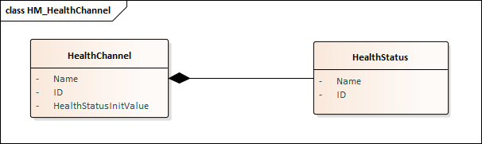
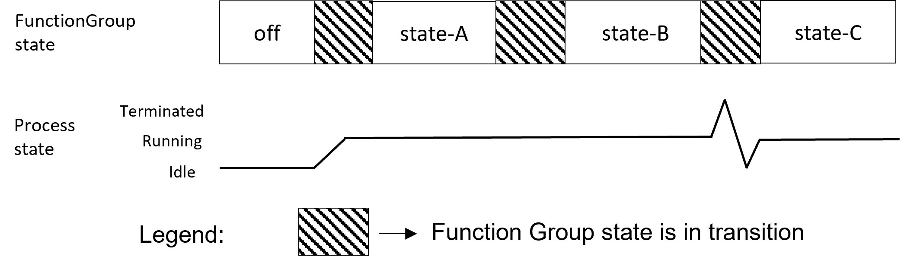
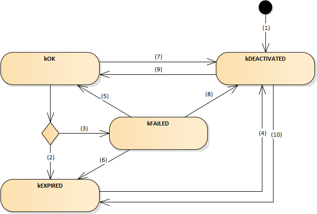
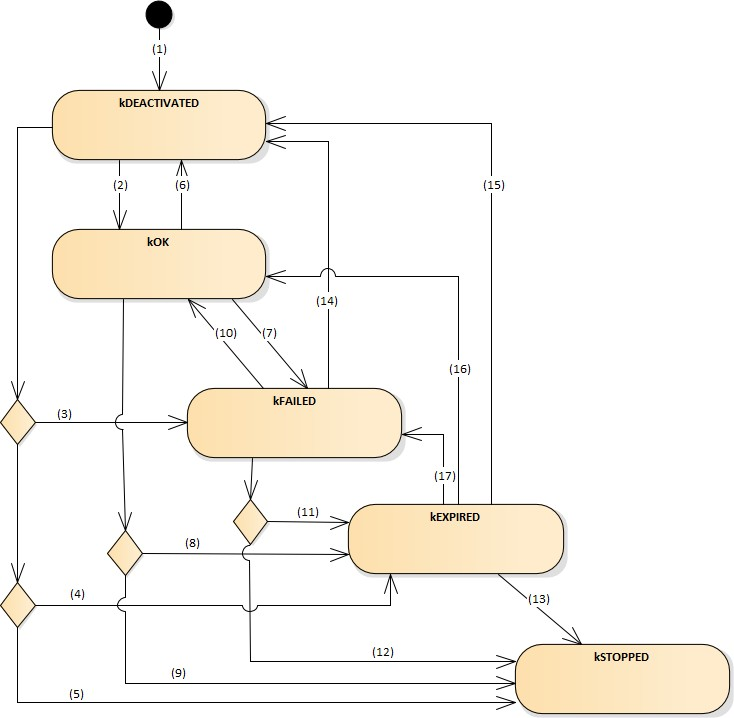
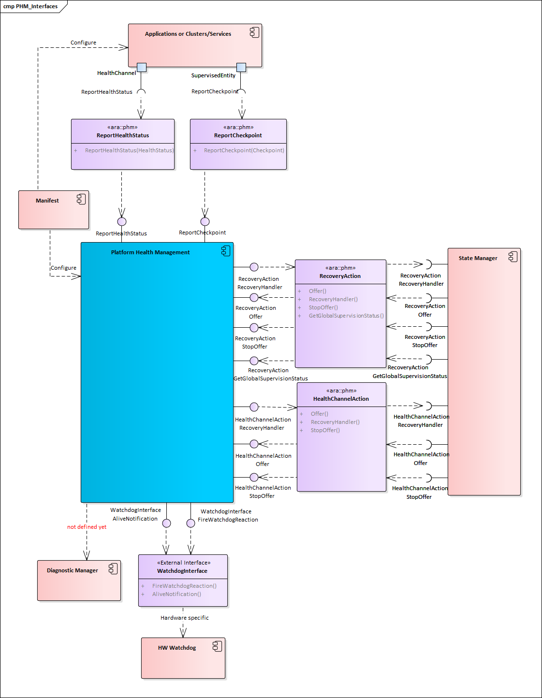
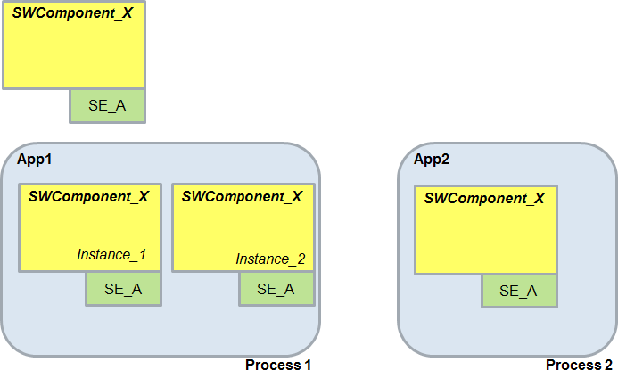

---
tip: translate by openai@2023-06-23 17:50:53
...
# Contents

```
1. [Introduction and functional overview](#introduction-and-functional-overview) 8
2. Acronyms and Abbreviations 9
3. [Related documentation](#related-documentation) 11

   1. [Input documents & related standards and norms](#input-documents-related-standards-and-norms) 11
   2. [Further applicable specification](#further-applicable-specification) 11
4. [Constraints and assumptions](#constraints-and-assumptions) 13

   1. [Known limitations](#known-limitations) 13
   2. [Applicability to car domains](#applicability-to-car-domains) 14
5. [Dependencies to other Functional Clusters](#dependencies-to-other-functional-clusters) 15

   1. [Platform dependencies](#platform-dependencies) 15

      1. [Dependencies on Execution Management](#dependencies-on-execution-management) 15
      2. [Dependencies on State Management](#dependencies-on-state-management) 15
      3. [Dependencies on Watchdog Interface](#dependencies-on-watchdog-interface) 15
      4. [Dependencies on other Functional Clusters](#dependencies-on-other-functional-clusters) 15
   2. [Protocol layer dependencies](#protocol-layer-dependencies) 15
6. Requirements Tracing 16
7. [Functional specification](#functional-specification) 23

   1. [General description](#general-description) 23
   2. [Supervision of Supervised Entities](#supervision-of-supervised-entities) 23

      1. [Start and Stop of Supervisions](#start-and-stop-of-supervisions) 25

         1. [Stopping of Alive Supervision for Self Terminating](#stopping-of-alive-supervision-for-self-terminating-process) [Process](#stopping-of-alive-supervision-for-self-terminating-process) 26
      2. [Supervision of processes started before Platform Health](#supervision-of-processes-started-before-platform-health-management) [Management](#supervision-of-processes-started-before-platform-health-management) 27
   3. [Health Channel Supervision](#health-channel-supervision) 27

      1. [Health Status after Initialization](#health-status-after-initialization) 28
      2. [Configuration of Health Channel](#configuration-of-health-channel) 28
      3. [Reporting of Health Channel](#reporting-of-health-channel) 29
   4. [Supervision Modes](#supervision-modes) 29

      1. [Effect of changing Mode](#effect-of-changing-mode) 30
   5. [Determination of Supervision Status](#determination-of-supervision-status) 32

      1. [Determination of Elementary Supervision Status](#determination-of-elementary-supervision-status) 32
      2. [Determination of Global Supervision Status](#determination-of-global-supervision-status) 37
   6. [Recovery actions](#recovery-actions) 42

      1. [Notificaton to State Management](#notificaton-to-state-management) 44
      2. [Handling of Hardware Watchdog](#handling-of-hardware-watchdog) 45
      3. [Configuration Parameters](#configuration-parameters) 46
   7. [Multiple processes and multiple instances](#multiple-processes-and-multiple-instances) 47
   8. [Functional cluster life-cycle](#functional-cluster-life-cycle) 48

      1. [Startup](#startup) 48
      2. [Shutdown](#shutdown) 48

         1. [Handling of watchdog during shutdown](#handling-of-watchdog-during-shutdown) 48
8. [API specification](#api-specification) 49

   1. [API Header files](#api-header-files) 49

      1. [Supervised Entity](#_bookmark63) 49
      2. [Health Channel](#_bookmark66) 50
   2. [API Common Data Types](#api-common-data-types) 51

      1. [Generated Types](#generated-types) 52

         1. [Enumeration for Checkpoint](#enumeration-for-checkpoint) 52
         2. [Enumeration for Health Status](#enumeration-for-health-status) 53
      2. Non-generated types 54

         1. ElementarySupervisionStatus 54
         2. GlobalSupervisionStatus 54
         3. SupervisedEntity 55
         4. HealthChannel 55
         5. RecoveryAction 56
         6. HealthChannelAction 56
         7. TypeOfSupervision 56
         8. [Daisy Chaining Related Types (Non-generated)](#daisy-chaining-related-types-non-generated) 57
         9. [Error and Exception Types](#error-and-exception-types) 57
         10. [E2E Related Data Types](#e2e-related-data-types) 57
   3. [API Reference](#api-reference) 57

      1. [SupervisedEntity API](#supervisedentity-api) 57

         1. SupervisedEntity::SupervisedEntity 58
         2. SupervisedEntity::ReportCheckpoint 58
         3. SupervisedEntity::\~SupervisedEntity 59
         4. SupervisedEntity::Operator= 59
      2. HealthChannel API 60

         1. HealthChannel::HealthChannel 60
         2. HealthChannel::ReportHealthStatus 61
         3. HealthChannel::\~HealthChannel 61
         4. HealthChannel::Operator= 62
      3. RecoveryAction API 62

         1. RecoveryAction::RecoveryAction 62
         2. RecoveryAction::Operator= 63
         3. RecoveryAction::\~RecoveryAction 64
         4. RecoveryAction::RecoveryHandler 64
         5. RecoveryAction::Offer 65
         6. RecoveryAction::StopOffer 65
      4. HealthChannelAction API 65

         1. HealthChannelAction::HealthChannelAction 65
         2. HealthChannelAction::Operator= 66
         3. HealthChannelAction::\~HealthChannelAction 67
         4. HealthChannelAction::RecoveryHandler 67
         5. HealthChannelAction::Offer 68
         6. HealthChannelAction::StopOffer 68
```

# 1 Introduction and functional overview


This document is the software specification of the Platform Health Management

> 这份文件是平台健康管理的软件规格说明。


functional cluster within the Adaptive Platform [[1](#_bookmark3)].

> 功能集群在自适应平台中[[1](#_bookmark3)]。


The specification implements the requirements specified in [[2](#_bookmark4), RS Platform Health Management].

> 规范实施了[[2](#_bookmark4), RS Platform Health Management]中指定的要求。


It also implements the general functionality described in the Foundation documents [[3](#_bookmark5), RS Health Monitoring] and [[4](#_bookmark6), ASWS Health Monitoring]. In addition to the functionality specified in [[4](#_bookmark6)], this document also defines Health Channel Supervision.

> 它还实现了基础文档[[3](#_bookmark5), RS Health Monitoring]和[[4](#_bookmark6), ASWS Health Monitoring]中描述的一般功能。除了[[4](#_bookmark6)中指定的功能之外，本文档还定义了健康通道监督。


Health Monitoring is required by [[5](#_bookmark7), ISO 26262:2018] (under the terms control flow monitoring, external monitoring facility, watchdog, logical monitoring, temporal monitoring, program sequence monitoring) and this specification is supposed to address all relevant requirements from this standard.

> 监控健康是根据ISO 26262:2018（在流程控制监控、外部监控设施、看门狗、逻辑监控、时间监控、程序序列监控等条款下）的要求，并且本规范旨在解决所有相关的标准要求。


3. # Related documentation

> # 相关文档


   1. ## Input documents & related standards and norms

> ## 输入文件及相关标准和规范

```{=html}
<!--->
```

```
1. []{#_bookmark3 .anchor}Explanation of Adaptive Platform Design []{#_bookmark4 .anchor}AUTOSAR_EXP_PlatformDesign
2. Requirements on Platform Health Management []{#_bookmark5 .anchor}AUTOSAR_RS_PlatformHealthManagement
3. Requirements on Health Monitoring []{#_bookmark6 .anchor}AUTOSAR_RS_HealthMonitoring
4. Specification of Health Monitoring []{#_bookmark7 .anchor}AUTOSAR_ASWS_HealthMonitoring
5. ISO 26262:2018 (all parts) -Road vehicles -Functional Safety [http://www.iso.org](http://www.iso.org/)
6. Glossary []{#_bookmark8 .anchor}AUTOSAR_TR_Glossary
7. General Specification of Basic Software Modules []{#_bookmark9 .anchor}AUTOSAR_SWS_BSWGeneral
8. Specification of Adaptive Platform Core []{#_bookmark10 .anchor}AUTOSAR_SWS_AdaptivePlatformCore
9. Specification of State Management []{#_bookmark11 .anchor}AUTOSAR_SWS_StateManagement
10. Specification of Execution Management []{#_bookmark12 .anchor}AUTOSAR_SWS_ExecutionManagement
11. Specification of Intrusion Detection System Manager for Adaptive Platform []{#_bookmark13 .anchor}AUTOSAR_SWS_AdaptiveIntrusionDetectionSystemManager
12. Specification of Manifest []{#_bookmark14 .anchor}AUTOSAR_TPS_ManifestSpecification
13. Explanation of Adaptive Platform Software Architecture []{#_bookmark15 .anchor}AUTOSAR_EXP_SWArchitecture
14. Guidelines for using Adaptive Platform interfaces AUTOSAR_EXP_AdaptivePlatformInterfacesGuidelines

```

```
1. ## Further applicable specification
```


AUTOSAR provides a general specification [[7](#_bookmark8), SWS_BSWGeneral] which is also applicable for Platform Health Management. The specification SWS General shall be

> AUTOSAR提供了一个通用规范[[7](#_bookmark8), SWS_BSWGeneral]，它也适用于平台健康管理。SWS General规范应该


considered as additional and required specification for implementation of Platform Health Management.

> 被视为平台健康管理实施的附加和必需的规范。


AUTOSAR provides a core specification [[8](#_bookmark9)] which is also applicable for Platform Health Management. The chapter \"General requirements for all FunctionalClusters\" of this specification shall be considered as an additional and required specification for implementation of Platform Health Management.

> AUTOSAR提供了一个核心规范[[8](#_bookmark9)],它也适用于Platform Health Management。该规范的“所有FunctionalClusters的通用要求”章节应被视为实施Platform Health Management的附加和必要的规范。


4. # Constraints and assumptions

> 4. # 约束和假设


   1. ## Known limitations

> ## 已知限制


- Daisy chaining (i.e. forwarding Supervision Status, Checkpoint or Health Channel information to an entity external to PHM or another PHM instance) is currently not supported in this document release.

> 目前本文档版本不支持黛西链式（即向PHM以外的实体或另一个PHM实例转发监督状态、检查点或健康通道信息）。
- Interface with the Diagnostic Manager is not specified in this release.
- Health Channels (HealthChannelExternalStatus) is set to obsolete.

Note: It is not intended to remove this feature from AUTOSAR Adaptive Platform overall. Rather, it is an architectural question to which Functional Cluster this feature belongs to, that is expected to be resolved for the next release.


- The configuration attribute for the alive notification cycle time (with respect to PHM sending AliveNotification to watchdog interface) is not specified for this release.

> 针对PHM向看门狗接口发送AliveNotification的存活通知周期，本版本未指定配置属性。

- A change in the value of Supervision (Alive/Deadline/Logical) configuration parameters between two Function Group states wherein the process being supervised continues to execute on switching between these states is not considered. The Supervision continues as per configuration in the Supervision Mode corresponding to old Function Group state.

> 在两个功能组状态之间超级vision（Alive/Deadline/Logical）配置参数的值变化，其中在切换这些状态时，被监督的进程仍在执行，不被认为是变化。监督按照旧的功能组状态中的监督模式继续进行。

- Similar to above limitation, dynamic change between Supervision exclusion (disable) and Supervision inclusion (enable) on Function Group state change wherein the process under consideration continues to execute on change in Function Group state is not supported. Supervision exclusion or inclusion can be applied starting with the Function Group state in which execution of the process begins and the same is applied until termination of the process.

> 类似上述限制，在功能组状态更改时，不支持动态地在监督排除（禁用）和监督包括（启用）之间进行更改，而考虑的过程继续执行。 监督排除或包括可以从执行过程开始的功能组状态开始应用，并且直到过程终止为止都会保持不变。

- Currently specified mechanism of Notifying State Management on Global Supervision Status reaching state kStopped is insufficient in case of multiple failures. It could happen that the Global Supervision Status remains in state kStopped without further notification to State Management about successive failures. Thereby the recovery might be hindered.

> 目前在全局监督状态达到kStopped时通知状态管理的机制不足，如果出现多次故障的情况，全局监督状态可能会一直处于kStopped状态而不会再次通知状态管理，从而妨碍恢复。

- \"PowerMode\" dependent Supervision configuration is not supported in this release. See [[9](#_bookmark10)] for information on \"PowerMode\".

> 不支持在此版本中使用依赖“PowerMode”的监督配置。有关“PowerMode”的信息，请参阅[[9](#_bookmark10)]。

- Supervision is not supported for non-reporting processes (for information regarding what is a non-reporting process, please refer [[10](#_bookmark11)]). Rationale: Supervision depends on process states. Non-reporting process is not expected to report its Execution State to Execution Management. Hence, Platform Health Management cannot be informed about the necessary process states by Execution Management.

> 监督不支持非报告过程（有关什么是非报告过程的信息，请参阅[[10](#_bookmark11)]）。  理由：监督取决于过程状态。 非报告过程不需要向执行管理报告其执行状态。 因此，平台健康管理无法从执行管理获得必要的过程状态信息。

- Handling of multiple hardware watchdog instances is up to implementation and not standardized in the specification.

> 处理多个硬件看门狗实例取决于实施，而不是在规范中标准化。

- State machine of Elementary Supervision Status is not specified for inter process supervisions (inter process Deadline Supervision and Logical Supervision) in this release.

> 在此版本中，尚未为进程间监督（进程间期限监督和逻辑监督）指定基本监督状态机。


  1. ## Applicability to car domains

> ## 对汽车领域的适用性

No restriction


5. # Dependencies to other Functional Clusters

> 5. 与其他功能群的依赖关系


   1. ## Platform dependencies

> ## 平台依赖


The interfaces within AUTOSAR Adaptive Platform are not standardized.

> AUTOSAR Adaptive Platform内部的接口没有标准化。

### Dependencies on Execution Management


The Platform Health Management functional cluster is dependent on the Execution Management Interface [[10](#_bookmark11)].

> 平台健康管理功能群取决于执行管理接口[[10](#_bookmark11)]。


Following process state information is needed from Execution Management with respect to processes for which supervision is configured:

> 需要从执行管理获取关于已配置监督的进程的以下进程状态信息：

- process reporting Execution State kRunning,
- process terminated,
- process is about to be informed by Execution Management to terminate.

### Dependencies on State Management


The Platform Health Management functional cluster has an interface also with the State Management: If a failure is detected within a Supervised Entity or via Health Channel, Platform Health Management notifies State Management on this failure.

> 平台健康管理功能簇与状态管理也有接口：如果在受监督实体中检测到故障或通过健康通道检测到故障，平台健康管理将向状态管理发出通知。

### Dependencies on Watchdog Interface


The Platform Health Management functional cluster is dependent also on the Watchdog Interface.

> 平台健康管理功能群也取决于看门狗接口。

### Dependencies on other Functional Clusters


It is possible for all functional clusters to use the Supervision mechanisms provided by the Platform Health Management by using Checkpoints and the Health Channels as the other Applications.

> 所有功能集群都可以通过使用检查点和健康通道作为其他应用程序，利用平台健康管理提供的监督机制。

## Protocol layer dependencies

None.


7. # Functional specification

> 7. # 功能规格


   1. ## General description

> ## 一般描述


The Platform Health Management monitors applications with respect to timing constraints (Alive Supervision and Deadline Supervision) and logical program sequence (Logical Supervision) as well as platform health (Health Channel Supervision). In case of a detected failure, Platform Health Management notifies State Management. As coordinator of the platform, State Management can decide how to handle the error and trigger a suitable recovery action.

> 平台健康管理监视应用程序的时间约束（存活监督和期限监督）和逻辑程序序列（逻辑监督）以及平台健康（健康通道监督）。如果检测到故障，平台健康管理会通知状态管理。作为平台的协调者，状态管理可以决定如何处理错误并触发合适的恢复操作。


Platform Health Management has also an interface to the hardware watchdog and can trigger a watchdog reaction in case of a critical failure where a notification to State Management is not sufficient.

> 平台健康管理还具有与硬件看门狗的接口，如果发生关键性故障而发出通知状态管理不足以解决的情况，可以触发看门狗反应。


All the algorithms and the procedures for the Platform Health Management are described in the Autosar Foundation document [[4](#_bookmark6)] and are not specified here: only the Autosar Adaptive specificities, including the interfaces with the other functional clusters, are shown here below.

> 所有用于平台健康管理的算法和程序都在Autosar基础文档[[4](#_bookmark6)]中描述，在这里不会详细说明：只有Autosar Adaptive的特性，包括与其他功能组件的接口，会在下面展示。


The interfaces of Health Management to other Functional Clusters are only informative and are not standardized.

> 健康管理与其他功能集群的接口仅是信息性的，并未标准化。

## Supervision of Supervised Entities


State Management coordinates the platform through Function Groups [[9](#_bookmark10)]. Within a Function Group, there may be multiple Processes running.

> 状态管理通过功能组协调平台[[9](#_bookmark10)]。在一个功能组中，可能有多个进程在运行。


Platform Health Management monitors Supervised Entitys. Each Supervised Entity maps to whole or part of a Process. The monitoring is active as long as the corresponding Process is active.

> 平台健康管理监控监督实体。每个监督实体映射到整个或部分过程。只要相应的过程处于活动状态，监控就会保持活动状态。


Platform Health Management provides three kinds of supervisions to monitor a Supervised Entity: Alive Supervision, Deadline Supervision and Logical Supervision. The supervision algorithms are described in [[4](#_bookmark6)]. Only details specific for Adaptive Platform are described in this document.

> 平台健康管理为监督实体提供了三种监督：活动监督、截止日期监督和逻辑监督。监督算法在[[4](#_bookmark6)]中描述。本文仅描述了自适应平台的特定细节。


The results of the supervisions of a Supervised Entity Instance are reflected in the Elementary Supervision Status. The status of elementary supervisions within a Function Group is conglomerated in the corresponding Global Supervision Status.

> 经过受监管实体实例监管的结果反映在基础监管状态中。功能组中基本监管的状态被集中在相应的全局监管状态中。


**[SWS_PHM_00100]**{DRAFT} **Scope of Global Supervision** *[*The Platform Health Management shall support one or a few GlobalSupervision for a Function Group.*♩(RS_HM_09237, RS_HM_09249)*

> **[SWS_PHM_00100]**{草案} **全局监督范围** *[*平台健康管理应支持一个或几个功能组的全局监督。*♩(RS_HM_09237, RS_HM_09249)*


As described in [[4](#_bookmark6)], the supervisions are based on checkpoints which are reported by the Supervised Entity Instance.

> 根据[[4](#_bookmark6)]中所述，监督是基于由被监督实体实例报告的检查点。


**[SWS_PHM_01341]**{DRAFT} **Reporting of Supervision Checkpoint mapped to No Supervision provision** *[*If a SupervisionCheckpoint reported to Platform Health Management via ReportCheckpoint is

> **[SWS_PHM_01341]**{草案} **将监督检查点报告映射到无监督提供** *[*如果通过ReportCheckpoint向Platform Health Management报告的SupervisionCheckpoint，

- configured to (referenced in) NoCheckpointSupervision or
- the corresponding Supervised Entity instance is configured to NoSupervision


in the Supervision Mode corresponding to the Function Group State in which the process is executing, then Platform Health Management shall ignore the reporting of the SupervisionCheckpoint for evaluation of supervisions (Alive, Deadline and Logical).*♩(RS_PHM_00101, RS_HM_09254)*

> 在进程正在执行的功能组状态对应的监督模式下，平台健康管理将忽略对监督（Alive、Deadline和Logical）的SupervisionCheckpoint报告的评估。（RS_PHM_00101，RS_HM_09254）

Note: The behavior in case of reported, undefined checkpoints is currently not specified. This will be specified in the next release.


**[SWS_PHM_01229]**{DRAFT} **Restricted access on reporting of Checkpoints** *[*The Platform Health Management shall ignore the execution of ReportCheckpoint for evaluation of Alive, Deadline and Logical Supervision if the reporting process does not correspond to the reported SupervisionCheckpoint, i.e. reporting process is not the same as reported SupervisionCheckpoint.process.*♩(RS_PHM_00101, RS_HM_09254, RS_IAM_00002, RS_IAM_00010)*

> **[SWS_PHM_01229]**{草案} **检查点报告的受限访问** *[*如果报告处理不符合报告的监督检查点，即报告处理与报告的监督检查点处理不同，则平台健康管理应忽略报告检查点的执行以评估存活、最后期限和逻辑监督。*♩(RS_PHM_00101, RS_HM_09254, RS_IAM_00002, RS_IAM_00010)*


Example: Consider SupervisionCheckpoint SV_CP_A is referencing Process Proc_A through attribute SupervisionCheckpoint.process in the manifest and it is referenced in AliveSupervision through attribute AliveSupervision.checkpoint. In runtime, if a process other than Proc_A (e.g: Proc_B) reports SV_CP_A, then this reporting is not to be considered for evaluation of Alive Supervision.

> 考虑监督检查点SV_CP_A，它通过清单中的属性SupervisionCheckpoint.process引用过程Proc_A，并且它在AliveSupervision中通过属性AliveSupervision.checkpoint引用。在运行时，如果一个过程（例如Proc_B）报告SV_CP_A，那么这个报告不被认为是对Alive Supervision评估的一部分。


If a checkpoint is reported by the \"'wrong\"' process, this is considered as access violation and a potential security threat.

> 如果一个检查点是由“错误”的进程报告的，这被视为访问违规，是一个潜在的安全威胁。


**[SWS_PHM_01339]**{DRAFT} **Reporting access violation w.r.t. checkpoints to IdsM** *[*Security event PHM_SEV_ACCESSVIOLATION_CHECKPOINT with the context data given in table [7.1](#_bookmark30) shall be reported to IdsM (see [[11](#_bookmark12)]) if it occurs that the reported SupervisionCheckpoint does not correspond to the process reporting it, i.e. reporting process is not the same as reported SupervisionCheckpoint.process.*♩ (RS_IAM_00002, RS_IAM_00010, RS_Ids_00810)*

> 报告访问违反与检查点相关的内容至IdsM：如果报告的监督检查点与报告过程不一致，即报告过程与报告的监督检查点过程不同，则需要使用表7.1中给出的上下文数据报告安全事件PHM_SEV_ACCESSVIOLATION_CHECKPOINT至IdsM（参见11）。（RS_IAM_00002，RS_IAM_00010，RS_Ids_00810）


**Table 7.1: Checkpoint Access Violation SEV**

> 表7.1：检查点访问违规SEV

### Start and Stop of Supervisions


**[SWS_PHM_01331]**{DRAFT} **Start of Alive Supervision** *[*The Platform Health Management shall start the first aliveReferenceCycle of a configured AliveSupervision of a Supervised Entity Instance as soon as the corresponding process reports Execution State kRunning.*♩(RS_HM_09125, RS_HM_09249)*

> **[SWS_PHM_01331]**{草案}**开始运行监控** *[*平台健康管理应当在相应的进程报告执行状态kRunning时立即开始一个配置的被监控实体实例的第一个AliveReferenceCycle的运行监控。*♩(RS_HM_09125, RS_HM_09249)*


Rationale: Cyclic execution is expected only after process reached state kRunning. Execution Management monitors that the process reaches state kRunning within a configured timeout.

> 理由：只有在进程达到kRunning状态后，才预期进行循环执行。执行管理监控进程在配置的超时时间内达到kRunning状态。


The information of process reporting Execution state kRunning is to be provided by Execution Management. through a vendor specific Inter Functional Cluster Interface.

> 执行管理通过供应商特定的跨功能集群接口提供运行状态kRunning的进程报告信息。


**[SWS_PHM_01332]**{DRAFT} **Checkpoints corresponding to Alive Supervision before kRunning** *[*With respect to Alive Supervision, Platform Health Management shall ignore Checkpoints reported by a Supervised Entity Instance before the corresponding process reaches state kRunning.*♩(RS_HM_09125, RS\_HM_09249)*

> **[SWS_PHM_01332]**{草稿} **在kRunning之前与存活监督相对应的检查点** *[*关于存活监督，平台健康管理应忽略由受监督实例上报的检查点，直到相应的进程达到kRunning状态。*♩(RS_HM_09125，RS\_HM_09249)*


Implementation hint: The same time base should be used between Execution Management and Platform Health Management to synchronize the kRunning state with the start of the Alive Supervision. See [[SWS_PHM_01334](#_bookmark32)] for details.

> 实施提示：在执行管理和平台健康管理之间使用相同的时间基准来同步 kRunning 状态与存活监测的开始。有关详细信息，请参见[[SWS_PHM_01334](#_bookmark32)]。

Note: The start of intra-process Deadline Supervision and Logical Supervision (i.e. Logical and Deadline Supervision with all referenced SupervisionCheckpoints corresponding to a single process) does not depend on the process reporting Execution State kRunning. That is, the Deadline Supervision and Logical Supervision can start even before the process reaching state kRunning. Please refer [[4](#_bookmark6)] for details of Deadline Supervision and Logical Supervision.


**[SWS_PHM_01333]**{DRAFT} **Termination of Supervised Processes** *[*As soon as Platform Health Management receives the information from Execution Management that a supervised process is about to be notified to terminate (by issuing SIGTERM) or the process is terminated (considering the case of process terminating abruptly, i.e. without SIGTERM issued by Execution Management), Platform Health Management shall stop all intra-process supervisions corresponding to the process (that is stop all Alive, Deadline and Logical Supervision involving SupervisionCheckpoints of the corresponding process only).*♩(RS_HM_09125, RS_HM\_09249)*

> 当平台健康管理收到执行管理发出的即将通知终止（通过发出SIGTERM）监督进程或者进程已经终止（考虑到进程突然终止的情况，即没有执行管理发出SIGTERM）的信息后，平台健康管理将停止与该进程相关的所有内部进程监督（即只停止涉及相应进程的所有Alive，Deadline和逻辑监督的监督检查点）。(RS_HM_09125，RS_HM_09249)


Rationale: Process is expected to start terminating on receiving SIGTERM from Execution Management. Execution Management monitors the termination timeout once it issues SIGTERM to the process. Considering this, additional monitoring of the process by Platform Health Management via Supervisions is considered to be not necessary.

> 理由：预计在收到执行管理发出的SIGTERM信号时，进程将开始终止。一旦执行管理发出SIGTERM信号，它会监视终止超时。考虑到这一点，认为不需要平台健康管理通过监督对进程进行额外的监控。


[]{#_bookmark32 .anchor}**[SWS_PHM_01334]**{DRAFT} **Time Source for Supervisions** *[*All timing aspects related to Platform Health Management shall be measured in the context of the reporting process using the same time source.*♩(RS_HM_09254, RS_HM_09249)*

> 所有与平台健康管理相关的时间方面，都应在报告过程中使用相同的时间源来衡量。（RS_HM_09254，RS_HM_09249）


To avoid effect of delays and jitter in the inter-process communication to Platform Health Management, timing aspects related to Platform Health Management (i.e. synchronization of kRunning state between Execution Management and Platform Health Management, the timestamp w.r.t reporting of checkpoints (consider Deadline Supervision)) shall be taken in the context of the reporting process using the same time source.

> 为了避免平台健康管理中进程间通信延迟和抖动的影响，与平台健康管理相关的时间方面（即执行管理和平台健康管理之间的kRunning状态同步，关于报告检查点的时间戳（考虑到期限监督））应使用相同的时间源在报告处理的上下文中进行处理。


Implementation Hint: ara::core::SteadyClock could be used to obtain time stamp (in other words, for time keeping).

> 实施提示：可以使用ara::core::SteadyClock来获取时间戳（换句话说，用于时间记录）。

### Stopping of Alive Supervision for Self Terminating Process


In case of a Self-Terminating Process, the process can intentionally terminate even without SIGTERM being issued by Execution Management. Hence, it is necessary to mark the point in time at which the process starts to (self-) terminate so that the Alive Supervision could be stopped. This is intended to be achieved by process reporting a checkpoint named as terminatingCheckpoint. Additionally, a timeout (configurable) has to be monitored by Platform Health Management to check that the process terminates within this duration since reporting of terminatingCheckpoint. This timeout check is to monitor that the process is not stuck in its execution and therefore is not terminating.

> 在自我终止进程的情况下，进程可以在没有执行管理发出SIGTERM的情况下自行终止。因此，有必要标记进程开始（自我）终止的时间点，以便可以停止存活监视。这是通过进程报告一个名为terminatingCheckpoint的检查点来实现的。此外，平台健康管理还必须监视一个可配置的超时，以检查进程是否在报告terminatingCheckpoint后在此期间内终止。此超时检查是为了监视进程是否陷入执行中而无法终止。

Note: Unless SIGTERM is issued to the process by Execution Management, Execution Management will not monitor for process termination timeout.


Platform Health Management is to be informed by Execution Management regarding the termination of the process.

> 平台健康管理需要由执行管理通知关于流程终止的情况。


**[SWS_PHM_01335]**{DRAFT} **Stopping of Alive Supervision for Self-Terminating Process** *[*In case of Self-Terminating Process, Alive Supervision shall be stopped on reporting of terminatingCheckpoint by the process or as soon as Platform Health Management receives the information from Execution Manage-

> **[SWS_PHM_01335]**{草案} **对自动终止进程的存活监控停止** *[*在自动终止进程的情况下，存活监控应在进程报告终止检查点时或者一旦平台健康管理从执行管理接收到信息时停止。


ment that the process will be notified to terminate (by issuing SIGTERM), whichever is earlier.*♩(RS_HM_09125, RS_HM_09249)*

> 进程将会收到终止通知（通过发出SIGTERM），以先到者为准。


**[SWS_PHM_01336]**{DRAFT} **Timeout monitoring for termination of SelfTerminating Process** *[*On reporting of terminatingCheckpoint by a SelfTerminating Process, Platform Health Management shall start monitoring the timeout. That is, Platform Health Management shall monitor that the process terminates within terminatingCheckpointTimeoutUntilTermination since reporting of terminatingCheckpoint. In case the process takes longer than terminatingCheckpointTimeoutUntilTermination for termination, this shall be notified as failure to State Management.*♩(RS_HM_09125, RS_HM_09249)*

> **[SWS_PHM_01336]**{草案} **自终止进程的超时监控** *[*自终止进程报告终止检查点时，平台健康管理应开始监控超时。也就是说，平台健康管理应监控进程在报告终止检查点后的terminatingCheckpointTimeoutUntilTermination内终止。如果进程终止所需时间超过terminatingCheckpointTimeoutUntilTermination，这将被报告给状态管理作为失败。♩(RS_HM_09125, RS_HM_09249)*


**[SWS_PHM_01337]**{DRAFT} **Unintended termination of Self-Terminating Process** *[*If an Alive Supervision is configured for a Self Terminating Process and if the process terminates without reporting terminatingCheckpoint and no SIGTERM was issued to the process by Execution Management, then Platform Health Management shall notify a failure of Alive Supervision to State Management via ara::phm::RecoveryAction::RecoveryHandler.*♩(RS_HM\_09125, RS_HM_09249)*

> **[SWS_PHM_01337]**{草案} **自动终止进程的意外终止** *[*如果为自动终止进程配置了活动监视，并且该进程在未报告终止检查点且未由执行管理发出SIGTERM的情况下终止，则平台健康管理应通过ara :: phm :: RecoveryAction :: RecoveryHandler向状态管理通知活动监视失败。*♩（RS_HM\_09125，RS_HM_09249）*


**[SWS_PHM_01338]**{DRAFT} **Avoid redundant Monitoring of Termination for SelfTerminating Process** *[*If an Alive Supervision is configured for a Self Terminating Process and if after reporting of terminatingCheckpoint and before terminatingCheckpointTimeoutUntilTermination is elapsed Platform Health Management receives the information from Execution Management that the process will be notified to terminate via SIGTERM, then Platform Health Management shall stop monitoring the timeout.*♩(RS_HM_09125, RS_HM_09249)*

> **[SWS_PHM_01338]**{草案} **避免对自我终止进程进行冗余监控** *[*如果为自我终止进程配置了存活监视，并且在报告终止检查点之后，在终止检查点超时终止之前，平台健康管理收到来自执行管理的信息，表明该进程将通过SIGTERM通知终止，那么平台健康管理应该停止监控超时。*♩(RS_HM_09125, RS_HM_09249)*


This is because, once SIGTERM is issued by Execution Management to the process, Execution Management will monitor the process termination timeout.

> 这是因为，一旦执行管理向进程发出SIGTERM，执行管理将监视进程终止超时。

### Supervision of processes started before Platform Health Management


Start of Supervision (Alive Supervision/Deadline Supervision/Logical Supervision) in case of processes that are started before Platform Health Management process (e.g, process corresponding to Execution Management) is not standardized. It is up to Adaptive Platform Vendor specific decision.

> 开始监督（活动监督/期限监督/逻辑监督），在平台健康管理进程（例如，与执行管理相对应的进程）尚未标准化的情况下，取决于自适应平台供应商的具体决定。

## Health Channel Supervision


Using Health Channel Supervision the system integrator can hook external supervision results to the Platform Health Management. External supervision can be routines like RAM test, ROM test, kernel status, voltage monitoring etc. The external supervision performs the monitoring and debouncing. The determined result is

> 使用健康通道监督，系统集成商可以将外部监督结果连接到平台健康管理上。外部监督可以是诸如RAM测试、ROM测试、内核状态、电压监控等常规操作。外部监督执行监控和去抖动。确定的结果是


classified according to the possible Health Status values and sent to Platform Health Management.

> 依据可能的健康状况值进行分类，并发送到平台健康管理。

A Health Channel can be

- the Global supervision status of the software under supervision.

- the result of an environment monitoring algorithm. e.g. Voltage Monitoring, Temperature Monitoring.

> 环境监测算法的结果，例如电压监测、温度监测。
- the result of a memory integrity test routine, e.g. RAM test, ROM test.
- the status of the operating system or Kernel. e.g. OS Status, Kernel Status.
- the status of another platform instance or Virtual Machine or ECU.


The various external monitoring routines shall report their result or status in the form of defined Health Statuses to the Platform Health Management. The Health Status of a Health Channel is the abstract format of the information that a Health Channel provides to the Platform Health Management. Two different Health Channels may have same Health Status names to represent its result, e.g. high, low, normal.

> 各种外部监控例程应以定义的健康状态的形式向平台健康管理报告其结果或状态。健康通道的健康状态是健康通道向平台健康管理提供的信息的抽象格式。两个不同的健康通道可能具有相同的健康状态名称来表示其结果，例如高、低、正常。


If a reaction on a determined Health Status is necessary, Platform Health Management reports the status to State Management.

> 如果需要对某个特定的健康状态做出反应，平台健康管理将状态报告给状态管理。

### Health Status after Initialization


The Health Status after initialization is controlled by the configuration container [HealthStatusInitValue](#_bookmark38). This parameter may be configured once for each Health Channel in the configuration.

> 健康状态在初始化后由配置容器[HealthStatusInitValue](#_bookmark38)控制。此参数可以在配置中为每个健康通道配置一次。


**[SWS_PHM_00010]**{OBSOLETE} **Not initialized Health Channel** *[*If the container [HealthStatusInitValue](#_bookmark38) does not exist or the Health Channel does not already have an initial value, the Platform Health Management shall treat the corresponding Health Status as undefined and not use it until the corresponding Health Channel has been updated for the first time.*♩(RS_PHM_09255, RS_HM_09249)*

> **[SWS_PHM_00010]**{已废弃} **未初始化的健康通道** *[*如果容器[HealthStatusInitValue](#_bookmark38)不存在或者健康通道尚未有初始值，那么平台健康管理将把相应的健康状态视为未定义，并且在相应的健康通道第一次更新之前不使用它。*♩(RS_PHM_09255, RS_HM_09249)*

### Configuration of Health Channel


A Health Channel has the following configuration options:

> 一个健康频道有以下配置选项：


1. Name: Globally unique name identifier, used by Applications.

> 名称：全球唯一名称标识符，由应用程序使用。

2. ID: Globally unique identifier (number)

> 2. ID：全球唯一的标识符（编号）

3. []{#_bookmark38 .anchor}HealthStatusInitValue: Initial value of the corresponding Health Status.

> 健康状态初始值：相应健康状态的初始值。


A Health Status represents a possible value of the Health Channel and has the following options:

> 健康状态代表健康渠道的可能值，有以下选项：


1. Name: used by Applications, unique within the Health Channel

> 名称：在健康频道内使用，唯一不重复

2. ID: Identifier of the Health Status, unique within the Health Channel.

> 2. ID：健康状态的标识符，在健康频道内唯一。

{width="6.18625in" height="1.8477077865266842in"}

**Figure 7.1: Health Channel configuration**

### Reporting of Health Channel


The current Health Status is reported to Platform Health Management via the method ReportHealthStatus.

> 当前的健康状况通过方法ReportHealthStatus报告给平台健康管理。


**[SWS_PHM_01328]**{OBSOLETE} **Consistency of Health Status Identifier** *[*The value of healthStatusId reported via ReportHealthStatus shall match the declared statusId of the respective PhmHealthChannelInterface.status.*♩(RS\_PHM_00102, RS_PHM_09257)*

> **[SWS_PHM_01328]**{已废弃} **健康状态标识符的一致性** *[*通过ReportHealthStatus报告的healthStatusId的值应与相应的PhmHealthChannelInterface.status的声明状态Id相匹配。♩（RS_PHM_00102，RS_PHM_09257）*


**[SWS_PHM_01329]**{OBSOLETE} **Reporting of undefined Health Status Identifier** *[*If a healthStatusId is reported to Platform Health Management and no corresponding PhmHealthChannelStatus is configured in the context of the reporting PhmHealthChannelInterface, PHM shall ignore the reporting of healthStatus.*♩ (RS_PHM_00102, RS_PHM_09257)*

> **[SWS_PHM_01329]**{已过时}**未定义的健康状态标识符的报告** *[*如果将健康状态标识符报告给平台健康管理，而报告的PhmHealthChannelInterface上下文中没有相应的PhmHealthChannelStatus配置，则PHM将忽略健康状态的报告。♩ (RS_PHM_00102, RS_PHM_09257)*


**[SWS_PHM_01330]**{OBSOLETE} **Restricted access on reporting of Health Status** *[*The execution of ReportHealthStatus shall be prevented (i.e, shall not be considered for notifying State Management) if the reporting process is not the same as the reported HealthChannelExternalStatus.process.*♩(RS_PHM_00102, RS\_PHM_09257, RS_IAM_00002, RS_IAM_00010)*

> **[SWS_PHM_01330]**{已废弃} **健康状态报告的受限访问** *[*如果报告过程与报告的HealthChannelExternalStatus.process不同，则应阻止执行ReportHealthStatus（即，不考虑状态管理通知）。*♩(RS_PHM_00102, RS\_PHM_09257, RS_IAM_00002, RS_IAM_00010)*

简体中文：**[SWS_PHM_01330]**{已废弃} **健康状态报告的受限访问** *[*如果报告过程与报告的HealthChannelExternalStatus.process不同，则应阻止执行ReportHealthStatus（即，不考虑状态管理通知）。*♩(RS_PHM_00102, RS\_PHM_09257, RS_IAM_00002, RS_IAM_00010)*

## Supervision Modes


Expected execution (timing or sequence) of the Software can change based on certain conditions. Hence, the value of the Supervision (Alive/Deadline/Logical) parameters might have to be changed based on conditions. For each such condition a mode called a Supervision Mode can be configured. Currently, this condition can be configured based on Function Group State.

> 预期的软件执行（时序或顺序）可能会根据某些条件而改变。因此，监督（活动/期限/逻辑）参数的值可能必须根据条件而改变。对于每种这样的条件，可以配置一种称为监督模式的模式。目前，可以根据功能组状态配置此条件。

Note: It is possible to exclude (disable) Supervision for a Supervised Entity Instance in a Supervision Mode. This can be achieved by configuring NoSupervision for the Supervised Entity Instance in the Supervision Mode.

### Effect of changing Mode


In AUTOSAR Adaptive Platform, Supervision Mode changes on Function Group State change.

> 在AUTOSAR Adaptive平台中，监控模式会随功能组状态的变化而改变。


Function Group State change has following impact on processes:

> 功能群状态更改对流程有以下影响：

- Certain processes are terminated.
- Certain processes are newly started.
- Certain processes are restarted.
- Remaining processes continue to execute.


Supervisions (Alive, Deadline and Logical) of the Supervised Entitys corresponding to the processes shall be handled as follows.

> 监督实体对应的过程的监督(活动、最后期限和逻辑)将按照下列方式处理。


[]{#_bookmark42 .anchor}**[SWS_PHM_00240]**{DRAFT} **Supervisions on termination of process** *[*Alive Supervision, Deadline Supervision and Logical Supervision shall be stopped on termination of the corresponding process. Results of Alive, Deadline and Logical Supervision shall be set to correct.*♩(RS_PHM_00104)*

> [SWS_PHM_00240]{DRAFT} **关于进程终止的监督** *[*活动监督、期限监督和逻辑监督在相应进程终止时应停止。活动、期限和逻辑监督的结果应设置为正确。*♩(RS_PHM_00104)*


The termination of the process could be due to various reasons. It could be due to change in Function Group State (the process is not configured to be executed in the new Function Group State), a self-terminating process is terminating on its own or abrupt termination of a process (e.g. due to out of bound memory access).

> 进程的终止可能有多种原因。可能是由于功能组状态的变化（该进程未配置为在新的功能组状态下执行），自终止进程正在自行终止，或进程突然终止（例如由于超出内存访问范围）。

Note:


1. On termination of process, Elementary Supervision Status of the corresponding Supervised Entity Instance will be set to kDEACTIVATED.

> 在流程终止时，相应受监督实体实例的基本监督状态将被设置为kDEACTIVATED。

2. For a process, monitoring is active when the process is executing (that is, when the Execution state of the process is \"Initializing\" or \"Running\" or \"Terminating\"). It is deactivated (stopped) when the process is terminated.

> 对于一个进程，当进程正在执行（也就是说，当进程的执行状态为“初始化”或“运行”或“终止”时），监控是激活的。当进程终止时，监控会被停止。


[]{#_bookmark43 .anchor}**[SWS_PHM_00241]**{DRAFT} **Supervisions on Start of Process** *[*On start of the process for which a Supervision (Alive Supervision, Deadline Supervision and/or Logical Supervision) is configured in the new Function Group State, the Supervision (Alive Supervision, Deadline Supervision and/or Logical Supervision) shall be performed as per the configured Supervision parameter values in the Supervision Mode corresponding to new Function Group State.*♩ (RS_PHM_00104)*

> 在新功能组状态中配置了监督（活动监督、期限监督和/或逻辑监督）的过程开始时，应按照新功能组状态中配置的监督参数值在相应的监督模式下执行监督（活动监督、期限监督和/或逻辑监督）。（RS_PHM_00104）


**[SWS_PHM_00244]**{DRAFT} **NoSupervision on Start of Process** *[*On start of the process in the new Function Group State, if NoSupervision is configured for

> **[SWS_PHM_00244]**{草案} **在流程开始时无监督** *[*在新功能组状态开始流程时，如果配置了无监督


a Supervised Entity Instance corresponding to the process in the Supervision Mode corresponding to the new Function Group State, then no Supervision (no Alive Supervision, Deadline Supervision or Logical Supervision) shall be performed for the Supervised Entity Instance in the Supervision Mode corresponding to new Function Group State.*♩(RS_PHM_00104)*

> 对应于新功能组状态的监督模式中的过程的监督实体实例，则不应对对应于新功能组状态的监督模式中的监督实体实例执行任何监督（无活动监督、截止日期监督或逻辑监督）。♩（RS_PHM_00104）

Note: Even though it is supported to exclude (disable) Supervision in a particular Supervision Mode, dynamic change between Supervision inclusion (enable) and exclusion (disable) during execution of Process is not supported. Supervision exclusion can be applied starting from the Supervision Mode corresponding to the Function Group state in which the execution of the process is started. Supervision exclusion continues until the termination of the process. The same principle applies to a change in supervision parameters.

{width="6.295417760279965in" height="1.8396872265966755in"}

**Figure 7.2:** []{#_bookmark44 .anchor}**Supervision Exclusion and change of Function Group State**


Figure [7.2](#_bookmark44) shows an example: If Supervision is excluded in Function Group state-A, same will continue in Function Group state-B. Supervision can be applied again in state-C wherein the process is restarted (but not in state-B).

> 图7.2显示一个例子：如果在功能组状态A中排除监督，则在功能组状态B中将继续保持相同。在状态C中可以重新应用监督（但不是在状态B中）。


**[SWS_PHM_00242]**{DRAFT} **Supervisions on Restart of Process** *[*Supervisions on restart of a process due to Function Group State change shall be handled as termination of process (see [[SWS_PHM_00240](#_bookmark42)]) followed by start of process (see [[SWS_PHM_00241](#_bookmark43)]).*♩(RS_PHM_00104)*

> **[SWS_PHM_00242]**{草案} **重启过程的监督** *[*由于功能组状态更改而导致的重启过程的监督应处理为过程终止（参见[[SWS_PHM_00240](#_bookmark42)])，然后再启动过程（参见[[SWS_PHM_00241](#_bookmark43)]）。*♩(RS_PHM_00104)*


**[SWS_PHM_00243]**{DRAFT} **Continuation of Supervisions** *[*Supervisions (Alive, Deadline and Logical) shall be continued with same values of Supervision parameters if the corresponding process continues to execute on Function Group State change.*♩(RS_PHM_00104)*

> **[SWS_PHM_00243]**{草稿} **继续监督** *[*如果相应的过程继续在功能组状态更改时执行，则监督（活动，截止日期和逻辑）将继续使用监督参数的相同值。♩（RS_PHM_00104）*


**[SWS_PHM_00245]**{DRAFT} **Continuation of NoSupervision (Supervision Exclusion)** *[*If NoSupervision is configured for a Supervised Entity Instance in the Supervision Mode corresponding to the Function Group State, in which the execution of the corresponding process starts, then no Supervision (no Alive Supervision, Deadline Supervision or Logical Supervision) shall be continued on change in Function Group State to a new state if the process continues to execute on Function Group State change.*♩(RS_PHM_00104)*

> **[SWS_PHM_00245]**{草案} **无监督（监督排除）的继续** *[*如果为功能组状态对应的监督模式中的受监督实体实例配置了NoSupervision，在该过程开始执行时，则在功能组状态更改为新状态时，如果该过程继续执行，则不应继续执行任何监督（无活动监督、期限监督或逻辑监督）。*♩(RS_PHM_00104)*

简体中文：**[SWS_PHM_00245]**{草案} **无监督（监督排除）的继续** *[*如果为功能组状态对应的监督模式中的受监督实体实例配置了NoSupervision，在该过程开始执行时，如果功能组状态发生变化而该过程继续执行，则不应继续执行任何监督（无活动监督、期限监督或逻辑监督）。*♩(RS_PHM_00104)*

## Determination of Supervision Status


Based on the results of Alive Supervision, Deadline Supervision and Logical Supervision the Elementary Supervision Status and Global Supervision Status are determined. Please refer [[4](#_bookmark6)] for details of these Supervisions.

> 根据Alive Supervision、Deadline Supervision和Logical Supervision的结果，确定基本监督状态和全局监督状态。关于这些监督的详细信息，请参见[[4](#_bookmark6)]。

### Determination of Elementary Supervision Status


The Elementary Supervision Status state machine determines the status of an individual Alive Supervision, Deadline Supervision and Logical Supervision. This is done based on the following:

> 状态机确定个人的基本监督状态，包括活动监督、期限监督和逻辑监督。这是基于以下内容进行的：


1. Previous value of the Elementary Supervision Status,

> 上一次的基础监督状态

2. Current values of the result (correct/incorrect) of the corresponding Alive Supervision, Deadline Supervision and Logical Supervision

> 当前结果（正确/错误）对应的活动监督、期限监督和逻辑监督的值


The state machine is initialized at the initialization of the Platform Health Management. Note: In this release, only state machine for Elementary Supervision Status for intra process supervision is specified.

> 在平台健康管理初始化时，状态机会被初始化。注意：在这个版本中，只有用于进程内监督的基本监督状态的状态机被指定。


**[SWS_PHM_01342]**{DRAFT} **Tracking of Elementary Supervision Status** *[*The Platform Health Management shall track the Elementary Supervision Status of each Alive Supervision, Deadline Supervision and Logical Supervision.*♩(RS_PHM_00111)*

> **[SWS_PHM_01342]**{草稿} **跟踪基础监督状态** *[*平台健康管理应跟踪每个活动监督、期限监督和逻辑监督的基础监督状态。*♩(RS_PHM_00111)*


Figure [7.3](#_bookmark47) shows the state machine for Elementary Supervision Status of a supervision with all possible states.

> 图7.3展示了一个监管的基本监管状态机，其中包含所有可能的状态。


**[SWS_PHM_01343]**{DRAFT} **States of state machine for Elementary Supervision Status** *[*The Platform Health Management shall have the Elementary Supervision Statuses kOK, kDEACTIVATED, kEXPIRED and kFAILED.*♩(RS_PHM\_00111)* See also figure [7.3](#_bookmark47) and ara::phm::ElementarySupervisionStatus.

> **[SWS_PHM_01343]**{草案} **基本监管状态的状态机** *[*平台健康管理应具有基本监管状态kOK、kDEACTIVATED、kEXPIRED和kFAILED。*♩（RS_PHM\_00111）*另请参阅图[7.3](#_bookmark47)和ara :: phm :: ElementarySupervisionStatus。


Please note that the status kFAILED is only relevant for Alive Supervision.

> 请注意，状态kFAILED只适用于活动监督。

{width="6.074061679790026in" height="4.097811679790026in"}

**Figure 7.3:** []{#_bookmark47 .anchor}**Elementary Supervision Status**


For the transitions between the states of the Elementary Supervision Status

> 为基本监督状态之间的转换


the following rules apply:

> 以下规则适用：


**[SWS_PHM_01344]**{DRAFT} **Initialization of state machine for Elementary Supervision Status** *[*On start of Platform Health Management all state machines for Elementary Supervision Status shall be initialized to kDEACTIVATED and for Alive Supervision the counter for failed Alive Supervision reference cycles shall be set to zero (0).*♩(RS_PHM_00111)* See transition (1) in figure [7.3](#_bookmark47).

> **[SWS_PHM_01344]**{草案} **初始化基本监督状态机** *[*当平台健康管理开始时，所有基本监督状态机都将被初始化为kDEACTIVATED，对于存活监督，失败的存活监督参考周期计数器将被设置为零(0)。*♩(RS_PHM_00111)* 请参阅图[7.3]中的转换(1)。


**[SWS_PHM_01345]**{DRAFT} **Keep Elementary Supervision Status kOK** *[*If the Elementary Supervision Status is kOK and the results of the corresponding supervision are correct, i.e. all checkpoints are reported according to configuration and in case of Alive Supervision the counter for failed Alive Supervision reference cycles is zero, then the Platform Health Management shall keep the supervision in the Elementary Supervision Status kOK.*♩(RS_PHM_00111)*

> 如果基本监督状态为kOK，并且相应监督的结果是正确的，即所有检查点根据配置报告，并且在存活监督的情况下，失败的存活监督参考周期计数器为零，那么平台健康管理应该将监督保持在基本监督状态kOK。♩（RS_PHM_00111）


**[SWS_PHM_01346]**{DRAFT} **Switch Elementary Supervision Status from kOK to kEXPIRED** *[*If the Elementary Supervision Status is kOK AND in case the Elementary Supervision Status corresponds to

> **[SWS_PHM_01346]**{草案} **将基本监督状态从kOK更改为kEXPIRED** *[*如果基本监督状态为kOK，并且基本监督状态对应


1. Alive Supervision a permanent failure is detected, i.e. the counter for failed Alive Supervision reference cycles exceeds failure tolerance failedReferenceCyclesTolerance) OR

> 活动监督发现永久性故障，即失败的活动监督参考周期计数超过失败容忍度（failedReferenceCyclesTolerance）

2. Deadline Supervision or Logical Supervision the result of the supervision is incorrect

> 期限监督或逻辑监督，监督结果不正确


THEN the Platform Health Management shall change the Elementary Supervision Status to kEXPIRED and stop the corresponding supervision.*♩(RS_PHM\_00111)* See transition (2) in figure [7.3](#_bookmark47).

> 那么，平台健康管理将把基本监督状态更改为“kEXPIRED”，并停止相应的监督。 * （RS_PHM\_00111）* 请参见图7.3中的转换（2）。


The below requirements show the important difference of Alive Supervision versus Deadline Supervision and Logical Supervision: the Alive Supervision has an error tolerance for failed reference cycles.

> 以下要求显示了活动监督与截止监督和逻辑监督的重要区别：活动监督对失败的参考周期具有错误容忍度。


**[SWS_PHM_01347]**{DRAFT} **Switch Elementary Supervision Status from kOK to kFAILED** *[*If Elementary Supervision Status is kOK AND the corresponding supervision is Alive Supervision AND a temporary failure is detected, i.e. the counter for failed Alive Supervision reference cycles is greater than zero but does not exceed failure tolerance failedReferenceCyclesTolerance, THEN the Platform Health Management shall change the Elementary Supervision Status to kFAILED.*♩(RS_PHM_00111)* See transition (3) in figure [7.3](#_bookmark47).

> 如果基本监督状态为kOK且相应的监督为活动监督，并且检测到暂时性故障，即失败的活动监督参考周期计数大于零但不超过失败容忍度failedReferenceCyclesTolerance，那么平台健康管理应将基本监督状态更改为kFAILED。请参阅图7.3中的转换（3）。


**[SWS_PHM_01348]**{DRAFT} **Keep Elementary Supervision Status kFAILED** *[*If the Elementary Supervision Status is kFAILED AND the counter for failed Alive Supervision reference cycles is greater than zero but does not exceed failure tolerance failedReferenceCyclesTolerance THEN the Platform Health Management shall keep the Elementary Supervision Status kFAILED.*♩(RS\_PHM_00111)*

> **[SWS_PHM_01348]**{草案} **保持基本监督状态kFAILED** *[*如果基本监督状态为kFAILED，并且失败的活动监督参考周期计数器大于零但不超过失败容限failedReferenceCyclesTolerance，那么平台健康管理应保持基本监督状态kFAILED。*♩（RS\_PHM_00111）*


**[SWS_PHM_01349]**{DRAFT} **Switch Elementary Supervision Status from kFAILED to kOK** *[*If the Elementary Supervision Status is kFAILED AND there is no failure present in the Alive Supervision, i.e. the counter for failed Alive Supervision reference cycles is zero, THEN the Platform Health Management shall change the Elementary Supervision Status to kOK.*♩(RS_PHM_00111)* See transition (5) in figure [7.3](#_bookmark47).

> 如果基本监督状态为kFAILED，并且存活监督中没有失败，即失败的存活监督参考周期计数为零，那么平台健康管理将更改基本监督状态为kOK。请参阅图7.3中的转换（5）。


**[SWS_PHM_01350]**{DRAFT} **Switch Elementary Supervision Status from kFAILED to kEXPIRED** *[*If the Elementary Supervision Status is kFAILED AND if the Alive Supervision has a permanent failure, i.e. the counter for failed Alive Supervision reference cycles exceeds failure tolerance failedReferenceCyclesTolerance, THEN the Platform Health Management shall change the Elementary Supervision Status to kEXPIRED and stop the corresponding supervision.*♩(RS_PHM_00111)* See transition (6) in figure [7.3](#_bookmark47).

> **[SWS_PHM_01350]**{草案}**将基本监督状态从kFAILED更改为kEXPIRED** *[*如果基本监督状态为kFAILED，并且存在永久故障的存活监督，即失败的存活监督参考周期超过失败容忍度failedReferenceCyclesTolerance，那么平台健康管理应该将基本监督状态更改为kEXPIRED，并停止相应的监督。*♩（RS_PHM_00111）*请参见图[7.3](#_bookmark47)中的转换（6）。


**[SWS_PHM_01351]**{DRAFT} **Switch Elementary Supervision Status from kOK to kDEACTIVATED** *[*If the Elementary Supervision Status is kOK AND Platform Health Management receives the information from Execution Management that the corresponding process is about to be notified to terminate (by issuing SIGTERM) or the process is terminated (considering the case of process terminating abruptly, i.e. without SIGTERM issued by Execution Management), THEN the Platform Health Management shall change the Elementary Supervision Status to kDEACTIVATED

> 如果基本监督状态为kOK，平台健康管理收到来自执行管理的信息，即相应的进程即将被通知终止（通过发出SIGTERM）或进程已经终止（考虑到进程突然终止的情况，即没有由执行管理发出SIGTERM），那么平台健康管理应将基本监督状态更改为kDEACTIVATED。


and for Alive Supervision the counter for failed Alive Supervision reference cycles shall be set to zero (0).*♩(RS_PHM_00111, RS_PHM_00104)* See transition (7) in figure [7.3](#_bookmark47).

> 为了活动监督，失败的活动监督参考周期的计数器应设置为零（0）。♩（RS_PHM_00111，RS_PHM_00104）请参见图7.3中的转换（7）。


**[SWS_PHM_01352]**{DRAFT} **Switch Elementary Supervision Status from kFAILED to kDEACTIVATED** *[*If the Elementary Supervision Status is kFAILED AND Platform Health Management receives the information from Execution Management that the corresponding process is about to be notified to terminate (by issuing SIGTERM) or the process is terminated (considering the case of process terminating abruptly, i.e. without SIGTERM issued by Execution Management), THEN the Platform Health Management shall change the Elementary Supervision Status to kDEACTIVATED and the counter for failed Alive Supervision reference cycles shall be set to zero (0).*♩(RS_PHM_00111, RS_PHM_00104)* See transition (8) in figure [7.3](#_bookmark47).

> 如果基本监督状态为kFAILED，平台健康管理接收到来自执行管理的信息，即相应的进程即将被通知终止（通过发出SIGTERM）或进程已终止（考虑到进程突然终止的情况，即没有由执行管理发出的SIGTERM），那么平台健康管理应将基本监督状态更改为kDEACTIVATED，并将失败的Alive监督参考周期计数器设置为零（0）。参见图[7.3]中的转换（8）。


**[SWS_PHM_01353]**{DRAFT} **Keep Elementary Supervision Status kDEACTIVATED** *[*If the Elementary Supervision Status is kDEACTIVATED then, unless there is a switch to a Supervision Mode (due to change in corresponding Function Group State) in which the corresponding supervision is configured to be monitored AND

> **[SWS_PHM_01353]**{草案}**保持基本监督状态kDEACTIVATED** *[*如果基本监督状态为kDEACTIVATED，除非监督模式发生变化（由于相应功能组状态的变化），在该监督被配置为被监控的情况下

- for Alive Supervision: the corresponding Process reports Execution State kRunning

- for Deadline Supervision and Logical Supervision: any checkpoint corresponding to the supervision is reported

> 对于期限监督和逻辑监督：报告任何与监督相对应的检查点。


the Platform Health Management shall not perform the supervision and keep the Elementary Supervision Status kDEACTIVATED.*♩(RS_PHM_00111, RS\_PHM_00104)*

> 平台健康管理不得执行监督，并保持基本监督状态kDEACTIVATED。（RS_PHM_00111，RS\_PHM_00104）


**[SWS_PHM_01354]**{DRAFT} **Switch Elementary Supervision Status from kDEACTIVATED to kOK** *[*If the Elementary Supervision Status is kDEACTIVATED AND there is a switch to a Supervision Mode (due to change in corresponding Function Group State) in which the Supervised Entity Instance is configured to be monitored AND

> **[SWS_PHM_01354]**{草案}**将基本监督状态从kDEACTIVATED更改为kOK** *[*如果基本监督状态为kDEACTIVATED，并且由于相应功能组状态的变化而转换为监督模式，其中配置要监视的受监控实体实例

- for Alive Supervision: the corresponding Process reports Execution State kRunning
- for Deadline Supervision: when first time the checkpoint of the Supervision is reported

- for Logical Supervision: when first time the checkpoint of the Supervision is reported and the supervision result for reporting of this checkpoint is correct

> 对于逻辑监督：当第一次报告监督检查点时，报告此检查点的监督结果是正确的。


THEN Platform Health Management shall change the Elementary Supervision Status to kOK.*♩(RS_PHM_00111, RS_PHM_00104)* See transition (9) in figure [7.3](#_bookmark47).

> 然后，平台健康管理将把小学监督状态改变为kOK*♩(RS_PHM_00111，RS_PHM_00104)* 请参见图7.3中的转换（9）。


**[SWS_PHM_01355]**{DRAFT} **Switch Elementary Supervision Status from kEXPIRED to kDEACTIVATED** *[*If the Elementary Supervision Status is kEXPIRED AND the Elementary Supervision Status does not correspond to Operating System, Execution Management or State Management AND Platform Health Management receives the information from Execution Management that the corresponding process is about to be notified to terminate (by issuing SIGTERM) or the process is terminated (considering the case of process terminating abruptly, i.e. without SIGTERM issued by Execution Management), THEN the Platform Health Management shall change the Elementary Supervision Status to kDEACTIVATED and for Alive Supervision the counter for failed Alive Supervision reference cycles shall be set to zero (0).*♩(RS_PHM_00111, RS_PHM_00104)* See transition (4) in figure [7.3](#_bookmark47).

> **[SWS_PHM_01355]**{草案}**将基本监督状态从kEXPIRED更改为kDEACTIVATED** *[*如果基本监督状态为kEXPIRED，并且基本监督状态与操作系统、执行管理或状态管理不匹配，并且平台健康管理从执行管理接收到即将通知终止（通过发出SIGTERM）相应进程的信息，或者进程终止（考虑到进程突然终止的情况，即未由执行管理发出SIGTERM），那么平台健康管理应将基本监督状态更改为kDEACTIVATED，对于活动监督，失败的活动监督参考周期计数器应设置为零（0）。*♩（RS_PHM_00111，RS_PHM_00104）*请参阅图[7.3]中的转换（4）。

Note: Transition (4) is not applicable in case of Elementary Supervision Status corresponding to supervision of Operating System, Execution Management or State Management reaches kEXPIRED. In this case, recovery (state change from kEXPIRED to kDEACTIVATED) is intended to be through watchdog action (see [[SWS_PHM_00105](#_bookmark53)]).

Note: How to determine whether a supervision corresponds to Execution Management/Operating System is not standardized. A relation to State Management can be determined via the attribute functionClusterAffiliation in the configuration of Process:


Configuration of Supervisions (AliveSupervision/ DeadlineSupervision/ LogicalSupervision) have reference to SupervisionCheckpoint which in turn refers Process in SupervisionCheckpoint.process.

> 配置监督（AliveSupervision/ DeadlineSupervision/ LogicalSupervision）参考SupervisionCheckpoint，而SupervisionCheckpoint.process又参考过程。


This Process contains the attribute Process.functionClusterAffiliation and one of the values standardized for this attribute by AUTOSAR is \"'STATE_MANAGEMENT\"'. In this way it is possible to Identify which Supervisions correspond to State Management.

> 这个过程包含属性Process.functionClusterAffiliation，AUTOSAR为这个属性标准化的一个值是“STATE_MANAGEMENT”。通过这种方式，可以确定哪些监督属于状态管理。


**[SWS_PHM_01356]**{DRAFT} **Keep Elementary Supervision Status kEXPIRED** *[*If the Elementary Supervision Status is kEXPIRED then, unless Platform Health Management receives the information from Execution Management that the corresponding process is about to be notified to terminate (by issuing SIGTERM) or the process is terminated (considering the case of process terminating abruptly, i.e. without SIGTERM issued by Execution Management), the Platform Health Management shall not perform the supervision and keep the Elementary Supervision Status kEXPIRED.*♩(RS_PHM_00111, RS_PHM_00104)*

> **[SWS_PHM_01356]**{草案} **保持基本监督状态kEXPIRED** *[*如果基本监督状态为kEXPIRED，除非平台健康管理从执行管理接收到相应进程即将被通知终止（通过发出SIGTERM）或进程已经终止（考虑到进程突然终止的情况，即没有由执行管理发出SIGTERM）的信息，平台健康管理不应执行监督，并保持基本监督状态kEXPIRED。*♩（RS_PHM_00111，RS_PHM_00104）*


**[SWS_PHM_01357]**{DRAFT} **Switch Elementary Supervision Status from kDEACTIVATED to kEXPIRED** *[*If the Elementary Supervision Status is kDEACTIVATED and it corresponds to Logical Supervision, when first time the checkpoint of the supervision is reported and the supervision result for reporting of this checkpoint is incorrect, then Platform Health Management shall change the Elementary Supervision Status to kEXPIRED and stop the corresponding supervision.*♩(RS\_PHM_00111)* See transition (10) in figure [7.3](#_bookmark47).

> 如果基本监督状态为kDEACTIVATED并且对应于逻辑监督，当第一次报告监督检查点时，监督报告的结果不正确，那么平台健康管理应将基本监督状态更改为kEXPIRED，并停止相应的监督。请参见图7.3中的转换（10）。

Note: Transition (10) is applicable for Elementary Supervision Status of Logical Supervision only.

### Determination of Global Supervision Status


The Global Supervision Status is determined based on the Elementary Supervision Status of a set of Alive, Deadline and/or Logical Supervisions within a Function Group which are configured as part of a single GlobalSupervision. Global Supervision Status is \"worst-of\" all included Elementary Supervision Statuses.

> 全局监督状态是根据作为单个全局监督的一部分配置的一组活动、期限和/或逻辑监督的基本监督状态来确定的。全局监督状态是所有包含的基本监督状态中最差的。


The Global Supervision Status has similar values as the Elementary Supervision Status. The main differences are the addition of the kSTOPPED value. Figure [7.4](#_bookmark49) shows the values and transitions between them.

> 全局监督状态与基本监督状态的值相似。主要的区别是增加了kSTOPPED值。图7.4显示了这些值及其之间的转换。


The Platform Health Management reports a detected failure to State Management as soon as state kEXPIRED is reached. State kSTOPPED is used only for critical failures which need a direct reaction via hardware watchdog. From AUTOSAR point of view, this is relevant for failures in supervisions corresponding to Operating System, State Management or Execution Management. Platform Health Management triggers the watchdog reaction by not setting a correct watchdog trigger condition as soon as state kSTOPPED is reached, see [[SWS_PHM_00105](#_bookmark53)]. This transition and therefore the reaction can be postponed for a configurable amount of time, named expiredSupervisionTolerance. This could be used to allow clean-up activities before a watchdog reset, e.g. writing the error cause, writing NVRAM data.

> 平台健康管理在达到状态kEXPIRED时会向状态管理报告检测到的故障。只有在需要通过硬件看门狗直接反应的关键故障时才使用状态kSTOPPED。从AUTOSAR的角度来看，这与操作系统、状态管理或执行管理相关的监督有关。平台健康管理在达到状态kSTOPPED时，通过不设置正确的看门狗触发条件来触发看门狗反应，请参见[[SWS_PHM_00105](#_bookmark53)]。此转换及其反应可以推迟一个可配置的时间，称为expiredSupervisionTolerance。这可以用来允许在看门狗复位之前进行清理活动，例如写入错误原因、写入NVRAM数据。


The expiredSupervisionTolerance is implemented within the state machine of the Global Supervision Status. The defined state machine is in the state kEXPIRED while the error reaction is postponed. Since the transition to state kSTOPPED is only applicable for supervisions triggering a watchdog reaction, the parameter expiredSupervisionTolerance is only relevant in this case. **That means, it is mandatory to configure expiredSupervisionTolerance only in case of Global Supervision corresponding to Operating System, State Management or Execution Management.** A constraint in this regard is not added in [[12](#_bookmark13)] as Execution Management is not a modelled process and Operating System is not represented in the model.

> 过期监督容忍度已在全局监督状态的状态机中实施。定义的状态机处于kEXPIRED状态，而错误反应被推迟。由于转换到kSTOPPED状态仅适用于触发看门狗反应的监督，因此过期监督容忍度参数仅在此情况下有效。**这意味着，必须仅对与操作系统，状态管理或执行管理相对应的全局监督配置过期监督容忍度。** 在[[12]](#_bookmark13)中没有添加此方面的约束，因为执行管理不是建模过程，而操作系统在模型中没有表示。


A change in Global Supervision Status can be logged by Platform Health Management for test/debugging purposes.

> 全球监管状态的变更可以通过平台健康管理记录以便测试/调试。


**[SWS_PHM_00219]**{DRAFT} **Calculation of Global Supervision Status** *[*The Platform Health Management shall calculate the Global Supervision Status of each configured GlobalSupervision.*♩(RS_PHM_00111)*

> **[SWS_PHM_00219]**{草案} **全局监管状态的计算** *[*平台健康管理应计算每个配置的全局监管的全局监管状态。*♩(RS_PHM_00111)*


Whether the evaluation of Global Supervision Status and the Elementary Supervision Status that it aggregates is time triggered (periodic evaluation) or event triggered (on availability of a new result for Alive Supervision / Deadline

> 无论是全局监督状态的评估以及它聚合的基本监督状态是时间触发（周期性评估）还是事件触发（当存活监督/期限的新结果可用时）？


Supervision / Logical Supervision) is up to Adaptive Platform Vendor's decision.

> 监督/逻辑监督由自适应平台供应商决定。


**[SWS_PHM_00216]**{DRAFT} **States of the state machine for Global Supervision Status** *[*The Platform Health Management shall have the Global Supervision Statuses kOK, kDEACTIVATED, kFAILED, kEXPIRED and kSTOPPED, see ara::phm::GlobalSupervisionStatus.*♩(RS_PHM_00111)* See also figure [7.4](#_bookmark49).

> **[SWS_PHM_00216]**{草案} **全局监督状态的状态机** *[*平台健康管理应具有全局监督状态kOK，kDEACTIVATED，kFAILED，kEXPIRED和kSTOPPED，参见ara :: phm :: GlobalSupervisionStatus。♩（RS_PHM_00111）*另见图[7.4]（#_bookmark49）。

{width="6.116666666666666in" height="5.983333333333333in"}

**Figure 7.4:** []{#_bookmark49 .anchor}**Global Supervision Status**


**[SWS_PHM_00217]**{DRAFT} **One Global Supervision Status per Global Supervision** *[*The Platform Health Management shall have one Global Supervision Status per GlobalSupervision configured.*♩(RS_PHM_00111)*

> **[SWS_PHM_00217]**{草稿} **每个全局监督只有一个全局监督状态** *[*平台健康管理应该配置一个全局监督状态。*♩(RS_PHM_00111)*


Each GlobalSupervision is a set of Alive Supervision, Deadline Supervision and/or Logical Supervision corresponding to a single Function Group. There can be one or more GlobalSupervision per Function Group. But a GlobalSupervision does not span across multiple Function Groups.

> 每个GlobalSupervision是一组与单个功能组相对应的Alive监督、Deadline监督和/或逻辑监督。每个功能组可以有一个或多个GlobalSupervision。但是GlobalSupervision不能跨越多个功能组。


**[SWS_PHM_00218]**{DRAFT} **Initialization of Global Supervision Status** *[*The Global Supervision Status shall be initialized with kDEACTIVATED.*♩(RS\_PHM_00111)* See transition (1) in figure [7.4](#_bookmark49).

> **[SWS_PHM_00218]**{草案} **全球监督状态的初始化** *[*全球监督状态应使用kDEACTIVATED进行初始化。♩(RS\_PHM_00111)* 请参阅图[7.4]中的转换（1）。


The Platform Health Management provides a feature to postpone the error reaction (the error reaction being not setting a correct watchdog trigger condition) for a configurable amount of time, named expiredSupervisionTolerance.

> 平台健康管理提供了一个功能，可以将错误反应（错误反应是指不设置正确的看门狗触发条件）推迟一段可配置的时间，称为expiredSupervisionTolerance。


**[SWS_PHM_00220]**{DRAFT} **Switch Global Supervision Status from kDEACTIVATED to kOK** *[*If the Global Supervision Status is kDEACTIVATED, the Elementary Supervision Status of at least one Alive, Deadline or Logical Supervision is kOK and no supervision is in Elementary Supervision Status kFAILED or kEXPIRED, then the Platform Health Management shall change the Global Supervision Status to kOK.*♩(RS_PHM_00111)* See transition (2) in figure [7.4](#_bookmark49).

> 如果全局监督状态为kDEACTIVATED，则至少一个存活、期限或逻辑监督的基本监督状态为kOK，且没有监督处于基本监督状态kFAILED或kEXPIRED，则平台健康管理应将全局监督状态更改为kOK。请参阅图7.4中的转换(2)。


**[SWS_PHM_00221]**{DRAFT} **Keep Global Supervision Status kOK** *[*If the Global Supervision Status is kOK, the Elementary Supervision Status of at least one Alive, Deadline or Logical Supervision is kOK and no supervision is in Elementary Supervision Status kFAILED or kEXPIRED, then the Platform Health Management shall keep the Global Supervision Status kOK.*♩(RS\_PHM_00111)*

> **[SWS_PHM_00221]**{草案} **保持全局监督状态kOK** *[*如果全局监督状态为kOK，至少有一个存活、期限或逻辑监督的基本监督状态为kOK，且没有任何监督处于基本监督状态kFAILED或kEXPIRED，则平台健康管理应保持全局监督状态kOK。*♩(RS\_PHM_00111)*


**[SWS_PHM_00222]**{DRAFT} **Switch Global Supervision Status from kOK to kDEACTIVATED** *[*If the Global Supervision Status is kOK or kFAILED or kEXPIRED AND the Elementary Supervision Status of all Alive, Deadline and Logical Supervisions is kDEACTIVATED, then the Platform Health Management shall set the Global Supervision Status to kDEACTIVATED and stop measuring Expired Supervision Time.*♩(RS_PHM_00111)* See transitions (6), (14) and (15) in figure [7.4](#_bookmark49).

> **[SWS_PHM_00222]**{草案} **将全局监督状态从kOK更改为kDEACTIVATED** *[*如果全局监督状态为kOK或kFAILED或kEXPIRED，并且所有活动、Deadline和Logical监督的基本监督状态为kDEACTIVATED，则平台健康管理应将全局监督状态设置为kDEACTIVATED，并停止测量过期监督时间。*♩(RS_PHM_00111)* 请参阅图[7.4](#_bookmark49)中的转换(6)、(14)和(15)。


**[SWS_PHM_00223]**{DRAFT} **Switch Global Supervision Status from kOK to kFAILED** *[*If the Global Supervision Status is kOK, the Elementary Supervision Status of at least one Alive, Deadline or Logical Supervision is kFAILED and no supervision is in Elementary Supervision Status kEXPIRED, then the Platform Health Management shall change the Global Supervision Status to kFAILED.*♩(RS_PHM_00111)* See transition (7) in figure [7.4](#_bookmark49).

> 如果全局监控状态为kOK，至少一个存活，截止日期或逻辑监控的基本监控状态为kFAILED，并且没有监控处于基本监控状态kEXPIRED，那么平台健康管理应将全局监控状态更改为kFAILED。请参阅图[7.4]中的转换(7)。


**[SWS_PHM_00224]**{DRAFT} **Switch Global Supervision Status from kOK to kEXPIRED for SM/EM/OS supervision** *[*If the Global Supervision Status is kOK, the Elementary Supervision Status of at least one Alive, Deadline or Logical Supervision is kEXPIRED and in case the GlobalSupervision corresponds to Operating System, Execution Management or State Management the expiredSupervisionTolerance is configured to a value larger than zero, then the Platform

> **[SWS_PHM_00224]**{草案} 将全局监督状态从kOK更改为kEXPIRED，用于SM/EM/OS监督*[*如果全局监督状态为kOK，且至少一个存活、期限或逻辑监督的基本监督状态为kEXPIRED，并且如果全局监督对应于操作系统、执行管理或状态管理，则过期监督容忍度被配置为大于零的值，则平台将更改为kEXPIRED状态。


Health Management shall change the Global Supervision Status to kEXPIRED and start measuring Expired Supervision Time.*♩(RS_PHM_00111, RS_PHM\_00112)* See transition (8) in figure [7.4](#_bookmark49).

> 健康管理将把全球监管状态改为kEXPIRED，并开始测量过期监管时间（RS_PHM_00111，RS_PHM_00112）。请参见图7.4中的转换（8）。

Note: expiredSupervisionTolerance and hence the Expired Supervision Time are applicable in case of Global Supervision Status corresponding to Operating System, Execution Management or State Management only.


**[SWS_PHM_00225]**{DRAFT} **Switch Global Supervision Status from kOK to kSTOPPED** *[*If the Global Supervision Status is kOK, the Elementary Supervision Status of at least one Alive, Deadline or Logical Supervision is kEXPIRED, the expiredSupervisionTolerance is configured to zero and the GlobalSupervision corresponds to Operating System, Execution Management or State Management, then the Platform Health Management shall change the Global Supervision Status to kSTOPPED.*♩(RS_PHM_00111, RS_PHM\_00112)* See transition (9) in figure [7.4](#_bookmark49).

> 如果全局监督状态为kOK，至少有一个活动、Deadline或逻辑监督的基本监督状态为kEXPIRED，过期监督容差设置为零，并且全局监督对应于操作系统、执行管理或状态管理，则平台健康管理应将全局监督状态更改为kSTOPPED。请参阅图7.4中的转换（9）。


**[SWS_PHM_00226]**{DRAFT} **Keep Global Supervision Status kFAILED** *[*If the Global Supervision Status is kFAILED, the Elementary Supervision Status of at least one Alive, Deadline or Logical Supervision is kFAILED and no supervision is in Elementary Supervision Status kEXPIRED, then the Platform Health Management shall keep the Global Supervision Status kFAILED.*♩ (RS_PHM_00111)*

> **[SWS_PHM_00226]**{草案} **保持全局监督状态kFAILED** *[*如果全局监督状态为kFAILED，至少一个存活，期限或逻辑监督的基本监督状态为kFAILED，且没有监督处于基本监督状态kEXPIRED，则平台健康管理应将全局监督状态保持为kFAILED。*♩（RS_PHM_00111）*


**[SWS_PHM_00227]**{DRAFT} **Switch Global Supervision Status from kFAILED to kOK** *[*If the Global Supervision Status is kFAILED, the Elementary Supervision Status of at least one Alive, Deadline or Logical Supervision is kOK and no supervision is in Elementary Supervision Status kFAILED or kEXPIRED, then the Platform Health Management shall change the Global Supervision Status to kOK.*♩(RS_PHM_00111)* See transition (10) in figure [7.4](#_bookmark49).

> 如果全局监督状态为kFAILED，至少一个存活、Deadline或逻辑监督的基本监督状态为kOK，且没有监督处于基本监督状态kFAILED或kEXPIRED，那么平台健康管理将把全局监督状态更改为kOK。请参见图7.4中的转换（10）。


**[SWS_PHM_00228]**{DRAFT} **Switch Global Supervision Status from kFAILED to kEXPIRED** *[*If the Global Supervision Status is kFAILED, the Elementary Supervision Status of at least one Alive, Deadline or Logical Supervision is kEXPIRED and in case the GlobalSupervision corresponds to Operating System, Execution Management or State Management the expiredSupervisionTolerance is configured to a value larger than zero, then the Platform Health Management shall change the Global Supervision Status to kEXPIRED and start measuring Expired Supervision Time.*♩(RS_PHM_00111, RS_PHM_00112)* See transition (11) in figure [7.4](#_bookmark49).

> 如果全局监督状态为kFAILED，至少一个存活、期限或逻辑监督的基本监督状态为kEXPIRED，并且如果全局监督对应于操作系统、执行管理或状态管理，过期监督容限被配置为大于零的值，那么平台健康管理将更改全局监督状态为kEXPIRED，并开始测量过期监督时间。请参阅图7.4中的转换（11）。


**[SWS_PHM_00229]**{DRAFT} **Switch Global Supervision Status from kFAILED to kSTOPPED** *[*If the Global Supervision Status is kFAILED, the Elementary Supervision Status of at least one Alive, Deadline or Logical Supervision is kEXPIRED, the expiredSupervisionTolerance is configured to zero and the GlobalSupervision corresponds to Operating System, Execution Management or State Management, then the Platform Health Management shall change

> 如果全局监督状态为kFAILED，至少一个存活、期限或逻辑监督的基本监督状态为kEXPIRED，过期监督容限被配置为零，而全局监督对应于操作系统、执行管理或状态管理，那么平台健康管理应将全局监督状态从kFAILED更改为kSTOPPED。


the Global Supervision Status to kSTOPPED.*♩(RS_PHM_00111, RS_PHM\_00112)* See transition (12) in figure [7.4](#_bookmark49).

> 全局监管状态转换到 kSTOPPED。（RS_PHM_00111，RS_PHM_00112）参见图7.4中的转换（12）。


**[SWS_PHM_00230]**{DRAFT} **Keep Global Supervision Status kEXPIRED** *[*If the

> **[SWS_PHM_00230]**{草案} **保持全球监管状态kEXPIRED** *[*如果


Global Supervision Status is kEXPIRED,

> 全球监督状态已过期。


- the GlobalSupervision corresponds to Operating System, Execution Management or State Management and the measured Expired Supervision Time is less than the configured expiredSupervisionTolerance OR

> 全局监督对应于操作系统、执行管理或状态管理，而测量的过期监督时间小于配置的过期监督容差。

- the GlobalSupervision DOES NOT correspond to Operating System, Execution Management or State Management and the Elementary Supervision Status of at least one corresponding Alive, Deadline or Logical Supervision is kEXPIRED,

> 全局监督不符合操作系统、执行管理或状态管理，至少一个相应的存活、期限或逻辑监督的基本监督状态为kEXPIRED。


then the Platform Health Management shall keep the Global Supervision Status kEXPIRED.*♩(RS_PHM_00111, RS_PHM_00112)*

> 然后，平台健康管理将保持全球监督状态kEXPIRED（RS_PHM_00111，RS_PHM_00112）。


**[SWS_PHM_00231]**{DRAFT} **Switch Global Supervision Status from kEXPIRED to kSTOPPED** *[*If the Global Supervision Status is kEXPIRED,GlobalSupervision corresponds to Operating System, Execution Management or State Management, the Elementary Supervision Status of at least one Alive, Deadline or Logical Supervision is kEXPIRED and the measured Expired Supervision Time is equal to or greater than the configured expiredSupervisionTolerance, then the Platform Health Management shall change the Global Supervision Status to kSTOPPED.*♩(RS_PHM_00111, RS_PHM_00112)* See transition (13) in figure [7.4](#_bookmark49).

> 如果全局监督状态为kEXPIRED，全局监督对应操作系统、执行管理或状态管理，至少一个存活、期限或逻辑监督的基本监督状态为kEXPIRED，且测量的过期监督时间等于或大于配置的过期监督容忍度，则平台健康管理应将全局监督状态更改为kSTOPPED。请参见图7.4中的转换（13）。

Note: Transition (13) in figure 7.4 is only applicable for GlobalSupervision that does correspond to Operating System, Execution Management or State Management.


**[SWS_PHM_00232]**{DRAFT} **Keep Global Supervision Status kSTOPPED** *[*If the Global Supervision Status is kSTOPPED, the Elementary Supervision Status of at least one Alive, Deadline or Logical Supervision is kEXPIRED and the GlobalSupervision corresponds to Operating System, Execution Management or State Management, then the Platform Health Management shall keep the Global Supervision Status kSTOPPED.*♩(RS_PHM_00111)*

> **[SWS_PHM_00232]**{草案} **保持全局监督状态kSTOPPED** *[*如果全局监督状态为kSTOPPED，至少一个活动、截止日期或逻辑监督的基本监督状态为kEXPIRED，并且全局监督对应于操作系统、执行管理或状态管理，那么平台健康管理应该保持全局监督状态kSTOPPED。*♩(RS_PHM_00111)*


**[SWS_PHM_00233]**{DRAFT} **Switch Global Supervision Status from kEXPIRED to kOK** *[*If the Global Supervision Status is kEXPIRED, the Elementary Supervision Status of at least one Alive, Deadline or Logical Supervision is kOK and no supervision is in Elementary Supervision Status kFAILED or kEXPIRED, then the Platform Health Management shall change the Global Supervision Status to kOK.*♩(RS_PHM_00111)* See transition (16) in figure [7.4](#_bookmark49).

> **[SWS_PHM_00233]**{草稿} **将全局监督状态从kEXPIRED更改为kOK** *[*如果全局监督状态为kEXPIRED，至少一个存活的、期限的或逻辑的监督的基本监督状态为kOK，而没有监督处于基本监督状态kFAILED或kEXPIRED，则平台健康管理应将全局监督状态更改为kOK。*♩(RS_PHM_00111)*请参阅图[7.4]中的转换（16）。


**[SWS_PHM_00234]**{DRAFT} **Switch Global Supervision Status from kEXPIRED to kFAILED** *[*If the Global Supervision Status is kEXPIRED, the Elementary Supervision Status of at least one Alive, Deadline or Logical Supervision is kFAILED and no supervision is in Elementary Supervision Status kEXPIRED, then the Platform Health Management shall change the Global Supervision Status to kFAILED.*♩(RS_PHM_00111)* See transition (17) in figure [7.4](#_bookmark49).

> **[SWS_PHM_00234]**{草案} **将全局监督状态从kEXPIRED更改为kFAILED** *[*如果全局监督状态为kEXPIRED，则至少一个活动、截止日期或逻辑监督的基本监督状态为kFAILED，且没有监督处于基本监督状态kEXPIRED，则平台健康管理应将全局监督状态更改为kFAILED。*♩(RS_PHM_00111)* 请参阅图[7.4](#_bookmark49)中的转换（17）。

Note: Transitions (15), (16) and (17) in figure 7.4 is not applicable in case of GlobalSupervision corresponding to Operating System, Execution Management or State Management as Elementary Supervision Status of supervisions corresponding to these is not allowed to leave the state kEXPIRED until watchdog action is taken (see [[SWS_PHM_00105](#_bookmark53)]).


**[SWS_PHM_00237]**{DRAFT} **Switch Global Supervision Status from kDEACTIVATED to kFAILED** *[*If the Global Supervision Status is kDEACTIVATED, the Elementary Supervision Status of at least one Alive, Deadline or Logical Supervision is kFAILED and no supervision is in Elementary Supervision Status kEXPIRED, then the Platform Health Management shall change the Global Supervision Status to kFAILED.*♩(RS_PHM_00111)* See transition (3) in figure [7.4](#_bookmark49).

> **[SWS_PHM_00237]**{草稿} **将全局监督状态从kDEACTIVATED更改为kFAILED** *[*如果全局监督状态为kDEACTIVATED，则至少一个存活、期限或逻辑监督的基本监督状态为kFAILED，且没有监督处于基本监督状态kEXPIRED，则平台健康管理应将全局监督状态更改为kFAILED。*♩（RS_PHM_00111）* 请参阅图[7.4]中的转换（3）。


**[SWS_PHM_00238]**{DRAFT} **Switch Global Supervision Status from kDEACTIVATED to kEXPIRED** *[*If the Global Supervision Status is kDEACTIVATED, the Elementary Supervision Status of at least one Alive, Deadline or Logical Supervision is kEXPIRED and in case the GlobalSupervision corresponds to Operating System, Execution Management or State Management the expiredSupervisionTolerance is configured to a value larger than zero, then the Platform Health Management shall change the Global Supervision Status to kEXPIRED and start measuring Expired Supervision Time.*♩(RS_PHM_00111, RS_PHM\_00112)* See transition (4) in figure [7.4](#_bookmark49).

> 如果全局监管状态为kDEACTIVATED，至少有一个活动、期限或逻辑监管的基本监管状态为kEXPIRED，并且如果全局监管对应于操作系统、执行管理或状态管理，则过期监管容限已被配置为大于零的值，则平台健康管理应将全局监管状态更改为kEXPIRED，并开始测量过期监管时间。 参见图7.4中的转换（4）。


**[SWS_PHM_00239]**{DRAFT} **Switch Global Supervision Status from kDEACTIVATED to kSTOPPED** *[*If the Global Supervision Status is kDEACTIVATED, the Elementary Supervision Status of at least one Alive, Deadline or Logical Supervision is kEXPIRED, the expiredSupervisionTolerance is configured to zero and the GlobalSupervision corresponds to Operating System, Execution Management or State Management, then the Platform Health Management shall change the Global Supervision Status to kSTOPPED.*♩(RS_PHM_00111, RS_PHM\_00112)* See transition (5) in figure [7.4](#_bookmark49).

> 如果全局监督状态为kDEACTIVATED，至少一个活动、Deadline或Logical Supervision的基本监督状态为kEXPIRED，过期监督容差被配置为零，且全局监督对应操作系统、执行管理或状态管理，那么平台健康管理应将全局监督状态更改为kSTOPPED。请参阅图7.4中的转换（5）。

Note: How to distinguish whether a GlobalSupervision corresponds to Execution Management/State Management/Operating System is not standardized.

## Recovery actions


The scope of Platform Health Management is to monitor the safety relevant Processes on the platform and report detect failures to State Management. If a failure in State Management is detected, Platform Health Management can trigger a reaction via hardware watchdog.

> 平台健康管理的范围是监控平台上与安全相关的过程并向状态管理报告发现的故障。如果检测到状态管理中的故障，平台健康管理可以通过硬件看门狗触发反应。

{width="6.188853893263342in" height="7.972083333333333in"}

**Figure 7.5: Platform Health Management and the environment**

### Notificaton to State Management


The Platform Health Management debounces the failures of Supervised Entitys, see the Elementary Supervision Status kFAILED in chapter [7.5](#determination-of-supervision-status). After the debouncing, a recovery action is necessary. Thus, Platform Health Management notifies State Management. State Management as a coordinator of the platform can decide how a detected failure shall be handled and can trigger corresponding recovery actions. In most cases this might include switching the faulty Function Group to another state.

> 平台健康管理可以抑制受监督实体的故障，参见第7.5节（确定监督状态）中的基本监督状态kFAILED。经过抑制后，需要进行恢复操作。因此，平台健康管理将通知状态管理。状态管理作为平台的协调者，可以决定如何处理检测到的故障，并可以触发相应的恢复操作。在大多数情况下，这可能包括将故障功能组切换到另一种状态。


According to ISO 26262, it has to be ensured that a reaction is triggered after a safetyrelevant failure occurred. Therefore, Platform Health Management has to make sure that State Management receives the notification on a detected failure. The Platform Health Management monitors the return of the RecoveryHandler with a configurable timeout. If State Management will not regularly return from the RecoveryHandler in time, the PHM will do its own countermeasures by wrongly triggering or stop triggering the serviced watchdog.

> 根据ISO 26262，必须确保在发生安全相关的故障后触发反应。因此，Platform Health Management必须确保State Management收到检测到的故障的通知。Platform Health Management监视RecoveryHandler的返回，具有可配置的超时时间。如果State Management不能及时从RecoveryHandler返回，PHM将通过错误触发或停止触发服务看门狗来采取自己的对策。


**[SWS_PHM_00101]**{DRAFT} **Notification to State Management due to Supervision failure** *[*If the status of the mapped GlobalSupervision via RecoveryNotificationToPPortPrototypeMapping switches to state kEXPIRED, the Platform Health Management shall notify State Management via the method RecoveryHandler. The parameter executionError shall contain the corresponding Function Group and the current ProcessExecutionError. The parameter supervision shall contain the TypeOfSupervision which causes the transition to state kEXPIRED.*♩ (RS_HM_09159, RS_HM_09249)*

> **[SWS_PHM_00101]**{草案}**由于监督失败而向状态管理发出通知** *[*如果通过RecoveryNotificationToPPortPrototypeMapping映射的GlobalSupervision的状态切换到kEXPIRED，则平台健康管理应通过RecoveryHandler方法向状态管理发出通知。参数executionError应包含相应的功能组以及当前的ProcessExecutionError。参数supervision应包含导致转换到状态kEXPIRED的TypeOfSupervision。*♩ (RS_HM_09159, RS_HM_09249)*

Note: A GlobalSupervision corresponds to whole or part of a Function Group,


i.e. for each GlobalSupervision always the same Function Group is reported. The ProcessExecutionError is defined within the StartupConfig, wherefore the executionError.executionError depends on the current used StartupConfig.

> 每个GlobalSupervision总是报告相同的功能组。StartupConfig定义了ProcessExecutionError，因此executionError.executionError取决于当前使用的StartupConfig。


**[SWS_PHM_00102]**{OBSOLETE} **Notification to State Management due to Health Status** *[*If the Health Status of a Health Channel switches and a reaction of State Management is required, i.e. PhmHealthChannelStatus.triggersRecoveryNotification equals true for the corresponding PhmHealthChannelStatus. statusId, the Platform Health Management shall notify State Management via the method RecoveryHandler. The parameter healthStatusId shall be passed from the method ReportHealthStatus.*♩(RS_HM_09159, RS_HM_09249, RS_PHM\_09255)*

> **[SWS_PHM_00102]**{已过时} **由于健康状态而向状态管理发出通知** *[*如果健康通道的健康状态发生变化并且需要状态管理做出反应，即PhmHealthChannelStatus.triggersRecoveryNotification为相应PhmHealthChannelStatus.statusId的值为true，则平台健康管理应通过RecoveryHandler方法向状态管理发出通知。参数healthStatusId应通过方法ReportHealthStatus传递。*♩(RS_HM_09159, RS_HM_09249, RS_PHM\_09255)*


This means that the information about whether a reaction is required has to be configured for Platform Health Management.

> 这意味着必须为平台健康管理配置有关是否需要反应的信息。


**[SWS_PHM_00104]**{DRAFT} **Reaction on timeout for notification to State Management** *[*If after sending a notification on a failure to State Management via the method RecoveryHandler no acknowledgment by State Management is received before RecoveryNotification.recoveryNotificationTimeout, Platform

> **[SWS_PHM_00104]**{草案} **对状态管理通知超时的反应** *[*如果在通过RecoveryHandler方法向状态管理发送失败通知后，在RecoveryNotification.recoveryNotificationTimeout之前没有收到状态管理的确认，则平台


Health Management shall stop calling WatchdogInterface::AliveNotification and call WatchdogInterface::FireWatchdogReaction.*♩(RS_HM_09159, RS_HM_09249, RS_HM_09226)*

> 管理健康应停止调用WatchdogInterface::AliveNotification，并调用WatchdogInterface::FireWatchdogReaction。(RS_HM_09159，RS_HM_09249，RS_HM_09226)


**[SWS_PHM_01147]**{DRAFT} **Enable handler** *[*Platform Health Management shall enable potential invocations of RecoveryHandler when Offer is called.*♩(RS\_HM_09159)*

> **[SWS_PHM_01147]**{草案} **启用处理程序** *[*平台健康管理应当在调用Offer时启用RecoveryHandler的潜在调用。*♩(RS\_HM_09159)*


**[SWS_PHM_01148]**{DRAFT} **Disable handler** *[*Platform Health Management shall disable invocations of RecoveryHandler when StopOffer is called.*♩(RS\_HM_09159)*

> **[SWS_PHM_01148]**{草案} **禁用处理程序** *[*平台健康管理应在调用StopOffer时禁止调用RecoveryHandler。*♩（RS\_HM_09159）*

### Handling of Hardware Watchdog


The Platform Health Management is the only Functional Cluster with an interface to the hardware watchdog. Therefore, the watchdog supervises Platform Health Management and PHM can initiate a reaction of the watchdog by stop triggering or by sending a false trigger. Since this reaction means usually a reset of the machine, it has an impact on all functions and should be used only as a last resort in order to ensure freedom from interference. Failures that require a watchdog reaction are supervision failures in State Management and Execution Management since in these cases a recovery action via State Management as described in section [7.6.1](#notificaton-to-state-management) is not possible.

> 平台健康管理是唯一一个具有与硬件看门狗接口的功能集群。因此，看门狗监督平台健康管理，平台健康管理可以通过停止触发或发送伪触发来启动看门狗的反应。由于这种反应通常意味着机器的重置，因此会对所有功能产生影响，应该作为最后的手段来确保无干扰。需要看门狗反应的故障是状态管理和执行管理中的监督故障，因为在这些情况下，无法通过状态管理执行恢复操作，如[7.6.1]节所述。


Platform Health Management handles the hardware watchdog via the WatchdogInterface. PHM indicates aliveness to WatchdogInterface cyclically. WatchdogInterface will trigger the hardware watchdog correctly as long as PHM indicates aliveness. If PHM does not report aliveness in configured time, WatchdogInterface shall initiate watchdog reaction.

> 平台健康管理通过WatchdogInterface处理硬件看门狗。 PHM周期性地向WatchdogInterface指示存活状态。 只要PHM指示存活，WatchdogInterface就会正确触发硬件看门狗。 如果PHM在配置的时间内未报告存活，WatchdogInterface应启动看门狗反应。


In case a critical failure is detected, PHM can trigger recovery action through WatchdogInterface.

> 如果检测到严重故障，PHM可以通过WatchdogInterface触发恢复操作。


**[SWS_PHM_00106]**{DRAFT} **Recovery Action for Failures in Execution or State Management** *[*As long as no Global Supervision Status corresponding to State Management or Execution Management has reached state kSTOPPED and Notification to State Management has not failed, Platform Health Management shall call WatchdogInterface::AliveNotification periodically.*♩(RS_HM_09249, RS_HM_09226)*

> **[SWS_PHM_00106]**{草案} **对执行或状态管理失败的恢复措施** *[*只要没有对应于状态管理或执行管理的全局监督状态到达kSTOPPED状态，且向状态管理的通知没有失败，平台健康管理应定期调用WatchdogInterface::AliveNotification。*♩(RS_HM_09249, RS_HM_09226)*


[]{#_bookmark53 .anchor}**[SWS_PHM_00105]**{DRAFT} **Recovery Action for Failures in Execution Management or State Management** *[*If the Global Supervision Status corresponding to State Management or Execution Management switches to kSTOPPED, Platform Health Management shall stop calling WatchdogInterface::AliveNotification and call WatchdogInterface::FireWatchdogReaction.*♩(RS_HM_09249, RS_HM_09226)*

> 如果与状态管理或执行管理相对应的全局监督状态切换为kSTOPPED，平台健康管理应停止调用WatchdogInterface :: AliveNotification并调用WatchdogInterface :: FireWatchdogReaction，以恢复执行管理或状态管理故障。（RS_HM_09249，RS_HM_09226）

### Configuration Parameters


Configuration of recovery actions within Platform Health Management has one parameter:

> 配置平台健康管理中的恢复操作有一个参数：


1\. recoveryNotificationTimeout: the maximum acceptable amount of time Platform Health Management waits for an acknowledgment by State Management after sending the notification.

> 1. recoveryNotificationTimeout：平台健康管理发送通知后，最多可接受的等待状态管理确认的时间量。

## Multiple processes and multiple instances


During the application deployment phase, a single Supervised Entity or a single Health Channel may be instanciated several times: this happens for example when the same C++ object class representing a Supervised Entity or a Health Channel is explicitly instanciated inside the code or when the same executable containing the Supervised Entity or the Health Channel is started/run multiple times. In such a case, each instance of the Supervised Entity is individually supervised, each Alive Supervision, Deadline Supervision and Logical Supervision generating an instance of Elementary Supervision Status.

> 在应用程序部署阶段，单个受监督实体或单个健康通道可以被多次实例化：例如，当表示受监督实体或健康通道的相同C++对象类在代码中被显式实例化，或者当包含受监督实体或健康通道的相同可执行文件被多次启动/运行时，就会发生这种情况。在这种情况下，受监督实体的每个实例都会被单独监督，每个活动监督、期限监督和逻辑监督都会生成一个基本监督状态的实例。


A specific instance of a Supervised Entity or Health Channel identifies itself at run time via an InstanceSpecifier. The API usage of the ara::core::InstanceSpecifier is specified in SWS_CORE_10200 and chapter \"'InstanceSpecifier data type\"' in [[8](#_bookmark9)]. The modelling relation of the InstanceSpecifier and its usage in PHM is explained in detail in the chapter \"'Supervised Entities and Checkpoints\"' in [[12](#_bookmark13)].

> 一个监督实体或健康通道的特定实例在运行时通过实例指定符自我识别。ara :: core :: InstanceSpecifier的API使用在SWS_CORE_10200中指定，并在[[8](#_bookmark9)]中的“实例指定符数据类型”章节中指定。实例指定符及其在PHM中的使用的建模关系在[[12](#_bookmark13)]中的“监督实体和检查点”章节中详细说明。

{width="6.208124453193351in" height="3.717707786526684in"}

**Figure 7.6:** []{#_bookmark56 .anchor}**Example of multiple instance of the same Supervised Entity**


Figure [7.6](#_bookmark56) shows an example of a single Supervised Entity (called SE_A) belonging to a unique SW Component (SWComponent_X in the example). SWComponent_X is instanciated explicitly twice in the same process (Process 1) and another time in a different process/application (process 2). In such a case, three instances of the Port Prototype representing the Supervised Entity are created.

> 图7.6显示了一个属于唯一软件组件（例如SWComponent_X）的单个监督实体（称为SE_A）的示例。 SWComponent_X在同一进程（进程1）中显式实例化两次，在另一个进程/应用程序（进程2）中实例化一次。 在这种情况下，将创建表示监督实体的端口原型的三个实例。


3. ## Functional cluster life-cycle

> 三、功能集群的生命周期

   1. ### Startup


**[SWS_PHM_01252]**{DRAFT} **Handling of Watchdog after Startup** *[*Platform Health Management shall call WatchdogInterface::AliveNotification before reporting kRunning to Execution Management using the method ara::exec::ExecutionClient::ReportExecutionState.*♩(RS_HM_09249, RS_HM_09244, RS_HM_09245, RS_HM_09246)*

> **[SWS_PHM_01252]**{草案} **启动后如何处理看门狗** *[*平台健康管理应在使用ara::exec::ExecutionClient::ReportExecutionState方法将kRunning报告给执行管理之前，调用WatchdogInterface::AliveNotification。*♩(RS_HM_09249, RS_HM_09244, RS_HM_09245, RS_HM_09246)*

简体中文：**[SWS_PHM_01252]**{草案} **启动后如何处理看门狗** *[*平台健康管理在使用ara::exec::ExecutionClient::ReportExecutionState方法将kRunning报告给执行管理之前，应调用WatchdogInterface::AliveNotification。*♩(RS_HM_09249, RS_HM_09244, RS_HM_09245, RS_HM_09246)*


The intention is to take over the control of the HW watchdog as early as possible. More information on the machine startup sequence can be found in [[13](#_bookmark14)].

> 意图是尽早接管硬件看门狗的控制权。有关机器启动序列的更多信息可以在[[13](#_bookmark14)]中找到。

### Shutdown


It is the integrators responsibility to make correct use of the shutdown mechanism. Details for ensuring safe execution are given in [[14](#_bookmark15)]. Details on the sequence of machine shutdown can be found in [[13](#_bookmark14)].

> 运算器有责任正确使用关机机制。确保安全执行的细节见[[14](#_bookmark15)]。有关机器关机序列的详细信息可以在[[13](#_bookmark14)]中找到。


**[SWS_PHM_01253]**{DRAFT} **Termination of Supervisions at SIGTERM** *[*Platform Health Management shall stop all configured supervisions (eg: delete all supervision objects) after receiving SIGTERM.*♩(RS_HM_09222, RS_HM_09125, RS_HM\_09235)*

> **[SWS_PHM_01253]**{草案} **在SIGTERM处终止监督** *[*平台健康管理在收到SIGTERM后应停止所有配置的监督（例如：删除所有监督对象）。*♩(RS_HM_09222, RS_HM_09125, RS_HM\_09235)*


**[SWS_PHM_01254]**{DRAFT} **Global Supervision Status at SIGTERM** *[*Platform Health Management shall change all Global Supervision Statuses to DEACTIVATED after receiving SIGTERM.*♩(RS_HM_09222, RS_HM_09125, RS_HM\_09235)*

> **[SWS_PHM_01254]**{草案} **全局监督状态在SIGTERM时** *[*平台健康管理在收到SIGTERM后，应将所有全局监督状态更改为DEACTIVATED。*♩(RS_HM_09222, RS_HM_09125, RS_HM\_09235)*

### Handling of watchdog during shutdown


Handling of watchdog during and after Shutdown of Platform Health Management will not be specified.

> 在平台健康管理关机期间和之后的看门狗处理将不会被指定。

Note: Platform Health Management will no more be able to handle the servicing of the watchdog once it is shutdown.

8. # API specification


   1. ## API Header files

> ## API 头文件


This section describes the header files of the ara::phm API.

> 本节描述了ara::phm API的头文件。


The generated header files provide the generated types for Supervised Entitys

> 生成的头文件提供了监督实体的生成类型。

and Health Channels.


1. []{#_bookmark63 .anchor}**Supervised Entity**

> 监督实体


For each Supervised Entity, a separate namespace is generated.

> 对于每个监督实体，都会生成一个独立的命名空间。


Namespaces are used to separate the definition of services from each other to prevent name conflicts and they allow to use reasonably short names. It is recommended to define the namespace unique, e.g. by using the company domain name.

> 命名空间用于将服务的定义彼此隔离，以防止名称冲突，并允许使用合理的短名称。建议使用公司域名来定义命名空间是独一无二的。


[]{#_bookmark64 .anchor}**[SWS_PHM_01005] Namespace of generated header files for a Supervised Entity** *[*Based on the symbol attributes of the ordered SymbolProps aggregated by PhmSupervisedEntityInterface, the C++ namespace of a Supervised Entity shall be:

> [SWS_PHM_01005] 由PhmSupervisedEntityInterface聚合的有序符号属性的基础上，监督实体的C++命名空间应为：

```
1 namespace ara {

2 namespace phm {

3

4 namespace supervised_entities {

5

6 namespace \<PhmSupervisedEntityInterface.namespace[0].symbol\> {

7 namespace \<PhmSupervisedEntityInterface.namespace[1].symbol\> {

8 namespace \<\...\> {

9 namespace \<PhmSupervisedEntityInterface.namespace[n].symbol\> {

10

11 namespace \<PhmSupervisedEntityInterface.shortName\> {

12 \...

13 } // namespace \<PhmSupervisedEntityInterface.shortName\>

14

15 } // namespace \<PhmSupervisedEntityInterface.namespace[n].symbol\>

16 } // namespace \<\...\>

17 } // namespace \<PhmSupervisedEntityInterface.namespace[1].symbol\>

18 } // namespace \<PhmSupervisedEntityInterface.namespace[0].symbol\>

19

20 } // namespace supervised_entities

21

22 } // namespace phm

23 } // namespace ara
```


with all namespace names converted to lower-case letters. These namespaces are taken from namespace attribute configured under PhmSupervisedEntityInterface. Also, see \"Namespace\" under \"Service Interface\" chapter in [[12](#_bookmark13)].*♩(RS_PHM\_00002)*

> 所有命名空间名称全部转换为小写字母。这些命名空间来自于在PhmSupervisedEntityInterface下配置的命名空间属性。另外，请参考“服务接口”章节中的“命名空间”（见[[12](#_bookmark13)]）。♩（RS_PHM_00002）


So an example namespace could be e.g.

> 例如，一个示例的名称空间可能是：


ara::phm::supervised_entities::oem:body::headlights::low_beam

> 低光大灯


with low_beam being the name of the Supervised Entity and body, headlights and low_beam are namespaces used to organize and uniquely identify the Supervised Entity.

> 随着low_beam作为受监督实体的名称，车身、前照灯和low_beam是用于组织和唯一标识受监督实体的名称空间。


**[SWS_PHM_01020] Folder structure for Supervised Entity files** *[*The generated header files defined by [[SWS_PHM_01002](#_bookmark65)] shall be located within the folder:

> **[SWS_PHM_01020] 监督实体文件的文件夹结构** *[*由[[SWS_PHM_01002](#_bookmark65)]定义的生成的头文件应位于以下文件夹中：


\<folder\>/ara/phm/supervised_entities/\<namespace[0]\>/\.../\<namespace[n]\>/

> `<文件夹>/ara/phm/受监督实体/<命名空间[0]>/.../<命名空间[n]>/`

where:


\<folder\> is the start folder for the ara::phm header files specific for a project or platform vendor,

> \<文件夹\>是项目或平台供应商专用的ara::phm头文件的起始文件夹。


\<namespace[0]\> \... \<namespace[n]\> are the namespace names as defined in [[SWS_PHM_01005](#_bookmark64)].*♩(RS_PHM_00001)*

> \<命名空间[0]\> \... \<命名空间[n]\> 是根据[[SWS_PHM_01005](#_bookmark64)]定义的命名空间名称。*♩(RS_PHM_00001)*


[]{#_bookmark65 .anchor}**[SWS_PHM_01002] Generated header files for Supervised Entitys** *[*The Platform Health Management shall provide one *Supervised Entity header file* for each PhmSupervisedEntityInterface defined in the input by using the file name \<name\>.h, where \<name\> is the PhmSupervisedEntityInterface. shortName*♩(RS_PHM_00001)*

> [SWS_PHM_01002] 为被监督实体生成的头文件 *[*平台健康管理应根据输入中定义的PhmSupervisedEntityInterface为每个PhmSupervisedEntityInterface提供一个*被监督实体头文件*，文件名为\<name\>.h，其中\<name\>为PhmSupervisedEntityInterface的shortName*♩(RS_PHM_00001)*。


So effectively, for each Supervised Entity, there is a separate generated file. There can be several Supervised Entitys in the same namespace, which results with several files in the same folder.

> 所以，对于每个受监督实体，都有一个单独生成的文件。 在同一个命名空间中可以有几个受监督实体，这将导致同一文件夹中有几个文件。


2. []{#_bookmark66 .anchor}**Health Channel**

> 健康频道


The generation of files/namespaces for Health Channels is similar to the one of

> 生成健康频道的文件/命名空间与之类似

Supervised Entitys.


[]{#_bookmark67 .anchor}**[SWS_PHM_01113]**{OBSOLETE} **Namespace of generated header files for a Health Channel** *[*Based on the symbol attributes of the ordered SymbolProps aggregated by PhmHealthChannelInterface, the C++ namespace of the Health Channel shall be:

> **[SWS_PHM_01113]**{OBSOLETE} **健康通道所生成的头文件的命名空间** *[*根据由PhmHealthChannelInterface聚合的有序SymbolProps的符号属性，健康通道的C++命名空间应为：

```
+------+-------------+-------------------------------------------------------+-----+
| > 1  | > namespace | > ara {                                               |     |
+======+=============+=======================================================+=====+
| > 2  | > namespace | > phm {                                               |     |
+------+-------------+-------------------------------------------------------+-----+
| > 3  | > namespace | > health_channels {                                   |     |
+------+-------------+-------------------------------------------------------+-----+
| > 4  |             |                                                       |     |
+------+-------------+-------------------------------------------------------+-----+
| > 5  | > namespace | > \<PhmHealthChannelInterface.namespace[0].symbol\> | > { |
+------+-------------+-------------------------------------------------------+-----+
| > 6  | > namespace | > \<PhmHealthChannelInterface.namespace[1].symbol\> | > { |
+------+-------------+-------------------------------------------------------+-----+
| > 7  | > namespace | > \<\...\> {                                          |     |
+------+-------------+-------------------------------------------------------+-----+
| > 8  | > namespace | > \<PhmHealthChannelInterface.namespace[n].symbol\> | > { |
+------+-------------+-------------------------------------------------------+-----+
| > 9  |             |                                                       |     |
+------+-------------+-------------------------------------------------------+-----+
| > 10 | > namespace | > \<PhmHealthChannelInterface.shortName\> {           |     |
+------+-------------+-------------------------------------------------------+-----+
| > 11 | > \...      |                                                       |     |
+------+-------------+-------------------------------------------------------+-----+

12 } // namespace \<PhmHealthChannelInterface.shortName\>

13

14 } // namespace \<PhmHealthChannelInterface.namespace[n].symbol\>

15 } // namespace \<\...\>

16 } // namespace \<PhmHealthChannelInterface.namespace[1].symbol\>

17 } // namespace \<PhmHealthChannelInterface.namespace[0].symbol\>

18

19 } // namespace health_channels

20

21 } // namespace phm

22 } // namespace ara
```


with all namespace names converted to lower-case letters. These namespaces are taken from namespace attribute configured under PhmHealthChannelInterface. Also, see \"Namespace\" under \"Service Interface\" chapter in [[12](#_bookmark13)].*♩(RS_PHM_00002)*

> 将所有命名空间名称转换为小写字母。这些命名空间来自于在PhmHealthChannelInterface下配置的命名空间属性。另请参见“服务接口”章节中的“命名空间”（见[[12](#_bookmark13)）。♩（RS_PHM_00002）


So an example namespace could be e.g.

> 例如，一个示例的命名空间可能是。


ara::phm::health_channels::oem::drivetrain::wheels:pressure

> 汽车驱动系统：轮胎：压力


with pressure being the name of the Health Channel and oem, drivetrain and wheels are namespaces used to organize and uniquely identify the Health Channel.

> 以压力为健康频道的名称，OEM、传动系统和车轮是用于组织和唯一标识健康频道的命名空间。


**[SWS_PHM_01114]**{OBSOLETE} **Folder structure for Health Channel files** *[*The generated header files defined by [[SWS_PHM_01002](#_bookmark65)] shall be located within the folder:

> **[SWS_PHM_01114]**{过时的}**健康通道文件夹结构** *[*由[[SWS_PHM_01002](#_bookmark65)]定义的生成的头文件应放置在以下文件夹中：


\<folder\>/ara/phm/health_channels/\<namespace[0]\>/\.../\<namespace[n]\>/

> `<文件夹>/ara/phm/健康频道/<命名空间[0]>/.../<命名空间[n]>/`

where:


\<folder\> is the start folder for the ara::phm header files specific for a project or platform vendor,

> \<文件夹\>是为特定项目或平台供应商提供的ara::phm头文件的起始文件夹。


\<namespace[0]\> \... \<namespace[n]\> are the namespace names as defined in [[SWS_PHM_01113](#_bookmark67)].*♩(RS_PHM_00001)*

> \<命名空间[0]\> \... \<命名空间[n]\>是在[[SWS_PHM_01113](#_bookmark67)]中定义的命名空间名称。*♩(RS_PHM_00001)*


**[SWS_PHM_01115]**{OBSOLETE} **Generated header files for Health Channels** *[*The Platform Health Management shall provide one *Health Channel header file* for each HealthChannel defined in the input by using the file name \<name\>.h, where \<name\> is the HealthChannel.shortName*♩(RS_PHM_00001)*

> **[SWS_PHM_01115]**{已废弃} **健康通道的生成头文件** *[*平台健康管理应该提供一个*健康通道头文件*，每个健康通道都根据输入中定义的文件名\<name\>.h，其中\<name\>是健康通道的shortName*♩(RS_PHM_00001)*


So effectively, for each Health Channel, there is a separate generated file. There can be several Health Channels in the same namespace, which results with several files in the same folder.

> 因此，对于每个健康频道，都有一个单独生成的文件。 在同一个命名空间中可以有几个健康频道，这将导致同一文件夹中有几个文件。

## API Common Data Types


This chapter describes the standardized types provided by the ara::phm API. The

> 本章节描述了ara::phm API提供的标准类型。


ara::phm API is based on the ara::core types defined in [[8](#_bookmark9)].

> ara::phm API基于ara::core类型，定义在[[8]](#_bookmark9)中。

### Generated Types


This chapter describes the types used by Platform Health Management which are generated dependent on the input configuration.

> 本章节描述了平台健康管理所使用的类型，这些类型是根据输入配置生成的。


An Enumeration is not a plain primitive data type, but a structural description defined with a set of custom identifiers known as *enumerators* representing the possible values. In C++, an enumeration is a first-class object and can take any of these enumerators as a value.

> 枚举不是一种普通的原始数据类型，而是用一组自定义标识符（称为枚举器）来表示可能值的结构描述。在C++中，枚举是一个一等对象，可以将这些枚举器中的任何一个作为值。

### Enumeration for Checkpoint


For each Supervised Entity, an enumeration is generated containing the corresponding Checkpoints.

> 对于每个监督实体，生成一个包含相应检查点的枚举。


[]{#_bookmark71 .anchor}**[SWS_PHM_00424] Enumeration for Supervised Entity** *[*For each PhmSupervisedEntityInterface, there shall exist the corresponding type declaration as:

> 对于每个PhmSupervisedEntityInterface，应该存在相应的类型声明：

```
enum class Checkpoints : std::uint32_t {

\<enumerator-list\>

};
```


where \<enumerator-list\> are the enumerators as defined by [[SWS_PHM_00425](#_bookmark72)].*♩(RS_PHM_00003, RS_PHM_00101, RS_HM_09254, RS\_PHM_09241)*

> 在[[SWS_PHM_00425](#_bookmark72)]中定义的枚举器列表为：♩（RS_PHM_00003、RS_PHM_00101、RS_HM_09254、RS_PHM_09241）。


[]{#_bookmark72 .anchor}**[SWS_PHM_00425] Definition of enumerators of Supervised Entitys** *[*For each PhmCheckpoint contained in the PhmSupervisedEntityInterface, there shall exist the corresponding enumeration nested in the declaration defined by [[SWS_PHM_00424](#_bookmark71)] as:

> **[SWS_PHM_00425] 监督实体枚举的定义** *[*对于PhmSupervisedEntityInterface中包含的每一个PhmCheckpoint，都应该存在由[[SWS_PHM_00424](#_bookmark71)]定义的嵌套枚举：

```
\<enumeratorLiteral\> = \<initializer\>\<suffix\>,

where:

**\<enumeratorLiteral\>** is PhmCheckpoint.shortName

**\<initializer\>** is the PhmCheckpoint.checkpointId

**\<suffix\>** shall be \"U\".

*♩(RS_PHM_00003, RS_PHM_00101, RS_HM_09254, RS_PHM_09241)*

For example, this can generate:

enum class Checkpoints : std::uint32_t

{

Initializing = 0U, StartupTest = 1U, InitializingFinished = 2U

};
```


**[SWS_PHM_00426] Namespace for Checkpoints** *[*The enumeration containing Checkpoints specified in [[SWS_PHM_00424](#_bookmark71)] shall be generated in the namespace of the corresponding PhmSupervisedEntityInterface described in [[SWS_PHM_01005](#_bookmark64)].*♩(RS_PHM_00003, RS_PHM_00101, RS_HM_09254, RS\_PHM_09241)*

> **[SWS_PHM_00426] 检查点的命名空间** *[*根据[[SWS_PHM_00424](#_bookmark71)]中指定的检查点，应在[[SWS_PHM_01005](#_bookmark64)]中描述的相应PhmSupervisedEntityInterface的命名空间中生成枚举。*♩(RS_PHM_00003, RS_PHM_00101, RS_HM_09254, RS\_PHM_09241)*

### Enumeration for Health Status


The generation for Health Channels is similar to the one of Supervised Entitys.

> 为健康频道生成的内容与受监督实体的生成内容相似。


For each Health Channel, an enumeration is generated containing the corresponding Health Statuses.

> 每个健康频道都会生成一个枚举，其中包含相应的健康状态。


[]{#_bookmark74 .anchor}**[SWS_PHM_01118]**{OBSOLETE} **Enumeration for Health Channel** *[*For each PhmHealthChannelInterface, there shall exist the corresponding type declaration as:

> 对于每个PhmHealthChannelInterface，应该存在相应的类型声明，如：[SWS_PHM_01118]{OBSOLETE} 健康通道的枚举

```
enum class HealthStatuses : uint32_t {

\<enumerator-list\>

};
```


where \<enumerator-list\> are the enumerators as defined by [[SWS_PHM_01119](#_bookmark75)]*♩*

> 在这里，枚举器由[[SWS_PHM_01119](#_bookmark75)]*♩*定义。


*(RS_PHM_00003, RS_PHM_00102, RS_PHM_09257)*

> *(RS_PHM_00003、RS_PHM_00102、RS_PHM_09257)*


[]{#_bookmark75 .anchor}**[SWS_PHM_01119]**{OBSOLETE} **Definition of enumerators of Health Channels** *[*For each PhmHealthChannelStatus contained in the PhmHealthChannelInterface, there shall exist the corresponding enumeration nested in the declaration defined by [[SWS_PHM_01118](#_bookmark74)] as:

> [SWS_PHM_01119]{OBSOLETE} **健康通道枚举器的定义** *[*对于PhmHealthChannelInterface中包含的每个PhmHealthChannelStatus，应该存在由[[SWS_PHM_01118](#_bookmark74)]定义的声明中嵌套的相应枚举：


\<enumeratorLiteral\> = \<initializer\>\<suffix\>,

> \<枚举常量\> = \<初始值\>\<后缀\>,

where:

```
**\<enumeratorLiteral\>** is PhmHealthChannelStatus.shortName

**\<initializer\>** is the PhmHealthChannelStatus.statusId

**\<suffix\>** shall be \"U\".

*♩(RS_PHM_00003, RS_PHM_00102, RS_PHM_09257)*

For example, this can generate:

enum class HealthStatuses : uint32_t

{

Low = 0U,

High = 1U, Ok = 2U,

VeryLow = 3U, VeryHigh = 4U

};

*Δ*

+----------------------+-----------------------------------------------------------------------+
| > ***Header file:*** | > #include \"ara/phm/recovery_action.h\"                              |
+======================+=======================================================================+
| > ***Description:*** | > Enumeration of type of supervision. Scoped Enumeration of uint32_t. |
+----------------------+-----------------------------------------------------------------------+
```

*♩(RS_PHM_00003)*

### Daisy Chaining Related Types (Non-generated)


Daisy chaining is not supported in this AUTOSAR release.

> 在这个AUTOSAR发布版本中不支持黛西链接。

### Error and Exception Types


The ara::phm API does not explicitly make use of C++ exceptions. The AUTOSAR implementer is free to provide an exception-free implementation or an implementation that uses Unchecked Exceptions. The implementer is however not allowed to define Checked Exceptions.

> ara::phm API 不明确使用C++异常。 AUTOSAR实现者可以提供无异常实现或使用未检查异常的实现。 但是实现者不允许定义检查异常。


ara::phm API builds upon a clean separation of exception types into Unchecked Exceptions and Checked Exceptions.

> ara::phm API建立在将异常类型清晰分离为不受检查异常和受检查异常的基础上。


The former ones (i.e., Unchecked Exceptions) can basically occur in *any* ara::phm API call, are not formally modeled in the Manifest, and are fully implementation specific.

> 前者（即不受检查的异常）基本上可以在任何ara::phm API调用中发生，在清单中没有正式建模，完全是实现特定的。


The latter ones (i.e., Checked Exceptions) are not used by Health Management API.

> 这些后者（即检查异常）不被健康管理API使用。

### E2E Related Data Types


The usage of E2E communication protection for Health Management is not standardized.

> 使用端到端通信保护技术进行健康管理尚未达到标准化水平。

3. ## API Reference


   1. ### SupervisedEntity API

> ### 监督实体API


SupervisedEntity API can be used to report Checkpoints or to query the status of a SupervisedEntity.

> API 受监督的实体可用于报告检查点或查询受监督实体的状态。
