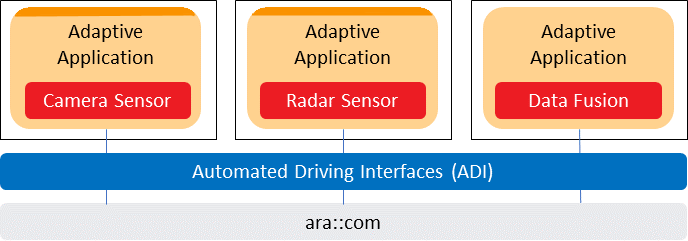
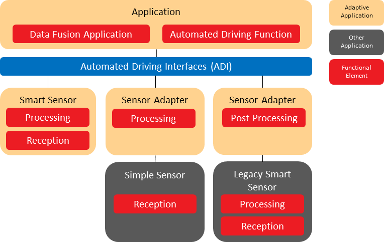

1.  ## Limitations

    1.  ### ISO Optionals

All the ISO optionals are supported in the service defintiion, but the presence of an optional signal is decided during the design time. The optional signal presence is indicated by a capability vector. There is no change of optional presence during the run time.

### Sensor Control Interfaces

Sensor control interfaces are not supported, e.g. actions like reset, initialization, and calibration.

### Sensor Capabilities

The configuration of sensor capabilities is not supported, e.g. sensor opening angle and detection range.

## Applicability to car domains

AUTOSAR Sensor Interfaces are used as service interfaces between dedicated sen- sors for enviroment precesion and the AUTOSAR Adaptive applications.

# Dependencies to other modules

The Automated Driving Interfaces serve as common interfaces for the AUTOSAR Adaptive applications. The sensor information is provided by a non-platform service.The sensor interfaces are exposed to client applications via the ara::com middleware. Communication Management,\[5\] uses Identity and Access Management

\[6\] to validate the authorization of requests made to the specific service interfaces, i.e. the Communication Management shall check if the invoker is allowed to access the re- quested service interface of a specific sensor. The following Figure shows a radar and camera sensor instance which provide sensor information to a Data Fusion instance consuming sensor data.

{width="5.733333333333333in" height="2.0083333333333333in"}

**Figure 5.1: Sensor Interfaces dependencies to other AUTOSAR Adaptive Applica- tions.**

For each sensor type like radar, lidar, USS or camera, the ISO standard will contain lots of optional sensor data or signals in addition to the required signals, e.g. the classification of an object might be optional. During development of a driving function or data fusion system, a specific set of optional signals is selected by the function or data fusion developer according to the requirements of the driving function. To reduce development costs, especially in terms of functional safety, the set of optionals and thus the resulting logical sensor interface are required to be fixed during design-time, i.e. the specified sensor signals must not suddenly disappear from the interface of the sensor during runtime of the system so that a data fusion system can rely on the presence of the specified signals. Vice versa, a sensor interface must not add additional signals during runtime, e.g. not to risk an unintentional behavior change due to the increased bandwidth requirements.

7.  # Functional Specification

    1.  ## Outline

        1.  ### Goals and scope

The specification is to provide well-defined sensor interfaces which is compliant to the sensor interface specification \[1\]. The ISO document covers just semantic definitions of interfaces whereas this specification aims to cover all aspects of the interfaces to make them fully compliant to the AUTOSAR Adaptive platform.

The specification shall enable the compatibility of sensors and data fusion algorithms independently of the supplier. To ensure the compatibility between sensors the inter- faces are provided on implementation data type level.

The Automated Driving Interfaces serve as common interfaces for the AUTOSAR Adaptive applications. Consumers of the interfaces are AUTOSAR Adaptive applications containing functional elements as sensor data receivers, sensor data processors, data fusion applications, and automated driving functions. The sensor in- formation is provided by a non-platform service.The non-platform service consumer is running in the apdative platfom as an AUTOSAR adaptive application, where the sensor could be deployed on different AUTOSAR platforms (Classic and Adaptive) as shown in the following figure.

{width="4.7134087926509185in" height="3.3709372265966753in"}

**Figure 7.1: Functional elements communicating via ADI**

Apart from the Automated Driving Interfaces (ADI), the other relevent elements are defined as follows :

- Sensor Data Reception: A functional element which receives or reads sensor data from a sensor. Such an element can provide raw sensor data. Raw sensor data means that it provides the actual data a sensor can measure. There is no processing of the sensor data. There are no data streams provided.

- Sensor Data Processing: This element which usually processes raw sensor data, provides pre-processed and post-processed sensor data. It provides data a sen- sor cannot directly measure but needs a processing stage for.

- Sensor Fusion Application: The data fusion algorithm is an application which col- lects sensor data and fuses it to provide a unified environmental model. Data fusion applications are typical consumers of sensor data. They provide their out- put to Automated Driving Functions.

- Automated Driving Function: Automated Driving Functions can also directly use the interfaces.

The Automated Driving interfaces can be used in following usages to enable the in- teroperability between different players and improve the efficiency for the development and validation of automated driving functions :

- Sensor Supplier Interface: The automated driving use case defines the require- ments to the fusion algorithm and the used sensors. The OEM wants to rely on a standardized interface which provides well defined sensor information which are defined by the ISO-23150 and on an AUTOSAR standardized interface. The scope shall be the data format between a sensor and a computing unit running an AUTOSAR Adaptive application.

- Standardized Sensor API: Sensor developers need well described and standard- ized interfaces to provide an implementation which can be used by automated driving applications and data fusion algorithms. So, the same information is pro- vided to all potential consumers of the data.

- Sensor Fusion Algorithm: To combine information from different sensors and to develop sensor fusion algorithms for automated driving a detailed description of all signals provided is needed.

- Sensor Fusion Integration: Sensor fusion algorithms shall be integrated on a high-performance computing platform within an Adaptive Application as the cen- tral unit of automated driving functions.

- Sensor Implementation Testing: Testing is performed at each stage of the de- velopment of the sensor system. To create a test specification for the system testable implementations are needed which are based on well-defined interfaces and descriptions.

- Sensor Simulation: By simulating the sensor fusion algorithms before actual tar- get integration, it is possible to ensure smooth integration during the design, de- velopment, test and safeguarding steps. This ensures compatibility of algorithm integration into AUTOSAR Adaptive ECUs.

- Sensor Data Record and Replay: To be able to test and debug sensor fusion algorithms offline it is necessary to replay sensor data recorded in real world sce- narios. This enables sensor fusion designers to reproduce failures and determine faults.

  1.  ### Relation to other standards

The currently ongoing standardization of the international standard ISO 23150 \"Road vehicles - Data communication between sensors and data fusion unit for automated driving functions - Logical interface\" will be applicable to road ve- hicles with automated driving functions. It specifies the logical interface be- tween smart in-vehicle sensors that sense the environment (e.g. camera, li- dar, radar, ultrasonic, etc.) and the vehicle fusion unit. The interface is de- scribed in a modular, semantic representation allowing different types of sen- sor technologies and fusion concepts. The \"Open Simulation Interface\" (OSI) is a generic software interface for the environmental perception of automated driv- ing functions in virtual scenarios (https://github.com/OpenSimulationInterface/open- simulation-interface). OSI ensures modularity, integrability and interchangeabil- ity of the individual components. These can be environment simulation mod- els, sensor models, logical models for the detected environment or sensor fusion and models for automated driving functions. Additional informations can be found on https://opensimulationinterface.github.io/open-simulation-interface/.

**Figure 7.2: Scope of Standardization**

The Open Simulation Interface and the Autosar ADI will support the ISO 23150.

1.  ## AD Sensor Service Design

    1.  ### ISO mapping to Sensor Services

        1.  ### Sensor Types

To comply with the ISO 23150, the specific service is defined with different sensor types. Currently, Camera, Lidar, Radar, and Ultrasonic sercives are supported in the specification. The new service will be introduced along with the evolution of \[1\].

**\[SWS_ADI_00001\]**{DRAFT} **The Camera Sensor Data periodical Transmission** *\[*A Camera senor with Automated Driving interfaces shall provide the camera sensor data periodically to the Adaptive Applications*♩(RS_ADI_00001)*

**\[SWS_ADI_00002\]**{DRAFT} **The Lidar Sensor Data periodical Transmission** *\[*A Lidar sensor with Automated Driving interfaces shall provide the lidar sensor data pe- riodically to the Adaptive Applications*♩(RS_ADI_00002)*

**\[SWS_ADI_00003\]**{DRAFT} **The Radar Sensor Data periodical Transmission** *\[*A radar sensor with Automated Driving interfaces shall be able to provide the radar sen- sor data periodically to the Adaptive Applications*♩(RS_ADI_00003)*

**\[SWS_ADI_00004\]**{DRAFT} **The Ultrasonic Sensor Data periodical Transmission** *\[*A ultrasonic sensor with Automated Driving interfaces shall be able to provide the ul- trasonic sensor data periodically to the Adaptive Applications*♩(RS_ADI_00004)*

**\[SWS_ADI_00005\]**{DRAFT} **Receving periodical sensor data** *\[*The Adaptive Ap- plications as the sevice consumer shall process the sensor data according to the timestamp in the package, not the package arrival time. The most recent data is always the highest priority for processing._♩(RS_ADI_00018)_

### Sensor Data level

In ISO 23150, there are three ISO logic interface levels to support different levels of fusion: object level, feature level and detection level:

- Object level interface: Potentially moving object interface, Road object interface and Static object interface;

- Feature level interface: Camera feature interface and USS feature interface;

- Detection level interface: Radar detection interface,Lidar detection interface, Camera detection interface and USS detection interface.

A sensor could provide several ISO logical interfaces, and shall provide at least one ISO interface either on object, feature, or detection level.

**\[SWS_ADI_00006\]**{DRAFT} **Sensor specific services for different level ISO inter- faces** *\[*To allow the flexibility of service providing by a sensor, each ISO interface shall

> be mapped to a propriate ara::com means like events. The service interface shall support the defintions of ISO signals.The services for new types of sensors shall be added along with the evolution of \[1\]. The follwing AP services are defined in this specification:

- Camera,Lidar,Radar,Ultrasonic: Potentially moving object service, road object service, static object service

- Camera: Camera features service, camera detections service;

- Lidar: Lidar detections service;

- Radar: Radar detections service;

- Ultrasonic: Ultrasonic features service, Ultrasonic detection service.

_♩(RS_ADI_00012, RS_ADI_00013, RS_ADI_00014, RS_ADI_00019, RS_ADI_00005)_

### Supportive Sensor interfaces

In ISO, there are two supportive senor interfaces for the Adaptive Applications process the reliability of the used measurement method or data, which are also used to the implementation of safety concept. The two supportive sensor interfaces are sensor technology indepedent, i.e. common to camera, lidar, radar and ultrasonic sensor, but with sensor technology specific data.

**\[SWS_ADI_00007\]**{DRAFT} **Sensor independent supportive services** *\[*The sup- portive interfaces shall be mapped to two sensor indpendent AP services and support the defintions of ISO signals.The follwing services are defined in this specification:

- Sensor Performance service;

- Sensor Health information service.

_♩(RS_ADI_00012, RS_ADI_00013, RS_ADI_00014, RS_ADI_00019)_

### Service Optional Elements

An individual Sensor Service design faces the challenge that each ISO interface con- tains a lot of optional elements. The optional elements are known and fixed at design time by service providers and service users. The present of optional elements shall not be changed during run time.

**\[SWS_ADI_00010\]**{DRAFT} **Capability Vector** *\[*A service capability vector indicates which optional element is provided by the Service provider. The optional elements indicated by the capability vector shall be always sent during the runtime of the service. The service consumer should check the vector at the initialization time and subcribe the service if it includes all the optional elements that the consumer requires.The consumer

may ignore the optional elements, if these elements are not required._♩(RS_ADI_00006, RS_ADI_00015, RS_ADI_00016, RS_ADI_00017)_

**\[SWS_ADI_00011\]**{DRAFT} **Service Profiles** *\[*In different use cases, there are dif- ferent requirements on the sensor data i.e.for different data Types, behavior, content, performance, resolution, etc. Different Service Profiles for a Sensor Type enables the flexiblity of the corresponding sensor service for different use cases. In this re- lease, only one profile is supported and more profiles should be considered in future releases._♩(RS_ADI_00007)_

**\[SWS_ADI_00012\]**{DRAFT} **Service Versioning** *\[*Service Versioning covers different configurations, i.e. optionals, additional data representation, etc. The same services with different service versioning, but with the same profile, shall be backward compati- ble._♩(RS_ADI_00006, RS_ADI_00015, RS_ADI_00016, RS_ADI_00017)_

# API specification

There are no APIs defined in this release.
