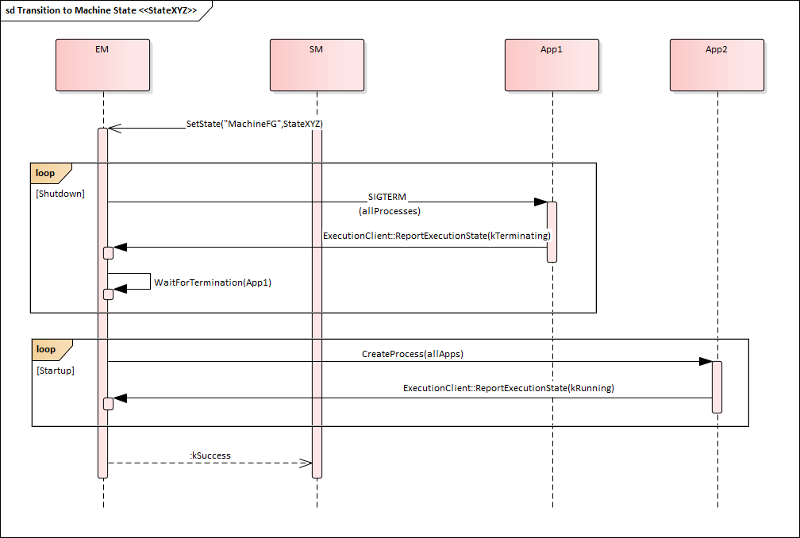

---
tip: translate by openai@2023-06-23 17:03:11
...
# Contents

```
1. [Introduction and functional overview](#introduction-and-functional-overview) 7

   1. [Interaction with AUTOSAR Runtime for Adaptive](#interaction-with-autosar-runtime-for-adaptive) . . . . . . . . . . . . 7

2. Acronyms and Abbreviations 8
3. [Further applicable specification](#further-applicable-specification) 11

   1. [Input documents & related standards and norms](#input-documents-related-standards-and-norms) 11

4. [Constraints and assumptions](#constraints-and-assumptions) 12

   1. [Known limitations](#known-limitations) 12
   2. [Applicability to car domains](#applicability-to-car-domains) 12

5. [Dependencies to other Functional Clusters](#dependencies-to-other-functional-clusters) 13

   1. [Platform dependencies](#platform-dependencies) 13

      1. [Operating System Interface](#operating-system-interface) 13
      2. [Execution Manager Interface](#execution-manager-interface) 13
      3. [Platform Health Management](#platform-health-management) 13
      4. [Diagnostic Management](#diagnostic-management) 13
      5. [Update And Configuration Management](#update-and-configuration-management) 13
      6. [Network Management](#network-management) 14

   2. [Other dependencies](#other-dependencies) 14

6. Requirements Tracing 15
7. [Functional specification](#functional-specification) 18

   1. [State Management Responsibilities](#state-management-responsibilities) 20

      1. [Machine State](#machine-state) 21

         1. [Startup](#startup) 23
         2. [Shutdown](#shutdown) 23
         3. [Restart](#restart) 24

      2. [Function Group State](#function-group-state) 24
      3. [State Management Architecture](#state-management-architecture) 25

   2. [State Management and Adaptive (Platform) Applications](#state-management-and-adaptive-platform-applications) 26

      1. [Interaction between the SM and Adaptive Applications](#interaction-between-the-sm-and-adaptive-applications) 26
      2. [Synchronization across multiple Adaptive Applications](#synchronization-across-multiple-adaptive-applications) 28

         1. [PowerModes for Adaptive (Platform) Applications](#powermodes-for-adaptive-platform-applications) 30
         2. [Diagnostic Reset for Adaptive (Platform) Applications](#diagnostic-reset-for-adaptive-platform-applications) 31

   3. [Interaction with Platform Health Management](#interaction-with-platform-health-management) 32
   4. [Interaction with Diagnostic Management](#interaction-with-diagnostic-management) 32
   5. [Interaction with Update and Configuration Management](#interaction-with-update-and-configuration-management) 34
   6. [Interaction with Network Management](#interaction-with-network-management) 36
   7. [Interaction with Execution Management](#interaction-with-execution-management) 38
   8. [State Management in a virtualized/hierarchical environment](#state-management-in-a-virtualizedhierarchical-environment) 39
   9. [StateManagement lifecyle](#statemanagement-lifecyle) 40

      1. [Startup](#startup-1) 40
      2. [Shutdown](#shutdown-1) 40
      3. [Restart](#restart-1) 40

   10. [Configuration](#configuration) 40
   11. [StateManagement StateMachine](#statemanagement-statemachine) 41

       1. [StateMachine introduction](#statemachine-introduction) 41
       2. [Controlling application for StateMachine States](#_bookmark55) 42
       3. [StateMachine general conditions](#statemachine-general-conditions) 44
       4. [StateMachine state changes](#statemachine-state-changes) 45
       5. [StateMachine ActionLists](#statemachine-actionlists) 47
       6. [StateMachine ActionListItems](#statemachine-actionlistitems) 47
       7. [Controlling multiple StateMachine Instances](#controlling-multiple-statemachine-instances) 51
       8. [StateMachine State notification](#statemachine-state-notification) 52

8. [API specification](#api-specification) 54
9. Service Interfaces 55

   1. Type definitions 55

      1. PowerMode types 55
      2. DiagnosticReset types 55
      3. Data types for Update And Configuration Managemet inter- action 56
      4. Data types for StateMachine interaction 57

   2. Provided Service Interfaces 58

      1. State Management TriggerIn 58
      2. State Management TriggerOut 59
      3. State Management TriggerInOut 60
      4. UpdateRequest 61
      5. Application interaction 63

         1. PowerMode 63
         2. DiagnosticReset 63

      6. StateMachine service 65

   3. Required Service Interfaces 66

      1. Network Management 66

         1. NetworkManagement NetworkState 66

   4. Application Errors 67

      1. StateManagement Error Domain 67

```{=html}
<!-- -->
```

A. Interfunctional Cluster Interfaces 68
B. Not applicable requirements 69
C. Mentioned Manifest Elements 70
D. History of Constraints and Specification Items 75

1.  Constraint and Specification Item History of this document according to AUTOSAR Release R22-11 75

    1. Added Traceables in R22-11 75
    2. Changed Traceables in R22-11 76
    3. Deleted Traceables in R22-11 76
    4. Added Constraints in R22-11 77
    5. Changed Constraints in R22-11 77
    6. Deleted Constraints in R22-11 77

2.  Constraint and Specification Item History of this document according to AUTOSAR Release R21-11 77

    1. Added Traceables \"in R21-11\" 77
    2. Changed Traceables \"in R21-11\" 79
    3. Deleted Traceables \"in R21-11\" 79
    4. Added Constraints \"in R21-11\" 79
    5. Changed Constraints \"in R21-11\" 79
    6. Deleted Constraints \"in R21-11\" 79

3.  Constraint and Specification Item History of this document according to AUTOSAR Release R20-11 79

    1. Added Traceables in R20-11 79
    2. Changed Traceables in R20-11 81
    3. Deleted Traceables in R20-11 81
    4. Added Constraints in R20-11 81
    5. Changed Constraints in R20-11 81
    6. Deleted Constraints in R20-11 81

4.  Constraint and Specification Item History of this document according to AUTOSAR Release R19-11 81

    1. Added Traceables in 19-11 81
    2. Changed Traceables in 19-11 82
    3. Deleted Traceables in 19-11 82
    4. Added Constraints in 19-11 82
    5. Changed Constraints in 19-11 82
    6. Deleted Constraints in 19-11 82

5.  Constraint and Specification Item History of this document according to AUTOSAR Release R19-03 82

    1. Added Traceables in 19-03 82
    2. Changed Traceables in 19-03 83
    3. Deleted Traceables in 19-03 83
    4. Added Constraints in 19-03 83
    5. Changed Constraints in 19-03 83
    6. Deleted Constraints in 19-03 84

```
# Introduction and functional overview


This document is the software specification of the State Management functional cluster within the Adaptive Platform Services.

> 这份文件是自适应平台服务中的状态管理功能簇的软件规范。


State Management is responsible for determination the state of any of its inter- nal statemachines, based on information received from other AUTOSAR Adaptive Platform Application or Adaptive Application.

> 状态管理负责根据从其他AUTOSAR Adaptive Platform应用程序或Adaptive应用程序接收的信息，确定其内部状态机的状态。


State Management controls state of (partial networks using provided fields (Net- workHandle) of Network Management.

> 状态管理使用提供的网络管理字段（Net-workHandle）控制部分网络的状态。


State Management interacts with the Execution Management to request Func- tion Groups and the Machine State to enter specific states that are determined by project requirements. Function Group States might additionally depend on Network Managements State.

> 状态管理与执行管理交互，以请求功能组和机器状态进入由项目要求确定的特定状态。功能组状态可能还取决于网络管理状态。


State Management provides access to its internal state via ara::com services. A particular service implements one of standardized service interfaces. The service interfaces have fields for getting current state (field \"Notifier\" (see section 9.2.2) ) and requesting new state (field \"Trigger\" (see section 9.2.1)). AUTOSAR Adaptive Platform Applications or Adaptive Applications can use the fields for re- acting on the system state changes or for influencing the system state(when they are configured to have write permissions).

> 状态管理通过ara::com服务提供对其内部状态的访问。特定服务实现了标准服务接口之一。服务接口具有获取当前状态（字段“Notifier”（参见第9.2.2节））和请求新状态（字段“Trigger”（参见第9.2.1节））的字段。AUTOSAR自适应平台应用程序或自适应应用程序可以使用这些字段来对系统状态的更改做出反应，或者影响系统状态（当它们配置为具有写入权限时）。


Chapter [7](#functional-specification) describes how State Management concepts are realized within the

> 第7章节描述了如何在状态管理概念中实现。


AUTOSAR Adaptive Platform.

> AUTOSAR自适应平台

## Interaction with AUTOSAR Runtime for Adaptive


The set of programming interfaces to the Adaptive Applications is called AUTOSAR Runtime for Adaptive (ARA). APIs accessed by State Management using the interfunctional cluster API is described in Appendix A which is not part of ARA.

> 集成到自适应应用的编程接口统称为AUTOSAR运行时（ARA）。使用交叉功能集群API访问的状态管理的API描述在附录A中，但不属于ARA。


The Adaptive AUTOSAR Services are provided via mechanisms provided by the Communication Management functional cluster \[[1](#_bookmark4)\] of the Adaptive Platform Foundation

> 通过自适应AUTOSAR服务提供的机制，由自适应平台基础设施的通信管理功能簇提供[1]。


3. # Further applicable specification

> 3. # 附加适用规范


   1. ## Input documents & related standards and norms

> ## 输入文件及相关的标准和规范


The main documents that serve as input for the specification of the State Manage- ment are:

> 主要文件用于指定国家管理的输入是：


1. []{#\_bookmark4 .anchor}Specification of Communication Management AUTOSAR_SWS_CommunicationManagement

> 软件开发自动化标准（AUTOSAR）通信管理规范

2. Glossary []{#\_bookmark5 .anchor}AUTOSAR_TR_Glossary

> 2. 词汇表 []{#\_bookmark5 .anchor}AUTOSAR_TR_Glossary

3. Specification of Execution Management []{#\_bookmark6 .anchor}AUTOSAR_SWS_ExecutionManagement

> 3. 执行管理规范（AUTOSAR_SWS_ExecutionManagement）

4. Specification of Platform Health Management []{#\_bookmark7 .anchor}AUTOSAR_SWS_PlatformHealthManagement

> 4. 平台健康管理规范（AUTOSAR_SWS_PlatformHealthManagement）

5. Specification of Network Management []{#\_bookmark8 .anchor}AUTOSAR_SWS_NetworkManagement

> 5. 网络管理规范（AUTOSAR_SWS_NetworkManagement）

6. Specification of Diagnostics []{#\_bookmark9 .anchor}AUTOSAR_SWS_Diagnostics

> 6. 诊断规范[]{#\_bookmark9 .anchor}AUTOSAR_SWS_Diagnostics

7. Specification of Update and Configuration Management []{#\_bookmark10 .anchor}AUTOSAR_SWS_UpdateAndConfigurationManagement

> 7. 更新和配置管理规范（AUTOSAR_SWS_UpdateAndConfigurationManagement）

8. Specification of Manifest AUTOSAR_TPS_ManifestSpecification

> 8. AUTOSAR_TPS_ManifestSpecification 的规格

9. Requirements of State Management AUTOSAR_RS_StateManagement

> 要求的AUTOSAR_RS_状态管理

```{=html}
<!-- -->
```


4. # Constraints and assumptions

> 4. # 约束和假设


   1. ## Known limitations

> ## 已知的限制


This section lists known limitations of State Management and their relation to this release of the AUTOSAR Adaptive Platform with the intent to provide an indication how State Management within the context of the AUTOSAR Adaptive Platform will evolve in future releases.

> 此部分列出了AUTOSAR Adaptive Platform此版本中State Management的已知限制及其与未来版本中State Management在AUTOSAR Adaptive Platform中的发展趋势的关系，旨在提供一个指示。


The following functionality is mentioned within this document but is not (fully) specified in this release:

> 本文档中提及以下功能，但本次发布未（完全）指定：


- Section [7.2](#state-management-and-adaptive-platform-applications) This document will show the basic principles of the intended function- ality of State Management. To enable State Management to be portable, in future versions of this document standardized fields and values shall be intro- duced.

> 部分[7.2](#state-management-and-adaptive-platform-applications)本文档将展示状态管理的基本原则。为了使状态管理可移植，在本文档的未来版本中将引入标准化的字段和值。

- Section [7.4](#interaction-with-diagnostic-management) Communication Control for Diagnostic reasons this is not yet dis- cussed with Diagnostic Management.

> 尚未与诊断管理讨论的诊断原因通信控制，请参见第7.4节。

- Section [7.11](#statemanagement-statemachine) The introduced StateMachine feature does not yet cover how the DiagnosticReset requests from Diagnostic Management, the Up- dateRequest from Update and Configuration Management and the in- coming Network requests from Network Management will be handled. This fact will be improved in R23-11 when the StateMachine approach is stabilized.

> 部分[7.11](#statemanagement-statemachine)介绍的状态机功能尚未涵盖诊断管理的诊断重置请求、更新和配置管理的更新请求以及网络管理的传入网络请求如何处理。在R23-11中，当状态机方法稳定后，这一事实将得到改善。


  1. ## Applicability to car domains

> ## 对汽车领域的适用性


If a superior State Management instance to the one from the ECU is available in a hierarchical car context, the State Management of the ECU shall also evaluate events generated by the superior instance of State Management. Section [7.8](#state-management-in-a-virtualizedhierarchical-environment) will give further details.

> 如果在分层汽车环境中有一个比ECU中的更高级的状态管理实例，那么ECU的状态管理也应该评估由上级状态管理实例产生的事件。有关更多详情，请参阅[7.8]（＃在虚拟化分层环境中的状态管理）。


5. # Dependencies to other Functional Clusters

> 5. 与其他功能集群的依赖关系


   1. ## Platform dependencies

> ## 平台依赖

      1. ### Operating System Interface


State Management has no direct interface to the Operating System. All OS depen- dencies are abstracted by the Execution Management.

> 状态管理与操作系统没有直接的接口。执行管理将所有操作系统依赖项抽象化。

### Execution Manager Interface


State Management is dependent on Execution Management to start and stop processes - as part of defined Function Groups or Machine States. State Management therefore uses the API referenced in Appendix A and defined in \[[3](#_bookmark5)\]. State Management additionally uses the StateClient functionality of Execution Management to inform Execution Management about State Managements Pro- cess State.

> 状态管理取决于执行管理来启动和停止进程，作为定义的功能组或机器状态的一部分。因此，状态管理使用附录A中引用的API和[3]中定义的API。此外，状态管理还使用执行管理的StateClient功能来向执行管理报告状态管理进程状态。

### Platform Health Management


State Management is dependent on the Platform Health Management \[[4](#_bookmark6)\] functional cluster. Platform Health Management supervises configured entities and informs State Management when any of these entities fails. State Manage- ment implements the actions needed to recover from such failed supervisions in a project specific way.

> 状态管理取决于平台健康管理[4]功能集群。平台健康管理监督配置的实体，并在任何这些实体失败时通知状态管理。状态管理以项目特定的方式实施恢复这种失败监督所需的操作。

### Diagnostic Management


State Management is dependent on the Diagnostic Management \[[6](#_bookmark8)\] functional cluster. Diagnostic Management request different reset types for a Diagnostic Address at State Management. State Management implements the actions in a project specific way and prevents the system from shutting down during an active diagnostics session.

> 状态管理取决于诊断管理功能集群\[[6](#_bookmark8)\]。诊断管理为诊断地址请求不同的重置类型，状态管理以项目特定的方式实施行动，并防止系统在活动诊断会话期间关闭。

### Update And Configuration Management


State Management is dependent on the Update and Configuration Manage- ment \[[7](#_bookmark9)\] functional cluster. Update and Configuration Management coordi- nates the update sequence with State Management to set a set of Function Groups(affected by the update) to dedicated states.

> 状态管理取决于更新和配置管理功能集群[7]。更新和配置管理协调更新序列与状态管理，将一组受更新影响的功能组设置为专用状态。

### Network Management


State Management is dependent on the Network Management \[[5](#_bookmark7)\] functional clus- ter. Network Management provides multiple NetworkHandle fields which represents a set of (partial) networks. State Management evaluates the NetworkCurrentState field to set Function Groups to the corresponding Function Group State and set the NetworkRequestedState field in dependency of Function Groups and their Function Group State . Additionally State Management shall prevent network from shutting down during an active update or diagnostic session.

> 状态管理取决于网络管理功能集群\[[5](#_bookmark7)\]。网络管理提供多个网络句柄字段，表示一组（部分）网络。状态管理评估NetworkCurrentState字段，将功能组设置为相应的功能组状态，并依赖于功能组及其功能组状态设置NetworkRequestedState字段。此外，状态管理还应防止网络在活动更新或诊断会话期间关闭。

## Other dependencies


Currently, there are no other library dependencies.

> 目前没有其他的库依赖。

# Functional specification


Please note that the semantics in the following chapter is not yet fully specified.

> 请注意，以下章节中的语义尚未完全规定。


State Management is a functional cluster contained in the Adaptive Platform Services. State Management is responsible for all aspects of Operational State Management including handling of incoming events, prioritization of these events/re- quests setting the corresponding internal States. Incoming events are issued when AUTOSAR Adaptive Platform or Adaptive Applications which are config- ured to have write access permissions change the value of \"Trigger\" fields provided by State Management. State Management may consist of one or more state ma- chines, which might be more or less loosely coupled depending on project needs.

> 状态管理是自适应平台服务中的一个功能集群。状态管理负责运营状态管理的所有方面，包括处理传入事件、优先处理这些事件/请求、设置相应的内部状态。当AUTOSAR自适应平台或具有写入访问权限的自适应应用程序更改由状态管理提供的“触发”字段的值时，将发出传入事件。状态管理可以由一个或多个状态机组成，根据项目需要，这些状态机可以更多或更少地松散耦合。


Additionally the State Management takes care of not shutting down the system as long as any diagnostic or update session is active as part of State Managements in- ternal State. State Management supervises the shutdown prevention with a project- specific timeout.

> 此外，状态管理还确保只要任何诊断或更新会话作为状态管理内部状态的一部分仍处于活动状态，系统就不会关闭。状态管理使用特定项目的超时时间来监督防止关机。


In dependency of the current internal States, State Management might decide to request Function Groups or Machine State to enter specific state by using inter- faces of Execution Management.

> 根据当前内部状态，状态管理可能决定请求功能组或机器状态通过执行管理的接口进入特定状态。


State Management is responsible for en- and disabling (partial) networks by means of Network Management. Network Management provides ara::com fields (Net- workHandle) where each of the fields represents a set of (partial) networks. State Management can influence these fields in dependency of Function Groups states and - vice versa - can set Function Groups to a defined state depending on the value of Network Managements NetworkHandle fields.

> 状态管理负责通过网络管理启用和禁用（部分）网络。网络管理提供ara :: com字段（NetworkHandle），其中每个字段代表一组（部分）网络。状态管理可以根据功能组状态影响这些字段，反之亦然，可以根据网络管理的NetworkHandle字段将功能组设置为定义的状态。


Adaptive Applications and AUTOSAR Adaptive Platform Applications can register to the events of the \"Notifier\" fields provided by State Management. They can change their internal behavior based on the value provided in the fields. Adaptive Applications and AUTOSAR Adaptive Platform Applications can influence the internal States of State Management by writing to the \"Trigger\" fields provided by State Management.

> 适应性应用程序和AUTOSAR适应性平台应用程序可以注册状态管理提供的“通知者”字段上的事件。它们可以根据字段中提供的值改变它们的内部行为。适应性应用程序和AUTOSAR适应性平台应用程序可以通过写入状态管理提供的“触发器”字段来影响状态管理的内部状态。


This chapter describes the functional behavior of State Management and the rela- tion to other AUTOSAR Adaptive Platform Applications State Management interacts with.

> 本章描述了状态管理的功能行为以及与其他AUTOSAR自适应平台应用程序状态管理相互作用的关系。


- Section [7.1](#state-management-responsibilities) covers the core State Management run-time responsibilities includ- ing the start of Applications.

> 章节7.1（#state-management-responsibilities）涵盖了核心的状态管理运行时责任，包括应用程序的启动。

- Section [7.2](#state-management-and-adaptive-platform-applications) describes how Adaptive Applications and AUTOSAR Adap- tive Platform Applications could be influenced in their behavior based on provided \"Notifier\" fields of State Management and how they can influence the internal states of State Management by using provided \"Trigger\" fields.

> 章节7.2描述了如何根据提供的“通知者”字段的状态管理来影响自适应应用程序和AUTOSAR自适应平台应用程序的行为，以及它们如何通过使用提供的“触发器”字段来影响状态管理的内部状态。

- Section [7.4](#interaction-with-diagnostic-management) covers several topics related to Diagnostic Management includ- ing execution of different reset types

> 章节7.4（#交互式诊断管理）涵盖了与诊断管理相关的几个主题，包括执行不同的重置类型。

- Section [7.5](#interaction-with-update-and-configuration-management) describes how Update and Configuration Management inter- acts with State Management

> 章节7.5描述了更新和配置管理如何与状态管理交互。

- Section [7.6](#interaction-with-network-management) documents support provided by Network Management to deactivate (partial) networks in dependency of Function Group States and vice versa.

> 章节7.6文档记录了网络管理提供的支持，根据功能组状态可以部分禁用网络，反之亦然。

- Section [7.7](#interaction-with-execution-management) describes how Execution Management is used to change Func- tion Group State or Machine State.

> 第7.7节描述了如何使用执行管理来更改功能组状态或机器状态。

- Section [7.8](#state-management-in-a-virtualizedhierarchical-environment) provides an introduction to how State Management will work within a virtualized/hierarchical environment.

> 章节7.8提供了一个关于如何在虚拟化/分层环境中进行状态管理的介绍。


  1. ## State Management Responsibilities

> ## 状态管理职责


State Management is the functional cluster which is responsible for determining the current internal States, and for initiating Function Group and Machine State tran- sitions by requesting them from Execution Management.

> 状态管理是负责确定当前内部状态，并通过从执行管理请求来启动功能组和机器状态转换的功能集群。


State Management is the central point where any operation event is received that might have an influence to the internal States of State Management. The State Management is responsible to evaluate these events and decide based on

> 状态管理是接收可能对内部状态有影响的任何操作事件的中心点。状态管理负责评估这些事件，并根据评估结果做出决定。

- Event type (defined in project specific implementation based on project specific requirements).

- Event priority (defined in project specific implementation based on project specific requirements).

> 事件优先级（根据项目特定要求在项目特定实施中定义）。

- Application identifier (Application identifier is not supported in this release. It is under discussion with FT-SEC if such an identifier could be provided by Iden- tity and Access Management).

> 应用程序标识符（本发行版不支持应用程序标识符。目前正在与FT-SEC商讨是否可以由身份和访问管理提供此类标识符）。


If an State Managements internal State change is triggered then Execution Man- agement may be requested to set Function Groups or Machine State into new Function Group State.

> 如果触发了状态管理内部状态的变化，那么可能会要求执行管理将功能组或机器状态设置为新的功能组状态。


The state change request for Function Groups can be issued by several AUTOSAR Adaptive Platform Applications:

> 状态变更请求可以由多个AUTOSAR自适应平台应用程序发出：功能组。

- Platform Health Management to trigger error recovery, e.g. to activate fall- back Functionality.

- Diagnostic Management, to switch the system into different diagnostic states and to issue resets of the system.

> 診斷管理，將系統切換到不同的診斷狀態，並發出系統重置。

- Update and Configuration Management to switch the system into states where software or configuration can be updated and updates can be verified.

> 更新和配置管理，以将系统切换到可更新软件或配置的状态，并可验证更新。

- Network Management to coordinate required functionality and network state. This is no active request by Network Management. Network Management provides several sets of NetworkHandle fields, where State Management reg- isters to and reacts on changes of these fields issued by Network Management.

> 网络管理协调所需的功能和网络状态。这不是网络管理的主动请求。网络管理提供了几组网络句柄字段，状态管理注册并对由网络管理发出的这些字段进行反应。


The final decision if any effect is performed is taken by State Managements internal logic based on project-specific requirements.

> 最终决定是否执行任何影响，由国家管理内部逻辑根据项目特定要求决定。


Adaptive Applications may provide their own property or event via an ara com in- terface, where the State Management is subscribing to, to trigger State Manage- ment internal events. Since State Management functionality is critical, access from other Adaptive Applications must be secured, e.g. by Identity and Access Management.

> 适应性应用程序可以通过ara com接口提供自己的属性或事件，状态管理订阅此接口以触发状态管理内部事件。由于状态管理功能至关重要，因此必须从其他适应性应用程序中进行安全访问，例如通过身份和访问管理。

- State Management shall be monitored and supervised by Platform Health Management.

- State Management provides ara::com fields as interface to provide information about its current internal States

> 状态管理提供ara::com字段作为接口，以提供有关其当前内部状态的信息。


State Management is responsible for handling the following states:

> 状态管理负责处理以下状态：

- Machine State see [7.1.1](#machine-state)
- Function Group State see [7.1.2](#function-group-state)

  1. ### Machine State


A Machine State is a specific type of Function Group State (see [7.1.2](#function-group-state)). Ma- chine States and all other Function Group States are determined and re- quested by the State Management functional cluster, see [7.1.3](#state-management-architecture). The set of active States is significantly influenced by vehicle-wide events and modes which are evalu- ated into State Managements internal States.

> 机器状态是特定类型的功能组状态（参见[7.1.2]（#function-group-state））。机器状态和其他所有功能组状态由状态管理功能簇确定和请求，参见[7.1.3]（#state-management-architecture）。活动状态的集合受到整车事件和模式的显著影响，这些事件和模式被评估为状态管理内部状态。


The Function Group States, including the Machine State, define the current set of running Modelled Processes. Each Application can declare in its Execution Manifests in which Function Group States its Modelled Pro- cesses have to be running.

> 功能组状态，包括机器状态，定义了当前运行的建模进程的集合。每个应用程序可以在其执行清单中声明其建模进程必须运行在哪些功能组状态中。


The start-up sequence from initial state Startup to the point where State Manage- ment, SM, requests the initial running machine state Driving is illustrated in Figure

> 开始序列从初始状态“启动”到状态管理（SM）请求初始运行机器状态“行驶”的过程如图所示。


[7.1](#_bookmark26) as an example Driving Function Group State is no mandatory Function Group State.

> [7.1](#_bookmark26) 作为一个例子，驱动功能组状态不是强制性的功能组状态。

{width="5.879687226596675in" height="5.273228346456693in"}

**Figure 7.1:** []{#\_bookmark26 .anchor}**Start-up Sequence -- from Startup to initial running state Driving**


An arbitrary state change sequence to machine state StateXYZ is illustrated in Figure

> 图中描绘了一个任意状态变化序列到机器状态StateXYZ的过程。


[7.2](#_bookmark27). Here, on receipt of the state change request, Execution Management termi- nates running Modelled Processes and then starts Modelled Processes active in the new state before confirming the state change to State Management.

> 在收到状态更改请求时，执行管理终止运行建模过程，然后在确认状态更改到状态管理之前启动新状态中活动的建模过程。

{width="5.88in" height="3.955in"}

**Figure 7.2:** []{#\_bookmark27 .anchor}**State Change Sequence -- Transition to machine state StateXYZ**

### Startup


Execution Management will be controlled by State Management and therefore it should not execute any Function Group State changes on its own. This creates some expectations towards system configuration. The configuration shall be done in this way that State Management will run in every Machine State (this includes Startup, Shutdown and Restart). Above expectation is needed in order to ensure that there is always a software entity that can introduce changes in the current state of the Machine. If (for example) system integrator doesn't configure State Manage- ment to be started in Startup Machine State, then Machine will never be able transit to any other state and will be stuck forever in it. This also applies to any other Machine State state that doesn't have State Management configured.

> 状态管理将控制执行管理，因此它不应自行执行任何功能组状态更改。这对系统配置提出了一些期望。配置应以这种方式进行，即状态管理将在每个机器状态（包括启动，关机和重新启动）中运行。为了确保总是有一个软件实体可以引入机器当前状态的变化，上述期望是必需的。如果（例如）系统集成商没有配置状态管理以在启动机器状态下启动，那么机器将永远无法转换到任何其他状态，并且将永远停留在其中。这也适用于没有配置状态管理的任何其他机器状态状态。

### Shutdown


As mentioned in [7.1.1.1](#startup) AUTOSAR assumes that State Management will be config- ured to run in Shutdown. State transition is not a trivial system change and it can fail for a number of reasons. When ever this happens you may want State Management to be still alive, so you can report an error and wait for further instructions. Please note that the very purpose of this state is to shutdown Machine (this includes State Management) in a clean manner. Unfortunately this means that at some point State

> 正如在[7.1.1.1](#startup)中提到的，AUTOSAR假设状态管理将被配置为关机运行。状态转换不是一个简单的系统变更，它可能由于多种原因而失败。每当发生这种情况时，您可能希望状态管理仍然保持活动状态，以便报告错误并等待进一步的指示。请注意，这个状态的本质目的是以干净的方式关闭机器（包括状态管理）。不幸的是，这意味着在某个时候，状态管理将被关闭。


Management will no longer be available and it will not be able to report errors anymore. Those errors will be handled in a implementation specific way.

> 管理将不再可用，也不能再报告错误。这些错误将以实施特定的方式处理。

### Restart


As mentioned in [7.1.1.1](#startup) AUTOSAR assumes that State Management will be config- ured to run in Restart. The reasons for doing so are the same as for [7.1.1.2](#shutdown).

> 根据[7.1.1.1](#startup)所述，AUTOSAR假设状态管理将配置为重新启动。这样做的原因与[7.1.1.2](#shutdown)相同。

### Function Group State


If more than one group of functionally coherent Applications is installed on the same machine, the Machine State mechanism is not flexible enough to control these functional clusters individually, in particular if they have to be started and terminated with interleaving lifecycles. Many different Machine States would be required in this case to cover all possible combinations of active functional clusters.

> 如果在同一台机器上安装了多个功能相关的应用程序组，机器状态机制不足以单独控制这些功能群，特别是如果它们必须以交叉生命周期启动和终止。在这种情况下，需要许多不同的机器状态来覆盖所有可能的活动功能群。


To support this use case, additional Function Groups and Function Group States can be configured. Other use cases where starting and terminating individual groups of Modelled Processes might be necessary including diagnostic and error recovery.

> 为了支持此用例，可以配置附加功能组和功能组状态。其他可能需要启动和终止模型流程组的用例，包括诊断和错误恢复。


In general, Machine States are used to control machine lifecycle (startup/shut- down/restart) and Modelled Processes of platform level Applications while other Function Group States individually control Modelled Processes which belong to groups of functionally coherent user level Applications.

> 一般来说，机器状态用于控制机器的生命周期（启动/关闭/重新启动）和平台级应用的建模过程，而其他功能组状态则独立地控制属于功能上相关联的用户级应用程序组的建模过程。


**\[SWS_SM_00001\]**{DRAFT} **Available Function Group (states)** *\[*State Manage- ment shall obtain available Function Groups and their potential states from the Machine Manifest to set-up the Function Group specific state management._♩ (RS_SM_00001)_

> **\[SWS_SM_00001\]**{草案} **可用功能组（状态）** *\[*状态管理应从机器清单获取可用功能组及其潜在状态，以设置功能组特定状态管理。_♩（RS_SM_00001）_


Modelled Processes reference in their Execution Manifest the states in which they want to be executed. A state can be any Function Group State, including a Machine State. For details see \[[8](#_bookmark10)\], especially \"Mode-dependent Startup Configura- tion\" chapter and \"Function Groups\" chapter.

> 运行清单中模拟的流程参考其执行时所需的状态。状态可以是任何功能组状态，包括机器状态。有关详细信息，请参见[[8]](#_bookmark10)，特别是“模式相关的启动配置”章节和“功能组”章节。


The arbitrary state change sequence as shown in Figure [7.2](#_bookmark27) applies to state changes of any Function Group - just replace \"MachineState\" by the name of the Function Group. On receipt of the state change request, Execution Management terminates not longer needed Modelled Processes and then starts Modelled Processes active in the new Function Group State before confirming the state change to State Management.

> 当收到状态变更请求时，如图7.2所示的任意状态变更序列适用于任何功能组的状态变更 - 只需将“MachineState”替换为功能组的名称。执行管理终止不再需要的建模过程，然后在确认状态变更到状态管理之前，启动新功能组状态下活动的建模过程。


From the point of view of Execution Management, Function Groups are inde- pendent entities that doesn't influence each other. However from the point of view of State Management this may not always be the true. Let's consider a simple use case of Machine shutdown. From the point of view of Execution Management State Management (at some point in time) will request a Machine State tran- sition to Shutdown state. One of the Modelled Processes configured to run in that particular state, will initiate OS / HW shutdown and the Machine will power off. However from the point of view of State Management you will need to asses, if it's valid to request a Machine State transition to Shutdown state. Even if the assess- ment was positive and the Machine can be powered off, project specific requirements may mandate to switch all available Function Groups to Off state before we start power off sequence. For this reason we are considering existence of dependencies between Function Groups. Please note that currently those dependencies are im- plementation specific and configurable by integrator (i.e. all Function Groups are independent unless integrator change this).

> 从执行管理的角度来看，功能组是独立的实体，互不影响。然而，从状态管理的角度来看，这可能并非总是如此。让我们来考虑一个简单的机器关机用例。从执行管理的角度来看，状态管理（在某个时间点）将请求机器状态转换为关机状态。其中一个配置为在该特定状态下运行的建模过程将启动操作系统/硬件关机，机器将断电。然而，从状态管理的角度来看，您需要评估是否有效请求机器状态转换为关机状态。即使评估结果为正，机器也可以断电，但项目特定的要求可能需要在开始断电序列之前将所有可用的功能组切换到关闭状态。因此，我们正在考虑功能组之间存在依赖关系。请注意，目前这些依赖关系是特定于实现的，由集成商（即，除非集成商更改，否则所有功能组是独立的）配置的。


The system might contain calibration data for variant handling. This might include that some of the Function Groups configured in the Machine Manifest are not in- tended to be executed on this system. therefore State Management has to evaluate calibration data to gather information about Function Groups not configured for the system variant

> 系统可能包含用于变体处理的校准数据。这可能包括在机器清单中配置的某些功能组不应在此系统上执行。因此，状态管理必须评估校准数据以收集未为系统变体配置的功能组的信息。


**\[SWS_SM_00005\]**{DRAFT} **Function Group Calibration Support** *\[*State Manage- ment shall receive information about deactivated Function Groups from calibration data._♩(RS_SM_00001, RS_SM_00300)_

> **[SWS_SM_00005]**{草案} **功能组校准支持** *\[*状态管理应从校准数据接收有关停用功能组的信息。_♩（RS_SM_00001，RS_SM_00300）_


The storage and reception of calibration data is implementation specific.

> 存储和接收校准数据是实施特定的。


**\[SWS_SM_00006\]**{DRAFT} **Function Group Calibration Support** *\[*State Manage- ment shall decline the request of Adaptive Applications and AUTOSAR Adap- tive Platform Applications to change the Function Group State of a Function Group which is not configured to run in this variant._♩(RS_SM_00001, RS_SM_00300)_

> **【SWS_SM_00006】{草案}**功能组校准支持*\[*状态管理应拒绝调整应用程序和AUTOSAR自适应平台应用程序请求更改未配置为在此变体中运行的功能组的功能组状态。_♩（RS_SM_00001，RS_SM_00300）_

### State Management Architecture


State Management is the functional cluster which is responsible for determining the current set of active Function Group States, including the Machine State, and for initiating State transitions by requesting them from Execution Management. Execution Management performs the State transitions and controls the actual set of running Modelled Processes, depending on the current States.

> 状态管理是负责确定当前活动功能组状态集（包括机器状态）的功能集群，并通过向执行管理请求来启动状态转换。执行管理执行状态转换并根据当前状态控制实际运行的建模过程。


State Management is the central point where new Function Group States can be requested and where the requests are arbitrated, including coordination of contra- dicting requests from different sources. Additional data and events might need to be considered for arbitration.

> 状态管理是新功能组状态可以提出请求的中心点，以及对请求进行仲裁的中心点，包括协调来自不同来源的相互冲突的请求。可能需要考虑额外的数据和事件来进行仲裁。


State Management functionality is highly project specific, and AUTOSAR decided against specifying functionality like the Classic Platforms BswM for the Adaptive Plat- form. It is planned to only specify set of basic service interfaces, and to encapsu- late the actual arbitration logic into project specific code (e.g. a library), which can be plugged into the State Management framework and has standardized interfaces between framework and arbitration logic, so the code can be reused on different plat- forms.

> 状态管理功能高度项目特定，AUTOSAR决定不为Adaptive Plat-form指定像Classic Platforms BswM这样的功能。计划只指定基本服务接口，并将实际仲裁逻辑封装到项目特定的代码（例如库）中，该代码可以插入到状态管理框架中，并在框架和仲裁逻辑之间具有标准化的接口，因此代码可以在不同的平台上重复使用。


The arbitration logic code might be individually developed or (partly) generated, based on standardized configuration parameters.

> 可以根据标准化的配置参数单独开发或（部分）生成仲裁逻辑代码。


An overview of the interaction of State Management, AUTOSAR Adaptive Plat- form Applications and Adaptive Applications is shown in Figure [7.3](#_bookmark33).

> 图7.3展示了状态管理、AUTOSAR自适应平台应用和自适应应用之间的交互概览。

{width="6.34in" height="5.236666666666666in"}

**Figure 7.3:** []{#\_bookmark33 .anchor}**State Management Architecture**


1. ## State Management and Adaptive (Platform) Applications

> 1. 状态管理和自适应（平台）应用


   1. ### Interaction between the SM and Adaptive Applications

> ### 社交媒体与自适应应用之间的互动


Some Adaptive Applications, including AUTOSAR Adaptive Platform Ap- plications, might have the need to interact with State Management. Therefor State Management provides a service interface TriggerOut with a Notifier

> 一些自适应应用，包括AUTOSAR自适应平台应用，可能需要与状态管理交互。因此，状态管理提供了一个名为TriggerOut的服务接口，其中包含一个通知器。


(see section 9.2.2) field, where each Adaptive Application can subscribe to, thus it is informed whenever a State Managements internal State changes. When an Adaptive Application recognizes the change it can carry out the appropriate ac- tion.

> （见第9.2.2节）字段，每个自适应应用程序都可以订阅，因此它会在状态管理的内部状态发生变化时得到通知。当自适应应用程序识别出变化时，它就可以执行适当的动作。


In the opposite way each Adaptive Application can influence the behavior of State Management by writing to the Trigger fields provided (as part of the service interface TriggerIn) by State Management. Therefore the Adaptive Applica- tion has to by configured in a way that write access to State Managements fields is granted.

> 在相反的方式中，每个自适应应用程序都可以通过向状态管理提供的触发字段（作为服务接口TriggerIn的一部分）写入来影响状态管理的行为。因此，自适应应用程序必须以允许对状态管理字段进行写入的方式进行配置。


State Management provides a third service interface(TriggerInOut), where both fields are available: Trigger and Notifier. This combined field is provided with the intention that whenever the Trigger field changes the Notifier field changes as well after State Management has carried out its operation issued by the Trigger change.

> 状态管理提供第三个服务接口（TriggerInOut），其中提供了触发器和通知者两个字段。此组合字段提供的目的是，每当触发器字段发生变化时，在状态管理完成由触发器变化发出的操作之后，通知者字段也会随之发生变化。


**\[SWS_SM_00020\] InternalState Propagation** *\[*State Management shall support implementation of multiple instances of TriggerOut with a Notifier field which reflect State Managements internal states thus Application can get State Man- agements states._♩(RS_SM_00004, RS_SM_00005)_

> **\[SWS_SM_00020\] 内部状态传播** *\[*状态管理应支持实现多个TriggerOut实例，其中包含Notifier字段，反映状态管理的内部状态，以便应用程序可以获取状态管理的状态。_♩(RS_SM_00004，RS_SM_00005)_


**\[SWS_SM_00021\] InternalState Influence** *\[*State Management shall support im- plementation of multiple instances of TriggerIn with a Trigger field which affect State Managements internal states thus Application can influence State Manage- ments states._♩(RS_SM_00004, RS_SM_00005)_

> **[SWS_SM_00021] 内部状态影响** *[*状态管理应支持实现多个TriggerIn实例，其中的Trigger字段会影响状态管理的内部状态，因此应用程序可以影响状态管理的状态。_♩(RS_SM_00004, RS_SM_00005)_


Please note that the types (and therefore the content) of the provided fields are project- specific.

> 請注意，提供的欄位的類型（因此內容）是特定於該專案的。


An overview of the interaction of State Management and Adaptive Applica- tions for a non-synchronized behavior is shown in Figure [7.4](#_bookmark36).

> 图[7.4](#_bookmark36)展示了状态管理与自适应应用之间非同步行为的概览。

{width="6.297082239720035in" height="3.5841666666666665in"}

**Figure 7.4:** []{#\_bookmark36 .anchor}**Non-Synchronized Application State handling**

### Synchronization across multiple Adaptive Applications


Some scenarios in AUTOSAR Adaptive Platform might require a more sophisti- cated handling, where a change in State Managements internal state could only be finally carried out, when related Modelled Processes have entered a dedicated 'State', which is triggered by State Management.

> 在AUTOSAR Adaptive Platform中，有些场景可能需要更复杂的处理，其中状态管理的内部状态只有在相关建模过程进入由状态管理触发的特定状态时才能最终执行。


These triggers will be probably dedicated to a different set of Processes, depending on the functionality to be achieved. State Management sees currently two different use-cases:

> 这些触发器可能会根据要实现的功能而提供给不同的流程。目前，状态管理有两种不同的用例：

- addressing all running Modelled Processes in a machine for PowerModes
- addressing running Modelled Processes for diagnostic reset reasons.


To have the possibility and flexibility to address different groups of Modelled Pro- cesses a new communication pattern called CommunicationGroups (see SWS- CommunicationManagement \[[1](#_bookmark4)\]) was introduced.

> 为了有可能和灵活性来处理不同组的建模过程，一种新的通信模式称为CommunicationGroups（参见SWS-CommunicationManagement \[[1](#_bookmark4)\]）被引入。


This pattern defines a kind of compound service with a proxy and a skeleton for the server as well as for the clients.

> 这种模式定义了一种复合服务，其中包括代理和服务器以及客户端的骨架。


With this approach a server can:

> 有了这种方法，服务器可以：

- broadcast a message to all clients in the group
- send a message to a dedicated client in the group
- can get a list of all clients in the group
- receive the replies from all clients in the group Conclusively a client can
- receive messages from the server
- send a reply to the server


Please note that it is essential, that a client replies to each server request, indepen- dently if the request could be fulfilled by the client or not.

> 请注意，客户端必须回复每一个服务器请求，无论客户端是否能够满足请求。


To have a unique understanding of the messages and replies these will be defined as a template and the tooling will generate corresponding proxies and skeletons.(for details see SWS-CommunicationManagement)

> 要有独特的理解消息和回复，这些将被定义为模板，工具将生成相应的代理和骨架（有关详细信息，请参见SWS-CommunicationManagement）。


So now State Management as a server of (multiple) CommunicationGroups can send a message to all the clients in a group and can check if

> 现在，作为（多个）CommunicationGroups的服务器的状态管理可以向组中的所有客户端发送消息，并且可以检查

- all clients answered the request
- all clients sent the expected answer


If any of the clients did not answer or did not reply with the expected answer State Management can retry to achieve the requested state by addressing the misbehaving client directly. When the client still does not answer(or does not answer with expected reply) State Management can do further project-specific actions. Due to the asyn- chronous nature of CommunicationGroups it is necessary that State Management supervises the reception of the answers from all clients with a project-specific timeout.

> 如果任何客户没有回答或没有以预期的答案回复，状态管理可以通过直接针对有问题的客户重试以实现所请求的状态。当客户仍然不回答（或不回答预期的回复）时，状态管理可以进一步采取特定项目的措施。由于通信组的异步性质，有必要状态管理监督所有客户的答案接收，并设定特定项目的超时时间。


An overview of the interaction of State Management and Adaptive Applica- tions for a synchronized behavior is shown in Figure [7.5](#_bookmark38).

> 一张图（见图7.5）展示了状态管理与自适应应用之间的交互以及实现同步行为的概览。

{width="4.0259372265966755in" height="3.0346872265966756in"}

**Figure 7.5:** []{#\_bookmark38 .anchor}**PowerModes as example of Synchronized Application State handling**

### PowerModes for Adaptive (Platform) Applications


The PowerModes are intended to influence the internal behavior of all Processes in the system. Currently, there are three modes supported, but there might be more modes introduced in future releases of this document.

> PowerModes旨在影响系统中所有进程的内部行为。目前支持三种模式，但未来可能会在本文档的新版本中引入更多模式。


The modes are defined as follows:

> 模式如下定义：


- \"On\" : A Modelled Process that receives this PowerMode behaves normally as it has been spawned by ExecutionManagement. It is used to \"undo\" the other PowerMode requests. Modelled Processes that are just spawned should be- have like an \"On\" is requested as PowerMode.

> "开启"：接收到此PowerMode的被建模过程会正常运行，因为它是由执行管理产生的。它用于“撤消”其他PowerMode请求。新生成的被建模过程应该就像被要求作为PowerMode的"开启"一样。

- \"Suspend\" : This PowerMode is intended to be used as a signal to the Modelled Processes that the system is suspended( e.g. to RAM or to disc). The imple- mentation of the necessary actions(e.g. setting drivers to a proprietary mode, \...) will be project-specific and might depend on the environment(e.g. used OS).

> "挂起"：此PowerMode旨在用作向模拟过程发出信号，表明系统已挂起（例如挂起到RAM或磁盘）。实现必要操作（例如将驱动程序设置为专有模式，\...）将根据项目特定并可能取决于环境（例如使用的操作系统）。

- \"Off\" : A Modelled Process that receives this PowerMode behaves like it re- ceives a SIGTERM from Execution Management, beside exiting.

> "关闭"：接收此PowerMode的模拟进程表现得就像接收到来自执行管理的SIGTERM，除了退出之外。


This PowerMode is used to realize the so called \"late-wakeup\", where a new wakeup reason is found during a proceeding shutdown(e.g. short-time low voltage). When the new wakeup reason is found an \"On\" request will be sent to the Modelled Pro- cesses, thus they can immediately continue with their \"normal\" work without the need to be spawned again(e.g. from the filesystem). A Modelled Process which has just received the \"Off\" PowerMode (and carried out the necessary actions) and receives a

> 这种PowerMode用于实现所谓的“late-wakeup”，即在关机过程中发现新的唤醒原因（例如短时间低电压）。当发现新的唤醒原因时，将向模拟进程发送“On”请求，因此它们可以立即继续其“正常”工作，而无需再次从文件系统中生成。刚收到“Off”PowerMode（并执行了必要的操作）的模拟进程，并收到“On”请求，可以立即继续其“正常”工作，而无需再次从文件系统中生成。


SIGTERM from Execution Management afterward, can perform its shutdown much faster because it has already done all the necessary steps to be prepared for exiting.

> 执行管理之后收到SIGTERM，可以更快地完成关闭，因为它已经做好了所有准备退出的必要步骤。


Modelled Processes that support the PowerModes are expected to behave like they would have received an \"On\" request when they are entering \"Running\" state when being spawned by Execution Management to keep compatibility with Modelled Processes which do not support the PowerModes.

> 模拟的进程支持PowerModes时，预计它们会像收到一个“开”请求一样表现，当它们被执行管理生成进入“运行”状态时，以保持与不支持PowerModes的模拟进程的兼容性。

{width="6.16in" height="2.64in"}

**Figure 7.6: PowerModes for Adaptive (Platform) Applications**


Please note that Modelled Processes that support either \"Off\" or \"Suspend\" or both of these PowerModes support the \"On\" PowerMode, too.

> 请注意，支持“关闭”或“暂停”或两者的建模过程也支持“开启”电源模式。


The service interface for the PowerMode, the defined messages and replies can be found in 9.2.5.1 Service Interface and 9.1.1 Type definition.

> 服务接口的PowerMode，定义的消息和回复可以在9.2.5.1服务接口和9.1.1类型定义中找到。

### Diagnostic Reset for Adaptive (Platform) Applications


The Diagnostic Reset Service is provided for Diagnostic Reset functionality of Di- agnostic Management. The rationale behind this is to change the behavior of Modelled Processes without the need to terminate and restart them. This service is intended to influence Modelled Processes that are addressed by Diagnostic Address. If all Modelled Processes or only a subset is affected depends on the system design. Therefore it is recommended to limit access to the service by IAM.

> 提供诊断重置服务以实现诊断管理的诊断重置功能。其背后的理念是改变建模过程的行为，而无需终止和重新启动它们。此服务旨在影响由诊断地址指定的建模过程。是否受所有建模过程或仅部分过程的影响取决于系统设计。因此，建议通过IAM限制对该服务的访问。


The reaction of the Adaptive (Platform) Applications to the request itself is project- specific.

> 反应的自适应（平台）应用程序对本身的请求是项目特定的。


Details for the complete interaction of Diagnostic Management and State Man- agement can be found in [7.4](#interaction-with-diagnostic-management) Interaction with Diagnostic Management.

> 详细的诊断管理和状态管理的完整交互信息可以在[7.4](#interaction-with-diagnostic-management) 与诊断管理的交互中找到。


The service interface for the Diagnostic Reset, the defined messages, and replies can be found in 9.2.5.2 Service Interface and 9.1.2 Type definition.

> 服务界面的诊断重置、定义的消息和回复可以在9.2.5.2服务接口和9.1.2类型定义中找到。


Please note that this interface just provides means to the developer of State Man- agement to realize the project-specific needs for Diagnostic Reset use cases.

> 请注意，此接口仅为状态管理开发人员提供用于实现诊断重置用例的特定项目需求的手段。

## Interaction with Platform Health Management


Platform Health Management is responsible for monitoring supervised entities via local supervision(s) and checking the status of health channels. Failures in local super- vision(s) will be accumulated in a global supervision. The scope of a global supervision is a single Function Group (or a part of it). For details see SWS- PlatformHealthManagement\[[4](#_bookmark6)\]. As soon as a global supervision enters the stopped state or a health channel contains information that is relevant for State Management, Platform Health Management will notify State Management via C++ API pro- vided by Platform Health Manager. C++ interface is provided as a class with virtual functions, which have to be implemented by State Management.

> 平台健康管理负责通过本地监督（s）监测受监督实体，并检查健康通道的状态。本地监督（s）中的故障将累积在全局监督中。全局监督的范围是单个功能组（或其一部分）。有关详细信息，请参见SWS-PlatformHealthManagement  [[4]](#_bookmark6)。一旦全局监督进入停止状态或健康通道包含与状态管理相关的信息，平台健康管理将通过平台健康管理器提供的C++ API通知状态管理。 C++接口以虚拟函数提供的类提供，由状态管理实现。


When State Management receives notification from Platform Health Manage- ment it can evaluate the information from the notification and initiate the project-specific actions to recover from the failure(e.g. request Execution Management to switch a Function Group to another Function Group State, request Execution Man- agement for a restart of the Machine, \...).

> 当状态管理收到平台健康管理的通知时，可以评估通知中的信息，并启动特定项目的操作以恢复失败（例如，请求执行管理将功能组切换到另一个功能组状态，请求执行管理重新启动机器，\ ...）。

Note: Platform Health Management monitors the return of the RecoverHandler() with a configurable timeout. If after a configurable amount of retries the State Man- agement will still not regularly return from the RecoveryHandler() Platform Health Management will do its own countermeasures by wrongly triggering or stop triggering the serviced watchdog.

## Interaction with Diagnostic Management


Diagnostic Management is responsible for diagnosing, configuring and resetting Diagnostic Addresses. The relation between a Diagnostic Addresses and a Software Cluster is project specific. The interface between Diagnostic Manage- ment and State Management is provided by Diagnostic Management as C++ API. The interface is provided as a class with virtual functions, which have to be imple- mented by State Management.

> 诊断管理负责诊断、配置和重置诊断地址。诊断地址与软件集群之间的关系是项目特定的。诊断管理和状态管理之间的接口由诊断管理提供C++ API。该接口作为一个具有虚拟函数的类提供，由状态管理实现。


Diagnostic Management provides the ara::diag::EcuResetRequest interface to for- ward ECU Reset service requests to State Management. State Management pro- cesses the request and executes the reset of the Diagnostic Address related en- tity.

> 诊断管理提供ara::diag::EcuResetRequest接口，将ECU重置服务请求转发给状态管理。状态管理处理请求并执行与诊断地址相关实体的重置。


From Diagnostic Management point of view several different reset types have to be carried out to fulfill functionality of Diagnostic Management. Because the inter- pretation of the reset types (defined in ISO 14229-1)

> 从诊断管理的角度来看，需要执行几种不同的复位类型来实现诊断管理的功能。因为复位类型（在ISO 14229-1中定义）的解释。

- hardReset
- keyOffOnReset
- softReset
- customReset


is done differently by each OEM, parts of the reset functionality have to be delegated by State Management to Adaptive Applications and AUTOSAR Adaptive Plat- form Applications.

> 每个OEM都有不同的复位功能，部分复位功能必须由状态管理委派给自适应应用程序和AUTOSAR自适应平台应用程序。


A \"keyOffOnReset\" may be translated by State Managements internal logic to stop and start the Function Group which relate to the requested Diagnostic Ad- dresses.

> "keyOffOnReset"可以由状态管理的内部逻辑转换为停止和启动与所请求的诊断地址相关的功能组。


A \"softReset\" may be translated by State Managements internal logic to request Modelled Processes (within the Function Groups which relate to the requested Diagnostic Address) to perform internal functionality without the need to termi- nate and start them again. Therefor State Management provides a service interface in the scope of a CommunicationGroup. All Modelled Processes which should support this feature have to use the ara::com methods and fields generated from the message and reply message definition provided in 9.1.2

> 一个“软重置”可以被状态管理内部逻辑转换为请求与请求的诊断地址相关的功能组中的建模过程，在不需要终止和重新启动它们的情况下执行内部功能。因此，状态管理在通信组的范围内提供了一个服务接口。所有应支持此功能的建模过程都必须使用ara :: com方法和字段，这些字段是根据9.1.2中提供的消息和回复消息定义生成的。


**\[SWS_SM_00101\]**{DRAFT} **Diagnostic Reset** *\[*State Management shall implement means to receive reset requests for Diagnostic Addresses from Diagnostic Management. State Management shall carry out the project specific actions for the specific reset type._♩(RS_SM_00100)_

> **[SWS_SM_00101]**{草稿} **诊断重置** *[*状态管理应实现接收来自诊断管理的诊断地址重置请求的手段。状态管理应根据特定重置类型执行特定项目操作。_♩（RS_SM_00100）_


This functionality is project specific. So therefore the correct mapping has to be done by the project specific code.

> 这个功能是项目特定的。因此，正确的映射必须由项目特定的代码来完成。


When State Management does not see any reason(project specific) to keep the ma- chine alive any longer it will normally not shutdown the machine immediately, but will keep it alive for a configurable amount of time. Under some conditions it is needed that this waitingtime is reduced as much as possible (e.g. end of line diagnostics). This has to be supported by State Management too.

> 当状态管理没有看到任何特定项目的理由继续保持机器运行时，它通常不会立即关闭机器，而是会让它保持运行一段可配置的时间。在某些情况下，需要尽可能减少这个等待时间（例如，终点线诊断）。状态管理也必须支持这一点。


**\[SWS_SM_00106\]**{DRAFT} **Enabling of rapid shutdown** *\[*State Management shall implement means to reduce the waitingtime to shutdown the machine as much as possible*♩(RS_SM_00100)*

> **[SWS_SM_00106]**{草稿} **启用快速关机** *[*状态管理应该实施措施，尽可能减少机器关机的等待时间*♩(RS_SM_00100)*


There might be reasons that Diagnostic Management needs to withdraw a previ- ously enabled rapid shutdown. This usecase has to be supported by State Manage- ment too.

> 可能有原因需要诊断管理撤回之前启用的快速关机。这个用例也必须由状态管理支持。


**\[SWS_SM_00107\]**{DRAFT} **Disabling of rapid shutdown** *\[*State Management shall implement means to set the waitingtime to shutdown the machine to the con- figured value*♩(RS_SM_00100)*

> **\[SWS_SM_00107\]**{草案} **禁用快速关机** *\[*状态管理应实施手段将关机等待时间设置为配置的值*♩(RS_SM_00100)*

## Interaction with Update and Configuration Management


Update and Configuration Management is responsible for installing, removing or updating Software Clusters as smallest updatable entity. To enable Update and Configuration Management to fulfill its functionality State Management offers a service interface (see 9.2.4) to be used by Update and Configuration Management.

> 更新和配置管理负责安装、删除或更新软件集群作为最小的可更新实体。为了使更新和配置管理能够完成其功能，状态管理提供了一个服务接口（参见9.2.4）供更新和配置管理使用。


Please note that system integrator has to limit usage of this interface to Update and Configuration Management by configuring Identity and Access Manage- ment.

> 请注意，系统集成商必须通过配置身份和访问管理来限制对此接口的更新和配置管理的使用。


In a first step Update and Configuration Management will ask State Man- agement if it is allowed to perform an update. The decision will depend on current state of the machine (or whole vehicle) and has to be done in a project specific way.

> 第一步，更新和配置管理将询问状态管理，是否允许执行更新。决定将取决于机器（或整辆车）的当前状态，并且必须以特定项目的方式进行。


**\[SWS_SM_00203\]**{DRAFT} **Start update session** *\[*State Management shall pro- vide the service interface UpdateRequest to Update and Configuration Man- agement with the method call RequestUpdateSession to check if an update can be performed._♩(RS_SM_00100)_

> **【SWS_SM_00203】{草案}****开始更新会话** *\[*状态管理应提供UpdateRequest服务接口给更新和配置管理，使用RequestUpdateSession方法调用来检查是否可以执行更新。_♩(RS_SM_00100)_


As soon as State Management allows updating, it is necessary that State Man- agement denies any further request for a new update session. To assure a higher consistency in the AUTOSAR Adaptive Platform, multiple update sessions at a time shall be not allowed.

> 只要状态管理允许更新，就必须状态管理拒绝任何新的更新请求。为了确保AUTOSAR Adaptive平台的更高一致性，不允许同时进行多个更新会话。


**\[SWS_SM_00209\]**{DRAFT} **Preventing multiple update sessions** *\[*RequestUp- dateSession shall return kNotAllowedMultipleUpdateSessions in case the method RequestUpdateSession is called during an already active Update Session*♩ (RS_SM_00004)*

> **[SWS_SM_00209]**{草案}**防止多次更新会话** *\[*如果在已激活的更新会话期间调用RequestUpdateSession方法，则RequestUp-dateSession应返回kNotAllowedMultipleUpdateSessions*♩ (RS_SM_00004)*


As soon as State Management allows updating, it is necessary that State Man- agement prevents system from shutting down.

> 一旦状态管理允许更新，就必须由状态管理防止系统关闭。


However AUTOSAR fully recognizes that there could be valid reasons to restart/shut- down machine even during an active update session (e.g. low voltage, high temper- ature,\...). For that reasons AUTOSAR does not prevent State Management from restarting/shutting down machine, but advises that such a decision should be carefully evaluated before being executed. Please note that AUTOSAR also recognizes that projects could have an arbitrary timeout restriction on the duration of the update ses- sion. This could be done for practical reasons and is allowed from the perspective of the AUTOSAR.

> 然而，AUTOSAR完全认可，即使在活动更新会话期间，也可能有合理的原因来重新启动/关闭机器（例如低电压、高温度等）。因此，AUTOSAR不会阻止状态管理重新启动/关闭机器，但建议在执行此操作之前仔细评估。请注意，AUTOSAR也认识到项目可能对更新会话的持续时间有任意超时限制。出于实际原因，这是允许的，并且在AUTOSAR的角度来看也是允许的。


Additionally State Management has to persist the information about an ongoing up- date session, thus, after a machine restart (independently if restart was expected or not), Update and Configuration Management can continue to update. To con- tinue the update in a consistent way it will be needed that only a few Function Groups will be set to a meaningful Function Group State (project specific). At least Update and Configuration Management has to be in a running state.

> 此外，状态管理还必须保留有关正在进行的更新会话的信息，因此，在重新启动机器（无论重新启动是预期的还是不预期的）后，更新和配置管理可以继续更新。为了以一致的方式继续更新，只有少数功能组才能设置为有意义的功能组状态（特定项目）。至少更新和配置管理必须处于运行状态。


**\[SWS_SM_00204\]**{DRAFT} **Persist session status** *\[*State Management shall per- sist information about ongoing update session, thus it can be read out after any kind of Machine reset._♩(RS_SM_00004)_

> **[SWS_SM_00204]**{草案} **持久化会话状态** *\[*状态管理应当持久化有关正在进行的更新会话的信息，以便在任何类型的机器重置后可以读取出来。_♩(RS_SM_00004)_


In some cases it is needed that Update and Configuration Management issues a reset of the Machine (expected reset), e.g. when Functional Clusters like State Management, Platform Health Management or Execution Manage- ment are affected by the update. This has to be supported by State Management. At least this might be simply implemented by requesting Machine State restart from Execution Management.

> 在某些情况下，需要更新和配置管理发出机器重置（预期重置），例如当功能集群（如状态管理、平台健康管理或执行管理）受到更新的影响时。这需要由状态管理来支持。至少可以通过从执行管理请求机器状态重新启动来简单实现。


**\[SWS_SM_00202\]**{DRAFT} **Reset Execution** *\[*State Management shall implement the service interface UpdateRequest to Update and Configuration Manage- ment with the method call ResetMachine to request a Machine reset._♩(RS_SM\_- 00004)_

> **[SWS_SM_00202]**{草案} **重置执行** *\[*状态管理应实现服务接口UpdateRequest，以Update和Configuration Management的方法调用ResetMachine请求机器重置。_♩(RS_SM\_- 00004)_


Update and Configuration Management has to inform State Management when no more operations for the update have to be done, thus State Management can clear now the information about an ongoing update and can continue its regular job. Please note, that all State Management activities after the StopUpdateSession is requested are fully project specific, like setting the impacted Function Groups into a meaningful Function Group State.

> 更新和配置管理必须在没有更多更新操作时通知状态管理，以便状态管理可以清除有关正在进行的更新的信息，并可以继续其常规工作。请注意，在请求停止更新会话后，所有状态管理活动都是完全特定项目的，例如将受影响的功能组设置为有意义的功能组状态。


**\[SWS_SM_00205\]**{DRAFT} **Stop update session** *\[*State Management shall pro- vide the service interface UpdateRequest to Update and Configuration Man- agement with the method call StopUpdateSession thus it can inform State Man- agement that the update session is finished._♩(RS_SM_00004)_

> **\[SWS_SM_00205\]**{草案} **停止更新会话** *\[*状态管理应提供UpdateRequest服务接口给更新和配置管理，以便使用StopUpdateSession方法调用来通知状态管理会话已经结束。_♩(RS_SM_00004)_


During the update there will be up to three different steps, depending if a Software Cluster is installed, removed or updated. If and when the steps are done depends ad- ditionally on the success or fail of the previous steps. To support Update and Con- figuration Management to request these steps State Management provides three different methods as part of the service interface UpdateRequest.

> 在更新过程中，根据软件集群是否安装、移除或更新，将会有多达三个不同的步骤。具体步骤完成的时间取决于之前步骤是否成功。为了支持更新和配置管理，状态管理提供了三种不同的方法作为更新请求的服务接口。


**\[SWS_SM_00206\]**{DRAFT} **prepare update** *\[*State Management shall provide the service interface UpdateRequest to Update and Configuration Management with the method call PrepareUpdate thus it can request State Management to per- form a preparation of the given Function Groups to be updated._♩(RS_SM_00004)_

> **\[SWS_SM_00206\]**{草案} **准备更新** *\[*状态管理部门应提供服务接口UpdateRequest给更新和配置管理，以便使用PrepareUpdate方法调用它，以便可以请求状态管理部门对给定的功能组进行更新准备。_♩(RS_SM_00004)_


**\[SWS_SM_00207\]**{DRAFT} **prepare verify** *\[*State Management shall provide the service interface UpdateRequest to Update and Configuration Management with the method call VerifyUpdate thus it can request State Management to per- form a verification of the given Function Groups._♩(RS_SM_00004)_

> **[SWS_SM_00207]**{草案} **准备验证** *\[*状态管理应提供服务接口UpdateRequest给更新和配置管理，使用方法调用VerifyUpdate，以便它可以要求状态管理对给定的功能组进行验证。_♩(RS_SM_00004)_


**\[SWS_SM_00208\]**{DRAFT} **prepare rollback** *\[*State Management shall provide the service interface UpdateRequest to Update and Configuration Management with the method call PrepareRollback thus it can request State Management to perform a preparation of the given Function Groups to be rolled back._♩(RS_SM\_- 00004)_

> **[SWS_SM_00208]**{草稿} **准备回滚** *[*状态管理应提供服务接口UpdateRequest给更新和配置管理，使用PrepareRollback方法调用，以便它可以请求状态管理执行给定功能组的准备回滚。_♩（RS_SM_- 00004）_


For updating a Software Cluster Update and Configuration Management will call the method PrepareUpdate (as part of the service interface Up- dateRequest) in a first step. State Management will at least set all the Function Groups, given as parameter, to Off state. In next step Update and Configura- tion Management will perform the real update (e.g. exchange executable, change manifests,\...). As following step Update and Configuration Management uses the VerifyUpdate to request State Management to perform a verification of the update. Therefore State Management will at least set all the Function Groups, given as parameter, to Verify state. These request will be reported to Update and Configuration Management as failed when any of the Function Groups could not be set to the requested Function Group State. A failure will also be reported when one of these functions is called, before State Management granted the right to update.

> 为了更新软件集群，更新和配置管理将首先调用更新请求服务接口中的PrepareUpdate方法。状态管理至少将所有作为参数提供的功能组设置为关闭状态。在下一步，更新和配置管理将执行真正的更新（例如交换可执行文件，更改清单等）。接下来，更新和配置管理将使用VerifyUpdate向状态管理请求执行更新的验证。因此，状态管理至少将所有作为参数提供的功能组设置为验证状态。当任何一个功能组无法设置为请求的功能组状态时，这些请求将被报告给更新和配置管理。在状态管理未授予更新权限的情况下调用这些函数时也会报告失败。


When any of these steps fails, Update and Configuration Management can de- cide to revert previous changes. Therefore Update and Configuration Manage- ment uses PrepareRollback function, where State Management will at least set all the Function Groups, given as parameter, to Off state.

> 当任何这些步骤失败时，更新和配置管理可以决定恢复先前的更改。因此，更新和配置管理使用PrepareRollback函数，其中状态管理将至少将所有作为参数提供的功能组设置为关闭状态。


When a Software Cluster is removed by Update and Configuration Man- agement, VerifyUpdate will never be called by Update and Configuration Management. Contrary to that PrepareUpdate will never be called, when a new Software Cluster is installed into the Machine.

> 当软件集群被更新和配置管理删除时，Update and Configuration Management永远不会调用VerifyUpdate。相反，当新的软件集群安装到机器中时，PrepareUpdate永远不会被调用。


For more detail about the update process see sequence diagrams and descriptions in \[[7](#_bookmark9)\].

> 关于更新过程的更多细节，请参见[7]中的序列图和描述。

## Interaction with Network Management


To be portable between different ECUs the Adaptive Applications should not have the need to know which networks are needed to fulfill its functionality, because on different ECUs the networks could be configured differently. To control the availability of networks for several Adaptive Applications State Management interacts with Network Management via a service interface.

> 要在不同的ECU之间实现可移植性，自适应应用程序不需要知道哪些网络被用来满足其功能，因为在不同的ECU上网络可以配置不同。为了控制多个自适应应用程序的网络可用性，状态管理通过服务接口与网络管理进行交互。


Network Management provides multiple instances of NetworkHandles, where each represents a set of (partial) networks.

> 网络管理提供多个NetworkHandles实例，每个实例代表一组（部分）网络。


The NetworkHandles are defined in the Machine Manifest and are there assigned to a Function Group State.

> 网络句柄在机器清单中定义，并分配给功能组状态。


An overview of the interaction of State Management, Network Management and

> 对状态管理、网络管理的交互总览


Adaptive Applications is shown in Figure [7.8](#_bookmark46).

> 图7.8展示了自适应应用程序。

{width="6.299998906386701in" height="3.9133333333333336in"}

**Figure 7.7: Switching Network State by \"Trigger\"**


**\[SWS_SM_00300\]**{DRAFT} **NetworkHandle Configuration** *\[*State Management shall receive information about NetworkHandles and their associated Function Group States from Machine Manifest._♩(RS_SM_00400)_

> **[SWS_SM_00300]**{草案} **网络句柄配置** *[*状态管理应从机器清单中接收有关网络句柄及其关联功能组状态的信息。_♩（RS_SM_00400）_


Whenever (partial) networks are activated or deactivated from outside request and this set of (partial) networks is represented by a NetworkHandle in Machine Manifest Network Management will change the value of the corresponding NetworkHandle. State Management is notified about the change, because it has registered to all availabe NetworkHandle fields. When State Management recognizes a change in a fields value it sets the corresponding Function Group in the Function Group State where the NetworkHandle is configured for in the Machine Manifest.

> 每当从外部请求激活或停用（部分）网络时，机器清单网络管理将更改相应的NetworkHandle的值。状态管理会收到通知，因为它已经注册到所有可用的NetworkHandle字段。当状态管理识别字段值的变化时，它会在机器清单中为NetworkHandle配置的功能组中设置相应的功能组状态。


**\[SWS_SM_00301\]**{DRAFT} **NetworkHandle Registration** *\[*State Management shall register for all NetworkHandles provided by Network Managements which are available from Machine Manifest._♩(RS_SM_00400)_

> **[SWS_SM_00301]**{草稿} **网络句柄注册** *[*状态管理应当注册来自机器清单的网络管理提供的所有网络句柄。_♩(RS_SM_00400)_


**\[SWS_SM_00302\]**{DRAFT} **NetworkHandle to FunctionGroupState** *\[*State Man- agement shall set Function Groups to the corresponding Function Group State which is configured in the Machine Manifest for the NetworkHandle when it recognizes a change in NetworkHandle value._♩(RS_SM_00401)_

> **[SWS_SM_00302]**{草案} **网络句柄到功能组状态** *[*当状态管理识别出网络句柄值发生变化时，应将功能组设置为机器清单中为网络句柄配置的相应功能组状态。_♩(RS_SM_00401)_


Vice versa State Managements shall change the value of the NetworkHandle when a Function Group has to change its Function Group State and an associa- tion between this Function Group State and the Network handle is available in Machine Manifest. Network Management will recognize this change and will change the state of the (partial) networks accordingly to the NetworkHandle.

> 反之，如果功能组需要改变其功能组状态，且机器清单中有关于该功能组状态和网络句柄的关联，则状态管理将改变网络句柄的值。网络管理将认识到这一变化，并根据网络句柄改变（部分）网络的状态。


**\[SWS_SM_00303\]**{DRAFT} **FunctionGroupState to NetworkHandle** *\[*State Man- agement shall change the value of NetworkHandle when Function Groups changes its Function Group State and a NetworkHandle is associated to this Function Group State in the Machine Manifest._♩(RS_SM_00400)_

> **[SWS_SM_00303]**{草案} **功能组状态至网络句柄** *[*状态管理应当在功能组改变其功能组状态时并且机器清单中将网络句柄关联到此功能组状态时，改变网络句柄的值。_♩(RS_SM_00400)_


It might be needed that a Function Group stays longer in its Function Group State when the causing (partial) network set has been switched off or a (partial) net- work is longer available than the causing Function Group has been switched to Function Group State 'Off'. This is called 'afterrun'. The corresponding timeout- value has to be configured in Machine Manifest

> 可能需要当造成（部分）网络集被关闭或（部分）网络比造成功能组被切换到“关闭”功能组状态更长时间不可用时，功能组留在其功能组状态中更长时间。这称为“后续运行”。相应的超时值必须在机器清单中配置。


**\[SWS_SM_00304\]**{DRAFT} **Network Afterrun** *\[*State Management shall support means to support 'afterrun' to switch off related Function Groups or (partial) net- works. The timeout value for this 'afterrun' has to be read from e.g. Machine Mani- fest._♩(RS_SM_00400)_

> **[SWS_SM_00304]**{草案}**网络后运行**\*\[\*状态管理应支持手段来支持“后运行”以关闭相关功能组或（部分）网络。此“后运行”的超时值必须从例如机器清单中读取。♩（RS_SM_00400）_

## Interaction with Execution Management


Execution Management is used to execute the Function Group State changes. The decision to change the state of Machine State or the Function Group State of Function Groups might come from inside of State Manage- ment based on State Managements States (or other project specific requirements) or might be requested at State Management from an external Adaptive Appli- cation.

> 执行管理用于执行功能组状态的更改。更改机器状态或功能组状态的决定可能来自状态管理基于状态管理状态（或其他特定项目要求）的内部，也可能是从外部自适应应用程序要求状态管理。


An overview of the interaction of State Management, Execution Management

> 对状态管理与执行管理的交互概述


and Adaptive Applications is shown in Figure [7.8](#_bookmark46).

> 图7.8显示了自适应应用程序。

{width="6.325in" height="3.15625in"}

**Figure 7.8:** []{#\_bookmark46 .anchor}**Switching FunctionGroup State by \"Trigger\"**


**\[SWS_SM_00400\]**{DRAFT} **Execution Management** *\[*State Management shall use StateClient API of Execution Management to request a change in the Function Group State of any Function Group(including MachineFG)._♩(RS_SM_00001)_

> **\[SWS_SM_00400\]**{草案} **执行管理** *\[*状态管理应使用执行管理的StateClient API请求任何功能组（包括MachineFG）的功能组状态的变更。_♩(RS_SM_00001)_*


Execution Management might not be able to carry out the requested Function Group State change due to several reasons (e.g. corrupted binary). Execution Management returns the result of the request.

> 执行管理可能无法根据几个原因（例如损坏的二进制文件）完成所请求的功能组状态变更。执行管理将返回请求的结果。


When State Management gets kIntegrityOrAuthenticityCheckFailed as error to a Function Group SetState request it is expected that every subsequent request for the same Function Group State will fail with the same value. So any further action to solve this issue (e.g. update/fix application) is out of scope of State Management. Please note that this error indicates that the trusted platform has been compromised.

> 当状态管理对功能组设置状态请求失败时，如果出现kIntegrityOrAuthenticityCheckFailed错误，预期每次对同一个功能组状态的请求都会以相同的值失败。因此，解决此问题的任何进一步操作（例如更新/修复应用程序）都不属于状态管理的范围。请注意，此错误表明受信任的平台已被破坏。


**\[SWS_SM_00401\]**{DRAFT} **Execution Management Results** *\[*State Management shall evaluate the results of request to Execution Management. Based on the re- sults State Management may do project-specific actions*♩(RS_SM_00001)*

> **\[SWS_SM_00401\]**{草案} **执行管理结果** *\[*状态管理应评估对执行管理的请求结果。根据结果，状态管理可以做项目特定的操作*♩(RS_SM_00001)*


Depending on ExecErrc returned by Execution Management during Function Group State transition, State Management can perform variety of countermea- sures which include but are not limited to following actions

> 根据执行管理在功能组状态转换期间返回的ExecErrc，状态管理可以采取多种应对措施，包括但不限于以下行动。


- request another Function Group State for the same Function Group e.g. set current Function Group to \"Off\" state

> 请求同一功能组的另一个功能组状态，例如将当前功能组设置为“关闭”状态。
- request a Function Group State for another Function Group
- ignore the error e.g. kInTransitionToSameState, kAlreadyInState

- persist the error information (at least for current power cycle) to not request the Function Group State again, when it is an unrecoverable error e.g. kMeta- ModelError, kIntegrityOrAuthenticityCheckFailed

> 将错误信息（至少在当前电源周期内）持久化，以免在出现不可恢复的错误（例如kMeta-ModelError、kIntegrityOrAuthenticityCheckFailed）时再次请求功能组状态。

- trigger a system restart (e.g. report wrong supervision checkpoint to PHM, project specific) in case it is a generic unrecoverable error e.g. kGeneralError, kCommu- nicationError

> 若是通用的不可恢复的错误（例如kGeneralError、kCommunicationError），请触发系统重启（例如向PHM报告错误的监督检查点，特定项目）。


Please note that these error reactions are only valid when State Management is indi- vidually implemented. When State Machines are used, a change in the StateMachine state should be configured as error reaction.

> 请注意，这些错误反应仅在单独实施状态管理时才有效。当使用状态机时，应将状态机状态的更改配置为错误反应。


Implementation hint: State Management needs to take into account that supervi- sion failures may be reported by Platform Health Management before Execu- tion Management has reported that a requested Function Group State has been reached.

> 实施提示：状态管理需要考虑到，在执行管理报告请求的功能组状态已达到之前，可能会由平台健康管理报告监督失败。

## State Management in a virtualized/hierarchical environment


On an ECU several machines might run in a virtualized environment. Each of the virtual machines might contain an AUTOSAR Adaptive platform. So therefore each of the

> 在一个ECU上，可能有多台机器在虚拟环境中运行。每个虚拟机可能包含一个AUTOSAR Adaptive平台。因此，每个虚拟机都可能包含一个AUTOSAR Adaptive平台。


virtual machines contain State Management. To have coordinated control over the several virtual machines there has to be virtual machine which supervises the whole ECU state. This is not only valid for a virtualized environment, but for a hierarchical environment, too.

> 虚拟机包含状态管理。为了对多个虚拟机进行协调控制，必须有一个虚拟机来监督整个ECU状态。这不仅适用于虚拟化环境，而且适用于分层环境。


**\[SWS_SM_00500\]**{DRAFT} **Virtualized/hierarchical State Management** *\[*State Management shall be able to register to the \"Trigger\" fields of a supervising State Management instance to receive information about the whole ECU state._♩(RS_SM\_- 00200)_

> **[SWS_SM_00500]**{草案}**虚拟化/分层状态管理** *\[*状态管理应能够注册到监督状态管理实例的“触发”字段，以获取有关整个ECU状态的信息。_♩（RS_SM\_- 00200）_


**\[SWS_SM_00501\]**{DRAFT} **Virtualized/hierarchical State Management internal State** *\[*State Management shall implement means to calculate its internal States based on information from a supervising State Management instance._♩(RS_SM\_- 00200)_

> **[SWS_SM_00501]**{草案}**虚拟化/分层状态管理内部状态** *\[*状态管理应实现根据监督状态管理实例中的信息计算其内部状态的手段。_♩（RS_SM\_-00200）_


2. ## StateManagement lifecyle

> 2. ## 状态管理生命周期

   1. ### Startup


State management lifecycle fully depends on machine state. Details can be found in [7.1.1.1](#startup)

> 状态管理的生命周期完全取决于机器状态。详情可以在[7.1.1.1]（#启动）找到。

### Shutdown


State management lifecycle fully depends on machine state. Details can be found in [7.1.1.2](#shutdown)

> 状态管理的生命周期完全取决于机器状态。详细信息可以在[7.1.1.2]（#关机）中找到。

### Restart


State management lifecycle fully depends on machine state. Details can be found in [7.1.1.3](#restart)

> 状态管理的生命周期完全取决于机器状态。详细信息可以在[7.1.1.3]（#重新启动）中找到。

## Configuration


State Management should be configured to run in every Machine State (this includes Startup, Shutdown and Restart) other than Off. This expectation is needed to ensure that there is always a software entity that can introduce changes in the current state of the Machine. If (for example) the system integrator does not configure State Manage- ment to be started in Startup Machine State, then Machine will never be able transit to any other state and will be stuck forever in it.

> 状态管理应该被配置在每一个机器状态（包括启动、关闭和重启）除了关闭之外。这个期望是为了确保总有一个软件实体可以引入机器当前状态的变化。如果（例如）系统集成商没有配置状态管理在启动机器状态下启动，那么机器将永远无法转移到任何其他状态，并将永远停留在其中。


**\[SWS_SM_CONSTR_00001\]**{DRAFT} **Existence of State Management** *\[*At least one Modelled Process with Process.functionClusterAffinity with the value STATE*MANAGEMENT shall be configured to run in each MachineFG state except Off, whenever one such Modelled Process is configured to run in MachineFG state Startup.*♩(RS*SM_00001)*

> **[SWS_SM_CONSTR_00001]**{草稿} **存在状态管理** *\[*至少有一个带有Process.functionClusterAffinity值为STATE_MANAGEMENT的建模过程，应在每个MachineFG状态（除关闭外）下配置运行，只要在MachineFG状态启动时配置一个这样的建模过程运行。*♩（RS*SM_00001）*


4. ## StateManagement StateMachine

> 4. ## 状态管理状态机


   1. ### StateMachine introduction

> ### 状态机介绍


Introducing StateMachines in the scope of State Management will give the inte- grator the possibility to define which set of Function Groups become active (Func- tion Group State != \"Off\") under a certain condition. The integrator can define error reactions (violated supervisions, abnormal or unexpected termination) via config- uration in the scope of a set of Function Group States, reflected by a StateMa- chine State of State Management.

> 引入状态机在状态管理范围内，将给集成器提供可能性，从而定义在某种条件下哪组功能组变为活动状态（功能组状态不等于“关闭”）。集成器可以通过配置定义错误反应（违反监管、异常或意外终止），这反映了状态管理的状态机状态。


StateMachines are comprised by set of StateMachine States. Each StateMa- chine has to have at least two States: The Initial State and the Final State. There probably will be a number of additional project-specific StateMachine States (e.g. degraded States). Each State references an ActionList, which is comprised of a set of ActionListItems. All ActionListItems in an Action- List are executed as soon as a State of a StateMachine is entered. Currently available Types for an ActionListItem are:

> 状态机由一组状态机状态组成。每个状态机至少有两个状态：初始状态和终止状态。可能还有许多项目特定的状态机状态（例如降级状态）。每个状态引用一个动作列表，该动作列表由一组动作列表项组成。一旦进入状态机的状态，就会执行动作列表中的所有动作列表项。当前可用于动作列表项的类型有：


- Request Function Group State, (represented by meta-class StateMan- agementSetFunctionGroupStateActionItem)

> 请求功能组状态（由元类StateManagementSetFunctionGroupStateActionItem代表）
- SYNC, (represented by meta-class StateManagementSyncActionItem)
- Start/Stop StateMachine, (represented by meta-class StateManage- mentStateMachineActionItem)


A StateMachine State change can be triggered by two different types of actors:

> 状态机状态的变化可以由两种不同类型的演员触发。


- An Adaptive Application (called SMControlApplication) can request StateMachine State change through publicly available interface. Please note that IAM configuration may by applied here.

> 一个自适应应用（称为SMControlApplication）可以通过公开可用的接口请求状态机状态的更改。请注意，这里可以应用IAM配置。

- Platform Health Management and Execution Management can trigger state change as a result of an error.

> 平台健康管理和执行管理可以由于错误而触发状态变化。


Current StateMachine State can be published by TriggerOut::Notifier interface which is configurable.

> 当前状态机状态可以通过可配置的TriggerOut::Notifier接口发布。


The following figure shows how Platform Health Management, Execution Management, SMControlApplication and a StateMachine as part of State Management interact:

> 下图展示了平台健康管理、执行管理、SMControlApplication以及状态管理的状态机之间的交互：

{width="6.31125in" height="2.673124453193351in"}

**Figure 7.9: Interactions with StateMachine**

### StateMachines are an optional element of State Management. However, the integrator can decide to implement State Management fully by its own. This is achieved by keeping interfaces towards State Management public.


1. []{#\_bookmark55 .anchor}**Controlling application for StateMachine States**

> 控制状态机状态的应用程序


As State Management shall not contain any project-specific logic (under which con- dition a StateMachine State is requested) it is assumed that a project-specific Process (SMControlApplication ) exists. As SMControlApplication and StateMachine within State Management instance belong together it would make sense to instantiate them somehow together like follows:

> 由于状态管理不应包含任何特定项目的逻辑（请求状态机状态的条件），因此假定存在特定项目的过程（SMControlApplication）。由于SMControlApplication和状态管理实例中的状态机彼此相关，因此将它们某种方式一起实例化是有意义的，如下所示：


- The process is configured to run in the same Function Group State like the process which contains the StateMachine.

> 进程被配置为在与包含状态机的进程相同的功能组状态下运行。

{width="6.187498906386701in" height="2.8125in"}

**Figure 7.10: SMControllApplication and StateManagement Process started together**


- The process is configured to run in a Function Group State, as Action- ListItem in the ActionList referenced by the Initial State of the StateMachine.

> 这个过程被配置为在功能组状态中运行，作为状态机的初始状态引用的ActionList中的Action-ListItem。

{width="6.198332239720035in" height="3.0083333333333333in"}

**Figure 7.11: SMControllApplication started in initial State of StateManagements StateMachine**


Even if it would make sense to start these processs as shown above, they could be part of different, decoupled Function Group States, depending on project needs.

> 即使按照上述方式开始这些流程也有意义，但根据项目需求，它们可以是不同的、解耦的功能组状态。


SMControlApplication is needed when arbitrary state changes could be re- quested as per StateMachine configuration. If the only functionality provided by StateMachine is the reaction to errors reported by Platform Health Manage- ment and/or Execution Management, then there is no need to have a SMCon- trolApplication. In that case, StateMachine should start intended functionality when it enters the Initial State.

> 当根据状态机配置需要请求任意状态更改时，需要SMControlApplication。如果状态机提供的唯一功能仅是对平台健康管理和/或执行管理报告的错误的反应，则不需要有SMControlApplication。在这种情况下，当状态机进入初始状态时，应该启动预期的功能。


**\[SWS_SM_CONSTR_00010\]**{DRAFT} **ActionItems in initial StateMachine State** *\[*When there is no SMControlApplication at least one ActionListItem in the ActionList, referencing the Initial State of the StateMachine, shall refer- ence a Function Group State different than \"Off\" or a Start StateMachine Ac- tionListItem._♩()_

> **\[SWS_SM_CONSTR_00010\]**{草案} **初始状态机状态中的行动项** *\[*当没有SMControlApplication时，ActionList中至少有一个ActionListItem，引用状态机的初始状态，应引用不同于“关闭”或启动状态机ActionListItem的功能组状态。_♩()_


The SMControlApplication, uses the RequestState method of StateMachi- neService(modelled as meta-class ServiceInterface) to request another StateMachine State. As not all transitions might be possible(project-specific) a mapping table (TransitionRequestTable) is introduced which maps the input value provided by SMControlApplication to StateMachines next state, depend- ing on current StateMachine State.

> SMControlApplication使用StateMachineService（以meta-class ServiceInterface建模）的RequestState方法请求另一个StateMachine状态。由于不是所有转换都可能（特定项目），因此引入了映射表（TransitionRequestTable），该映射表将SMControlApplication提供的输入值映射到StateMachine的下一个状态，取决于当前StateMachine状态。

{width="1.4941666666666666in" height="1.0954166666666667in"}

**Figure 7.12: TransitionRequestTable**


**\[SWS_SM_00600\]**{DRAFT} **StateMachine service interface** *\[*State Management shall provide an ara::com based service for each instance of the StateMachine con- figured._♩(RS_SM_00001, RS_SM_00005)_

> **[SWS_SM_00600]**{草案} **状态机服务接口** *\[*状态管理应为每个配置的状态机实例提供ara::com基础服务。_♩(RS_SM_00001, RS_SM_00005)_


Please note that appendix A.10 of TPS Manifest Specification \[[8](#_bookmark10)\] shows in detail how the TransitionRequestTable and the ErrorRecoveryTable can be build with the available meta-class elements.

> 请注意，TPS清单规范[8]的附录A.10详细说明了如何使用可用的元类元素构建TransitionRequestTable和ErrorRecoveryTable。

### StateMachine general conditions


When a StateMachine exits it shall leave the system in a consistent state. This means that no Function Group, which are under control of the StateMachine should be in a state where no further influence on their state can be taken as error reaction. Therefore all controlled Function Groups shall be in \"Off\" state thus they do not cause any error.

> 当状态机退出时，它应当使系统处于一致的状态。这意味着没有受状态机控制的功能组应处于无法采取错误反应的状态。因此，所有受控制的功能组应处于“关闭”状态，以免造成任何错误。


**\[SWS_SM_CONSTR_00011\]**{DRAFT} **Function Group States referenced in the fi- nal state of a StateMachine** *\[*The ActionList referenced by the Final State of a StateMachine shall only contain ActionListItems that reference the \"Off\" state of the controlled Function Group._♩()_

> **[SWS_SM_CONSTR_00011]**{草案}**状态机的最终状态引用的功能组状态** *\[*状态机的最终状态引用的动作列表只能包含引用受控功能组“关闭”状态的动作列表项。_♩()_


**\[SWS_SM_CONSTR_00012\]**{DRAFT} **Stop running StateMachines in the final state of a StateMachine** *\[*When any StateMachine was started by Start StateMa- chine ActionListItem, and not stopped before, the Final State shall contain ActionListItems to stop all running StateMachines*♩()*

> **\[SWS_SM_CONSTR_00012\]**{草案} **停止在状态机的最终状态中运行状态机** *\[*当任何状态机由开始状态机动作列表项启动，并且在之前没有停止，最终状态应包含动作列表项来停止所有正在运行的状态机*♩()*


To keep a consistent Function Group State it is needed, that no Function Group is controlled by different StateMachines, as it would not be clear which StateMachine is finally responsible.

> 要保持一致的功能组状态，需要确保不同的状态机不会控制同一个功能组，因为这样最终哪个状态机负责责任就不清楚了。

{width="6.117469378827646in" height="2.363332239720035in"}

**Figure 7.13: Function Group controlled by single StateMachine**


**\[SWS_SM_CONSTR_00013\]**{DRAFT} **Function Group shall only be controlled by single StateMachine** *\[*A Function Group shall only be referenced by ActionLis- tItems of exactly one StateMachine._♩()_

> **[SWS_SM_CONSTR_00013]**{草稿} **功能组只能由单个状态机控制** *[*一个功能组只能被一个状态机的ActionListItems引用。_♩()_

### StateMachine state changes


One of the important configuration abilities is to define which StateMachine State shall be entered on which error. The reaction is the same, independent if the issue is reported by Platform Health Management or Execution Manage- ment, as the issue causing process is the same. To achieve this, a map- ping table, the ErrorRecoveryTable is introduced, which maps the Execution- Error::EventexecutionError (modelled as ProcessExecutionError.execution- Error) to the required StateMachine State.

> 一个重要的配置能力是定义在哪个错误时进入哪个状态机状态。无论问题是由平台健康管理还是执行管理报告，反应都是相同的，因为造成过程的问题是相同的。为了实现这一点，引入了一个映射表，ErrorRecoveryTable，将执行错误：：事件执行错误（建模为ProcessExecutionError.execution-Error）映射到所需的状态机状态。

{width="1.4510411198600175in" height="2.1656244531933506in"}

**Figure 7.14: ErrorRecoveryTable**


To ensure that all errors are covered the following constraint is needed:

> 为确保所有错误都得到覆盖，需要以下约束：


**\[SWS_SM_CONSTR_00014\]**{DRAFT} **Handling of non-mapped ExecutionError** *\[*Each ErrorRecoveryTable shall have exactly one entry configured with value ANY as the ExecutionError*♩()*

> **[SWS_SM_CONSTR_00014]**{草案} **处理未映射的执行错误** *\[*每个ErrorRecoveryTable必须至少有一个配置为ANY值的条目作为执行错误*♩()*


The ANY entry will be used to change to the configured StateMachine State when a not configured ExecutionError is reported by by Platform Health Management or Execution Management.

> 任何条目都将用于在平台健康管理或执行管理报告未配置的执行错误时更改为配置的状态机状态。


**\[SWS_SM_00601\]**{DRAFT} **StateMachine error notification re- action** *\[*When ExecutionError::EventexecutionError is reported via ara::phm::RecoveryAction::RecoveryHandler (modelled as StateManagemen- PhmErrorInterface from Platform Health Management or via undefined- StateCallback or SetState from ara::exec::StateClient (modelled as StateMan- agementEmErrorInterface) from Execution Management, StateMachine shall

> **[SWS_SM_00601]**{草案} **状态机错误通知反应** *[*当通过ara :: phm :: RecoveryAction :: RecoveryHandler（以Platform Health Management模拟的StateManagemen-PhmErrorInterface）或未定义的StateCallback或SetState从Execution Management报告ExecutionError :: EventexecutionError时，StateMachine应

- set internal flag ErrorRecoveryOngoing
- evaluate the next StateMachine State configured for executionError from

ErrorRecoveryTable

- stop processing ActionListItems from the ActionList referencing the cur- rent StateMachine State

- switch to the next StateMachine State immediately and start processing ActionListItems from the ActionList referencing this StateMachine State

> 立即切换到下一个状态机状态，并开始处理引用此状态机状态的ActionList中的ActionListItems。


_♩(RS_SM_00001, RS_SM_00005)_

> ♩(RS_SM_00001, RS_SM_00005)


**\[SWS_SM_00602\]**{DRAFT} **StateMachine ErrorRecoveryOngoing flag reset** *\[*The internal ErrorRecoveryOngoing flag shall be reset, when all ActionListItems of an ActionList referencing a StateMachine State, which is requested due to error reaction, are successfully processed._♩(RS_SM_00001, RS_SM_00005)_

> **[SWS_SM_00602]**{草稿} **状态机错误恢复正在进行标志重置** *[*由于错误反应而引用状态机状态的ActionList的所有ActionListItems成功处理后，应重置内部ErrorRecoveryOngoing标志。_♩（RS_SM_00001，RS_SM_00005）_


When an request to change a StateMachine State is issued by a SMControlAp- plication there are more steps to consider:

> 当状态机状态的变更请求由SMControlApplication发出时，需要考虑更多的步骤：


**\[SWS_SM_00603\]**{DRAFT} **StateMachine service interface RequestState - not al- lowed transition** *\[*The RequestState method shall return kTransitionNotAl- lowed if the current state of the StateMachine is not configured for the Transi- tionRequest value in TransitionRequestTable and shall cease any further pro- cessing of the request._♩(RS_SM_00001, RS_SM_00005)_

> **\[SWS_SM_00603\]**{草案} **状态机服务接口RequestState - 不允许转换** *\[*如果状态机的当前状态未在TransitionRequestTable中配置TransitionRequest值，则RequestState方法应返回kTransitionNotAllowed，并停止对该请求的任何进一步处理。_♩(RS_SM_00001, RS_SM_00005)_


**\[SWS_SM_00604\]**{DRAFT} **StateMachine service interface RequestState - in- valid transition** *\[*The RequestState method shall return kInvalidValue if Tran- sitionRequest value is not configured in TransitionRequestTable and shall cease any further processing of the request._♩(RS_SM_00001, RS_SM_00005)_

> **[SWS_SM_00604]**{草案} **状态机服务接口RequestState - 无效的转换** *\[*如果Tran- sitionRequest值未在TransitionRequestTable中配置，则RequestState方法应返回kInvalidValue，并停止对该请求的任何进一步处理。_♩(RS_SM_00001, RS_SM_00005)_


**\[SWS_SM_00605\]**{DRAFT} **StateMachine service interface RequestState - recov- ery ongoing** *\[*The RequestState method shall return kRecoveryTransitionOn- going if internal flag ErrorRecoveryOngoing is set and shall cease any further processing of the request._♩(RS_SM_00001, RS_SM_00005)_

> **\[SWS_SM_00605\]**{草稿} **状态机服务接口RequestState - 恢复正在进行** *\[*如果内部标志ErrorRecoveryOngoing被设置，那么RequestState方法应返回kRecoveryTransitionOn- going，并停止对请求的任何进一步处理。_♩(RS_SM_00001, RS_SM_00005)_


**\[SWS_SM_00606\]**{DRAFT} **Canceling ongoing state transition of StateMachine** *\[*If transition request was accepted, RequestState method shall return kCanceled to previous RequestState requests if any is still pending for the StateMachine._♩ (RS_SM_00001, RS_SM_00005)_

> **\[SWS_SM_00606\]**{草稿} **取消正在进行的状态机状态转换** *\[*如果转换请求被接受，则如果状态机仍有任何待处理的RequestState请求，则RequestState方法应返回kCanceled。_♩ (RS_SM_00001, RS_SM_00005)_


**\[SWS_SM_00607\]**{DRAFT} **StateMachine transition execution** *\[*When StateMa- chine receives a valid state change request it shall

> **\[SWS_SM_00607\]**{草案} **状态机转换执行** *\[*当状态机收到有效的状态变更请求时，它应该


- evaluate the next StateMachine State configured for TransitionRequest value and current state from TransitionRequestTable

> 评估TransitionRequestTable中为TransitionRequest值和当前状态配置的下一个状态机状态。
- stop processing ActionListItems from the ActionList referencing the cur- rent StateMachine State

- switch to the next StateMachine State immediately and start processing ActionListItems from the ActionList referencing this StateMachine State.

> 立即切换到下一个状态机状态，并开始处理引用此状态机状态的ActionList中的ActionListItems。


_♩(RS_SM_00001, RS_SM_00005)_

> _(RS_SM_00001，RS_SM_00005)_

### StateMachine ActionLists


ActionLists are a collection of ActionListItems and are referencing a StateMachine State. An ActionList, respectively its ActionListItems are executed as soon as a StateMachine State is entered. ActionLists are repre- sented by meta-class StateManagementActionList.

> 动作列表是动作列表项的集合，它们引用状态机状态。一旦进入状态机状态，就会执行动作列表及其动作列表项。动作列表由元类状态管理动作列表表示。

### StateMachine ActionListItems


There are three kinds of ActionListItems:

> 有三种ActionListItems：

- Requesting a Function Group State
- Start/Stop a StateMachine
- SYNC, to sync between different ActionListItems


**\[SWS_SM_00608\]**{DRAFT} **ActionListItem - Function Group State** *\[*When a Func- tion Group State ActionListItem is found in the ActionLists, StateMachine shall request the configured Function Group State from Execution Manage- ment._♩(RS_SM_00001, RS_SM_00005)_

> **[SWS_SM_00608]**{草稿}**动作列表项 - 功能组状态** *\[*当在ActionLists中发现Func- tion Group State ActionListItem时，StateMachine应该从执行管理中请求配置的功能组状态。_♩(RS_SM_00001, RS_SM_00005)_


To enable State Management to build a Function Group dependency the Ac- tionListItems shall be executed in the order they are configured.

> 为了实现状态管理以构建功能组依赖性，应按配置顺序执行ActionListItems。


**\[SWS_SM_00609\]**{DRAFT} **ActionList processing order** *\[*The ActionListItems in the ActionLists shall be processed in the order they are configured._♩(RS_SM\_- 00001, RS_SM_00005)_

> **\[SWS_SM_00609\]**{草稿} **行动列表处理顺序** *\[*行动列表中的行动列表项将按照配置的顺序进行处理。_♩（RS_SM\_- 00001，RS_SM_00005）_


To fully support this kind of dependency a \"SYNC\" item is introduced, that waits till all

> 为了完全支持这种依赖关系，引入了一个"SYNC"项，它会等待所有内容。

ActionListItems since

- the beginning of the ActionList
- the last \"SYNC\" item


have been successfully executed.

> 已成功执行。


**\[SWS_SM_00610\]**{DRAFT} **processing SYNC ActionListItem** *\[*When processing \"SYNC\" ActionListItem on the list, StateMachine shall wait until all previously processed ActionListItems are finished before moving to the next item after \"SYNC\"._♩(RS_SM_00001, RS_SM_00005)_

> **\[SWS_SM_00610\]**{草案} **处理同步 ActionListItem** *\[*当处理列表上的“SYNC” ActionListItem时，状态机应等待所有先前处理的ActionListItems完成，然后再移动到“SYNC”之后的下一个项目。_♩(RS_SM_00001, RS_SM_00005)_


**\[SWS_SM_00611\]**{DRAFT} **processing ActionListItem** *\[*ActionListItems shall be processed in parallel unless SYNC ActionListItem is processed._♩(RS_SM\_- 00001, RS_SM_00005)_

> **\[SWS_SM_00611\]**{草稿} **处理 ActionListItem** *\[*除非处理 SYNC ActionListItem，否则 ActionListItem 应并行处理。_♩(RS_SM\_- 00001，RS_SM_00005)_

{width="6.2297255030621175in" height="6.3275in"}

**Figure 7.15: Parallel ActionListItem execution and SYNC**


Please note that parallel execution of the ActionListItems is heavily dependent of the implementation and the underlaying hardware and operating system

> 请注意，ActionListItems的并行执行在很大程度上取决于实施和底层硬件和操作系统。


As - together with the \"SYNC\" ActionListItem - Function Group State de- pendencies can be realized, the referenced Function Groups can be given in an arbitrary order to fulfill the project-specific needs.

> 随着“SYNC”动作列表项的帮助，可以实现功能组状态的依赖关系，可以按照项目特定的需求以任意顺序指定引用的功能组。

{width="6.192031933508312in" height="6.82in"}

**Figure 7.16: Arbitrary order for ActionListItems**


To ensure that no Function Group is missed in any state, as it might lead to inconsis- tencies in the expected functionality, it is needed within a single StateMachine, that each ActionList contains the same Function Groups, even if their state does not change from a StateMachine State to another.

> 为了确保在任何状态下都不会遗漏功能组，以免导致预期功能出现不一致，在单个状态机中需要确保每个动作列表包含相同的功能组，即使它们的状态不会从一个状态机状态转换到另一个状态。


**\[SWS_SM_CONSTR_00015\]**{DRAFT} **Completeness of controlled Function Groups** *\[*Each ActionList referencing different StateMachine States of the same StateMachine shall reference the same set of Function Groups._♩()_

> **[SWS_SM_CONSTR_00015]**{草稿} **受控功能组的完整性** *[*引用同一状态机不同状态的每个动作列表应引用相同的功能组集合。_♩()_

{width="6.245089676290464in" height="5.44in"}

**Figure 7.17: Completeness of controlled Function Groups**

### Controlling multiple StateMachine Instances


The ActionListItem approach offers the ability to start/stop other StateMachine

> ActionListItem方法提供了开始/停止其他StateMachine的能力。


instances, as it might be needed in a project-specific environment.

> 在项目特定环境中可能需要的实例。


**\[SWS_SM_CONSTR_00016\]**{DRAFT} **Completeness of controlled StateMachines** *\[*Each ActionList referencing a StateMachine State of the same StateMachine shall reference the same set of controlled StateMachines._♩()_

> **[SWS_SM_CONSTR_00016]**{草案} **受控状态机的完整性** *[*每个引用同一状态机状态的ActionList都应引用相同的受控状态机集合。♩()


**\[SWS_SM_00612\]**{DRAFT} **ActionListItem \"Start StateMachine\" processing** *\[*When the ActionListItem \"Start StateMachine\" is processed, the StateMachine with the provided ID shall be started._♩(RS_SM_00001, RS_SM_00005)_

> **\[SWS_SM_00612\]**{草案} **处理“启动状态机”动作项** *\[*当处理“启动状态机”动作项时，应该启动提供的ID的状态机。_♩（RS_SM_00001，RS_SM_00005）_


**\[SWS_SM_00613\]**{DRAFT} **ActionListItem \"Start StateMachine\" processing - StateMachine is already running** *\[*When the ActionListItem \"Start StateMa- chine\" is processed, and the StateMachine with the provided ID is already started, this processing shall be skipped._♩(RS_SM_00001, RS_SM_00005)_

> **\[SWS_SM_00613\]**{草稿} **处理“启动状态机”动作清单项 - 状态机已经运行** *\[*当处理“启动状态机”动作清单项时，如果提供的ID的状态机已经启动，则跳过此处理。_♩(RS_SM_00001, RS_SM_00005)_


**\[SWS_SM_00614\]**{DRAFT} **ActionListItem \"Stop StateMachine\" processing** *\[*When the ActionListItem \"Stop StateMachine\" is processed, the StateMachine with the provided ID shall be stopped._♩(RS_SM_00001, RS_SM_00005)_

> **【SWS_SM_00614】{草稿}**处理“停止状态机”动作项**\[*当处理“停止状态机”动作项时，指定 ID 的状态机将被停止。♩（RS_SM_00001，RS_SM_00005）_


**\[SWS_SM_00615\]**{DRAFT} **ActionListItem \"Stop StateMachine\" processing - StateMachine is not running** *\[*When the ActionListItem \"Stop StateMachine\" is processed, and the StateMachine with the provided ID is not running, this processing shall be skipped._♩(RS_SM_00001, RS_SM_00005)_

> **\[SWS_SM_00615\]**{草稿} **动作清单项“停止状态机”处理 - 状态机未运行** *\[*当处理动作清单项“停止状态机”时，如果提供的ID的状态机未运行，则跳过此处理。_♩(RS_SM_00001, RS_SM_00005)_


Please note, that StateMachines for State Management can be implemented in different processes. In this case setting a Function Group (which contains the State Management processes) could be used instead of the \"Start/Stop StateMa- chine\" ActionListItem type.

> 请注意，状态管理的状态机可以在不同的进程中实现。在这种情况下，可以使用包含状态管理进程的功能组来代替“开始/停止状态机”ActionListItem类型。

### StateMachine State notification


As State Management's StateMachine States reflect the current functionality of a Machine, which might be in the interest of several entities in the Machine (e.g. Firewall, SystemHealthManagement, \...) it shall be possible to make the StateMa- chine States available to them. Therefore, it shall be possible to configure a Trig- gerOut::Notifier service interface (modelled as meta-class ServiceInterface) for a StateMachine.

> 当状态管理的状态机状态反映机器当前功能时，这可能会有多个实体（如防火墙、系统健康管理等）的兴趣，因此应该可以使这些状态机状态对他们可用。因此，应该可以为状态机配置触发器输出::通知服务接口（以元类服务接口模型）。

{width="6.330865048118985in" height="4.37in"}

**Figure 7.18: Value of configured TriggerOut::Notifier field**


**\[SWS_SM_00616\]**{DRAFT} **Notifier value during StateMachine State transition** *\[*When a TriggerOut interface is configured for the StateMachine and a StateMa- chine State transition has been started, the value of the \"Notifier\" field shall be set to \"inTransition\"._♩(RS_SM_00001, RS_SM_00005)_

> **\[SWS_SM_00616\]**{草稿} **状态机状态转换期间的通知者值** *\[*当为状态机配置了TriggerOut接口，并且已经开始状态机状态转换时，“通知者”字段的值应设置为“inTransition”。_♩(RS_SM_00001, RS_SM_00005)_


Please note that the value \"inTransition\" is set independently of the source (Platform Health Management, Execution Management, SMControlApplication, \...) and is kept, even if another StateMachine State transition, as reaction to an er- ror notification, is performed.

> 请注意，“inTransition”的值是独立于源（Platform Health Management、Execution Management、SMControlApplication等）设置的，即使另一个状态机状态转换作为对错误通知的反应而执行，也会保留。


**\[SWS_SM_00617\]**{DRAFT} **Notifier value after StateMachine State transition** *\[*When a TriggerOut interface is configured for the StateMachinethe value of the \"No- tifier\" field shall be set to the current StateMachine State as soon as all Action- ListItems (in the ActionList referencing the current StateMachine State) have been executed and all results have been collected._♩(RS_SM_00001, RS_SM\_- 00005)_

> **[SWS_SM_00617]**{草稿}**状态机状态转换后的通知值** *[*当为状态机配置TriggerOut接口时，在执行引用当前状态机状态的所有ActionListItems并收集所有结果后，“通知”字段的值应设置为当前状态机状态。_♩（RS_SM_00001，RS_SM_- 00005）_

# API specification


State Management does not provide any API. All functional interfaces will be found in Chapter 9 Service Interfaces.

> 状态管理不提供任何API。所有功能接口都将在第9章服务接口中找到。
