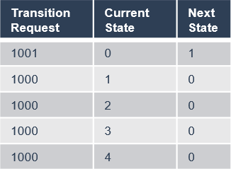

# Contents

```
1. [Introduction and functional overview](#introduction-and-functional-overview) 7

   1. [Interaction with AUTOSAR Runtime for Adaptive](#interaction-with-autosar-runtime-for-adaptive) . . . . . . . . . . . . 7

2. Acronyms and Abbreviations 8
3. [Further applicable specification](#further-applicable-specification) 11

   1. [Input documents & related standards and norms](#input-documents-related-standards-and-norms) 11

4. [Constraints and assumptions](#constraints-and-assumptions) 12

   1. [Known limitations](#known-limitations) 12
   2. [Applicability to car domains](#applicability-to-car-domains) 12

5. [Dependencies to other Functional Clusters](#dependencies-to-other-functional-clusters) 13

   1. [Platform dependencies](#platform-dependencies) 13

      1. [Operating System Interface](#operating-system-interface) 13
      2. [Execution Manager Interface](#execution-manager-interface) 13
      3. [Platform Health Management](#platform-health-management) 13
      4. [Diagnostic Management](#diagnostic-management) 13
      5. [Update And Configuration Management](#update-and-configuration-management) 13
      6. [Network Management](#network-management) 14

   2. [Other dependencies](#other-dependencies) 14

6. Requirements Tracing 15
7. [Functional specification](#functional-specification) 18

   1. [State Management Responsibilities](#state-management-responsibilities) 20

      1. [Machine State](#machine-state) 21

         1. [Startup](#startup) 23
         2. [Shutdown](#shutdown) 23
         3. [Restart](#restart) 24

      2. [Function Group State](#function-group-state) 24
      3. [State Management Architecture](#state-management-architecture) 25

   2. [State Management and Adaptive (Platform) Applications](#state-management-and-adaptive-platform-applications) 26

      1. [Interaction between the SM and Adaptive Applications](#interaction-between-the-sm-and-adaptive-applications) 26
      2. [Synchronization across multiple Adaptive Applications](#synchronization-across-multiple-adaptive-applications) 28

         1. [PowerModes for Adaptive (Platform) Applications](#powermodes-for-adaptive-platform-applications) 30
         2. [Diagnostic Reset for Adaptive (Platform) Applications](#diagnostic-reset-for-adaptive-platform-applications) 31

   3. [Interaction with Platform Health Management](#interaction-with-platform-health-management) 32
   4. [Interaction with Diagnostic Management](#interaction-with-diagnostic-management) 32
   5. [Interaction with Update and Configuration Management](#interaction-with-update-and-configuration-management) 34
   6. [Interaction with Network Management](#interaction-with-network-management) 36
   7. [Interaction with Execution Management](#interaction-with-execution-management) 38
   8. [State Management in a virtualized/hierarchical environment](#state-management-in-a-virtualizedhierarchical-environment) 39
   9. [StateManagement lifecyle](#statemanagement-lifecyle) 40

      1. [Startup](#startup-1) 40
      2. [Shutdown](#shutdown-1) 40
      3. [Restart](#restart-1) 40

   10. [Configuration](#configuration) 40
   11. [StateManagement StateMachine](#statemanagement-statemachine) 41

       1. [StateMachine introduction](#statemachine-introduction) 41
       2. [Controlling application for StateMachine States](#_bookmark55) 42
       3. [StateMachine general conditions](#statemachine-general-conditions) 44
       4. [StateMachine state changes](#statemachine-state-changes) 45
       5. [StateMachine ActionLists](#statemachine-actionlists) 47
       6. [StateMachine ActionListItems](#statemachine-actionlistitems) 47
       7. [Controlling multiple StateMachine Instances](#controlling-multiple-statemachine-instances) 51
       8. [StateMachine State notification](#statemachine-state-notification) 52

8. [API specification](#api-specification) 54
9. Service Interfaces 55

   1. Type definitions 55

      1. PowerMode types 55
      2. DiagnosticReset types 55
      3. Data types for Update And Configuration Managemet inter- action 56
      4. Data types for StateMachine interaction 57

   2. Provided Service Interfaces 58

      1. State Management TriggerIn 58
      2. State Management TriggerOut 59
      3. State Management TriggerInOut 60
      4. UpdateRequest 61
      5. Application interaction 63

         1. PowerMode 63
         2. DiagnosticReset 63

      6. StateMachine service 65

   3. Required Service Interfaces 66

      1. Network Management 66

         1. NetworkManagement NetworkState 66

   4. Application Errors 67

      1. StateManagement Error Domain 67

```{=html}
<!-- -->
```

A. Interfunctional Cluster Interfaces 68
B. Not applicable requirements 69
C. Mentioned Manifest Elements 70
D. History of Constraints and Specification Items 75

1.  Constraint and Specification Item History of this document according to AUTOSAR Release R22-11 75

    1. Added Traceables in R22-11 75
    2. Changed Traceables in R22-11 76
    3. Deleted Traceables in R22-11 76
    4. Added Constraints in R22-11 77
    5. Changed Constraints in R22-11 77
    6. Deleted Constraints in R22-11 77

2.  Constraint and Specification Item History of this document according to AUTOSAR Release R21-11 77

    1. Added Traceables \"in R21-11\" 77
    2. Changed Traceables \"in R21-11\" 79
    3. Deleted Traceables \"in R21-11\" 79
    4. Added Constraints \"in R21-11\" 79
    5. Changed Constraints \"in R21-11\" 79
    6. Deleted Constraints \"in R21-11\" 79

3.  Constraint and Specification Item History of this document according to AUTOSAR Release R20-11 79

    1. Added Traceables in R20-11 79
    2. Changed Traceables in R20-11 81
    3. Deleted Traceables in R20-11 81
    4. Added Constraints in R20-11 81
    5. Changed Constraints in R20-11 81
    6. Deleted Constraints in R20-11 81

4.  Constraint and Specification Item History of this document according to AUTOSAR Release R19-11 81

    1. Added Traceables in 19-11 81
    2. Changed Traceables in 19-11 82
    3. Deleted Traceables in 19-11 82
    4. Added Constraints in 19-11 82
    5. Changed Constraints in 19-11 82
    6. Deleted Constraints in 19-11 82

5.  Constraint and Specification Item History of this document according to AUTOSAR Release R19-03 82

    1. Added Traceables in 19-03 82
    2. Changed Traceables in 19-03 83
    3. Deleted Traceables in 19-03 83
    4. Added Constraints in 19-03 83
    5. Changed Constraints in 19-03 83
    6. Deleted Constraints in 19-03 84

```
# Introduction and functional overview

This document is the software specification of the State Management functional cluster within the Adaptive Platform Services.

State Management is responsible for determination the state of any of its inter- nal statemachines, based on information received from other AUTOSAR Adaptive Platform Application or Adaptive Application.

State Management controls state of (partial networks using provided fields (Net- workHandle) of Network Management.

State Management interacts with the Execution Management to request Func- tion Groups and the Machine State to enter specific states that are determined by project requirements. Function Group States might additionally depend on Network Managements State.

State Management provides access to its internal state via ara::com services. A particular service implements one of standardized service interfaces. The service interfaces have fields for getting current state (field \"Notifier\" (see section 9.2.2) ) and requesting new state (field \"Trigger\" (see section 9.2.1)). AUTOSAR Adaptive Platform Applications or Adaptive Applications can use the fields for re- acting on the system state changes or for influencing the system state(when they are configured to have write permissions).

Chapter [7](#functional-specification) describes how State Management concepts are realized within the

AUTOSAR Adaptive Platform.

## Interaction with AUTOSAR Runtime for Adaptive

The set of programming interfaces to the Adaptive Applications is called AUTOSAR Runtime for Adaptive (ARA). APIs accessed by State Management using the interfunctional cluster API is described in Appendix A which is not part of ARA.

The Adaptive AUTOSAR Services are provided via mechanisms provided by the Communication Management functional cluster \[[1](#_bookmark4)\] of the Adaptive Platform Foundation

3. # Further applicable specification

   1. ## Input documents & related standards and norms

The main documents that serve as input for the specification of the State Manage- ment are:

1. []{#\_bookmark4 .anchor}Specification of Communication Management AUTOSAR_SWS_CommunicationManagement
2. Glossary []{#\_bookmark5 .anchor}AUTOSAR_TR_Glossary
3. Specification of Execution Management []{#\_bookmark6 .anchor}AUTOSAR_SWS_ExecutionManagement
4. Specification of Platform Health Management []{#\_bookmark7 .anchor}AUTOSAR_SWS_PlatformHealthManagement
5. Specification of Network Management []{#\_bookmark8 .anchor}AUTOSAR_SWS_NetworkManagement
6. Specification of Diagnostics []{#\_bookmark9 .anchor}AUTOSAR_SWS_Diagnostics
7. Specification of Update and Configuration Management []{#\_bookmark10 .anchor}AUTOSAR_SWS_UpdateAndConfigurationManagement
8. Specification of Manifest AUTOSAR_TPS_ManifestSpecification
9. Requirements of State Management AUTOSAR_RS_StateManagement

```{=html}
<!-- -->
```

4. # Constraints and assumptions

   1. ## Known limitations

This section lists known limitations of State Management and their relation to this release of the AUTOSAR Adaptive Platform with the intent to provide an indication how State Management within the context of the AUTOSAR Adaptive Platform will evolve in future releases.

The following functionality is mentioned within this document but is not (fully) specified in this release:

- Section [7.2](#state-management-and-adaptive-platform-applications) This document will show the basic principles of the intended function- ality of State Management. To enable State Management to be portable, in future versions of this document standardized fields and values shall be intro- duced.
- Section [7.4](#interaction-with-diagnostic-management) Communication Control for Diagnostic reasons this is not yet dis- cussed with Diagnostic Management.
- Section [7.11](#statemanagement-statemachine) The introduced StateMachine feature does not yet cover how the DiagnosticReset requests from Diagnostic Management, the Up- dateRequest from Update and Configuration Management and the in- coming Network requests from Network Management will be handled. This fact will be improved in R23-11 when the StateMachine approach is stabilized.

  1. ## Applicability to car domains

If a superior State Management instance to the one from the ECU is available in a hierarchical car context, the State Management of the ECU shall also evaluate events generated by the superior instance of State Management. Section [7.8](#state-management-in-a-virtualizedhierarchical-environment) will give further details.

5. # Dependencies to other Functional Clusters

   1. ## Platform dependencies

      1. ### Operating System Interface

State Management has no direct interface to the Operating System. All OS depen- dencies are abstracted by the Execution Management.

### Execution Manager Interface

State Management is dependent on Execution Management to start and stop processes - as part of defined Function Groups or Machine States. State Management therefore uses the API referenced in Appendix A and defined in \[[3](#_bookmark5)\]. State Management additionally uses the StateClient functionality of Execution Management to inform Execution Management about State Managements Pro- cess State.

### Platform Health Management

State Management is dependent on the Platform Health Management \[[4](#_bookmark6)\] functional cluster. Platform Health Management supervises configured entities and informs State Management when any of these entities fails. State Manage- ment implements the actions needed to recover from such failed supervisions in a project specific way.

### Diagnostic Management

State Management is dependent on the Diagnostic Management \[[6](#_bookmark8)\] functional cluster. Diagnostic Management request different reset types for a Diagnostic Address at State Management. State Management implements the actions in a project specific way and prevents the system from shutting down during an active diagnostics session.

### Update And Configuration Management

State Management is dependent on the Update and Configuration Manage- ment \[[7](#_bookmark9)\] functional cluster. Update and Configuration Management coordi- nates the update sequence with State Management to set a set of Function Groups(affected by the update) to dedicated states.

### Network Management

State Management is dependent on the Network Management \[[5](#_bookmark7)\] functional clus- ter. Network Management provides multiple NetworkHandle fields which represents a set of (partial) networks. State Management evaluates the NetworkCurrentState field to set Function Groups to the corresponding Function Group State and set the NetworkRequestedState field in dependency of Function Groups and their Function Group State . Additionally State Management shall prevent network from shutting down during an active update or diagnostic session.

## Other dependencies

Currently, there are no other library dependencies.

# Functional specification

Please note that the semantics in the following chapter is not yet fully specified.

State Management is a functional cluster contained in the Adaptive Platform Services. State Management is responsible for all aspects of Operational State Management including handling of incoming events, prioritization of these events/re- quests setting the corresponding internal States. Incoming events are issued when AUTOSAR Adaptive Platform or Adaptive Applications which are config- ured to have write access permissions change the value of \"Trigger\" fields provided by State Management. State Management may consist of one or more state ma- chines, which might be more or less loosely coupled depending on project needs.

Additionally the State Management takes care of not shutting down the system as long as any diagnostic or update session is active as part of State Managements in- ternal State. State Management supervises the shutdown prevention with a project- specific timeout.

In dependency of the current internal States, State Management might decide to request Function Groups or Machine State to enter specific state by using inter- faces of Execution Management.

State Management is responsible for en- and disabling (partial) networks by means of Network Management. Network Management provides ara::com fields (Net- workHandle) where each of the fields represents a set of (partial) networks. State Management can influence these fields in dependency of Function Groups states and - vice versa - can set Function Groups to a defined state depending on the value of Network Managements NetworkHandle fields.

Adaptive Applications and AUTOSAR Adaptive Platform Applications can register to the events of the \"Notifier\" fields provided by State Management. They can change their internal behavior based on the value provided in the fields. Adaptive Applications and AUTOSAR Adaptive Platform Applications can influence the internal States of State Management by writing to the \"Trigger\" fields provided by State Management.

This chapter describes the functional behavior of State Management and the rela- tion to other AUTOSAR Adaptive Platform Applications State Management interacts with.

- Section [7.1](#state-management-responsibilities) covers the core State Management run-time responsibilities includ- ing the start of Applications.
- Section [7.2](#state-management-and-adaptive-platform-applications) describes how Adaptive Applications and AUTOSAR Adap- tive Platform Applications could be influenced in their behavior based on provided \"Notifier\" fields of State Management and how they can influence the internal states of State Management by using provided \"Trigger\" fields.
- Section [7.4](#interaction-with-diagnostic-management) covers several topics related to Diagnostic Management includ- ing execution of different reset types
- Section [7.5](#interaction-with-update-and-configuration-management) describes how Update and Configuration Management inter- acts with State Management
- Section [7.6](#interaction-with-network-management) documents support provided by Network Management to deactivate (partial) networks in dependency of Function Group States and vice versa.
- Section [7.7](#interaction-with-execution-management) describes how Execution Management is used to change Func- tion Group State or Machine State.
- Section [7.8](#state-management-in-a-virtualizedhierarchical-environment) provides an introduction to how State Management will work within a virtualized/hierarchical environment.

  1. ## State Management Responsibilities

State Management is the functional cluster which is responsible for determining the current internal States, and for initiating Function Group and Machine State tran- sitions by requesting them from Execution Management.

State Management is the central point where any operation event is received that might have an influence to the internal States of State Management. The State Management is responsible to evaluate these events and decide based on

- Event type (defined in project specific implementation based on project specific requirements).
- Event priority (defined in project specific implementation based on project specific requirements).
- Application identifier (Application identifier is not supported in this release. It is under discussion with FT-SEC if such an identifier could be provided by Iden- tity and Access Management).

If an State Managements internal State change is triggered then Execution Man- agement may be requested to set Function Groups or Machine State into new Function Group State.

The state change request for Function Groups can be issued by several AUTOSAR Adaptive Platform Applications:

- Platform Health Management to trigger error recovery, e.g. to activate fall- back Functionality.
- Diagnostic Management, to switch the system into different diagnostic states and to issue resets of the system.
- Update and Configuration Management to switch the system into states where software or configuration can be updated and updates can be verified.
- Network Management to coordinate required functionality and network state. This is no active request by Network Management. Network Management provides several sets of NetworkHandle fields, where State Management reg- isters to and reacts on changes of these fields issued by Network Management.

The final decision if any effect is performed is taken by State Managements internal logic based on project-specific requirements.

Adaptive Applications may provide their own property or event via an ara com in- terface, where the State Management is subscribing to, to trigger State Manage- ment internal events. Since State Management functionality is critical, access from other Adaptive Applications must be secured, e.g. by Identity and Access Management.

- State Management shall be monitored and supervised by Platform Health Management.
- State Management provides ara::com fields as interface to provide information about its current internal States

State Management is responsible for handling the following states:

- Machine State see [7.1.1](#machine-state)
- Function Group State see [7.1.2](#function-group-state)

  1. ### Machine State

A Machine State is a specific type of Function Group State (see [7.1.2](#function-group-state)). Ma- chine States and all other Function Group States are determined and re- quested by the State Management functional cluster, see [7.1.3](#state-management-architecture). The set of active States is significantly influenced by vehicle-wide events and modes which are evalu- ated into State Managements internal States.

The Function Group States, including the Machine State, define the current set of running Modelled Processes. Each Application can declare in its Execution Manifests in which Function Group States its Modelled Pro- cesses have to be running.

The start-up sequence from initial state Startup to the point where State Manage- ment, SM, requests the initial running machine state Driving is illustrated in Figure

[7.1](#_bookmark26) as an example Driving Function Group State is no mandatory Function Group State.

{width="5.879687226596675in" height="5.273228346456693in"}

**Figure 7.1:** []{#\_bookmark26 .anchor}**Start-up Sequence -- from Startup to initial running state Driving**

An arbitrary state change sequence to machine state StateXYZ is illustrated in Figure

[7.2](#_bookmark27). Here, on receipt of the state change request, Execution Management termi- nates running Modelled Processes and then starts Modelled Processes active in the new state before confirming the state change to State Management.

{width="5.88in" height="3.955in"}

**Figure 7.2:** []{#\_bookmark27 .anchor}**State Change Sequence -- Transition to machine state StateXYZ**

### Startup

Execution Management will be controlled by State Management and therefore it should not execute any Function Group State changes on its own. This creates some expectations towards system configuration. The configuration shall be done in this way that State Management will run in every Machine State (this includes Startup, Shutdown and Restart). Above expectation is needed in order to ensure that there is always a software entity that can introduce changes in the current state of the Machine. If (for example) system integrator doesn't configure State Manage- ment to be started in Startup Machine State, then Machine will never be able transit to any other state and will be stuck forever in it. This also applies to any other Machine State state that doesn't have State Management configured.

### Shutdown

As mentioned in [7.1.1.1](#startup) AUTOSAR assumes that State Management will be config- ured to run in Shutdown. State transition is not a trivial system change and it can fail for a number of reasons. When ever this happens you may want State Management to be still alive, so you can report an error and wait for further instructions. Please note that the very purpose of this state is to shutdown Machine (this includes State Management) in a clean manner. Unfortunately this means that at some point State

Management will no longer be available and it will not be able to report errors anymore. Those errors will be handled in a implementation specific way.

### Restart

As mentioned in [7.1.1.1](#startup) AUTOSAR assumes that State Management will be config- ured to run in Restart. The reasons for doing so are the same as for [7.1.1.2](#shutdown).

### Function Group State

If more than one group of functionally coherent Applications is installed on the same machine, the Machine State mechanism is not flexible enough to control these functional clusters individually, in particular if they have to be started and terminated with interleaving lifecycles. Many different Machine States would be required in this case to cover all possible combinations of active functional clusters.

To support this use case, additional Function Groups and Function Group States can be configured. Other use cases where starting and terminating individual groups of Modelled Processes might be necessary including diagnostic and error recovery.

In general, Machine States are used to control machine lifecycle (startup/shut- down/restart) and Modelled Processes of platform level Applications while other Function Group States individually control Modelled Processes which belong to groups of functionally coherent user level Applications.

**\[SWS_SM_00001\]**{DRAFT} **Available Function Group (states)** *\[*State Manage- ment shall obtain available Function Groups and their potential states from the Machine Manifest to set-up the Function Group specific state management._♩ (RS_SM_00001)_

Modelled Processes reference in their Execution Manifest the states in which they want to be executed. A state can be any Function Group State, including a Machine State. For details see \[[8](#_bookmark10)\], especially \"Mode-dependent Startup Configura- tion\" chapter and \"Function Groups\" chapter.

The arbitrary state change sequence as shown in Figure [7.2](#_bookmark27) applies to state changes of any Function Group - just replace \"MachineState\" by the name of the Function Group. On receipt of the state change request, Execution Management terminates not longer needed Modelled Processes and then starts Modelled Processes active in the new Function Group State before confirming the state change to State Management.

From the point of view of Execution Management, Function Groups are inde- pendent entities that doesn't influence each other. However from the point of view of State Management this may not always be the true. Let's consider a simple use case of Machine shutdown. From the point of view of Execution Management State Management (at some point in time) will request a Machine State tran- sition to Shutdown state. One of the Modelled Processes configured to run in that particular state, will initiate OS / HW shutdown and the Machine will power off. However from the point of view of State Management you will need to asses, if it's valid to request a Machine State transition to Shutdown state. Even if the assess- ment was positive and the Machine can be powered off, project specific requirements may mandate to switch all available Function Groups to Off state before we start power off sequence. For this reason we are considering existence of dependencies between Function Groups. Please note that currently those dependencies are im- plementation specific and configurable by integrator (i.e. all Function Groups are independent unless integrator change this).

The system might contain calibration data for variant handling. This might include that some of the Function Groups configured in the Machine Manifest are not in- tended to be executed on this system. therefore State Management has to evaluate calibration data to gather information about Function Groups not configured for the system variant

**\[SWS_SM_00005\]**{DRAFT} **Function Group Calibration Support** *\[*State Manage- ment shall receive information about deactivated Function Groups from calibration data._♩(RS_SM_00001, RS_SM_00300)_

The storage and reception of calibration data is implementation specific.

**\[SWS_SM_00006\]**{DRAFT} **Function Group Calibration Support** *\[*State Manage- ment shall decline the request of Adaptive Applications and AUTOSAR Adap- tive Platform Applications to change the Function Group State of a Function Group which is not configured to run in this variant._♩(RS_SM_00001, RS_SM_00300)_

### State Management Architecture

State Management is the functional cluster which is responsible for determining the current set of active Function Group States, including the Machine State, and for initiating State transitions by requesting them from Execution Management. Execution Management performs the State transitions and controls the actual set of running Modelled Processes, depending on the current States.

State Management is the central point where new Function Group States can be requested and where the requests are arbitrated, including coordination of contra- dicting requests from different sources. Additional data and events might need to be considered for arbitration.

State Management functionality is highly project specific, and AUTOSAR decided against specifying functionality like the Classic Platforms BswM for the Adaptive Plat- form. It is planned to only specify set of basic service interfaces, and to encapsu- late the actual arbitration logic into project specific code (e.g. a library), which can be plugged into the State Management framework and has standardized interfaces between framework and arbitration logic, so the code can be reused on different plat- forms.

The arbitration logic code might be individually developed or (partly) generated, based on standardized configuration parameters.

An overview of the interaction of State Management, AUTOSAR Adaptive Plat- form Applications and Adaptive Applications is shown in Figure [7.3](#_bookmark33).

{width="6.34in" height="5.236666666666666in"}

**Figure 7.3:** []{#\_bookmark33 .anchor}**State Management Architecture**

1. ## State Management and Adaptive (Platform) Applications

   1. ### Interaction between the SM and Adaptive Applications

Some Adaptive Applications, including AUTOSAR Adaptive Platform Ap- plications, might have the need to interact with State Management. Therefor State Management provides a service interface TriggerOut with a Notifier

(see section 9.2.2) field, where each Adaptive Application can subscribe to, thus it is informed whenever a State Managements internal State changes. When an Adaptive Application recognizes the change it can carry out the appropriate ac- tion.

In the opposite way each Adaptive Application can influence the behavior of State Management by writing to the Trigger fields provided (as part of the service interface TriggerIn) by State Management. Therefore the Adaptive Applica- tion has to by configured in a way that write access to State Managements fields is granted.

State Management provides a third service interface(TriggerInOut), where both fields are available: Trigger and Notifier. This combined field is provided with the intention that whenever the Trigger field changes the Notifier field changes as well after State Management has carried out its operation issued by the Trigger change.

**\[SWS_SM_00020\] InternalState Propagation** *\[*State Management shall support implementation of multiple instances of TriggerOut with a Notifier field which reflect State Managements internal states thus Application can get State Man- agements states._♩(RS_SM_00004, RS_SM_00005)_

**\[SWS_SM_00021\] InternalState Influence** *\[*State Management shall support im- plementation of multiple instances of TriggerIn with a Trigger field which affect State Managements internal states thus Application can influence State Manage- ments states._♩(RS_SM_00004, RS_SM_00005)_

Please note that the types (and therefore the content) of the provided fields are project- specific.

An overview of the interaction of State Management and Adaptive Applica- tions for a non-synchronized behavior is shown in Figure [7.4](#_bookmark36).

{width="6.297082239720035in" height="3.5841666666666665in"}

**Figure 7.4:** []{#\_bookmark36 .anchor}**Non-Synchronized Application State handling**

### Synchronization across multiple Adaptive Applications

Some scenarios in AUTOSAR Adaptive Platform might require a more sophisti- cated handling, where a change in State Managements internal state could only be finally carried out, when related Modelled Processes have entered a dedicated 'State', which is triggered by State Management.

These triggers will be probably dedicated to a different set of Processes, depending on the functionality to be achieved. State Management sees currently two different use-cases:

- addressing all running Modelled Processes in a machine for PowerModes
- addressing running Modelled Processes for diagnostic reset reasons.

To have the possibility and flexibility to address different groups of Modelled Pro- cesses a new communication pattern called CommunicationGroups (see SWS- CommunicationManagement \[[1](#_bookmark4)\]) was introduced.

This pattern defines a kind of compound service with a proxy and a skeleton for the server as well as for the clients.

With this approach a server can:

- broadcast a message to all clients in the group
- send a message to a dedicated client in the group
- can get a list of all clients in the group
- receive the replies from all clients in the group Conclusively a client can
- receive messages from the server
- send a reply to the server

Please note that it is essential, that a client replies to each server request, indepen- dently if the request could be fulfilled by the client or not.

To have a unique understanding of the messages and replies these will be defined as a template and the tooling will generate corresponding proxies and skeletons.(for details see SWS-CommunicationManagement)

So now State Management as a server of (multiple) CommunicationGroups can send a message to all the clients in a group and can check if

- all clients answered the request
- all clients sent the expected answer

If any of the clients did not answer or did not reply with the expected answer State Management can retry to achieve the requested state by addressing the misbehaving client directly. When the client still does not answer(or does not answer with expected reply) State Management can do further project-specific actions. Due to the asyn- chronous nature of CommunicationGroups it is necessary that State Management supervises the reception of the answers from all clients with a project-specific timeout.

An overview of the interaction of State Management and Adaptive Applica- tions for a synchronized behavior is shown in Figure [7.5](#_bookmark38).

{width="4.0259372265966755in" height="3.0346872265966756in"}

**Figure 7.5:** []{#\_bookmark38 .anchor}**PowerModes as example of Synchronized Application State handling**

### PowerModes for Adaptive (Platform) Applications

The PowerModes are intended to influence the internal behavior of all Processes in the system. Currently, there are three modes supported, but there might be more modes introduced in future releases of this document.

The modes are defined as follows:

- \"On\" : A Modelled Process that receives this PowerMode behaves normally as it has been spawned by ExecutionManagement. It is used to \"undo\" the other PowerMode requests. Modelled Processes that are just spawned should be- have like an \"On\" is requested as PowerMode.
- \"Suspend\" : This PowerMode is intended to be used as a signal to the Modelled Processes that the system is suspended( e.g. to RAM or to disc). The imple- mentation of the necessary actions(e.g. setting drivers to a proprietary mode, \...) will be project-specific and might depend on the environment(e.g. used OS).
- \"Off\" : A Modelled Process that receives this PowerMode behaves like it re- ceives a SIGTERM from Execution Management, beside exiting.

This PowerMode is used to realize the so called \"late-wakeup\", where a new wakeup reason is found during a proceeding shutdown(e.g. short-time low voltage). When the new wakeup reason is found an \"On\" request will be sent to the Modelled Pro- cesses, thus they can immediately continue with their \"normal\" work without the need to be spawned again(e.g. from the filesystem). A Modelled Process which has just received the \"Off\" PowerMode (and carried out the necessary actions) and receives a

SIGTERM from Execution Management afterward, can perform its shutdown much faster because it has already done all the necessary steps to be prepared for exiting.

Modelled Processes that support the PowerModes are expected to behave like they would have received an \"On\" request when they are entering \"Running\" state when being spawned by Execution Management to keep compatibility with Modelled Processes which do not support the PowerModes.

{width="6.16in" height="2.64in"}

**Figure 7.6: PowerModes for Adaptive (Platform) Applications**

Please note that Modelled Processes that support either \"Off\" or \"Suspend\" or both of these PowerModes support the \"On\" PowerMode, too.

The service interface for the PowerMode, the defined messages and replies can be found in 9.2.5.1 Service Interface and 9.1.1 Type definition.

### Diagnostic Reset for Adaptive (Platform) Applications

The Diagnostic Reset Service is provided for Diagnostic Reset functionality of Di- agnostic Management. The rationale behind this is to change the behavior of Modelled Processes without the need to terminate and restart them. This service is intended to influence Modelled Processes that are addressed by Diagnostic Address. If all Modelled Processes or only a subset is affected depends on the system design. Therefore it is recommended to limit access to the service by IAM.

The reaction of the Adaptive (Platform) Applications to the request itself is project- specific.

Details for the complete interaction of Diagnostic Management and State Man- agement can be found in [7.4](#interaction-with-diagnostic-management) Interaction with Diagnostic Management.

The service interface for the Diagnostic Reset, the defined messages, and replies can be found in 9.2.5.2 Service Interface and 9.1.2 Type definition.

Please note that this interface just provides means to the developer of State Man- agement to realize the project-specific needs for Diagnostic Reset use cases.

## Interaction with Platform Health Management

Platform Health Management is responsible for monitoring supervised entities via local supervision(s) and checking the status of health channels. Failures in local super- vision(s) will be accumulated in a global supervision. The scope of a global supervision is a single Function Group (or a part of it). For details see SWS- PlatformHealthManagement\[[4](#_bookmark6)\]. As soon as a global supervision enters the stopped state or a health channel contains information that is relevant for State Management, Platform Health Management will notify State Management via C++ API pro- vided by Platform Health Manager. C++ interface is provided as a class with virtual functions, which have to be implemented by State Management.

When State Management receives notification from Platform Health Manage- ment it can evaluate the information from the notification and initiate the project-specific actions to recover from the failure(e.g. request Execution Management to switch a Function Group to another Function Group State, request Execution Man- agement for a restart of the Machine, \...).

Note: Platform Health Management monitors the return of the RecoverHandler() with a configurable timeout. If after a configurable amount of retries the State Man- agement will still not regularly return from the RecoveryHandler() Platform Health Management will do its own countermeasures by wrongly triggering or stop triggering the serviced watchdog.

## Interaction with Diagnostic Management

Diagnostic Management is responsible for diagnosing, configuring and resetting Diagnostic Addresses. The relation between a Diagnostic Addresses and a Software Cluster is project specific. The interface between Diagnostic Manage- ment and State Management is provided by Diagnostic Management as C++ API. The interface is provided as a class with virtual functions, which have to be imple- mented by State Management.

Diagnostic Management provides the ara::diag::EcuResetRequest interface to for- ward ECU Reset service requests to State Management. State Management pro- cesses the request and executes the reset of the Diagnostic Address related en- tity.

From Diagnostic Management point of view several different reset types have to be carried out to fulfill functionality of Diagnostic Management. Because the inter- pretation of the reset types (defined in ISO 14229-1)

- hardReset
- keyOffOnReset
- softReset
- customReset

is done differently by each OEM, parts of the reset functionality have to be delegated by State Management to Adaptive Applications and AUTOSAR Adaptive Plat- form Applications.

A \"keyOffOnReset\" may be translated by State Managements internal logic to stop and start the Function Group which relate to the requested Diagnostic Ad- dresses.

A \"softReset\" may be translated by State Managements internal logic to request Modelled Processes (within the Function Groups which relate to the requested Diagnostic Address) to perform internal functionality without the need to termi- nate and start them again. Therefor State Management provides a service interface in the scope of a CommunicationGroup. All Modelled Processes which should support this feature have to use the ara::com methods and fields generated from the message and reply message definition provided in 9.1.2

**\[SWS_SM_00101\]**{DRAFT} **Diagnostic Reset** *\[*State Management shall implement means to receive reset requests for Diagnostic Addresses from Diagnostic Management. State Management shall carry out the project specific actions for the specific reset type._♩(RS_SM_00100)_

This functionality is project specific. So therefore the correct mapping has to be done by the project specific code.

When State Management does not see any reason(project specific) to keep the ma- chine alive any longer it will normally not shutdown the machine immediately, but will keep it alive for a configurable amount of time. Under some conditions it is needed that this waitingtime is reduced as much as possible (e.g. end of line diagnostics). This has to be supported by State Management too.

**\[SWS_SM_00106\]**{DRAFT} **Enabling of rapid shutdown** *\[*State Management shall implement means to reduce the waitingtime to shutdown the machine as much as possible*♩(RS_SM_00100)*

There might be reasons that Diagnostic Management needs to withdraw a previ- ously enabled rapid shutdown. This usecase has to be supported by State Manage- ment too.

**\[SWS_SM_00107\]**{DRAFT} **Disabling of rapid shutdown** *\[*State Management shall implement means to set the waitingtime to shutdown the machine to the con- figured value*♩(RS_SM_00100)*

## Interaction with Update and Configuration Management

Update and Configuration Management is responsible for installing, removing or updating Software Clusters as smallest updatable entity. To enable Update and Configuration Management to fulfill its functionality State Management offers a service interface (see 9.2.4) to be used by Update and Configuration Management.

Please note that system integrator has to limit usage of this interface to Update and Configuration Management by configuring Identity and Access Manage- ment.

In a first step Update and Configuration Management will ask State Man- agement if it is allowed to perform an update. The decision will depend on current state of the machine (or whole vehicle) and has to be done in a project specific way.

**\[SWS_SM_00203\]**{DRAFT} **Start update session** *\[*State Management shall pro- vide the service interface UpdateRequest to Update and Configuration Man- agement with the method call RequestUpdateSession to check if an update can be performed._♩(RS_SM_00100)_

As soon as State Management allows updating, it is necessary that State Man- agement denies any further request for a new update session. To assure a higher consistency in the AUTOSAR Adaptive Platform, multiple update sessions at a time shall be not allowed.

**\[SWS_SM_00209\]**{DRAFT} **Preventing multiple update sessions** *\[*RequestUp- dateSession shall return kNotAllowedMultipleUpdateSessions in case the method RequestUpdateSession is called during an already active Update Session*♩ (RS_SM_00004)*

As soon as State Management allows updating, it is necessary that State Man- agement prevents system from shutting down.

However AUTOSAR fully recognizes that there could be valid reasons to restart/shut- down machine even during an active update session (e.g. low voltage, high temper- ature,\...). For that reasons AUTOSAR does not prevent State Management from restarting/shutting down machine, but advises that such a decision should be carefully evaluated before being executed. Please note that AUTOSAR also recognizes that projects could have an arbitrary timeout restriction on the duration of the update ses- sion. This could be done for practical reasons and is allowed from the perspective of the AUTOSAR.

Additionally State Management has to persist the information about an ongoing up- date session, thus, after a machine restart (independently if restart was expected or not), Update and Configuration Management can continue to update. To con- tinue the update in a consistent way it will be needed that only a few Function Groups will be set to a meaningful Function Group State (project specific). At least Update and Configuration Management has to be in a running state.

**\[SWS_SM_00204\]**{DRAFT} **Persist session status** *\[*State Management shall per- sist information about ongoing update session, thus it can be read out after any kind of Machine reset._♩(RS_SM_00004)_

In some cases it is needed that Update and Configuration Management issues a reset of the Machine (expected reset), e.g. when Functional Clusters like State Management, Platform Health Management or Execution Manage- ment are affected by the update. This has to be supported by State Management. At least this might be simply implemented by requesting Machine State restart from Execution Management.

**\[SWS_SM_00202\]**{DRAFT} **Reset Execution** *\[*State Management shall implement the service interface UpdateRequest to Update and Configuration Manage- ment with the method call ResetMachine to request a Machine reset._♩(RS_SM\_- 00004)_

Update and Configuration Management has to inform State Management when no more operations for the update have to be done, thus State Management can clear now the information about an ongoing update and can continue its regular job. Please note, that all State Management activities after the StopUpdateSession is requested are fully project specific, like setting the impacted Function Groups into a meaningful Function Group State.

**\[SWS_SM_00205\]**{DRAFT} **Stop update session** *\[*State Management shall pro- vide the service interface UpdateRequest to Update and Configuration Man- agement with the method call StopUpdateSession thus it can inform State Man- agement that the update session is finished._♩(RS_SM_00004)_

During the update there will be up to three different steps, depending if a Software Cluster is installed, removed or updated. If and when the steps are done depends ad- ditionally on the success or fail of the previous steps. To support Update and Con- figuration Management to request these steps State Management provides three different methods as part of the service interface UpdateRequest.

**\[SWS_SM_00206\]**{DRAFT} **prepare update** *\[*State Management shall provide the service interface UpdateRequest to Update and Configuration Management with the method call PrepareUpdate thus it can request State Management to per- form a preparation of the given Function Groups to be updated._♩(RS_SM_00004)_

**\[SWS_SM_00207\]**{DRAFT} **prepare verify** *\[*State Management shall provide the service interface UpdateRequest to Update and Configuration Management with the method call VerifyUpdate thus it can request State Management to per- form a verification of the given Function Groups._♩(RS_SM_00004)_

**\[SWS_SM_00208\]**{DRAFT} **prepare rollback** *\[*State Management shall provide the service interface UpdateRequest to Update and Configuration Management with the method call PrepareRollback thus it can request State Management to perform a preparation of the given Function Groups to be rolled back._♩(RS_SM\_- 00004)_

For updating a Software Cluster Update and Configuration Management will call the method PrepareUpdate (as part of the service interface Up- dateRequest) in a first step. State Management will at least set all the Function Groups, given as parameter, to Off state. In next step Update and Configura- tion Management will perform the real update (e.g. exchange executable, change manifests,\...). As following step Update and Configuration Management uses the VerifyUpdate to request State Management to perform a verification of the update. Therefore State Management will at least set all the Function Groups, given as parameter, to Verify state. These request will be reported to Update and Configuration Management as failed when any of the Function Groups could not be set to the requested Function Group State. A failure will also be reported when one of these functions is called, before State Management granted the right to update.

When any of these steps fails, Update and Configuration Management can de- cide to revert previous changes. Therefore Update and Configuration Manage- ment uses PrepareRollback function, where State Management will at least set all the Function Groups, given as parameter, to Off state.

When a Software Cluster is removed by Update and Configuration Man- agement, VerifyUpdate will never be called by Update and Configuration Management. Contrary to that PrepareUpdate will never be called, when a new Software Cluster is installed into the Machine.

For more detail about the update process see sequence diagrams and descriptions in \[[7](#_bookmark9)\].

## Interaction with Network Management

To be portable between different ECUs the Adaptive Applications should not have the need to know which networks are needed to fulfill its functionality, because on different ECUs the networks could be configured differently. To control the availability of networks for several Adaptive Applications State Management interacts with Network Management via a service interface.

Network Management provides multiple instances of NetworkHandles, where each represents a set of (partial) networks.

The NetworkHandles are defined in the Machine Manifest and are there assigned to a Function Group State.

An overview of the interaction of State Management, Network Management and

Adaptive Applications is shown in Figure [7.8](#_bookmark46).

{width="6.299998906386701in" height="3.9133333333333336in"}

**Figure 7.7: Switching Network State by \"Trigger\"**

**\[SWS_SM_00300\]**{DRAFT} **NetworkHandle Configuration** *\[*State Management shall receive information about NetworkHandles and their associated Function Group States from Machine Manifest._♩(RS_SM_00400)_

Whenever (partial) networks are activated or deactivated from outside request and this set of (partial) networks is represented by a NetworkHandle in Machine Manifest Network Management will change the value of the corresponding NetworkHandle. State Management is notified about the change, because it has registered to all availabe NetworkHandle fields. When State Management recognizes a change in a fields value it sets the corresponding Function Group in the Function Group State where the NetworkHandle is configured for in the Machine Manifest.

**\[SWS_SM_00301\]**{DRAFT} **NetworkHandle Registration** *\[*State Management shall register for all NetworkHandles provided by Network Managements which are available from Machine Manifest._♩(RS_SM_00400)_

**\[SWS_SM_00302\]**{DRAFT} **NetworkHandle to FunctionGroupState** *\[*State Man- agement shall set Function Groups to the corresponding Function Group State which is configured in the Machine Manifest for the NetworkHandle when it recognizes a change in NetworkHandle value._♩(RS_SM_00401)_

Vice versa State Managements shall change the value of the NetworkHandle when a Function Group has to change its Function Group State and an associa- tion between this Function Group State and the Network handle is available in Machine Manifest. Network Management will recognize this change and will change the state of the (partial) networks accordingly to the NetworkHandle.

**\[SWS_SM_00303\]**{DRAFT} **FunctionGroupState to NetworkHandle** *\[*State Man- agement shall change the value of NetworkHandle when Function Groups changes its Function Group State and a NetworkHandle is associated to this Function Group State in the Machine Manifest._♩(RS_SM_00400)_

It might be needed that a Function Group stays longer in its Function Group State when the causing (partial) network set has been switched off or a (partial) net- work is longer available than the causing Function Group has been switched to Function Group State 'Off'. This is called 'afterrun'. The corresponding timeout- value has to be configured in Machine Manifest

**\[SWS_SM_00304\]**{DRAFT} **Network Afterrun** *\[*State Management shall support means to support 'afterrun' to switch off related Function Groups or (partial) net- works. The timeout value for this 'afterrun' has to be read from e.g. Machine Mani- fest._♩(RS_SM_00400)_

## Interaction with Execution Management

Execution Management is used to execute the Function Group State changes. The decision to change the state of Machine State or the Function Group State of Function Groups might come from inside of State Manage- ment based on State Managements States (or other project specific requirements) or might be requested at State Management from an external Adaptive Appli- cation.

An overview of the interaction of State Management, Execution Management

and Adaptive Applications is shown in Figure [7.8](#_bookmark46).

{width="6.325in" height="3.15625in"}

**Figure 7.8:** []{#\_bookmark46 .anchor}**Switching FunctionGroup State by \"Trigger\"**

**\[SWS_SM_00400\]**{DRAFT} **Execution Management** *\[*State Management shall use StateClient API of Execution Management to request a change in the Function Group State of any Function Group(including MachineFG)._♩(RS_SM_00001)_

Execution Management might not be able to carry out the requested Function Group State change due to several reasons (e.g. corrupted binary). Execution Management returns the result of the request.

When State Management gets kIntegrityOrAuthenticityCheckFailed as error to a Function Group SetState request it is expected that every subsequent request for the same Function Group State will fail with the same value. So any further action to solve this issue (e.g. update/fix application) is out of scope of State Management. Please note that this error indicates that the trusted platform has been compromised.

**\[SWS_SM_00401\]**{DRAFT} **Execution Management Results** *\[*State Management shall evaluate the results of request to Execution Management. Based on the re- sults State Management may do project-specific actions*♩(RS_SM_00001)*

Depending on ExecErrc returned by Execution Management during Function Group State transition, State Management can perform variety of countermea- sures which include but are not limited to following actions

- request another Function Group State for the same Function Group e.g. set current Function Group to \"Off\" state
- request a Function Group State for another Function Group
- ignore the error e.g. kInTransitionToSameState, kAlreadyInState
- persist the error information (at least for current power cycle) to not request the Function Group State again, when it is an unrecoverable error e.g. kMeta- ModelError, kIntegrityOrAuthenticityCheckFailed
- trigger a system restart (e.g. report wrong supervision checkpoint to PHM, project specific) in case it is a generic unrecoverable error e.g. kGeneralError, kCommu- nicationError

Please note that these error reactions are only valid when State Management is indi- vidually implemented. When State Machines are used, a change in the StateMachine state should be configured as error reaction.

Implementation hint: State Management needs to take into account that supervi- sion failures may be reported by Platform Health Management before Execu- tion Management has reported that a requested Function Group State has been reached.

## State Management in a virtualized/hierarchical environment

On an ECU several machines might run in a virtualized environment. Each of the virtual machines might contain an AUTOSAR Adaptive platform. So therefore each of the

virtual machines contain State Management. To have coordinated control over the several virtual machines there has to be virtual machine which supervises the whole ECU state. This is not only valid for a virtualized environment, but for a hierarchical environment, too.

**\[SWS_SM_00500\]**{DRAFT} **Virtualized/hierarchical State Management** *\[*State Management shall be able to register to the \"Trigger\" fields of a supervising State Management instance to receive information about the whole ECU state._♩(RS_SM\_- 00200)_

**\[SWS_SM_00501\]**{DRAFT} **Virtualized/hierarchical State Management internal State** *\[*State Management shall implement means to calculate its internal States based on information from a supervising State Management instance._♩(RS_SM\_- 00200)_

2. ## StateManagement lifecyle

   1. ### Startup

State management lifecycle fully depends on machine state. Details can be found in [7.1.1.1](#startup)

### Shutdown

State management lifecycle fully depends on machine state. Details can be found in [7.1.1.2](#shutdown)

### Restart

State management lifecycle fully depends on machine state. Details can be found in [7.1.1.3](#restart)

## Configuration

State Management should be configured to run in every Machine State (this includes Startup, Shutdown and Restart) other than Off. This expectation is needed to ensure that there is always a software entity that can introduce changes in the current state of the Machine. If (for example) the system integrator does not configure State Manage- ment to be started in Startup Machine State, then Machine will never be able transit to any other state and will be stuck forever in it.

**\[SWS_SM_CONSTR_00001\]**{DRAFT} **Existence of State Management** *\[*At least one Modelled Process with Process.functionClusterAffinity with the value STATE*MANAGEMENT shall be configured to run in each MachineFG state except Off, whenever one such Modelled Process is configured to run in MachineFG state Startup.*♩(RS*SM_00001)*

4. ## StateManagement StateMachine

   1. ### StateMachine introduction

Introducing StateMachines in the scope of State Management will give the inte- grator the possibility to define which set of Function Groups become active (Func- tion Group State != \"Off\") under a certain condition. The integrator can define error reactions (violated supervisions, abnormal or unexpected termination) via config- uration in the scope of a set of Function Group States, reflected by a StateMa- chine State of State Management.

StateMachines are comprised by set of StateMachine States. Each StateMa- chine has to have at least two States: The Initial State and the Final State. There probably will be a number of additional project-specific StateMachine States (e.g. degraded States). Each State references an ActionList, which is comprised of a set of ActionListItems. All ActionListItems in an Action- List are executed as soon as a State of a StateMachine is entered. Currently available Types for an ActionListItem are:

- Request Function Group State, (represented by meta-class StateMan- agementSetFunctionGroupStateActionItem)
- SYNC, (represented by meta-class StateManagementSyncActionItem)
- Start/Stop StateMachine, (represented by meta-class StateManage- mentStateMachineActionItem)

A StateMachine State change can be triggered by two different types of actors:

- An Adaptive Application (called SMControlApplication) can request StateMachine State change through publicly available interface. Please note that IAM configuration may by applied here.
- Platform Health Management and Execution Management can trigger state change as a result of an error.

Current StateMachine State can be published by TriggerOut::Notifier interface which is configurable.

The following figure shows how Platform Health Management, Execution Management, SMControlApplication and a StateMachine as part of State Management interact:

{width="6.31125in" height="2.673124453193351in"}

**Figure 7.9: Interactions with StateMachine**

### StateMachines are an optional element of State Management. However, the integrator can decide to implement State Management fully by its own. This is achieved by keeping interfaces towards State Management public.

1. []{#\_bookmark55 .anchor}**Controlling application for StateMachine States**

As State Management shall not contain any project-specific logic (under which con- dition a StateMachine State is requested) it is assumed that a project-specific Process (SMControlApplication ) exists. As SMControlApplication and StateMachine within State Management instance belong together it would make sense to instantiate them somehow together like follows:

- The process is configured to run in the same Function Group State like the process which contains the StateMachine.

{width="6.187498906386701in" height="2.8125in"}

**Figure 7.10: SMControllApplication and StateManagement Process started together**

- The process is configured to run in a Function Group State, as Action- ListItem in the ActionList referenced by the Initial State of the StateMachine.

{width="6.198332239720035in" height="3.0083333333333333in"}

**Figure 7.11: SMControllApplication started in initial State of StateManagements StateMachine**

Even if it would make sense to start these processs as shown above, they could be part of different, decoupled Function Group States, depending on project needs.

SMControlApplication is needed when arbitrary state changes could be re- quested as per StateMachine configuration. If the only functionality provided by StateMachine is the reaction to errors reported by Platform Health Manage- ment and/or Execution Management, then there is no need to have a SMCon- trolApplication. In that case, StateMachine should start intended functionality when it enters the Initial State.

**\[SWS_SM_CONSTR_00010\]**{DRAFT} **ActionItems in initial StateMachine State** *\[*When there is no SMControlApplication at least one ActionListItem in the ActionList, referencing the Initial State of the StateMachine, shall refer- ence a Function Group State different than \"Off\" or a Start StateMachine Ac- tionListItem._♩()_

The SMControlApplication, uses the RequestState method of StateMachi- neService(modelled as meta-class ServiceInterface) to request another StateMachine State. As not all transitions might be possible(project-specific) a mapping table (TransitionRequestTable) is introduced which maps the input value provided by SMControlApplication to StateMachines next state, depend- ing on current StateMachine State.

{width="1.4941666666666666in" height="1.0954166666666667in"}

**Figure 7.12: TransitionRequestTable**

**\[SWS_SM_00600\]**{DRAFT} **StateMachine service interface** *\[*State Management shall provide an ara::com based service for each instance of the StateMachine con- figured._♩(RS_SM_00001, RS_SM_00005)_

Please note that appendix A.10 of TPS Manifest Specification \[[8](#_bookmark10)\] shows in detail how the TransitionRequestTable and the ErrorRecoveryTable can be build with the available meta-class elements.

### StateMachine general conditions

When a StateMachine exits it shall leave the system in a consistent state. This means that no Function Group, which are under control of the StateMachine should be in a state where no further influence on their state can be taken as error reaction. Therefore all controlled Function Groups shall be in \"Off\" state thus they do not cause any error.

**\[SWS_SM_CONSTR_00011\]**{DRAFT} **Function Group States referenced in the fi- nal state of a StateMachine** *\[*The ActionList referenced by the Final State of a StateMachine shall only contain ActionListItems that reference the \"Off\" state of the controlled Function Group._♩()_

**\[SWS_SM_CONSTR_00012\]**{DRAFT} **Stop running StateMachines in the final state of a StateMachine** *\[*When any StateMachine was started by Start StateMa- chine ActionListItem, and not stopped before, the Final State shall contain ActionListItems to stop all running StateMachines*♩()*

To keep a consistent Function Group State it is needed, that no Function Group is controlled by different StateMachines, as it would not be clear which StateMachine is finally responsible.

{width="6.117469378827646in" height="2.363332239720035in"}

**Figure 7.13: Function Group controlled by single StateMachine**

**\[SWS_SM_CONSTR_00013\]**{DRAFT} **Function Group shall only be controlled by single StateMachine** *\[*A Function Group shall only be referenced by ActionLis- tItems of exactly one StateMachine._♩()_

### StateMachine state changes

One of the important configuration abilities is to define which StateMachine State shall be entered on which error. The reaction is the same, independent if the issue is reported by Platform Health Management or Execution Manage- ment, as the issue causing process is the same. To achieve this, a map- ping table, the ErrorRecoveryTable is introduced, which maps the Execution- Error::EventexecutionError (modelled as ProcessExecutionError.execution- Error) to the required StateMachine State.

{width="1.4510411198600175in" height="2.1656244531933506in"}

**Figure 7.14: ErrorRecoveryTable**

To ensure that all errors are covered the following constraint is needed:

**\[SWS_SM_CONSTR_00014\]**{DRAFT} **Handling of non-mapped ExecutionError** *\[*Each ErrorRecoveryTable shall have exactly one entry configured with value ANY as the ExecutionError*♩()*

The ANY entry will be used to change to the configured StateMachine State when a not configured ExecutionError is reported by by Platform Health Management or Execution Management.

**\[SWS_SM_00601\]**{DRAFT} **StateMachine error notification re- action** *\[*When ExecutionError::EventexecutionError is reported via ara::phm::RecoveryAction::RecoveryHandler (modelled as StateManagemen- PhmErrorInterface from Platform Health Management or via undefined- StateCallback or SetState from ara::exec::StateClient (modelled as StateMan- agementEmErrorInterface) from Execution Management, StateMachine shall

- set internal flag ErrorRecoveryOngoing
- evaluate the next StateMachine State configured for executionError from

ErrorRecoveryTable

- stop processing ActionListItems from the ActionList referencing the cur- rent StateMachine State
- switch to the next StateMachine State immediately and start processing ActionListItems from the ActionList referencing this StateMachine State

_♩(RS_SM_00001, RS_SM_00005)_

**\[SWS_SM_00602\]**{DRAFT} **StateMachine ErrorRecoveryOngoing flag reset** *\[*The internal ErrorRecoveryOngoing flag shall be reset, when all ActionListItems of an ActionList referencing a StateMachine State, which is requested due to error reaction, are successfully processed._♩(RS_SM_00001, RS_SM_00005)_

When an request to change a StateMachine State is issued by a SMControlAp- plication there are more steps to consider:

**\[SWS_SM_00603\]**{DRAFT} **StateMachine service interface RequestState - not al- lowed transition** *\[*The RequestState method shall return kTransitionNotAl- lowed if the current state of the StateMachine is not configured for the Transi- tionRequest value in TransitionRequestTable and shall cease any further pro- cessing of the request._♩(RS_SM_00001, RS_SM_00005)_

**\[SWS_SM_00604\]**{DRAFT} **StateMachine service interface RequestState - in- valid transition** *\[*The RequestState method shall return kInvalidValue if Tran- sitionRequest value is not configured in TransitionRequestTable and shall cease any further processing of the request._♩(RS_SM_00001, RS_SM_00005)_

**\[SWS_SM_00605\]**{DRAFT} **StateMachine service interface RequestState - recov- ery ongoing** *\[*The RequestState method shall return kRecoveryTransitionOn- going if internal flag ErrorRecoveryOngoing is set and shall cease any further processing of the request._♩(RS_SM_00001, RS_SM_00005)_

**\[SWS_SM_00606\]**{DRAFT} **Canceling ongoing state transition of StateMachine** *\[*If transition request was accepted, RequestState method shall return kCanceled to previous RequestState requests if any is still pending for the StateMachine._♩ (RS_SM_00001, RS_SM_00005)_

**\[SWS_SM_00607\]**{DRAFT} **StateMachine transition execution** *\[*When StateMa- chine receives a valid state change request it shall

- evaluate the next StateMachine State configured for TransitionRequest value and current state from TransitionRequestTable
- stop processing ActionListItems from the ActionList referencing the cur- rent StateMachine State
- switch to the next StateMachine State immediately and start processing ActionListItems from the ActionList referencing this StateMachine State.

_♩(RS_SM_00001, RS_SM_00005)_

### StateMachine ActionLists

ActionLists are a collection of ActionListItems and are referencing a StateMachine State. An ActionList, respectively its ActionListItems are executed as soon as a StateMachine State is entered. ActionLists are repre- sented by meta-class StateManagementActionList.

### StateMachine ActionListItems

There are three kinds of ActionListItems:

- Requesting a Function Group State
- Start/Stop a StateMachine
- SYNC, to sync between different ActionListItems

**\[SWS_SM_00608\]**{DRAFT} **ActionListItem - Function Group State** *\[*When a Func- tion Group State ActionListItem is found in the ActionLists, StateMachine shall request the configured Function Group State from Execution Manage- ment._♩(RS_SM_00001, RS_SM_00005)_

To enable State Management to build a Function Group dependency the Ac- tionListItems shall be executed in the order they are configured.

**\[SWS_SM_00609\]**{DRAFT} **ActionList processing order** *\[*The ActionListItems in the ActionLists shall be processed in the order they are configured._♩(RS_SM\_- 00001, RS_SM_00005)_

To fully support this kind of dependency a \"SYNC\" item is introduced, that waits till all

ActionListItems since

- the beginning of the ActionList
- the last \"SYNC\" item

have been successfully executed.

**\[SWS_SM_00610\]**{DRAFT} **processing SYNC ActionListItem** *\[*When processing \"SYNC\" ActionListItem on the list, StateMachine shall wait until all previously processed ActionListItems are finished before moving to the next item after \"SYNC\"._♩(RS_SM_00001, RS_SM_00005)_

**\[SWS_SM_00611\]**{DRAFT} **processing ActionListItem** *\[*ActionListItems shall be processed in parallel unless SYNC ActionListItem is processed._♩(RS_SM\_- 00001, RS_SM_00005)_

{width="6.2297255030621175in" height="6.3275in"}

**Figure 7.15: Parallel ActionListItem execution and SYNC**

Please note that parallel execution of the ActionListItems is heavily dependent of the implementation and the underlaying hardware and operating system

As - together with the \"SYNC\" ActionListItem - Function Group State de- pendencies can be realized, the referenced Function Groups can be given in an arbitrary order to fulfill the project-specific needs.

{width="6.192031933508312in" height="6.82in"}

**Figure 7.16: Arbitrary order for ActionListItems**

To ensure that no Function Group is missed in any state, as it might lead to inconsis- tencies in the expected functionality, it is needed within a single StateMachine, that each ActionList contains the same Function Groups, even if their state does not change from a StateMachine State to another.

**\[SWS_SM_CONSTR_00015\]**{DRAFT} **Completeness of controlled Function Groups** *\[*Each ActionList referencing different StateMachine States of the same StateMachine shall reference the same set of Function Groups._♩()_

{width="6.245089676290464in" height="5.44in"}

**Figure 7.17: Completeness of controlled Function Groups**

### Controlling multiple StateMachine Instances

The ActionListItem approach offers the ability to start/stop other StateMachine

instances, as it might be needed in a project-specific environment.

**\[SWS_SM_CONSTR_00016\]**{DRAFT} **Completeness of controlled StateMachines** *\[*Each ActionList referencing a StateMachine State of the same StateMachine shall reference the same set of controlled StateMachines._♩()_

**\[SWS_SM_00612\]**{DRAFT} **ActionListItem \"Start StateMachine\" processing** *\[*When the ActionListItem \"Start StateMachine\" is processed, the StateMachine with the provided ID shall be started._♩(RS_SM_00001, RS_SM_00005)_

**\[SWS_SM_00613\]**{DRAFT} **ActionListItem \"Start StateMachine\" processing - StateMachine is already running** *\[*When the ActionListItem \"Start StateMa- chine\" is processed, and the StateMachine with the provided ID is already started, this processing shall be skipped._♩(RS_SM_00001, RS_SM_00005)_

**\[SWS_SM_00614\]**{DRAFT} **ActionListItem \"Stop StateMachine\" processing** *\[*When the ActionListItem \"Stop StateMachine\" is processed, the StateMachine with the provided ID shall be stopped._♩(RS_SM_00001, RS_SM_00005)_

**\[SWS_SM_00615\]**{DRAFT} **ActionListItem \"Stop StateMachine\" processing - StateMachine is not running** *\[*When the ActionListItem \"Stop StateMachine\" is processed, and the StateMachine with the provided ID is not running, this processing shall be skipped._♩(RS_SM_00001, RS_SM_00005)_

Please note, that StateMachines for State Management can be implemented in different processes. In this case setting a Function Group (which contains the State Management processes) could be used instead of the \"Start/Stop StateMa- chine\" ActionListItem type.

### StateMachine State notification

As State Management's StateMachine States reflect the current functionality of a Machine, which might be in the interest of several entities in the Machine (e.g. Firewall, SystemHealthManagement, \...) it shall be possible to make the StateMa- chine States available to them. Therefore, it shall be possible to configure a Trig- gerOut::Notifier service interface (modelled as meta-class ServiceInterface) for a StateMachine.

{width="6.330865048118985in" height="4.37in"}

**Figure 7.18: Value of configured TriggerOut::Notifier field**

**\[SWS_SM_00616\]**{DRAFT} **Notifier value during StateMachine State transition** *\[*When a TriggerOut interface is configured for the StateMachine and a StateMa- chine State transition has been started, the value of the \"Notifier\" field shall be set to \"inTransition\"._♩(RS_SM_00001, RS_SM_00005)_

Please note that the value \"inTransition\" is set independently of the source (Platform Health Management, Execution Management, SMControlApplication, \...) and is kept, even if another StateMachine State transition, as reaction to an er- ror notification, is performed.

**\[SWS_SM_00617\]**{DRAFT} **Notifier value after StateMachine State transition** *\[*When a TriggerOut interface is configured for the StateMachinethe value of the \"No- tifier\" field shall be set to the current StateMachine State as soon as all Action- ListItems (in the ActionList referencing the current StateMachine State) have been executed and all results have been collected._♩(RS_SM_00001, RS_SM\_- 00005)_

# API specification

State Management does not provide any API. All functional interfaces will be found in Chapter 9 Service Interfaces.
