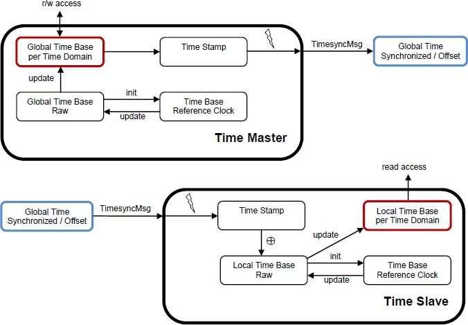
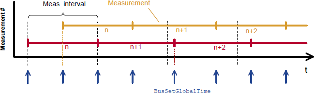

# Contents

```
1. [Introduction and functional overview](#introduction-and-functional-overview) 7
2. Acronyms and Abbreviations 8

   1. Acronyms and Abbreviations . . . . . . . . . . . . . . . . . . . . . . . . 8
   2. Definitions . . . . . . . . . . . . . . . . . . . . . . . . . . . . . . . . . . 9

      1. ara::core::SteadyClock . . . . . . . . . . . . . . . . . . . . . 9
      2. Time Base Application . . . . . . . . . . . . . . . . . . . . . . 9
3. [Related documentation](#related-documentation) 10

   1. [Input documents & related standards and norms](#input-documents-related-standards-and-norms) 10
   2. [Further applicable specification](#further-applicable-specification) 10
4. [Constraints and assumptions](#constraints-and-assumptions) 11

   1. [Known limitations](#known-limitations) 11

      1. [Configuration](#configuration) 11
      2. [Time Gateway](#time-gateway) 11
      3. [Out of Scope](#out-of-scope) 11
      4. [Security](#security) 11
   2. [Applicability to car domains](#applicability-to-car-domains) 11
   3. [Recommendation](#recommendation) 12
5. [Dependencies to other Functional Clusters](#dependencies-to-other-functional-clusters) 13
6. Requirements Tracing 14
7. [Functional specification](#functional-specification) 17

   1. [General Overview of TS](#general-overview-of-ts) 17

      1. [Base functionality of every Time Base](#base-functionality-of-every-time-base) 18

         1. [Time Base Status](#time-base-status) 18
         2. [Rate Deviation](#rate-deviation) 18
         3. [Clock Time Value](#clock-time-value) 18
      2. [Status Flags of TBRs](#status-flags-of-tbrs) 19
      3. [Time Synchronization and Protocols](#time-synchronization-and-protocols) 19
   2. [Functional cluster life cycle](#functional-cluster-life-cycle) 19

      1. [Startup](#startup) 19

         1. [Default values](#default-values) 20
      2. [Shutdown](#shutdown) 20
   3. [Normal Operation](#normal-operation) 21

      1. [Introduction](#introduction) 21

         1. [Time Base Manifestations](#time-base-manifestations) 22
      2. [Roles of the Time Base Resources](#roles-of-the-time-base-resources) 22

         1. [Global Time Master](#global-time-master) 22
         2. [Time Slave](#time-slave) 22
      3. [Time Base Resources](#time-base-resources) 22

         1. [Slave Time Bases](#slave-time-bases) 22
      4. [Immediate Time Synchronization](#immediate-time-synchronization) 23
      5. [User Data](#user-data) 23
      6. [Time Correction](#time-correction) 24

         1. [Rate Correction for Time Slaves](#rate-correction-for-time-slaves) 24
         2. [Offset Correction for Time Consumer](#offset-correction-for-time-consumer) 26
         3. [Rate Correction for Global Time Masters](#rate-correction-for-global-time-masters) 27
      7. [Notifications of Time Base Consumer](#notifications-of-time-base-consumer) 28

         1. [Status flags notification](#status-flags-notification) 28
         2. [Synchronization status notification](#synchronization-status-notification) 28
         3. [LeapJump notification](#leapjump-notification) 28
      8. [Global Time Precision Measurement Support](#global-time-precision-measurement-support) 28
      9. [Global Time Validation Measurement Support](#global-time-validation-measurement-support) 29
8. API specification 32

   1. API Common Data Types 32

      1. Timestamp 32
      2. TimeBase struct 32

         1. rep 32
         2. period 33
         3. duration 33
         4. time_point 34
         5. is_steady 34
      3. LeapJump 34
      4. SynchronizationStatus 35
   2. Common Function Definition of Time Bases Provider 35

      1. SynchronizedTimeBaseProvider 35

         1. Special member functions 35
         2. SetTime 37
         3. UpdateTime 38
         4. GetCurrentTime 38
         5. SetRateCorrection 39
         6. GetRateCorrection 39
         7. SetUserData 39
         8. GetUserData 40
         9. RegisterTimeValidationNotification 40
         10. UnregisterTimeValidationNotification 41
      2. OffsetTimeBaseProvider 41

         1. Special member functions 41
         2. SetOffsetTime 43
         3. GetCurrentTime 43
         4. SetRateCorrection 44
         5. GetRateCorrection 44
         6. SetUserData 44
         7. GetUserData 45
         8. RegisterTimeValidationNotification 45
         9. UnregisterTimeValidationNotification 46
   3. Common Function Definition of Time Bases Consumer 46

      1. SynchronizedTimeBaseConsumer 46

         1. Special member functions 46
         2. GetCurrentTime 48
         3. GetRateDeviation 49
         4. GetTimeWithStatus 49
         5. RegisterStatusChangeNotifier 49
         6. UnregisterStatusChangeNotifier 50
         7. RegisterSynchronizationStateChangeNotifier 50
         8. UnregisterSynchronizationStateChangeNotifier 51
         9. RegisterTimeLeapNotifier 51
         10. UnregisterTimeLeapNotifier 52
         11. RegisterTimeValidationNotification 52
         12. UnregisterTimeValidationNotification 52
         13. RegisterTimePrecisionMeasurementNotifier 53
         14. UnregisterTimePrecisionMeasurementNotifier 53
      2. SynchronizedTimeBaseStatus 54

         1. Special member functions 54
         2. GetCreationTime 56
         3. GetSynchronizationStatus 56
         4. GetLeapJump 56
         5. GetUserData 57
   4. C++ Time Validation Interface 57

      1. Type definitions 57

         1. TimeMasterMeasurementType 57
         2. TimeSlaveMeasurementType 58
         3. PdelayInitiatorMeasurementType 60
         4. PdelayResponderMeasurementType 63
      2. Provider TimeBase Validation Notification 64

         1. SetPdelayResponderData 65
         2. SetMasterTimingData 65
      3. Consumer TimeBase Provider Notification 65

         1. SetPdelayInitiatorData 66
         2. SetSlaveTimingData 66
   5. C++ Time Precision Interface 66

      1. Type definitions 66

         1. TimePrecisionMeasurement type 66

A.  Mentioned Class Tables 70
B.  [Interfaces to other Functional Clusters (informative)](#interfaces-to-other-functional-clusters-informative) 74
1.  [Overview](#overview) 74
2.  [Interface Tables](#_bookmark59) 74
```

# 1 Introduction and functional overview

Time Synchronization between different applications and/or ECUs is of paramount im- portance when correlation of different events across a distributed system is needed, either to be able to track such events in time or to trigger them at an accurate point in time.

For this reason, a Time Synchronization API is offered to the Application, so it can retrieve the time information synchronized with other entities / ECUs.

For the format, message sequences and semantics of the time synchronization pro- tocols to use, please refer to the Protocol Requirements Specicification (PRS) of the AUTOSAR Time synchronization Protocol (see \[[1](#_bookmark3)\]).

The Time Synchronization functionality is then offered by means of different \"Time Base Resources\" (from now on referred to as TBR).

These TBRs are classified in different types. These types have an equivalent design to the types of the time bases offered in the Synchronized Time Base Manager speci- fication \[[2](#_bookmark4)\] (from now on referred to as StbM). The classification is the following:

- Synchronized Master Time Base
- Offset Master Time Base
- Synchronized Slave Time Base
- Offset Slave Time Base

As in StbM, the TBRs offered by the Time Synchronization module (TS from now on), are also synchronized with other Time Bases on other nodes of a distributed system.

The Application consumes the time information provided and managed by the TBRs. Therefore, the TBRs serve as Time Base brokers, offering access to Synchronized Time Bases. By doing so, the TS module abstracts from the \"real\" Time Base provider.

3. # Related documentation

   1. ## Input documents & related standards and norms

```{=html}
<!-- -->
```

1. []{#_bookmark3 .anchor}Time Synchronization Protocol Specification []{#_bookmark4 .anchor}AUTOSAR_PRS_TimeSyncProtocol
2. Specification of Synchronized Time-Base Manager AUTOSAR_SWS_SynchronizedTimeBaseManager
3. Glossary AUTOSAR_TR_Glossary
4. Requirements on Time Synchronization []{#_bookmark5 .anchor}AUTOSAR_RS_TimeSync
5. General Requirements specific to Adaptive Platform []{#_bookmark6 .anchor}AUTOSAR_RS_General
6. Specification of Adaptive Platform Core []{#_bookmark7 .anchor}AUTOSAR_SWS_AdaptivePlatformCore
7. List of Adaptive Platform Functional Clusters []{#_bookmark8 .anchor}AUTOSAR_TR_FunctionalClusterShortnames
8. ISO/IEC 14882:2011, Information technology -- Programming languages -- C++ []{#_bookmark9 .anchor}[http://www.iso.org](http://www.iso.org/)
9. Standard for Information Technology--Portable Operating System Interface (POSIX(R)) Base Specifications, Issue 7 []{#_bookmark10 .anchor}[http://pubs.opengroup.org/onlinepubs/9699919799/](http://pubs.opengroup.org/onlinepubs/9699919799/)
10. Specification of Time Synchronization over Ethernet []{#_bookmark11 .anchor}AUTOSAR_SWS_TimeSyncOverEthernet
11. Specification of Manifest AUTOSAR_TPS_ManifestSpecification

NOTE: \[[5](#_bookmark5), RS-RSGeneral\] is listed here as an input document because it applies to SWS TimeSync as well as to all SWS documents of the Adaptive Platform. Since it includes only non-functional requirements the tracing is not necessary.

## Further applicable specification

AUTOSAR provides a core specification \[[6](#_bookmark6), SWS AdaptiveCore\] which is also appli- cable for Time Synchronization. The chapter \"General requirements for all Func- tional Clusters\" of this specification shall be considered as an additional and required specification for implementation of Time Synchronization.

4. # Constraints and assumptions

   1. ## Known limitations

The Time Synchronization module is bound to Adaptive Platform Systems.

### Configuration

Please refer to the corresponding model elements.

### Time Gateway

Time Gateway functionality is currently not in scope of the Time Synchronization mod- ule for the Adaptive Platform.

### Out of Scope

Errors, which occurred during Global Time establishment and which are not caused by the module itself (i.e. loss of PTP global time is not an issue of the TS but of the TSP modules) are out of the scope of this module.

### Security

Secured Time Synchronization using the AUTOSAR Sub-TLV: Time Authenticated (see PRS-TimeSync \[[1](#_bookmark3)\]) is currently not supported for the Adaptive Platform.

**Note:** Secured Time Synchronization messages received in AP ECUs works with- out verifying the security measures (i.e., AUTOSAR Sub-TLV:Time Authenticated is ignored).

## Applicability to car domains

The concept is targeted at supporting time-critical automotive applications. This does not mean that the concept has all that is required by such systems though, but crucial timing-related features which cannot be deferred to implementation are considered.

## Recommendation

In the case where the TSP is based on Ethernet, the protocol to be used is defined in the PRS (see \[[1](#_bookmark3)\]).

\...

# Dependencies to other Functional Clusters

TS is part of the ara::tsync \[[7](#_bookmark7)\] namespace.

# Functional specification

The functional behavior is described under the following specific contexts:

- Startup Behavior
- Shutdown Behavior
- Construction Behavior (Initialization)
- Normal Operation
- Error Handling
- Error Classification
- Version Check

  1. ## General Overview of TS

For the Adaptive Platform, three different technologies were considered to fulfill such Time Synchronization requirements. These technologies were:

- StbM of the Classic Platform
- Library chrono - either std::chrono (C++11) or boost::chrono \[[8](#_bookmark8)\]
- The Time posix interface \[[9](#_bookmark9)\]

The following table shows the interfaces provided to the Application by means of this API and their equivalent interface in StbM.

*[q]{.smallcaps}*

*Δ*

---

updateCounter (attribute of the TimeBase Status class)   StbM_GetTimeBaseUpdateCounter

---

This information is accessible via the Status flags      StbM_GetMasterConfig

---

**Table 7.1: Interface comparison between TS and STBM**

### Base functionality of every Time Base

Every Time Base has to provide a minimum set of functionality, as listed below:

- offer possibility to obtain the current timestamp
- creating a snapshot of its parameters

This chapter briefly describes these functionalities. Details on how to use and the exact behavior of these core methods are given in chapter 8.

### Time Base Status

This TimeBaseStatus is a snapshot of all the information of a Time Base Resource it is related to, like status flags, amount of times the TBR has been updated, time leap information (possibly generated during the last synchronization of the Time Base Resource), etc.

### Rate Deviation

Applications will have different thresholds for acceptable time drift values. Hence there needs to be a way, how applications can access this information.

**\[SWS_TS_00202\]** *\[*ara::tsync::SynchronizedTimeBaseConsumer::Ge- tRateDeviation shall return the calculated rate deviation of its TBR against the time source it is synchronized to. In case there is no rate deviation calculated yet, the initial rate deviation of 1 shall be returned.*♩(RS_TS_00018)*

**Note:** For more information of how rate deviation is calculated see: [7.3.6](#time-correction) Time Correc- tion.

### Clock Time Value

Reading the clock's time value is very likely the most commonly performed operation by the applications interacting with TS.

To ensure type safe handling of time values, the timepoint is provided as std::chrono structure.

More detailed information on how this is implemented is given in the further chapters and in chapter 8.

### Status Flags of TBRs

Time Synchronization defines a set of status flags that are used to express specific status conditions of a TBR. Status flags can be queried by an application through a ara::tsync::SynchronizedTimeBaseConsumer::GetTimeWithStatus.

Synchronization status GetSynchronizationStatus includes:

- kNotSynchronizedUntilStartup: Indicates whether a synchronization of a time base to its corresponding TBR happend until start-up (initial state)
- kTimeOut: Indicates whether a synchronization of a time base to its correspond- ing TBR is lost or delayed.
- kSynchronized: Indicates if the time base of the corresponding TBR has been successfully synchronized at least once against its time source.
- kSynchToGateway: Indicates if the corresponding TBR updates are based on a Time Gateway below the Global Time Master.

The status if a leap jump happend since the last status request through a GetTime- WithStatus could be retrieved via GetLeapJump:

- kTimeLeapNone: Indicates that no leap jump happend
- kTimeLeapFuture: Indicates if there has been a jump in time to the future.
- kTimeLeapPast: Indicates if there has been a jump in time to the past.

  1. ### Time Synchronization and Protocols

Time Synchronization mechanisms and protocols (i.e. \[[10](#_bookmark10)\] are out of the Scope of this document, for protocol specification please refer to the PRS (see \[[1](#_bookmark3)\]).

1. ## Functional cluster life cycle

   1. ### Startup

This chapter describes the necessary initializations, which are performed by the entity that has control over the Time Base Resources, in order to prepare the TS module for

normal operation. After its initialization, the module is expected to provide all synchro- nized time services to the applications.

**\[SWS_TS_00213\]**{DRAFT} *\[*For each TBR configured as Time Master for which storage to persistent memory is activated, i.e. a 'TimeBaseProvider- ToPersistencyMapping.timeBaseProvider' is present, the value of Global Time shall be restored from persistent memory such that the value of backupTimestamp is used to initialize the Time Base. Immediately after successfully loading the stored backupTimestamp, the Time Mas- ter shall store a new backupTimestamp (= *loaded*(*old*)*backupTimestamp* +

TimeBaseProviderToPersistencyMapping*.*cyclicBackupInterval)*♩(RS\_-*

*TS_00024, RS_TS_00004)*

**\[SWS_TS_00214\]**{DRAFT} *\[*In case the restore from persistent memory is not suc- cessful, the Time Base shall start with zero.*♩(RS_TS_00024)*

**\[SWS_TS_00215\]**{DRAFT} *\[*For each TBR configured as Time Slave, Clock Update Counter shall be initialized with zero.*♩(RS_TS_00024)*

### Default values

When the system starts up, the TBRs have to be set to known default values so that their behavior is well defined.

**\[SWS_TS_00007\]**{DRAFT} *\[*Characteristics of Time Base Resources shall be initial- ized as follows:

- Active Status Flags shall be invalidated.
- The User Data is to be deleted.
- Time Leap information shall be reset.

*♩(RS_TS_00009)*

### Shutdown

**\[SWS_TS_00212\]**{DRAFT} *\[*For each TBR configured as Time Master for which stor- age to persistent memory is activated, i.e a 'TimeBaseProviderToPersisten- cyMapping.timeBaseProvider' is present, first the current value of the Global Time shall be read every 'TimeBaseProviderToPersistencyMapping.cyclicBack- upInterval'. Then the value of the 'TimeBaseProviderToPersistencyMap- ping.cyclicBackupInterval' itself shall be added and this check-pointed value of the Global Time shall then be stored into persistent memory 'TimeBaseProvider- ToPersistencyMapping.timeBaseProvider' (see \[[11](#_bookmark11)\]) as backupTimestamp if persistent storage is required. The initial value of backupTimestamp shall be set to 0.

Upon a graceful shutdown the Global Time shall be stored without applying another 'TimeBaseProviderToPersistencyMapping.cyclicBackupInterval' as back-off.*♩(RS_TS_00024)*

**Note:** Regardless of the exact shutdown event, the last stored value of backupTi- mestamp will be restored during the next startup (see [7.2.1](#startup)).

2. ## Normal Operation

   1. ### Introduction

A Global Time network consists of a Time Master and at least one Time Slave. For each Time Domain, the Time Master is distributing the Global Time Base to the con- nected Time Slaves via Time Synchronization messages. The Time Slave corrects the received Global Time Base taking into account the Time Stamp at the transmitter side and the own generated receiver Time Stamp.

The local time of a Slave Time Base will be maintained autonomously and updated whenever a new time value is received from its associated Master Time Base.

{width="5.633333333333334in" height="3.908332239720035in"}

**Figure 7.1: Global Time Base Distribution.**

### Time Base Manifestations

From the Time Domain point of view, Time Bases are classified in Synchronized and Offset Time Bases.

The number of Synchronized Time Bases and Offset Time Bases is not limited by the TS functionality, but by the functional needs of the system to be fulfilled (i.e. the TS does not define a limit of Offset/Synchronized Time Bases identifiers in the system).

2. ### Roles of the Time Base Resources

   1. ### Global Time Master

A TBR can act as a Global Time Master, in which case it is the system wide origin for a given time value that is then distributed via the network to the Time Slaves.

### Time Slave

In the role of a Time Slave, the TBR updates its internally-maintained local time to a value of a Global Time Base, which is provided by the corresponding TSP module.

3. ### Time Base Resources

   1. ### Slave Time Bases

**\[SWS_TS_00139\]** *\[*Monitoring of time leaps to the future shall only be enabled, if a timeLeapFutureThreshold is other than zero and ara::tsync::Syn- chronizationStatus unequal to kNotSynchronizedUntilStartup.*♩(RS_TS\_- 00009)*

**\[SWS_TS_00140\]** *\[*Monitoring of time leaps to the past shall only be enabled, if a timeLeapPastThreshold is other than zero and ara::tsync::Synchroniza- tionStatus unequal to kNotSynchronizedUntilStartup.*♩(RS_TS_00009)*

**\[SWS_TS_00141\]** *\[*A check for time leaps shall be performed on every successful synchronization with the master clock, but only after the clock has been synchronized once (ara::tsync::SynchronizationStatus unequal to kNotSynchronize- dUntilStartup).*♩(RS_TS_00009)*

**\[SWS_TS_00027\]** *\[*If the adjustment made by the resynchronization exceeded the specified threshold values, the corresponding ara::tsync::LeapJump status shall be set to kTimeLeapNone if no leap jump occurred. kTimeLeapFuture: if jump oc- cured in time to the future greater than timeLeapFutureThreshold. kTimeLeap- Past: if jump occured in time to the past greater than timeLeapPastThreshold.*♩ (RS_TS_00009)*

**\[SWS_TS_00064\]**{DRAFT} *\[*The initial value of ara::tsync::LeapJump shall be

kTimeLeapNone.*♩(RS_TS_00009)*

**\[SWS_TS_00028\]** *\[*Active Time Leap Status ara::tsync::LeapJump shall be set to kTimeLeapNone, if a consecutive number timeLeapHealingCounter of synchro- nizations were all below the Time Leap Future and Past Thresholds.*♩(RS_TS_00009)*

[]{#_bookmark42 .anchor}**\[SWS_TS_00030\]** *\[*Each instance of ara::tsync::SynchronizedTimeBaseCon- sumer shall independently monitor for a synchronization timeout by measuring the time since that last update and a specified timeout duration in syncLossTimeout.*♩(RS\_- TS_00009)*

**\[SWS_TS_00032\]** *\[*In case of a monitored timeout (refer \[[SWS_TS_00030](#_bookmark42)\]) the ara:-

:tsync::SynchronizationStatus shall be set to kTimeOut.*♩(RS_TS_00009)*

**\[SWS_TS_00011\]** *\[*If the update of the Time Base is successful and SYNC_TO_GATEWAY bit is set, the ara::tsync::SynchronizationStatus shall be set to kSynchToGateway.*♩(RS_TS_00009)*

**\[SWS_TS_00033\]** *\[*If the update of the Time Base is successful and the SYNC_TO_GATEWAY bit is NOT set, the ara::tsync::SynchronizationSta- tus shall be set to kSynchronized.*♩(RS_TS_00009)*

### Immediate Time Synchronization

All TSP Modules are working independently of the TS regarding the handling of the bus-specific Time Synchronization protocol (i.e. autonomous transmission of Timesync messages on the bus).

Time information is passed from a TSP to the TBR. Implementation details as well as the interaction of such a TSP with the TBR are outside of the scope of this specifica- tion(for protocol specification please refer to \[[1](#_bookmark3)\]).

### User Data

User Data is part of each Time Base. User Data is set by the Global Time Master of each Time Base and distributed as part of the Timesync messages.

User Data can be used to characterize the Time Base, e.g., regarding the quality of the underlying clock source or regarding the progress of time.

User Data consists of a vector of bytes. Due to the frame format of various Timesync messages it might not be possible to transmit the complete vector on every bus system. It is the responsibility of the system designer to use only those User Data bytes in the vector that can be distributed inside the vehicle network.

### Time Correction

TS provides the ability for Time Slaves to perform Rate and Offset Correction of the Synchronized TBR and Rate Correction of an Offset Time Base.

For Global Time Masters, the TS provides the ability to perform Rate Correction of their Time Base(s).

Time correction can be configured individually for each Time Base.

### Rate Correction for Time Slaves

Rate Correction detects and eliminates rate deviations of local instances of Time Bases and of Offset Time Bases. Rate Correction determines the rate deviation in the scope of a measurement. This rate deviation is used as correction factor which the TBR uses to correct the Time Base's time whenever it is read (e.g. in the scope of ara::- tsync::SynchronizedTimeBaseConsumer::GetCurrentTime).

**\[SWS_TS_00041\]**{DRAFT} *\[*The TBR shall perform Rate Correction measurements to determine its rate deviation if ara::tsync::SynchronizationStatus is set to kSynchronized.*♩(RS_TS_00002, RS_TS_00018)*

**\[SWS_TS_00042\]**{DRAFT} *\[*The TBR shall perform Rate Correction measurements continuously. The end of a measurement marks the start of the next measurement.

The start and end of measurements is always triggered by (and aligned to) the recep- tion of time values for Synchronized or Offset Time Bases.*♩(RS_TS_00002, RS_TS\_- 00007, RS_TS_00018, RS_TS_00019)*

{width="5.61114501312336in" height="1.6686450131233597in"}

**Figure 7.2: Visualization of two parallel measurements.**

**\[SWS_TS_00043\]**{DRAFT} *\[*During runtime, the Synchronized TBR shall determine the timespan of a Rate Correction measurement on the basis of clock ara::core:-

:SteadyClock.*♩(RS_TS_00018)*

**\[SWS_TS_00044\]**{DRAFT} *\[*The TBR shall perform as many simultaneous Rate Correction measurements as configured by the parameter 'TimeSyncCorrection. rateCorrectionsPerMeasurementDuration'.*♩(RS_TS_00018)*

**\[SWS_TS_00045\]**{DRAFT} *\[*Simultaneous Rate Correction measurements shall be started with a defined offset (to*~n~*) to yield Rate Corrections evenly distributed over the measurement duration. The value will be calculated according to the following formula: to*~n~* = n \* (rateDeviationMeasurementDuration / rateCorrection- PerMeasurementDuration) (where 'n' is the zero-based index of the current measurement)*♩(RS_TS_00018, RS_TS_00019)*

**\[SWS_TS_00046\]**{DRAFT} *\[*At the start of a Rate Correction measurement, the Syn- chronized TBR shall take the time-snapshots TGStart and TOStart in the scope of TSP.*♩(RS_TS_00018)*

**\[SWS_TS_00047\]**{DRAFT} *\[*At the start of a Rate correction measurement, the Offset TBR, shall take the following time-snapshots in the scope of TSP:*♩(RS_TS_00018)*

- TSStart
- TOStart

**\[SWS_TS_00048\]**{DRAFT} *\[*At the end of the Rate Correction measurement, the Syn- chronized TBR shall take the time-snapshots TGStop and TVStop in the scope TSP.*♩ (RS_TS_00018)*

**\[SWS_TS_00049\]**{DRAFT} *\[*At the end of the Rate Correction measurement, the Off- set TBR shall take the following time-snapshots in the scope TSP:*♩(RS_TS_00018)*

**\[SWS_TS_00050\]**{DRAFT} *\[*At the end of a Rate Correction measurement, the Syn- chronized TBR shall calculate the resulting correction rate (r*~rc~*) according to the follow- ing formula:

r*~rc~* = (TG*~Stop~* - TG*~Start~*) / (TV*~Stop~*- TV*~Start~*)*♩(RS_TS_00018, RS_TS_00019)*

**Note:** To determine the resulting rate deviation the value 1 has to be subtracted from r*~rc~*.

**\[SWS_TS_00051\]**{DRAFT} *\[*The last r*~rc~* value has to be used until a new value is calculated.*♩(RS_TS_00018, RS_TS_00019)*

**\[SWS_TS_00052\]**{DRAFT} *\[*Offset TBRs shall not perform yet another rate correction, because this is done by the underlying TBR already.*♩(RS_TS_00018, RS_TS_00019)*

**\[SWS_TS_00053\]**{DRAFT} *\[*On invocation of ara::tsync::SynchronizedTime- BaseConsumer::GetRateDeviation the TBR shall return the calculated rate devi- ation (i.e. r*~rc~*-1).*♩(RS_TS_00018)*

**\[SWS_TS_00070\]**{DRAFT} *\[*If no rate deviation r*~rc~* has yet been calculated, ara:-

:tsync::SynchronizedTimeBaseConsumer::GetRateDeviation shall return 0.0.*♩(RS_TS_00018)*

**\[SWS_TS_00054\]**{DRAFT} *\[*If a valid correction rate (r*~rc~*) has been calculated, the Synchronized TBR shall apply a Rate Correction.*♩(RS_TS_00018, RS_TS_00019)*

**\[SWS_TS_00071\]**{DRAFT} *\[*If a valid correction rate (r*~oc~*) has been calculated, the Offset TBR shall apply a Rate Correction.*♩(RS_TS_00018, RS_TS_00019)*

### Offset Correction for Time Consumer

Offset Correction eliminates time offsets of local instances of Synchronized Time Bases. This correction takes place whenever the current time is read (e.g. in the scope of ara::tsync::SynchronizedTimeBaseConsumer::GetCurrentTime). The offset is measured when the local instance of the Time Base is synchronized in the scope of TSP.

**\[SWS_TS_00055\]**{DRAFT} *\[*For Synchronized TBRs, it shall be measured the offset between its local instance of the Time Base and the Global Time Base whenever the Time Base is synchronized in the scope of the function TSP by taking a snapshot of the TLSync and TVSync.*♩(RS_TS_00013)*

[]{#_bookmark48 .anchor}**\[SWS_TS_00056\]**{DRAFT} *\[*If the absolute value of the time offset between Global Time Base and local instance of the Time Base (abs(TG - TL*~Sync~*)) is equal or greater than 'TimeSyncCorrection.offsetCorrectionJumpThreshold', the TBR shall calculate the corrected time (TL) of its local instance of the Time Base according to the following formula:

TL = TG + (TV - TV*~Sync~*) \* r*~rc~♩(RS_TS_00013, RS_TS_00019)*

### Note:

This correction will be done whenever the time is read in the scope of e.g. the function

ara::tsync::SynchronizedTimeBaseConsumer::GetCurrentTime.

### Note:

This correction will be done when the TBR needs to determine the time of the local instance of the Time Base.

**\[SWS_TS_00057\]**{DRAFT} *\[*The TBR shall correct absolute time offsets between the Global Time Base and the local instance of the Time Base (abs(TG - TL*~Sync~*)), which are smaller than the value given by 'TimeSyncCorrection.offsetCorrection- JumpThreshold' by temporarily applying an additional rate (r*~oc~*) to r*~rc~*. This rate shall be used for the duration defined by parameter 'TimeSyncCorrection.offsetCor- rectionAdaptionInterval'. r*~oc~* is calculated according to the following formula: r*~oc~* = (TG - TL*~Sync~*) / (T*~CorrInt~*) + 1

*♩(RS_TS_00013, RS_TS_00019)*

**\[SWS_TS_00058\]**{DRAFT} *\[*If the absolute time offset between Global Time Base and local instance of the Time Base (abs(TG - TL*~Sync~*)) is smaller than 'TimeSync- Correction.offsetCorrectionJumpThreshold', the TBR shall calculate the corrected time (TL) of its local instance of the Time Base **within** the period of ' TimeSyncCorrection.offsetCorrectionAdaptionInterval' according to the following formula:

TL = TL*~Sync~* + (r*~rc~* \* (TV - TV*~Sync~*) \* r*~oc~* )

*♩(RS_TS_00013, RS_TS_00019)*

### Note:

This correction will be done whenever the time is read in the scope of e.g. the function

ara::tsync::SynchronizedTimeBaseConsumer::GetCurrentTime.

### Note:

This correction will be done when the TBR needs to determine the time of the local instance of the Time Base.

**\[SWS_TS_00059\]**{DRAFT} *\[*If the absolute time offset between the Global Time Base and the local instance of the Time Base (abs(TG - TL)) is smaller than TimeSyncCorrection.offsetCorrectionJumpThreshold, the TBR shall calcu- late the corrected time (TL) of its local instance of the Time Base **after** the period of TimeSyncCorrection.offsetCorrectionAdaptionInterval as specified in \[[SWS_TS_00056](#_bookmark48)\]*♩(RS_TS_00013)*

**\[SWS_TS_00060\]**{DRAFT} *\[*If TimeSyncCorrection.offsetCorrection- JumpThreshold is set to 0, Offset Correction shall be performed by Jump Correction only.*♩(RS_TS_00013)*

### Rate Correction for Global Time Masters

Rate correction in Global Time Masters can be applied to Synchronized and Offset Time Bases Resources.

Rate correction is applied by setting a correction factor which the TBR uses to cor- rect the Time Base's time whenever it is transmitted over the network. This happens independent of the rate correction done by the slave.

**\[SWS_TS_00061\]**{DRAFT} *\[*If 'TimeSyncCorrection.allowProviderRateCor- rection' equals *true*, an invocation of ara::tsync::SynchronizedTimeBase- Provider::SetRateCorrection shall set the rate correction value. Otherwise ara::tsync::SynchronizedTimeBaseProvider::SetRateCorrection shall do nothing and return the error kLimitsExceeded*♩(RS_TS_00018)*

**\[SWS_TS_00062\]**{DRAFT} *\[*The TBR shall apply rate correction, if allowProvider- RateCorrection equals TRUE and a valid rate correction value has been set by ara::tsync::SynchronizedTimeBaseProvider::SetRateCorrection.*♩ (RS_TS_00018)*

**\[SWS_TS_00063\]**{DRAFT} *\[*If the absolute value of the rate correction parame- ter rateCorrection, which is passed to SetRateCorrection(), is greater than MasterRateDeviationMax, SetRateCorrection() shall set the actu- ally applied rate correction value to either (MasterRateDeviationMax) or (- MasterRateDeviationMax)(depending on sign of rateCorrection).*♩(RS_TS\_- 00018)*

**Note:** The actual applied resulting rate will be the passed deviation value + 1. If align- ing the rate of one Time Base to the rate of another one, it is possible to use ara::- tsync::SynchronizedTimeBaseProvider::GetRateDeviation and pass the

value as argument to ara::tsync::SynchronizedTimeBaseProvider::Se- tRateCorrection.

### Notifications of Time Base Consumer

The Application might request to be notified of dedicated events for a specific TBR.

### Status flags notification

A change in the StatusFlags of the ara::tsync::SynchronizedTimeBaseStatus can be notified.

**\[SWS_TS_00701\]** *\[*A registered notifier via ara::tsync::SynchronizedTime- BaseConsumer::RegisterStatusChangeNotifier shall be invoked, if one of the following content is changed: ara::tsync::SynchronizationStatus, ara::- tsync::LeapJump or the user data.*♩(RS_TS_00021)*

### Synchronization status notification

A change in the StatusFlags of the ara::tsync::SynchronizationStatus (e.g. if the timebase is in Timeout) can be notified.

**\[SWS_TS_00702\]** *\[*A registered notifier via ara::tsync::SynchronizedTime- BaseConsumer::RegisterSynchronizationStateChangeNotifier shall be invoked, if ara::tsync::SynchronizationStatus is changed.*♩(RS_TS_00009)*

### LeapJump notification

A leap jump can be notified.

**\[SWS_TS_00703\]** *\[*A registered notifier via ara::tsync::SynchronizedTime- BaseConsumer::RegisterTimeLeapNotifier shall be invoked, if ara::- tsync::LeapJump is changed.*♩(RS_TS_00034)*

### Global Time Precision Measurement Support

To verify the precision of each Local Time Base compared to the Global Time Base a recording mechanism shall be optionally supported for Time Slaves and Time Gate- ways. In principle, a snapshot is taken of all required data at the point in time, where a synchronization event takes place. Access is provided to those values by an actively pushed API function on each successful assembled data block. An Off-Board Tester collects each block and calculates the precision afterwards and maintains a history of

recorded blocks and their elements accordingly. How and by which protocol the data will be transferred to the Off-Board Tester will be specified by the Application.

**\[SWS_TS_00803\]**{DRAFT} *\[*A registration via ara::tsync::SynchronizedTime- BaseConsumer::RegisterTimePrecisionMeasurementNotifier shall only be possible for Synchronized Time Bases and Offset Time Bases, for which isSys- temWideGlobalTimeMaster is set to FALSE.*♩(RS_TS_00034)*

**\[SWS_TS_00800\]** *\[*For Synchronized Time Bases, a registered TimePrecisionMea- surement notifier (via ara::tsync::SynchronizedTimeBaseConsumer::Reg- isterTimePrecisionMeasurementNotifier) shall write the block elements

- glbSeconds
- glbNanoSeconds
- timeBaseStatus
- virtualLocalTimeLow
- rateDeviation
- locSeconds
- locNanoSeconds
- pathDelay

to the related measurement recording table after updating the Main Time Tuple (i.e., after updating the Local Time Base by the Global Time Base). GlbSeconds, Glb- NanoSeconds are the elements of the Global Time part of the Received Time Tuple (i.e., TGRx); VirtualLocalTimeLow is the nanosecondsLo element of the Virtual Local Time part of the Received Time Tuple (i.e., TVRx).*♩(RS_TS_00034)*

**\[SWS_TS_00801\]** *\[*For Offset Time Bases, a registered TimePrecisionMeasure- ment notifier (via ara::tsync::SynchronizedTimeBaseConsumer::Regis- terTimePrecisionMeasurementNotifier) shall only write the block elements GlbSeconds, GlbNanoSeconds and TimeBaseStatus to the related measurement recording table.*♩(RS_TS_00034)*

### Global Time Validation Measurement Support

Figure [7.3](#_bookmark56) outlines the basic concept of the Time Validation feature.

A Time Slave collects information on the time synchronization process, to predict e.g. the Sync Ingress based on its local instance of Global Time and check whether Master and Slave agree upon the current time. The prediction itself will be locally analyzed by a separate Adaptive Application to detect any existing impairments. Furthermore, information on the time synchronization process from Time Masters and Slaves is also shared with a Validator Adaptive Application which may run anywhere in the network,

e.g. on the owner of Global Time.

The Validator uses the information on the time synchronization process received from the Time Master and Time Slave Entities via a user defined feedback channel to re- construct the whole synchronization process and check that a coherent time base is established among all peers.

The Time Validation feature only provides API to the Adaptive Application. The feed- back channel and the actual validation performed by the respective Adaptive Applica- tion is not standardized in AUTOSAR. It is done in a user defined way on application level.

**Figure 7.3:** []{#_bookmark56 .anchor}**Time Validation mechanism**

For an optional validation of the Timesync and Pdelay mechanisms, the Time Synchro- nization functional cluster provides the following functionality.

**\[SWS_TS_00424\]**{DRAFT} *\[*Everytime a Follow_Up message is received, all pa- rameters defined by ara::tsync::TimeSlaveMeasurementType shall be up- dated and the function ara::tsync::ConsumerTimeBaseValidationNotifi- cation::SetSlaveTimingData shall be invoked.*♩(RS_TS_00034)*

**\[SWS_TS_00425\]**{DRAFT} *\[*Everytime a Sync message is transmitted, all parameters defined by ara::tsync::TimeMasterMeasurementType shall be updated and the function ara::tsync::ProviderTimeBaseValidationNotification::- SetMasterTimingData shall be invoked.*♩(RS_TS_00034)*

**\[SWS_TS_00426\]**{DRAFT} *\[*After the current Pdelay measurement is finished, i.e., upon reception of the Pdelay_Resp_Follow_Up message, all parameters defined by ara::tsync::PdelayInitiatorMeasurementType shall be updated and

the function ara::tsync::ConsumerTimeBaseValidationNotification::- SetPdelayInitiatorData shall be invoked.*♩(RS_TS_00034)*

**\[SWS_TS_00427\]**{DRAFT} *\[*After the current Pdelay measurement is finished, i.e., upon transmission of the Pdelay_Resp_Follow_Up, all parameters defined by ara::tsync::PdelayResponderMeasurementType shall be updated and the function ara::tsync::ProviderTimeBaseValidationNotification::- SetPdelayResponderData shall be invoked.*♩(RS_TS_00034)*

**Note:** Please note that there is a decoupling between reception and transmission of the respective PTP event messages and the forwarding of measurement data.

# Interfaces to other Functional Clusters (informative)

**Note:** This is chapter is created in the scope of the new SWS document template and in the current version is not applicable.

## Overview

AUTOSAR decided not to standardize interfaces which are exclusively used between Functional Clusters (on platform-level only), to allow efficient implementations, which might depend e.g. on the used Operating System.

This chapter provides informative guidelines how the interaction between Functional Clusters looks like, by clustering the relevant requirements of this document to describe Inter-Functional Cluster (IFC) interfaces. In addition, the standardized public interfaces which are accessible by user space applications (see chapters 8 can also be used for interaction between Functional Clusters.

The goal is to provide a clear understanding of Functional Cluster boundaries and in- teraction, without specifying syntactical details. This ensures compatibility between documents specifying different Functional Clusters and supports parallel implementa- tion of different Functional Clusters. Details of the interfaces are up to the platform provider. Additional interfaces, parameters and return values can be added.

2. []{#_bookmark59 .anchor}**Interface Tables**
