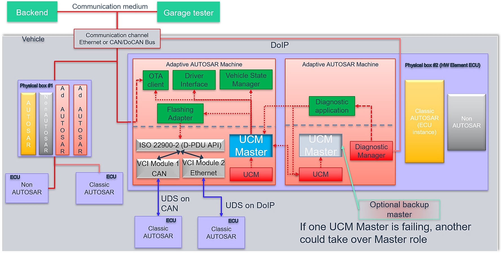

# Contents

```
1. [Introduction and functional overview](#introduction-and-functional-overview) 9
2. Acronyms and abbreviations 10
3. [Related documentation](#related-documentation) 12

   1. [Input documents & related standards and norms](#input-documents-related-standards-and-norms) 12
   2. [Related specification](#related-specification) 12
   3. [Further applicable specification](#further-applicable-specification) 13
4. [Constraints and assumptions](#constraints-and-assumptions) 14

   1. [Known Limitations](#known-limitations) 14
   2. [Applicability to car domains](#applicability-to-car-domains) 14
5. [Dependencies to other functional clusters](#dependencies-to-other-functional-clusters) 15

   1. [Interfaces to Adaptive State Management](#interfaces-to-adaptive-state-management) 15
   2. [UCM service over ara::com](#ucm-service-over-aracom) 15
   3. [Interfaces to Adaptive Crypto Interface](#interfaces-to-adaptive-crypto-interface) 15
   4. [Interfaces to Identity and Access Management](#interfaces-to-identity-and-access-management) 16
   5. [Interfaces to Adaptive TimeSynchronization Interface](#interfaces-to-adaptive-timesynchronization-interface) 16
   6. [UCM use of Persistency library](#ucm-use-of-persistency-library) 16
6. Requirements Tracing 17
7. [Functional specification](#functional-specification) 28

   1. [UCM](#ucm) 28

      1. [Software Cluster lifecycle](#software-cluster-lifecycle) 28
      2. [Technical Overview](#technical-overview) 29

         1. [Software Package Management](#software-package-management) 30
         2. [Runtime dependencies](#runtime-dependencies) 34
         3. [Update scope and State Management](#update-scope-and-state-management) 34
      3. [Transferring Software Packages](#transferring-software-packages) 35

         1. [Error handling in TransferStart](#error-handling-in-transferstart) 38
         2. [Error handling in TransferData](#error-handling-in-transferdata) 38
         3. [Error handling in TransferExit](#error-handling-in-transferexit) 40
         4. [Error handling in DeleteTransfer](#error-handling-in-deletetransfer) 42
      4. [Processing of Software Packages from a stream](#processing-of-software-packages-from-a-stream) 42
      5. [Processing Software Packages](#processing-software-packages) 43

         1. [Error handling during Processing Software Packages](#error-handling-during-processing-software-packages) 44
         2. [Error handling for Cancel](#error-handling-for-cancel) 46
         3. [Error handling for RevertProcessedSwPackages](#error-handling-for-revertprocessedswpackages-sws_ucm_00279draft-revertprocessedswpackages-error-handling-order) 47
         4. [Error handling for GetSwProcessProgress](#error-handling-for-getswprocessprogress) 47
      6. [Activation and Rollback](#activation-and-rollback) 47

         1. [Activation](#activation) 48
         2. [Rollback](#rollback) 50
         3. [Boot options](#boot-options) 51
         4. [Finishing activation](#finishing-activation) 52
      7. [Status Reporting](#status-reporting) 52
      8. [Robustness against reset](#robustness-against-reset) 57

         1. [Boot monitoring](#boot-monitoring) 57
      9. [History](#history) 58
      10. [Version Reporting](#version-reporting) 58
      11. [Securing Software Updates](#securing-software-updates) 59
      12. [Functional cluster lifecycle](#functional-cluster-lifecycle) 59

          1. [Shutdown behaviour](#shutdown-behaviour) 60
   2. [UCM Master](#ucm-master) 61

      1. [UCM Master Functional Cluster lifecycle](#ucm-master-functional-cluster-lifecycle) 61
      2. [Technical Overview](#technical-overview-1) 61
      3. [UCM Master general behaviour](#ucm-master-general-behaviour) 62
      4. [UCM identification](#ucm-identification) 63
      5. [UCM Master Software Packages transfer or streaming](#ucm-master-software-packages-transfer-or-streaming) 63
      6. [Adaptive Applications interacting with UCM Master](#adaptive-applications-interacting-with-ucm-master) 64

         1. [OTA Client](#ota-client) 65
         2. [Vehicle Driver Interface](#vehicle-driver-interface) 66
         3. [Vehicle State Manager](#vehicle-state-manager) 68
         4. [Flashing Adapter](#flashing-adapter) 69
      7. [Non Adaptive Platform update](#non-adaptive-platform-update) 70

         1. [D-PDU API implementation support](#d-pdu-api-implementation-support) 70
         2. [Not required D-PDU API concepts](#not-required-d-pdu-api-concepts) 71
         3. [Not required D-PDU API functions](#not-required-d-pdu-api-functions) 71
         4. [Classic platform update with UCM Master and diag-](#classic-platform-update-with-ucm-master-and-diagnostic-tool) [nostic tool](#classic-platform-update-with-ucm-master-and-diagnostic-tool) 73
      8. [Status reporting](#status-reporting-1) 74

         1. [States](#states) 76
         2. [States Transitions](#states-transitions) 77
      9. [Campaign cancelling](#campaign-cancelling) 79
      10. [Campaign Reporting](#campaign-reporting) 80
      11. [Content of Vehicle Package](#content-of-vehicle-package) 81
      12. [Vehicle update security and confidentiality](#vehicle-update-security-and-confidentiality) 83
8. [API specification](#api-specification) 84
9. [Service Interfaces](#service-interfaces) 85

   1. [Type definitions](#type-definitions) 85

      1. UCMIdentifierType 87
      2. TransferIdType 87
      3. SwNameType 87
      4. StrongRevisionLabelString 88
      5. SwNameVersionType 88
      6. SwNameVersionVectorType 88
      7. ByteVectorType 89
      8. SwPackageStateType 89
      9. SwPackageInfoType 89
      10. SwPackageInfoVectorType 90
      11. SwDescType 90
      12. SwDescVectorType 91
      13. SwPackageDescType 91
      14. SwPackageDescVectorType 91
      15. SwClusterStateType 92
      16. SwClusterInfoType 92
      17. SwClusterInfoVectorType 92
      18. PackageManagementStatusType 93
      19. ActionType 93
      20. ResultType 94
      21. GetHistoryType 94
      22. GetHistoryVectorType 94
      23. CampaignHistoryType 95
      24. CampaignHistoryVectorType 95
      25. CampaignResultType 95
      26. UCMMasterResolutionType 96
      27. UCMStepErrorVectorType 96
      28. UCMStepErrorType 96
      29. SoftwarePackageStepType 97
      30. HistoryVectorType 97
      31. HistoryType 98
      32. CampaignStateType 98
      33. TransferStateType 99
      34. SafetyConditionType 99
      35. SafetyConditionsVectorType 99
      36. SafetyStatesType 100
      37. SafetyStatesVectorType 100
   2. Provided Service Interfaces 100

      1. Package Management 100
      2. Vehicle Package Management 107
      3. Vehicle Driver Application Interface 115
      4. Vehicle State Manager 118
   3. Required Interface 120

      1. State Management Update Request 120
   4. Application Errors 120

      1. Application Error Domain 120

         1. UCMErrorDomain 120
10. Sequence diagrams 122

    1. Update process 122
    2. Data transmission 123
    3. Package processing 124
    4. Activation 125
    5. Failing activation 126
    6. Failing rollback 127
    7. UCM Master simplified vehicle update 128
```

# 1 Introduction and functional overview

This software specification contains the functional description and interfaces of the functional cluster Update and Configuration Management which belongs to the AUTOSAR Adaptive Platform Services. Update and Configuration Management has the responsibility of installing, updating and removing software on an AUTOSAR Adaptive Platform in a safe and secure way while not sacrificing the dynamic nature of the AUTOSAR Adaptive Platform.

The Update and Configuration Management functional cluster is responsible for:

- Version reporting of the software present in the AUTOSAR Adaptive Platform
- Receiving and buffering software updates
- Checking that enough resources are available to ensure a software update
- Performing software updates and providing log messages and progress information
- Validating the outcome of a software update
- Providing rollback functionality to restore a known functional state in case of failure

In addition to updating and changing software on the AUTOSAR Adaptive Platform, the Update and Configuration Management is also responsible for updates and changes to the AUTOSAR Adaptive Platform itself, including all functional clusters, the underlying POSIX OS and its kernel with the responsibilities defined above.

In order to allow flexibility in how Update and Configuration Management is used, it will expose its functionality via ara::com service interfaces, not direct APIs. This ensures that the user of the functional cluster Update and Configuration Management does not have to be located on the same ECU.

3. # Related documentation

   1. ## Input documents & related standards and norms

```{=html}
```

1. Glossary [AUTOSAR_TR_Glossary
2. Specification of Execution Management AUTOSAR_SWS_ExecutionManagement
3. Specification of State Management AUTOSAR_SWS_StateManagement
4. Specification of Communication Management AUTOSAR_SWS_CommunicationManagement
5. General Requirements specific to Adaptive Platform AUTOSAR_RS_General
6. Specification of Cryptography AUTOSAR_SWS_Cryptography
7. Specification of Identity and Access Management AUTOSAR_SWS_IdentityAndAccessManagement
8. Specification of Time Synchronization AUTOSAR_SWS_TimeSynchronization
9. Requirements on Update and Configuration Management AUTOSAR_RS_UpdateAndConfigurationManagement
10. Specification of Manifest AUTOSAR_TPS_ManifestSpecification
11. Explanation of Adaptive Platform Design AUTOSAR_EXP_PlatformDesign
12. Specification of Persistency AUTOSAR_SWS_Persistency
13. Specification of Platform Health Management AUTOSAR_SWS_PlatformHealthManagement

    1. ## Related specification

See chapter [3.1](#input-documents-related-standards-and-norms).

## Further applicable specification

AUTOSAR provides a general specification [[5](#_bookmark6)] which is also applicable for UCM. The specification RS General shall be considered as additional and required specification for implementation of UCM.

4. # Constraints and assumptions

   1. ## Known Limitations

UCM is not responsible to initiate the update process. UCM realizes a service interface to achieve this operation. The user of this service interface is responsible to verify that the vehicle is in a updatable state before executing a software update procedure on demand. It is also in the responsibility of the user to communicate with other AUTOSAR Adaptive Platforms or AUTOSAR Classic Platforms within the vehicle.

The UCM receives a locally available software package for processing. The software package is usually downloaded from the OEM backend. The download of the software packages has to be done by another application, i.e. UCM does not manage the connection to the OEM backend. Prior to triggering their processing, the software packages have to be transferred to UCM by using the provided ara::com interface.

The UCM update process is designed to cover updates on use case with single AUTOSAR Adaptive Platform. UCM can update Adaptive Applications, the AUTOSAR Adaptive Platform itself, including all functional clusters and the underlying OS.

The UCM is not responsible for enforcing authentication and access control to the provided interfaces. The document currently does not provide any mechanism for the confidentiality protection as well as measures against denial of service attacks. The assumption is that the platform preserves the integrity of parameters exchanged between UCM and its user.

The possibility to restart a specific application instead of a Machine reboot depends of the kind of update and application, is therefore implementation specific and is defined in the Software Package manifest.

UCM does only support updates of ARA::COM and UDS (ISO-14229) compliant ECUs. UCM is not controlling any action done by diagnostic tool directly updating a Classic platform. For instance UCM cannot protect against downgrading of a Software Cluster in a Classic platform by a diagnostic tool.

## Applicability to car domains

No restrictions to applicability.

# Dependencies to other functional clusters

The UCM functional cluster expose services to client applications via the ara::com

middleware.
**Figure 5.1: UCM dependencies to other Functional Clusters.**

## Interfaces to Adaptive State Management

UCM relies on State Management and its provided UpdateRequest Service Interface to perform the necessary Function Group state changes needed to activate the newly installed, updated or removed software.

Certain applications can conflict with the update process or the newly updated package, and they need to be stopped during the update process. This could be achieved by putting the machine to a safe Machine state, by activating a combination of suitable Function Groups and its states. It is the responsibility of the platform integrator to define this state or Function Groups. The Adaptive Application accessing the UCM, should make sure that the platform is switched to this state (using interfaces from State Management), before starting the update.

## UCM service over ara::com

The UCM shall provide a service interface over ara::com using methods and fields.

## Interfaces to Adaptive Crypto Interface

UCM uses Crypto Interface for AUTOSAR Adaptive Platform [[6](#_bookmark7)] to verify package integrity and authenticity and to decrypt confidential update data.

## Interfaces to Identity and Access Management

Identity and Access Management [[7](#_bookmark8)] controls the UCM's Clients access to UCM's service interface PackageManagement.

## Interfaces to Adaptive TimeSynchronization Interface

UCM uses TSync Interface [[8](#_bookmark9)] for AUTOSAR Adaptive Platform to get the latest timestamp.

## UCM use of Persistency library

UCM may use ara::per to store internal status information. This can e.g. be used to recover after reboot.

7. # Functional specification

   1. ## UCM

      1. ### Software Cluster lifecycle

RevertProcessedSw Packages

**Figure 7.1:** **State Machine for a Software Cluster**

The state machine in Fig. [7.1](#_bookmark29) describes the life-cycle states of a Software Cluster. These states are reported with GetSwClusterChangeInfo method.

**[SWS_UCM_00191] Software Cluster life-cycle state kAdded** [A Software Cluster state shall be kAdded after the Software Cluster is successfully processed with ProcessSwPackage method call on the AUTOSAR Adaptive Platform and if it was not previously present in the AUTOSAR Adaptive Platform and before activation is finished.*♩(RS_UCM_00011)*

**[SWS_UCM_00192] Software Cluster life-cycle state transition from kAdded to kPresent** [A Software Cluster state shall change from kAdded to kPresent after a successful activation of a newly added Software Cluster with Finish method call.*♩(RS_UCM_00011)*

**[SWS_UCM_00195] Software Cluster life-cycle state kUpdating** [A Software Cluster state shall be kUpdating after a successful processing of the updated Software Cluster with ProcessSwPackage method call and before activation is finished.*♩(RS_UCM_00011)*

**[SWS_UCM_00193] Software Cluster life-cycle state transition from kUpdating to kPresent** [A Software Cluster state shall change from kUpdating to kPresent after a successful activation of the updated Software Cluster with Finish method call, or after reverting the Software Cluster update with a RevertProcessedSwPackages method call.*♩(RS_UCM_00011)*

**[SWS_UCM_00196] Software Cluster life-cycle state kRemoved** [A Software Cluster state shall be kRemoved after successful completion of method ProcessSwPackage which involves the removal of the existed Software Cluster and before activation is finished.*♩(RS_UCM_00011)*

**[SWS_UCM_00194] Software Cluster life-cycle state transition from kRemoved to kPresent in case of RevertProcessedSwPackages call** [A Software Cluster state shall change from kRemoved to kPresent after a successful call to RevertProcessedSwPackages method in case the Software Cluster was previously requested to be removed by ProcessSwPackage method call.*♩(RS_UCM\_00011)*

**[SWS_UCM_00286] Software Cluster life-cycle state transition from kRemoved to kPresent in case of Finish call** [A Software Cluster state shall change from kRemoved to kPresent after a successful call to Finish method in case a Software Cluster being removed has to be rolled back after a failing activation.*♩(RS_UCM_00011)*

**[SWS_UCM_00197] End of Software Cluster life-cycle state from state kAdded in case of RevertProcessedSwPackages call** [A Software Cluster shall reach the end of its life-cycle from kAdded after a successful removal of a newly added Software Cluster with RevertProcessedSwPackages method call in case the Software Cluster was previously requested to be added by ProcessSwPackage method call.*♩(RS_UCM_00011)*

**[SWS_UCM_00287] End of Software Cluster life-cycle state from state kAdded in case of Finish call** [A Software Cluster shall reach the end of its life-cycle from kAdded after a successful removal of a newly added Software Cluster with Finish method call in case the newly added Software Cluster has to be rolled back after a failing activation.*♩(RS_UCM_00011)*

**[SWS_UCM_00198] End of Software Cluster life-cycle state from state kRemoved** [A Software Cluster shall reach the end of its life-cycle if it is successfully removed with a Finish method call and the Software Cluster is in state kRemoved.*♩(RS_UCM_00011)*

**[SWS_UCM_00199] Reporting of Software Cluster reaching end of life-cycle** [Any Software Cluster reaching the end of its life-cycle shall not be reported by UCM any more.*♩(RS_UCM_00011)*

### Technical Overview

One of the declared goals of AUTOSAR Adaptive Platform is the ability to flexibly update the software and its configuration through over-the-air updates. During the lifecycle of an AUTOSAR Adaptive Platform, UCM is responsible to perform software modifications on the machine and to retain consistency of the whole system.

The UCM Functional Cluster provides a service interface that exposes its functionality to retrieve AUTOSAR Adaptive Platform software information and consistently execute software updates. Since ara::com is used, the client using the UCM service interface can be located on the same AUTOSAR Adaptive Platform, but also remote clients are possible.

The service interface has been primarily designed with the goal to make it possible to use standard diagnostic services for downloading and installing software updates for the AUTOSAR Adaptive Platform. However, the methods and fields in the service interface are designed in such a way that they can be used in principle by any Adaptive Application. UCM does not impose any specific protocol on how data is transferred to the AUTOSAR Adaptive Platform and how package processing is controlled. In particular UCM does not expose diagnostic services.

As shown in Figure [7.2](#_bookmark31), whether the use case is an over-the-air update or garage update done through diagnostics, it is not visible to the UCM. The UCM Client abstracts the use case from the UCM and forwards the data stream and sequence control commands to the UCM. Later in this document, the term UCM Client is used to describe an Adaptive Application that consumes UCM PackageManagement services through UCM ara::com API. Diagnostic Application and UCM Master are two examples of such UCM Clients.

«device»
{width="0.6664162292213474in" height="0.5622615923009624in"}**Server**
**Figure 7.2:** **Architecture overview for diagnostic use case**

### Software Package Management

The UCM update sequence consists three different phases:

- Software Package transfer: A phase in which, one or several Software Packages are transferred from the UCM's Client Application to the internal buffer of the UCM. For further information see chapter [7.1.3](#transferring-software-packages).
- Software Package processing: A phase in which the UCM performs the operation (kInstall, kUpdate, kRemove) on the relevant SoftwareCluster. For further information see chapter [7.1.5](#processing-software-packages).
- Activation: A phase in which the UCM checks the dependencies of the SoftwareClusters that have been involved in the operation, then activates them and finally check that all the SoftwareClusters can be executed properly (via State Management) prior to finishing the update. For further information see chapter [7.1.6](#activation-and-rollback)

  1. ### Software Package

**[SWS_UCM_00122] Software Package utilization** [The unit for deployment that the UCM shall take as input is called Software Package, see [[1](#_bookmark3)]. Each Software Package shall address a single SoftwareCluster.*♩(RS_UCM_00026)*

A SoftwareCluster can act in two roles:

- 'Sub'-SoftwareCluster : It is a SoftwareCluster without diagnostic target address, containing processes, executables and further elements
- 'Root'-SoftwareCluster : It is a SoftwareCluster with a diagnostic target address that may reference several other 'Sub'-SoftwareClusters, which thus form a logical group.

A SoftwareCluster can be of the following categories expressed by the attribute

SoftwareCluster.category :

- APPLICATION_LAYER: the SoftwareCluster can be removed by UCM
- PLATFORM_CORE: the SoftwareCluster cannot be removed as it would break the system.
- PLATFORM: the SoftwareCluster is part of the platform software and can be removed

**[SWS_UCM_00245]**{DRAFT} **Software Cluster category** [UCM shall not remove a SoftwareCluster that has installationBehavior set to value cannotBeRemoved. In case of such an attempt, UCM shall raise ApplicationError SwclRemovalDenied.*♩(RS_UCM_00028, RS_UCM_00029)*

A Software Package has to be modelled as a so-called SoftwareCluster which describes the content of a Software Package that is downloaded or uploaded to the AUTOSAR Adaptive Platform, see [[10](#_bookmark10)].

The term Software Package is used for the \"physical\", uploadable Software Package that is processed by UCM whereas the term SoftwareCluster is used for the modeling element. In the model, the content of a SoftwareCluster is define by references to all required model elements. The SoftwareCluster and the related model elements define the content of the manifest that is part of the Software Package. The Software Package format and the update scope are described in chapter \"Content of a Software Package\" as well as in [[11](#_bookmark11)].

**[SWS_UCM_CONSTR_00012]**{DRAFT} [The SoftwareCluster aggregation of ArtifactChecksum shall not include the uri of this same SoftwareCluster manifest.*♩(RS_UCM_00012)*

The uri attribute in ArtifactChecksum is referring to the artifact contained in the

SoftwareCluster.

### Content of a Software Package

Each Software Package addresses a single SoftwareCluster and contains manifests, executables and further data (depending on the role of the SoftwareCluster) as the example sketched in Figure [7.3](#_bookmark35).

**Figure 7.3:** **Software Package content description**

A single Software Package is designed in a way that it could contain one or several executables of Adaptive Applications, kernel or firmware updates, or updated configuration and calibration data to be deployed on the AUTOSAR Adaptive Platform.

The Software Package manifest is recommended to be sent at the beginning in order for UCM to have early information of for instance memory usage or streaming.

An exemplary implementation of the adaptive workflow with Software Packages can be seen in chapter Methodology and Manifest in [[11](#_bookmark11)]. For more details on the Software Package class, you can refer to SoftwarePackage

**[SWS_UCM_00112] Software Cluster and version** [SoftwareCluster's manifest shall include a name and a version following description of StrongRevisionLabelString.*♩(RS_UCM_00002)*

**[SWS_UCM_CONSTR_00001]** [If any content (for instance an executable or persistent data) of an already installed SoftwareCluster is modified by an incoming Software Package, then the version number of the incoming SoftwareCluster indicated in the Software Package shall be higher than the version number of the already installed SoftwareCluster.*♩(RS_UCM_00002, RS_UCM_00010, RS_UCM\_00011)*

If the constraint is violated, an error will be raised according to [[SWS_UCM_00103](#_bookmark102)].

A higher version number is achieved by an increment of the MajorVersion, the MinorVersion, or the PatchVersion.

If there is a need to downgrade a failing SoftwareCluster (for instance, malfunction in the field that was not detected at activation), it will therefore be needed to repackage the same old SoftwareCluster that was properly working with an higher version number.

**[SWS_UCM_00130] Software Cluster and version error** [If SoftwareCluster's manifest does not contain any SoftwareCluster.version following description of StrongRevisionLabelString, UCM shall raise the ApplicationError InvalidPackageManifest.*♩(RS_UCM_00002)*

**[SWS_UCM_CONSTR_00014]**{DRAFT} **Software Package and Software Cluster shortNames** [SoftwarePackage and the referenced SoftwareCluster shall share the same shortName in order to be able to compare their versions.*♩(RS_UCM\_00033)*

### Applications Persisted Data

Updating and rolling back of persisted data is handled completely by the application using persistency without involvement of UCM. A detailed explanation can be found in the Persistency Specification [[12](#_bookmark12)]. An exception here is the removal of persistent data after a SoftwareCluster is removed.

**[SWS_UCM_00184] Persistent data clean-up after Software Cluster removal** [UCM shall remove persistent data of a removed SoftwareCluster by aggregating the information given in the application manifest, namely PersistencyKeyValueStorage.uri and PersistencyFileStorage.uri, in order to leave the AUTOSAR Adaptive Platform and the file system clean.*♩(RS_UCM_00026, RS_UCM_00005, RS_UCM_00004)*

**[SWS_UCM_00273]**{DRAFT} **Persistent data clean-up after Software Cluster update that removes a process** [UCM shall remove persistent data of a removed process by aggregating the information given in the execution manifest, namely PersistencyKeyValueStorage.uri and PersistencyFileStorage.uri, in order to leave the AUTOSAR Adaptive Platform and the file system clean.*♩(RS_UCM_00026, RS\_UCM_00005, RS_UCM_00004)*

Persistent data can include administrative and backup data.

### Runtime dependencies

Processes within a SoftwareCluster can have functional dependencies toward other SoftwareClusters.

Dependencies are described in the SoftwareCluster metamodel, see [[10](#_bookmark10)].

**[SWS_UCM_00120]**{DRAFT} **Runtime dependencies check** [Before the activation of the new software version triggered by Activate method call, UCM shall check runtime dependencies.*♩(RS_UCM_00007)*

The rationale is, if UCM has to process several Software Packages, then execution dependencies may not be fulfilled at all times during the Software Packages process but must be fulfilled before changes can be activated.

### Update scope and State Management

Software Package processed by UCM can contain Adaptive Applications, updates to AUTOSAR Adaptive Platform itself or to the underlying OS. Update type depends on the content of the Software Package.

**[SWS_UCM_00099] Update of Adaptive Application** [UCM shall be able to update Adaptive Applications*♩(RS_UCM_00001)*

**[SWS_UCM_00100]**{DRAFT} **Update of Functional Clusters** [UCM shall be able to update all Functional Clusters, including UCM itself.*♩(RS_UCM_00028)*

**[SWS_UCM_00101]**{DRAFT} **Update of Host** [UCM shall be able to update the underlying OS hosting the AUTOSAR Adaptive Platform.*♩(RS_UCM_00029)*

Definition of an updatable state with respect to the system setup is the OEM responsibility. Based on the system setup and the application, the system might need to be

switched into a predefined state, to free resource to speed up the update, to block normal usage of software which might cause interruptions to update process and to block using functionality which might be interrupted by the update sequence.

**[SWS_UCM_00257] Update session** [To confirm the system is in an updatable state, UCM shall start an update session by calling State Management UpdateRequest Service Interface RequestUpdateSession method after its dependency check triggered by Activate method call successfully completes.*♩(RS_UCM_00026, RS\_UCM_00003)*

**[SWS_UCM_00258] Update session rejected** [If State Management UpdateRequest Service Interface RequestUpdateSession method call raises error kRejected, UCM shall transition from kActivating to kReady states and Activate method call shall return ApplicationError UpdateSessionRejected.*♩ (RS_UCM_00026, RS_UCM_00024)*

If update session could be recurrently rejected, it is up to implementer to cache the dependency check result in order to avoid unnecessary computation and compute it only once.

During the update session, the minimum applications required for the Update process should be executed. This way system is more robust, more resources are free and user is blocked from using applications, of which failure could cause safety risk to the user.

Update of some components require a Machine reset to be performed. These components should be configured to be part of Function Group MachineFG, as the update sequence of Function Group MachineFG includes a Machine reset. Execution Management, State Management, Communication Management and UCM itself are good examples which probably require a Machine reset to activate the update. Other such components could be applications involved in the update sequence or applications involved in safety monitoring. Further details on Function Group MachineFG can be found in State Management.

### Transferring Software Packages

To speed up the overall data transmission time, the package transfer is decoupled from the processing and activation process. This section describes requirements for initiation of a data transfer, the data transmission and ending of the data transmission.

Each Software Package gets its own state as soon as it is being transferred to UCM. The state machines in Fig. [7.4](#_bookmark41) specify the lifecycle of a Software Package that is transferred to and processed by UCM. During this lifecycle, a Software Package is uniquely identified with an id that UCM provides to the client.

The UCM has the possibility to keep the Software Package in kTransferred states in case it failed and retry later: transferring Software Package can be costly, if

it is authenticated, there could be no reason to delete it if the update has not been successfully finished.

Initi al
**Figure 7.4:** State Machine representing Software Packages lifecycle**

**[SWS_UCM_00007] Data transfer at any time** [UCM shall provide support to transfer Software Packages at any time when UCM is running. Transferring is decoupled from the UCM Package Management states.*♩(RS_UCM_00013, RS_UCM_00019, RS_UCM_00025)*

**[SWS_UCM_00272]**{DRAFT} **Transfer block size** [TransferStart shall return BlockSize parameter to indicate the maximum block size (unit: bytes, as defined by maxBlockSize) to be allowed to transfer in one TransferData method call.*♩ (RS_UCM_00025)*

The block size should be aligned to flashing capability in case of Classic Platform capability for instance.

**[SWS_UCM_00088] Preparation of data transfer** [Data transfer shall be prepared with the method TransferStart. In the preparation step the number of bytes to be transferred is provided by the client and UCM assigns an id for the Software Package to be transferred.*♩(RS_UCM_00013, RS_UCM_00019, RS_UCM_00025)*

While a Software Package is being transferred, if UCM receives a subsequent TransferStart call targeting another Software Package, UCM should make sure that the sum of the size of both Software Packages (the one being transferred and the one requested to be transferred) does not exceed the size of the UCM buffer. Otherwise, the TransferStart should raise the ApplicationError InsufficientMemory and the newly requested transmission should be rejected as described above.

**[SWS_UCM_00008] Executing the data transfer** [After successful call of TransferStart method, the transmission of the Software Package block-wise shall be supported by the method TransferData.*♩(RS_UCM_00013, RS_UCM_00019, RS\_UCM_00025)*

**[SWS_UCM_00145] Sequential order of data transfer** [The method TransferData shall support the parameter blockCounter that shall start with 0x01 and be incremented by one for each subsequent block.*♩(RS_UCM_00013, RS_UCM_00019, RS_UCM_00025)*

**[SWS_UCM_00010] End of data transfer** [After transmission of a Software Package is completed, the transmission can be finished with method TransferExit.*♩ (RS_UCM_00013, RS_UCM_00019, RS_UCM_00025)*

Software Package contains authentication and integrity tags, which are used during the transfer sequence to authenticate the content of the Software Package.

[SWS_UCM_00075] Multiple data transfers in parallel** [Handling of multiple data transfers in parallel shall be supported by UCM.*♩(RS_UCM_00019)*

If UCM provide enough buffering resources for Software Packages, several packages could be transferred (in parallel) before they are processed one after the other. The processing (i.e. unpacking and actually applying changes to the AUTOSAR Adaptive Platform) of Software Packages described by the state kProcessing is further detailed in Sect. [7.1.5](#processing-software-packages).

**[SWS_UCM_00021] Deleting transferred Software Packages** [UCM shall provide a method DeleteTransfer that shall delete the targeted Software Package and free the resources reserved to store that Software Package.*♩(RS_UCM_00018)*

**[SWS_UCM_00069]**{OBSOLETE} **Report information on Software Packages** [ UCM shall provide a method GetSwPackages of the interface service PackageManagement to provide the Software Packages' identifiers, names, versions, states, consecutive bytes received and consecutive blocks received.*♩(RS_UCM_00010, RS\_UCM_00002)*

At the invocation of method GetSwPackages of the service interface PackageManagement, UCM returns the Software Packages' identifiers, names, versions, states, consecutive bytes received and consecutive blocks received.

If Software Package is in kTransferring state, it is not possible to get versions or names as manifest could not be complete or accessible, therefore method GetSwPackages should return empty values except for TransferID, ConsecutiveBytesReceived and ConsecutiveBlocksReceived at this particular state.

**[SWS_UCM_00216] Validity of TransferId** [The TransferId of a Software Package shall be invalidated for further use when it reaches final lifecycle state.*♩(RS_UCM\_00019)*

### Error handling in TransferStart

TransferStart allocates resources for the client transfer.

**[SWS_UCM_00140] UCM insufficient memory** [TransferStart method shall raise the ApplicationError InsufficientMemory if the UCM buffer has not enough resources to store the corresponding Software Package.*♩(RS_UCM_00013, RS\_UCM_00019, RS_UCM_00025)*

### Error handling in TransferData

TransferData executes the following checks. It is recommended to follow the specified order.

**[SWS_UCM_00275]**{DRAFT} **TransferData error handling order** [TransferData method shall check the following error conditions and return the respective error code.

```
1. [[SWS_UCM_00208](#_bookmark45)]
2. [[SWS_UCM_00203](#_bookmark46)]
3. [[SWS_UCM_00204](#_bookmark47)]
4. [[SWS_UCM_00243](#_bookmark48)]
5. [[SWS_UCM_00205](#_bookmark49)]
6. [[SWS_UCM_00206](#_bookmark50)]
7. [[SWS_UCM_00289](#_bookmark51)]
8. [[SWS_UCM_00207](#_bookmark52)]
9. [[SWS_UCM_00294](#_bookmark53)]
10. [[SWS_UCM_00098](#_bookmark54)]
11. [[SWS_UCM_00092](#_bookmark59)]
12. [[SWS_UCM_00245](#_bookmark33)]
13. [[SWS_UCM_00103](#_bookmark102)]
```

*♩(RS_UCM_00013, RS_UCM_00019, RS_UCM_00025)*

[SWS_UCM_00208] TransferData OperationNotPermitted** [Calling TransferData after calling TransferExit for a specific TransferId shall raise the error ApplicationError OperationNotPermitted*♩(RS_UCM_00019)*

[SWS_UCM_00203] TransferData InvalidTransferId** [TransferData shall raise the error ApplicationError InvalidTransferId in case an invalid TransferId (An ID that was not initiated by TransferStart or marked invalid by DeleteTransfer or RevertProcessedSwPackages) is sent by the client.*♩(RS_UCM_00019)*

[SWS_UCM_00204] TransferData IncorrectBlock** [TransferData shall raise ApplicationError IncorrectBlock upon receipt of a block counter value that is successfully transmitted to UCM before or upon receipt of an unexpected block counter value.*♩(RS_UCM_00014, RS_UCM_00019)*

[SWS_UCM_00243] Too big block size received by UCM** [In the case the received block size with TransferData exceeds the block size returned by TransferStart for the same TransferId, UCM shall raise the ApplicationError IncorrectBlockSize.*♩(RS_UCM_00013, RS_UCM_00014, RS_UCM_00025)*

[SWS_UCM_00205] TransferData IncorrectSize** [In case the transferred Software package size exceeds the provided size in TransferStart, TransferData shall raise ApplicationError IncorrectSize*♩(RS_UCM_00014, RS_UCM_00019)*

**[SWS_UCM_00206] TransferData InsufficientMemory** [TransferData shall raise the error ApplicationError InsufficientMemory if resources to store the Software Package ceased to exist during the transfer operation.*♩(RS_UCM_00013, RS_UCM_00019, RS_UCM_00025)*

**[SWS_UCM_00289]**{DRAFT} **TransferData TransferFailed** [TransferData shall raise the error ApplicationError TransferFailed if UCM cannot persist transferred block.*♩(RS_UCM_00013)*

**[SWS_UCM_00207]**{DRAFT} **TransferData BlockInconsistent** [If UCM checks consistency of Block for each TransferData, UCM shall raise the error ApplicationError BlockInconsistent in case Consistency check for transferred block fails.*♩ (RS_UCM_00012)*

The BlockInconsistent error is intended to be used by the Flashing Adapter. The Flashing Adapter can calculate additional consistency information for each block internally, e.g. a CRC32 checksum. It can then use UDS protocol to send block data and checksum to the target ECU. In case checksum verification fails, the Flashing Adapter can report the BlockInconsistent error to the UCM Master or diagnostic client application.

As described in section [7.1.2.1.2](#content-of-a-software-package) and [[10](#_bookmark10)], each Software Package has an authentication tag CryptoServiceCertificate which protects integrity and authenticity.

Therefore additional consistency check information is not needed. If authentication check fails, AuthenticationFailed error is intended to be used instead.

**[SWS_UCM_00294]**{DRAFT} **Unsupported package format for UCM** [In the case the Software Package archiving format is not supported, UCM TransferData method shall return ApplicationError UnsupportedPackageFormat.*♩(RS\_UCM_00025)*

**[SWS_UCM_00098]**{DRAFT} **Software Package Authentication failure** [UCM shall raise the ApplicationError AuthenticationFailed, if the Software Package authentication check fails.*♩(RS_UCM_00006, RS_UCM_00019, RS_UCM\_00025)*

This error can happen when TransferData, TransferExit and ProcessSwPackage methods are called. When AuthenticationFailed error is raised, it is up to client to decide if a DeleteTransfer will be called or not. The behaviour may vary depending on the life cycle, meaning R&D phase or on the field phase.

TransferData checks the package version format in accordance to [[SWS_UCM_00161](#_bookmark70)] (IncompatiblePackageVersion).

TransferData checks if the Software Cluster to be removed has attribute installationBehavior set to cannotBeRemoved. If this is the case, UCM shall not remove it in accordance to [[SWS_UCM_00245](#_bookmark33)].

TransferData checks if the Software Cluster version being updated is older than currently present in Machine in accordance to [[SWS_UCM_00103](#_bookmark102)] (OldVersion).

### Error handling in TransferExit

**[SWS_UCM_00276]**{DRAFT} **TransferExit error handling order** [TransferExit method shall check the following error conditions and return the respective error code.

```
1. [[SWS_UCM_00148](#_bookmark56)]
2. [[SWS_UCM_00212](#_bookmark57)]
3. [[SWS_UCM_00087](#_bookmark58)]
4. [[SWS_UCM_00294](#_bookmark53)]
5. [[SWS_UCM_00098](#_bookmark54)]
6. [[SWS_UCM_00092](#_bookmark59)]
7. [[SWS_UCM_00161](#_bookmark70)]
8. [[SWS_UCM_00213](#_bookmark60)]
9. [[SWS_UCM_00245](#_bookmark33)]
10. [[SWS_UCM_00103](#_bookmark102)]

```

*♩(RS_UCM_00013, RS_UCM_00019, RS_UCM_00025)*

**[SWS_UCM_00148] Transfer sequence order** [Calling TransferExit without calling TransferData at least once or after TransferExit is called for a specific TransferID, shall raise the ApplicationError OperationNotPermitted.*♩(RS_UCM\_00019)*

**[SWS_UCM_00212] TransferExit InvalidTransferId** [TransferExit shall raise the error ApplicationError InvalidTransferId in case an invalid TransferId is sent by the client.*♩(RS_UCM_00019)*

**[SWS_UCM_00087] Insufficient amount of data transferred** [When TransferExit method is called, UCM shall check if all blocks of the Software Package have been transferred according to the size parameter of TransferStart. If not UCM shall return ApplicationError InsufficientData.*♩(RS_UCM_00013, RS\_UCM_00019, RS_UCM_00025)*

TransferExit checks if the Software Package archiving format is supported in accordance to [[SWS_UCM_00294](#_bookmark53)] (UnsupportedPackageFormat).

TransferExit checks authentication in accordance to [[SWS_UCM_00098](#_bookmark54)] (AuthenticationFailed).

**[SWS_UCM_00092] Software Package integrity** [When TransferData or TransferExit method is called, UCM shall raise the ApplicationError PackageInconsistent if the Software Package integrity check fails. This Software Package integrity check may be realized by the UCM via a Software Package Checksum check or via other mechanisms.*♩(RS_UCM_00012, RS_UCM_00006)*

TransferExit checks the package version format in accordance to [[SWS_UCM_00161](#_bookmark70)] (IncompatiblePackageVersion).

**[SWS_UCM_00213] TransferExit InvalidPackageManifest** [TransferExit shall raise the error ApplicationError InvalidPackageManifest upon receival of an invalid manifest.*♩(RS_UCM_00012)*

TransferExit checks if the Software Cluster to be removed is from category PLATFORM_CORE. If this is the case, UCM shall not remove it in accordance to [[SWS_UCM_00245](#_bookmark33)].

TransferExit checks if the Software Cluster version being updated is older than currently present in Machine in accordance to [[SWS_UCM_00103](#_bookmark102)] (OldVersion).

### Error handling in DeleteTransfer

**[SWS_UCM_00283]**{DRAFT} **DeleteTransfer error handling order** [DeleteTransfer method shall check the following error conditions and return the respective error code.

```
1. [[SWS_UCM_00214](#_bookmark62)]
2. [[SWS_UCM_00215](#_bookmark63)]
```

*♩(RS_UCM_00013, RS_UCM_00019, RS_UCM_00025)*

DeleteTransfer checks if the supplied parameter TransferId is valid.

**[SWS_UCM_00214] DeleteTransfer InvalidTransferId** [DeleteTransfer shall raise the error ApplicationError InvalidTransferId in case an invalid TransferId is sent by the client.*♩(RS_UCM_00019)*

**[SWS_UCM_00215] DeleteTransfer OperationNotPermitted** [Calling DeleteTransfer during processing or during the processing stream shall raise the error ApplicationError OperationNotPermitted.*♩(RS_UCM_00019)*

### Processing of Software Packages from a stream

It is also possible to process a Software Package while the transfer is still ongoing. The following requirements apply for this use case.

**[SWS_UCM_00165] Processing from stream** [The UCM may support calling ProcessSwPackage directly from stream without waiting to receive the Software Package completely.*♩(RS_UCM_00001, RS_UCM_00003, RS_UCM_00004, RS\_UCM_00025)*

**[SWS_UCM_00166] Processing from stream state** [If UCM supports processing from stream and is in state kIdle or kReady, the method ProcessSwPackage for a Software Package in state kTransferring shall set this Software Package to state kProcessingStream.*♩(RS_UCM_00024, RS_UCM_00025)*

**[SWS_UCM_00167]**{DRAFT} **Cancelling streamed packages** [When Cancel is called, UCM shall remove all temporary and processed data of a Software Package in state kProcessingStream.*♩(RS_UCM_00020, RS_UCM_00025)*

**[SWS_UCM_00168] Transferring while processing from stream** [Software Package state shall remain in kProcessingStream when TransferData is called.*♩(RS_UCM_00024, RS_UCM_00025)*

**[SWS_UCM_00169] Finishing transfer while processing from stream** [Software Package state shall be set to kProcessed when TransferExit is called and the Software Package is completely processed.*♩(RS_UCM_00024, RS_UCM_00025)*

**[SWS_UCM_00200] Failing authentication** [UCM shall delete the Software Package and its related data processed by ProcessSwPackage call if authentication is failing at TransferExit or ProcessSwPackage call.*♩(RS_UCM_00039, RS_UCM\_00006)*

### Processing Software Packages

In contrast to package transmission, only one Software Package can be processed at the same time to ensure consistency of the system. In the following, a software or package processing can involve any combination of an installation, update or removal of applications, configuration data, calibration data or manifests. It is up to the vendor-specific metadata inside a Software Package to describe the tasks UCM has to perform for its processing. For a removal, this might involve metadata describing which data needs to be deleted. Nevertheless, the communication sequence between the triggering application of the software modification and UCM is the same in any case. For an update of an existing application, the Software Package can contain only partial data, e.g. just an updated version of the execution manifest. Any UCM Client need to confirm that UCM is in kIdle CurrentStatus state before starting any update (process/activate).

**[SWS_UCM_00001]**{OBSOLETE} **Starting the package processing** [UCM shall provide a method ProcessSwPackage to process transferred Software Package. id corresponding to Software Package shall be provided for this method.*♩(RS_UCM\_00001, RS_UCM_00004)*

At the invocation of method ProcessSwPackage, UCM processes transferred Software Package with id argument corresponding to this Software Package.

**[SWS_UCM_00137] Processing several update Software Packages** [UCM shall support processing of several Software Packages, not in parallel, by calling method ProcessSwPackage several times in sequence.*♩(RS_UCM_00001, RS\_UCM_00004)*

During package processing, the progress is provided.

**[SWS_UCM_00018]**{OBSOLETE} **Providing Progress Information** [UCM shall provide a method GetSwProcessProgress to query the progress of executing the ProcessSwPackage method call for provided TransferId. Parameter progress shall be set to a value representing the progress between 0% and 100% (0x00 \... 0x64).*♩(RS\_UCM_00023)*

At the invocation of method GetSwProcessProgress, UCM returns the progress of executing the ProcessSwPackage method call for provided TransferId. Parameter progress will be set to a value representing the progress between 0% and 100% (0x00 \... 0x64).

**[SWS_UCM_00003] Cancelling the package processing** [On call of Cancel

method, UCM shall abort the running package processing task, undo the changes to

the Software Cluster for which processing started and free the reserved resources used for it.*♩(RS_UCM_00020)*

**[SWS_UCM_00024] Revert all processed Software Packages** [UCM shall provide a method RevertProcessedSwPackages to revert all changes done with ProcessSwPackage.*♩(RS_UCM_00008)*

The main difference between a RevertProcessedSwPackages and a Rollback is that the former can only be performed before the successful activation of the targeted Software Package(s) while the latter can only be performed after such activation.

Depending on the capabilities of UCM and of the updated target, RevertProcessedSwPackages is used to revert all the changes that have been applied by ProcessSwPackage. Cancel is also used to revert the changes of the Software Package for which processing started by ProcessSwPackage method call and identified by TransferId. For example, if an application with large resource files is updated "in place" (i.e. in the same partition) then it might not be feasible to revert the update. In this case, to perform a rollback the triggering application could download a Software Package to restore a stable version of the application.

### Error handling during Processing Software Packages

**[SWS_UCM_00277]**{DRAFT} **ProcessSwPackage error handling order** [ProcessSwPackage method shall check the following error conditions and return the respective error code.

```
1. [[SWS_UCM_00219](#_bookmark67)]
2. [[SWS_UCM_00017](#_bookmark68)]
3. [[SWS_UCM_00218](#_bookmark69)]
4. [[SWS_UCM_00098](#_bookmark54)]
5. [[SWS_UCM_00161](#_bookmark70)]
6. [[SWS_UCM_00029](#_bookmark71)]
7. [[SWS_UCM_00285](#_bookmark72)]
8. [[SWS_UCM_00231](#_bookmark73)]
9. [[SWS_UCM_00217](#_bookmark74)]
10. [[SWS_UCM_00267](#_bookmark75)]
11. [[SWS_UCM_00104](#_bookmark76)]
12. [[SWS_UCM_00245](#_bookmark33)]
13. [[SWS_UCM_00103](#_bookmark102)]
14. [[SWS_UCM_00150](#_bookmark77)]
```

*♩(RS_UCM_00026)*

**[SWS_UCM_00219] ProcessSwPackage OperationNotPermitted** [ProcessSwPackage shall raise the error ApplicationError OperationNotPermitted in case the processing of the specified Software Package is already done.*♩(RS\_UCM_00025, RS_UCM_00026)*

**[SWS_UCM_00017] Sequential Software Package Processing** [Once method ProcessSwPackage has been called by a client, further calls to the same method shall be rejected with ApplicationError ServiceBusy as long as CurrentStatus is different than kProcessing.*♩(RS_UCM_00001, RS_UCM_00003, RS_UCM\_00026)*

When UCM Master or OTA Client calls ProcessSwPackage method and it raises ApplicationError ServiceBusy, UCM Master can retry the ProcessSwPackage method again later for the same package. This behaviour is configured by UcmRetryStrategy.

**[SWS_UCM_00297]**{DRAFT} **Retry Strategy for ServiceBusy** [When ProcessSwPackage returns ApplicationError ServiceBusy more than maximumNumberOfRetries within retryIntervalTime, then UCM Master shall cancel the active campaign by transitioning to kCancelling state and delete the failing package.*♩ (RS_UCM_00001, RS_UCM_00003, RS_UCM_00026)*

If no retry strategy is needed, the maximum number of attempts can be specified as 0 in UcmRetryStrategy.

**[SWS_UCM_00218] ProcessSwPackage InvalidTransferId** [ProcessSwPackage shall raise the error ApplicationError InvalidTransferId in case an invalid TransferId is sent by the client.*♩(RS_UCM_00026)*

ProcessSwPackage checks authentication in accordance to [[SWS_UCM_00098](#_bookmark54)] (

AuthenticationFailed)

**[SWS_UCM_00161] Check Software Package version compatibility against UCM version** [At ProcessSwPackage, TransferData or TransferExit calls, UCM shall raise ApplicationError IncompatiblePackageVersion if the version for the Software Package expressed by minimumSupportedUcmVersion attribute is higher than the current version of UCM as available in version attribute.*♩(RS_UCM_00007)*

The Software Package is generated by a tooling including a packager which version could not match with the UCM version, leading to manifest interpretation issues for instance.

**[SWS_UCM_00029] Consistency Check of Manifest** [UCM shall validate the content of the manifest against the schema defined for the meta-data(eg: for missing parameter or for value out of range of the parameter) and shall raise the ApplicationError InvalidPackageManifest if it finds discrepancies there.*♩(RS_UCM_00012)*

**[SWS_UCM_00285]**{DRAFT} **Removing or updating a Software Cluster not existing in the Machine** [If a Software Package's action is to remove or update a

Software Cluster that is not at one of the states kPresent, kRemoved, kUpdating and kAdded, UCM shall raise ApplicationError SoftwareClusterMissing when ProcessSwPackage is called.*♩(RS_UCM_00015)*

**[SWS_UCM_00231]**{DRAFT} **ProcessSwPackage IncompatibleDelta** [ProcessSwPackage shall raise the error ApplicationError IncompatibleDelta if deltaPackageApplicableVersion is different from the currently installed version of the referenced SoftwareCluster.*♩(RS_UCM_00007)*

**[SWS_UCM_00217]**{DRAFT} **ProcessSwPackage InsufficientMemory** [ProcessSwPackage method shall raise the ApplicationError InsufficientMemory if the UCM buffer has not enough resources to process the corresponding Software Package.*♩(RS_UCM_00013, RS_UCM_00025)*

**[SWS_UCM_00267]**{DRAFT} **Error when checksum is not recognised at processing time** [If checksum attribute of ArtifactChecksum or CryptoProvider are not recognised, UCM shall raise the ApplicationError InvalidChecksumDescription.*♩(RS_UCM_00012)*

**[SWS_UCM_00104] Integrity Check of processed Package** [UCM shall raise the ApplicationError ProcessedSoftwarePackageInconsistent if integrity check of the processed Software Packages fails.*♩(RS_UCM_00012)*

This operation is realized by the UCM to verify that it did not corrupt any files during the processing. This integrity check is vendor specific and may be realized by the UCM by checking the payload Checksum or by any other mechanisms.

ProcessSwPackage checks if the Software Cluster to be removed is from category PLATFORM_CORE. If this is the case, UCM shall not remove it in accordance to [[SWS_UCM_00245](#_bookmark33)].

ProcessSwPackage checks if the Software Cluster version being updated is older than currently present in Machine in accordance to [[SWS_UCM_00103](#_bookmark102)] (OldVersion).

**[SWS_UCM_00150] Cancellation of a Software Package processing** [ProcessSwPackage method shall raise the ApplicationError ProcessSwPackageCancelled if the Cancel method has been called during the processing of a Software Package.*♩(RS_UCM_00024)*

### Error handling for Cancel

**[SWS_UCM_00278]**{DRAFT} **Cancel error handling order** [Cancel method shall check the following error conditions and return the respective error code.

1. [[SWS_UCM_00234](#_bookmark79)]
2. [[SWS_UCM_00235](#_bookmark80)]

*♩(RS_UCM_00020)*

**[SWS_UCM_00234] Cancel OperationNotPermitted** [Cancel shall raise the error ApplicationError OperationNotPermitted in case the targeted Software Package processing has not yet started or has been already finished.*♩(RS_UCM\_00020)*

**[SWS_UCM_00235] Cancel InvalidTransferId** [Cancel shall raise the error ApplicationError InvalidTransferId in case an invalid TransferId is sent by the client.*♩(RS_UCM_00020)*

### Error handling for RevertProcessedSwPackages [SWS_UCM_00279] {DRAFT} RevertProcessedSwPackages error handling order

[RevertProcessedSwPackages method shall check the following error conditions

and return the respective error code.

1. [[SWS_UCM_00237](#_bookmark82)]
2. [[SWS_UCM_00236](#_bookmark83)]

*♩(RS_UCM_00020)*

**[SWS_UCM_00237] RevertProcessedSwPackages OperationNotPermitted** [RevertProcessedSwPackages method call shall raise the error ApplicationError OperationNotPermitted in case the processed Software Packages are successfully activated or it is called at other states than kReady (Software Package(s) are finished being processed) or kProcessing states.*♩(RS_UCM_00020)*

**[SWS_UCM_00236]**{DRAFT} **RevertProcessedSwPackages NotAbleToRevertPackages** [RevertProcessedSwPackages shall raise the error ApplicationError NotAbleToRevertPackages in case reverting of processed Software Packages have failed.*♩(RS_UCM_00020)*

### Error handling for GetSwProcessProgress

**[SWS_UCM_00220] GetSwProcessProgress InvalidTransferId** [GetSwProcessProgress shall raise the error ApplicationError InvalidTransferId in case an invalid TransferId is sent by the client.*♩(RS_UCM_00023)*

### Activation and Rollback

UCM should notify the activation or rollback of Software Packages to other Functional Clusters of the AUTOSAR Adaptive Platform. Vendor specific solution dictates to which modules this information is available, in which form and if this is done directly when change is done or when change is executed.

### Activation

The SoftwareCluster state kPresent does not express whether a SoftwareCluster is currently executed or not. You can refer to chapter [7.1.1](#software-cluster-lifecycle) Software Cluster Lifecycle for more details about kPresent state and sequence diagram 10.4 for more details about activation.

An activation of SoftwareClusters is triggered by an Activate method call. At beginning of activation, UCM is asking State Management for an update session. Once granted, UCM is requesting State Management to stop running processes from the outdated SoftwareClusters. When processes stopped, UCM makes available to the AUTOSAR Adaptive Platform the updated or installed SoftwareClusters, the core action step of the activation. A verification of the activated SoftwareClusters is then performed by requesting State Management changing the SoftwareClusters Function Groups modes to kVerify. For an example of activation sequence, you can refer to chapter 10.4

**[SWS_UCM_00293]**{DRAFT} **VerifyUpdate method** [At kVerifying state and before triggering to kActivated state, UCM shall call the State Management UpdateRequest Service Interface VerifyUpdate method passing the list of Function Groups defined in SoftwareCluster claimedFunctionGroup attribute of the class.*♩(RS_UCM_00024)*

**[SWS_UCM_00107] Activated state** [UCM state kActivated shall be set after the new versions of updated SoftwareClusters have been verified.*♩(RS_UCM_00008, RS_UCM_00030)*

The state management [[3](#_bookmark5)] on the level of execution is handled by the UCM's client controlling the update process.

UCM has to be able to update several SoftwareClusters for an update campaign. However, these SoftwareClusters could have dependencies not satisfied if updates are processed and activated one by one. Therefore, UCM splits the activation action from the general package processing.

**[SWS_UCM_00027]**{OBSOLETE} **Delta Package version applicability** [Applicable version of SoftwareCluster on which to apply delta shall be included into related SoftwarePackage's deltaPackageApplicableVersion attribute.*♩(RS_UCM\_00007)*

Applicable version of a SoftwareCluster on which to apply delta is included into related SoftwarePackage's deltaPackageApplicableVersion attribute

**[SWS_UCM_00025]**{OBSOLETE} **Activation of SoftwareClusters** [At the invocation of method Activate, UCM shall enable execution of any pending changes from the previously processed Software Packages.*♩(RS_UCM_00021)*

Every call to ProcessSwPackage makes necessary preparations of possible actions on the Software Cluster (ActionType [SWS_UCM_00132]) : kInstall, kRemove, kUpdate. The Activate call finalises the started actions during processing

and then UCM applies changes at activation that were still pending from processing, like for instance updating the list of processes managed by Execution Management.

After Activate, the new set of SoftwareClusters can be started. Activation covers all the processed Software Packages for all the clients.

**[SWS_UCM_00022] Activation of Software Clusters** [UCM shall activate all the Software Clusters extracted from the Software Packages when Activate is called.*♩(RS_UCM_00021)*

The activation method could lead to a full system reset. When Software Package updates underlying OS, AUTOSAR Adaptive Platform or any Adaptive Application which is configured to be part of Function Group MachineFG, the execution of updated software occurs through system reset by calling State Management UpdateRequest Service Interface ResetMachine method. Meta-data of Software Package defines the activation method.

In principle, it is possible to activate multiple versions of the same SoftwareCluster in one activation step. This could be useful for example with delta package updates but does not apply to firmware updates. The specification does not prohibit to create this kind of chained updates. The decision to use chained updates should be based on safety aspects and the applicability of the underlying update technology, if the update is for a classic or an adaptive platform, if a file system is involved or if the used platform even support it.

### Error handling for Activate

**[SWS_UCM_00281] Activate error handling order** [Activate method shall check the following error conditions and return the respective error code.

```
1. [[SWS_UCM_00241](#_bookmark87)]
2. [[SWS_UCM_00026](#_bookmark88)]
3. [[SWS_UCM_00258](#_bookmark39)]
4. [[SWS_UCM_00242](#_bookmark89)]
5. [[SWS_UCM_00280](#_bookmark90)]
```

*♩(RS_UCM_00026)*

**[SWS_UCM_00241] Activate OperationNotPermitted** [Activate shall raise the error ApplicationError OperationNotPermitted in case the UCM state is not kReady.*♩(RS_UCM_00021)*

**[SWS_UCM_00026] Dependency Check** [During the UCM state kActivating, UCM shall perform a dependency check to ensure that all the Software Clusters having dependencies are not missing any necessary Software Cluster as defined by

dependsOn and do not conflict towards each other as defined by conflictsTo, otherwise return ApplicationError MissingDependencies.*♩(RS_UCM_00007)*

If Activate method cannot establish an Update Session with State Management, it returns UpdateSessionRejected, see [[SWS_UCM_00258](#_bookmark39)].

When UCM Master or OTA Client calls Activate method and it raises ApplicationError UpdateSessionRejected, UCM Master can retry the Activate method again later to enter Update Session again. This behaviour is configured by UcmRetryStrategy.

**[SWS_UCM_00298]**{DRAFT} **Retry Strategy for UpdateSessionRejected** [When Activate returns ApplicationError UpdateSessionRejected more than maximumNumberOfRetries within retryIntervalTime, then UCM Master shall cancel the active campaign by transitioning to kCancelling state.*♩(RS_UCM_00026, RS_UCM_00024)*

If no retry strategy is needed, the maximum number of attempts can be specified as 0 in UcmRetryStrategy.

**[SWS_UCM_00242] Activate PrepareUpdateFailed** [Activate shall raise the error ApplicationError PrepareUpdateFailed in case of activation state transition failure from State Management side.*♩(RS_SM_00001)*

**[SWS_UCM_00280] Activate VerificationFailed** [Activate shall raise the error ApplicationError VerificationFailed in case of verification failure returned by State Management.*♩(RS_UCM_00021)*

### Rollback

**[SWS_UCM_00005]**{OBSOLETE} **Rollback to the software prior to Finish the update process** [UCM shall provide a method Rollback to recover from an activation that went wrong.*♩(RS_UCM_00008)*

Rollback can be called in the case of A/B partitions or UCM uses some other solution to maintain backups of updated or removed Software Packages.

**[SWS_UCM_00110] Rolling-back the software update** [At kRollingBack state, UCM shall disable the changes done by the software update by calling State Management UpdateRequest Service Interface PrepareRollback method for each Function Group of the processed Software Cluster in the update session. Then UCM shall call State Management UpdateRequest Service Interface ResetMachine method if any Software Cluster requires a machine reboot to be rolled back.*♩(RS_UCM_00008)*

If a reset of the Machine is not necessary, an implementation specific way to inform Execution Management that a Software Cluster was updated can be performed.

**[SWS_UCM_00299]**{DRAFT} **Verify rolled back Software Clusters** [After a UCM successful Rollback using call State Management UpdateRequest Service Interface PrepareRollback method and optional Machine reset or manifest reparse, UCM shall call State Management UpdateRequest Service Interface VerifyUpdate method to confirm that all Software Clusters impacted by update are still safe to be launched.*♩(RS_UCM_00008)*

**[SWS_UCM_00302]**{DRAFT} **Rollback failing is triggering production error** [When a Rollback is failing, UCM shall report UCM_FAILED_ROLLBACK production error.*♩ (RS_UCM_00008, RS_UCM_00027)*

### Error handling for Rollback

**[SWS_UCM_00282] Rollback error handling order** [Rollback method shall check the following error conditions and return the respective error code.

1\. [[SWS_UCM_00239](#_bookmark92)]

*♩(RS_UCM_00008)*

**[SWS_UCM_00239] Rollback OperationNotPermitted** [Rollback shall raise the error ApplicationError OperationNotPermitted in case UCM current state is not kActivated nor kVerifying.*♩(RS_UCM_00020)*

### Boot options

During update process the executed software is switched from original software to updated software and in case of rollback, from updated software to original version. Which version of software is executed is dependent on the UCM state and this is managed by the UCM. In case of platform and OS update the switch between software versions occurs through system reset and depending on the system design the Execution Management [[2](#_bookmark4)] might be started before UCM. In this case there can't be direct interface between UCM and Execution Management [[2](#_bookmark4)] to define which versions of software would be executed. Instead this would be controlled through persistent controls which are referred as Boot options in this document.

**[SWS_UCM_00094] Management of executable software** [UCM shall manage which version of software is available for the Execution Management [[2](#_bookmark4)] to launch.*♩(RS\_UCM_00021)*

During the kActivating state, UCM modifies the Boot options so that in the next restart for the updated software the new versions will be executed. In the kRollingBack state, UCM modifies the Boot options so that in the next restart of the updated software the original versions will be executed.

### Finishing activation

**[SWS_UCM_00020] Finishing the packages activation** [UCM shall provide a method Finish to commit all the changes and clean up all temporary data of the processed Software Packages.*♩(RS_UCM_00015)*

UCM should also remove Software Packages, logs or any older versions of changed software to save storage space. It is up to implementer to remove or not the Software Packages.

**[SWS_UCM_00259] Ending the update session** [UCM shall call State Management UpdateRequest Service Interface StopUpdateSession method when UCM is exiting the kCleaningUp state.*♩(RS_UCM_00021, RS_UCM_00018)*

**[SWS_UCM_00240] Finish OperationNotPermitted** [Finish shall raise the error ApplicationError OperationNotPermitted in case there are no activated nor rolled-back Software Packages pending finalization (i.e UCM state is not kActivated nor kRolledBack.*♩(RS_UCM_00001, RS_UCM_00026)*

For UCM to be able to free all unneeded resources while processing the Finish request, it is up to the vendor and platform specific implementation to make sure that obsolete versions of changed SoftwareClusters aren't executed anymore.

### Status Reporting

Once Software Packages are transferred to UCM, they are ready to be processed to finally apply changes to the AUTOSAR Adaptive Platform. In contrast to the transmission, the processing and activation tasks have to happen in a strict sequential order.

To give an overview of the update sequence, the global state of UCM is described in this section. The details of the processing and activation phases and the methods are specified in the [7.1.5](#processing-software-packages) and [7.1.6](#activation-and-rollback).

The global state of UCM can be queried using the field CurrentStatus. The state machine for CurrentStatus is shown in Fig. [7.5](#_bookmark96). This diagram does not include behaviour after a reset. Examples can be found of how UCM and its CurrentStatus field behave including reset management in chapter 10 Sequence Diagram.

**[SWS_UCM_00019] Status Field of Package Management** [The global state of UCM

shall be provided using the field CurrentStatus*♩(RS_UCM_00024)*


**Figure 7.5:** **State Machine for the package processing using service interface: PackageManagement**

UCM supported method calls for each value of field CurrentStatus are shown in Fig. [7.5](#_bookmark96).

**[SWS_UCM_00080] Idle state of Package Management** [kIdle shall be the default state.*♩(RS_UCM_00024)*

**[SWS_UCM_00149] Return to the Idle state from Processing state** [kIdle state shall be set when ProcessSwPackage returns with error code ProcessSwPackageCancelled and if no other Software Packages were previously processed during this processing operation.*♩(RS_UCM_00024)*

**[SWS_UCM_00151] Entering the Ready state of Package Management after a Cancel call** [If ProcessSwPackage has been cancelled, UCM shall return error code ProcessSwPackageCancelled and set state to kReady only if at least one other Software Package was previously processed during this processing operation.*♩ (RS_UCM_00024)*

**[SWS_UCM_00081] Processing state of Package Management** [kProcessing state shall be set only if ProcessSwPackage has been called. This shall only be possible, if CurrentStatus is reported as kIdle or kReady.*♩(RS_UCM_00024)*

**[SWS_UCM_00266]**{DRAFT} **OperationNotPermitted error and UCM state** [UCM shall return ApplicationError OperationNotPermitted if ProcessSwPackage is called by a client with UCM at CurrentStatus state different than kIdle, kProcessing or kReady.*♩(RS_UCM_00001, RS_UCM_00004)*

**[SWS_UCM_00083] Entering the Ready state of Package Management after a successful processing operation** [kReady state shall be set after a Software Package processing has been completed successfully.*♩(RS_UCM_00024)*

**[SWS_UCM_00265] state transition due to ProcessSwPackage error** [If ProcessSwPackage raises an ApplicationError other than ProcessSwPackageCancelled, it shall transition from kProcessing to kIdle if no other Software Packages were previously processed during this processing operation, or kReady if at least one other Software Package was previously processed before the failed processing operation, and shall perform clean-up actions.*♩(RS_UCM_00015, RS_UCM_00026)*

Clean-up actions could be similar to the cancel call by for instance deleting files, folders or artefacts of the processed Software Cluster.

**[SWS_UCM_00152] Entering the Ready state of Package Management after a missing dependency** [kReady state shall be set when Activate fails due to an ApplicationError MissingDependencies.*♩(RS_UCM_00024)*

**[SWS_UCM_00084] Entering the kActivating state of Package Management** [kActivating shall be set when Activate is called. This triggers the dependency check and returns ApplicationError MissingDependencies if this check fails.*♩(RS\_UCM_00024)*

**[SWS_UCM_00153] Action in kActivating state of Package Management** [When kActivating is set and after the State Management UpdateRequest Service Interface RequestUpdateSession method call by UCM, the UCM shall call the State Management UpdateRequest Service Interface PrepareUpdate method for the concerned Software Cluster including a list of all Function Groups belonging to that Software Cluster.*♩(RS_UCM_00024)*

**[SWS_UCM_00260]**{DRAFT} **PrepareUpdate, VerifyUpdate and PrepareRollback orders** [UCM shall compute the order of the State Management UpdateRequest Service Interface PrepareUpdate, VerifyUpdate and PrepareRollback method calls from the dependency model included in the Software Cluster manifests.*♩ (RS_UCM_00007, RS_UCM_00021, RS_UCM_00030)*

**[SWS_UCM_00261] PrepareUpdate, VerifyUpdate and PrepareRollback synchronous calls** [Calls to State Management UpdateRequest Service Interface PrepareUpdate, VerifyUpdate and PrepareRollback methods shall not be concurrent.*♩(RS_UCM_00026)*

**[SWS_UCM_00262]**{DRAFT} **Update preparation rejected** [If any call of the State Management UpdateRequest Service Interface PrepareUpdate method returns error kRejected too many times (maxNumberOfPrepareUpdateRetries) or for

too long (prepareUpdateTimeout), UCM shall transition from kActivating to

kReady states.*♩(RS_UCM_00026)*

**[SWS_UCM_00263] Update preparation failure** [If any one of the State Management UpdateRequest Service Interface PrepareUpdate method returns error kFailed, UCM shall transition from kActivating to kReady states.*♩(RS_UCM\_00026)*

**[SWS_UCM_00154] Entering the Verifying state of Package Management** [kVerifying shall be set when the dependency check have been performed successfully (all dependencies are satisfied) and that the preparation of the Software Clusters by the State Management has been successfully performed.*♩(RS_UCM_00024)*

The machine could most likely be restarted in case a A/B partition is used. In case the A/B partition is not used, all affected Function Groups or the platform could be restarted. Immediately after the processed Software Package has been restarted, a system check has to be performed in order to make sure the machine is able to start up as expected. With this check it is verified that other safety relevant software like Functional Cluster Platform Health Manager [[13](#_bookmark13)] is running and user can be protected from any issues caused by the update after the update has finished.

An update could most likely require to reparse the manifests after performing the atomic activation of the Software Clusters (switching A/B partition, changing symlinks, etc.) if a machine reset is not needed.

**[SWS_UCM_00085] Entering the kActivated state of Package Management** [kActivated state shall be set when the VerifyUpdate method of State Management service interface UpdateRequest is returned successfully.*♩(RS_UCM_00024)*

By a successful return of VerifyUpdate, UCM assumes all impacted Function Groups (the ones related to the processed Software Package) have been successfully restarted and verified.

kVerifying state gives the client controlling the update process a chance to perform verification test by calling State Management UpdateRequest Service Interface [SWS_SM_91017] VerifyUpdate method, though functionality in verify state can be limited. Client can also coordinate the results over several AUTOSAR Adaptive Platforms and still perform a Rollback if verification indicates the need for it.

If the system check is successful, the client can decide either to Rollback the current active processing so that the previous processed working software gets started, or to perform Finish so that the changes of processed software become permanent. By calling Finish a clean-up is initiated and in case of A/B partition, a swap between the partitions happens and the newly inactive partition becomes a copy of the newly active partition. In case Finish succeeds (including the clean-up), the current CurrentStatus changes to kIdle.

For Rollback the update software needs to be deactivated and possibly reactivated from original version, e.g. self-update of UCM. For this reason Rollback is also performed through two states, similarly as activation. Calling Rollback sets UCM

into kRollingBack state where original software version is made executable and where original software is activated by the State Management. This is started by calling State Management UpdateRequest Service Interface [SWS_SM_91017] PrepareRollback method for each Software Cluster. On success, UCM goes to kRollingBack state. In this state all the changes introduced during update process have been deactivated and can be cleaned by calling Finish.

**[SWS_UCM_00126] Entering the kRollingBack state after a Rollback call** [The state kRollingBack shall be set when Rollback is called.*♩(RS_UCM_00008, RS\_UCM_00030)*

**[SWS_UCM_00155] Entering the kRolling-Back state after a failure in the kVerifying state** [The state kRollingBack shall be set if any of the State Management UpdateRequest Service Interface VerifyUpdate method calls returns the result kFailed.*♩(RS_UCM_00008, RS_UCM_00030)*

**[SWS_UCM_00264]**{DRAFT} **Update verification rejected** [If any call of the State Management UpdateRequest Service Interface VerifyUpdate returns error kRejected too many times (maxNumberOfVerifyUpdateRetries) or for too long ( verifyUpdateTimeout), UCM shall transition to kRollingBack state.*♩(RS_UCM\_00030, RS_UCM_00008)*

**[SWS_UCM_00111] Entering the kRollingBack state** [The state kRollingBack shall be set after all calls to State Management UpdateRequest Service Interface PrepareRollback have returned successfully.*♩(RS_UCM_00008, RS_UCM_00030)*

**[SWS_UCM_00300]**{DRAFT} **Software Cluster failing to rollback** [If Rollback is failing, UCM CurrentStatus shall transition from kRollingBack to kRollingBackFailed.*♩(RS_UCM_00024)*

**[SWS_UCM_00301]**{DRAFT} **Retry ro Rollback again when UCM is in kRollingBackFailed state** [If Rollback method is called while being at kRollingBackFailed, UCM CurrentStatus shall transition from kRollingBackFailed to kRollingBack.*♩(RS_UCM_00024)*

**[SWS_UCM_00146] Entering the Cleaning-up state after a Finish call** [The state kCleaningUp shall be set when Finish is called and the UCM starts to perform cleanup actions.*♩(RS_UCM_00008, RS_UCM_00030)*

**[SWS_UCM_00162] Entering the Cleaning-up state after a RevertProcessedSwPackages call** [The state kCleaningUp shall be set when RevertProcessedSwPackages is called in kProcessing or kReady states and the UCM starts to perform cleanup actions.*♩(RS_UCM_00008, RS_UCM_00030)*

**[SWS_UCM_00163] Action in Cleaning-up state** [When kCleaningUp state is set, the UCM shall clean up all data of the processed packages that are not needed anymore.*♩(RS_UCM_00008, RS_UCM_00030)*

**[SWS_UCM_00164] Cleaning up of Software Packages** [In kCleaningUp state, the

UCM may remove (from the UCM buffer for instance) the \"physical\" Software Package

(e.g. zip file) that was used to transport the the SoftwareCluster to the UCM.*♩(RS\_UCM_00008, RS_UCM_00030)*

**[SWS_UCM_00127] Finishing update sequence** [kIdle shall be set when Finish is called and the clean-up has been successfully performed. This finishes the update sequence and next sequence can be started.*♩(RS_UCM_00008, RS_UCM_00030)*

**[SWS_UCM_00147] Return to the Idle state from Cleaning-up state** [kIdle state shall be set when the Clean-up operation has been completed successfully.*♩(RS\_UCM_00024)*

### Robustness against reset

Failure during over-the-air updates could lead into corrupted or inconsistent software configuration and further updates might be blocked. For this reason UCM needs to be robust against interruptions like power downs.

**[SWS_UCM_00157] Detection of reset** [At start up UCM shall identify if uncontrolled reset occurred.*♩(RS_UCM_00027)*

The way for UCM to detect uncontrolled reset is project specific. UCM could use hardware platform specific registers to detect Soft/Hard reset. Or it could access PHM Functional Cluster to detect uncontrolled reset. UCM could also check that the CurrentStatus persistent field is not kIdle or kVerifying.

**[SWS_UCM_00158] Cleanup of interrupted actions** [After an uncontrolled reset, UCM shall check non volatile memory integrity, recover processed artifacts in case it is corrupted and resume interrupted actions in order to return the system into a state from where UCM can continue serving its Clients.*♩(RS_UCM_00027)*

After an uncontrolled reset, it can be possible as an example for UCM to confirm consistency of any processed artifacts based on ArtifactChecksum class associated to SoftwareCluster. If checksum value of an artifact does not match, it can be deleted and processed again.

**[SWS_UCM_00270] UCM internal state persistency** [UCM shall persist CurrentStatus state field to be able to resume on-going update after an intended or unintended reboot.*♩(RS_UCM_00027)*

### Boot monitoring

Activation failure during OS and Platform-self updates can lead to a state in which the system is not able to reach a point where UCM and the client are able to function as expected and thus not able to execute the rollback. For these cases the system should include component which is responsible to monitor that the OS and platform will start up correctly. In case of failure, the Boot monitoring component should trigger a reset or modify the boot options to trigger a rollback.

### History

**[SWS_UCM_00115] History** [GetHistory method shall retrieve all actions that have been performed by UCM within a specific time window input parameter.*♩(RS_UCM\_00032)*

In the case the UCM Client requests a rollback after a successful activation, CurrentStatus field transitioning to kActivated, GetHistory method will later return GetHistoryType, with subelement Resolution of type ResultType equal to kActivatedAndRolledBack.

**[SWS_UCM_00292] History elements ordering** [UCM shall return from GetHistory method a vector of GetHistoryType sorted in an increasing chronological order.*♩ (RS_UCM_00032)*

**[SWS_UCM_00160] Processing results records** [When UCM is entering kVerifying, UCM shall save activation time based on timeBaseResource and activation result of processed Software Packages in the history.*♩(RS_UCM_00032)*

**[SWS_UCM_00271]**{DRAFT} **Keeping history of failure error code** [UCM shall keep in GetHistoryType subelement FailureError the last failure error code as described in [SWS_UCM_00136]. If no error occurred, the stored value shall be 0.*♩ (RS_UCM_00032)*

**[SWS_UCM_00303]**{DRAFT} **failing to record history** [If UCM is failing to record a new entry in history, UCM shall report a production error: UCM_HISTORY_RECORD\_FAILED. Any successful history update shall report a pass to this production error.*♩ (RS_UCM_00032)*

### Version Reporting

**[SWS_UCM_00004]**{OBSOLETE} **Report software information** [UCM shall provide a method GetSwClusterInfo of the interface service PackageManagement to provide the identifiers and versions of the SoftwareClusters that are in state kPresent.*♩(RS_UCM_00002)*

**[SWS_UCM_00030] Report changes** [UCM shall provide a method GetSwClusterChangeInfo of the interface service PackageManagement to provide the identifiers and versions of the SoftwareCluster that are in state kAdded, kUpdating or kRemoved.*♩(RS_UCM_00011)*

**[SWS_UCM_00185] Provide SoftwareCluster general information** [At the invocation of method GetSwClusterDescription, UCM shall return the version, type approval, license and release notes of the SoftwareCluster that are in state kPresent.*♩(RS_UCM_00002, RS_UCM_00011)*

### Securing Software Updates

UCM provides service interface using ara::com. There is no authentication of the client in UCM's update sequence.

For authentication of the Software Package, you can refer to [7.1.3](#transferring-software-packages)

**[SWS_UCM_00103]**{DRAFT} **Update to older Software Cluster version than currently present and than previously removed** [If the version of a SoftwarePackage (returned by GetSwPackages) is smaller than the version of currently present SoftwareCluster (returned by GetSwClusterInfo), the UCM method TransferExit or TransferData shall raise the ApplicationError OldVersion, log this attempt in history (retrievable from GetHistory) and delete the rejected Software Package.*♩(RS_UCM_00031)*

**[SWS_UCM_00190] Reinstallation of older Software Cluster version than previously removed** [New Software Clusters getting installed shall be compared with the history of all installed Software Clusters to prevent installation of a Software Cluster with a lower or equal version than previously installed.*♩(RS_UCM\_00003, RS_UCM_00031)*

**[SWS_UCM_CONSTR_00002]**{DRAFT} **UCM confidential information handling** [The PackageManagement interface shall only be mapped via ara::com to a secure endpoint using secure communication channel providing confidentiality protection.*♩(RS_UCM_00002, RS_UCM_00010, RS_UCM_00011)*

The GetSwClusterInfo, GetSwClusterChangeInfo, GetHistory, GetSwClusterDescription and GetSwPackages methods are using data that could identify vehicle user and therefore should be protected for confidentiality.

**[SWS_UCM_00202]**{DRAFT} **Trusted Platform compliance** [UCM shall ensure that after processing updates, all the necessary changes to comply with the Trusted Platform are applied.*♩(RS_EM_00014)*

The authentication tag of the Trusted Platform corresponding to the updated/removed/added executable files should also be updated/removed/added. See also Chapter 7.10 of the Execution Management [[2](#_bookmark4)] for details on the Trusted Platform.

### Functional cluster lifecycle

**[SWS_UCM_00274]**{DRAFT} **UCM initialization** [UCM shall offer its services only after its internal initialization has been completed, after reporting kRunning state to Execution Management.*♩(RS_UCM_00044)*

This requirement prevents calling UCM subordinate API while internal initialization is on-going. The concrete initialization tasks are implementation specific.

### Shutdown behaviour

There are no requirements of shutdown behaviour from UCM functional cluster.

1. ## UCM Master

   1. ### UCM Master Functional Cluster lifecycle

**[SWS_UCM_01205]**{DRAFT} **UCM Master internal state persistency** [UCM Master shall persist its state to be able to resume on-going update campaign after an intended or unintended reboot.*♩(RS_UCM_00035, RS_UCM_00042)*

**[SWS_UCM_01019]**{DRAFT} **UCM Master initialization** [UCM Master shall offer its services only after its internal initialization has been completed, after switching to Running state.*♩(RS_UCM_00044)*

This requirement prevents calling UCM Master API while internal initialization is ongoing. The concrete initialization tasks are implementation specific.

### Technical Overview

UCM Master objective is to provide a standard Adaptive Autosar solution to safely and securely update a complete vehicle Over The Air or by a Diagnostic Tester.

UCM Master receives packages from Backend or Diagnostic tool, parses and interprets the Vehicle Package, transfers or streams Software Packages to suitable targets (UCM subordinate or Diagnostic Application) and orchestrates the processing, activations and eventual rollbacks. All these actions are what is called a campaign which UCM Master is coordinating. The UCM of the machines in the same network of a UCM Master, candidates target of a campaign, are referred to as UCM subordinates.

{width="6.29996062992126in" height="3.1910411198600177in"}

**Figure 7.6: Example of UCM Master architecture overview within a vehicle**

The UCM Master could be considered as a set of add-on features that could enrich any UCM instance. Therefore, as per the UCM APIs, the UCM Master APIs are part of the Adaptive Platform Services. UCM and UCM Master have separate service instances.

The OTA Client establishes a communication between Backend and UCM Master so that they can exchange information of the installed Software Clusters in the vehicle and the Software Clusters available in the Backend. This communication could be triggered by OTA Client with a scheduler and UCM Master to request the updates in case of newly available Software Clusters (pull case) or by Backend to push, for instance, an important security update to a fleet of vehicles (push case). The computation to find new Software Clusters versions and resolution of dependencies between Software Clusters can be either done at UCM Master or Backend.

Vehicle Driver interface Adaptive Application is required if it is needed during an update campaign to interact with vehicle human driver through for instance HumanMachine Interface. Download of packages from a Backend could have various financial costs for the driver depending of communication types, so consent from driver could be suitable.

Vehicle State Manager Adaptive Application is required if it is needed during an update campaign to control the vehicle state for safety purposes. For instance, it could be required for safety to have standing still vehicle, shut-off engine, closed doors, etc. before starting an UCM activation or during its processing.

### UCM Master general behaviour

The UCM Master acts as a client of the service interface offered by the UCM subordinates, already specified in UCM. However, the UCM Master also offers three different service interfaces to OTA Client, Vehicle Driver interface and Vehicle State Manager respectively. UCM Master aggregates UCM subordinates states and can report its status field to a Backend through its OTA Client.

A UCM Master receives a Vehicle Package and transfers or streams Software Package(s) to the UCM subordinates for an AUTOSAR Adaptive Platform Software Cluster update. A Vehicle Package contains instructions for orchestrating updates between ECUs. The UCM Master provides information about ECUs in the vehicle, installed software and update campaign resolution.

**[SWS_UCM_01003] UCM Master checks states of UCM subordinates** [A UCM Master shall check the status of its UCM subordinates are all at kIdle CurrentStatus state before starting a campaign.*♩(RS_UCM_00043)*

UCM Master should for instance make sure that there is no ongoing diagnostic updates before starting an update campaign by checking the reported state(s) of the UCM subordinate(s) to be idle.

### UCM identification

For UCM Master to distribute Software Packages to other UCM subordinates, UCM Master has to identify UCM subordinates in vehicle. This identification could be at boot or later but at least before any communication with Backend are engaged. Each UCM has a unique identifier in Vehicle Package UcmModuleInstantiation called identifier to help UCM Master transferring packages to targeted UCMs. To get such identifier, UCM Master will perform first a service discovery through ara::com to get all UCMs service instances available. Then UCM Master will call GetId method for each UCM subordinates returning each corresponding UcmModuleInstantiation identifiers.

If an ECU hosting UCM subordinate is replaced physically, it will register its services to the registry at boot up and UCM Master will be able to communicate with UCM subordinate(s).

**[SWS_UCM_01005] UCM Master is discovering UCMs in vehicle** [UCM Master shall continuously look for UCM service instances (use of StartFindService() call).*♩ (RS_UCM_00036)*

If a UCM Master is failing, another inactive UCM Master could be used or activated by OTA Client.

Default (at boot) Master/Subordinate hierarchy or priority could be optionally overwritten for each campaign based on Vehicle Package content at the condition OTA Client could properly parse Vehicle Packages.

### UCM Master Software Packages transfer or streaming

UCM Master has generally same transfer API as UCM in order to simplify implementation and reuse code as much as possible (could be shared library between UCM and UCM Master).

It is necessary to distinguish Vehicle Package (UCM Master specific) from Software Packages transfer.

**[SWS_UCM_01011] TransferVehiclePackage InsufficientMemory** [TransferVehiclePackage method shall raise the ApplicationError InsufficientMemory if the UCM buffer has not enough resources to process the corresponding Vehicle Package.*♩(RS_UCM_00013)*

**[SWS_UCM_01018]**{DRAFT} **TransferVehiclePackage BusyWithCampaign** [ TransferVehiclePackage method shall return the ApplicationError BusyWithCampaign, if the OTA Client wants to start a new campaign, while a campaign is already started and active.*♩(RS_UCM_00035)*

**[SWS_UCM_01014] Packages transferring sequence** [TransferStart method shall raise the ApplicationError UnexpectedPackage if the Software Package name parameter was not a value of the RequestedPackage field.*♩(RS_UCM\_00043)*

**[SWS_UCM_01013] Too big block size received by UCM Master** [In the case the received block size with TransferData exceeds the block size returned by TransferStart or TransferVehiclePackage for the same TransferId, UCM Master shall raise the ApplicationError IncorrectBlockSize.*♩(RS_UCM_00035)*

**[SWS_UCM_01015] Invalid Vehicle Package manifest** [TransferExit shall raise the ApplicationError InvalidPackageManifest when a Vehicle Package manifest is not compliant with the AUTOSAR schema.*♩(RS_UCM_00036, RS_UCM\_00043)*

**[SWS_UCM_01016] Invalid Package Manifest** [UCM Master shall raise the ApplicationError InvalidPackageManifest in case a manifest file is not compliant with the AUTOSAR schema.*♩(RS_UCM_00036, RS_UCM_00043)*

**[SWS_UCM_01017] RequestedPackage field** [The field RequestedPackage shall contain the requested Software Package name and version as configured in campaign which is modelled by VehiclePackage.*♩(RS_UCM_00042)*

OTA Client does not know what Software Packages should be transferred in a given campaign contained in a Vehicle Package. OTA Client can know what Software Package is expected to be transferred by subscribing to UCM Master's RequestedPackage field. Version is added to support campaigns which need an update path for a Software Package requiring an intermediate update to a transitional version. In this case the version parameter makes it unambiguous which package version shall be transferred as both have the same name assigned.

When UCM Master or OTA Client calls TransferData method and it raises ApplicationError BlockInconsistent, UCM Master or OTA Client can retry the TransferData method again later for the same block. This behaviour is configured by UcmRetryStrategy.

**[SWS_UCM_01020]**{DRAFT} **Retry Strategy for BlockInconsistent** [When TransferData returns ApplicationError BlockInconsistent more than maximumNumberOfRetries within retryIntervalTime, then UCM Master shall cancel the active campaign by transitioning to kCancelling state and delete the failing package.*♩(RS_UCM_00012)*

If no retry strategy is needed, the maximum number of attempts can be specified as 0 in UcmRetryStrategy.

### Adaptive Applications interacting with UCM Master

In order to have interoperability between several vendors platforms, Adaptive Applications interacting with UCM Master via ara::com like OTA Client, Vehicle

State Manager or Vehicle Driver Interface have their APIs specified. However, their detailed behaviours are out of scope for this specification document.

### OTA Client

OTA Client is an Adaptive Application that sets communication channel between Backend and UCM Master. The communication between Backend and OTA Client is abstracted and details like protocol are out of scope for this specification document. OTA Client should make sure Backend is providing the right information and packages to the vehicle by identifying the vehicle, by for instance sending VIN to Backend.

OTA Client uses the UCM Master as a service provider via ara::com. Since transferring Vehicle Packages and Software Packages from Backend to UCM Master is OTA Client's responsibility, OTA Client should be able to accommodate any proprietary communication protocol used between OTA Client and Backend and convert it into ara::com transport protocol. OTA Client should support UCM Master Software Packages transfer or streaming as specified in chapter [7.2.5](#ucm-master-software-packages-transfer-or-streaming), it should then provide at least the following functionality:

- Comply to the requirements of chapter [7.1.3](#transferring-software-packages) in the context of package transfer between OTA Client and UCM Master.
- OTA Client should subscribe to UCM Master's RequestedPackage field to know what Software Package is expected to be transferred
- OTA Client should subscribe to UCM Master's TransferState field to know what is campaign state
- OTA Client should subscribe to UCM Master's SafetyState field to eventually make sure vehicle is in a safe state before transferring Packages
- OTA Client could support multiple data transfers in parallel, as specified in [[SWS_UCM_00075](#_bookmark42)]

In addition, OTA Client could support the ability to pause or resume the package transfer for the current campaign to prioritize the transfer of the packages from a different campaign. The ability of OTA Client to pause or resume the package transfer might be helpful in the case there is a need to cancel an ongoing campaign at kTransferring state to allow higher priority campaign to be performed.

Only one UCM Master has to be used by OTA Clients per network domain. As UCM Master is distributing Software Packages and coordinating UCM subordinates, OTA Clients in the same network domain have to make sure there are no already on-going campaigns when starting a new campaign with TransferVehiclePackage method call by checking UCM Master's state with TransferState field, in order to avoid any interference and guarantee success of an update campaign.

**[SWS_UCM_01101] Provide information of installed Software Clusters in vehicle** [UCM Master shall provide a method GetSwClusterInfo to return information of all Software Cluster that are in state kPresent.*♩(RS_UCM_00033)*

UCM Master can aggregate Software Cluster information from several UCMs within a vehicle and returns the result to a Backend which can compute if there is any new Software Cluster available and decide to send to UCM Master through OTA Client a Vehicle Package. It is up to OTA Client to make sure the synchronisation of the versions of Software Packages present in Backend and Software Clusters in the vehicles using GetSwClusterInfo or SwPackageInventory is recent enough before starting a campaign with TransferVehiclePackage call.

**[SWS_UCM_01103] Inform Backend of needed Software Packages for an update** [On SwPackageInventory call, UCM Master shall compare the supplied list of available Software Packages in the Backend for the vehicle to its own internal information of present Software Clusters in the vehicle and return the list of Software Packages selected for update.*♩(RS_UCM_00033)*

The OTA Client uses this returned Software Packages list to request the selected packages to the Backend. As required by constraint [[SWS_UCM_CONSTR_00014](#_bookmark36)], each Software Cluster corresponds to one Software Package and share the same shortName.

**[SWS_UCM_CONSTR_00016]**{DRAFT} **OTA Client use of RequestedPackage field** [When UCM Master updates the RequestedPackage field, the OTA Client shall start the transfer of the requested Software Package.*♩(RS_UCM_00042)*

**[SWS_UCM_01119]**{OBSOLETE} **Report information of Software Packages** [ UCM Master shall provide a method GetSwPackages to return the identifiers, names, versions, Consecutive Bytes Received, Consecutive Blocks Received and states of Software Packages.*♩(RS_UCM_00035)*

At the invocation of method GetSwPackages, UCM Master returns the identifiers, names, versions, Consecutive Bytes Received, Consecutive Blocks Received and states of Software Packages.

### Vehicle Driver Interface

Vehicle driver interface could be required by legal constrains or communication cost consideration. To support mandatory safety and security critical updates, driver interaction can be used for:

- Requesting transfer, processing or activation permission from vehicle driver
- Notifying vehicle driver of safety and security measures he has to apply to the vehicle in order to proceed to next step into the update campaign

**[SWS_UCM_01105]**{OBSOLETE} **Interaction of UCM Master with Vehicle Driver** [ UCM Master shall provide a method DriverApproval in order to receive the confirmation of the vehicle driver's approval.*♩(RS_UCM_00038)*

**[SWS_UCM_CONSTR_00017]**{DRAFT} **Interaction of UCM Master with Vehicle Driver** [When vehicle driver accepts or denies the campaign, Vehicle Driver Application shall call DriverApproval method of VehicleDriverApplicationInterface to inform UCM Master of the vehicle driver's decision.*♩(RS_UCM_00038)*

The Vehicle Driver Interface Adaptive Application could adapt its notification content related to safety by subscribing to the UCM Master's SafetyConditions field.

**[SWS_UCM_01117]**{DRAFT} **UCM Master SafetyState field** [UCM Master shall provide to vehicle driver interface the SafetyConditions field containing the required safety condition for the campaign as configured in safetyCondition.*♩(RS\_UCM_00038, RS_UCM_00037)*

UCM Master can notify vehicle driver with SafetyState field if the vehicle safety is breached during the update, by for instance popping-up a message.

**[SWS_UCM_01118] UCM Master waiting for vehicle driver approval** [In the case approval from driver is requested as configured in VehiclePackage, UCM Master shall wait for DriverApproval method with parameter Approval=True before transitioning state from kVehiclePackageTransferring to kSoftwarePackage\_Transferring, kSoftwarePackage_Transferring to kProcessing or kProcessing to kActivating.*♩(RS_UCM_00038)*

**[SWS_UCM_CONSTR_00003] Exclusive use of Vehicle Driver Interface** [Software Integrator shall ensure that only one Adaptive Application is using the UCM Master's Vehicle Driver Interface.*♩(RS_UCM_00035, RS_UCM_00037)*

For example, the integrator may restrict the access of Vehicle Driver Interface from UCM Master by configuring the Identity and Access Management functional cluster accordingly.

**[SWS_UCM_CONSTR_00004] Unsupported safety by Vehicle driver interface** [In the case the Vehicle Driver Interface Adaptive Application does not support at least one safety condition contained in the SafetyConditions field, the Vehicle Driver Interface Adaptive Application shall call the method ReportUnsupportedSafetyConditions with parameter UnsupportedSafetyConditions containing all the safety conditions which are not supported by Vehicle Driver Interface Adaptive Application.*♩(RS_UCM_00037)*

**[SWS_UCM_01120] Provide Software Packages general information** [UCM Master shall provide a method GetSwPackageDescription to return the description of each Software Packages that are part of current campaign and that are contained in Vehicle Package.*♩(RS_UCM_00033, RS_UCM_00038)*

**[SWS_UCM_01135] Get Software Clusters descriptions from a vehicle** [At GetSwClusterDescription method call via VehicleDriverApplicationInterface interface, UCM Master shall return the descriptions of all Software Clusters which are aggregated from all the UCM Subordinates and all Flashing Adapters.*♩ (RS_UCM_00033, RS_UCM_00038)*

### Vehicle State Manager

Vehicle State Manager is collecting states from the several vehicle ECUs and informs UCM Master when the safety state computed based on the safety policy referred in the Vehicle Package is changing. If the safety policy is not met, the UCM Master can for instance decide to:

- Inform vehicle driver that the safety conditions are not met to continue the update
- postpone, pause or cancel the update until policy is met

**[SWS_UCM_01109]**{DRAFT} **UCM Master provides a safety interface** [UCM Master shall set the SafetyConditions field taking the value from safetyCondition attribute for each VehicleRolloutStep of the VehiclePackage.*♩(RS\_UCM_00037)*

Vehicle State Manager Adaptive Application can inform any vehicle state changes by calling PublishSafetyState method.

**[SWS_UCM_CONSTR_00005]**{DRAFT} **Safety state change** [Vehicle State Manager Adaptive Application shall call PublishSafetyState method provided by UCM Master when the safety state is changing.*♩(RS_UCM_00035, RS_UCM_00037)*

**[SWS_UCM_CONSTR_00009]**{DRAFT} **Safety condition change** [Vehicle State Manager Adaptive Application shall call PublishSafetyState method provided by UCM Master when the field SafetyConditions is changing value.*♩(RS_UCM\_00035, RS_UCM_00037)*

**[SWS_UCM_CONSTR_00015]**{DRAFT} **Trigger on kVehicleChecking state** [On transition to kVehicleChecking state provided by CampaignState from VehicleStateManagerInterface, Vehicle State Manager shall first perform checks to assess the post-activation state of the vehicle.*♩(RS_UCM_00035)*

Vehicle State Manager could be responsible for performing post-activation checks, interfacing with an application performing such checks, confirming backend is still reachable and further updates are still possible.

**[SWS_UCM_01272]**{DRAFT} **VehicleCheck call not permitted** [UCM Master shall return ApplicationError OperationNotPermitted if VehicleCheck method is called in another UCM Master state than kVehicleChecking.*♩(RS_UCM_00035)*

**[SWS_UCM_CONSTR_00006]**{DRAFT} **Exclusive use of Vehicle State Manager** [System Integrator shall ensure that Vehicle State Manager is the exclusive user of the PublishSafetyState method.*♩(RS_UCM_00035, RS_UCM_00037)*

For example, the integrator may restrict the access to Vehicle State Manager in configuring the Identity and Access Management functional cluster accordingly.

**[SWS_UCM_01275]**{DRAFT} **Safety conditions during activation** [UCM Master shall apply the safetyCondition of the last VehicleRolloutStep to SafetyConditions field during the ECUs activations as configured in the VehiclePackage*♩(RS_UCM_00043, RS_UCM_00037)*

**[SWS_UCM_CONSTR_00007]**{DRAFT} **Unsupported safety conditions by Vehicle State Manager** [In the case the requested SafetyConditions field is not referring to an existing safety condition implemented by Vehicle State Manager, the Vehicle State Manager shall call VehicleStateManagerInterface service interface PublishSafetyState method with parameter SafetyStates containing at least one value equal to 'NotSupported'.*♩(RS_UCM_00037)*

**[SWS_UCM_CONSTR_00008]**{DRAFT} **Switching vehicle into update mode** [Vehicle State Manager shall change vehicle's state and its ECUs in the right update mode in order to avoid any timeout issues during update.*♩(RS_UCM_00037)*

This vehicle state change could be triggered based on UCM Master State Machine.

### Flashing Adapter

Flashing Adapter is an application that is used in the case UCM Master is updating a AUTOSAR Classic Platform or any platform that can be flashed using diagnostic. It contains OEM specific diagnostic sequences and communicates via ara::com with the UCM Master and the AUTOSAR Adaptive Platform, and uses an implementation of diagnostic protocol data unit application programming interface (D-PDU API) to communicate with Classic ECUs over the Vehicle Bus.

The data transfer from Flashing Adapter to the target ECU via diagnostic communication can be subject to interruptions if communication on a higher priority protocol occurs, e.g. OBD services. In that case the Flashing Adapter can use a project specific strategy to detect the interruption, retry the transfer from the beginning, and decide whether to notify or not the client about the transfer interruption.

**[SWS_UCM_CONSTR_00011]**{DRAFT} **Flashing Adapter provided interface** [Flashing Adapter shall provide the same ara::com service interface as UCM ([SWS_UCM_00131]).*♩(RS_UCM_00035)*

### Non Adaptive Platform update

**[SWS_UCM_01121]**{DRAFT} **Adaptive Platform interface provided for Flashing Adapter** [The interface provided by the AUTOSAR Adaptive Platform in order to update non AUTOSAR Platform should comply with ISO 22900-2:2017 (D-PDU API) but as this standard's coverage is wide, it is allowed to implement a reduced API that is needed to update for instance a AUTOSAR Classic Platform.*♩(RS_UCM_00035)*

The implementation of the D-PDU API is processing binary data from the Flashing Adapter and do all of the required session, transport and network layer handling to send and receive the data on the physical vehicle bus with respect to the underlying protocols. The reason of using ISO 22900-2:2017 is to ensure that the specific Flashing Adapter from any vehicle or tool manufacturer can operate on a common software interface and can easily exchange MVCI (Modular Vehicle Communication Interface) protocol module implementations.

In the case the targeted ECU by an update does not have the capability to switch between current and new Software Cluster, the vehicle package campaign should foresee to download not only the new version but also the currently installed version of the Software Cluster to be updated in order to make possible a rollback from the new version to the old version of the Software Cluster. The location to store the current Software Package could be the Flashing Adapter but ultimately it has to be available to Flashing Adapter in order to flash it in case of a rollback.

### D-PDU API implementation support

**[SWS_UCM_01122]**{DRAFT} **Supported physical layers by D-PDU API implementation** [ISO_11898_2\_DWCAN (Dual Wire CAN), ISO_11898_3\_DWFTCAN (Dual Wire CAN Fault tolerant), SAE_J2411_SWCAN (Single Wire CAN) and IEEE_802_3(Ethernet) physical layers shall be supported if their respective physical vehicle bus is available inside the ECU, all other physical layers present in D-PDU API are optional.*♩(RS_UCM_00035)*

**[SWS_UCM_01123]**{DRAFT} **Supported application layers by D-PDU API implementation** [ISO_15765_3 (Unified diagnostic services, UDS on CAN, ISO withdrawn UDS), ISO_14229_3 (Unified diagnostic services on CAN implementation, UDSonCAN) and ISO_14229_5 (Unified diagnostic services on Internet Protocol implementation, UDSonIP) application layers shall be supported if their respective application layer is available inside the ECU, all other application layers present in D-PDU API are optional.*♩(RS_UCM_00035)*

**[SWS_UCM_01124]**{DRAFT} **Supported protocols by D-PDU API implementation** [ISO UDS on CAN with Application layer ISO_15765_3, ISO UDS on CAN with Application layer ISO_14229_3 (UDSonCAN) and ISO UDS on DoIP with Application layer ISO_14229_5 (UDSonIP) protocols shall be supported, all other protocols are optional.*♩(RS_UCM_00035)*

These protocols are present in 'Table B.2 Standard protocol combination list' of ISO 22900-2:2017(E).

### Not required D-PDU API concepts

Dynamic Link Libraries for Windows operating system are not required. The Windows installation process out of ISO 22900-2:2017(E) chapter 8.7.2 is not applicable to the AUTOSAR Adaptive Platform which is using POSIX Operating System.

**[SWS_UCM_01125]**{DRAFT} **Separation of D-PDU API-Software with the MVCI protocol module firmware** [A D-PDU API implementation may be split at OSI-Layer 4 into a D-PDU API implementation on OSI-Layer 5 (usually in the PC itself) and the VCI-Module on OSI-Layers 3 and 4 (usually the VCI itself).*♩(RS_UCM_00035)*

**[SWS_UCM_01126]**{DRAFT} **Root description file (RDF)** [Within an AUTOSAR Adaptive Platform, only one D-PDU API implementation is required for UCM, therefore the D-PDU API implementation may not use the D-PDU API root description file (RDF).*♩(RS_UCM_00035)*

The only instance of the D-PDU API within a Software Cluster can be statically linked with the Flashing Adapter.

**[SWS_UCM_01127]**{DRAFT} **Module Description File (MDF)** [The D-PDU API implementation should not implement a protocol description file.*♩(RS_UCM_00035)*

The supported protocol module types are fixed in the UCM use case.

**[SWS_UCM_01128]**{DRAFT} **Symbolic names and IDs** [The Flashing Adapter may operate the D-PDU API without using symbolic names and IDs during runtime. If the use case excludes frequent changes to the MDFs, simple Flashing Adapter may even hardcode (e.g. in a header file) all necessary IDs and operate the D-PDU API without symbolic names.*♩(RS_UCM_00035)*

**[SWS_UCM_01129]**{DRAFT} **SAE J2534-1 and RP 1210a compatibility** [D-PDU API implementation may not be compatible to SAE J2534-1 and RP 1210a.*♩(RS\_UCM_00035)*

The Adaptive Platform does not need any migration path.

**[SWS_UCM_01130]**{DRAFT} **ComPrimitives in RawMode** [D-PDU API implementation may not implement the IOCTL filter data structure.*♩(RS_UCM_00035)*

### Not required D-PDU API functions

PDULockResource() and PDUUnlockResource() are used to lock and unlock exclusive access to a ComLogicalLink in case of parallel usage of the D-PDU API implementation by multiple applications on the same physical communication link. Flashing of

a Classic ECU always requires some exclusive access and should be handled in the

AUTOSAR Adaptive Platform itself.

**[SWS_UCM_01131]**{DRAFT} **PDUIoCtl(PDU_IOCTL_RESET)** [The parameter PDU_IOCTL_RESET may not be implemented in D-PDU API implementation so the call of PDUIoCtl(PDU_IOCTL_RESET) shall return the error code PDU_ERR_ID_NOT_SUPPORTED.*♩(RS_UCM_00035)*

### [SWS_UCM_01132] {DRAFT} PDUIoCtl(PDU_IOCTL_START_MSG_FILTER), PDUIoCtl(PDU_IOCTL_CLEAR_MSG_FILTER), PDUIoCtl(

**PDU_IOCTL_STOP_MSG_FILTER)** [The call of PDUIoCtl() with the pa-

rameters PDU_IOCTL_START_MSG, PDU_IOCTL_CLEAR_MSG_FILTER

and PDU_IOCTL_CLEAR_MSG_FILTER shall return the error code PDU_ERR_ID_NOT_SUPPORTED.*♩(RS_UCM_00035)*

The parameters PDU_IOCTL_START_MSG, PDU_IOCTL_CLEAR_MSG_FILTER and PDU_IOCTL_CLEAR_MSG_FILTER are intended for the PassThru-Mode for comprimitives and therefore an implementation is not required for the Flashing Adapter.

### [SWS_UCM_01133] {DRAFT} PDUIoCtl(PDU_IOCTL_SEND_BREAK)

[The IOCTL command PDU_IOCTL_SEND_BREAK shall return PDU_ERR_ID_NOT_SUPPORTED.*♩(RS_UCM_00035)*

The IOCTL command PDU_IOCTL_SEND_BREAK is used to send a break signal on the ComLogicalLink. A break signal can only be sent on certain physical layers (e.g. SAE J1850 VPW physical links and UART physical links) which are not supported by UCM.

**[SWS_UCM_01134]**{DRAFT} **Not used D-PDU API function return codes** [The return codes PDU_ERR_CABLE_UNKNOWN, PDU_ERR_RSC_LOCKED, PDU_ERR_RSC_NOT_LOCKED, PDU_ERR_API_SW_OUT_OF_DATE and

PDU_ERR_MODULE_FW_OUT_OF_DATE may not be implemented into the

D-PDU API of the AUTOSAR Adaptive Platform.*♩(RS_UCM_00035)*

There is no cable attached to the ECU and therefore no cable detection return code PDU_ERR_CABLE_UNKNOWN could occur.

Locking is not required for the Flashing Adapter, therefore PDU_ERR_RSC_LOCKED and PDU_ERR_RSC_NOT_LOCKED return code could not occur.

There is no separation of D-PDU API-Software with the MVCI protocol module firmware required in the AUTOSAR Adaptive Platform, so PDU_ERR_API_SW_OUT_OF_DATE and PDU_ERR_MODULE_FW_OUT_OF_DATE return codes could not occur.

### Classic platform update with UCM Master and diagnostic tool


**Figure 7.7: Classic platform update with UCM Master and diagnostic tool**

The Diagnostic Manager connects the Diagnostic tool to the Adaptive Platform. The diagnostic application is acting like an OTA Client and uses the UCM Master services to push Vehicle Packages and Software Packages.

### Status reporting

UCM Master supports a mechanism to provide the state of an update campaign typically to OTA Client, Vehicle Driver Application and Vehicle State Manager.


**Figure 7.8:** **Campaign State Machine (CampaignState field)**
**Figure 7.9:** **Campaign State Machine for OTA Client (TransferState field)**

Diagrams [7.8](#_bookmark123) and [7.9](#_bookmark124) do not include behaviour after reset ([[SWS_UCM_01205](#_bookmark107)] for more details)

**[SWS_UCM_01201] Sequential orchestration of campaigns** [UCM Master shall orchestrate at most a single campaign at any one time.*♩(RS_UCM_00043)*

**[SWS_UCM_01265] TransferState field** [UCM Master shall provide the state of a campaign over the TransferState field of the UCM Master's VehiclePackageManagement service interface.*♩(RS_UCM_00042)*

**[SWS_UCM_01203] CampaignState field** [UCM Master shall provide the state of a campaign over the CampaignState field of the UCM Master VehicleDriverApplicationInterface and VehicleStateManagerInterface.*♩(RS_UCM\_00042)* There is an overview of the campaign state machine in Fig. [7.8](#_bookmark123) detailing UCM Master campaign states and transitions.

### States

**[SWS_UCM_01204] Initial state** [UCM Master shall have kIdle default state.*♩(RS\_UCM_00035)*

**[SWS_UCM_01207] Trigger on kSoftwarePackage_Transferring state** [On transition to kSoftwarePackage_Transferring state and if all UCM subordinates part of the campaign are in kIdle state, UCM Master shall start or resume transferring (TransferStart and TransferData as well as TransferExit if no streaming required) the software packages to the UCM subordinates according to the campaign orchestration.*♩(RS_UCM_00035, RS_UCM_00043)*

**[SWS_UCM_01209] Trigger on kProcessing state** [On transition to kProcessing state, UCM Master shall call ProcessSwPackage method to UCM subordinates to start or resume processing the software packages ready for processing according to the campaign orchestration.*♩(RS_UCM_00035, RS_UCM_00043)*

**[SWS_UCM_00210] Transferring of software packages on kProcessing state** [If UCM Master is in kProcessing state, UCM Master shall transfer Software Packages to the UCM subordinates according to the campaign orchestration.*♩(RS\_UCM_00035, RS_UCM_00043)*

**[SWS_UCM_01212] Trigger on kActivating state** [On transition to kActivating state, UCM Master shall ask UCM subordinates to activate the software with Activate method call according to the campaign orchestration as configured in the VehiclePackage.*♩(RS_UCM_00035, RS_UCM_00043)*

**[SWS_UCM_01214]**{DRAFT} **Final action on kVehicleChecking state** [If UCM Master is in kVehicleChecking state and receives the method VehicleCheck call with parameter VehicleCheckResolution=True, UCM Master shall secondly commit (Finish) the software on all UCM subordinates part of the campaign.*♩(RS\_UCM_00035)*

**[SWS_UCM_01215]**{DRAFT} **Trigger on kCancelling state** [On transition to kCancelling state, UCM Master shall rollback (Rollback) the activated or being verified Software Clusters, and revert the processed packages (RevertProcessedSwPackages) of the UCM subordinates part of the campaign.*♩(RS_UCM_00035)*

**[SWS_UCM_01216] Final action on kCancelling state** [If UCM Master is in kCancelling state and the rollback of software on all UCM subordinates is successful (successful Rollback and transition from kRollingBack to kRolledBack), UCM Master shall secondly commit (Finish) the software on all UCM subordinates part of the campaign.*♩(RS_UCM_00035)*

**[SWS_UCM_01217] Monitoring of UCM subordinates** [UCM Master shall subscribe to the CurrentStatus field, in order to follow the current campaign from the state of the UCM Subordinates.*♩(RS_UCM_00035)*

### States Transitions

**[SWS_UCM_01218] Transition from kIdle state to kSyncing state** [If UCM Master is in kIdle state for CampaignState field and kIdle state for TransferState field, UCM Master shall enter the kSyncing state for CampaignState and kSyncing for TransferState on a request to GetSwClusterInfo or SwPackageInventory.*♩(RS_UCM_00035, RS_UCM_00033)*

**[SWS_UCM_01219] Transition from kSyncing state to kIdle state** [If UCM Master is in kSyncing state for CampaignState field and kSyncing state for TransferState field, UCM Master shall enter the kIdle state and kIdle for TransferState on completion of GetSwClusterInfo or SwPackageInventory.*♩(RS\_UCM_00035)*

**[SWS_UCM_01220] Transition from kIdle state to kVehiclePackageTransferring and kTransferring states** [If UCM Master is in kIdle state for CampaignState field and kIdle state for TransferState field, UCM Master shall enter the kVehiclePackageTransferring state and kTransferring state on successful completion of TransferVehiclePackage.*♩(RS_UCM_00035)*

**[SWS_UCM_01221] Transition from kVehiclePackageTransferring state and kTransferring state to kCancelling state** [If UCM Master is in kVehiclePackageTransferring state for CampaignState field and kTransferring state for TransferState field, UCM Master shall enter the kCancelling state for CampaignState and kCancelling state for TransferState on unsuccessful completion of TransferExit (Vehicle Package) or successful completion of DeleteTransfer (Vehicle Package) or non recoverable error of TransferData.*♩(RS_UCM_00035, RS_UCM_00039)*

**[SWS_UCM_01222] Transition from kVehiclePackageTransferring state to kSoftwarePackage_Transferring state** [If UCM Master is in kVehiclePackageTransferring state, UCM Master shall enter the kSoftwarePackage\_Transferring state on successful completion of TransferExit (Vehicle Package).*♩(RS_UCM_00035, RS_UCM_00037, RS_UCM_00038)*

**[SWS_UCM_01227] Transition from kSoftwarePackage_Transferring state and kTransferring state to kCancelling state** [If UCM Master is in kSoftwarePackage_Transferring state for CampaignState and kTransferring state for TransferState, UCM Master shall enter the kCancelling state for CampaignState and kCancelling state for TransferState on successful cancellation request (CancelCampaign) or if there is a non recoverable transfer failure from one of the UCM subordinates.*♩(RS_UCM_00035)*

**[SWS_UCM_01228] Transition from kSoftwarePackage_Transferring state and kTransferring state to kProcessing state and kUpdating state** [When UCM Master is in kSoftwarePackage_Transferring state for CampaignState and kTransferring state for TransferState, if all Software Packages are ready for processing, all Software Packages from all UCM subordinates are at state kTransferred or at least one Software Package started being processed by

ProcessSwPackage call to one UCM subordinate according to the campaign orchestration, UCM Master shall enter the kProcessing state for CampaignState and kUpdating state for TransferState.*♩(RS_UCM_00035, RS_UCM_00037, RS\_UCM_00038, RS_UCM_00043)*

**[SWS_UCM_01229]**{DRAFT} **SafetyConditions while processing stream** [In the case there is transition from kSoftwarePackage_Transferring state to kProcessing state, the SafetyConditions for kProcessing state shall apply even though there are Software Packages transferring.*♩(RS_UCM_00035, RS_UCM_00037)*

It is integrator's responsibility to make sure in this use case that safety conditions for Processing will also cover safety approach of transferring.

**[SWS_UCM_01234] Transition from kProcessing state to kActivating state** [If UCM Master is in kProcessing state and all software packages of the campaign have been successfully (successful ProcessSwPackage) processed and all UCM subordinates part to the campaign are in the kReady state, UCM Master shall enter the kActivating state.*♩(RS_UCM_00035, RS_UCM_00037, RS_UCM_00038)*

**[SWS_UCM_01236] Transition from kProcessing state and kUpdating state to kCancelling state** [If UCM Master is in kProcessing state for CampaignState and kUpdating state for TransferState, UCM Master shall enter the kCancelling state for CampaignState and kCancelling state for TransferState on successful cancellation request (CancelCampaign) or in case of non recoverable processing failure of one of the UCM subordinates.*♩(RS_UCM_00035)*

**[SWS_UCM_01239] Transition from kActivating state and kUpdating state to kCancelling state** [If UCM Master is in kActivating state for CampaignState and kUpdating state for TransferState, UCM Master shall enter the kCancelling state for CampaignState and kCancelling state for TransferState if any UCM subordinates part of the campaign unsuccessfully (unsuccessful Activate and transition from kVerifying to kRollingBack) completed activation.*♩(RS_UCM_00035)*

**[SWS_UCM_01240] Transition from kActivating state to kVehicleChecking state** [If UCM Master is in kActivating state, UCM Master shall enter the kVehicleChecking state if all UCM subordinates part of the campaign successfully (successful Activate and transition from kVerifying to kActivated) completed activation.*♩(RS_UCM_00035, RS_UCM_00037)*

**[SWS_UCM_01241]**{DRAFT} **Transition from kVehicleChecking state and kUpdating state to kCancelling state** [If UCM Master is in kVehicleChecking state for CampaignState and kUpdating state for TransferState, and receives the method VehicleCheck call with parameter VehicleCheckResolution=False, UCM Master shall enter the kCancelling state for CampaignState and kCancelling state for TransferState.*♩(RS_UCM_00035)*

**[SWS_UCM_01242] Transition from kVehicleChecking state and kUpdating state to kIdle state** [If UCM Master is in kVehicleChecking state for CampaignState and kUpdating state for TransferState and all UCM subordinates part of the campaign transitioned from kCleaningUp to kIdle, UCM Master shall enter the kIdle state for CampaignState and kIdle state for TransferState.*♩(RS_UCM\_00035)*

**[SWS_UCM_01243] Transition from kCancelling state to kIdle state** [If UCM Master is in kCancelling state for CampaignState and kCancelling state for TransferState and all UCM subordinates part of the campaign transitioned from kCleaningUp to kIdle, UCM Master shall enter the kIdle state for CampaignState and kIdle state for TransferState.*♩(RS_UCM_00035)*

**[SWS_UCM_01246]**{DRAFT} **Unreachable UCM during update campaign** [In case a UCM is not reachable by UCM Master during an update campaign (from kTransferring or kUpdating), UCM Master shall transit to kCancelling state for CampaignState and kCancelling state for TransferState.*♩(RS_UCM_00035, RS\_UCM_00037)*

### Campaign cancelling

CancelCampaign method could be used at garage to unlock a blocked update. Details on action by UCM Master, like cleaning up the several UCMs, changing AUTOSAR Adaptive Platform states, etc. are implementation specific.

In case an update campaign was cancelled, a new update campaign could use again the already transferred Software Packages. UCM Master could list transferred Software Packages by calling the UCM subordinates with GetSwPackages.

**[SWS_UCM_01244]**{DRAFT} **Cancellation of an update campaign shall be possible** [Method CancelCampaign from UCM Master shall trigger a campaign cancel from kTransferring or kUpdating states (from TransferState field).*♩(RS\_UCM_00035, RS_UCM_00037)*

**[SWS_UCM_01270]**{DRAFT} **New campaign disabling** [UCM Master shall remain in kIdle when a CancelCampaign method has been called with DisableCampaign parameter set.*♩(RS_UCM_00035)*

**[SWS_UCM_01271]**{DRAFT} **New campaign enabling** [Method AllowCampaign from UCM Master shall reallow new campaign after a CancelCampaign method was called with DisableCampaign parameter set.*♩(RS_UCM_00035)*

**[SWS_UCM_01273]**{DRAFT} **CancelCampaign CancelFailed error** [CancelCampaign shall raise the error ApplicationError CancelFailed in case cancelling of a campaign fails.*♩(RS_UCM_00020)*

**[SWS_UCM_01274]**{DRAFT} **CancelCampaign OperationNotPermitted error** [CancelCampaign shall raise the error ApplicationError OperationNotPermitted in case the UCM Master states are at kIdle, kSyncing or kCancelling.*♩ (RS_UCM_00020)*

### Campaign Reporting

After campaign is finished (finish method has been sent to all UCM subordinates), UCM Master should report to Backend server status of the vehicle, with for instance updated information of Software Clusters present in vehicle.

**[SWS_UCM_01247] Method to read History Report** [UCM Master shall provide a method GetCampaignHistory to retrieve all actions that have been performed by UCM Master when exiting state kUpdating from a specific time window.*♩(RS_UCM\_00034)*

**[SWS_UCM_01248] Content of History Report** [UCM Master shall save the point in time when TransferVehiclePackage method is called and the point in time when kIdle state is entered from any state except kSyncing and the campaign result in CampaignHistoryType*♩(RS_UCM_00034)*

The elements of HistoryVectorType [SWS_UCM_00254] are not sorted.

**[SWS_UCM_01266]**{DRAFT} **Subordinate Not Available On The Network** [ UCM Master shall record persistently the error kSubordinateNotAvailableOnTheNetwork in case one of the UCM subordinate involved in the current campaign stops offering its service interface and later report it with GetCampaignHistory.*♩ (RS_UCM_00034)*

**[SWS_UCM_01267]**{DRAFT} **Vehicle State Manager Communication Error** [UCM Master shall record persistently the error kVehicleStateManagerCommunicationError in case the communication with Vehicle State Manager is not possible and later report it with GetCampaignHistory.*♩(RS_UCM_00034)*

**[SWS_UCM_01268]**{DRAFT} **Vehicle Driver Interface Communication Error** [UCM Master shall record persistently the error kVehicleDriverInterfaceCommunicationError in case the communication with Vehicle Driver Interface is no longer possible and later report it with GetCampaignHistory.*♩(RS_UCM_00034)*

**[SWS_UCM_01269]**{DRAFT} **Campaign cancellation history** [If CancelCampaign method is called, UCM Master shall record persistently this event to later report it with GetCampaignHistory.*♩(RS_UCM_00034)*

### Content of Vehicle Package

**Figure 7.10: Vehicle package overview**

A Vehicle Package is typically assembled by an OEM Backend. A Vehicle Package has to be modelled as a so-called VehiclePackage which describes the content of the Vehicle Package. It contains a collection of Software Package Manifests extracted from Backend packages stored in the Backend database. These Software Packages have to be modelled as a so-called SoftwarePackage which describes the content of the Software Package. A Vehicle Package contains only one Vehicle Package Manifest. Several archive file formats could be used for the Vehicle Package or Software Package like .zip, gz, bz2, etc. UCM and UCM Master could implement several extraction algorithm compatible with several archiving formats and identify the right format to apply by analysing the file header.

It is possible that within an update campaign, several Machine or ECUs need to be updated/installed/removed by groups. Some Software Clusters could require reboot of Machine or ECU, some just a restart of Adaptive Application or nothing (waiting passively for next reboot) to get activated. To optimize a campaign or fulfil dependencies, it could be required to activate Software Clusters one after the other or several at once. To support all possible campaigns, the Vehicle Package includes a model describing this coordination. It also contains a way to identify the several involved UCMs for packages distribution within the vehicle and potentially overwriting default UCM Master for this specific campaign.

You can find below for information purpose a description of the information that must be contained in Vehicle Package manifest:

- Repository: uri, repository or diagnostic address, for history, tracking and security purposes
- Vehicle description: vehicle description
- Vehicle Driver notifications: it might be needed to ask vehicle driver if UCM Master can start transferring Software Packages, processing it and activating it but also inform him of the necessary safety requirements if applicable.
- Safety policy: safety policy index to be used as argument to subscribe a field to vehicle safety manager. With this field, UCM Master will be informed at any time of campaign if vehicle safety is met or not.
- UCM Master identifiers list: defines backup UCM Masters
- Campaign orchestration: You can refer to [[10](#_bookmark10)] for more details. This campaign model allows to group activation of several UCMs and group Software Packages processing and transferring.

**[SWS_UCM_01301]**{DRAFT} **Vehicle Package authentication** [The Vehicle Package shall be successfully authenticated by the UCM Master using CryptoServiceCertificate at TransferData or TransferExit call before any transfer of the Software Packages, otherwise raise ApplicationError OperationNotPermitted.*♩(RS_UCM_00039, RS_UCM_00043)*

If Vehicle Package is not yet authenticated, UCM Master does not accept any transfer of Software Packages that are not confirmed to be part of Campaign for security purpose.

**[SWS_UCM_01302]**{DRAFT} **Vehicle Package authentication failure** [In case Vehicle Package authentication fails at TransferExit call, UCM Master shall raise the ApplicationError AuthenticationFailed.*♩(RS_UCM_00039, RS\_UCM_00043)*

**[SWS_UCM_01303]**{DRAFT} **Dependencies between Software Packages** [UCM Master shall check dependencies based on Vehicle Package Manifests and Software Packages Manifests before an transfer of Software Packages.*♩ (RS_UCM_00035, RS_UCM_00043)*

In case UCM Master does not handle any recovery from a failing dependency check, UCM Master could cancel the active campaign and return ApplicationError MissingDependencies from TransferExit. UCM Master could avoid returning MissingDependencies error from TransferExit by resolving missing dependencies. For instance, UCM Master could request to install missing Software Cluster using RequestedPackage field, or remove conflicting Software Cluster.

The Vehicle Package contains a Vehicle Package manifest and Software Packages manifests of ARXML format in order to have interoperability between vendors.

**[SWS_UCM_01305]**{DRAFT} **Vehicle Package format** [When the UCM Master receives a Vehicle Package whose Vehicle Package manifest and Software Package manifests formats are not ARXML, then the UCM Master shall return ApplicationError InvalidPackageManifest from either TransferData or TransferExit method call and transition from kVehiclePackageTransferring or kTransferring to kIdle*♩(RS_UCM_00035, RS_UCM_00043)*

**[SWS_UCM_01307]**{DRAFT} **Vehicle Package format not supported** [UCM Master shall return ApplicationError UnsupportedPackageFormat from TransferData or TransferExit methods call in the case the Vehicle Package format is not supported.*♩(RS_UCM_00043)*

**[SWS_UCM_01306] TransferExit Invalid package manifest** [TransferExit shall raise the error ApplicationError InvalidPackageManifest upon reception of an invalid manifest.*♩(RS_UCM_00012)*

**[SWS_UCM_01308]**{DRAFT} **Check Vehicle Package version compatibility against UCM Master version** [At TransferExit call, UCM Master shall raise ApplicationError IncompatiblePackageVersion if the version for the Vehicle Package transferred expressed by minimumSupportedUcmMasterVersion attribute is higher than the current version of UCM Master expressed by version attribute.*♩(RS\_UCM_00043)*

### Vehicle update security and confidentiality

The methods GetSwClusterInfo, SwPackageInventory and GetHistory could use private or confidential information.

**[SWS_UCM_CONSTR_00013]**{DRAFT} **Confidential information protection** [The VehiclePackageManagement and VehicleDriverApplicationInterface interfaces shall only be called over secure communication channel providing confidentiality protection.*♩(RS_UCM_00033)*

The GetSwClusterInfo, SwPackageInventory, GetCampaignHistory, GetSwClusterChangeInfo, GetHistory, GetSwClusterDescription and GetSwPackages methods are using data that could identify vehicle user and therefore should be protected for confidentiality.

# API specification

There are no APIs defined in this release.

9. # Service Interfaces

   1. ## Type definitions

This chapter lists all types provided by the UCM.

The two following figures are informative and only meant to support reader having global view of UCM Subordinate and UCM Master types and service interfaces.

**Figure 9.1: UCM Subordinate composite structure**
{width="5.628228346456693in" height="7.606536526684165in"}**Figure 9.2: UCM Master composite structure**

B.  # Interfaces to other Functional Clusters (informative)

1. ## Overview

AUTOSAR decided not to standardize interfaces which are exclusively used between Functional Clusters (on platform-level only), to allow efficient implementations, which might depend e.g. on the used Operating System.

This chapter provides informative guidelines how the interaction between Functional Clusters looks like, by clustering the relevant requirements of this document. In addition, the standardized public interfaces which are accessible by user space applications (see chapter [8](#api-specification)) can also be used for interaction between Functional Clusters.

The goal is to provide a clear understanding of Functional Cluster boundaries and interaction, without specifying syntactical details. This ensures compatibility between documents specifying different Functional Clusters and supports parallel implementation of different Functional Clusters. Details of the interfaces are up to the platform provider.

2. ## Interfaces Tables

   1. ### UCM update notification

UCM shall provide the notification to other Functional Clusters that changes have been done to the software. This enables other functional clusters to check if updated manifests have changes relevant for the concerned Functional Cluster. This can be done through the field CurrentStatus provided by the UCM service.

C.  # Packages distribution within vehicle detailed sequence examples

```
1.  ## Collect information of present Software Clusters in vehicle
```

From a regular basis, UCM master and UCM can collect information of present Software Clusters from the other AUTOSAR Adaptive Platforms of the vehicle in order to be used later when communicating with Backend and then determine if there are new actions (update, remove, install) required.


**Figure C.1: Collect information of Software Clusters present in vehicle from several AUTOSAR Adaptive Platforms**

## Action computation

In order to find out if there is a new update available from Backend or the need to install or remove a Software Cluster, vehicle and Backend have to share their current status and either Backend or vehicle have to compute what UCM Master actions are needed.

Backend will have the possibility to push a package into the vehicle when communication is established, for instance for security purpose.

Communication trial between Backend and UCM master can be done on driver's request or from a scheduler.

### Pull package from Backend into vehicle

Case where vehicle is computing the difference between Software Clusters versions that are present in vehicle and the ones available in Backend.

{width="8.238188976377953e-2in" height="0.2864577865266842in"} {width="8.279746281714785e-2in" height="0.22312445319335084in"} {width="8.279746281714785e-2in" height="0.22312445319335084in"} {width="8.279746281714785e-2in" height="0.22312445319335084in"}


**Figure C.2: Pull package from backend**

### Push package from backend into vehicle

Case where Backend is computing the difference between Software Clusters versions that are present in vehicle and the ones available in Backend.

{width="0.1003565179352581in" height="0.3489577865266842in"} {width="0.10050196850393701in" height="0.2708333333333333in"} {width="0.10050196850393701in" height="0.2708333333333333in"} {width="0.10050196850393701in" height="0.2708333333333333in"}


**Figure C.3: Push package from backend**

## Packages transfer from backend into targeted UCM

**Figure C.4: Stream packages blocks from backend into targeted UCM**

## Package processing

**Figure C.5: Packages processing by UCMs**

## Package activation


**Figure C.6: Packages activation by UCMs**

## Package rollback

{width="9.136920384951881e-2in" height="0.3177077865266842in"} {width="9.083770778652668e-2in" height="0.2447911198600175in"} {width="9.083770778652668e-2in" height="0.2447911198600175in"} {width="9.083770778652668e-2in" height="0.2447911198600175in"} {width="9.083770778652668e-2in" height="0.2447911198600175in"}

**Figure C.7: Packages rollback by UCMs**

## Campaign reporting

{width="0.10934383202099737in" height="0.3802077865266842in"} {width="0.10823272090988627in" height="0.2916666666666667in"} {width="0.10823272090988627in" height="0.2916666666666667in"} {width="0.10823272090988627in" height="0.2916666666666667in"} {width="0.10823272090988627in" height="0.2916666666666667in"}

OTA Client

**Figure C.8: Campaign reporting to backend**

# Security Analysis of Installation and Update

This chapter presents a summary for the security analysis of the UCM. Some of the threats could not be addressed by specifying AUTOSAR requirements. The main reason for not specifying the countermeasures is to allow vendors to flexibly decide on the solution that fits their setup. Here we aim to raise awareness and provide advice on the selected topics:

## Securing Software Package

UCM is responsible for applying changes of the platform and applications contained in the Software Packages it receives. Therefore, integrity and authenticity of Software Packages are critical to protect system integrity. It shall be ensured that the Software Packages are neither illegitimately altered nor issued by unauthorized parties. This can be achieved by applying cryptographic techniques such as digital signatures. The period that Software Package resides in UCM before being activated shall not be neglected. It provides a window of opportunity for an attacker to tamper with the Software Package after the authentication is done at TransferExit.

Information disclosure is another security threat category that might be applicable to Software Packages. Packages that contain sensitive information, such as intellectual properties or cryptographic keys, require confidentiality protection in addition to integrity and authenticity when being persisted or transmitted over a communication channel.

Another aspect of protecting Software Update Packages is their freshness. An attacker may try to manipulate the system by downgrading the software via replaying an authentic but older Software Update Package. In this regard, the platform shall ensure that only newer packages (i.e. packages that contain newer version of installed SWCL) can be installed.

## Securing Calls to UCM

UCM provides a very critical functionality in the platform that allows modifying applications and platform components. In that sense, it is critical to prevent unauthorized access to UCM, meaning only legitimate callers should be allowed to reach the UCM service interface. This is primarily enforced in the communication layer supported by the Identity and Access Management. Additionally, the calls to the UCM interface shall be protected against altering, e.g. changing API arguments. When the service and client reside on the same machine, the security relies on the integrity of the operating system and the platform. In case, the service and the client are running on different machines, a secure communication, assuring authenticity and integrity of communication, is additionally required.

Moreover, some API methods of the UCM interface returns sensitive information about the platform. This subset (GetSwClusterInfo, GetSwClusterChangeInfo, GetHistory, GetSwPackages) shall be protected against information disclosure and should only be reachable over a channel that provides confidentiality.

A similar reasoning is applicable for securing the communication between UCM Master and its clients. Regarding protection against information disclosure, GetSwClusterInfo, SwPackageInventory and GetHistory for UCM Master shall only be called over confidential channels.

## Suppressing Call to UCM

Multiple scenarios can be envisioned where an attacker targets suppressing the calls to UCM. The attack could block the calls to or the response from UCM. In both cases the caller of the service may assume that UCM is not responding and retries its request. This would lead to undesired overhead on the system. For such scenarios, it is recommended that both UCM and the UCM Client consider reporting security events when same calls repeatedly received at UCM or calls repeatedly fail at the caller side. This information could potentially be picked up by Intrusion Detection Systems or Anomaly Detection Systems.

## Resource Starvation

According to the current specification, the available resources for transferring a Software Package is only checked when TransferStart is called but not reserved. This means, while the transfer is ongoing, the system storage can be exhausted by other processes using the same storage media. This scenario is also applicable to UCM Master when receiving data from its client. A similar case is possible for processing of Software Package, as the resources are only checked at the beginning but not reserved. In this regard, a solution could be to reserve the necessary resources for the Software Package transfer or processing from the beginning to prevent attacks aiming at such scenarios.

At the same time, reserving the resources might provide opportunity to the attacker in other scenarios. The specification allows transferring multiple Software Packages in parallel. Consequently, a misbehaving or compromised client can open unlimited number of transfer sessions causing UCM to run out of resources. To cope with this scenario, a threshold for the number of parallel transfer sessions can be defined.

## Zombie Sessions

The AUTOSAR specification does not enforce any expiry time for the established transfer sessions. As a result, the resources that are hold by an ongoing session will not

be released no matter how long time it takes. At the same time, in certain cases it may take a long time for larger software packages to be transferred to UCM or UCM Master, especially when they are received from external sources with weak connectivity on-the-fly. However, a timeout may be considered for such a transfer to prevent attackers from mounting denial of service attacks by long term allocation of resources.
