---
tip: translate by openai@2023-06-24 11:08:21
...
# Contents

```
1. [Introduction](#introduction) 7

   1. [Overview](#overview) . . . . . . . . . . . . . . . . . . . . . . . . . . . . . . . . . . . 7
   2. [Terms and Abbreviations](#terms-and-abbreviations) . . . . . . . . . . . . . . . . . . . . . . . . . . 7
   3. [Glossary of terms](#glossary-of-terms) . . . . . . . . . . . . . . . . . . . . . . . . . . . . . . 7
   4. [Template implications](#template-implications) . . . . . . . . . . . . . . . . . . . . . . . . . . . . 9
   5. [Scope](#scope) . . . . . . . . . . . . . . . . . . . . . . . . . . . . . . . . . . . . 9
   6. [Document Conventions](#document-conventions) 10
   7. [Requirements Traceability](#requirements-traceability) 12
2. [Fundamentals](#fundamentals) 14
3. [Modeling](#modeling) 16

   1. [TimingExtensions](#timingextensions) 16

      1. [VfbTiming](#vfbtiming) 17
      2. [ExecutableTiming](#executabletiming) 19
      3. [SystemTiming](#systemtiming) 20
      4. [ServiceTiming](#servicetiming) 21
      5. [MachineTiming](#machinetiming) 22
   2. [Formal specification of timing behavior](#formal-specification-of-timing-behavior) 22
   3. [Specifying Time Sets](#specifying-time-sets) 23
   4. [Timing Conditions](#timing-conditions) 23
   5. [TimingDescription](#timingdescription) 23

      1. [TimingDescriptionEventChain](#timingdescriptioneventchain) 24

         1. [Segments](#segments) 25
         2. [Approach](#approach) 25

            1. [Decomposition](#decomposition) 26
            2. [Composition](#composition) 26
         3. [Patterns](#patterns) 27

            1. [Sequence](#sequence) 28
            2. [Fork](#fork) 29
            3. [Join](#join) 29
            4. [Alternative](#alternative) 29
            5. [Cycle](#cycle) 31
      2. [TimingDescriptionEvent](#timingdescriptionevent) 31

         1. [TDEventVfb](#tdeventvfb) 32
         2. [TDEventServiceInstance](#tdeventserviceinstance) 39
         3. [TDEventComplex](#tdeventcomplex) 48
         4. [TDEventSLLET](#tdeventsllet) 49
         5. [Occurrence Expression Language for Timing Events](#occurrence-expression-language-for-timing-events) 49

            1. [Specifying an Occurrence Expression](#specifying-an-occurrence-expression) 50
         6. [Occurrence Expression Language Syntax](#occurrence-expression-language-syntax) 56

            1. [Interpreting an Occurrence Expression](#interpreting-an-occurrence-expression) 56
         7. [Time Base Referencing for Timing Description Events](#time-base-referencing-for-timing-description-events) 59
   6. [TimingConstraint](#timingconstraint) 60

      1. [EventTriggeringConstraint](#eventtriggeringconstraint) 61

         1. [PeriodicEventTriggering](#periodiceventtriggering) 62

            1. [Examples](#examples) 64
         2. [SporadicEventTriggering](#sporadiceventtriggering) 67
         3. [ConcretePatternEventTriggering](#concretepatterneventtriggering) 68
         4. [BurstPatternEventTriggering](#burstpatterneventtriggering) 71
         5. [ArbitraryEventTriggering](#arbitraryeventtriggering) 75
      2. [LatencyTimingConstraint](#latencytimingconstraint) 77
      3. [AgeConstraint](#ageconstraint) 80
      4. [SynchronizationTimingConstraint](#synchronizationtimingconstraint) 82

         1. [SynchronizationTimingConstraint on Event Chains](#synchronizationtimingconstraint-on-event-chains) . 84
         2. [SynchronizationTimingConstraint on Events](#synchronizationtimingconstraint-on-events) 86
      5. [OffsetTimingConstraint](#offsettimingconstraint) 88
      6. [Traceability of Constraints](#traceability-of-constraints) 89
   7. [Logical Execution Time](#logical-execution-time) 90
   8. [System Level Logical Execution Time](#system-level-logical-execution-time) 91
   9. [Blueprinting](#blueprinting) 91
   10. [Methodology](#methodology) 92
```

# **References**


1. []{#_bookmark0 .anchor}Meta Model []{#_bookmark1 .anchor}AUTOSAR_MMOD_MetaModel

> 1. 元模型AUTOSAR_MMOD_元模型
2. Glossary []{#_bookmark2 .anchor}AUTOSAR_TR_Glossary

3. Methodology for Classic Platform []{#_bookmark3 .anchor}AUTOSAR_TR_Methodology

> 3. 传统平台AUTOSAR的方法论

4. Standardization Template []{#_bookmark4 .anchor}AUTOSAR_TPS_StandardizationTemplate

> 4. 标准化模板[{#_bookmark4 .anchor}AUTOSAR_TPS_StandardizationTemplate]

5. Requirements on Timing Extensions []{#_bookmark5 .anchor}AUTOSAR_RS_TimingExtensions

> 要求关于AUTOSAR RS时序扩展
6. Virtual Functional Bus []{#_bookmark6 .anchor}AUTOSAR_EXP_VFB

7. Generic Structure Template []{#_bookmark7 .anchor}AUTOSAR_TPS_GenericStructureTemplate

> 7. 汽车软件开放式架构（AUTOSAR）通用结构模板

8. Specification of Timing Extensions []{#_bookmark8 .anchor}AUTOSAR_TPS_TimingExtensions

> 8. 定时扩展规范[]{#_bookmark8 .anchor}AUTOSAR_TPS_TimingExtensions
9. Methodology for Adaptive Platform AUTOSAR_TR_AdaptiveMethodology
10. # Introduction

   1. ## Overview


This AUTOSAR document contains the specification of the AUTOSAR Timing Extensions and describes the elements of the AUTOSAR meta-model [[1](#_bookmark0)] used for creating timing models for the respective AUTOSAR Platform. It is a supplement to the formal definition of the Timing Extensions by means of the AUTOSAR meta-model. In other words, this document in addition to the formal definition provides introductory description and rationale for the part of the AUTOSAR meta-model relevant for the creation of timing models.

> 这份AUTOSAR文档包含了AUTOSAR时序扩展的规范，并描述了用于为相应AUTOSAR平台创建时序模型的AUTOSAR元模型元素[[1](#_bookmark0)]。它是对通过AUTOSAR元模型正式定义时序扩展的补充。换句话说，除了正式定义之外，本文档还提供了有关创建时序模型的AUTOSAR元模型相关部分的介绍性描述和基本原理。

## Terms and Abbreviations


The main list of terms and abbreviations are defined in [[2](#_bookmark1)]. The following table contains the list of terms and abbreviations used in the scope of this document which are not already defined in [[2](#_bookmark1)] along with the spelled-out meaning of each of the abbreviations.

> 主要术语和缩写定义参见[[2](#_bookmark1)]。以下表格列出了本文档中未在[[2](#_bookmark1)]中定义的术语和缩写，以及每个缩写的全称含义。

**Table 1.1: Abbreviations used in the scope of this Document**

## Glossary of terms

**Table 1.2: Terms used in the scope of this Document**

## Template implications


All AUTOSAR templates use a common meta-model which is defined by using the Unified Modeling Language (UML). For the integration of timing information into the AUTOSAR meta-model we have to decide between two viable alternatives: on the one hand the extension of existing templates, and on the other hand the definition of a separate timing template.

> 所有AUTOSAR模板都使用统一建模语言（UML）定义的公共元模型。为了将定时信息集成到AUTOSAR元模型中，我们必须在两种可行的替代方案中做出选择：一方面是扩展现有模板，另一方面是定义单独的定时模板。


Several discussions lead to the decision to explicitly NOT defining a separate timing template. The most valuable advantage of such an approach is addressed by the idea behind the current template composition. They are highly adapted to the AUTOSAR methodology (see [[3](#_bookmark2)] for more details about the AUTOSAR methodology) and the several templates handle specific process steps in the methodology. Since it is not our scope to provide a proposal for a timing augmented development process, it is as well not in our scope to define an isolated, new process step (e.g. a timing process step). For this reason, our project result has an impact to some of the existing templates. Therefore, the augmentation of the existing templates instead of the creation of a new timing template reduces dependencies in the meta-model among templates.

> 几次讨论导致决定明确不定义单独的时序模板。这种方法的最有价值的优势是当前模板组成的背后的想法。它们高度适应了AUTOSAR方法（有关AUTOSAR方法的更多详细信息，请参阅[[3]（＃_bookmark2）]），几个模板处理该方法中的特定过程步骤。由于我们的范围不是提供时序增强开发过程的建议，因此也不在我们的范围内定义新的过程步骤（例如时序过程步骤）。因此，我们的项目结果对现有模板有一定的影响。因此，增强现有模板而不是创建新的时序模板可以减少模板之间的元模型依赖性。

## Scope


The primary purpose of the timing extensions is to support constructing embedded real-time systems that satisfy given timing requirements and to perform timing analysis/validations of those systems once they have built up.

> 主要目的是使用定时扩展支持构建满足给定时间要求的嵌入式实时系统，并在构建完成后对这些系统进行时间分析/验证。


The AUTOSAR Timing Extensions provide a timing model as specification basis for a contract based development process, in which the development is carried out by different organizations in different locations and time frames. The constraints entered in the early phase of the project (when corresponding solutions are not developed yet) shall be seen as extra-functional requirements agreed between the development partners. In such way the timing specification supports a top-down design methodology. However, due to the fact that a pure top-down design is not feasible in most of the cases (e.g. because of legacy code), the timing specification allows the bottom-up design methodology as well.

> AUTOSAR时间扩展提供一个时间模型作为规范的基础，用于基于合同的开发流程，其中开发由不同的组织在不同的位置和时间框架中完成。在项目的早期阶段输入的约束（当相应的解决方案尚未开发时）应被视为开发伙伴之间达成的额外功能要求。这样，时间规范支持自上而下的设计方法。然而，由于在大多数情况下无法实施纯粹的自上而下的设计（例如，由于遗留代码），时间规范也允许自下而上的设计方法。


The resulting overall specification (AUTOSAR Model *and* Timing Extensions) shall enable the analysis of a system's timing behavior and the validation of the analysis results against timing constraints. Thus, timing properties required for the analysis shall be contained in the timing augmented system model. Such timing properties can be found all across AUTOSAR. For example the System Template provides means to configure and specify the timing behavior of the communication stack. Furthermore the execution time of an executable can be specified. In addition, the overall specification shall provide means to describe timing constraints. A timing constraint defines a restriction for the timing behavior of the system (e.g. bounding the maximum latency from sensor sampling to actuator access). Timing constraints are added to the system model using the AUTOSAR Timing Extensions. Constraints, together with the result of timing

> 结果的整体规范（AUTOSAR模型和时序扩展）应该能够分析系统的时序行为，并将分析结果与时序约束进行验证。因此，用于分析的时序属性应包含在时序增强的系统模型中。这些时序属性可以在AUTOSAR中找到。例如，系统模板提供了配置和指定通信堆栈的时序行为的方法。此外，还可以指定可执行文件的执行时间。此外，整体规范还应提供描述时序约束的方法。时序约束定义了系统时序行为的限制（例如，限制传感器采样到执行器访问的最大延迟）。时序约束使用AUTOSAR时序扩展添加到系统模型中。与时序分析结果一起，约束也可以添加到系统模型中。


analysis, are considered during the validation of a system's timing behavior, when a nominal/actual value comparison is performed.

> 在执行名义/实际值比较时，会考虑分析，以验证系统的时序行为。


Note: The timing specification shall enable the analysis and validation of an AUTOSAR system's timing behavior. However, the specification of analysis and validation **results** (e.g. the maximum resource load of an ECU, etc.) is not addressed in this document.

> 注意：时序规范应使AUTOSAR系统的时序行为得以分析和验证。但本文未涉及分析和验证**结果**（例如ECU的最大资源负载等）的规定。

## Document Conventions


Technical terms are typeset in mono spaced font, e.g. PortPrototype. As a general rule, plural forms of technical terms are created by adding \"s\" to the singular form, e.g. PortPrototypes. By this means the document resembles terminology used in the AUTOSAR XML Schema.

> 技术术语用等宽字体排印，例如PortPrototype。一般规则是，技术术语的复数形式是在单数形式后面加上“s”，例如PortPrototypes。通过这种方式，文档与AUTOSAR XML模式中使用的术语相似。


This document contains constraints in textual form that are distinguished from the rest of the text by a unique numerical constraint ID, a headline, and the actual constraint text starting after the *[* character and terminated by the *♩* character.

> 这份文档包含以数字约束ID、标题和从*[*字符开始、以*♩*字符结束的实际约束文本为特征的文本形式的约束。


The purpose of these constraints is to literally constrain the interpretation of the AUTOSAR meta-model such that it is possible to detect violations of the standardized behavior implemented in an instance of the meta-model (i.e. on M1 level).

> 这些约束的目的是严格限制AUTOSAR元模型的解释，以便能够检测元模型实例（即M1级别）中实现的标准行为的违反。


Makers of AUTOSAR tools are encouraged to add the numerical ID of a constraint that corresponds to an M1 modeling issue as part of the diagnostic message issued by the tool.

> AUTOSAR 工具的制造商被鼓励在工具发出的诊断消息中添加与M1建模问题相对应的约束的数字ID。


The attributes of the classes introduced in this document are listed in form of class tables. They have the form shown in the example of the top-level element AUTOSAR:

> 在本文档中介绍的类的属性列出在类表的形式中。它们的形式如AUTOSAR顶级元素的示例所示。


Please note that constraints are not supposed to be enforceable at any given time in an AUTOSAR workflow. During the development of a model, constraints may legitimately be violated because an incomplete model will obviously show inconsistencies.

> 请注意，约束在AUTOSAR工作流中不应该在任何时候强制执行。在模型开发过程中，可能会合法地违反约束，因为一个不完整的模型显然会出现不一致。


However, at specific points in the workflow, constraints shall be enforced as a safeguard against misconfiguration.

> 然而，在工作流程中的特定点，将强制执行约束以防止错误配置。


The points in the workflow where constraints shall be enforced, sometimes also known as the \"binding time\" of the constraint, are different for each model category, e.g. on the classic platform, the constraints defined for software-components are typically enforced prior to the generation of the RTE while the constraints against the definition of an Ecu extract shall be applied when the Ecu configuration for the Com stack is created.

> 在工作流程中强制实施约束的点，有时也称为约束的“绑定时间”，因模型类别而异，例如在经典平台上，针对软件组件定义的约束通常在生成RTE之前强制实施，而针对Ecu提取定义的约束则在创建Com堆栈的Ecu配置时应用。


For each document, possible binding times of constraints are defined and the binding times are typically mentioned in the constraint themselves to give a proper orientation for implementers of AUTOSAR authoring tools.

> 对于每个文档，可定义约束的可能绑定时间，并且绑定时间通常在约束本身中提及，以为AUTOSAR作者工具的实施者提供正确的方向。


Let AUTOSAR be an example of a typical class table. The first rows in the table have the following meaning:

> 让AUTOSAR作为一个典型的类表的例子。表的第一行的意思是：

**Class**: The name of the class as defined in the UML model.


**Package**: The UML package the class is defined in. This is only listed to help locating the class in the overall meta model.

> **包**：定义该类的UML包。这只是为了帮助在整个元模型中定位类。


**Note**: The comment the modeler gave for the class (class note). Stereotypes and UML tags of the class are also denoted here.

> **注意**：这里也提到了模型师给类的评论（类注释）、类的刻板印象和UML标签。


**Base Classes**: If applicable, the list of direct base classes. The headers in the table have the following meaning:

> **基类**：如果适用，列出直接基类的列表。表格中的标题具有以下含义：


**Attribute**: The name of an attribute of the class. Note that AUTOSAR does not distinguish between class attributes and owned association ends.

> **属性**：类的一个属性的名称。请注意，AUTOSAR不区分类属性和拥有的关联端。

**Type**: The type of an attribute of the class.


**Mul.**: The assigned multiplicity of the attribute, i.e. how many instances of the given data type are associated with the attribute.

> **乘数**：属性的指定乘数，即与属性相关联的给定数据类型的实例数。


**Kind**: Specifies, whether the attribute is aggregated in the class (aggr aggregation), an UML attribute in the class (attr primitive attribute), or just referenced by it (ref reference). Instance references are also indicated (iref instance reference) in this field.

> 这个字段指定属性是在类中聚合（aggr聚合），UML属性（attr原始属性），或者只是被它引用（ref引用）。实例引用也会在此字段中指示（iref实例引用）。


**Note**: The comment the modeler gave for the class attribute (role note). Stereotypes and UML tags of the class are also denoted here.

> **注意**：这里记录了模型建构者给类属性的注释（角色注释），以及类的原型和UML标记。


Please note that the chapters that start with a letter instead of a numerical value represent the appendix of the document. The purpose of the appendix is to support the explanation of certain aspects of the document and does not represent binding conventions of the standard.

> 請注意，以字母而不是數字開頭的章節代表該文件的附錄。附錄的目的是支持文件的某些方面的解釋，而不代表標準的約束性條款。


The verbal forms for the expression of obligation specified in [TPS_STDT_00053] shall be used to indicate requirements, see Standardization Template, chapter Support for Traceability ([[4](#_bookmark3)]).

> 根据[TPS_STDT_00053]规定的表达义务的口头形式应用于表示要求，请参见标准化模板，第4章可追溯性支持。


The representation of requirements in AUTOSAR documents follows the table specified in [TPS_STDT_00078], see Standardization Template, chapter Support for Traceability ([[4](#_bookmark3)]).

> 要求的表示在AUTOSAR文档中遵循[TPS_STDT_00078]中指定的表格，请参见标准化模板，章节可追溯性的支持（[[4]（＃_bookmark3）））。

## Requirements Traceability


The following table references the requirements specified in AUTOSAR RS Timing Extensions [[5](#_bookmark4)] and denotes how each of them are satisfied by the meta-model.

> 以下表格引用了AUTOSAR RS Timing Extensions [[5](#_bookmark4)] 中指定的要求，并指明元模型如何满足每一项要求。


[[[[[[[]{#_bookmark30 .anchor}]{#_bookmark29 .anchor}]{#_bookmark28 .anchor}]{#_bookmark27 .anchor}]{#_bookmark26 .anchor}]{#_bookmark25 .anchor}]{#_bookmark24 .anchor}**Table 1.3: RequirementsTracing**

> 表1.3：要求追踪

# Fundamentals


The AUTOSAR Timing Extensions provide some basic means to describe and specify timing information: Timing descriptions, expressed by *events* and *event chains*, and *timing constraints* that are imposed on these events and event chains. Both means, timing descriptions and timing constraints, are organized in *timing views* for specific purposes. By and large, the purpose of the Timing Extensions are two fold: The first purpose is to provide timing requirements that guide the construction of systems which eventually shall satisfy those timing requirements. And the second purpose is to provide sufficient timing information to analyze and validate the temporal behavior of a system.

> AUTOSAR的时间扩展提供了一些基本的方法来描述和指定时间信息：表达*事件*和*事件链*的时间描述，以及对这些事件和事件链施加的*时间约束*。这两种手段，时间描述和时间约束，都组织在*时间视图*中，用于特定目的。总的来说，时间扩展的目的有两个：第一个目的是提供时间要求，指导构建系统，最终满足这些时间要求。第二个目的是提供足够的时间信息来分析和验证系统的时间行为。


**Events:** Events refer to locations in systems at which the *occurrences* of events are observed. The AUTOSAR Specification of Timing Extensions defines a set of predefined event types for such *observable locations*. Those event types are used in different *timing views* and each of these timing views correspond to one of the AUTOSAR platform views: *VFB Timing* and Virtual Functional Bus (VFB) View:

> **事件：**事件是指系统中可观察到事件发生的位置。 AUTOSAR时序扩展规范定义了一组预定义的事件类型，用于这些可观察位置。这些事件类型用于不同的时序视图，每个时序视图对应于AUTOSAR平台视图之一：VFB时序和虚拟功能总线（VFB）视图：

- *System Timing* and System View
- *Machine Timing* and Machine View
- *Executable Timing* and Executable View
- *Service Timing* and Service View

In particular, these events are used to specify:


- the usage and operation of services in timing views such VFB, System, Machine, Executable and Service Timing.

> 使用和操作像VFB、System、Machine、Executable和Service Timing等定时视图的服务。


**Event Chains:** Event chains specify a causal relationship between events and their temporal occurrences. The notion of event chain enables one to specify the relationship between two events, for example when an event A occurs then the event B occurs, or in other words, the event B occurs if and only if the event A occurred before. In the context of an event chain the event A plays the role of the *stimulus* and the event B plays the role of the *response*. Event chains can be composed of existing event chains and decomposed into further event chains --in both cases the event chains play the role of *event chain segments*.

> 事件链：事件链指定事件及其时间发生之间的因果关系。事件链的概念使人们能够指定两个事件之间的关系，例如当事件A发生时，事件B也会发生，换句话说，事件B只有在事件A发生之前才会发生。在事件链的上下文中，事件A扮演刺激的角色，而事件B扮演响应的角色。事件链可以由现有的事件链组成，也可以分解为更多的事件链——在这两种情况下，事件链扮演着事件链段的角色。


**Timing Constraints imposed on Events:** The notion of *Event* is used to describe that in a system, specific events occur and also at which locations in this system the occurrences are observed. In addition, an Event Triggering Constraint imposes a constraint on the occurrences of an event, which means that the event triggering constraint specifies the way an event occurs in the temporal space. The AUTOSAR Specification of Timing Extensions provides means to specify periodic and sporadic event occurrences, as well as event occurrences that follow a specific pattern (burst, concrete, and arbitrary pattern).

> **事件施加的时序约束：** 事件这个概念用来描述系统中特定事件的发生，以及在系统中观察到这些发生的位置。此外，事件触发约束对事件发生施加约束，这意味着事件触发约束指定了事件在时间空间中发生的方式。AUTOSAR时序扩展的规范提供了指定周期性和偶发性事件发生以及按特定模式发生（突发、具体和任意模式）的手段。


**Timing Constraints imposed on Event Chains:** Like event triggering constraints impose timing constraints on events and their occurrences; the latency and synchronization timing constraints impose constraints on event chains. In the former case, a constraint is used to specify a reaction and age, for example if a stimulus event occurs then the corresponding response event shall occur not later than a given amount of time. And in the latter case, the constraint is used to specify that stimuli or response events shall occur within a given time interval (tolerance) to be said to occur simultaneous and synchronous respectively.

> 事件链受到的时序约束：就像事件触发约束对事件及其发生施加约束一样，延迟和同步时序约束也对事件链施加约束。在前一种情况下，约束被用来指定一个反应和年龄，例如，如果一个刺激事件发生，那么相应的响应事件应该在给定的时间内发生。而在后一种情况下，约束被用来指定刺激或响应事件应该在给定的时间间隔（容差）内发生，才能被认为是同时发生和同步发生。


**Additional Timing Constraints:** In addition to the timing constraints that are imposed on events and event chains, the AUTOSAR Timing Extensions provide timing constraints which are imposed on *Executable Entities*, namely the *Execution Order Constraint* and *Execution Time Constraint*.

> 除了对事件和事件链施加的时序约束外，AUTOSAR时序扩展还提供了对*可执行实体*施加的时序约束，即*执行顺序约束*和*执行时间约束*。


These fundamental concepts sketch the representation in the meta-model and form the basis of the descriptions in the subsequent sections.

> 这些基本概念勾勒了元模型的表示，并构成了随后部分描述的基础。

# Modeling


This chapter shall walk through the meta-model representation of the timing extensions in the following sub-sections.

> 本章将在以下子节中通过元模型表示对时序扩展进行讨论。

## TimingExtensions


An AUTOSAR Timing Extension model starts with the meta-class TimingExtension or rather, one of the sub-classes of TimingExtension as the top-level element. This is the owning element for all other related elements. The sub-classes of TimingExtension define a set of timing views as shown in Figure [3.1](#_bookmark34) and detailed in the next sub-sections. The timing views are:

> AUTOSAR的时间扩展模型以元类TimingExtension或其子类作为顶级元素开始。这是所有其他相关元素的拥有元素。TimingExtension的子类定义了如图3.1所示和下一节详细说明的一组时间视图。时间视图是：


- **VfbTiming**: timing information related to the interaction of AdaptiveApplicationSwComponentTypes at VFB level ([3.1.1](#vfbtiming))

> - **VfbTiming**：与在VFB级别上AdaptiveApplicationSwComponentTypes交互相关的时序信息（[3.1.1]（#vfbtiming））
- **ExecutableTiming**: timing information related to an Executable ([3.1.2](#executabletiming))

- **SystemTiming**: timing information related to a System, utilizing information about topology, software deployment, and signal mapping ([3.1.3](#systemtiming))

> **系统定时**：利用拓扑结构、软件部署和信号映射的信息，与系统相关的定时信息（[3.1.3]（#systemtiming））

- **ServiceTiming**: timing information related to a *service*, specifically AdaptivePlatformServiceInstance ([3.1.4](#servicetiming))

> **服务时间**：与服务相关的时间信息，特别是AdaptivePlatformServiceInstance（[3.1.4](#servicetiming)）
- **MachineTiming**: timing information related to a Machine ([3.1.5](#machinetiming))

**Figure 3.1:** []{#_bookmark34 .anchor}**Timing Extensions top-level view**

### VfbTiming


AUTOSAR defines the *Virtual Functional Bus* [[6](#_bookmark5)] as a composition of SwComponentPrototypes at a logical level, regardless of their physical distribution. On this logical level a special view can be applied for timing specification. This section describes what kind of timing specification can be applied at VFB level for a system or sub-system. Typically, end-to-end timing constraints, including (physical) sensors and actuators, shall be captured in this view, allowing an early formalization of those constraints.

> AUTOSAR定义*虚拟功能总线* [[6]（＃_bookmark5）]作为逻辑层面上的SwComponentPrototypes组合，而不考虑它们的物理分布。在这个逻辑层面上，可以应用特殊视图来进行时序规范。本节描述了在VFB级别为系统或子系统应用何种时序规范。通常，包括（物理）传感器和执行器在内的端到端时序约束应该在此视图中捕获，从而允许对这些约束进行早期形式化。


Neglecting the physical distribution means that the [VfbTiming](#_bookmark37) view does not deal with the question, in which system context the prototype of a CompositionSwComponentType shall be implemented. An additional restriction of the [VfbTiming](#_bookmark37) view is present due to the black box treatment of software components. For these mentioned restrictions (irrelevance of the physical distribution, black box view), TimingDescriptions at VFB level should only refer to SwComponentTypes, PortPrototypes and their connections.

> 忽略物理分布意味着[VfbTiming](#_bookmark37)视图不处理一个组合SwComponentType的原型应该被实现在哪个系统上下文的问题。[VfbTiming](#_bookmark37)视图还存在一个附加限制，由于软件组件的黑匣子处理。因此，由于这些提到的限制（物理分布的无关性，黑匣子视图），VFB级别的时序描述应该只涉及SwComponentTypes，PortPrototypes及其连接。

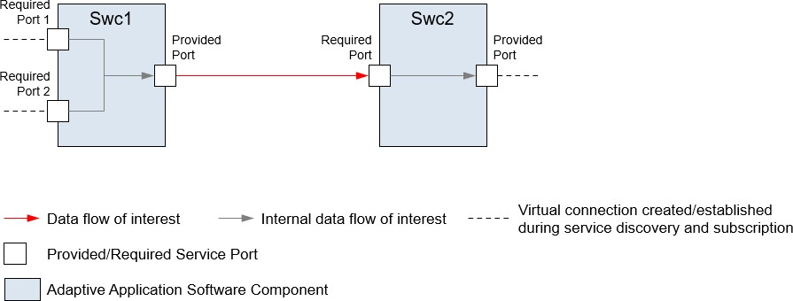{width="4.847915573053369in" height="1.8416666666666666in"}

**Figure 3.2: Example: Data flow in the scope of the VfbTiming view**


The [VfbTiming](#_bookmark37) view is applicable for different system granularities. The smallest granularity is the investigation of a single SwComponentType without any contextual embedding. Here, a timing description can only refer to relations between a component's RPortPrototypes and the same component's PPortPrototypes.

> 视图VfbTiming适用于不同的系统粒度。最小的粒度是对单个SwComponentType的调查，没有任何上下文嵌入。在这里，定时描述只能指的是组件的RPortPrototypes与同一组件的PPortPrototypes之间的关系。

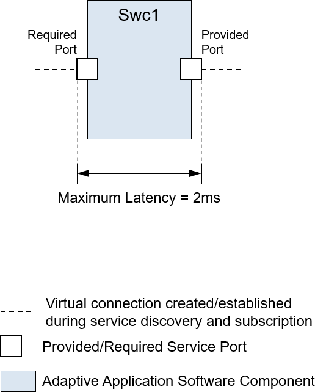{width="2.795in" height="3.4775in"}

**Figure 3.3:** []{#_bookmark36 .anchor}**Example: Latency requirement**


As an example, consider the timing constraint illustrated in Figure [3.3](#_bookmark36): "From the point in time, where the value is received by AA named *Swc1*, until the point in time, where the newly calculated data value is sent via the provided service port, there shall be a []{#_bookmark39 .anchor}maximum latency of 2 ms". This would be attached to the timing description that refers to an AdaptiveApplicationSwComponentType called *Swc1*.

> 举个例子，考虑图3.3中的时序约束：“从AA名为Swc1接收值的时刻起，到通过提供的服务端口发送新计算的数据值的时刻，最大延迟必须为2毫秒”。这将附加到指向名为Swc1的AdaptiveApplicationSwComponentType的时序描述中。


In case of a CompositionSwComponentType that itself contains other SwComponentPrototypes, the timing interrelation between different components, e.g. from one component's PPortPrototype to another component's RPortPrototype, could be of interest.

> 在一个包含其他SwComponentPrototype的CompositionSwComponentType中，不同组件之间的时序关系，例如从一个组件的PPortPrototype到另一个组件的RPortPrototype，可能会引起兴趣。


**[TPS_TIMEX_00087]**{DRAFT} **Purpose of [VfbTiming](#_bookmark37)** *[*The element [VfbTiming](#_bookmark37) aggregates all timing information, timing descriptions and timing constraints related to the VFB View.*♩([RS_TIMEX_00001](#requirements-traceability))*

> **[TPS_TIMEX_00087]**{草稿} **[VfbTiming](#_bookmark37)的目的** *[*元素[VfbTiming](#_bookmark37)汇总了与VFB视图相关的所有时序信息、时序描述和时序约束。♩([RS_TIMEX_00001](#requirements-traceability))*

[]{#_bookmark37 .anchor}**Table 3.1: VfbTiming**

### ExecutableTiming


**[TPS_TIMEX_00064]**{DRAFT} **Purpose of [ExecutableTiming](#_bookmark39)** *[*The element [Ex-](#_bookmark39) [ecutableTiming](#_bookmark39) aggregates all timing information, timing descriptions and timing constraints, that is related to the Executable View.*♩([RS_TIMEX_00001](#requirements-traceability), [RS_TIMEX\_-](#_bookmark24) [00024](#_bookmark24))*

> **[TPS_TIMEX_00064]**{草稿} **[ExecutableTiming](#_bookmark39)的目的** *[*元素[Ex-](#_bookmark39) [ecutableTiming](#_bookmark39)汇集所有与可执行视图相关的时序信息、时序描述和时序约束。♩([RS_TIMEX_00001](#requirements-traceability), [RS_TIMEX\_-](#_bookmark24) [00024](#_bookmark24))*

**Table 3.2: ExecutableTiming**

### SystemTiming


At system level a special prototype of a CompositionSwComponentType---the RootSwCompositionPrototype---is instantiated. This prototype, the chosen hardware topology and other artifacts are used as input to the task dealing with the deployment of software components onto machines in order to configure the system. The main configuration result is the mapping of software components to Machines and in further steps the resulting communication matrix is created. This information is aggregated in the System description.

> 在系统级别，实例化了一种特殊的CompositionSwComponentType原型---RootSwCompositionPrototype。该原型、所选择的硬件拓扑以及其他工件被用作部署软件组件到机器上以配置系统的任务的输入。主要的配置结果是将软件组件映射到机器，并在进一步的步骤中创建了所得到的通信矩阵。这些信息被聚合到系统描述中。


The [SystemTiming](#_bookmark41) view is used to provide timing information at system level. As an extension, it can be attached to a System. As the System description aggregates all the information about AdaptiveApplicationSwComponentTypes, it is possible to use the same concepts that are available in the view [VfbTiming](#_bookmark37) also in this timing view. The difference is the specific system context that defines the validity of timing information at system level. Without knowledge of the mapping of software components to a target hardware respectively ECU, only a generic platform independent description can be provided.

> 系统定时视图用于提供系统级别的时间信息。作为一个扩展，它可以附加到系统上。由于系统描述聚合了所有关于自适应应用软件组件类型的信息，因此可以在此定时视图中使用与[VfbTiming](#_bookmark37)视图中相同的概念。不同之处在于特定系统上下文定义了系统级别时间信息的有效性。如果不了解软件组件到目标硬件或ECU的映射，则只能提供通用的平台独立描述。

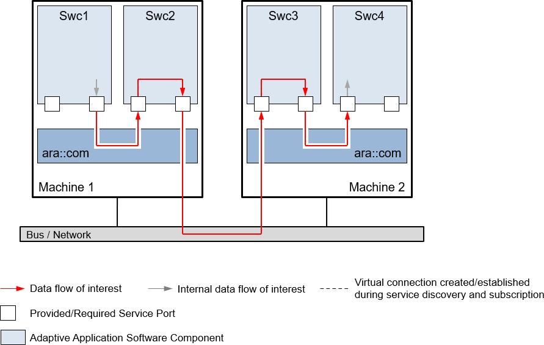{width="4.919061679790026in" height="3.1247911198600176in"}

**Figure 3.4: Example: Data flow in the scope of System Timing view**


[]{#_bookmark43 .anchor}In addition, a timing description in system view refers to the concrete communication of software components that only was represented as abstract connectors in [VfbTiming](#_bookmark37) view. Due to the software mapping, now communication is either local communication within a machine, or remote communication between machines across a communication bus. A system-specific timing description thus can refer to signals and frames sent across a physical network.

> 此外，系统视图中的时序描述指的是仅在[VfbTiming](#_bookmark37)视图中以抽象连接器表示的软件组件之间的具体通信。由于软件映射，现在通信要么是机器内的本地通信，要么是通过通信总线在机器之间的远程通信。因此，特定系统的时序描述可以指的是跨物理网络发送的信号和帧。


**[TPS_TIMEX_00088]**{DRAFT} **Purpose of [SystemTiming](#_bookmark41)** *[*The element [System-](#_bookmark41) [Timing](#_bookmark41) aggregates all timing information, timing descriptions and timing constraints, that is related to the System View.*♩([RS_TIMEX_00001](#requirements-traceability))*

> **[TPS_TIMEX_00088]**{草案} **[SystemTiming](#_bookmark41)的目的** *[*[System-](#_bookmark41)[Timing](#_bookmark41)元素汇集了所有与系统视图相关的时序信息、时序描述和时序约束。♩([RS_TIMEX_00001](#requirements-traceability))*

[]{#_bookmark41 .anchor}**Table 3.3: SystemTiming**

### ServiceTiming


**[TPS_TIMEX_00065]**{DRAFT} **Purpose of [ServiceTiming](#_bookmark43)** *[*The element [Ser-](#_bookmark43) [viceTiming](#_bookmark43) aggregates all timing information, timing descriptions and timing constraints, that is related to the Service View.*♩([RS_TIMEX_00001](#requirements-traceability), [RS_TIMEX_00024](#_bookmark24))*

> [服务定时](#_bookmark43)的目的*[*[Ser-](#_bookmark43)[viceTiming](#_bookmark43)元素汇集了与服务视图相关的所有定时信息、定时描述和定时约束。*♩([RS_TIMEX_00001](#requirements-traceability), [RS_TIMEX_00024](#_bookmark24))*

**Table 3.4: ServiceTiming**

### MachineTiming


**[TPS_TIMEX_00063]**{DRAFT} **Purpose of [MachineTiming](#_bookmark45)** *[*The element [Ma-](#_bookmark45) [chineTiming](#_bookmark45) aggregates all timing information, timing descriptions and timing constraints, that is related to the Machine View.*♩([RS_TIMEX_00001](#requirements-traceability), [RS_TIMEX_00024](#_bookmark24))*

> **[TPS_TIMEX_00063]**{草案} **[MachineTiming](#_bookmark45)的目的** *[*[Ma-](#_bookmark45)[chineTiming](#_bookmark45)元素汇集了所有与机器视图有关的时间信息、时间描述和时间约束。♩([RS_TIMEX_00001](#requirements-traceability), [RS_TIMEX_00024](#_bookmark24))*

[]{#_bookmark45 .anchor}**Table 3.5: MachineTiming**

## Formal specification of timing behavior


Compared to the specification of a system's functional behavior, the specification of its timing behavior requires additional information to be captured. Not only the eventual occurrence of events but also their exact timing or the concurrency of various events become important. Therefore, in the specification of timing extensions for AUTOSAR, the *event* is the basic entity. This event is used to refer to an observable behavior within a system at a certain point in time.

> 相比于系统功能行为的规范，其时序行为的规范需要捕获额外的信息。不仅要观察最终发生的事件，而且还要观察它们的确切时间或各种事件的并发性。因此，在AUTOSAR的时序扩展规范中，*事件*是基本实体。该事件用于指在某一时间点系统内的可观察行为。


Having to deal with different abstraction levels and views (see chapter [3.1](#timingextensions)), and in order to avoid semantic confusion with existing concepts, a new abstract type TimingDescriptionEvent (see section [3.5.2](#timingdescriptionevent)) is introduced as a formal basis for the timing extensions. Depending on the model entity and the associated observable behavior, specific timing events are defined and linked to the different views.

> 为了处理不同的抽象级别和视图（参见第3.1节）并且避免与现有概念的语义混淆，引入了一种新的抽象类型TimingDescriptionEvent（参见第3.5.2节）作为时序扩展的形式基础。根据模型实体和相关可观察行为，定义特定的时序事件并将其与不同的视图关联起来。


For the analysis of a system's timing behavior usually not only single events but also the correlation of different events is of fundamental importance. To relate timing events to each other, a further concept called TimingDescriptionEventChain (see section [3.5.1](#timingdescriptioneventchain)) is introduced. Hereby, it is important to note that for the referenced events of an event chain a functional dependency is implicitly assumed. This means that an event of a chain somehow causes subsequent chain events.

> 对于系统时序行为的分析，通常不仅需要单个事件，而且还需要不同事件之间的相关性。为了将时序事件彼此关联起来，还引入了一种叫做TimingDescriptionEventChain的概念（参见第3.5.1节）。在此，重要的是要注意，对于事件链中引用的事件，隐含着功能依赖性。这意味着一个事件链中的某个事件会导致随后的事件链事件。


Based on events and event chains, it is possible to express various specific timing constraints derived from the abstract type TimingConstraint. These timing constraints specify the expected timing behavior. As timing constraints shall be valid independently from implementation details, they are also expressed on a abstract level by referencing the above introduced formal basis of TimingDescriptionEvents and TimingDescriptionEventChains.

> 基于事件和事件链，可以表达出各种具体的时序约束，这些时序约束指定期望的时序行为。由于时序约束应该独立于实现细节，因此也可以通过引用上述介绍的TimingDescriptionEvents和TimingDescriptionEventChains的抽象层次来表达。


Thus, by means of events, event chains and timing constraints defined on top of these, a separate central timing specification can be provided, decoupling the expected timing behavior from the actually implemented behavior. This approach supports timing contracts for AUTOSAR systems in a top-down as well as bottom-up approach.

> 因此，通过定义在其上的事件、事件链和时序约束，可以提供单独的中心时序规范，将预期的时序行为与实际实施的行为解耦。这种方法支持AUTOSAR系统的时序合同，以自上而下和自下而上的方法。

## Specifying Time Sets


Sometimes it is necessary to specify that there are several alternatives with regard to timing requirements. For example, quite often it is reasonable to specify that a process shall be periodically activated either at 1ms, 2ms, 5ms, 8ms, or 10ms. In other words, it is perfectly fine to decide that the process is activated every 8ms. Indeed, it is allowed to activate the process either at 1ms, 2ms, 5ms, 8ms, or 10ms. Hence, there should be a means to specify such time sets which contain all allowed timings, like in case of activating a process at {1, 2, 5, 8, 10} ms.

> 有时有必要指定有关时间要求的几种选择。例如，通常有理由指定过程应每1ms、2ms、5ms、8ms或10ms周期性激活。换句话说，每8ms激活过程是完全可以的。事实上，允许在1ms、2ms、5ms、8ms或10ms激活过程。因此，应该有一种方法来指定包含所有允许时间的时间集，就像在以{1,2,5,8,10}ms激活过程的情况下。


For the purpose of specifying time sets the timing extensions utilize the "Variant Handling" capabilities specified and described in [[7](#_bookmark6)].

> 为了指定时间集，利用在[[7](#_bookmark6)]中指定和描述的“变量处理”功能。

## Timing Conditions

Please refer to [[8](#_bookmark7)] chapter \"Timing Conditions\".

## TimingDescription


The TimingDescription is an abstract class which provides the base for the two abstract sub-classes TimingDescriptionEventChain and TimingDescriptionEvent which further provide the base for the respective concrete event types as shown in Figure [3.5](#_bookmark50). These are detailed in the next sections.

> TimingDescription是一个抽象类，为两个抽象子类TimingDescriptionEventChain和TimingDescriptionEvent提供基础，如图3.5所示，这些将在下一节中详细介绍。

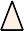

**Figure 3.5:** []{#_bookmark50 .anchor}**TimingDescription**

### TimingDescriptionEventChain


A timing event chain describes a causal order for a set of functionally dependent timing events. Each event chain defines at least the relationship between two differing events, its *stimulus* and *response* [constr_4515].

> 一个时序事件链描述了一组功能上依赖的时序事件的因果顺序。每个事件链至少定义了两个不同事件之间的关系，它的*刺激*和*反应*[constr_4515]。


This means that if the stimulus event occurs then the response event occurs after or in other words the response event follows if and only if the stimulus event occurred before.

> 如果刺激事件发生，那么反应事件会在其后发生，换句话说，只有在刺激事件发生之前，反应事件才会发生。


**[TPS_TIMEX_00070]**{DRAFT} **Purpose of TimingDescriptionEventChain** *[*The element TimingDescriptionEventChain is used to specify a causal relationship between timing description events and their occurrences during the runtime of a system.*♩([RS_TIMEX_00001](#requirements-traceability), [RS_TIMEX_00004](#requirements-traceability), [RS_TIMEX_00005](#requirements-traceability))*

> **[TPS_TIMEX_00070]**{草案} **定时描述事件链的目的** *[*TimingDescriptionEventChain元素用于在系统运行期间指定定时描述事件及其发生之间的因果关系。*♩([RS_TIMEX_00001](#requirements-traceability), [RS_TIMEX_00004](#requirements-traceability), [RS_TIMEX_00005](#requirements-traceability))*


Thus, by means of an event chain, the correlation between a stimulation of a system and its corresponding response can be explicitly described, and used as a formalized definition of the scope for timing constraints. This is important, because timing constraints refer to a specific part of the overall system's timing and need clear validity semantics.

> 因此，通过事件链，可以明确描述系统的刺激与其相应响应之间的相关性，并将其作为定时约束范围的正式定义。这很重要，因为定时约束涉及整个系统定时的特定部分，需要明确的有效语义。


[]{#_bookmark52 .anchor}**[constr_4581]**{DRAFT} **Specifying stimulus and response in TimingDescriptionEventChain** *[*The references between TimingDescriptionEventChain and TimingDescriptionEvent playing the role stimulus and response shall not reference the same TimingDescriptionEvent.*♩()*

> 在TimingDescriptionEventChain中指定刺激和反应之间的引用不应引用相同的TimingDescriptionEvent。


Depending on the value of the categorys of the TimingDescriptionEventChain, it may be used in different use-cases.

> 根据TimingDescriptionEventChain的类别的值，它可以用于不同的用例。


**[TPS_TIMEX_00095]**{DRAFT} **Standardized categorys of TimingDescriptionEventChain in Adaptive Platform** *[*AUTOSAR standardizes the following categorys of TimingDescriptionEventChain and their semantics:

> **[TPS_TIMEX_00095]**{草案} **自适应平台中的时序描述事件链的标准化类别** *[*AUTOSAR标准化以下时序描述事件链及其语义：

- undefined: as per [STANDARD](#_bookmark53)
- [[]{#_bookmark53 .anchor}STANDARD](#_bookmark53): No specific semantics are imposed on the TimingDescriptionEventChain. It indicates the standard behavior.
- [[]{#_bookmark54 .anchor}SL_LET_INTERVAL](#_bookmark54): The TimingDescriptionEventChain represents a SLLET interval

*♩()*


Please note constraints: [constr_4515], [constr_4560] and specification items: [TPS\_TIMEX_00111], [TPS_TIMEX_00114] in [[8](#_bookmark7)] shall apply here also.

> 请注意限制：[constr_4515]，[constr_4560]以及规格项目：[TPS_TIMEX_00111]，[TPS_TIMEX_00114]在[[8](#_bookmark7)]也应该适用。

### Segments


**[constr_4582]**{DRAFT} **Specifying event chain segments** *[*If a TimingDescriptionEventChain consists of further event chain segments then at least one sequence of event chain segments shall exist from the event chain's stimulus to the response.*♩()*

> 如果TimingDescriptionEventChain由更多的事件链段组成，则至少应从事件链的刺激到响应存在一个事件链段序列。


**[constr_4583]**{DRAFT} **Referencing no further event chain segments** *[*If a TimingDescriptionEventChain is not subdivided in further event chain segments, then the reference playing the role of segment shall reference this TimingDescriptionEventChain. In other words, an event chain without any event chain segments shall reference itself.*♩()*

> 如果一个TimingDescriptionEventChain没有被细分为更多的事件链段，那么作为段落的引用将引用这个TimingDescriptionEventChain。换句话说，没有任何事件链段的事件链将引用自身。


**[constr_4584]**{DRAFT} **Specifying stimulus event and response event of first and last event chain segment** *[*The stimulus event of the first event chain segment and the response event of the last event chain segment shall reference the stimulus and response of the parent event chain the event chain segments directly belong to.*♩ ()*

> **[constr_4584]**{草案} **指定第一个和最后一个事件链段的刺激事件和反应事件** *[*第一个事件链段的刺激事件和最后一个事件链段的反应事件应参考它们直接属于的父事件链的刺激和反应。*♩ ()*

### Approach


The following subsections describe how to structure event chains for systems. Depending on the pre-conditions two different approaches can be distinguished: top-down (decomposition) and bottom-up (composition).

> 以下小节描述了如何为系统结构化事件链。根据前提条件，可以区分出两种不同的方法：自顶向下（分解）和自底向上（组合）。


The decomposition respectively composition of event chains can be performed according to the software component hierarchy, but does not necessarily have to follow this hierarchy. The primary purpose is to increase respectively decrease granularity of the timing descriptions.

> 事件链的分解和组合可以根据软件组件层次结构来执行，但不一定要遵循这一层次结构。主要目的是增加或减少时间描述的粒度。


Note that event chains are used in all AUTOSAR timing views and any composition and decomposition of event chains can be done across various AUTOSAR timing views.

> 注意，事件链在所有AUTOSAR时序视图中都被使用，可以在各种AUTOSAR时序视图中对事件链进行组合和分解。

### Decomposition


In a first step the time critical path in the system is identified. This means that a causal relationship between a stimulus event and response event is described by an event chain. For this event chain a timing constraint is specified describing the time budget. The second step is to decompose this event chain into event chain segments which implies that the given time budget gets split --decomposed ---, too.

> 第一步是确定系统中的时间关键路径。这意味着利用事件链描述刺激事件和响应事件之间的因果关系。为此事件链指定一个时间约束，描述时间预算。第二步是将该事件链分解成事件链段，这意味着给定的时间预算也会被分解。


Since event chain segments are event chains as well, these event chain segments can be subject to further decomposition.

> 自从事件链段也是事件链，这些事件链段可以继续进行分解。


Figure [3.6](#_bookmark59) shows a time critical path between the event "requesting the brake pedal position" (*Stimulus*) and the event "making available the determined vehicle speed" (*Response*). This event chain (*EC*) is subject to a timing constraint, namely a [Laten-](#_bookmark157) [cyTimingConstraint](#_bookmark157), and is budgeted accordingly. For example, the time budget for the event chain *EC* is constrained by a maximum latency of 2 ms.

> 图3.6显示了从事件“请求制动踏板位置”（*激励*）到事件“提供确定的车速”（*响应*）之间的时间关键路径。该事件链（*EC*）受到时间约束，即[Laten-](#_bookmark157)[cyTimingConstraint](#_bookmark157)，并相应地进行预算。例如，事件链*EC*的时间预算受最大延迟2毫秒的约束。


In subsequent steps of the development and with deeper knowledge about the system's dynamics, this event chain and its time budget can be split across the system's components. This results in the event chain segments *EC1*, *EC2* and *EC3* and their appropriate time budgets. The sum of these time budgets shall not exceed the given time budget of 2 ms.

> 在系统动态的后续发展步骤中，随着对系统动态的更深入的了解，这个事件链及其时间预算可以在系统的组件之间进行分割。这样就形成了*EC1*、*EC2*和*EC3*事件链段及其相应的时间预算。这些时间预算的总和不应超过给定的2毫秒的时间预算。

### Composition


In the first step the system is build up based on available software components including timing descriptions. In the second step available event chains are connected with each other. This results in a sequence of event chains where the response event of one event chain plays the role of the stimulus event of the subsequent event chain. In the third step, a high-level event chain is specified based on a sequence of available event chains which play the role of event chain *segments*. For this high-level event chain a time budget shall be specified. Finally, the aggregated time budget needs to be assessed if acceptable which means that the aggregated time budget shall be equal or less than the time budget of the high-level event chain.

> 在第一步中，系统基于可用的软件组件（包括时序描述）构建起来。在第二步，将可用的事件链接接起来。这将产生一系列事件链，其中一个事件链的响应事件扮演了后续事件链的刺激事件的角色。在第三步，基于可用的事件链序列（其扮演了事件链片段的角色），指定高级事件链。最后，需要评估聚合的时间预算是否可接受，这意味着聚合的时间预算必须等于或小于高级事件链的时间预算。


Figure [3.6](#_bookmark59) shows the connected event chains *EC1*, *EC2* and *EC3*. For each event chain a time budget, using a [LatencyTimingConstraint](#_bookmark157), is specified: The time budget of event chain *EC1* is 0.5 ms, of event chain *EC2* is 0.6 ms and of event chain *EC3* is 0.7 ms. The high-level event chain *EC* is a composition of the event chains *EC1*, *EC2* and *EC3*. The stimulus event of the high-level event chain is the event "requesting the brake pedal position" (*Stimulus*) and the response event of the high-level event chain is the event "making available the determined vehicle speed" (*Response*). Eventually, a time budget is assigned to the high-level event chain using a [Latency-](#_bookmark157) [TimingConstraint](#_bookmark157), for example 2 ms. This value is consistent with the aggregated time budget of the event chain segments (0.5 ms + 0.6 ms + 0.7 ms = 1.8 ms).

> 图3.6显示了连接的事件链* EC1 *，* EC2 *和* EC3 *。对于每个事件链，使用[LatencyTimingConstraint](#_bookmark157)指定时间预算：事件链* EC1 *的时间预算为0.5毫秒，* EC2 *的时间预算为0.6毫秒，* EC3 *的时间预算为0.7毫秒。高级事件链* EC *是事件链* EC1 *，* EC2 *和* EC3 *的组合。高级事件链的刺激事件是“请求制动踏板位置”(* Stimulus *)，响应事件是“使确定的车速可用”(* Response *)。最终，使用[Latency-](#_bookmark157)[TimingConstraint](#_bookmark157)为高级事件链分配时间预算，例如2毫秒。这个值与事件链段的聚合时间预算（0.5毫秒+0.6毫秒+0.7毫秒=1.8毫秒）一致。

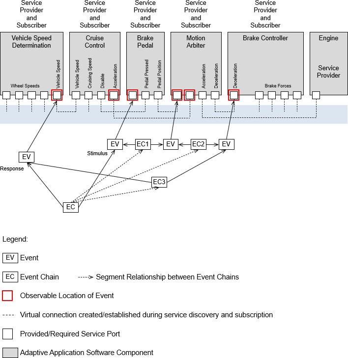{width="5.902199256342957in" height="6.075in"}

**Figure 3.6:** []{#_bookmark59 .anchor}**Example of a composed and decomposed event chain**

### Patterns


A sequence or hierarchy of event chains can form complex structures. However, if one of the aforementioned approaches is correctly followed then there is only a handful of patterns applicable. These patterns are introduced in the following with a simple example.

> 序列或事件链的层次结构可以形成复杂的结构。但是，如果正确遵循上述方法，则只有少数模式可用。以下以简单的例子介绍这些模式。

### Sequence


The most frequently used pattern is the sequence of events. Such a sequence describes a succession of causally related events without an alternative path.

> 最常用的模式是事件序列。这样的序列描述了一系列因果关联的事件，没有其他路径。

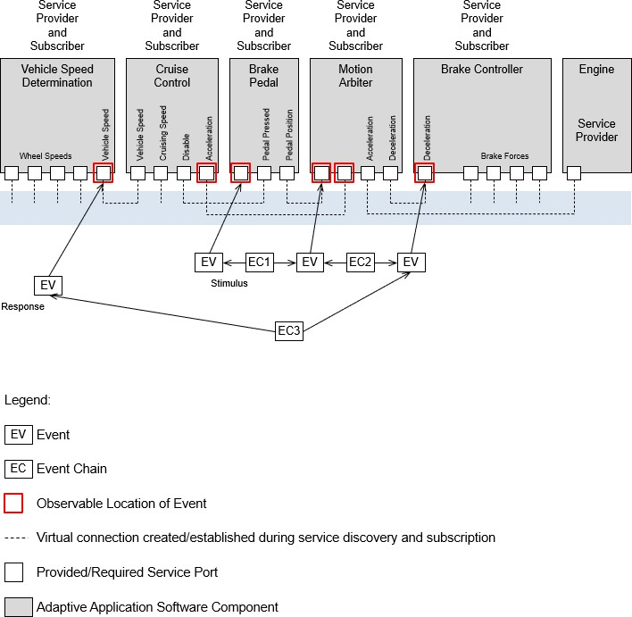{width="5.973748906386701in" height="5.830311679790026in"}

**Figure 3.7:** []{#_bookmark62 .anchor}**Example of the "Sequence" pattern**


An example for this pattern is depicted in Figure [3.7](#_bookmark62). The event chains *EC1* through *EC3* define a causal relationship of events observed at a port of the AA called *Brake Pedal* and a port of the AA called *Vehicle Speed Determination*.

> 一个示例图示于图3.7中。事件链EC1到EC3定义了AA的某一端口“Brake Pedal”和另一端口“Vehicle Speed Determination”之间的因果关系。

### Fork


The "Fork" pattern describes the constellation where several event chains have one common stimulus event and different response events.

> 派生模式描述了几个事件链都有一个共同的刺激事件和不同的响应事件的构成。


The pattern is illustrated in Figure [3.8](#_bookmark64), which shows a path that forks because the AA *Brake Controller* calculates the brake force value for each wheel (*EC5* through *EC8*).

> 图3.8说明了这种模式，它显示了一条分叉的路径，因为AA刹车控制器为每个轮子（EC5到EC8）计算刹车力值。

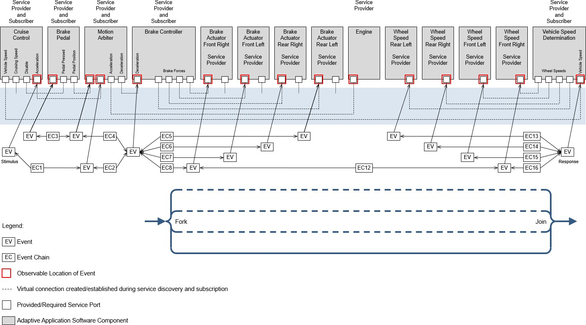{width="5.954166666666667in" height="3.304165573053368in"}

**Figure 3.8:** []{#_bookmark64 .anchor}**Example of the "Fork" and "Join" pattern**

### Join


The "Join" pattern describes the constellation where several event chains have one common response event and different stimulus events.

> 把“加入”模式描述为几个事件链具有一个共同的响应事件和不同的刺激事件的构成。


The pattern is illustrated in Figure [3.8](#_bookmark64) which shows a path that joins because the AA *Vehicle Speed Determination* aggregates the wheel speed values from individual wheels (*EC13* through *EC16*).

> 图3.8（#_bookmark64）描绘了一个路径，因为AA车辆速度确定聚合了来自各个轮子（EC13到EC16）的轮子速度值。

### Alternative


The "Alternative" pattern describes the constellation where more than one path between a stimulus and response event exists. This implies that at least one "Fork" is followed by at least one "Join".

> 替代模式描述了一个至少有一个“分叉”被至少一个“合并”所跟随的情况，其中刺激和反应事件之间存在多条路径。


The pattern is illustrated in Figure [3.9](#_bookmark67) which shows that an event observed at a required port of the AA *Motion Arbiter* leads to an occurrence of an event either at the port called

> 图[3.9](#_bookmark67)说明了这种模式，它表明AA *Motion Arbiter*的必需端口上观察到的事件会导致另一个端口上发生事件。


*Deceleration* of the AA *Brake Controller*, or at the port called *Acceleration* of the AA *Engine*. These alternative causal relationships are described by the event chains *EC2* and *EC4* in this figure. In either case, the deceleration or acceleration of the vehicle leads to the occurrence of an event at the provided port called *Vehicle Speed* of the AA *Vehicle Speed Determination* reporting the vehicle's speed. These alternative causal relationships are described by the event chains *EC3* and *EC5* which both reference the same response event. To fulfill the overall event chain, only one of the alternative paths shall have been occurred.

> 减速，AA制动控制器的减速，或者在叫做加速的端口上AA发动机的加速。这些替代因果关系由图中的EC2和EC4事件链描述。无论哪种情况，车辆的减速或加速都会导致提供的端口（叫做车速的AA车辆速度确定）上报告车辆速度的事件发生。这些替代因果关系由EC3和EC5事件链描述，它们都引用了相同的响应事件。为了完成整个事件链，只有一条替代路径发生。

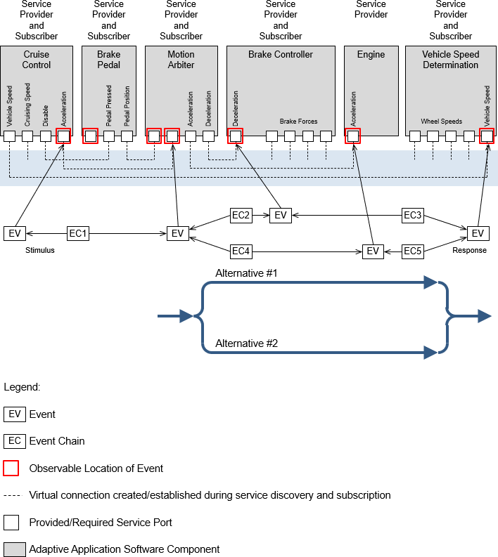{width="5.973748906386701in" height="6.690937226596676in"}

**Figure 3.9:** []{#_bookmark67 .anchor}**Example of the "Alternative" pattern**

### Cycle


The "Cycle" pattern describes the constellation where a path from the response event of an event chain leads to the stimulus of this event chain.

> "循环"模式描述了一个从事件链的响应事件到此事件链刺激的路径的构成。


The pattern is illustrated in Figure [3.10](#_bookmark69) which shows three event chains *EC8*, *EC12* and *EC17* forming a cycle. The stimulus event of event chain *EC8* is the response event of event chain *EC17* ; and the response event of event chain *EC12* is the stimulus event of event chain *EC17*. Event chain *EC8* and *EC12* reference the same event in different roles, namely response event from event chain *EC8* perspective and stimulus event from the event chain *EC12* perspective.

> 图3.10所示的模式是三个事件链*EC8*、*EC12*和*EC17*形成一个循环。事件链*EC8*的刺激事件是事件链*EC17*的响应事件；而事件链*EC12*的响应事件是事件链*EC17*的刺激事件。事件链*EC8*和*EC12*从不同的角度引用同一个事件，即事件链*EC8*的响应事件和事件链*EC12*的刺激事件。


Note that an event chain referencing the same event for its stimulus and its response is forbidden according to the constraint [[constr_4581](#_bookmark52)]. As a consequence a cycle consists of at least two event chains.

> 注意，根据约束[[constr_4581](#_bookmark52)]，引用相同事件作为刺激和反应的事件链是被禁止的。因此，一个周期由至少两个事件链组成。

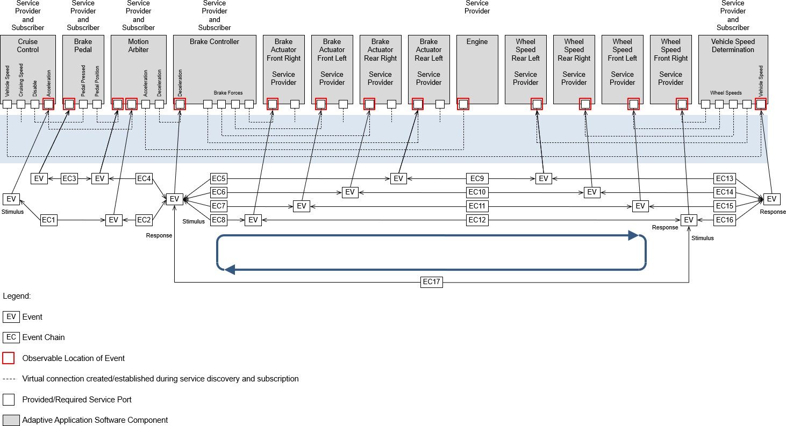{width="5.939374453193351in" height="3.2215616797900264in"}

**Figure 3.10:** []{#_bookmark69 .anchor}**Example of the "Cycle" pattern**

### TimingDescriptionEvent


**[TPS_TIMEX_00069]**{DRAFT} **Purpose of TimingDescriptionEvent** *[*The element TimingDescriptionEvent and its specializations are used to describe the occurrences of an event which are observed at a specific location in a system during runtime respectively the operation of the system.*♩([RS_TIMEX_00001](#requirements-traceability))*

> **[TPS_TIMEX_00069]**{草案} **定时描述事件的目的** *[*TimingDescriptionEvent元素及其特化用于描述在运行时在系统中观察到的特定位置的事件发生，分别是系统的操作。*♩（[RS_TIMEX_00001]（#要求可追溯性））*


For example, this can be the start of a service or the different steps in executing an executable.

> 例如，这可以是服务的开始或执行可执行文件的不同步骤。


An overview of the different event types is given in Figure [3.11](#_bookmark71). These are described in more detail in the following sub-sections.

> 图3.11给出了不同事件类型的概述。这些类型将在接下来的子部分中详细描述。


**Figure 3.11:** []{#_bookmark71 .anchor}**Overview of the different types of timing events**


Depending on the value of the category of the TimingDescriptionEvent, it may be used in different use-cases.

> 根据TimingDescriptionEvent的类别值的不同，它可以用于不同的用例。


**[TPS_TIMEX_00094]**{DRAFT} **Standardized categorys of TimingDescriptionEvent in Adaptive Platform** *[*AUTOSAR standardizes the following categorys of TimingDescriptionEvent and their semantics:

> **[TPS_TIMEX_00094]**{草稿} **自适应平台中的时序描述事件标准化分类** *[*AUTOSAR标准化以下时序描述事件及其语义的分类：

- undefined: as per [STANDARD](#_bookmark72)
- [[]{#_bookmark72 .anchor}STANDARD](#_bookmark72): No specific semantics are imposed on the TimingDescriptionEvent. It indicates the standard behavior.
- [[]{#_bookmark73 .anchor}SL_LET_RELEASE](#_bookmark73): The TimingDescriptionEvent represents the release/start point of an SL-LET interval
- [[]{#_bookmark74 .anchor}SL_LET_TERMINATE](#_bookmark74): The TimingDescriptionEvent represents the termination/end point of an SL-LET interval

*♩()*


Please note constraint: [constr_4559] in [[8](#_bookmark7)] shall apply here also.

> 請注意，[[8](#_bookmark7)]中的約束[constr_4559]也適用於此。


Also note that information regarding the occurrence of a TimingDescriptionEvent is described separately in [3.6.1](#eventtriggeringconstraint).

> 此外，[3.6.1](#eventtriggeringconstraint)中还描述了有关TimingDescriptionEvent发生的信息。

### TDEventVfb


**[TPS_TIMEX_00082]**{DRAFT} **Purpose of** [**TDEventVfb**](#_bookmark76) *[*The element [TDEventVfb](#_bookmark76) and its specializations are used to describe the occurrences of an event which are observed at a specific location in the VFB view.*♩([RS_TIMEX_00001](#requirements-traceability))*

> **[TPS_TIMEX_00082]**{草稿} **用途** [**TDEventVfb**](#_bookmark76) *[*元素[TDEventVfb](#_bookmark76)及其专业化用于描述在VFB视图中观察到的特定位置的事件发生*♩([RS_TIMEX_00001](#requirements-traceability))*

Events related to the VFB can be used during the specification of:

- [[]{#_bookmark78 .anchor}VfbTiming](#_bookmark37) [3.1.1](#vfbtiming)
- [SystemTiming](#_bookmark41) [3.1.3](#systemtiming)

[]{#_bookmark76 .anchor}**Table 3.6: TDEventVfb**


**[TPS_TIMEX_00092]**{DRAFT} **Purpose of [TDEventVfbPort](#_bookmark77)** *[*The element [TDE-](#_bookmark77) [ventVfbPort](#_bookmark77) and its specializations are used to describe the occurrences of an event which are observed at a specific location in the VFB view.*♩([RS_TIMEX_00001](#requirements-traceability), [RS\_-](#_bookmark25) [TIMEX_00019](#_bookmark25))*

> [TDEventVfbPort](#_bookmark77) 的目的是描述在VFB视图中观察到的事件发生的位置，它及其专业化用于此目的。（[RS_TIMEX_00001](#requirements-traceability), [RS\_-](#_bookmark25) [TIMEX_00019](#_bookmark25））

[]{#_bookmark77 .anchor}**Table 3.7: TDEventVfbPort**


**[TPS_TIMEX_00093]**{DRAFT} **Purpose of [TDEventVfbReference](#_bookmark78)** *[*The element [TDEventVfbReference](#_bookmark78) is used to reference timing description events already specified in other timing views. In other words, it enables one to re-use existing timing models.*♩([RS_TIMEX_00001](#requirements-traceability), [RS_TIMEX_00019](#_bookmark25))*

> **[TPS_TIMEX_00093]**{草稿} **[TDEventVfbReference](#_bookmark78) 的目的** *[*元素 [TDEventVfbReference](#_bookmark78) 用于引用其他时序视图中已指定的时序描述事件。换句话说，它使得可以重复使用现有的时序模型。*♩([RS_TIMEX_00001](#requirements-traceability), [RS_TIMEX_00019](#_bookmark25))*

[]{#_bookmark79 .anchor}**Table 3.8: TDEventVfbReference**

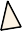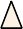{width="0.11680336832895888in" height="0.1510411198600175in"}**[TPS_TIMEX_00083]**{DRAFT} **[TDEventVariableDataPrototype](#_bookmark79) specifies events observable at sender/receiver ports** *[*The element [TDEventVariable-](#_bookmark79) [DataPrototype](#_bookmark79) is used to specify events, namely the receipt and sending of variable data prototypes, observable at required and provided sender/receiver ports.*♩ ([RS_TIMEX_00001](#requirements-traceability))*

**Figure 3.12: Variable Data Prototype**

**Table 3.9: TDEventVariableDataPrototype**

**Table 3.10: TDEventVariableDataPrototypeTypeEnum**

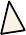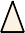{width="0.131421697287839in" height="0.17187445319335082in"}**[TPS_TIMEX_00084]**{DRAFT} [**TDEventOperation**](#_bookmark80) **specifies events observable at client/server ports.** *[*The element [TDEventOperation](#_bookmark80) is used to specify events, namely the invocation of operations and their completion, observable at required and provided client/server ports.*♩([RS_TIMEX_00001](#requirements-traceability))*

**Figure 3.13: Operation**

[]{#_bookmark80 .anchor}**Table 3.11: TDEventOperation**

**Table 3.12: TDEventOperationTypeEnum**


**[TPS_TIMEX_00085]**{DRAFT} **[TDEventModeDeclaration](#_bookmark81) specifies events observable at mode ports.** *[*The element [TDEventModeDeclaration](#_bookmark81) is used to specify events, namely initiation and propagation of mode changes, observable at required and provided mode ports.*♩([RS_TIMEX_00001](#requirements-traceability))*

> **[TPS_TIMEX_00085]**{草稿} **[TDEventModeDeclaration](#_bookmark81) 指定可以在模式端口观察到的事件。** *[*元素[TDEventModeDeclaration](#_bookmark81)用于指定可以在所需和提供的模式端口观察到的事件，即模式变化的启动和传播。*♩([RS_TIMEX_00001](#requirements-traceability))*

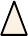{width="0.1433727034120735in" height="0.1875in"}

**Figure 3.14: Mode Declaration**

**Table 3.**[]{#_bookmark81 .anchor}**13: TDEventModeDeclaration**

[]{#_bookmark82 .anchor}**Table 3.14: TDEventModeDeclarationTypeEnum**


**[TPS_TIMEX_00090]**{DRAFT} **[TDEventTrigger](#_bookmark82) specifies events observable at trigger ports** *[*The element [TDEventTrigger](#_bookmark82) is used to specify events, namely the activation and release of triggers, observable at required and provided trigger ports.*♩ ([RS_TIMEX_00001](#requirements-traceability))*

> [TDEventTrigger](#_bookmark82) 用于指定可以在所需和提供的触发端口观察到的事件，即触发器的激活和释放。（[RS_TIMEX_00001](#requirements-traceability)）

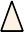+port 0..1
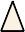

**Figure 3.15: Trigger**

**Table 3.15: TDEventTrigger**

**Table 3.16: TDEventTriggerTypeEnum**

### TDEventServiceInstance


**[TPS_TIMEX_00058]**{DRAFT} **Purpose of [TDEventServiceInstance](#_bookmark84)** *[*The element [TDEventServiceInstance](#_bookmark84) and its specializations are used to describe the occurrences of an event which are observed at a specific location in the Service view.*♩ ([RS_TIMEX_00001](#requirements-traceability), [RS_TIMEX_00024](#_bookmark24))*

> **[TPS_TIMEX_00058]**{草稿} **[TDEventServiceInstance](#_bookmark84) 的目的** *[*元素 [TDEventServiceInstance](#_bookmark84) 及其特化用于描述在服务视图中观察到的某个事件的发生。*♩ ([RS_TIMEX_00001](#requirements-traceability), [RS_TIMEX_00024](#_bookmark24))*


Events related to the adaptive service can be used during the specification of:

> 事件与自适应服务有关，可以在规范过程中使用。

- [VfbTiming](#_bookmark37) [3.1.1](#vfbtiming)
- [SystemTiming](#_bookmark41) [3.1.3](#systemtiming)
- [ServiceTiming](#_bookmark43) [3.1.4](#servicetiming)

**Figure 3.16: Adaptive Service events**

[]{#_bookmark85 .anchor}


**[TPS_TIMEX_00059]**{DRAFT} **Purpose of** [**TDEventServiceInstanceEvent**](#_bookmark85) *[*The element [TDEventServiceInstanceEvent](#_bookmark85) is used to describe the occurrences of an event which are observed at a specific location in the Service view.*♩([RS_TIMEX\_-](#requirements-traceability) [00001](#requirements-traceability), [RS_TIMEX_00024](#_bookmark24))*

> [TPS_TIMEX_00059]{草稿} 的目的是[TDEventServiceInstanceEvent]（#_bookmark85）*[*元素[TDEventServiceInstanceEvent]（#_bookmark85）用于描述在服务视图中特定位置观察到的事件发生情况。*♩（[RS_TIMEX\_-]（#requirements-traceability）[00001]（#requirements-traceability），[RS_TIMEX_00024]（#_bookmark24））*

**Figure 3.17: Adaptive Service Event**

**Table 3.18: TDEventServiceInstanceEvent**

**Table 3.19: TDEventServiceInstanceEventTypeEnum**


**[TPS_TIMEX_00060]**{DRAFT} **Purpose of** [**TDEventServiceInstanceField**](#_bookmark86) *[*The element [TDEventServiceInstanceField](#_bookmark86) is used to describe the occurrences of an event which are observed at a specific location in the Service view.*♩([RS_TIMEX\_-](#requirements-traceability) [00001](#requirements-traceability), [RS_TIMEX_00024](#_bookmark24))*

> [TPS_TIMEX_00060]{草案} 用途 [TDEventServiceInstanceField]（#_bookmark86）*[*元素[TDEventServiceInstanceField]（#_bookmark86）用于描述在服务视图中观察到的特定位置的事件发生情况。*♩（[RS_TIMEX\_-]（#requirements-traceability）[00001]（#requirements-traceability），[RS_TIMEX_00024]（#_bookmark24））*

{width="9.009951881014873e-2in" height="0.1735411198600175in"}
**Figure 3.18: Adaptive Service Field**
**Table 3.20: T**[]{#_bookmark86 .anchor}**DEventServiceInstanceField**
**Table 3.21: TDEventServiceInstanceFieldTypeEnum**


**[TPS_TIMEX_00061]**{DRAFT} **Purpose of [TDEventServiceInstanceMethod](#_bookmark87)** *[*The element [TDEventServiceInstanceMethod](#_bookmark87) is used to describe the occurrences of an event which are observed at a specific location in the Service view.*♩ ([RS_TIMEX_00001](#requirements-traceability), [RS_TIMEX_00024](#_bookmark24))*

> **[TPS_TIMEX_00061]**{草稿} **[TDEventServiceInstanceMethod](#_bookmark87)的目的** *[*[TDEventServiceInstanceMethod](#_bookmark87)元素用于描述在服务视图中特定位置观察到的事件发生情况。♩ ([RS_TIMEX_00001](#requirements-traceability), [RS_TIMEX_00024](#_bookmark24))*

{width="9.16240157480315e-2in" height="0.17187445319335082in"}
**Figure 3.19: Adaptive Service Method**
**Table 3.22: TDE**[]{#_bookmark87 .anchor}**ventServiceInstanceMethod**


[]{#_bookmark88 .anchor}**Table 3.23: TDEventServiceInstanceMethodTypeEnum**

> 表3.23：TDEventServiceInstanceMethodTypeEnum


**[TPS_TIMEX_00062]**{DRAFT} **Purpose of [TDEventServiceInstanceDiscovery](#_bookmark88)** *[*The element [TDEventServiceInstanceDiscovery](#_bookmark88) is used to describe the occurrences of an event which are observed at a specific location in the Service view.*♩ ([RS_TIMEX_00001](#requirements-traceability), [RS_TIMEX_00024](#_bookmark24))*

> **[TPS_TIMEX_00062]**{草稿} **[TDEventServiceInstanceDiscovery](#_bookmark88)的目的** *[*元素[TDEventServiceInstanceDiscovery](#_bookmark88)用于描述在服务视图中特定位置观察到的事件发生情况。*♩ ([RS_TIMEX_00001](#requirements-traceability), [RS_TIMEX_00024](#_bookmark24))*

**Figure 3.20: Adaptive Service Discovery**
**Table 3.24: TDEventServiceInstanceDiscovery**
**Table 3.25: TDEventServiceInstanceDiscoveryTypeEnum**

### TDEventComplex


**[TPS_TIMEX_00086]**{DRAFT} **Purpose of [TDEventComplex](#_bookmark90)** *[*The element [TDE-](#_bookmark90) [ventComplex](#_bookmark90) is used to specify relationships between occurrences of events.*♩([RS\_-](#requirements-traceability) [TIMEX_00001](#requirements-traceability))*

> [TPS_TIMEX_00086]{草稿} **[TDEventComplex](#_bookmark90) 的目的** *[*元素[TDE-](#_bookmark90) [ventComplex](#_bookmark90) 用于指定事件发生之间的关系。*♩([RS\_-](#requirements-traceability) [TIMEX_00001](#requirements-traceability))*

Complex timing events can be used during the specification of:

- [VfbTiming](#_bookmark37) [3.1.1](#vfbtiming)
- [SystemTiming](#_bookmark41) [3.1.3](#systemtiming)

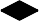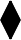+occurrenceExpression
+event
**Figure 3.21: Complex timing event**

[]{#_bookmark90 .anchor}
**Table 3.26: TDEventComplex**


A complex timing event is a special observable event. In comparison to the "atomic" events described above a complex event does not contain information about the context it references, like VariableDataPrototype in [TDEventVariableDataPro-](#_bookmark79) [totype](#_bookmark79). Instead, a complex event uses the occurrence expression to specify the context with regard to occurrences of TimingDescriptionEvents as describe in the following section.

> 一个复杂的时间事件是一个特殊的可观察事件。与上面描述的“原子”事件相比，复杂事件不包含关于它引用的上下文的信息，比如[TDEventVariableDataPrototype](#_bookmark79)中的VariableDataPrototype。相反，复杂事件使用发生表达式来指定与以下部分描述的TimingDescriptionEvents发生有关的上下文。

### TDEventSLLET

SL-LET timing events can be used during the specification of:

- [VfbTiming](#_bookmark37) [3.1.1](#vfbtiming)
- [ExecutableTiming](#_bookmark39) [3.1.2](#executabletiming)
- [SystemTiming](#_bookmark41) [3.1.3](#systemtiming)
- [MachineTiming](#_bookmark45) [3.1.5](#machinetiming)


For the remaining aspects, please refer to [[8](#_bookmark7)] chapter \"TDEventSLLET\". Specifically [TPS_TIMEX_00120] and [TPS_TIMEX_00124] apply.

> 对于其余方面，请参考第8章“TDEventSLLET”。具体来说，[TPS_TIMEX_00120]和[TPS_TIMEX_00124]适用。

### Occurrence Expression Language for Timing Events


The TimingDescriptionEvents mentioned in the previous sections allow to specify observable events with a well-defined context. However, sometimes the context information of the events is not sufficient, because additional conditions, like a value filter or additional stimuli, influence the occurrence. Thus, the occurrence expression provides means to overcome the limitations of atomic events.

> 在前面的章节中提到的TimingDescriptionEvents允许指定具有明确上下文的可观察事件。但是，有时事件的上下文信息不足，因为额外的条件，如值过滤器或额外的刺激，会影响发生。因此，出现表达式提供了克服原子事件局限性的手段。


The occurrence expression provides the ability to refine the context specification of a timing event for the following cases:

> 此发生表达式提供了精细化定义定时事件上下文规范的能力，用于以下情况：


**Content Filter** filters occurrences of an atomic event based on the *value* of exchanged data or operation arguments.

> **内容过滤**根据交换数据或操作参数的值过滤原子事件的发生。


**Complex Event** combines any number of atomic and complex event to specify a new timing event.

> **复杂事件**结合任意数量的原子和复杂事件来指定一个新的时间事件。

### Specifying an Occurrence Expression

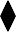+event

**Figure 3.22:** []{#_bookmark94 .anchor}**The occurrence expression**


As shown in Figure [3.22](#_bookmark94), each TimingDescriptionEvent aggregates a [TDE-](#_bookmark98) [ventOccurrenceExpression](#_bookmark98) as optional parameter. A [TDEventOccurrenceEx-](#_bookmark98) [pression](#_bookmark98) is a container for all information required to formulate the expression. The expression itself is defined via [TDEventOccurrenceExpressionFormula](#_bookmark101) which is derived from FormulaExpression (see Generic Structure Template [[7](#_bookmark6)]). The [TDE-](#_bookmark101) [ventOccurrenceExpressionFormula](#_bookmark101) uses the capabilities of the FormulaExpression and adds the following functions to the expression language:

> 如图3.22所示，每个TimingDescriptionEvent将TDEventOccurrenceExpression作为可选参数聚合。TDEventOccurrenceExpression是所有必要信息的容器，以形成表达式。表达式本身是通过TDEventOccurrenceExpressionFormula定义的，它派生自FormulaExpression（参见通用结构模板7）。TDEventOccurrenceExpressionFormula利用FormulaExpression的功能，并向表达式语言中添加以下函数：


- The function *TIMEX_value*, which requires as operand either a reference to an [AutosarVariableInstance](#_bookmark102) or a reference to an [AutosarOperationArgu-](#_bookmark103) [mentInstance](#_bookmark103) whose value shall be evaluated. The return type of this function is Numerical (see constraint [[constr_4591](#_bookmark96)]).

> 函数TIMEX_value需要作为操作数提供对[AutosarVariableInstance](#_bookmark102)或[AutosarOperationArgu-](#_bookmark103) [mentInstance](#_bookmark103)的引用，以便评估其值。此函数的返回类型为数值（参见约束[[constr_4591](#_bookmark96)]）。

- The function *TIMEX_occurs*, which requires as operand a reference to the TimingDescriptionEvent whose occurrence shall be evaluated. The return type of this function is Boolean. It returns TRUE if the referenced timing event occurs at the point in time the expression is evaluated.

> 函数TIMEX_occurs需要一个引用TimingDescriptionEvent作为操作数，用于评估其发生情况。此函数的返回类型为布尔值，当表达式被评估时，如果引用的定时事件发生，则返回TRUE。

- The function *TIMEX_hasOccurred*, which requires as operand a reference to the TimingDescriptionEvent whose occurrence shall be evaluated. The return type of this function is Boolean. It returns TRUE if the referenced timing event has occurred *at least once* before or at the same point in time the expression is evaluated.

> 函数TIMEX_hasOccurred需要一个指向TimingDescriptionEvent的操作数，用于评估其发生情况。此函数的返回类型为布尔值。如果在表达式被评估时，参考的定时事件至少曾经发生过一次，则它将返回TRUE。

- The function *TIMEX_timeSinceLastOccurrence*, which requires as operand a reference to the TimingDescriptionEvent whose occurrence shall be evaluated. The return type of this function is Float and the unit is seconds. It returns the time difference between the point in time of the last occurrence of the referenced event and the point in time the expression is evaluated.

> 函数*TIMEX_timeSinceLastOccurrence*需要一个指向TimingDescriptionEvent的引用作为操作数。该函数的返回类型为Float，单位为秒。它返回引用事件的上次发生点和表达式被评估的点之间的时间差。

- The function *TIMEX_angleSinceLastOccurrence*, which requires as operand a reference to the TimingDescriptionEvent whose occurrence shall be evaluated. The return type of this function is Float and the unit is degree. It returns the angle of the crank shaft between the point in time of the last occurrence of the referenced event and the point in time the expression is evaluated.

> 函数`TIMEX_angleSinceLastOccurrence`需要一个指向TimingDescriptionEvent的引用作为操作数，用于评估其发生。该函数的返回类型为Float，单位为度，它返回曲轴在参考事件上次发生的时间点和表达式被评估的时间点之间的角度。

- The function *TIMEX_modeActive* queries the TimingModeInstance specified as argument. The return type of this function is Boolean. It returns TRUE if the specified mode declaration is *active* at the point in time the expression is evaluated, otherwise it returns FALSE.

> 函数TIMEX_modeActive查询作为参数指定的TimingModeInstance。此函数的返回类型为布尔值。如果在表达式被评估的时间点上指定的模式声明处于活动状态，则返回TRUE，否则返回FALSE。


The starting point of the time interval considered by the TIMEX functions is the point in time the measurement of the event occurrences has been started.

> 被TIMEX函数考虑的时间间隔的起点是事件发生的测量开始的时刻。


All operands required by the functions are references to model elements. Thus, [TDEventOccurrenceExpressionFormula](#_bookmark101) requires references to the respective elements of type TimingDescriptionEvent, [AutosarVariableInstance](#_bookmark102), [Au-](#_bookmark103) [tosarOperationArgumentInstance](#_bookmark103). Due to the atpMixedString nature of the [TDEventOccurrenceExpressionFormula](#_bookmark101) several references can be used within the occurrence expression.

> 所有函数所需的操作数都是模型元素的引用。因此，[TDEventOccurrenceExpressionFormula](#_bookmark101)需要引用类型TimingDescriptionEvent、[AutosarVariableInstance](#_bookmark102)和[Au-](#_bookmark103)[tosarOperationArgumentInstance](#_bookmark103)的各自元素。由于[TDEventOccurrenceExpressionFormula](#_bookmark101)的atpMixedString性质，可以在发生表达式中使用多个引用。


**[constr_4569]**{DRAFT} **Restricted usage of functions** *[*The functions *TIMEX_occurs*, *TIMEX_hasOccurred*, *TIMEX_timeSinceLastOccurrence*, *TIMEX_angleSinceLastOccurrence*, and *TIMEX_modeActive* can only be used for occurrence expressions, which are applied to events of type [TDEventComplex](#_bookmark90).*♩()*

> **[constr_4569]**{草案} **函数的受限使用** *[*函数*TIMEX_occurs*、*TIMEX_hasOccurred*、*TIMEX_timeSinceLastOccurrence*、*TIMEX_angleSinceLastOccurrence*和*TIMEX_modeActive*只能用于应用于类型为[TDEventComplex](#_bookmark90)的事件的发生表达式。*♩()*


[]{#_bookmark95 .anchor}**[constr_4570]**{DRAFT} **Application rule for the occurrence expression in [TDE-](#_bookmark90) [ventComplex](#_bookmark90)** *[*The occurrence expression shall be specified such that it describes an *event* rather than a state. As a consequence the occurrence expression shall ensure that a complex timing event *could* only occur at the occurrence time of one of the referenced TimingDescriptionEvents.*♩()*

> 应用规则，用于[TDE-]（#_bookmark90）[ventComplex]（#_bookmark90）中的发生表达式：发生表达式应该描述一个事件，而不是一个状态。因此，发生表达式应确保复杂的定时事件只能在引用的TimingDescriptionEvents的发生时间发生。


**[constr_4571]**{DRAFT} **Use references only as function operands** *[*The references to model elements (e.g. the *timing event* reference targeting TimingDescriptionEvent) do have specific semantics. The usage of these references within the expression is *only* allowed as operand of the functions mentioned above.*♩()*

> 只允许将参考用作函数操作数。模型元素的引用（例如针对TimingDescriptionEvent的timing event引用）具有特定的语义。仅允许在上述函数的操作数中使用这些引用。


[]{#_bookmark96 .anchor}**[constr_4591]**{DRAFT} **Use only Numericals in [TDEventOccurrenceExpression](#_bookmark98)** *[*The target data prototype of the instance references of [variable](#_bookmark99) and [argument](#_bookmark100) shall be Numerical.*♩()*

> 只允许在[TDEventOccurrenceExpression](#_bookmark98)中使用数字，实例引用的目标数据原型必须是数字。


The example given below shows how to combine the functions introduced above in order to specify an occurrence expression for a complex event called *EC*.

> 以下给出的示例展示了如何结合上述介绍的函数来为一个复杂事件*EC*指定一个发生表达式。


Figure [3.23](#_bookmark97) sketches the AUTOSAR software component model of this example.

> 图3.23绘制了本例中的AUTOSAR软件组件模型。


A software component named *Swc1* has a required port, called *RequiredPort*, and a provided port, called *ProvidedPort*. Both ports are sender-receiver ports. The senderreceiver port interface of the required port is called *SenderReceiverInterface1*, and consists of three data elements: The first data element is called *DE1*, the second data element is called *DE2*, and the third data element is called *DE3*. Note, that alternatively it would be also possible to define three required sender-receiver ports and the port interface of each of those ports consists of one of the data elements.

> 软件组件Swc1具有一个名为RequiredPort的必需端口和一个名为ProvidedPort的提供端口，这两个端口都是发送器-接收器端口。必需端口的发送器-接收器端口接口被称为SenderReceiverInterface1，由三个数据元素组成：第一个数据元素被称为DE1，第二个数据元素被称为DE2，第三个数据元素被称为DE3。注意，另一种可能的定义是定义三个必需的发送器-接收器端口，每个端口的端口接口由一个数据元素组成。

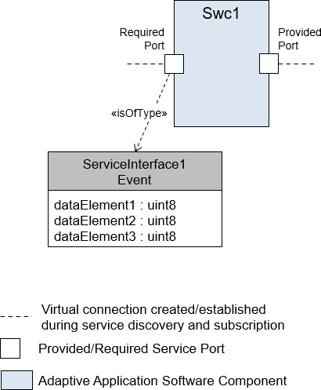{width="2.348957786526684in" height="2.8473950131233594in"}

**Figure 3.23:** []{#_bookmark97 .anchor}**The SWC used by the Occurrence Expression Example**


Since the timing is described for a software component in the Virtual Functional Bus view, the [VfbTiming](#_bookmark37) is used for specifying the corresponding timing model, namely the Virtual Functional Bus Timing View. And this timing model shall only contain timing description events related to the Virtual Functional Bus as described in section [3.5.2.1](#tdeventvfb).

> 由于软件组件的时序在虚拟功能总线视图中被描述，因此[VfbTiming](#_bookmark37)用于指定相应的时序模型，即虚拟功能总线时序视图。这个时序模型只应包含与第3.5.2.1节所描述的虚拟功能总线相关的时序描述事件。


The complex event *EC* occurs when the following conditions are fulfilled:

> 当以下条件得到满足时，复杂事件*EC*就会发生：


**Condition1** Either atomic timing event *E1* or *E2* shall occur. In this example, *E1* and *E2* are atomic timing events [TDEventVariableDataPrototype](#_bookmark79) which occur when the VariableDataPrototypes called *DE1* and *DE2* are received on PortPrototype called *Required Port* of the component called *Swc1*.

> **条件1**：当变量数据原型*DE1*和*DE2*在组件*Swc1*的端口原型*Required Port*上接收时，原子计时事件*E1*或*E2*应发生。


**Condition2** The value of the VariableDataPrototype called *DE3* shall be greater than 3.

> 变量数据原型DE3的值必须大于3。


**Condition3** The VariableDataPrototypes called *DE1* and *DE2* shall become available at the *required* PortPrototype called *RequiredPort* within a time interval of maximum 0.5 milliseconds.

> 条件3：变量数据原型* DE1*和* DE2*必须在名为* RequiredPort*的所需端口内在最多0.5毫秒的时间间隔内可用。


The complex event *EC* would be described by the following occurrence expression:

> 复杂事件*EC*将由以下发生表达式描述：

```
1 // Condition 1

2 ( TIMEX_occurs( /example/expression/E1 )

3 \|\| TIMEX_occurs( /example/expression/E2 ) )

4 // Condition 2

5 && TIMEX_value( /example/expression/EC/DE3 ) \> 3

6 // Condition 3

7 && abs( TIMEX_timeSinceLastOccurrence( /example/expression/E1 ) -

8 TIMEX_timeSinceLastOccurrence( /example/expression/E2 ) ) \<= 0.0005
```

**Listing 3.1: Event Occurrence Filter**


Due to the first condition the complex event *EC* can only occur when one of the atomic timing events *E1* or *E2* occurs at the point in time of evaluation. Thus, this expression satisfies the semantics constraint defined in [[constr_4570](#_bookmark95)]. Figure [3.26](#_bookmark106) shows a measurement of the event occurrences.

> 由于第一个条件，复杂事件*EC*只有在评估时刻发生原子计时事件*E1*或*E2*中的一个时才能发生。因此，此表达式满足[[constr_4570](#_bookmark95)]中定义的语义约束。图[3.26](#_bookmark106)显示了事件发生的测量结果。


The corresponding AUTOSAR ARXML file fragment for the complex event *EC* has the following appearance:

> 对应的AUTOSAR ARXML文件片段为复杂事件*EC*具有以下外观：


[[]{#_bookmark100 .anchor}]{#_bookmark99 .anchor}**Table 3.27: TDE**[]{#_bookmark98 .anchor}**ventOccurrenceExpression**

> 表3.27：TDE**ventOccurrenceExpression**


[]{#_bookmark103 .anchor}**Table 3.28: TDEventOccurrenceExpress**[]{#_bookmark101 .anchor}**ionFormula**

> 表3.28：TDEventOccurrence表达式式

{width="6.937749343832021in" height="2.506666666666667in"}

**Table** []{#_bookmark102 .anchor}**3.29: AutosarVariableInstance**

**Table 3.30: AutosarOperationArgumentInstance**

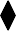

**Figure 3.24: The required context information to reference a variable instance within AUTOSAR.**


**Figure 3.25: The required context information to reference an operation argument instance within AUTOSAR.**

### Occurrence Expression Language Syntax


The occurrence expression language is based on the syntax of the formula language defined in the Generic Structure Template [[7](#_bookmark6)]. It extends the language by additional functions and additional references to model elements. In the following, the implications of the extensions to the syntax are presented based on the grammar definition.

> 表达式语言的发生基于在通用结构模板中定义的公式语言的语法[[7](#_bookmark6)]。它通过额外的功能和额外的模型元素引用来扩展语言。在下面，基于语法定义，将介绍扩展对语法的影响。


Note: The grammar defined for the formula language is not part of the listing below. It presents only the timing specific extensions of the formula language and the enhanced functions and references.

> 注意：下面列出的不是公式语言的定义语法。它只提供公式语言的定时特定扩展以及增强的函数和引用。

### Interpreting an Occurrence Expression


Based on the specification mechanism described in the previous sections it is possible to use the occurrence expression formula to refine the timing specification to the intended precision. This section describes how such an occurrence expression has to be interpreted. The duty of the interpreter is to determine the occurrences of the Tim-

> 根据前面几节描述的规范机制，可以使用发生表达式来细化时间规范到预期的精度。本节介绍了如何解释这样的发生表达式。解释器的职责是确定Tim的发生情况。


ingDescriptionEvent for which the occurrence expression is defined. This is done in two ways, depending on whether the occurrence expression is used as a content filter or as a complex event.

> 事件的发生表达式定义的ingDescriptionEvent。这有两种方式，取决于发生表达式是用作内容过滤器还是用作复杂事件。

### Interpreting a Content Filter


In this case, the occurrence expression is defined for an atomic event. Only the unary timing function *TIMEX_value(\<reference to argument or variable\>)* is allowed to be used for the content filter. On each occurrence of the atomic event the interpreter checks whether the content filter defined by the expression is fulfilled. This is done by evaluating the function *TIMEX_value* based on its operand type:

> 在这种情况下，发生表达式是为原子事件定义的。只允许使用单一定时功能*TIMEX_value（\<引用参数或变量\>）*作为内容过滤器。在每次原子事件发生时，解释器会检查由表达式定义的内容过滤器是否得到满足。这是通过根据其操作数类型评估函数*TIMEX_value*来完成的：


**AutosarVariableInstance** the value of the referenced variable is evaluated at the point in time the atomic event occurs.

> **AutosarVariableInstance** 在原子事件发生的时刻，引用变量的值将被评估。


**AutosarOperationArgumentInstance** the value of the referenced argument is evaluated at the point in time the atomic event occurs.

> **AutosarOperationArgumentInstance** 在原子事件发生的时刻，引用参数的值被评估。


**[constr_4592]**{DRAFT} **Restricted usage of** [**AutosarVariableInstance**](#_bookmark102) **for Content Filter** *[*If a content filter is defined for an atomic event then references to [Au-](#_bookmark102) [tosarVariableInstance](#_bookmark102)s are only allowed if the atomic event is of type [TDEvent-](#_bookmark79) [VariableDataPrototype](#_bookmark79). Only if such an atomic event occurs, the value of the variables can be evaluated. Thus, also the scope of the atomic event shall be the same as the [AutosarVariableInstance](#_bookmark102), meaning that they shall point to the same VariableDataPrototype.*♩()*

> 如果为原子事件定义了内容过滤器，则仅允许引用[Au-](#_bookmark102) [tosarVariableInstance](#_bookmark102)，如果原子事件的类型为[TDEvent-](#_bookmark79) [VariableDataPrototype](#_bookmark79)。只有在发生这样的原子事件时，才能评估变量的值。因此，原子事件的范围也应与[AutosarVariableInstance](#_bookmark102)相同，即它们应指向相同的VariableDataPrototype。


**[constr_4572]**{DRAFT} **Restricted usage of [AutosarOperationArgumentIn-](#_bookmark103) [stance](#_bookmark103) for Content Filter** *[*If a content filter is defined for an atomic event then references to [AutosarOperationArgumentInstance](#_bookmark103)s are only allowed if the atomic event is of type [TDEventOperation](#_bookmark80). Only if such an atomic event occurs, the value of the operation arguments can be evaluated. Thus, also the scope of the atomic event shall be the same as the [AutosarOperationArgumentInstance](#_bookmark103), meaning that they shall point to the same ClientServerOperation. Finally, references to an [AutosarOperationArgumentInstance](#_bookmark103) with argument direction "out" are only allowed, if the atomic event of type [TDEventOperation](#_bookmark80) refers either to the point in time when the operation call response has been sent (TD-EVENT-OPERATIONTYPE=OPERATION-CALL-RESPONSE-SENT) or to the point in time when the operation call response has been received (TD-EVENT-OPERATION-TYPE=OPERATIONCALL-RESPONSE-RECEIVED).*♩()*

> 限制对[AutosarOperationArgumentInstance](#_bookmark103)的使用，用于内容过滤。如果为原子事件定义了内容过滤器，则只有当原子事件的类型为[TDEventOperation](#_bookmark80)时，才允许引用[AutosarOperationArgumentInstance](#_bookmark103)。只有在发生此类原子事件时，才能评估操作参数的值。因此，原子事件的范围也应与[AutosarOperationArgumentInstance](#_bookmark103)相同，即它们应指向相同的ClientServerOperation。最后，只有当类型为[TDEventOperation](#_bookmark80)的原子事件指向操作调用响应已发送（TD-EVENT-OPERATIONTYPE=OPERATION-CALL-RESPONSE-SENT）或操作调用响应已接收（TD-EVENT-OPERATION-TYPE=OPERATIONCALL-RESPONSE-RECEIVED）的时间点时，才允许引用具有参数方向“输出”的[AutosarOperationArgumentInstance](#_bookmark103)。

### Interpreting a Complex Event


In this case, the occurrence expression is defined for a complex event. All features of the occurrence expression language can be used for this expression type. At a specific

> 在这种情况下，发生表达式是为复杂事件定义的。发生表达式语言的所有特性都可以用于此表达式类型。在特定时间，


point in time *t*, the interpreter evaluates the expression to determine if the complex event has occurred.

> 在时间点*t*，解释器会评估表达式以确定复杂事件是否已发生。


Considering the occurrence expression defined for the example given in Section [3.5.2.5.1](#specifying-an-occurrence-expression), the interpreter "implements" a function *EC(t)* which returns TRUE, if the complex event EC occurs at time *t* :

> 考虑在[3.5.2.5.1](#specifying-an-occurrence-expression)节给出的示例中定义的发生表达式，解释器“实现”一个函数*EC(t)*，它在时间*t*时返回TRUE，如果复杂事件EC发生。

```

```


Since the expression satisfies [[constr_4570](#_bookmark95)], it shall only be evaluated at occurrence times of *E1* or *E2*, because only then the complex event *EC* can occur and the expression can return TRUE.

> 由于表达式满足[[constr_4570](#_bookmark95)]，它只能在*E1*或*E2*发生时被评估，因为只有这样复杂事件*EC*才能发生，表达式才能返回TRUE。


As shown in the sketched trace in Figure [3.26](#_bookmark106) the timing description events called *E1* and *E2* occur at different times. On the left hand side of this figure the two events occur within a time interval of 0*.*0005 seconds. The point in time the given occurrence expression is evaluated is the point in time the event *E2* occurs. The result of the occurrence expression at this point in time, *t~evaluate~* respectively *t~E~*~2~, is TRUE. On the right hand side of this figure the two events do not occur within a time interval of 0*.*0005 seconds. The point in time the given occurrence expression is evaluated is the point in time the event *E1* occurs. The result of the occurrence expression at this point in time, *t~evaluate~* respectively *t~E~*~1~, is FALSE.

> 如图3.26所示，被称为E1和E2的时序描述事件发生在不同的时间。在此图的左侧，这两个事件在0.0005秒的时间间隔内发生。给定发生表达式被评估的时间点是事件E2发生的时间点。在这个时间点，即t evaluate或t E2，发生表达式的结果为TRUE。在此图的右侧，这两个事件不在0.0005秒的时间间隔内发生。给定发生表达式被评估的时间点是事件E1发生的时间点。在这个时间点，即t evaluate或t E1，发生表达式的结果为FALSE。

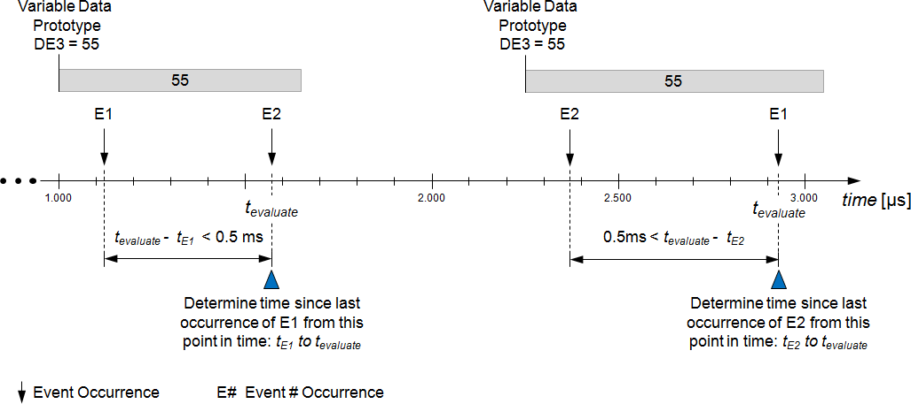{width="6.311770559930009in" height="2.8086450131233596in"}

**Figure 3.26:** []{#_bookmark106 .anchor}**Trace showing various occurrences of the timing description events *E1* and**

***E2*, as well as the value of the variable *DE3*.**


Based on the several functions provided by the occurrence expression language, the interpreter requires the following information from the system:

> 根据出现表达式语言提供的多种功能，解释器需要从系统中获取以下信息：

- the value of a referenced [AutosarOperationArgumentInstance](#_bookmark103) at time *t*.
- the value of a referenced [AutosarVariableInstance](#_bookmark102) at time *t*.
- the occurrences of a referenced TimingDescriptionEvent at time *t* and before.

There are different ways to gather the required information:


- Model analysis and simulation: In a deterministic system environment, occurrences of TimingDescriptionEvents can be determined offline, for example the point in time a frame will be transmitted in the static segment of a FlexRay network.

> 在确定性系统环境中，可以离线确定TimingDescriptionEvents的发生，例如在FlexRay网络的静态段中传输帧的时间点。

- Target trace: The required information can be gathered from a running system by recording the points in time a TimingDescriptionEvent has occurred.

> 目标跟踪：可以通过记录TimingDescriptionEvent发生的时间点从运行系统中收集所需的信息。


If the interpreter has the required information as input, the different functions provided by the occurrence expression language can be interpreted as follows:

> 如果翻译器拥有所需的信息作为输入，发生表达式语言提供的不同功能可以如下解释：


- TIMEX_value(t, \<reference to an [AutosarVariableInstance](#_bookmark102)\>) returns the variable value at time *t*.

> TIMEX_value(t, \<引用[AutosarVariableInstance](#_bookmark102)\>) 在时间*t*时返回变量值。

- TIMEX_value(t, \<reference to an [AutosarOperationArgumentInstance](#_bookmark103)\>) returns the operation argument value at time *t*.

> TIMEX_value(t, \<引用[AutosarOperationArgumentInstance](#_bookmark103)\>)在时间*t*时返回操作参数值。

- TIMEX_occurs(t, \<reference to a TimingDescriptionEvent\>) returns TRUE (or 1) if the referenced event has occurred at time *t*, else it returns FALSE (or 0).

> TIMEX_occurs(t, \<参考TimingDescriptionEvent\>) 如果参考事件在时间*t*发生，则返回TRUE（或1），否则返回FALSE（或0）。

- TIMEX_hasOccurred(t, \<reference to a TimingDescriptionEvent\>) returns TRUE (or 1) if the referenced event has occurred *at least once* before or at time *t*.

> TIMEX_hasOccurred(t, \<引用TimingDescriptionEvent\>) 如果引用的事件在时间t之前或者此刻至少发生过一次，则返回TRUE（或1）。

- TIMEX_timeSinceLastOccurrence(t, \<reference to a TimingDescriptionEvent\>) returns the time difference between *t* and the point in time of the last occurrence of the referenced event. The unit of time is seconds.

> TIMEX_timeSinceLastOccurrence(t, \<引用TimingDescriptionEvent\>)返回*t*和上次发生引用事件的时间点之间的时间差。时间单位为秒。

- TIMEX_angleSinceLastOccurrence(t, \<reference to a TimingDescriptionEvent\>) returns the angle difference between *t* and the point in time of the last occurrence of the referenced event. The unit of angle is degree.

> TIMEX_angleSinceLastOccurrence(t, \<引用的TimingDescriptionEvent\>) 返回*t*与最后一次引用事件发生点之间的角度差，角度的单位为度。

- TIMEX_modeActive(t, \<reference to a TimingModeInstance\>) returns TRUE (or 1) if the referenced mode is active at time *t*, else it returns FALSE (or 0).

> TIMEX_modeActive(t, \<参考TimingModeInstance\>) 在时间*t*时，如果参考模式处于活动状态，则返回TRUE（或1），否则返回FALSE（或0）。

  1. ### Time Base Referencing for Timing Description Events


Please refer to [[8](#_bookmark7)] chapter \"Time Base Referencing for Timing Description Events\".

> 请参考第8章“时间基准引用用于时序描述事件”。

## TimingConstraint

Timing constraints can be applied either on:


- TimingDescriptionEvent: classifies a single event or a group of events with a temporal restriction, for example a period, a latency or a time interval considered as synchronous. Also the direction has to be considered, which means in the semantics of the constraint it matters whether an event source (forward semantics) or an event sink (backward semantics) is considered.

> 事件时序描述：将单个事件或一组事件与时间限制分类，例如一段时期、一个延迟或一个被视为同步的时间间隔。还必须考虑方向，这意味着在约束的语义中，事件源（正向语义）或事件汇（反向语义）是否被考虑都很重要。

- 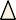TimingDescriptionEventChain: a condition or property for this event chain is set. As the event chain has a semantic of a directed acyclic graph, the direction is obvious, but it matters whether a single event chain or a group of event chains are constrained.

> 事件链的时序描述：为这个事件链设置一个条件或属性。由于事件链具有有向无环图的语义，方向是显而易见的，但是是单一的事件链还是一组事件链受到约束是重要的。

**Figure 3.27: TimingConstraint vs TimingDescriptionEvent**
**Figure 3.28: TimingConstraint vs TimingDescriptionEventChain**


Mentioned in context of a requirement specification, Timing Constraints can be used as functional requirements and therefore can be tested. For usage in context of a performance specification, Timing Constraints can be used as system properties or timing guarantees.

> 在需求规格的上下文中提到，时序约束可以用作功能需求，因此可以进行测试。在性能规范的上下文中使用时，时序约束可以用作系统属性或时序保证。


The following table gives an overview over scope and usage of the different types of Timing Constraints described in the following chapters:

> 以下表格概述了下面章节中描述的不同类型的定时约束的范围和使用情况：

[]{#_bookmark111 .anchor}**Table 3.31: Constraints**

### EventTriggeringConstraint


**[TPS_TIMEX_00071]**{DRAFT} **[EventTriggeringConstraint](#_bookmark111) specifies occurrence behavior respectively model** *[*The element [EventTriggeringConstraint](#_bookmark111) is used to specify the particular occurrences of a given timing description event.*♩([RS\_-](#requirements-traceability) [TIMEX_00001](#requirements-traceability), [RS_TIMEX_00002](#requirements-traceability), [RS_TIMEX_00006](#requirements-traceability), [RS_TIMEX_00008](#_bookmark26))*

> **[TPS_TIMEX_00071]**{草稿} **[EventTriggeringConstraint](#_bookmark111) 分别指定时间描述事件的特定发生** *[*元素[EventTriggeringConstraint](#_bookmark111)用于指定给定时间描述事件的特定发生。*♩([RS\_-](#requirements-traceability) [TIMEX_00001](#requirements-traceability), [RS_TIMEX_00002](#requirements-traceability), [RS_TIMEX_00006](#requirements-traceability), [RS_TIMEX_00008](#_bookmark26))*


AUTOSAR offers five basic types of event triggering as depicted in Figure [3.29](#_bookmark110).

> AUTOSAR提供了五种基本类型的事件触发，如图3.29所示。

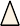+event 0..1


**Figure 3.29:** []{#_bookmark110 .anchor}**The different types of event triggerings**


[[]{#_bookmark113 .anchor}]{#_bookmark114 .anchor}**Table 3.32: EventTriggeringConstraint**

> **表3.32：事件触发约束**

### PeriodicEventTriggering


**[TPS_TIMEX_00076]**{DRAFT} [**PeriodicEventTriggering**](#_bookmark114) **specifies periodic occurrences of events** *[*The element [PeriodicEventTriggering](#_bookmark114) is used to specify the characteristics of a timing description event which occurs periodically.*♩([RS\_-](#requirements-traceability) [TIMEX_00001](#requirements-traceability), [RS_TIMEX_00002](#requirements-traceability), [RS_TIMEX_00006](#requirements-traceability), [RS_TIMEX_00008](#_bookmark26))*

> [TPS_TIMEX_00076]{草稿} [PeriodicEventTriggering]（#_bookmark114）指定事件的周期性发生*（[RS\_-]（#requirements-traceability）[TIMEX_00001]（#requirements-traceability）[RS_TIMEX_00002]（#requirements-traceability）[RS_TIMEX_00006]（#requirements-traceability）[RS_TIMEX_00008]（#_bookmark26））*元素[PeriodicEventTriggering]（#_bookmark114）用于指定定时描述事件的周期性发生的特征。

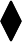

**Figure 3.30: PeriodicEventTriggering**


[[]{#_bookmark116 .anchor}]{#_bookmark115 .anchor}**Table 3.33: PeriodicEventTriggering**

> 表3.33：定期事件触发


The Periodic Event Triggering is characterized by the following parameters:

> 周期性事件触发的特征由以下参数表示：

- Period
- Jitter
- Minimum Inter-Arrival Time


The listed parameters are required ones and are described in the following.

> 以下列出的参数是必需的，并在下面详细说明。


**Period** This parameter [period](#_bookmark115) specifies the periodic distance between subsequent occurrences of the event.

> 此参数[period](#_bookmark115)指定事件之间的周期性距离。


**Jitter** This parameter [jitter](#_bookmark113) specifies the maximum deviation from the period.

> 这个参数[jitter](#_bookmark113)指定了与周期的最大偏差。


**Minimum Inter-Arrival Time** This parameter [minimumInterArrivalTime](#_bookmark116) specifies the minimum distance between subsequent occurrences of the event. Note, that if the value of the parameter [minimumInterArrivalTime](#_bookmark116) is less than the value of the parameter [period](#_bookmark115) minus the value of the parameter [jitter](#_bookmark113), then the parameter [minimumInterArrivalTime](#_bookmark116) has no effect on the properties of the periodic event triggering constraints.

> 最小到达时间。此参数[minimumInterArrivalTime]（＃_bookmark116）指定事件之间的最小距离。注意，如果参数[minimumInterArrivalTime]（＃_bookmark116）的值小于参数[period]（＃_bookmark115）减去参数[jitter]（＃_bookmark113）的值，则参数[minimumInterArrivalTime]（＃_bookmark116）对周期性事件触发约束的属性没有影响。


**[constr_4589]**{DRAFT} **Maximum value of the parameter [minimumInterAr-](#_bookmark116)** [**rivalTime**](#_bookmark116) *[*The value of the parameter [minimumInterArrivalTime](#_bookmark116) shall be less than or equal the value of the parameter [period](#_bookmark115).*♩()*

> 最大值参数[minimumInterArrivalTime](#_bookmark116)的值应小于或等于参数[period](#_bookmark115)的值。


Let *t~n~* be the point-in-time of the *n*-th occurrence of the event. A Periodic Event Triggering Constraint is satisfied if, and only if at least one reference point-in-time *t~reference~* exists such that for every occurrence of the event at *t~n~* the following holds true: *t~reference~* + (*n −* 1)*period ≤ t~n~ ≤ t~reference~* + (*n −* 1)*period* + *jitter* and for all of those event occurrences the minimum distance shall be less than or equal to [mini-](#_bookmark116) [mumInterArrivalTime](#_bookmark116).

> 让*t~n~*表示事件第*n*次发生的时间点。如果存在至少一个参考时间点*t~reference~*，使得对于每一次事件发生在*t~n~*时间点的情况，以下条件都成立：*t~reference~* + (*n −* 1)*period ≤ t~n~ ≤ t~reference~* + (*n −* 1)*period* + *jitter*，并且所有这些事件发生的最小距离都小于或等于[mini-](#_bookmark116)[mumInterArrivalTime](#_bookmark116)，则称周期事件触发约束满足。

```
```


Figure [3.31](#_bookmark117) illustrates the parameters of the [PeriodicEventTriggering](#_bookmark114). The upper part of this figure shows the case that the value of [jitter](#_bookmark113) is less than the value of the parameter [period](#_bookmark115); whereas the lower part of this figure shows the case that the value of [jitter](#_bookmark113) is greater than or equal the value of the parameter [period](#_bookmark115).

> 图3.31说明了PeriodicEventTriggering的参数。图的上半部分展示了抖动值小于周期参数值的情况；而图的下半部分展示了抖动值大于或等于周期参数值的情况。

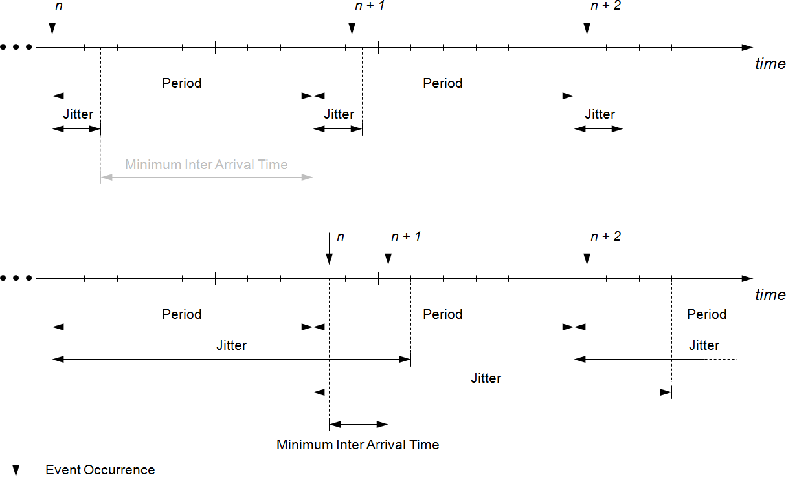{width="6.330583989501313in" height="3.848957786526684in"}

**Figure 3.31:** []{#_bookmark117 .anchor}**Parameters characterizing the Periodic Event Triggering**

### Examples


A Periodic Event Triggering Constraint is specified with the following parameters: [pe-](#_bookmark115) [riod](#_bookmark115) is six milliseconds (6ms) and [jitter](#_bookmark113) is two milliseconds (2ms). In other words, one imposes a timing constraint on an event to occur every six milliseconds and specifies that a deviation of two milliseconds is tolerable. In addition, it is assumed that the [minimumInterArrivalTime](#_bookmark116) is one millisecond (1ms) and therefore has no impact on the timing of the event's occurrences. This timing constraint is shown in Figure [3.32](#_bookmark119). The repeating gray-colored rectangles in this figure indicate the time intervals during which the event may occur; in other words it marks the subsequent time intervals the event is expected to occur.

> 一个周期性事件触发约束由以下参数指定：周期为六毫秒（6ms），抖动为两毫秒（2ms）。换句话说，对事件发生的时间施加约束，要求每六毫秒发生一次，允许偏差为两毫秒。此外，假设最小间隔时间（minimumInterArrivalTime）为一毫秒（1ms），因此不会影响事件发生的时间。该时间约束如图3.32所示。图中重复的灰色矩形表示事件可能发生的时间间隔；换句话说，它标记了事件预期发生的后续时间间隔。

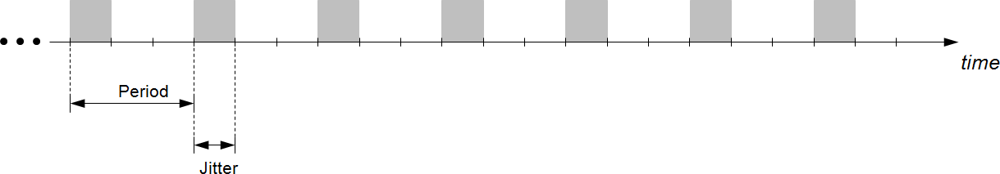{width="6.221978346456693in" height="1.0871872265966753in"}

**Figure 3.32:** []{#_bookmark119 .anchor}**Example of a Periodic Event Triggering Constraint**


The following figures show various event occurrences recorded during the observation of a system subject to analysis. The time interval for the observation is given by *t~end−observation~ −t~start−observation~*. In the given example the system is observed for a period of 33.6 milliseconds.

> 以下数据显示了观察分析系统期间记录的各种事件发生情况。观察的时间间隔由*t~end−observation~ −t~start−observation~*给出。在给定的例子中，系统被观察了33.6毫秒。


The subsequent event occurrences shown in Figure [3.33](#_bookmark120) satisfy the given periodic event triggering constraint, because all occurrences of the event observed during the observation time interval happen in their corresponding time interval given by [period](#_bookmark115) and [jitter](#_bookmark113).

> 图[3.33]中显示的后续事件发生满足给定的周期性事件触发约束，因为观察时间间隔内观察到的事件发生都发生在由[周期](#_bookmark115)和[抖动](#_bookmark113)给定的时间间隔内。

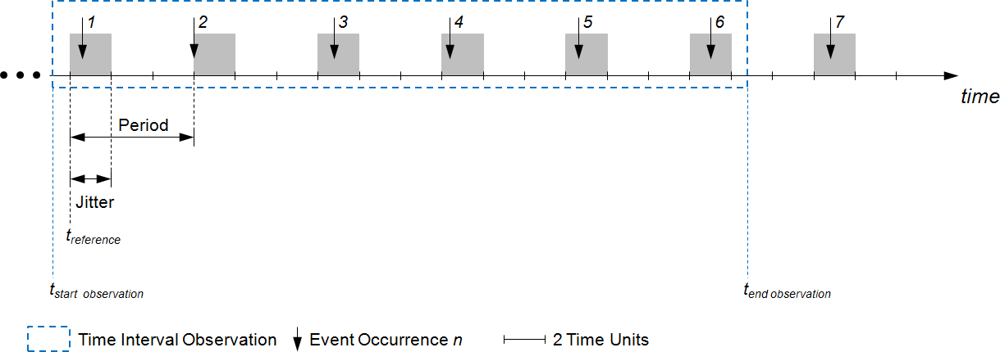{width="6.221978346456693in" height="2.1947911198600174in"}

**Figure 3.33:** []{#_bookmark120 .anchor}**Event occurrences satisfying the given Period Event Triggering Constraint shown in the example at the beginning of this subsection.**


The subsequent event occurrences shown in Figure [3.34](#_bookmark121) satisfy the given periodic event triggering constraint, because all occurrences of the event observed during the observation time interval happen in their corresponding time interval given by [period](#_bookmark115) and [jitter](#_bookmark113). In contrast to the example shown in Figure [3.33](#_bookmark120) the reference point-intime is another one.

> 图[3.34](#_bookmark121)中显示的后续事件发生满足给定的周期性事件触发约束，因为观察时间间隔内观察到的事件发生都发生在由[period](#_bookmark115)和[jitter](#_bookmark113)给出的相应时间间隔内。与图[3.33](#_bookmark120)中的示例相比，参考点时间是另一个。

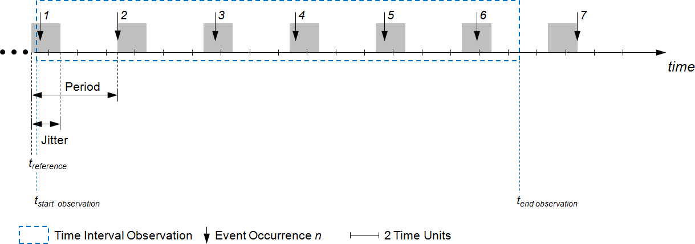{width="6.221978346456693in" height="2.1947911198600174in"}

**Figure 3.34:** []{#_bookmark121 .anchor}**Event occurrences satisfying the given Period Event Triggering Constraint shown in the example at the beginning of this subsection, but with another reference point-in-time** *t~reference~***.**


The subsequent event occurrences shown in Figure [3.35](#_bookmark122) violate the given periodic event triggering constraint, because the fifth occurrence of the event does not happen in its corresponding time interval given by [period](#_bookmark115) and [jitter](#_bookmark113). In other words, there does not exist a reference point-in-time that ensures that all occurrences of the event observed during the observation time interval happen in their corresponding time interval given by [period](#_bookmark115) and [jitter](#_bookmark113). And this results in a violation of the parameters [period](#_bookmark115) and [jitter](#_bookmark113).

> 图3.35中显示的后续事件发生违反了给定的周期性事件触发约束，因为第五次发生的事件没有发生在由[period](#_bookmark115)和[jitter](#_bookmark113)给出的相应时间间隔内。换句话说，不存在一个参考时间点，可以确保观察时间间隔内观察到的所有事件发生在由[period](#_bookmark115)和[jitter](#_bookmark113)给出的相应时间间隔内。这就导致参数[period](#_bookmark115)和[jitter](#_bookmark113)被违反。

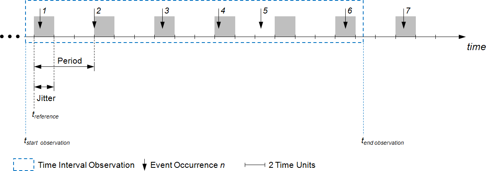{width="6.348957786526684in" height="2.2395833333333335in"}

**Figure 3.35:** []{#_bookmark122 .anchor}**Event occurrences violating the given Period Event Triggering Constraint shown in the example at the beginning of this subsection.**


The subsequent event occurrences shown in Figure [3.36](#_bookmark123) violate the given periodic event triggering constraint, because the fourth occurrence of the event does not happen in its corresponding time interval given by [period](#_bookmark115) and [jitter](#_bookmark113). In other words, the fourth occurrence of the event happens in the time interval the fifth occurrence of the event happens and therefore violates the specified [jitter](#_bookmark113).

> 图3.36中显示的后续事件发生违反了给定的周期性事件触发约束，因为事件的第四次发生没有发生在由[period](#_bookmark115)和[jitter](#_bookmark113)给出的相应时间间隔内。换句话说，事件的第四次发生发生在事件的第五次发生的时间间隔内，因此违反了指定的[jitter](#_bookmark113)。

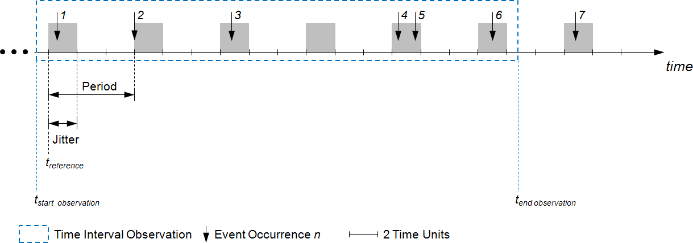{width="6.221978346456693in" height="2.1947911198600174in"}

**Figure 3.36:** []{#_bookmark123 .anchor}**Event occurrences satisfying the given Period Event Triggering Constraint shown in the example at the beginning of this subsection.**

### SporadicEventTriggering


**[TPS_TIMEX_00077]**{DRAFT} **[SporadicEventTriggering](#_bookmark125) specifies sporadic occurrences of events** *[*The element [SporadicEventTriggering](#_bookmark125) is used to specify the characteristics of a timing description event which occurs sporadically.*♩([RS\_-](#requirements-traceability) [TIMEX_00001](#requirements-traceability), [RS_TIMEX_00002](#requirements-traceability), [RS_TIMEX_00006](#requirements-traceability), [RS_TIMEX_00008](#_bookmark26))*

> [TPS_TIMEX_00077]{DRAFT} [SporadicEventTriggering](#_bookmark125) 指定事件偶发发生的特征*[*元素[SporadicEventTriggering](#_bookmark125)用于指定偶发发生的定时描述事件的特征。*♩([RS\_-](#requirements-traceability) [TIMEX_00001](#requirements-traceability), [RS_TIMEX_00002](#requirements-traceability), [RS_TIMEX_00006](#requirements-traceability), [RS_TIMEX_00008](#_bookmark26))*

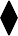
**Figure 3.37: SporadicEventTriggering**


[[[[]{#_bookmark129 .anchor}]{#_bookmark128 .anchor}]{#_bookmark127 .anchor}]{#_bookmark126 .anchor}**Table 3**[]{#_bookmark125 .anchor}**.34: SporadicEventTriggering**

> 表3.34：零星事件触发


This is a generalization of the periodic event triggering described in subsection [3.6.1.1](#periodiceventtriggering). The difference is that the event can, but not necessarily shall occur. For this reason, there is one additional parameter required for the specification of the [Spo-](#_bookmark125) [radicEventTriggering](#_bookmark125), namely the [maximumInterArrivalTime](#_bookmark126), which specifies the largest possible time distance between two event occurrences.

> 这是[3.6.1.1](#periodiceventtriggering)小节中描述的周期性事件触发的概括。不同之处在于事件可以发生，但不一定会发生。因此，需要一个额外的参数来指定[Spo-](#_bookmark125) [radicEventTriggering](#_bookmark125)，即[maximumInterArrivalTime](#_bookmark126)，它指定两次事件发生之间最大的时间距离。


The Sporadic Event Triggering is characterized by the following parameters:

> 触发偶发事件的特征由以下参数表示：

- Minimum Inter-Arrival Time
- Maximum Inter-Arrival Time
- Period
- Jitter


The first two parameters are required ones and the last two parameters are optional. These parameters are described in the following and Figure [3.38](#_bookmark130) illustrates the parameters of the [SporadicEventTriggering](#_bookmark125).

> 第一两个参数是必需的，最后两个参数是可选的。下面描述这些参数，图3.38描述了[SporadicEventTriggering](#_bookmark125)的参数。


**Minimum Inter-Arrival Time** This parameter [minimumInterArrivalTime](#_bookmark127) specifies the minimum distance between subsequent occurrences of the event.

> **最小到达间隔时间**此参数[minimumInterArrivalTime](#_bookmark127)指定事件之间的最小距离。


**Maximum Inter-Arrival Time** This parameter [maximumInterArrivalTime](#_bookmark126) specifies the maximum distance between subsequent occurrences of the event.

> 最大到达时间：此参数[maximumInterArrivalTime](#_bookmark126)指定事件之间的最大距离。


**Period** This optional parameter [period](#_bookmark128) specifies the periodic distance between subsequent occurrences of the event.

> **期间** 这个可选参数[period](#_bookmark128)指定事件之间的周期性距离。


**Jitter** This optional parameter [jitter](#_bookmark129) specifies the maximum deviation from the period.

> **抖动** 这个可选参数[抖动](#_bookmark129)指定了与周期的最大偏差。

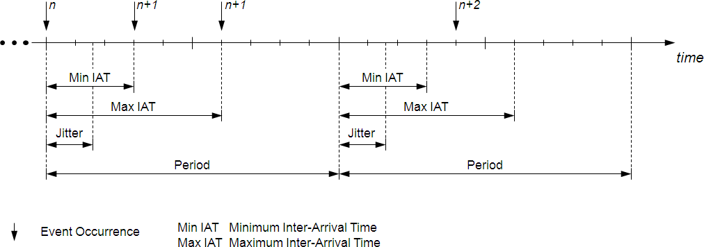{width="6.2195833333333335in" height="2.1879166666666667in"}
**Figure 3.38:** []{#_bookmark130 .anchor}**Parameters characterizing the Sporadic Event Triggering**

### ConcretePatternEventTriggering


**[TPS_TIMEX_00078]**{DRAFT} **[ConcretePatternEventTriggering](#_bookmark132) specifies concrete pattern of occurrences of events** *[*The element [ConcretePattern-](#_bookmark132) [EventTriggering](#_bookmark132) is used to specify the characteristics of a timing description event which occurs as a concrete pattern.*♩([RS_TIMEX_00001](#requirements-traceability), [RS_TIMEX_00002](#requirements-traceability), [RS\_-](#requirements-traceability) [TIMEX_00006](#requirements-traceability), [RS_TIMEX_00008](#_bookmark26))*

> **[TPS_TIMEX_00078]**{草稿} **[ConcretePatternEventTriggering](#_bookmark132) 指定事件发生的具体模式** *[*元素[ConcretePattern-](#_bookmark132) [EventTriggering](#_bookmark132) 用于指定定时描述事件的特征，该事件以具体模式发生。*♩([RS_TIMEX_00001](#requirements-traceability), [RS_TIMEX_00002](#requirements-traceability), [RS\_-](#requirements-traceability) [TIMEX_00006](#requirements-traceability), [RS_TIMEX_00008](#_bookmark26))*

This describes events which occur following a known pattern.

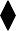
**Figure 3.39: ConcretePatternEventTriggering**


[[[[]{#_bookmark136 .anchor}]{#_bookmark135 .anchor}]{#_bookmark134 .anchor}]{#_bookmark133 .anchor}**Table 3.35: Con**[]{#_bookmark132 .anchor}**cretePatternEventTriggering**

> 表3.35：混凝土模式事件触发


The Concrete Pattern Event Triggering is characterized by the following parameters:

> 具体模式事件触发的特征由以下参数表示：

- Pattern Length
- Offset
- Pattern Period
- Pattern Jitter


The first two parameters are required ones, whereas the two last parameters are optional. The parameters are described in the following and are illustrated in Figure [3.40](#_bookmark137) and Figure [3.41](#_bookmark138).

> 第一两个参数是必需的，而最后两个参数是可选的。参数在下面描述，并在图3.40和图3.41中有所说明。


**Pattern Length** This parameter [patternLength](#_bookmark133) specifies the time interval the pattern occurs in.

> 此参数[patternLength](#_bookmark133)指定模式发生的时间间隔。


**Offset** This parameter [offset](#_bookmark134) specifies a list of point-in-times in the time interval given by the parameter [patternLength](#_bookmark133) at which the event occurs.

> 此参数[offset](#_bookmark134)指定参数[patternLength](#_bookmark133)给出的时间间隔中，事件发生的一系列时刻点。


**Pattern Period** This optional parameter [patternPeriod](#_bookmark135) specifies the time distance between the beginnings of subsequent repetitions of the given burst pattern.

> **模式周期**这个可选参数[patternPeriod](#_bookmark135)指定给定突发模式的后续重复开始之间的时间距离。


**Pattern Jitter** This optional parameter [patternJitter](#_bookmark136) specifies the maximum deviation of the time interval's starting point from the beginning of the given period. This parameter is only applicable in conjunction with the parameter [patternPe-](#_bookmark135) [riod](#_bookmark135).

> **模式抖动**此可选参数[patternJitter](#_bookmark136)指定时间间隔的起始点与给定周期开始点之间的最大偏差。此参数仅适用于参数[patternPe-](#_bookmark135) [riod](#_bookmark135)。


The constraints listed below apply to the [ConcretePatternEventTriggering](#_bookmark132) and shall be considered when using this event triggering constraint.

> 以下约束适用于[ConcretePatternEventTriggering](#_bookmark132)，在使用此事件触发约束时应考虑。


**[constr_4585]**{DRAFT} **Specifying** [**patternLength**](#_bookmark133) *[*The [patternLength](#_bookmark133) shall be specified such that the following holds: 0 *≤ max*([offset](#_bookmark134)) *≤* [patternLength](#_bookmark133).*♩()*

> [patternLength](#_bookmark133)必须指定，以便满足以下条件：0 ≤ max（[offset](#_bookmark134)）≤ [patternLength](#_bookmark133)。


**[constr_4590]**{DRAFT} **Specifying [patternLength](#_bookmark133), [patternJitter](#_bookmark136) and [pat-](#_bookmark135) [ternPeriod](#_bookmark135)** *[*The pattern length, pattern jitter and pattern period shall be specified such that the following holds: [patternLength](#_bookmark133) + [patternJitter](#_bookmark136) *\<* [patternPeriod](#_bookmark135).*♩()*

> 指定模式长度、模式间隔和模式周期，使得以下条件成立：模式长度 + 模式间隔 < 模式周期。

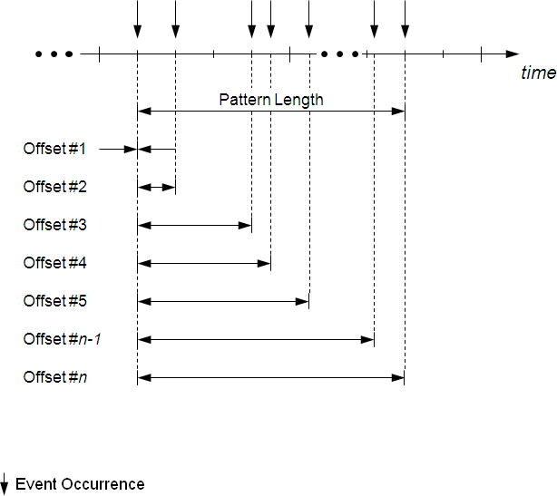{width="4.285207786526684in" height="3.817603893263342in"}

**Figure 3.40:** []{#_bookmark137 .anchor}**Parameters characterizing the Concrete Pattern Event Triggering**

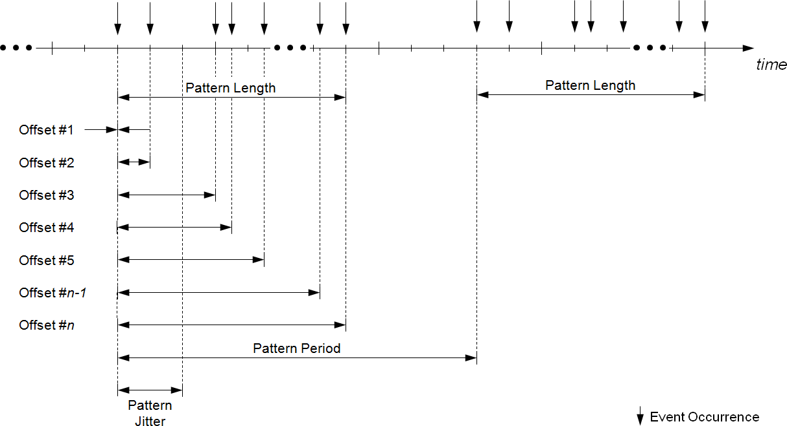{width="6.196457786526684in" height="3.3636450131233597in"}

**Figure 3.41:** []{#_bookmark138 .anchor}**Parameters characterizing the Concrete Pattern Event Triggering when periodically being repeated**

### BurstPatternEventTriggering


**[TPS_TIMEX_00079]**{DRAFT} **[BurstPatternEventTriggering](#_bookmark140) specifies burst of occurrences of events** *[*The element [BurstPatternEventTriggering](#_bookmark140) is used to specify the characteristics of a timing description event which occurs as a burst.*♩ ([RS_TIMEX_00001](#requirements-traceability), [RS_TIMEX_00002](#requirements-traceability), [RS_TIMEX_00006](#requirements-traceability), [RS_TIMEX_00008](#_bookmark26))*

> **[TPS_TIMEX_00079]**{草稿} **[BurstPatternEventTriggering](#_bookmark140) 指定事件突发发生** *[*元素 [BurstPatternEventTriggering](#_bookmark140) 用于指定作为突发发生的定时描述事件的特性。*♩ ([RS_TIMEX_00001](#requirements-traceability), [RS_TIMEX_00002](#requirements-traceability), [RS_TIMEX_00006](#requirements-traceability), [RS_TIMEX_00008](#_bookmark26))*


The purpose of the [BurstPatternEventTriggering](#_bookmark140) is to describe a burst of occurrences of one and the same event. The Burst Pattern Event Triggering is characterized by the following parameters:

> [BurstPatternEventTriggering](#_bookmark140)的目的是描述同一事件的突发发生。突发模式事件触发的特征参数如下：

- Pattern Length
- Minimum Inter Arrival Time
- Maximum Number of Occurrences
- Minimum Number of Occurrences
- Pattern Period
- Pattern Jitter


The first three parameters are required ones, whereas the last three parameters are optional.

> 第一三个参数是必需的，而最后三个参数是可选的。

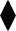

**Figure 3.42: BurstPatternEventTriggering**


[[[[[[]{#_bookmark146 .anchor}]{#_bookmark145 .anchor}]{#_bookmark144 .anchor}]{#_bookmark143 .anchor}]{#_bookmark142 .anchor}]{#_bookmark141 .anchor}**Table 3.36:** []{#_bookmark140 .anchor}**BurstPatternEventTriggering**

> 表3.36：突发模式事件触发


The parameters are described in the following and are illustrated in Figure [3.43](#_bookmark147) and Figure [3.44](#_bookmark148).

> 参数在下面描述，并在图3.43和图3.44中有所说明。


**Pattern Length** This parameter [patternLength](#_bookmark141) specifies the duration of the time interval within which the event repeatedly occurs. The event occurs at arbitrary points in time within the given time interval.

> **模式长度**此参数[patternLength](#_bookmark141)指定事件反复发生的时间间隔的持续时间。事件在给定的时间间隔内任意时间点发生。


**Minimum Inter-Arrival Time** This parameter [minimumInterArrivalTime](#_bookmark142) specifies the minimum distance between subsequent occurrences of the event within the given time interval.

> 最小到达间隔时间。此参数[minimumInterArrivalTime](#_bookmark142)指定在给定时间间隔内事件的后续发生之间的最小距离。


**Maximum Number of Occurrences** This parameter [maxNumberOfOccurrences](#_bookmark143) specifies the maximum number of times the event can occur within the time interval. In other words, the event may never occur or any number of times between one (1) and the specified maximum number of occurrences. If the parameter [minNumberOfOccurrences](#_bookmark144) is specified then the event occurs at least the number of times specified by [minNumberOfOccurrences](#_bookmark144) and at maximum by [maxNumberOfOccurrences](#_bookmark143).

> 此参数[maxNumberOfOccurrences](#_bookmark143)指定事件在时间间隔内可以发生的最大次数。换句话说，事件可能永远不会发生，也可以在一（1）到指定的最大发生次数之间发生任意次数。如果指定了参数[minNumberOfOccurrences](#_bookmark144)，则事件至少发生[minNumberOfOccurrences](#_bookmark144)次，最多发生[maxNumberOfOccurrences](#_bookmark143)次。


**Minimum Number of Occurrences** This optional parameter [minNumberOfOccur-](#_bookmark144) [rences](#_bookmark144) specifies the minimum number of times the event occurs within the given time interval. In other words, this parameter specifies the minimum number of times the event occurs in the given time interval. The value zero (0) for this parameter is permitted.

> **最小出现次数** 这个可选参数指定了在给定的时间间隔内事件发生的最少次数。换句话说，这个参数指定了在给定的时间间隔内事件发生的最少次数。该参数的值可以为零。


**Pattern Period** This optional parameter [patternPeriod](#_bookmark145) specifies the time distance between the beginnings of subsequent repetitions of the given burst pattern.

> **模式周期**此可选参数[patternPeriod](#_bookmark145)指定给定突发模式之间隔的时间距离。


**Pattern Jitter** This optional parameter [patternJitter](#_bookmark146) specifies the maximum deviation of the time interval's starting point from the beginning of the given period. This parameter is only applicable in conjunction with the parameter [patternPe-](#_bookmark145) [riod](#_bookmark145).

> 模式抖动：此可选参数[patternJitter]（＃_bookmark146）指定时间间隔起始点与给定周期开始点之间的最大偏差。此参数仅适用于参数[patternPeriod]（＃_bookmark145）[riod]（＃_bookmark145）。


The constraints listed below apply to the [BurstPatternEventTriggering](#_bookmark140) and shall be considered when using this event triggering constraint.

> 以下列出的约束适用于[BurstPatternEventTriggering](#_bookmark140)，在使用此事件触发约束时应考虑这些约束。


**[constr_4574]**{DRAFT} **Specifying minimum and maximum number of occurrences** *[*The minimum and maximum number of occurrences shall be specified such that the following holds: 0 *≤* [minNumberOfOccurrences](#_bookmark144) *≤* [maxNumberOfOccurrences](#_bookmark143).*♩()*

> **[constr_4574]**{草案} **指定最小和最大出现次数** *[*最小和最大出现次数应指定为：0 *≤* [minNumberOfOccurrences](#_bookmark144) *≤* [maxNumberOfOccurrences](#_bookmark143)。*♩()*


**[constr_4575]**{DRAFT} **Specifying minimum inter-arrival time and pattern length** *[*The minimum inter-arrival time and pattern length shall be specified such that the following holds: 0 *\<* [minimumInterArrivalTime](#_bookmark142) *≤* [patternLength](#_bookmark141).*♩()*

> **[constr_4575]**{草案} **指定最小到达时间和模式长度** *[*最小到达时间和模式长度应指定为满足以下条件：0 *\<* [minimumInterArrivalTime](#_bookmark142) *≤* [patternLength](#_bookmark141)。*♩()*


**[constr_4576]**{DRAFT} **Specifying pattern length, pattern jitter and patter period** *[*The pattern length, pattern jitter and pattern period shall be specified such that the following holds: [patternLength](#_bookmark141) + [patternJitter](#_bookmark146) *\<* [patternPeriod](#_bookmark145).*♩()*

> **[constr_4576]**{草案} **指定模式长度、模式颤动和模式周期** *[*模式长度、模式颤动和模式周期应指定为满足以下条件：[patternLength](#_bookmark141) + [patternJitter](#_bookmark146) *\<* [patternPeriod](#_bookmark145).*♩()*

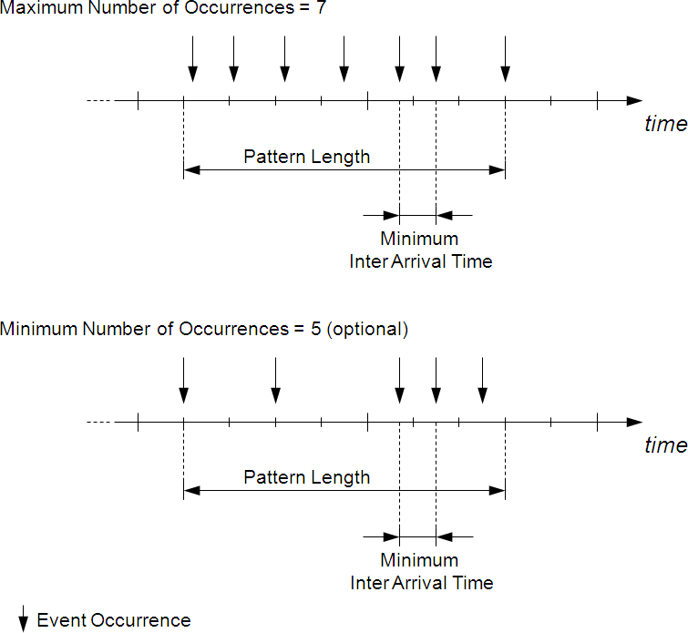{width="4.960728346456693in" height="4.560937226596676in"}

**Figure 3.43:** []{#_bookmark147 .anchor}**Parameters characterizing the Burst Pattern Event Triggering**

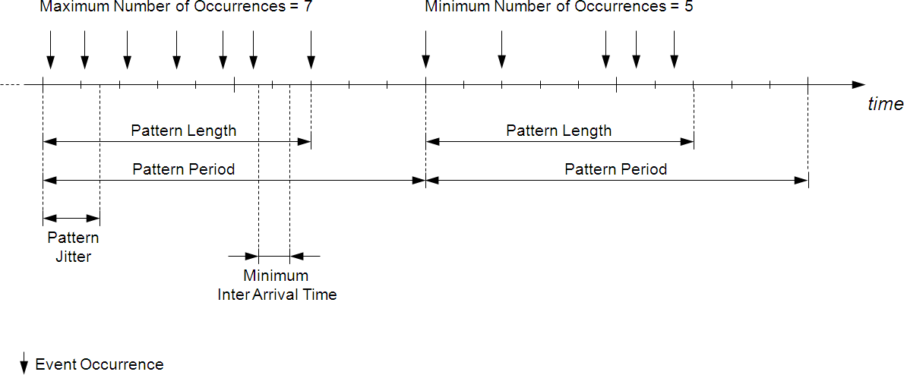{width="6.197916666666667in" height="2.5729166666666665in"}

**Figure 3.44:** []{#_bookmark148 .anchor}**Parameters characterizing the Burst Pattern Event Triggering when periodically being repeated**

### ArbitraryEventTriggering


**[TPS_TIMEX_00080]**{DRAFT} **[ArbitraryEventTriggering](#arbitraryeventtriggering) specifies arbitrary occurrences of an event** *[*The element [ArbitraryEventTriggering](#arbitraryeventtriggering) is used to specify the characteristics of a timing description event which occurs arbitrarily.*♩([RS\_-](#requirements-traceability) [TIMEX_00001](#requirements-traceability), [RS_TIMEX_00002](#requirements-traceability), [RS_TIMEX_00006](#requirements-traceability), [RS_TIMEX_00008](#_bookmark26))*

> **[TPS_TIMEX_00080]**{草案}**[ArbitraryEventTriggering](#arbitraryeventtriggering) 指定事件的任意发生** *[*元素[ArbitraryEventTriggering](#arbitraryeventtriggering) 用于指定定时描述事件的特征，该事件可以任意发生。*♩([RS\_-](#requirements-traceability) [TIMEX_00001](#requirements-traceability), [RS_TIMEX_00002](#requirements-traceability), [RS_TIMEX_00006](#requirements-traceability), [RS_TIMEX_00008](#_bookmark26))*

This describes the occasional occurrence of a timing event.

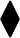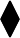+minimumDistance 0..1

**Figure 3.45: ArbitraryEventTriggering**

[]{#_bookmark152 .anchor}**Table 3.37: ArbitraryEventTriggering**

**Table 3.38: ConfidenceInterval**


In contrast to the [ConcretePatternEventTriggering](#_bookmark132), this event triggering is not as strict to the occurrence of an event, but generally describes event occurrences.

> 相比于[ConcretePatternEventTriggering](#_bookmark132)，这种事件触发不那么严格地限制事件发生，而是更加广泛地描述事件发生。


The Arbitrary Event Triggering is characterized by the following parameters:

> 触发任意事件的特征由以下参数表示：

- Minimum Distance
- Maximum Distance


These parameters are required ones and are described in the following. Figure [3.46](#_bookmark153) illustrates the parameters of the [ArbitraryEventTriggering](#arbitraryeventtriggering).

> 这些参数是必需的，并在下面描述。图3.46说明了ArbitraryEventTriggering的参数。


**Minimum Distance** The parameter [minimumDistance](#_bookmark152) specifies the minimum distance between *n* subsequent event occurrences, and *n* = 2*,* 3*,* 4*, \...*

> **最小距离**参数[minimumDistance](#_bookmark152)指定*n*个连续事件发生之间的最小距离，其中*n* = 2*，3*，4*，\...*


**Maximum Distance** The parameter [maximumDistance](#arbitraryeventtriggering) specifies the maximum distance between *n* subsequent event occurrences, and *n* = 2*,* 3*,* 4*, \...*

> **最大距离**参数[maximumDistance](#arbitraryeventtriggering)指定*n*次连续事件发生之间的最大距离，其中*n* = 2*,* 3*,* 4*, \...*

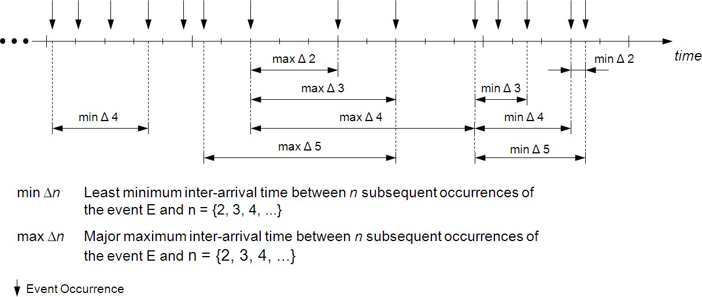{width="6.196457786526684in" height="2.6286450131233594in"}

**Figure 3.46:** []{#_bookmark153 .anchor}**Parameters characterizing the Arbitrary Event Triggering**

### LatencyTimingConstraint


**[TPS_TIMEX_00072]**{DRAFT} **[LatencyTimingConstraint](#_bookmark157) specifies latency constraints** *[*The element [LatencyTimingConstraint](#_bookmark157)[^1^](#_bookmark155) is used to specify the amount of time that elapses between the occurrence of any two timing description events.*♩([RS_TIMEX_00001](#requirements-traceability), [RS_TIMEX_00002](#requirements-traceability), [RS_TIMEX_00012](#_bookmark27))*

> **[TPS_TIMEX_00072]**{草案} **[LatencyTimingConstraint](#_bookmark157) 指定延迟约束** *[*元素[LatencyTimingConstraint](#_bookmark157)[^1^](#_bookmark155) 用于指定任何两个时间描述事件之间发生的时间间隔。*♩([RS_TIMEX_00001](#requirements-traceability), [RS_TIMEX_00002](#requirements-traceability), [RS_TIMEX_00012](#_bookmark27))*


For example, this can be the time it takes for a packet of data on a bus network to get from one designated point to another, or the time it takes for a function/task to be executed on a processor.

> 例如，这可以是总线网络中数据包从一个指定点到另一个指定点所需的时间，或者是处理器上执行功能/任务所需的时间。


In the timing specification a [LatencyTimingConstraint](#_bookmark157) is associated with one TimingDescriptionEventChain, and specifies the minimum and/or maximum time duration between the occurrence of the stimulus and the occurrence of the corresponding response of that chain. However, in multi-rate networks, data can get lost or get duplicated because of potential different producer and consumer periods. Data loss occurs, if the consumer's period is greater than the producer's period (undersampling). Accordingly, data duplication occurs, if the consumer's period is smaller than the producer's period (oversampling). This is depicted in figure [3.47](#_bookmark156).

> 在时序规范中，每个[延迟时序约束](#_bookmark157)与一个时序描述事件链相关联，并指定刺激发生与相应链响应发生之间的最小/最大时间持续时间。然而，在多率网络中，由于可能存在不同的生产者和消费者周期，数据可能会丢失或重复。如果消费者的周期大于生产者的周期（欠采样），则会发生数据丢失。因此，如果消费者的周期小于生产者的周期（过采样），则会发生数据重复。这在图[3.47](#_bookmark156)中描述。

1[]{#_bookmark155 .anchor}A synonym for delay

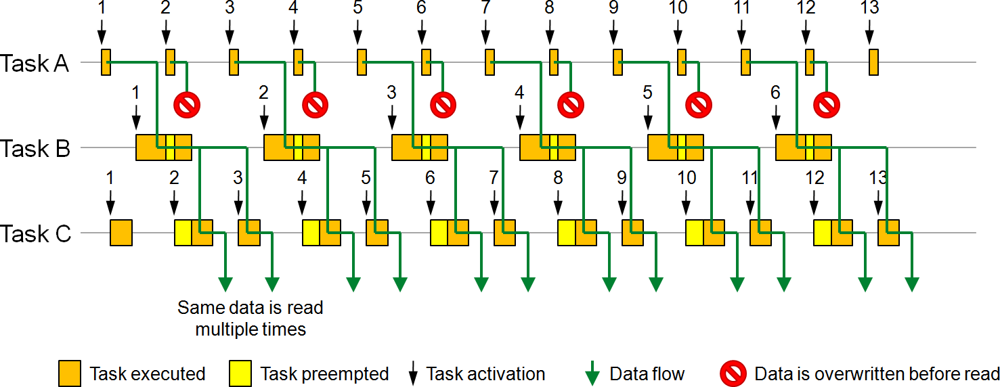{width="6.012989938757655in" height="2.323748906386702in"}

**Figure 3.47:** []{#_bookmark156 .anchor}**Loss and duplication of data due to underand oversampling.**


Considering underand oversampling, two end-to-end latency semantics are of interest for automotive systems and can thus be expressed with the AUTOSAR timing extensions. These are the *age* of a certain response and the *reaction* to a certain stimulus.

> 考虑到抽样和过采样，汽车系统有两种端到端延迟语义有兴趣，因此可以使用AUTOSAR定时扩展表达。这些是某种反应的*年龄*和对某种刺激的*反应*。


The *data age timing constraint* is mainly important in control engineering, but may appear in all domains. Here the focus is from the response perspective rather than from the stimulus perspective. In other words, the assumption is that last is best, i.e., it is accepted/tolerated that a value is overwritten along the path from stimulus to response. When for example an actuator value is periodically updated, it is of importance that the corresponding input values are not too old. In this case the constrained time of importance is the delay from the latest stimulus to a given response.

> 数据时间约束在控制工程中主要很重要，但可能出现在所有领域。这里的重点是从响应的角度而不是从刺激的角度。换句话说，假设最后一次是最好的，即接受/容忍一个值沿着从刺激到响应的路径被覆盖。例如，当执行器值定期更新时，重要的是相应的输入值不要太旧。在这种情况下，重要的约束时间是从最新刺激到给定响应的延迟。


The *reaction time constraint* is utilized when the first reaction to a stimulus is of importance. This is usually the case in body electronics, but may also be the case in other domains. One example is the time it takes from a button is pressed to the light is switched on. Another example, from the chassis domain, is the time from the brake pedal is pressed until the brakes are activated. In both cases the constrained time of importance is the delay from a given stimulus to the first corresponding response.

> 反应时间约束通常用于对刺激的第一反应至关重要的情况下。这通常是在机电领域的情况，但也可能在其他领域出现。一个例子是从按下按钮到灯亮的时间。另一个例子，来自底盘领域，是从踩下刹车踏板到刹车激活的时间。在这两种情况下，重要的约束时间是从给定刺激到第一个相应反应的延迟。

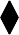

**Figure 3.48: Latency constraint**


[[[]{#_bookmark160 .anchor}]{#_bookmark159 .anchor}]{#_bookmark158 .anchor}**Table 3.**[]{#_bookmark157 .anchor}**39: LatencyTimingConstraint**

> **表3。**39：延迟时间约束

**Table 3.40: LatencyConstraintTypeEnum**


The attributes [minimum](#_bookmark158), [maximum](#_bookmark159), and [nominal](#_bookmark160) of a [LatencyTimingConstraint](#_bookmark157) can be used to define a lower and upper bound, as well as a nominal value for the latency of the event chain in the scope.

> 在范围内，[LatencyTimingConstraint](#_bookmark157)的[最小值](#_bookmark158)、[最大值](#_bookmark159)和[名义值](#_bookmark160)可用于定义事件链的延迟的下限和上限，以及名义值。


The application of latency constraints leads to some interesting observations:

> 应用延迟约束会带来一些有趣的观察：


- In systems without overand under-sampling, *age* and *reaction* are the same. But timing constraints are implementation-independent. Thus, at specification time when the implementation is not necessarily known, the correct latency constraint semantics has to be specified.

> 在没有过采样和欠采样的系统中，年龄和反应是相同的。但是时间约束是实现独立的。因此，在规格时间，当实施不一定已知时，必须指定正确的延迟约束语义。
- The minimum reaction and the minimum age latency of an event chain are always equal.

  1. ### AgeConstraint


Sometimes it is necessary to specify the age of data, when it arrives at a component on its required port with SenderReceiverInterface. If the sender of the data is known, a TimingDescriptionEventChain can be defined from the sender to the receiver port and a [LatencyTimingConstraint](#_bookmark157) with *age* semantic represents the specification of the data age. However, the actual sender of the data may be unknown. In this case the definition of a TimingDescriptionEventChain is not possible.

> 有时需要指定数据的年龄，当它通过SenderReceiverInterface接口到达所需端口时。如果知道数据发送者，可以从发送者到接收端口定义TimingDescriptionEventChain，并使用带有*年龄*语义的LatencyTimingConstraint表示数据年龄的规范。但是，实际的数据发送者可能是未知的。在这种情况下，无法定义TimingDescriptionEventChain。


**[TPS_TIMEX_00073]**{DRAFT} **[AgeConstraint](#_bookmark162) to specify age constraints** *[*The element [AgeConstraint](#_bookmark162) is used to specify a minimum and maximum age that is tolerated when a variable data prototypes is received.*♩([RS_TIMEX_00001](#requirements-traceability))*

> **[TPS_TIMEX_00073]**{草稿}  **[AgeConstraint](#_bookmark162) 来指定年龄限制** *[*元素[AgeConstraint](#_bookmark162)用于指定接收变量数据原型时可接受的最小和最大年龄。*♩([RS_TIMEX_00001](#requirements-traceability))*


Instead of an event chain, the scope of an age constraint is a [TDEventVariableDat-](#_bookmark79) [aPrototype](#_bookmark79). Every time the scoped event occurs, the VariableDataPrototype shall have the specified data age.

> 代替事件链，年龄限制的范围是TDEventVariableDataPrototype。每次范围内的事件发生时，VariableDataPrototype都会具有指定的数据年龄。


At a later stage during the development, when the refined software architecture exposes the relation between the actual sender of the data and the receiver, an event chain between the sending and receiving point in time shall be defined and associ-

> 在软件开发的后期阶段，当经过改进的软件架构暴露出数据的实际发送者和接收者之间的关系时，应该定义发送和接收时间之间的事件链，并将其关联起来。


ated with a [LatencyTimingConstraint](#_bookmark157) (see [3.6.2](#latencytimingconstraint)) in order to refine the previous defined age constraint.

> 为了改进先前定义的时间约束，使用[LatencyTimingConstraint](#_bookmark157)（参见[3.6.2](#latencytimingconstraint)）进行了修正。


Typically, the age constraint restricts the time interval between the physical creation of the original sensor data by the corresponding sensor hardware and the availability of the data in the communication buffer (of the RTE) of the receiving SWC.

> 通常，年龄限制限制了原始传感器数据由相应的传感器硬件物理创建到接收SWC的通信缓冲区中数据可用性的时间间隔。

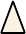

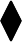+scope

{width="0.11584536307961504in" height="0.22312445319335084in"}

**Figure 3.49: Age constraint**


An [AgeConstraint](#_bookmark162) can define a minimum and maximum age for the VariableDataPrototype referenced by the [TDEventVariableDataPrototype](#_bookmark79) scope.

> 一个AgeConstraint可以为TDEventVariableDataPrototype作用域中引用的VariableDataPrototype定义最小和最大年龄。


**[constr_4573]**{DRAFT} **Restricted usage of** [**AgeConstraint**](#_bookmark162) *[*An [AgeConstraint](#_bookmark162) shall only be defined for events of type TimingDescriptionEvent associated with the receipt and reading of data.*♩()*

> **[constr_4573]**{草稿} **对** [**AgeConstraint**](#_bookmark162) 的**限制使用** *[*[AgeConstraint](#_bookmark162) 只能用于与接收和读取数据相关的 TimingDescriptionEvent 类型的事件。*♩()*

[]{#_bookmark162 .anchor}**Table 3.41: AgeConstraint**

### SynchronizationTimingConstraint


The objective of synchronization in a distributed environment is to establish and maintain a consistent time base for the interaction between different subsystems, in order to obtain correct runtime order and avoid unexpected race conditions. While mechanisms to establish synchronization need to be provided at the implementation level, the necessity for synchronization needs to be expressed at design level. For this purpose, synchronization constraints are used.

> 在分布式环境中，同步的目的是建立和维护不同子系统之间交互的一致时间基准，以获得正确的运行时顺序，避免意外的竞争条件。虽然在实施层面需要提供建立同步的机制，但需要在设计层面表达同步的必要性。为此，使用同步约束。


**[TPS_TIMEX_00074]**{DRAFT} **[SynchronizationTimingConstraint](#_bookmark164) specifies synchronicity constraints** *[*The element [SynchronizationTimingConstraint](#_bookmark164) is used to specify a synchronization constraint among the occurrences of two or more timing description events.*♩([RS_TIMEX_00001](#requirements-traceability), [RS_TIMEX_00002](#requirements-traceability), [RS_TIMEX\_-](#requirements-traceability) [00007](#requirements-traceability), [RS_TIMEX_00008](#_bookmark26), [RS_TIMEX_00017](#_bookmark28))*

> **[TPS_TIMEX_00074]**{草稿} **[SynchronizationTimingConstraint](#_bookmark164) 指定同步约束** *[*元素[SynchronizationTimingConstraint](#_bookmark164) 用于指定两个或多个时间描述事件发生的同步约束。*♩([RS_TIMEX_00001](#requirements-traceability), [RS_TIMEX_00002](#requirements-traceability), [RS_TIMEX\_-](#requirements-traceability) [00007](#requirements-traceability), [RS_TIMEX_00008](#_bookmark26), [RS_TIMEX_00017](#_bookmark28))*


A [SynchronizationTimingConstraint](#_bookmark164) is imposed either on events ([3.6.4.2](#synchronizationtimingconstraint-on-events)) or on event chains ([3.6.4.1](#synchronizationtimingconstraint-on-event-chains)).

> 一个同步定时约束（SynchronizationTimingConstraint）可以施加在事件（3.6.4.2）或事件链（3.6.4.1）上。


[[[]{#_bookmark167 .anchor}]{#_bookmark166 .anchor}]{#_bookmark165 .anchor}**Table 3.42: Synch**[]{#_bookmark164 .anchor}**ronizationTimingConstraint**

> 表3.42：同步时间约束

**Table 3.43: EventOccurrenceKindEnum**


[[]{#_bookmark169 .anchor}]{#_bookmark168 .anchor}**Table 3.44: SynchronizationTypeEnum**

> 表3.44：SynchronizationTypeEnum


**[constr_4588]**{DRAFT} **[SynchronizationTimingConstraint](#_bookmark164) shall either reference events or event chains** *[*The [SynchronizationTimingConstraint](#_bookmark164) shall either reference timing description events or timing description event chains, but not both at the same time.*♩()*

> **[constr_4588]**{草案} **[SynchronizationTimingConstraint](#_bookmark164)应引用事件或事件链** *[*[SynchronizationTimingConstraint](#_bookmark164)应引用时序描述事件或时序描述事件链，但不能同时引用两者。*♩()*

### SynchronizationTimingConstraint on Event Chains

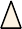

**Figure 3.50: Synchronization Timing Constraint on Event Chains**


The purpose of the [SynchronizationTimingConstraint](#_bookmark164) is to impose a synchronization constraint among either the stimulus or response event occurrences of two or more event chains. In the former case (stimulus synchronization) the referenced event chains shall have the same response event (join), or in the latter case (response synchronization) they shall have the same stimulus event (fork).

> 目的[SynchronizationTimingConstraint](#_bookmark164)是为了在两个或多个事件链之间施加同步约束。在前者（刺激同步）的情况下，参考的事件链应该具有相同的响应事件（加入），或者在后者（响应同步）的情况下，它们应该具有相同的刺激事件（分叉）。


The [SynchronizationTimingConstraint](#_bookmark164) is characterized by the following parameters:

> [同步定时约束](#_bookmark164)由以下参数表征：

- Tolerance
- Event Occurrence Kind
- Synchronization Constraint Type


The parameters are described in the following and are illustrated in Figure [3.51](#_bookmark171) and Figure [3.52](#_bookmark172).

> 参数在下面描述，并在图3.51和图3.52中示出。


**Tolerance** The parameter [tolerance](#_bookmark165) specifies the time interval within which the referenced events shall occur synchronously. The events may occur in any order within this time interval. The time interval starts at the point-in-time when one of the referenced events occurs.

> **容忍度**参数[容忍度](#_bookmark165)指定引用事件必须同步发生的时间间隔。这些事件可以在此时间间隔内以任何顺序发生。时间间隔从引用事件之一发生的时刻开始。


**Event Occurrence Kind** The optional parameter [eventOccurrenceKind](#_bookmark166) specifies whether the referenced events shall occur only once (single occurrence) or may occur multiple times (multiple occurrences) in the given time interval.

> **事件发生种类** 可选参数[eventOccurrenceKind](#_bookmark166)指定引用的事件是在给定的时间间隔内只发生一次（单次发生）还是可以发生多次（多次发生）。


**Synchronization Constraint Type** The parameter [synchronizationCon-](#_bookmark167) [straintType](#_bookmark167) specifies whether the [SynchronizationTimingConstraint](#_bookmark164) is imposed on the stimulus or response events of the referenced event chains.

> **同步约束类型**参数[synchronizationConstraintType]指定参考事件链的刺激或响应事件是否受到[SynchronizationTimingConstraint]的限制。


**[constr_4580]**{DRAFT} **[SynchronizationTimingConstraint](#_bookmark164) shall reference at least two event chains** *[*In the case, that the [SynchronizationTimingCon-](#_bookmark164) [straint](#_bookmark164) is imposed on event chains then at least two (2) timing description event chains shall be referenced.*♩()*

> **[constr_4580]**{草案} **[SynchronizationTimingConstraint](#_bookmark164) 应至少引用两个事件链** *[*如果[SynchronizationTimingCon-](#_bookmark164) [straint](#_bookmark164)施加在事件链上，则至少应引用两个（2）时间描述事件链。*♩()*


**[constr_4587]**{DRAFT} **Specifying attribute [synchronizationConstraintType](#_bookmark167)** *[*The attribute [synchronizationConstraintType](#_bookmark167) shall be specified if the [Syn-](#_bookmark164) [chronizationTimingConstraint](#_bookmark164) is imposed on event chains.*♩()*

> 如果在事件链上施加了[同步定时约束](#_bookmark164)，则必须指定属性[synchronizationConstraintType](#_bookmark167)。

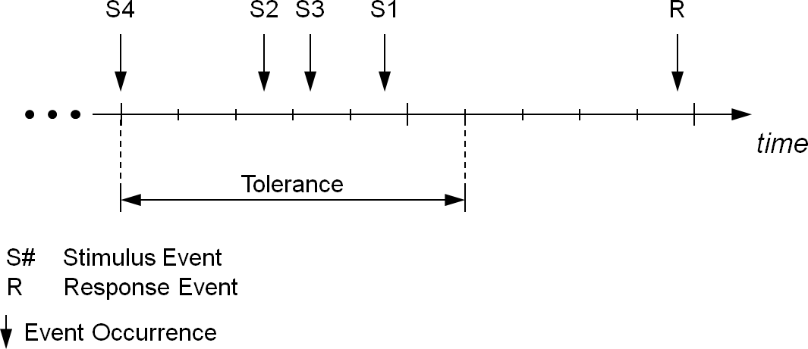{width="4.992187226596675in" height="2.1609372265966753in"}

**Figure 3.51:** []{#_bookmark171 .anchor}**Parameters characterizing the Synchronization Timing Constraint imposed on the stimulus events of event chains.**

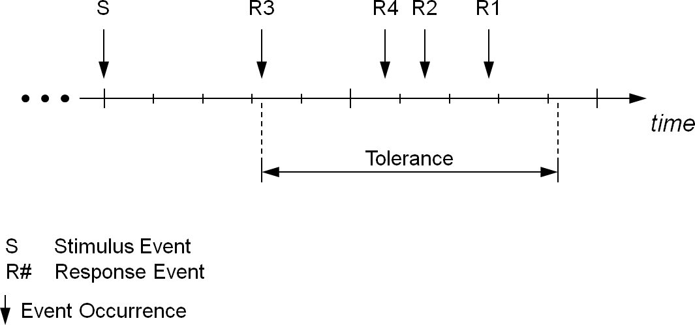{width="4.992187226596675in" height="2.339061679790026in"}

**Figure 3.52:** []{#_bookmark172 .anchor}**Parameters characterizing the Synchronization Timing Constraint imposed on the response events of event chains.**


An example for synchronizing on *stimuli* of event chains would be an adaptive cruise control that expects data from different sensors, which shall be sampled (quasi) simultaneously with respect to a predefined tolerance.

> 一个关于事件链*刺激*同步的例子就是自适应巡航控制，它期望从不同的传感器获取数据，这些数据应该根据预定的容忍度同时采样（准确地）。


An example for synchronizing on *responses* of event chains would be the blinking of different indicator lights, which shall occur (quasi) simultaneously with respect to a predefined tolerance.

> 一个关于事件链响应同步的例子就是不同的指示灯闪烁，它们应该按照预定的容忍度同时闪烁。

### SynchronizationTimingConstraint on Events


As mentioned above, the purpose of the [SynchronizationTimingConstraint](#_bookmark164) is to impose a synchronization constraint among either the stimulus or response event occurrences of two or more event chains. However, in some cases the complete event chains are not entirely known, or not available in the scope of the model, at the point in time the timing constraint shall be specified. For this purpose, the AUTOSAR Timing Extensions allow the specification of synchronization constraints on events. In this case, the events referenced by the constraint are related implicitly, because they have a common stimulus (in case of constraint type [responseSynchronization](#_bookmark168) or a common response (in case of constraint type [stimulusSynchronization](#_bookmark169) not known yet, or not available in the scope of the model.

> 根据上文所述，[SynchronizationTimingConstraint](#_bookmark164)的目的是在两个或多个事件链之间施加同步约束。但是，在某些情况下，完整的事件链尚未完全知晓或者在模型范围内不可用，在指定时序约束时。为此，AUTOSAR Timing Extensions允许指定事件之间的同步约束。在这种情况下，约束所引用的事件是隐含的，因为它们具有共同的触发器（如果约束类型为[responseSynchronization](#_bookmark168)）或共同的响应（如果约束类型为[stimulusSynchronization](#_bookmark169)）尚未知晓或者在模型范围内不可用。


At a later stage during the development, when the refined software architecture exposes the complete event chains (e.g. because the common stimulus gets known), the respective event chains shall be specified and associated with a [Synchronization-](#_bookmark164) [TimingConstraint](#_bookmark164) on event chains (see [3.6.4.1](#synchronizationtimingconstraint-on-event-chains)) in order to refine the previously defined [SynchronizationTimingConstraint](#_bookmark164) on events.

> 在开发的后期阶段，当精炼的软件架构暴露出完整的事件链（例如，因为已知共同的刺激）时，应该指定相应的事件链，并将其与[同步]（＃_bookmark164）[定时约束]（＃_bookmark164）的事件链相关联（请参见[3.6.4.1]（＃synchronizationtimingconstraint-on-event-chains）），以便细化先前定义的[SynchronizationTimingConstraint]（＃_bookmark164）事件。

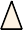

**Figure 3.53: Synchronization Timing Constraint on Events**


The purpose of the [SynchronizationTimingConstraint](#_bookmark164) is to impose a synchronization constraint among the occurrences of two or more events. The [Synchroniza-](#_bookmark164) [tionTimingConstraint](#_bookmark164) is characterized by the following parameters:

> [SynchronizationTimingConstraint](#_bookmark164)的目的是在两个或多个事件发生之间施加同步约束。[SynchronizationTimingConstraint](#_bookmark164)的特征由以下参数确定：

- Tolerance
- Event Occurrence Kind
- Synchronization Constraint Type


The parameters are described in the following and are illustrated in Figure [3.54](#_bookmark174).

> 参数在下面描述，并在图3.54中描绘。


**Tolerance** The parameter [tolerance](#_bookmark165) specifies the time interval within which the referenced events shall occur synchronously. The events may occur in any order within this time interval. The time interval starts at the point-in-time when one of the referenced events occurs.

> **容忍度**参数[容忍度](#_bookmark165)指定引用事件应同步发生的时间间隔。这些事件可以在此时间间隔内以任何顺序发生。时间间隔从引用事件之一发生的时刻开始。


**Event Occurrence Kind** The parameter [eventOccurrenceKind](#_bookmark166) specifies whether the referenced events shall occur only once (single occurrence) or may occur multiple times (multiple occurrences) in the given time interval.

> 参数[eventOccurrenceKind](#_bookmark166)指定引用的事件在给定的时间间隔内是只发生一次（单次发生）还是可以发生多次（多次发生）。


**Synchronization Constraint Type** The parameter [synchronizationCon-](#_bookmark167) [straintType](#_bookmark167) specifies whether the associated events of the [Synchro-](#_bookmark164) [nizationTimingConstraint](#_bookmark164) have a common stimulus or response.

> **同步约束类型**参数[synchronizationConstraintType]指定SynchronizationTimingConstraint相关事件是具有共同刺激或响应的。


**[constr_4579]**{DRAFT} [**SynchronizationTimingConstraint**](#_bookmark164) **shall reference at least two events** *[*In the case, that the [SynchronizationTimingConstraint](#_bookmark164) is imposed on events then at least two (2) timing description events shall be referenced.*♩ ()*

> **[constr_4579]**{草案} [**SynchronizationTimingConstraint**](#_bookmark164) **必须引用至少两个事件** *[*如果[SynchronizationTimingConstraint](#_bookmark164)施加在事件上，则至少要引用两个（2）时序描述事件。*♩ ()*


**[constr_4586]**{DRAFT} **Specifying attribute [synchronizationConstraintType](#_bookmark167)** *[*The attribute [synchronizationConstraintType](#_bookmark167) shall be specified if the [Syn-](#_bookmark164) [chronizationTimingConstraint](#_bookmark164) is imposed on events.*♩()*

> **[constr_4586]**{草稿} **指定属性[synchronizationConstraintType](#_bookmark167)** *[*如果对事件施加[Syn-](#_bookmark164) [chronizationTimingConstraint](#_bookmark164)，则应指定属性[synchronizationConstraintType](#_bookmark167)。*♩()*

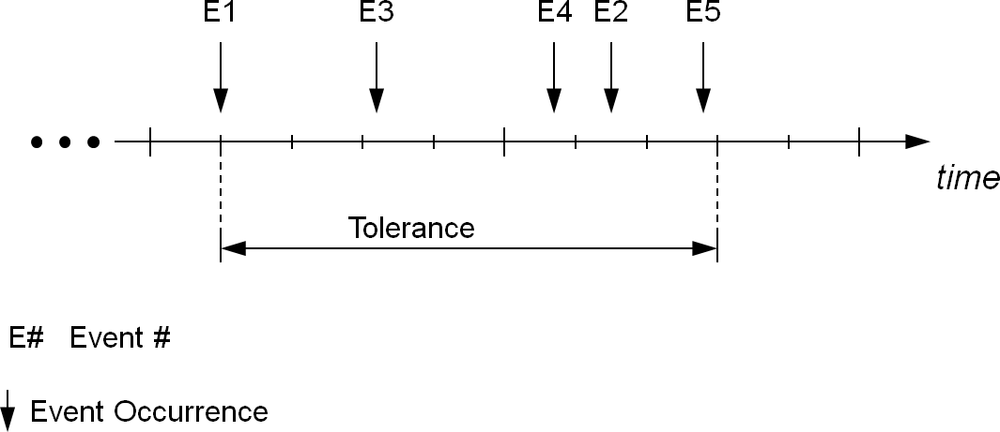{width="4.992187226596675in" height="2.1609372265966753in"}

**Figure 3.54:** []{#_bookmark174 .anchor}**Parameter characterizing the Synchronization Constraint**

### OffsetTimingConstraint


**[TPS_TIMEX_00081]**{DRAFT} **[OffsetTimingConstraint](#offsettimingconstraint) specifies offset between occurrences of events** *[*The element [OffsetTimingConstraint](#offsettimingconstraint) is used to specify an offset between the occurrences of two timing description events.*♩([RS\_-](#requirements-traceability) [TIMEX_00001](#requirements-traceability), [RS_TIMEX_00002](#requirements-traceability), [RS_TIMEX_00008](#_bookmark26))*

> [OffsetTimingConstraint](#offsettimingconstraint) 用于指定两个时间描述事件之间的偏移量。（参考[RS\_-](#requirements-traceability) [TIMEX_00001](#requirements-traceability), [RS_TIMEX_00002](#requirements-traceability), [RS_TIMEX_00008](#_bookmark26)）


An [OffsetTimingConstraint](#offsettimingconstraint) bounds the time offset between the occurrence of two timing events, without requiring a direct functional dependency between the source and the target.

> 一个[OffsetTimingConstraint](#offsettimingconstraint)限制两个时间事件发生之间的时间偏移，而不需要源和目标之间有直接的功能依赖关系。

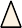
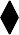0..1

**Figure 3.55: Offset Timing Constraint**
**Table 3.45: OffsetTimingConstraint**

### Traceability of Constraints


**[TPS_TIMEX_00089]**{DRAFT} **TimingConstraint is a Traceable** *[*The element TimingConstraint and all of its specializations, commonly called timing constraints, are traceable.*♩([RS_TIMEX_00010](#_bookmark29))*

> **[TPS_TIMEX_00089]**{草稿} **时序约束是可追溯的** *[*时序约束元素及其所有的特殊化，通常称为时序约束，是可追溯的。*♩([RS_TIMEX_00010](#_bookmark29))*


The support for traceability [[4](#_bookmark3)] enables one to specify relationships between timing constraints and corresponding AUTOSAR elements that satisfy those timing requirements.

> 支持可追溯性[[4](#_bookmark3)]可以指定时序约束与满足这些时序要求的AUTOSAR元素之间的关系。

## Logical Execution Time

Logical Execution Time (LET) is currently restricted to CP.

## System Level Logical Execution Time


Please refer to [[8](#_bookmark7)] chapter \"System Level Logical Execution Time\".

> 请参考[[8](#_bookmark7)]章节“系统级逻辑执行时间”。

## Blueprinting


**[TPS_TIMEX_00091]**{DRAFT} **Blueprinting [VfbTiming](#_bookmark37)** *[*[VfbTiming](#_bookmark37) can be blueprinted.*♩([RS_TIMEX_00016](#_bookmark30))*

> **[TPS_TIMEX_00091]**{草稿} **蓝图设计[VfbTiming](#_bookmark37)** *[*[VfbTiming](#_bookmark37) 可以被蓝图设计。♩([RS_TIMEX_00016](#_bookmark30))*


The primary purpose of blueprinting [VfbTiming](#_bookmark37) is to annotate Application Interfaces and attach timing constraints, like ageand periodic event triggering constraints, to events of type [TDEventVfb](#_bookmark76) which reference port prototype blueprints. The concept of Blueprints and its details are described in [[4](#_bookmark3)].

> 主要目的是为[VfbTiming](#_bookmark37)建模，以注释应用程序接口并将时序约束（如年龄和周期性事件触发约束）附加到类型为[TDEventVfb](#_bookmark76)的事件上，这些事件引用端口原型蓝图。蓝图及其细节的概念可参见[[4](#_bookmark3)]。

**Figure 3.56: VFB Timing Blueprint**

**Figure 3.57:** [**TDEventVfb**](#_bookmark76) **Blueprint**


**[constr_4577]**{DRAFT} **[TDEventVfb](#_bookmark76) shall reference PortPrototypeBlueprint only in Blueprints** *[*An event type [TDEventVfb](#_bookmark76) only shall reference PortPrototypeBlueprint in blueprints.*♩()*

> **[constr_4577]**{草案} **[TDEventVfb](#_bookmark76) 只能在蓝图中引用PortPrototypeBlueprint** *[*事件类型[TDEventVfb](#_bookmark76)只能在蓝图中引用PortPrototypeBlueprint。*♩()*


**[constr_4578]**{DRAFT} **Only** [**VfbTiming**](#_bookmark37) **shall be a Blueprint** *[*Only the [VfbTiming](#_bookmark37)

> **[constr_4578]**{草案} 仅 [**VfbTiming**](#_bookmark37) 应该是一个蓝图*[*仅 [VfbTiming](#_bookmark37)

is blueprintable.*♩()*

## Methodology


The AUTOSAR methodology (see [[9](#_bookmark8)] for a general introduction) provides several welldefined process steps, and furthermore artifacts that are provided or needed by these steps.

> AUTOSAR方法（参见[[9](#_bookmark8)]以获得一般介绍）提供了几个明确定义的流程步骤，以及这些步骤提供或需要的工件。


For each of these views a special focus of timing specification can be applied, depending on the availability of necessary information, the role a certain artifact is playing and the development phase, which is associated with the view.

> 对于这些视图，可以根据所需信息的可用性、某个工件扮演的角色以及与视图相关联的开发阶段，应用特定的时序规范。


**[TPS_TIMEX_00075]**{DRAFT} **Optional use of timing extensions** *[*The elements TimingExtension, TimingDescription, and TimingConstraint of the timing extensions are derived from the element ARElement. This enables one to deliver timing extensions in a separate document. In addition, there are no external references from any template that point to timing extensions elements.*♩([RS_TIMEX_00003](#requirements-traceability))*

> [TPS_TIMEX_00075]{草案} **可选使用时序扩展** *[*时序扩展的元素TimingExtension、TimingDescription和TimingConstraint来源于ARElement元素。这使得可以在单独的文档中提供时序扩展。此外，模板中没有指向时序扩展元素的外部引用。*♩([RS_TIMEX_00003](#requirements-traceability))*
