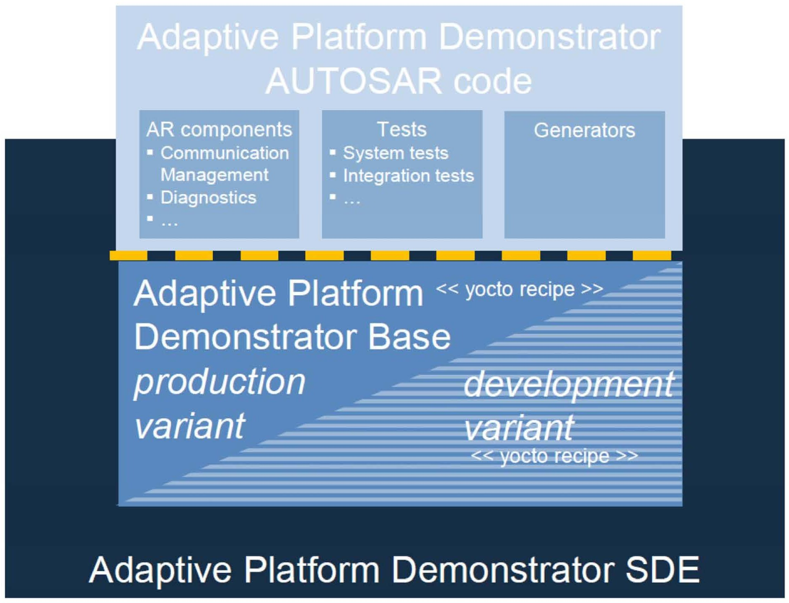

# Contents

1. # Introduction

   1. ## Scope of this document

This document provides an overview of the AUTOSAR standard Adaptive Platform release R22-11.

2. ## Terminology and Licenses

   1. ### Terminology statement

AUTOSAR has identified a use of previously common terminology that can be considered oppressive or racist, such as master/slave and black/white list, or in other contexts such as gender or age as harmful connotations. AUTOSAR has started a discussion with all the working groups to replace these terms. AUTOSAR is committed to provide all specification documents without these terminology in the coming and future releases. Nevertheless, it may take several releases before the terms are completely replaced, as AUTOSAR has to continue its operations and thousands of pages of existing specifications have to be reviewed and updated in parallel.

### Usage of W3C XML schema

The AUTOSAR XML Schema requires the XML namespace definition file xml.xsd.

There are several occurrences of the \"xml.xsd\" file within this release. For all occurrences the W3C license applies which can be found on [https://www.w3.org/](https://www.w3.org/Consortium/Legal/2015/copyright-software-and-document) [Consortium/Legal/2015/copyright-software-and-document](https://www.w3.org/Consortium/Legal/2015/copyright-software-and-document).

By obtaining and/or copying this work, you (the licensee) agree that you have read, understood, and will comply with the following terms and conditions.

Permission to copy, modify, and distribute this work, with or without modification, for any purpose and without fee or royalty is hereby granted, provided that you include the following on ALL copies of the work or portions thereof, including modifications:

The full text of this NOTICE in a location viewable to users of the redistributed or derivative work. Any pre-existing intellectual property disclaimers, notices, or terms and conditions. If none exist, the W3C Software and Document Short Notice should be included. Notice of any changes or modifications, through a copyright statement on the new code or document such as "This software or document includes material copied from or derived from \[title and URI of the W3C document\]. Copyright *⃝*c (MIT, ERCIM, Keio, Beihang)."

THIS WORK IS PROVIDED "AS IS," AND COPYRIGHT HOLDERS MAKE NO REPRESENTATIONS OR WARRANTIES, EXPRESS OR IMPLIED, INCLUDING BUT NOT LIMITED TO, WARRANTIES OF MERCHANTABILITY OR FITNESS FOR ANY PARTICULAR PURPOSE OR THAT THE USE OF THE SOFTWARE OR DOCUMENT WILL NOT INFRINGE ANY THIRD PARTY PATENTS, COPYRIGHTS, TRADEMARKS OR OTHER RIGHTS.

COPYRIGHT HOLDERS WILL NOT BE LIABLE FOR ANY DIRECT, INDIRECT, SPECIAL OR CONSEQUENTIAL DAMAGES ARISING OUT OF ANY USE OF THE SOFTWARE OR DOCUMENT.

The name and trademarks of copyright holders may NOT be used in advertising or publicity pertaining to the work without specific, written prior permission. Title to copyright in this work will at all times remain with copyright holders.

3. ## AUTOSAR Standards

   1. ### Introduction

AUTOSAR addresses a wide range of use cases in automotive software development with its standards. These use cases have different requirements and lead to different technical solutions.

Packaging its deliverables into different \"standards\"

- eases the access to AUTOSAR solutions for users and
- allows AUTOSAR to scale with market needs.

  1. ### Definition

An AUTOSAR standard is a consistent set of AUTOSAR deliverables, which are released at the same time. AUTOSAR deliverables can, but are not limited to be of the following kinds:

- textual explanations
- textual specifications
- test specifications
- source code
- other formal or semi-formal textual formats (e.g., ARXML, UML models, XML Schemata)

At the time of release, AUTOSAR ensures that dependencies are fulfilled.

### Overview on AUTOSAR's Standards

AUTOSAR delivers the following standards:


### Adaptive Platform

The Adaptive Platform is AUTOSAR's solution for high-performance computing ECUs to build safety-related systems for use cases such as highly automated and autonomous driving.

### Classic Platform

The Classic Platform is AUTOSAR's solution for embedded systems with hard real-time and safety constraints.

### Foundation

The purpose of the Foundation standard is to enforce interoperability between the AUTOSAR platforms.

Foundation contains the generic artifacts that are common for AP and CP to ensure compatibility between

- Classicand Adaptive Platform
- Non-AUTOSAR platforms to AUTOSAR platforms

  1. ### Naming scheme for files and specification items

AUTOSAR is in the course of extending the naming scheme for files and specification items. The objective is to consistently include the AUTOSAR Standard to which the file or specification item belongs in the name. This addition also provides namespaces for the three AUTOSAR Standards and avoids conflicting names for specifications on the same topic in different AUTOSAR Standards. According to the new naming scheme, the abbreviation of the AUTOSAR Standard (AP, CP or FO) is added as first part of specification item IDs and as second part of file names. For details, please refer to \[[1](#_bookmark0)\].

From R22-11 onwards, specification items in newly introduced specifications follow the new naming scheme. In R22-11, file names are not yet changed.

From R23-11 onwards, the names of all files that are part of the release will follow the new naming scheme.

The IDs of existing specification items are not changed to avoid issues and migrations for AUTOSAR Partners that use these IDs internally.

### Dependencies between Standards

Each release of Classic and Adaptive Platform relies on a dedicated version of Foundation. The specific dependency is documented in chapter [1.4.5](#overview-of-autosar-releases-and-corresponding-autosar-schema-versions).

**Figure 1.1: Dependencies of AUTOSAR Standards**

### Dependencies to other Standards

This release of the Adaptive Platform depends on the standard Foundation in release R22-11, which

- defines protocols implemented by Adaptive Platform
- contains the project objectives and the common requirements from which the features of the Adaptive Platform are derived
- contains common specification parts which apply to both, the Adaptive Platform and the Classic Platform

These dependencies are refined in the trace information of the requirements in the respective specifications.

1. ## Release Numbering and Life Cycle

   1. ### Release life cycle of a major release

Each major release goes through four consecutive steps within its life cycle (examples based on the internal release numbering scheme):

1. Development: Between start of life cycle and the initial release (e.g., R4.0.1)
2. Evolution: Following the initial release with zero, one or several minor releases and/or revisions (e.g., R4.0.2, R4.1.1)
3. Maintenance: No new content is added to a major release but only maintenance of the existing content with zero, one or several revisions (e.g., R3.2.2) is provided
4. Issue Notice: No more revisions but zero, one or several issue notices, i.e., updates of the list of known issues until end of life cycle.


**Corresponding internal release number**

**e.g. Rel. 4.0.1 e.g. Rel. 4.2.1 e.g. Rel. 4.2.2 t**

**Figure 1.2: Life cycle model of AUTOSAR standards**

### Life cycle states of specification items and requirements

The life cycle state of a specification item is found after the specification item ID surrounded by curly brackets. The states are:

- {Valid}: This indicates that the related entity is a valid part of the document. This is the default and also applies if no dedicated life cycle status is annotated for the related entity.
- {Draft}: This indicates that the related entity is newly introduced but still experimental. This information is published but is subject to change without backward compatibility guarantee.
- {Obsolete}: This indicates that the related entity is subject to be removed in one of the following releases without further notice.

The life cycle state of a requirement is found in the attribute \"type\". The states are the same as the specification item states.

### Platform release number

AUTOSAR applies a four-digit numbering scheme Ryy-mm to identify releases. The identifiers "yy" and "mm" depict the year and month of the release date, e.g., R20-11 for the November 2020 release.

### Internal release number

AUTOSAR additionally maintains an internal release number for different purposes (e.g., usage in BSW modules in Classic Platform).

The internal release number is used for all platforms and follows up on the Classic Platform release number. In Adaptive Platform this is newly introduced. In Foundation this leads to a discontinuation of the former numbering pattern (e.g., R1.5.0).

A mapping list between Platform Releases and corresponding internal release numbers can be found in chapter [1.4.5](#overview-of-autosar-releases-and-corresponding-autosar-schema-versions). The internal release number uses a three-digit numbering scheme R\<major\>.\<minor\>.\<revision\> to identify releases. Its primary purpose is to identify a release as

- a major release: Valid and draft specification parts may be changed backward incompatibly.
- a minor release: Valid specification parts may only be changed backward compatibly. Draft specification parts may be changed backward incompatibly.
- a revision: Does not contain extensions but only backward compatible bugfixes.

  1. ### Overview of AUTOSAR releases and corresponding AUTOSAR schema versions

Until the Releases CP R4.4.0 and AP R19-03, AUTOSAR released the platforms separately where a Foundation release went along with each platform release. Since compatibility between the platforms is essential to be able to have AP and CP ECUs within one vehicle project, an XML schema needs to be available that works with the different releases. The following table gives an overview about the different schema versions and the corresponding platform releases they can be used for.

The AUTOSAR schema does not have an impact on the Foundation. The Foundation releases are mentioned for the sake of completeness.

```
---

Schema Version    Classic Platform release   Adaptive Platform release   Foundation release

---

AUTOSAR_00042     R4.3.0                     R17-03                      R1.1.0

AUTOSAR_00043     R4.3.0                     R17-10                      R1.2.0

AUTOSAR_00044     R4.3.1                     R17-10                      R1.3.0

AUTOSAR_00045     R4.3.1                     R18-03                      R1.4.0

AUTOSAR_00046     R4.4.0                     R18-10                      R1.5.0

AUTOSAR_00047     R4.4.0                     R19-03                      R1.5.1
-------------------------------------------------------------------------------
```

Starting with release R19-11, all platforms are released as one AUTOSAR release and therefore come along with one schema version.

```
---

Schema Version          Platform release        Internal release number

---

AUTOSAR_00048           R19-11                  R4.5.0

AUTOSAR_00049           R20-11                  R4.6.0

AUTOSAR_00050           R21-11                  R4.7.0

**AUTOSAR_00051**       **R22-11**              **R4.8.0**
----------------------------------------------
```

According to the release life cycle of AUTOSAR the release R22-11 is a minor release.

## Introduction to the Adaptive Platform

The AUTOSAR Adaptive Platform is the standardized platform for microprocessorbased ECUs supporting use cases like highly automated driving as well as high speed on-board and off-board communication.

The Adaptive Platform differs in a number of aspects from the standardization approach of the Classic Platform:

- Parallel validation of specification via software implementation
- Specification of functional clusters instead of modules

  1. ### Release strategy

The Adaptive Platform has changed its life cycle state to \"Evolution\" according to AUTOSAR's life cycle model for its standards (as depicted in chapter [1.4.1](#release-life-cycle-of-a-major-release)). Since R19-11, AUTOSAR releases the Adaptive Platform together with the Classic Platform and Foundation in a yearly cycle. The life cycle state "Evolution" implies that users of the Adaptive Platform have a guarantee on backward compatibility for certain parts of the specifications. The differentiation is handled by the life cycle state of the requirements and specification items according to chapter [1.4.2](#life-cycle-states-of-specification-items-and-requirements).

### Parallel validation of specification via implementation

The Adaptive Platform is partially validated through an AUTOSAR-internal implementation: the Adaptive Platform Demonstrator. The Demonstrator release is available to all the partners and can provide further details to understand the underlying concepts of the Adaptive Platform. The Adaptive Platform Demonstrator is an exemplary implementation of the Adaptive Platform specifications. All further usage based on the Demonstrator (e.g. in production) will become the responsibility of the respective partner. For legal constraints see the dedicated paragraphs in the Development Agreement.

For the current releases, the Demonstrator software implementation has undergone only informal reviews with no strict quality assurance. AUTOSAR is increasing the quality assurance significantly to ensure the quality criteria given by the project.

The Demonstrator comes with traceability up to the specifications to document the validation aspect.

Additionally AUTOSAR develops System Test specifications and implementation to support the test of the demonstrator implementation against the AUTOSAR requirements. These tests are also part of the release.

{width="5.099791119860018in" height="3.9in"}

**Figure 1.3: Overview of the AUTOSAR Adaptive Platform Demonstrator**

### Specification depth

Based on the development history of the Classic Platform, AUTOSAR has decided to specify functional clusters instead of a specific software architecture to provide the implementers with options to find efficient solutions for the standardized features.

## Content of chapters

This document is structured as follows:

- Chapter [1](#introduction) provides an introduction to AUTOSAR's release strategy, the Adaptive Platform and its standardization approach.
- Chapter [2](#summary-of-changes) provides a summary of changes since the previous release of the Adaptive Platform.
- Chapter [3](#specification-overview) contains the overview of specifications comprising the release R22-11. This chapter is structured according to the clusters of AUTOSAR release R22-11.
- Chapter [4](#remarks-to-known-technical-deficiencies) contains remarks about known technical deficiencies.
- Chapter 5 contains the detailed release history of all released specifications.

# Summary of changes

This chapter contains a summary of changes which have been implemented since the previous release R22-11.

## Release R22-11

Several concepts affecting the Adaptive Platform have been introduced with release R22-11 thereby adding functionality to the platform.

Additionally one concept targets the Classic and Adaptive Platform, strengthening the interaction between the two platforms.

1. ### Concepts

   1. []{#_bookmark31 .anchor}**Introduced Concepts**

The following concepts in [2.1.1.1.1](#macsec) [2.1.1.1.5](#someip-harmonization) have been introduced.

### MACsec

Media Access Controller Security (MACsec) and MACsec Key Agreement (MKA) protocols:

The concept defines and includes in AUTOSAR the Modules needed for using and configuring the security protocol in Layer 2 MACsec and its related Key Agreement Protocol MKA.

Focuses on the authentication method, secret keys agreement protocol (MKA), as well as the methods, rules, and configuration related to the protected communication (extra Header (SecTAG), extra Check Value (ICV), cryptography sets (Cypher Suites), bypass rules (VLAN-ID, EthTyp)).

### CAN XL

The CAN XL concept adds the improved capabilities of the next generation of CAN to AUTOSAR, e.g., a data rate up to 20MBit/s, increased frame size of up to 2048 Bytes, the introduction of a virtual separation with a Virtual CAN ID (VCID) similar to a VLAN and the possibility to transmit Ethernet frames over a physical CAN network.

### Firewall

The concept introduces a firewall to inspect and filter Ethernet traffic based on predefined firewall rules. The firewall supports stateless packet inspection, stateful packet inspection and deep packet inspection as well as rate-based filtering of network packets. Furthermore, the firewall supports also the Intrusion Detection System by raising Security Events to the IdsM.

### Service Oriented Vehicle Diagnostics

SOVD (Service-oriented Vehicle Diagnostics) allows the usage of the \"ASAM SOVD\" standard in the context of AUTOSAR Adaptive. This covers the use cases for HCP diagnostics as well as the UDS adapter to access ECUs using AUTOSAR Classic.

### SOME/IP Harmonization

The concept SOME/IP Harmonization will clean-up the SOME/IP specification for all AUTOSAR Platforms (FO, CP, AP), by removing duplicate content and aligning contradicting specifications related documents. The current concept part is harmonizing the documents PRS_SOMEIPServiceDiscoveryProtocol and SWS_CommunicationManagement.

### Impact of Concepts

The introduced concepts had impact on several specifications. The following table provides a detailed overview.

Please note that some of the specifications are marked by special text formatting:

- Specifications in **bold** font are completely new specifications originating from the particular concept.
- Specifications in *italic* font are affected indirectly as they provide artifacts for the actually impacted specifications.


**Table 2.1: Impact of Concepts**

### Validated Concepts

The following concepts have been validated:

- CAN XL

  1. ### Specifications

     1. []{#_bookmark37 .anchor}**New Specifications**

The following new specifications have been introduced via concepts:

- Specification of Firewall in Adaptive Platform (UID 1063, SWS)
- Explanation of Service Oriented Vehicle Diagnostics (UID 1064, EXP)

In addition to the above listed new specifications, the following documents have been added with R22-11:

- none

  1. ### Migrated Specifications

With this release, the following specifications have been moved from AUTOSAR Adaptive Platform to the AUTOSAR Foundation standard:

- Explanation of Safety Overview (UID 895, EXP)

  1. ### Obsolete Specifications

The following specification has been set to status \"obsolete\" in this release:

- Guidelines for the use of the C++14 language in critical and safety-related systems (UID 839, RS)

  1. ### Removed Specifications

The following specification has been set to status \"removed\" in this release:

- Specification of RESTful Communication (UID 876, SWS)

  1. ### Reworked Specifications

The following specifications have been changed fundamentally in R22-11

- none

  1. ### Moved Specification parts

The following specification parts have been moved to other documents in R22-11.

- Requirements on Security Management for Adaptive Platform (UID 881, RS) to Explanation of Security Overview (UID 1077, EXP)
- Explanation of Adaptive Platform Software Architectural Decisions (UID 983, EXP) to Explanation of Adaptive and Classic Platform Software Architectural Decisions (UID 1078, EXP)

  1. ### Renamed Specifications

The following specification has been renamed in this release:

- none

  1. ### Life Cycle State of Metamodel

The life cycle of several Adaptive Platform elements in the Metamodel were kept in \"draft\" until release R21-11. Due to increasing market demands to keep AUTOSAR's XML schema stable, these parts of the model have been set to \"valid\" in this release. This has an impact on the TPS_Manifest specification \[[2](#_bookmark1)\].

Please be aware that according to \[[1](#_bookmark0)\], only the life cycle states \"valid\" and \"candidate\" are used within the Metamodel.

### Release Documentation

There are no major changes in the Release Documentation.

## History information in AUTOSAR

The following diagram shows the location of documentation of changes.

The Change Documentation is also available for Adaptive Platform since release R2011.

**Figure 2.1: History information in AUTOSAR**

# Specification overview

The published specifications are divided into the clusters

- Release Documentation
- Adaptive Foundation
- Adaptive Services
- General
- Methodology and Manifests

The assignment of the specifications to these clusters is shown below.


**Table 3.1: Specification Overview**

# Remarks to known technical deficiencies

The technical deficiencies per specification are if applicable mentioned inside the respective specification in a chapter \"Known Limitations\" located after the table of contents.

The following technical deficiencies are to be mentioned, where clicking on the section reference will bring you to the respective document:

```
---

Document UID   Long Name                                                     Document Type   Section Reference

---

851            Specification of Platform Health Management                   SWS             [4.1](#specification-of-platform-health-management-uid-851-sws)

880            Specification of Time Synchronization                         SWS             [4.2](#specification-of-time-synchronization-uid-880-sws)

888            Specification of Update and Configuration Management          SWS             [4.3](#specification-of-update-and-configuration-management-uid-888-sws)

908            Specification of State Management                             SWS             [4.4](#specification-of-state-management-uid-908-sws)

994            Specification of Language Binding for modeled AP data types   SWS             [4.5](#specification-of-language-binding-for-modeled-ap-data-types-uid-994-sws)
------------------------------------------------------------------------------------------------
```

## Specification of Platform Health Management (UID 851, SWS)

- Daisy chaining (i.e. forwarding Supervision Status, Checkpoint or Health Channel information to an entity external to PHM or another PHM instance) is currently not supported in this document release
- Interface with the Diagnostic Manager is not specified in this release
- The configuration attribute for the alive notification cycle time (with respect to PHM sending AliveNotification to watchdog interface) is not specified for this release.
- A change in the value of Supervision (Alive/Deadline/Logical) configuration parameters between two Function Group states wherein the process being supervised continues to execute on switching between these states is not considered. The Supervision continues as per configuration in the Supervision Mode corresponding to old Function Group state.
- Similar to above limitation, dynamic change between Supervision exclusion (disable) and Supervision inclusion (enable) on Function Group state change wherein the process under consideration continues to execute on change in Function Group state is not supported. Supervision exclusion or inclusion can be applied starting with the Function Group state in which execution of the process begins and the same is applied until termination of the process
- Currently specified mechanism of Notifying State Management on Global Supervision Status reaching state kStopped is insufficient in case of multiple failures. It could happen that the Global Supervision Status remains in state kStopped without further notification to State Management about successive failures. Thereby the recovery might be hindered
- \"PowerMode\" dependent Supervision configuration is not supported in this release
- Supervision is not supported for non-reporting processes. Rationale: Supervision depends on process states. Non-reporting process is not expected to report its Execution State to Execution Management. Hence, Platform Health Management cannot be informed about the necessary process states by Execution Management
- Handling of multiple hardware watchdog instances is up to implementation and not standardized in the specification.
- State machine of Elementary Supervision Status is not specified for inter process supervisions (inter process Deadline Supervision and Logical Supervision) in this release.
- The feature Health Channels (HealthChannelExternalStatus) will remain as \"obsolete\" in this release.

Note: It is not intended to remove this feature from AUTOSAR Adaptive Platform overall (due to clear industry use cases). Rather, it is an architectural question (to which Functional Cluster this feature belongs to) that is expected to be resolved for the next release:

**--** SWS_PHM_00010

**--** SWS_PHM_01328

**--** SWS_PHM_01329

**--** SWS_PHM_01330

**--** SWS_PHM_00102

**--** SWS_PHM_01113

**--** SWS_PHM_01114

**--** SWS_PHM_01115

**--** SWS_PHM_01118

**--** SWS_PHM_01119

**--** SWS_PHM_01129

**--** SWS_PHM_01122

**--** SWS_PHM_01139

**--** SWS_PHM_00457

**--** SWS_PHM_01222

**--** SWS_PHM_01224

**--** SWS_PHM_01128

**--** SWS_PHM_01221

**--** SWS_PHM_01223

**--** SWS_PHM_01225

**--** SWS_PHM_01231

**--** SWS_PHM_01233

**--** SWS_PHM_01234

**--** SWS_PHM_01235

**--** SWS_PHM_01236

**--** SWS_PHM_01232

**--** SWS_PHM_01237

**--** SWS_PHM_01238

**--** SWS_PHM_01239

## Specification of Time Synchronization (UID 880, SWS)

Known limitations

The Time Synchronization module is bound to Adaptive Platform Systems.

- Configuration

Please refer to the corresponding model elements.

- Time Gateway

Time Gateway functionality is currently not in scope of the Time Synchronization module for the Adaptive Platform.

- Out of Scope

Errors, which occurred during Global Time establishment and which are not caused by the module itself (i.e. loss of PTP global time is not an issue of the TS but of the TSP modules) are out of the scope of this module.

- Security

Secured Time Synchronization using the AUTOSAR Sub-TLV: Time Authenticated (see PRS-TimeSync \[1\]) is currently not supported for the Adaptive Platform.

Note: Secured Time Synchronization messages received in AP ECUs works without verifying the security measures (i.e., AUTOSAR Sub-TLV:Time Authenticated is ignored).

## Specification of Update and Configuration Management (UID 888, SWS)

UCM is not responsible to initiate the update process. UCM realizes a service interface to achieve this operation. The user of this service interface is responsible to verify that the vehicle is in a updatable state before executing a software update procedure on demand. It is also in the responsibility of the user to communicate with other AUTOSAR Adaptive Platforms or AUTOSAR Classic Platforms within the vehicle. The UCM receives a locally available software package for processing. The software package is usually downloaded from the OEM backend. The download of the software packages has to be done by another application, i.e. UCM does not manage the connection to the OEM backend. Prior to triggering their processing, the software packages have to be transferred to UCM by using the provided ara::com interface. The UCM update process is designed to cover updates on use case with single AUTOSAR Adaptive Platform. UCM can update Adaptive Applications, the AUTOSAR Adaptive Platform itself, including all functional clusters and the underlying OS.

The UCM is not responsible for enforcing authentication and access control to the provided interfaces. The document currently does not provide any mechanism for the confidentiality protection as well as measures against denial of service attacks. The assumption is that the platform preserves the integrity of parameters exchanged between UCM and its user.

The possibility to restart a specific application instead of a Machine reboot depends of the kind of update and application, is therefore implementation specific and is defined in the Software Package manifest.

UCM does only support updates of ARA::COM and UDS (ISO-14229) compliant ECUs. UCM is not controlling any action done by diagnostic tool directly updating a Classic platform. For instance UCM cannot protect against downgrading of a Software Cluster in a Classic platform by a diagnostic tool.

## Specification of State Management (UID 908, SWS)

The State Machine API is a subject for rework in a future release.

## Specification of Language Binding for modeled AP data types (UID 994, SWS)

Although future versions of this specification may add further Language Bindings, the primary focus of the AP (and therefore this specification) is a binding to the C++ language.
