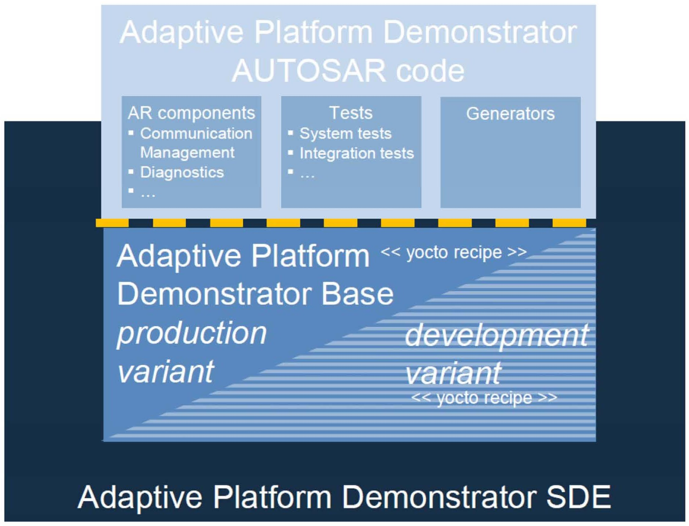

Schema Version    Classic Platform release   Adaptive Platform release   Foundation release
---
AUTOSAR_00042     R4.3.0                     R17-03                      R1.1.0
AUTOSAR_00043     R4.3.0                     R17-10                      R1.2.0
AUTOSAR_00044     R4.3.1                     R17-10                      R1.3.0
AUTOSAR_00045     R4.3.1                     R18-03                      R1.4.0
AUTOSAR_00046     R4.4.0                     R18-10                      R1.5.0
AUTOSAR_00047     R4.4.0                     R19-03                      R1.5.1
-------------------------------------------------------------------------------
```

Starting with release R19-11, all platforms are released as one AUTOSAR release and therefore come along with one schema version.

> 从发行版 R19-11 开始，所有平台都以一个 AUTOSAR 发行版发布，因此携带一个模式版本。

```
---
Schema Version          Platform release        Internal release number
---
AUTOSAR_00048           R19-11                  R4.5.0
AUTOSAR_00049           R20-11                  R4.6.0
AUTOSAR_00050           R21-11                  R4.7.0
**AUTOSAR_00051**       **R22-11**              **R4.8.0**
----------------------------------------------
```

According to the release life cycle of AUTOSAR the release R22-11 is a minor release.

> 根据 AUTOSAR 的发布生命周期，**R22-11 是一个次要发布**。

## Introduction to the Adaptive Platform

The AUTOSAR Adaptive Platform is the standardized platform for microprocessorbased ECUs supporting use cases like highly automated driving as well as high speed on-board and off-board communication.

> <font color=red><b>AUTOSAR 自适应平台是用于支持高度自动驾驶以及高速车载和车外通信等用例的微处理器基础 ECU 的标准化平台。</b></font>

The Adaptive Platform differs in a number of aspects from the standardization approach of the Classic Platform:

> 适应性平台在许多方面与经典平台的标准化方法不同。

- Parallel validation of specification via software implementation
- Specification of functional clusters instead of modules

> - 通过软件实施对规范的平行验证
> - 功能簇的规格而不是模块

### Release strategy

The Adaptive Platform has changed its life cycle state to \"Evolution\" according to AUTOSAR's life cycle model for its standards (as depicted in chapter [1.4.1](#release-life-cycle-of-a-major-release)). Since R19-11, AUTOSAR releases the Adaptive Platform together with the Classic Platform and Foundation in a yearly cycle. The life cycle state "Evolution" implies that users of the Adaptive Platform have a guarantee on backward compatibility for certain parts of the specifications. The differentiation is handled by the life cycle state of the requirements and specification items according to chapter [1.4.2](#life-cycle-states-of-specification-items-and-requirements).

> 适应性平台根据 AUTOSAR 的生命周期模型，已将其生命周期状态更改为“演变”(如第[1.4.1]节所示)。自 R19-11 以来，**AUTOSAR 每年发布适应性平台，并与经典平台和基础架构一起发布**。“演变”的生命周期状态意味着适应性平台的用户可以对规范的某些部分保证向后兼容性。根据第[1.4.2]节，要求和规范项的生命周期状态可以进行区分。

### Parallel validation of specification via implementation

The Adaptive Platform is partially validated through an AUTOSAR-internal implementation: the Adaptive Platform Demonstrator. The Demonstrator release is available to all the partners and can provide further details to understand the underlying concepts of the Adaptive Platform. The Adaptive Platform Demonstrator is an exemplary implementation of the Adaptive Platform specifications. All further usage based on the Demonstrator (e.g. in production) will become the responsibility of the respective partner. For legal constraints see the dedicated paragraphs in the Development Agreement.

> 适应性平台部分通过 AUTOSAR 内部实现进行验证：适应性平台演示器。演示器版本对所有合作伙伴都可用，可以提供更多细节来了解适应性平台的基本概念。适应性平台演示器是适应性平台规范的一个示范实现。所有基于演示器的进一步使用(例如在生产中)将成为各自合作伙伴的责任。有关法律限制，请参见开发协议中的相关段落。

For the current releases, the Demonstrator software implementation has undergone only informal reviews with no strict quality assurance. AUTOSAR is increasing the quality assurance significantly to ensure the quality criteria given by the project.

> 对于当前发行版，演示软件实现只经历了非正式审查，没有严格的质量保证。AUTOSAR 正大大提高质量保证，以确保项目给出的质量标准。

The Demonstrator comes with traceability up to the specifications to document the validation aspect.

> 演示者带来了可追溯到规格的能力，以文档化验证方面的需求。

Additionally AUTOSAR develops System Test specifications and implementation to support the test of the demonstrator implementation against the AUTOSAR requirements. These tests are also part of the release.

> 此外，<font color=red><b>AUTOSAR 还开发了系统测试规范和实现，以支持对 AUTOSAR 要求的演示实现的测试</b></font>。这些测试也是发布的一部分。

> 
> .**Figure 1.3: Overview of the AUTOSAR Adaptive Platform Demonstrator**

### Specification depth

Based on the development history of the Classic Platform, AUTOSAR has decided to specify functional clusters instead of a specific software architecture to provide the implementers with options to find efficient solutions for the standardized features.

> 根据 Classic 平台的发展历史，<font color=red><b>AUTOSAR 决定指定功能群，而不是特定的软件架构，为实施者提供选择，以便为标准功能找到有效的解决方案</b></font>。

## Content of chapters

This document is structured as follows:

- Chapter [1](#introduction) provides an introduction to AUTOSAR's release strategy, the Adaptive Platform and its standardization approach.
- Chapter [2](#summary-of-changes) provides a summary of changes since the previous release of the Adaptive Platform.
- Chapter [3](#specification-overview) contains the overview of specifications comprising the release R22-11. This chapter is structured according to the clusters of AUTOSAR release R22-11.
- Chapter [4](#remarks-to-known-technical-deficiencies) contains remarks about known technical deficiencies.
- Chapter 5 contains the detailed release history of all released specifications.

> 第 1 章提供了对 AUTOSAR 发布策略、自适应平台及其标准化方法的介绍。
> 第 2 章提供了自上一次发布自适应平台以来的变化摘要。
> 第 3 章包含发布 R22-11 的规格概述。本章根据 AUTOSAR 发布 R22-11 的群集结构组织。
> 第 4 章包含有关已知技术缺陷的评论。
> 第 5 章包含所有发布规格的详细发布历史记录。

# Summary of changes

This chapter contains a summary of changes which have been implemented since the previous release R22-11.

> 本章节包含了自上一个发布版本 R22-11 以来实施的变更摘要。

## Release R22-11

Several concepts affecting the Adaptive Platform have been introduced with release R22-11 thereby adding functionality to the platform.

Additionally one concept targets the Classic and Adaptive Platform, strengthening the interaction between the two platforms.

> 已经发布了 R22-11 版本，引入了几个影响自适应平台的概念，从而为平台增添了功能。
> 此外，一个**概念旨在加强经典和自适应平台之间的交互，以增强两个平台之间的联系**。

### Concepts

1. []{#\_bookmark31 .anchor}**Introduced Concepts**

The following concepts in [2.1.1.1.1](#macsec) [2.1.1.1.5](#someip-harmonization) have been introduced.

> 以下概念已经介绍了[2.1.1.1.1](#macsec) [2.1.1.1.5](#someip-harmonization)。

### MACsec

Media Access Controller Security (MACsec) and MACsec Key Agreement (MKA) protocols:

> 媒体访问控制器安全(MACsec)和 MACsec 密钥协商(MKA)协议

The concept defines and includes in AUTOSAR the Modules needed for using and configuring the security protocol in Layer 2 MACsec and its related Key Agreement Protocol MKA.

> 概念定义并将 AUTOSAR 中所需的模块包括在内，用于使用和配置 Layer 2 MACsec 的安全协议及其相关的密钥协商协议 MKA。

Focuses on the authentication method, secret keys agreement protocol (MKA), as well as the methods, rules, and configuration related to the protected communication (extra Header (SecTAG), extra Check Value (ICV), cryptography sets (Cypher Suites), bypass rules (VLAN-ID, EthTyp)).

> 重点关注认证方法、秘密钥协议(MKA)以及与受保护通信相关的方法、规则和配置(附加头(SecTAG)、附加检查值(ICV)、加密集(Cypher Suites)、绕过规则(VLAN-ID、EthTyp))。

### CAN XL

The CAN XL concept adds the improved capabilities of the next generation of CAN to AUTOSAR, e.g., a data rate up to 20MBit/s, increased frame size of up to 2048 Bytes, the introduction of a virtual separation with a Virtual CAN ID (VCID) similar to a VLAN and the possibility to transmit Ethernet frames over a physical CAN network.

> 汽车应用软件开发架构(AUTOSAR)中的 **CAN XL 概念增加了下一代 CAN 的改进功能，例如最高数据传输速率可达 20MBit/s，最大帧尺寸可达 2048 字节，引入了类似 VLAN 的虚拟 CAN ID(VCID)，以及可以在物理 CAN 网络上传输以太网帧的可能性**。

### Firewall

The concept introduces a firewall to inspect and filter Ethernet traffic based on predefined firewall rules. The firewall supports stateless packet inspection, stateful packet inspection and deep packet inspection as well as rate-based filtering of network packets. Furthermore, the firewall supports also the Intrusion Detection System by raising Security Events to the IdsM.

> 概念引入了**防火墙来检查和过滤基于预定义防火墙规则的以太网流量**。防火墙支持无状态数据包检查、有状态数据包检查和深度数据包检查以及基于速率的网络数据包过滤。此外，防火墙还支持入侵检测系统，将安全事件上报至 IdsM。

### Service Oriented Vehicle Diagnostics

SOVD (Service-oriented Vehicle Diagnostics) allows the usage of the \"ASAM SOVD\" standard in the context of AUTOSAR Adaptive. This covers the use cases for HCP diagnostics as well as the UDS adapter to access ECUs using AUTOSAR Classic.

> SOVD(服务导向车辆诊断)允许在 AUTOSAR Adaptive 的上下文中使用“ASAM SOVD”标准。这涵盖了 HCP 诊断的用例以及使用 AUTOSAR Classic 访问 ECU 的 UDS 适配器。

### SOME/IP Harmonization

The concept SOME/IP Harmonization will clean-up the SOME/IP specification for all AUTOSAR Platforms (FO, CP, AP), by removing duplicate content and aligning contradicting specifications related documents. The current concept part is harmonizing the documents PRS_SOMEIPServiceDiscoveryProtocol and SWS_CommunicationManagement.

> 概念 **SOME / IP Harmonization** 将**清理所有 AUTOSAR 平台(FO，CP，AP)的 SOME / IP 规范**，通过删除重复内容并对齐相互矛盾的规范相关文件。目前的概念部分是协调文件 **PRS_SOMEIPServiceDiscoveryProtocol** 和 **SWS_CommunicationManagement**。

### Impact of Concepts

The introduced concepts had impact on several specifications. The following table provides a detailed overview.
Please note that some of the specifications are marked by special text formatting:

> 引入的概念对多个规范产生了影响。下表提供了详细的概览。
> 请注意，有些规格用特殊文本格式标记：

- Specifications in **bold** font are completely new specifications originating from the particular concept.
- Specifications in _italic_ font are affected indirectly as they provide artifacts for the actually impacted specifications.

> - 以**粗体**字体标明的规格完全来自于特定概念的新规格。
> - 被*斜体*字体标记的规格间接受到影响，因为它们为实际受影响的规格提供了工件。

> .**Table 2.1: Impact of Concepts**

### Validated Concepts

The following concepts have been validated:

- CAN XL

  1. ### Specifications

     1. []{#\_bookmark37 .anchor}**New Specifications**

The following new specifications have been introduced via concepts:

- Specification of Firewall in Adaptive Platform (UID 1063, SWS)
- Explanation of Service Oriented Vehicle Diagnostics (UID 1064, EXP)

In addition to the above listed new specifications, the following documents have been added with R22-11:

> 此外，随着 R22-11，以下文件也被添加了：

- none

  1. ### Migrated Specifications

With this release, the following specifications have been moved from AUTOSAR Adaptive Platform to the AUTOSAR Foundation standard:

> 随着这次发布，以下规格已从 AUTOSAR 自适应平台移动到 AUTOSAR 基础标准：

- Explanation of Safety Overview (UID 895, EXP)

  1. ### Obsolete Specifications

The following specification has been set to status \"obsolete\" in this release:

> 此版本中，以下规格已被设置为“过时”状态：

- Guidelines for the use of the C++14 language in critical and safety-related systems (UID 839, RS)

> 指南：在关键和安全相关系统中使用 C++14 语言(UID 839，RS)

1. ### Removed Specifications

The following specification has been set to status \"removed\" in this release:

> 此版本中，以下规格已被设置为“已删除”的状态：

- Specification of RESTful Communication (UID 876, SWS)

  1. ### Reworked Specifications

The following specifications have been changed fundamentally in R22-11

- none

  1. ### Moved Specification parts

The following specification parts have been moved to other documents in R22-11.

> 以下规范部分已被移动到 R22-11 的其他文档中。

- Requirements on Security Management for Adaptive Platform (UID 881, RS) to Explanation of Security Overview (UID 1077, EXP)

> 要求安全管理的自适应平台(UID 881，RS)到安全概览的解释(UID 1077，EXP)

- Explanation of Adaptive Platform Software Architectural Decisions (UID 983, EXP) to Explanation of Adaptive and Classic Platform Software Architectural Decisions (UID 1078, EXP)

> 解释自适应和经典平台软件架构决策(UID 1078，EXP)

1. ### Renamed Specifications

The following specification has been renamed in this release:

- none

  1. ### Life Cycle State of Metamodel

The life cycle of several Adaptive Platform elements in the Metamodel were kept in \"draft\" until release R21-11. Due to increasing market demands to keep AUTOSAR's XML schema stable, these parts of the model have been set to \"valid\" in this release. This has an impact on the TPS_Manifest specification [2](#_bookmark1).

> 在发布 R21-11 之前，Metamodel 中的几个自适应平台元素的生命周期一直保持在“草稿”状态。由于市场要求保持 AUTOSAR 的 XML 模式的稳定性日益增加，这个版本的模型中这些部分已经设置为“有效”。这对 TPS_Manifest 规范有影响[2](#_bookmark1)。

Please be aware that according to [1](#_bookmark0), only the life cycle states \"valid\" and \"candidate\" are used within the Metamodel.

> 请注意，根据[1]](#\_bookmark0)，只有生命周期状态“有效”和“候选”在元模型中使用。

### Release Documentation

There are no major changes in the Release Documentation.

## History information in AUTOSAR

The following diagram shows the location of documentation of changes.

The Change Documentation is also available for Adaptive Platform since release R2011.

> 文档更改自 R2011 发布以来也适用于自适应平台。

**Figure 2.1: History information in AUTOSAR**

# Specification overview

The published specifications are divided into the clusters

- Release Documentation
- Adaptive Foundation
- Adaptive Services
- General
- Methodology and Manifests

The assignment of the specifications to these clusters is shown below.

**Table 3.1: Specification Overview**

# Remarks to known technical deficiencies

The technical deficiencies per specification are if applicable mentioned inside the respective specification in a chapter \"Known Limitations\" located after the table of contents.

> 按照规范所涉及的技术缺陷，如果适用，会在相应规范的目录之后的“已知限制”章节中提及。

The following technical deficiencies are to be mentioned, where clicking on the section reference will bring you to the respective document:

> 以下技术缺陷需要提及，点击相关节可以带您至相应文件：

```

---

Document UID   Long Name                                                     Document Type   Section Reference

---

851            Specification of Platform Health Management                   SWS             [4.1](#specification-of-platform-health-management-uid-851-sws)

880            Specification of Time Synchronization                         SWS             [4.2](#specification-of-time-synchronization-uid-880-sws)

888            Specification of Update and Configuration Management          SWS             [4.3](#specification-of-update-and-configuration-management-uid-888-sws)

908            Specification of State Management                             SWS             [4.4](#specification-of-state-management-uid-908-sws)

994            Specification of Language Binding for modeled AP data types   SWS             [4.5](#specification-of-language-binding-for-modeled-ap-data-types-uid-994-sws)
------------------------------------------------------------------------------------------------

```

## Specification of Platform Health Management (UID 851, SWS)

- Daisy chaining (i.e. forwarding Supervision Status, Checkpoint or Health Channel information to an entity external to PHM or another PHM instance) is currently not supported in this document release

> 目前本文档发布版本不支持代芽链接(即将监督状态、检查点或健康通道信息转发到 PHM 之外的实体或另一个 PHM 实例)。

- Interface with the Diagnostic Manager is not specified in this release

- The configuration attribute for the alive notification cycle time (with respect to PHM sending AliveNotification to watchdog interface) is not specified for this release.

> 针对 PHM 向看门狗界面发送 AliveNotification 的存活通知周期的配置属性未在本次发布中指定。

- A change in the value of Supervision (Alive/Deadline/Logical) configuration parameters between two Function Group states wherein the process being supervised continues to execute on switching between these states is not considered. The Supervision continues as per configuration in the Supervision Mode corresponding to old Function Group state.

> 在两个功能组状态之间改变监督(Alive/Deadline/Logical)配置参数的值，其中在切换这些状态时正在监督的进程继续执行，不被认为是一种改变。监督继续按照旧功能组状态对应的监督模式进行配置。

- Similar to above limitation, dynamic change between Supervision exclusion (disable) and Supervision inclusion (enable) on Function Group state change wherein the process under consideration continues to execute on change in Function Group state is not supported. Supervision exclusion or inclusion can be applied starting with the Function Group state in which execution of the process begins and the same is applied until termination of the process

> 类似于上述限制，当考虑的过程继续执行功能组状态变更时，不支持动态地在监督排除(禁用)和监督包括(启用)之间切换。监督排除或包括可以从过程开始的功能组状态开始应用，并一直应用到过程终止。

- Currently specified mechanism of Notifying State Management on Global Supervision Status reaching state kStopped is insufficient in case of multiple failures. It could happen that the Global Supervision Status remains in state kStopped without further notification to State Management about successive failures. Thereby the recovery might be hindered

> 当全局监督状态达到 kStopped 状态时，目前指定的通知状态管理的机制不足以应对多次故障。可能会发生全局监督状态保持在 kStopped 状态而没有进一步通知状态管理关于连续故障的情况，从而可能会阻碍恢复。

- \"PowerMode\" dependent Supervision configuration is not supported in this release

- Supervision is not supported for non-reporting processes. Rationale: Supervision depends on process states. Non-reporting process is not expected to report its Execution State to Execution Management. Hence, Platform Health Management cannot be informed about the necessary process states by Execution Management

> 监督不支持非报告过程。理由：监督取决于过程状态。不报告过程不预计向执行管理报告其执行状态。因此，平台健康管理无法从执行管理获知必要的过程状态。

- Handling of multiple hardware watchdog instances is up to implementation and not standardized in the specification.

> 处理多个硬件看门狗实例由实现决定，而不是在规范中标准化。

- State machine of Elementary Supervision Status is not specified for inter process supervisions (inter process Deadline Supervision and Logical Supervision) in this release.

> 在本次发布中，尚未为进程间监督(进程间期限监督和逻辑监督)指定基本监督状态机。

- The feature Health Channels (HealthChannelExternalStatus) will remain as \"obsolete\" in this release.

> 这个发布中，健康频道(HealthChannelExternalStatus)的功能将保持为“过时”。

Note: It is not intended to remove this feature from AUTOSAR Adaptive Platform overall (due to clear industry use cases). Rather, it is an architectural question (to which Functional Cluster this feature belongs to) that is expected to be resolved for the next release:

> 注意：这不是为了从 AUTOSAR Adaptive Platform 整体上移除此功能(由于清晰的行业用例)。而是一个架构问题(此功能属于哪个功能集群)，预计将在下一个版本中解决：

**--** SWS_PHM_00010

**--** SWS_PHM_01328

**--** SWS_PHM_01329

**--** SWS_PHM_01330

**--** SWS_PHM_00102

**--** SWS_PHM_01113

**--** SWS_PHM_01114

**--** SWS_PHM_01115

**--** SWS_PHM_01118

**--** SWS_PHM_01119

**--** SWS_PHM_01129

**--** SWS_PHM_01122

**--** SWS_PHM_01139

**--** SWS_PHM_00457

**--** SWS_PHM_01222

**--** SWS_PHM_01224

**--** SWS_PHM_01128

**--** SWS_PHM_01221

**--** SWS_PHM_01223

**--** SWS_PHM_01225

**--** SWS_PHM_01231

**--** SWS_PHM_01233

**--** SWS_PHM_01234

**--** SWS_PHM_01235

**--** SWS_PHM_01236

**--** SWS_PHM_01232

**--** SWS_PHM_01237

**--** SWS_PHM_01238

**--** SWS_PHM_01239

## Specification of Time Synchronization (UID 880, SWS)

Known limitations

The Time Synchronization module is bound to Adaptive Platform Systems.

- Configuration

Please refer to the corresponding model elements.

- Time Gateway

Time Gateway functionality is currently not in scope of the Time Synchronization module for the Adaptive Platform.

> 功能时间网关目前不在自适应平台的时间同步模块的范围内。

- Out of Scope

Errors, which occurred during Global Time establishment and which are not caused by the module itself (i.e. loss of PTP global time is not an issue of the TS but of the TSP modules) are out of the scope of this module.

> 错误，发生在全球时间建立期间，而不是由模块本身引起的(即 PTP 全球时间的丢失不是 TS 的问题，而是 TSP 模块的问题)，不在本模块的范围之内。

- Security

Secured Time Synchronization using the AUTOSAR Sub-TLV: Time Authenticated (see PRS-TimeSync [1]) is currently not supported for the Adaptive Platform.

> 不支持使用 AUTOSAR 子 TLV：时间认证(参见 PRS-TimeSync [1])进行安全的时间同步的自适应平台。

Note: Secured Time Synchronization messages received in AP ECUs works without verifying the security measures (i.e., AUTOSAR Sub-TLV:Time Authenticated is ignored).

> 注意：AP ECU 接收到的安全时间同步消息不验证安全措施(即忽略 AUTOSAR Sub-TLV：Time Authenticated)。

## Specification of Update and Configuration Management (UID 888, SWS)

UCM is not responsible to initiate the update process. UCM realizes a service interface to achieve this operation. The user of this service interface is responsible to verify that the vehicle is in a updatable state before executing a software update procedure on demand. It is also in the responsibility of the user to communicate with other AUTOSAR Adaptive Platforms or AUTOSAR Classic Platforms within the vehicle. The UCM receives a locally available software package for processing. The software package is usually downloaded from the OEM backend. The download of the software packages has to be done by another application, i.e. UCM does not manage the connection to the OEM backend. Prior to triggering their processing, the software packages have to be transferred to UCM by using the provided ara::com interface. The UCM update process is designed to cover updates on use case with single AUTOSAR Adaptive Platform. UCM can update Adaptive Applications, the AUTOSAR Adaptive Platform itself, including all functional clusters and the underlying OS.

> UCM 不负责启动更新过程。UCM 提供服务接口来实现此操作。此服务接口的用户负责在执行软件更新程序之前验证车辆是否处于可更新状态。用户也负责与车辆内的其他 AUTOSAR Adaptive Platforms 或 AUTOSAR Classic Platforms 进行通信。UCM 接收本地可用的软件包进行处理。软件包通常从 OEM 后端下载。下载软件包必须由另一个应用程序完成，即 UCM 不管理连接到 OEM 后端。在触发处理之前，必须使用提供的 ara :: com 接口将软件包传输到 UCM。UCM 更新过程旨在覆盖单个 AUTOSAR Adaptive Platform 的更新用例。UCM 可以更新 Adaptive Applications，包括所有功能集群和基础 OS 的 AUTOSAR Adaptive Platform 本身。

The UCM is not responsible for enforcing authentication and access control to the provided interfaces. The document currently does not provide any mechanism for the confidentiality protection as well as measures against denial of service attacks. The assumption is that the platform preserves the integrity of parameters exchanged between UCM and its user.

> UCM 不负责对提供的接口进行认证和访问控制。该文档目前不提供任何机制来保护机密性以及防止拒绝服务攻击。假设平台能够保持 UCM 和其用户之间交换的参数的完整性。

The possibility to restart a specific application instead of a Machine reboot depends of the kind of update and application, is therefore implementation specific and is defined in the Software Package manifest.

> 取决于更新和应用程序的类型，重新启动特定应用程序而不是重新启动机器的可能性，因此是实现特定的，并在软件包清单中定义。

UCM does only support updates of ARA::COM and UDS (ISO-14229) compliant ECUs. UCM is not controlling any action done by diagnostic tool directly updating a Classic platform. For instance UCM cannot protect against downgrading of a Software Cluster in a Classic platform by a diagnostic tool.

> UCM 只支持 ARA :: COM 和 UDS(ISO-14229)兼容的 ECU 的更新。 UCM 不会直接控制诊断工具对经典平台进行的任何操作。例如，UCM 无法防止诊断工具在经典平台上降级软件集群。

## Specification of State Management (UID 908, SWS)

The State Machine API is a subject for rework in a future release.

## Specification of Language Binding for modeled AP data types (UID 994, SWS)

Although future versions of this specification may add further Language Bindings, the primary focus of the AP (and therefore this specification) is a binding to the C++ language.

> 虽然未来的版本可能会添加更多的语言绑定，但 AP(因此本规范)的主要重点是对 C++语言的绑定。

```

```
